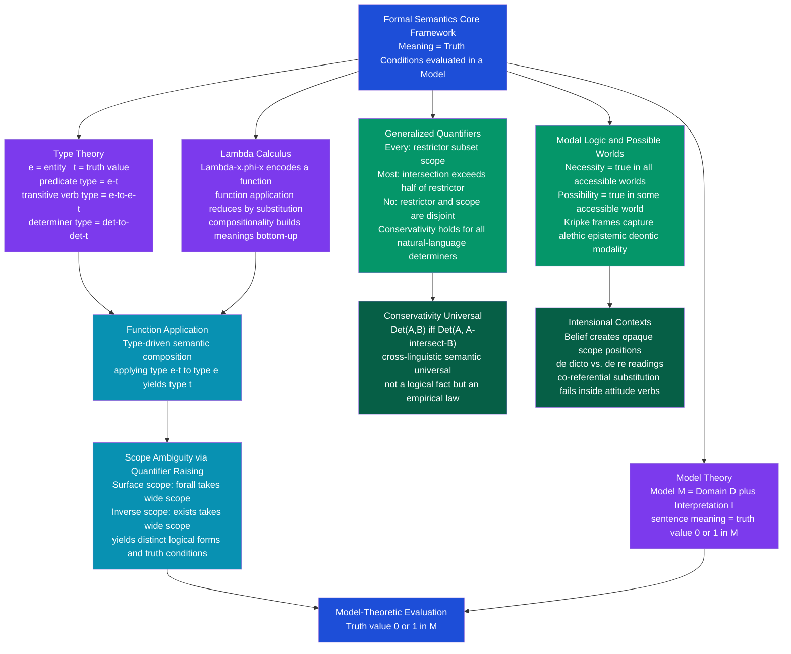

> [!abstract] TL;DR
> Formal semantics translates natural language sentences into logical representations that can be rigorously evaluated against a model; its foundation — Frege's insight that meaning is truth conditions, formalized by Tarski's model theory and extended by Montague's 1970 grammar — shows that any natural language expression can be given a precise compositional interpretation using lambda calculus and higher-order type theory, making natural language as formally tractable as predicate logic.

---

## Intuition

**Analogy:** Imagine a contract that must be evaluated by a judge who knows nothing about the parties — only the facts in evidence. The contract's meaning is exactly the set of situations in which its terms are satisfied. A clause that reads "The vendor shall deliver goods within 30 days of payment" is not vague intention; it is a precise conditional: given a payment event, a delivery deadline is asserted, and the clause is *true* or *false* for any specific transaction on record. You understand the clause when you can identify which transactions satisfy it and which do not — nothing more, nothing less.

Formal semantics applies this contractual precision to all of language. Every declarative sentence has *truth conditions* — the precise circumstances under which it is true. "The cat sat on the mat" is true in exactly those situations where there is a unique contextually relevant cat, a unique mat, and the cat bears the SAT-ON relation to the mat. To understand the sentence is to know what evidence would satisfy it.

What makes this powerful is *compositionality*: you do not need a separate truth-condition entry for every sentence in the language. Because sentences are built from parts according to syntactic rules, their meanings are also built from parts according to semantic rules. Lambda calculus is the mathematical language for expressing those rules; type theory is the system that checks whether the rules are applied correctly; model theory is the apparatus that evaluates the result.

---

## How It Works

The pipeline from sentence to truth value has four stages: syntactic parse producing a Logical Form, type assignment to each word, compositional lambda-reduction driven by type matching, and model-theoretic evaluation in a domain.



---

## Key Concepts

### Secondary Level

**What formal semantics does.** Natural language is productive: a competent speaker can understand sentences they have never encountered before. This is only possible if sentence meanings are *computed* from smaller parts by rules, not memorized as a lookup table. Formal semantics formalizes these computation rules. The central claim is that the meaning of a sentence is its *truth conditions* — the set of situations in which it is true. You fully understand "The cat sat on the mat" when you can identify every situation in which the sentence is true (there is a cat, there is a mat, the cat is on the mat) and every situation in which it is false.

**Models and extensions.** A *model* M is a pair consisting of a domain D (a set of entities) and an interpretation function I that assigns semantic values to words. Every common noun and intransitive verb has as its semantic value the *set of domain individuals* to which it applies — this set is called its *extension*. "Student" has as its extension all the students in D; "tall" has as its extension all the tall individuals. Proper nouns denote individual constants; sentences denote truth values.

**Boolean connectives.** Once atomic sentences have truth conditions, complex sentences inherit theirs compositionally through logical connectives:

| English expression | Logical form | Condition for truth |
|-------------------|-------------|-------------------|
| Alice is a student and tall | student(a) ∧ tall(a) | both conjuncts are true |
| Alice is a student or a teacher | student(a) ∨ teacher(a) | at least one disjunct is true |
| Alice is not a student | ¬student(a) | student(a) is false |
| If Alice is a student, she studies | student(a) → study(a) | not (student true and study false) |

**Quantifiers in plain terms.** Determiners like "every," "some," and "no" combine predicates into quantified claims. "Every student is tall" asserts that the tallness predicate holds of every individual for which the student predicate holds. "Some student is tall" asserts that at least one individual satisfies both predicates. "No student is tall" asserts that there is no individual satisfying both simultaneously. These are the basic cases; formal semantics extends this apparatus to handle "most," "few," and all other natural language determiners in a unified framework.

**Predicates and selectional restrictions.** Words impose constraints on what they can sensibly combine with, and those constraints are semantic. "The stone grieved" is anomalous not because the grammar forbids it — the syntax is perfectly well-formed — but because *grieve* requires its subject to be an animate entity. Formal semantics encodes such constraints as *selectional restrictions*: type requirements that filter out semantically ill-formed combinations before evaluation.

---

### Undergraduate Level

**Type theory as a combinatorial filter.** The semantic type of an expression specifies both what it denotes and what it can combine with. The primitive types are **e** (entity) and **t** (truth value). All other types are function types: ⟨α, β⟩ denotes a function from type-α expressions to type-β expressions. The types of the main syntactic categories are:

| Syntactic category | Semantic type | Example |
|-------------------|--------------|---------|
| Proper noun | e | "Alice" |
| Common noun / intransitive verb | ⟨e, t⟩ | "student", "tall" |
| Transitive verb | ⟨e, ⟨e, t⟩⟩ | "saw", "read" |
| Determiner | ⟨⟨e, t⟩, ⟨⟨e, t⟩, t⟩⟩ | "every", "some", "most" |
| Sentence | t | "Alice is a student" |

Type-checking enforces compositionality: to apply a function of type ⟨α, β⟩ to an argument, the argument must be of type α. "Every" has type ⟨⟨e, t⟩, ⟨⟨e, t⟩, t⟩⟩ — it takes two predicates of type ⟨e, t⟩ and returns a truth value. Applying "every" to a proper noun would be a type error, correctly predicting that "every Alice" is semantically ill-formed.

**Lambda calculus: meanings as functions.** Lambda notation expresses meanings as explicit functions. The term λx.student(x) denotes a function that takes any entity x and returns the truth value of "x is a student." This is the semantic value of the word "student." Function application reduces by substitution:

```
(λx.student(x))(alice) = student(alice)   ← TRUE if alice is in [[student]]^M
```

Adjective-noun composition builds a new predicate by intersection:

```
tall student = λx.(tall(x) ∧ student(x))
```

Transitive verbs are *curried* functions — they take their arguments one at a time:

```
saw = λy.λx.saw(x, y)
```

Applying "saw" first to the object "carol" gives the VP meaning:

```
(λy.λx.saw(x, y))(carol) = λx.saw(x, carol)    ← "saw Carol" as a predicate over subjects
```

Applying the resulting VP predicate to the subject "alice" gives the sentence meaning:

```
(λx.saw(x, carol))(alice) = saw(alice, carol)   ← TRUE iff (alice, carol) ∈ [[saw]]^M
```

The full composition of "Alice saw Carol" proceeds bottom-up, driven entirely by type matching.

**Montague Grammar: natural language = formal language.** Richard Montague's 1970 paper "The Proper Treatment of Quantification in Ordinary English" (PTQ) argued that natural language can be given a compositional model-theoretic semantics with the same precision as formal logic — there is no principled difference between interpreting English and interpreting the predicate calculus. Every expression of English can be assigned a type and a denotation, and the meaning of any complex expression is computed mechanically from the meanings of its parts.

The radical consequence: NL compositionality is not a metaphor or an approximation. It is exact. The same lambda calculus that interprets formal programs interprets natural language sentences. Montague used Church's *simple theory of types* as his metalanguage, extended with intensions (functions from possible worlds to extensions) to handle modality and attitude verbs. This framework became the foundation of the entire formal semantics tradition.

**Generalized quantifiers (Barwise and Cooper 1981).** First-order logic handles "every" and "some" through ∀ and ∃, but this apparatus cannot express "most," "few," "more than half," or "exactly three." The generalized quantifier framework resolves this by treating determiners as *relations between sets*:

| Determiner | Set-theoretic definition | Example |
|-----------|------------------------|---------|
| EVERY | [[EVERY]](A, B) iff A ⊆ B | "Every student passed" iff STUDENT ⊆ PASSED |
| SOME | [[SOME]](A, B) iff A ∩ B ≠ ∅ | "Some student passed" iff at least one student is in PASSED |
| NO | [[NO]](A, B) iff A ∩ B = ∅ | "No student passed" iff STUDENT and PASSED are disjoint |
| MOST | [[MOST]](A, B) iff \|A ∩ B\| > \|A\|/2 | "Most students passed" iff over half of STUDENT is in PASSED |
| EXACTLY THREE | [[EXACTLY-THREE]](A, B) iff \|A ∩ B\| = 3 | "Exactly three students passed" |

**Conservativity** is the key cross-linguistic universal: for every natural language determiner, `Det(A, B) ↔ Det(A, A ∩ B)`. "Every student passed" is equivalent to "Every student is a passing student" — the truth of the sentence depends only on whether all members of A are in B, never on individuals outside A. This holds for every documented natural language determiner and is a prediction of the generalized quantifier framework.

**Scope ambiguity and Quantifier Raising (QR).** "Every student read a book" has two distinct interpretations that differ in which quantifier takes *wide scope*:

- **Surface scope (∀ ≫ ∃):** For every student x, there exists a (possibly different) book y such that x read y. Different students may have read different books.
  `∀x. student(x) → ∃y. book(y) ∧ read(x, y)`

- **Inverse scope (∃ ≫ ∀):** There exists a single book y such that every student x read that very book.
  `∃y. book(y) ∧ ∀x. student(x) → read(x, y)`

Both readings arise from the same surface string. The standard account uses *Quantifier Raising* (QR): at the level of *Logical Form* (LF), quantifier phrases are covertly moved to scope positions above or below each other. Different LF structures yield different truth conditions. The surface-scope reading is the default in neutral prosody; inverse scope typically requires contrastive stress or contextual support.

**Presupposition.** Not all semantic content is asserted — some is *presupposed*. Presuppositions are background conditions that must hold for a sentence to have a truth value. "John stopped smoking" presupposes John smoked previously; if he never smoked, the sentence has a *presupposition failure* rather than a truth value. Key triggers include definite descriptions ("the F" presupposes a unique F exists), factive verbs ("Mary knows that P" presupposes P is true), change-of-state verbs, and cleft constructions. Presuppositions are distinguished from regular entailments by their behavior under negation: "John did not stop smoking" still presupposes that John smoked.

---

### Graduate Level

**Montague's intensional type theory.** Montague extended simple type theory with *possible worlds* to capture the full range of natural language. Every expression has both an *extension* (its value at the actual world) and an *intension* (a function from possible worlds to extensions). The intension of "unicorn" maps each world to the set of unicorns in that world; the actual-world extension is empty, but the intension is non-trivial — it is what makes "John is looking for a unicorn" (de dicto reading) true even though no unicorns exist. John wants his search to satisfy the intension, not find something in the empty actual-world extension.

Intensional type theory is necessary for any expression evaluated at a world other than the actual one. The operator `^` forms the intension of an expression (the *up* operator); `∨` forces an intension to yield its extension at the current world (the *down* operator). Attitude verbs like "believes" and "wants" are defined over intensions, which is why they block the free substitution of co-referential expressions.

**Modal logic and Kripke semantics in detail.** A *Kripke model* is a triple M = ⟨W, R, V⟩ where W is a set of possible worlds, R is a binary *accessibility relation* on W, and V is a valuation assigning truth values to atomic formulas at each world. The modal operators are interpreted:

- `M, w ⊨ □φ` (necessity) iff for all w' such that wRw', `M, w' ⊨ φ`
- `M, w ⊨ ◇φ` (possibility) iff there exists w' such that wRw' and `M, w' ⊨ φ`

Different constraints on R yield different modal logics:
- **Alethic necessity** (K45, S5): R = logical/metaphysical possibility; "Necessarily, bachelors are unmarried" is true in all worlds because the truth is analytic
- **Epistemic necessity** (S4): R = worlds compatible with an agent's knowledge; "It is known that P" is true at w iff P is true at all worlds epistemically accessible from w
- **Deontic necessity** (KD): R = deontically ideal worlds; "It ought to be that P" is true at w iff P is true at all normatively ideal worlds accessible from w

**De dicto vs. de re.** "Mary wants to marry a doctor" is systematically ambiguous:

- **De dicto** (of what is said): Mary wants the property *married-to-a-doctor* to be instantiated — no specific doctor is in view. The quantifier stays inside the scope of "wants":
  `want(Mary, ^[∃x. doctor(x) ∧ marry(Mary, x)])`

- **De re** (of the thing): There is a specific individual d who is a doctor, and Mary wants to marry d. The quantifier takes scope outside "wants":
  `∃x. doctor(x) ∧ want(Mary, ^[marry(Mary, x)])`

On the de re reading, the specific doctor exists in the actual world and Mary may not even know he is a doctor. On the de dicto reading, any doctor would do. The distinction requires quantifiers to take scope either inside or outside intensional operators — a core challenge for the syntax-semantics interface.

**Attitude verbs and substitution failure.** The intensional logic explanation of why co-referential substitution fails inside belief contexts: "Lois Lane believes that Superman can fly" does not entail "Lois Lane believes that Clark Kent can fly," even though Superman = Clark Kent. The sentence is evaluated at Lois's *doxastic* worlds — worlds compatible with everything she believes. In those worlds, Superman and Clark Kent are distinct individuals (she doesn't know they are the same person). The Kripkean analysis adds that proper names are rigid designators — they refer to the same individual across all worlds — so the substitution failure is not a failure of reference per se but a consequence of evaluating the embedded clause at non-actual worlds where the epistemic agent's beliefs separate what she knows from what is actually the case.

**Conservativity: proof and significance.** The conservativity constraint states that for any natural language determiner Det and predicate sets A and B: `Det(A, B) ↔ Det(A, A ∩ B)`. Proof for EVERY: EVERY(A, B) iff A ⊆ B iff A ⊆ A ∩ B (since any a ∈ A that is also in B is in A ∩ B) iff EVERY(A, A ∩ B). Intuitively: whether "every student passed" is true depends only on the students, not on whether other non-students also passed.

A non-conservative determiner EVNOT where EVNOT(A, B) iff B ⊆ complement(A) ("every non-student passed") would violate conservativity because you would need to check individuals outside A to evaluate the claim. The fact that no natural language has such a determiner — despite being logically coherent — is a deep semantic universal. Competing explanations include the *processing efficiency hypothesis* (conservative quantifiers require checking only the restrictor set, reducing computational load) and the *learnability hypothesis* (non-conservative quantifiers would require checking an unbounded set of individuals and would be unlearnable from positive evidence alone).

**Limits of first-order logic for natural language.** Natural language systematically requires resources beyond the expressive power of first-order logic:

1. **Proportionality quantifiers**: "Most students passed" — expressed as |STUDENT ∩ PASSED| > |STUDENT|/2 — requires counting, unavailable in FOL.
2. **Plurals and cumulative quantification**: "Three boys lifted two pianos" has a cumulative reading (three boys collectively lifted two pianos, perhaps collaboratively) that requires plural logic.
3. **Reciprocals**: "The students saw each other" requires quantification over pairs of individuals within the restrictor set.
4. **Comparatives**: "More students passed than failed" requires cardinality comparison unavailable in FOL.
5. **Intensional identity criteria**: "The president of the club is a different person every year" — the role picks out distinct individuals across time, requiring intensional objects.

These cases motivate the full intensional higher-order type theory of Montague and subsequent frameworks: Dynamic Predicate Logic (Groenendijk and Stokhof 1991), Discourse Representation Theory (Kamp 1981), Dependent Type Semantics (Bekki 2014), and Compositional DRS with presupposition (Van der Sandt 1992).

**Dynamic semantics and anaphora.** Static compositional semantics evaluates each sentence independently. But "A student walked in. She sat down" requires the pronoun "she" to pick up the indefinite "a student" introduced in the previous sentence — a cross-sentential dependency. Kamp's Discourse Representation Theory (DRT) and Groenendijk and Stokhof's Dynamic Predicate Logic (DPL) address this by treating sentence meanings not as truth conditions but as *context change potentials* — functions from input discourse contexts to output contexts. The indefinite "a student" does not merely assert existence; it introduces a *discourse referent* that remains accessible in subsequent sentences. This *existential disclosure* mechanism is the key departure from static semantics and is now a foundational part of the formal pragmatics toolkit.

---

## Python Demo

```python
"""
Formal Semantic Evaluator — Miniature Model-Theoretic Interpreter.

Model M has 5 individuals with one-place properties and a binary saw-relation.
The evaluator implements:
  (1) Atomic predicates: student, teacher, tall, short, saw
  (2) Boolean connectives: AND, OR, NOT, IMPLIES
  (3) Generalized quantifiers: EVERY, SOME, MOST, NO as set relations
  (4) 15 natural language sentences evaluated in M
  (5) Scope ambiguity: 'Every student saw a teacher' under both readings
Visualises truth values as a heatmap alongside the model property table.
"""

import numpy as np
import matplotlib.pyplot as plt

# ---------------------------------------------------------------------------
# 1. Model M = <D, I>: 5 entities with properties and a binary relation
# ---------------------------------------------------------------------------
WORLD = {
    "alice": {"student", "tall"},
    "bob":   {"student", "short"},
    "carol": {"teacher", "tall"},
    "dave":  {"teacher", "short"},
    "eve":   {"student", "tall"},
}
DOMAIN = list(WORLD.keys())

# Two-place predicate: set of (observer, observed) pairs
SAW = {
    ("alice", "carol"),
    ("bob",   "carol"),
    ("bob",   "dave"),
    ("carol", "alice"),
    ("carol", "bob"),
    ("dave",  "alice"),
    ("eve",   "carol"),
    ("eve",   "dave"),
}

# ---------------------------------------------------------------------------
# 2. Atomic predicates — type <e, t>: individual -> bool
# ---------------------------------------------------------------------------
def student(x): return "student" in WORLD.get(x, set())
def teacher(x): return "teacher" in WORLD.get(x, set())
def tall(x):    return "tall"    in WORLD.get(x, set())
def short(x):   return "short"   in WORLD.get(x, set())
def saw(x, y):  return (x, y) in SAW

# ---------------------------------------------------------------------------
# 3. Boolean connectives — propositional core
# ---------------------------------------------------------------------------
def AND(a, b):     return a and b
def OR(a, b):      return a or b
def NOT(a):        return not a
def IMPLIES(a, b): return (not a) or b   # material conditional

# ---------------------------------------------------------------------------
# 4. Generalized quantifiers — Det(A, B) as set-theoretic relations
# ---------------------------------------------------------------------------
def ext(pred):
    """Return the extension of a predicate: the set of satisfying individuals."""
    return {x for x in DOMAIN if pred(x)}

def EVERY(restr, scope):
    """EVERY A is B  iff  A ⊆ B"""
    return ext(restr).issubset(ext(scope))

def SOME(restr, scope):
    """SOME A is B  iff  A ∩ B ≠ ∅"""
    return len(ext(restr) & ext(scope)) > 0

def MOST(restr, scope):
    """MOST A are B  iff  |A ∩ B| > |A| / 2"""
    A = ext(restr)
    return len(A) > 0 and len(A & ext(scope)) > len(A) / 2

def NO(restr, scope):
    """NO A is B  iff  A ∩ B = ∅"""
    return len(ext(restr) & ext(scope)) == 0

# ---------------------------------------------------------------------------
# 5. Evaluate 15 natural-language sentences in model M
# ---------------------------------------------------------------------------
sentences = [
    # Atomic sentences
    ("alice is a student",                             student("alice")),
    ("carol is a teacher",                             teacher("carol")),
    ("dave is tall",                                   tall("dave")),
    ("bob is short",                                   short("bob")),
    # Propositional connectives
    ("alice is a student AND tall",                    AND(student("alice"), tall("alice"))),
    ("bob is tall OR short",                           OR(tall("bob"), short("bob"))),
    ("carol is a teacher IMPLIES carol is tall",       IMPLIES(teacher("carol"), tall("carol"))),
    ("NOT: every teacher is tall",                     NOT(EVERY(teacher, tall))),
    # Generalized quantifiers
    ("EVERY student is tall",                          EVERY(student, tall)),
    ("EVERY teacher is tall",                          EVERY(teacher, tall)),
    ("SOME student is short",                          SOME(student, short)),
    ("MOST students are tall",                         MOST(student, tall)),
    ("NO teacher is a student",                        NO(teacher, student)),
    ("NO student is tall",                             NO(student, tall)),
    # Relational (every teacher saw at least one student)
    ("EVERY teacher saw some student",
     all(IMPLIES(teacher(x),
                 any(student(y) and saw(x, y) for y in DOMAIN))
         for x in DOMAIN)),
]

# ---------------------------------------------------------------------------
# 6. Scope ambiguity — "Every student saw a teacher"
#
#   Surface scope (forall >> exists):
#     forall x: student(x) -> exists y: teacher(y) and saw(x, y)
#     Each student saw some teacher (possibly different ones)
#
#   Inverse scope (exists >> forall):
#     exists y: teacher(y) and forall x: student(x) -> saw(x, y)
#     One specific teacher was seen by every student
# ---------------------------------------------------------------------------
def surface_scope():
    """forall x. student(x) -> exists y. teacher(y) and saw(x, y)"""
    return all(
        IMPLIES(student(x), any(teacher(y) and saw(x, y) for y in DOMAIN))
        for x in DOMAIN
    )

def inverse_scope():
    """exists y. teacher(y) and forall x. student(x) -> saw(x, y)"""
    return any(
        teacher(y) and all(IMPLIES(student(x), saw(x, y)) for x in DOMAIN)
        for y in DOMAIN
    )

scope_sentences = [
    ("'Every student saw a teacher'  [surface: forall>exists]", surface_scope()),
    ("'Every student saw a teacher'  [inverse: exists>forall]", inverse_scope()),
]

all_sents = sentences + scope_sentences

# ---------------------------------------------------------------------------
# 7. Print to stdout
# ---------------------------------------------------------------------------
print("=== Model M ===")
for ind, props in sorted(WORLD.items()):
    print(f"  {ind:6s}: {sorted(props)}")
print(f"  SAW relation: {sorted(SAW)}\n")

print("=== Sentence Evaluation ===")
for sent, val in all_sents:
    marker = "TRUE " if val else "FALSE"
    print(f"  {marker}  |  {sent}")

print("\n=== Scope Ambiguity Note ===")
print("  Carol is in SAW for alice, bob, and eve (all three students).")
print("  So the inverse-scope reading is TRUE in this model.")
print("  Remove (alice, carol) from SAW: surface scope stays TRUE")
print("  (alice sees dave instead) but inverse scope becomes FALSE.")

# ---------------------------------------------------------------------------
# 8. Two-panel visualisation: heatmap + model property table
# ---------------------------------------------------------------------------
labels = [s[0] for s in all_sents]
values = np.array([[int(s[1])] for s in all_sents])

fig, axes = plt.subplots(1, 2, figsize=(16, 10),
                         gridspec_kw={"width_ratios": [3, 1]})

# Left panel: truth-value heatmap
ax_h = axes[0]
ax_h.imshow(values, cmap="RdYlGn", aspect="auto", vmin=0, vmax=1)
ax_h.set_xticks([0])
ax_h.set_xticklabels(["Truth value in M"], fontsize=10)
ax_h.set_yticks(range(len(labels)))
ax_h.set_yticklabels(labels, fontsize=8)
ax_h.set_title("Formal Semantic Evaluation\n"
               "Model M = {alice, bob, carol, dave, eve}", fontsize=11)
for i, (_, val) in enumerate(all_sents):
    ax_h.text(0, i, "TRUE" if val else "FALSE",
              ha="center", va="center", fontsize=8.5,
              color="white" if val else "black", fontweight="bold")
# Dashed line separating regular sentences from scope-ambiguity demo
ax_h.axhline(len(sentences) - 0.5, color="black", linewidth=1.5, linestyle="--")
ax_h.text(-0.48, len(sentences) + 0.15, "scope\nambiguity",
          fontsize=7.5, color="#92400e", rotation=90, va="bottom")

# Right panel: property table for model M
ax_t = axes[1]
ax_t.axis("off")
col_labels = ["entity", "student", "teacher", "tall", "short"]
table_data = [
    [ind,
     "+" if "student" in props else "-",
     "+" if "teacher" in props else "-",
     "+" if "tall"    in props else "-",
     "+" if "short"   in props else "-"]
    for ind, props in sorted(WORLD.items())
]
tbl = ax_t.table(cellText=table_data, colLabels=col_labels,
                 cellLoc="center", loc="center")
tbl.auto_set_font_size(False)
tbl.set_fontsize(9)
tbl.scale(1.2, 1.7)
ax_t.set_title("Toy Model M\n(one-place predicate extensions)", fontsize=10)

plt.tight_layout()
plt.savefig("formal_semantics_demo.png", dpi=120, bbox_inches="tight")
plt.show()
```

**Expected output (key results in this model):**

```
EVERY student is tall         → FALSE  (bob is short, so STUDENT ⊄ TALL)
EVERY teacher is tall         → FALSE  (dave is short, so TEACHER ⊄ TALL)
MOST students are tall        → TRUE   (alice and eve are tall; 2/3 > 0.5)
NO teacher is a student       → TRUE   (TEACHER ∩ STUDENT = ∅)
surface scope (forall>exists) → TRUE   (alice→carol, bob→carol|dave, eve→carol|dave)
inverse scope (exists>forall) → TRUE   (carol is seen by alice, bob, eve — all students)
```

The scope ambiguity demo produces a case where both readings are true. To see them diverge, remove `("alice", "carol")` from SAW and add `("alice", "dave")` instead — surface scope remains TRUE (each student still sees some teacher) but inverse scope becomes FALSE (carol is no longer seen by alice; dave is not seen by eve). This is the scenario that makes scope ambiguity linguistically real rather than academically hypothetical.

---

## Real-World Applications

> **Semantic parsing for question answering.** Systems like SEMPRE (Percy Liang, Stanford) and Facebook's DrQA translate natural language questions directly into formal logical queries over structured databases. "Who was the 44th US president born in?" becomes a lambda expression that is evaluated against a knowledge graph to return "Hawaii." The formal semantics pipeline — type assignment, lambda composition, model evaluation — is the direct theoretical precursor to every structured-retrieval QA system. Modern neuro-symbolic systems such as SPARQL-generating transformers inherit this pipeline.

> **Formal software verification.** Specification languages including TLA+, Alloy, and the Z notation use exactly the Kripke possible-worlds apparatus to specify concurrent system behavior. "Every request that is accepted will eventually be responded to" is a temporal modal formula; the model checker enumerates reachable states (possible worlds) and verifies the modal claim holds across all of them. Montague's apparatus, developed for natural language, is the same mathematics used to specify software correctness.

> **Contract and regulatory NLP.** Contract analysis systems (Kira Systems, LexPredict) parse legal language into formal logical representations: "The licensor shall provide written notice no fewer than 30 days prior to termination" is translated into a first-order constraint over event orderings and deadlines. Violations are detected by checking whether any contract in a corpus fails to satisfy the constraint — direct model-theoretic evaluation. This is formal semantics applied as a compliance tool.

> **Controlled natural languages for knowledge engineering.** Attempto Controlled English (ACE) and OWL Manchester Syntax are subsets of English designed so that every sentence has a unique, unambiguous formal semantic representation in first-order logic or description logic respectively. Domain experts write ontologies in near-English and the system automatically produces the formal representation — a direct application of the Montagovian programme of treating NL as a formal language.

---

## Common Pitfalls

- **Type errors in lambda application** — The most common mechanical error: applying a function of type ⟨e, t⟩ to an expression of type ⟨e, t⟩ rather than type e. Always draw the type tree before writing lambda terms; every function application must have a type argument match. "student(tall)" is the semantic equivalent of applying an adjective directly to a verb.

- **Confusing surface scope with the only reading** — Native-speaker intuitions strongly prefer the surface-scope reading (subject quantifier over object quantifier) in neutral prosody. Students deny inverse scope is available. Yet examples like "Every professor has two publications on their CV" (in a context where a university requires the same two specific publications for all faculty) show inverse scope is accessible. When a sentence can be paraphrased in both a "different for each" and a "one for all" version, scope ambiguity is present.

- **Treating conservativity as logically necessary** — Conservativity (`Det(A, B) ↔ Det(A, A ∩ B)`) is an *empirical* cross-linguistic universal, not a logical necessity. The quantifier EVNOT where EVNOT(A, B) iff B ⊆ complement(A) is logically coherent and non-conservative. Students who have internalized conservativity as a logical fact cannot ask the theoretically important question: why does no human language have a non-conservative determiner?

- **Missing de dicto vs. de re in production contexts** — In NLP sentence generation and legal language, failing to distinguish de dicto from de re readings leads to systematically ambiguous output. "The system must authenticate a user before granting access" should specify whether it means *any user who presents credentials* (de dicto: whoever satisfies the predicate) or *a specific provisioned user account* (de re: a specific entity). The formal distinction matters for security specifications.

- **Presupposition projection is not monotone** — "If John has a sister, his sister is a doctor" does not presuppose John has a sister (the conditional filters the presupposition). "Either John has no sister or his sister is a doctor" also neutralizes the presupposition. Students who learn that presuppositions "project through" negation incorrectly generalize this to all embeddings. Presupposition projection is governed by context-change potential semantics, not simple Boolean inheritance.

- **Intensional versus extensional contexts** — Inside "believes," "knows," or "wants," co-referential expressions cannot be freely substituted and material equivalence does not suffice to preserve truth. Students writing logical forms for belief reports often use the extensional identity `a = b` to justify substitution inside the belief operator — this is precisely the error that the sense/reference distinction (and intensional type theory) exists to block.

---

## Related Concepts

- [[Semantic_Theory]] — the broader landscape of semantic theories; formal semantics is the truth-conditional, model-theoretic wing; that note covers Frege's sense/reference and Russell's descriptions while this note develops the formal composition machinery in depth
- [[Syntactic_Theory_and_Generative_Grammar]] — syntax provides the Logical Form structures on which formal semantic composition operates; Quantifier Raising is a covert syntactic movement that produces the scope ambiguities formal semantics must resolve
- [[Lexical_Semantics]] — provides the atomic denotations (extensions of predicates) that compositional semantics builds over; the semantic types of lexical items are the inputs to lambda abstraction
- [[Cognitive_Semantics_and_Metaphor]] — the main competing tradition; rejects model-theoretic truth conditions and grounds meaning in embodied conceptual structure; the formal-vs-cognitive debate is the central division in linguistic semantics
- [[Discourse_Analysis]] — Discourse Representation Theory (DRT) extends formal compositional semantics above the sentence to handle anaphora resolution, presupposition accommodation, and cross-sentential scope
- [[Language_and_Thought]] — the psychological reality question: do speakers actually compute logical forms and evaluate truth conditions in real time, or are these post-hoc theoretical reconstructions divorced from cognitive process?
- [[Semiotics_and_Symbolic_Communication]] — Frege's sense/reference distinction and Saussure's signifier/signified are parallel answers to how symbols acquire meaning; formal semantics is the mathematical elaboration of the Fregean tradition
- [[Language_Model_Basics]] — neural language models are distributional machines that predict tokens; formal semantics asks whether truth-conditional content can be recovered from or grounded in distributional representations — an open frontier in NLP and AI alignment
- [[Mathematical_Logic_and_Set_Theory]] — model theory (Tarski) and set theory (ZFC) provide the mathematical foundations on which generalized quantifiers, possible worlds semantics, and higher-order type theory are constructed
- [[Language_and_the_Brain]] — neuroimaging implicates the left inferior frontal gyrus and posterior temporal cortex in compositional semantic computation; whether the brain computes structures analogous to lambda-reduction is an active cognitive neuroscience question

---

## Review Questions

### Secondary

1. A friend argues that "Every unicorn is purple" is meaningless because unicorns do not exist. From the standpoint of formal semantics, what is the truth value of this sentence, and why? What does this reveal about how formal semantics handles quantification over empty domains?
2. Explain in plain English why "Every student passed" and "Every student is a passing student" must always have the same truth value, no matter what the actual world contains. What semantic principle does this illustrate, and why is it significant that this holds for every natural language determiner?
3. "Maria believes that the morning star is a planet" is true. Maria does not know that the morning star is the same object as the evening star. Can you substitute "the evening star" for "the morning star" without changing the truth value? Why or why not?

### Undergraduate

1. Assign semantic types to each word in "Every teacher saw Carol" and draw the type-theoretic composition tree showing how function application produces a complete sentence meaning of type t. Write the lambda term for "every teacher" and carry out the full lambda reduction to a closed first-order formula.
2. The determiner MOST is defined as MOST(A, B) iff |A ∩ B| > |A|/2. Prove that MOST is conservative: MOST(A, B) ↔ MOST(A, A ∩ B). Then define a logically coherent but non-conservative determiner (call it EVOUT), and explain what it would mean linguistically. Why is the absence of EVOUT from all natural languages theoretically surprising from the standpoint of pure logic?
3. "Every linguist attended some workshop" is scope-ambiguous. Write the two logical forms using standard first-order notation. For each reading, describe a concrete academic scenario in which that reading is true and the other is false. Which reading is the default? Name two contextual or prosodic conditions that favor the inverse-scope reading.

### Graduate

1. In Montague's intensional type theory, the de dicto reading of "John is looking for a unicorn" is true even though no unicorns exist in the actual world. Sketch the Montagovian analysis using the intension operator (^) and explain precisely at what point in the composition the intensional shift occurs. Why does the first-order treatment (with a simple existential quantifier ranging over the actual domain) fail to capture this reading?
2. The conservativity constraint predicts that no natural language will have a determiner EVOUT defined as EVOUT(A, B) iff B ⊆ complement(A) — meaning "every non-A is B." Prove formally that EVOUT is non-conservative by showing Det(A, B) does not reduce to Det(A, A ∩ B). Then evaluate the two main theoretical explanations for the universality of conservativity: (a) the processing efficiency account and (b) the learnability from positive data account. Which provides a more principled explanation, and is conservativity better understood as a constraint on human cognition or on the structure of possible natural languages?
3. Dynamic Predicate Logic (DPL) and Discourse Representation Theory (DRT) handle inter-sentential anaphora by treating sentence meanings as context-change potentials rather than static truth conditions. Sketch the DRT representation (a Discourse Representation Structure) for the discourse "A student walked in. She sat down." Identify the *existential disclosure* mechanism that allows the indefinite "a student" to introduce a discourse referent accessible in the subsequent sentence. Explain why this mechanism requires abandoning static Montagovian semantics and what it tells us about the proper unit of semantic interpretation.

---

## Sources

- [Montague, R. (1973). "The Proper Treatment of Quantification in Ordinary English." In Hintikka, Moravcsik & Suppes (eds.), *Approaches to Natural Language*. Reidel.](https://link.springer.com/chapter/10.1007/978-94-010-2506-5_10)
- [Barwise, J. & Cooper, R. (1981). "Generalized Quantifiers and Natural Language." *Linguistics and Philosophy* 4(2), 159–219.](https://doi.org/10.1007/BF00350139)
- [Heim, I. & Kratzer, A. (1998). *Semantics in Generative Grammar*. Blackwell.](https://www.wiley.com/en-us/Semantics+in+Generative+Grammar-p-9780631197133) — the standard graduate textbook for this entire note
- [Dowty, D., Wall, R. E. & Peters, S. (1981). *Introduction to Montague Semantics*. Reidel.](https://link.springer.com/book/10.1007/978-94-009-9065-4) — the accessible entry into Montague's formalism
- [Kripke, S. (1980). *Naming and Necessity*. Harvard University Press.](https://www.hup.harvard.edu/books/9780674598461)
- [Gamut, L. T. F. (1991). *Logic, Language and Meaning*, Vol. 2: *Intensional Logic and Logical Grammar*. University of Chicago Press.](https://press.uchicago.edu/ucp/books/book/chicago/L/bo3616288.html)
- [Winter, Y. (2016). *Elements of Formal Semantics*. Edinburgh University Press.](https://edinburghuniversitypress.com/book-elements-of-formal-semantics.html)
- [Kamp, H. (1981). "A Theory of Truth and Semantic Representation." In Groenendijk, Janssen & Stokhof (eds.), *Formal Methods in the Study of Language*. Amsterdam.](https://link.springer.com/chapter/10.1007/978-94-009-9065-4) — foundational DRT paper
- [Groenendijk, J. & Stokhof, M. (1991). "Dynamic Predicate Logic." *Linguistics and Philosophy* 14(1), 39–100.](https://doi.org/10.1007/BF00628304)
- [Partee, B. H., ter Meulen, A. & Wall, R. (1990). *Mathematical Methods in Linguistics*. Kluwer.](https://link.springer.com/book/10.1007/978-94-009-2213-6) — type theory and lambda calculus for linguists
- [Liang, P. et al. (2011). "Learning Dependency-Based Compositional Semantics." *ACL 2011*.](https://aclanthology.org/P11-1060/) — formal semantics in the SEMPRE QA system

---

#Linguistics #SemanticsPragmatics #FormalSemantics
