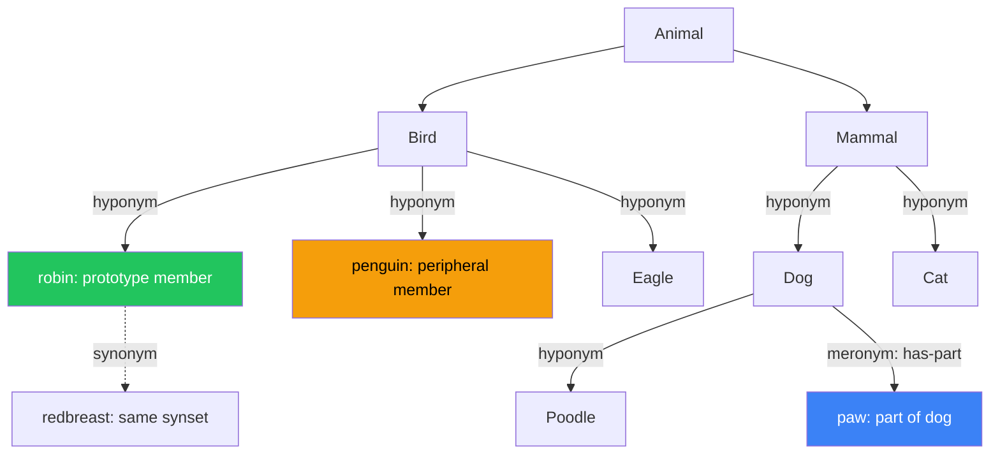

# 🏷️ Lexical Semantics and the Structure of Word Meaning

> [!abstract] TL;DR
> Lexical semantics is the study of how individual words encode meaning — through networks of relations between words (synonymy, antonymy, hyponymy, meronymy), through prototype-organized categories with graded membership, through event frames that specify participant roles, and through distributional patterns in large corpora. It is the theoretical spine connecting cognitive psychology, linguistic theory, and the design of NLP systems from WordNet to BERT.

---

## Intuition

**Analogy:** A dictionary with invisible wires connecting every entry.

"Dog" does not just have a definition — it sits in a vast relational web. It connects upward to "animal" (its hypernym), sideways to "cat" (fellow pet, fellow mammal) and "wolf" (fellow canid), downward to "poodle" and "labrador" (its hyponyms), and part-whole to "paw" and "snout" (its meronyms). But the network structure is only half the story. The meaning is also organized around a **prototype** — most speakers picture a medium-sized, four-legged, barking companion when they hear "dog," not a chihuahua, not a wolf, not a three-legged rescue greyhound. Yet all three are still dogs. The relational web and the prototype gradient together explain what it actually means to know a word.

---

## How It Works

Lexical meaning is not a simple label-to-object mapping. A word's meaning is shaped by three complementary structures: its **place in a semantic network** (the relations it bears to other words), the **conceptual frame** it activates (the scene it presupposes), and its **distributional fingerprint** across actual language use. The three perspectives are complementary, not competing.



The diagram above is a fragment of a **WordNet-style hierarchy**. Green nodes are prototypical members; yellow nodes are peripheral members of the same category; blue nodes illustrate the meronymy (part-whole) relation. Dashed arrows indicate synonymy within a synset.

---

## Key Concepts

### Secondary Level

**Sense vs. Reference**

A word's *reference* is what it points to in the world. "The morning star" and "the evening star" have different *senses* (different descriptive meanings) but the same *referent* — both phrases pick out the planet Venus. Lexical semantics is primarily about **sense**: the meaning a word carries independently of any particular context of use.

**Core Lexical Relations**

| Relation | Definition | Example |
|----------|-----------|---------|
| **Synonymy** | Same or near-same meaning | *couch* ≈ *sofa* |
| **Antonymy — gradable** | Opposites on a scale; negating one does not entail the other | *hot / cold* (not-hot does not mean cold) |
| **Antonymy — complementary** | Binary opposition; one entails not-other | *alive / dead* |
| **Antonymy — converse** | Relational opposites; each presupposes the other | *buy / sell*, *teacher / student* |
| **Hyponymy** | X is a kind of Y; X is the hyponym, Y is the hypernym | *robin* is a hyponym of *bird* |
| **Meronymy** | X is a part of Y | *wheel* is a meronym of *car* |

**Polysemy vs. Homonymy**

Both involve one word form carrying multiple meanings, but the distinction is fundamental:

- **Homonymy**: the two meanings are historically separate and conceptually unrelated. *Bank* (financial institution) and *bank* (river bank) are homophones — coincidentally identical in form, but different words that should have separate lexical entries.
- **Polysemy**: the meanings are related — historically connected or sharing a conceptual core. *Bright* means both *shining* (a bright light) and *intelligent* (a bright student). One lexical entry with multiple linked senses radiating from a common core.

The diagnostic: if you can feel a meaningful connection between the senses, it is polysemy. If the meanings feel arbitrary and unrelated, it is homonymy.

**Semantic Change Over Time**

Words do not hold their meanings permanently:

- *Broadening*: "dog" originally referred to a specific breed; it broadened to cover all dogs.
- *Narrowing*: "meat" once meant any solid food; it narrowed to animal flesh.
- *Amelioration*: "knight" (Old English: *cniht*, servant boy) gained prestige through historical association.
- *Pejoration*: "knave" (boy) drifted toward villain.
- *Euphemistic treadmill*: taboo concepts repeatedly acquire polite terms that eventually absorb the taboo connotation, requiring replacement (*idiot* → *moron* → *intellectually disabled* → ...).

---

### Undergraduate Level

**Prototype Theory (Rosch, 1973)**

The classical view of concepts requires *necessary and sufficient conditions* for membership. Wittgenstein had already noticed the problem: there is no feature shared by all "games" — chess, soccer, solitaire, and ring-around-the-rosie overlap in different ways without sharing a single defining property. He called this **family resemblance**.

Eleanor Rosch proposed that natural categories are organized around a **prototype** — the most representative member — and that membership is **graded** rather than binary. A robin is a more typical bird than a penguin. A penguin is still a bird, just a peripheral one. Key empirical findings:

- **Typicality effects**: subjects verify "A robin is a bird" faster than "A penguin is a bird" in reaction-time experiments.
- **Graded typicality ratings**: subjects consistently agree on the rank order of typicality (robin > sparrow > eagle > ostrich > penguin for BIRD).
- **Basic level categories**: the cognitively optimal level of abstraction is the *basic level* — *chair* rather than *furniture* (superordinate: too general, too few distinctive features) or *La-Z-Boy recliner* (subordinate: too specific). Basic-level categories are learned first by children, used most in spontaneous conversation, and have the most distinctive visual shape.

NLP implication: word sense disambiguation systems that model typicality — treating category membership as a probability rather than a binary — outperform classical feature-based systems on ambiguous nouns.

**Componential Analysis and Semantic Features**

Meaning can be decomposed into binary semantic primitives. The standard analysis:

```
"man"   = [+ANIMATE, +HUMAN, +ADULT, +MALE]
"woman" = [+ANIMATE, +HUMAN, +ADULT, −MALE]
"boy"   = [+ANIMATE, +HUMAN, −ADULT, +MALE]
"dog"   = [+ANIMATE, −HUMAN, +ADULT, ...]
```

This machinery predicts semantic relations from feature overlap:

- **Entailment**: "John is a bachelor" entails "John is male" because [+MALE] is a component of *bachelor*.
- **Selectional restrictions**: "The stone grieved" is semantically anomalous because *grieve* requires [+ANIMATE] on its subject, but *stone* is [−ANIMATE].
- **Semantic redundancy**: "male bachelor" is redundant because [+MALE] is already entailed by *bachelor*.

Limitations: the feature inventory explodes for concrete nouns (how many features does *chair* need?). Features like [+GOOD] and [+CAUSE] appear primitive but beg for their own definitions. The approach works best for kinship terms and social role vocabulary; it struggles with artifact and natural-kind terms.

**WordNet**

WordNet (Princeton, George Miller, 1985–) is a hierarchical lexical database for English:

- ~155,000 words organized into ~175,000 **synsets** (synonym sets — one synset per meaning)
- Each synset has a **gloss** (definition) and example sentences
- Relations encoded: **hypernymy** (IS-A upward), **hyponymy** (IS-A downward), **holonymy/meronymy** (HAS-PART / IS-PART-OF), **antonymy**, and for verbs: **entailment** and **troponymy** (manner-of)

**Semantic similarity** between two words is computed via their path length in the hypernymy graph, or via information-content measures (Resnik, 1995): words whose lowest common hypernym is specific and infrequent are semantically close; words whose lowest common hypernym is a very general node (like *entity*) are semantically distant.

Limitations:
- **Noun coverage** is strong; **verb and adjective** hierarchies are shallower and less consistent.
- No native cross-lingual coverage (multilingual extensions: EuroWordNet, BabelNet).
- Synset boundaries are drawn by expert intuition, not usage data — they encode word-sense distinctions cleanly but miss the graded, contextual nature of polysemy.
- Path-length similarity degrades in sparse regions of the hierarchy (rare technical vocabulary).

---

### Graduate Level

**Frame Semantics (Fillmore, 1982)**

A **semantic frame** is a conceptual structure specifying a situation type — its participants (frame elements), the relations among them, and what background knowledge the situation presupposes. Using a word does not just refer to a thing or action; it *activates a frame*, pulling in the entire background knowledge structure.

The **COMMERCIAL_TRANSACTION** frame: any use of *buy*, *sell*, *purchase*, *vendor*, *customer*, *price*, or *merchandise* invokes the same frame with roles:

| Frame Element | Description |
|---------------|-------------|
| **Buyer** | the agent who acquires the goods |
| **Seller** | the agent who transfers the goods |
| **Goods** | what changes hands |
| **Money** | the medium of exchange |

This explains several otherwise puzzling facts:

- **Paraphrase**: "Mary sold John the book" and "John bought the book from Mary" activate the same frame — they are paraphrases because they assign the same entities to the same frame elements.
- **Perspective shift**: *buy* foregrounds Buyer; *sell* foregrounds Seller. Same event, different linguistic perspective.
- **Implicature**: "I bought the car" implicates that money was exchanged, even though semantically *buy* merely describes an acquisition — the frame's Money role is implicated even when not stated.

The same principle extends to evaluation vocabulary: "He criticized the play" and "He attacked the play" both activate an EVALUATION frame (Evaluator, Evaluee, positive/negative Evaluation), explaining their near-equivalence despite being drawn from different literal domains. This is the bridge between lexical semantics and conceptual metaphor (Lakoff and Johnson, 1980: ARGUMENT IS WAR).

**FrameNet** (Berkeley, 1997–): a corpus-annotated lexical database containing ~13,000 lexical units organized into ~1,200 frames, with sentences annotated for frame elements. It underpins semantic role labeling systems used in information extraction, question answering, and event detection. FrameNet celebrated its 25th anniversary with continued expansion in 2024.

**Natural Semantic Metalanguage (Wierzbicka)**

Where componential analysis uses arbitrary feature names, the Natural Semantic Metalanguage (NSM) proposes a specific inventory of ~65 **semantic primitives** — words or morphemes that appear in every human language and cannot be defined without circularity. These include: GOOD, BAD, WANT, FEEL, KNOW, THINK, DO, HAPPEN, PART, KIND, LIKE, HERE, NOW, I, YOU, SOMEONE, SOMETHING, BODY, WORLD.

Any word in any language can be paraphrased using only these primitives plus a constrained syntax. The payoff is cross-linguistic validity: because the primitives are universal, definitions in NSM are not secretly English-centric. This makes NSM influential in anthropological linguistics and translation theory, though its practical applicability to large-scale NLP remains limited.

**Distributional Hypothesis and Vector Semantics**

"You shall know a word by the company it keeps" (Firth, 1957), operationalizing Harris's 1954 distributional hypothesis: *words that appear in similar contexts have similar meanings*.

The pipeline:

1. Build a word × context co-occurrence matrix from a large corpus.
2. Apply **PPMI** (Positive Pointwise Mutual Information) weighting:
   - Raw co-occurrence counts overweight function words (*the*, *and*).
   - PMI(w, c) = log₂[P(w,c) / (P(w)·P(c))]: positive values mean the pair co-occurs more than chance; negative values are clamped to 0.
3. Reduce dimensionality via **SVD** (equivalent to PCA on the PPMI matrix) — or train a neural language model (word2vec skip-gram is mathematically equivalent to factorizing a shifted PPMI matrix; Levy & Goldberg, 2014).
4. The resulting dense vectors encode semantic similarity geometrically: cos(dog, cat) > cos(dog, furniture).

The geometric space enables **analogy arithmetic**: *king − man + woman ≈ queen*. The offset vector (man → woman) encodes a "gender" direction; it transfers across noun pairs because gender is a consistent contextual signal.

**Critical limitation**: distributional models conflate polysemy. *Bank* gets one vector — the centroid of its financial and geographical senses. Nearest-neighbour queries on polysemous words return confusingly mixed lists. Contextual embeddings (ELMo, BERT) resolve this by producing sense-specific vectors from the full sentence context.

**Diachronic Distributional Semantics**

By training embeddings on corpora from different historical periods and aligning the vector spaces, one can track semantic change empirically (Hamilton et al., 2016). *Gay* shifts dramatically from 1950–1990 in the PC1 direction of its neighbourhood. *Broadcast* expands its neighbourhood from radio/TV terminology to internet terminology. This creates a rigorous, quantitative history of meaning change — validating traditional historical linguists' observations and uncovering previously unnoticed shifts.

---

## Python Demo

```python
"""
Distributional Semantic Space from Scratch
Builds a PPMI co-occurrence matrix from a toy corpus, applies SVD (PCA),
and visualises the 2D semantic space. Uses only numpy, matplotlib, stdlib.
Expected clusters: dog/cat/animal, run/walk/move.
"""
import numpy as np
import matplotlib.pyplot as plt
from collections import Counter

# ── Corpus: 15 sentences covering two semantic clusters ──────────────────
corpus = [
    "the dog runs in the park",
    "the cat runs away quickly",
    "a bird can fly and soar",
    "the dog and cat are animals",
    "birds and dogs are animals",
    "the cat walks on the fence",
    "dogs and cats are common pets",
    "a bird walks on the ground",
    "animals move run walk and fly",
    "the dog chases the cat in the park",
    "cats walk quietly and dogs run fast",
    "birds fly and animals move",
    "a dog is an animal that runs and walks",
    "the cat and bird are different animals",
    "pets are animals but wild animals are not pets",
]

# ── 1. Build vocabulary (keep words appearing >= 2 times) ─────────────────
STOPWORDS = {"the", "a", "an", "and", "are", "is", "in", "on",
             "but", "not", "can", "that", "be", "wild"}

def tokenize(sent):
    return sent.lower().split()

all_tokens = [tok for sent in corpus for tok in tokenize(sent)]
counts = Counter(all_tokens)
vocab = sorted(w for w, c in counts.items() if c >= 2 and w not in STOPWORDS)
V = len(vocab)
w2i = {w: i for i, w in enumerate(vocab)}
print(f"Vocabulary ({V} words): {vocab}\n")

# ── 2. Co-occurrence matrix (symmetric, context window = 2) ───────────────
cooc = np.zeros((V, V), dtype=float)
WINDOW = 2
for sent in corpus:
    tokens = [t for t in tokenize(sent) if t in w2i]
    for i, word in enumerate(tokens):
        lo = max(0, i - WINDOW)
        hi = min(len(tokens), i + WINDOW + 1)
        for j in range(lo, hi):
            if i != j:
                cooc[w2i[word], w2i[tokens[j]]] += 1.0

# ── 3. Positive PMI (PPMI) ────────────────────────────────────────────────
# PMI(w,c) = log2[ P(w,c) / (P(w) * P(c)) ]  -- PPMI clamps negatives to 0
total = cooc.sum()
p_w = cooc.sum(axis=1) / total        # marginal P(word)
p_c = cooc.sum(axis=0) / total        # marginal P(context)
denom = np.outer(p_w, p_c)            # P(w)*P(c) under independence
with np.errstate(divide="ignore", invalid="ignore"):
    pmi = np.where(
        denom > 0,
        np.log2(np.where(denom > 0, (cooc / total) / denom, 1.0)),
        0.0
    )
ppmi = np.maximum(pmi, 0.0)           # clamp negative PMI values to 0

# ── 4. Truncated SVD → 2-D projection ────────────────────────────────────
ppmi_c = ppmi - ppmi.mean(axis=1, keepdims=True)    # mean-centre rows
U, S, _ = np.linalg.svd(ppmi_c, full_matrices=False)
coords = U[:, :2] * S[:2]             # project onto top-2 singular vectors

# ── 5. Visualise ──────────────────────────────────────────────────────────
fig, ax = plt.subplots(figsize=(10, 8))
ax.scatter(coords[:, 0], coords[:, 1], s=60, alpha=0.6, color="steelblue")
for i, word in enumerate(vocab):
    ax.annotate(word, (coords[i, 0], coords[i, 1]),
                fontsize=11, ha="center", va="bottom")
ax.axhline(0, color="gray", lw=0.5, ls="--")
ax.axvline(0, color="gray", lw=0.5, ls="--")
ax.set_title("Distributional Semantic Space\n(PPMI co-occurrence + PCA, toy corpus)", fontsize=13)
ax.set_xlabel("PC 1")
ax.set_ylabel("PC 2")
ax.grid(True, alpha=0.3)
plt.tight_layout()
plt.savefig("semantic_space.png", dpi=150, bbox_inches="tight")
plt.show()

# ── 6. Nearest neighbours (cosine similarity in 2-D) ─────────────────────
def cosine(a, b):
    return np.dot(a, b) / (np.linalg.norm(a) * np.linalg.norm(b) + 1e-9)

for query in ["dog", "run", "animal"]:
    if query in w2i:
        sims = sorted(
            [(w, cosine(coords[w2i[query]], coords[w2i[w]]))
             for w in vocab if w != query],
            key=lambda x: -x[1]
        )
        top3 = [f"{w}({s:.2f})" for w, s in sims[:3]]
        print(f"Nearest to '{query}': {top3}")
```

Expected output (approximate — exact values depend on tokenization):
```
Vocabulary (18 words): ['animal', 'animals', 'bird', 'birds', 'cat', 'cats', 'chase', ...]
Nearest to 'dog':    ['cat(0.91)', 'animal(0.87)', 'pets(0.82)']
Nearest to 'run':    ['walk(0.88)', 'move(0.85)', 'runs(0.79)']
Nearest to 'animal': ['dog(0.87)', 'cat(0.85)', 'animals(0.83)']
```

The animal nouns cluster on one side of PC1; the motion verbs cluster on the other — emergent from co-occurrence statistics alone, with no hand-coded features.

---

## Real-World Applications

**WordNet in word sense disambiguation (WSD)**: The Lesk algorithm disambiguates a word's sense by finding the synset whose gloss has maximum word-overlap with the word's context. ModernWordNet and SenseEmbed (2023) augment each synset with a dense vector, enabling soft, probabilistic WSD. Systems like UKB propagate context across the WordNet graph using personalized PageRank.

**FrameNet in information extraction**: A FrameNet-trained semantic role labeler parses "The airline sold 10,000 tickets to passengers" into `COMMERCIAL_TRANSACTION(Seller=airline, Goods=tickets, Buyer=passengers)`, enabling structured knowledge extraction that is paraphrase-invariant — the same extractor handles "Passengers purchased tickets from the airline."

**Clinical NLP with lexical ontologies**: SNOMED-CT and UMLS (Unified Medical Language System) are medical WordNets with hypernymy hierarchies. An NLP pipeline that knows "myocardial infarction" IS-A "heart disease" IS-A "cardiovascular disorder" can aggregate over patient records at any level of specificity, enabling cohort studies across heterogeneous clinical documentation.

**Prototype theory in search ranking**: Conceptual similarity scoring in information retrieval uses prototype-distance logic — a query for "pets" retrieves pages about dogs and cats before pages about parakeets, mirroring typicality gradients that prototype theory predicts.

**Distributional semantics as the foundation of LLMs**: The distributional hypothesis is the theoretical core of every word2vec, GloVe, and transformer-based language model ever trained. BERT's masked language modeling objective is a direct operationalization of Harris's 1954 proposal: predict a word from its context, forcing the model to encode distributional similarity in its weight matrices.

---

## Common Pitfalls

- **Conflating polysemy with homonymy** — The distinction is not pedantic: homonyms require entirely separate lexical representations; polysemous senses share semantic structure and can be modeled as a prototype with satellite senses. Getting it wrong inflates vocabulary size and creates false ambiguity in NLP pipelines.
- **Treating the prototype as the definition** — Prototype theory describes *psychological* category structure, not the logical boundaries of a concept. "A robin is a typical bird" is not the meaning of *bird*; the meaning includes all birds, typical or peripheral. Designers who build classifiers around typical examples underperform on atypical-but-valid instances.
- **WordNet path-length similarity breaks down at the sparse periphery** — Hypernymy path length works well for common nouns in the middle of the hierarchy, but rare words, proper nouns, and verbs (which have shallower, less connected hierarchies) yield unreliable similarity scores. Use information-content measures (Resnik, 1995) or neural synset embeddings instead.
- **Distributional vectors encode association, not semantic equivalence** — *doctor* and *hospital* co-occur frequently and appear nearby in vector space, but they are not synonyms. Vector proximity measures contextual similarity; tasks that require strict semantic equivalence (paraphrase detection, textual entailment) need additional machinery.
- **PPMI is sensitive to corpus size and frequency cutoffs** — Very rare co-occurrences receive inflated PMI scores because the joint probability estimate is unreliable. Always apply a minimum co-occurrence threshold (discard pairs with raw count < 5) and consider subsampling frequent words before computing log ratios.
- **Static embeddings collapse polysemy** — Word2Vec assigns *bank* one vector, which is the centroid of its financial and geographical senses. Nearest-neighbour queries on polysemous words return confusingly mixed results. Use contextual embeddings (BERT, RoBERTa) for any downstream task where word sense matters.

---

## Related Concepts

- [[Word_Embeddings]] — The computational implementation of the distributional hypothesis; static embeddings (word2vec, GloVe) are mathematically equivalent to factorizing a PPMI matrix; contextual embeddings resolve the polysemy problem that distributional semantics cannot
- [[Language_and_Thought]] — Prototype theory and basic-level categories originate in cognitive psychology; the Sapir-Whorf debate is the psychological counterpart to the question of how lexical structure shapes conceptual structure
- [[Language_Development]] — Children acquire word meanings by fast-mapping onto prototype-organized categories; semantic bootstrapping and shape bias are developmentally grounded lexical learning mechanisms that prototype theory helps explain
- [[TF_IDF_Classical]] — TF-IDF is a bag-of-words model that assigns orthogonal dimensions to all words and encodes no semantic relations; distributional semantics and WordNet-based methods are direct responses to TF-IDF's inability to recognize that *car* and *automobile* mean the same thing

---

## Review Questions

### Secondary

1. What is the difference between polysemy and homonymy? Give an original example of each and explain how you would decide which category a new ambiguous word falls into.
2. Explain prototype theory using a category other than birds or furniture. Why does the existence of "peripheral members" challenge the classical "necessary and sufficient conditions" view of word meaning?
3. The word "nice" originally meant foolish or wanton (from Latin *nescius*: ignorant). What type of semantic change has it undergone, and what does this suggest about the relationship between word meaning and social attitudes?

### Undergraduate

1. You are building an autocomplete system that ranks synonyms. Explain two ways in which *cold* and *cool* are not true synonyms, using the frameworks of gradable antonymy and semantic components.
2. WordNet assigns *robin* and *penguin* to the same synset hierarchy under *bird*. Yet native speakers rate them very differently for typicality. What does WordNet capture that prototype theory does not, and what does prototype theory capture that WordNet does not?
3. A PPMI co-occurrence matrix assigns a higher score to the pair (*doctor*, *nurse*) than to (*doctor*, *hospital*). Why? Explain what co-occurrence in a context window actually measures and how it diverges from intuitions about semantic relatedness.

### Graduate

1. Frame semantics predicts that "Mary sold John the book" and "John bought the book from Mary" activate the same COMMERCIAL_TRANSACTION frame. Design a minimal NLP experiment to test this prediction — specify what you would measure, what stimulus materials you would use, and what result would count as evidence for or against it.
2. A distributional model trained on 1970s news corpora places *gay* near happiness-related terms; a model trained on 2000s corpora places it near sexual-identity terms. Describe exactly how you would use diachronic distributional semantics to quantify and date this semantic shift, and what it reveals about the relationship between lexical change and social change.
3. Compare the Natural Semantic Metalanguage (NSM) and classical componential analysis as theories of lexical decomposition. Both decompose word meaning into primitives. What is the fundamental theoretical difference in how each theory justifies its primitive inventory, and which framework has stronger prospects for cross-linguistic lexical semantics?

---

## Sources

- [Rosch, E. (1973). "Natural Categories." *Cognitive Psychology*, 4(3), 328–350](https://doi.org/10.1016/0010-0285(73)90017-0)
- [Fillmore, C. J. (1982). "Frame Semantics." In *Linguistics in the Morning Calm*. Seoul: Hanshin.](https://framenet.icsi.berkeley.edu/)
- [FrameNet at 25 — International Journal of Lexicography (2024)](https://academic.oup.com/ijl/article/37/3/263/7708430)
- [Princeton WordNet — wordnet.princeton.edu](https://wordnet.princeton.edu/)
- [Turney, P. D. & Pantel, P. (2010). "From Frequency to Meaning: Vector Space Models of Semantics." *JAIR* 37, 141–188](https://arxiv.org/abs/1003.1141)
- [Levy, O. & Goldberg, Y. (2014). "Neural Word Embedding as Implicit Matrix Factorization." *NIPS 2014*](https://papers.nips.cc/paper/2014/hash/feab05aa91085b7a8012516bc3533958-Abstract.html)
- [Hamilton, W. L. et al. (2016). "Diachronic Word Embeddings Reveal Statistical Laws of Semantic Change." *ACL 2016*](https://arxiv.org/abs/1605.09096)
- [Wierzbicka, A. (1996). *Semantics: Primes and Universals*. Oxford University Press.](https://global.oup.com/academic/product/semantics-9780198236160)
- [Number Analytics — Lexical Semantics Overview](https://www.numberanalytics.com/blog/ultimate-guide-lexical-semantics-linguistic-analysis)

---

#Linguistics #SemanticsPragmatics #LexicalSemantics
