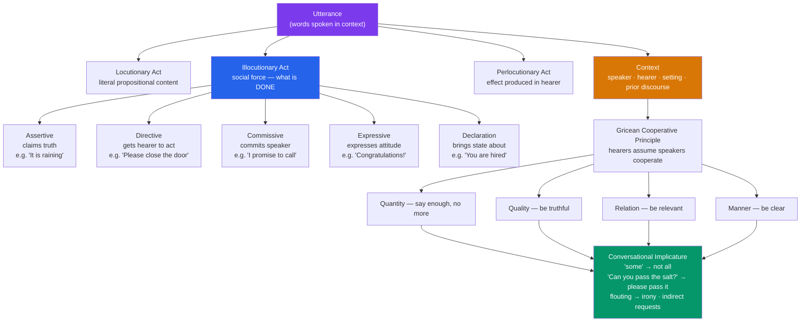

> [!abstract] TL;DR
> Pragmatics studies how context transforms the literal meaning of a sentence (semantics) into the full communicative meaning intended and understood; speech act theory shows that utterances do not merely describe reality but perform social actions — promising, commanding, declaring — while Grice's Cooperative Principle explains how hearers routinely infer far more than what is literally said.

---

## Intuition

**Analogy:** An engineer explaining why the house is cold says: "The boiler is off." That is her *locutionary act* — a factual description. But what she *does* with that sentence depends on context: said to a shivering guest, it is an indirect *request* to put on a jumper; said to a landlord, it is a *complaint* demanding repair; said to a plumber, it is a *directive* to fix the problem; said after a repair job is finished, it is a *report*. The sentence carries identical propositional content in all four cases, but the social action performed — what Austin called the *illocutionary force* — is entirely different each time.

Now add Grice. If you ask "Is there a good Italian restaurant nearby?" and your colleague says "There's a place on Fifth Avenue," you do not conclude they are evading the question. You infer — without being told — that the place is probably good and probably Italian. Nothing in the sentence entails this. You are computing a *conversational implicature*: reasoning about what a cooperative, relevant speaker would have said if the restaurant were terrible or non-Italian, and concluding they would have said something different. Pragmatics is the study of this inferential gap between sentence meaning and communicative use.

---

## How It Works



---

## Key Concepts

### Secondary Level

#### The Semantic–Pragmatic Gap

The sentence *The door is open* encodes the proposition OPEN(door). It is true or false depending on whether the door is, in fact, open. But in actual use this sentence more often functions as a directive — "Please close it" — than as a neutral observation. If someone says it while you are sitting near the door on a cold morning, you do not respond "Yes, I can see that." You get up and close it.

This is the central observation motivating pragmatics: the meaning people communicate routinely exceeds, and sometimes diverges from, the meaning sentences encode. Pragmatics studies the systematic principles governing this gap.

The gap has several sources:

- **Deixis** — words like *I*, *you*, *here*, *now*, *this*, and *yesterday* have no fixed referent; their reference shifts with the speaker, location, and time of utterance. "I left it here yesterday" communicates nothing without knowing who the speaker is, where they are, and which day they are speaking.
- **Reference resolution** — pronouns and definite noun phrases require contextual anchoring. In "Maria told Anna that *she* had won," whether *she* refers to Maria or Anna cannot be determined from the sentence alone.
- **Presupposition** — sentences carry background assumptions that are taken for granted rather than asserted. "Have you stopped cheating?" presupposes you were cheating. Denying the presupposition requires challenging the embedded assumption, not simply answering yes or no.
- **Implicature** — the most extensive source of the gap, covered in detail below.

#### Austin's Speech Act Theory

J.L. Austin, in his 1962 lectures *How to Do Things with Words*, began with an observation that had been largely invisible to philosophers of language: a large class of everyday utterances does not describe or report anything at all. "I now pronounce you husband and wife," said by an authorized officiant in the right ceremony, does not *describe* a marriage — it *performs* one. "I promise to return the book" does not report a mental state called a promise; it is the making of a promise.

Austin called these **performatives** and contrasted them with **constatives** (statements that describe and can be true or false). The distinction soon proved unstable — he recognized that even constatives *do* something (they assert, which is a social act) — but it opened the way for a more general theory.

Austin's mature framework distinguishes three acts happening simultaneously in every utterance:

| Act | Definition | Example (same sentence, different contexts) |
|-----|-----------|---------------------------------------------|
| **Locutionary act** | Uttering a sentence with its phonological and semantic content — the meaning in the linguistic sense | Saying "It is cold in here" with its English meaning |
| **Illocutionary act** | The social action performed *in* uttering — the *force* of the utterance | Depending on context: complaining, requesting, observing, threatening |
| **Perlocutionary act** | The effect the utterance *has on* the hearer — what it achieves | Hearer closes the window, feels guilty, is frightened |

The illocutionary act is the core concern of speech act theory. The same locutionary content can carry very different illocutionary forces, and identifying which force was intended is the central pragmatic task for hearers.

Austin also introduced **felicity conditions** — the social and contextual requirements an utterance must satisfy to count as a successful performance of its act. For "I sentence you to five years' imprisonment" to be a felicitous sentencing, the speaker must be a judge, the context must be a sentencing hearing, and the addressee must have been found guilty. Failure of any condition produces an **infelicity** — a misfired or abusive speech act, not a false one.

#### Grice's Cooperative Principle and Conversational Maxims

H.P. Grice (1975) asked: how can speakers communicate more than they literally say, and how can hearers reliably decode the additional content? His answer: communication works because both parties assume they are engaged in a cooperative exchange.

The **Cooperative Principle** states: *Make your conversational contribution such as is required, at the stage at which it occurs, by the accepted purpose or direction of the talk exchange in which you are engaged.*

Under this principle, Grice derived four **conversational maxims**:

| Maxim | Formulation | Violation example |
|-------|------------|------------------|
| **Quantity** | Be as informative as required; not more informative than required | Writing three pages when one sentence is asked for |
| **Quality** | Do not say what you believe to be false; do not assert without evidence | Claiming something you know to be untrue |
| **Relation** | Be relevant | Responding to "What time is it?" with a weather report |
| **Manner** | Avoid obscurity; avoid ambiguity; be brief; be orderly | Deliberately verbose or confusingly organized answer |

A **conversational implicature** arises when a speaker appears to violate a maxim — but the hearer, assuming cooperation, works out that the speaker must mean something additional that restores cooperation. "Can you pass the salt?" is a question about ability, but no cooperative diner answers "Yes, I can" and leaves the salt sitting. The hearer reasons: a cooperative person asking this in a dining context must be requesting the salt, not conducting a physical inventory.

**Flouting** a maxim is doing so overtly, in a way the hearer can detect, precisely to generate an implicature. A teacher who writes on a student's essay "Your handwriting is certainly distinctive" is flouting Quality and thereby implicating criticism of content through deliberate understatement.

**Scalar implicature** is one of the most studied types. Scales are ordered sets of expressions: *⟨some, many, most, all⟩*, *⟨possible, likely, certain⟩*, *⟨warm, hot⟩*. If a speaker uses a lower item on a scale when they could have used a stronger one, the hearer infers the stronger item is false. Saying "Some of the students passed" implicates "Not all of them passed" — because if all had passed, a cooperative speaker would have said so.

---

### Undergraduate Level

#### Searle's Taxonomy of Illocutionary Acts

John Searle (1969, 1979) systematized Austin's framework. He argued that all illocutionary acts can be classified into five basic types, distinguished by their **direction of fit** (whether words are measured against the world or the world is supposed to change to match the words) and the **psychological state** they express:

1. **Assertives** — commit the speaker to the truth of a proposition: claiming, hypothesizing, concluding, insisting. Direction of fit: *words-to-world*. "The meeting starts at nine."
2. **Directives** — attempt to get the hearer to do something: requesting, commanding, questioning, advising, begging. Direction of fit: *world-to-words*. "Please submit the report by Friday."
3. **Commissives** — commit the speaker to a future course of action: promising, offering, threatening, vowing, refusing. Direction of fit: *world-to-words*. "I will fix the bug before the release."
4. **Expressives** — express a psychological state with no direction of fit: thanking, apologizing, congratulating, condoling, welcoming. "I am sorry for your loss."
5. **Declarations** — bring about the state of affairs they describe, requiring an institutional context: marrying, firing, adjourning, naming, excommunicating. Direction of fit: *simultaneous both ways* — the utterance both fits the world and makes the world fit it. "I hereby open this session."

Searle distinguished **direct** speech acts (illocutionary force matches sentence type — an imperative form used as a directive) from **indirect** speech acts (form does not match force). "Could you please lower your voice?" is grammatically an interrogative about ability, but its illocutionary force is a polite directive. Indirect speech acts are ubiquitous in politeness systems because they give the hearer interpretive freedom and reduce face threat.

Each type has associated **sincerity conditions** (the psychological state the speaker must be in to perform the act sincerely — one must believe p to sincerely assert p) and **essential conditions** (the core commitment the act undertakes — an assertion commits the speaker to the truth of p; a promise commits to the future action).

#### Deixis and Reference Resolution

**Deixis** (from Greek *deiktikos*, "directly showing") is the linguistic encoding of context through expressions whose reference shifts with speaker, time, or place:

- **Person deixis**: *I*, *you*, *we* — reference shifts entirely with who is speaking and who is addressed.
- **Spatial deixis**: *here*, *there*, *this*, *that* — reference centers on the speaker's location. Distal/proximal contrasts vary typologically; some languages have three-way contrasts (near speaker / near hearer / away from both).
- **Temporal deixis**: *now*, *then*, *yesterday*, *tomorrow* — reference centers on the time of utterance.
- **Discourse deixis**: *the former*, *the following*, *as I said earlier* — reference to positions in the discourse itself.
- **Social deixis**: honorifics, T/V distinctions (*tu/vous* in French, *tú/usted* in Spanish), titles — encode social relationships directly in linguistic form.

The **deictic center** is the default reference point: typically the speaker's body, location, and time of utterance. Speakers can shift the deictic center imaginatively — "You enter the building, turn left, and you see it right in front of you" places the deictic center in the listener's imagined position.

**Anaphora** is a related but distinct phenomenon: a later expression (an **anaphor**) depends on an earlier expression (its **antecedent**) for its interpretation. "Maria saw a dog. It was barking loudly." The pronoun *it* refers back to the dog. Resolving anaphoric reference requires tracking discourse referents — the entities introduced and maintained across a discourse — which is a continuous pragmatic task during comprehension.

#### Relevance Theory (Sperber and Wilson)

Dan Sperber and Deirdre Wilson (1986, 1995) proposed a radically simplified alternative to Grice's four-maxim framework. Their claim: communication is governed by a single principle, not four.

The **Principle of Relevance** states: *Every ostensive stimulus conveys a presumption of its own optimal relevance* — every deliberate communicative act signals that interpreting it will yield sufficient cognitive effects for the effort required.

**Cognitive effects** are changes to the hearer's representation of the world generated by processing the utterance in context: new implications derived by combining the utterance with background knowledge; existing beliefs strengthened or contradicted. **Processing effort** is the computational work required to parse, interpret, and integrate the utterance.

*Optimal relevance* = maximum cognitive effects relative to minimum processing effort.

Hearers interpret utterances by following a **path of least effort**: testing the most accessible interpretations first, stopping when an interpretation achieves sufficient relevance. This single cognitive heuristic replaces Grice's four maxims and explains:

- *Implicature*: what is implicated is whatever must be inferred to recover optimal relevance.
- *Metaphor*: a loose use of a concept — not a special figure of speech but the same relevance-guided pragmatic process.
- *Irony*: an **echoic mention** — the speaker echoes a previous utterance or widely held belief with a dissociative attitude (contempt, amusement), allowing the hearer to recover the non-literal meaning.

Sperber and Wilson also distinguish **conceptual** from **procedural** meaning: some expressions (content words like *dog*, *hot*) encode concepts that contribute to propositional content; others (*therefore*, *however*, *well*, *but*) encode procedural instructions about how to process surrounding content without adding propositions — a distinction with implications for discourse coherence and dialogue management.

#### Politeness Theory (Brown and Levinson)

Penelope Brown and Stephen Levinson (1987) built a theory of politeness on a single core concept: **face**, borrowed from Goffman (1955).

**Face** is the public self-image every person claims. It has two aspects:
- **Positive face**: the desire to be liked, approved of, admired — the want to have one's wants wanted by others.
- **Negative face**: the desire to be unimpeded — the want for freedom of action and autonomy.

Many everyday acts threaten face. Requests threaten the hearer's negative face (imposing on their freedom). Criticisms threaten the hearer's positive face (challenging their self-image). Apologies and confessions threaten the speaker's own positive face. Brown and Levinson call these **face-threatening acts** (FTAs).

Rational social actors mitigate FTAs using politeness strategies, ranked by degree of redress offered:

| Strategy | Description | Example |
|----------|-------------|---------|
| Bald on-record | Do the FTA directly, no mitigation | "Give me that." (to an intimate, in an emergency) |
| Positive politeness | Attend to hearer's positive face; emphasize solidarity | "Could you help me out, mate?" |
| Negative politeness | Attend to hearer's negative face; minimize imposition, use deference | "I'm terribly sorry to bother you, but I wonder if you might possibly…" |
| Off-record (indirect) | Be deliberately vague or ambiguous so the FTA is deniable | "It's quite warm in here, isn't it?" (near a closed window) |
| Don't do the FTA | Avoid the act entirely | Saying nothing rather than asking for a favor |

The choice of strategy depends on three social variables: the **power** differential between speaker and hearer (P), the **social distance** between them (D), and the **ranking of imposition** of the act (R). Politeness effort scales with P + D + R. In high-power-distance, socially distant, high-imposition situations, speakers invest maximally in negative politeness strategies.

---

### Graduate Level

#### The Semantics–Pragmatics Interface

The division between semantics and pragmatics maps loosely onto **sentence meaning** (the compositionally determined content of a linguistic form, context-invariant) versus **speaker meaning** (what a speaker communicates by using that form in a context). But the boundary is contested.

**Semantic minimalists** (Cappelen and Lepore 2005) hold that sentence meaning is a very thin, context-invariant propositional content; almost all contextual enrichment belongs to pragmatics. "She is ready" expresses a minimal, if gappy, proposition that gets fleshed out pragmatically.

**Contextualists** (Recanati 2004; Carston 2002) hold that pragmatic processes are involved in determining the **explicature** — the explicit content of the utterance — not just implicature. The sentence "I've had breakfast" does not literally say "I've had breakfast today before now," but that is the proposition it expresses in normal use; the contextual narrowing is constitutive of the explicit content, not merely an implicature layered on top.

**Radical pragmatics** (Atlas 2005) treats quantifier domain restriction, reference assignment, and many phenomena assigned to semantics as pragmatic inference processes, dissolving much of the formal-semantic machinery traditionally required.

The debate matters computationally: it determines where in an NLU pipeline to place which inference components, and how much of sentence meaning is compositional (tractable, rule-governed) versus inferential (context-dependent, world-knowledge-requiring).

#### The Rational Speech Act Framework

The **Rational Speech Act (RSA) model** (Frank and Goodman 2012; Goodman and Frank 2016) formalizes Gricean pragmatics using Bayesian inference. It derives scalar implicature, quantity implicature, and referential specificity from a single recursive probabilistic model with three agents:

**Literal listener L0** interprets an utterance using its semantic denotation and a prior over world states:

$$L_0(w \mid u) \;\propto\; \llbracket u \rrbracket(w) \cdot P(w)$$

**Pragmatic speaker S1** selects utterances to be informative given L0:

$$S_1(u \mid w) \;\propto\; \exp\!\bigl(\alpha \cdot \log L_0(w \mid u) - C(u)\bigr)$$

where α is a rationality parameter and C(u) is utterance cost.

**Pragmatic listener L1** inverts S1's reasoning:

$$L_1(w \mid u) \;\propto\; S_1(u \mid w) \cdot P(w)$$

Scalar implicature emerges naturally: L1("some") assigns lower probability to worlds where "all" is true than L0("some") does, because S1 would have used "all" in those worlds. The Python demo below implements this directly and shows the numerical values.

The RSA framework has been extended to **hyperbole** (Kao et al. 2014), **social goals and politeness** (Yoon et al. 2020), and **pragmatic evaluation of LLMs** (Ruis et al. 2022). It is the computational counterpart of the theoretical Gricean program: the same cooperative rationality assumption, expressed in Bayesian machinery.

#### Pragmatic Failure and Cross-Cultural Communication

**Pragmatic failure** (Thomas 1983) occurs when a speaker's pragmatic inference misfires — the hearer fails to recover the intended implicature, or recovers the wrong one. Thomas distinguishes two types:

- **Pragmalinguistic failure**: the speaker uses a pragmatic strategy conventional in their L1 but with a different pragmatic force in the L2 or target culture. A speaker from a high-context culture using extensive indirection in an environment expecting directness may be perceived as evasive, not polite.
- **Sociopragmatic failure**: the speaker holds different assumptions about what constitutes an appropriate speech act in a given context — different calibrations of imposition, social distance, or face-threat. Refusing a gift in a context where the host expects enthusiastic acceptance, or accepting immediately where polite initial refusal is expected, are sociopragmatic failures.

The distinction matters for language teaching: pragmalinguistic failure can be addressed by teaching form-function correspondences; sociopragmatic failure requires teaching the cultural norms that determine what *counts as* appropriate behavior — a deeper and less tractable pedagogical target.

**Sarcasm and irony** present a special challenge for pragmatic processing. Sarcasm is overt Quality flouting: "Oh, brilliant" said when something goes wrong exploits the hearer's recognition that the speaker cannot sincerely mean this in context. Detecting irony requires (a) recognizing that the literal content is contextually incongruous; (b) attributing to the speaker the intention to be recognized as departing from sincerity; (c) recovering the non-literal intended meaning (typically the opposite, or an ironic commentary on a situation). Sperber and Wilson's echoic account frames irony as the speaker echoing a voice (an expectation, a widely held belief, a previous utterance) with a dissociative attitude — the hearer must identify both the echoed content and the speaker's stance toward it.

---

## Python Demo

Implement the Rational Speech Act (RSA) model to simulate scalar implicature. The model derives *why* hearing "some" implies "not all": a pragmatically reasoning listener knows that a cooperative speaker who *meant* "all" would have chosen the word "all."

```python
import numpy as np
import matplotlib.pyplot as plt

np.random.seed(0)

# ── World states: how many of 5 items satisfy a predicate ────────────────────
# e.g. "How many of the 5 cookies did John eat?"
states   = np.array([0, 1, 2, 3, 4, 5])
n_states = len(states)

# ── Scalar utterances: none < some < most < all ───────────────────────────────
utterances = ["none", "some", "most", "all"]
n_utts     = len(utterances)

# ── Literal semantics [[u]](s): 1 if utterance u is true in world state s ─────
#   "none"  true only when 0 items satisfy the predicate
#   "some"  true when >= 1 item satisfies  (lower-bounded semantics, no upper bound)
#   "most"  true when >= 3 items satisfy (majority)
#   "all"   true only when all 5 items satisfy
literal_sem = np.array([
    [1, 0, 0, 0, 0, 0],   # none: only state 0
    [0, 1, 1, 1, 1, 1],   # some: states 1–5  (literal semantics: at least one)
    [0, 0, 0, 1, 1, 1],   # most: states 3–5
    [0, 0, 0, 0, 0, 1],   # all:  only state 5
], dtype=float)
# Shape: (n_utts, n_states)

# ── Uniform prior over world states ──────────────────────────────────────────
prior = np.ones(n_states) / n_states   # shape: (n_states,)

# ── L0 — Literal Listener: P(state | utterance) ∝ [[u]](s) * prior ──────────
L0        = literal_sem * prior[np.newaxis, :]        # (n_utts, n_states)
row_sums  = L0.sum(axis=1, keepdims=True)
row_sums  = np.where(row_sums == 0, 1.0, row_sums)
L0        = L0 / row_sums                             # normalized

# ── S1 — Pragmatic Speaker: P(utterance | state) ∝ L0(state | utterance)^alpha
# Speaker maximizes the probability the listener recovers the true world state.
# alpha > 1 makes the speaker increasingly deterministic (prefer most informative).
alpha  = 4.0

# L0 is (utt, state); we need (state, utt) to ask "given this state, which utt?"
L0_T   = L0.T                                  # (n_states, n_utts)
S1     = np.power(L0_T, alpha)                 # weight by informativeness^alpha
col_s  = S1.sum(axis=1, keepdims=True)
col_s  = np.where(col_s == 0, 1.0, col_s)
S1     = S1 / col_s                            # (n_states, n_utts), normalized

# ── L1 — Pragmatic Listener: P(state | utterance) ∝ S1(utterance | state) * prior
L1     = S1.T * prior[np.newaxis, :]           # (n_utts, n_states)
row_s1 = L1.sum(axis=1, keepdims=True)
row_s1 = np.where(row_s1 == 0, 1.0, row_s1)
L1     = L1 / row_s1                           # normalized


# ── Visualization ──────────────────────────────────────────────────────────────
def draw_heatmap(ax, matrix, row_labels, col_labels, title, cmap):
    im = ax.imshow(matrix, cmap=cmap, vmin=0, vmax=1, aspect='auto')
    ax.set_xticks(range(len(col_labels)))
    ax.set_xticklabels(col_labels, fontsize=10)
    ax.set_yticks(range(len(row_labels)))
    ax.set_yticklabels(row_labels, fontsize=10)
    ax.set_title(title, fontsize=10, fontweight='bold', pad=8)
    for i in range(matrix.shape[0]):
        for j in range(matrix.shape[1]):
            v = matrix[i, j]
            txt_color = 'white' if v > 0.55 else 'black'
            ax.text(j, i, f'{v:.2f}', ha='center', va='center',
                    fontsize=8.5, color=txt_color)
    return im

state_lbls = [f"{s}/5" for s in states]
fig, axes  = plt.subplots(1, 3, figsize=(17, 5))

im0 = draw_heatmap(axes[0], L0, utterances, state_lbls,
                   "L0 — Literal Listener\nP(state | word): semantics only", 'Purples')
axes[0].set_xlabel("World state (items true / 5)", fontsize=9)
axes[0].set_ylabel("Word heard", fontsize=9)
plt.colorbar(im0, ax=axes[0], shrink=0.78)

im1 = draw_heatmap(axes[1], S1, state_lbls, utterances,
                   f"S1 — Pragmatic Speaker (alpha={alpha})\n"
                   "P(word | state): chooses informative word", 'Oranges')
axes[1].set_xlabel("Word chosen", fontsize=9)
axes[1].set_ylabel("World state (items true / 5)", fontsize=9)
plt.colorbar(im1, ax=axes[1], shrink=0.78)

im2 = draw_heatmap(axes[2], L1, utterances, state_lbls,
                   "L1 — Pragmatic Listener\nP(state | word): scalar implicature recovered",
                   'Greens')
axes[2].set_xlabel("World state (items true / 5)", fontsize=9)
axes[2].set_ylabel("Word heard", fontsize=9)
plt.colorbar(im2, ax=axes[2], shrink=0.78)

plt.suptitle(
    "Rational Speech Act (RSA) Model — Scalar Implicature\n"
    "L0: 'some' includes state 5/5  |  L1: 'some' excludes state 5/5  (= not all)",
    fontsize=11, fontweight='bold')
plt.tight_layout()
plt.savefig('rsa_scalar_implicature.png', dpi=150, bbox_inches='tight')
plt.show()

# ── Print the key result ──────────────────────────────────────────────────────
some_idx = utterances.index("some")

print("Scalar implicature: P(state | 'some') compared across L0 and L1")
print(f"{'State':<12}{'L0 (literal)':<22}{'L1 (pragmatic)'}")
print("-" * 54)
for si, s in enumerate(states):
    marker = "  <-- 'all' state" if s == 5 else ""
    print(f"  {s}/5        {L0[some_idx, si]:.3f}                 "
          f"{L1[some_idx, si]:.3f}{marker}")

print(f"\nL0: P(5/5 | 'some') = {L0[some_idx, -1]:.3f}"
      f"  [literal: 'some' is true in the all-5 state]")
print(f"L1: P(5/5 | 'some') = {L1[some_idx, -1]:.3f}"
      f"  [pragmatic: near-zero — speaker would have said 'all']")
print("\nThis IS scalar implicature: a cooperative S1 who knew all 5 items were")
print("true would have said 'all'. Hearing 'some', the pragmatic listener L1")
print("infers the speaker did NOT know that, and so the 'all' state is ruled out.")
```

**What the output shows:**

- **L0 (purple)**: The literal listener distributes probability for "some" uniformly across states 1–5, including 5/5. Semantically, "some" just means *at least one* — it does not exclude *all*.
- **S1 (orange)**: When the true state is 5/5, the pragmatic speaker overwhelmingly prefers "all" over "some." For state 3/5, "most" is preferred. For state 1/5, "some" is the only true and informative option.
- **L1 (green)**: The pragmatic listener hearing "some" assigns near-zero probability to state 5/5 and concentrates mass on intermediate states 1–4. This is the scalar implicature: *some → not all*, derived purely from the assumption that a rational, cooperative speaker would have said "all" if the world state warranted it. No lexical rule encodes this — it is entirely an inference from cooperative rationality.

---

## Real-World Applications

> **Legal performatives and felicity conditions.** Contract law is an applied theory of speech acts. Offer and acceptance are illocutionary acts; a contract is formed when two commissives achieve mutual binding force. Courts adjudicate felicity conditions: was there an authorized agent? A proper institutional context? A genuine meeting of minds? Cases involving whether a CEO's statement "We will fulfill all orders" constitutes a legally binding commitment turn on exactly whether the preconditions for a commissive were satisfied — a pragmatic question with financial consequences in the hundreds of millions.

> **Voice assistants and the indirect speech act problem.** Siri, Alexa, and Google Assistant must solve indirect speech acts in real time. "It's getting cold in here" should map to the home-automation directive "raise the temperature" — but this requires knowing the speaker's location (living room, not outdoors), the presence of a controllable thermostat, and the cultural convention that comfort complaints are indirect requests. Failures here are pragmatic, not syntactic: the sentence is parsed correctly and its truth conditions understood; the illocutionary force is missed. This is why dialogue state tracking in conversational AI remains an active research problem.

> **Gricean implicature in clinical communication.** Doctors who say "There are some findings we should discuss" implicate something more serious than the literal content via Quantity flouting: a cooperative speaker who found nothing would have said so; flouting Quantity here communicates that the findings warrant discussion rather than simple reassurance. Studies of cancer disclosure show that the management of implicature — what is said, what is left unsaid, and at what pace the implicature is made explicit — is the primary driver of patient distress and trust, separate from the objective content of the diagnosis.

> **Politeness and face in software code review.** Code review has been studied as a pragmatic domain where reviewers must routinely produce FTAs — criticizing, correcting, rejecting code — in a professional context where both positive face (the author's competence) and negative face (their autonomy) are at stake. Studies (Bosu et al. 2017; Egelman et al. 2020) find that negative politeness strategies ("I wonder if you considered…", "This might be worth reconsidering") correlate with faster patch acceptance and lower conflict, while bald-on-record rejections increase turnover intent. Brown-Levinson predicts exactly this in high-D, asymmetric-P environments.

> **Scalar implicature in LLM alignment.** Whether large language models compute Gricean implicatures the way humans do is contested and consequential. Studies (Ruis et al. 2022; Hu et al. 2023) show that instruction-tuned LLMs recover some scalar implicatures — treating "some" as implicating "not all" — but fail on less frequent scales and on embedded implicatures. This matters for alignment: a model that interprets "some users prefer X" as meaning "not all users prefer X" will behave differently from one treating the quantifier literally. The RSA framework is being used both to benchmark and to improve pragmatic inference in LLMs.

---

## Common Pitfalls

- **Conflating implicature with entailment** — An entailment is part of the sentence's literal meaning and cannot be cancelled without contradiction: "John is a bachelor" entails "John is unmarried." An implicature *can* be cancelled without contradiction: "Some students passed — in fact, all of them did" is perfectly coherent. Forgetting this distinction leads to incorrect analyses of what a sentence semantically means versus what it pragmatically communicates.
- **Treating all indirect speech acts as polite** — Indirect form correlates with politeness in many contexts, but indirectness is not inherently polite. Sarcasm is indirect and maximally face-threatening. Vague threats ("It would be a shame if something happened to your business") are indirect but coercive. Indirectness is a face-management resource, not an automatic politeness signal.
- **Applying Grice's maxims as prescriptions** — The maxims describe what hearers *assume* about speakers in cooperative exchanges; they are not rules speakers consciously follow. In adversarial contexts (cross-examination, negotiation, propaganda), speakers strategically exploit the maxims, and hearers who know this adjust their inferences — which is why courtroom testimony is not interpreted with the same charity as casual conversation.
- **Ignoring felicity conditions in speech act analysis** — Identifying an utterance as a promise requires checking sincerity conditions (speaker intends to perform the act) and preparatory conditions (speaker believes the act is not already done; hearer wants it done). Counting "I'll kill you for that" between friends as a genuine threat misreads both the illocutionary force and the felicity conditions operating in the context.
- **Cross-cultural scalar scale assumptions** — Scalar implicature is robustly attested cross-linguistically, but scale membership is not universal. Languages differ in where they cut temperature, quantity, and probability scales; what counts as the "next item up" on a scale depends on lexical alternatives conventionally available in that language. RSA models assuming English-derived alternatives will make systematic errors when applied cross-linguistically.
- **Over-applying the Cooperative Principle to non-cooperative exchanges** — Not all communication is cooperative. Bullshitting (Frankfurt 2005), spin, and deception all work by exploiting the hearer's default assumption of cooperation while covertly violating it. The Cooperative Principle is the background against which deception operates — it explains *how* deception works — but it cannot itself detect deception. Pragmatic analysis of political language needs to account for strategic manipulation, not just cooperative inference.

---

## Related Concepts

- [[Discourse_Power_and_Identity]] — Hymes's SPEAKING model and Austin/Searle's speech acts are twin pillars of linguistic anthropology; critical discourse analysis examines how illocutionary force is stratified by power — who gets to successfully declare, command, or condemn in institutional settings is not merely a pragmatic question but a political one
- [[Language_and_Culture]] — Sapir-Whorf's linguistic relativity asks how semantic categories shape thought; pragmatics adds the dimension of how communicative norms themselves are culturally variable — what counts as a relevant, appropriate, or polite utterance differs systematically across speech communities in ways that parallel the cognitive effects of lexical categorization
- [[Signaling_Games]] — Grice's cooperative speaker-listener model is a game-theoretic sender-receiver relation; the RSA model is explicitly Bayesian game theory; Spence's education signaling shows how costly signals (analogous to pragmatically marked indirect forms) separate types in equilibrium, with the same logic as Grice's informativeness reasoning
- [[Language_and_Thought]] — Scalar implicature experiments (Noveck 2001; Papafragou and Musolino 2003) test whether children and adults differ in pragmatic inference, intersecting psycholinguistics with pragmatics; the debate about whether implicatures are computed online or post-semantically is a question about real-time cognitive processing
- [[Language_Development]] — Children acquire grammatical forms before pragmatic competence; Gricean maxims are mastered gradually through childhood; theory of mind — understanding that others have mental states distinct from one's own — is the cognitive prerequisite for computing speaker meaning from utterance meaning, making pragmatic development a window into social cognition
- [[Prosody_and_Suprasegmentals]] — Intonation is a major carrier of illocutionary force: the same string of words delivered with rising versus falling intonation can switch between question and assertion; sarcasm is frequently marked primarily through prosodic incongruity — the mismatch between lexical content and intonational contour is the cue that triggers the echoic interpretation
- [[Social_Influence_and_Conformity]] — Illocutionary directives and perlocutionary persuasion are the linguistic mechanisms of social influence; compliance-gaining strategies (foot-in-the-door, door-in-the-face) are pragmatic sequences that exploit Gricean quantity and consistency expectations across turns
- [[Attitudes_and_Persuasion]] — Perlocutionary acts aimed at attitude change sit at the intersection of pragmatics and social psychology; framing effects (Kahneman) and the elaboration likelihood model both depend on how an utterance's implicatures and presuppositions are processed relative to the hearer's existing belief commitments
- [[Semiotics_and_Symbolic_Communication]] — Peirce's index/icon/symbol trichotomy intersects with pragmatics through indexical meaning: deixis, honorifics, and register are all forms of indexical semiosis; the sign-vehicle/object/interpretant relationship is the semiotic framing of the sentence-meaning/speaker-meaning distinction that pragmatics is built on
- [[Language_Model_Basics]] — NLU systems that model only semantic content (predicate-argument structure, truth conditions) fail systematically on indirect speech acts, implicature, and politeness; pragmatics is the missing layer between syntactic-semantic parsing and communicative intent detection in dialogue systems and conversational AI

---

## Review Questions

### Secondary

1. A teacher says to a noisy class: "I'm sure you can all hear yourselves." Identify the locutionary, illocutionary, and perlocutionary acts in this utterance. What illocutionary force does the teacher intend, and why does it differ from the literal content?
2. A friend texts you "Are you free Saturday?" rather than "Please come to my party on Saturday." Using Searle's distinction between direct and indirect speech acts, explain what is happening and why indirect forms might be preferred here.
3. Grice says speakers follow a maxim of Quantity. Use this maxim to explain why hearing "I passed the test" implicates "I did not do brilliantly" in some contexts but not others — and show how adding "— in fact I came top" cancels the implicature without creating a contradiction.

### Undergraduate

1. Searle classifies illocutionary acts into five types (assertives, directives, commissives, expressives, declarations). Find two real utterances that resist clean classification and explain what the examples reveal about the relationship between sentence type, illocutionary force, and context. What would Searle say about these cases, and is his response satisfying?
2. Brown and Levinson's politeness theory claims universal applicability across cultures. Ide (1989) argues that Japanese politeness is organized around *wakimae* (socially expected discernment behavior) rather than face-threat mitigation, and that the individualist presuppositions of face theory are Western-specific. Construct the strongest version of each position. What empirical evidence could adjudicate the dispute, and what methodological challenges would collecting that evidence face?
3. The Cooperative Principle is a default assumption, not a law. In what kinds of communicative contexts does it break down, and what happens to implicature calculation when both parties know the default does not hold? Use courtroom cross-examination or political advertising as your context and be specific about which maxims are being exploited.

### Graduate

1. Cappelen and Lepore (semantic minimalists) hold that pragmatic enrichment does not affect the proposition *expressed* by a sentence — only what is *communicated*. Recanati (contextualist) holds that pragmatics contributes to the proposition expressed. Using three specific examples — quantifier domain restriction, "she is ready," and a context-dependent gradable adjective — show what is at stake empirically and theoretically. What would a fully compositional semantic account of these cases require, and at what theoretical cost?
2. The RSA model formalizes Gricean pragmatics as Bayesian inference. A psycholinguist objects: "RSA is a computational-level theory describing input-output relations but says nothing about the cognitive processes by which implicatures are computed in real time." Evaluate this objection: what is right about it, what is wrong, and what would a processing-level extension of RSA require — what additional experimental data would distinguish a processing RSA model from a purely competence-theoretic one?
3. Pragmatic failure in NLP systems — misidentifying illocutionary force, failing scalar implicatures, missing sarcasm — is studied through behavioral benchmarks. Design a benchmarking framework for evaluating pragmatic competence in LLMs that distinguishes among (a) scalar implicature, (b) indirect speech act identification, (c) presupposition projection, and (d) politeness-register interpretation. For each component, specify: what the minimal competence requirement is, what confounds with semantic competence must be controlled, and what existing dataset or elicitation paradigm you would adapt.

---

## Sources

- Austin, J.L. (1962). *How to Do Things with Words*. Oxford University Press.
- Searle, J.R. (1969). *Speech Acts: An Essay in the Philosophy of Language*. Cambridge University Press.
- Searle, J.R. (1979). *Expression and Meaning: Studies in the Theory of Speech Acts*. Cambridge University Press.
- Grice, H.P. (1975). Logic and conversation. In P. Cole & J. Morgan (Eds.), *Syntax and Semantics, Vol. 3: Speech Acts* (pp. 41–58). Academic Press.
- Sperber, D. & Wilson, D. (1986/1995). *Relevance: Communication and Cognition* (2nd ed.). Blackwell.
- Brown, P. & Levinson, S.C. (1987). *Politeness: Some Universals in Language Usage*. Cambridge University Press.
- Levinson, S.C. (1983). *Pragmatics*. Cambridge University Press.
- Frank, M.C. & Goodman, N.D. (2012). Predicting pragmatic reasoning in language games. *Science*, 336(6084), 998.
- Goodman, N.D. & Frank, M.C. (2016). Pragmatic language interpretation as probabilistic inference. *Trends in Cognitive Sciences*, 20(11), 818–829.
- Carston, R. (2002). *Thoughts and Utterances: The Pragmatics of Explicit Communication*. Blackwell.
- Thomas, J. (1983). Cross-cultural pragmatic failure. *Applied Linguistics*, 4(2), 91–112.
- Ide, S. (1989). Formal forms and discernment: Two neglected aspects of universals of linguistic politeness. *Multilingua*, 8(2–3), 223–248.
- Noveck, I.A. (2001). When children are more logical than adults: Experimental investigations of scalar implicature. *Cognition*, 78(2), 165–188.
- Yoon, E.J., Tessler, M.H., Goodman, N.D., & Frank, M.C. (2020). Polite speech emerges from competing social goals. *Open Mind*, 4, 71–87.
- Recanati, F. (2004). *Literal Meaning*. Cambridge University Press.
- Ruis, L., Andreas, J., Baroni, M., Bouchacourt, D., & Lake, B.M. (2022). A benchmark for systematic generalization in grounded language understanding. *NeurIPS 2022*.
- Frankfurt, H.G. (2005). *On Bullshit*. Princeton University Press.

---

#Linguistics #SemanticsPragmatics #Pragmatics #SpeechActs
