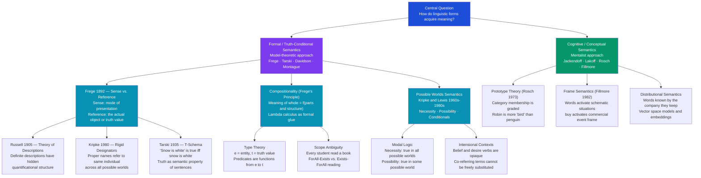

> [!abstract] TL;DR
> Semantics is the study of how linguistic expressions acquire meaning: truth-conditional semantics (Frege, Tarski, Davidson) holds that the meaning of a sentence is exactly the conditions under which it is true; Frege's sense/reference distinction explains why "the Morning Star" and "the Evening Star" mean different things despite naming the same planet; Frege's compositionality principle — the meaning of a complex expression is determined by the meanings of its parts and how they are combined — provides the generative engine that makes infinite sentences interpretable; possible worlds semantics (Kripke, Lewis) extends this to necessity, modality, and belief; and cognitive semantics (Jackendoff, Rosch, Fillmore) challenges the formal picture by arguing that meaning is grounded in mental structure rather than model-theoretic sets.

---

## Intuition

**Analogy:** Imagine a currency exchange display at an international airport. Each symbol on the board — €, $, £, ¥ — has a posted exchange rate: the rate specifies exactly what you receive in return, the precise real-world conditions under which that token "cashes out." That is truth-conditional semantics: the meaning of a sentence is the conditions under which it can be cashed in for real-world facts.

Now notice: the board might list both "DM 1.95583" and "€ 1.00" as equivalent exchanges — they yield exactly the same euros. Same *reference*, same real-world payout, but visibly different entries. To a 1998 traveler, one feels familiar and the other requires mental arithmetic. Same output, different *sense*. That is Frege's puzzle.

Finally, you work out the total cost of a three-country trip not by looking up "three-country trip" on the board — there is no such entry. You *compose* the individual rates by following arithmetic rules. The meaning of the whole is computed from the meanings of the parts via the rules of combination. That is compositionality, and it is what makes a finite vocabulary capable of generating infinitely many meaningful sentences.

---

## How It Works



---

## Key Concepts

### Secondary Level

**What semantics studies.** Semantics is the branch of linguistics concerned with *meaning*: the meanings of individual words (lexical semantics), the meanings of complex phrases and sentences (compositional semantics), and the relationships among meanings (synonymy, antonymy, entailment). A parallel discipline, pragmatics, studies how context shapes what speakers *mean* by an utterance — the two disciplines carve language at different joints.

**Denotation vs. connotation.** A word's *denotation* is its direct, literal reference — "dog" denotes the class of animals of the species *Canis lupus familiaris*. Its *connotation* is the emotional, cultural, or evaluative weight that accumulates around the word — "dog" connotes loyalty; "mutt" connotes inferior breeding. Formal semantics focuses on denotation; stylistics and sociolinguistics focus on connotation.

**Sense relations.** Words stand in systematic semantic relations:
- **Synonymy**: two words with the same (or very similar) meaning — *couch* and *sofa*. True synonymy is rare; most "synonyms" differ in register or connotation.
- **Antonymy**: opposition in meaning — *tall*/*short* (gradable), *alive*/*dead* (complementary), *buy*/*sell* (relational/converse).
- **Hyponymy / hyperonymy**: *robin* is a hyponym of *bird* (every robin is a bird); *bird* is the hypernym. This creates lexical hierarchies (taxonomies).
- **Polysemy**: one word form with multiple related senses — *bank* (financial institution) vs. *bank* (river bank); *run* (movement), *run* (operate a business), *run* (a run in a stocking).
- **Homonymy**: one word form with historically unrelated senses — *bat* (cricket) vs. *bat* (flying mammal).

**Lexical ambiguity and structural ambiguity.** Sentences can be ambiguous in two ways. *Lexically*: "I saw her duck" (duck the bird or duck the action?). *Structurally*: "I shot the man with the gun" — did I use a gun, or was the man carrying one? Structural ambiguity is evidence that sentence structure, not just word order, determines meaning, which points directly toward the need for compositional rules.

**Semantics vs. pragmatics: the line.** Semantics deals with what a sentence *conventionally* means independent of context. Pragmatics deals with what a speaker *means* in using a sentence on a particular occasion. "Can you pass the salt?" is semantically a yes/no question about ability; pragmatically it is a request. H. P. Grice's *conversational implicatures* explain how speakers convey more than the semantic content — "Some students passed" implicates *not all* via the maxim of quantity, even though "some" does not entail "not all" semantically.

---

### Undergraduate Level

**Truth-conditional semantics.** The dominant tradition in formal semantics holds that the meaning of a declarative sentence is its *truth conditions* — the conditions in the world that must obtain for the sentence to be true. You understand "The cat is on the mat" when you know what it would take for that sentence to be true, even if you do not know whether it actually is. This insight traces to Gottlob Frege and was given a rigorous technical foundation by Alfred Tarski (1935) with the **T-schema**:

> "Snow is white" is true *if and only if* snow is white.

The T-schema looks trivially obvious, but its power lies in what it implies: a complete theory of meaning for a language L is a theory that derives a T-sentence for every sentence in L, systematically relating syntactic structure to truth conditions. Donald Davidson (1967) argued that a Tarskian truth theory *just is* a theory of meaning for a natural language.

**Frege's puzzle: sense and reference.** Frege observed that "the Morning Star" and "the Evening Star" both refer to Venus — they have the same *Bedeutung* (reference). Yet the sentences "The Morning Star is the Evening Star" and "The Morning Star is the Morning Star" differ in cognitive value: the first is a substantive astronomical discovery; the second is trivially true. To explain this, Frege introduced a second dimension of meaning: *Sinn* (sense), the *mode of presentation* of the referent. "The Morning Star" presents Venus as the brightest celestial object visible just before dawn; "the Evening Star" presents it as the brightest object visible just after dusk. Same reference, different sense.

This generates Frege's puzzle about substitution. In an identity context ("A is B"), substituting co-referring expressions preserves truth: since Morning Star = Evening Star = Venus, "Venus is Venus" is trivially true and so is "The Morning Star is the Evening Star" (in the extensional world, both are true). But in propositional attitude contexts like "John believes that the Morning Star is a planet," substituting "Evening Star" for "Morning Star" may change truth value — John might not *know* they are the same object. This is the problem of *intensional* or *opaque* contexts.

**Russell's theory of descriptions.** Bertrand Russell (1905) challenged the idea that definite descriptions function as names. "The current king of France is bald" — if France has no king, is this sentence true, false, or something else? If it is a name-like term, it has no reference and the sentence is meaningless; yet it is perfectly well-formed. Russell argued that definite descriptions have hidden *quantificational structure*: "The F is G" really means:

> There exists an x such that F(x), and for all y, if F(y) then y = x, and G(x).

Symbolically: ∃x(F(x) ∧ ∀y(F(y) → y = x) ∧ G(x))

"The king of France is bald" is not meaningless — it is simply *false* (the existential fails). This dissolves the puzzle without invoking entities with no referent. It also means "the F" is not a referring expression at all; it is a quantifier phrase that disappears on analysis.

**Frege's principle of compositionality.** The most fundamental principle of formal semantics: the meaning of a complex expression is *determined* by the meanings of its constituent expressions and the way they are syntactically combined. This explains linguistic productivity — speakers can understand sentences they have never heard before because they can compute new meanings from familiar building blocks by applying familiar rules.

Technically, compositionality is implemented through **type theory**. Simple expressions have types: individual entities have type *e*, truth values have type *t*. A one-place predicate like "tall" is a function from entities to truth values, type ⟨e, t⟩. A two-place predicate like "read" is type ⟨e, ⟨e, t⟩⟩. Determiners like "every" and "some" are functions from predicates to predicates, type ⟨⟨e, t⟩, ⟨e, t⟩⟩, or in the generalized quantifier analysis, type ⟨⟨e, t⟩, t⟩.

Semantic composition is computed via **lambda calculus**. A predicate is written as a lambda-abstraction: *tall* = λx.tall(x) (a function that maps any entity x to the truth value of "x is tall"). Applying this function to a constant: (λx.tall(x))(alice) reduces to tall(alice). Complex predicates combine by functional application and lambda-reduction:

- "tall student" = λx.(student(x) ∧ tall(x))
- "every student" = λP.∀x(student(x) → P(x))
- "every student is tall" = (λP.∀x(student(x)→P(x)))(λx.tall(x)) = ∀x(student(x)→tall(x))

**Possible worlds semantics.** Saul Kripke (1963) and David Lewis (1968, 1973) formalized *modal logic* — the logic of necessity and possibility — in terms of possible worlds: complete, consistent ways the world might have been. A proposition (the meaning of a sentence) is identified with the *set of possible worlds* in which it is true:

- **Necessity** (□P): P is true in *all* possible worlds accessible from the actual world
- **Possibility** (◇P): P is true in *some* possible world accessible from the actual world

This immediately extends to *intensional* or *opaque* contexts created by attitude verbs ("believe," "want," "know"). "John believes that Paris is in Germany" is true iff Paris-is-in-Germany is true in all of John's *doxastic* worlds (worlds compatible with everything John believes) — even though it is false in the actual world. This is why you cannot substitute co-referring terms freely inside belief contexts.

Kripke also used possible worlds to rehabilitate proper names against the descriptivist tradition. Against Russell and Frege, Kripke argued that names are **rigid designators** — they refer to the same individual across *all* possible worlds. "Aristotle" refers to Aristotle even in worlds where he never tutored Alexander, never wrote the *Nicomachean Ethics*, and was a fisherman instead. Definite descriptions, by contrast, may refer to different individuals in different worlds: "the teacher of Alexander" designates whoever happens to teach Alexander in each world, which might not be Aristotle. This explains the felt difference between "Aristotle was a philosopher" (contingent) and "Aristotle was Aristotle" (necessary).

**Scope and quantification.** Some sentences are structurally ambiguous not because a word has two meanings but because two quantifiers can take *scope* over each other in different orders. The sentence "Every student read a book" has two readings:

- **Surface scope** (∀ > ∃): For every student x, there exists a book y such that x read y. Different students may have read different books. This is the most natural reading.
- **Inverse scope** (∃ > ∀): There exists a book y such that every student x read y. The same book is read by all. This reading is available but requires stress: "Every student read *a* particular book."

Symbolically:
- ∀x(student(x) → ∃y(book(y) ∧ read(x,y)))
- ∃y(book(y) ∧ ∀x(student(x) → read(x,y)))

Scope ambiguity is important evidence that semantic structure is not identical to surface syntactic structure. Formal theories require a level of **Logical Form** (LF) at which quantifiers are raised to their scope positions.

---

### Graduate Level

**Montague Grammar and the formal language analogy.** Richard Montague (1970, 1973) demonstrated that natural language semantics can be done with exactly the same precision as formal logic. His *Universal Grammar* (unrelated to Chomsky's) treated English as a formal language with explicit syntax and a compositional model-theoretic semantics. The key claim: there is no difference in kind between the semantics of formal and natural languages — both can be given a precise intensional logic using Church's simple theory of types extended with possible worlds (intensions as functions from worlds to extensions).

Montague grammar introduced **intensional type theory**: every expression has both an extension (its value in the actual world) and an intension (a function from worlds to extensions). The intension of a common noun like "unicorn" is a function that maps each world to the set of unicorns in that world — the actual-world extension is empty, but the intension is non-trivial and explains why "unicorns are mythical" is meaningful.

**Generalized quantifiers.** The classical first-order treatment of determiners is limited — it can handle "every," "some," and "no," but struggles with "most," "few," "more than half," and "the." Jon Barwise and Robin Cooper (1981) proposed that natural language determiners denote **generalized quantifiers**: relations between sets. On this analysis, "every" denotes the subset relation: "Every A is B" iff A ⊆ B. "Most" denotes the majority relation: "Most A are B" iff |A ∩ B| > |A| / 2. "No" denotes the disjointness relation: "No A is B" iff A ∩ B = ∅.

This immediately explains the **conservativity constraint**: all natural language determiners are conservative — "Every A is B" is always evaluated only over individuals in A, never over individuals outside A. "Every student passed" is equivalent to "Every student is a passing student." This is a semantic universal that holds across all known languages and has no explanation in first-order logic.

**Intensionality and substitution failures.** The substitutivity of identity fails in intensional contexts. "Necessarily, 9 > 7" is true. "The number of planets > 7" was (pre-Pluto) contingently true. Since 9 = the number of planets, we cannot substitute to get "Necessarily, the number of planets > 7" — that is false. This follows from Kripke's rigid designator account: "9" is a rigid designator (designates 9 in all worlds), but "the number of planets" is a non-rigid description (designates different numbers in different worlds).

This generates a celebrated quartet of distinctions that post-Kripkean semantics carefully separates:
- **Necessary / Contingent**: logical/metaphysical property of propositions
- **A priori / A posteriori**: epistemological property of knowledge

These are *orthogonal*, contra Kant. "Hesperus is Phosphorus" (Venus = Venus) is necessary (same object in all worlds) but a posteriori (required astronomical observation). "I am here now" is a priori (trivially verifiable without investigation) but contingent (you might have been elsewhere).

**Formal vs. cognitive semantics: the central debate.** The Montagovian tradition gives compositional, truth-conditional, model-theoretic accounts of meaning. Critics from the cognitive semantics tradition (George Lakoff, Ronald Langacker, Ray Jackendoff) object on three grounds:

1. **Psychological reality**: formal semantics gives no account of how meaning is *represented* in the mind. A truth-conditional theory identifies meaning with a set of possible worlds — but speakers do not manipulate sets of worlds; they manipulate conceptual structures.
2. **Embodiment**: meaning is grounded in bodily experience and sensorimotor schemas, not abstract formal objects. "Up" and "down" are meaningful because we have bodies that orient in gravity, not because there is a model-theoretic object.
3. **Prototype effects**: category membership is gradient (robins are better birds than penguins), but set-theoretic semantics treats all members equivalently.

Jackendoff's **Conceptual Semantics** proposes a middle path: semantic content is a level of *conceptual structure*, a mental representation that interfaces with both syntax (above) and perception/action systems (below). This preserves compositionality and cross-linguistic universals while being psychologically realistic.

**Frame semantics and lexical meaning.** Charles Fillmore's (1982) frame semantics holds that words cannot be understood in isolation — they always activate a rich knowledge structure (*frame*) that provides background conditions for their use. "Buy" activates a commercial event frame with participants (buyer, seller, goods, money) and a scenario (transfer of goods in exchange for money). The individual words "sell," "cost," "spend," and "charge" all activate the same frame but profile different aspects of it. This explains why knowing the logical form of a sentence is insufficient for understanding it — comprehension requires frame activation and background knowledge integration.

**Distributional semantics and the formal-computational bridge.** J. R. Firth's (1957) dictum "You shall know a word by the company it keeps" underpins distributional semantics: meaning can be approximated by distributional patterns in large corpora. Word embeddings (Word2Vec, GloVe) operationalize this as vectors in high-dimensional space — semantically similar words are geometrically proximate. This is not a theory of truth conditions but a *proxy* for semantic similarity. The tension between truth-conditional and distributional approaches structures much of computational semantics: large language models are distributional at heart, yet question-answering and entailment tasks require something closer to model-theoretic evaluation.

---

## Python Demo

```python
"""
Model-theoretic semantics evaluator.

Defines a toy possible world (a set of individuals with properties and
relations), then evaluates arbitrary predicate-logic formulas in that world.
Demonstrates compositionality: complex sentence meanings are computed
step-by-step from atomic pieces via connectives and quantifiers.
Also demonstrates scope ambiguity: the same English sentence yields two
distinct logical forms with different truth values in this world.
"""

import numpy as np
import matplotlib.pyplot as plt

# ---------------------------------------------------------------------------
# 1. The Toy World (Model M)
# ---------------------------------------------------------------------------
# Each individual maps to a set of one-place properties.
WORLD: dict[str, set[str]] = {
    "Alice": {"student", "tall"},
    "Bob":   {"teacher", "tall"},
    "Carol": {"student", "short"},
}
DOMAIN = list(WORLD.keys())
BOOKS = {"Book_A", "Book_B", "Book_C"}

# Two-place "read" relation: set of (individual, book) pairs.
READ: set[tuple[str, str]] = {
    ("Alice", "Book_A"),
    ("Carol", "Book_A"),
    ("Bob",   "Book_B"),
}

# ---------------------------------------------------------------------------
# 2. Atomic Predicates — type <e, t>: individual -> bool
# ---------------------------------------------------------------------------
def student(x: str) -> bool: return "student" in WORLD.get(x, set())
def teacher(x: str) -> bool: return "teacher" in WORLD.get(x, set())
def tall(x: str)    -> bool: return "tall"    in WORLD.get(x, set())
def short(x: str)   -> bool: return "short"   in WORLD.get(x, set())

# Two-place predicate — type <e, <e, t>>
def read(x: str, y: str) -> bool: return (x, y) in READ

# ---------------------------------------------------------------------------
# 3. Boolean Connectives (propositional logic)
# ---------------------------------------------------------------------------
def AND(a: bool, b: bool)     -> bool: return a and b
def OR(a: bool, b: bool)      -> bool: return a or b
def NOT(a: bool)               -> bool: return not a
def IMPLIES(a: bool, b: bool) -> bool: return (not a) or b  # material conditional

# ---------------------------------------------------------------------------
# 4. Quantifiers — take a restrictor and a scope predicate
#    EVERY: forall x. restrictor(x) -> scope(x)
#    SOME:  exists x. restrictor(x) and scope(x)
# ---------------------------------------------------------------------------
def EVERY(restrictor, scope) -> bool:
    return all(IMPLIES(restrictor(x), scope(x)) for x in DOMAIN)

def SOME(restrictor, scope) -> bool:
    return any(restrictor(x) and scope(x) for x in DOMAIN)

# ---------------------------------------------------------------------------
# 5. Compositional Evaluation — sentences built from atomic parts
# ---------------------------------------------------------------------------
sentences = [
    # Atomic
    ("Alice is a student",                                        student("Alice")),
    ("Bob is tall",                                               tall("Bob")),
    ("Carol is tall",                                             tall("Carol")),
    # Boolean composition
    ("Alice is a student AND tall",                               AND(student("Alice"), tall("Alice"))),
    ("Carol is NOT tall",                                         NOT(tall("Carol"))),
    ("Bob is a student OR a teacher",                             OR(student("Bob"), teacher("Bob"))),
    # Quantificational composition
    ("Every student is tall",                                     EVERY(student, tall)),
    ("Some teacher is short",                                     SOME(teacher, short)),
    ("Every teacher is tall",                                     EVERY(teacher, tall)),
    ("No student is a teacher",                                   NOT(SOME(student, teacher))),
    ("Every tall person is a student or teacher",
     EVERY(tall, lambda x: OR(student(x), teacher(x)))),
]

# ---------------------------------------------------------------------------
# 6. Scope Ambiguity — "Every student read a book"
#
#   Surface scope (forall > exists):
#     forall x: student(x) -> exists y: book y and read(x, y)
#     Each student may have read a *different* book.
#
#   Inverse scope (exists > forall):
#     exists y: book y and forall x: student(x) -> read(x, y)
#     There is ONE book that every student read.
# ---------------------------------------------------------------------------
def surface_scope() -> bool:
    """forall x. student(x) -> exists y in BOOKS. read(x, y)"""
    return all(
        IMPLIES(student(x), any(read(x, y) for y in BOOKS))
        for x in DOMAIN
    )

def inverse_scope() -> bool:
    """exists y in BOOKS. forall x. student(x) -> read(x, y)"""
    return any(
        all(IMPLIES(student(x), read(x, y)) for x in DOMAIN)
        for y in BOOKS
    )

scope_sentences = [
    ("'Every student read a book'  [surface: forAll-Exists]", surface_scope()),
    ("'Every student read a book'  [inverse: Exists-forAll]", inverse_scope()),
]

# ---------------------------------------------------------------------------
# 7. Print results
# ---------------------------------------------------------------------------
print("=== Toy World (Model M) ===")
for individual, props in WORLD.items():
    print(f"  {individual:6s}: {sorted(props)}")
print(f"  read: {sorted(READ)}\n")

print("=== Compositional Evaluation ===")
for sent, val in sentences:
    marker = "TRUE " if val else "FALSE"
    print(f"  {marker} | {sent}")

print("\n=== Scope Ambiguity Demo ===")
for sent, val in scope_sentences:
    marker = "TRUE " if val else "FALSE"
    print(f"  {marker} | {sent}")
print()
print("  Interpretation: Alice and Carol both read Book_A,")
print("  so 'some book was read by every student' (inverse) is TRUE.")
print("  The two scope readings give different truth values in some models.")

# ---------------------------------------------------------------------------
# 8. Visualize
# ---------------------------------------------------------------------------
all_sents = sentences + scope_sentences
labels = [s[0] for s in all_sents]
values = [int(s[1]) for s in all_sents]
colors = ["#2563eb" if v else "#dc2626" for v in values]

fig, ax = plt.subplots(figsize=(12, 7))
y_pos = np.arange(len(labels))
ax.barh(y_pos, values, color=colors, edgecolor="white", height=0.6)
ax.set_yticks(y_pos)
ax.set_yticklabels(labels, fontsize=8.5)
ax.set_xlim(-0.05, 1.5)
ax.set_xlabel("Truth Value in Model M")
ax.set_title("Compositional Model-Theoretic Semantics Evaluator\n"
             "(Blue = TRUE, Red = FALSE)", fontsize=11)

for i, (y, val) in enumerate(zip(y_pos, values)):
    ax.text(values[i] + 0.03, y, "TRUE" if val else "FALSE",
            va="center", fontsize=9, fontweight="bold",
            color="#2563eb" if val else "#dc2626")

# Mark scope ambiguity section
ax.axhline(y=len(sentences) - 0.5, color="gray", linestyle="--", linewidth=1)
ax.text(0.55, len(sentences) - 0.3, "scope ambiguity examples",
        fontsize=8, color="#92400e", style="italic")
for i in range(len(sentences), len(all_sents)):
    ax.get_yticklabels()[i].set_color("#92400e")

plt.tight_layout()
plt.savefig("semantic_theory_demo.png", dpi=120, bbox_inches="tight")
plt.show()
```

**Expected output (this particular model):**
```
Every student is tall → FALSE  (Carol is short)
Every teacher is tall → TRUE   (only Bob, who is tall)
surface scope         → TRUE   (Alice:Book_A, Carol:Book_A both covered)
inverse scope         → TRUE   (Book_A was read by both students)
```

The inverse scope is TRUE in this model because Book_A was read by all students — a coincidence that would disappear if Carol had read only Book_B. Scope ambiguity matters precisely when the two readings have *different* truth values.

---

## Real-World Applications

**Structured Query Languages (SQL) as applied truth-conditional semantics.** A SQL `WHERE` clause is a direct application of predicate-calculus truth conditions to a database model: `SELECT * FROM employees WHERE department = 'Engineering' AND salary > 90000` is semantically equivalent to ∀x(employee(x) ∧ dept(x, 'Engineering') ∧ salary(x) > 90000). The database is the model; SQL evaluation is model-theoretic interpretation. Every formal database query language — SQL, SPARQL, Datalog — is implicitly grounded in the compositional, truth-conditional semantics tradition.

**Legal drafting and contract language.** Legal instruments must have precise, context-independent truth conditions: a contract clause must specify exactly the conditions under which it applies, without pragmatic vagueness that a court might resolve differently than intended. The jurisprudential debate over "the spirit vs. the letter of the law" is a practical enactment of the semantics/pragmatics distinction — textualists (Scalia) prefer pure semantic interpretation; intentionalists appeal to speaker meaning and pragmatic enrichment.

**Semantic search and large language models.** Modern search (Google, Bing) and retrieval-augmented generation systems move beyond keyword matching to semantic similarity. Word embeddings and transformer representations operationalize distributional semantics: query and document are mapped to vectors, and cosine similarity approximates semantic relatedness. This is not truth-conditional semantics — LLMs do not evaluate truth conditions against a model — but it exploits the distributional correlate of semantic similarity. The gap between distributional similarity and model-theoretic truth is an active frontier in AI alignment: a model can generate text that is distributionally plausible but propositionally false.

**Automated theorem proving and formal verification.** Software verification systems (Coq, Lean, Isabelle) use exactly the compositional semantics of higher-order type theory. Programs are propositions; their types are logical specifications; proofs are programs (Curry-Howard correspondence). This makes Frege's original logical project — a fully formal language in which valid inference is mechanical — a practical engineering tool.

---

## Common Pitfalls

- **Confusing sense and reference.** Students often treat "the morning star" and "the evening star" as merely different descriptions of the same thing and miss that they have different *cognitive content*. The practical consequence: co-reference substitution is only valid in extensional contexts; inside belief, desire, or modal operators, substitution fails even for logically equivalent expressions.

- **Treating compositionality as trivial.** Compositionality seems obvious until you encounter quantifier scope, coercion (*"the bank was robbed"* — which bank, the semantic type of "bank" is underspecified), and intensional contexts. The principle is non-trivial to implement: getting the semantic types right and writing correct composition rules for even a fragment of English requires substantial formal machinery.

- **Confusing logical possibility with physical possibility.** Possible worlds semantics uses *logical* or *metaphysical* possibility, not physical or nomological possibility. "Water is not H₂O" is physically impossible but (on Kripke's account) also metaphysically impossible, since "water" rigidly designates the natural kind H₂O. But "there is a prime number between 14 and 16" is logically impossible. These notions are distinct.

- **Importing first-order logic limitations into natural language.** First-order logic cannot express "Most students passed" (requires counting beyond ∃ and ∀), "The same person who invented the internet also won a Nobel Prize" (binding across clauses), or intensional contexts. Natural language semantics routinely requires at least second-order or higher-order type theory.

- **Conflating distributional similarity with semantic identity.** Vector-space models capture statistical co-occurrence, which correlates with semantic relatedness but is not the same thing. "Doctor" and "patient" are distributionally similar (they co-occur frequently in the same contexts) but are near-antonyms in most semantic relations. Semantic similarity ≠ distributional proximity, especially for relational antonyms.

- **Ignoring presupposition.** Presuppositions are conditions that must be satisfied for a sentence to have a truth value at all (not merely to be true). "The king of France is bald" presupposes France has a king; "John stopped smoking" presupposes John smoked. Failed presuppositions yield utterances that are neither true nor false — a phenomenon truth-conditional semantics must handle with multi-valued logic or accommodation theory, and which purely two-valued systems handle badly.

---

## Related Concepts

- [[Language_and_Thought]] — the Sapir-Whorf hypothesis asks whether semantic categories in a language shape thought; this is the psychological face of the formal question of how meaning is represented
- [[Semiotics_and_Symbolic_Communication]] — Saussure's signifier/signified distinction is the structural-semiotic precursor to Frege's sense/reference; both ask how arbitrary signs acquire determinate content
- [[Language_and_Culture]] — linguistic relativity (Boroditsky) is an empirical test of whether semantic categories are universal (formal semantics) or culturally constructed
- [[Language_and_the_Brain]] — Wernicke's area is the neural substrate for lexical-semantic access; semantic composition engages left temporal and inferior frontal cortex; semantic dementia dissociates semantic memory from episodic
- [[Language_Model_Basics]] — n-gram and neural language models assign probabilities to word sequences; this is an operational, distributional approach to linguistic form whose relationship to truth-conditional meaning is a core open question in NLP
- [[Word_Embeddings]] — distributional word vectors (Word2Vec, GloVe) operationalize Firth's dictum "know a word by the company it keeps"; they approximate semantic similarity but not truth conditions
- [[Discourse_Power_and_Identity]] — Critical discourse analysis examines how semantic choices naturalize ideological positions; Barthes's myth theory is applied compositional semantics — second-order meaning built from first-order signs
- [[Language_Socialization_and_Acquisition]] — children acquire lexical semantics through fast-mapping and semantic bootstrapping; the order in which semantic categories are acquired reveals their cognitive complexity

---

## Review Questions

### Secondary

1. What is the difference between semantics and pragmatics? Give an example of a sentence where the semantic content and the pragmatic meaning diverge, and explain why.
2. A friend argues that "couch" and "sofa" are perfect synonyms because they refer to the same piece of furniture. What would a semanticist say is wrong with this claim, and what more precise vocabulary would they use?
3. "Flying planes can be dangerous." Identify two distinct interpretations of this sentence and state what type of ambiguity each represents.

### Undergraduate

1. Frege distinguishes the *sense* of an expression from its *reference*. Explain this distinction using the "Morning Star / Evening Star" example. Then explain why the distinction is necessary to account for the difference in cognitive value between "Hesperus is Hesperus" (trivially true) and "Hesperus is Phosphorus" (an empirical discovery).
2. Russell's theory of descriptions analyzes "The present king of France is bald" as a quantified formula rather than a subject-predicate sentence. Write out the full first-order logical translation. What is the truth value of the sentence under this analysis? Why does this avoid positing a non-existent entity as a subject?
3. "Every linguist has read a Chomsky book" is scope-ambiguous. Write the two logical forms using quantifier notation (∀, ∃) and explain which reading says that all linguists share *the same* book and which says they may have read *different* books. In a world where every linguist has read *Syntactic Structures* but some have also read *The Minimalist Program*, which reading is satisfied?

### Graduate

1. In Montague's intensional type theory, the intension of a predicate is a function from possible worlds to sets of individuals. How does this let us give truth conditions for "John seeks a unicorn" without committing to the existence of unicorns in the actual world? Compare this to a first-order treatment and identify specifically where the first-order analysis breaks down.
2. Barwise and Cooper's generalized quantifier analysis treats all natural language determiners as denoting relations between sets. Formulate the generalized quantifier semantics for "most" and "every," and prove that both determiners are conservative (i.e., Det(A, B) ↔ Det(A, A ∩ B)). Why is conservativity a *semantic universal* and what would it mean for the language-cognition interface if a natural language violated it?
3. Jackendoff's Conceptual Semantics and Montague Grammar both claim to give a compositional account of natural language meaning, but they differ sharply on what meanings *are*. What is the central ontological disagreement? Identify one empirical phenomenon (from prototype effects, polysemy, coercion, or embodiment) that poses a genuine challenge for the model-theoretic account and explain how a conceptual semanticist would address it. Is the challenge fatal, or can model-theoretic semantics accommodate it?

---

## Sources

- Frege, G. (1892). "Über Sinn und Bedeutung." *Zeitschrift für Philosophie und philosophische Kritik*, 100, 25–50. (Translated as "On Sense and Reference.")
- Russell, B. (1905). "On Denoting." *Mind*, 14(56), 479–493.
- Tarski, A. (1944). "The Semantic Conception of Truth." *Philosophy and Phenomenological Research*, 4(3), 341–376.
- Davidson, D. (1967). "Truth and Meaning." *Synthese*, 17(3), 304–323.
- Montague, R. (1973). "The Proper Treatment of Quantification in Ordinary English." In Hintikka, Moravcsik & Suppes (eds.), *Approaches to Natural Language*. Reidel.
- Kripke, S. (1980). *Naming and Necessity*. Harvard University Press.
- Lewis, D. (1986). *On the Plurality of Worlds*. Blackwell.
- Barwise, J. & Cooper, R. (1981). "Generalized Quantifiers and Natural Language." *Linguistics and Philosophy*, 4(2), 159–219.
- Heim, I. & Kratzer, A. (1998). *Semantics in Generative Grammar*. Blackwell. — the standard graduate textbook
- Jackendoff, R. (1990). *Semantic Structures*. MIT Press.
- Fillmore, C. (1982). "Frame Semantics." In *Linguistics in the Morning Calm*. Hanshin, Seoul.
- Rosch, E. (1973). "Natural Categories." *Cognitive Psychology*, 4(3), 328–350.
- Firth, J. R. (1957). "A Synopsis of Linguistic Theory, 1930–1955." *Studies in Linguistic Analysis*. Blackwell.
- Partee, B. (1995). "Lexical Semantics and Compositionality." In Gleitman & Liberman (eds.), *An Invitation to Cognitive Science*, Vol. 1 (2nd ed.). MIT Press.

---

#Linguistics #SemanticsPragmatics #Semantics
