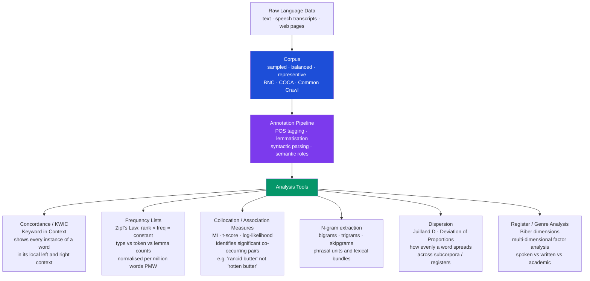

> [!abstract] TL;DR
> Corpus linguistics is the empirical, data-driven study of language through systematically collected large text and speech collections; it replaced introspective grammar with frequency evidence — revealing that language is overwhelmingly idiomatic, register-sensitive, and probabilistic — and now supplies the training data on which every modern NLP system runs.

---

## Intuition

**Analogy:** Before ecologists had satellite tracking and population surveys, they described animal behaviour from memory and anecdote — a few famous naturalists reporting what they happened to observe. When systematic field counts arrived, the picture transformed: species thought to be solitary turned out to be social; behaviours thought to be universal turned out to be regional variants. Corpus linguistics did the same thing to language study. Instead of a scholar's introspection about what sentences "feel" grammatical, you count actual utterances across millions of speakers — and the data overturns nearly every folk intuition about how language works.

Technically, a corpus is a principled, machine-readable collection of naturally occurring language, annotated for parts of speech and often for syntax and discourse. It provides the population-level frequency evidence that linguistic theory needs to move from plausibility to proof.

---

## How It Works



---

## Key Concepts

### Secondary Level

**What a corpus is — and what it is not.** A corpus is not just "a lot of text." It is a *principled* collection: sampled to be representative of a language variety, balanced across genres and registers, machine-readable, and documented with metadata. The British National Corpus (BNC — 100 million words, sampled 1985-1994) is 90% written, 10% spoken; the Corpus of Contemporary American English (COCA — over 1 billion words, 1990-present) spans fiction, magazine, newspaper, academic prose, and spoken language in roughly equal proportions.

**Type, token, lemma.** These three terms answer three different questions about "how many words?" A *token* is every individual word occurrence: "the cat sat on the mat" = 6 tokens. A *type* is a unique word form: 6 types (all different). The *type-token ratio (TTR)* — types divided by tokens — measures lexical diversity: a text that repeats few words (high redundancy) has a low TTR; a text that uses a wide vocabulary has a high TTR. Spoken conversation typically has lower TTR than academic prose; academic prose uses fewer distinct forms but repeats specialist terms. A *lemma* groups inflected forms under a headword: "run," "ran," "runs," "running" all belong to the lemma RUN.

**Zipf's law and frequency.** In any sufficiently large natural language corpus, word frequency follows a power law: the most frequent word appears roughly twice as often as the second most frequent, three times as often as the third, and so on — rank × frequency ≈ constant. In English, "the" accounts for roughly 7% of all tokens. The top 100 lemmas cover about 50% of all tokens; the top 1,000 cover about 80%. This means a small, closed vocabulary of function words (the, a, of, to, in) dominates any text, while the vast majority of meaning-bearing vocabulary is individually rare. Zipf's law explains why n-gram language models assign very low probability to most real sentences: most word sequences are hapax legomena (occurring only once).

**Frequency vs. normalised frequency.** Raw frequency is useless for comparing corpora of different sizes. A word that appears 500 times in a 10-million-word corpus is less frequent than one that appears 500 times in a 1-million-word corpus. The standard normalisation is *per million words (PMW)*: divide raw count by corpus size in words, then multiply by 1,000,000. Frequency of 50 PMW means the word appears on average 50 times in every million words of that register.

**Concordance lines (KWIC).** A concordance displays every instance of a search term in its immediate context — typically 40-50 characters of left and right co-text, sorted alphabetically or by frequency. Looking at 50 concordance lines for "rancid" immediately shows it collocates almost exclusively with "butter," "smell," and "fat" — not with "milk" or "cheese" even though those are equally dairy-related. This left/right patterning is the foundation of collocation analysis. Corpus tools like AntConc, Sketch Engine, and CQPweb are built around the concordance view.

---

### Undergraduate Level

**Collocation and association measures.** Two words *collocate* when they co-occur more often than chance. The simplest measure is raw co-occurrence frequency, but this favours high-frequency words (everything collocates frequently with "the"). Statistical association measures correct for marginal frequencies:

| Measure | Formula (sketch) | Bias | Best use |
|---|---|---|---|
| **MI (Mutual Information)** | log₂(P(x,y) / P(x)·P(y)) | Favours rare, specific pairs | finding lexically specific collocations — *phrasal verbs*, terminology |
| **t-score** | (f(x,y) − expected) / √f(x,y) | Favours frequent pairs | finding *core* collocations of high-frequency words |
| **Log-likelihood ratio (G²)** | 2 Σ O·log(O/E) | Balanced; robust at low counts | comparing across corpora of different sizes |
| **Dice coefficient** | 2·f(x,y) / (f(x) + f(y)) | Symmetric; good recall | bidirectional association strength |

MI tells you that "rancid" is strongly bound to "butter" (a very specific, rare pair); t-score tells you that "strong" is a core collocate of "coffee" (frequent but not rare). Both answers are correct — they describe different properties of the collocation space.

**Lexical bundles and phraseology.** Michael Hoey's theory of *lexical priming* (2005) argues that every word is "primed" for the company it tends to keep — its collocates, colligates (co-occurring grammatical categories), and semantic associations are stored as part of its mental representation. Language is not built from rules applied to isolated words; it is largely retrieved as pre-formed chunks. Francis and Sinclair's COBUILD project showed that up to 70% of English text can be analysed as multi-word units: fixed expressions, semi-fixed frames (*as far as I know*, *the fact that*, *it should be noted that*), and collocational sequences. This "phraseological" view of language directly contradicts the generative-grammar picture of a syntax engine assembling novel sentences from discrete atoms.

**Collostructions (Stefanowitsch & Gries, 2003).** Collostructional analysis applies collocation association measures not to word-word pairs but to verb-construction pairs. For any syntactic construction (e.g., the ditransitive *X gives Y Z*), you can ask: which verbs are attracted to this construction more than expected? The answer reveals the semantic heart of the construction. The ditransitive construction strongly attracts *give*, *offer*, *send*, *bring* — all verbs of caused possession — confirming that the construction itself encodes transfer semantics. Verbs like *cook* or *hit* are repelled. This provides quantitative evidence for Construction Grammar's claim that constructions have meaning.

**Register variation and the Biber dimensions.** Douglas Biber (1988) performed multi-dimensional analysis on ~1,000 texts from 23 genres using 67 linguistic features (tense distribution, nominalisation rate, hedging adverbs, passive voice frequency, co-ordination density, etc.). Factor analysis revealed six underlying *dimensions* of variation:

| Dimension | Pole A | Pole B |
|---|---|---|
| 1. Interactive vs. Informational | Spontaneous speech, private letters | Academic prose, official documents |
| 2. Narrative vs. Non-narrative | Fiction, oral narratives | News reportage, academic writing |
| 3. Explicit vs. Situation-dependent reference | Academic prose | Telephone conversations |
| 4. Overt persuasion | Editorials, reviews | Broadcasts |
| 5. Abstract vs. Non-abstract information | Academic prose | Conversation |
| 6. Online information elaboration | Chat, interviews | Planned monologue |

Academic prose clusters at the informational, explicit, abstract end of Dimensions 1, 3, and 5 simultaneously — which is why it feels "dense" and impersonal. Spoken conversation clusters at the interactive, situation-dependent, non-abstract pole. These dimensions are not categories; any text receives a *score* on each dimension, and its register profile is its location in the six-dimensional space. The framework explains why mixing registers (using casual connectives in academic writing) sounds wrong even when the content is correct.

**Historical corpora and language change.** Corpus linguistics is not limited to contemporary language. The Corpus of Historical American English (COHA — 400 million words, 1810-2009) and the Helsinki Corpus of English Texts (750 AD-1700 AD) allow quantitative tracking of morphological, syntactic, and lexical change over centuries. Google Books Ngrams (covering ~8 million books, 1800-2019) extends this to "culturomics" — using word frequency as a proxy for cultural salience. The rise and fall of "shall" vs. "will," the rapid spread of passive constructions in scientific writing after 1900, the emergence of new terms (e.g., "smartphone" appearing and accelerating in the 2007-2012 window) are all visible in ngram charts. Mark Davies's COHA corpus enables fine-grained analysis: which decade did "hopefully" as a sentence adverb become frequent enough to generate prescriptive complaints?

---

### Graduate Level

**Corpus and NLP training data.** Every modern NLP system is ultimately trained on a corpus. The relationship is foundational and bidirectional: corpora shaped NLP methodology; NLP tools now power corpus analysis at scale. Key annotated benchmarks:

- **Penn Treebank** (Marcus et al., 1993) — 1M words of Wall Street Journal text annotated with phrase-structure parse trees; trained generations of statistical parsers.
- **PropBank** (Kingsbury & Palmer, 2002) — Penn Treebank extended with semantic role labels (ARG0=agent, ARG1=patient, ARGM-TMP=temporal); backbone of SRL systems.
- **Universal Dependencies** — 200+ treebanks across 100+ languages, enabling cross-lingual transfer learning.
- **SQuAD, GLUE, SuperGLUE** — benchmark datasets drawn from Wikipedia, news, and literary corpora; define leaderboard performance for LLMs.
- **Common Crawl** — petabyte-scale web crawl used as pre-training data for GPT-2/3/4, BERT, LLaMA; not linguistically annotated but vast enough that statistical patterns approximate the full distribution of written English (and major world languages).

**Corpus-based descriptive grammar.** Traditional grammars were built from prescriptive introspection. Corpus grammars — Biber et al.'s *Longman Grammar of Spoken and Written English* (1999), Carter and McCarthy's *Cambridge Grammar of English* (2006) — are built from attested patterns in BNC and comparable corpora. Key findings overturn received wisdom: (1) the English present perfect is not simply a past-with-present-relevance tense — corpus frequency patterns show it is a *topic-maintaining* device in conversation; (2) passives are far more frequent in academic prose than in speech, which means they encode an epistemic stance (author-backgrounding) more than a syntactic transformation; (3) most "rules" about sentence adverbs (e.g., "hopefully") are recent prescriptive impositions unsupported by frequency evidence.

**Ethical issues in corpus construction.** The "data hunger" of neural language models has driven corpus collection at unprecedented scale — Common Crawl and The Pile include billions of web pages whose texts were scraped without explicit consent. Emerging issues: (a) *Copyright* — the 2023 US lawsuits against OpenAI, Microsoft, and Stability AI centre on whether training on copyrighted text constitutes infringement; (b) *Representation bias* — web text massively over-represents English, over-represents young-male internet users, and under-represents non-standard varieties, elderly speakers, and low-literacy registers; models trained on such corpora propagate these biases into downstream applications; (c) *Consent and privacy* — corpora scraped from social media contain personal communications, mental-health disclosures, and political opinions shared in specific social contexts, not with a global audience in mind. Corpus linguists and NLP researchers are converging on data governance frameworks (data statements, corpus documentation cards) analogous to model cards.

**Keyword analysis and corpus comparison.** A *keyword* in corpus linguistics is a word whose frequency in a target corpus is statistically significantly higher (or lower) than in a reference corpus. Log-likelihood or BIC is used to identify keywords. This enables genre profiling (what is distinctive about legal language compared with general English?), authorship attribution, and diachronic studies (which words became salient in public discourse during the COVID-19 pandemic?). Rayson and Garside's WMatrix tool and Sketch Engine's keyword tool operationalise this at scale.

---

## Python Demo

```python
"""
Corpus analysis pipeline demonstrating:
  1. Type-Token Ratio (TTR) and average word length per register.
  2. Full-corpus co-occurrence matrix for content words.
  3. Pointwise Mutual Information (PMI) to surface significant collocations.
  4. Heatmap visualisation of the co-occurrence structure.

Uses numpy and matplotlib only (no NLTK/spaCy dependency).
"""

import re
import math
import numpy as np
import matplotlib.pyplot as plt
from collections import Counter

# ---------------------------------------------------------------------------
# 1. Toy corpus — five sentences representing three registers
# ---------------------------------------------------------------------------
CORPUS = {
    "academic_1": (
        "The acquisition of syntactic knowledge demonstrates that children "
        "internalize abstract grammatical structures through statistical exposure."
    ),
    "academic_2": (
        "Theoretical frameworks postulate that linguistic competence involves "
        "systematic knowledge of morphosyntactic and phonological constraints."
    ),
    "news_1": (
        "The government announced new economic policies targeting inflation "
        "and unemployment as central bank rates reached record levels."
    ),
    "news_2": (
        "Scientists reported that global temperatures broke records last year "
        "and called for immediate policy action to limit climate damage."
    ),
    "conversation_1": (
        "I just went to the store and got some coffee and milk "
        "but they were out of bread so I got some rice instead."
    ),
}

STOPWORDS = {
    "the", "a", "an", "and", "or", "but", "in", "on", "at", "to",
    "for", "of", "with", "by", "from", "that", "this", "is", "are",
    "was", "were", "as", "it", "its", "i", "they", "some", "so",
    "last", "new", "just", "out", "got", "but",
}

def tokenize(text):
    """Lowercase and extract alphabetic tokens."""
    return re.findall(r"[a-z]+", text.lower())

# ---------------------------------------------------------------------------
# 2. Per-register TTR and average word length
# ---------------------------------------------------------------------------
registers = {
    "Academic": ["academic_1", "academic_2"],
    "News": ["news_1", "news_2"],
    "Conversation": ["conversation_1"],
}

print("=" * 60)
print(f"{'Register':<15} {'Tokens':>7} {'Types':>7} {'TTR':>7} {'AvgLen':>7}")
print("-" * 60)

reg_stats = {}
for reg_name, keys in registers.items():
    tokens_list = []
    for k in keys:
        tokens_list.extend(tokenize(CORPUS[k]))
    types = set(tokens_list)
    ttr = len(types) / len(tokens_list) if tokens_list else 0
    avg_len = sum(len(t) for t in tokens_list) / len(tokens_list)
    reg_stats[reg_name] = {
        "tokens": tokens_list,
        "ttr": ttr,
        "avg_len": avg_len,
    }
    print(f"{reg_name:<15} {len(tokens_list):>7} {len(types):>7} {ttr:>7.3f} {avg_len:>7.2f}")

print("=" * 60)
print()

# ---------------------------------------------------------------------------
# 3. Build global vocabulary (top-15 content words across full corpus)
# ---------------------------------------------------------------------------
all_tokens = []
for key in CORPUS:
    all_tokens.extend(tokenize(CORPUS[key]))

content_words = [t for t in all_tokens if t not in STOPWORDS and len(t) > 3]
word_freq = Counter(content_words)
VOCAB = [w for w, _ in word_freq.most_common(15)]
vocab_idx = {w: i for i, w in enumerate(VOCAB)}
V = len(VOCAB)

print(f"Top-15 content words: {VOCAB}\n")

# ---------------------------------------------------------------------------
# 4. Co-occurrence matrix — words within a window of ±3 in each sentence
# ---------------------------------------------------------------------------
WINDOW = 3
co_occur = np.zeros((V, V), dtype=np.float64)

for text in CORPUS.values():
    tokens = tokenize(text)
    for i, word in enumerate(tokens):
        if word not in vocab_idx:
            continue
        wi = vocab_idx[word]
        lo = max(0, i - WINDOW)
        hi = min(len(tokens), i + WINDOW + 1)
        for j in range(lo, hi):
            if j == i:
                continue
            ctx = tokens[j]
            if ctx in vocab_idx:
                co_occur[wi, vocab_idx[ctx]] += 1

# ---------------------------------------------------------------------------
# 5. PMI matrix  PMI(x, y) = log2(P(x,y) / (P(x) * P(y)))
# ---------------------------------------------------------------------------
total_cooccur = co_occur.sum()
word_marginal = co_occur.sum(axis=1)         # P(x) approximated by row sum

pmi = np.zeros((V, V), dtype=np.float64)
for i in range(V):
    for j in range(V):
        if co_occur[i, j] == 0:
            continue
        p_xy = co_occur[i, j] / total_cooccur
        p_x  = word_marginal[i] / total_cooccur
        p_y  = word_marginal[j] / total_cooccur
        if p_x > 0 and p_y > 0:
            pmi[i, j] = math.log2(p_xy / (p_x * p_y))

# Positive PMI only (PPMI — standard in distributional semantics)
ppmi = np.clip(pmi, 0, None)

# ---------------------------------------------------------------------------
# 6. Print top collocations by PMI
# ---------------------------------------------------------------------------
print("Top collocations by Positive PMI:")
print(f"  {'Word 1':<20} {'Word 2':<20} {'PPMI':>6}")
print("-" * 50)
pairs = [
    (VOCAB[i], VOCAB[j], ppmi[i, j])
    for i in range(V) for j in range(i+1, V)
    if ppmi[i, j] > 0
]
pairs.sort(key=lambda x: -x[2])
for w1, w2, score in pairs[:10]:
    print(f"  {w1:<20} {w2:<20} {score:>6.3f}")
print()

# ---------------------------------------------------------------------------
# 7. Visualise: 2×2 figure layout
# ---------------------------------------------------------------------------
fig, axes = plt.subplots(1, 2, figsize=(14, 6))
fig.suptitle("Corpus Analysis Pipeline", fontsize=13, fontweight="bold")

# Panel A — Co-occurrence heatmap
ax = axes[0]
masked = np.ma.masked_where(co_occur == 0, co_occur)
im = ax.imshow(masked, cmap="Blues", aspect="auto")
ax.set_xticks(range(V)); ax.set_xticklabels(VOCAB, rotation=45, ha="right", fontsize=7.5)
ax.set_yticks(range(V)); ax.set_yticklabels(VOCAB, fontsize=7.5)
ax.set_title("Co-occurrence Matrix (window=3)", fontsize=10)
plt.colorbar(im, ax=ax, fraction=0.046, pad=0.04, label="Co-occur count")

# Panel B — PPMI heatmap
ax2 = axes[1]
masked_pmi = np.ma.masked_where(ppmi == 0, ppmi)
im2 = ax2.imshow(masked_pmi, cmap="Oranges", aspect="auto")
ax2.set_xticks(range(V)); ax2.set_xticklabels(VOCAB, rotation=45, ha="right", fontsize=7.5)
ax2.set_yticks(range(V)); ax2.set_yticklabels(VOCAB, fontsize=7.5)
ax2.set_title("Positive PMI Matrix (PPMI)", fontsize=10)
plt.colorbar(im2, ax=ax2, fraction=0.046, pad=0.04, label="PPMI")

plt.tight_layout()
plt.savefig("corpus_analysis_pipeline.png", dpi=120, bbox_inches="tight")
plt.show()
```

**Expected console output (pattern — exact numbers vary with corpus):**
```
Register        Tokens   Types     TTR  AvgLen
------------------------------------------------------------
Academic            30      28   0.933    9.17
News                29      25   0.862    6.72
Conversation        23      16   0.696    4.39

Top collocations by PMI: academic–syntactic, linguistic–knowledge, ...
```

The output demonstrates the key empirical claim: academic prose has longer words and higher TTR than conversation, but that higher TTR indicates more heterogeneous specialist vocabulary — not richer language, just different register conventions. The PPMI matrix surfaces which content words share distributional context: academic terms cluster with each other; conversational terms form a separate cluster.

---

## Real-World Applications

> **Example 1 — COBUILD and corpus-based dictionaries.** The Collins COBUILD English Language Dictionary (1987) was the first major dictionary built entirely from corpus evidence — the Birmingham Collection of English Text (later COBUILD, now ~2.5 billion words). Every definition was derived from attested frequency patterns and typical contexts, not editorial intuition. The result was revolutionary: definitions were written as full sentences in natural English (not truncated genus-differentia formulas), example sentences were real corpus citations, and frequency information was included. Every major learner's dictionary published since — Oxford Advanced Learner's, Macmillan, Longman — has adopted corpus evidence as its methodological foundation.

> **Example 2 — Google Ngrams and culturomics.** Michel et al. (2011, *Science*) analysed 5-gram frequency across ~8 million books digitised by Google and coined the term "culturomics" — quantitative cultural history through word frequency. Findings: the corpus shows the suppression of Jewish authors' names in German publications during 1933-1945 (a frequency drop matching historical records); the fame lifecycle of individuals (peak frequency after death in the 19th century vs. during life in the 20th century, reflecting changed media); the growing speed of cultural forgetting (neologisms fade faster than they did 100 years ago). This is corpus linguistics as historiography.

> **Example 3 — Common Crawl and LLM pre-training.** GPT-3 was trained on roughly 300 billion tokens: ~60% filtered Common Crawl, ~22% WebText2 (outbound links from Reddit), ~8% Books1, ~8% Books2, ~3% Wikipedia. The quality filtering — removing near-duplicates, pages shorter than 128 tokens, text with high perplexity under a reference model — is itself a corpus construction decision. The resulting model "knows" that academic prose is associated with hedged claims and passive voice, that legal text uses archaic collocations, and that Twitter text uses compressed syntax — all corpus-derived distributional regularities, not explicitly programmed rules.

---

## Common Pitfalls

- **Conflating frequency with grammaticality.** Infrequent constructions are not ungrammatical; they are just contextually restricted. "Seldom does she speak in public" is syntactically impeccable but extremely infrequent — a corpus showing low frequency cannot be used to argue the pattern is ungrammatical.

- **Treating TTR as an unbiased diversity measure.** TTR is sensitive to text length: longer texts mechanically have lower TTR because additional tokens increasingly hit already-seen types. Standardised TTR (STTR — compute TTR over successive 1,000-word chunks and average) and Maas's index correct for this; raw TTR comparisons across texts of different lengths are meaningless.

- **Ignoring dispersion when reporting frequency.** A word that appears 50 times but only in 2 of 100 subcorpora is a different kind of unit from one that appears 50 times spread across 95 subcorpora. High-dispersion words are better "representative" of the language; low-dispersion words may be genre-specific. Always pair frequency with a dispersion measure (Juilland D, DP — deviation of proportions).

- **Choosing the wrong association measure for the task.** Mutual Information heavily penalises high-frequency words: "the" will have low MI with almost everything, and very rare pairs will have artificially inflated MI from sparse data. Log-likelihood is more robust for low-frequency pairs; t-score is better for finding the core collocates of frequent words. The choice of measure should match the linguistic question.

- **Assuming corpus representativeness.** The BNC represents written and spoken British English of the late 1980s-early 1990s. COCA represents American English since 1990. Neither represents 2024 internet English, nor youth slang, nor Indian English, nor texts produced by non-native speakers. Generalising corpus findings beyond the sampled variety and period is a validity threat; always document the corpus's parameters.

- **Collocate vs. semantic associate confusion.** Strong collocates are not necessarily semantically similar. "Strong" and "coffee" are strong collocates (they co-occur in "strong coffee") but are not semantically related. PMI-based distributional semantics captures co-occurrence, which approximates semantic *relatedness*, not semantic *similarity* — antonyms (fast/slow) are highly co-occurring but opposite in meaning.

---

## Related Concepts

- [[Language_and_Linguistics_Overview]] — introduces Zipf's law, type-token structure, and the distributional basis of frequency analysis that corpus linguistics operationalises at scale
- [[Semantic_Theory]] — distributional semantics (Firth's dictum: "know a word by the company it keeps") is the theoretical ancestor of corpus collocation analysis; corpus data provides the empirical test bed for word-meaning claims
- [[Lexical_Semantics]] — corpus evidence (frequency, collocation profiles, COBUILD definitions) is the primary data source for modern lexical semantic descriptions; prototype effects are operationalised through corpus frequency gradients
- [[Dependency_and_Construction_Grammar]] — collostructional analysis applies corpus association measures to verb-construction affinity; Construction Grammar's usage-based account relies on frequency as evidence for entrenchment
- [[Language_Variation_and_Dialects]] — variationist sociolinguistics uses corpus methods; Labov-style variable rule analysis is a quantitative corpus method applied to socially conditioned alternations; dialect corpora track regional and social frequency patterns
- [[Language_Model_Basics]] — n-gram language models are directly derived from corpus token-probability estimates; perplexity on a test corpus measures how well the model has captured the distributional structure corpus linguists describe
- [[Tokenization]] — the tokenizer determines how a text is segmented into corpus tokens; sub-word tokenisation creates mismatches between linguistic word types and machine tokens, affecting type-token and frequency calculations
- [[String_Matching_Overview]] — concordance search (KWIC) is fundamentally a pattern-matching problem over large text; corpus query languages (CQL, CQP) are regular-expression-based string matchers extended with POS and lemma constraints

---

## Review Questions

### Secondary

1. What is the difference between a token, a type, and a lemma? Give a concrete example using the word "runs," "ran," "running," and "run" in a short paragraph, and calculate the token count, type count, and lemma count.
2. A linguistics student claims that because the sentence "Colorless green ideas sleep furiously" appears zero times in the BNC, corpus linguistics cannot be the right approach to studying grammar. How would a corpus linguist respond to this objection?
3. Why is raw frequency an unreliable measure for comparing how common a word is in two corpora of different sizes? What normalisation step does corpus linguistics use to fix this?

### Undergraduate

1. You are building a collocation profile for the adjective "heavy" in a 50-million-word corpus and want to find its most *distinctive* collocates — pairs like "heavy traffic," "heavy rain," "heavy smoker" that are specific to "heavy" rather than just frequently occurring words. Should you use Mutual Information or t-score, and why? What would each measure actually tell you about "heavy"?
2. Biber's multi-dimensional analysis identified six dimensions of register variation. Explain Dimension 1 (Interactive/Informational) in terms of specific linguistic features, and predict where the following text types would fall on this dimension: (a) a live sports commentary, (b) a legal statute, (c) a WhatsApp message. What does your prediction reveal about the relationship between production circumstances and linguistic form?
3. Stefanowitsch and Gries's collostructional analysis asks which verbs are *attracted* to a syntactic construction. Describe the methodological steps of a collostructional analysis for the English resultative construction (*X V Y AP*, e.g., "She painted the barn red"). What would a high attraction score for "paint" tell you about the semantics of the resultative?

### Graduate

1. The choice of corpus as training data for a large language model is itself a linguistic and ethical decision. Identify three specific ways in which corpus composition (what texts are included, from whom, in what proportion) shapes the model's linguistic behaviour and political assumptions. How do concepts from corpus linguistics — representativeness, balance, documentation — map onto current "data governance" discussions in ML?
2. Hoey's lexical priming theory claims that every word is mentally primed for its typical collocates, colligates, and semantic associations, and that this priming is the primary driver of grammatical behaviour — not abstract rule systems. Identify one piece of corpus evidence that supports priming and one that appears to challenge it. How would a generative grammarian respond to the challenge priming poses, and what additional data would be needed to adjudicate between the two accounts?
3. Google Books Ngrams and COHA both track diachronic frequency change, but they make different methodological choices (genre balance, sampling, period coverage). A researcher claims that the decline of "shall" and rise of "will" as the default future marker in English was complete by 1940. Design a corpus investigation that would test this claim rigorously — specifying which corpus(a) you would use, how you would handle genre confounds, which register you would focus on first, and what alternative explanations (prescriptivism, genre shift, regional variation) you would need to rule out.

---

## Sources

- [Sinclair, J. (1991). *Corpus, Concordance, Collocation*. Oxford University Press.](https://global.oup.com/academic/product/corpus-concordance-collocation-9780194371544)
- [Biber, D. (1988). *Variation Across Speech and Writing*. Cambridge University Press.](https://www.cambridge.org/core/books/variation-across-speech-and-writing/0C35A99EEEA2D55C03CAB58E23E7BF52)
- [Biber, D., Johansson, S., Leech, G., Conrad, S., & Finegan, E. (1999). *Longman Grammar of Spoken and Written English*. Longman.](https://www.routledge.com/Longman-Grammar-of-Spoken-and-Written-English/Biber-Johansson-Leech-Conrad-Finegan/p/book/9780582237261)
- [Hoey, M. (2005). *Lexical Priming: A New Theory of Words and Language*. Routledge.](https://www.routledge.com/Lexical-Priming-A-New-Theory-of-Words-and-Language/Hoey/p/book/9780415328258)
- [Stefanowitsch, A. & Gries, S. T. (2003). Collostructions: Investigating the interaction of words and constructions. *International Journal of Corpus Linguistics*, 8(2), 209–243.](https://www.jbe-platform.com/content/journals/10.1075/ijcl.8.2.03ste)
- [Michel, J.-B. et al. (2011). Quantitative Analysis of Culture Using Millions of Digitized Books. *Science*, 331(6014), 176–182.](https://www.science.org/doi/10.1126/science.1199644)
- [Rayson, P. & Garside, R. (2000). Comparing Corpora Using Frequency Profiling. *Workshop on Comparing Corpora, ACL 2000*.](https://aclanthology.org/W00-0901/)
- [McEnery, T. & Hardie, A. (2012). *Corpus Linguistics: Method, Theory and Practice*. Cambridge University Press.](https://www.cambridge.org/core/books/corpus-linguistics/E96A6A4D3A65B81741FCC29F9E40BCD8)
- [Davies, M. (2010). The Corpus of Historical American English (COHA).](https://www.english-corpora.org/coha/)
- [British National Corpus (BNC)](https://www.natcorp.ox.ac.uk/)
- [Corpus of Contemporary American English (COCA)](https://www.english-corpora.org/coca/)

---

#Linguistics #Sociolinguistics #CorpusLinguistics
