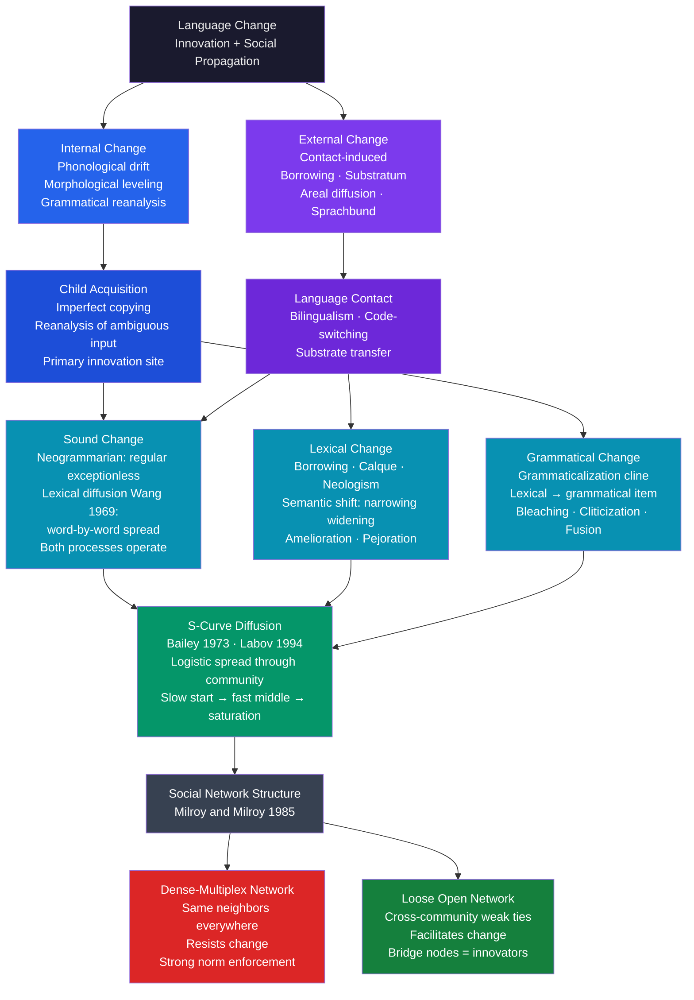

# Language Change and Diffusion

> [!abstract] TL;DR
> All languages change continuously and inevitably; the mechanisms — phonetic drift, lexical borrowing, and grammatical reanalysis — are internal pressures amplified or redirected by social contact. A new variant does not spread uniformly: it follows a logistic S-curve through the speech community, beginning slowly among bridge-node innovators, accelerating when it reaches the connected majority, and decelerating as saturation approaches. Dense multiplex social networks resist change; loose cross-community ties propagate it; and seeding among high-betweenness speakers accelerates adoption — the same dynamics that govern epidemic spread, technology adoption, and biological natural selection.

---

## Intuition

**Analogy:** Imagine a rumor spreading through a high school. It begins with a few well-connected students who move between the different cliques — athletes, drama kids, honors students. Within each clique it spreads quickly (everyone knows everyone), but it crosses between cliques only when bridge-spanning students carry it. Track the rumor's reach hour by hour and the curve looks like an elongated S: a slow start, a rapid middle surge when it hits the connected core, and a flattening at the end as the last isolated pockets finally hear it.

Language change spreads through a speech community in precisely the same way. A new pronunciation, a borrowed word, or a reinterpreted grammar rule begins among a small group of speakers — often young, mobile, socially bridge-spanning individuals. It spreads outward through conversational contact, proportional to how many of one's network partners already use the new form. Dense communities where everyone talks to the same people resist the spread; open communities with many cross-group contacts amplify it. The end result — centuries later — is that every speaker uses the new form, and the old one is forgotten. Latin *caballus* became French *cheval* and Spanish *caballo*; nobody decided this; it accumulated one conversation at a time.

---

## How It Works



Language change operates through two coupled channels. **Internal change** arises within the language system itself — the natural drift of articulatory targets, morphological leveling of irregular paradigms, and reanalysis of syntactically ambiguous constructions. **External change** is contact-induced: speakers of different languages or dialects interacting adopt and adapt each other's forms. Both converge on the same population-dynamic question: given that a variant has appeared, by what social mechanism does it propagate?

The answer is captured in the S-curve. A new variant appears in a small network cluster and spreads by a social contagion rule: each non-adopter is converted at a rate proportional to the fraction of their conversational partners who already use the form. When very few use it, conversion is rare (slow start). As the proportion passes the 20–30% threshold, each new adopter exposes many additional non-adopters, and adoption accelerates. Near saturation, the remaining holdouts are the most structurally peripheral speakers, and the curve flattens toward completion. This logistic trajectory is mathematically identical to epidemic spread (SIR model), technology adoption (Bass model), and allele fixation in population genetics — the common underlying mechanism is frequency-dependent social contagion.

---

## Key Concepts

### Secondary Level

**All languages change; the prescriptivist fallacy**

Every natural language spoken by a living community is continuously changing. The English of Chaucer (1380s) is unintelligible to modern speakers without study; Shakespeare's English (1600s) requires annotation; even 1950s broadcast English sounds conspicuously formal today. These changes are not random degradation — they are systematic, they follow predictable paths, and they produce equally complex, equally expressive grammars at every stage.

**Prescriptivism** — the belief that changes represent errors and that language is deteriorating from a golden past standard — rests on a misunderstanding. There was no golden age: Old English, Middle English, and Early Modern English were not more correct than contemporary English, merely earlier stages of the same ongoing process. Saying "language is deteriorating" because new constructions become standard is equivalent to saying evolution is making organisms worse because they differ from their ancestors. Every generation of native speakers has complained about the generation that followed; the complaints are constant, and the language changes anyway.

**Three mechanisms of change**

| Type | What changes | Example |
|---|---|---|
| Sound change | How phonemes are pronounced | Great Vowel Shift: Middle English long *ī* /iː/ → Modern English diphthong /aɪ/ (*time* from /tiːm/ to /taɪm/) |
| Lexical change | The words available and their meanings | Borrowing: *alcohol* from Arabic *al-kuḥl*; semantic shift: *awful* once meant "awe-inspiring," now means "very bad" |
| Grammatical change | How words combine; what morphemes mark | Old English inflectional case system → Modern English word-order syntax; "going to" → *gonna* as future marker |

Sound change and grammatical change typically operate slowly, below conscious awareness ("change from below"). Lexical change — new words, slang, borrowing — is faster and often more conscious ("change from above" or "change from contact").

**The S-curve in everyday terms**

Track any linguistic innovation over time and its community frequency traces an S-shape:

1. A small innovative group begins using the new form (5–10% of speakers)
2. It spreads rapidly through the socially central majority (10% → 90%)
3. It slows as the last resistant or structurally peripheral speakers are reached

This is the adoption curve of any social innovation — identical to new technology uptake, meme spread, or infectious disease propagation. The mechanism is **social contagion with proportional copying**: you are more likely to adopt a variant the more of your social contacts already use it.

---

### Undergraduate Level

#### Sound Change: The Neogrammarians and Lexical Diffusion

The great 19th-century discovery in historical linguistics was that sound change is **regular and exceptionless**: every instance of a given phoneme in a given phonological environment in a given language shifts simultaneously and uniformly. No exceptions — or, if apparent exceptions exist, they are explained by **analogy** (a form was restructured to match a productive paradigm) or **borrowing** (a form imported from another dialect after the change was complete).

**Grimm's Law** (1822) was the founding demonstration. Every Proto-Indo-European voiceless stop shifted systematically to a fricative in Germanic:

| PIE | Germanic shift | Examples |
|---|---|---|
| *p → f | piscis → fish | Latin *pater* / English *father* |
| *t → θ | tres → three | Latin *tres* / English *three* |
| *k → h | centum → hundred | Latin *centum* / English *hundred* |

The regularity is not merely descriptive — it is the methodological foundation of the comparative method. If changes are exceptionless, systematic correspondences across related languages constitute evidence of shared ancestry, and proto-forms can be reconstructed with precision.

**Wang's lexical diffusion hypothesis** (1969) challenged the assumption that sound change is simultaneous across all words containing the relevant phoneme. Wang's analysis of Chinese dialect data showed that some changes spread word by word — the phoneme /p/ shifted in some words far earlier than in others, producing lexically split distributions explicable only if the change propagated through the lexicon rather than triggering uniformly on a phonological conditioning statement.

The current resolution is empirical: both processes occur. Regular phonologically conditioned changes (Neogrammarian-type) and word-by-word lexical diffusion both operate; their relative frequency varies by change type, lexical frequency, and social context. Regular sound change is more common for gradient articulatory drift; lexical diffusion is more common for changes conditioned by word frequency, morphological class, or prestige associations of individual lexical items. The two processes are not competing theories but complementary descriptions of different empirical phenomena.

#### Grammaticalization

**Grammaticalization** is the process by which lexical items (words with full semantic content — nouns, verbs, adjectives) become grammatical items (function words, affixes, auxiliaries with reduced semantic content). It is one of the most regular and best-documented processes in language change, and it is **unidirectional**: lexical → grammatical, never grammatical → lexical (Hopper and Traugott's **Unidirectionality Hypothesis**).

**Classic English examples:**

| Original lexical form | Grammaticalized form | Process |
|---|---|---|
| *gān* "go" (motion verb) + directional *to* | *gonna* (future marker) | Motion verb → tense/aspect auxiliary; bleaching of spatial meaning |
| *willan* "want, desire" | *will* (future auxiliary) | Desire verb → modal → future; semantic bleaching of volition |
| *habban* "have, possess" | *have* (perfect auxiliary) | Possession verb → aspect marker; "I have eaten" |
| *vero* "truly, in truth" | *très* "very" (intensifier, French) | Evidential → degree adverb; truth-conditional content bleached |
| *man* "person, human" | *-man* (agentive suffix) | Free noun → bound morpheme in *postman*, *chairperson* |

The **cline of grammaticalization** (Hopper and Traugott) describes the typical trajectory:

> Content word → grammatical word → clitic → inflectional affix

Individual grammaticalization histories follow this order without skipping steps. An item does not jump from content word to inflectional affix; it passes through intermediate stages, each leaving traces in surviving forms.

**Semantic bleaching** — the loss or weakening of semantic content — accompanies every grammaticalization. English *very* once meant "truly" (from Latin *verus* "true"); as it became an intensifier it lost its truth-conditional content. "A very good doctor" no longer makes a claim about truth — *very* is now a degree modifier with no independent propositional content. The same bleaching happened to *just* (originally "justly"), *really* (originally "in reality"), *pretty* (originally "cleverly"), and *awfully* (originally "in an awe-inspiring way"). Contemporary strengtheners like *literally* are undergoing the same process in real time.

#### Labov's Variationist Sociolinguistics

William Labov transformed linguistics in the 1960s by insisting that language variation is not noise to be controlled but the primary evidence for change in progress. The variation between an older and a newer form at any moment is the S-curve frozen mid-slope; statistical analysis of current variation is indirect access to the change's history and trajectory.

**The Martha's Vineyard study (1963):** Labov's first major study examined the centralization of the diphthongs /aɪ/ (as in *right*, *time*, *night*) and /aʊ/ (as in *out*, *down*, *house*) on Martha's Vineyard. Centralization — pronouncing these diphthongs with a raised, more central first element — was advancing among some speakers. Labov found that centralization was not simply diffusing from older to younger speakers. It was correlated with **social attitude**:

- Fishermen with strong ties to island identity centralized most
- Summer visitors, mainlanders, and islanders planning to leave did not centralize
- The change was functioning as a social **index** of Vineyard identity — a phonological way of marking "I am a Vineyarder, not a tourist"

This demonstrated that language change is socially motivated. Variation carries social meaning; change is structured by identity, prestige, and group affiliation, not only by phonological conditioning.

**The New York City department store study (1966):** Labov studied postvocalic /r/ across three stores stratified by class: Saks Fifth Avenue (upper), Macy's (middle), Klein's (lower). Asking clerks "Where is the fourth floor?" and eliciting casual then careful responses showed that /r/-pronunciation was systematically stratified by class. Middle-class clerks showed **hypercorrection** in their careful style — producing even more /r/ than upper-class clerks, overshooting the prestige target — which Labov identified as a signature of insecure prestige-seeking in upwardly mobile groups.

**Labov's principles of linguistic change (1994):**

1. **Stability principle** — linguistic variation can persist for centuries as stable sociolinguistic variables without triggering change; stability and change are separate phenomena
2. **Change from below** (unconscious, community-internal) is led by **women** of socially central network groups; they lead changes that lack overt prestige but carry covert solidarity prestige
3. **Change from above** (conscious, prestige-directed, standard-language-associated) is led by upper-middle and higher class speakers
4. **Change begins at the periphery of the linguistic system** — in low-frequency, low-salience conditioning environments where change can advance unnoticed
5. **The S-curve is universal** — every change in progress studied in sufficient temporal depth shows the logistic diffusion pattern

---

### Graduate Level

#### The Social Network Model (Milroy and Milroy 1985)

Lesley Milroy's fieldwork in Belfast working-class communities (*Language and Social Networks*, 1980) showed that linguistic conservatism and innovation correlate not with social class per se but with **social network structure**. Networks characterized by two properties maintain non-standard local features under pressure from prestige-standard forms:

- **Density**: the proportion of possible ties that are actually present (dense = everyone knows everyone)
- **Multiplexity**: ties that are simultaneously kinship, workplace, neighborhood, and friendship ties (the same person is your neighbor, cousin, co-worker, and friend)

Dense multiplex networks generate strong social norms — deviation from local linguistic norms is visible and sanctioned because the same community enforces norms across every social domain simultaneously. Speakers embedded in such networks resist prestige-standard forms and maintain vernacular features across generations. This explains the persistence of non-standard dialects in tight-knit working-class communities despite continuous exposure to the standard through education and media.

Conversely, speakers with **loose networks** — many ties to people in different communities, workplaces, or cities — face weaker norm-enforcement from any single community and are more likely to innovate or adopt external forms. Milroy identified **bridge nodes** — speakers who connect otherwise unconnected social clusters — as the critical agents of propagation. This is a direct sociolinguistic instantiation of Granovetter's (1973) finding that **weak ties** are the primary channels through which novel information spreads between disconnected communities.

The mechanism: a bridge speaker encounters a new variant in community B and uses it in community A, which has not previously encountered the form. If the bridge speaker carries local prestige in A, the form may be adopted there. Then when a bridge speaker between A and C uses it in C, the form propagates further. The linguistic variant travels the social network through its high-betweenness bridge nodes — exactly as a network diffusion simulation would predict.

**Comparison of network types:**

| Network type | Density | Multiplexity | Prediction |
|---|---|---|---|
| Dense-multiplex (traditional working-class neighborhood) | High | High | Resists external change; maintains vernacular |
| Loose-uniplex (urban, mobile, multiple workplaces) | Low | Low | Facilitates change; adopts cross-community variants |
| Small-world (intermediate: clusters + long bridges) | Moderate | Mixed | Fast diffusion once bridges are seeded |

#### Weinreich, Labov, and Herzog (1968): The Problems of Language Change

The foundational paper for modern variationist sociolinguistics identified five problems that any adequate theory of language change must solve:

1. **The actuation problem** — Why did this particular change begin in this community at this time? This is the hardest and least-solved problem. We can describe a change's trajectory with great precision but can rarely explain why it was initiated when and where it was. Stochastic network dynamics, demographic shifts, contact events, and social identity reorganizations have all been proposed as triggers, but no general actuation theory exists.

2. **The transition problem** — What intermediate stages does a change pass through? The S-curve describes the population-level frequency; the question is what the grammar of an individual transitional speaker looks like when they use both old and new forms variably.

3. **The embedding problem** — How is the changing variable embedded in the linguistic system (what phonological, morphological, or syntactic conditioning environments govern it?) and in the social system (what social groups lead it, and what social meaning does it carry)?

4. **The evaluation problem** — How do community members evaluate the variant? Overt prestige (the standard form that speakers consciously adopt in formal contexts), covert prestige (the vernacular form that speakers value for solidarity and authenticity, even while nominally preferring the standard), or social neutrality are three possible evaluation states that determine the social trajectory of a change.

5. **The actuation mechanism in acquisition** — How does change pass between generations? The answer is child language acquisition: children do not simply copy adult speech but reconstruct the grammar from ambiguous input, systematically reanalyzing structures at points where the input underdetermines the grammar. This reanalysis is the locus of innovation.

#### The S-Curve as Evidence for Social Transmission

The logistic curve of language change has theoretical significance beyond description: it is a **diagnostic of social transmission processes**.

A logistic diffusion curve arises from any system where:
- There is a susceptible population of non-adopters
- Adoption is triggered by contact with adopters
- Contact probability is proportional to the product of adopter and non-adopter frequencies (frequency-dependent transmission)

These are precisely the conditions of the SIR epidemic model, the Fisher-Wright model of allele fixation in population genetics, and the Bass model of technology adoption. The ubiquity of the S-curve in language change is strong evidence that it propagates via **social contagion** — frequency-dependent copying of forms encountered in the speech of social contacts — rather than biological mutation or random drift.

**Network topology effects on the S-curve:**

- **Small-world networks** (high local clustering + a few long-range ties) spread variants faster than regular ring lattices because the long-range shortcuts collapse effective social distance between distant clusters — Watts and Strogatz's (1998) demonstration that even a tiny fraction of random rewiring dramatically reduces average path length
- **Scale-free networks** (with hubs of very high degree) produce explosive spreading when the variant reaches a high-degree hub, followed by rapid saturation
- **Seeding among high-betweenness nodes** accelerates diffusion compared to seeding peripheral nodes — Labov's innovators are structurally central bridge speakers, not isolated radicals
- The **shape** of the S-curve is robust across network types; what the network structure controls is the **speed** (time to 50% adoption) and the steepness of the middle slope

The **flattening** of the right shoulder reflects not loss of momentum but scarcity of susceptibles: as nearly all speakers use the new form, each encounter is increasingly likely to be between two adopters, and the few remaining holdouts are structurally peripheral. This produces the characteristic asymptotic approach to saturation.

#### Contact-Induced Change and Areal Linguistics

Language change does not only occur within a community through internal drift. In contact situations — two or more languages or dialects spoken by overlapping communities — external change can be equally powerful.

**Types of contact-induced change (Thomason and Kaufman 1988):**

| Contact intensity | What gets transferred | Example |
|---|---|---|
| Casual (lexical borrowing) | Content words | English from French: *beef*, *pork*, *justice*, *virtue* |
| Moderate (structural borrowing) | Function words, inflectional morphology | Indian Englishes retaining OV object-verb order patterns |
| Intense (convergence) | Syntax, phonological system | Kupwar trilingual village: Urdu/Marathi/Kannada converge in syntax |
| Language shift with substratum | L1 phonology and grammar imposed on L2 | Retroflex consonants in North Indian Indo-Aryan from Dravidian substratum |

**Sprachbund (convergence area):** Geographically adjacent languages that are not genetically related develop shared structural features through long-term contact. The Balkan Sprachbund (Albanian, Bulgarian, Greek, Romanian, Macedonian, and adjacent dialects of Serbian) shares postposed definite articles, loss of infinitives, and merger of genitive and dative — despite belonging to multiple independent branches of Indo-European (Romance, Greek, South Slavic, Albanian). The convergence came from centuries of contact and bilingualism, not from shared ancestry.

---

## Python Demo

```python
import numpy as np
import matplotlib
matplotlib.use("Agg")
import matplotlib.pyplot as plt

# ---------------------------------------------------------------
# SIMULATION: Language Change as Logistic S-Curve Diffusion
#
# A new linguistic variant (new vowel, new grammatical construction)
# spreads through a speech community of 200 speakers modeled as a
# Watts-Strogatz small-world network.
#
# At each timestep, a non-adopter adopts with probability:
#   P(adopt) = rate * fraction_of_neighbors_already_using_new_form
#
# This is the standard social contagion rule. The logistic S-curve
# emerges naturally from frequency-dependent copying.
#
# Comparison 1: Dense-multiplex (Milroy: resists change) vs.
#               Open/sparse network (many weak ties: facilitates change)
# Comparison 2: Seeding among HIGH-betweenness bridge nodes (Labov
#               innovators) vs. LOW-betweenness peripheral speakers
# ---------------------------------------------------------------

rng = np.random.default_rng(2025)

N = 200      # speakers in the community
T = 80       # timesteps (months or contact seasons)
RATE = 0.5   # social contagion transmission rate
N_SEEDS = 10 # 5% of community = initial innovators


# ── 1. Watts-Strogatz small-world network ─────────────────────────────────────
def watts_strogatz(n, k, p, rng_obj):
    """
    Ring lattice with k//2 neighbors on each side, then rewire each edge
    with probability p. Returns adjacency list as list of Python sets.
    k must be even.
    """
    half = k // 2
    adj = [set() for _ in range(n)]
    for i in range(n):
        for d in range(1, half + 1):
            j = (i + d) % n
            adj[i].add(j)
            adj[j].add(i)
    for i in range(n):
        for d in range(1, half + 1):
            if rng_obj.random() < p:
                j_old = (i + d) % n
                if j_old in adj[i]:
                    adj[i].discard(j_old)
                    adj[j_old].discard(i)
                    pool = [v for v in range(n) if v != i and v not in adj[i]]
                    if pool:
                        j_new = int(rng_obj.choice(np.array(pool)))
                        adj[i].add(j_new)
                        adj[j_new].add(i)
    return adj


# ── 2. Approximate betweenness centrality via Brandes BFS ─────────────────────
def approx_betweenness(adj, n, n_sources, rng_obj):
    """
    Brandes-style betweenness estimation from n_sources random pivots.
    Returns normalized score array in [0, 1].
    """
    bc = np.zeros(n)
    sources = rng_obj.choice(n, size=min(n_sources, n), replace=False)
    for s in sources:
        dist = np.full(n, -1, dtype=np.int32)
        sigma = np.zeros(n, dtype=np.float64)
        pred = [[] for _ in range(n)]
        dist[s] = 0
        sigma[s] = 1.0
        queue = [s]
        stack = []
        qi = 0
        while qi < len(queue):
            v = queue[qi]; qi += 1
            stack.append(v)
            for w in adj[v]:
                if dist[w] < 0:
                    dist[w] = dist[v] + 1
                    queue.append(w)
                if dist[w] == dist[v] + 1:
                    sigma[w] += sigma[v]
                    pred[w].append(v)
        delta = np.zeros(n, dtype=np.float64)
        while stack:
            w = stack.pop()
            for pv in pred[w]:
                if sigma[w] > 0:
                    delta[pv] += (sigma[pv] / sigma[w]) * (1.0 + delta[w])
            if w != s:
                bc[w] += delta[w]
    mx = bc.max()
    if mx > 0:
        bc /= mx
    return bc


# ── 3. Linguistic diffusion simulation ────────────────────────────────────────
def diffuse(adj, n, seed_nodes, T, rate, rng_obj):
    """
    Simulate variant diffusion over T timesteps.
    Returns adoption fraction at each step (length T+1).
    """
    state = np.zeros(n, dtype=bool)
    state[list(seed_nodes)] = True
    curve = [state.sum() / n]
    for _ in range(T):
        new_state = state.copy()
        for i in range(n):
            if not state[i] and adj[i]:
                nbrs = np.fromiter(adj[i], dtype=np.int32)
                frac = state[nbrs].mean()
                if rng_obj.random() < rate * frac:
                    new_state[i] = True
        state = new_state
        curve.append(state.sum() / n)
    return np.array(curve)


# ── Build three networks ───────────────────────────────────────────────────────

# Small-world: moderate rewiring (reference community)
g_sw     = watts_strogatz(N, k=6,  p=0.15, rng_obj=rng)
# Dense-multiplex (Milroy): high local clustering, few long-range ties
g_dense  = watts_strogatz(N, k=14, p=0.05, rng_obj=rng)
# Open/sparse: many cross-community weak ties (Granovetter)
g_sparse = watts_strogatz(N, k=6,  p=0.50, rng_obj=rng)

# ── Compute betweenness centrality on small-world graph ───────────────────────
bc = approx_betweenness(g_sw, N, n_sources=80, rng_obj=rng)

high_bc_seeds = np.argsort(bc)[-N_SEEDS:]   # bridge nodes (Labov innovators)
low_bc_seeds  = np.argsort(bc)[:N_SEEDS]    # peripheral speakers

# ── Run four diffusion simulations ────────────────────────────────────────────
curve_sw_high     = diffuse(g_sw,     N, high_bc_seeds, T, RATE, rng)
curve_sw_low      = diffuse(g_sw,     N, low_bc_seeds,  T, RATE, rng)
curve_dense_high  = diffuse(g_dense,  N, high_bc_seeds, T, RATE, rng)
curve_sparse_high = diffuse(g_sparse, N, high_bc_seeds, T, RATE, rng)

t_axis = np.arange(T + 1)


# ── Summary statistics ─────────────────────────────────────────────────────────
def time_to_reach(curve, threshold):
    idx = np.searchsorted(curve, threshold)
    return idx if idx <= T else None

print("=" * 65)
print("Language Change Diffusion — S-Curve Network Simulation")
print("=" * 65)
print(f"  N speakers: {N}  |  T timesteps: {T}  |  Seeds: {N_SEEDS} ({100*N_SEEDS/N:.0f}%)")
print()

configs = [
    ("Small-world  + HIGH betweenness seeds", curve_sw_high),
    ("Small-world  + LOW betweenness seeds",  curve_sw_low),
    ("Dense-multiplex + HIGH betweenness",    curve_dense_high),
    ("Sparse/open     + HIGH betweenness",    curve_sparse_high),
]
for label, curve in configs:
    t50 = time_to_reach(curve, 0.50)
    t90 = time_to_reach(curve, 0.90)
    t50s = f"t={t50}" if t50 is not None else f">T"
    t90s = f"t={t90}" if t90 is not None else f">T"
    print(f"  {label:<43}  50%: {t50s:>5}  90%: {t90s:>5}")

# ── Logistic fit to small-world high-betweenness curve ───────────────────────
# f(t) = 1 / (1 + exp(-k*(t - t0)))
# Log-odds linearization: log(p / (1-p)) = k*t - k*t0
mask = (curve_sw_high > 0.02) & (curve_sw_high < 0.98)
logistic_fit = None
t_smooth = None
t0_fit = None
if mask.sum() >= 4:
    y_logit = np.log(curve_sw_high[mask] / (1.0 - curve_sw_high[mask]))
    x_fit = t_axis[mask].astype(float)
    k_fit, b_fit = np.polyfit(x_fit, y_logit, 1)
    t0_fit = -b_fit / k_fit
    t_smooth = np.linspace(0, T, 300)
    logistic_fit = 1.0 / (1.0 + np.exp(-k_fit * (t_smooth - t0_fit)))
    print(f"\n  Logistic fit (SW-High): k={k_fit:.3f}, inflection t0={t0_fit:.1f}")

print()
print("Key findings:")
print("  1. All curves show logistic S-shape: slow start, fast middle, plateau")
print("  2. HIGH-betweenness seeds diffuse faster than peripheral seeds")
print("     (Labov: innovators are bridge speakers, not social outsiders)")
print("  3. Dense-multiplex network slows diffusion (Milroy 1985)")
print("  4. Sparse/open network (weak ties) speeds diffusion (Granovetter 1973)")


# ── Plots ─────────────────────────────────────────────────────────────────────
fig, axes = plt.subplots(1, 3, figsize=(16, 5))
fig.suptitle(
    "Language Change as S-Curve Diffusion in Social Networks\n"
    "All curves show logistic shape; network structure and seeding node control speed",
    fontsize=9.5, fontweight="bold"
)

# Panel 1: Bridge seeds vs peripheral seeds (same small-world network)
ax1 = axes[0]
ax1.plot(t_axis, curve_sw_high * 100, color="#2563eb", lw=2.2,
         label="High-betweenness seeds\n(bridge / innovator nodes)")
ax1.plot(t_axis, curve_sw_low * 100, color="#dc2626", lw=2.2, linestyle="--",
         label="Low-betweenness seeds\n(peripheral / conservative)")
if logistic_fit is not None:
    ax1.plot(t_smooth, logistic_fit * 100, color="#7c3aed", lw=1.5,
             linestyle=":", label=f"Logistic fit (t₀={t0_fit:.0f})")
ax1.axhline(50, color="#6b7280", lw=0.8, linestyle=":", alpha=0.6)
ax1.set_title("Effect of Seeding Node Type\n(Labov: innovators are bridge speakers)",
              fontsize=8.5)
ax1.set_xlabel("Timestep (contact seasons)", fontsize=8)
ax1.set_ylabel("% of community using new variant", fontsize=8)
ax1.legend(fontsize=7)
ax1.set_ylim(0, 107)
ax1.grid(alpha=0.2)

# Panel 2: Dense vs sparse network (both seeded from high-betweenness nodes)
ax2 = axes[1]
ax2.plot(t_axis, curve_sparse_high * 100, color="#059669", lw=2.2,
         label="Sparse / open network\n(many weak ties)")
ax2.plot(t_axis, curve_sw_high * 100, color="#2563eb", lw=2.2,
         label="Small-world\n(moderate clustering)")
ax2.plot(t_axis, curve_dense_high * 100, color="#dc2626", lw=2.2, linestyle="--",
         label="Dense-multiplex\n(Milroy: resists change)")
ax2.axhline(50, color="#6b7280", lw=0.8, linestyle=":", alpha=0.6)
ax2.set_title("Effect of Network Structure\n(Milroy 1985 / Granovetter 1973)",
              fontsize=8.5)
ax2.set_xlabel("Timestep (contact seasons)", fontsize=8)
ax2.set_ylabel("% of community using new variant", fontsize=8)
ax2.legend(fontsize=7)
ax2.set_ylim(0, 107)
ax2.grid(alpha=0.2)

# Panel 3: Betweenness centrality distribution of the 200-speaker network
ax3 = axes[2]
ax3.hist(bc, bins=25, color="#2563eb", alpha=0.75, edgecolor="black", linewidth=0.5)
ax3.axvline(bc[high_bc_seeds].min(), color="#059669", lw=2, linestyle="--",
            label=f"Top-{N_SEEDS} bridge threshold")
ax3.axvline(bc[low_bc_seeds].max() + 1e-9, color="#dc2626", lw=2, linestyle="--",
            label=f"Bottom-{N_SEEDS} peripheral threshold")
ax3.set_title("Betweenness Centrality Distribution\n"
              "(bridge nodes are rare — right-skewed)",
              fontsize=8.5)
ax3.set_xlabel("Normalized betweenness centrality", fontsize=8)
ax3.set_ylabel("Number of speakers", fontsize=8)
ax3.legend(fontsize=7)
ax3.grid(alpha=0.2)

plt.tight_layout()
plt.savefig("language_change_diffusion.png", dpi=110, bbox_inches="tight")
plt.show()
```

**What the demo demonstrates:**

- **Panel 1 (seed node type):** Seeding among high-betweenness bridge speakers versus peripheral speakers on the same network produces dramatically different adoption speeds. Bridge speakers simultaneously expose many social clusters to the new form; peripheral speakers are embedded in one cluster and take far longer to propagate the variant outward. This models Labov's finding that linguistic innovators are socially central bridge speakers, not marginal outliers.

- **Panel 2 (network structure):** The dense-multiplex network (high local clustering, few long-range ties) slows diffusion substantially relative to the small-world and sparse/open networks. The sparse network with many rewired weak ties reaches 50% adoption fastest — Granovetter's weak tie effect at the network scale. The shape of all three curves remains logistic; the network controls speed, not shape.

- **Panel 3 (betweenness distribution):** The betweenness centrality distribution of a 200-node small-world graph is strongly right-skewed: most speakers have low betweenness (embedded within one cluster), and a small fraction are bridge nodes with high betweenness. This asymmetry explains why seed node choice matters so much — the rare high-betweenness speakers have disproportionate influence on diffusion speed, exactly as the social network model of language change predicts.

---

## Real-World Applications

> **Martha's Vineyard: the S-curve in real-time variation (Labov 1963).** Labov's prediction that centralization of diphthongs would continue among speakers with strong island identity was confirmed in follow-up studies decades later. The change tracked social attitudes toward island versus mainland identity, not merely social class or age. Speakers deployed the phonological variant as an identity index, demonstrating that linguistic change is a social semiotic process — adopters are not passive recipients of phonological drift but active participants in the social construction of identity through sound.

> **The Great Vowel Shift (1400–1700).** The most dramatic systematic sound change in English history raised every Middle English long vowel by one position in the vocal tract. The word *time* was /tiːm/ in Chaucer's English; the /iː/ raised to and then diphthongized to /aɪ/. *Name* was /naːmə/, *moon* was /moːn/ (still is in some dialects), *house* was /huːs/. The shift propagated from the prestige varieties of London outward to the provinces over three centuries — a real-world S-curve with London as the seeding community and geographical distance as a proxy for weak-tie distance in the social network of 15th-century England.

> **Gonna: grammaticalization measured in real-time corpora.** The grammaticalization of "going to" → *gonna* as a future tense marker has been documented using corpus frequency data (COCA, BNC, COHA). The contracted form increases in frequency from rare in 19th-century written registers to ubiquitous in 20th-century informal speech. Corpus linguistics now permits tracking the S-curve of grammaticalization in progress — one of the few cases where a theoretical prediction (grammaticalization follows logistic diffusion) can be tested against multi-decade frequency time series.

> **Social media and accelerated lexical diffusion.** Twitter, TikTok, and Discord create weak-tie networks of unprecedented scale: a speaker can be exposed to innovations from communities they have no strong-tie connection to. Slang terms like *slay*, *lowkey*, *no cap*, and *bussin* diffused from African American Vernacular English into mainstream digital English in years rather than the decades such cross-community lexical diffusion previously required. The "effective network diameter" of the English-speaking speech community collapsed because social media created cross-community bridge ties at scale — Granovetter's weak ties amplified to global reach. The S-curve still operates, but its timescale compressed from decades to months.

> **Balkan Sprachbund as areal diffusion evidence.** The structural convergence of Albanian, Bulgarian, Greek, Romanian, and Macedonian — languages from multiple independent Indo-European branches — toward shared features (postposed articles, loss of infinitives) over roughly a millennium of co-territorial contact is the clearest large-scale example of contact-induced grammatical change. The convergence was not the result of one language borrowing from another but of a mutual diffusion process in a multilingual community. This demonstrates that grammaticalization and syntactic change can spread across genetic language boundaries when the social network conditions (dense multilingual communities, widespread bilingualism) favor it.

---

## Common Pitfalls

- **Treating language change as evidence of decay** — the prescriptivist fallacy is the most pervasive misunderstanding. Every generation perceives its own changes as deterioration from a pristine past. Anglo-Saxon clerks complained about Norman borrowings; 18th-century critics called split infinitives corruption; today's critics complain about *literally* as a hyperbolic intensifier and singular *they*. All languages are equally complex at every stage of their history; prescriptive judgments track social prestige, not linguistic structure.

- **Confusing Neogrammarian regularity with absolute exceptionlessness in every environment** — the Neogrammarian hypothesis holds that within a specific phonological conditioning environment a sound change applies uniformly. It does not claim every word in the language undergoes the same change. Apparent exceptions (analogy, borrowing, misspecified conditioning environments) are the productive site of refinement, not refutations of the framework.

- **Misreading lexical diffusion as undermining regularity** — Wang's word-by-word diffusion is not a refutation of sound change regularity but a description of a different type of conditioning: lexical frequency, morphological class, and prestige associations condition which words change first. Both Neogrammarian and lexical diffusion processes are regular; they are conditioned by different factors.

- **Assuming linguistic innovators are social outsiders** — popular intuition identifies linguistic innovation with slang-using subcultures, social rebels, and outsider communities. Labov's consistent empirical finding is that the most influential innovators in ongoing sound change are **socially central bridge speakers** who span multiple social clusters — not the most marginalized. Innovations from socially peripheral speakers tend to stay peripheral. The network position that drives change is high betweenness, not low prestige.

- **Treating grammaticalization as reversible** — the Unidirectionality Hypothesis has occasional apparent counterexamples (degrammaticalization in contact situations, lexicalization of some former affixes). These are rare and typically involve borrowing or dialect contact, not reversal of ongoing grammaticalization within a single variety. The hypothesis is robust as a strong statistical generalization, not as a metaphysical law with zero exceptions.

- **Confusing the S-curve with inevitability of completion** — the S-curve describes the trajectory of *successful* changes. Many innovations die out before reaching the tipping point that generates the steep middle phase. A variant that remains below 10% adoption for multiple generations has probably failed to achieve social embedding and will disappear. The documented S-curves are a biased sample; failed innovations leave no historical record.

- **Ignoring the evaluation problem** — documenting the trajectory of a change (its S-curve shape and speed) is different from explaining why it carries the social meaning it does. The same phonological change can have overt prestige in one community, covert prestige in another, and social neutrality in a third. The evaluation problem is the least mechanically tractable aspect of language change and often the most consequential for predicting a change's ultimate fate.

---

## Related Concepts

- [[Language_and_Linguistics_Overview]] — The Neogrammarian hypothesis, Grimm's Law, and the comparative method are the foundational diachronic tools; this note extends from those formal mechanisms to the social processes governing how change propagates through communities rather than across genetic lineages

- [[Language_Variation_and_Dialects]] — Labov's variationist framework bridges variation and change: stable variation is the synchronic snapshot of a change in progress; the same variable rules that describe dialect differences also reveal changes diffusing through the community at different rates in different social groups

- [[Language_and_Culture]] — Labov's social stratification studies and the Martha's Vineyard identity-indexing finding show that sound changes are indexical (in Peirce's sense) of social identity; the same processes — enregistrement, language ideology, overt versus covert prestige — that govern how variants acquire social meaning determine whether a change spreads upward or downward through the social hierarchy

- [[Social_Networks_and_Social_Ties]] — Granovetter's weak ties, Milroy's dense/multiplex network model, and the Watts-Strogatz small-world framework are directly instantiated in the social network model of language change; bridge nodes with high betweenness centrality in Granovetter's sociology correspond precisely to Labov's linguistic innovators

- [[Language_Socialization_and_Acquisition]] — Child language acquisition is the primary mechanism of innovation: children reconstruct the grammar from ambiguous adult input, introducing systematic reanalyses at points of structural ambiguity that seed new changes; the actuation problem in language change is fundamentally a problem about what happens during acquisition

- [[Discourse_Power_and_Identity]] — Change from above (prestige-driven, conscious) and change from below (community-internal, unconscious) map directly onto the discourse of power and identity; which social groups have the prestige to drive linguistic norms; how covert prestige allows vernacular variants to persist despite standard-language ideology; how language change is a mechanism of identity construction and social differentiation

- [[Dependency_and_Construction_Grammar]] — Grammaticalization changes constructions as whole units: "going to V" grammaticalizes as a constructional template, preserving the VP frame while bleaching the lexical semantics of *go*; the Construction Grammar inventory of form-meaning pairings is the synchronic residue of thousands of completed and ongoing grammaticalization processes

- [[Globalization_and_Cultural_Change]] — Accelerated language contact via migration, media, and digital communication reorganizes the social networks through which linguistic change propagates; the collapse of spatial distance in digital networks creates the sparse, open, high-rewiring conditions that Milroy's model predicts will accelerate change and dialect leveling

- [[Globalization_and_Social_Change]] — Mass urbanization, migration, and cross-community digital communication dissolve the dense multiplex communities that historically maintained local linguistic norms; the sociological drivers of network loosening are simultaneously the drivers of accelerated language change and convergence

- [[Corpus_Linguistics]] — Real-time corpus data (COHA, COCA, Google Ngrams) is the primary empirical tool for observing S-curves of change in progress; frequency time series across decades reveal grammaticalization trajectories, semantic shifts, and the rise and fall of lexical innovations at a scale unavailable from sociolinguistic fieldwork alone

---

## Review Questions

### Secondary

1. "Languages deteriorate over time — people are getting lazier and stop speaking properly." Using three specific examples of language change described in this note, explain why a linguist would reject every part of this claim.
2. A word meaning "bold and courageous" gradually comes to mean only "bold" and then "reckless" over 300 years. What types of semantic change are involved, and is this a form of language decay?
3. Why does a new slang term spread more rapidly through a high school when it is introduced by a student who moves between all the social groups rather than one who belongs only to a single clique? What principle of language change does this illustrate?

### Undergraduate

1. The Neogrammarian hypothesis holds that sound changes are exceptionless within their phonological conditioning environment; Wang's lexical diffusion hypothesis argues that some changes spread word by word. Construct the clearest possible version of each claim and describe one type of evidence that would distinguish between them in a specific empirical case. Are they genuinely incompatible, or could both processes operate simultaneously in the same language?
2. Labov's principle says that change from below is led by women. Given that this is a statistical tendency across many changes rather than a universal law, what social-structural explanation accounts for it? What would you need to control for to test the claim rigorously, and can you construct a plausible case where you would predict the opposite pattern?
3. The Watts-Strogatz model shows that even a small fraction of rewired long-range ties dramatically reduces the average path length of a network, enabling rapid diffusion. In linguistic terms: what kinds of social actors or communicative situations function as these "rewiring events" — the creation of new long-range ties between previously disconnected speech communities? How has social media changed the frequency and scale of such events?

### Graduate

1. Weinreich, Labov, and Herzog (1968) identified the actuation problem as the hardest unsolved problem in the theory of language change: why does a particular change begin in this community at this time? Evaluate the claim that the actuation problem is in principle unsolvable — that the stochasticity of social network dynamics makes actuation events underdetermined by any set of structural or social variables we could measure in advance. If the actuation problem is unsolvable, what does this imply for the scientific status of theories of language change generally?
2. The S-curve of language change is formally identical to the logistic growth curves in epidemiology, population genetics, and technology adoption. This mathematical isomorphism is sometimes used to argue that "language change is social evolution." Evaluate the analogy: what is preserved (the mechanism of frequency-dependent social transmission), what is lost (the role of meaning, prestige evaluation, and identity construction), and does the mathematical equivalence support anything more substantive than "language change shares a population-dynamic structure with these other processes"? Does a more careful analogy with cultural evolution (Cavalli-Sforza, Richerson and Boyd) fare better?
3. Milroy's social network model predicts that dense-multiplex communities resist change. Historical sociolinguistics shows that isolated rural dialects with dense community networks preserve archaic features that are lost in urban centers — consistent with Milroy. But urban dense communities (historically immigrant neighborhoods, working-class districts) also show strong vernacular maintenance. Meanwhile, loosely networked suburban and mobile populations show dialect leveling toward regional standards, not innovative change. How do you reconcile the model with this complex empirical picture? Does the network model need to incorporate the prestige valuation and social direction of changes, not just the structural conditions for diffusion — and if so, does it remain a structural theory or collapse back into a theory of prestige and identity?

---

## Sources

- [Labov, W. (1963). "The Social Motivation of a Sound Change." *Word* 19(3), 273–309](https://doi.org/10.1080/00437956.1963.11659799)
- [Labov, W. (1994). *Principles of Linguistic Change, Vol. 1: Internal Factors*. Blackwell](https://www.wiley.com/en-us/Principles+of+Linguistic+Change%2C+Volume+1%3A+Internal+Factors-p-9780631179313)
- [Labov, W. (2001). *Principles of Linguistic Change, Vol. 2: Social Factors*. Blackwell](https://www.wiley.com/en-us/Principles+of+Linguistic+Change%2C+Volume+2%3A+Social+Factors-p-9780631179375)
- [Milroy, L. (1980). *Language and Social Networks*. Blackwell](https://www.wiley.com/en-us/Language+and+Social+Networks%2C+2nd+Edition-p-9780631158400)
- [Milroy, L. & Milroy, J. (1985). "Linguistic Change, Social Network and Speaker Innovation." *Journal of Linguistics* 21(2), 339–384](https://doi.org/10.1017/S0022226700010306)
- [Weinreich, U., Labov, W. & Herzog, M. (1968). "Empirical Foundations for a Theory of Language Change." In *Directions for Historical Linguistics*, ed. Lehmann & Malkiel. University of Texas Press](https://doi.org/10.7560/740014)
- [Wang, W.S-Y. (1969). "Competing Changes as a Cause of Residue." *Language* 45(1), 9–25](https://doi.org/10.2307/411748)
- [Hopper, P. & Traugott, E. (2003). *Grammaticalization*, 2nd ed. Cambridge University Press](https://doi.org/10.1017/CBO9781139165525)
- [Bailey, C-J.N. (1973). *Variation and Linguistic Theory*. Center for Applied Linguistics](https://files.eric.ed.gov/fulltext/ED082540.pdf)
- [Granovetter, M. (1973). "The Strength of Weak Ties." *American Journal of Sociology* 78(6), 1360–1380](https://doi.org/10.1086/225469)
- [Watts, D.J. & Strogatz, S.H. (1998). "Collective dynamics of 'small-world' networks." *Nature* 393, 440–442](https://doi.org/10.1038/30918)
- [Thomason, S.G. & Kaufman, T. (1988). *Language Contact, Creolization, and Genetic Linguistics*. University of California Press](https://www.ucpress.edu/books/language-contact-creolization-and-genetic-linguistics/paper)
- [Grimm, J. (1822). *Deutsche Grammatik*, 2nd ed. Dieterich](https://archive.org/details/deutschegrammat01grimgoog)
- [Traugott, E. & Trousdale, G. (2013). *Constructionalization and Constructional Changes*. Oxford University Press](https://doi.org/10.1093/acprof:oso/9780199679898.001.0001)

---

#Linguistics #Sociolinguistics #LanguageChange
