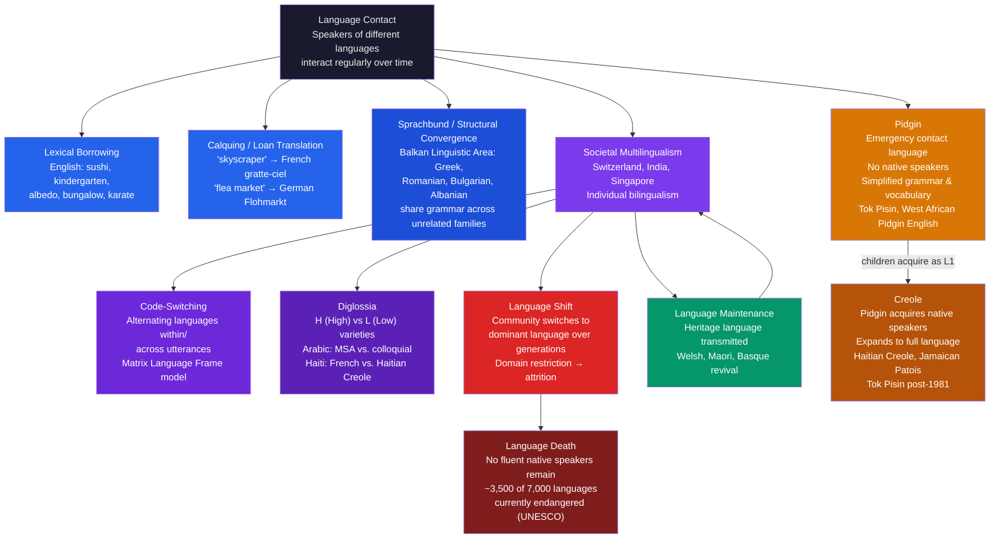

> [!abstract] TL;DR
> Language contact occurs whenever speech communities interact regularly; the outcomes range from minor vocabulary borrowing to the birth of entirely new languages (pidgins and creoles) and the extinction of existing ones. Multilingualism is the global statistical norm — not the exception — and code-switching between languages within a single conversation is a sophisticated, rule-governed competence that encodes social meaning at every switch, not a symptom of linguistic confusion.

---

## Intuition

**Analogy:** Two rivers meet at a confluence. What happens next depends entirely on the relative volume, speed, and chemistry of the two streams. Sometimes the smaller tributary disappears silently into the larger river — dissolved, leaving only faint chemical traces in the water downstream. Sometimes the two streams flow side by side for miles in visible laminar bands before gradually blending. And sometimes, if the conditions are peculiar enough — if the chemistry collides in just the right proportions — the confluence creates something that neither river contained alone: a new sediment pattern, a distinctive turbulence, an ecological zone that exists only at the meeting point.

Language contact works by the same logic. When communities speaking different languages come into sustained interaction — through trade, conquest, migration, intermarriage, or digital communication — the languages do not stay pristine and separate. They borrow vocabulary, copy grammatical structures, simplify for mutual intelligibility, and over time one sometimes absorbs the other. The "chemistry" determining the outcome is social: which community has economic power, which language is institutionally backed, whether parents transmit the heritage tongue to their children. The linguistic outcome is never independent of the political situation that produced the contact.

---

## How It Works



### Core Mechanics

Contact outcomes are not random — they are determined by the interaction of three factors: **intensity of contact** (how often, across how many domains, speakers of different languages interact), **power asymmetry** (which community commands institutional, economic, and demographic resources), and **language ideology** (what speakers believe about the prestige, utility, and cultural value of each language). These three factors operate simultaneously, and their interplay drives every phenomenon on the diagram above, from a single borrowed loanword to complete language extinction.

---

## Key Concepts

### Secondary Level

**What is language contact?**

Language contact occurs whenever speakers of different languages interact regularly over sustained periods. It is not a rare or exceptional situation: throughout human history, the overwhelming majority of communities have been multilingual, living at trade routes, borders, or under imperial administration where multiple languages were in daily use. The European ideal of one nation, one language is a 19th-century nationalist construction, not a description of how most of humanity has ever lived. Today, India has 22 constitutionally recognized languages and hundreds more in active use; Switzerland manages four official languages; Singapore deploys four. Monolingualism is the exception globally, and most of the world's children grow up hearing at least two languages regularly.

**The spectrum of contact outcomes:**

- **Lexical borrowing:** The simplest and most universal outcome. English has borrowed from French (*beef, castle, justice, parliament*), Latin and Greek (*alibi, democracy, molecule, telephone*), Hindi (*bungalow, shampoo, thug, jungle*), and hundreds of other languages. Borrowed words fill lexical gaps — new objects, concepts, or technologies that the receiving language has no native word for.

- **Calquing (loan translation):** Instead of borrowing the foreign sound-sequence directly, the receiving language translates it part by part. French *gratte-ciel* ("scrapes sky") calques English *skyscraper*. German *Weltanschauung* ("world view") was calqued into English as *worldview*. Mandarin *diànnǎo* ("electric brain") calques the concept of *computer* from English without using any English sounds.

- **Bilingualism:** Individuals who command two languages and use them in different contexts. A key social pattern is **diglossia** (Ferguson 1959): a community consistently uses a "High" (H) variety for formal, written, and educated contexts and a "Low" (L) variety for home, intimacy, and informal conversation. In the Arab world, Classical/Modern Standard Arabic is H; Egyptian or Levantine colloquial is L. In Haiti, French is H; Haitian Creole is L. The H language typically carries greater institutional prestige even when the L language is what people actually speak at home every day.

- **Code-switching:** Bilinguals frequently alternate between their languages mid-conversation or even mid-sentence. This is not linguistic confusion — it is a rule-governed competence. A Spanish-English bilingual who says *"I told him que no lo hiciera"* is not failing in English; they are deploying a marked form that signals in-group solidarity, switches the emotional register of the embedded clause, or indexes that the reported speech belonged to a Spanish-language context.

- **Pidgins:** When speakers of mutually unintelligible languages need to communicate — especially in trade or under conditions of plantation labor — a simplified contact language can emerge. Pidgins are nobody's first language; they are used only as a second-language communication tool. They have reduced vocabulary (derived mostly from one dominant language) and simplified grammar.

- **Creoles:** When children grow up speaking a pidgin as their native language, they expand it dramatically into a full, complex language with the grammatical richness any first language requires. Haitian Creole, Tok Pisin, and Jamaican Patois are creoles — fully developed languages, not degraded or corrupted versions of French, English, or anything else.

- **Language death:** When a community shifts to a dominant language over generations and stops transmitting the heritage language to children, the heritage language eventually loses all its fluent native speakers and becomes extinct. Approximately half of the world's 7,000 languages are classified as endangered.

---

### Undergraduate Level

#### Contact-Induced Change in Depth

**Lexical vs. structural borrowing:**

Languages vary in how resistant they are to structural borrowing. Vocabulary is universally and easily borrowed. Structural borrowing — phonological rules, grammatical categories, morphological patterns — requires deeper bilingualism and longer contact. Thomason and Kaufman (1988) proposed a **borrowing scale**: at one end, casual contact produces lexical borrowing only; at the other, intense contact (especially language shift with imperfect L2 learning) can produce deep structural restructuring. English provides a case study: after the Norman Conquest (1066), centuries of intense French-English contact restructured English from a heavily inflected Germanic language toward the analytic, word-order-dependent system we have today — partly through massive French lexical borrowing, partly through structural leveling that may have been accelerated by the contact situation.

**Sprachbund (convergence area):**

The **Balkan Linguistic Area** is the clearest demonstration that structural convergence occurs without genetic relationship. Greek (Hellenic), Romanian (Romance), Bulgarian and Macedonian (Slavic), and Albanian (isolated) — all Indo-European but from entirely different branches — have converged over centuries of contact to share grammatical features that none of their relatives outside the Balkans possess:

- **Post-posed definite article:** Romanian *om* "man" → *omul* "the man"; Albanian *njeri* → *njeriu*. No other Romance or Albanian relative places the article after the noun.
- **Loss of the infinitive:** Replaced by subjunctive constructions. Instead of "I want to eat," Balkan languages say the equivalent of "I want that I eat."
- **Future tense from "want":** All Balkan languages form the future from a grammaticalized form of "want" + subjunctive, regardless of what other Indo-European languages in their family do.

These features emerged through contact, not common ancestry — through centuries of multilingual communities borrowing and aligning grammatical structures across language boundaries.

**Code-switching constraints and models:**

Linguists have proposed two key constraints on intra-sentential switching (switching within a single sentence):

1. **The Equivalence Constraint (Poplack 1980):** A switch can occur only at a point where the surface syntax of both languages is equivalent — adjacent elements must be grammatical in the word order of both languages simultaneously. *"I told him [SWITCH] que no lo hiciera"* switches at a syntactic boundary that is compatible with both English and Spanish structure.

2. **The Free Morpheme Constraint (Poplack 1980):** A switch cannot occur between a bound morpheme and the stem it attaches to. *\*eat-iendo* (English verb stem + Spanish present participle ending) is unacceptable. However, *lunchear* (English *lunch* fully nativized as a Spanish verb stem + Spanish infinitive suffix) is acceptable because the English item has been integrated into Spanish morphology.

The **Matrix Language Frame model** (Myers-Scotton 1993) proposes that in any bilingual sentence, one language — the **Matrix Language** — provides the grammatical frame: word order, inflectional morphology, and grammatical function words. The other language — the **Embedded Language** — contributes content morphemes (nouns, verbs, adjectives) within that frame. In *"I told him que no lo hiciera,"* English provides the matrix structure up to the switch point; Spanish provides the embedded clause with its own matrix.

**Social functions of code-switching:**

Code-switching is not a failure — it is a resource:
- **Solidarity:** Switching to the shared heritage language signals in-group membership and intimacy.
- **Exclusion:** Switching to exclude a third party who does not share that language.
- **Topic shift:** A switch can signal a move from professional to personal register.
- **Authenticity in quotation:** Reporting what someone said in the language they used it in.
- **Emphasis or hedging:** Switching to add emotional weight, irony, or to distance oneself from a claim.

The social meaning of each switch is read by competent bilinguals with the same precision that monolinguals read prosodic shifts or register changes.

#### Pidgins and Creoles

**Pidgin formation:**

Pidgins arise rapidly under conditions of communicative necessity with no shared language. Classic historical contexts: West African trade ports (16th–19th centuries), Pacific plantation labor systems (19th–early 20th centuries), colonial administrative posts. Structural properties of pidgins:

- **Reduced vocabulary:** A few hundred to a few thousand words, drawn mostly from the **lexifier** (the socially dominant language — historically almost always a European colonial language).
- **Simplified morphology:** Little or no inflectional morphology; tense, aspect, and mood encoded analytically (e.g., preverbal particles rather than verb endings).
- **Reduced phonology:** Consonant clusters simplified; tone systems from African substrate languages typically lost.
- **No native speakers:** Used only as a second-language contact medium; everyone goes home and speaks their first language.

**Creole genesis and Bickerton's Language Bioprogram Hypothesis:**

When children grow up in a community whose primary contact language is a pidgin, they do not simply reproduce the pidgin — they expand it into a full language. Derek Bickerton (1981) observed that creoles across the world — regardless of which European lexifier language (French, English, Portuguese, Dutch) provided the vocabulary base and regardless of which African or Pacific substrate languages were spoken by the enslaved or indentured workers — converge on strikingly similar **tense-aspect-modality (TAM) systems**. All creoles independently develop:

- An **anterior tense marker** (typically derived from "been" or a past-reference form): marks events prior to a reference point.
- An **irrealis marker** (typically from "will" or a future form): marks hypothetical, future, or conditional events.
- A **nonpunctual aspect marker** (marks progressive or habitual action).

Bickerton argued this universality is not coincidence — it reflects children activating an innate **Language Bioprogram**, the default grammatical settings of Universal Grammar that emerge when input is too impoverished to specify the target grammar. Creoles are, on this view, the closest observable approximation to the "default" human grammar.

**Critique of creole exceptionalism:**

DeGraff (2001) and Winford (2003) challenge the Bioprogram Hypothesis on both linguistic and ideological grounds. Linguistically: creoles show significant substrate influence (grammatical patterns transferred from speakers' first languages), they are not structurally uniform across the creole spectrum, and the claimed TAM universals are overstated when examined in detail. Ideologically: treating creoles as structurally unique or as windows onto UG inherits a colonial framing that marked creole languages as "broken" French or "corrupted" English — the same framing that was used to deny their speakers full linguistic personhood. Haitian Creole is not impoverished French; it is a fully complex language with its own phonology (no nasal vowel contrasts; distinctive word-final stress patterns distinct from French), morphology (preverbal TAM system with its own internal logic), and syntax.

#### Language Endangerment and the GIDS Scale

**Fishman's Graded Intergenerational Disruption Scale (GIDS):**

Joshua Fishman (1991) proposed an 8-stage scale of language vitality that has become the standard diagnostic tool in language revitalization work:

| Stage | Description |
|-------|-------------|
| 1 | Language used in higher education and national government |
| 2 | Language used in local/regional government |
| 3 | Language used in the lower work sphere |
| 4 | Language taught in compulsory school literacy |
| 5 | Voluntary community-organized literacy in the language |
| **6** | **Intergenerational home transmission — the crucial pivot** |
| 7 | Most users are socially isolated elderly speakers |
| 8 | Language known only by scattered elders |

The diagnostic insight: **Stage 6 is the pivot**. A language with strong institutional support at Stages 1–4 (government recognition, television channels, university programs) can still die if Stage 6 breaks down — if parents stop speaking it to children at home. Welsh was saved not primarily by its status as a government language but by the creation of Welsh-medium schools (*Ysgolion Cymraeg*), Welsh-language nurseries (*Cylchoedd Meithrin*), and BBC Wales programming — all of which reinforced Stage 6 transmission. Many languages with high institutional recognition are dying because the home domain has been captured by the dominant language.

**Domain restriction and attrition:**

Language death is not sudden; it is gradual domain restriction followed by structural attrition. A typical immigrant or colonized community pattern:

- **Generation 1:** Fully fluent in Language B (heritage); limited Language A (dominant).
- **Generation 2:** Bilingual; Language B for home and community; Language A for work and education.
- **Generation 3:** Passive bilingual; Language B restricted to intimate ritual domains (religion, food terms, kinship address).
- **Generation 4:** Language B in isolated fragments; single words, fixed phrases, no grammatical competence.
- **Generation 5:** Monolingual Language A.

Vocabulary loss follows a predictable order: technical, legal, and academic registers (where institutions enforce Language A) disappear first. Religious, kinship, and food vocabulary survive longest, embedded in rituals and intimate relations that preserve Language B use even as other domains collapse.

---

### Graduate Level

#### The Bilingual Advantage Hypothesis: A Cautionary Tale in Replication

Ellen Bialystok and colleagues (2004–2012) proposed that lifelong management of two competing linguistic systems trains domain-general **executive control** — particularly the inhibition of irrelevant information and the flexible switching of attention. Evidence included faster conflict-task performance on the Simon task in bilingual adults and, most provocatively, a reported 4.5-year delay in Alzheimer's dementia onset in bilinguals compared to monolinguals matched for education and socioeconomic status.

The hypothesis generated enormous media attention and widespread uptake in educational policy. It has since been subjected to serious empirical scrutiny with largely negative results. Hilchey and Klein (2011) meta-analyzed the conflict task literature and found no reliable bilingual advantage. Lehtonen et al. (2018) conducted a pre-registered meta-analysis across 152 studies and found no significant overall effect on executive function. Paap, Johnson, and Sawi (2014–2016) repeatedly failed to replicate core findings using larger, more representative samples.

The failure to replicate has several sources. Operationalization: "bilingual" is defined inconsistently across studies (heritage speakers, sequential L2 learners, and fluent balanced bilinguals are conflated). Confounding: bilingualism correlates with socioeconomic status, immigration experience, educational level, and urbanization — all independent predictors of cognitive performance and dementia onset. Publication bias: the asymmetry in published positive vs. negative findings is statistically significant. The current scientific position is: there may be modest, context-specific effects in some bilingual populations, but the strong general claim — that bilingualism systematically enhances executive function across cognitive domains — is not supported by the evidence as it now stands.

#### Translanguaging: Beyond Code-Switching

The concept of **translanguaging** (García and Wei 2014) challenges the foundational premise of the code-switching framework. Code-switching presupposes two separate, identifiable systems (Spanish and English) between which a speaker switches. Translanguaging proposes that multilingual speakers have a single, integrated communicative repertoire from which they draw fluidly, and that the assignment of any particular feature to a "named language" is an ideological act — a social labeling imposed from outside — not a description of the speaker's internal cognitive organization.

On this view, a Puerto Rican speaker in New York does not have an "English system" and a "Spanish system" connected by a switching mechanism. They have a unitary repertoire of phonological, morphological, syntactic, and pragmatic resources that are socially labeled as belonging to different named languages. Translanguaging as a **pedagogical practice** — allowing students in multilingual classrooms to draw on their full linguistic repertoire rather than enforcing monolingual-mode "English-only" or "Spanish-only" zones — has shown consistent positive outcomes for bilingual literacy acquisition.

The theoretical tension between code-switching frameworks and translanguaging theory is unresolved. Both capture something real. Bilinguals do show competition between systems — phonological transfer, cross-linguistic syntactic interference, lexical access competition as documented in psycholinguistic studies (Green 1998; Kroll and Bialystok 2013). But the assignment of linguistic resources to sharply bounded "named languages" is partly ideological: what counts as "English" and what counts as "Spanish" is not a fact of nature but a product of language standardization, national education systems, and colonial classification.

#### Language Ideologies and the Political Economy of Contact

The outcome of any contact situation — whether a community shifts, maintains, or revitalizes its heritage language — is not determined purely by demographics or structural linguistics. **Language ideologies** (Woolard and Schieffelin 1994) — the folk theories speakers hold about what languages are, what they are worth, and what speaking them says about their speakers — shape behavior at every level.

In the United States, a **monoglossic ideology** ("real Americans speak English; maintaining a foreign language marks incomplete assimilation") has historically accelerated heritage language shift in immigrant communities, while the same ideology has been deployed to suppress Spanish in communities that have maintained it for generations. In Singapore, a competing **instrumental multilingual ideology** ("knowing Chinese, Malay, Tamil, and English gives you a global economic edge") actively supports multilingualism as a state project — though it simultaneously standardizes the official languages at the expense of local Chinese dialects (Cantonese, Hokkien, Teochew) that are in active decline.

The **language revitalization** literature distinguishes top-down (government, school, media) and bottom-up (community, family, social network) interventions. Both are necessary but insufficient alone. Māori revitalization in Aotearoa New Zealand succeeded partly because both dimensions aligned: the *Kōhanga Reo* (language nest) movement from 1982 provided bottom-up community-driven preschool immersion; the Māori Language Act 1987 gave te reo Māori official status; Māori Television (2004) created an adult media domain. The convergence of all three — home, school, and public sphere — is what the GIDS Stage 6 model predicts will be necessary.

#### Lingua Francas and the Politics of Global English

A **lingua franca** is any language used for communication across linguistic boundaries, regardless of whether it is anyone's first language. Latin mediated European ecclesiastical and scholarly communication for over a thousand years. Classical Arabic unified scholarly and commercial communication across the Islamic world from the 7th to 14th centuries. Swahili remains the lingua franca of East African trade and inter-ethnic communication. English is the current dominant global lingua franca for science, aviation, diplomacy, finance, and the internet.

The choice of lingua franca is never neutral. It carries the power asymmetries of the contact situation that produced it. The adoption of English as the global lingua franca of science means that researchers who speak English natively have a structural advantage: their writing requires less effort, their ideas travel further, and the conceptual vocabulary of their disciplines is organized around distinctions most naturally expressible in English. It also means that entire traditions of scientific thought developed in other languages — German philosophy, French clinical medicine, Russian mathematics — are imperfectly accessible to a generation trained primarily in English-medium science.

The concept of **English as a Lingua Franca (ELF)** (Seidlhofer 2011) challenges the pedagogical assumption that non-native speakers should target native-speaker norms. In ELF communication — where two non-native speakers of English from, say, Japan and Brazil are communicating — no one is the native-speaker authority. ELF research documents systematic features of international English that deviate from native-speaker norms (deletion of third-person singular *-s*, use of *make* as a light verb, reduced idiom and cultural reference) but are communicatively effective and functionally stable. Whether ELF constitutes a variety of English or simply a mode of use is debated, but the pedagogical implication is clear: teaching English for international communication requires attention to communicative effectiveness across cultural distance, not to the phonological norms of London or Boston.

---

## Python Demo

```python
import numpy as np
import matplotlib
matplotlib.use("Agg")
import matplotlib.pyplot as plt

rng = np.random.default_rng(42)

# ---------------------------------------------------------------
# Bilingual Language Attrition — Vocabulary Domain Collapse
#
# Models a community of 500 speakers over 5 generations shifting
# from full bilingualism (Language A dominant + Language B heritage)
# toward Language A monolingualism.
#
# Language B has 10 vocabulary domains. Each domain has:
#   usage_freq[d]  — fraction of weekly L_B conversations that
#                    activate this domain
#   prestige[d]    — community's cultural/institutional valuation
#                    of L_B for this domain (1 = only L_B; 0 = only L_A)
#
# Per-generation word retention probability for domain d:
#   p_retain(g, d) = usage_freq[d] * prestige[d] * (1 - shift[g])
#
# shift[g] = cumulative dominant-language encroachment at generation g.
#
# Key prediction: rare/technical vocabulary (low freq, low prestige)
# collapses first; high-intimacy domains (family, religion) persist
# longest — the "domain restriction" pattern documented in Welsh,
# Maori, Irish, Basque, and every endangered language community.
# ---------------------------------------------------------------

# --- Domain parameters -------------------------------------------------------
domain_names = [
    "Greetings\n& Basics",
    "Family &\nKinship",
    "Religion\n& Ritual",
    "Food &\nCooking",
    "Work &\nTrade",
    "Emotion\n& Values",
    "Traditional\nKnowledge",
    "Legal\n& Civic",
    "Medical\n& Body",
    "Technical\n& Academic",
]
n_domains = len(domain_names)

VOCAB_PER_DOMAIN = 100   # representative vocabulary items per domain
GENERATIONS = 5          # gen 0 = founding community; gen 5 = 5th generation

# Ordered roughly from high-utility (top) to low-utility (bottom)
# in a typical contact/immigrant community
usage_freq = np.array([0.95, 0.90, 0.82, 0.76, 0.60, 0.65, 0.48, 0.22, 0.28, 0.09])
prestige   = np.array([0.78, 0.95, 0.92, 0.74, 0.38, 0.71, 0.63, 0.18, 0.27, 0.08])

# Cumulative dominant-language encroachment by generation
# (0.0 = no shift yet; 0.84 = near-complete shift at gen 5)
shift = np.array([0.00, 0.12, 0.30, 0.50, 0.68, 0.84])

# Fraction of 500-speaker community still transmitting L_B to children
speaker_pct = np.array([1.00, 0.90, 0.72, 0.48, 0.26, 0.10])

# --- Simulate vocabulary coverage per domain per generation ------------------
# coverage[g, d] = fraction of VOCAB_PER_DOMAIN words still actively used
coverage = np.zeros((GENERATIONS + 1, n_domains))
coverage[0, :] = 1.0  # generation 0: all domains at full L_B coverage

for g in range(GENERATIONS):
    p_shift = shift[g + 1]
    for d in range(n_domains):
        p_ret = float(np.clip(
            usage_freq[d] * prestige[d] * (1.0 - p_shift),
            0.0, 1.0
        ))
        active = int(round(coverage[g, d] * VOCAB_PER_DOMAIN))
        if active > 0:
            kept = rng.binomial(active, p_ret)
            coverage[g + 1, d] = kept / VOCAB_PER_DOMAIN
        else:
            coverage[g + 1, d] = 0.0

# --- Print attrition table ---------------------------------------------------
short = [n.replace("\n", " ") for n in domain_names]
print("=" * 70)
print("Language B Domain Vocabulary Coverage (%) over 5 Generations")
print(f"{'Domain':<28}" + "".join(f"  Gen{g}" for g in range(GENERATIONS + 1)))
print("-" * 70)
for d in range(n_domains):
    row = f"{short[d]:<28}"
    for g in range(GENERATIONS + 1):
        row += f"  {coverage[g, d]*100:>4.0f}%"
    print(row)
print("-" * 70)
print(f"{'Speakers transmitting L_B':<28}" +
      "".join(f"  {int(speaker_pct[g]*500):>4} " for g in range(GENERATIONS + 1)))
print()

# First generation each domain falls below 50% coverage
print("Domain restriction threshold (first generation below 50% coverage):")
for d in range(n_domains):
    for g in range(GENERATIONS + 1):
        if coverage[g, d] < 0.50:
            print(f"  {short[d]:<26}  ->  restricted at Gen {g}")
            break
    else:
        print(f"  {short[d]:<26}  ->  >50% through Gen {GENERATIONS}")

# --- Plot --------------------------------------------------------------------
fig, axes = plt.subplots(1, 3, figsize=(18, 6))
fig.suptitle(
    "Heritage Language Attrition — Vocabulary Domain Collapse over 5 Generations\n"
    "Community of 500 bilingual speakers; Language B (heritage) in contact with Language A (dominant)",
    fontsize=10, fontweight="bold",
)

gen_ticks  = list(range(GENERATIONS + 1))
gen_labels = [f"Gen {g}" for g in gen_ticks]
palette    = plt.cm.RdYlGn(np.linspace(0.88, 0.10, n_domains))

# Panel 1: per-domain trajectories
ax1 = axes[0]
for d in range(n_domains):
    ax1.plot(gen_ticks, coverage[:, d] * 100, "o-",
             lw=1.8, markersize=4, color=palette[d],
             label=short[d])
ax1.axhline(50, lw=1.0, ls="--", color="#6b7280",
            label="50% restriction threshold")
ax1.set_xticks(gen_ticks)
ax1.set_xticklabels(gen_labels, fontsize=8)
ax1.set_ylabel("Vocabulary coverage (%)", fontsize=9)
ax1.set_xlabel("Generation", fontsize=9)
ax1.set_title("Per-Domain Coverage Trajectories\n"
              "High-utility domains persist longest", fontsize=9)
ax1.legend(fontsize=6.0, loc="upper right", ncol=1)
ax1.set_ylim(-3, 108)
ax1.grid(alpha=0.20)

# Panel 2: heatmap
ax2 = axes[1]
im = ax2.imshow(coverage.T * 100, aspect="auto", cmap="RdYlGn",
                vmin=0, vmax=100, interpolation="nearest")
ax2.set_xticks(gen_ticks)
ax2.set_xticklabels(gen_labels, fontsize=8)
ax2.set_yticks(range(n_domains))
ax2.set_yticklabels(short, fontsize=7.5)
ax2.set_xlabel("Generation", fontsize=9)
ax2.set_title("Coverage Heatmap\n(green = retained, red = lost)", fontsize=9)
cbar = plt.colorbar(im, ax=ax2, fraction=0.046, pad=0.04)
cbar.set_label("% vocab coverage", fontsize=8)
for g in gen_ticks:
    for d in range(n_domains):
        val = coverage[g, d] * 100
        ax2.text(g, d, f"{val:.0f}",
                 ha="center", va="center", fontsize=6.5,
                 color="black" if val > 45 else "white")

# Panel 3: overall vitality + speaker transmission
ax3  = axes[2]
ax3r = ax3.twinx()
w = (usage_freq + prestige) / 2.0
vitality = np.array([
    np.average(coverage[g, :], weights=w) * speaker_pct[g]
    for g in gen_ticks
])
ax3.fill_between(gen_ticks, vitality * 100, alpha=0.25, color="#7c3aed")
ax3.plot(gen_ticks, vitality * 100, "o-", lw=2.2, color="#7c3aed",
         label="Weighted L_B vitality")
ax3r.bar(np.array(gen_ticks) + 0.15, speaker_pct * 100,
         alpha=0.28, color="#2563eb", width=0.35,
         label="Speakers transmitting L_B (%)")
ax3r.plot(gen_ticks, speaker_pct * 100, "s--", lw=1.5,
          color="#1d4ed8", markersize=5)
ax3.set_xticks(gen_ticks)
ax3.set_xticklabels(gen_labels, fontsize=8)
ax3.set_ylabel("Weighted vocab vitality (%)", fontsize=9, color="#7c3aed")
ax3r.set_ylabel("Speakers transmitting L_B (%)", fontsize=9, color="#1d4ed8")
ax3.set_ylim(0, 105)
ax3r.set_ylim(0, 105)
ax3.set_title("Language B Overall Vitality\nvs. Speaker Transmission Rate", fontsize=9)
ax3.grid(alpha=0.20)
lines1, labs1 = ax3.get_legend_handles_labels()
lines2, labs2 = ax3r.get_legend_handles_labels()
ax3.legend(lines1 + lines2, labs1 + labs2, fontsize=7.5, loc="upper right")

# Annotate moribund threshold (< 20% speaker transmission)
for g in gen_ticks:
    if speaker_pct[g] < 0.20:
        ax3.axvline(g, color="#ef4444", lw=1.2, ls=":", alpha=0.8)
        ax3.text(g + 0.07, 8, "Moribund\n(<20% speakers)",
                 fontsize=7, color="#ef4444")
        break

plt.tight_layout()
plt.savefig("language_attrition_model.png", dpi=110, bbox_inches="tight")
plt.show()
```

**What the simulation demonstrates:**

- **Panel 1 (trajectories):** Technical, Legal, Medical, and Academic domains collapse first (low usage frequency and prestige in the heritage-language context); Greetings, Family, and Religion persist longest because high usage frequency and strong community prestige sustain them.
- **Panel 2 (heatmap):** The top-left corner stays green (high-utility domains in early generations); the bottom rows (technical/academic) go red rapidly. By Gen 3, a striking red-green split emerges — the classic pattern of domain restriction.
- **Panel 3 (vitality):** The combined effect of vocabulary attrition and speaker loss produces a non-linear collapse: vitality stays high until Gen 2–3, then falls sharply — the "tipping point" dynamics that make language death hard to reverse once Gen 6 GIDS breakdown is underway.

---

## Real-World Applications

> **Tok Pisin and Papua New Guinea:** Tok Pisin began as a 19th-century plantation pidgin in the Pacific, with English as its primary lexifier. In 1981, Papua New Guinea adopted it as one of three official languages; it now has an estimated 120,000–150,000 native speakers (creolized) and 4–5 million L2 speakers. It is the primary medium of national broadcasting, parliamentary debate, and informal commerce. Tok Pisin's expansion is the most fully documented pidgin-to-creole transition in the historical record: the language has developed productive morphological processes (reduplication for progressive aspect, the verbal suffix *-im* for transitive verbs), a grammaticalized TAM system, and pragmatic registers spanning intimate speech to formal oratory — all absent from the pidgin stage.

> **Singapore's managed multilingualism:** Singapore's language policy officially recognizes four national languages (English, Mandarin, Malay, Tamil) in a deliberate policy of instrumental multilingualism: English is the language of administration, commerce, and education; ethnic mother tongues are taught in schools to preserve cultural identity. The policy has been effective at economic integration and has made Singaporean English (Singlish) one of the world's richest contact-variety laboratories. It has also accelerated the death of local Chinese varieties — Cantonese, Hokkien, Teochew — that are not official languages. Singapore illustrates that even active multilingualism policy can produce language death as a side effect when it selects some languages for institutional support and leaves others to attrition.

> **Code-switching in Latinx communities in the United States:** Sociolinguistic research on Spanish-English bilinguals in New York, Los Angeles, and the U.S. Southwest has documented code-switching as a prestige variety in its own right within bilingual communities. What outsiders often label "Spanglish" — and subject to mockery from both English-only and Spanish-only ideological positions — is a rule-governed variety with its own stable structural properties and rich social functions. Zentella's (1997) study of Puerto Rican children in East Harlem demonstrated that code-switching correlates with bilingual fluency rather than linguistic poverty: the most fluent bilinguals switched the most, and their switches were the most grammatically complex.

> **Welsh revitalization — a success case:** Welsh has defied the typical trajectory of endangered languages. In 1950, under 30% of the Welsh population spoke Welsh; by the 2011 census, 19% still spoke it and the figure was stabilizing after decades of decline. The mechanisms: *Ysgolion Cymraeg* (Welsh-medium primary and secondary schools, now educating approximately 25% of pupils in Wales), S4C (Welsh-language television channel, 1982), the Welsh Language Act 1993 and the Language Measure 2011 (giving Welsh co-official status with English in all public services), and the *Mentrau Iaith* (language initiatives) funding community-level Welsh-medium activity. The Welsh case is the primary evidence base for Fishman's GIDS model — success required simultaneous intervention at every stage from home transmission to national media.

> **English as a lingua franca and scientific equity:** Of the approximately 8 million academic papers published annually, over 75% are in English (Amano et al. 2016). For researchers in the Global South, producing English-medium science requires submitting to a second peer-review process — not of the science but of the English — that native speakers are exempt from. Estimated costs: non-native English speakers spend 30–50% more time writing papers; their acceptance rates are lower at English-language journals even when controlling for research quality; entire national scientific traditions (Chinese medicine, Ayurvedic pharmacology, Latin American social science) are structurally excluded from global citation networks because their primary literature is in other languages. The politics of the scientific lingua franca is a direct extension of the contact linguistics of power.

---

## Common Pitfalls

- **"Code-switching means you can't speak either language properly"** — This is the single most damaging folk belief about bilingualism. The empirical record is precisely the opposite: code-switching is positively correlated with bilingual fluency. Speakers with incomplete competence in one language avoid switching because they lack the grammatical resources to execute it well. The person freely switching mid-sentence is demonstrating mastery, not deficiency.

- **Treating creoles as degraded versions of their lexifier** — Haitian Creole is not "broken French." It is a fully complex language with systematic phonology, morphology, and syntax that differ from French in ways that are not random simplifications but reflect the specific contact history and the grammatical preferences of the substrate languages. The centuries-long institutional stigmatization of creole languages — which denied their speakers access to schooling, legal rights, and cultural legitimacy — has linguistic and political dimensions that cannot be separated.

- **Assuming monolingualism is the human default** — The monolingual ideal is historically recent (nationalist Europe, 18th–19th centuries) and geographically parochial. The majority of the world's children grow up hearing multiple languages regularly. Expecting language acquisition theory, cognitive science, or educational policy to be derived entirely from monolingual populations is a systematic empirical error that has produced decades of misleading research on "typical" language development.

- **Confusing language shift with irreversibility** — Language death is not biologically inevitable once a language loses speakers. Several languages once classified as dying or moribund have been revitalized: Hawaiian (*Pūnana Leo* immersion schools since 1983), Māori, Welsh, Basque (*ikastola* immersion schools since the 1960s), and Hebrew (full language revival from primarily liturgical use to spoken vernacular in under a century). Revitalization requires sustained community commitment and institutional support, but "endangered" does not mean "doomed."

- **Overextending Bickerton's Bioprogram argument** — The TAM universals in creoles are real and remarkable. But using them as evidence for Universal Grammar requires ruling out alternative explanations: areally common substrate features across West African languages (which show similar TAM structures to those documented in Caribbean creoles), selective sampling of creole data, and the possibility that any new language whose speakers need to encode time relations will independently converge on similar solutions. The bioprogram inference is plausible but not proven.

- **Conflating "bilingual advantage" claims with policy** — Multiple public education systems introduced bilingual programs partly on the basis of bilingual cognitive advantage claims that have not replicated. The failure to replicate does not mean bilingual education is bad policy — it may be excellent policy for entirely different reasons (cultural continuity, heritage language maintenance, global workforce skills). The mistake is to base policy on a contested and likely overstated cognitive claim rather than on the well-documented cultural, social, and economic benefits of multilingualism.

---

## Related Concepts

- [[Language_Variation_and_Dialects]] — the sister note in this section; code-switching is discussed there as a sociolinguistic variable; diglossia connects to dialect prestige hierarchies; both notes address the politics of language standardization.

- [[Language_and_Culture]] — covers the Sapir-Whorf hypothesis, which is the cognitive dimension of what bilingualism research addresses; linguistic relativity (does your language shape your thought?) becomes especially complex in contact situations where speakers have access to two different grammatical framings of reality.

- [[Language_and_Linguistics_Overview]] — establishes the comparative method and tree model of historical linguistics, which contact-induced change complicates; Sprachbund phenomena directly challenge the tree model's assumption of vertical-only transmission.

- [[Language_Socialization_and_Acquisition]] — covers how children acquire language through social interaction; heritage language acquisition, simultaneous bilingual acquisition, and sequential L2 acquisition are extensions of the monolingual language socialization frameworks described there.

- [[Discourse_Power_and_Identity]] — language ideologies, the politics of standard vs. vernacular language, and the role of code-switching in identity performance all connect directly; Woolard and Schieffelin's language ideologies framework is developed there.

- [[Globalization_and_Cultural_Change]] — English as a global lingua franca is a dimension of cultural globalization; language death is accelerated by the same economic integration processes driving cultural homogenization globally.

- [[Race_Ethnicity_and_Racism]] — AAVE and the racialization of linguistic difference; the institutional stigmatization of creoles and minority-community code-switching as linguistic racism; Labov's work on AAVE as a fully rule-governed variety directly challenges racist folk linguistics.

- [[Migration_and_Diaspora]] — heritage language maintenance and attrition are a central dimension of migrant experience; the three-generation shift pattern is documented across virtually every immigrant language community; diaspora communities often sustain endangered languages that have died in the homeland.

- [[Colonialism_and_Postcolonial_Anthropology]] — colonial language policy is the primary structural cause of the current global language endangerment crisis; the imposition of European languages as administrative and educational media across Africa, Asia, and the Americas severed intergenerational transmission of thousands of languages.

- [[Nationalism_Ethnicity_and_Collective_Identity]] — the one-nation-one-language ideology is a nationalist project; language revival movements (Welsh, Hebrew, Basque) are simultaneously linguistic and nationalist; the choice of official language is always also a political choice about whose identity the state validates.

- [[Language_and_Thought]] — the bilingual cognitive advantage debate is the psycholinguistic interface between contact linguistics and cognitive psychology; the executive control hypothesis and its empirical contestation are covered there in the broader context of psycholinguistics.

---

## Review Questions

### Secondary

1. A student argues: "Code-switching is just sloppy language — real bilinguals should keep their languages separate." What would a sociolinguist say in response, and what evidence would they cite? What does the pattern of *who* switches tell you about their bilingual competence?

2. Tok Pisin began as a pidgin spoken by nobody as their first language. Today it has 120,000+ native speakers and is used in the national parliament of Papua New Guinea. At what point did it stop being a pidgin and become a creole? Is that transition gradual or sudden? What does this tell you about the difference between pidgins and creoles?

3. Welsh and Irish are both Celtic languages that faced centuries of English pressure. Welsh has hundreds of thousands of active speakers; Irish has a fraction of that, despite living in an independent state where Irish is technically the first official language. Fishman's GIDS model suggests why this gap exists. What does Stage 6 predict, and how does Welsh policy address it in ways Irish policy has not?

---

### Undergraduate

1. The Equivalence Constraint (Poplack 1980) predicts that code-switches occur at syntactic boundaries where both languages' grammars are compatible. Myers-Scotton's Matrix Language Frame model predicts that one language always provides the grammatical frame. Are these two models in conflict, compatible, or addressing different phenomena? What kind of data would support one over the other?

2. Bickerton argues that the structural similarities across unrelated creoles — especially the TAM system — reveal the default settings of Universal Grammar. DeGraff argues this is "creole exceptionalism" rooted in colonial ideology. Evaluate both arguments. What specific empirical evidence would most directly test Bickerton's claim, and what would count as falsifying it?

3. Fishman's GIDS scale places intergenerational home transmission (Stage 6) as the critical pivot point. Yet Welsh revitalization succeeded partly through school-based immersion programs (Stage 4), not primarily through home transmission. Does Welsh revitalization falsify the GIDS model, or does it show that sufficiently intensive Stage 4 intervention can rebuild Stage 6? What theoretical modification, if any, does the Welsh case require?

---

### Graduate

1. The bilingual advantage hypothesis has not replicated in large pre-registered studies. Lehtonen et al. (2018) find no significant overall effect. Yet multiple individual studies report positive effects. Construct the most charitable interpretation of the bilingual advantage literature — identifying which specific population, task, and bilingualism operationalization conditions might support a genuine but narrow effect. Then identify the minimum methodological standards a future study would need to meet to move the scientific consensus.

2. Translanguaging theory (García and Wei) claims that "code-switching" presupposes two separate named systems that are ideological constructs rather than cognitive realities. Psycholinguistic evidence (Green 1998; Kroll and Bialystok 2013) shows that bilinguals do experience cross-linguistic competition and operate in modes that track language activation levels. Are translanguaging and psycholinguistic models of bilingualism genuinely in conflict, or are they operating at different levels of analysis? Specify exactly which empirical predictions diverge, if any.

3. The comparative method in historical linguistics assumes tree-model descent: a single parent language generates daughter languages that diverge. Language contact introduces horizontal transmission (Sprachbund phenomena, substrate effects in creoles, wholesale borrowing). Thomason and Kaufman (1988) propose criteria for distinguishing contact-induced change from internal change. Evaluate the reliability of these criteria: given that we typically cannot directly observe the contact situation, under what conditions are the criteria genuinely diagnostic vs. post-hoc rationalization? What would a rigorous research design look like to test a specific contact-induced change claim?

---

## Sources

- [Thomason, S.G. & Kaufman, T. (1988). *Language Contact, Creolization, and Genetic Linguistics*. University of California Press](https://www.ucpress.edu/book/9780520078932/language-contact-creolization-and-genetic-linguistics)
- [Bickerton, D. (1981). *Roots of Language*. Karoma Publishers](https://doi.org/10.1017/S0047404500009660)
- [Fishman, J.A. (1991). *Reversing Language Shift: Theoretical and Empirical Foundations of Assistance to Threatened Languages*. Multilingual Matters](https://www.multilingual-matters.com/page/detail/?k=9781853590252)
- [Myers-Scotton, C. (1993). *Duelling Languages: Grammatical Structure in Code-Switching*. Oxford University Press](https://global.oup.com/academic/product/duelling-languages-9780198237075)
- [Poplack, S. (1980). "Sometimes I'll Start a Sentence in Spanish y termino en español." *Linguistics* 18(7–8), 581–618](https://doi.org/10.1515/ling.1980.18.7-8.581)
- [Ferguson, C.A. (1959). "Diglossia." *Word* 15(2), 325–340](https://doi.org/10.1080/00437956.1959.11659702)
- [DeGraff, M. (2001). "On the Origin of Creoles: A Cartesian Critique of Neo-Darwinian Linguistics." *Linguistic Typology* 5(2–3), 213–310](https://doi.org/10.1515/lity.5.2-3.213)
- [García, O. & Wei, L. (2014). *Translanguaging: Language, Bilingualism and Education*. Palgrave Macmillan](https://link.springer.com/book/10.1057/9781137385765)
- [Lehtonen, M. et al. (2018). "Is Bilingualism Associated with Enhanced Executive Functioning in Adults? A Meta-Analytic Review." *Psychological Bulletin* 144(4), 394–425](https://doi.org/10.1037/bul0000142)
- [Woolard, K.A. & Schieffelin, B.B. (1994). "Language Ideology." *Annual Review of Anthropology* 23, 55–82](https://doi.org/10.1146/annurev.an.23.100194.000415)
- [Zentella, A.C. (1997). *Growing Up Bilingual: Puerto Rican Children in New York*. Blackwell](https://www.wiley.com/en-us/Growing+Up+Bilingual%3A+Puerto+Rican+Children+in+New+York-p-9780631194941)
- [Seidlhofer, B. (2011). *Understanding English as a Lingua Franca*. Oxford University Press](https://global.oup.com/academic/product/understanding-english-as-a-lingua-franca-9780194422376)
- [UNESCO Atlas of the World's Languages in Danger](https://www.unesco.org/en/articles/atlas-worlds-languages-danger)
- [Winford, D. (2003). *An Introduction to Contact Linguistics*. Blackwell](https://www.wiley.com/en-us/An+Introduction+to+Contact+Linguistics-p-9780631212485)
- [Amano, T. et al. (2016). "Languages Are Still a Major Barrier to Global Science." *PLOS Biology* 14(12), e2000933](https://doi.org/10.1371/journal.pbio.2000933)

---

#Linguistics #Sociolinguistics #LanguageContact
