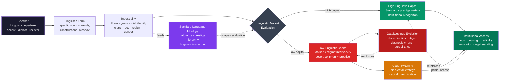

> [!abstract] TL;DR
> Language is not a neutral channel for information — it is a social arena in which accent, dialect, and register index the speaker's class, race, gender, and regional identity, and those indexes are evaluated against a prestige hierarchy that grants or withholds institutional access. Bourdieu's linguistic capital explains why "standard" speech confers material advantage; Peirce-Silverstein indexicality explains the semiotic mechanism by which sound and grammar acquire social meaning; and Gramsci's hegemony explains why the dominated come to naturalize their own linguistic disadvantage as a fair outcome.

---

## Intuition

**Analogy:** Imagine two equally skilled surgeons applying for the same senior hospital position. One grew up in a working-class district of Birmingham and speaks with a regional accent; the other grew up in a professional household in London and speaks received pronunciation — the variety associated with universities, the BBC, and the upper-middle class. Their publication records are identical. Their patient outcome data are identical. Their surgical technique scores are identical. Before either has answered a single interview question, the hiring panel has already formed judgments about "communication skills," "leadership presence," and "cultural fit." Both judgments derive entirely from accent. The Birmingham surgeon leaves without an offer.

This is not a one-off prejudice. It is a structural feature of how linguistic resources circulate in institutional life. The phonological, syntactic, and lexical choices a speaker makes are read — quickly, mostly unconsciously, and with real material consequences — as signals of their social position, education, and competence. Those readings shape hiring, lending, housing, legal judgment, and medical care. The study of language, identity, and power asks: how does a sound-pattern come to carry a social meaning? Why does one variety command prestige while another is stigmatized? Who benefits from that hierarchy, and how is it reproduced generation after generation even without explicit enforcement?

---

## How It Works

### Core Mechanics

Three interlocking mechanisms produce the language-power nexus:

1. **Indexicality** (the semiotic engine): linguistic forms — specific sounds, constructions, address forms, intonation patterns — become indices of social categories through repeated co-occurrence with speakers of those categories. The postvocalic /r/ in New York City speech, the use of *y'all* in the American South, the glottal stop in British English, the discourse particle *lah* in Singapore English — each form is statistically associated with a social group, and that association creates an interpretive link: hearers infer the speaker's identity from their speech, automatically and prior to evaluating propositional content.

2. **Linguistic capital in the linguistic market** (Bourdieu's economic engine): every institutional interaction — a job interview, a courtroom testimony, a mortgage consultation, a clinical encounter — is a "linguistic market" in which different varieties carry different exchange rates. The prestige variety (standard, educated, "accent-less" speech) commands high symbolic capital; marked, regional, or minority varieties command low institutional capital in those settings (though they may command high "covert prestige" within their home communities, where using them signals authenticity and group loyalty). Capital is unequally distributed along class, racial, and gender lines from birth, and it compounds through success-breeds-access cycles.

3. **Standard language ideology** (the legitimating engine): the dominant cultural belief that there exists one correct, educated, neutral variety of a language — an ideology so naturalized that it feels like an accurate description rather than a political preference. The standard is presented as simply "good English," not as the dialect of a particular class and region that acquired prestige through political and economic dominance. This ideology is hegemonic in Gramsci's sense: it is reproduced not primarily through coercion but through consent, including the consent of the stigmatized, who come to judge their own speech as "rough," "improper," or "uneducated." The ideology makes linguistic inequality invisible by reframing systematic discrimination as a reasonable response to linguistic inadequacy.

### Flow / Architecture



---

## Key Concepts

### Secondary Level

**Language as an identity badge**

Every time you speak, you broadcast information about yourself that you did not consciously choose to transmit. Your accent places you — often to within a few counties in your country of origin. Your choice of vocabulary situates you on an education spectrum. Your use of formal or informal registers signals your reading of the social situation. The words you use for everyday objects, time expressions, and terms of address all carry regional and generational fingerprints. Together, these features compose what sociolinguists call a **linguistic identity** — a set of signals that hearers use to place you in a social category.

The crucial insight is that this identity is not given in nature. It is **performed** — assembled from the available repertoire of forms in a speaker's community, deployed in ways that claim membership and signal allegiance. Judith Butler's concept of gender performativity applies directly: just as gender is not what you are but what you repeatedly do (enact through gesture, dress, affect), linguistic identity is not what you are but what you repeatedly say. A teenager who adopts the slang of a hip-hop community, a professional who code-switches into formal register for a job interview, a second-generation immigrant who simultaneously maintains a heritage language and a new-country accent — each is actively constructing identity through linguistic choice, not merely reporting a pre-existing fact about themselves.

This has real consequences. **Accent discrimination** — denying housing, employment, or services on the basis of how someone speaks — operates in courts, rental markets, and HR departments at scale. Studies using matched-guise tests (presenting identical content in different accents to blind listeners) consistently show that listeners rate identical speakers differently on intelligence, competence, and hireability based solely on accent. AAVE speakers are rated lower on "intelligence" scales than the same speakers reading in a standard American English accent. Non-native accented speakers receive fewer callbacks for job applications than native accented speakers with identical CVs.

**What is dialect?**

A dialect is a systematic, rule-governed variety of a language associated with a particular region or social group. Every speaker speaks a dialect — including speakers of the prestige variety. "Standard English" is a dialect: the dialect that happens to have been selected as the prestige form through historical, political, and economic processes (the court dialect, the printing press dialect, the BBC dialect). Calling standard English "English" and regional varieties "dialects" is itself a political act that naturalizes the prestige hierarchy.

All dialects are linguistically equal in their internal systematicity. The AAVE copula deletion rule ("She *Ø* happy" for "She is happy") is not a failure to acquire the copula — it is the systematic application of a different rule from standard American English, one with parallels in Russian, Arabic, and many other languages. The rule is learnable, generalizable, and followed consistently. What differs between dialects is not linguistic complexity or systematicity but social valuation.

---

### Undergraduate Level

#### Indexicality: From Form to Social Meaning

The theoretical apparatus for understanding how a sound comes to carry a social meaning comes from Peircean semiotics, developed for linguistics by Michael Silverstein in his theory of **orders of indexicality** and later systematized by Asif Agha in the concept of **enregisterment**.

**Charles Sanders Peirce** distinguished three types of sign relations:
- **Icon**: similarity relationship (a portrait resembles its subject).
- **Symbol**: arbitrary conventional relationship (the word *cat* means cat by convention).
- **Index**: existential/contiguous relationship (smoke indexes fire; a weathervane indexes wind direction).

Linguistic forms are indices when they co-occur reliably with social contexts or speakers — the co-occurrence creates an inferential link, so that encountering the form licenses an inference about the social context. Postvocalic /r/ in New York City co-occurs with working-class speakers in Labov's classic department-store study (1966): lower-class store employees said "fourth floor" with less /r/ than upper-class employees. The /r/ thereby became an index of class position.

**Michael Silverstein's orders of indexicality** distinguish how this indexical relationship operates at different levels of social awareness:

- **First-order indexicality**: a form is statistically correlated with a social group, but speakers are not consciously aware of the association. The form functions as an unconscious social marker. Example: /æ/-raising before nasal consonants in Chicago English — a Northern Cities Vowel Shift feature that differentiates Chicagoans from speakers of other American dialects, but which most Chicagoans cannot consciously describe.

- **Second-order indexicality**: speakers become consciously aware of the association between form and social group. The form now carries an explicitly recognized social meaning that can be activated, negotiated, or stigmatized. Example: New Yorkers consciously know that "New York accent" is a social marker; New York English speakers style-shift away from features like /r/-lessness in formal contexts.

- **Third-order indexicality**: the form becomes embedded in ideological frameworks that link it to moral or intellectual character traits — not merely "sounds like a New Yorker" but "sounds uneducated," "sounds trustworthy," "sounds dangerous." Third-order indexicality is where linguistic discrimination is legitimized: the form no longer merely indexes a social group but indexes a personality or moral type that justifies differential treatment.

**Enregisterment** (Agha 2003) names the social process by which a set of linguistic forms comes to be collectively recognized as constituting a distinctive "register" with particular social values attached. Enregisterment is mediated by cultural channels — media, literature, schooling, satire, advertising — that model and disseminate the association between forms and social meanings. The "Valley Girl" register, African American Vernacular English, "BBC English," and "Corporate Speak" are all enregistered varieties: bundles of features whose co-occurrence has been culturally consolidated into recognizable social personas.

#### Bourdieu's Linguistic Capital

Pierre Bourdieu's sociology of language (developed in *Language and Symbolic Power*, 1991) treats language as a form of capital that circulates in a market:

**The linguistic field and linguistic capital**: every society has an implicit "linguistic market" — a set of contexts in which speech is evaluated and exchanges occur. Different varieties carry different capital values: the prestige variety (standard, educated speech) commands high capital because it is recognized as legitimate by the institutions that distribute economic and social goods. Linguistic capital is thus convertible: it can be exchanged for economic capital (higher-paying jobs), social capital (access to prestigious networks), and cultural capital (recognition as educated, competent, authoritative).

**Habitus**: Bourdieu's concept of habitus is central to understanding why linguistic inequality feels natural. Habitus is the system of durable, transposable dispositions that individuals acquire through socialization — bodily and cognitive orientations toward the world that feel like second nature. A speaker who grew up in a professional-class household in which standard English was spoken at dinner, in which books were read aloud and syntax was corrected, has internalized a linguistic habitus that produces standard speech effortlessly and automatically. This is not intelligence or effort — it is accumulated practice. A speaker from a working-class household has an equally systematic, consistent, unconscious linguistic habitus — but one tuned to a variety that commands lower capital in institutional markets.

The tragedy of habitus is that it makes structural advantage feel like personal merit. The professional-class speaker does not experience their standard accent as a social advantage — they experience it as just how one speaks. The working-class speaker experiences their accent not as the systematically stigmatized output of a different socialization but as their own inadequacy. Bourdieu calls this **symbolic violence**: the dominated experience the dominant's arbitrary values as universal standards, and they contribute to their own subordination by accepting the evaluation of their linguistic capital as a fair measure of their worth.

**Code-switching as capital strategy**: speakers who control multiple varieties — bidialectal speakers, bilingual speakers — can strategically deploy their repertoire to maximize capital in different contexts. A Black professional who speaks AAVE at home and with family, and switches to standard American English in the corporate office, is performing what Rosina Lippi-Green calls "linguistic passing": accessing the institutional capital of the prestige variety while maintaining authentic community identity in home contexts. Code-switching is a rational capital-maximization strategy — but it also extracts a cognitive and emotional cost (the labor of constant monitoring) and a political cost (it can be perceived as racial inauthenticity by community members).

#### Language and Gender

Gender is one of the most studied social variables in sociolinguistics, with a history of theoretical revisions that tracks the broader development of feminist theory.

**Robin Lakoff's deficit model (1975)**: Lakoff's *Language and Woman's Place* proposed that women's speech is characterized by a cluster of features — hedges ("I think," "sort of"), tag questions ("It's a nice day, isn't it?"), polite indirection, and avoidance of profanity — that signal insecurity and subordination. Women's language is "deficient" relative to the male norm because it fails to project authority. This influential analysis was subsequently criticized for essentializing gender and treating men's speech as a neutral standard.

**The difference model (Tannen 1990)**: Deborah Tannen's *You Just Don't Understand* reframed gender-linked speech patterns as products of different socialization into different communicative cultures rather than deficits. Men's talk is oriented toward **report talk** — conveying information, establishing status, solving problems. Women's talk is oriented toward **rapport talk** — building connection, expressing solidarity, sharing feelings. The patterns are different, not deficient. Tannen's model was widely adopted in popular culture but criticized by linguists for treating gender styles as monolithic, ignoring power dynamics, and implicitly naturalizing gender differences by locating them in "culture" rather than structural inequality.

**The dominance model (Fishman, West, Zimmerman)**: Power-oriented approaches argue that the patterns Lakoff and Tannen described are not cultural style differences but effects of gender-based power asymmetry. Conversation analysis of mixed-gender interactions shows that men interrupt more, control topic changes more, and receive more conversational support from women. The asymmetries follow the contours of social power, not cultural difference.

**Queer linguistics and performativity**: Judith Butler's performativity theory, extended to language by Don Kulick, Kira Hall, and others, argues that gender identity is constituted through iterative performance — including linguistic performance. The queer community has been a site of intensive linguistic creativity: Polari (the covert argot used by gay men in mid-20th-century Britain), the innovations of gay male speech (specific intonation patterns, lexical creativity), and Ball culture's coinages (*shade*, *tea*, *reading*, *throwing shade*) that have since entered mainstream English. These varieties function simultaneously as community bonding devices and as covert resistance to heteronormative linguistic norms.

#### Language and Ethnicity: AAVE, Raciolinguistics, and Appropriation

**AAVE (African American Vernacular English)** is a systematic, fully rule-governed variety of American English spoken by many (not all) Black Americans, with origins in the contact varieties of the American South and West African languages. Its grammatical features — habitual *be* ("She be working late" = she works late habitually, distinct from "She is working late"), aspectual *done* ("I done told you"), copula deletion, negative concord — follow consistent rules that linguists have documented extensively since Labov's *Language in the Inner City* (1972). AAVE is not "broken English" or "lazy" Standard American English. It is a divergent dialect with its own grammar.

The stigmatization of AAVE is a case study in **linguistic racism** — the use of language-based judgments as a socially acceptable proxy for racial discrimination. "I won't hire someone who can't speak properly" is a statement about AAVE that can be made in workplaces where overt racial discrimination would be prosecuted. **Raciolinguistics** (Rosa and Flores 2017) analyzes this phenomenon: the "raciolinguistic ideologies" that link language to racialized bodies, so that a Black speaker using standard American English may still be perceived as "speaking Black" (the "raciolinguistic gaze" that hears a racialized body regardless of the linguistic signal), while a white speaker using AAVE features may be heard as "speaking white with affectations."

**Mock Spanish** (Jane Hill 1998) is the phenomenon by which Anglo-American speakers deploy Spanish words and phrases (*no problema*, *hasta la vista, baby*, *el cheapo*) for humor and indexical coolness, while simultaneously denigrating Spanish-speaking communities. The covert message of Mock Spanish is "Spanish is a funny language appropriate for adding spice to English" — a message that reproduces the subordination of Latinx communities even as it appropriates their linguistic resources. Mock Spanish is a case of asymmetric appropriation: stigmatized varieties can be borrowed when convenient for the dominant group (for authenticity, humor, style) while their speakers remain stigmatized.

---

### Graduate Level

#### Standard Language Ideology and Hegemony

**Standard language ideology** (Milroy and Milroy 1985; Lippi-Green 1997) is the belief that:
1. There exists a single correct form of a language.
2. This form is uniform, invariant, and without regional or social marking.
3. Other forms are deviations from this standard — corruptions, simplifications, lazy approximations.
4. The standard is the appropriate form for formal, institutional, and written contexts.
5. Education should promote the standard and correct deviations from it.

Every element of this ideology is empirically false:
- No variety of any living language is invariant — all varieties show systematic variation.
- "Standard English" is the dialect of the educated English professional class of the 17th-19th century, selected by the printing press, grammar schools, and colonial administration — not discovered as a natural linguistic optimum.
- Regional and social dialects are not corruptions; they are the result of the same historical processes that produced "standard" forms.
- The "correctness" of the standard is a social valuation, not a linguistic property.

Yet the ideology is socially real and has real consequences because it is institutionally enacted. Schools teach the standard and penalize dialect use. Publishers require standard orthography. Courts read non-standard-speaking witnesses as less credible. The ideology is reproduced through these institutional practices to such a degree that challenging it appears as ignorance rather than political critique.

The Gramscian concept of **hegemony** is the appropriate analytic frame: the standard language ideology is dominant not because it is enforced by the police (though it was, historically, in colonial contexts that banned indigenous languages) but because it has been internalized by educational systems, media, and — crucially — by the dominated themselves. Speakers who have been corrected, mocked, and excluded on the basis of their dialect frequently come to evaluate their own speech as inferior. This internalization — what Bourdieu would call symbolic violence — is the mechanism by which a linguistic hierarchy is reproduced without requiring constant external enforcement.

**Language in institutional gatekeeping**: John Gumperz's work on "gatekeeping encounters" — immigration interviews, job application interviews, academic admissions interviews — documented how interviewers systematically misread the discourse styles of speakers from different cultural backgrounds. Indian-English speakers' use of rising intonation in declarative statements (a feature of South Asian English prosody) was read by British interviewers as uncertainty or evasiveness. The outcome — rejection — was produced by a cross-cultural miscommunication that the interviewers attributed to the candidate's attitude or qualifications rather than to a prosodic feature of their variety of English. The institutional machine performs gatekeeping while remaining blind to its own linguistic ethnocentrism.

In **legal settings**, Conley and O'Barr's research on courtroom language showed that witnesses who used what they called "powerless language" (hedges, intensifiers, polite forms, question-intonation on statements) were judged less credible by mock jurors — and that women and working-class speakers disproportionately used these features. The structural design of legal cross-examination — which controls question type, paces testimony, and punishes narrative elaboration — systematically disadvantages speakers whose community discourse norms involve elaboration, contextualization, and narrative framing rather than the terse question-response sequence that legal procedure demands.

In **bureaucratic language**, Norman Fairclough's Critical Discourse Analysis (CDA) demonstrates how nominalization (converting actions to nouns: "we terminated his contract" becomes "contract termination occurred"), passive voice, and technical vocabulary systematically obscure agency and responsibility. "Mistakes were made," "civilian casualties resulted from the operation," "the account was closed due to non-compliance" — in each case, the agent who performed the action has been grammatically deleted. CDA treats these not as stylistic choices but as ideological practices that serve power by eliminating accountability from public discourse.

#### Critical Discourse Analysis

**Critical Discourse Analysis (CDA)** (Fairclough, van Dijk, Wodak) is a framework for analyzing how language use reproduces or challenges power structures. Its central claim is that discourse is not merely a reflection of social reality but a constitutive element of it: the categories we use to describe social groups, the metaphors we deploy for social processes, and the presuppositions built into everyday language actively shape what is thinkable and doable in a society.

**Discourse** in Foucault's sense — the systematized frameworks of knowledge that define what counts as truth, which subjects can speak authoritatively, and what can and cannot be said within a given domain — provides the theoretical backdrop. Medical discourse constitutes the "patient" and the "healthy subject" as categories with particular relationships to authority; legal discourse constitutes "criminal" and "victim"; educational discourse constitutes "intelligent" and "learning-disabled." Each of these categories is reproduced through language — in forms, diagnoses, reports, and institutional talk — and each has material consequences for the bodies it classifies.

**Van Dijk's socio-cognitive approach** analyzes how group-based ideologies are encoded in the micro-level structures of discourse: who is mentioned by name and who is described by category; which actions are represented as agentive and which as passive events; which perspectives are reported as fact and which are attributed to specific speakers; what is presupposed as obvious and what requires explicit assertion. Racist ideologies, for instance, are reproduced not primarily through overt racist statements but through the systematic encoding in news language of crime as associated with ethnic minorities, welfare as associated with race, and immigration as associated with threat.

#### Language Revitalization as a Power Struggle

Language death is not biological — it is political. Languages do not die because speakers lose the ability to speak them; they die because intergenerational transmission breaks when children are socialized into a dominant language instead of a minority one. The mechanism is always social: colonial imposition, economic incentive, educational pressure, media saturation. Irish nearly died in Ireland not because Irish speakers forgot Irish but because British colonial schooling punished children for using it (the "tally stick" or *bata scóir* counted punishments). Welsh nearly died in Wales because the 1847 "Blue Books" education report described Welsh as a barrier to civilization and established English-only schools.

Language revitalization programs — the Welsh medium-instruction model, the Hawaiian *Pūnana Leo* language nests, the Māori *Kura Kaupapa*, the successful case of modern Hebrew — are thus not merely cultural preservation efforts. They are counter-hegemonic political projects that challenge the symbolic equation of minority language with backwardness and dominant language with modernity and opportunity. The linguistic market must be restructured so that the minority language commands capital — in employment, in prestige, in social mobility — if revitalization is to succeed against the powerful incentive structure that pushes parents toward dominant-language socialization for their children's futures.

---

## Python Demo

```python
import numpy as np
import matplotlib
matplotlib.use("Agg")
import matplotlib.pyplot as plt

# ---------------------------------------------------------------
# Linguistic Capital as Social Stratification Engine
#
# 200 agents in 3 social classes (upper / middle / lower).
# Each agent has:
#   - ling_cap: linguistic capital score (prestige of variety, 0..1)
#     initialized by class, with individual noise (equal "talent")
#   - talent: equal across all agents — the key manipulation
#   - status: cumulative social outcomes (starts at 0)
#
# In each of 60 rounds, every agent faces 5 independent
# "gatekeeping" opportunities (job interviews, loan applications,
# housing inquiries). Success probability is a weighted combination
# of talent (30%) and linguistic capital (70%) — reflecting the
# documented reality that institutional gatekeeping is heavily
# inflected by variety prestige beyond actual competence.
#
# Code-switching: 20% of lower-class agents have learned the
# prestige variety and gain a +0.35 effective-capital boost in
# interactions. This models the bidialectal strategy documented
# in AAVE / Standard American English research.
#
# Matthew effect: successful agents gain fractional linguistic
# capital growth (network access, educational exposure) — modeling
# the compounding dynamic Bourdieu's framework predicts.
# ---------------------------------------------------------------

rng = np.random.default_rng(42)

N = 200
ROUNDS = 60
OPPS_PER_ROUND = 5
TALENT_WEIGHT = 0.30
LING_WEIGHT = 0.70
CS_BOOST = 0.35       # code-switching effective capital boost
MATTHEW_GAIN = 0.006  # linguistic capital gained per successful interaction

# --- Agent initialization ------------------------------------------

# Class composition: upper=40, middle=80, lower=80
classes = np.array([0] * 40 + [1] * 80 + [2] * 80)

# Linguistic capital base by class (reflects socialization)
ling_cap_base = {0: 0.82, 1: 0.52, 2: 0.22}
noise = rng.normal(0, 0.04, N)
ling_cap = np.array([ling_cap_base[c] for c in classes]) + noise
ling_cap = np.clip(ling_cap, 0.05, 1.0)

# Talent: EQUAL across all classes — the key manipulation
talent = 0.50 * np.ones(N) + rng.normal(0, 0.04, N)
talent = np.clip(talent, 0.1, 1.0)

# Code-switchers: 20% of lower-class agents (16 of 80)
lower_indices = np.where(classes == 2)[0]
cs_indices = rng.choice(lower_indices, size=16, replace=False)
code_switcher = np.zeros(N, dtype=bool)
code_switcher[cs_indices] = True

# Status: cumulative social outcomes
status = np.zeros(N)

# --- Group masks ---------------------------------------------------
upper_mask = classes == 0
middle_mask = classes == 1
lower_mask = classes == 2
lower_cs_mask = code_switcher
lower_ncs_mask = lower_mask & ~code_switcher

# --- Tracking arrays -----------------------------------------------
status_upper = np.zeros(ROUNDS + 1)
status_middle = np.zeros(ROUNDS + 1)
status_lower = np.zeros(ROUNDS + 1)
status_lower_cs = np.zeros(ROUNDS + 1)
status_lower_ncs = np.zeros(ROUNDS + 1)
cap_upper = np.zeros(ROUNDS + 1)
cap_middle = np.zeros(ROUNDS + 1)
cap_lower_ncs = np.zeros(ROUNDS + 1)
cap_lower_cs = np.zeros(ROUNDS + 1)

def record(r):
    status_upper[r] = status[upper_mask].mean()
    status_middle[r] = status[middle_mask].mean()
    status_lower[r] = status[lower_mask].mean()
    status_lower_cs[r] = status[lower_cs_mask].mean()
    status_lower_ncs[r] = status[lower_ncs_mask].mean()
    cap_upper[r] = ling_cap[upper_mask].mean()
    cap_middle[r] = ling_cap[middle_mask].mean()
    cap_lower_ncs[r] = ling_cap[lower_ncs_mask].mean()
    cap_lower_cs[r] = ling_cap[lower_cs_mask].mean()

record(0)

# --- Simulation ----------------------------------------------------
for r in range(1, ROUNDS + 1):
    for _ in range(OPPS_PER_ROUND):
        # Effective capital: code-switchers get a boost in interactions
        eff_cap = ling_cap.copy()
        eff_cap[code_switcher] = np.minimum(
            ling_cap[code_switcher] + CS_BOOST, 1.0
        )
        # Success probability: talent + linguistic capital bias
        p_success = TALENT_WEIGHT * talent + LING_WEIGHT * eff_cap
        p_success = np.clip(p_success, 0.0, 1.0)
        # Independent Bernoulli trial per agent per opportunity
        outcomes = rng.random(N) < p_success
        status += outcomes.astype(float)
        # Matthew effect: success → fractional capital growth
        ling_cap += outcomes * MATTHEW_GAIN
        ling_cap = np.clip(ling_cap, 0.0, 1.0)
    record(r)

rounds = np.arange(ROUNDS + 1)

# --- Print summary statistics ---------------------------------------
print("=" * 68)
print("Linguistic Capital Simulation — Summary at Round 60")
print("=" * 68)
print(f"  Talent weight in outcomes : {TALENT_WEIGHT:.0%}  (equal across all agents)")
print(f"  Ling. capital weight      : {LING_WEIGHT:.0%}")
print(f"  Code-switching boost      : +{CS_BOOST:.2f} effective capital")
print()
print("  Group              | Initial Ling. Cap | Final Status | Δ Cap")
print("  -------------------+-------------------+--------------+------")
groups = [
    ("Upper (40)",           upper_mask,    cap_upper),
    ("Middle (80)",          middle_mask,   cap_middle),
    ("Lower–no CS (64)",     lower_ncs_mask, cap_lower_ncs),
    ("Lower–code-sw. (16)", lower_cs_mask, cap_lower_cs),
]
for name, mask, cap_series in groups:
    init_cap = np.array([ling_cap_base[c] for c in classes])[mask].mean()
    print(f"  {name:<22} | {init_cap:>17.3f} | "
          f"{status[mask].mean():>12.1f} | "
          f"+{cap_series[-1] - cap_series[0]:.4f}")
print()
print("  Status gap (upper vs lower-NCS) : "
      f"{status_upper[-1] - status_lower_ncs[-1]:.1f} points")
print("  CS advantage over lower-NCS     : "
      f"{status_lower_cs[-1] - status_lower_ncs[-1]:.1f} points")
gap_middle = status_middle[-1] - status_lower_ncs[-1]
gap_cs = status_lower_cs[-1] - status_lower_ncs[-1]
print(f"  CS closes {100*gap_cs/gap_middle:.0f}% of the middle-class status gap")
print()
print("  Linguistic inequality compounding:")
print(f"    Upper capital growth   : +{cap_upper[-1]-cap_upper[0]:.4f}")
print(f"    Lower NCS capital growth: +{cap_lower_ncs[-1]-cap_lower_ncs[0]:.4f}")
print("    (Upper agents gain more capital because higher initial capital")
print("     produces more successes, which compound via Matthew effect.)")

# --- Plotting -------------------------------------------------------
fig, axes = plt.subplots(1, 3, figsize=(17, 5))
fig.suptitle(
    "Linguistic Capital Simulation: Equal Talent, Unequal Outcomes\n"
    "200 agents · 3 classes · Talent weight 30% · Linguistic capital weight 70% · 60 rounds",
    fontsize=10, fontweight="bold"
)

# Panel 1: Status accumulation by class
ax1 = axes[0]
ax1.plot(rounds, status_upper, color="#ef4444", lw=2.2, label="Upper (40)")
ax1.plot(rounds, status_middle, color="#f59e0b", lw=2.2, label="Middle (80)")
ax1.plot(rounds, status_lower, color="#3b82f6", lw=2.2, label="Lower (80)")
ax1.fill_between(rounds, status_upper, status_lower,
                 alpha=0.07, color="#ef4444")
ax1.set_title("Status Accumulation by Class\nEqual talent — outcomes diverge by ling. capital",
              fontsize=9)
ax1.set_xlabel("Round", fontsize=8)
ax1.set_ylabel("Cumulative social status", fontsize=8)
ax1.legend(fontsize=7.5)
ax1.grid(alpha=0.2)

# Panel 2: Code-switching closes (but does not eliminate) the gap
ax2 = axes[1]
ax2.plot(rounds, status_lower_ncs, color="#6366f1", lw=2.2,
         label="Lower – no code-switch (64)")
ax2.plot(rounds, status_lower_cs, color="#10b981", lw=2.2,
         label="Lower – code-switchers (16)")
ax2.plot(rounds, status_middle, color="#f59e0b", lw=1.5,
         linestyle="--", alpha=0.75, label="Middle (reference)")
ax2.set_title("Code-Switching: Partial Mobility\nCSwitchers approach but rarely reach middle class",
              fontsize=9)
ax2.set_xlabel("Round", fontsize=8)
ax2.set_ylabel("Cumulative social status", fontsize=8)
ax2.legend(fontsize=7.5)
ax2.grid(alpha=0.2)

# Panel 3: Linguistic capital drift — Matthew effect
ax3 = axes[2]
ax3.plot(rounds, cap_upper, color="#ef4444", lw=2.2, label="Upper")
ax3.plot(rounds, cap_middle, color="#f59e0b", lw=2.2, label="Middle")
ax3.plot(rounds, cap_lower_ncs, color="#6366f1", lw=2.2,
         label="Lower – no code-switch")
ax3.plot(rounds, cap_lower_cs, color="#10b981", lw=2.2,
         label="Lower – code-switchers")
ax3.set_title("Linguistic Capital Drift (Matthew Effect)\nHigh capital → more success → more capital",
              fontsize=9)
ax3.set_xlabel("Round", fontsize=8)
ax3.set_ylabel("Mean linguistic capital", fontsize=8)
ax3.legend(fontsize=7.5)
ax3.grid(alpha=0.2)

plt.tight_layout()
plt.savefig("linguistic_capital_simulation.png", dpi=110, bbox_inches="tight")
plt.show()
```

**What the simulation demonstrates:**

- **Panel 1 (status divergence):** Even though every agent has identical mean talent, the three classes diverge immediately and the gap grows throughout the simulation. The divergence is entirely attributable to the unequal distribution of initial linguistic capital — which was set by class of origin (socialization), not individual ability. This is Bourdieu's linguistic market in numerical form.
- **Panel 2 (code-switching mobility):** Code-switching raises lower-class agents' effective capital by 0.35 points in each interaction, producing measurable mobility — they outperform non-switching lower-class peers and approach (but typically do not reach) the middle-class trajectory. The residual gap persists because initial ling_cap remains lower, and because the Matthew effect compounds from a lower base. This models the documented reality that bidialectal Black professionals who code-switch in corporate settings gain real advantage while remaining disadvantaged relative to agents who were socialized into prestige speech from birth.
- **Panel 3 (Matthew effect in capital):** Because successful interactions generate small capital increments, and because upper-class agents have more successes, the initial capital gap *widens* over time — not just the status gap. This is the compounding mechanism: access to prestigious networks, elite education, and institutional recognition all reinforce and grow one's linguistic capital, while exclusion from those same networks leaves lower-class capital stagnant.

---

## Real-World Applications

> **Linguistic profiling in housing (US):** John Baugh (2003) coined "linguistic profiling" to describe the practice of discriminating against rental or mortgage applicants on the basis of voice-only phone calls. In paired-test audits, callers with AAVE-associated phonology were significantly more likely to be told apartments were unavailable than callers with General American English phonology for the same listing, on the same day. Courts have upheld Fair Housing Act claims based on this evidence. Linguistic profiling is legally actionable racial discrimination, but it is operationally invisible — the discriminating landlord never has to state a racial criterion.

> **Courtroom credibility and the language of power (O'Barr 1982):** William O'Barr's systematic analysis of courtroom testimony found that witnesses using "powerless language" features — hedges ("I think it was around 8"), intensifiers ("a very short time"), polite forms, and "sir/ma'am" address — were rated as less credible and less competent by mock jurors than witnesses using "powerful" language with direct, unhedged assertions. Powerless language was disproportionately associated with lower-status witnesses. The legal system thus encodes a class-linked linguistic ideology as a procedural fact about witness credibility.

> **English-only policies in US workplaces:** Many US workplaces have implemented English-only policies requiring employees to speak only English during working hours, even in break rooms and private conversations. Courts have generally upheld these policies when "business necessity" is demonstrated. The EEOC has warned that blanket policies violate Title VII when language is used as a proxy for national origin discrimination. The policies reveal how the linguistic market is institutionally enforced: multilingualism is treated not as a resource but as a liability, and the cost is borne entirely by minority-language speakers.

> **Welsh language policy as counter-hegemonic action:** The Welsh Language Acts (1967, 1993) and the establishment of S4C Welsh-language television (1982) represent a case of state-level linguistic market restructuring. By making Welsh an official language of administration, requiring bilingual signage, funding Welsh-medium schools, and creating Welsh-language media, the Welsh state assigned institutional capital to a minority language that had been functionally stigmatized for centuries. Welsh is now spoken by over 800,000 people, with the proportion of Welsh-medium school enrollment rising. The lesson: reversing linguistic inequality requires restructuring the institutional market, not merely changing attitudes.

> **Call center accent training and "linguistic imperialism" (Phillipson 1992):** In outsourced call centers in India, the Philippines, and elsewhere, workers undergo "accent neutralization" training to approximate American or British English phonology. This training — often called "accent softening" — requires workers to suppress their native phonological habits and adopt features of a prestige foreign variety: vowel quality, intonation, rhythm. The training is a textbook case of Phillipson's linguistic imperialism: the economic hegemony of English-speaking nations extends into the most intimate dimension of the body, the voice, requiring workers to enact a linguistic identity that is not their own as a condition of economic participation.

---

## Common Pitfalls

- **Conflating "accent" with "language ability"** — Accent is a set of phonological features determined by the variety of a language one was first exposed to; it has no bearing on grammar, vocabulary, or communicative competence. Native speakers always have accents (including standard-variety speakers). Evaluating a non-native or regional speaker's competence from their accent is a category error that is also, typically, a form of discrimination. Students of sociolinguistics must internalize this distinction before they can analyze gatekeeping research.

- **Treating code-switching as linguistic deficiency** — A bilingual or bidialectal speaker who code-switches within a sentence or conversation is not failing to maintain a language; they are displaying sophisticated metalinguistic awareness and pragmatic competence. Intra-sentential code-switching follows grammatical constraints and is a mark of fluency in both varieties, not confusion between them. The persistent popular belief that code-switching is "confused" or "impure" is itself an expression of standard language ideology.

- **Assuming Bourdieu's "field" is everywhere the same** — Linguistic capital is not a universal property of a variety; it is field-specific. AAVE has low capital in a corporate board meeting and potentially high capital in a hip-hop recording session or a community organizing meeting. A thick regional Irish accent may have low capital in London finance and high capital in a Dublin political campaign. Applying Bourdieu requires specifying which institutional field is under analysis, not treating prestige as a fixed property of varieties.

- **Misreading Lakoff's tag questions** — Lakoff's claim that women use more tag questions as a mark of linguistic insecurity has been repeatedly qualified by subsequent research. Tag questions have multiple pragmatic functions: they can be uncertainty-expressing ("It's a nice day, isn't it?"), facilitating (encouraging the hearer to take the floor), or aggressive ("You're not going to do that again, are you?"). A higher rate of tag questions does not in itself indicate subordination; the function must be analyzed in context. Applying Lakoff uncritically reproduces the stereotype it claims to analyze.

- **Conflating language ideology with language attitude** — Language attitudes are individual psychological orientations toward language varieties (beliefs, feelings, behavioral intentions). Language ideologies are socially shared, historically situated belief systems about language that naturalize social hierarchies. The distinction matters: attitude research can change by changing individual minds; ideology research requires analyzing the structural institutions (schools, media, legal systems) that reproduce the beliefs. Treating standard language ideology as merely a collection of individual attitudes misses its systemic character.

- **Underestimating the cost of code-switching** — Research on "covering" and identity work in professional settings (Kenji Yoshino) shows that the cognitive and emotional labor of maintaining a masked identity — monitoring one's speech, suppressing habitual features, performing an identity that is not one's primary one — produces measurable stress, cognitive load, and psychological harm. Code-switching is a rational capital strategy, but presenting it as simply "pragmatic" or "skillful" without acknowledging its cost naturalizes a system that requires the dominated to labor invisibly to access rights that the dominant receive automatically.

---

## Related Concepts

- [[Language_and_Linguistics_Overview]] — introduces sociolinguistics as one of the three major use-oriented subfields, alongside historical linguistics and typology; the synchronic/diachronic distinction and the langue/parole dichotomy are foundational theoretical commitments that the power-focused sociolinguistics tradition both inherits and challenges.

- [[Discourse_Power_and_Identity]] — the anthropological treatment of the same terrain: Foucauldian discourse analysis, indexicality, gatekeeping encounters, and raciolinguistics are covered in complementary depth; this note is the linguistic treatment, while that note provides the broader ethnographic and anthropological framing.

- [[Social_Class_and_Stratification]] — Bourdieu's capital theory (economic, cultural, social) is the parent framework within which linguistic capital is one subspecies; habitus, field, and symbolic violence operate at the level of class, and the linguistic capital analysis in this note is an application of those concepts to language.

- [[Race_Ethnicity_and_Racism]] — raciolinguistics, AAVE stigmatization, linguistic profiling, and Mock Spanish are specific applications of racial hierarchy to the linguistic domain; the mechanisms of racialization studied in that note (racial formation theory, racial ideology) operate through linguistic channels documented here.

- [[Gender_Sex_and_Patriarchy]] — the Lakoff/Tannen/dominance-model debate in language and gender is a specific application of the broader sociological debates about gender inequality; the performativity frameworks (Butler) developed in feminist theory directly motivate the linguistic performativity approach in queer linguistics.

- [[Identity_Stigma_and_Impression_Management]] — Goffman's concepts of stigma, passing, covering, and impression management apply directly to linguistic identity: speakers with stigmatized varieties manage their linguistic presentation strategically; the "stigma symbols" of speech work exactly as Goffman's framework predicts.

- [[Conflict_Theory_and_Critical_Theory]] — Gramsci's hegemony is the theoretical backbone of standard language ideology and CDA; Althusser's ideological state apparatus analysis applies to schools as sites of linguistic capital reproduction; the Frankfurt School's critique of ideology informs CDA's analysis of media language.

- [[Semiotics_and_Symbolic_Communication]] — Peirce's three-way sign classification (icon/index/symbol) is the semiotic foundation of indexicality theory; Silverstein's orders of indexicality and Agha's enregisterment are direct developments of Peircean semiotics applied to sociolinguistic variation.

- [[Culture_Norms_Values_and_Ideology]] — language ideologies are a species of cultural ideology: socially shared beliefs about what constitutes good, correct, or appropriate language that naturalize existing social hierarchies; the mechanisms of ideological naturalization and misrecognition work the same way whether the domain is language, family structure, or economic relations.

- [[Education_and_Social_Reproduction]] — Bourdieu and Passeron's *Reproduction in Education, Society and Culture* (1977) is the foundational analysis of how schools reproduce class inequality partly through linguistic capital: children from middle-class families arrive already possessing the linguistic habits (habitus) that schools reward and call "intelligence."

- [[Prejudice_and_Discrimination]] — accent discrimination, linguistic profiling, and language-based hiring bias are forms of prejudice and discrimination documented by the same matched-guise and audit-study methods used in racial discrimination research; the psychology of categorical perception (hearing a racialized body from a voice) connects to attribution error and in-group/out-group dynamics.

---

## Review Questions

### Secondary

1. Two students hand in identical essays to a teacher. The teacher reads them aloud and gives one a higher grade, claiming it is "better written." A linguist suspects the teacher was influenced by accent rather than content. What kind of experiment could test whether accent affected the evaluation, and what control would be needed?
2. A company policy requires all employees to speak only English at work. An employee argues this policy discriminates against native Spanish speakers even though it technically applies to everyone equally. How would a sociolinguist analyze this policy — is it discriminatory even if "language-neutral" on its face?
3. What is code-switching, and why would a sociolinguist say it demonstrates linguistic skill rather than linguistic confusion?

### Undergraduate

1. Silverstein's three orders of indexicality distinguish between statistical correlation, conscious social meaning, and ideological loading. Apply all three orders to a specific feature of a contemporary variety — for example, the "vocal fry" (creaky voice) increasingly documented in young women's speech in the US. What would a first-order, second-order, and third-order analysis of vocal fry look like, and at which order does discrimination become possible?
2. Bourdieu argues that linguistic capital reproduces social inequality while appearing to reward individual merit. A critic responds: "But standard language competence is genuinely useful in professional settings — employers aren't irrational to prefer it." How would a Bourdieuian respond to this argument? Is the critic wrong, partially right, or making a different kind of argument than Bourdieu's framework is targeting?
3. Tannen's "difference" model and the "dominance" model (Fishman, West, Zimmerman) disagree about whether gender differences in conversation are effects of culture or power. Describe one empirical finding from conversation analysis research that the dominance model explains better than the difference model, and one finding that the difference model explains better. Which framework has stronger empirical support, and why?

### Graduate

1. Raciolinguistics (Rosa and Flores) argues that the "raciolinguistic gaze" means that Black speakers using standard American English may still be perceived as "speaking Black" — i.e., that race is heard independent of the actual linguistic signal. If this is true, code-switching into the prestige variety does not fully neutralize the disadvantage for racialized speakers. What evidence would distinguish the raciolinguistic gaze hypothesis from the alternative that discrimination tracks actual phonological features of AAVE, and what methodological challenges arise in designing that study?
2. Gramsci's hegemony distinguishes between domination by consent and domination by force. Standard language ideology is maintained largely by consent — including the consent of stigmatized speakers who have internalized the valuation of their own dialect as inferior. What would "counter-hegemonic" linguistic politics look like in practice? Consider at least two institutional domains (school, media, law, workplace) and assess the structural obstacles to changing the linguistic market in each.
3. Critical Discourse Analysis (Fairclough, van Dijk) claims that discourse is not merely reflective of ideology but constitutive of it — that the categories, metaphors, and presuppositions of everyday language actively produce the social world rather than just describing it. A strong constructivist reads from this that changing language could change social reality. A structuralist objects that language change follows from structural change, not the reverse. Evaluate both positions by reference to at least two empirical cases (e.g., language policy in postcolonial states, gender-neutral pronoun adoption, corporate diversity language), and formulate a defensible middle position on the language-society causation question.

---

## Sources

- [Bourdieu, P. (1991). *Language and Symbolic Power*, trans. G. Raymond & M. Adamson. Harvard University Press](https://www.hup.harvard.edu/catalog.php?isbn=9780674510357)
- [Labov, W. (1966). *The Social Stratification of English in New York City*. Center for Applied Linguistics](https://www.cambridge.org/core/books/social-stratification-of-english-in-new-york-city/3EBBBF7E95B1E5B7B82E0AC40B7EF53B)
- [Labov, W. (1972). *Language in the Inner City: Studies in the Black English Vernacular*. University of Pennsylvania Press](https://www.upenn.edu/pennpress/book/toc/00867.html)
- [Silverstein, M. (2003). "Indexical Order and the Dialectics of Sociolinguistic Life." *Language & Communication* 23(3–4), 193–229](https://doi.org/10.1016/S0271-5309(03)00013-2)
- [Agha, A. (2003). "The Social Life of Cultural Value." *Language & Communication* 23(3–4), 231–273](https://doi.org/10.1016/S0271-5309(03)00014-4)
- [Lakoff, R. (1975). *Language and Woman's Place*. Harper & Row](https://www.cambridge.org/core/books/language-and-womans-place/CE9BCE1793AC3F3B2C6F7C0BCCE3A4BF)
- [Tannen, D. (1990). *You Just Don't Understand: Women and Men in Conversation*. William Morrow](https://deborah-tannen.com/books/you-just-dont-understand/)
- [Lippi-Green, R. (1997). *English with an Accent: Language, Ideology, and Discrimination in the United States*. Routledge](https://www.routledge.com/English-with-an-Accent/Lippi-Green/p/book/9780415559102)
- [Milroy, J. & Milroy, L. (1985). *Authority in Language: Investigating Standard English*. Routledge](https://www.routledge.com/Authority-in-Language-Investigating-Standard-English/Milroy-Milroy/p/book/9780415292894)
- [Hill, J.H. (1998). "Language, Race, and White Public Space." *American Anthropologist* 100(3), 680–689](https://doi.org/10.1525/aa.1998.100.3.680)
- [Rosa, J. & Flores, N. (2017). "Unsettling Race and Language: Toward a Raciolinguistic Perspective." *Language in Society* 46(5), 621–647](https://doi.org/10.1017/S0047404517000562)
- [Fairclough, N. (1989). *Language and Power*. Longman](https://www.routledge.com/Language-and-Power/Fairclough/p/book/9781138228566)
- [Baugh, J. (2003). "Linguistic Profiling." In *Black Linguistics: Language, Society and Politics in Africa and the Americas*, ed. Makoni et al. Routledge](https://www.routledge.com/Black-Linguistics/Makoni-Smitherman-Ball-Spears/p/book/9780415261791)
- [Phillipson, R. (1992). *Linguistic Imperialism*. Oxford University Press](https://global.oup.com/academic/product/linguistic-imperialism-9780194371469)
- [Gumperz, J.J. (1982). *Discourse Strategies*. Cambridge University Press](https://www.cambridge.org/core/books/discourse-strategies/95D1D8A76B1E8C77E3A3C5B71F3A8B8B)
- [O'Barr, W.M. (1982). *Linguistic Evidence: Language, Power, and Strategy in the Courtroom*. Academic Press](https://www.elsevier.com/books/linguistic-evidence/obarr/978-0-12-523680-5)
- [Conley, J.M. & O'Barr, W.M. (1990). *Rules Versus Relationships: The Ethnography of Legal Discourse*. University of Chicago Press](https://press.uchicago.edu/ucp/books/book/chicago/R/bo3626027.html)

---

#Linguistics #Sociolinguistics #LanguageIdentity
