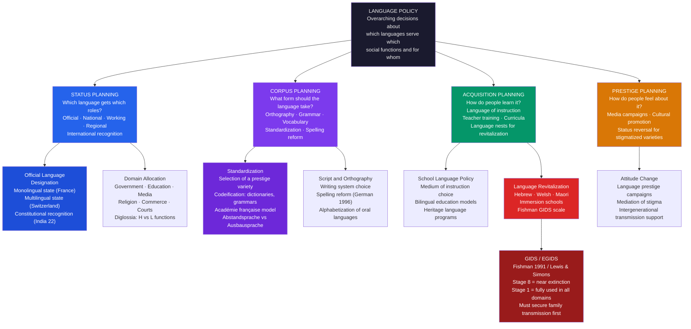

> [!abstract] TL;DR
> Language policy and planning (LPP) is the deliberate, organized effort by governments, institutions, and communities to influence which languages are used where, for what purposes, and with what prestige — covering everything from designating official languages and standardizing orthography to reviving endangered tongues and managing the global spread of English. It is where linguistics meets power: every language policy is simultaneously a linguistic, educational, political, and human rights decision.

---

## Intuition

**Analogy:** Imagine that a new country has just been founded after independence, and its first parliament must decide: which language will the courts use? Which language will children be taught in? Which language will appear on money and road signs? The parliament includes speakers of three languages — one spoken by 60% of the population, one that was the colonial administrative language and is associated with international trade and prestige, and one spoken by a 10% minority with deep historical roots in the region. There is no "neutral" choice. Every option distributes opportunity and dignity unequally. Choosing the majority language marginalizes the minority. Keeping the colonial language is efficient but perpetuates colonial hierarchies. Reviving the historical minority language is symbolically powerful but requires decades of education investment. Each choice is simultaneously a linguistic decision, a political deal, and a social contract.

This is the situation that every newly independent state in the 20th century faced, and it is the central problem of language policy and planning: language is never just communication infrastructure. It is the medium through which people access education, employment, courts, healthcare, and public life. To designate a language as "official" is to distribute access to power, and to neglect a language is to make its speakers invisible.

---

## How It Works



---

## Key Concepts

### Secondary Level

**What Is Language Policy and Planning?**

Language policy (LP) refers to the authoritative decisions — by states, institutions, communities, or international bodies — about which languages are used where, by whom, and for what purposes. A government deciding that French is the sole official language of France, that Canadian federal services must be available in English and French, or that Hawaiian must be taught in public schools is making language policy. A school board choosing English as the medium of instruction for immigrant children, a corporation requiring English in all internal communications, or an indigenous community establishing a language immersion program are also making language policy — at different scales.

Language planning (LPP) is the deliberate, organized, sustained effort to implement those policies: developing dictionaries, training teachers, standardizing orthography, running media campaigns, establishing language academies. Policy is the decision; planning is the implementation.

**Explicit vs. Implicit Policy**

Language policy is not always written down. *Explicit policy* includes formal language laws, constitutional provisions designating official languages, language rights legislation, and educational language mandates — documents you can point to. *Implicit policy* is embedded in institutional practices: the language used in government offices, the language of textbooks, the language expected in courts, the language that signals professionalism. A country may never formally legislate against a minority language while consistently excluding it from every domain that matters. In this sense, *silence* is a policy: the failure to recognize a language is itself a choice that systematically disadvantages its speakers.

**Haugen's Taxonomy: The Four Types of Language Planning**

Einar Haugen, the Norwegian-American linguist who founded the field in the 1960s, produced the most influential taxonomy of language planning activities, subsequently expanded by Robert Cooper. Four types are now standard:

| Type | Question | Examples |
|------|----------|---------|
| **Status planning** | Which language gets which social functions? | Designating Swahili as national language of Tanzania; making Welsh co-official in Wales |
| **Corpus planning** | What form should the language take? | Standardizing spelling; creating new vocabulary; choosing between dialects for a written standard |
| **Acquisition planning** | How will people come to know and use the language? | Setting the medium of instruction; establishing teacher training programs; creating language nests |
| **Prestige planning** | How do people feel about the language? | Campaigns to reverse stigma attached to minority languages; promoting Welsh on road signs; Duolingo Welsh |

These four types interact: there is no point standardizing a corpus if the status planning does not give the language a function to serve, and acquisition planning fails without prestige planning to make the language desirable.

**The Language vs. Dialect Problem**

Before exploring policy, a definitional pitfall: the boundary between a "language" and a "dialect" is not linguistic but political. The linguist Max Weinreich observed that "a language is a dialect with an army and a navy" — Norwegian, Danish, and Swedish are mutually intelligible (Scandinavians can largely understand each other) but count as separate languages because they have separate states and national identities. Conversely, Cantonese and Mandarin are mutually unintelligible but are grouped under "Chinese" for political reasons. The implication for language policy is significant: the question "which language to use?" often conceals a deeper question about which communities, identities, and political units are being recognized.

**Official Language Designation**

When a state designates one or more languages as "official," it determines which language is used in legislation, courts, government services, and education. The range of arrangements is wide:

- **Monolingual states:** France (French) and Iceland (Icelandic) maintain single official languages, though both contain significant minority language speakers (Breton, Alsatian in France; no significant minorities in Iceland). France's approach — mandating French in all official contexts — represents the assimilationist pole of language policy.
- **Bilingual states:** Canada has English and French as co-official languages at the federal level, with New Brunswick the only officially bilingual province. Switzerland has four national languages (German, French, Italian, Romansh) and uses the territorial principle: each canton is officially monolingual in its majority language.
- **Multilingual states:** India recognizes 22 "scheduled languages" in the Eighth Schedule of the Constitution, with Hindi and English as official languages of the Union. South Africa recognizes 11 official languages. These arrangements face the pragmatic challenge that multilingual government is extremely expensive: every official document must appear in every official language.
- **Post-colonial language choices:** After independence, many African and Asian states chose between retaining the colonial language (English, French, Portuguese) — efficient because of its established use in administration and education, but perpetuating colonial hierarchies — and promoting an indigenous language — symbolically powerful but requiring massive investment to build technical vocabulary, train teachers, and produce textbooks. Tanzania chose Swahili (a successful case); most West African states retained French or English for formal functions while acknowledging indigenous languages in education.

**Language and Nation-Building**

The modern nation-state was built partly through language standardization. Anderson's *Imagined Communities* (1983) argues that print capitalism — the production of newspapers and novels in standardized vernacular languages — created the shared imaginative space of national identity. When the French Revolution declared all citizens equal before the law and then insisted they must speak French to access that equality, language policy became state-building: the creation of a French-speaking citizenry from Breton, Occitan, Alsatian, and Basque speakers was the linguistic dimension of making France. This conflation of national unity with linguistic unity has driven monolingual policies worldwide — and continues to generate conflict wherever minority language speakers resist.

---

### Undergraduate Level

**Corpus Planning: Standardization as Political Act**

Corpus planning — deciding what form a language should take — seems purely technical but is deeply political. Every standard language is built on a real dialect: the dialect of a politically powerful region, a prestigious capital, or an economically dominant community. When European states standardized their written languages in the 16th and 17th centuries, the chosen variety became "the language" and other varieties became "dialects" or "accents." The Florentine dialect of Dante, Boccaccio, and Petrarch became standard Italian. The dialect of Paris and the Loire Valley became standard French. The choices were never linguistically motivated — no dialect is intrinsically more systematic or expressive than any other — but were determined by where economic and political power resided.

Two technical concepts matter for corpus planning:

**Ausbausprache vs. Abstandsprache (Kloss, 1967):** An *Ausbausprache* ("built-up language") is a variety that has been developed into a standard literary language through deliberate elaboration — expansion of vocabulary, standardization of grammar, cultivation of literature — independently of its linguistic distance from related varieties. Yiddish and Low German are both Germanic, but Yiddish has been developed as a literary language (Ausbau) in ways Low German has not. An *Abstandsprache* ("distance language") is recognized as a separate language purely on the basis of structural distance from other languages, regardless of standardization. Basque is an Abstandsprache because it is structurally so different from all neighboring languages that no political decision is needed to recognize it as distinct.

This distinction matters because many corpus planning decisions are essentially Ausbau decisions: a community decides to develop a written standard for a variety that was previously only spoken, elevating it from "dialect" to "language" in the functional sense. The choice to write and standardize is simultaneously linguistic and political.

**The Académie française and Purist Corpus Planning:**

The Académie française (founded 1635 by Cardinal Richelieu) is the oldest and most famous language academy in the world, charged with standardizing and "defending" the French language. Its 40 Immortels vote on new vocabulary, produce official dictionaries, and campaign against loan words from English (*courriel* for *email*, *logiciel* for *software*, *balladeur* for *walkman*). The Académie represents the purist pole of corpus planning: the view that languages must be protected from contamination, that external influences degrade them, and that an authoritative body should determine correct usage.

The alternative view — held by most linguists — is that languages evolve organically through use, that loan words are not pollution but natural vocabulary acquisition, and that attempts at purist control succeed mainly in creating a gap between the official standard and actual usage. Speakers of French continue to say *email* regardless of Académie pronouncements. The debate between purist and naturalistic approaches to corpus planning is active in every language community with a prescriptive tradition.

**Codification and the NORM:** Standardization proceeds through codification — the production of authoritative reference works: dictionaries, grammar books, spelling guides, style manuals. These are not neutral descriptions; they select one variety's forms as normative and implicitly stigmatize others. The history of codification reveals its social function: Samuel Johnson's *Dictionary of the English Language* (1755) explicitly aimed to fix English against change ("to arrest the fluctuations of our language") and to distinguish "proper" from "vulgar" usage — drawing class lines through linguistic authority.

**Language Revitalization: The GIDS Scale**

Joshua Fishman's *Reversing Language Shift* (1991) provided the foundational framework for language revitalization. His Graded Intergenerational Disruption Scale (GIDS) — later refined by Lewis and Simons as EGIDS — ranks languages from Stage 1 (fully used in all domains, including government) to Stage 8 (the language is spoken only by a few elderly members of the community in restricted social settings).

Fishman's central insight — and the reason GIDS is still taught — is his insistence that revitalization efforts must prioritize intergenerational transmission before expanding into public domains. Stage 6 (the language is acquired by children and used in the home and community) is the **critical threshold**: if children are not acquiring the language as a first language in the home, no amount of media, signage, or government recognition can sustain it. The logic is demographic: without native-speaking children, each generation loses speakers, and the language moves toward extinction regardless of its official status.

This is why well-funded revitalization programs that invest in television broadcasting, official signage, and government recognition while neglecting family transmission often fail: official Irish (*Gaeilge*) is a co-official language of Ireland with more institutional support than almost any endangered language in the world, yet the number of people who speak it as a daily home language (the *Gaeltacht* population) has declined continuously. The institutional infrastructure ran ahead of the intergenerational transmission base.

**Welsh as a Partial Revitalization Success:**

Welsh (*Cymraeg*) is the most-studied case of partially successful language revitalization in Europe. The decline was severe: Welsh speakers fell from roughly 50% of the population in 1900 to under 20% by 1991. The revitalization had several distinct interventions:

- **Welsh Language Act 1967 and 1993:** Established equal validity of Welsh and English in Wales; required Welsh language schemes from public bodies; created the Welsh Language Board
- **S4C (1982):** The Welsh-language television channel, funded by the UK government. Critically, it made Welsh a vehicle for popular culture, not just heritage.
- **Welsh-medium schools (Ysgolion Cymraeg):** Established a Welsh-medium education sector from primary through secondary. Welsh-medium education expanded dramatically from the 1980s; by 2021, roughly 25% of secondary students in Wales were being educated primarily in Welsh.
- **Digital presence:** Welsh was among the first languages on Duolingo, which has brought the language to a global audience of learners.

The 2021 census showed 538,000 Welsh speakers (17.8% of Wales's population) — a slight recovery from the 2001 low. Welsh is considered a **cautionary partial success**: the institutional and educational frameworks are strong, but the proportion of Welsh speakers using it daily in the home (the GIDS Stage 6 criterion) remains low, and Welsh in many regions functions as a second language of educated speakers rather than a first language of community life.

**Hebrew: The Only Successful L2-to-L1 Revitalization in History**

Hebrew (*Ivrit*) is the single case in recorded history of a language that had no native speakers — functioning only as a liturgical language — being revived as a community's daily spoken first language. The revival was the project of Eliezer Ben-Yehuda (1858–1922) and the Zionist settlement movement in Ottoman and Mandate Palestine.

The conditions that made Hebrew revival possible were exceptional and probably unrepeatable:

1. **A literate base:** Hebrew was known as a written language to the vast majority of Jewish immigrants, through religious education. The revivalists did not have to teach the language from scratch but to convert a written literacy into spoken competence.
2. **A common need:** Immigrants from dozens of countries (Yiddish-speaking Eastern Europeans, Arabic-speaking Yemenis, Ladino-speaking Sephardim) needed a common language. None could insist on their own language without excluding others. Hebrew was the ideologically neutral common ground.
3. **Ideological commitment:** Zionist ideology made Hebrew-speaking a marker of identity, modernity, and national rebirth. The revival was not just practical but totemic — speaking Hebrew was performing a national identity.
4. **Institutional control:** Schools, newspapers, cultural organizations, and eventually a state committed to Hebrew as the sole language of public life created a total-immersion environment.

Hebrew's success — today spoken as a first language by over 5 million people — demonstrated that language death is not biologically determined and that language shift can, under the right conditions, run in reverse.

**Language Rights: Minority Languages and International Frameworks**

Language rights — the right of speakers to use their language in private and public life, in courts, in education — are increasingly framed as human rights, though the institutional architecture is weak. Key international frameworks:

- **UNESCO's Universal Declaration of Linguistic Rights (1996):** A non-binding declaration affirming the right of every language community to use its language in all areas of personal and collective life.
- **European Charter for Regional or Minority Languages (ECRML, 1992):** A Council of Europe treaty (binding on its signatories, which include most EU member states) requiring states to protect and promote regional and minority languages in education, judicial proceedings, administrative authorities, media, cultural activities, and economic life. It uses a menu approach: states choose from a list of measures they commit to implement. The UK signed the Charter; the US is not a party to the Council of Europe.
- **Framework Convention for the Protection of National Minorities (FCNM, 1995):** Covers language rights as part of a broader minority rights framework; binding on its signatories.
- **UN Declaration on the Rights of Indigenous Peoples (UNDRIP, 2007):** Articles 13–16 protect indigenous peoples' rights to revitalize, use, develop, and transmit their languages, and require states to take effective measures to protect those rights.

A persistent tension runs through all minority language rights frameworks: the right to use one's language is most meaningful in the domains — education, courts, healthcare — that are most expensive for the state to provide multilingually. Language rights claims are thus simultaneously claims on state resources, and states have strong fiscal incentives to find them satisfied by far less than full institutional provision.

**Diglossia and Domain Segregation**

Ferguson (1959) introduced diglossia to describe situations where two varieties of the same language are used by the same community for different functions, with one variety (H, "High") being used in formal, public, prestigious contexts, and the other (L, "Low") being used in informal, intimate, domestic contexts. His original examples were Classical Arabic (H) vs. Egyptian Spoken Arabic (L), Standard German vs. Swiss German (Schweizerdeutsch), and Katharevousa vs. Demotic Greek. Neither H nor L is "better" linguistically; they have complementary domain distributions.

Fishman extended diglossia to bilingualism (two distinct languages, not varieties of the same language), creating a 2x2 matrix of bilingualism-with-and-without-diglossia. His key insight: bilingualism without diglossia — where two languages compete for the same domains — is unstable and typically leads to language shift. Bilingualism with diglossia — where languages have clearly segregated, complementary domains — can be stable across many generations. Paraguayan bilingualism (Spanish + Guaraní) and Singaporean multilingualism (English + Chinese/Malay/Tamil) are examples of approximately stable bilingualism-with-diglossia because the languages serve distinct social functions with relatively little domain overlap.

---

### Graduate Level

**The Abrams-Strogatz Model: Mathematical Dynamics of Language Competition**

Abrams and Strogatz (2003) proposed a remarkably simple dynamical model that captured the observed behavior of competing languages — specifically, the rarity of stable bilingualism — with just three parameters:

```
dx/dt = (1-x) · P(x, s)  −  x · P(1-x, 1-s)
```

Where:
- *x* = fraction of population speaking language X (1−*x* speak language Y)
- *s* = "status" or prestige of X (0 < *s* < 1); prestige of Y = 1−*s*
- *P(x, s) = c · x^a · s* = probability per unit time that a Y-speaker converts to X
- *a* = "volatility" parameter, empirically estimated at ≈ 1.31 from census data on Irish, Welsh, Scottish Gaelic, Quechua, and other declining languages
- The first term is the gain in X-speakers (Y-speakers converting to X)
- The second term is the loss from X-speakers (converting to Y)

**Fixed points and stability:** The system has three equilibria: *x* = 0 (all Y), *x* = 1 (all X), and *x* = 1/2 (equal split). Stability analysis shows:
- *x* = 0 and *x* = 1 are always stable (one language wins)
- *x* = 1/2 is unstable if *s* ≠ 0.5 (any perturbation drives the system toward monolingua)
- Even when *s* = 0.5 (equal prestige), *x* = 1/2 is an *unstable* equilibrium — any tiny deviation leads to the extinction of one language

The model predicts that stable bilingualism is impossible unless the two languages have exactly equal prestige and exactly equal speaker proportions, a condition essentially never realized in practice. The empirical fit to declining language data is excellent: the model's trajectory for Welsh, Irish, and Quechua closely matches the observed decline curves. The model was calibrated on 1901–1961 census data and correctly predicted the continued decline trajectory confirmed in subsequent decades.

**Extensions and critiques:** The original model treats a single homogeneous population and ignores geography, code-switching, diglossia, institutional intervention, and policy. Minett and Wang (2008) extended it to spatial models; Mira and Paredes (2005) introduced a bilingual intermediate state, showing that if the bilingual group (those competent in both languages) is large enough, both languages can persist. These extensions clarify the policy implication: language revitalization that targets the creation and maintenance of a large, active bilingual cohort — rather than a small community of monolinguals — may be able to escape the model's pessimistic predictions.

**Linguistic Imperialism and World Englishes**

The global spread of English generates the most politically charged debate in LPP. Two major frameworks:

**Phillipson's Linguistic Imperialism (1992):** Robert Phillipson argued that the dominance of English globally is not a neutral or inevitable outcome of English's supposed "efficiency" or "rationality" as a communication medium, but the product of deliberate political, economic, and educational policies by the British and American states and their development agencies, which systematically promoted English-medium education, published English-only academic journals, and made aid conditional on English adoption. The result is the structural dependency of former colonies on English — meaning their educated classes must invest years acquiring a foreign language while native English speakers access the same domains at zero linguistic cost. This asymmetry is not a neutral market outcome but an ongoing form of colonialism.

**Kachru's Three Circles and World Englishes:** Braj Kachru's (1985) three-circle model mapped the global distribution of English:
- **Inner Circle:** Countries where English is the primary language of native speakers (UK, US, Canada, Australia, New Zealand). These define "native speaker norms."
- **Outer Circle:** Post-colonial countries where English was institutionalized as a second language for government, education, and intranational communication (India, Nigeria, Singapore, Kenya, Pakistan). These countries have developed their own distinctive norms of English.
- **Expanding Circle:** Countries that use English as a foreign language for international communication but where it has no historical official role (China, Japan, Germany, Brazil). These use "idealized" native-speaker norms as the reference point.

The World Englishes framework rejects the normativity of the Inner Circle: Indian English, Nigerian English, and Singapore English are not "imperfect" versions of British or American English but legitimate, structurally systematic, fully-functional varieties of English with their own grammatical and phonological norms. Kachru's contribution was to make the plurality of Englishes visible — and to argue that Outer Circle norms should be the standard for language assessment in those countries, not British or American norms.

**English as a Lingua Franca (ELF):** Distinct from Kachru's World Englishes is the ELF research tradition (Seidlhofer, Jenkins, Cogo), which studies English as used between non-native speakers — in contexts where no Inner Circle speaker is present. ELF research finds that such interactions develop their own systematic pragmatic and grammatical conventions that differ from native speaker norms but communicate successfully. The implication for language pedagogy is radical: if the primary purpose of learning English for most learners is communication with other non-native speakers, why should the pedagogic target be native-speaker norms rather than the forms that actually facilitate successful ELF communication?

**Post-colonial Language Policy: The African Predicament**

Africa presents the starkest version of the post-colonial language policy dilemma. The continent has approximately 2,000 languages across 54 states, virtually all of whose borders were drawn by colonial powers with no regard for linguistic or ethnic distribution. Post-colonial states inherited administrative and educational systems built on European colonial languages and faced three impossible choices:

1. **Retain the colonial language:** efficient (existing infrastructure, international connectivity) but perpetuates colonial linguistic hierarchies and creates a population divided between those with European-language education (a small elite) and those without.
2. **Promote a dominant African language:** Tanzania's choice of Swahili is the most successful example — Swahili was already a lingua franca across East Africa and had no strong ethnic identity claims that would make its promotion feel like one group's victory over others. Most African countries lack this convenient lingua franca.
3. **Multilingual policy:** Recognizing multiple indigenous languages avoids the single-language vs. multiple-ethnic groups dilemma but is administratively extremely expensive. South Africa's 11 official languages carry significant symbolic weight but in practice most government functions operate in English.

Neville Alexander's argument — that African states should invest in developing indigenous African languages for all functions, accepting the short-term educational cost for the long-term benefit of universal participation — has influenced policy discussions but has rarely prevailed against the practical momentum of colonial-language systems. The result is what Ngugi wa Thiong'o diagnosed as "decolonizing the mind": the persistence of a system in which the most valued knowledge is accessible only through a European-language medium, structurally reproducing colonial hierarchies through linguistic gatekeeping.

**Critical Language Policy Theory**

From the 1990s onward, a critical tradition within LPP scholarship has challenged the technocratic framing of language planning as neutral problem-solving. Critical LPP theory (Pennycook, Tollefson, McCarty, Canagarajah) makes several arguments:

**Language policy as ideological practice:** Every language policy embeds and reproduces particular ideologies of language — about what counts as "a language" vs. "a dialect," about "legitimate" vs. "incorrect" language use, about the relationship between language, identity, and belonging. These ideologies are not neutral; they reflect the interests and worldviews of dominant groups. The "standard language ideology" (Lippi-Green) holds that there is one correct form of a language, that educated speakers use it, and that deviations from it represent ignorance or deficiency. This ideology is used to systematically disadvantage the language forms of working-class, minority, and immigrant communities.

**Resistance, agency, and appropriation:** Critical LPP recognizes that language policies are never simply implemented; speakers, teachers, and communities resist, adapt, and appropriate them. Canagarajah's concept of *codemeshing* — the sophisticated blending of languages and varieties in multilingual writing that challenges the norm of keeping codes separate — is both a documented practice and a political challenge to standard language ideology. Research on "language policy in practice" (Hornberger and Johnson) shows that what happens in classrooms routinely diverges from official policy, as teachers respond to students' actual multilingual repertoires rather than the monolingual standard the policy prescribes.

**Transnational and "post-national" language policy:** Globalization problematizes the nation-state as the primary frame of language policy. Transnational communities (diaspora, migrant workers) maintain linguistic practices that cross state borders and do not fit national policy frameworks. The European Union's official multilingualism (24 official languages, all documents translated) is the largest multilingual language policy apparatus in history, costing approximately 1% of the EU budget (roughly 1.1 billion euros per year). The EU also funds the Erasmus programme and the European Label for innovative language teaching — making it simultaneously the world's largest language revitalization sponsor (for its smaller official languages like Irish and Maltese) and a major driver of English spread (as the de facto working language of EU institutions despite English not being among the EU's "vehicular" languages post-Brexit).

---

## Python Demo

```python
import numpy as np
import matplotlib
matplotlib.use("Agg")
import matplotlib.pyplot as plt

# -----------------------------------------------------------------------
# Abrams-Strogatz Language Competition Model
# Abrams, D.M. & Strogatz, S.H. (2003). "Modelling the dynamics of
# language death." Nature 424, 900.
#
# Two languages X and Y compete for speakers.
# x = fraction of population speaking X  (1-x speak Y)
# s = status/prestige of X  (0 < s < 1); prestige of Y = 1-s
# a = volatility parameter (empirically ~1.31 for real language data)
#
# Conversion rates (probability per unit time):
#   Y → X:  P(x, s)     = x^a * s
#   X → Y:  P(1-x, 1-s) = (1-x)^a * (1-s)
#
# ODE:  dx/dt = (1-x) * P(x,s) - x * P(1-x, 1-s)
#
# Key result:
#   - Stable equilibria: x=0 (Y wins) and x=1 (X wins)
#   - x=0.5 is UNSTABLE even when s=0.5 (equal prestige)
#   - Bilingualism (stable x=0.5) is impossible in this model
#   - Language with higher prestige (s>0.5) always drives out the other
# -----------------------------------------------------------------------

A_PARAM = 1.31   # empirically fitted volatility (Nature 2003)

def dx_dt(x, s, a=A_PARAM):
    """Rate of change of X-speaker fraction under Abrams-Strogatz dynamics."""
    x = np.clip(x, 1e-9, 1 - 1e-9)   # avoid 0^a and 1^a edge artifacts
    gain = (1 - x) * (x ** a) * s          # Y-speakers converting to X
    loss = x * ((1 - x) ** a) * (1 - s)    # X-speakers converting to Y
    return gain - loss

def euler_integrate(x0, s, n_steps=500, dt=0.05, a=A_PARAM):
    """Simple Euler integration of the Abrams-Strogatz ODE."""
    traj = np.zeros(n_steps + 1)
    traj[0] = x0
    for i in range(n_steps):
        traj[i + 1] = np.clip(traj[i] + dt * dx_dt(traj[i], s, a), 0.0, 1.0)
    return traj

time = np.linspace(0, 500 * 0.05, 501)  # 0 to 25 time units

# ── Panel 1: Phase portrait (dx/dt vs x) for various s values ───────────────
x_vals = np.linspace(0.01, 0.99, 300)
s_values_phase = [0.3, 0.4, 0.5, 0.6, 0.7]
colors_phase   = ["#dc2626", "#f59e0b", "#6d28d9", "#2563eb", "#059669"]

# ── Panel 2: Time series — equal prestige s=0.5, different initial conditions
initial_conditions = [0.05, 0.15, 0.30, 0.50, 0.51, 0.70, 0.85, 0.95]
colors_ic = plt.cm.RdYlGn(np.linspace(0.1, 0.9, len(initial_conditions)))

# ── Panel 3: Time series — same initial condition x0=0.4, different s values
s_values_ts = [0.45, 0.50, 0.52, 0.55, 0.60, 0.70]
colors_ts = ["#dc2626", "#f59e0b", "#a78bfa", "#2563eb", "#059669", "#1d4ed8"]
x0_fixed = 0.40

# ── Compute trajectories ──────────────────────────────────────────────────────

trajs_ic = [euler_integrate(x0, s=0.50) for x0 in initial_conditions]
trajs_ts = [euler_integrate(x0_fixed, s=s) for s in s_values_ts]

# ── Plot ──────────────────────────────────────────────────────────────────────

fig, axes = plt.subplots(1, 3, figsize=(17, 5.5))
fig.suptitle(
    "Abrams-Strogatz Language Competition Model (Nature 2003)\n"
    "Volatility a = 1.31 (fitted to Welsh, Irish, Scottish Gaelic, Quechua census data)",
    fontsize=10, fontweight="bold"
)

# --- Panel 1: Phase portrait ---------------------------------------------------
ax1 = axes[0]
for s, col in zip(s_values_phase, colors_phase):
    rates = dx_dt(x_vals, s)
    ax1.plot(x_vals, rates, color=col, lw=2.2,
             label=f"s = {s}  (prestige of X)")

ax1.axhline(0, color="black", lw=0.8, linestyle="--")
ax1.axvline(0.5, color="gray", lw=0.8, linestyle=":", alpha=0.7)
ax1.fill_between(x_vals, 0, dx_dt(x_vals, 0.5),
                 where=dx_dt(x_vals, 0.5) > 0, alpha=0.07, color="#2563eb")
ax1.fill_between(x_vals, 0, dx_dt(x_vals, 0.5),
                 where=dx_dt(x_vals, 0.5) < 0, alpha=0.07, color="#dc2626")

# Mark the stable and unstable fixed points for s=0.5
ax1.annotate("Unstable fixed point\nx=0.5 when s=0.5\n(bilingualism unstable)",
             xy=(0.5, 0.0), xytext=(0.58, 0.025),
             fontsize=7, color="#6d28d9",
             arrowprops=dict(arrowstyle="->", color="#6d28d9"))
ax1.annotate("Stable: X wins\n(x→1)", xy=(0.98, 0.002), xytext=(0.72, 0.030),
             fontsize=7, color="#059669",
             arrowprops=dict(arrowstyle="->", color="#059669"))
ax1.annotate("Stable: Y wins\n(x→0)", xy=(0.02, -0.002), xytext=(0.08, -0.032),
             fontsize=7, color="#dc2626",
             arrowprops=dict(arrowstyle="->", color="#dc2626"))

ax1.set_title("Phase Portrait: dx/dt vs x\nfor Different Prestige Values s",
              fontsize=9)
ax1.set_xlabel("Fraction of X-speakers  (x)", fontsize=8)
ax1.set_ylabel("dx/dt  (rate of change)", fontsize=8)
ax1.legend(fontsize=7.5, loc="upper right")
ax1.grid(alpha=0.2)
ax1.set_xlim(0, 1)

# --- Panel 2: Equal prestige s=0.5, different initial conditions ---------------
ax2 = axes[1]
for traj, x0, col in zip(trajs_ic, initial_conditions, colors_ic):
    final = traj[-1]
    ax2.plot(time, traj, color=col, lw=1.9,
             label=f"x₀={x0:.2f} → {'X wins' if final > 0.5 else 'Y wins'}")

ax2.axhline(0.5, color="#6d28d9", lw=1.0, linestyle="--",
            label="x=0.5 (unstable equilibrium)")
ax2.set_title("Equal Prestige (s = 0.5)\nDifferent Starting Conditions",
              fontsize=9)
ax2.set_xlabel("Time", fontsize=8)
ax2.set_ylabel("Fraction of X-speakers  (x)", fontsize=8)
ax2.legend(fontsize=6.8, loc="center right")
ax2.grid(alpha=0.2)
ax2.set_ylim(-0.05, 1.05)
ax2.set_xlim(0, time[-1])

# Small annotation explaining the bifurcation
ax2.annotate("x₀ > 0.5 → X wins\nx₀ < 0.5 → Y wins\nx₀ = 0.5: unstable saddle",
             xy=(0.5, 0.5), xytext=(5, 0.22),
             fontsize=7, color="#374151",
             bbox=dict(boxstyle="round,pad=0.3", fc="lightyellow", ec="#d97706", alpha=0.8))

# --- Panel 3: Fixed x0=0.4, different prestige values ─────────────────────────
ax3 = axes[2]
for traj, s, col in zip(trajs_ts, s_values_ts, colors_ts):
    final = traj[-1]
    ax3.plot(time, traj, color=col, lw=2.0,
             label=f"s={s:.2f} → {'X survives' if final > 0.05 else 'X dies out'}")

ax3.axhline(0.0, color="black", lw=0.7, linestyle="--", alpha=0.4)
ax3.axhline(1.0, color="black", lw=0.7, linestyle="--", alpha=0.4)
ax3.axvline(0, color="gray", lw=0.5, alpha=0.3)

ax3.set_title(f"Starting at x₀={x0_fixed} — Effect of Prestige s\n"
              "Only higher prestige rescues the minority language",
              fontsize=9)
ax3.set_xlabel("Time", fontsize=8)
ax3.set_ylabel("Fraction of X-speakers  (x)", fontsize=8)
ax3.legend(fontsize=7.5, loc="center right")
ax3.grid(alpha=0.2)
ax3.set_ylim(-0.05, 1.05)
ax3.set_xlim(0, time[-1])

plt.tight_layout()
plt.savefig("abrams_strogatz_language_competition.png", dpi=120, bbox_inches="tight")
plt.show()

# ── Summary statistics ────────────────────────────────────────────────────────
print("=" * 70)
print("Abrams-Strogatz Language Competition Model — Summary")
print("=" * 70)
print(f"\nVolatility parameter a = {A_PARAM} (empirical fit from census data)")
print(f"\nPanel 2: Equal prestige (s=0.5), varied initial conditions")
for x0, traj in zip(initial_conditions, trajs_ic):
    final = traj[-1]
    winner = "X wins (x → 1.00)" if final > 0.5 else "Y wins (x → 0.00)"
    print(f"  x₀ = {x0:.2f}  →  x_final = {final:.4f}  |  {winner}")

print(f"\nPanel 3: Fixed x₀={x0_fixed}, varied prestige s")
for s, traj in zip(s_values_ts, trajs_ts):
    final = traj[-1]
    print(f"  s = {s:.2f}  →  x_final = {final:.4f}  |  "
          f"{'X survives' if final > 0.05 else 'X dies out (x → 0)'}")

print("\nKey model predictions:")
print("  1. Stable bilingualism (x=0.5 stable) is impossible for any s ≠ 0.5")
print("  2. Even at equal prestige (s=0.5), the equilibrium x=0.5 is UNSTABLE")
print("     — any perturbation drives the system to monolingua")
print("  3. The language with higher prestige ALWAYS wins, regardless of")
print("     starting proportions — consistent with observed language shift data")
print("  4. Policy implication: raising minority language prestige (s closer to 0.5)")
print("     can slow decline but cannot sustain bilingualism in this model")
print("     Extensions with explicit bilingual state (Mira & Paredes 2005)")
print("     show that a large bilingual cohort CAN stabilize both languages")
```

**What the demo demonstrates:**

- **Panel 1 (phase portrait):** The zero-crossing of each curve marks the fixed points of the system. For any *s* ≠ 0.5, the phase portrait has only two zeros — at *x*=0 and *x*=1 — and the slope at each is such that they are stable nodes. For *s*=0.5, a third zero appears at *x*=0.5, but the slope there is positive (the system moves *away* from 0.5 on both sides), confirming instability.
- **Panel 2 (equal prestige, varied initial conditions):** Starting with even a 1% difference in initial proportions (x₀=0.50 vs x₀=0.51) produces dramatically different long-run outcomes — the first goes to extinction, the second to dominance. This is the fundamental instability of the bilingual equilibrium even under equal prestige.
- **Panel 3 (fixed initial conditions, varied prestige):** Starting from a minority position (x₀=0.40), language X only survives if its prestige exceeds 0.5. The model calibrates Fishman's insight: prestige planning is not cosmetic — it shifts the parameter *s* and can reverse the direction of language shift.

---

## Real-World Applications

> **Welsh revitalization and the GIDS framework:** Wales's Welsh Language (Wales) Measure (2011), which created a Welsh Language Commissioner with statutory powers to set standards for Welsh language services in public bodies, represents the mature institutional apparatus of a revitalization effort that began in earnest in the 1960s. The 2021 census result of 538,000 Welsh speakers (17.8%) represented a stabilization after decades of decline, with Welsh-medium education now producing a substantial cohort of school-age speakers. The policy lesson: institutional status planning and acquisition planning (Welsh-medium schools) are necessary but insufficient without address of prestige planning (making Welsh desirable, not just available). The Duolingo Welsh course — with 1.6 million learners worldwide — demonstrates that digital presence can function as prestige planning at global scale.

> **Hebrew revival and Zionist corpus planning:** The modern Hebrew vocabulary includes thousands of words for concepts that did not exist in Biblical or Mishnaic Hebrew — *makhshev* (computer), *rakhevet* (train), *televizia* (television). Ben-Yehuda and the Va'ad HaLashon (Hebrew Language Committee, predecessor of today's Academy of the Hebrew Language) devised these neologisms using systematic Semitic root-based derivation, so that new words felt native rather than borrowed. This corpus planning achievement — updating a 2,000-year-old liturgical lexicon into a functional modern language within a generation — was the linguistic infrastructure of Hebrew's successful revival.

> **India's language policy and the three-language formula:** India's post-independence language policy navigated the Hindi/non-Hindi divide through the "three-language formula" (1961): students should learn their regional language, Hindi, and English. The formula acknowledged that Hindi could not simply be imposed on Tamil Nadu, Kerala, and West Bengal without provoking political resistance — and it did in fact provoke major anti-Hindi agitation in Tamil Nadu (1965), in which approximately 70 people died. The compromise — retaining English as a co-official language for a transitional 15-year period (Article 343 of the Constitution) that has now lasted 75 years — reflects the reality that English functions as a more neutral medium between India's linguistic communities than any single Indian language. India is the world's largest English-speaking country by number of speakers, and Indian English (an Outer Circle variety in Kachru's model) has developed into a fully legitimate standard variety.

> **EU multilingualism and the economics of language policy:** The European Union's policy of official multilingualism — translating all legislation and major documents into all 24 official languages — costs approximately 1 billion euros annually, or roughly 2.2 euros per EU citizen. This is simultaneously the world's largest multilingual policy infrastructure and a significant institutional expression of the principle that citizens have the right to read their own laws in their own language. In practice, the EU's working languages are primarily English, French, and German; the 21 other languages are used principally in formal Council and Parliament proceedings and in official publications. Post-Brexit, English (the de facto dominant working language) lost its primary national backer, creating a live political debate about whether the EU should acknowledge English's de facto role or formally promote French and German.

> **Singapore's bilingualism policy: efficiency vs. identity:** Singapore's bilingual education policy (mandating proficiency in English plus the student's "mother tongue" — Mandarin for ethnic Chinese, Malay for Malays, Tamil for Indians) is often cited as a successful multilingual policy. English functions as the language of government, commerce, and inter-ethnic communication; the mother tongue functions as a marker of cultural identity and community connection. Critics note that the policy's ethnolinguistic assignment is rigid (it assumes ethnic categories map cleanly onto linguistic ones), that "mother tongue" assignments do not reflect the actual home languages of many Singaporean Chinese families (who spoke Hokkien, Cantonese, or Teochew, not Mandarin), and that English has so thoroughly become the dominant home language of Singaporean families across ethnicities that many students experience Mandarin and Tamil as genuinely foreign languages. The policy is an engineered bilingualism that has effectively produced a generation of English-dominant bilinguals with varying proficiency in their assigned heritage languages.

---

## Common Pitfalls

- **Confusing official status with vitality** — A language can be constitutionally official while dying in daily use (Irish is Ireland's first official language; its number of daily speakers falls each decade) and can be thriving without any official recognition (Cantonese in many diaspora communities). Official designation affects institutional access and symbolic prestige, but vitality depends on intergenerational transmission, domain use, and community practice. Haugen's taxonomy makes clear that status planning alone accomplishes nothing without corpus, acquisition, and prestige planning working together.

- **The revitalization rescue fantasy** — Well-meaning revitalization efforts often focus on the most visible and fundable interventions — signage, media, apps — while neglecting the hardest intervention: inducing parents to speak the endangered language to their children at home. Fishman's GIDS insight (Stage 6 is the critical threshold) is frequently ignored because it is politically and financially inconvenient. A language can have a TV channel, a dictionary, and government websites while still dying because no one is raising children in it.

- **Treating corpus standardization as neutral** — Every standardization project selects one variety over others. Presenting this selection as "the language" naturalizes a political choice and delegitimizes other varieties. The teaching of "standard" American or British English as the only correct form, and the consequent stigmatization of African American English or non-standard dialects, reproduces social hierarchies through linguistic authority. Standard language ideology (Lippi-Green) should be recognized as ideology — a set of power-laden assumptions — not linguistic science.

- **The English-as-empowerment vs. linguistic imperialism false dichotomy** — Phillipson's linguistic imperialism critique and the World Englishes empowerment narrative are both partially correct and both partially overstated. English acquisition does provide real access to global economic and educational opportunity — denying this does communities a disservice. But the structural asymmetry Phillipson identifies is also real: non-native English speakers bear costs (years of language education, ongoing cognitive effort) that native speakers do not, and this asymmetry is not neutral but historically produced by colonial power. Both things are simultaneously true.

- **Applying Fishman's GIDS without contextual calibration** — The GIDS scale is a diagnostic tool, not a deterministic model. A language at Stage 7 (the heritage variety is used only in limited social functions by adults; children are not learning it) can, with the right combination of community commitment and institutional support, move to Stage 6 within a generation. And a language at Stage 2 (used in lower government functions and mass media) can collapse to Stage 7 if the social conditions shift rapidly. The scale describes current conditions; it does not predict future trajectories.

- **Monolingual bias in educational language policy** — Additive bilingualism — where children acquire a second language while maintaining and developing the first — consistently produces better cognitive and academic outcomes than subtractive bilingualism (where the second language replaces the first). Yet most dominant-language-medium educational systems are implicitly or explicitly subtractive, treating the child's home language as an obstacle to be overcome rather than a resource to be built on. This is both a pedagogical error and a rights violation.

---

## Related Concepts

**Linguistics vault:**
- [[Language_and_Linguistics_Overview]] — the foundational overview of the discipline; status planning, corpus planning, and prestige planning all connect to the core subfields of sociolinguistics, historical linguistics, and typology introduced there; Saussure's insight that language is a system of differences explains why standardization is always the selection of one system over others

**Anthropology vault:**
- [[Language_and_Culture]] — the Sapir-Whorf hypothesis and linguistic relativity are directly implicated in language policy: if the language you speak shapes how you think, then language shift is not just a communication change but a cognitive and cultural one; the debate about whether English medium education represents "linguistic genocide" of indigenous worldviews draws on strong Whorfianism
- [[Writing_Systems_and_Literacy]] — corpus planning for unwritten languages requires choosing or designing a script; the politics of script choice (Arabic vs. Latin for Sorani Kurdish; Cyrillic vs. Latin for Uzbek) are among the most charged decisions in language policy; this note covers the cultural and cognitive dimensions of writing system adoption
- [[Language_Socialization_and_Acquisition]] — acquisition planning is the implementation arm of language policy in education; language socialization theory explains how children are socialized into language norms through interaction; the debate over bilingual vs. immersion education connects directly
- [[Discourse_Power_and_Identity]] — language policy is a site where Foucauldian discourse analysis meets institutional power; the designation of certain varieties as "legitimate" and others as deficient is a discourse power operation; this note covers Bourdieu's concept of linguistic capital and Fairclough's critical discourse analysis
- [[Indigenous_Rights_and_Sovereignty]] — language rights are a core component of indigenous rights (UNDRIP Articles 13–16); the revitalization of indigenous languages is legally framed as a rights issue; the Maori, Hawaiian, and Welsh cases discussed here connect to the FPIC and self-determination frameworks
- [[Globalization_and_Cultural_Change]] — the spread of English as a global lingua franca is the most significant ongoing language contact and language policy dynamic; this note covers the homogenization-vs.-glocalization debate in cultural change that parallels the linguistic imperialism-vs.-World Englishes debate
- [[Colonialism_and_Postcolonial_Anthropology]] — post-colonial language policy dilemmas (retain colonial language vs. promote indigenous language) are the linguistic dimension of the broader post-colonial predicament; Ngugi wa Thiong'o's argument for African-language writing is covered in post-colonial theory

**Sociology vault:**
- [[Nationalism_Ethnicity_and_Collective_Identity]] — Anderson's *Imagined Communities* and the role of print capitalism in language standardization and nation formation are the sociological foundation of official language politics; language is one of the primary markers of national and ethnic identity
- [[Education_and_Social_Reproduction]] — the language of instruction is the central mechanism by which educational systems either reproduce or challenge social inequality; Bourdieu's linguistic capital and the reproduction of class through standard-language education are treated here

**Political Science vault:**
- [[Human_Rights_and_International_Law]] — the international human rights framework is the legal architecture within which linguistic minority rights, indigenous language rights, and ECRML provisions operate; the tension between minority rights and state sovereignty plays out in language policy contexts
- [[Policy_Analysis_and_the_Policy_Process]] — language planning is a species of public policy; Kingdon's multiple-streams model, implementation gap theory, and agenda-setting dynamics all apply; the Welsh Language Act and the failure of official Irish to produce a Gaelic-speaking population are case studies in policy process and implementation failure
- [[State_Formation_and_Political_Development]] — the historical process of language standardization and nation-building; the role of language academies, print capitalism, and state educational systems in producing linguistic unity as a component of national identity

---

## Review Questions

### Secondary

1. France has had an official policy of linguistic unity since the Revolution, while Switzerland has four national languages and uses the territorial principle. Both countries function effectively as modern states. What does this comparison tell us about the relationship between language unity and national cohesion? Does it prove that multilingual states cannot be stable, or does it suggest the opposite?

2. The Welsh government invests in Welsh-medium schools, Welsh television (S4C), Welsh language apps, and official bilingual signage. Fishman's GIDS framework suggests that this investment is misallocated relative to the most critical intervention. What does Fishman say is the most important factor in language revitalization, and why does the Welsh government's current strategy risk missing it even while spending substantial resources?

3. Why does a government's decision to declare an official language — even a widely spoken indigenous one — necessarily create winners and losers, rather than simply recognizing an existing reality? Use India's language policy debate as a case study in your answer.

---

### Undergraduate

1. The Abrams-Strogatz model predicts that stable bilingualism is impossible unless both languages have exactly equal prestige — and that even then, the equal-split equilibrium is unstable. If this is empirically accurate (and it fits real language-shift data well), what are the implications for language revitalization policy? Does the model suggest revitalization is futile, or does it identify the specific parameter that policy must target? What extensions of the model (Mira and Paredes 2005; spatial models) offer some grounds for optimism?

2. Haugen's taxonomy distinguishes status planning, corpus planning, acquisition planning, and prestige planning. Using one language revitalization case (Welsh, Hebrew, Maori, or Hawaiian), show how each type of planning was deployed, which type was most critical to success or failure, and what would have happened if only one or two types had been implemented without the others.

3. Phillipson argues that the global spread of English constitutes "linguistic imperialism" — a form of ongoing colonialism that disadvantages non-native speakers. Kachru's World Englishes framework argues that Outer Circle varieties of English (Indian English, Nigerian English) are legitimate norms that empower their speakers rather than subordinating them. Are these two positions incompatible, or can both be true simultaneously? What evidence would you need to evaluate their respective claims?

---

### Graduate

1. Fishman's GIDS framework insists that Stage 6 (intergenerational transmission in the home) must be secured before advancing to higher stages (education, media, government). Yet the Welsh case shows that government-funded Welsh-medium schooling has produced hundreds of thousands of Welsh speakers who were not raised in Welsh-speaking homes — effectively substituting institutional for family transmission. Does this empirical outcome falsify Fishman's sequencing argument, or can it be reconciled with his framework? What are the theoretical stakes of the disagreement?

2. The Abrams-Strogatz model treats the prestige parameter *s* as an external, fixed property of each language. Critical LPP theory (Tollefson, Pennycook) insists that prestige is not a given but is produced and reproduced through ideological practices — institutional decisions about which varieties count as "educated," legal structures that elevate some languages and stigmatize others, and everyday acts of language evaluation. How would you reformulate the Abrams-Strogatz model to make prestige endogenous — a variable that policy can shift? What additional dynamics (feedback loops, threshold effects, tipping points) would this reformulation need to capture?

3. The European Charter for Regional or Minority Languages (ECRML) protects "regional or minority languages" but explicitly excludes "dialects of official languages" and "the languages of migrants." This exclusion makes sense legally (the Charter was designed for autochthonous minorities) but creates a classification problem: is Scots (spoken in Scotland) a dialect of English or a separate language? Is the Arabic of Moroccan immigrants in France a language (covered by general human rights) or simply a migrant variety (unprotected by ECRML)? What are the linguistic, political, and philosophical criteria that should determine which varieties fall inside and outside the scope of minority language protection — and who should have the authority to decide?

---

## Sources

- [Haugen, E. (1983). "The Implementation of Corpus Planning: Theory and Practice." In Cobarrubias & Fishman (eds.), *Progress in Language Planning*. Mouton.](https://www.degruyter.com/document/doi/10.1515/9783110820584/html)
- [Fishman, J.A. (1991). *Reversing Language Shift: Theoretical and Empirical Foundations of Assistance to Threatened Languages*. Multilingual Matters.](https://multilingual-matters.com/page/detail/?k=9781853590443)
- [Abrams, D.M. & Strogatz, S.H. (2003). "Modelling the dynamics of language death." *Nature* 424, 900.](https://doi.org/10.1038/424900a)
- [Phillipson, R. (1992). *Linguistic Imperialism*. Oxford University Press.](https://global.oup.com/academic/product/linguistic-imperialism-9780194371469)
- [Kachru, B.B. (1985). "Standards, codification and sociolinguistic realism: The English language in the outer circle." In Quirk & Widdowson (eds.), *English in the World*. Cambridge University Press.](https://www.cambridge.org/core/books/english-in-the-world/standards-codification-and-sociolinguistic-realism/CE25CF1EAE7BDB9E49E12AC45BEAF79A)
- [Anderson, B. (1983). *Imagined Communities: Reflections on the Origin and Spread of Nationalism*. Verso.](https://www.versobooks.com/products/2992-imagined-communities)
- [Cooper, R.L. (1989). *Language Planning and Social Change*. Cambridge University Press.](https://www.cambridge.org/core/books/language-planning-and-social-change/57B7AD3B33D7A69EB36E3B55BBBAF2EA)
- [Ferguson, C.A. (1959). "Diglossia." *Word* 15(2), 325–340.](https://doi.org/10.1080/00437956.1959.11659702)
- [Mira, J. & Paredes, Á. (2005). "Interlinguistic similarity and language death dynamics." *Europhysics Letters* 69(6), 1031–1034.](https://doi.org/10.1209/epl/i2004-10438-4)
- [Tollefson, J.W. (1991). *Planning Language, Planning Inequality: Language Policy in the Community*. Longman.](https://www.routledge.com/Planning-Language-Planning-Inequality-Language-Policy-in-the-Community/Tollefson/p/book/9780582062368)
- [Lippi-Green, R. (1997/2012). *English with an Accent: Language, Ideology, and Discrimination in the United States*. Routledge.](https://www.routledge.com/English-with-an-Accent-Language-Ideology-and-Discrimination-in-the-United/Lippi-Green/p/book/9780415559119)
- [Lewis, M.P. & Simons, G.F. (2010). "Assessing Endangerment: Expanding Fishman's GIDS." *Revue Roumaine de Linguistique* 55(2), 103–120.](https://www.sil.org/resources/archives/9980)
- [European Charter for Regional or Minority Languages — Council of Europe](https://www.coe.int/en/web/european-charter-regional-or-minority-languages)
- [UNESCO Atlas of the World's Languages in Danger](https://www.unesco.org/en/articles/atlas-worlds-languages-danger)
- [Welsh Language Use in Wales 2019–20 — Welsh Government](https://www.gov.wales/welsh-language-use-wales-2019-20)

---

#Linguistics #Sociolinguistics #LanguagePolicy #LanguagePlanning #OfficialLanguages #LanguageRights #Revitalization #WorldEnglishes
