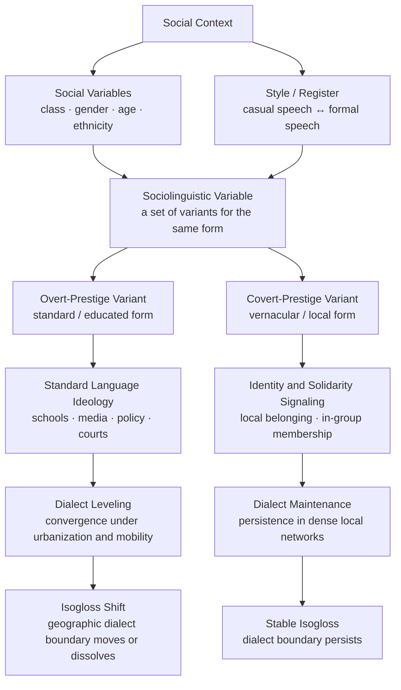

> [!abstract] TL;DR
> Language variation is not noise — it is systematic, socially structured, and statistically predictable: which phoneme variant, grammatical construction, or lexical item a speaker chooses tracks social class, gender, age, and ethnicity with remarkable regularity. Labov's variationist sociolinguistics demonstrated this rigorously, and the resulting finding — that "standard" forms carry overt institutional prestige while "vernacular" forms carry covert solidarity prestige — exposes the standard language ideology as a political construction, not a linguistic fact.

---

## Intuition

**Analogy:** Consider two GPS routes from the same origin to the same destination. Both get you there reliably, but one uses highways and the other uses local roads. Neither route is *wrong*. In linguistics, two speakers who understand each other perfectly may take entirely different routes through the phonological and grammatical system of their shared language: one pronounces /r/ after vowels, the other does not; one says "I didn't do nothing," the other says "I didn't do anything." Both arrive at the same communicative destination. The study of language variation asks a deceptively political question: which routes get labeled "highways" (standard, prestigious, correct) and which get labeled "back roads" (vernacular, stigmatized, incorrect) — and who decides?

The answer is never purely linguistic. It is always also about class, race, geography, and power. The speaker who says "axe" instead of "ask" is not making an error traceable to cognitive failure; they are following a perfectly regular phonological rule inherited from Middle English that survived in communities whose speech was subsequently excluded from institutional prestige. The study of language variation is, at its core, the study of how social structure is inscribed into phonemes and grammar — and how those inscriptions are then used to sort people.

---

## How It Works



### Core Mechanics

The **sociolinguistic variable** is the central analytical unit. It is a set of functionally equivalent linguistic forms — called **variants** — that speakers choose between, consciously or not, in ways that correlate with social and contextual factors.

**Example:** The variable (r) in New York City English has two main variants:
- Rhotic /r/ (pronouncing the /r/ in "car," "floor," "guard") — the prestige variant in American English since the 1960s
- Non-rhotic zero (dropping the /r/) — the historically dominant vernacular variant in NYC

The key finding of variationist sociolinguistics is that these choices are **not free variation** — they are constrained simultaneously by:
1. **Linguistic environment** (what sounds precede and follow the variable)
2. **Social class** (working class speakers use more non-rhotic forms overall)
3. **Style / register** (the same speaker uses more rhotic forms when reading aloud than in casual conversation)
4. **Temporal change** (younger speakers may use more of the prestige form than older speakers — apparent-time evidence for change in progress)

The method for capturing this is the **sociolinguistic interview** developed by Labov: a semi-structured conversation designed to elicit natural speech by directing attention away from linguistic form (the Observer's Paradox — the act of observation changes the behavior being observed). The interview includes:
- Casual conversation about childhood dangers, fights, near-death experiences (triggers emotionally engaged, unreflective speech)
- Careful speech (reading a passage)
- Word lists and minimal pairs (most careful, most formal)
- Spontaneous narrative (closest to the vernacular baseline)

---

## Key Concepts

### Secondary Level

**What is a dialect?**
A **dialect** is a variety of a language associated with a particular region or social group, distinguished by systematic differences in pronunciation, vocabulary, and grammar. Every speaker speaks a dialect — including people who believe they speak "no dialect" or "just normal English." The perception that one's own speech is accentless is itself a consequence of the standard language ideology (see Graduate Level below).

The famous quip attributed to Max Weinreich captures the political dimension: "A language is a dialect with an army and a navy." Mandarin, Cantonese, and Shanghainese are mutually unintelligible — linguistically, they are separate languages — but are called "dialects" because they share a writing system and a state. Norwegian and Swedish are mutually intelligible but are called separate languages because they have separate states.

**Isoglosses and dialect geography**
An **isogloss** is a geographic line on a dialect map separating two regions that differ in a particular linguistic feature. No two isoglosses exactly coincide — different vocabulary items, phonological features, and grammatical constructions each have their own boundary. Where many isoglosses bundle together, a **dialect boundary** emerges.

The **Rhine fan** (Rhenish fan) in German is the classic example of the absence of a clean boundary: the isoglosses fanning out around Cologne each mark a different sound change from the High German consonant shift, creating a gradient rather than a line. This is a **dialect continuum** — speakers near the center of the fan understand both neighbors, but speakers at the two extremes may not understand each other.

**Social variables at a glance**

| Variable | Key finding | Example |
|---|---|---|
| Social class | More standard forms with higher class | /r/ in NYC department stores |
| Gender | Women use more prestige forms in stable situations; lead change in others | Labov: women hypercorrect in formal style |
| Age | Younger speakers may diverge from older, signaling change in progress | Martha's Vineyard young adults |
| Ethnicity | Systematic co-variation of linguistic and ethnic identity | AAVE, Chicano English, Singlish |
| Register/Style | Same speaker varies across contexts; formal → more standard | Reading lists vs. casual speech |

**What is a standard language?**
A **standard language** is a codified, prestige variety institutionally promoted through education, media, and official domains. It is not linguistically superior to other varieties — it is socially elevated by history and institutional power. Standard American English, Received Pronunciation (RP) in Britain, and Hochdeutsch in Germany are all dialects that acquired prestige through the prestige of their speakers, not through any inherent linguistic correctness.

---

### Undergraduate Level

**Labov's Martha's Vineyard study (1963)**
In his first major study, Labov examined the pronunciation of the diphthongs /ay/ (as in "right," "night," "my island") and /aw/ (as in "house," "out") on the island of Martha's Vineyard, Massachusetts. Specifically, he measured the degree of **centralization** — how much the first element of the diphthong was raised and retracted toward the center of the vowel space rather than produced with a low front open quality.

Labov found that centralization was not randomly distributed:
- **Fishermen** — the traditional, working-class, long-resident group — showed the highest centralization.
- **Young adults who had left the island and returned** showed even stronger centralization than older locals.
- **Year-round residents who identified positively with island life and resisted tourist incursion** centralized more than those who did not.
- Speakers planning to leave the island for mainland careers showed minimal centralization.

The conclusion: centralization was an **index of local identity**. It was not a change toward or away from a prestige form — it was a phonetic badge of belonging. This established that linguistic variation can carry **social meaning independent of prestige hierarchies**, and that speakers actively (if unconsciously) deploy phonetic features to position themselves socially.

**Labov's New York City department store study (1966)**
Labov exploited a natural experiment in NYC's stratified retail landscape. He visited three department stores representing three social strata:
- Saks Fifth Avenue (upper-middle class)
- Macy's (middle class)
- Klein's (working class)

He asked sales staff for the location of a department he knew was on the fourth floor, eliciting the phrase "fourth floor" — which contains /r/ in two positions (pre-consonantal in "fourth," word-final in "floor"). He then feigned misunderstanding to elicit the phrase a second time in careful speech.

Results:
1. **Saks staff used the most /r/; Klein's staff used the least.** Social class of the institution predicted the speech of its employees.
2. **All groups used more /r/ in the careful (repeated) pronunciation than in the casual pronunciation** — style-shifting was universal and in the same direction.
3. **Klein's staff showed the largest casual-to-careful shift** — working-class speakers showed the steepest style-shifting, a pattern Labov called **hypercorrection** in formal contexts.

This demonstrated that a single variable (/r/) simultaneously indexed social class, style register, and change in progress (NYC was in the process of adopting rhoticity as the prestige norm) — and that these dimensions were statistically independent and additive.

**The apparent-time construct**
Because real-time data on a population's speech across decades is expensive to collect, Labov introduced the **apparent-time hypothesis**: if age-grading is absent (i.e., people do not change their speech systematically as they age), then age differences in a synchronic sample are a proxy for historical change. A community where 20-year-olds use more of variant X than 60-year-olds is probably undergoing change toward X.

Crucially, the apparent-time construct must be distinguished from **age-grading** — systematic changes in speech that all individuals undergo as they mature. Adolescent vernacular peaks in adolescence and often retreats in adulthood as speakers enter formal employment; this is age-grading, not change. Methodologically, the two are distinguished by panel studies (following the same speakers across decades) or by comparing synchronic and historical data.

**Covert prestige and the Matched Guise Technique**
Standard forms carry **overt prestige** — the publicly acknowledged, institutionally reinforced belief that they are "correct," "educated," or "intelligent." Non-standard vernacular forms often carry **covert prestige** — they are not publicly praised but are covertly valued for associations with toughness, solidarity, authenticity, and local identity. Working-class men in particular often maintain non-standard features precisely because those features signal masculinity and working-class solidarity.

The **Matched Guise Technique** (Lambert 1960) is the experimental tool for measuring language attitudes:
- Subjects listen to recordings of the same bilingual speaker using two languages or two varieties
- They believe they are evaluating different speakers
- They rate each "speaker" on personality traits (intelligence, friendliness, ambition, reliability, etc.)
- Consistent differences in ratings reveal unconscious attitudes toward the language variety, not the individual

Matched guise studies consistently show that standard varieties are rated higher on **status** dimensions (intelligence, ambition, education) while non-standard vernacular varieties score higher on **solidarity** dimensions (friendliness, humor, trustworthiness among in-group members). This asymmetry explains why speakers maintain stigmatized varieties — the covert solidarity value is real and socially functional.

**African American Vernacular English (AAVE)**
AAVE is a rule-governed, systematic variety of American English associated with — but not exclusive to — African American communities, particularly in urban environments. Labov's extensive fieldwork in Harlem (in his 1972 book *Language in the Inner City*) established that AAVE is not deficient or "illogical" English but a fully productive grammatical system with consistent rules.

Key grammatical features include:
- **Copula deletion:** The verb "to be" is deleted where standard English requires it, but only in predictable grammatical environments. "She tired" (= "She is tired"). Crucially, deletion only occurs where standard English *can* contract: "He's tired" → "He tired" is possible, but "That's what it is" → "That's what it __" is impossible (contraction is blocked at clause-final position, and deletion mirrors this constraint exactly — evidence of systematic rule-following).
- **Habitual be:** "He be working late" means "He habitually/characteristically works late" — a grammatical aspect distinction that standard English lacks a single morpheme to express.
- **Negative concord:** "I don't know nothing" means "I don't know anything." Far from illogical, this pattern is shared by French, Spanish, Italian, Russian, and historically by Early Modern English ("I cannot go nowhere").
- **Remote past "been":** "She been married" signals that she has been married for a long time and still is — a remote perfect meaning absent from standard English.

The **Ebonics controversy (1996)** erupted when the Oakland Unified School District passed a resolution recognizing AAVE (which they called "Ebonics") as the primary language of many of their African American students and proposed using it as a bridge to teach standard English literacy. The resolution was widely misreported as a proposal to "teach slang" and was met with political and public backlash. Linguists including Labov had long testified (most formally in the *Martin Luther King Junior Elementary School Children v. Ann Arbor School District* case, 1979) that failure to acknowledge AAVE's systematic structure was an obstacle to literacy education, not a pedagogical virtue.

**Code-switching and style-shifting**
**Code-switching** is the alternation between two languages, dialects, or registers within a single conversational context. It is not a sign of incomplete competence — bilingual and bidialectal speakers switch precisely because they have *more* options than monolinguals, and switching carries pragmatic meaning.

Types:
- **Inter-sentential switching:** Between sentences. "He's really smart. *Es muy inteligente.*" The switch itself may mark a shift in addressee, topic, or register.
- **Intra-sentential switching:** Within a single clause. "*She se fue* to the store." Governed by syntactic constraints — switches cannot violate the grammatical structure of either language (the Matrix Language Frame model: one language provides the morphosyntactic frame; the other contributes content morphemes).
- **Tag switching:** A word or phrase from one language is inserted as a tag ("*verdad*?" or "you know?") into otherwise monolingual speech.

**Bell's audience design** (1984) extends this: speakers do not just style-shift to match abstract situational formality — they design their speech for their audience. The primary dimension of variation is the **addressee** (the main conversation partner), but speakers also shift for **auditors** (known, ratified non-addressed participants), **overhearers** (known but unratified), and **eavesdroppers** (unknown). This explains why speakers produce radically different speech on the same topic when talking to their grandmother, their boss, and their friends.

---

### Graduate Level

**Variable Rule analysis: VARBRUL and Rbrul**
Labov and Cedergren introduced **VARBRUL** (Variable Rules) — a log-linear regression model for estimating the independent contribution of each linguistic and social factor to the probability of a variant being selected. The dependent variable is the probability of choosing variant X. Factor groups (e.g., preceding phonological environment, social class, age, gender) each have factor weights that multiply (in log-odds space) to produce the output probability.

The modern implementation, **Rbrul** (Johnson 2009), uses mixed-effects logistic regression in R, allowing random effects for individual speakers and words (crossing the random speaker variation with fixed social effects). This addresses the problem of **Type I error inflation** that occurred when Labov's early studies aggregated across all speakers in a social class without accounting for within-group individual variation.

The output is a set of **constraint rankings**: which linguistic environments and social factors most strongly favor or disfavor the prestige variant. A factor weight > 0.5 favors the variant; < 0.5 disfavors it.

**Social meaning and indexicality: Silverstein's orders and Eckert's indexical field**
Building on Peirce's theory of signs, Silverstein distinguished **orders of indexicality**:
- **First-order indexicality:** A feature statistically correlates with a social group, but speakers are not consciously aware of the connection. The correlation is discoverable by the analyst but not metalinguistically accessible to speakers.
- **Second-order indexicality:** Speakers develop overt awareness that form X is associated with group Y; it becomes the object of metalinguistic commentary ("People who say X are from the country," "That sounds uneducated").
- **Third-order indexicality:** The feature becomes available for conscious stylistic deployment — speakers can strategically use it to claim or project an identity position beyond the original social group.

Penny Eckert (2008) developed the concept of the **indexical field** — the constellation of social meanings a linguistic feature can potentially carry. A single variant (e.g., non-prevocalic /r/ in New York) does not have one fixed social meaning; it has a field of potential meanings (working-class, outer-borough, authentic, tough, old-fashioned New Yorker identity) that become actualized differently in different contexts and by different speakers.

**Third-wave sociolinguistics: performance and practice**
First-wave variationist work mapped features onto pre-defined demographic categories (class, age, gender). Second-wave work (Eckert's Jocks and Burnouts study at a Michigan high school) moved toward locally constructed social categories — showing that adolescent social practice (joining the Jocks vs. the Burnouts) shaped linguistic variation more directly than abstract class membership.

Third-wave sociolinguistics (Eckert 2003, 2012) takes a **practice and performance** view: speakers do not passively reflect social categories in their speech — they actively *construct* identities through stylistic practice. Variation is a resource for **bricolage** (assembling a stylistic persona from available social material). This connects directly to Butler's performativity of identity and to Goffman's dramaturgical model.

The analytical implication: linguistic variation must be studied ethnographically, not just demographically. Understanding what a phonetic variant *means* in a community requires understanding the social landscape of that community, including the locally salient categories, antagonisms, and ideologies that make certain features available for certain identity projects.

**Milroy and Milroy's network theory**
Lesley and James Milroy's Belfast study (1980s) introduced **social network structure** as the mechanism linking macro-social variables (class) to micro-linguistic behavior. Their key finding: speakers embedded in **dense, multiplex networks** (many ties; ties that cross multiple relationship types — neighbor + coworker + family member + pub companion) maintain non-standard vernacular features more robustly than speakers in loose, uniplex networks.

The mechanism: dense networks function as **norm-enforcement mechanisms**. When a speaker departs from local norms (e.g., starts using more standard forms), multiple network members notice and sanction it, because those members interact in multiple social domains. Loose networks lack this multiplexed sanction mechanism — speakers interact with each other in fewer domains, so norm departure is less likely to be noticed and challenged.

This explains dialect leveling: as urbanization, residential mobility, and labor-market shifts dissolve dense local networks, the norm-enforcement function weakens, and speakers converge toward the supralocal standard. This is the social network mechanism behind the isogloss shifts visible in dialect atlases across the 20th century.

**Dialect leveling, koineization, and the feature pool**
**Dialect leveling** is the convergence of dialects toward a more uniform variety under conditions of contact, mobility, and urbanization. It is not random: it tends to reduce **marked** forms (phonologically or morphologically unusual, low-frequency, irregular) and retain **unmarked** forms (more frequent, more regular, shared across more varieties).

**Koineization** is the formation of a new stable variety from contact between multiple source dialects. Classic cases include New Zealand English (formed from British and Irish dialectal inputs in the 19th century), Israeli Hebrew, and Modern Greek. Trudgill's model of koineization identifies three stages: mixing (all variants present), leveling (reduction of marked variants), and simplification (irregular forms reduced).

The **feature pool** (Mufwene 2001) conceptualizes contact between dialects as a pool of competing variants, each with a selection probability determined by input frequency (how often it appears in the contact situation), replication fidelity, and social salience. Variants with high input frequency and low social markedness win out in the pool.

**Standard Language Ideology and language rights**
**Standard Language Ideology** (Milroy & Milroy 1985; Lippi-Green 1994) is the belief that one legitimate, correct standard variety exists for each language, and that departures from it represent deficiency, laziness, or lack of education rather than difference. This ideology:
- Is reproduced institutionally through schools, style guides, and media organizations
- Disproportionately stigmatizes the speech of working-class, non-white, and non-urban communities
- Is used to justify discrimination in employment, housing, and the legal system (voice-based discrimination)
- Treats the historical accident of which variety became standard as if it were a natural linguistic fact

**Linguistic profiling** (Baugh 2003) is the auditory equivalent of racial profiling: landlords and employers use voice alone to make discriminatory inferences about race and class. Field experiments show that callers whose speech is identified as Black receive significantly fewer callbacks for housing and employment inquiries than callers whose speech is identified as white.

**Language rights** movements argue that speakers' linguistic varieties are a form of cultural property and that institutional language policies (English-only laws, school no-dialect policies) constitute a form of cultural violence against non-standard-variety speakers. The tension between the legitimate need for a shared standard in public institutional life and the equal right of communities to maintain their vernacular varieties is one of the most politically charged applications of sociolinguistic research.

---

## Python Demo

```python
import numpy as np
import matplotlib.pyplot as plt

# Simulate dialect leveling in a geographically-embedded social network.
# 100 speakers are scattered over a 10x10 area. Each speaker has a phonetic
# variable value (0 = standard variety; 1 = strong local vernacular, e.g.
# full /r/ vocalization). Geographic proximity determines network tie probability.
# Each generation, speakers shift toward their neighbors' mean value (peer
# influence) and toward the standard (proportional to their network centrality,
# which proxies exposure to supralocal variety).

rng = np.random.default_rng(42)

N = 100
GENERATIONS = 30
STANDARD_VALUE = 0.0   # fully standard: no /r/ vocalization
PEER_INFLUENCE = 0.15  # proportion to shift toward neighbor mean each generation
STANDARD_PULL = 0.08   # extra pull toward standard for high-centrality speakers

# 1. Place speakers at random geographic positions
positions = rng.uniform(0, 10, (N, 2))

# Initial variable: eastern speakers (high x) have stronger local variant
x_norm = positions[:, 0] / 10.0
variable = 0.2 + 0.7 * x_norm + rng.normal(0, 0.05, N)
variable = np.clip(variable, 0.0, 1.0)

# 2. Build geographic social network using a Gaussian proximity kernel
diff = positions[:, None, :] - positions[None, :, :]  # (N, N, 2)
dist = np.sqrt((diff ** 2).sum(axis=2))               # (N, N)
P_tie = np.exp(-dist ** 2 / (2 * 2.5 ** 2))
np.fill_diagonal(P_tie, 0.0)
adjacency = (rng.uniform(0, 1, (N, N)) < P_tie).astype(float)
adjacency = np.maximum(adjacency, adjacency.T)  # undirected

# 3. Degree centrality: more central nodes are exposed to more diverse speech
degree = adjacency.sum(axis=1)
centrality = (degree - degree.min()) / (degree.max() - degree.min() + 1e-9)

# 4. Simulate dialect leveling across 30 generations
history = [variable.copy()]

for _ in range(GENERATIONS):
    new_var = variable.copy()
    for i in range(N):
        neighbors = np.where(adjacency[i] > 0)[0]
        if len(neighbors) == 0:
            continue
        neighbor_mean = variable[neighbors].mean()
        # Peer influence: shift toward neighborhood mean (Milroy network effect)
        new_var[i] += PEER_INFLUENCE * (neighbor_mean - variable[i])
        # Standard pull: proportional to centrality (Labov's prestige diffusion)
        new_var[i] += STANDARD_PULL * centrality[i] * (STANDARD_VALUE - variable[i])
    variable = np.clip(new_var, 0.0, 1.0)
    history.append(variable.copy())

history = np.array(history)  # shape: (GENERATIONS+1, N)

# 5. Visualize
fig, axes = plt.subplots(1, 3, figsize=(15, 5))
scatter_kw = dict(cmap="RdYlBu_r", vmin=0, vmax=1, s=55,
                  edgecolors="k", linewidths=0.3)

sc1 = axes[0].scatter(positions[:, 0], positions[:, 1],
                      c=history[0], **scatter_kw)
plt.colorbar(sc1, ax=axes[0],
             label="/r/ vocalization\n0 = standard   1 = vernacular")
axes[0].set_title("Generation 0 — Initial State", fontweight="bold")
axes[0].set_xlabel("Geographic X")
axes[0].set_ylabel("Geographic Y")

sc2 = axes[1].scatter(positions[:, 0], positions[:, 1],
                      c=history[-1], **scatter_kw)
plt.colorbar(sc2, ax=axes[1],
             label="/r/ vocalization\n0 = standard   1 = vernacular")
axes[1].set_title(f"Generation {GENERATIONS} — After Leveling",
                  fontweight="bold")
axes[1].set_xlabel("Geographic X")

gens = np.arange(GENERATIONS + 1)
gen_mean = history.mean(axis=1)
gen_std = history.std(axis=1)
top_c = centrality >= np.percentile(centrality, 80)  # top-20% by centrality

axes[2].fill_between(gens, gen_mean - gen_std, gen_mean + gen_std,
                     alpha=0.2, color="steelblue")
axes[2].plot(gens, gen_mean, color="steelblue", lw=2.5,
             label="Community mean (±1 SD)")
axes[2].plot(gens, history[:, top_c].mean(axis=1),
             "--", color="darkorange", lw=2, label="High-centrality speakers")
axes[2].plot(gens, history[:, ~top_c].mean(axis=1),
             ":", color="forestgreen", lw=2, label="Peripheral speakers")
axes[2].axhline(STANDARD_VALUE, color="crimson", lw=1.5, linestyle="-.",
                label="Standard variety (0.0)")
axes[2].set(xlabel="Generation", ylabel="Mean /r/ vocalization",
            title="Dialect Leveling Over Time",
            xlim=(0, GENERATIONS), ylim=(-0.05, 1.05))
axes[2].legend(fontsize=8)
axes[2].grid(True, alpha=0.3)

fig.suptitle(
    "Dialect Leveling in a Geographically-Embedded Social Network",
    fontsize=13, fontweight="bold"
)
plt.tight_layout()
plt.savefig("dialect_leveling.png", dpi=150, bbox_inches="tight")
plt.show()
```

**What the output shows.** Panel 1: the initial geographic distribution — eastern speakers (right side) cluster near the vernacular end of the scale (blue = standard, red = vernacular). Panel 2: after 30 generations, the eastern speakers have shifted substantially toward the standard, particularly those in geographically central positions with many network ties. Some peripheral eastern speakers retain vernacular features because their dense local networks slow convergence. Panel 3: high-centrality speakers (orange dashed) converge toward the standard faster than peripheral speakers (green dotted), replicating the sociolinguistic finding that network brokers and urban central nodes lead dialect leveling, while socially isolated or geographically peripheral communities maintain local features longer.

---

## Real-World Applications

**Dialect atlases and documentation**
The **Dictionary of American Regional English (DARE)**, produced between 1965 and 2013 under Frederic Cassidy and Joan Hall, systematically documented regional variation in vocabulary, idiom, and pronunciation across the United States using a stratified sample of 1,002 communities. It remains the most comprehensive documentation of American English geographic variation and provides the empirical foundation for tracking dialect change over time.

The **Survey of English Dialects (SED)**, conducted 1950–1961 across England, documented rural dialects before urbanization and postwar mobility erased them — capturing forms that were already archaic in urban speech and that have since largely disappeared. Together with the European dialect atlases (Sprach- und Sachatlas Italiens und der Südschweiz; Atlas linguistique de la France), these form the empirical record of pre-leveling European dialect geography.

**Language and education policy**
The **Martin Luther King Junior Elementary School Children v. Ann Arbor School District** case (1979) established a legal precedent: schools must take students' home language variety into account when teaching standard written English. The court found that failure to do so constituted a barrier to equal educational opportunity. Labov testified that AAVE speakers learning to read standard English were, in effect, learning a second dialect — and that treating their home variety as mere error rather than a systematic rule-governed variety created a cognitive obstacle.

Bidialectal education programs use the home variety as a bridge: students learn to code-switch between their vernacular and standard English, rather than being told their home language is wrong. Research in California and elsewhere shows improved literacy outcomes from this approach compared to standard-only instruction.

**Voice and linguistic profiling in employment**
Audit studies (Massey & Lundy 2001; Baugh 2003) document linguistic profiling in rental housing: the same recorded inquiry about an apartment listing, read by different speakers in different dialectal styles, receives differential callback rates — standard-accented callers receive more callbacks than AAVE-accented callers for the same listing. This provides direct evidence that dialect variation is a vector for racial discrimination that circumvents anti-discrimination laws targeted at explicit racial identification.

**Forensic and clinical linguistics**
Dialect variation is forensically significant: identifying a speaker's regional origin from phonetic features is a recognized forensic linguistics application. It also creates evidential complications — non-standard grammatical features in witness testimony (e.g., AAVE copula deletion) have been misrepresented in court as evidence of cognitive or educational deficiency rather than dialectal difference. Expert linguistic testimony on AAVE systematicity has been used to rebut such misrepresentations.

---

## Common Pitfalls

- **Conflating dialect and accent** — "Accent" refers narrowly to phonological differences (pronunciation); "dialect" encompasses phonology plus grammar plus vocabulary. Two speakers can share an accent but differ in dialect (grammatical features), or share grammar but differ in phonological output. The distinction matters analytically: some sociolinguistic variables are purely phonological; others are morphosyntactic.

- **Treating standard varieties as linguistically "correct"** — There is no linguistic criterion by which one dialect is grammatically superior to another. "I didn't do nothing" is internally consistent with negative concord rules shared by most of the world's languages. Labeling it an "error" imports a socio-political judgment into a linguistic category, distorting analysis and misleading educators and policy-makers.

- **Ignoring the Observer's Paradox in data collection** — Recording natural speech is methodologically difficult precisely because speakers modify their behavior when they know they are being observed. Labov's sociolinguistic interview is specifically designed to reduce this effect by engaging emotional narratives. Relying solely on elicited or read speech will underestimate vernacular features and overestimate speakers' use of standard forms.

- **Confusing age-grading with change in progress** — If 20-year-olds use more of a feature than 60-year-olds, this could mean: (a) the community is changing and younger cohorts have acquired more of the feature (change in progress), or (b) the feature peaks in adolescence and retreats with age in every cohort (age-grading). Without real-time panel data or historical comparison, synchronic age differences cannot distinguish these interpretations.

- **Applying external dialect labels to insider categories** — The AAVE label covers considerable internal variation: urban vs. rural, coastal vs. inland, different age cohorts, and the full style range from casual peer speech to formal registers. Treating AAVE as monolithic for analytic purposes misses important within-group variation and risks reifying the community as linguistically uniform when it is not.

- **Overstating the dialect leveling trend** — Leveling is real and documented in British, American, and European dialects, but it does not lead to full convergence. New local features emerge (dialect *divergence* has been documented in Philadelphia, Detroit, and Pittsburgh); ethnolects often *strengthen* under conditions of social segregation rather than weakening; and global English spread creates new regional Englishes (Singlish, Indian English, Nigerian English) rather than homogenizing toward a single standard.

---

## Related Concepts

- [[Prosody_and_Suprasegmentals]] — Suprasegmental features (stress, intonation, rhythm) are themselves sociolinguistic variables: regional and social dialects differ in intonation patterns, vowel length, and rhythm type, extending variation above the segmental level.
- [[Discourse_Power_and_Identity]] — Foucauldian and critical discourse analysis approaches to language-as-power overlap directly with sociolinguistics: indexicality, language ideology, and the social sorting function of dialect are central to both traditions.
- [[Race_Ethnicity_and_Racism]] — AAVE, Chicano English, and other ethnolects illustrate how racialized social structure is inscribed in language variation; linguistic profiling is a documented mechanism of racial discrimination that links sociolinguistics directly to the sociology of race.
- [[Social_Networks_and_Social_Ties]] — The Milroys' network theory of dialect maintenance and leveling applies Granovetter's weak-ties logic to language: dense, multiplex networks function as norm-enforcement mechanisms that preserve vernacular features; loose networks accelerate dialect leveling.
- [[Social_Class_and_Stratification]] — The stratification of linguistic variables by social class (Labov's NYC studies) is one of sociolinguistics' founding empirical findings; class-based linguistic variation is the mechanism through which Bourdieu's linguistic capital operates.
- [[Language_and_Culture]] — The Sapir-Whorf tradition intersects with sociolinguistics via linguistic relativity: if language influences thought, then dialect differences may produce subtly different cognitive frames; the shared-language / different-dialect situation complicates simple relativity claims.
- [[Identity_Stigma_and_Impression_Management]] — Goffman's dramaturgical model of self-presentation maps directly onto style-shifting and audience design: speakers manage linguistic impressions just as they manage other identity performances, deploying dialect features as part of the Goffmanian face-work repertoire.
- [[Nationalism_Ethnicity_and_Collective_Identity]] — Standard language ideologies are bound up with nation-building projects; the elevation of one regional variety to national standard is historically a state-formation move, and dialect suppression has been used as an instrument of ethnic assimilation.
- [[Education_and_Social_Reproduction]] — Bourdieu's concept of cultural capital includes linguistic capital: students who arrive at school speaking the standard variety have a head start in converting their linguistic capital into academic credentials; AAVE-speaking children face an asymmetric task.
- [[Language_Socialization_and_Acquisition]] — Children are socialized into dialectal norms through caregiver interaction; the sociolinguistic patterns children acquire by age 5 track their community's social networks and class position, establishing that language variation is transmitted across generations through social learning, not biological inheritance.

---

## Review Questions

### Secondary

1. A teacher marks a student's sentence "I didn't do nothing wrong" as a grammar error. What would a sociolinguist say about this, and why does the distinction matter for the student's education?
2. Why does Max Weinreich's quip — "a language is a dialect with an army and a navy" — capture something important about the difference between "dialects" and "languages"? Give a real example where the linguistic and political boundaries do not align.
3. A speaker talks differently at a job interview than with their friends at lunch. Using the concepts of style-shifting and audience design, explain what is happening and why linguists say both speech styles are equally "correct."

### Undergraduate

1. In Labov's Martha's Vineyard study, young adults who had returned to the island showed *stronger* centralization of /ay/ than older residents. What does this tell us about the relationship between phonetic variation and social identity, and why does it challenge a simple prestige model of variation?
2. Labov found that working-class New Yorkers showed the steepest style-shift from casual to formal speech in the department store study. Explain the concept of hypercorrection and discuss what it reveals about speakers' metalinguistic awareness of prestige norms.
3. AAVE copula deletion follows the same distribution as standard English contraction: "She is tired" → "She's tired" → "She tired," but "That's what it is" → "That's what it is" (neither contraction nor deletion permitted in clause-final position). What does this parallel tell us about the grammatical status of AAVE, and why is this evidence significant for the debate over bidialectal education?

### Graduate

1. Milroy and Milroy found that speakers in dense, multiplex social networks maintain non-standard vernacular features more robustly than speakers in loose networks. How does their network theory complement and partially challenge Labov's class-based account of variation? Under what social conditions would you expect the two models to make different predictions?
2. Silverstein distinguishes first-, second-, and third-order indexicality. Trace the history of non-prevocalic /r/ in New York City English through these three orders, explaining how the same variant shifted from a feature speakers were unaware of, to one they commented on, to one that could be strategically deployed as a stylistic resource.
3. Trudgill's model of koineization predicts that marked forms will be eliminated in favor of unmarked ones during dialect contact. Critically evaluate this claim: what counts as "marked," and are there documented cases where the marked variant *won* the competition in a new-dialect formation context? What factors would explain such an outcome?

---

## Sources

- [Labov, W. (1963). The social motivation of a sound change. *Word*, 19(3), 273–309.](https://doi.org/10.1080/00437956.1963.11659799)
- [Labov, W. (1966). *The Social Stratification of English in New York City*. Center for Applied Linguistics.](https://www.cambridge.org/core/books/social-stratification-of-english-in-new-york-city/AABB5DA6D36F4AE94E2BC6ED5E54BEEE)
- [Labov, W. (1972). *Language in the Inner City: Studies in the Black English Vernacular*. University of Pennsylvania Press.](https://www.upenn.edu/pennpress/book/1145.html)
- [Milroy, L. (1987). *Language and Social Networks* (2nd ed.). Blackwell.](https://www.wiley.com/en-us/Language+and+Social+Networks%2C+2nd+Edition-p-9780631153795)
- [Eckert, P. (2008). Variation and the indexical field. *Journal of Sociolinguistics*, 12(4), 453–476.](https://doi.org/10.1111/j.1467-9841.2008.00374.x)
- [Bell, A. (1984). Language style as audience design. *Language in Society*, 13(2), 145–204.](https://doi.org/10.1017/S004740450001037X)
- [Trudgill, P. (2004). *New-Dialect Formation: The Inevitability of Colonial Englishes*. Edinburgh University Press.](https://edinburghuniversitypress.com/book-new-dialect-formation.html)
- [Lippi-Green, R. (2012). *English with an Accent: Language, Ideology and Discrimination in the United States* (2nd ed.). Routledge.](https://www.routledge.com/English-with-an-Accent-Language-Ideology-and-Discrimination-in-the-United-States/Lippi-Green/p/book/9780415559119)
- [Baugh, J. (2003). Linguistic profiling. In S. Makoni et al. (Eds.), *Black Linguistics: Language, Society and Politics in Africa and the Americas*. Routledge.](https://www.routledge.com/Black-Linguistics-Language-Society-and-Politics-in-Africa-and-the-Americas/Makoni-Smitherman-Ball-Spears/p/book/9780415261159)
- [Mufwene, S. (2001). *The Ecology of Language Evolution*. Cambridge University Press.](https://www.cambridge.org/core/books/ecology-of-language-evolution/42B37A3D3F48BE04E30AB4A5ABC5EEA9)

---

#Linguistics #Sociolinguistics #LanguageVariation
