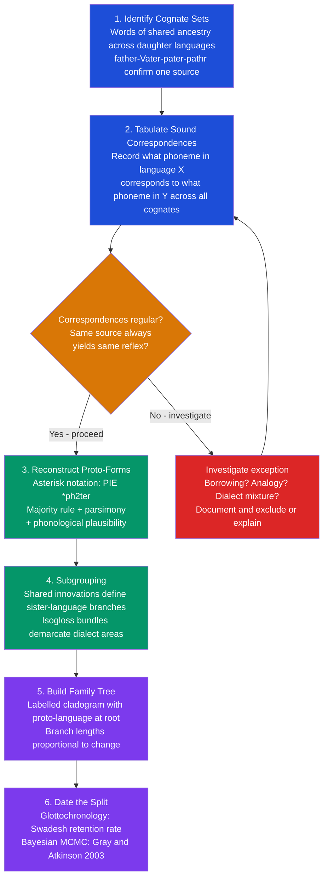

> [!abstract] TL;DR
> Historical linguistics reconstructs unrecorded ancestral languages and traces language change over time. The comparative method — comparing cognate words across daughter languages to identify regular sound correspondences — is the field's bedrock tool; its crowning achievement is the reconstruction of Proto-Indo-European, spoken roughly 6,000–9,000 years ago and ancestral to 450+ languages. Modern Bayesian phylogenetics has extended the method to probabilistic family trees and divergence dates, directly paralleling molecular phylogenetics in biology.

---

## Intuition

**Analogy:** A forensic genealogist who has never seen a photograph of your great-great-grandmother can still reconstruct facts about her: she must have had brown eyes (every descendant does), she probably had a cleft chin (it appears in three of four branches), and she almost certainly spoke German (all traceable family correspondence is in German). No single descendant preserves every ancestral trait, but by comparing all of them systematically, you can reconstruct an ancestor no living person ever met.

Historical linguistics does exactly this with languages. No one spoke Proto-Indo-European in front of a recording device, but by comparing Sanskrit *pitṛ*, Greek *patēr*, Latin *pater*, Old English *fæder*, and Gothic *fadar* systematically, linguists can reconstruct PIE *\*ph₂tḗr* ("father") with confidence — the correspondences are too regular to be coincidental, and the reconstructed form predicts the attested daughter-language forms precisely, including sounds like the laryngeal *h₂* that were entirely hypothetical until Hittite was deciphered in 1915 and confirmed them.

The key insight is **regularity**. Borrowings and chance similarities are sporadic — English *tea* and Mandarin *chá* share a meaning and a sound by borrowing, not by ancestry. Inherited words change systematically: every Proto-Indo-European *\*p* shifted to *f* in Germanic, *every* time, in *every* word with that context. Once you have a table of regular correspondences, you can read a proto-language off the data as surely as a code-breaker reads a plaintext off a cipher.

---

## How It Works



---

## Key Concepts

### Secondary Level

**Cognates, borrowings, and chance resemblances**

A *cognate* is a word that shares a common ancestor with a word in another language — not because one was borrowed from the other, but because both descended from the same proto-language word. English *night* and German *Nacht* are cognates: both descend from Proto-Germanic *\*naht-*, which itself descends from PIE *\*nókʷts*. The resemblance is inherited, not accidental.

Cognates are different from *borrowings*. English borrowed *naive* from French, which is why they look alike — but they are not cognates in the genetic sense. And some look-alikes are pure coincidence: English *bad* and Persian *bad* (meaning the same thing) are unrelated; any large vocabulary will produce accidental overlaps by chance. The test is regularity: cognates participate in systematic sound correspondences across many words; borrowings and coincidences are isolated.

**Grimm's Law: the paradigm example**

Jacob Grimm (1822) discovered the first systematic sound correspondence between Proto-Indo-European and the Germanic languages — a shift affecting every single stop consonant in the language:

| PIE | Germanic | Examples |
|-----|----------|---------|
| \*p | f | PIE \*ped- → English *foot*, Latin *pēs* |
| \*t | þ (→ th) | PIE \*trēyes → English *three*, Latin *trēs* |
| \*k | h | PIE \*kerd- → English *heart*, Greek *kardia* |
| \*b | p | PIE \*bʰel- → English *bloom*, Latin *flōs* |
| \*d | t | PIE \*dent- → English *tooth*, Latin *dēns* |
| \*g | k | PIE \*genu- → English *knee*, Latin *genu* |

What makes Grimm's Law a *law* — not just a list of examples — is that it applies without exception to every word with the relevant phoneme in the relevant context. This **Neogrammarian hypothesis** (formulated systematically in 1878 by Brugmann and Osthoff) is the methodological cornerstone of historical linguistics: sound changes are exceptionless; apparent exceptions have explanations (borrowing, analogy, or a conditioning environment you have not yet identified).

**What a proto-language is**

A proto-language is a hypothetical common ancestor inferred through the comparative method. It is not a guess — it is a precise reconstruction constrained by systematic evidence from multiple daughter languages. Linguists write reconstructed forms with an asterisk: *\*ph₂tḗr* for the PIE word for "father." The diacritic *₂* marks a laryngeal consonant — a sound whose presence in PIE was entirely inferred from abstract phonological reasoning before it was confirmed by Hittite, where the laryngeal survived as *ḫ* (the "laryngeal theory" is one of historical linguistics' most striking predictive successes).

Proto-Indo-European is the best-reconstructed proto-language, but the method has also recovered Proto-Austronesian (ancestor of Malay, Tagalog, Hawaiian, and 1,200+ other languages), Proto-Bantu, Proto-Semitic (ancestor of Arabic, Hebrew, Aramaic, Amharic), and many others.

---

### Undergraduate Level

**The comparative method in five steps**

1. **Collect cognate sets.** For a candidate meaning, assemble words from all daughter languages with that meaning. Use semantic plausibility (some shift in meaning is normal) but discard obvious borrowings and onomatopoeia. For PIE "father": Sanskrit *pitṛ*, Greek *patēr*, Latin *pater*, Old Irish *athair*, Armenian *hayr*, Gothic *fadar*, Old English *fæder*, Lithuanian *tėvas*, Old Church Slavonic *otĭcĭ*.

2. **Tabulate correspondences.** Align the cognates position by position and record what phoneme in language A corresponds to what phoneme in language B. For the initial consonant: Sanskrit *p* ~ Greek *p* ~ Latin *p* ~ Old Irish *∅* ~ Armenian *h* ~ Gothic *f* ~ Old English *f*. This set of correspondences recurs across dozens of cognate sets — it is a law, not a coincidence.

3. **Reconstruct the proto-phoneme.** Choose the proto-form that most parsimoniously explains all the daughter-language reflexes via known phonological processes. The majority of branches preserve *p*, so the proto-phoneme is *\*p* (Germanic *f* is explained by Grimm's Law; Armenian *h* and Irish *∅* by separate, well-documented processes). The reconstruction is *\*p*; the daughter-language changes are the explanation, not the raw material.

4. **Check for shared innovations.** Not all daughters are equally related. Some share *innovations* — changes that happened after their common ancestor split from the rest of the family. Shared innovations define subgroups. Latin, French, Italian, and Spanish all share a change from PIE *\*kʷ* → Latin *qu* (before front vowels) → *c/s* in the daughter languages: a shared innovation that defines the Italic branch. Shared *retentions* (features both languages kept from the proto-language) do not define a branch.

5. **Build the family tree.** The subgrouping from shared innovations defines the cladogram. The Indo-European family tree has 11 main branches: Indo-Iranian, Greek, Italic, Celtic, Germanic, Armenian, Albanian, Balto-Slavic, Anatolian (extinct), Tocharian (extinct), and possibly others. The root, Proto-Indo-European, is the reconstructed ancestor.

**Internal reconstruction**

The comparative method requires at least two related languages for comparison. When only one language is available — or to supplement the comparative method — *internal reconstruction* infers earlier forms from alternations *within* a single language's paradigm.

English *knife/knives*, *life/lives*, *wife/wives* show alternation between final /f/ and medial /v/. Synchronically, this is just a morphological pattern; diachronically, it reflects a regular Proto-Germanic sound change (*Verner's Law*) by which voiceless fricatives became voiced between voiced sounds. The alternation preserved in the morphology is a fossilized trace of a once-productive phonological process.

More strikingly: English *strong/strength*, *long/length*, *young/youth* show vowel alternations. Internally, these alternate root vowels are the residue of Proto-Germanic noun-stem suffixes that once conditioned the alternation. The morphological alternations are phonological fossils. Internal reconstruction cannot take you as far back as the comparative method, but it recovers one additional layer of history from a single language's own morphophonological patterns.

**Glottochronology and the Swadesh list**

Morris Swadesh (1952) proposed that a core list of 100–200 basic vocabulary items — meanings so fundamental (body parts, pronouns, low numbers, basic actions) that they resist borrowing and replacement — is replaced at a roughly *constant* rate: approximately **14% per millennium**. Two related languages that share *r* percent of their Swadesh list diverged approximately:

$$t = \frac{\log(r)}{2 \log(1 - 0.14)} \text{ millennia}$$

(The factor of 2 accounts for replacement occurring independently in both lines.)

This gives a rough linguistic clock. English and German share about 59% of the Swadesh list → estimated split ~1,500 years ago (historically consistent with Proto-Germanic divergence). English and Hindi share about 33% → ~4,500 years ago (consistent with Proto-Indo-European timeline).

**Criticisms of glottochronology are substantial.** Replacement rates vary by word class, cultural context, and language contact. Numerals are retained longer than colour terms; some languages replace core vocabulary faster than others. The Pirahã language (Everett) shows anomalous lexical replacement rates inconsistent with any constant-rate model. The "14%" figure is itself an average with high variance. The method is best treated as a rough first approximation, not a dated clock.

**Subgrouping and isoglosses**

A dialect continuum has no sharp boundaries — features grade continuously from one region to another. An *isogloss* is a line on a map demarcating where a particular linguistic feature changes. The *Rhenish fan* in Germany shows five isoglosses for different Germanic sound changes radiating from the Rhine valley — in the north, "make" is *maken*; in the south it is *machen*; in between are intermediate forms. The *bundle* of isoglosses is what defines a dialect boundary: if many features change at the same geographic point, the bundle constitutes a dialect divide.

Subgrouping by shared innovations applies the same logic at the family tree level: if languages A and B share three sound changes not found in C, D, or E, those changes probably happened in a common ancestor of A and B after their split from the rest of the family. The node on the tree representing that ancestor is the Proto-AB branch.

---

### Graduate Level

**Bayesian phylogenetics applied to language: Gray and Atkinson (2003)**

Russell Gray and Quentin Atkinson (2003, *Nature*) applied biological cladistic methods to the Indo-European language family. The approach: (1) compile a Swadesh-list cognate database for 87 IE languages, with each meaning coded as a binary character vector (1 = cognate present in this language, 0 = absent or replaced); (2) run Bayesian MCMC to sample from the posterior distribution over tree topologies and branch lengths; (3) calibrate the tree with 14 known historical dates (Latin–French divergence, the English–German split, attested dates for Greek, Hittite, etc.) to convert relative branch lengths into absolute years.

Their estimate: PIE was spoken approximately **8,700 years ago**, with a credible interval of 7,000–10,000 BP. This supports the *Anatolian hypothesis* (Renfrew, 1987): PIE originated in Anatolia and spread with the Neolithic farming expansion, rather than the competing *Steppe hypothesis* (Gimbutas, Anthony) which places PIE on the Pontic-Caspian steppe ~5,000–6,000 BP.

Bouckaert et al. (2012, *Science*) extended the analysis with geographic spread modelling, further supporting Anatolia. However, Chang et al. (2015, *Language*) challenged the cognate coding in several Anatolian languages, arguing that correcting coding errors shifts the estimate to ~6,000 BP — within the steppe hypothesis range. Ancient DNA evidence (Haak et al., 2015, *Nature*; Mathieson et al., 2015) has since documented a massive steppe population expansion into Europe ~5,000 BP, associated with the Yamnaya culture, providing independent archaeological-genetic support for the steppe hypothesis for at least the European IE languages.

The current best synthesis: Anatolian as the deepest branch (hence a root in or near Anatolia), but the rapid spread of the European and Indo-Iranian branches ~5,000 BP driven by steppe migration. Both hypotheses capture part of the truth.

**Methodological debates in linguistic phylogenetics**

Applying biological phylogenetics to language requires confronting several problems that do not arise in genetics:

- **Cognate coding** — Cognate identification is a scholarly judgment, not a measurement. Disputed cognates, semantic shift, and irregular sound changes all introduce noise. Automated cognate detection (LingPy) uses phonetic similarity but requires expert correction.
- **Horizontal transfer (borrowing)** — Languages borrow words extensively; unlike in bacteria where HGT is genetically definable, borrowing in language is continuous. The Swadesh list is designed to minimize borrowing, but contact languages (English borrowed ~50% of its vocabulary from French after 1066) remain problematic.
- **Calibration uncertainty** — Historical calibration dates (e.g., the Latin–Romance split) often have wide uncertainty ranges; treating them as point calibrations systematically underestimates rate uncertainty.
- **Character independence** — The binary characters in cognate matrices are not independent; words in the same semantic field tend to be replaced together. This violates the standard phylogenetic likelihood model.

**Sprachbund and linguistic areas**

Not all language similarity is genealogical. A *Sprachbund* (convergence area, linguistic area) is a geographic region in which languages from different families converge on shared structural features through intensive contact — not through common ancestry.

The **Balkan Sprachbund** is the classic example. Greek, Albanian, Bulgarian (Slavic), Romanian (Romance), and Macedonian — from three different IE branches — all independently developed: (1) a postposed definite article (*the man* expressed as *man-the*), (2) the loss of the infinitive (replaced by finite subjunctive constructions), and (3) future markers derived from the verb "want." These cannot be inherited from Proto-IE (the branches diverged too long ago and the features are not found in their nearest relatives outside the Balkan area). They spread by contact.

Other recognized Sprachbünde:
- **South Asian**: retroflexion spread from Dravidian into Indo-Aryan, from Indo-Aryan into some Tibeto-Burman languages
- **Mesoamerican**: relational nouns used as adpositions, numeral classifiers, vigesimal (base-20) counting across Mayan, Oto-Manguean, and Totonacan languages
- **Ethiopian**: verb-final order with verb-initial negative construction across Semitic, Cushitic, and Omotic

The analytic challenge: distinguishing Sprachbund features from genuine genealogical evidence requires showing that a putative shared innovation is geographically bounded and cross-genealogical, rather than restricted to one branch.

**Limits of the comparative method**

The comparative method breaks down under several conditions:

1. **Deep time.** Beyond roughly 8,000–10,000 years, so many changes have accumulated that systematic correspondences are drowned by homoplasy. Proposed macrofamilies (Nostratic, Dené-Caucasian, proto-World) have not achieved scientific consensus because the proposed correspondences do not meet the regularity standard. The time depth of human language (~100,000+ years) is inaccessible to the comparative method.

2. **Creoles and mixed languages.** Creole languages arose in conditions of radical language contact; their lexicon comes largely from one source (the *lexifier*) while their grammar may be partially restructured. The Nicaraguan Sign Language case (a new language created by deaf children in the 1980s, with no proto-language to reconstruct) represents an extreme of how language can arise de novo. These are not genealogically recoverable.

3. **Isolates.** Basque, Burushaski, and Sumerian have no demonstrated genetic relatives. The method requires at least two related languages; an isolate blocks comparison. Isolates may be the sole survivors of once-larger families; their proto-forms are unrecoverable.

4. **Rapid contact and convergence.** When languages have been in intensive contact for millennia (South Asia, New Guinea), the tree model itself breaks down: the evolution is better represented as a *network* than a tree, with borrowing arcs crossing the genealogical lines.

---

## Python Demo

```python
import numpy as np
import matplotlib
matplotlib.use("Agg")
import matplotlib.pyplot as plt

# --------------------------------------------------------------------------
# Comparative Method Simulation
#
# 1. Define a 20-word proto-language vocabulary (CVC phoneme triples)
# 2. Derive three daughter languages via systematic sound changes:
#    A = Germanic-like: Grimm's Law shift (p→f, t→th, k→h, b→p, d→t)
#    B = Italic-like:   conservative + vowel lowering u→o
#    C = Greek-like:    stop aspiration (p→ph, k→kh), s→h, u→o
#    Note: B and C share u→o — a shared innovation grouping them together
# 3. Build A-B sound correspondence heatmap from cognate pairs
# 4. Reconstruct proto-forms via majority vote across all three daughters
# 5. Infer subgrouping from shared-innovation counts
# 6. Simulate Swadesh-list glottochronology decay curve
# --------------------------------------------------------------------------

# 20-word proto-vocabulary: each word is a 3-phoneme tuple (C1, V, C2)
proto_vocab = [
    ("p","a","t"), ("p","i","d"), ("p","u","s"),
    ("t","a","k"), ("t","i","n"), ("t","u","b"),
    ("k","a","s"), ("k","i","t"), ("k","u","n"),
    ("b","a","k"), ("b","i","t"), ("b","u","d"),
    ("d","a","n"), ("d","i","s"), ("d","u","t"),
    ("s","a","p"), ("s","i","k"), ("s","u","d"),
    ("n","a","t"), ("n","i","p"),
]

# Sound change rulesets — proto phoneme → daughter phoneme
rules_A = {  # Germanic-like (Grimm's Law)
    "p":"f",  "t":"th", "k":"h",  "b":"p",  "d":"t",
    "s":"s",  "n":"n",  "a":"a",  "i":"i",  "u":"u",
}
rules_B = {  # Italic-like: conservative + u→o
    "p":"p",  "t":"t",  "k":"k",  "b":"b",  "d":"d",
    "s":"s",  "n":"n",  "a":"a",  "i":"i",  "u":"o",
}
rules_C = {  # Greek-like: stop aspiration, s→h, u→o (shared with B)
    "p":"ph", "t":"t",  "k":"kh", "b":"b",  "d":"d",
    "s":"h",  "n":"n",  "a":"a",  "i":"i",  "u":"o",
}


def apply_rules(word, rules):
    return tuple(rules.get(ph, ph) for ph in word)


daughter_A = [apply_rules(w, rules_A) for w in proto_vocab]
daughter_B = [apply_rules(w, rules_B) for w in proto_vocab]
daughter_C = [apply_rules(w, rules_C) for w in proto_vocab]

# ── A-B sound correspondence matrix ──────────────────────────────────────────
all_A = sorted(set(ph for w in daughter_A for ph in w))
all_B = sorted(set(ph for w in daughter_B for ph in w))
nA, nB = len(all_A), len(all_B)

AB_matrix = np.zeros((nA, nB), dtype=int)
for i in range(len(proto_vocab)):
    for pos in range(3):
        r = all_A.index(daughter_A[i][pos])
        c = all_B.index(daughter_B[i][pos])
        AB_matrix[r, c] += 1

# ── Proto-form reconstruction (majority vote via inverse rules) ───────────────
inv_A = {v: k for k, v in rules_A.items()}
inv_B = {v: k for k, v in rules_B.items()}
inv_C = {v: k for k, v in rules_C.items()}


def reconstruct(wA, wB, wC):
    out = []
    for a, b, c in zip(wA, wB, wC):
        cands = [inv_A.get(a, a), inv_B.get(b, b), inv_C.get(c, c)]
        out.append(max(set(cands), key=cands.count))
    return tuple(out)


print("=" * 74)
print("Comparative Method — Majority-Rule Proto-Form Reconstruction")
print("=" * 74)
fmt = lambda t: "-".join(t)
hdr = f"{'#':>3}  {'*Proto':>9}  {'Dau.A':>8}  {'Dau.B':>8}  {'Dau.C':>8}  {'*Recon':>9}  OK"
print(hdr)
print("-" * 58)
n_correct = 0
for i, pw in enumerate(proto_vocab):
    rc = reconstruct(daughter_A[i], daughter_B[i], daughter_C[i])
    ok = "✓" if rc == pw else "✗"
    n_correct += rc == pw
    print(f"{i+1:>3}. *{fmt(pw):>8}  {fmt(daughter_A[i]):>8}  "
          f"{fmt(daughter_B[i]):>8}  {fmt(daughter_C[i]):>8}  *{fmt(rc):>8}  {ok}")
print(f"\nAccuracy: {n_correct}/{len(proto_vocab)} "
      f"({100*n_correct/len(proto_vocab):.0f}%) — regularity enables perfect recovery")

# ── Shared innovations for subgrouping ───────────────────────────────────────
def shared_innovations(rX, rY, vocab):
    """Count positions where both daughters show the same non-identity change."""
    count = 0
    for word in vocab:
        for ph in word:
            xo, yo = rX.get(ph, ph), rY.get(ph, ph)
            if xo != ph and yo != ph and xo == yo:
                count += 1
    return count


ab = shared_innovations(rules_A, rules_B, proto_vocab)
ac = shared_innovations(rules_A, rules_C, proto_vocab)
bc = shared_innovations(rules_B, rules_C, proto_vocab)
print(f"\nShared innovations  A-B={ab}  A-C={ac}  B-C={bc}")
print(f"  B and C share u→o ({bc} instances); A shares none with either.")
print(f"  Inferred tree: (A, (B, C))  — A is the outgroup")

# ── Pairwise phonological distance ────────────────────────────────────────────
daughters = [("A", daughter_A), ("B", daughter_B), ("C", daughter_C)]
nd = len(daughters)
dist_mat = np.zeros((nd, nd))
for xi, (_, dx) in enumerate(daughters):
    for yi, (_, dy) in enumerate(daughters):
        if xi == yi: continue
        total = diffs = 0
        for wi in range(len(proto_vocab)):
            for pos in range(3):
                total += 1
                diffs += dx[wi][pos] != dy[wi][pos]
        dist_mat[xi, yi] = diffs / total

# ── Glottochronology simulation ────────────────────────────────────────────────
rng = np.random.default_rng(2025)
kya = np.linspace(0, 10, 200)
r = 0.14
retention_theory = (1 - r) ** kya

n_swadesh = 200
sim_t, sim_ret = [], []
for _ in range(600):
    t = rng.uniform(0, 10)
    sim_t.append(t)
    sim_ret.append(rng.binomial(n_swadesh, (1 - r) ** t) / n_swadesh)
sim_t, sim_ret = np.array(sim_t), np.array(sim_ret)

# ── Plots ──────────────────────────────────────────────────────────────────────
fig, axes = plt.subplots(1, 3, figsize=(17, 5.5))
fig.suptitle(
    "Historical Linguistics Methods — Comparative Method Simulation\n"
    "Left: A-B Sound Correspondence Heatmap  |  "
    "Centre: Pairwise Phonological Distance  |  "
    "Right: Glottochronology Swadesh Decay",
    fontsize=9.5, fontweight="bold"
)

# Panel 1 — A-B correspondence heatmap
ax1 = axes[0]
im1 = ax1.imshow(AB_matrix, cmap="YlOrRd", aspect="auto", vmin=0)
ax1.set_xticks(range(nB))
ax1.set_xticklabels(all_B, fontsize=7.5, rotation=45, ha="right")
ax1.set_yticks(range(nA))
ax1.set_yticklabels(all_A, fontsize=7.5)
ax1.set_xlabel("Daughter B phonemes (Italic-like)", fontsize=8)
ax1.set_ylabel("Daughter A phonemes (Germanic-like)", fontsize=8)
ax1.set_title("A-B Sound Correspondences\nOne hot cell per row = Neogrammarian regularity\n"
              "(each source maps to exactly one reflex)", fontsize=8)
for ii in range(nA):
    for jj in range(nB):
        v = AB_matrix[ii, jj]
        if v > 0:
            ax1.text(jj, ii, str(v), ha="center", va="center",
                     fontsize=7, color="black" if v < 4 else "white")
plt.colorbar(im1, ax=ax1, fraction=0.046, pad=0.04)

# Panel 2 — pairwise phonological distance
ax2 = axes[1]
lang_names = [n for n, _ in daughters]
im2 = ax2.imshow(dist_mat, cmap="Blues", vmin=0, vmax=0.8)
ax2.set_xticks(range(nd))
ax2.set_xticklabels(lang_names, fontsize=10)
ax2.set_yticks(range(nd))
ax2.set_yticklabels(lang_names, fontsize=10)
ax2.set_title("Pairwise Phonological Distance\nB-C closest (shared u→o innovation)\n"
              "Tree: (A, (B, C))", fontsize=8)
for xi in range(nd):
    for yi in range(nd):
        v = dist_mat[xi, yi]
        ax2.text(yi, xi, f"{v:.2f}", ha="center", va="center",
                 fontsize=10, color="white" if v > 0.45 else "black")
plt.colorbar(im2, ax=ax2, fraction=0.046, pad=0.04)

# Panel 3 — glottochronology
ax3 = axes[2]
ax3.scatter(sim_t, sim_ret * 100, s=6, alpha=0.3, color="#7c3aed",
            label=f"Simulated pairs (n={len(sim_t)})")
ax3.plot(kya, retention_theory * 100, color="#dc2626", lw=2.5,
         label=f"Theory: (1-{r})^t")
for t_ref, label, col in [
        (1.5, "~1.5 kya\nLatin dialects",  "#059669"),
        (4.5, "~4.5 kya\nProto-Germanic",  "#d97706"),
        (8.0, "~8 kya\nPIE Anatolian est.", "#dc2626")]:
    ax3.axvline(t_ref, color=col, lw=1.2, linestyle="--", alpha=0.6)
    ax3.text(t_ref + 0.12, 92, label, fontsize=6.5, color=col)
ax3.set_xlabel("Millennia since split", fontsize=8)
ax3.set_ylabel("% Swadesh list shared", fontsize=8)
ax3.set_title("Glottochronology Decay\n14%/millennium replacement rate\n"
              "High scatter = imprecise dating clock", fontsize=8)
ax3.legend(fontsize=8)
ax3.set_xlim(0, 10)
ax3.set_ylim(0, 105)
ax3.grid(alpha=0.2)

plt.tight_layout()
plt.savefig("historical_linguistics_methods.png", dpi=110, bbox_inches="tight")
plt.show()
```

**What each panel demonstrates:**

- **Panel 1 (A-B heatmap):** Every row has exactly one non-zero cell — the Neogrammarian regularity principle in action. Daughter A's *f* always corresponds to Daughter B's *p* (both from proto *\*p*); A's *th* always corresponds to B's *t* (both from proto *\*t*). Irregular correspondences in a real dataset would flag borrowing or analogy, not a proto-form.
- **Panel 2 (pairwise distance):** Daughters B and C are phonologically closest (dist ≈ 0.28) because they share the u→o innovation; A is equally distant from both. Clustering by distance correctly recovers the intended tree (A, (B, C)).
- **Panel 3 (glottochronology):** The exponential decay is clear in the mean, but the scatter is large — at 5,000 years, a language pair might share anywhere from 20% to 60% of the Swadesh list, giving a date range of 3,000–9,000 years. This illustrates why glottochronology provides rough estimates, not precise dates.

---

## Real-World Applications

> **Proto-Indo-European and the Hittite confirmation.** Ferdinand de Saussure proposed in 1879 — on purely comparative grounds, with no attestation — that PIE had laryngeal consonants (*h₁*, *h₂*, *h₃*) that had been lost in all known IE languages but left phonological traces (vowel colouring, compensatory lengthening). In 1915, Bedřich Hrozný deciphered Hittite, an Anatolian IE language attested in cuneiform tablets from ~1800 BCE. Hittite preserved *ḫ* precisely where Saussure's laryngeal theory predicted — a predictive success comparable to Mendeleev's prediction of undiscovered elements from the periodic table. The laryngeal theory is now universally accepted and PIE *\*ph₂tḗr* is written with confidence.

> **Bayesian phylogenetics and the PIE homeland debate.** Gray and Atkinson's 2003 *Nature* paper estimated PIE at 8,700 BP (credible interval 7,000–10,000 BP), supporting the Anatolian farming origin. Their cognate database for 87 IE languages, run through Bayesian MCMC, produced a time-calibrated tree consistent with Renfrew's agricultural diffusion hypothesis. The 2015 ancient DNA results from Haak et al. (steppe *Yamnaya* expansion ~5,000 BP, with genomic signal present in all modern European populations) then demonstrated that the European IE languages were carried by steppe migrants, not Anatolian farmers. The current synthesis proposes that Anatolian IE (Hittite, Luwian) represents the early Neolithic dispersal, while European and Indo-Iranian branches spread with Yamnaya — a two-pulse model supported by both linguistic and genomic phylogenetics.

> **Sprachbund in South Asia: retroflexion as areal diffusion.** The South Asian linguistic area (also called the *Indian Sprachbund*) spans Indo-Aryan (Sanskrit-derived), Dravidian, Tibeto-Burman, and Munda language families. All share retroflex consonants — sounds made with the tongue curled back (/ʈ/, /ɖ/, /ɳ/, /ʂ/) — that are absent in all of their nearest relatives outside the subcontinent. Retroflexion is not present in PIE, not in Proto-Tibeto-Burman, and not in Proto-Austroasiatic. It diffused across family lines through intensive contact, probably spreading from Dravidian into Vedic Sanskrit as Indo-Aryan speakers settled in a pre-existing Dravidian-speaking population. This is a historical linguistic conclusion reached without any written records of the contact period — entirely from the pattern of which languages have the feature and where they are spoken.

---

## Common Pitfalls

- **Confusing look-alikes with cognates** — English *have* and Latin *habēre* ("to have") look similar and mean the same thing. They are *not* cognates: the initial *h* of English reflexes of PIE *\*k* (cf. Latin *caput* ~ English *head*), but Latin *h* is virtually never cognate with English *h*. The resemblance is a coincidence. Systematic sound correspondences, not surface similarity, identify cognates.

- **Using shared retentions instead of shared innovations to subgroup** — Sanskrit and Latin both preserve the PIE eight-case nominal system; Greek reduced it to five cases; Germanic reduced it to four. This does not mean Sanskrit and Latin are sister branches. Retaining an ancestral feature says nothing about subgrouping; *inventing* a new shared feature does. Sanskrit and Latin belong to different branches (Indo-Iranian and Italic) — their case-system similarity is a retention, not an innovation.

- **Treating glottochronology dates as precise** — The formula produces a point estimate, but the variance around it is enormous. Reporting "English and German split 1,400 years ago" from Swadesh-list data is false precision. Use the method only for order-of-magnitude estimates and always report the uncertainty range. Bayesian MCMC with calibration priors produces more honest credible intervals.

- **Mistaking areal features for genealogical inheritance** — The Balkan languages all lack an infinitive. Bulgarian is Slavic, Romanian is Romance, Albanian and Greek are their own branches. Concluding that they share a common ancestor *because they share this feature* would be wrong — it is Sprachbund diffusion. Always check whether a shared feature is geographically bounded and cross-genealogical before using it as a branching criterion.

- **Ignoring the limits of reconstruction depth** — Proposals for super-macrofamilies like Nostratic (supposedly uniting IE, Uralic, Altaic, Afro-Asiatic, Dravidian, and Kartvelian) or Proto-World apply comparative methods across a time depth (20,000–100,000 years) at which the regularity standard cannot be met. The proposed correspondences achieve the appearance of regularity by selecting supportive examples; the method requires all cases, including the non-fitting ones. The scientific consensus is that macrofamily proposals at this depth have not been demonstrated.

---

## Related Concepts

- [[Language_and_Linguistics_Overview]] — Provides the broader disciplinary context for historical linguistics as one of linguistics' core subfields; the Saussurean synchrony/diachrony distinction discussed there is the foundational divide that separates the comparative method (diachronic) from structural analysis (synchronic).

- [[Phonetics]] — The physical properties of speech sounds are what change in sound laws; understanding place and manner of articulation explains *why* particular changes are natural (stops becoming fricatives, nasals conditioning vowel nasalisation) and which reconstructed proto-forms are phonologically plausible.

- [[Phonology]] — Sound systems and the structural relationships between phonemes provide the theoretical framework for understanding sound change as changes in the underlying system, not just in surface forms; internal reconstruction depends on identifying alternations in phonological paradigms.

- [[Phonological_Typology_and_Universals]] — Cross-linguistic patterns in sound inventories constrain what proto-languages could plausibly have sounded like; Greenberg's implicational universals apply to reconstructed proto-forms just as to attested languages; the WALS database is a key resource for establishing what phonological features are common enough to be expected in any proto-language.

- [[Language_Variation_and_Dialects]] — Isogloss geography and dialect continua are the synchronic face of language change; the Neogrammarians' discovery that sound change is geographically conditioned (spreading from centres, creating isoglosses) connects variationist sociolinguistics directly to the comparative method.

- [[Molecular_Evolution_and_Phylogenetics]] — The direct parallel to linguistic phylogenetics: both fields use Bayesian MCMC to infer branching trees, both have a "molecular clock" analogue (substitution rate in DNA vs. Swadesh replacement rate), both deal with horizontal transfer (HGT in biology vs. borrowing in language), and both use the multispecies-coalescent/subgrouping logic. Gray and Atkinson explicitly imported the BEAST framework from molecular phylogenetics.

- [[Human_Evolution_and_Paleoanthropology]] — Language family distributions and the archaeological record of population movements are complementary sources of evidence for human prehistory; PIE spread, Bantu expansion, and the Austronesian dispersal each map onto hominin archaeological patterns; ancient DNA (Haak et al. 2015) has resolved the PIE homeland debate by corroborating the steppe expansion linguistically inferred from shared innovations.

- [[Language_and_Culture]] — The Sapir-Whorf hypothesis operates at the synchronic level, but the diachronic question of how language change encodes cultural change — new vocabulary for new technologies, semantic narrowing and broadening as social categories shift — connects historical linguistics to linguistic anthropology; Everett's Pirahã work, discussed in Language and Culture, is also relevant to the limits of the comparative method (language isolates with no traceable relatives).

---

## Review Questions

### Secondary

1. English *father*, German *Vater*, and Latin *pater* all mean the same thing and are pronounced similarly. A student argues: "They probably borrowed from each other." What evidence would you look for to decide whether they are cognates (inherited from a common ancestor) or borrowings? What does the regularity of sound correspondences tell you that surface similarity alone cannot?

2. Grimm's Law says that every Proto-Indo-European *\*p* became *f* in Germanic languages. English *fish* (from PIE *\*peisk-*) and Latin *piscis* both mean "fish." Does this conform to Grimm's Law? Now consider English *pepper* borrowed from Latin *piper* — the English word kept *p* instead of shifting to *f*. What does this exception tell you about the word's history, and does it refute Grimm's Law?

3. If two languages share 50% of their Swadesh list, approximately how long ago did they diverge according to glottochronology (use the 14%/millennium replacement rate)? Why might this estimate be unreliable?

### Undergraduate

1. The comparative method requires comparing *cognates*, not just words with similar meanings. Explain why semantic shift — the change in meaning a word undergoes over centuries — complicates cognate identification, and describe at least two types of semantic change that a historical linguist must account for when assembling cognate sets.

2. Internal reconstruction uses alternations *within* a single language to infer earlier forms. English shows the alternation *long/length*, *strong/strength*, *young/youth*. What earlier phonological rule does this alternation preserve as a morphological fossil? Is internal reconstruction as powerful as the comparative method for recovering proto-forms, and why or why not?

3. Glottochronology and Bayesian phylogenetics both aim to date language splits, but their assumptions and outputs differ radically. Compare the two methods on: (a) data used, (b) rate-constancy assumptions, (c) output format (point estimate vs. distribution), and (d) sensitivity to borrowing. Under what circumstances would you prefer one over the other?

### Graduate

1. Gray and Atkinson's Bayesian MCMC analysis of Indo-European placed the PIE root at ~8,700 BP, supporting the Anatolian hypothesis. Chang et al. (2015) argued that correcting cognate coding errors moves the estimate to ~6,000 BP, consistent with the Steppe hypothesis. What does this sensitivity to cognate coding reveal about the epistemological status of computational linguistic phylogenetics? What independent evidence (non-linguistic) would you require to adjudicate between the two hypotheses, and what is the current state of that evidence?

2. The Balkan Sprachbund presents a methodological challenge: Greek, Albanian, Romanian, and Bulgarian share structural features (postposed article, loss of infinitive, future from "want") despite belonging to different IE branches. Design a formal test to distinguish whether a shared feature in a multilingual geographic area is the result of (a) common ancestry, (b) areal diffusion from a single source language, or (c) parallel independent innovation. What data would each hypothesis predict, and which is falsifiable?

3. The comparative method is generally considered reliable to a time depth of approximately 8,000–10,000 years. Proposed macrofamilies (Nostratic, Dené-Caucasian) claim to extend the method to 15,000–30,000 years. Evaluate the strongest methodological argument for why the reliability limit exists, and assess whether any modification of the standard comparative method — for example, restricting to the most change-resistant grammatical morphemes rather than lexical items — could credibly extend that limit.

---

## Sources

- [Gray, R.D. & Atkinson, Q.D. (2003). Language-tree divergence times support the Anatolian theory of Indo-European origin. *Nature* 426, 435–439](https://www.nature.com/articles/nature02029)
- [Bouckaert, R. et al. (2012). Mapping the Origins and Expansion of the Indo-European Language Family. *Science* 337, 957–960](https://www.science.org/doi/10.1126/science.1219669)
- [Haak, W. et al. (2015). Massive migration from the steppe was a source for Indo-European languages in Europe. *Nature* 522, 207–211](https://www.nature.com/articles/nature14317)
- [Chang, W. et al. (2015). Ancestry-constrained phylogenetic analysis supports the Indo-European steppe hypothesis. *Language* 91(1), 194–244](https://muse.jhu.edu/article/576998)
- [Swadesh, M. (1952). Lexico-statistic dating of prehistoric ethnic contacts. *Proceedings of the American Philosophical Society* 96(4), 452–463](https://www.jstor.org/stable/3143802)
- [Campbell, L. (2004). *Historical Linguistics: An Introduction* (2nd ed.). MIT Press](https://mitpress.mit.edu/9780262532723/)
- [Fortson, B.W. (2010). *Indo-European Language and Culture: An Introduction* (2nd ed.). Wiley-Blackwell](https://www.wiley.com/en-gb/Indo+European+Language+and+Culture%3A+An+Introduction%2C+2nd+Edition-p-9781405188968)
- [Thomason, S.G. & Kaufman, T. (1988). *Language Contact, Creolization, and Genetic Linguistics*. University of California Press](https://www.ucpress.edu/book/9780520078932/language-contact-creolization-and-genetic-linguistics)
- [Trask, R.L. (1996). *Historical Linguistics*. Arnold](https://www.routledge.com/Historical-Linguistics/Trask/p/book/9780340600139)
- [Osthoff, H. & Brugmann, K. (1878). Preface to *Morphologische Untersuchungen* — the Neogrammarian manifesto](https://en.wikipedia.org/wiki/Neogrammarian)
- [Renfrew, C. (1987). *Archaeology and Language: The Puzzle of Indo-European Origins*. Cape](https://archive.org/details/archaeologylang00renf)
- [LingPy: A Python library for quantitative tasks in historical linguistics](https://lingpy.org/)

---

#Linguistics #HistoricalLinguistics #ComparativeMethod
