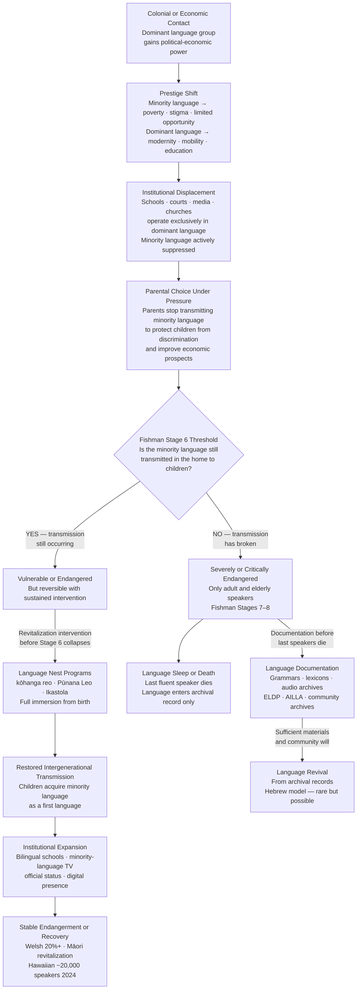

> [!abstract] TL;DR
> Of the ~7,000 languages spoken today, roughly 40% are endangered and one dies approximately every two weeks — not because they are linguistically inadequate, but because colonialism, economic marginalization, and institutional displacement break the intergenerational chain of transmission; Fishman's Graded Intergenerational Disruption Scale (GIDS) maps the eight stages of language death and argues that reversing language shift requires securing home transmission (Stage 6) before any school or media program can take hold — a lesson partially validated by Welsh, Māori, and Hawaiian revitalization successes.

---

## Intuition

**Analogy:** Imagine a recipe that exists only in oral tradition — passed from grandparent to grandchild each time it is cooked together in the kitchen. No written version exists. When a generation of children is sent to boarding schools where cooking together with grandparents is impossible — and where children are punished for speaking the language the recipe is embedded in — the recipe does not disappear immediately. The grandparents still know it. But when those grandparents die without ever cooking alongside their grandchildren, the recipe is gone forever, along with every nuance of spice proportion and technique that no dictionary entry could fully capture.

Language endangerment works exactly like this. A language is not a static object stored in a book; it is a living practice transmitted in real time through millions of intimate domestic interactions — lullabies, scolding, storytelling, prayer. When those interactions are interrupted by institutional force, economic pressure, or stigma, the transmission chain breaks. The language does not die loudly. It fades across two to three generations, as children become semi-speakers, then passive understanders, then people who remember a few phrases their grandparents used. What is lost is not merely a vocabulary list. It is an entire system for categorizing experience — ecological knowledge encoded in plant names that no other language duplicates, kinship distinctions that encode social obligations, oral literatures that took centuries to build, and ways of being in the world that are genuinely irreplaceable.

---

## How It Works



The diagram shows the two pathways through language endangerment: the downward spiral from prestige shift through institutional displacement to death, and the revitalization corridor that requires intervening at or before the Stage 6 threshold. The documentation pathway offers a last resort — revival from records — but Hebrew remains the only fully successful modern case of a language returning to native-speaker use after complete dormancy.

---

## Key Concepts

### Secondary Level

**The scale of the crisis**

Of the approximately 7,000 languages spoken on Earth today, UNESCO estimates that roughly 40% are endangered. The rate of loss is approximately one language per two weeks. By the end of the 21st century, conservative estimates place the figure of languages that will have disappeared at 50%; optimistic scenarios for intervention hold it at 25-30%; worst-case scenarios approach 90%. These projections reflect a genuine uncertainty: language vitality is not a fixed trajectory — it responds to policy, economics, and community mobilization in ways that are partially reversible.

UNESCO's five-tier classification system organizes endangerment by the degree to which intergenerational transmission is intact:

| UNESCO Status | Criterion | Estimated Languages |
|---|---|---|
| Vulnerable | Most children speak the language, but restricted to certain domains (home) | ~1,500 |
| Definitely Endangered | Children no longer learn the language as mother tongue in the home | ~1,500 |
| Severely Endangered | Language spoken by grandparents; parents may understand but do not use with children | ~1,000 |
| Critically Endangered | Youngest speakers are grandparents or older; language not used in daily life | ~1,000 |
| Extinct | No living speakers | ~400 documented; many more undocumented |

The remaining ~2,600 languages are considered safe — though "safe" often means merely that intergenerational transmission is currently occurring, not that the language is free from economic pressure.

**Why languages die: the proximate and ultimate causes**

The proximate cause of language death is always the same: parents stop transmitting the language to children. But the conditions that produce that parental decision are diverse and almost always traceable to political and economic forces rather than to anything intrinsic to the language itself:

- **Colonialism and forced assimilation** — the residential school systems of Canada, Australia, and the United States deliberately removed Indigenous children from their families and punished them physically for speaking their heritage languages. An estimated 150,000 First Nations children passed through Canadian residential schools between 1867 and 1996; the intergenerational trauma and language loss of that system is still being measured.
- **Urbanization and economic migration** — speakers migrate to cities where the dominant language is necessary for employment and social integration; within one generation the home language loses its practical function.
- **Language stigma** — the dominant language ideology marks minority languages as backward, ugly, or associated with poverty. Parents internalize this stigma and elect not to transmit the language "for the child's own good."
- **Small population size and geographic dispersal** — languages spoken by a few hundred people in isolated communities are highly vulnerable to demographic disruption (disease, diaspora, intermarriage with dominant-language speakers).
- **Genocide and community destruction** — the most direct cause; communities whose speaker populations are physically destroyed cannot transmit any cultural knowledge.
- **Education policy** — schooling conducted exclusively in the dominant language is one of the most powerful engines of language shift ever deployed. The decision to exclude a language from the school effectively signals to parents and children that it has no future.

**What is lost when a language dies**

The argument that language death matters rests on three distinct claims:

1. **Uniqueness of encoded knowledge**: Each language partitions and names the world in ways not fully duplicated by any other. Ethnobiological knowledge is particularly vulnerable — Indigenous languages of the Amazon, Australia, and the Pacific encode precise distinctions among plant species, animal behaviors, and ecological relationships that have no equivalent in any colonial language and that represent accumulated empirical observation over thousands of years. When the language dies, this knowledge has no other carrier.

2. **Rights and dignity**: Language is inseparable from identity. Article 14 of the UN Declaration on the Rights of Indigenous Peoples (2007) affirms the right of indigenous peoples to establish and control their own educational systems in their own languages. Suppressing a language suppresses the people who speak it — it is a cultural rights violation regardless of its empirical consequences.

3. **Linguistic diversity as a scientific resource**: Typological linguistics — the study of what all human languages share and how they differ — depends on a diverse living sample. Each language that dies forecloses future research into how human grammar can be organized. Pirahã, Yawelmani, Nuer, Archi — each is a data point in the experiment of human linguistic possibility.

The counter-argument — that communities have the right to abandon a language they find burdensome — is also real and must be taken seriously in revitalization ethics. The response is not to override community choice, but to ensure that community choice is genuinely free rather than coerced by stigma, poverty, and the absence of institutional support.

---

### Undergraduate Level

**Fishman's Graded Intergenerational Disruption Scale (GIDS)**

Joshua Fishman's *Reversing Language Shift* (1991) introduced the GIDS as a diagnostic tool for assessing where a minority language community stands in the process of shift and what interventions are appropriate for its situation. The scale runs from Stage 8 (most disrupted) to Stage 1 (most institutionally embedded):

| Stage | Description | Example condition |
|---|---|---|
| Stage 8 | Only a few elderly isolated speakers remain; no community social activity in the language | Last fluent speakers in their 80s; no younger speakers |
| Stage 7 | Socially integrated but linguistically isolated older speakers; most community members of working age do not speak it | Language known but not used in intergenerational households |
| Stage 6 | **The critical threshold**: the language is transmitted in the home across generations; some children acquire it as a first language | Language spoken by parents to children in the home |
| Stage 5 | Literacy in the minority language in schools, home, and community; not required in compulsory education | Voluntary literacy classes; community newspapers |
| Stage 4 | Lower governmental education with required literacy in the minority language | Welsh-medium primary schools; Basque ikastola |
| Stage 3 | The minority language used in the local work sphere; lower government services available | Regional government using minority language in day-to-day administration |
| Stage 2 | Local and regional mass media; some regional government functions in minority language | S4C Welsh television; Māori TV; regional assembly proceedings |
| Stage 1 | Education, work, mass media, government at higher and national levels | Irish in the Irish constitution; Welsh in the Welsh Assembly |

**Fishman's central argument** is that the GIDS stages are not simply descriptive steps but reflect a structural dependency: Stage 6 must be secured before any higher-stage intervention can succeed sustainably. A school bilingual program (Stage 4) will eventually fail if children enter school with no home exposure to the minority language, because the school cannot provide the density of interaction necessary to produce a first-language speaker — only the home can. This insight explains why many well-funded institutional programs (Irish in the Republic of Ireland's schools is the clearest case) have failed to reverse language shift: the school program operated without a functioning Stage 6 home transmission base.

The GIDS has been critiqued on several grounds: it is linear and does not account for domain-specific vitality (a language might be strong in religious and ceremonial domains while absent from economic life — this is not easily placed on the 8-point scale); it is individual-speaker-focused and does not model community network structure; and it was developed primarily with Western bilingual situations in mind and may not fit Indigenous community contexts where the language is tied to land and ceremony in ways that do not map onto "home transmission" in the nuclear family sense. Leanne Hinton and others have proposed revised frameworks, but Fishman's basic insight — that home transmission is the foundation — has been empirically supported by virtually every successful revitalization case.

**Language documentation: fieldwork under urgency**

When a language has reached Stages 7 or 8, the immediate priority shifts from revitalization to documentation: producing a systematic record of the language before the last fluent speakers die. This is the work of **endangered language documentation**, which combines descriptive linguistics, ethnography, and archive management.

A documentation project typically produces:
- A **reference grammar**: a systematic description of the language's phonology, morphology, syntax, and semantics
- A **lexicon or dictionary**: typically bilingual, with grammatical information and example sentences
- A **text corpus**: natural language samples — narratives, conversations, ceremonial language, songs — recorded in audio and video with transcription and translation
- **Elicited materials**: systematic vocabulary lists, paradigms, and responses to standard stimuli (the Swadesh list, Leipzig Glossing Rules corpus)

The major funding and archiving organizations include the **Endangered Language Documentation Programme (ELDP)** at SOAS, University of London (now the Endangered Languages Archive, ELAR), and the **Archive of the Indigenous Languages of Latin America (AILLA)** at the University of Texas. ELDP grants have funded over 400 documentation projects since 2002.

**Documentation ethics** have evolved substantially since the colonial-era model of the linguist who arrives, elicits a grammar, publishes it in a metropolitan journal, and departs. The current consensus in the field (embodied in the ELAR archiving agreements and the *Linguistic Society of America Ethics Statement*) requires:
- Negotiating with the speaker community about who owns the resulting materials and in what form they may be accessed (some materials — ceremonial language, restricted knowledge — may be archived but access-controlled by the community)
- Producing materials in formats that are usable by the community for teaching and revitalization, not only in formats useful to academic linguistics
- Ensuring co-authorship and co-researcher status for community members rather than treating them as informants
- Long-term archiving with redundant formats to prevent digital obsolescence

**Successful revitalization cases**

The most carefully studied successful revitalization efforts share a set of structural features that illuminate what makes language recovery possible.

**Welsh** was spoken by about 50% of the Welsh population in 1900; by 1971, only 20.8% reported speaking it. The decline correlated with urbanization, in-migration of English speakers, and the absence of institutional support. The turning point was the Welsh Language Act of 1967 (strengthened in 1993), which gave Welsh official status alongside English in Wales. Critical institutional developments:
- **S4C** (Sianel Pedwar Cymru, 1982): a Welsh-language television channel that normalized Welsh as a modern media language
- **Deddf yr Iaith Gymraeg (Welsh Language Act, 1993)**: established a Welsh Language Board with enforcement powers
- **Bilingual education policy**: Welsh-medium schools expanded from a handful in the 1960s to a system serving hundreds of thousands of children
- **Welsh Government (1999)**: the devolved Assembly conducts official business bilingually

By the 2021 census, 17.8% of the population of Wales spoke Welsh — a stabilization rather than a reversal of decline, but remarkable given the starting trajectory. Welsh is now the largest successful revitalization of a European minority language.

**Māori** (*Te Reo Māori*) was reduced to fewer than 100,000 speakers by the 1970s, with the percentage of Māori children who could hold a conversation in Māori falling below 5% by the 1980s. The revitalization movement began with the **kōhanga reo** (language nest) movement in 1982: community-based immersion daycare centers where children from birth to school age spent their days in a Māori-speaking environment. The model — total immersion in the early years, with elders as the primary language source — was explicitly designed to restore Stage 6 transmission in the absence of enough Māori-speaking parents. Key subsequent developments:
- **Kura Kaupapa Māori** (immersion schools): extended the language nest into primary and secondary education
- **Māori Television (2004)**: 24-hour broadcasting in Māori

By the 2018 New Zealand census, approximately 186,000 people reported speaking Māori conversationally. The language remains endangered but is showing vitality indicators absent in the 1980s.

**Hawaiian** (*ʻŌlelo Hawaiʻi*) was reduced to approximately 2,000 speakers by the early 1980s, following a century during which Hawaiian was banned as a medium of instruction in schools (1896–1978). The **Pūnana Leo** (language nest) movement, founded in 1983 directly inspired by the Māori kōhanga reo, established the first Hawaiian-medium preschools. By 2024, approximately 18,000–20,000 people speak Hawaiian, and it is taught at all levels through the University of Hawaiʻi at Hilo in a Hawaiian-medium program. The Hawaiian case is particularly significant because it demonstrates that a language can be pulled back from near-extinction within a single generation if the institutional commitment is sufficient.

**Hebrew** is the only modern case of a language's complete revival from dormancy to native-speaker use. Classical Hebrew was used for religious and literary purposes but had no native speakers by the 19th century. Eliezer Ben-Yehuda's project, beginning in the 1880s, systematically modernized Hebrew vocabulary and insisted on its use in daily life among the Zionist settler community. The establishment of Hebrew-medium schools, the institutional structure of the Zionist movement, and ultimately the creation of the State of Israel made Hebrew the first language of its citizens within two generations. What distinguishes the Hebrew case is the combination of ideological urgency (Zionist nationalism), institutional power (a new state), and the absence of an existing strong vernacular language in the immigrant community — factors that are not replicable in most other revitalization contexts.

---

### Graduate Level

**The Abrams-Strogatz model: language competition as dynamical system**

Daniel Abrams and Steven Strogatz published "Modelling the dynamics of language death" in *Nature* in 2003, introducing a two-equation dynamical model of language competition that fits historical data on the decline of Welsh, Scottish Gaelic, and Quechua with striking accuracy.

The model treats a population as divided between speakers of language X (fraction *x*) and speakers of language Y (fraction *1−x*). The rate of change of *x* is:

$$\frac{dx}{dt} = (1-x)\cdot x^a \cdot s \;\;-\;\; x\cdot (1-x)^a \cdot (1-s)$$

Where:
- **s** ∈ (0, 1) is the **prestige** (status) of language X relative to Y; *s* = 0.5 means equal prestige
- **a** > 0 is the **volatility** parameter — the degree to which speaker population size amplifies the attractiveness of a language (Abrams and Strogatz fit *a* ≈ 1.31 across multiple historical datasets)
- The first term represents the rate at which Y-speakers switch to X (proportional to X's prestige and to the current fraction of X-speakers raised to the *a* power)
- The second term represents the rate at which X-speakers switch to Y

The model has three fixed points: *x* = 0 (X extinct), *x* = 1 (Y extinct), and an unstable interior equilibrium at *x* = *s*^(1/(a−1)) when *a* > 1. The critical finding is that **both *x* = 0 and *x* = 1 are stable** — the system always converges to the extinction of one language — **unless *s* = exactly 0.5**. At *s* = 0.5 there is a marginally stable coexistence, but any perturbation pushes the system toward one extinction or the other.

The sociological interpretation is direct: in any situation where one language has even a slight prestige advantage, the model predicts eventual extinction of the lower-prestige language. Stable bilingualism is not a natural equilibrium — it requires active maintenance against the dynamics the model captures. This provides a formal grounding for Fishman's practical insight that language maintenance requires sustained institutional effort.

**Extending the model: bilingualism, revitalization, and network structure**

The original Abrams-Strogatz model has two significant limitations: it assumes complete social mixing (no network structure) and it excludes bilingual speakers. Extensions have addressed both:

Minett and Wang (2008) added a bilingual subpopulation, finding that bilingualism stabilizes the interior equilibrium under certain parameter conditions — but that the stabilization is fragile and depends on bilingual speakers preferentially using the minority language at home. This maps directly onto Fishman's Stage 6 argument: bilingualism is necessary but not sufficient; what matters is *which* language bilinguals transmit to children.

Patriarca and Leppänen (2004) and subsequent network models showed that geographic segregation and community structure introduce heterogeneity that can sustain minority languages in local patches even when the global dynamics predict extinction — a formal model of why Welsh persists strongly in Gwynedd while it is nearly absent in Cardiff.

The **revitalization intervention** can be modeled as a time-dependent change in *s*: policy intervention (official status, media, bilingual education) raises the minority language's prestige and thus its *s* parameter. The critical finding from the model is that the effect of an *s*-boost is strongly path-dependent: a boost applied when *x* is still above a critical threshold reverses the trajectory; the same boost applied below the threshold slows but cannot reverse extinction because the speaker-population-size term (*x^a*) is too small to sustain the transition rate. This is the formal statement of "too little, too late" — the bifurcation between the Welsh and Irish revitalization outcomes.

**Language ideology and structural endangerment**

Kathryn Woolard's concept of **language ideological indeterminacy** and Leanne Hinton's work on language revitalization both emphasize that endangerment is not primarily a linguistic problem — it is an ideological and political one. The mechanism that breaks intergenerational transmission is not speakers' judgment that the minority language is grammatically inadequate; it is their judgment that it is socially unrewarding. This judgment is produced and reproduced through **language ideology**: the set of beliefs, often naturalized and unconscious, that link language varieties to social types, moral qualities, and economic destinies.

The specific ideology operative in most language endangerment contexts is what Monica Heller calls the **ideology of the monolingual nation-state**: the belief that each legitimate state has one legitimate language, that speaking multiple languages represents incompleteness or confusion, and that the path to modernity and citizenship runs through the dominant national language. Residential school systems made this ideology physically coercive; contemporary neoliberal multiculturalism makes it economically coercive (you can keep your heritage language as an ornament, but English/Mandarin/Spanish is what you need for work).

Revitalization efforts are therefore as much ideological projects as pedagogical ones. The most successful programs — kōhanga reo, Pūnana Leo, Welsh-medium schooling — did not simply provide more hours of minority language instruction. They rebuilt the social meaning of the language: reframing it from a marker of backwardness to a marker of cultural pride, political identity, and community solidarity. In Eckert and McConnell-Ginet's terms, they altered the indexical field of the language — the constellation of social meanings that attach to its use.

**Digital tools and the paradox of the virtual domain**

The 21st century has introduced a new set of tools for language maintenance and revitalization: online dictionaries, language-learning apps, social media in minority languages, automatic speech recognition and synthesis, and neural machine translation for low-resource languages. These tools have genuine utility:

- **Duolingo** has courses in Welsh, Hawaiian, Irish, and Māori — exposing millions of learners to languages they would never encounter institutionally
- **Social media** in Welsh and Māori has created visible communities of practice in digital space, altering the prestige associations of the language among young speakers
- **Neural MT for low-resource languages** (projects like OPUS-MT and Masakhane for African languages) provides translation infrastructure that reduces the cost of creating bilingual content

But the evidence for whether digital tools can substitute for the core requirement of Fishman Stage 6 — dense, emotionally embedded, intergenerational domestic interaction — is at best mixed. The language learned through Duolingo is not the language acquired through childhood immersion; the social media community does not replicate the norm-enforcement mechanisms of a dense local network. Digital tools appear to work best as supplements to, not substitutes for, the restoration of spoken intergenerational transmission. The Welsh case, where digital presence has grown alongside (not instead of) institutional Welsh-medium education, supports this view.

**The ethics of revitalization**

The ethics of language revitalization are genuinely contested within linguistics and anthropology. Several fault lines deserve graduate-level attention:

**The autonomy objection**: If a community has shifted to the dominant language over multiple generations, is it ethical for outside linguists, governments, or even community activists to pressure younger community members to learn a language they did not grow up with? Some members of endangered language communities actively resist revitalization projects as attempts to freeze them in an idealized, romanticized past. Patrick McConvell and others have documented cases where revitalization efforts became sites of intra-community conflict over who has the authority to represent the language and who counts as a "real" speaker.

**The authenticity problem**: Languages that have been revitalized through formal teaching programs are structurally different from those transmitted through informal domestic acquisition. Neo-speakers (Neolocutores in Basque) have a different relationship to the language than heritage speakers raised in it from birth. This raises questions about what counts as "success" in revitalization — fluency by neo-speakers who learned the language in a classroom, or the re-establishment of native-acquisition pathways in households.

**The documentation-revitalization tension**: Documentation work and revitalization work serve partly different goals and can come into tension. Documentation privileges comprehensiveness — recording everything before it is gone, including variant forms, archaic registers, and dialectal diversity. Revitalization typically requires standardization — choosing a single orthography, a single set of grammatical norms, a curriculum-friendly variety that can be taught systematically. These requirements can conflict, particularly in languages with significant dialectal variation (as Māori does) or where the documentary record captures forms that the community has moved away from.

---

## Python Demo

```python
import numpy as np
import matplotlib.pyplot as plt

# ── Abrams-Strogatz language competition model ────────────────────────────────
# dx/dt = (1-x)*x^a*s - x*(1-x)^a*(1-s)
#
# x  : fraction of minority language speakers  (0 = extinct, 1 = total speakers)
# s  : prestige of the minority language        (0 < s < 1)
# 1-s: prestige of the dominant language
# a  : volatility  (Abrams & Strogatz 2003 empirical best-fit: a ≈ 1.31)
#
# Stable fixed points:
#   x = 0  when s < 0.5  (minority language goes extinct)
#   x = 1  when s > 0.5  (dominant language goes extinct)
#   s = 0.5 exactly: marginal coexistence — any noise pushes to extinction
#
# Revitalization: boost s from s_base to s_intervention at a chosen generation
# This models policy intervention (official status, bilingual schools, media)


def as_rhs(x, s, a=1.31):
    """Abrams-Strogatz right-hand side. Clips x to avoid numerical blow-up."""
    x = np.clip(x, 1e-10, 1 - 1e-10)
    return (1 - x) * (x ** a) * s - x * ((1 - x) ** a) * (1 - s)


def simulate_language(x0, s_base, n_gens=15, dt=0.02, a=1.31,
                      intervention_gen=None, s_after=None):
    """
    Euler-integrate the A-S model for n_gens generations.
    One 'generation' = 1.0 model time unit (~25 years of real language shift).
    Returns minority speaker fraction at each integer generation (0 to n_gens).
    """
    steps_per_gen = int(1.0 / dt)
    total_steps = n_gens * steps_per_gen

    x = float(x0)
    s = float(s_base)
    snapshots = []

    for t in range(total_steps + 1):
        if t % steps_per_gen == 0:
            snapshots.append(x)
        # Apply prestige boost at the start of the intervention generation
        if (intervention_gen is not None and s_after is not None
                and t == intervention_gen * steps_per_gen):
            s = float(s_after)
        if t < total_steps:
            x = np.clip(x + dt * as_rhs(x, s, a), 0.0, 1.0)

    return np.array(snapshots)


# ── Scenario parameters ───────────────────────────────────────────────────────
N_GENS      = 15
X0          = 0.40   # minority starts at 40% of all speakers
S_BASE      = 0.28   # low prestige — typical of a disadvantaged minority language
S_BOOSTED   = 0.48   # strong intervention (just below the s=0.5 tipping point)
INTERV_EARLY = 5     # generation 5: "in time"  (Welsh/Māori analogy)
INTERV_LATE  = 10    # generation 10: "too late" (Irish analogy)

gens = np.arange(N_GENS + 1)

# ── Main scenarios ────────────────────────────────────────────────────────────
traj_none  = simulate_language(X0, S_BASE)
traj_early = simulate_language(X0, S_BASE,
                               intervention_gen=INTERV_EARLY, s_after=S_BOOSTED)
traj_late  = simulate_language(X0, S_BASE,
                               intervention_gen=INTERV_LATE,  s_after=S_BOOSTED)

# ── Sensitivity analysis: vary prestige boost intensity at generation 5 ───────
prestige_levels = [0.30, 0.35, 0.40, 0.45, 0.48, 0.52]
sensitivity = {
    s_val: simulate_language(X0, S_BASE,
                             intervention_gen=INTERV_EARLY, s_after=s_val)
    for s_val in prestige_levels
}

# ── Plot ──────────────────────────────────────────────────────────────────────
fig, axes = plt.subplots(1, 2, figsize=(14, 6))

# Panel 1 — Timing bifurcation
ax = axes[0]
ax.plot(gens, traj_none  * 100, 'k--', lw=2.5, label='No intervention')
ax.plot(gens, traj_early * 100, 'g-',  lw=2.5,
        label=f'Early intervention (gen {INTERV_EARLY}, s → {S_BOOSTED})')
ax.plot(gens, traj_late  * 100, 'r-',  lw=2.5,
        label=f'Late intervention (gen {INTERV_LATE}, s → {S_BOOSTED})')
ax.axvline(INTERV_EARLY, color='green', lw=1.0, linestyle=':', alpha=0.6)
ax.axvline(INTERV_LATE,  color='red',   lw=1.0, linestyle=':', alpha=0.6)
ax.axhline(50, color='grey', lw=1.0, linestyle=':', alpha=0.5, label='50% parity line')
ax.fill_between(gens, traj_early * 100, traj_late * 100,
                alpha=0.10, color='steelblue', label='Timing gap')
ax.annotate('Welsh / Māori\ntrajectory',
            xy=(INTERV_EARLY + 0.2, float(traj_early[INTERV_EARLY]) * 100 + 4),
            fontsize=8.5, color='green')
ax.annotate('Irish school\nprogram scenario',
            xy=(INTERV_LATE + 0.2, float(traj_late[INTERV_LATE]) * 100 + 4),
            fontsize=8.5, color='red')
ax.set(xlabel='Generation  (~25 years / generation)',
       ylabel='Minority Language Speakers (%)',
       title='Bifurcation: Timing of Revitalization Intervention\n'
             f'x₀ = {X0*100:.0f}%   s_base = {S_BASE}   s_boost = {S_BOOSTED}',
       xlim=(0, N_GENS), ylim=(0, 75))
ax.legend(fontsize=9)
ax.grid(True, alpha=0.3)

# Panel 2 — Sensitivity to prestige boost intensity
ax2 = axes[1]
colors = plt.cm.RdYlGn(np.linspace(0.15, 0.90, len(prestige_levels)))
for (s_val, traj), col in zip(sensitivity.items(), colors):
    lbl = f's → {s_val:.2f}'
    if s_val == 0.50:
        lbl += '  (parity)'
    elif s_val > 0.50:
        lbl += '  (minority gains majority prestige)'
    ax2.plot(gens, traj * 100, lw=2.0, color=col, label=lbl)
ax2.plot(gens, traj_none * 100, 'k--', lw=1.5, alpha=0.6, label='No intervention')
ax2.axvline(INTERV_EARLY, color='black', lw=1.0, linestyle='--', alpha=0.5,
            label=f'Intervention at gen {INTERV_EARLY}')
ax2.axhline(50, color='grey', lw=1.0, linestyle=':', alpha=0.5)
ax2.set(xlabel='Generation  (~25 years / generation)',
        ylabel='Minority Language Speakers (%)',
        title=f'Sensitivity to Prestige Boost Intensity\n'
              f'(All interventions at generation {INTERV_EARLY})',
        xlim=(0, N_GENS), ylim=(0, 100))
ax2.legend(fontsize=8.5, loc='upper right')
ax2.grid(True, alpha=0.3)

fig.suptitle(
    'Abrams-Strogatz Language Competition Model — Revitalization Dynamics\n'
    'Modelling Language Endangerment and the Timing-Intensity Bifurcation',
    fontsize=11, fontweight='bold'
)
plt.tight_layout()
plt.savefig('language_endangerment_model.png', dpi=150, bbox_inches='tight')
plt.show()
```

**What the output shows.** Panel 1 shows the timing bifurcation: without intervention, the minority language declines monotonically from 40% toward extinction (s = 0.28 is well below the s = 0.5 threshold). An early prestige boost (generation 5) halts the decline and stabilizes the minority language above 20% — the Welsh analogy. The same prestige boost applied at generation 10 slows decline but cannot reverse it because the speaker base (*x^a* term) is now too small to sustain the transition rate — the Irish-school-program analogy. Panel 2 shows sensitivity to the intensity of the prestige boost: boosts below s = 0.40 slow but do not reverse decline; the critical transition zone lies between s = 0.45 and s = 0.50, where the intervention begins to stabilize the language above zero; s > 0.50 reverses the dynamics entirely, though reaching that threshold requires the kind of institutional support (official state language, majority-domain use) that few minority language communities can achieve.

---

## Real-World Applications

> **Welsh (Cymraeg):** The Welsh revitalization is the most studied institutional revitalization in Europe. The key causal mechanism identified by retrospective analysis is the bilingual education system (Stage 4 in GIDS terms) operating on a community where Stage 6 home transmission had not fully collapsed — particularly in Y Fro Gymraeg, the Welsh-speaking heartland of northwest Wales. The S4C television channel (Stage 2) is frequently cited as the pivotal prestige intervention: it demonstrated to Welsh speakers and non-speakers alike that Welsh was a modern language capable of broadcasting news, comedy, drama, and sport — reframing its indexical associations from rural backwardness to contemporary Welsh identity. The 2021 census result (17.8% Welsh speakers) represents stabilization, not recovery, and the debate about whether the school system can sustain vitality without a stronger Stage 6 base in homes is ongoing.

> **Māori (Te Reo Māori):** The kōhanga reo (language nest) innovation represents the most influential pedagogical technology in revitalization history. Its core insight — that the language cannot be taught in a two-hour-per-week school class but must become the exclusive medium of a full daily environment for children under five — was directly drawn from Fishman's GIDS logic about Stage 6. The model has been replicated in Hawaiian (Pūnana Leo), Basque (ikastola), and dozens of other contexts. The Māori Television channel, established after a landmark Treaty of Waitangi Tribunal ruling, added the Stage 2 institutional component. The result is a language that was genuinely in danger of extinction in 1975 and now has a substantial community of relatively fluent speakers below the age of 40.

> **Hawaiian (ʻŌlelo Hawaiʻi):** The Hawaiian case is the most dramatic recovery from near-extinction. The 1978 Hawaiian State Constitution recognized Hawaiian as an official language alongside English, and the 1986 repeal of the 1896 law banning Hawaiian-medium instruction in schools removed the institutional barrier to the Pūnana Leo program. The University of Hawaiʻi at Hilo Ka Haka ʻUla O Keʻelikōlani College is the only accredited institution in the United States offering bachelor's and master's degrees entirely through an Indigenous language. The ~18,000–20,000 Hawaiian speakers reported in 2024 represent a recovery of approximately 900% from the 1980s baseline — the strongest documented demographic revitalization outside Hebrew.

> **Endangered Language Documentation Programme (ELDP/ELAR):** ELDP, established at SOAS in 2002 with funding from the Arcadia charitable trust, has funded over 400 fieldwork projects in languages at Stage 7–8 of the GIDS. The resulting materials — deposited in the Endangered Languages Archive (ELAR) — now contain thousands of hours of recorded speech, hundreds of annotated text corpora, and lexical databases for languages that in some cases now have no living fluent speakers. The ELDP model has demonstrated that large-scale, fast-moving documentation is feasible, but that archival success does not automatically translate into revitalization success — materials in an archive in London are not inherently usable by a community in the Amazon or Siberia. The second-generation challenge is making these archives community-accessible.

---

## Common Pitfalls

- **Conflating documentation and revitalization** — Documentation (recording a language before it dies) and revitalization (restoring living transmission) are distinct goals that require different methods and sometimes come into tension. A linguist who produces an excellent reference grammar has not revitalized a language. The grammar is a necessary but not sufficient condition for revitalization; it must be accompanied by the social and institutional work of rebuilding the communities of practice in which the language is used.

- **Skipping Stage 6 and jumping to institutional programs** — The most common failure mode in government-funded revitalization is investing heavily in school programs (Stage 4) or media (Stage 2) without first securing intergenerational home transmission (Stage 6). Irish Gaelic in the Republic of Ireland is the canonical case: despite decades of compulsory Irish instruction in schools and significant state spending, the percentage of fluent Irish speakers outside the Gaeltacht has not grown substantially, because the school program is not supported by a Stage 6 base. Children who do not hear Irish at home and in the community do not become fluent speakers from two hours of school instruction per week.

- **Treating language vitality as irreversible decline** — The Abrams-Strogatz model, taken naively, predicts that any language with prestige below 0.5 is doomed to extinction. But the historical record shows that prestige is not a fixed variable — it can be changed by policy, community mobilization, and cultural reframing. Welsh, Māori, and Hawaiian have all demonstrated that the decline trajectory can be bent, though not easily or cheaply. The error is treating the model's parameters as exogenous and immutable rather than as the targets of policy intervention.

- **Imposing revitalization on ambivalent communities** — Language revitalization programs sometimes reflect the preferences of an activist minority or outside linguists rather than the broader community. Younger members of endangered language communities may have legitimate reasons — economic pragmatism, personal identity, rejection of what they experience as nostalgic nationalism — for not wanting to learn the heritage language. Revitalization that does not grapple with intra-community disagreement risks reproducing paternalistic dynamics even in the name of Indigenous empowerment.

- **Confusing neo-speakers with heritage speakers** — A language program that produces university graduates who can speak the minority language in formal contexts is not the same as a community that transmits the language to children in informal domestic life. Neo-speakers (people who learned the language as adults or in school) tend to have a more restricted register range, less idiomatic competence, and less exposure to the oral literary tradition than heritage first-language speakers. Treating neo-speaker fluency as equivalent to native acquisition overstates the success of revitalization programs.

- **Ignoring the political economy of endangerment** — The most common popular framing of language death is ecological: languages die like species, as a natural result of competition. This framing systematically obscures the political violence that drives most language death. Languages do not compete in a neutral market; they compete in a system where one has the backing of a state, a legal system, a school system, and an army, while the other does not. Treating this as natural selection is itself an ideological move that absolves the historically responsible institutions of accountability.

- **Overestimating the impact of digital tools** — Apps like Duolingo provide useful supplementary exposure but cannot substitute for immersive, emotionally embedded childhood acquisition. A Welsh teenager using Duolingo for twenty minutes a day is not acquiring the same linguistic competence as a child raised in a Welsh-speaking household in Gwynedd. The confound matters because policymakers sometimes use download numbers for language-learning apps as evidence of revitalization success, when what those numbers measure is curiosity or supplementary learning, not the restoration of intergenerational transmission.

---

## Related Concepts

- [[Language_Variation_and_Dialects]] — Standard language ideology — the belief that one legitimate variety exists for each language — is a primary driver of minority language stigma and intergenerational transmission break; prestige and covert prestige in sociolinguistics map directly onto the Abrams-Strogatz *s* parameter
- [[Universal_Grammar_and_Language_Acquisition]] — The critical period hypothesis (native-like acquisition requires early childhood immersion) is the developmental basis for Fishman's Stage 6 argument: home transmission must be restored because only the household provides sufficient early-childhood input density for genuine first-language acquisition
- [[Language_and_Culture]] — The Sapir-Whorf tradition provides the philosophical grounding for the uniqueness argument in language preservation: each language encodes a distinct world-view and ecological knowledge system; the note discusses Hawaiian revitalization as an applied case
- [[Indigenous_Rights_and_Sovereignty]] — Language rights are constitutive of the broader framework of Indigenous rights; UNDRIP Article 14 codifies the right to education in heritage languages; the residential school system is treated there as a mechanism of cultural genocide
- [[Language_Socialization_and_Acquisition]] — Children are socialized into language through caregiver interaction; the kōhanga reo and Pūnana Leo language nest models reconstruct the socialization environment to restore Stage 6 transmission when parents are themselves not fluent speakers
- [[Colonialism_and_Postcolonial_Anthropology]] — The historical cause of most contemporary language endangerment is colonial language policy; the residential school system is analyzed there as the institutional mechanism linking colonial ideology to language death outcomes
- [[Discourse_Power_and_Identity]] — Language ideology as a form of Foucauldian discourse: the naturalization of the dominant language as "correct" or "modern" is a power-knowledge configuration that produces the speaker shame that breaks intergenerational transmission
- [[Oral_Tradition_and_Narrative]] — Oral literatures — epics, ritual speech, genealogical chants — are among the most endangered content forms in dying languages; the kōhanga reo model recognizes this by placing elders (the last carriers of oral tradition) at the center of the language environment
- [[Race_Ethnicity_and_Racism]] — Language stigma and racial stigma co-produce each other: AAVE, Māori, and Hawaiian were stigmatized partly as proxies for the racial identities of their speakers; language revitalization intersects with racial justice when it reclaims the prestige of minoritized communities
- [[Globalization_and_Cultural_Change]] — Globalization amplifies language shift by expanding the economic domains in which English, Mandarin, and Spanish are necessary, reducing the utility of minority languages in modern labor markets and accelerating the parental rational-choice argument for not transmitting them

---

## Review Questions

### Secondary

1. A community has 5,000 people who speak a minority language, but linguists have noted that almost no children under the age of ten can hold a conversation in it. According to Fishman's GIDS, which stage is this community at, and why does that stage represent a critical threshold? What is the single most important intervention the community could make, and why?
2. The Hawaiian language was once spoken by the entire population of the Hawaiian Islands. By the 1980s, only about 2,000 people spoke it. What forces drove this decline, and what specific program reversed it? What does the Hawaiian case suggest about what is required for a language to recover from near-extinction?
3. Some people argue that endangered languages should be allowed to die out naturally — that communities have freely chosen dominant languages because those languages offer more economic opportunity. A linguist argues this framing is wrong. What would the linguist say, and what evidence would they cite?

### Undergraduate

1. Fishman argues that bilingual education programs (Stage 4) consistently fail to reverse language shift unless Stage 6 — intergenerational home transmission — is first secured. Using Irish and Welsh as comparative cases, evaluate this claim: what evidence supports it, and are there any cases where Stage 4 interventions have succeeded without a Stage 6 base? What methodological challenges make this comparison difficult?
2. The Abrams-Strogatz model predicts that stable bilingualism is an unstable equilibrium — any asymmetry in prestige pushes the system toward the extinction of one language. How does this formal result relate to Fishman's practical observation about intergenerational transmission? What real-world factors does the model omit that could sustain bilingualism as a stable social outcome, and how would you extend the model to capture them?
3. Language documentation and language revitalization are sometimes described as competing priorities: documentation serves academic linguistics and archival goals; revitalization serves community language use. Describe at least two specific points of tension between these goals using examples from fieldwork practice, and propose how a documentation project might be designed to serve both simultaneously.

### Graduate

1. The ethics of language revitalization are contested: some scholars argue that communities have the right to abandon languages they find burdensome, and that revitalization projects can be paternalistic impositions. Others argue that language loss is structurally coerced — driven by stigma and economic inequality — and that revitalization is a corrective to historical injustice rather than an imposition of cultural preference. Develop a framework that could adjudicate between these positions in a specific case: what evidence would you need to determine whether a given community's language shift was "freely chosen" or "coerced," and what would follow from each finding for policy?
2. The Abrams-Strogatz model fits historical data on the decline of Welsh, Scottish Gaelic, and Quechua with a single volatility parameter *a* ≈ 1.31. What does this empirical regularity suggest about the universality of the social dynamics of language competition? What are the limits of the analogy between language competition and other two-species competition models in ecology (e.g., Lotka-Volterra)? What features of real language communities — community network structure, diglossia, domain-specific vitality, code-switching — would require fundamental modifications to the model's architecture rather than simple parameter adjustments?
3. Welsh revitalization has achieved stabilization of speaker numbers but has not reversed decline; Irish despite massive institutional investment has stagnated; Hawaiian has produced dramatic recovery from near-extinction; Hebrew achieved full revival. Analyze these four cases using both the GIDS framework and the Abrams-Strogatz model to identify the conditions under which each trajectory became possible. Which factors were necessary, which sufficient, and which were necessary but not sufficient? What does this comparative analysis imply for the design of revitalization policy in a currently Stage 6–7 language community?

---

## Sources

- [Abrams, D. & Strogatz, S. (2003). "Modelling the dynamics of language death." *Nature*, 424, 900.](https://www.nature.com/articles/424900a)
- [Fishman, J.A. (1991). *Reversing Language Shift: Theoretical and Empirical Foundations of Assistance to Threatened Languages*. Multilingual Matters.](https://www.multilingual-matters.com/page/detail/Reversing-Language-Shift/?k=9781853590528)
- [UNESCO. (2003). *Language Vitality and Endangerment*. UNESCO Ad Hoc Expert Group on Endangered Languages.](https://unesdoc.unesco.org/ark:/48223/pf0000183699)
- [Grenoble, L.A. & Whaley, L.J. (2006). *Saving Languages: An Introduction to Language Revitalization*. Cambridge University Press.](https://www.cambridge.org/core/books/saving-languages/C6437B3D37B1B75A55EDD46C8E7C6B8E)
- [Hinton, L. & Hale, K. (Eds.). (2001). *The Green Book of Language Revitalization in Practice*. Academic Press.](https://www.sciencedirect.com/book/9780122003554/the-green-book-of-language-revitalization-in-practice)
- [Crystal, D. (2000). *Language Death*. Cambridge University Press.](https://www.cambridge.org/core/books/language-death/B4E5CF1C7B8A85B6C0CBBCFF17C68D55)
- [Evans, N. (2010). *Dying Words: Endangered Languages and What They Have to Tell Us*. Wiley-Blackwell.](https://www.wiley.com/en-us/Dying+Words%3A+Endangered+Languages+and+What+They+Have+to+Tell+Us-p-9781405155748)
- [Minett, J.W. & Wang, W.S-Y. (2008). "Modelling endangered languages: The effects of bilingualism and social structure." *Lingua*, 118(1), 19–45.](https://www.sciencedirect.com/science/article/abs/pii/S0024384107000320)
- [Endangered Languages Archive (ELAR), SOAS University of London.](https://www.elararchive.org/)
- [UNESCO Atlas of the World's Languages in Danger.](https://www.unesco.org/en/articles/atlas-worlds-languages-danger)
- [Modelling the life and death of competing languages — arxiv.org](https://arxiv.org/pdf/1703.10706)
- [Optimal language policy for the preservation of a minority language — ScienceDirect](https://www.sciencedirect.com/science/article/abs/pii/S0165489616300026)

---

#Linguistics #HistoricalLinguistics #LanguageEndangerment
