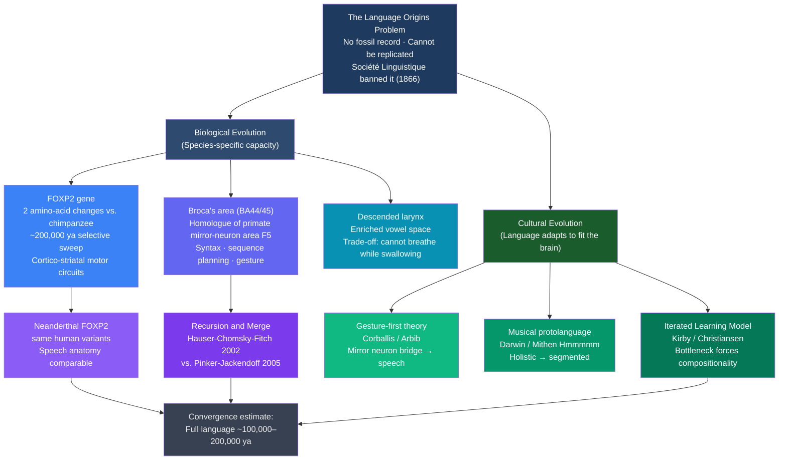

# Language Evolution and Origins

> [!abstract] TL;DR
> The origin of language is the hardest problem in linguistics: it leaves no fossil record, and its emergence cannot be replicated. Three sub-questions drive the field — when did language arise? how did the biological capacity evolve? how did syntax originate? Modern answers weave together the genetics of FOXP2, the neuroscience of Broca's area, the archaeology of behavioral modernity, primate communication studies, and computational models of cultural transmission; the iterated learning framework demonstrates that structural, systematic language can emerge from random communication through cultural transmission alone, without any pre-specified grammar.

---

## Intuition

**Analogy:** A game of telephone played across ten thousand generations of players, in which messages that are difficult to pass along accurately simply disappear, and messages that are easy to reconstruct from partial information survive and spread. Now imagine that what survives is not a single message but the entire system of rules for constructing messages — the grammar. Over enough generations, the rules that are hardest to transmit accurately (arbitrary, unsystematic, requiring memorization of each case individually) are gradually replaced by rules that anyone can re-derive from a few examples: compositional rules, where the meaning of the whole is predictable from the meanings of the parts. Nobody designs these rules; they emerge from the statistical pressure of transmission through a brain that prefers patterns to noise.

This is the Kirby-Christiansen insight: language is not simply a tool the brain uses, but a system that has been sculpted over thousands of years of cultural transmission to fit the constraints of human memory, perception, and generalization. The brain and language co-evolved — but the co-evolution runs in both directions. The deep grammar-like properties of human languages (compositionality, duality of patterning, hierarchy) may be as much a product of cultural filtering as of biological evolution.

---

## How It Works

### Core Mechanics

#### 1. The Three Questions

The field of glottogony (from Greek *glōtta*, tongue + *gonos*, birth) — the study of the origin of language — is structured by three distinct but interrelated questions:

1. **When?** When in human evolutionary history did language-like communication arise? Does the timeline go back 200,000 years (early anatomically modern humans), 100,000 years (early behavioral modernity), or did the "Great Leap Forward" in symbolic behaviour ~50,000 years ago mark the emergence of fully modern language?

2. **How (biologically)?** What anatomical, neurological, and genetic changes enabled the human language capacity? What distinguishes the human brain and vocal tract from those of other primates?

3. **How (structurally)?** Where did the core design features of human language — duality of patterning, hierarchical phrase structure, recursion, displacement, productivity — come from? Did they arise through biological evolution, cultural evolution, or both?

The Société Linguistique de Paris famously banned all discussion of language origins in 1866, declaring the problem unscientific — any claim could be made without refutation since direct evidence was unavailable. That ban held as an informal scientific norm for nearly a century. The modern revival of the field, beginning in the 1990s, was made possible by four independent developments: ancient DNA extraction (allowing us to examine Neanderthal genomes for language-related genes), detailed comparative neuroimaging (mapping Broca's area homologues in apes), computational modelling of cultural transmission (the iterated learning paradigm), and the discovery of FOXP2 as the first gene with specific effects on speech and grammar.

#### 2. The Language-Ready Brain: Biology

**The descended larynx.** The human larynx sits dramatically lower in the pharynx than in any other primate. In chimpanzees and other great apes, the larynx is positioned high, allowing the animal to breathe and swallow simultaneously — a significant survival advantage. In adult humans, the larynx has descended to a position that creates an elongated pharyngeal cavity above the vocal folds, enabling the production of a much richer range of vowel and consonant sounds. The trade-off is severe: humans cannot simultaneously breathe and swallow, which is why we can choke on food and other primates generally cannot. This is strong evidence that the descended larynx was selected for — despite its survival cost — because of the communication advantages it conferred. The descent appears to be completed postnatally (human infants begin with a high larynx, like other primates, and the descent occurs during the first two years of life).

**Broca's area and its homologues.** Broca's area (Brodmann areas 44 and 45 in the left inferior frontal gyrus) is associated with syntactic processing and speech production in humans. Its structural homologue in macaques is area F5, and in great apes, a region sometimes called area 44. Critically, area F5 contains **mirror neurons** — neurons that fire both when an animal executes a manual action and when it observes another animal performing the same action. Michael Arbib's "mirror neuron hypothesis" proposes that Broca's area evolved from this mirror neuron system, explaining why the same region handles both manual gesture and speech in humans. However, the evidence for mirror neurons in humans is indirect (fMRI rather than single-cell recording), and the claim that mirror neurons are the "bridge" from gesture to language remains controversial.

**FOXP2: the first language-associated gene.** In the early 1990s, researchers identified the KE family in the United Kingdom, about half of whom have a severe specific language impairment: difficulty producing and comprehending grammatically complex sentences, with additional orofacial apraxia (difficulty controlling the oral muscles for speech). The disorder is inherited in an autosomal dominant pattern, suggesting a single gene. In 2001, Simon Fisher and colleagues identified the culprit as a mutation in FOXP2 — a forkhead-box transcription factor. The human FOXP2 protein differs from the chimpanzee version at exactly two amino acid positions, changes that arose approximately 200,000 years ago in the human lineage (estimated from the signatures of a recent selective sweep in the gene's genomic neighbourhood). FOXP2 is expressed in cortico-striatal circuits (connections between the cortex and basal ganglia), regions involved in motor sequence learning and the automation of skilled movements. The gene is not "the grammar gene" — it is a transcription factor that regulates hundreds of downstream genes involved in motor learning and brain circuit formation. Crucially, FOXP2 is also found in birds (where it is involved in song learning) and in crocodilians, suggesting deep evolutionary conservation of its role in vocal learning. Ancient DNA studies have demonstrated that Neanderthals carry the same human-derived FOXP2 variants — though this does not establish that Neanderthals had full language.

**The Neanderthal question.** Neanderthals (Homo neanderthalensis, 300,000–30,000 years ago) shared the human FOXP2 variants, had a hyoid bone (throat cartilage involved in phonation) morphologically similar to modern humans, and had brain volumes comparable to or exceeding modern humans. Did they speak? The current consensus is: probably yes, they had the anatomical prerequisites for complex vocalization; but whether they had the full recursive, compositional grammar of modern humans is genuinely unknown. Claims that Neanderthal speech was impossible (based on earlier reconstructions of a high larynx) have been revised by more recent fossil evidence. The hybridization of Neanderthals and modern humans (documented in ancient DNA) adds a further dimension: some modern non-African humans carry up to 2–4% Neanderthal DNA, including possibly some language-related alleles.

#### 3. The Timeline: When Did Language Emerge?

The evidence is indirect — language itself leaves no fossil record — but several archaeological and genetic proxies converge:

| Evidence type | Dating | Significance |
|---|---|---|
| Ochre processing, pigment use | ~160,000–200,000 ya (Pinnacle Point, South Africa) | Symbolic behavior; ochre used for body decoration |
| Perforated shell beads | ~130,000 ya (North Africa, Levant) | Personal ornament; requires concept of self-presentation |
| Geometric engravings (Blombos Cave) | ~75,000 ya | Abstract symbolic representation |
| Blade technology, composite tools | ~70,000 ya | Requires planning, transmission of complex technique |
| Figurative art (Sulawesi, Indonesia) | ~45,500 ya | Oldest figurative painting |
| Cave art explosion (Europe) | ~35,000–40,000 ya | Chauvet, Lascaux — highly sophisticated imagery |
| Mitochondrial Eve / Y-chromosomal Adam | ~150,000–200,000 ya | Common ancestors of all modern humans |
| Modern FOXP2 variant sweep | ~200,000 ya | Estimated from genomic evidence |

The "behavioral modernity" or "symbolic explosion" hypothesis holds that something changed dramatically ~50,000 years ago, producing the cave art, personal ornament, and long-distance trade networks that are absent in the earlier record. This has been interpreted as the emergence of full language (Bickerton's "Great Leap Forward"). However, the earlier African evidence (ochre, beads, engravings) shows that symbolic behavior was present much earlier, perhaps as far back as 300,000 years ago. The European "explosion" may reflect archaeological preservation biases (caves in Europe preserve better than open sites in Africa) or a population bottleneck effect rather than a genuine cognitive transition.

Most researchers currently place the emergence of full language (complete with recursion, displacement, and compositionality) somewhere between 100,000 and 300,000 years ago — roughly coterminous with anatomically modern humans.

#### 4. Theories of Language Origins

**The gestural origins hypothesis** (proposed independently by Gordon Hewes in 1973, and developed by Michael Corballis and Michael Arbib) holds that language evolved from manual gesture rather than from vocalization. Key evidence: great apes can learn to communicate with gesture and sign language (though not productively with syntax) far more readily than they can imitate speech; the mirror neuron system provides a plausible neural mechanism for translating the observation of action into the production of communicative gesture; Broca's area is involved in both manual action and speech; and children with congenital deafness spontaneously develop complex homesign systems (gestural communication invented without a linguistic model). Speech, on this view, came later — perhaps co-opted from already-evolved vocal call systems — and the "multimodal" nature of modern language (speech + gesture + facial expression) reflects its gestural origins.

**The vocal-first hypothesis** (Peter MacNeilage's "frame/content" theory) argues that the rhythmic jaw oscillation of primate lip-smacking and teeth-chattering provided the neuromotor template for syllable structure (consonant-vowel alternation) — the "frame." Variations in vocalization produced the "content" (different vowels and consonants within the frame). On this view, the basic architecture of syllabic speech is built on a pre-existing primate motor pattern, and gesture is secondary.

**Darwin's musical protolanguage and Mithen's "Hmmmmm."** Charles Darwin speculated in *The Descent of Man* (1871) that language evolved from musical, tonal vocalizations used for sexual selection and emotional communication — a "musical protolanguage" of manipulative calls. Steven Mithen (2005) elaborated this into the "Hmmmmm" hypothesis: the immediate precursor of language was a communication system that was **H**olistic (each call was a complete message, not decomposable into parts), **M**anipulative (used to influence others' behavior), **M**ulti-modal (combined gesture, vocalization, and facial expression), **M**imetic (could imitate sounds and actions from the environment), and **M**usical (organized by rhythm and melody). The transition from holistic Hmmmmm to compositional language involved the "segmentation" of holistic calls into smaller reusable parts — the origin of duality of patterning.

**Bickerton's protolanguage.** Derek Bickerton (1990) distinguished between "protolanguage" (a system of individual meaningful symbols without syntax — single-word communication, like early child language or the communication of apes trained on lexigrams) and "language proper" (with recursive, hierarchical phrase structure). His "Great Leap Forward" hypothesis holds that protolanguage was present throughout hominid evolution but that full syntax emerged suddenly (~50,000 years ago), possibly from a single genetic mutation. Most linguists now reject the suddenness of the transition but retain the conceptual distinction between protolanguage and full language as a useful framework.

**Hockett's design features** are the classical attempt to define what is unique about human language. Charles Hockett (1960) proposed 16 features, of which the most diagnostic are:
- **Duality of patterning**: meaningless phonological units (phonemes) combine to form meaningful morphemic units. No animal communication system has this.
- **Productivity**: new messages can be constructed indefinitely from finite elements. Partially present in some animal systems.
- **Displacement**: can refer to things not present in space or time. Present in honeybee waggle dance.
- **Cultural transmission**: acquired through learning from other speakers, not biologically inherited. True of most animal communication.
- **Arbitrariness**: the relationship between form and meaning is conventional, not iconic. Partially true of human language (some iconicity remains).

The focus of current debate is on **duality of patterning** (when did phonological units become distinct from meaningful units?) and **recursion** — the ability to embed phrases within phrases without limit, creating sentences of arbitrary complexity.

#### 5. The Recursion Debate

In a landmark 2002 paper, Marc Hauser, Noam Chomsky, and W. Tecumseh Fitch proposed that the human language faculty consists of two parts:
- **Faculty of Language — Broad (FLB)**: capacities shared with other animals, including a memory system for words/symbols, the ability to parse sequential structure, and a sensorimotor system for vocalization or gesture.
- **Faculty of Language — Narrow (FLN)**: the uniquely human component — specifically, **recursive Merge**, the computational operation that builds hierarchical phrase structure by combining two elements into a new element of the same type (e.g., combining a noun and a verb phrase into a sentence, which can then be embedded in another sentence).

Hauser, Chomsky, and Fitch argued that FLN = {Merge} and that this single operation, co-opted from some other cognitive domain (number? spatial reasoning?), explains the unique productivity of human language.

Steven Pinker and Ray Jackendoff (2005) challenged this minimalism vigorously, arguing that many other features of language — lexical categories, phonological structure, argument structure, morphological rules — are also uniquely human and cannot be derived from Merge alone. They further argued that the Minimalist position made language evolution *harder* to explain, not easier, because it implied a single large saltation (a sudden evolutionary leap) rather than gradual adaptation.

The empirical test case for this debate is **Pirahã**, a language spoken by ~350 people in the Amazon basin, for which Daniel Everett (2005) claimed there is no recursion, no embedding of clauses within clauses, and no reference to non-witnessed events. If true, this would be a human language without the FLN. Chomsky and colleagues dispute Everett's analysis; the debate is unresolved.

---

### Flow / Architecture



---

## Key Concepts

### Secondary Level

**Why is language origins so hard to study?**

Language is behaviour, not bone. A fossilized jaw can tell us about diet; a fossilized skull can estimate brain volume; but neither tells us whether the creature that owned them could produce a relative clause. Even the indirect proxies — brain endocasts (impressions of the inner skull surface), hyoid bone morphology, FOXP2 genotyping from ancient DNA — can only speak to whether the anatomical prerequisites for language were in place. They cannot confirm language itself was used. This is unlike almost every other major question in evolutionary biology: we cannot find "language fossils." The Société Linguistique de Paris was right that 19th-century speculation about language origins was untestable; the 21st-century achievement is making parts of the question tractable through genetics, neuroscience, and computational modelling.

**The three-million-year prologue.**

The human vocal tract and neural language systems did not appear overnight. The hominid lineage separated from the chimpanzee lineage approximately 6–7 million years ago, and the changes that enabled language accumulated over this entire span. Key milestones: bipedalism (~4 million years ago) freed the hands for gesture and changed breathing patterns; enlargement of the prefrontal cortex in the Homo lineage began ~2 million years ago with Homo habilis; the descended larynx was complete by anatomically modern humans (~200,000 ya); the FOXP2 selective sweep appears to have occurred ~200,000 ya. The question "when did language originate?" is therefore partly a question about which threshold in this multi-million-year accumulation counts as "language."

**Behavioral modernity: the archaeological record.**

The best proxy for language we have in the archaeological record is **symbolic behavior**: behavior that implies the use of arbitrary symbols, where an object (a shell bead, a pigment-covered hand outline, a carved figurine) means something that it is not. Symbolic behavior requires the capacity for displacement (referring to things not present), cultural transmission (shared conventions about what symbols mean), and arguably for recursive thought (the ability to represent a representation: "this shell means group membership, which means..." ). The earliest unambiguous symbolic behavior in Africa predates the European cave art explosion by over 100,000 years. Whether this earlier symbolism required full language or merely a "proto-language" with symbols but no syntax remains debated.

**Primate communication: how close are they?**

Vervet monkeys have distinct alarm calls for different predator types (eagle call → look up; leopard call → run to trees; snake call → look down). This is "functional reference" — calls that direct attention to specific environmental features — but the calls are not learned and cannot be recombined. Chimpanzees and bonobos trained on lexigrams (symbols on a keyboard) can learn hundreds of symbols and use them to request objects and actions. Kanzi the bonobo learned approximately 3,000 symbols and could follow novel instructions combining them. But no trained ape has shown productive syntax: the ability to produce novel sentences by combining words according to grammatical rules and to understand that the order of combination matters. The gap between "has symbols" and "has grammar" remains absolute.

---

### Undergraduate Level

#### Hockett's Design Features and the What-Is-Unique Problem

Charles Hockett's 1960 analysis of language design features — properties that characterize human language and distinguish it from animal communication — remains the starting point for any discussion of what needs to be explained. The most diagnostically human features:

**Duality of patterning** is perhaps the most structurally distinctive. In human language, there are two levels of combinatorial organization: (1) meaningless phonological units (phonemes: /p/, /a/, /t/) combine into meaningful morphemic units (words: *pat*, *tap*, *apt*); (2) meaningful units (words, morphemes) combine into larger meaningful structures (phrases, sentences). No animal communication system has this two-tier combinatorial architecture. The question of when duality of patterning emerged is one of the deepest in language evolution: it requires that the articulatory-perceptual system has been split into a "phonological" level and a "morpho-syntactic" level, rather than treating every distinct vocalization as a holistic unit.

**Productivity and displacement** are also uniquely developed in humans. Productivity — the ability to produce and understand infinitely many novel messages — follows from the compositional property of syntax. Displacement — the ability to communicate about things not present in space or time ("yesterday," "tomorrow," "in the next valley," "in my dream") — is essential for the planning and coordination that complex human culture requires. The honeybee waggle dance has displacement (a bee can communicate about a flower several kilometers away), but it is inflexible (only direction and distance can be communicated) and biologically fixed (not learned).

#### The Vocal Tract and Phonetic Space

The human vocal tract is shaped by the descended larynx into an "L" shape (horizontal oral cavity + vertical pharynx). This geometry, unique among primates, produces a resonance chamber with far greater acoustic flexibility than the primate tract, enabling the articulation of high-front vowels (/i/), low-back vowels (/a/), and rounded back vowels (/u/) — the "quantal vowels" that form the core of nearly every human vowel system. Philip Lieberman's 1984 analysis of the La Chapelle-aux-Saints Neanderthal skull led him to conclude that Neanderthals could not articulate these quantal vowels — a claim that has been substantially revised by later researchers who found that the La Chapelle individual was arthritic and atypical. More recent hyoid bone evidence and biomechanical modelling suggest Neanderthal vocal tract anatomy was not dramatically different from modern humans.

The trade-off of the descended larynx — inability to breathe and swallow simultaneously — is real and has resulted in human adults choking to death on food, an event essentially impossible in other primates. This is the kind of trade-off that evolutionary biologists use as evidence of natural selection: a disadvantageous change does not become fixed unless it confers sufficient compensating advantage. The communication advantage of the descended larynx was evidently large enough to outweigh the choking risk.

#### Comparative Evidence: Apes, Birds, and Cetaceans

The field of comparative animal cognition and communication provides indirect evidence for the evolution of language by identifying which components of language are phylogenetically ancient and which are genuinely novel in the human lineage.

**Great apes and lexigram studies.** Projects Washoe (chimpanzee, ASL), Sherman and Austin (chimpanzees, lexigrams), and most extensively Kanzi (bonobo, lexigrams) have demonstrated: (a) apes can learn arbitrary symbols for objects and actions; (b) they can combine symbols to make requests; (c) they can respond to novel multi-word instructions they have never heard before. What they have not demonstrated: productive, rule-governed syntax; recursion; displacement beyond the immediate past; or anything resembling morphological inflection. The implication is that the *lexical* capacity (associating symbols with referents) is not uniquely human, but the *syntactic* capacity is.

**Vocal learning in birds.** Songbirds (oscines) and parrots learn their vocalizations from adult tutors — they are among the few non-human groups with "vocal learning," the ability to acquire vocalizations through imitation. Birdsong involves sequential combination of acoustic units ("syllables") and can be complex (up to several hundred distinct syllable types in a single species). FOXP2 is expressed in the neural circuits for birdsong, and mutations in FOXP2 disrupt song learning in zebra finches. This is a stunning convergence with the human case: the same gene, in a phylogenetically distant lineage, is involved in a vocal learning system. But birdsong lacks the combinatorial semantics of human language — the order and combination of syllables in a song does not determine meaning in the compositional sense.

**Cetacean communication.** Whales and dolphins also show vocal learning and complex sequential vocalizations. Sperm whale "codas" (click patterns) vary by social group in ways that resemble cultural dialects. But the syntactic complexity of cetacean communication remains unknown and is actively debated.

The **"continuity debate"** is the dispute between researchers who see human language as a gradual extension of primate communication (adding syntactic structure to an already rich symbolic repertoire) and those who see it as a discontinuous leap (a qualitative change requiring new biological machinery). The FOXP2 data, the mirror neuron findings, and the cultural evolution models collectively suggest that both sides are partly right: the components accumulated gradually (lexical capacity, vocal learning, motor control, social cognition), but the recursive combinatorial architecture may represent a threshold effect — a small change in neural circuitry that enabled a qualitatively different kind of communication.

#### The Iterated Learning Framework

Simon Kirby, Henry Brighton, and their colleagues developed the **iterated learning model** (ILM) in the early 2000s to ask a new kind of question: not "did language require an evolved grammar faculty?" but "what structural properties does language acquire when it is repeatedly transmitted through human learners?" The insight: if language is a culturally transmitted system, and if cultural transmission is subject to a bottleneck (each learner sees only a subset of possible meaning-form mappings), then languages should evolve over generations of transmission to become more learnable — and more learnable means more structured.

The key experimental result (Kirby, Cornish, and Smith 2008) is that artificial languages created by human participants in a laboratory converge on compositional, systematic structure over approximately 10 generations of transmission, starting from random form-meaning mappings. Critically:
- **Without a transmission bottleneck** (participants can memorize the entire language), languages remain random and show no systematicity increase.
- **With a bottleneck** (participants see only a subset and must generalize to the rest), languages rapidly develop structured, compositional form-meaning relationships.

This is a profound result because it demonstrates that the structural universals of human language — compositionality, regularity, systematicity — can emerge from the dynamics of cultural transmission without any pre-specified grammatical knowledge. Language, in this view, is a system that has been shaped over thousands of generations of transmission to fit the architecture of human memory and generalization.

---

### Graduate Level

#### The Language-as-Adaptation vs. Language-as-Spandrel Debate

The deepest theoretical split in language evolution is between:

**Selectionist / adaptationist positions** (Darwin, Pinker, Jackendoff): Language evolved by natural selection because it conferred reproductive advantages — better coordination of hunting, food-sharing, coalition formation, teaching, and mate evaluation. On this view, language is a complex adaptation with many specialized sub-systems (lexical acquisition mechanisms, phonological representations, argument structure templates), each of which evolved for communicative purposes. The complexity of language reflects the complexity of the selection pressures that shaped it, analogous to the complexity of the eye.

**Non-adaptationist positions** (Chomsky, Hauser, Fitch 2002): The core of language — recursive Merge — was not selected for communication. It may have evolved for internal computational purposes (planning, mental simulation, "thinking") and was only subsequently "externalized" for communication. Communication is what language is used for, not what it evolved to do. This view is consistent with language being a "spandrel" (a by-product of selection for something else) or with it being a saltatory event (a single mutation with large effect rather than gradual selection on small variants).

The **gene-culture coevolution** position (Christiansen & Kirby, Deacon) attempts a synthesis: language co-evolved with the human brain, but the causal arrow runs from culture to biology at least as much as from biology to culture. Languages, as cultural systems, create selection pressures on learners — individuals who can learn the culturally evolved forms of language more readily leave more descendants, selecting for brains better at language learning. This is a form of **niche construction**: by creating language, humans constructed an environment that then selected for language-learning abilities. The convergence of evidence from the ILM (languages adapt to fit the brain), from clinical genetics (FOXP2 affects motor learning circuits involved in cultural transmission), and from typological universals (all human languages share the features that maximize learnability under transmission bottlenecks) is consistent with this position.

#### FOXP2 Beyond the "Grammar Gene" Narrative

The FOXP2 story is one of the most frequently misrepresented in popular science. The KE family mutation does not merely remove grammar — it affects a wide range of oro-facial motor control, producing difficulties sequencing movements of the face, lips, and tongue that are required for speech, as well as difficulties with grammatical processing. This distinguishes a "language gene" from a "motor learning gene with language consequences." FOXP2's actual molecular function is as a **transcription factor** — it regulates the expression of hundreds of downstream genes. In the basal ganglia and cerebellum, FOXP2 is involved in the plasticity of the cortico-striatal circuits that support the automation of sequential motor patterns. The hypothesis is that the human FOXP2 variant enhanced the precision of these circuits, which in turn enabled the fine-grained motor sequences required for speech articulation and — less directly — the sequential cognitive operations required for hierarchical syntactic structure.

The Neanderthal FOXP2 data (Krause et al. 2007) shows that the two human-specific amino acid changes were already present in Neanderthals 43,000 years ago, significantly predating the behavioral modernity transition. This means that if FOXP2 was the key biological change enabling language, it was in place well before the cave art explosion. Two interpretations: (1) Neanderthals had language-ready neural circuits and some form of language, with the behavioral modernity transition reflecting a cultural rather than biological threshold; or (2) FOXP2 was necessary but not sufficient — other genetic changes may have contributed to full modern language. The latter is almost certainly true: no single gene determines anything as complex as language.

#### Cultural Evolution, Language Universals, and Typological Theory

The most significant recent contribution of the language evolution field to general linguistics is a new explanation for **language universals** — features shared across all or nearly all human languages. The classical explanation is Chomskyan: universals are wired into Universal Grammar, a biologically specified language acquisition device. The iterated learning alternative: universals reflect the features that survive cultural transmission most reliably, because they match the architecture of human learning and memory.

**Word order universals**: languages tend to have consistent head-directionality (head-first or head-final), and VO languages tend to use prepositions while OV languages use postpositions. The ILM explanation: consistent head direction is more learnable from partial exposure than inconsistent ordering; the correlations follow from compositional generalization.

**The "poverty of the stimulus" reconsidered**: Chomsky's core argument for UG is that children acquire rules they could not have induced from the data. The ILM framework suggests an alternative: the rules were shaped by previous generations of language transmitters so that they ARE learnable from partial data. The grammar children receive is not arbitrary — it has been sculpted by thousands of years of cultural transmission to be maximally inferrable from limited input. This does not eliminate UG — some constraints on what counts as a possible language may still be biologically specified — but it reframes where the structure comes from.

**Simon Kirby and colleagues' 2015 laboratory evolution experiment** showed that when an artificial language is transmitted through an "iterated learning" chain with both a bottleneck (compressibility pressure) and a requirement to be expressive (communicability pressure), the languages that emerge are strikingly similar to natural languages: compositional, systematic, and efficient. Neither pressure alone produces the right result — bottleneck alone produces compressed but ambiguous languages; communicability alone preserves all distinctions but introduces no structure. The interaction of the two pressures produces compositionality. This suggests that natural language is the solution to an optimization problem posed by cultural transmission under the twin pressures of learnability and expressivity.

---

## Python Demo

```python
import numpy as np
import matplotlib.pyplot as plt

rng = np.random.default_rng(2026)

# ─────────────────────────────────────────────────────────────────────────────
# ITERATED LEARNING MODEL (after Kirby, Cornish & Smith 2008, Science)
#
# A "language" maps 8 meanings (3 binary features each) to 8 signals
# (3 binary "syllables" each). Generation 0 is fully random. Each subsequent
# generation: the learner sees only BOTTLENECK=4 of the 8 meaning-signal pairs
# and must generalise to the unseen 4 by detecting feature-signal correlations.
#
# Systematicity = Pearson r between all 28 pairwise meaning Hamming distances
# and the corresponding signal Hamming distances. r near 0 = random language;
# r near 1 = perfectly compositional (similar meanings → similar signals).
#
# Prediction: bottleneck condition shows rising systematicity over generations;
# full-exposure control (learner sees all 8 pairs) does not.
# ─────────────────────────────────────────────────────────────────────────────

N_MEANINGS    = 8
N_FEATURES    = 3
SIGNAL_LEN    = 3
ALPHABET      = 2      # binary {0, 1}
N_GENERATIONS = 10
N_RUNS        = 50
BOTTLENECK    = 4      # transmission bottleneck: 4/8 pairs seen
FULL_EXPOSURE = 8      # control: all 8 pairs seen

# 8 meanings as 3-bit binary vectors: meanings[i] = [f0, f1, f2]
meanings = np.array([[i >> 2 & 1, i >> 1 & 1, i & 1]
                     for i in range(N_MEANINGS)])

# Pre-compute the 28 pairwise meaning Hamming distances (fixed across all runs)
MEANING_DISTS = np.array([
    int(np.sum(meanings[i] != meanings[j]))
    for i in range(N_MEANINGS)
    for j in range(i + 1, N_MEANINGS)
], dtype=float)


def systematicity(language):
    """Pearson r between pairwise meaning distances and signal distances."""
    sig_dists = np.array([
        int(np.sum(language[i] != language[j]))
        for i in range(N_MEANINGS)
        for j in range(i + 1, N_MEANINGS)
    ], dtype=float)
    if sig_dists.std() < 1e-10:
        return 0.0
    r = np.corrcoef(MEANING_DISTS, sig_dists)[0, 1]
    return float(r) if not np.isnan(r) else 0.0


def transmit(language, n_seen, noise=0.05):
    """
    One generation of iterated learning.
    n_seen: how many meaning-signal pairs the learner observes (the bottleneck).
    For unseen meanings, the learner infers signals by finding which meaning
    feature best predicts each signal bit in the training data, then applying
    that rule. This implements compositional generalisation.
    """
    seen_idx = rng.choice(N_MEANINGS, size=n_seen, replace=False)
    seen_set  = set(seen_idx.tolist())
    new_lang  = np.zeros((N_MEANINGS, SIGNAL_LEN), dtype=int)

    # Memorise training pairs with small random noise (transmission error)
    for i in seen_idx:
        sig = language[i].copy()
        sig ^= (rng.random(SIGNAL_LEN) < noise).astype(int)
        new_lang[i] = sig

    if n_seen == N_MEANINGS:
        return new_lang   # No bottleneck: pure memorisation, no generalisation

    # Generalise unseen meanings using feature-signal correlation detection
    seen_m = meanings[seen_idx]    # (n_seen, N_FEATURES) — training meaning features
    seen_s = new_lang[seen_idx]    # (n_seen, SIGNAL_LEN) — training signal bits

    for i in range(N_MEANINGS):
        if i in seen_set:
            continue
        m = meanings[i]
        for k in range(SIGNAL_LEN):
            y = seen_s[:, k]       # signal bit k across all training pairs
            best_acc = 0.0
            best_pred = int(rng.integers(0, ALPHABET))   # fallback: random
            for f in range(N_FEATURES):
                x = seen_m[:, f]   # feature f values across training pairs
                acc_same = float(np.mean(y == x))    # accuracy: signal_k = feature_f
                acc_flip = 1.0 - acc_same             # accuracy: signal_k = NOT feature_f
                if acc_same > best_acc:
                    best_acc  = acc_same
                    best_pred = int(m[f])
                if acc_flip > best_acc:
                    best_acc  = acc_flip
                    best_pred = int(1 - m[f])
            new_lang[i, k] = best_pred
    return new_lang


# ─────────────────────────────────────────────────────────────────────────────
# Run N_RUNS independent chains for both conditions
# ─────────────────────────────────────────────────────────────────────────────

bt_sys = np.zeros((N_RUNS, N_GENERATIONS + 1))   # bottleneck condition
ct_sys = np.zeros((N_RUNS, N_GENERATIONS + 1))   # control (no bottleneck)

example_g0  = None   # one example language at generation 0
example_g10 = None   # same chain at generation 10

for run in range(N_RUNS):
    # Bottleneck chain
    lang = rng.integers(0, ALPHABET, size=(N_MEANINGS, SIGNAL_LEN))
    if run == 0:
        example_g0 = lang.copy()
    bt_sys[run, 0] = systematicity(lang)
    for g in range(N_GENERATIONS):
        lang = transmit(lang, BOTTLENECK)
        bt_sys[run, g + 1] = systematicity(lang)
    if run == 0:
        example_g10 = lang.copy()

    # Control chain (no bottleneck)
    lang_c = rng.integers(0, ALPHABET, size=(N_MEANINGS, SIGNAL_LEN))
    ct_sys[run, 0] = systematicity(lang_c)
    for g in range(N_GENERATIONS):
        lang_c = transmit(lang_c, FULL_EXPOSURE)
        ct_sys[run, g + 1] = systematicity(lang_c)

bt_mean = bt_sys.mean(axis=0)
bt_std  = bt_sys.std(axis=0)
ct_mean = ct_sys.mean(axis=0)
ct_std  = ct_sys.std(axis=0)
gens    = np.arange(N_GENERATIONS + 1)

# ─────────────────────────────────────────────────────────────────────────────
# Print results
# ─────────────────────────────────────────────────────────────────────────────

print("=" * 64)
print("  Iterated Learning Model — Emergence of Linguistic Structure")
print("=" * 64)
print(f"\n  Systematicity at generation 0  : {bt_mean[0]:.3f} ± {bt_std[0]:.3f}")
print(f"  Systematicity at generation {N_GENERATIONS:2d} :")
print(f"    Bottleneck (4/8 seen)         : {bt_mean[-1]:.3f} ± {bt_std[-1]:.3f}")
print(f"    Full exposure (8/8 seen)      : {ct_mean[-1]:.3f} ± {ct_std[-1]:.3f}")
print(f"\n  Change under bottleneck         : Δr = {bt_mean[-1] - bt_mean[0]:+.3f}")
print(f"  Change under full exposure      : Δr = {ct_mean[-1] - ct_mean[0]:+.3f}")
print()
print("  KEY FINDING:")
print("  The bottleneck — not transmission per se — is what creates structure.")
print("  Learners who must generalise from partial data preferentially detect")
print("  and reinforce feature-signal correlations, ratcheting up systematicity")
print("  each generation. Languages without a bottleneck merely drift with noise.")
print()
print("  This demonstrates that compositional grammar can emerge from cultural")
print("  transmission dynamics WITHOUT any pre-specified Universal Grammar.")

# ─────────────────────────────────────────────────────────────────────────────
# Visualisation: 3 panels
# ─────────────────────────────────────────────────────────────────────────────

fig, axes = plt.subplots(1, 3, figsize=(16, 5.5))
fig.suptitle(
    "Iterated Learning Model — Systematic Language Emerges Through Cultural Transmission\n"
    "Bottleneck (4/8 meanings seen per generation) drives structure; full exposure does not",
    fontsize=10, fontweight="bold"
)

# ── Panel 1: Systematicity over generations (both conditions) ────────────────
ax1 = axes[0]
ax1.fill_between(gens, bt_mean - bt_std, bt_mean + bt_std,
                 alpha=0.22, color="#3b82f6")
ax1.plot(gens, bt_mean, "o-", color="#3b82f6", lw=2.5, ms=6,
         label=f"Bottleneck (see {BOTTLENECK}/8 pairs)")
ax1.fill_between(gens, ct_mean - ct_std, ct_mean + ct_std,
                 alpha=0.22, color="#ef4444")
ax1.plot(gens, ct_mean, "s--", color="#ef4444", lw=2.5, ms=6,
         label=f"Full exposure (see {FULL_EXPOSURE}/8 pairs)")
ax1.axhline(0.0, color="gray", lw=0.8, linestyle=":")
ax1.set_xlabel("Generation", fontsize=10)
ax1.set_ylabel("Systematicity  (Pearson r)", fontsize=10)
ax1.set_ylim(-0.15, 1.08)
ax1.set_title(
    f"Mean ± 1 SD  ·  {N_RUNS} independent chains\n"
    "Compression bottleneck ratchets up compositionality",
    fontsize=8.5
)
ax1.legend(fontsize=9)
ax1.grid(alpha=0.25)
ax1.annotate(
    f"Gen 0: r = {bt_mean[0]:.2f}",
    xy=(0, bt_mean[0]), xytext=(0.5, bt_mean[0] - 0.12),
    fontsize=8, color="#3b82f6",
    arrowprops=dict(arrowstyle="->", color="#3b82f6", lw=1.2)
)
ax1.annotate(
    f"Gen {N_GENERATIONS}: r = {bt_mean[-1]:.2f}",
    xy=(N_GENERATIONS, bt_mean[-1]),
    xytext=(N_GENERATIONS - 3.5, bt_mean[-1] + 0.08),
    fontsize=8, color="#3b82f6",
    arrowprops=dict(arrowstyle="->", color="#3b82f6", lw=1.2)
)

# ── Panels 2 & 3: Language grid at generation 0 and generation 10 ────────────
for ax, lang, panel_label in [
    (axes[1], example_g0,
     f"Generation 0  (random)\nSystematicity r = {systematicity(example_g0):.3f}"),
    (axes[2], example_g10,
     f"Generation {N_GENERATIONS}  (evolved)\nSystematicity r = {systematicity(example_g10):.3f}"),
]:
    ax.set_xlim(-0.5, SIGNAL_LEN - 0.5)
    ax.set_ylim(-0.5, N_MEANINGS - 0.5)
    ax.invert_yaxis()
    ax.set_xticks(range(SIGNAL_LEN))
    ax.set_yticks(range(N_MEANINGS))
    ax.set_xticklabels([f"Sig[{k}]" for k in range(SIGNAL_LEN)], fontsize=9)
    ax.set_yticklabels(
        [f"m{i}  f=[{meanings[i,0]},{meanings[i,1]},{meanings[i,2]}]"
         for i in range(N_MEANINGS)],
        fontsize=7.5
    )
    ax.set_xlabel("Signal position", fontsize=9)
    ax.set_ylabel("Meaning (3 binary features)", fontsize=9)
    ax.set_title(panel_label, fontsize=9.5)
    for i in range(N_MEANINGS):
        for k in range(SIGNAL_LEN):
            val = int(lang[i, k])
            facecolor = "#bfdbfe" if val == 0 else "#fecaca"
            rect = plt.Rectangle(
                [k - 0.5, i - 0.5], 1, 1,
                facecolor=facecolor, edgecolor="#9ca3af", lw=1.2
            )
            ax.add_patch(rect)
            ax.text(k, i, str(val), ha="center", va="center",
                    fontsize=13, fontweight="bold",
                    color="#1e3a5f" if val == 0 else "#7f1d1d")

plt.tight_layout()
plt.savefig("iterated_learning_model.png", dpi=110, bbox_inches="tight")
plt.show()
print("\nSaved: iterated_learning_model.png")
```

**What the simulation demonstrates:**

- **Panel 1 (Systematicity curves):** The bottleneck condition shows a clear upward trend in mean systematicity across 50 independent chains. The full-exposure control drifts near zero (small downward drift due to noise alone). Transmission is not what creates structure — the compression bottleneck is.

- **Panels 2 & 3 (Language grids):** The generation-0 language has an apparently random relationship between meaning features (rows, labelled by their 3 binary features) and signal bits (columns). By generation 10, the grid shows clear columnar structure: signal bit 0 tends to match meaning feature 0, signal bit 1 tends to match meaning feature 1, and so on — the hallmark of a compositional language. Nobody programmed this compositionality; it emerged from the bottleneck dynamics.

- **The core result:** Systematicity increases under the bottleneck because learners who must generalise to unseen meanings preferentially detect and reinforce feature-signal correlations. Each generation, any compositional regularity present in the training data is amplified; noise and irregularity are smoothed out. Over 10 generations, random languages self-organize into structured ones. This is the Kirby-Christiansen thesis in miniature: the structure of human language is not solely a product of biological evolution; it is partly a product of cultural filtering over thousands of generations of transmission.

---

## Real-World Applications

> **Nicaraguan Sign Language: language creation in real time.** When Nicaragua established its first schools for deaf children in the 1970s and 1980s, no sign language existed in the country. Children brought their homesigns (self-invented gestural systems) to the schools, and through social interaction, began creating a shared system. The first generation of signers produced a somewhat inconsistent, pidgin-like communication. The second generation of children, who learned the first generation's system as their primary linguistic input, spontaneously regularized and enriched it — developing more complex spatial grammar, more systematic use of classifier handshapes, and more consistent morphological structures. Nicaraguan Sign Language (NSL/ISN) has since been studied intensively by linguists including Judy Kegl and Ann Senghas. It provides the only documented case of a language being created from scratch by a human community — a natural experiment in language emergence that is consistent with the iterated learning framework: the second generation applied a transmission bottleneck (memorising the first generation's inconsistent forms and generalising them), producing a more systematic language. NSL now has approximately 3,000 users and a full grammar.

> **Ancient DNA and Neanderthal genomics.** The sequencing of the Neanderthal genome (Green et al. 2010; updated by the Max Planck Institute for Evolutionary Anthropology) has directly addressed questions about Neanderthal language capacity. The 2007 discovery that Neanderthals carried the human-specific FOXP2 variants (Krause et al., Nature) — recovered from 43,000-year-old bone from Vindija Cave, Croatia — was the first direct genetic evidence bearing on Neanderthal language. Subsequent genomic work has shown evidence of hybridization between modern humans and Neanderthals (Neanderthal DNA constitutes ~1–4% of the genome of non-African modern humans) and has identified several regions near language-related genes under positive selection in modern humans but not Neanderthals. The archaeological record shows Neanderthals using pigments, feathers, and shells that may represent symbolic behavior. The current scientific consensus is that Neanderthals probably had some form of vocal communication more complex than great ape communication, but whether it had the full recursive, compositional grammar of modern human language remains genuinely unknown — one of the most significant open questions in paleoanthropology.

> **Kanzi and the limits of primate language.** Kanzi (born 1980), a bonobo raised by Sue Savage-Rumbaugh at the Language Research Center in Atlanta, is the most linguistically accomplished non-human animal ever studied. Kanzi learned to use lexigrams (geometric symbols on a keyboard) not through direct training but by observing his mother's training sessions — an acquisition pattern that parallels human language acquisition in some respects. He mastered approximately 3,000 symbols, could respond to novel spoken English sentences, and could combine symbols to communicate requests. But Kanzi's productions consistently fail to show syntactic creativity: he does not construct novel sentences with consistent, productive word order; he does not embed phrases within phrases; and his ability to refer to displaced events is severely limited compared to a human 2-year-old. The Kanzi data simultaneously shows that symbolic capacity is not uniquely human (supporting the FLB framework of Hauser et al.) and that the syntactic, recursive, compositional component of language is uniquely human (supporting the FLN claim).

> **Language models, language learning, and the evolution debate.** The success of large language models (GPT, Gemini, Claude) trained on statistical patterns in text has reopened the language evolution debate in an unexpected way. These models acquire grammatical generalizations, compositional semantics, and pragmatic competence from distributional patterns alone — without explicit grammatical rules, without innate linguistic structures, and without the social-pragmatic context of human acquisition. Chomskyan critics argue this shows that transformer models do not truly "know" language — they are sophisticated pattern matchers operating over surface statistics. Usage-based and cultural evolution theorists argue the opposite: if statistical learning over a large corpus can produce something functionally indistinguishable from grammatical competence, the poverty-of-the-stimulus argument for innate UG loses much of its force. The debate is not merely academic: it connects directly to the iterated learning claim that language structure is a product of statistical regularities that survive cultural transmission. If LLMs demonstrate that grammar can emerge from statistics, and if iterated learning experiments demonstrate that statistics with the right structure emerge from cultural transmission, the case for a purely biological basis for grammar structure weakens considerably — though it does not disappear.

---

## Common Pitfalls

- **Conflating language with speech** — Speech is the auditory-vocal mode of expressing language; language can also be expressed in sign (signed languages are fully natural human languages with all the structural properties of spoken languages) and in writing. FOXP2 mutations affect oral motor control for speech, not language in the abstract; the evolution of the descended larynx is about speech evolution, not language evolution per se. Sign languages evolve, have been created from scratch (NSL), and show all the iterated learning effects that spoken languages show.

- **The "primitive language" fallacy** — No human language is simpler, more primitive, or less grammatically complex than any other. All 7,000+ human languages have phonology, morphology, and syntax; all have displacement, productivity, and duality of patterning. The structural diversity of languages (SOV vs. SVO word order, agglutinative vs. fusional vs. isolating morphology) is variation within a universal architectural type, not a gradient from primitive to advanced. Claims that any living language (including those of hunter-gatherer societies or small isolated communities) is structurally simpler than, say, English are without linguistic foundation.

- **Overclaiming from FOXP2** — FOXP2 is not "the grammar gene." It is a transcription factor involved in motor learning and cortico-striatal circuit formation. The KE family mutation disrupts both speech motor control (orofacial apraxia) and grammatical processing — but these may be two consequences of the same underlying motor learning deficit, not evidence that FOXP2 directly encodes grammar. Many genes influence language development; FOXP2 is notable because it is the first to be identified with a specific effect, not because it is the only one. Similarly, the presence of human FOXP2 variants in Neanderthals does not establish that Neanderthals had full modern language — just that they shared one relevant genetic change.

- **Treating the "symbolic explosion" as the origin of language** — The cave art of Chauvet and Lascaux (~35,000–40,000 years ago) is spectacular, but it does not mark the origin of language. Symbolic behavior in Africa predates it by at least 100,000 years. The European explosion may reflect archaeological preservation biases, population expansion dynamics, or a cultural threshold (the invention of a particular artistic tradition) rather than a biological threshold in language capacity. Most geneticists and archaeologists now favor a language origin well before 50,000 years ago.

- **The "single gene / single mutation" origin narrative** — Language did not arise from one mutation. The biological capacity for language involves the descended larynx, Broca's area, FOXP2 and hundreds of downstream targets, precise bimanual coordination, enhanced working memory, theory of mind, and joint attention — each of which has its own evolutionary history. Bickerton's "Great Leap Forward" narrative (one mutation giving rise to full syntax ~50,000 years ago) is not consistent with the genetic evidence, which shows gradual accumulation of relevant variants over hundreds of thousands of years.

- **Confusing symbol use with language** — Vervet monkeys have alarm calls with functional reference; bees encode distance and direction in the waggle dance; apes can learn hundreds of lexigrams. None of this is language in the full sense. The diagnostic criteria are duality of patterning (meaningless units → meaningful units) and productive syntax (recursive combination with compositional semantics). No non-human communication system has both. Symbol use is necessary but not sufficient for language.

- **Ignoring the cultural evolution dimension** — Treating language evolution as purely a matter of biological evolution (which genes changed and when) misses half the story. Language is also a culturally transmitted system that has been shaped over thousands of generations to fit the human brain. The iterated learning evidence shows that structural universals can emerge from transmission dynamics rather than genetic specification. A complete account of language origins must address both the biological changes that created the language-ready brain and the cultural processes that shaped the language that brain ended up using.

---

## Related Concepts

- [[Universal_Grammar_and_Language_Acquisition]] — The recursion debate (Hauser-Chomsky-Fitch vs. Pinker-Jackendoff) is central to both language evolution and UG theory; the iterated learning model provides a cultural-evolutionary alternative to innate UG as an explanation for language universals; the FLN/FLB distinction maps directly onto the nativist/usage-based debate in acquisition.

- [[Sound_Change_and_Phonological_Diachrony]] — The diachronic processes that transform language over historical time are the micro-level analogue of the evolutionary processes that produced language structure; duality of patterning — the key diagnostic feature of human language — involves the split between the phonological (meaningless) and morphemic (meaningful) levels that sound change and phonological diachrony operate within.

- [[Human_Evolution_and_Paleoanthropology]] — The archaeological and fossil record of behavioral modernity, bipedalism, and brain expansion provide the physical evidence for the timeline of language emergence; Homo habilis, Homo erectus, and archaic Homo sapiens material must be evaluated for language-relevant anatomy (hyoid bone, cranial capacity, endocasts).

- [[Primatology_and_Primate_Societies]] — Comparative evidence from great apes (Kanzi, Washoe, Chantek) tests which components of language are shared with our closest relatives; vervet monkey alarm calls illustrate functional reference without syntax; the continuity-vs-discontinuity debate about language origins depends critically on what primates can and cannot do.

- [[Language_and_the_Brain]] — FOXP2, Broca's area (BA44/45), the arcuate fasciculus, and the dual-stream model of language processing are all relevant to the neuroscience of language evolution; the critical period for language acquisition has a direct evolutionary interpretation (the sensitive period reflects neural architecture shaped by selection for language learning).

- [[Molecular_Evolution_and_Phylogenetics]] — The comparative genomics of FOXP2 across species (songbirds, crocodilians, chimpanzees, Neanderthals) uses the same phylogenetic methods as molecular evolutionary biology; mitochondrial DNA phylogenies date the Out-of-Africa expansion and constrain the timing of modern human language; ancient DNA extraction is the technology that made Neanderthal genetics possible.

- [[Language_and_Culture]] — The Sapir-Whorf tradition raises the question of how language shapes thought — relevant to the internal cognition vs. communication debate about language evolution; cultural transmission is the mechanism by which language structure is maintained and altered across generations, connecting language origins to language change.

- [[Evolutionary_Psychology_and_Cultural_Evolution]] — Gene-culture coevolution theory (Richerson & Boyd, Henrich) provides the framework for understanding how cultural transmission can create selection pressures on biological evolution; niche construction theory explains how language-using humans created an environment that then selected for better language-learning brains.

- [[Human_Origins_and_the_Paleolithic]] — The behavioral modernity transition, the Out-of-Africa expansion, and the archaeological record of symbolic behavior (ochre, beads, cave art) provide the timeline for when language-using communities first appeared; Homo heidelbergensis and Neanderthal material culture informs the debate about whether language preceded behavioral modernity.

---

## Review Questions

### Secondary

1. The Société Linguistique de Paris banned discussion of language origins in 1866 as unscientific. What specific difficulties make language origins hard to study, and what modern scientific developments have made parts of the question tractable?

2. If chimpanzees like Kanzi can learn thousands of symbols and respond to spoken sentences, why do linguists still say that no non-human animal has language? What is it that chimpanzees demonstrably cannot do that human children do effortlessly by age 4?

3. Describe two pieces of archaeological evidence that bear on the question of when language arose. For each, explain what the evidence tells us and what alternative interpretations are possible.

### Undergraduate

1. Compare the gesture-first hypothesis (Corballis/Arbib) and the vocal-first hypothesis (MacNeilage). For each: what is the central evidence, what neural/anatomical mechanism is proposed, and what does the theory predict about the relationship between hand gesture and speech in modern human language? Which prediction is better supported by existing evidence?

2. Hauser, Chomsky, and Fitch (2002) proposed that recursive Merge is the only uniquely human component of language (FLN = {Merge}). Pinker and Jackendoff (2005) argued that this was insufficient. Reconstruct both sides of this debate and explain one empirical finding that each side would interpret differently. How does the Pirahã controversy (Everett 2005) bear on this debate?

3. The iterated learning model (Kirby, Cornish and Smith 2008) demonstrates that systematic, compositional languages emerge from cultural transmission under a bottleneck without any pre-specified grammar. Does this result argue against Universal Grammar? Articulate the strongest version of the anti-UG argument from iterated learning, then articulate the strongest counter-argument from the nativist position.

### Graduate

1. FOXP2 is frequently described in popular science as "the grammar gene." Evaluate this claim. Describe the actual molecular function of FOXP2, why its expression in cortico-striatal circuits is relevant to language, what the KE family phenotype tells us about its role, and what the Neanderthal FOXP2 data does and does not establish. What further evidence would be needed to characterize FOXP2's contribution to human language capacity precisely?

2. Christiansen and Kirby propose that language has "adapted to fit the human brain" through cultural evolution, creating selection pressure on the brain to become better at language learning — a form of gene-culture coevolution. This inverts the Chomskyan picture, in which the brain evolved to support language. Design a multi-level empirical research programme that could distinguish between these two accounts. What predictions would each make about: (a) typological universals, (b) the ease of learning grammatically simple vs. complex structures, (c) the neural basis of cross-linguistic grammatical variation, and (d) the pace of grammatical change over historical time?

3. The "behavioral modernity" transition (~50,000 years ago in the European record) has been interpreted as the emergence of fully modern language. Critically evaluate this hypothesis against three alternative timelines: (a) language emerged gradually over 200,000 years as anatomically modern humans spread out of Africa; (b) language originated with Homo heidelbergensis (~500,000 ya) and was shared with Neanderthals; (c) full recursive language is a feature only of the last 50,000 years and earlier symbolic behavior reflected a language without syntax. For each timeline, identify the strongest supporting evidence, the strongest disconfirming evidence, and what kind of data could in principle resolve the question.

---

## Sources

- [Hauser, M.D., Chomsky, N. & Fitch, W.T. (2002). The faculty of language: What is it, who has it, and how did it evolve? *Science*, 298, 1569–1579](https://doi.org/10.1126/science.298.5598.1569)
- [Pinker, S. & Jackendoff, R. (2005). The faculty of language: What's special about it? *Cognition*, 95, 201–236](https://doi.org/10.1016/j.cognition.2004.08.004)
- [Kirby, S., Cornish, H. & Smith, K. (2008). Cumulative cultural evolution in the laboratory: An experimental approach to the origins of structure in human language. *PNAS*, 105(31), 10681–10686](https://doi.org/10.1073/pnas.0707835105)
- [Christiansen, M.H. & Kirby, S. (Eds.) (2003). *Language Evolution*. Oxford University Press](https://global.oup.com/academic/product/language-evolution-9780199244843)
- [Lai, C.S.L. et al. (2001). A forkhead-domain gene is mutated in a severe speech and language disorder. *Nature*, 413, 519–523](https://doi.org/10.1038/35097076)
- [Krause, J. et al. (2007). The derived FOXP2 variant of modern humans was shared with Neanderthals. *Current Biology*, 17(21), 1908–1912](https://doi.org/10.1016/j.cub.2007.10.008)
- [Corballis, M.C. (2002). *From Hand to Mouth: The Origins of Language*. Princeton University Press](https://press.princeton.edu/books/paperback/9780691116563/from-hand-to-mouth)
- [Arbib, M.A. (2005). From monkey-like action recognition to human language: An evolutionary framework for neurolinguistics. *Behavioral and Brain Sciences*, 28(2), 105–124](https://doi.org/10.1017/S0140525X05000038)
- [Mithen, S. (2005). *The Singing Neanderthals: The Origins of Music, Language, Mind and Body*. Weidenfeld & Nicolson](https://www.goodreads.com/book/show/151469.The_Singing_Neanderthals)
- [Bickerton, D. (1990). *Language and Species*. University of Chicago Press](https://press.uchicago.edu/ucp/books/book/chicago/L/bo3684508.html)
- [Senghas, A., Kita, S. & Özyürek, A. (2004). Children creating core properties of language. *Science*, 305, 1779–1782](https://doi.org/10.1126/science.1100199)
- [Savage-Rumbaugh, E.S. et al. (1998). *Apes, Language, and the Human Mind*. Oxford University Press](https://global.oup.com/academic/product/apes-language-and-the-human-mind-9780195109863)
- [Lieberman, P. (2006). *Toward an Evolutionary Biology of Language*. Harvard University Press](https://www.hup.harvard.edu/catalog.php?isbn=9780674021839)
- [Hockett, C.F. (1960). The origin of speech. *Scientific American*, 203(3), 88–96](https://doi.org/10.1038/scientificamerican0960-88)
- [Green, R.E. et al. (2010). A draft sequence of the Neanderthal genome. *Science*, 328, 710–722](https://doi.org/10.1126/science.1188021)
- [Fitch, W.T. (2010). *The Evolution of Language*. Cambridge University Press](https://www.cambridge.org/core/books/evolution-of-language/0DE44C16D62B0C3867D1F5F9E6EFF6C0)
- [MacNeilage, P.F. (1998). The frame/content theory of evolution of speech production. *Behavioral and Brain Sciences*, 21(4), 499–511](https://doi.org/10.1017/S0140525X98001265)
- [Kirby, S., Tamariz, M., Cornish, H. & Smith, K. (2015). Compression and communication in the cultural evolution of linguistic structure. *Cognition*, 141, 87–102](https://doi.org/10.1016/j.cognition.2015.03.016)

---

#Linguistics #HistoricalLinguistics #LanguageEvolution #LanguageOrigins #Glottogony #FOXP2 #IteratedLearning
