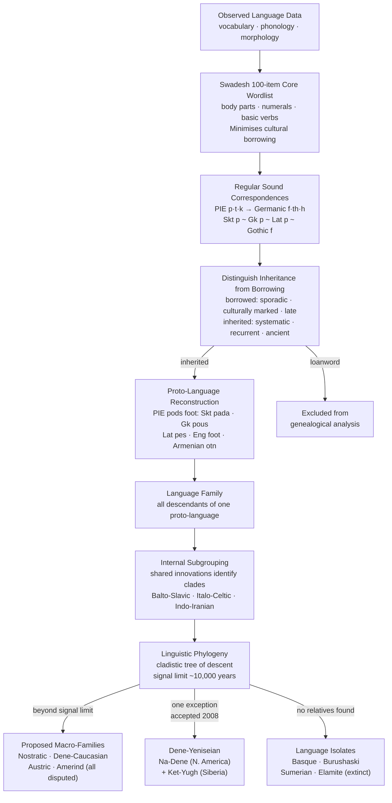

> [!abstract] TL;DR
> Of roughly 7,150 living languages, about 90% have been grouped into approximately 90 genealogically distinct families by tracing systematic sound correspondences back to reconstructed proto-languages; the isolates left over — from Basque to Burushaski — are windows into linguistic worlds obliterated by historical expansions, and the geographic distribution of families maps prehistory's great migrations as precisely as any genetic marker.

---

## Intuition

**Analogy:** Imagine trying to reconstruct a family tree using only photographs — without names, dates, or documents. Two people might share a nose shape because they are cousins (inherited from a common grandparent) or because nose shapes happen to converge independently. The diagnostic test is not any single resemblance but the *systematic co-occurrence* of many inherited features: the specific combination of hair colour, eye colour, and jaw shape that recurs across a family line in exactly the proportion expected from a single shared ancestor, not from coincidence.

Historical linguistics works the same way with sounds instead of faces. Any two languages can share a word that looks similar — English *fish* and Malay *ikan* both mean the same thing but are phonologically unrelated. What reveals common ancestry is systematic sound correspondence across a large vocabulary: if the /p/ in Latin consistently matches /f/ in Old English across dozens of unrelated words (*pater/father*, *piscem/fish*, *pedem/foot*), the regularity is too consistent to be chance. It is the signature of a single sound change that occurred once in the ancestral language and was inherited by every descendant. This is the logic of the comparative method — the discipline's most powerful tool.

---

## How It Works



### Core Mechanics

The **comparative method** rests on three premises: (1) language change is regular — when a sound shifts, it shifts in *all* words in the same phonological environment (*Neogrammarian hypothesis*); (2) words shared through common descent (*cognates*) will show regular cross-language correspondences; (3) loanwords and chance resemblances will be sporadic, not systematic.

The method proceeds in stages:
1. **Collect core vocabulary** using a Swadesh wordlist. Body-part terms, numerals, and basic verbs are culturally universal and rarely borrowed, giving the cleanest inheritance signal.
2. **Identify regular sound correspondences** across candidate languages. Latin *p* → Old English *f* across dozens of words is Grimm's Law, not coincidence.
3. **Reconstruct proto-forms** (marked with asterisk \*) that account for all attested reflexes.
4. **Establish internal subgrouping** using *shared innovations* — changes that occurred after the proto-language broke up and were shared by some daughter languages but not others, revealing tree topology.
5. **Classify isolates** — languages whose correspondences with all others are too sporadic to imply descent.

---

## Key Concepts

### Secondary Level

**The global inventory**

Counting the world's languages is methodologically and politically fraught. Ethnologue's 27th edition (2024) lists approximately 7,168 living languages; Glottolog 4.8 (2023) catalogues 8,324 languoids (including sign languages and well-attested historical languages). The discrepancy reflects different decisions about what constitutes a distinct language versus a dialect — the Weinreich problem revisited (see [[Language_Variation_and_Dialects]]). Most estimates converge on 6,500–7,500 for unambiguously distinct spoken languages.

Of these, roughly 90 genealogically distinct families have broad scholarly acceptance. The geographic distribution is deeply unequal: approximately 40% of all languages — around 3,000 — are spoken in New Guinea and the Pacific, an area containing less than 1% of the world's population. The New Guinea highlands, whose deep valleys functioned as community isolators for 40,000+ years after initial settlement, are the single most linguistically diverse area on Earth. Sub-Saharan Africa and the Americas also show vastly higher per-capita linguistic diversity than Eurasia, a direct consequence of longer in-situ population history and more effective geographic isolation.

The speaker distribution is equally skewed. Twenty languages are spoken by more than 50 million people each; these 20 account for roughly half of all speakers. At the other extreme, approximately 40% of the world's languages have fewer than 1,000 speakers, and UNESCO estimates that roughly half of all living languages will fall silent by 2100 if current trends continue.

**What makes a language family**

A **language family** is a set of languages sharing a common ancestor — a **proto-language** — partially recoverable through reconstruction. Membership is about common descent, not typological similarity. English and Bengali look nothing alike (different scripts, very different phonologies, no obvious shared vocabulary) but are demonstrably Indo-European. Conversely, Japanese and Korean share thousands of borrowed words, similar agglutinative morphology, and identical SOV word order but are *not* demonstrably related — decades of systematic work have found no regular sound correspondences indicative of common descent. Similarity from contact (areal diffusion) must be distinguished from similarity from inheritance.

**Major families at a glance**

| Family | Approximate speakers | Number of languages | Notable members |
|--------|---------------------|---------------------|-----------------|
| Indo-European | ~3.2 billion | ~445 | English, Spanish, Hindi, Russian, Bengali, Persian |
| Sino-Tibetan | ~1.4 billion | ~405 | Mandarin, Cantonese, Tibetan, Burmese |
| Niger-Congo | ~700 million | ~1,540 | Swahili, Yoruba, Igbo, Zulu, Wolof |
| Afroasiatic | ~500 million | ~400 | Arabic, Hebrew, Amharic, Hausa, Somali |
| Austronesian | ~400 million | ~1,300 | Malay/Indonesian, Tagalog, Hawaiian, Malagasy |
| Dravidian | ~250 million | ~80 | Tamil, Telugu, Kannada, Malayalam |
| Turkic | ~200 million | ~35 | Turkish, Uzbek, Kazakh, Uyghur, Azeri |
| Japonic | ~125 million | ~12 | Japanese, Ryukyuan languages |
| Austroasiatic | ~120 million | ~170 | Khmer, Vietnamese, Munda languages |
| Tai-Kadai | ~95 million | ~95 | Thai, Lao, Zhuang |
| Koreanic | ~80 million | ~2 | Korean, Jeju |
| Nilo-Saharan | ~50 million | ~200 | Kanuri, Dinka, Nuer, Luo |

**Language isolates**

A **language isolate** is a language with no demonstrated genealogical relationship to any other — a family of one. The most discussed:

- **Basque** (*Euskara*): spoken by ~750,000 people in the Pyrenean borderlands of Spain and France. No systematic correspondences with any Indo-European, Afroasiatic, or other family have been established. Most scholars regard it as a descendant of a pre-IE language spoken across Western Europe before the Bronze Age expansion — a relic of an earlier linguistic landscape now almost entirely replaced. The Basques' partially distinctive genetic profile (elevated haplogroup R1b in mtDNA and Y-chromosome lineages) supports partial biological continuity with pre-IE populations, though this correlation is imperfect.
- **Burushaski**: spoken by ~130,000 people in the Hunza and Yasin valleys of northern Pakistan. Proposed connections to Indo-European, Caucasian, and Yeniseian have been advanced but not accepted. Its complex case system and ergative morphology are typologically unusual but not diagnostic of any relationship.
- **Sumerian** (extinct): the language of the world's first writing system (~3200 BCE, proto-cuneiform from Uruk). Thousands of cuneiform tablets attest its grammar in detail. It shows no systematic relationship to Semitic (Akkadian was the neighbouring language), nor to any other attested family. Elamite (southwest Iran, also extinct) is another ancient well-attested isolate.

---

### Undergraduate Level

**The Neogrammarians and the exceptionlessness of sound change**

The decisive intellectual event in historical linguistics was the 1878 manifesto of the **Neogrammarians** (*Junggrammatiker*) — Leipzig scholars including Karl Brugmann and Berthold Delbrück — who proposed that **sound laws operate without exception**. Before this, correspondences were treated as rough tendencies. The Neogrammarian hypothesis reframed every exception as a problem requiring solution: it must be either (a) the result of a *different* regular law applying in a different phonological environment, or (b) a loanword, or (c) analogical reformation.

**Grimm's Law** (Jacob Grimm 1822, refined by Karl Verner 1875) is the paradigm case — a systematic consonant shift affecting all Germanic languages as they diverged from their Indo-European congeners:

| PIE consonant | Germanic reflex | Latin example | Germanic example |
|---|---|---|---|
| \*p | f | *pater* (father) | *fæder* (OE) |
| \*t | th | *tres* (three) | *thrī* (OE) |
| \*k | h | *centum* (hundred) | *hund* (OE) |
| \*d | t | *duo* (two) | *twā* (OE) |
| \*g | k | *genus* (kin) | *cynn* (OE) |

Grimm's Law has exceptions — some Latin *p* words correspond to Gothic *p* rather than *f*. Verner (1875) showed these derived from PIE words whose accent fell on the syllable *after* the consonant. **Verner's Law** was a triumph of the Neogrammarian programme: an exception had been reduced to a second, independently motivated regular law.

**Proto-Indo-European reconstruction**

PIE is the proto-language reconstructed as the ancestor of the Indo-European family. A sample of reconstructions illustrating the method:

| PIE form | Gloss | Sanskrit | Greek | Latin | English |
|---|---|---|---|---|---|
| \*pṓds | foot | *pāda-* | *poús* | *pēs* | *foot* |
| \*wódr̥ | water | *udán-* | *húdōr* | — | *water* |
| \*ǵénus | knee | *jā́nu* | *gónu* | *genū* | *knee* |
| \*mātér | mother | *mātár-* | *mḗtēr* | *māter* | *mother* |

The proto-forms are hypothesised, not observed; the asterisk convention marks reconstructed status. Every daughter language has undergone its own subsequent sound changes, which is why the correspondences are systematic but not identical.

**The signal horizon and glottochronology**

Regular sound correspondences become undetectable beyond approximately 10,000 years because cascading sound changes eliminate all systematic patterns. This is the *signal horizon* of the comparative method — empirical, not theoretical.

**Glottochronology** (Swadesh 1952) attempts to date divergence statistically: approximately 80–86% of a 100-item core wordlist is retained per 1,000 years. Two languages sharing 52% cognates are therefore separated by roughly $t = \log(0.52)/(2 \times \log(0.81)) \approx 3{,}300$ years. The method has been widely criticised because the replacement rate varies with contact, ecological disruption, and social upheaval. Modern **Bayesian phylogenetic approaches** (Gray & Atkinson 2003; Bouckaert et al. 2012) apply character-state models from evolutionary biology to binary cognate matrices, producing dated trees with credible intervals — a substantial improvement, though these results remain contested for PIE specifically.

**Greenberg's mass comparison and the Americas controversy**

Joseph Greenberg proposed **mass comparison** as a shortcut: compare overall wordlist similarity across many languages simultaneously rather than establishing regular correspondences pairwise. He applied this to African languages (1963) — a classification now largely accepted — then to the Americas (1987), proposing that all Native American languages except Na-Dené and Aleut-Eskimo form a single macro-family, **Amerind**.

Historical linguists rejected Amerind almost unanimously. The specific objections:
1. Mass comparison conflates chance resemblances with cognates. In a vocabulary of 100 items with a typical phoneme inventory, statistically expected chance resemblances between completely unrelated languages already produce Greenberg-scale similarity scores.
2. Greenberg never demonstrated regular sound correspondences for any Amerind branch pair — the sine qua non of the comparative method.
3. The Americas demonstrably contain ~60+ independent families (Mayan, Quechuan, Tupian, Chibchan, Algic, etc.) each classifiable by the comparative method, with no systematic correspondences linking them.
4. The vast time depth (~20,000 years since initial peopling) places most American language relationships beyond the signal horizon even if historical connections existed.

**Dené-Yeniseian: the one accepted macro-family**

The single broadly accepted trans-continental family connection is **Dené-Yeniseian**, established by Edward Vajda in 2008. Vajda demonstrated systematic cognates and morphological parallels between:
- **Na-Dené** (North America): Navajo, Apache, Tlingit, Dene languages
- **Yeniseian** (Siberia): Ket, Yugh (extinct), and several other extinct members

The connection was accepted because Vajda produced: (1) regular, systematic sound correspondences — not list resemblances; (2) shared complex morphological patterns in the verb template, specifically prefixal position classes with no parallel in any neighbouring family; (3) a plausible migration scenario placing Na-Dené ancestors in a Siberia-to-North-America crossing well after the initial peopling, probably 12,000–15,000 ya. This remains the only macro-family connection that has satisfied comparative-method evidentiary standards. It is instructive precisely because of what it required: not statistical similarity but detailed structural correspondence.

**The Austronesian expansion: a documented linguistic diaspora**

Austronesian is unique in that its geographic spread cross-correlates with multiple independent evidence streams: linguistics, archaeology, and genetics. The family originated in Taiwan ~5,000–6,000 ya and expanded in documented waves:

1. Taiwan → Philippines (~3,500 ya) → Western Indonesia and Malaysia
2. Eastward into Micronesia and Melanesia (~3,000 ya)
3. Further east into Polynesia (~2,500 ya to ~1,000 ya), reaching Hawaii (~800 CE), Easter Island (~400 CE), and New Zealand (~1200–1300 CE)
4. Westward across the Indian Ocean to **Madagascar** (~500–700 CE) — the most striking long-distance dispersal

With ~1,300 languages spread from Madagascar to Easter Island, the largest geographic range of any family, Austronesian demonstrates that linguistic classification can serve as a direct proxy for historical migration routes when the expansion is recent enough for signal to survive.

---

### Graduate Level

**Computational phylogenetics and Bayesian chronology**

The application of Bayesian phylogenetic methods from evolutionary biology to linguistic data (Gray & Atkinson 2003; Bouckaert et al. 2012) transformed the dating and tree-building aspects of historical linguistics. The approach treats cognate presence/absence as binary characters, models their evolution using a continuous-time Markov chain (typically a Stochastic Dollo model — each cognate can be gained once but lost multiple times), calibrates the clock using nodes with historical or archaeological constraints, and produces a posterior distribution over dated trees.

Advantages over glottochronology: principled uncertainty quantification; no constant-rate assumption (rate heterogeneity across lineages is modelled explicitly); tree topology inferred jointly with node ages.

Bouckaert et al. (2012) placed the PIE homeland in Anatolia ~8,000–9,500 ya, supporting Renfrew's farming-spread hypothesis. This result is contested: critics identify at least three methodological biases toward older dates — (a) the Dollo model penalises cognate gain, inflating apparent divergence times; (b) the embedded geographic diffusion model uses present-day geography, misrepresenting Bronze Age population distributions; (c) the cognate coding process introduces systematic errors where borrowing between branches is treated as homoplasy rather than contact. Ancient DNA evidence (Haak et al. 2015 — Yamnaya steppe populations contributing ~50% ancestry to Northern Europeans in the Bronze Age) now strongly supports a steppe origin ~5,000 ya, reconciling with the linguistic evidence if Bouckaert et al.'s dates are systematically overestimated.

The **ASJP** (Automated Similarity Judgement Program, Wichmann et al.) database provides machine-readable Swadesh-40 wordlists for ~7,000 languages in a normalised transcription, enabling global phylogenetic analyses at scales impossible with traditional methods. ASJP-based analyses largely reproduce traditional classifications at the family level while providing quantitative within-family versus between-family diversity comparisons.

**Language families as population history proxies**

Language family membership is one of the best available proxies for prehistoric population movement, but the correlation with genetics is imperfect and historically contingent.

- **Indo-European and the Yamnaya expansion**: Haak et al. (2015) documented that Bronze Age European populations received ~50% of their ancestry from Yamnaya-related steppe populations, correlating with IE language spread. The expansion is uneven: some regions (parts of the Balkans) received steppe genetics without clear IE displacement, and the timing of IE spread into South Asia remains debated.
- **Austronesian and Taiwanese origin**: Linguistic, genetic (Soares et al. 2011), and archaeological (Lapita pottery culture) evidence converge strongly on a Taiwanese origin — making Austronesian the best-documented case of language-as-migration-proxy.
- **Afroasiatic and deep time**: The family's internal diversity and its oldest attested member (Ancient Egyptian, ~3100 BCE; Sumerian borrowings from Semitic suggest Semitic speakers ~5,000 BCE) support an African or Levantine origin ~15,000–20,000 ya, plausibly connected to post-glacial re-peopling of North Africa — though this depth is near or beyond the signal horizon.

**The Bantu expansion: decoupling language and genetics**

The Bantu expansion (~3,000–4,000 ya from West-Central Africa across sub-Saharan Africa) is the textbook case of **language spread without genetic replacement**. Genetic studies (Tishkoff et al. 2009; Breton et al. 2014) show that present-day Bantu-speaking populations across East, Central, and Southern Africa have highly heterogeneous genetic compositions. Parts of southern Africa show predominantly Khoisan-related genetics despite speaking Bantu languages; the Swahili coast carries substantial Arabic and South Asian admixture genetically while remaining firmly Bantu linguistically.

Three mechanisms drive the decoupling:
1. **Elite dominance**: a politically dominant group's language spreads as a prestige variety among a genetically different population without substantial demographic replacement (cf. colonial Spanish in most of Latin America).
2. **Language shift through economic integration**: local populations adopt the majority language over generations without migration.
3. **Founder effects followed by local admixture**: small founding populations seed new communities that then incorporate local genes without abandoning the founding language.

The Bantu case is a standing warning against treating language family membership as a direct genetic ancestry proxy — see [[Human_Variation_and_Population_Genetics]] for the genomic side of this argument.

**Contact languages, creoles, and genealogical classification**

Creole languages challenge genealogical classification. A creole arises when two populations with no common language form a new speech community — typically under conditions of forced labour — and children are raised with a pidgin as their first language, stabilising it into a full grammar. The genealogical status of creoles is debated across three positions:

1. **Monogenetic view**: a creole belongs to the family of its lexifier (the vocabulary-donor language) — Haitian Creole is therefore Romance.
2. **Lefebvre's relexification hypothesis**: Haitian Creole's grammar is primarily Fon (Niger-Congo) relexified with French phonological forms — making it genealogically Niger-Congo.
3. **Bickerton's Language Bioprogram Hypothesis**: creoles are not meaningfully genealogical — they are direct expressions of an innate universal grammar activated when children must build a language from impoverished input; hence creoles across different substrate backgrounds converge on similar structures independent of either lexifier or substrate.

Glottolog 4.8 treats creoles as a non-genealogical "special family" category rather than assigning them to the lexifier's family, reflecting ongoing theoretical uncertainty.

**Glottolog vs. Ethnologue: conservative vs. liberal classification**

The two dominant databases represent different philosophies:
- **Glottolog** (Hammarström et al., MPI Leipzig) is aggressively conservative: only families with *demonstrated* comparative-method evidence are grouped; all unproven groupings remain independent languoids. This produces ~400+ independent families/isolates if all uncertain groupings are retained.
- **Ethnologue** (SIL International, 27th ed.) accepts some provisional groupings and is tied to language identification for Bible translation purposes, creating incentives to recognise dialect variants as separate languages for mission-planning.

Neither is wrong — they answer different questions. Glottolog gives a minimal conservative estimate of *demonstrated* genetic relationships; Ethnologue gives a practical working enumeration of distinct linguistic communities.

---

## Python Demo

```python
import numpy as np
import matplotlib.pyplot as plt
import matplotlib.patches as mpatches

# ── Data: 20 language families ────────────────────────────────────────────────
# Sources: Ethnologue 27th ed. (2024), Glottolog 4.8, Hammarstrom et al. (2023)
# Speakers in millions (L1 + significant L2 where applicable)

fam_names = [
    "Indo-European",  "Sino-Tibetan",  "Niger-Congo",    "Afroasiatic",
    "Austronesian",   "Dravidian",     "Turkic",         "Japonic",
    "Austroasiatic",  "Tai-Kadai",     "Koreanic",       "Nilo-Saharan",
    "Uralic",         "Hmong-Mien",    "Mongolic",       "Trans-New Guinea",
    "Kartvelian",     "Tungusic",      "NW Caucasian",   "Isolates (est.)",
]
fam_speakers = np.array([
    3200, 1400,  700,  500,
     400,  250,  200,  125,
     120,   95,   80,   50,
      25,   10,   10,    4,
       5,   0.1,  0.5,  15,
], dtype=float)
fam_num_langs = np.array([
    445,  405, 1540,  400,
   1300,   80,   35,   12,
    170,   95,    2,  200,
     40,   40,   13,  450,
      5,   12,    3,   80,
], dtype=float)
fam_colors = [
    "#4C72B0", "#DD8452", "#55A868", "#C44E52",
    "#8172B2", "#937860", "#DA8BC3", "#64B5CD",
    "#8C8C8C", "#CCB974", "#4878D0", "#6ACC65",
    "#EE854A", "#DC7EC0", "#8C613C", "#D65F5F",
    "#956CB4", "#797979", "#D5BB67", "#82C6E2",
]

# ── Top 15 languages by total speakers ───────────────────────────────────────
lang_names = [
    "English", "Mandarin Chinese", "Hindi", "Spanish", "Arabic (Std.)",
    "French", "Bengali", "Portuguese", "Russian", "Urdu",
    "Indonesian", "Swahili", "Japanese", "Punjabi", "Marathi",
]
lang_speakers_M = np.array(
    [1450, 1100, 600, 560, 370, 300, 270, 265, 258, 230, 200, 200, 125, 120, 95],
    dtype=float,
)
lang_fam_colors = [
    "#4C72B0", "#DD8452", "#4C72B0", "#4C72B0", "#C44E52",
    "#4C72B0", "#4C72B0", "#4C72B0", "#4C72B0", "#4C72B0",
    "#8172B2", "#55A868", "#64B5CD", "#4C72B0", "#4C72B0",
]

# ── Derived: average speakers per language ───────────────────────────────────
# IE: 3200/445 = ~7.2 M/lang (concentrated)
# Niger-Congo: 700/1540 = ~0.45 M/lang (dispersed)
# Trans-New Guinea: 4/450 = ~0.009 M/lang (extreme dispersal)
spk_per_lang = fam_speakers / fam_num_langs

# Bubble area: sqrt-scaled so Koreanic (40 M/lang) does not overwhelm all others
max_spl = spk_per_lang.max()  # Koreanic: 80/2 = 40
bubble_area = 30 + (np.sqrt(spk_per_lang / max_spl)) * 2970

# ── Figure ────────────────────────────────────────────────────────────────────
fig, (ax1, ax2) = plt.subplots(1, 2, figsize=(18, 8))

# ──── Subplot 1: Bubble chart — linguistic diversity vs. speaker count ────────
ax1.scatter(
    fam_num_langs, fam_speakers,
    s=bubble_area, c=fam_colors,
    alpha=0.80, edgecolors="k", linewidths=0.5, zorder=3,
)
ax1.set_xscale("log")
ax1.set_yscale("log")
ax1.set_xlabel("Number of Languages in Family (log scale)", fontsize=11)
ax1.set_ylabel("Total Speakers, millions (log scale)", fontsize=11)
ax1.set_title(
    "Language Families: Speakers vs. Linguistic Diversity\n"
    "Bubble area proportional to average speakers per language\n"
    "(large bubble = concentrated  |  small bubble = dispersed)",
    fontsize=10, fontweight="bold",
)
ax1.grid(True, which="both", alpha=0.2, linestyle="--")

# Reference diagonal: 1 million speakers per language
x_ref = np.logspace(-0.5, 3.5, 300)
ax1.plot(x_ref, x_ref, "k--", lw=1.2, alpha=0.40,
         label="1 M speakers / language")
ax1.legend(fontsize=8, loc="upper left")

# Annotate key families
label_set = {
    "Indo-European", "Sino-Tibetan", "Niger-Congo", "Afroasiatic",
    "Austronesian", "Trans-New Guinea", "Koreanic", "Dravidian",
}
for i, name in enumerate(fam_names):
    if name in label_set:
        ax1.annotate(
            name,
            (fam_num_langs[i], fam_speakers[i]),
            xytext=(4, 6), textcoords="offset points",
            fontsize=7.5,
        )

# ──── Subplot 2: Top 15 languages, horizontal bars coloured by family ─────────
n_langs = len(lang_names)
y_pos = np.arange(n_langs)

# Reverse so English (largest) appears at the top of the chart
ax2.barh(
    y_pos,
    lang_speakers_M[::-1],
    color=lang_fam_colors[::-1],
    height=0.72, edgecolor="white", linewidth=0.5,
)
ax2.set_yticks(y_pos)
ax2.set_yticklabels(lang_names[::-1], fontsize=10)
ax2.set_xlabel("Total Speakers (millions, L1 + L2 estimate)", fontsize=11)
ax2.set_title(
    "Top 15 Languages by Total Speaker Count\nColoured by language family",
    fontsize=10, fontweight="bold",
)
ax2.set_xlim(0, 1800)
ax2.grid(True, axis="x", alpha=0.3, linestyle="--")

for i, v in enumerate(lang_speakers_M[::-1]):
    ax2.text(v + 20, i, f"{int(v):,}M", va="center", fontsize=8.5)

family_legend_items = {
    "Indo-European": "#4C72B0",
    "Sino-Tibetan":  "#DD8452",
    "Afroasiatic":   "#C44E52",
    "Austronesian":  "#8172B2",
    "Niger-Congo":   "#55A868",
    "Japonic":       "#64B5CD",
}
patches = [
    mpatches.Patch(facecolor=c, label=fam)
    for fam, c in family_legend_items.items()
]
ax2.legend(handles=patches, fontsize=8.5, loc="lower right")

fig.suptitle(
    "Global Language Diversity: Family Distribution and Speaker Counts\n"
    "Sources: Ethnologue 27th ed. (2024)  |  Glottolog 4.8  |  Hammarstrom et al. (2023)",
    fontsize=12, fontweight="bold",
)
plt.tight_layout()
plt.savefig("language_families_diversity.png", dpi=150, bbox_inches="tight")
plt.show()
```

**Reading the output.** *Bubble chart (left):* The dashed diagonal marks "1 million speakers per language." Families above it (Indo-European, Sino-Tibetan, Koreanic) are speaker-concentrated — few languages, many speakers each. Families below it (Niger-Congo, Austronesian, Trans-New Guinea) are linguistically dispersed — many languages sharing relatively few speakers. Bubble area encodes this directly: Koreanic's enormous bubble (80M speakers / 2 languages = 40M/lang) versus Trans-New Guinea's tiny bubble (4M speakers / 450 languages = ~9,000 speakers/language). *Bar chart (right):* 11 of the top 15 languages by speaker count belong to a single family — Indo-European (blue). The non-IE outliers (Mandarin, Arabic, Indonesian, Swahili, Japanese) visually punctuate an otherwise monochromatic chart, illustrating why an English-Hindi-Spanish speaker's experience gives a deeply distorted sample of the world's actual linguistic diversity.

---

## Real-World Applications

**Historical linguistics and the Indo-European problem**

The reconstruction of PIE and the identification of its homeland is simultaneously the oldest and most intensively debated problem in historical linguistics. The steppe hypothesis — now supported by ancient DNA from the Yamnaya horizon (Haak et al. 2015, ~5,000–4,500 ya) — places the original IE homeland on the Pontic-Caspian steppe north of the Black and Caspian seas. The spread of IE languages into Europe, South Asia, and Central Asia correlates with a massive demographic expansion documented in Bronze Age skeletal remains: steppe-related ancestry rises from ~0% to ~50% in Northern European populations across a few centuries, a signal far too large and rapid to be explained by anything other than major migration. The Anatolian hypothesis (Renfrew, supported by some Bayesian phylogenetic analyses) places the origin ~9,000 ya with the Neolithic farming spread from Anatolia but struggles to explain the homogeneity and timing of the steppe ancestry signal.

**Endangered language documentation**

Of the world's ~7,150 languages, approximately 40% are endangered, with fewer than 1,000 speakers. Approximately 46 had only one speaker as of 2021 (Ethnologue). The documentation movement uses comparative linguistics to produce grammars, text corpora, and lexicons before languages disappear. Each extinct language is an irretrievable data point for typological and historical linguistics — and frequently represents the sole source of information about a prehistoric population's history, beliefs, and environment. Projects including ELDP (Endangered Languages Documentation Programme), ELAR (Endangered Languages Archive), and Kaipuleohone (University of Hawaii) archive this material.

**Language and indigenous rights law**

In indigenous rights cases before national and international courts, linguistic classification is sometimes used as evidence. The Dené-Yeniseian link has been invoked in discussions of Na-Dené peoples' ancient connections to the land. The classification of Māori within Austronesian — specifically as a sister to other Eastern Polynesian languages — has supported Māori claims to a distinct cultural heritage predating European contact. Conversely, the incorrect claim that two groups "speak the same language" has been used to deny the distinctiveness of indigenous communities' linguistic identities, making accurate genealogical classification a matter of political consequence.

**Cross-lingual NLP and transfer learning**

Computational NLP systems use language family membership as a genealogical prior in cross-lingual transfer learning. A model trained on Spanish transfers better to Portuguese (same Ibero-Romance clade, nearly identical morphosyntax) than to Hindi (Indo-European but different clade and morphological type). The Glottolog tree structure is used directly in multilingual NLP architectures (mBERT, XLM-R) to guide transfer between linguistically related languages — family-aware transfer learning consistently outperforms language-agnostic transfer, particularly for low-resource languages.

---

## Common Pitfalls

- **Confusing typological similarity with genetic relatedness** — Japanese and Korean are morphologically similar (SOV order, agglutinative verbs, honorific systems) and share thousands of loanwords, but no regular sound correspondences indicating common descent have been found after decades of systematic search. Similarity from areal diffusion and contact must always be distinguished from similarity from inheritance.

- **Treating Amerind as established** — Greenberg's three-family Americas classification still appears in some textbooks as accepted. It is not. Historical linguists working on American languages have found approximately 60+ independent families. The Amerind hypothesis failed because it never produced regular sound correspondences; mass comparison cannot substitute for the comparative method.

- **Ignoring the signal-horizon problem** — Claims linking families separated by 15,000+ years (Nostratic: IE + Uralic + Altaic + Afroasiatic + Dravidian) cannot be confirmed or falsified using the comparative method because the signal is obliterated by time. This does not mean the connections do not exist — they may — but mass comparison cannot meet the evidentiary standard required to establish them. Deep-time proposals should be labelled as working hypotheses, not established families.

- **Equating language family with ethnic or genetic identity** — Language and genetics correlate imperfectly. Hungarian speakers (Uralic family) are genetically nearly identical to their Slavic-speaking neighbours; English is spoken by populations of every genetic background; Bantu-speaking communities across Africa have highly variable genetic ancestries. Language shift is historically ubiquitous and breaks the language-ancestry correspondence.

- **Using Ethnologue speaker counts without qualification** — Ethnologue's counts mix L1 and L2 figures inconsistently, rely heavily on SIL fieldwork reports of variable vintage, and reflect political decisions about language vs. dialect status that diverge from linguistic criteria. Speaker counts for the same language can differ by a factor of two or more between databases.

- **Assuming all families are equally well-documented** — PIE morphology has been worked for 200 years and is reconstructed at the detail of individual suffixes. Families like Nilo-Saharan or the languages of New Guinea are comparatively understudied: apparent isolates or small families in those regions may simply reflect inadequate documentation rather than genuine genealogical isolation. The "unknown" category in global counts is not small.

---

## Related Concepts

- [[Language_and_Linguistics_Overview]] — the foundational survey of the discipline; establishes the terminological and methodological context within which family classification operates
- [[Phonological_Typology_and_Universals]] — typological universals (WALS) must be distinguished from genealogical universals; Greenberg's typological implicational universals hold cross-family and are independent of genealogical membership
- [[Morphology_and_Word_Formation]] — comparative morphology, especially inflectional paradigms, is often more diagnostic of genetic relationship than phonology alone; the Dené-Yeniseian link was clinched largely by shared verb morphology
- [[Language_Variation_and_Dialects]] — the language/dialect boundary is intrinsically political; the same Weinreich problem affects family classification, since every decision about what counts as a distinct language changes the count of family members
- [[Human_Variation_and_Population_Genetics]] — the correlation between language family membership and genomic ancestry is real but imperfect; the Bantu expansion and colonial language shifts are the canonical cases of decoupling
- [[Human_Evolution_and_Paleoanthropology]] — the timing of human dispersals (Out-of-Africa ~60–70 kya; Americas ~20 kya) sets the outer bounds for all family-level diversification; no living language family can be older than its speakers' attested presence in the region
- [[Neolithic_Revolution_and_Agriculture]] — the spread of farming from the Fertile Crescent and from China is associated with the expansion of Afroasiatic, Indo-European (Anatolian hypothesis), Sino-Tibetan, and Austronesian; language families serve as proxies for archaeologically documented demographic expansions of food-producing populations
- [[Molecular_Evolution_and_Phylogenetics]] — Bayesian phylogenetic methods (BEAST, MrBayes) originally developed for biological sequences have been directly applied to linguistic cognate data; lexical borrowing in linguistics is the analogue of horizontal gene transfer in biology, and both complicate tree-based inference
- [[Four_Fields_of_Anthropology]] — linguistic anthropology is one of the four fields; the ethnological and archaeological context for understanding language spread requires the full four-field synthesis that Boas initiated

---

## Review Questions

### Secondary

1. English and Bengali look nothing alike — different scripts, different sound systems, almost no shared everyday vocabulary. Yet linguists classify them in the same language family. What kind of evidence would a historical linguist point to, and why does surface similarity not determine family membership?
2. Basque is spoken by several hundred thousand people in the Pyrenees but belongs to no known language family. What does it mean for a language to be an "isolate," and what can Basque's existence tell us about the linguistic history of Europe before the Bronze Age?
3. New Guinea has roughly 800 languages spoken by fewer than 8 million people, while English is spoken by over a billion. What geographic and historical factors explain this difference in linguistic density, and what would be irretrievably lost if the smaller New Guinean languages disappeared?

### Undergraduate

1. Greenberg's *Amerind* hypothesis classified most Native American languages into a single macro-family using mass comparison. Historical linguists rejected it. Explain (a) exactly what Greenberg's method involved, (b) the specific methodological objection historical linguists raised against it, and (c) the evidentiary standard required to establish such a macro-family by the comparative method.
2. The Austronesian expansion is described as "the best-documented linguistic diaspora in history." Explain what three independent lines of evidence converge on the Austronesian spread, how far the family extends geographically, and why this case is exceptional among language families when used as a population history proxy.
3. Glottochronology attempts to date language divergence using lexical replacement rates on Swadesh wordlists. Explain the key assumption underlying the method, the main empirical challenge to that assumption, and how Bayesian phylogenetic approaches (Gray & Atkinson 2003) improved on it — and what their results for PIE dating found.

### Graduate

1. The Yamnaya ancient DNA evidence (Haak et al. 2015) strongly supports a steppe homeland for PIE ~5,000 ya, yet Bouckaert et al. (2012) used Bayesian phylogenetic methods on linguistic data to date PIE to ~8,000–9,500 ya with an Anatolian homeland. Identify at least three methodological choices in Bouckaert et al.'s analysis that could produce a systematically older date or geographic bias toward Anatolia, and describe how the ancient DNA and linguistic evidence might be reconciled.
2. The Bantu expansion demonstrates that language can spread across populations without genetic replacement. Design a study using both genomic data and linguistic data to estimate the proportion of Bantu language spread due to demographic expansion versus elite dominance and language shift in East Africa. Specify the data sources, statistical methods, and what observable signatures would distinguish the two mechanisms.
3. Glottolog treats creole languages as a "special family" category rather than assigning them to the genealogy of their lexifier. Evaluate this decision from the perspective of (a) the comparative method's evidentiary requirements, (b) Bickerton's Language Bioprogram Hypothesis, and (c) Lefebvre's relexification hypothesis. Which position is most consistent with the available evidence, and what empirical test would most decisively adjudicate between them?

---

## Sources

- [Hammarström, H., Forkel, R., Haspelmath, M. & Bank, S. (2023). *Glottolog 4.8*. Leipzig: MPI for Evolutionary Anthropology.](https://glottolog.org)
- [Simons, G.F. & Fennig, C.D. (eds.) (2024). *Ethnologue: Languages of the World* (27th ed.). Dallas: SIL International.](https://www.ethnologue.com)
- [Vajda, E.J. (2010). A Siberian link with Na-Dene languages. *The Dené-Yeniseian Connection*, Anthropological Papers of the University of Alaska (new series) 5, 33–99.](https://www.uaf.edu/anlc/dy/)
- [Gray, R.D. & Atkinson, Q.D. (2003). Language-tree divergence times support the Anatolian theory of Indo-European origin. *Nature*, 426, 435–439.](https://doi.org/10.1038/nature02029)
- [Bouckaert, R. et al. (2012). Mapping the origins and expansion of the Indo-European language family. *Science*, 337(6097), 957–960.](https://doi.org/10.1126/science.1219669)
- [Haak, W. et al. (2015). Massive migration from the steppe was a source for Indo-European languages in Europe. *Nature*, 522, 207–211.](https://doi.org/10.1038/nature14317)
- [Campbell, L. (2004). *Historical Linguistics: An Introduction* (2nd ed.). Cambridge, MA: MIT Press.](https://mitpress.mit.edu/9780262532679/)
- [Greenberg, J.H. (1987). *Language in the Americas*. Stanford: Stanford University Press.](https://www.sup.org/books/title/?id=1892)
- [Bellwood, P. (2005). *First Farmers: The Origins of Agricultural Societies*. Oxford: Blackwell.](https://www.wiley.com/en-us/First+Farmers%3A+The+Origins+of+Agricultural+Societies-p-9780631205661)
- [Wichmann, S. et al. (2022). *The ASJP Database* (version 20). (online resource).](https://asjp.clld.org)
- [Tishkoff, S.A. et al. (2009). The genetic structure and history of Africans and African Americans. *Science*, 324(5930), 1035–1044.](https://doi.org/10.1126/science.1172257)

---

#Linguistics #HistoricalLinguistics #LanguageFamilies
