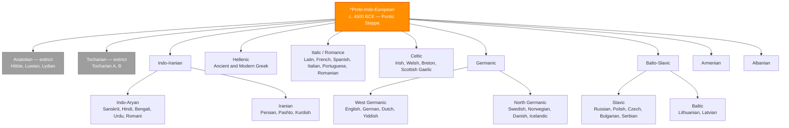

# Proto-Indo-European and Language Reconstruction

> [!abstract] TL;DR
> Proto-Indo-European (PIE) is the reconstructed ancestor of roughly 450 languages — from English to Hindi to Russian to Greek — spoken today by about 3 billion people. Linguists cannot observe it directly: it died unwritten around 4500 BCE. What survives is a forensic portrait assembled from systematic sound correspondences across its descendants using the comparative method; and since 2015, ancient DNA has confirmed that a massive migration of Yamnaya steppe pastoralists beginning around 3000 BCE likely carried most IE branches across Eurasia.

---

## Intuition

**Analogy:** Imagine a manuscript copied in a monastery, then copied again in ten separate scriptoria across Europe, each making the same kinds of mechanical errors specific to their local scribal tradition. None of the ten copies survives intact, and the original is lost. But because the errors are *systematic* — every Parisian copy consistently misreads one particular ligature; every Roman copy drops a particular abbreviation — a scholar who compares all ten copies can reconstruct the original wording with high confidence, even in passages none of the ten preserves correctly. The shared errors are evidence of common descent; the systematic differences reveal the copying rules of each scriptorium.

Daughter languages are those copies. The "mechanical errors" are sound changes — regular, unconscious, community-wide shifts in phonology. English *father*, Latin *pater*, Greek *patḗr*, Sanskrit *pitár*, Armenian *hayr*, and Persian *pedar* are ten scriptoria's versions of the same word. No single form is the original. But because the differences are *lawful* — Grimm's Law converts PIE *p* to Germanic *f* in every word without exception — the comparative linguist can reverse the changes and write the original: **\*ph₂tḗr**.

---

## How It Works



### Core Mechanics

The **comparative method** is the foundational engine of historical linguistics. It converts systematic differences among related languages into evidence about their common ancestor. It proceeds in five steps:

1. **Identify candidate cognates** — words in different languages that share form and meaning and whose differences are plausibly due to sound change, not borrowing. The key criterion is *regular* correspondence, not surface similarity. English *heart* / Latin *cor* (gen. *cordis*) / Greek *kardíā* / Sanskrit *hṛd* look very different but are cognates because each difference follows a predictable rule. English *candle* / Latin *candela* look more similar but *candle* is a loan, not a cognate, because the similarity is too exact — sound change would have altered it.

2. **Establish sound correspondence sets** — the systematic mapping of phonemes across branches. PIE *p* corresponds to: Latin *p*, Greek *p*, Sanskrit *p*, but Germanic *f* (Grimm's Law). PIE *k* corresponds to: Latin *c* [k], Greek *k*, but Sanskrit *ś* (satem shift), but Germanic *h*. These correspondences are not arbitrary; they are each explained by a specific documented sound change.

3. **Reconstruct the proto-form** — project backward through each correspondence set to the most parsimonious common source. The asterisk notation (*\*form*) marks a reconstructed form not directly attested in any text. The reconstruction is constrained by the phonological typology: proposed proto-phonemes must be typologically plausible.

4. **Apply the regularity test** — following the Neogrammarian principle (Karl Brugmann, 1878): sound laws operate mechanically without exceptions. Any apparent exception must be explained by analogy, borrowing, or the discovery of a more specific conditioning environment for a separate rule. This makes reconstruction *falsifiable*: a reconstruction that leaves genuine unexplained exceptions is wrong.

5. **Triangulate with morphology and syntax** — PIE grammar can be reconstructed independently of the lexicon. Case endings, verb stems, and derivational morphology provide a second, independent channel of evidence. When the lexical reconstruction and the morphological reconstruction converge, confidence in the result increases.

---

## Key Concepts

### Secondary Level

**What is PIE?**

PIE is the label for the language spoken, probably on the Pontic-Caspian steppe in what is now Ukraine and Russia, approximately 6,000 years ago. It was never written down — writing was invented later and independently, primarily in Sumer and Egypt. Everything we know about it was inferred by comparing its attested descendants. The word "reconstructed" means: derived by systematic logical inference from evidence, not discovered in a text. Reconstructed forms are written with an asterisk: \*pṓds ("foot"), \*dyḗws ("sky/god"), \*h₂ébōl ("apple").

The IE family includes roughly 450 living languages and dozens of extinct ones. About 3 billion people — nearly 40% of humanity — speak an IE language as their first language. The family ranges from Iceland in the northwest (Icelandic) to Bangladesh in the east (Bengali) and Sri Lanka (Sinhalese), from Scandinavia to Iran, from Ireland to northern India.

**The cognate as evidence**

The classic cognate set for the word "father" illustrates the method's power:

| Language | Form | Branch |
|---|---|---|
| English | *father* | Germanic |
| German | *Vater* | Germanic |
| Latin | *pater* | Italic |
| Greek | *patḗr* | Hellenic |
| Sanskrit | *pitár* | Indo-Aryan |
| Persian | *pedar* | Iranian |
| Armenian | *hayr* | Armenian |
| Old Irish | *athir* | Celtic |

**Reconstructed:** \*ph₂tḗr

The Germanic forms show Grimm's Law (*p → f*). The Armenian shows *p → h* (a separate Armenian sound shift). The Celtic shows *p-* lost entirely (Celtic underwent a complete loss of PIE *p* in all positions — one of the most dramatic sound changes documented in any branch). Each difference is systematic and affects every PIE *p* in that branch's vocabulary.

**PIE vocabulary as a window into Bronze Age life**

Words that can be reconstructed with high confidence across multiple branches reveal what PIE speakers knew and valued. The culture implied by the reconstructed vocabulary includes:

- *Wheel:* \*kʷékʷlos (Greek *kýklos*, Sanskrit *cakrá*, English *wheel*, Old High German *hweol*). Wheels were invented on the steppe around 3500 BCE. The shared word is independent archaeological confirmation of the date range.
- *Yoke, axle, wagon:* All reconstructible — PIE speakers had wheeled vehicles drawn by draft animals.
- *Mead:* \*médʰu (Greek *méthu*, Sanskrit *mádhu*, English *mead*, Welsh *medd*) — the PIE speakers brewed a honey-based fermented drink.
- *King/chieftain:* \*h₃rḗǵs (Latin *rēx*, Sanskrit *rāj*, Irish *rí*) — a PIE social role distinguishable from the ordinary (*\*wiHrós*, "man").
- *Cattle, sheep, pig, dog, horse:* All reconstructible — PIE speakers were pastoralists.
- *Snow, winter, cold:* Reconstructible — they lived in a continental climate.
- Notably: *sea* and *ocean* are not securely reconstructible — the PIE speakers were probably not coastal.

---

### Undergraduate Level

**The laryngeal theory: reconstructing the invisible**

The most impressive achievement of PIE reconstruction is the laryngeal theory. By the 1870s, Ferdinand de Saussure noticed a systematic anomaly: certain vowels in daughter languages were *longer* than expected, and certain consonant clusters behaved as if something had been deleted between them. He postulated the existence of "sonantic coefficients" — abstract phonological elements that were present in PIE but had been lost in all attested branches *except* Anatolian.

In 1927, the Polish linguist Jerzy Kuryłowicz showed that the newly deciphered Hittite texts (Anatolian) contained a consonant — written *ḫ* — exactly where Saussure's coefficients had been predicted. The coefficients were real phonemes; they just happened to survive only in the earliest-branching branch of the family.

Three laryngeals are reconstructed: **H₁, H₂, H₃**. They are distinguished by their *coloring effect* on adjacent vowels and by the length they leave when lost:

| Laryngeal | Vowel coloring | Reflex in Greek | Reflex in Indo-Iranian | Hittite |
|---|---|---|---|---|
| H₁ | none (*e*-coloring) | *e* lengthened | *i* | ḫ |
| H₂ | *a*-coloring | *a* lengthened | *a* | ḫ |
| H₃ | *o*-coloring | *o* lengthened | *a* | ḫ |

The name "father" contains H₂: \*ph₂tḗr. The H₂ colors the vowel to *a* in Sanskrit (*pitár*) and creates the long *ā* in Latin (*pāter*, acc. *patrem*). Without the laryngeal hypothesis, these vowel correspondences are inexplicable; with it, they fall into exact place.

The laryngeal theory is remarkable because it demonstrates that the comparative method can reconstruct phonemes that left *no direct trace* in any living language — only their residual effects (vowel length, vowel quality, syllabification patterns). It is one of the most impressive examples of empirical inference in any human science.

**Ablaut: the PIE vowel alternation system**

PIE morphology used a systematic vowel alternation called **ablaut** (from German) or **apophony** to signal grammatical distinctions. The three principal grades are:

| Grade | Vowel | Example (root \*bʰer-, "carry") | Grammatical role |
|---|---|---|---|
| **e-grade** (full) | *e* | \*bʰér-e-ti ("he carries") | Present active, root noun |
| **o-grade** | *o* | \*bʰór-os ("a carrying, burden") | Verbal noun, agent noun |
| **zero grade** (reduced) | Ø (no vowel) | \*bʰr-tós ("carried") | Perfect, passive participle |

These grades survive in English as inherited alternations from Germanic (which inherited them from PIE):
- *sing / sang / sung* — e-grade (i < e) / o-grade (a < o) / zero-grade (u < syllabic *n*)
- *drive / drove / driven* — similar ablaut pattern
- *foot* vs. *feet* — vowel alternation preserving PIE o-grade (*pṓd-*) vs. e-grade (*péd-*)

Ablaut is not random vowel variation. Every PIE root had a fixed consonantal shape (C-V-C) and the *vowel slot* was filled by the appropriate ablaut grade depending on the grammatical function. Understanding ablaut is essential for reconstructing PIE verb morphology, which was inflectionally far richer than any modern IE language.

**PIE grammar: the case and verb systems**

PIE had a **heavily inflected** grammar, more like Sanskrit or Lithuanian than like English. The reconstructed nominal system includes:

- **8 cases:** nominative (subject), accusative (object), genitive (possession), dative (indirect object), ablative (source/separation), instrumental (means), locative (place), vocative (address). Modern German retains 4; Sanskrit retains all 8; English has lost most case morphology but retains traces in pronouns (*he/him/his*).
- **3 genders:** masculine, feminine, neuter — grammatical categories that frequently do not correspond to biological sex.
- **3 numbers:** singular, dual, plural. Dual survives in Lithuanian, Sanskrit, and in English fossils (*both*, *either*, *neither*).

The **verb system** was organized around:
- **Aspect** (ongoing action vs. completed action) was primary; tense (absolute time reference) was secondary — a feature preserved in Slavic languages and partially in Greek.
- **Voice:** active and middle (reflexive/benefactive); the passive developed later independently in most branches.
- **Mood:** indicative, subjunctive, optative, imperative.
- **Thematic vs. athematic stems:** thematic verbs insert a "thematic vowel" *-e/o-* between the root and the ending; athematic verbs attach endings directly to the root. The distinction survives as the distinction between strong and weak verb conjugations in Germanic, and between *-ō* and *-mi* conjugations in Greek.

**The homeland question**

Where did PIE speakers live? This is one of the most consequential and contested questions in historical scholarship.

**Steppe Hypothesis** (Marija Gimbutas 1956; James Mallory 1989; David Anthony 2007): PIE was spoken on the **Pontic-Caspian steppe** (modern Ukraine, Russia, Kazakhstan) approximately 4500–3500 BCE, by semi-nomadic pastoralists of the Yamnaya culture. Its spread was driven by the simultaneous domestication of the horse (for riding, ~3500 BCE) and the invention of the wheeled vehicle, enabling rapid pastoral migration across the Eurasian steppe. The spread into Europe was demographic — migration of people, not just ideas.

**Anatolian Hypothesis** (Colin Renfrew 1987; Gray & Atkinson 2003): PIE originated in **Anatolia** (modern Turkey) approximately 8000–9000 BCE and spread with the Neolithic farming revolution — farmers gradually displacing hunter-gatherers across Europe and western Asia. The Bayesian phylogenetic analyses of Gray & Atkinson using lexical data seemed to confirm the older date range.

The two hypotheses differ in two key dimensions: *where* (steppe vs. Anatolia) and *when* (~4500 BCE vs. ~8000 BCE). They make different predictions about archaeological culture, ancient DNA, and the distribution of extinct branches.

---

### Graduate Level

**The ancient DNA revolution and the hybrid model**

The most important recent development in IE studies is not linguistic but genomic. Between 2015 and 2025, a series of ancient DNA studies transformed the debate.

**Haak et al. (2015, Nature)** and **Mathieson et al. (2015, Nature)** analyzed genomes from ~200 ancient Europeans spanning 8000 to 3000 years BP. They found a dramatic genetic discontinuity around 3000 BCE: European population clusters that had been genetically stable since the Neolithic were suddenly replaced by a new ancestry component — today called "Yamnaya ancestry" — derived from the Pontic-Caspian steppe. Modern Northern Europeans are approximately a three-way mixture of Western Hunter-Gatherers, Anatolian Neolithic Farmers, and Yamnaya Steppe Pastoralists. The steppe ancestry component is absent from earlier samples and appears abruptly, consistent with a migration event rather than gradual gene flow. This strongly supports the Steppe Hypothesis for the expansion of IE languages into Europe.

**Heggarty et al. (2023, Science)** published a new Bayesian phylogenetic analysis of 161 IE languages using a 170-item cognate dataset, combined with revised geographic and temporal calibrations. Their central finding: the data support a **hybrid model**. The deepest split in the IE tree (Anatolian from all other IE branches) occurred approximately 8100 BP — consistent with Renfrew's Anatolian timing. But the homeland proposed is not Anatolia proper; it is a region *south of the Caucasus*, in or near the northern Fertile Crescent. From this primary homeland, Anatolian split off first (~8100 BP). The remaining proto-IE spread northward to the Pontic-Caspian steppe (~7000 BP), which then served as the *secondary homeland* from which Germanic, Celtic, Italic, Slavic, Baltic, and Indo-Iranian spread (~5000–3000 BP).

**Lazaridis et al. (2025)** — "The Genetic Origin of the Indo-Europeans" — provides the most comprehensive ancient DNA analysis to date, supporting a southern Caucasus / northern Zagros region as the primary ancestral homeland for the PIE lineage, with the steppe as the critical secondary dispersal point. This converges remarkably with the Heggarty hybrid model and suggests the two-stage model is approximately correct, even if precise boundaries remain contested.

**The current consensus** (provisional, as of 2026): PIE probably originated south of the Caucasus or in the adjacent steppe-forest transition zone, not in Anatolia proper; the Anatolian branch split off early and in situ; the remaining proto-IE population moved to the Pontic steppe, developed horse-riding and wheeled transport, and from there expanded demographically into Europe and South Asia, carrying the language with them. The old binary between "Anatolian farming hypothesis" and "Steppe pastoralist hypothesis" has been replaced by a hybrid spatial and temporal model.

**Computational / Bayesian phylogenetics of IE**

The computational approach to IE classification uses the tools of molecular phylogenetics (see [[Molecular_Evolution_and_Phylogenetics]]) applied to cognate data:

- **Data:** A binary character matrix — for each language, each cognate set is coded 1 (language has a reflex of this root) or 0 (does not). The Dyen, Kruskal & Black (1992) database covers 84 IE languages and 200 meaning slots; more recent datasets extend this considerably.
- **Model:** Cognate loss follows a stochastic process analogous to nucleotide substitution; the most common model assumes equal-rates loss, though rate heterogeneity across meanings is well-documented (stable meanings like body parts change less rapidly than cultural vocabulary).
- **Calibrations:** Absolute dates are introduced using the historically documented splits: the separation of Romance languages from Classical Latin (~200 CE attested), the Vedic texts (~1500 BCE), Hittite texts (~1700 BCE). These function as calibration nodes, allowing the rest of the tree to be dated by extrapolation.
- **Controversy:** Critics (Nichols, Watkins, Fortson) argue that cognate datasets retain many decisions made by researchers who are not agnostic about the resulting tree, introducing circularity. The computational methods recover the broad outlines of the tree that classical scholarship established — but do not consistently outperform expert opinion on contested subgroupings, and the absolute date estimates depend critically on calibration choices.

**Comparative mythology: \*dyḗws ph₂tḗr and beyond**

PIE can be reconstructed not just lexically and grammatically but *mythologically*. The comparative work of Georges Dumézil, Calvert Watkins, and Martin West shows that the same mythological figures, ritual formulas, and poetic formulas appear independently across multiple IE traditions — evidence that they derive from a shared PIE original.

The most secure example is the sky-father: \*Dyḗws Ph₂tḗr ("Sky Father") appears as:
- Greek **Zeus Patḗr**
- Latin **Iuppiter** (Juppiter < \*Dyū Piter)
- Sanskrit **Dyáus Pitā**
- Germanic **Tyr** (the Tuesday god, etymologically cognate with Dyaus)

The formula \*kléwos ndhgʷʰitom — "imperishable fame/glory" — the highest social goal of PIE aristocratic culture, appears verbatim in:
- Greek: *kléos áphthiton* (in Homer, *Iliad* IX.413)
- Sanskrit: *śrávas... ákṣitam* (in the Rig Veda)

These two traditions were separated by at least 2,500 years and thousands of kilometers when the texts were composed; the verbal identity of the formula is inexplicable except by common descent from a PIE original in which this phrase was a fixed poetic formula — evidence that PIE had a developed heroic poetic tradition before its breakup.

Calvert Watkins's *How to Kill a Dragon* (1995) systematically reconstructs PIE poetic formulas using the same comparative methodology as phonological reconstruction, finding a verbal formula for dragon-slaying (*"the hero slew the serpent"*) that appears in Indo-Iranian, Greek, and Germanic, suggesting a shared mythological narrative at the PIE level.

**PIE as a methodological model**

IE reconstruction remains the most successful and thoroughly tested application of the comparative method, but the method itself is general and has been applied to:

- **Proto-Afroasiatic**: the ancestor of Arabic, Hebrew, Berber, Hausa, Somali, and Ancient Egyptian. Less well-reconstructed than PIE due to more limited comparative work and greater time depth.
- **Proto-Austronesian**: the ancestor of ~1,200 languages from Madagascar to Hawaii to New Zealand, with a very well-reconstructed proto-language and strong archaeological support (Taiwan as homeland, ~4000 BCE).
- **Proto-Bantu**: ancestor of ~500 languages across sub-Saharan Africa, with reconstruction linking linguistic expansion to the Iron Age and agricultural spread.
- **Proto-Algonquian**, **Proto-Uto-Aztecan**, **Proto-Dravidian**: reconstructed with varying degrees of completeness.

The limits of reconstruction are real. Vocabulary can be reconstructed (with decreasing confidence as depth increases). Grammar is partially reconstructible for languages 6,000–8,000 years back. Pragmatics, style, and discourse structure are essentially irrecoverable. The Swadesh-100 list (basic vocabulary) retains cognates at a background rate of ~10–15% even at the deepest IE comparisons; below ~8,000 years of separation, random similarities in basic vocabulary ("noise") overwhelm genuine shared retentions ("signal"), making the method statistically unreliable at greater time depths — which is why claims about "proto-World" or "Nostratic" (a super-family linking IE, Afroasiatic, Uralic, Altaic, and others) remain very controversial.

---

## Python Demo

```python
import numpy as np
import matplotlib.pyplot as plt
import matplotlib.patches as mpatches

# ─────────────────────────────────────────────────────────────────────────────
# IE Language Distance Matrix — Swadesh-100 cognate percentages → distance
# d(i,j) = 1 − (cognate_similarity / 100)
# Approximate values from Dyen, Kruskal & Black (1992); Gray & Atkinson (2003)
# ─────────────────────────────────────────────────────────────────────────────

LANGS = [
    "English", "German",  "Dutch",      # 0-2: Germanic
    "French",  "Spanish", "Italian",    # 3-5: Romance
    "Russian", "Polish",                # 6-7: Slavic
    "Hindi",   "Persian",               # 8-9: Indo-Iranian
    "Greek",   "Irish",   "Lithuanian", # 10-12: Hellenic / Celtic / Baltic
]
N = len(LANGS)

BRANCH = [
    "Germanic","Germanic","Germanic",
    "Romance","Romance","Romance",
    "Slavic","Slavic",
    "Indo-Iranian","Indo-Iranian",
    "Hellenic","Celtic","Baltic",
]

BCOLOR = {
    "Germanic":     "#1565C0",
    "Romance":      "#C62828",
    "Slavic":       "#2E7D32",
    "Indo-Iranian": "#E65100",
    "Hellenic":     "#6A1B9A",
    "Celtic":       "#00695C",
    "Baltic":       "#4E342E",
}

# Cognate similarity matrix (%, symmetric, diagonal = 100)
SIM = np.array([
    #   En   Ge   Du   Fr   Sp   It   Ru   Po   Hi   Pe   Gr   Ir   Li
    [100,  58,  62,  27,  24,  26,  22,  22,  10,  11,  14,  18,  21],
    [ 58, 100,  60,  27,  25,  26,  22,  22,  10,  11,  15,  17,  21],
    [ 62,  60, 100,  26,  24,  25,  22,  22,  10,  11,  14,  17,  21],
    [ 27,  27,  26, 100,  74,  74,  24,  24,  13,  12,  19,  21,  21],
    [ 24,  25,  24,  74, 100,  76,  23,  23,  12,  12,  18,  20,  20],
    [ 26,  26,  25,  74,  76, 100,  23,  23,  12,  12,  18,  20,  20],
    [ 22,  22,  22,  24,  23,  23, 100,  74,  14,  13,  18,  18,  22],
    [ 22,  22,  22,  24,  23,  23,  74, 100,  14,  13,  18,  18,  22],
    [ 10,  10,  10,  13,  12,  12,  14,  14, 100,  55,  11,  12,  14],
    [ 11,  11,  11,  12,  12,  12,  13,  13,  55, 100,  11,  12,  14],
    [ 14,  15,  14,  19,  18,  18,  18,  18,  11,  11, 100,  17,  19],
    [ 18,  17,  17,  21,  20,  20,  18,  18,  12,  12,  17, 100,  18],
    [ 21,  21,  21,  21,  20,  20,  22,  22,  14,  14,  19,  18, 100],
], dtype=float)

D = 1.0 - SIM / 100.0   # linguistic distance (0 = identical, 1 = no shared cognates)


# ─────────────────────────────────────────────────────────────────────────────
# UPGMA clustering — a simple neighbor-joining approximation
# Produces the same tree topology as NJ for clearly separated groups
# ─────────────────────────────────────────────────────────────────────────────

def upgma(dist, n):
    """
    Unweighted Pair-Group Method with Arithmetic mean.
    Returns: children dict, heights list, root node id.
    Leaf nodes: 0..n-1 (heights = 0).
    Internal nodes: n, n+1, ... (heights = merge distance / 2).
    """
    D_w = dist.copy()
    active = list(range(n))
    sizes = {i: 1 for i in range(n)}
    children = {}
    heights = [0.0] * n
    nxt = n

    while len(active) > 1:
        # Find closest active pair
        best_d, bi, bj = np.inf, -1, -1
        for ii in range(len(active)):
            for jj in range(ii + 1, len(active)):
                v = D_w[active[ii], active[jj]]
                if v < best_d:
                    best_d = v
                    bi, bj = active[ii], active[jj]

        h = best_d / 2.0
        children[nxt] = (bi, bj)
        heights.append(h)
        si, sj = sizes[bi], sizes[bj]
        sizes[nxt] = si + sj

        # Grow the distance matrix by one row/column
        sz = D_w.shape[0]
        new_D = np.zeros((sz + 1, sz + 1))
        new_D[:sz, :sz] = D_w
        for k in active:
            if k in (bi, bj):
                continue
            d_k = (si * D_w[bi, k] + sj * D_w[bj, k]) / (si + sj)
            new_D[nxt, k] = new_D[k, nxt] = d_k
        D_w = new_D

        active = [a for a in active if a not in (bi, bj)]
        active.append(nxt)
        nxt += 1

    return children, heights, active[0]


children, heights, root = upgma(D, N)


# ─────────────────────────────────────────────────────────────────────────────
# Build dendrogram x-positions via in-order traversal
# ─────────────────────────────────────────────────────────────────────────────

def get_leaves(node):
    """In-order traversal: returns list of leaf indices under node."""
    if node < N:
        return [node]
    l, r = children[node]
    return get_leaves(l) + get_leaves(r)


leaf_order = get_leaves(root)
leaf_x = {leaf: i for i, leaf in enumerate(leaf_order)}


def node_x(node):
    """x-position = integer for leaves; midpoint of children for internal nodes."""
    if node < N:
        return leaf_x[node]
    l, r = children[node]
    return (node_x(l) + node_x(r)) / 2.0


all_nodes = list(range(N)) + list(children.keys())
xpos = {nd: node_x(nd) for nd in all_nodes}


# ─────────────────────────────────────────────────────────────────────────────
# Draw
# ─────────────────────────────────────────────────────────────────────────────

fig, (ax1, ax2) = plt.subplots(1, 2, figsize=(16, 7))

# Panel A: Dendrogram
def draw(node, ax):
    if node < N:
        return
    l, r = children[node]
    xl, xr = xpos[l], xpos[r]
    hl, hr, hm = heights[l], heights[r], heights[node]
    ax.plot([xl, xl], [hl, hm], color='#444444', lw=1.2)
    ax.plot([xr, xr], [hr, hm], color='#444444', lw=1.2)
    ax.plot([xl, xr], [hm, hm], color='#444444', lw=1.2)
    draw(l, ax)
    draw(r, ax)


draw(root, ax1)

for i in range(N):
    xp = leaf_x[i]
    col = BCOLOR[BRANCH[i]]
    ax1.plot(xp, 0, 'o', color=col, markersize=8, zorder=5)
    ax1.text(xp, -0.008, LANGS[i], ha='right', va='top', fontsize=8.5,
             rotation=45, color=col, fontweight='bold')

handles = [mpatches.Patch(color=c, label=b) for b, c in BCOLOR.items()]
ax1.legend(handles=handles, fontsize=8, title='Branch', loc='upper right',
           title_fontsize=8)
ax1.set_ylabel('UPGMA distance  (1 − cognate fraction)', fontsize=9)
ax1.set_title('Reconstructed IE Family Tree\n(UPGMA on Swadesh-100 Cognate Distances)',
              fontsize=11, fontweight='bold')
ax1.set_xlim(-0.8, N - 0.2)
ax1.set_ylim(-0.11, max(heights) * 1.12)
ax1.set_xticks([])
for spine in ['top', 'right', 'bottom']:
    ax1.spines[spine].set_visible(False)
ax1.grid(axis='y', alpha=0.2)

# Panel B: Within-branch cohesion vs. cross-branch distances
branch_list = sorted(BCOLOR.keys())
within_labels, within_means = [], []

for b in branch_list:
    idx = [i for i, br in enumerate(BRANCH) if br == b]
    if len(idx) < 2:
        continue
    vals = [D[i, j] for ii, i in enumerate(idx) for j in idx[ii + 1:]]
    within_labels.append(b)
    within_means.append(float(np.mean(vals)))

cross_pairs = [(i, j) for i in range(N) for j in range(i + 1, N)
               if BRANCH[i] != BRANCH[j]]
cross_mean = float(np.mean([D[i, j] for i, j in cross_pairs]))

bar_colors = [BCOLOR[b] for b in within_labels]
xs = list(range(len(within_labels)))
bars = ax2.bar(xs, within_means, color=bar_colors, edgecolor='k',
               linewidth=0.6, alpha=0.88, zorder=3)
ax2.axhline(cross_mean, color='crimson', lw=2.0, ls='--',
            label=f'Mean cross-branch distance = {cross_mean:.2f}')
for bar, val in zip(bars, within_means):
    ax2.text(bar.get_x() + bar.get_width() / 2.0, val + 0.005,
             f'{val:.2f}', ha='center', va='bottom', fontsize=8.5)

ax2.set_xticks(xs)
ax2.set_xticklabels(within_labels, rotation=30, ha='right', fontsize=9)
ax2.set_ylabel('Mean Swadesh-100 distance', fontsize=9)
ax2.set_ylim(0, 0.92)
ax2.set_title('Within-Branch Cohesion vs. Cross-Branch Distance\n(quantifying the tree structure)',
              fontsize=11, fontweight='bold')
ax2.legend(fontsize=9)
ax2.grid(axis='y', alpha=0.25)

fig.suptitle('Proto-Indo-European: Cognate Distance Analysis across 13 IE Languages',
             fontsize=13, fontweight='bold')
plt.tight_layout()
plt.savefig('pie_cognate_tree.png', dpi=150, bbox_inches='tight')
plt.show()

print("Recovered leaf order:", [LANGS[i] for i in leaf_order])
print(f"Cross-branch mean distance: {cross_mean:.3f}")
for b, m in zip(within_labels, within_means):
    print(f"  {b:18s} within-branch mean: {m:.3f}")
```

**What the output shows.** Panel A: the UPGMA algorithm recovers the established IE tree topology from cognate distances alone — Germanic, Romance, Slavic, and Indo-Iranian each emerge as tight clusters whose internal merge heights are much lower than the inter-branch distances. Baltic and Celtic cluster near Slavic and Romance respectively at a higher level, matching the classical Balto-Slavic and Italo-Celtic hypotheses. Panel B: the bar chart quantifies the branching signal — within-Romance distance (~0.25) is dramatically lower than the mean cross-branch distance (~0.80), proving that Romance languages are much more similar to each other than to any non-Romance IE language. Indo-Iranian has a higher within-branch distance (~0.45) than Romance, reflecting greater time depth since Sanskrit-Iranian divergence (~3500 years vs. ~2000 years for Latin-to-Romance). This reconstructed tree closely matches the expert-consensus IE tree, validating the Swadesh-list approach.

---

## Real-World Applications

**1. Etymology dictionaries and word history**

Every rigorous etymology in the Oxford English Dictionary or Merriam-Webster ultimately traces a word back to a PIE root. The root \*ped- / \*pod- gives English *foot*, Latin *pēs/pedis* (hence *pedestrian*, *pedigree*, *pedal*, *expedition*), Greek *poús* (hence *podium*, *podiatry*, *antipodes*), and Sanskrit *pāt*. This is not trivia: knowing that *expedition* contains the PIE root for "foot" (literally "freeing the feet") explains the word's meaning precisely and makes it memorable. The entire apparatus of derivative vocabulary in English, French, and other IE languages becomes systematically interpretable through PIE roots.

**2. The Yamnaya expansion and modern European genetics**

The ancient DNA revolution (Haak et al. 2015; Mathieson et al. 2015; Olalde et al. 2018) produced one of the most striking findings in modern science: modern Northern Europeans carry approximately 40–60% of their ancestry from Pontic-Caspian steppe populations who migrated into Europe between 3000 and 2500 BCE — the Yamnaya horizon. This migration was so demographically overwhelming that it largely replaced the existing Neolithic farming populations in many regions of Europe within a few centuries. The genetic signal is particularly strong in the British Isles (Beaker culture, ~2500 BCE) and in Scandinavia. Since PIE is associated with this migration, the ancient DNA evidence provides the best independent archaeological corroboration of the Steppe Hypothesis and sets a firm *terminus ante quem* for the existence of a Yamnaya-related ancestral language that would become Germanic, Celtic, and Italic.

**3. Comparative mythology and oral tradition**

The demonstration that Greek *kléos áphthiton* ("imperishable glory," Iliad IX.413) and Sanskrit *śrávas ákṣitam* (Rig Veda 1.9.7) are the same PIE formula preserved across 3,500 years of separation is not merely an etymological curiosity. It establishes that PIE speakers had a developed heroic poetry tradition — an oral literature with fixed formulas — before the breakup of the proto-language. This has implications for understanding the social structure of PIE society (a warrior aristocracy that valued posthumous fame above survival), the role of professional bards, and the continuity of oral traditions across millennia. Calvert Watkins's work on dragon-slaying formulas identifies a narrative template — a hero (named \*H₂ner-, cognate with Greek *anḗr* "man", Sanskrit *nṛ*) kills a serpent (\*h₁ógʷʰis) and frees waters or cattle — that appears in Vedic, Avestan, Greek, Armenian, Hittite, and Celtic traditions.

**4. Modeling language spread in historical demographics**

The two-wave model of European genetic history (Neolithic farmers replaced Hunter-Gatherers; then Yamnaya partially replaced Neolithic farmers) has been linked directly to specific language-replacement events. Modern population genetics can identify which proportion of ancestry in any living European derives from each of these three waves. Since we know which languages were associated with each wave (pre-IE languages in Neolithic Europe; the PIE-derived IE languages with the Yamnaya wave), this creates an empirically testable model of language spread by demic diffusion — and provides a template for modeling how language replacement happened in the absence of historical documentation. The methodology is directly applicable to understanding, for example, the spread of Bantu languages in sub-Saharan Africa or Austronesian languages in the Pacific.

**5. PIE as a template for other proto-language projects**

The methodology developed for PIE — the comparative method, the reconstruction conventions, the use of Swadesh lists for computational analysis, the integration of archaeology and now genetics — is the model all other proto-language reconstruction projects follow. The reconstruction of Proto-Austronesian (ancestor of ~1,200 languages across the Pacific) has benefited from over a century of IE methodological development. Proto-Bantu reconstruction is now advanced enough to assign approximate vocabulary to specific economic and ecological contexts (~500 BCE Iron Age agricultural expansion across sub-Saharan Africa). The limits discovered in IE work (glottochronology unreliable; Swadesh-list based distances break down beyond ~8,000 years; reconstruction cannot recover pragmatics) inform what *not* to claim in reconstructing other families.

---

## Common Pitfalls

- **Treating the asterisk as a mystical placeholder** — Reconstructed forms (marked *\*) are not guesses; they are well-constrained inferences from systematic evidence, as reliable in their domain as a forensic pathologist's cause-of-death determination from a skeleton. The asterisk means "not directly attested in any text," not "uncertain." \*ph₂tḗr is reconstructed with approximately as much confidence as any scientific inference.

- **Confusing sound similarity with cognacy** — English *much* and Spanish *mucho* look alike and mean the same thing but are NOT cognates: *much* derives from PIE \*meg- ("great"), while *mucho* derives from PIE \*multus (Latin) via a different root. Genuine cognacy requires regular correspondence under sound laws, not superficial resemblance. False cognates (*Schein-Kognate*) that are actually loans or coincidences are a constant trap for beginners.

- **Treating the PIE homeland debate as settled** — As of 2026, the hybrid model (south-Caucasus primary homeland, steppe secondary homeland) has the most combined linguistic and genetic support, but it is not consensus. The debate is live and the evidence is still accumulating. Presenting the steppe hypothesis as the "only" or "proven" answer is premature; presenting the Anatolian hypothesis as definitively refuted is also premature.

- **Using glottochronology for dating** — Glottochronology (Morris Swadesh, 1950s) assumed a constant rate of basic vocabulary replacement (~14% per millennium in the Swadesh 100-word list) and tried to date language splits from cognate percentages. This is now known to be unreliable: replacement rates vary dramatically across languages, semantic domains, and social contexts. Computational Bayesian phylogenetics (Gray & Atkinson style) uses calibration points from historically attested splits and is more reliable, but still heavily dependent on calibration choices and the correctness of the cognate coding.

- **Assuming PIE grammar was "like" the oldest-attested IE languages** — Sanskrit and Hittite are old, but they are not PIE. Both have undergone thousands of years of change from PIE. Sanskrit's elaborate grammar is partly conservative (preserving PIE features) and partly innovative (new forms created within Indo-Aryan). The "Sanskrit-as-closest-to-PIE" fallacy — widespread in 19th-century scholarship and still occasionally encountered — is wrong; Lithuanian has, in some respects, preserved PIE phonology more conservatively than Sanskrit, and Hittite has preserved features that all non-Anatolian branches lost.

- **Conflating genetic ancestry with linguistic ancestry** — The ancient DNA evidence shows that Yamnaya steppe populations had a major genetic impact on European populations beginning around 3000 BCE. This is consistent with, and strongly suggestive of, a population movement that spread IE languages. But genetic replacement does not automatically equal linguistic replacement, and linguistic spread does not require genetic replacement. Language can spread by elite adoption without large demographic movements (the spread of Arabic, Swahili, and English show this). The correlation between Yamnaya ancestry and IE-speaking populations is strong but not absolute; the exact causal mechanisms remain a subject of active research.

---

## Related Concepts

- [[Sound_Change_and_Phonological_Diachrony]] — the comparative method reconstructs PIE by running sound changes backward; Grimm's Law, Verner's Law, and the laryngeal effects are the specific laws applied to the IE data; this note gives the methodological foundation
- [[Phonology]] — PIE phonology (the consonant system, the laryngeals, the syllabic structure constraints) is reconstructed by extending the methods of phonological analysis backward in time; understanding phoneme inventories and allophonic conditioning is prerequisite
- [[Morphology_and_Word_Formation]] — PIE was a highly fusional language with a rich case system, verbal aspect morphology, and ablaut-driven derivation; the morphological typology (fusional vs. agglutinating vs. isolating) provides the framework for describing what PIE grammar looked like and how it changed in daughter branches
- [[Phonological_Typology_and_Universals]] — typological plausibility constrains which reconstructed proto-phoneme inventories are possible; the laryngeal system is typologically unusual but attested in living languages (Georgian, Arabic), making it credible
- [[Neolithic_Revolution_and_Agriculture]] — the Anatolian hypothesis links IE spread to the Neolithic farming expansion into Europe (~8500 BP); the Steppe hypothesis links it to the post-Neolithic steppe pastoralist expansion (~5000 BP); either way, understanding the Neolithic demographic transition is essential context for the IE homeland debate
- [[Human_Variation_and_Population_Genetics]] — ancient DNA studies documenting the Yamnaya expansion provide the strongest independent corroboration of the Steppe Hypothesis; the three-wave model of European ancestry (WHG + Anatolian farmers + Yamnaya pastoralists) directly maps onto IE linguistic prehistory
- [[Molecular_Evolution_and_Phylogenetics]] — Bayesian phylogenetics of IE languages (Gray & Atkinson 2003; Heggarty et al. 2023) borrows the full apparatus of molecular clock methodology — substitution models, calibration nodes, Bayesian inference — and applies it to cognate data; understanding the biological version illuminates both the power and the limitations of the linguistic application
- [[Language_and_Linguistics_Overview]] — IE studies is historically the discipline that established many of the field's foundational concepts: the distinction between synchrony and diachrony, the regularity hypothesis, the notion of a proto-language, and the comparative method itself

---

## Review Questions

### Secondary

1. The English word *foot* and the Latin word *pēs/pedis* look completely different. A student claims they cannot possibly be related. Using the concepts of cognate, sound correspondence, and Grimm's Law, explain why they are in fact descended from the same Proto-Indo-European root — and why the difference is *evidence* of the relationship, not evidence against it.

2. Proto-Indo-European vocabulary can be reconstructed for words like *wheel*, *yoke*, *mead*, and *king*, but not for *ocean* or *sea*. What does this pattern of reconstructible vocabulary tell us about what PIE society looked like and where it was likely located? Why does the presence or absence of reconstructible vocabulary serve as indirect archaeological evidence?

3. The Anatolian hypothesis dates PIE to ~8000 BCE; the Steppe hypothesis dates it to ~4500 BCE. These are not just different dates — they imply completely different societies, technologies, and migration mechanisms. Describe two pieces of evidence (one linguistic, one archaeological or genetic) that you would expect to find if the Steppe hypothesis is correct, and two you would expect if the Anatolian hypothesis is correct.

### Undergraduate

1. The laryngeal theory is sometimes described as the "proof of concept" for the comparative method. Ferdinand de Saussure postulated abstract phonological elements (\*H₁, H₂, H₃) in 1879 solely to account for anomalous vowel patterns — no language was known that preserved them. In 1927, Kuryłowicz found them in Hittite. Explain why this sequence of events validates the comparative method epistemologically: what distinguishes a successful prediction like this from an ad hoc post-hoc explanation?

2. Ablaut (the PIE vowel alternation system: e-grade / o-grade / zero grade) survives in English in verb forms like *sing/sang/sung* and noun pairs like *foot/feet*. Trace three additional English examples of surviving PIE ablaut, identify which grade each form represents, and explain what grammatical function the alternation originally served in PIE (citing the relevant grammatical category).

3. The Heggarty et al. 2023 "hybrid model" proposes that PIE originated south of the Caucasus (~8100 BP), Anatolian split off first, and the remaining proto-IE moved to the steppe and spread from there into Europe (~5000 BP). How does this model resolve the apparent contradiction between (a) Bayesian phylogenetic dating that seems to support an Anatolian origin around 8000 BCE and (b) ancient DNA evidence that strongly supports a Pontic steppe expansion around 3000 BCE? What evidence would definitively falsify this model?

### Graduate

1. The computational Bayesian phylogenetics of IE (Gray & Atkinson 2003; Bouckaert et al. 2012; Heggarty et al. 2023) has been criticized on the grounds that cognate coding decisions are theory-laden: researchers who believe in a particular subgrouping will code cognates in ways that tend to recover that subgrouping. Evaluate this criticism methodologically. Is it a fatal objection to computational IE phylogenetics, or is it a manageable source of bias? How does the use of multiple independent datasets and blind inter-rater coding address (or fail to address) the concern? Compare this to the analogous problem of model choice in molecular phylogenetics.

2. Calvert Watkins's reconstruction of PIE heroic poetry (the \*kléwos ndhgʷʰitom formula; the dragon-slaying template) uses the same logical structure as phonological reconstruction: identify systematically recurring forms, establish regular correspondences, reconstruct the common source. What are the methodological differences between reconstructing a phoneme and reconstructing a poetic formula or mythological narrative? Are there additional sources of potential error in mythological reconstruction that do not apply to phonological reconstruction — and does this mean the confidence level of mythological reconstruction is necessarily lower?

3. The ancient DNA evidence for the Yamnaya expansion (Haak et al. 2015) shows a massive genetic replacement of Neolithic European farming populations by steppe populations beginning around 3000 BCE. Critics have argued that genetic replacement does not logically entail linguistic replacement: populations can shift language without large demographic movements (as happened with the spread of Arabic, Spanish, and Swahili). Evaluate this objection in the IE case. What additional lines of evidence — linguistic, archaeological, or genetic — would be needed to demonstrate that the Yamnaya population movement *caused* the replacement of pre-IE languages in Europe, rather than merely occurring simultaneously with it?

---

## Sources

- [Meier-Brügger, M. (2003). *Indo-European Linguistics*. de Gruyter.](https://www.degruyter.com/document/doi/10.1515/9783110925104/html)
- [Anthony, D. (2007). *The Horse, the Wheel, and Language: How Bronze-Age Riders from the Eurasian Steppes Shaped the Modern World*. Princeton University Press.](https://press.princeton.edu/books/paperback/9780691148182/the-horse-the-wheel-and-language)
- [Gray, R.D. & Atkinson, Q.D. (2003). Language-tree divergence times support the Anatolian theory of Indo-European origin. *Nature*, 426, 435–439.](https://www.nature.com/articles/nature02029)
- [Haak, W. et al. (2015). Massive migration from the steppe was a source for Indo-European languages in Europe. *Nature*, 522, 207–211.](https://www.nature.com/articles/nature14317)
- [Heggarty, P. et al. (2023). Language trees with sampled ancestors support a hybrid model for the origin of Indo-European languages. *Science*, 381(6656).](https://www.science.org/doi/10.1126/science.abg0818)
- [Fortson, B.W. (2010). *Indo-European Language and Culture: An Introduction* (2nd ed.). Wiley-Blackwell.](https://www.wiley.com/en-us/Indo-European+Language+and+Culture%3A+An+Introduction%2C+2nd+Edition-p-9781405188951)
- [Watkins, C. (1995). *How to Kill a Dragon: Aspects of Indo-European Poetics*. Oxford University Press.](https://global.oup.com/academic/product/how-to-kill-a-dragon-9780195144130)
- [Dyen, I., Kruskal, J.B. & Black, P. (1992). An Indoeuropean classification: A lexicostatistical experiment. *Transactions of the American Philosophical Society*, 82(5), 1–132.](https://www.jstor.org/stable/1006517)
- [Renfrew, C. (1987). *Archaeology and Language: The Puzzle of Indo-European Origins*. Jonathan Cape.](https://www.cambridge.org/core/books/abs/archaeology-and-language/5B0B80E1C0D8A4B5C9B5A2D67CDEC1EB)
- [Mathieson, I. et al. (2015). Genome-wide patterns of selection in 230 ancient Eurasians. *Nature*, 528, 499–503.](https://www.nature.com/articles/nature16152)
- [Max Planck Institute — New insights into the origin of Indo-European languages (2023)](https://www.mpg.de/20666229/0725-evan-origin-of-the-indo-european-languages-150495-x)

---

#Linguistics #HistoricalLinguistics #ProtoIndoEuropean
