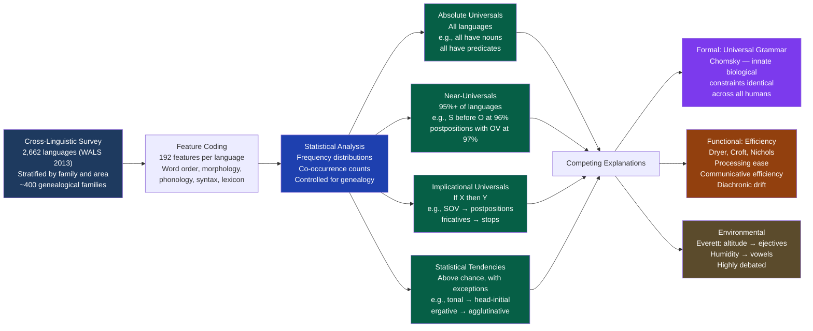

# Typological Universals and Linguistic Diversity

> [!abstract] TL;DR
> Typological universals are cross-linguistic structural regularities discovered by comparing languages regardless of genealogy; Greenberg's landmark 1963 study of 30 languages established 45 implicational universals ("if X then Y") that constrain which word orders and morphological systems can co-occur; the WALS database extends this enterprise to 2,662 languages across 192 features; functional typologists explain universals through processing efficiency and diachronic drift while formal linguists trace them to innate Universal Grammar; and the deeper finding is that the ~7,000 languages humans speak occupy only a narrow, structured corner of all logically possible linguistic space.

---

## Intuition

**Analogy:** Think of all the ways a city could organize its streets — random webs, perfect grids, spoke-and-wheel layouts, fractal hierarchies. Logically, millions of configurations are possible. Yet if you survey 2,000 real cities across centuries and continents, certain patterns recur with striking consistency: central plazas, market districts near transport hubs, residential density gradients falling with distance from commercial cores. Cities don't consciously choose these patterns — they emerge from the same underlying pressures (how far people walk, where commerce concentrates, how transport arteries form) operating everywhere, independently. Some patterns that are geometrically possible never appear in any real city; others arise independently in civilizations with no historical contact.

Typological universals are the central plazas and transport hubs of human language. Across 7,000+ languages representing 400+ independent genealogical lineages — languages that share no common ancestor, no common culture, no common geography — the same structural solutions recur. Subjects nearly always precede objects. Languages that use postpositions almost always also place the verb after the object. Languages that mark grammatical relations with case suffixes rarely enforce rigid word order for the same purpose. These regularities are not shared by descent. They are shared by function. The typological enterprise is to catalogue which corner of the vast space of logically possible languages humans actually inhabit — and to explain why that corner, and not some other.

---

## How It Works



---

## Key Concepts

### Secondary Level

**Typology versus historical linguistics — two different questions**

Historical-comparative linguistics asks: *how are languages related?* It reconstructs proto-languages, traces sound changes down the generations, and builds family trees (Indo-European, Austronesian, Sino-Tibetan, Niger-Congo, and hundreds of others). Typological linguistics asks a completely different question: *across languages that may have no historical connection whatsoever, what structural patterns recur?* A typologist comparing Swahili, Quechua, and Japanese is not looking for genetic relationship. She is looking for structural regularities that transcend lineage entirely.

The goal is to find **universals** (properties true of all, or almost all, languages) and to describe the **range of variation** (the ways languages permissibly differ). Finding that all languages have some form of nominal reference and predication, but only 41% of languages place the subject-object-verb in SOV order, tells us something about which structural arrangements are obligatory for human language, which are preferred, and which are merely possible.

The two enterprises also reinforce each other: typological patterns tend to persist through historical change (SOV languages stay SOV for millennia), and historical change feeds typological diversity by generating the variation typologists compare.

**WALS: the World Atlas of Language Structures**

The World Atlas of Language Structures (WALS), edited by Matthew Dryer and Martin Haspelmath (2013), is the primary empirical database for modern typological linguistics. Key facts:

| Property | Detail |
|---|---|
| Languages documented | 2,662 (from ~400 language families) |
| Features coded | 192 (phonological, morphological, syntactic, lexical) |
| Geographic coverage | All inhabited continents |
| Accessibility | Freely available at wals.info |
| Editors' chapters | Each of 192 chapters authored by a typological specialist |

WALS is not a census of the world's ~7,000 languages — it is a curated, purposive sample heavily weighted toward well-documented languages. New Guinea (with ~850 languages), the Amazon, and parts of sub-Saharan Africa are underrepresented. Conclusions should therefore be treated as tendencies across a well-studied subset, not universal laws verified against all languages.

**Word order: the central typological variable**

The most studied typological feature is the order of Subject (S), Verb (V), and Object (O) in declarative sentences. WALS data on basic word order:

| Order | Percentage | Representative languages |
|---|---|---|
| SOV | ~41% | Japanese, Turkish, Latin (classical), Persian, Korean, Quechua |
| SVO | ~29% | English, Swahili, Mandarin, Russian, French, Yoruba |
| VSO | ~9% | Classical Arabic, Welsh, Tagalog (partially), Hebrew (Biblical) |
| VOS | ~3% | Malagasy, some Amazonian languages |
| OVS | ~1% | Hixkaryana (Brazil), some Amazonian languages |
| OSV | ~1% | Very rare — Warao (Venezuela), some others |
| No dominant order / Free | ~14% | Many polysynthetic languages, highly inflected languages |

The most striking finding: **in 96% of languages, the Subject precedes the Object**. The SO ordering seems to be a near-absolute universal. The position of the Verb is much more variable. SOV and SVO together account for 70% of all languages.

**Greenberg's universals: the 45 statements that founded the field**

In 1963, Joseph Greenberg published "Some Universals of Grammar with Special Reference to the Order of Meaningful Elements," based on a 30-language sample designed to be genealogically and geographically diverse. He identified 45 universals, most of which are **implicational** — statements of the form "If a language has property X, it also has property Y." A sample:

- **Universal 1**: "In declarative sentences with nominal subject and object, the dominant order is almost always one in which the subject precedes the object." (The SO universal — near-absolute.)
- **Universal 2**: "In languages with prepositions, the genitive almost always follows the governing noun, while in languages with postpositions it almost always precedes."
- **Universal 4**: "With overwhelmingly greater than chance frequency, languages with normal SOV order are postpositional."
- **Universal 25**: "If the pronominal object follows the verb, so does the nominal object."
- **Universal 43**: "If a language has gender categories in the noun, it has gender categories in the pronoun."

These universals are not independent — they form a web of implicational relationships, mostly anchored to the verb-object (VO) vs. object-verb (OV) distinction, which turns out to be the single most powerful predictor of other word order features.

---

### Undergraduate Level

#### The implicational hierarchy of word order correlates

Greenberg's universals reveal that word order is not a collection of independent choices — it is a **typological syndrome** in which the position of the Verb relative to the Object predicts a cascade of other features. The core cluster of correlations (Dryer 1992, WALS):

| Feature | Head-Initial (VO/SVO/VSO) | Head-Final (OV/SOV) |
|---|---|---|
| Adpositions | Prepositions (before noun) | Postpositions (after noun) |
| Demonstratives | After noun (NounDem) | Before noun (DemNoun) |
| Relative clauses | After noun | Before noun |
| Adjectives | Often after noun | Often before noun |
| Genitive | After head noun | Before head noun |
| Auxiliaries | Before main verb | After main verb |
| Case morphology | Less common | More common |
| Morphological type | Often isolating/fusional | Often agglutinative |

The underlying principle is **harmonic consistency**: in head-initial languages, the head of a phrase (noun, verb, adposition) tends to come before its dependents. In head-final languages, the head follows its dependents. This "head-first" or "head-last" parameter radiates through the grammar, producing the characteristic typological syndromes. Chomsky's Government-Binding theory formalized this as a **head-direction parameter** with binary values.

Why should VO and prepositions co-occur? Functional typologists argue that harmonic consistency reduces the processing load: if the grammar is consistently right-branching or consistently left-branching, a parser can apply a single "look ahead" or "look back" strategy throughout the sentence rather than toggling between strategies at every phrase boundary. The correlation is not enforced by any formal rule — it is a statistical attractor toward which grammars drift over time through the cumulative effect of child acquisition and diachronic change.

#### WALS key findings beyond word order

Beyond word order, WALS reveals the global distribution of a dozen major typological features:

**Tone:**
- ~41% of WALS languages are tonal (use pitch distinctions to differentiate lexical or grammatical meaning)
- Tonal languages are heavily concentrated in sub-Saharan Africa, Southeast Asia, and the Americas
- Notably sparse in Europe, the Middle East, and Australia
- Within tone, there are distinctions: register tone (two-three levels, e.g., Yoruba), contour tone (rising/falling, e.g., Mandarin), and complex tone systems (up to eight tones, as in some Tibeto-Burman languages)

**Morphological typology:**
- Agglutinative: ~45% (Turkish, Swahili, Japanese, Quechua — words built by stacking morphemes with clear boundaries)
- Fusional/Inflecting: ~30% (Latin, Russian, Arabic — morphemes fuse multiple grammatical categories)
- Isolating/Analytic: ~20% (Mandarin, Vietnamese, English to a large degree — grammatical relations by word order and particles)
- Polysynthetic: ~5% (Mohawk, Inuktitut, many indigenous American languages — entire propositions in a single morphologically complex word)

**Vowel inventory size (from WALS Chapter 2):**
- Most common vowel inventory size: 5-7 vowels (~33% of WALS languages)
- Smallest documented: Pirahã with 3 vowels (/a, i, o/)
- Largest: Sindhi with ~38 vowels (including long/short, nasalized, and murmured contrasts)
- The modal 5-vowel system /a, e, i, o, u/ appears in Spanish, Swahili, Japanese, Yoruba, and many others

**Alignment (nominative-accusative vs. ergative-absolutive):**
- Nominative-accusative (S and A same case; O different): ~45% of languages (Indo-European, Semitic, most world families)
- Ergative-absolutive (A and O same; ergative case for transitive subject): ~20%
- Split or mixed systems: ~35%
- Ergativity tends to cluster in the Americas (Mayan, Quechuan), the Caucasus (Georgian), Tibeto-Burman, and Australian languages

#### Formal versus functional explanations for universals

The deepest debate in typological linguistics is about why universals exist. Two paradigm positions:

**The Chomskyan/Formalist position:**
Universal Grammar (UG) is an innate biological endowment — a set of structural principles and parameters genetically specified in every human and unique to the species. Universals exist because all human brains share the same linguistic blueprint. The parameters (head direction, null subject, wh-movement type) are binary switches set by the child during acquisition; their values determine the observable typological surface. Typological variation is not random — it is the set of parameter combinations licensed by UG. The claim is that the structure of language reflects biological constraints, not cultural or functional pressures.

**The Functionalist/Typological position (Dryer, Croft, Nichols, Haspelmath):**
Universals arise from three functional pressures that operate on all languages regardless of genealogy:

1. **Processing efficiency**: Harmonic word order consistency reduces online parsing difficulty. SOV languages that use postpositions are processed faster by the brain because the parser can use a consistent "collect dependents, then find head" strategy throughout.
2. **Communicative efficiency**: Frequent, predictable elements are shorter (Zipf's Law); grammatical relations that must be expressed (agent, patient) are systematically marked in ways that minimize ambiguity; markedness hierarchies (persons 1 > 2 > 3; animacy hierarchy) reflect the communicative salience of referents.
3. **Diachronic drift**: Universals are not synchronic constraints imposed by biology but **attractors** in the space of diachronic change. Languages drift toward typologically stable combinations not because an innate grammar forbids unstable ones, but because unstable combinations are harder to learn, maintain, and transmit across generations. What looks like a synchronic universal may be the endpoint of many independent diachronic paths, all leading to the same attractor.

The debate is not resolved. Evidence for the functional position: the existence of systematic correlations between typological features and measured processing difficulty (eye-tracking, reading time); evidence for the formal position: the speed and uniformity of first-language acquisition, the Poverty of the Stimulus argument (children converge on the correct adult grammar from underdetermined input). Most working typologists today hold a **pluralist** position: some universals are formal/biological, others are functional/statistical attractors, and distinguishing them requires case-by-case analysis.

#### Markedness as cross-linguistic frequency (Haspelmath's approach)

Martin Haspelmath (2006, 2021) proposes that what traditional linguistics calls "markedness" is best understood simply as cross-linguistic frequency: the category that appears in more languages is "less marked" in the technical sense — it receives zero morphological coding in more languages, is acquired earlier, is more resistant to deletion.

The key insight: if a category is more frequent across texts and across languages, it has less coding overhead in more languages' grammars. This is a **Zipfian efficiency** principle: the most-used forms are the shortest and the most robustly encoded. The categories that appear in more than 90% of languages tend to be the ones that appear most often in running text in any individual language. The cross-linguistic distribution and the within-language frequency distribution align — they are the same functional pressure operating at two different timescales (diachronic drift at the language level, usage frequency within a language).

Concrete examples:
| Category pair | More frequent/less marked | Less frequent/more marked |
|---|---|---|
| Tense | Non-past (present/future) | Past — many languages mark past tense, few mark non-past |
| Number | Singular | Plural — plural almost always receives morphological marking |
| Case | Nominative (subject) | Accusative (object) — object marking is typologically less stable |
| Voice | Active | Passive — passive universally requires more morphological material |
| Aspect | Perfective | Imperfective — in tense-aspect systems, perfective typically gets the zero form |

This reframing divorces markedness from formal linguistic theory and makes it directly measurable from typological databases, cross-linguistic text corpora, and acquisition data simultaneously.

---

### Graduate Level

#### Galton's problem and statistical independence in typological sampling

The central methodological challenge for quantitative typology is **genealogical non-independence**, known as Galton's Problem after Francis Galton's 1889 challenge to E.B. Tylor's cross-cultural statistics. The problem: if a typologist counts Spanish, Italian, Portuguese, and French as four separate data points all showing SVO order, that is not four independent attestations of SVO — it is one datum (Latin was SVO, and its descendants retained the order). Counting related languages as independent inflates sample sizes and produces spuriously significant correlations.

The problem has three dimensions in typological data:

1. **Genealogical signal**: Related languages share features by descent. The entire Indo-European family (~3% of languages) might all confirm a feature, but represent only one historical attestation of that feature evolving once (or twice, or never — it may be inherited from Proto-Indo-European).

2. **Areal signal**: Geographically proximate languages share features through contact, even across genealogical boundaries. The Balkan Sprachbund (Greek, Bulgarian, Albanian, Romanian, Macedonian) shares features — postposed definite articles, merger of dative and genitive, loss of infinitive — that cut across two language families (Slavic and non-Slavic). These geographically-induced similarities are a second source of non-independence.

3. **The compound problem**: A language may share a feature with its neighbours due to both descent from a common ancestor and subsequent contact reinforcement — disentangling genealogical from areal signal requires explicit modeling.

**Solutions applied in the literature:**

Dryer's genus method (1992): Matthew Dryer proposed counting *genera* as the sampling unit — groups within a family no more closely related than French and Greek within Indo-European. WALS uses ~480 genera. When Dryer applied genus-level counting to Greenberg's 45 universals, most survived; a few proved to be artifacts of geographic clustering.

Bayesian phylogenetic comparative methods (Pagel, Dunn et al. 2011): Model languages as tips on an explicit phylogenetic tree and estimate rates of feature gain and loss using Markov chain Monte Carlo. This tests whether co-occurrence of features X and Y is more frequent than expected given their individual frequencies and the genealogical structure — directly testing whether an implicational universal holds beyond genealogical confound. Dunn et al. (2011) famously found that word order universals, when tested phylogenetically, show **lineage-specific** rather than universal patterns: the SOV → postpositions correlation holds within most lineages, but the correlations are not identical across all language families, suggesting that harmonic consistency is a tendency within lineages, not a hard cross-linguistic universal.

The AUTOTYP database (Bickel and Nichols) takes a third approach: explicitly sampling to maximize genealogical and geographic diversity, building in representational quotas by area and family, and applying mixed-effects regression models that treat genealogical affiliation as a random effect.

#### The formal typological program: parameters and the Principles-and-Parameters framework

Within formal linguistics, Chomsky's Principles-and-Parameters framework (P&P, from the 1980s Government-Binding theory through Minimalism) provides the most developed formal theory of typological universals:

- **Principles**: universal constraints applying to all languages — properties of human language reflecting UG (the ban on structure-dependent rules, subjacency, the extended projection principle requiring every clause to have a subject)
- **Parameters**: binary options whose settings vary across languages and cluster to produce typological syndromes

Key parameters with typological consequences:
- **Head Direction Parameter**: whether heads (verbs, nouns, adpositions) precede or follow their complements — setting this to "head-first" predicts VO, prepositions, noun-before-genitive; "head-last" predicts OV, postpositions, genitive-before-noun
- **Null Subject (Pro-Drop) Parameter**: whether languages permit null pronominal subjects — Spanish, Italian, Japanese permit null subjects; English, French do not; this correlates with the richness of verbal agreement morphology
- **Wh-Movement Parameter**: whether wh-words move to sentence-initial position (English: *What did you eat?*) or remain in situ (Mandarin: *Ni chi-le shenme?* "You ate what?")

The formal typological program has two virtues: it predicts clustering (parameter settings co-vary because they're linked by principles), and it explains why some combinations of features never occur (they would require simultaneous settings of inconsistent parameters). Its weakness: the parameters multiply quickly; many cross-linguistic generalizations remain unexplained by known parameters; and the program has no explanation for why the parameters have the specific values they do — it describes but doesn't explain the typological distribution.

#### Evans and Levinson's challenge: the myth of language universals

In a landmark 2009 paper in Behavioral and Brain Sciences, Nicholas Evans and Stephen Levinson mounted a systematic challenge to the existence of strong linguistic universals. Their key argument: when examined carefully, virtually every proposed universal either has genuine counter-examples or is so abstract as to be vacuous.

Their case studies:
- **Recursion** (Hauser, Chomsky, Fitch 2002 proposed recursion as the single core formal property of human language): Pirahã (Everett 2005) lacks embedding and recursion entirely, if Everett's analysis is correct — a claim fiercely disputed but not yet conclusively refuted.
- **SOV/SVO universality**: ~14% of WALS languages have no dominant word order — the universal is a strong tendency, not an absolute constraint.
- **Binary tense distinction**: many languages (Mandarin, most Oceanic languages) have no grammatical tense category at all. The universal that "all languages mark temporal reference" is true at the level of discourse but false at the level of grammar.
- **Discrete morpheme boundaries**: polysynthetic languages and many Southeast Asian languages challenge the morpheme-as-minimal-unit assumption.

Evans and Levinson's conclusion: human language diversity is more extreme than typologists have acknowledged; the universals are best understood as strong cross-linguistic tendencies shaped by cultural transmission, functional efficiency, and historical accident — not by UG. The appropriate model is **cultural evolution under functional constraints**, not a biologically specified grammar.

The formal response (Chomsky, Newmeyer, Pinker): the universals Evans and Levinson attack are surface-level generalizations, not the deep abstract principles of UG; UG operates at a level of representation invisible in the surface typological record; and the existence of variation at the surface level is entirely predicted by P&P's parameters. The debate continues, with no consensus as of 2025.

#### Linguistic areas and contact-induced typological convergence

Beyond genealogical typology, **areal typology** studies how geographically proximate languages — regardless of family — come to share features through prolonged contact. A **Sprachbund** (language union or linguistic area) is a geographic zone in which languages from different families have converged on typological features not inherited from any common ancestor.

The four canonical Sprachbünde:

**The Balkan Sprachbund** (Trubetzkoy 1928): Greek (Indo-European, Hellenic), Bulgarian/Macedonian (Indo-European, Slavic), Albanian (Indo-European, isolate branch), Romanian (Indo-European, Romance), and partially Serbian — share: postposed definite article ("the" placed after the noun), merger of genitive and dative cases into a single oblique case, loss of infinitive (replaced by subjunctive), and future tense formed from a verb meaning "want."

**The South Asian Sprachbund** (Emeneau 1956): Indo-Aryan languages (Sanskrit-derived), Dravidian languages (Tamil, Telugu, Kannada, Malayalam — unrelated to Indo-Aryan), Munda languages (another unrelated family), and Tibeto-Burman languages of NE India — all share retroflex consonants (sounds produced with the tongue tip curled back), SOV order, postpositions, and verb-final clauses with participial modifiers. The retroflex consonants are particularly striking: they are rare globally but appear in every major language family of the subcontinent through contact-induced convergence.

**The Mesoamerican Sprachbund** (Campbell, Kaufman, Smith-Stark 1986): Mayan, Nahuatl, Zapotec, Totonac, Tlapanec, Mixe-Zoque — share vigesimal (base-20) numeral systems, head-marking on possessed nouns, nominal tense categories, and relational nouns (body-part terms used as adpositions).

**The Pacific Northwest Coast Sprachbund**: Haida (isolate), Tlingit (Na-Dene), Wakashan, Salish, Tsimshianic — share evidentiality systems, verb-second-like clausal structures, and complex noun incorporation.

Areal features are not transmitted genetically — they diffuse through bilingual communities, prestige copying, and grammatical reanalysis of borrowed structures. They demonstrate that the typological space is shaped not only by UG constraints and functional pressures but also by the geographic history of human populations and the contact networks that language communities form over millennia.

---

## Python Demo

```python
import numpy as np
import matplotlib
matplotlib.use("Agg")
import matplotlib.pyplot as plt

# ---------------------------------------------------------------
# TYPOLOGICAL DIVERSITY SIMULATION
#
# Model 100 synthetic languages, each described by 6 binary
# typological features drawn from known cross-linguistic distributions.
#
# Features (binary 0/1):
#   F0 Tonal         -- tonal (1) vs. non-tonal (0)        -- ~41% tonal
#   F1 Head-Initial  -- SVO/VSO (1) vs. SOV/OVS (0)       -- ~36% head-initial
#   F2 Vowel-Rich    -- large vowel inventory (1) vs. (0)  -- ~50%
#   F3 Agglutinative -- agglutinative (1) vs. fusional (0) -- ~45%
#   F4 Ergative      -- ergative (1) vs. accusative (0)    -- ~20%
#   F5 Pro-Drop      -- null subjects allowed (1) vs. (0)  -- ~70%
#
# Implicational correlations encoded (Greenberg / WALS):
#   Head-Final (F1=0) → Agglutinative (F3=1): r ≈ −0.55 (SOV → case → agglut.)
#   Tonal (F0=1) → Head-Initial (F1=1): r ≈ +0.35 (SE Asia/Africa tend SVO)
#   Agglutinative (F3=1) → Pro-Drop (F5=1): r ≈ +0.40 (rich morphology → null subjects)
#   Agglutinative (F3=1) → Ergative (F4=1): r ≈ +0.50 (ergative mostly agglutinative)
#
# Method: conditional probability simulation (numpy only)
# Goal: show that even randomly generated languages with these
#       correlations cluster into recognisable typological profiles.
# ---------------------------------------------------------------

rng = np.random.default_rng(42)
N = 100

FEATURES = ["Tonal", "Head-Initial", "Vowel-Rich", "Agglutinative", "Ergative", "Pro-Drop"]
TARGET_RATES = [0.41, 0.36, 0.50, 0.45, 0.20, 0.70]

langs = np.zeros((N, 6), dtype=int)

# F1: Head direction — the central typological axis (Greenberg Universal 2-4)
langs[:, 1] = (rng.random(N) < 0.36).astype(int)

# F0: Tonal — more common in head-initial languages (SE Asia, sub-Saharan Africa → SVO)
p_tonal = np.where(langs[:, 1] == 1, 0.52, 0.33)
langs[:, 0] = (rng.random(N) < p_tonal).astype(int)

# F2: Vowel-rich — slight positive association with tonal (more vowel distinctions needed)
p_vowel = np.where(langs[:, 0] == 1, 0.60, 0.43)
langs[:, 2] = (rng.random(N) < p_vowel).astype(int)

# F3: Agglutinative — strongly anti-correlated with head-initial
# Greenberg Universal 4: SOV → postpositions → case morphology → agglutination
p_agglutin = np.where(langs[:, 1] == 1, 0.26, 0.62)
langs[:, 3] = (rng.random(N) < p_agglutin).astype(int)

# F4: Ergative — more common in agglutinative, head-final languages
# Basque, Caucasian, Tibeto-Burman, Mayan, many Australian: all agglutinative+ergative
p_ergative = np.where(
    (langs[:, 3] == 1) & (langs[:, 1] == 0), 0.36,
    np.where(langs[:, 3] == 1, 0.22, 0.09)
)
langs[:, 4] = (rng.random(N) < p_ergative).astype(int)

# F5: Pro-Drop — more common in agglutinative languages (rich agreement → null subjects)
p_prodrop = np.where(langs[:, 3] == 1, 0.82, 0.56)
langs[:, 5] = (rng.random(N) < p_prodrop).astype(int)

# Empirical feature correlation matrix
corr = np.corrcoef(langs.T)

# Print results
print("=" * 62)
print("TYPOLOGICAL DIVERSITY SIMULATION")
print(f"  {N} synthetic languages, 6 binary features")
print("=" * 62)

print("\nFeature base rates (target vs. simulated):")
for i, (feat, tr) in enumerate(zip(FEATURES, TARGET_RATES)):
    actual = langs[:, i].mean()
    bar = "#" * int(actual * 30)
    print(f"  {feat:15} target={tr:.0%}  actual={actual:.0%}  {bar}")

print("\nKey implicational correlations:")
pairs = [
    (1, 3, "Head-Initial <-> Agglutinative", -0.55),
    (0, 1, "Tonal <-> Head-Initial",          +0.35),
    (3, 5, "Agglutinative <-> Pro-Drop",       +0.40),
    (3, 4, "Agglutinative <-> Ergative",       +0.50),
    (1, 4, "Head-Initial <-> Ergative",        -0.30),
]
for i, j, label, target_r in pairs:
    obs = corr[i, j]
    direction = "OK" if (obs * target_r) > 0 else "REVERSED"
    print(f"  {label:40}: expected r~{target_r:+.2f}  observed r={obs:+.3f}  [{direction}]")

# Identify the three canonical typological clusters
sov_agglut  = int(np.sum((langs[:, 1] == 0) & (langs[:, 3] == 1)))   # SOV + agglutinative
svo_tonal   = int(np.sum((langs[:, 1] == 1) & (langs[:, 0] == 1)))   # SVO + tonal
svo_fusional= int(np.sum((langs[:, 1] == 1) & (langs[:, 3] == 0)))   # SVO + fusional

print(f"\nTypological clusters:")
print(f"  'SOV + Agglutinative' profile  (Turkish/Japanese/Quechua type): {sov_agglut} languages")
print(f"  'SVO + Tonal'          profile  (Yoruba/Mandarin/Thai type):     {svo_tonal} languages")
print(f"  'SVO + Fusional'       profile  (English/French/Russian type):   {svo_fusional} languages")
remaining = N - (sov_agglut + svo_tonal + svo_fusional - int(np.sum(
    (langs[:, 1] == 1) & (langs[:, 0] == 1) & (langs[:, 3] == 0)
)))
print(f"  Other / mixed profiles:                                           {N - sov_agglut - svo_tonal} languages")

# VISUALISATION
fig, axes = plt.subplots(1, 2, figsize=(14, 5.5))
fig.suptitle(
    "Typological Universals Simulation: 100 Synthetic Languages x 6 Binary Features\n"
    "Correlations seeded from Greenberg's implicational universals and WALS cross-linguistic data",
    fontsize=9.5, fontweight="bold"
)

# Panel 1 — feature correlation matrix
ax1 = axes[0]
im = ax1.imshow(corr, cmap="RdBu_r", vmin=-1.0, vmax=1.0, aspect="auto")
short_labels = ["Tonal", "Head\nInit.", "Vowel\nRich", "Agglutin.", "Ergative", "Pro-\nDrop"]
ax1.set_xticks(range(6))
ax1.set_yticks(range(6))
ax1.set_xticklabels(short_labels, fontsize=8)
ax1.set_yticklabels(short_labels, fontsize=8)
for i in range(6):
    for j in range(6):
        val = corr[i, j]
        color = "white" if abs(val) > 0.45 else "black"
        ax1.text(j, i, f"{val:.2f}", ha="center", va="center",
                 fontsize=8, color=color, fontweight="bold")
plt.colorbar(im, ax=ax1, fraction=0.046, pad=0.04, label="Pearson r")
ax1.set_title(
    "Feature Correlation Matrix\n"
    "(structured by implicational universals;\ne.g. head-final correlates with agglutinative)",
    fontsize=9
)

# Panel 2 — typological cluster counts
ax2 = axes[1]
cluster_labels = ["SOV +\nAgglutinative\n(Turkish/Japanese)", "SVO +\nTonal\n(Yoruba/Thai)", "SVO +\nFusional\n(English/French)"]
counts = [sov_agglut, svo_tonal, svo_fusional]
bar_colors = ["#4f46e5", "#059669", "#dc2626"]
bars = ax2.bar(cluster_labels, counts, color=bar_colors,
               edgecolor="black", linewidth=0.8, alpha=0.88, width=0.5)
for bar, count in zip(bars, counts):
    ax2.text(
        bar.get_x() + bar.get_width() / 2,
        bar.get_height() + 0.5,
        str(count),
        ha="center", va="bottom", fontsize=12, fontweight="bold"
    )
ax2.axhline(N * 0.10, color="#9ca3af", linestyle="--", linewidth=1.2,
            label="10% independence baseline")
ax2.set_ylabel("Number of Simulated Languages", fontsize=9)
ax2.set_title(
    "Recognisable Typological Clusters\n"
    "Implicational correlations produce structured profiles\n"
    "even in randomly sampled synthetic languages",
    fontsize=9
)
ax2.set_ylim(0, max(counts) * 1.28)
ax2.grid(axis="y", alpha=0.25)
ax2.legend(fontsize=8)

plt.tight_layout()
plt.savefig("typological_universals_simulation.png", dpi=110, bbox_inches="tight")
plt.show()
```

**What the simulation demonstrates:**

- **Correlation matrix (Panel 1)**: The strongest negative correlation is Head-Initial vs. Agglutinative — confirming Greenberg's Universal 4 (SOV → postpositions → case morphology → agglutinative morphology). The Agglutinative-Ergative positive correlation reflects the empirical fact that nearly all ergative languages (Basque, Chechen, Tibetan, most Mayan languages, Australian languages) are also agglutinative. The Agglutinative-Pro-Drop correlation reflects that rich agreement morphology provides the information needed to recover null subjects.
- **Cluster counts (Panel 2)**: Even from a random sample of 100 synthetic languages, three recognisable typological profiles emerge naturally: the "SOV-agglutinative" cluster (Turkish, Japanese, Quechua type), the "SVO-tonal" cluster (Yoruba, Thai, Mandarin type), and the "SVO-fusional" cluster (English, Russian, French type). These are not imposed by the simulation — they emerge from the implicational correlations alone.

---

## Real-World Applications

> **Multilingual NLP and typological divergence from English:** Most modern NLP systems are designed, trained, and evaluated primarily on English and other Indo-European languages — all SVO, largely fusional or analytic, non-tonal, with flexible word order allowed by morphology in the fusional cases. When these systems are deployed on typologically distant languages — Turkish (SOV agglutinative), Yoruba (SVO tonal), Tibetan (SOV ergative agglutinative), or Warlpiri (free-order polysynthetic) — they fail in predictable ways. Tokenisation breaks on agglutinative words where a single token encodes what English distributes across four words. Dependency parsers trained on SVO tree structures misparse head-final languages. Sequence models for named-entity recognition break on tonal orthographies where the same character has different meanings at different tones. Typological linguistics provides the diagnostic vocabulary for identifying where and why multilingual NLP systems fail — and which features need explicit architectural support.

> **The World Atlas of Language Structures and endangered language documentation:** WALS documents approximately 2,662 languages, but the world has ~7,000 living languages, and roughly half are expected to fall silent before the end of the 21st century. The approximately 4,338 languages not yet fully documented in WALS include many that could confirm or refute proposed universals. Several proposed "near-universals" have already been falsified by the documentation of previously unstudied languages (Pirahã's apparent lack of recursion; Riau Indonesian's apparent lack of grammatical categories; languages without count-mass noun distinctions). Every language that becomes extinct without a full grammatical description removes a potential counter-example to proposed universals — or a confirmation. The typological enterprise has a direct stake in endangered language documentation that is distinct from the ethnographic or cultural preservation motivation.

> **Machine translation across typological distance:** Neural machine translation (NMT) quality degrades systematically with typological distance between source and target. English→French (both SVO, both fusional, related families) achieves BLEU scores in the 40-50 range. English→Japanese (SOV, agglutinative, polite-speech registers, head-final relative clauses) achieves 20-30. English→Inuktitut (polysynthetic, ergative, with dozens of inflectional categories fused per verb form) achieves single-digit BLEU. The degradation is not random — it follows the typological distance metric (number of WALS features on which language pairs differ). Typological linguistics thus provides a principled prediction of where MT investment will have the highest marginal return: not improving high-resource SVO→SVO pairs, but developing typologically-aware architectures for SOV, polysynthetic, and tonal languages with lower resource availability.

> **Language universals and cognitive science:** The debate between Chomsky's UG and functionalist typology is directly connected to the broader debate between nativist and empiricist theories of mind. If word order universals arise from processing efficiency, then the human mind is a general-purpose learner that acquires linguistic structure from statistical regularities in input — consistent with the connectionist/deep learning paradigm in cognitive science. If word order universals arise from UG, then the mind has domain-specific linguistic modules that cannot be reduced to general learning — consistent with the modularity of mind thesis. The typological record is thus one of the empirical battlegrounds for a century-old dispute in cognitive science about the architecture of human cognition.

---

## Common Pitfalls

- **Treating WALS as a random census of human language** — WALS is a purposive sample, over-representing well-documented European, East Asian, and South Asian languages. Features are coded by individual linguists working from grammars that may be decades old; some feature values are contested, especially for under-described languages. Typological statistics should be read as distributions across a well-studied subset, not as exact frequencies across all ~7,000 languages.

- **Ignoring Galton's problem** — Counting each language as an independent data point inflates effective sample sizes and produces spuriously strong correlations. A typological generalization based on 200 Indo-European languages is not 200 independent confirmations — it is one confirmation (the ancestral Proto-Indo-European grammar, plus some variation). Every quantitative typological claim requires either genus-level analysis, phylogenetic correction, or explicit modeling of genealogical dependency.

- **Conflating genealogical and typological similarity** — Two languages can be genealogically close but typologically divergent (English and Icelandic — both Germanic, but English has become nearly analytic while Icelandic retains a near-full Proto-Germanic case system). Conversely, languages can be genealogically distant but typologically similar (Japanese and Turkish are both SOV agglutinative postpositional languages with no genetic relationship). Genealogical relationship and typological similarity are independent axes that must be kept analytically separate.

- **Mistaking implicational universals for bidirectional rules** — Greenberg's Universal 4 states "SOV → postpositions" — not "postpositions → SOV." The implication is one-directional. VSO languages can also be postpositional (some Welsh-influence constructions). Treating implicational universals as equivalences produces false predictions.

- **Overstating the Evans-Levinson challenge** — Evans and Levinson (2009) demonstrated that many proposed universals have genuine exceptions when examined carefully. But their argument was not that language has no universals — it was that universals are rarer and weaker than claimed. Absolute universals (all languages have nouns and verbs, all languages can express negation, all languages have some phonological system) remain uncontested; it is the stronger syntactic and morphological universals that require more careful qualification.

- **Assuming typological stability is the same as typological inevitability** — SOV order is the most common word order (~41%), but many languages have changed word order historically (Latin was SOV, but French and Spanish are SVO; Old English was more SOV-like, Modern English is SVO). The fact that a feature is typologically common does not mean languages are prevented from changing it — it means languages that change it tend to find their way back to the stable attractor over centuries of further change.

- **Confusing typological universals with the Sapir-Whorf hypothesis** — Typological universals describe the structural properties shared across languages. The Sapir-Whorf hypothesis (linguistic relativity) claims that the structural differences between languages shape their speakers' non-linguistic cognition. These are completely different claims. The existence of word order universals neither confirms nor refutes the hypothesis that word order differences affect spatial reasoning. The confusions arise when typological diversity (what languages differ in) is taken as evidence for linguistic relativity, and typological universals (what languages share) are taken as evidence against it — both moves are non-sequiturs.

---

## Related Concepts

- [[Phonological_Typology_and_Universals]] — the closest companion note: phonological typology applies the same Greenberg-style implicational universals and WALS methodology to sound systems; the phonological and syntactic typological enterprises share core methods but deal with different strata of linguistic structure; the markedness framework appears in both
- [[Universal_Grammar_and_Language_Acquisition]] — the formal alternative to functional typology: where typologists find universals via cross-linguistic comparison, Chomsky's UG program finds them in the poverty-of-stimulus argument and acquisition data; the debate between these approaches is the central theoretical tension that typological universals must navigate
- [[Sound_Change_and_Phonological_Diachrony]] — typological patterns are not static: historical linguistics reveals the diachronic paths by which languages reach typological attractors; Greenberg's word order correlations are partly explained by the preferred directionality of sound change and grammaticalization; typological stability reflects the dynamics of language change, not biological prohibition
- [[Morphology_and_Word_Formation]] — the agglutinative/fusional/isolating/polysynthetic typological distinction is one of the oldest morphological typologies (Schlegel 1808, Humboldt 1836); morphological typology and its functional explanations (efficiency of encoding, discriminability of morpheme boundaries) connect directly to Greenberg's word order correlates
- [[Language_Variation_and_Dialects]] — typological variation exists not only between languages but within languages across dialects and registers; dialectal variation within a language often reflects typological differences (SOV in subordinate clauses but SVO in main clauses in German), and historical typological transitions leave synchronic traces in dialect variation
- [[Language_and_Culture]] — the interface between typological universals and cultural diversity is the territory of the Sapir-Whorf debate: do structural differences across typologically divergent languages (evidentiality, aspect, spatial reference frames) produce cognitive differences? Evans and Levinson's typological challenge to universalism is partly motivated by evidence for linguistic-relativity effects on spatial and temporal cognition
- [[Cognitive_Anthropology]] — cognitive anthropologists study the relationship between cultural categories and conceptual structure; typological universals in lexical domains (colour terms, kinship terminology, body-part lexicon) provide the cross-linguistic baseline against which cultural-cognitive variation is measured; Berlin and Kay's colour universals hierarchy is a direct application of typological methodology
- [[Language_Model_Basics]] — typological diversity is the principal challenge for universal NLP: language models trained on SVO corpora encode head-initial syntactic biases that fail on SOV languages; understanding typological universals informs cross-lingual transfer learning, typologically-stratified evaluation, and the design of language-agnostic representations

---

## Review Questions

### Secondary

1. The World Atlas of Language Structures documents 2,662 languages but the world has approximately 7,000. Does this mean WALS findings only apply to those 2,662 languages — or does the sample tell us something about all human languages? What would make the sample more or less reliable as a basis for universals?
2. Greenberg's Universal 4 states: "With overwhelmingly greater than chance frequency, languages with normal SOV order are postpositional." What does "implicational universal" mean — and why does this formulation say "SOV → postpositional" rather than "postpositional → SOV"? Give one other example of an implicational universal from the note.
3. A travel guide claims: "Japanese and Turkish are completely different languages with no relationship." A linguist replies: "They are genealogically unrelated, but typologically they are strikingly similar." Explain what the linguist means, naming at least three typological features both languages share.

### Undergraduate

1. The functionalist typologist says: "SOV languages have postpositions because head-final grammar is easier to process consistently — put all dependents before their head and the parser never needs to revise its analysis." The Chomskyan says: "SOV languages have postpositions because both settings reflect the same underlying value of the Head Direction Parameter in UG." These are different explanations for the same fact. (a) What evidence would you collect to test the functionalist explanation? (b) What evidence would you collect to test the formal explanation? (c) Are these explanations mutually exclusive?
2. You read a claim: "90% of the world's tonal languages are in sub-Saharan Africa and Southeast Asia." A methodologically cautious colleague says: "That finding could be entirely explained by genealogical clustering — all the tonal languages in Africa might descend from a single proto-language that was tonal, giving you dozens of 'confirmations' that are really just one." (a) What is Galton's problem and why does it apply here? (b) How would you use Dryer's genus method to test whether the tonal-geography correlation is genealogically artifactual? (c) What would a Bayesian phylogenetic test add beyond the genus method?
3. Martin Haspelmath argues that "markedness" is best understood as cross-linguistic frequency: the more frequent category is "less marked" because it gets zero coding in more languages. Apply this reasoning to the singular/plural distinction. (a) Which is more frequent in running text — singular or plural? (b) Which receives morphological marking in more languages — singular or plural? (c) Does the frequency hypothesis correctly predict the markedness relationship? (d) Name one case where frequency and markedness predictions might come apart.

### Graduate

1. Dunn et al. (2011) found, using Bayesian phylogenetic comparative methods, that word order universals show **lineage-specific** rather than **cross-lineage universal** patterns: SOV → postpositions holds within most individual lineages, but the rate and strength of the correlation varies significantly across families. (a) If this result is correct, what does it imply about the formal P&P claim that the Head Direction Parameter produces universal clustering? (b) What does it imply about the functionalist claim that processing efficiency universally drives harmonic consistency? (c) What alternative hypothesis do Dunn et al. offer, and what kind of evidence would confirm or refute it?
2. Evans and Levinson (2009) argue that "the languages of the world show massive typological diversity that is not predicted by, and often not even compatible with, standard formulations of Universal Grammar." Reconstruct their strongest three arguments from the material in this note. Then give the three most compelling responses from the formal linguistics tradition. Who, in your assessment, has the better of the argument as of 2025, and what would it take to decisively settle the debate?
3. The Balkan Sprachbund demonstrates that languages from different families converge typologically through contact. This raises a problem for all theories of typological universals: if contact can produce convergence independently of genealogy and UG, how do we distinguish a **universal** (a constraint on all possible human language) from an **areal attractor** (a stable typological configuration that diffuses through contact)? Propose a research design using both phylogenetic comparative methods and spatial autocorrelation statistics that could, in principle, disentangle these three sources of typological patterning: (a) UG-derived universal constraints, (b) functional attractors via independent convergence, (c) contact-induced areal diffusion.

---

## Sources

- [Greenberg, J.H. (1963). "Some Universals of Grammar with Special Reference to the Order of Meaningful Elements." In *Universals of Language*, ed. J. Greenberg. MIT Press](https://mitpress.mit.edu/9780262570077/)
- [Dryer, M.S. & Haspelmath, M. (eds.) (2013). *WALS Online* (v2020.3). Zenodo — wals.info](https://wals.info)
- [Dryer, M.S. (1992). "The Greenbergian Word Order Correlations." *Language* 68(1): 81–138](https://doi.org/10.2307/416370)
- [Croft, W. (2003). *Typology and Universals*, 2nd ed. Cambridge University Press](https://doi.org/10.1017/CBO9780511840579)
- [Haspelmath, M. (2006). "Against Markedness (and What to Replace It With)." *Journal of Linguistics* 42(1): 25–70](https://doi.org/10.1017/S0022226705003683)
- [Haspelmath, M. (2021). "Explaining Grammatical Coding Asymmetries: Form-Frequency Correspondences and Predictability." *Journal of Linguistics* 57(3): 605–633](https://doi.org/10.1017/S0022226720000535)
- [Evans, N. & Levinson, S.C. (2009). "The Myth of Language Universals: Language Diversity and Its Importance for Cognitive Science." *Behavioral and Brain Sciences* 32(5): 429–448](https://doi.org/10.1017/S0140525X0999094X)
- [Dunn, M., Greenhill, S.J., Levinson, S.C., & Gray, R.D. (2011). "Evolved Structure of Language Shows Lineage-Specific Trends in Word-Order Universals." *Nature* 473: 79–82](https://doi.org/10.1038/nature09923)
- [Newmeyer, F.J. (2005). *Possible and Probable Languages: A Generative Perspective on Linguistic Typology*. Oxford University Press](https://doi.org/10.1093/acprof:oso/9780199274338.001.0001)
- [Bickel, B. & Nichols, J. (2013). "Inflectional Synthesis of the Verb." In *WALS Online*, Chapter 22](https://wals.info/chapter/22)
- [Nichols, J. (1992). *Linguistic Diversity in Space and Time*. University of Chicago Press](https://press.uchicago.edu/ucp/books/book/chicago/L/bo3683192.html)
- [Comrie, B. (1989). *Language Universals and Linguistic Typology*, 2nd ed. University of Chicago Press](https://press.uchicago.edu/ucp/books/book/chicago/L/bo3683060.html)
- [Dryer, M.S. (2013). "Order of Subject, Object and Verb." In *WALS Online*, Chapter 81](https://wals.info/chapter/81)
- [Campbell, L., Kaufman, T., & Smith-Stark, T.C. (1986). "Meso-America as a Linguistic Area." *Language* 62(3): 530–570](https://doi.org/10.2307/415477)
- [Emeneau, M.B. (1956). "India as a Linguistic Area." *Language* 32(1): 3–16](https://doi.org/10.2307/410649)
- [Pagel, M., Atkinson, Q.D., Calude, A.S., & Meade, A. (2013). "Ultraconserved Words Point to Deep Language Ancestry Across Eurasia." *PNAS* 110(21): 8471–8476](https://doi.org/10.1073/pnas.1218726110)
- [Song, J.J. (2001). *Linguistic Typology: Morphology and Syntax*. Pearson](https://www.pearson.com/en-gb/subject-catalog/p/linguistic-typology/P200000001116)
- [WALS Online — wals.info (free full database access)](https://wals.info)

---

#Linguistics #HistoricalLinguistics #TypologicalUniversals
