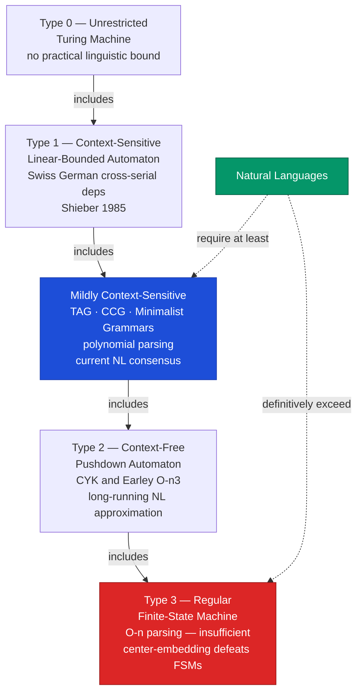

> [!abstract] TL;DR
> Computational Linguistics (CL) uses formal mathematical tools — grammar formalisms, automata theory, and parsing algorithms — to model the structure of human language; it differs from NLP in that CL asks *what is the right grammatical theory?* while NLP asks *what system performs best on benchmarks?*; the Chomsky hierarchy places natural languages in the mildly context-sensitive class (above context-free but below context-sensitive), demanding polynomial-time parsers for linguistically plausible grammars, and the history of machine translation traces a path from rule-based systems through statistical models to the Transformer architectures that now dominate the field.

---

## Intuition

**Analogy:** Think of a town planner and a taxi driver. The town planner (computational linguist) wants to understand the complete road network — which routes are legal, what structures are physically impossible, how the hierarchy of motorways, A-roads, and alleyways determines what can connect to what. The taxi driver (NLP engineer) wants to get from A to B as fast as possible and will take any shortcut that works, even one the planner never mapped. The planner's theory tells you what routes are *in principle* possible; the taxi driver's pragmatism finds what works *in practice*, even if the theory cannot yet explain why. Computational linguistics is the town-planning discipline; NLP is the taxi service. Both are necessary — and increasingly, the best taxi drivers are building their routes by reading the planner's maps.

Technically: CL applies formal language theory, logic, and automata to build explicit, falsifiable models of grammatical structure. A CL model must be *linguistically plausible* — it should parse exactly what native speakers accept and reject what they reject, using mechanisms that are cognitively defensible. An NLP system needs only to produce correct outputs on held-out test data. This distinction has practical consequences: CL's grammar formalisms expose *why* a sentence is ambiguous or ungrammatical; NLP benchmarks only tell you whether a system got the answer right.

---

## How It Works



The Chomsky Hierarchy (1956) stratifies formal languages by the computational power needed to recognise them. Each level is a strict subset of the level above. The question "where do natural languages sit in this hierarchy?" drove four decades of CL research.

**Why natural languages exceed regular (Type 3):** A finite-state machine (FSM) has finite memory — it cannot count. The phenomenon of *center-embedding* proves that a counter with unbounded stack depth is required. Consider: "The rat **the cat** chased fled." Now embed again: "The rat **the cat the dog bit** chased fled." Each embedding adds a matched pair of NP and VP that must be kept on a stack. An FSM cannot match arbitrary numbers of such pairs; a pushdown automaton (PDA) — which uses a stack — can. Therefore natural language syntax is not regular.

**Why context-free (Type 2) is probably also insufficient:** In 1985, Stuart Shieber demonstrated that Swiss German contains *cross-serial dependencies* that cannot be generated by any CFG. The argument is based on the verb-final clause in Swiss German: *mer d'chind* (the children) *em Hans* (Hans-DAT) *es huus* (the house-ACC) *laa* (let) *hälfe* (help) *aastriiche* (paint-INF). The dependencies cross: children–let, Hans–help, house–paint. This pattern has the structure $a^n b^n c^n$ — which requires a mildly context-sensitive grammar. English center-embedding alone does not prove super-CFG complexity, but Swiss German does.

**The mildly context-sensitive (MCS) target:** Joshi (1985) proposed the MCS class as the right complexity class for natural language. MCS grammars are polynomially parseable (no worse than O(n^6) for most formalisms), handle cross-serial dependencies, but do not allow the full power of context-sensitive grammars. Tree Adjoining Grammars (TAG), Combinatory Categorial Grammars (CCG), and Minimalist Grammars all fall in the MCS class.

---

## Key Concepts

### Secondary Level

**CL vs. NLP — what is the actual difference?**

Both fields process human language computationally. The difference is in the primary question and the standard of success.

A computational linguist asks: *Does my grammar generate exactly the sentences native speakers accept?* The grammar is a theory of language; its predictions must match the judgements of human informants. An NLP engineer asks: *Does my system get the right answer on the benchmark dataset?* The system is a tool; its internals do not matter as long as the outputs are correct.

This creates productive tension. CL provides formal grammars that explain *why* a sentence has two readings (structural ambiguity) and *why* some word orders are impossible. NLP provides massive annotated corpora and training signals that expose phenomena CL theories had missed. The history of the field is partly a story of these two cultures arguing, then learning from each other.

**The Chomsky Hierarchy simplified:**

| Type | Name | Machine | Example languages |
|------|------|---------|-------------------|
| 3 | Regular | Finite-state automaton | Email addresses, simple date formats |
| 2 | Context-free | Pushdown automaton | Arithmetic expressions, approximate English syntax |
| MCS | Mildly context-sensitive | (specialised) | Natural languages |
| 1 | Context-sensitive | Linear-bounded TM | Highly constrained formal systems |
| 0 | Unrestricted | Turing machine | Any computable string set |

**What is a grammar formalism?**

A grammar formalism is a precise mathematical specification of:
1. A set of *symbols* (non-terminals like NP, VP; terminals like "the", "cat").
2. A set of *rules* (how symbols rewrite into other symbols or words).
3. A *start symbol* (S for sentence).
4. A *derivation procedure* (how rules are applied to generate strings).

Different formalisms make different tradeoffs between expressive power, parsing efficiency, and linguistic expressiveness. A context-free grammar (CFG) is the simplest formalism that captures most of English syntax; more powerful formalisms like CCG and HPSG capture phenomena that CFG misses.

**What does parsing do?**

Parsing takes a string of words and assigns it a *structural description* — a parse tree that shows how the words combine into phrases and sentences according to the grammar. Parsing serves two purposes in CL: it tests whether a sentence is grammatical (does a parse exist?) and it recovers the structure needed for downstream processing (what is the subject? what is the object?).

---

### Undergraduate Level

**Context-Free Grammars and the CYK Algorithm:**

A CFG is a 4-tuple G = (N, Σ, R, S) where N is a set of non-terminal symbols, Σ is a set of terminal symbols (words), R is a set of rewrite rules of the form A → α (where A ∈ N and α ∈ (N ∪ Σ)⁺), and S ∈ N is the start symbol.

For efficient parsing, CFGs are converted to *Chomsky Normal Form* (CNF): every rule is either A → B C (two non-terminals) or A → w (single terminal). Any CFG can be converted to CNF without loss of generative capacity.

The **CYK algorithm** (Cocke 1969, Younger 1967, Kasami 1965, independently discovered three times) is a dynamic-programming bottom-up parser for CNF grammars:

1. Create a parse chart: a triangular table where cell (i,j) records which non-terminals can generate the substring from position i to position j.
2. Fill the diagonal (single-word cells) with lexical entries: if the grammar has N → w_i, add N to cell (i,i).
3. For each span length l = 2..n, for each start position i, for each split point k ∈ [i, j-1]: if A → B C is a rule and B is in cell (i,k) and C is in cell (k+1,j), add A to cell (i,j).
4. The input is grammatical iff S appears in cell (0, n-1).

Complexity: O(n³ × |G|) where n is the sentence length and |G| is the grammar size. For fixed grammars, O(n³). This is cubic in sentence length — expensive but tractable.

The *Earley parser* (1970) is an alternative O(n³) algorithm (O(n²) for unambiguous grammars) that processes rules top-down, predicting what non-terminals should appear before scanning words. Earley handles arbitrary CFGs (including left-recursive rules) directly; CYK requires CNF conversion.

**Major Grammar Formalisms:**

| Formalism | Class | Key Idea | Real-world use |
|-----------|-------|----------|----------------|
| CFG | Context-free | Phrase-structure rules; Chomsky 1957 | Penn Treebank annotation; most undergraduate parsing courses |
| HPSG | (efficiently parseable) | Feature-unification; constraint-based; sign-based | LinGO ERG (English Resource Grammar) |
| LFG | (efficiently parseable) | Two parallel structures: c-structure (phrase) + f-structure (function) | XLE parser; typological research |
| TAG | Mildly context-sensitive | Elementary trees composed by *substitution* and *adjunction* | Handles long-distance dependencies; XTAG grammar |
| CCG | Mildly context-sensitive | Every word has a *category* (functor over arguments); composition by typed rules | C&C parser; EasyCCG; transparent syntax-semantics interface |

**CCG in detail:** In Combinatory Categorial Grammar, every word carries a syntactic category that specifies what it combines with and what it produces. "chases" has category (S\NP)/NP — a function that takes an NP on the right (the object) to produce S\NP, which then takes an NP on the left (the subject) to produce S. Composition rules (forward application, backward application, forward composition, type-raising) allow the parser to build constituents incrementally. CCG's primary appeal is that its derivations directly mirror semantic composition — the grammar and the semantics are two views of the same structure.

**Machine Translation — historical arc:**

The dream of automated translation is as old as computing itself. The history divides into five phases:

1. **Rule-based MT (1950s–1980s).** Systems encoded bilingual dictionaries and hand-written transfer rules. The ALPAC report (1966) concluded that MT was twice as expensive and twice as slow as human translation, and killed US government funding for a decade. RBMT survived in narrow domains (SYSTRAN, still used for some language pairs today).

2. **Statistical MT and the IBM Models (1990s).** Brown et al. (1990–1993) at IBM introduced the *noisy channel model* for MT: find the target sentence T that maximises P(T) × P(S|T). P(T) is a language model; P(S|T) is a translation model estimated from aligned bilingual corpora using the EM algorithm. The IBM Models (1–5) formalised word-alignment as a latent variable. This was the first data-driven MT approach and set the paradigm for a decade.

3. **Phrase-based SMT (2000s).** Instead of aligning words, align *phrases*. The Moses toolkit (2007) implemented a complete phrase-based SMT pipeline: phrase extraction from word-aligned corpora, phrase table, language model reranking, minimum error rate training. Google Translate ran on phrase-based SMT until 2016.

4. **Neural MT (2014–2017).** Sutskever et al. (2014) introduced the sequence-to-sequence architecture: an LSTM encoder reads the source sentence into a fixed-length vector; an LSTM decoder generates the target sentence from that vector. Bahdanau et al. (2015) added *attention*, allowing the decoder to focus on different parts of the source at each output step — solving the information bottleneck of fixed-length vectors.

5. **Transformer (2017–present).** Vaswani et al.'s "Attention is All You Need" replaced RNNs with self-attention across the full sequence — faster to train, better at capturing long-range dependencies. Google Translate migrated to the Transformer in 2016–2017; DeepL (2017) reported BLEU scores 1–2 points above Google; GPT-4 and multilingual models (mT5, NLLB-200) now handle 200+ languages.

**Annotated Corpora and Linguistic Resources:**

Annotated corpora are the empirical backbone of computational linguistics. They provide both training data for statistical/neural models and gold-standard evaluation benchmarks.

| Resource | Coverage | Annotation |
|----------|----------|-----------|
| Penn Treebank (1993) | 1M words of Wall St. Journal | Phrase-structure trees; POS tags |
| PropBank (2005) | PTB sentences | Semantic role labels (ARG0=agent, ARG1=patient…) |
| OntoNotes (2007–2013) | 1.7M words; 5 languages | Multi-layer: syntax + SRL + NER + coreference |
| Universal Dependencies (2014–present) | 100+ languages, 200+ treebanks | Dependency relations; cross-lingual standard |
| FrameNet (1997–present) | English lexicon | Frame-semantic roles (Fillmore's frame semantics) |

**Inter-annotator agreement (IAA)** measures how reliably two annotators produce the same labels. The standard metric is **Cohen's kappa (κ)**: κ = (P_observed − P_chance) / (1 − P_chance). κ > 0.8 indicates strong agreement; κ < 0.6 is usually considered unreliable. IAA exposes ambiguity in the annotation guidelines and limits the ceiling accuracy achievable by any trained model — a system cannot outperform the IAA on the same task in expectation.

---

### Graduate Level

**Shieber's Proof and the Linguistic Significance of Cross-Serial Dependencies:**

Stuart Shieber's 1985 paper "Evidence Against the Context-Freeness of Natural Language" provided the first rigorous proof that a natural language sentence type requires more than context-free power. The key construction in Swiss German is the *verb cluster* in subordinate clauses:

> *...mer em Hans es huus hälfe aastriiche laa*
> (we Hans-DAT house-ACC help paint let = "we let Hans help paint the house")

The noun phrases and verbs form two parallel sequences: NP_1 NP_2 NP_3 V_1 V_2 V_3, where NP_i is the semantic argument of V_i. This is a *cross-serial* dependency. The pumping lemma for CFGs (Ogden's lemma) shows that no CFG can generate exactly the cross-serial NP-VP pattern. The formal language {a^n b^n c^n | n ≥ 1} is a context-sensitive (not context-free) language, and the Swiss German pattern has the same combinatorial structure.

Implication: since Swiss German is a natural language, and since context-free grammars cannot generate its verb cluster, no CFG can serve as an adequate grammar of Swiss German. By extension, any grammatical theory restricted to CFG expressiveness is inadequate for human language in general.

**Probing Classifiers and "BERTology":**

Do large neural language models (BERT, RoBERTa, GPT) implicitly learn linguistic structure? The probing methodology (Conneau et al. 2018, Liu et al. 2019) tests this by training a shallow linear classifier on top of a frozen pre-trained model's representations to predict a linguistic label (POS tag, dependency label, constituent span).

Results from Liu et al.'s systematic probing of BERT:
- POS tags and NER are encoded in lower BERT layers.
- Syntactic dependency relations are encoded in middle layers.
- Semantic information (coreference, SRL) is encoded in upper layers.

Hewitt and Manning (2019) took a step further: the *structural probe* learns a linear transformation of BERT's hidden representations such that the squared distance between two words' transformed vectors approximates their tree distance in the parse tree. This suggests that parse trees are geometrically embedded in BERT's representation space — recoverable with a simple linear transformation. The finding was partially replicated in GPT-2 (larger models show cleaner structure) and extended to cross-lingual models (Edmiston & Jäkel 2023 shows mBERT recovers Universal Dependency structure across 30+ languages with a single probe).

Interpretation remains contested. Critics argue that probing accuracy measures what can be *decoded* from representations, not what is *computed* by the model — a representation that happens to be linearly separable along a linguistic dimension is not necessarily using that dimension to compute its output. Nevertheless, BERTology established that statistical exposure to language data (without explicit grammatical supervision) leads to representations that encode syntactic structure at a non-trivial level.

**TAG, CCG, and the Mildly Context-Sensitive Class:**

Joshi (1985) defined mild context-sensitivity by four requirements: (1) the languages contain the copy language {ww | w ∈ Σ⁺}, demonstrating non-context-freeness; (2) they are polynomially parseable; (3) they have the constant-growth property (consecutive sentences in the language grow by a bounded amount); (4) they satisfy the *bounded locality of dependencies* — every dependency is within a bounded distance from the moved element's base position.

TAG satisfies all four properties. A TAG grammar consists of *elementary trees* (initial trees and auxiliary trees), combined by two operations:

- **Substitution:** Replace a frontier node labelled X with an initial tree rooted at X.
- **Adjunction:** Splice an auxiliary tree (whose root and foot are both labelled X) into a node labelled X in another tree.

Adjunction is the key operation: it allows a bounded amount of material to be inserted between a head and its arguments, capturing long-distance dependencies (wh-movement, topicalisation) within a single elementary tree — the *extended domain of locality*. This means that the grammatical relationship between a moved element and its base position is always visible within one elementary tree, making TAG linguistically transparent.

CCG achieves the same expressive power through functor categories and composition rules. The CCG type system is essentially a typed lambda calculus: every word is a function over its arguments, and syntactic combination corresponds to functional application and composition. This makes the syntax-semantics interface fully transparent: the parse derivation is the semantic derivation.

**Neural Parsers vs. Symbolic Parsers:**

The current state-of-the-art constituency parsers (Kitaev & Klein 2018; Kitaev et al. 2019) use BERT representations followed by chart-based decoding: they score every possible span (i,j,label) and find the highest-scoring non-overlapping tree via dynamic programming. On the Penn Treebank (WSJ Section 23), these achieve F1 > 96% — compared to CYK-based PCFG parsers at ~85% and early neural parsers at ~90%.

For dependency parsing, the biaffine attention parser (Dozat & Manning 2017) scores every possible arc (head, dependent) jointly with a label classifier, then recovers the maximum spanning arborescence. These parsers achieve UAS > 95% and LAS > 93% on English UD treebanks.

The speed–accuracy–linguistic plausibility trade-off:

| Parser type | Speed | Accuracy | Linguistic transparency |
|-------------|-------|----------|------------------------|
| CYK (PCFG) | Slow O(n³) | ~85% F1 | High: explicit grammar rules |
| Transition-based neural | Fast O(n) | ~93% F1 | Medium: implicit in transitions |
| Chart-based BERT | Slow | ~96% F1 | Low: no interpretable grammar |
| CCG neural | Medium | ~94% F1 | High: CCG categories are interpretable |

**The Future: Neural-Symbolic Synthesis:**

The dominant view in 2020–2024 is that LLMs have (partially) made symbolic grammars obsolete as engineering tools — GPT-4 translates, parses, and answers grammar questions without any explicit grammar. But several research threads resist this conclusion:

1. **Formal semantics + neural networks:** Neural model-theoretic semantic parsers (Guo et al. 2022; Drozdov et al. 2022) learn to map sentences to formal logic expressions (AMR, SQL, lambda calculus) that support exact reasoning — something token-prediction LLMs cannot do reliably.

2. **Cognitive plausibility:** LLMs are trained on far more data than any human child receives, cannot learn from a handful of examples the way children do, and still fail on systematic generalisation tasks that humans handle trivially (SCAN benchmark; COGS; SLOG). CL's grammar formalisms directly address these failure modes by encoding inductive biases that mirror human grammatical knowledge.

3. **Low-resource languages:** For the 7,000+ languages with no digital presence, BERTology offers little — there is no training data. Formal grammars written by linguists (e.g., the HPSG Hausa grammar) provide the only computational analysis of these languages.

---

## Python Demo

```python
"""
CYK (Cocke-Younger-Kasami) Chart Parser for a toy CFG.
Demonstrates O(n^3) dynamic-programming parsing, PP-attachment structural
ambiguity, and parse-tree enumeration from a backpointer forest.
Requires: numpy, matplotlib only.
"""
import numpy as np
import matplotlib.pyplot as plt
from collections import defaultdict

# ── 1. Grammar (near-Chomsky Normal Form) ─────────────────────────────────────
# Binary rules A → B C
BINARY_RULES = [
    ("S",  "NP",   "VP"),
    ("NP", "Det",  "N"),
    ("NP", "NP",   "PP"),    # NP attachment: "the cat with a dog"
    ("VP", "V",    "NP"),
    ("VP", "VP",   "PP"),    # VP attachment: "sees the cat, with a dog"
    ("PP", "Prep", "NP"),
]
# Unit rules A → B (applied via fixed-point closure)
UNIT_RULES = [
    ("NP", "ProperNoun"),   # NP → ProperNoun
    ("VP", "V"),            # VP → V  (intransitive)
]
LEXICAL = {
    "Det":        ["the", "a"],
    "N":          ["cat", "dog", "mouse"],
    "ProperNoun": ["alice"],
    "V":          ["sees", "chases"],
    "Prep":       ["with"],
}
WORD_TO_POS = defaultdict(set)
for _tag, _words in LEXICAL.items():
    for _w in _words:
        WORD_TO_POS[_w].add(_tag)


def _unit_close(cat_set, bp_cell):
    """Expand cat_set via unit rules until fixed point; record derivations."""
    changed = True
    while changed:
        changed = False
        for lhs, rhs in UNIT_RULES:
            if rhs in cat_set and lhs not in cat_set:
                cat_set.add(lhs)
                bp_cell[lhs].append(("UNIT", rhs))
                changed = True


def cyk_parse(sentence):
    """
    sentence : list of lowercase strings
    Returns  : (chart, bp)
      chart[i][j] = set of non-terminals spanning tokens[i..j]
      bp[i][j][nt] = list of derivation records:
        ("LEXICAL",)          direct terminal entry
        ("UNIT", B)           unit rule nt -> B
        ("BINARY", k, B, C)   binary rule nt -> B[i..k] C[k+1..j]
    """
    n = len(sentence)
    chart = [[set()               for _ in range(n)] for _ in range(n)]
    bp    = [[defaultdict(list)   for _ in range(n)] for _ in range(n)]

    # Initialise single-word spans (diagonal)
    for i, word in enumerate(sentence):
        for pos in WORD_TO_POS.get(word, set()):
            chart[i][i].add(pos)
            bp[i][i][pos].append(("LEXICAL",))
        _unit_close(chart[i][i], bp[i][i])

    # Fill spans of length 2..n (bottom-up DP)
    for length in range(2, n + 1):
        for i in range(n - length + 1):
            j = i + length - 1
            for k in range(i, j):             # all split points
                for lhs, B, C in BINARY_RULES:
                    if B in chart[i][k] and C in chart[k+1][j]:
                        entry = ("BINARY", k, B, C)
                        if entry not in bp[i][j][lhs]:
                            chart[i][j].add(lhs)
                            bp[i][j][lhs].append(entry)
            _unit_close(chart[i][j], bp[i][j])

    return chart, bp


# ── 2. Parse-tree enumeration via backpointer forest ──────────────────────────
def enumerate_trees(nt, i, j, sentence, bp):
    """
    Returns list of trees. Each tree is (label, children) where children
    is a list of sub-trees (same format) or plain strings (terminal words).
    """
    trees = []
    for deriv in bp[i][j].get(nt, []):
        if deriv[0] == "LEXICAL":
            trees.append((nt, [sentence[i]]))
        elif deriv[0] == "UNIT":
            B = deriv[1]
            for sub in enumerate_trees(B, i, j, sentence, bp):
                trees.append((nt, [sub]))
        else:                                  # "BINARY"
            _, k, B, C = deriv
            for lt in enumerate_trees(B, i, k, sentence, bp):
                for rt in enumerate_trees(C, k+1, j, sentence, bp):
                    trees.append((nt, [lt, rt]))
    return trees


def pprint_tree(node, indent=0):
    if isinstance(node, str):
        return "  " * indent + f'"{node}"'
    label, children = node
    lines = ["  " * indent + f"({label}"]
    for ch in children:
        lines.append(pprint_tree(ch, indent + 1))
    lines[-1] += ")"
    return "\n".join(lines)


# ── 3. Test three sentences ───────────────────────────────────────────────────
TESTS = {
    "grammatical":   "alice chases the cat".split(),
    "ungrammatical": "cat alice the chases".split(),
    "ambiguous":     "alice sees the cat with a dog".split(),
}

parse_results = {}
for label, sent in TESTS.items():
    chart, bp = cyk_parse(sent)
    n = len(sent)
    valid = "S" in chart[0][n - 1]
    trees = enumerate_trees("S", 0, n - 1, sent, bp) if valid else []
    parse_results[label] = dict(sent=sent, chart=chart, valid=valid, trees=trees)

    print(f"\n{'─' * 60}")
    print(f"[{label.upper()}]  '{' '.join(sent)}'")
    print(f"  Grammatical: {valid}   |   Parse trees: {len(trees)}")
    for idx, tree in enumerate(trees):
        print(f"\n  Tree {idx + 1}:")
        for line in pprint_tree(tree).split("\n"):
            print("  " + line)

# ── 4. Visualise: CYK chart + O(n^3) complexity ───────────────────────────────
amb     = parse_results["ambiguous"]
sent_a  = amb["sent"]
chart_a = amb["chart"]
Na      = len(sent_a)

ABBREV = {
    "S": "S", "NP": "NP", "VP": "VP", "PP": "PP",
    "Det": "D", "N": "N", "V": "V", "Prep": "P", "ProperNoun": "PN",
}

fig, axes = plt.subplots(1, 2, figsize=(16, 6))
fig.suptitle(
    'CYK Chart Parser  —  "alice sees the cat with a dog"\n'
    'PP-attachment ambiguity yields 2 valid parse trees',
    fontsize=11, fontweight="bold",
)

# Left: upper-triangular chart heatmap
ax = axes[0]
mat = np.zeros((Na, Na))
for i in range(Na):
    for j in range(i, Na):
        if chart_a[i][j]:
            mat[i][j] = 1.0
lower_mask = np.tri(Na, k=-1, dtype=bool)
mat_m = np.ma.masked_where(lower_mask, mat)

ax.imshow(mat_m, cmap="Blues", vmin=0, vmax=1.5, aspect="equal", origin="upper")
ax.set_xticks(range(Na))
ax.set_xticklabels([f"{j}\n{sent_a[j]}" for j in range(Na)], fontsize=8)
ax.set_yticks(range(Na))
ax.set_yticklabels([str(i) for i in range(Na)], fontsize=8)
ax.set_xlabel("End index  j", fontsize=9)
ax.set_ylabel("Start index  i", fontsize=9)
ax.set_title("CYK Chart  (row=start i, col=end j)", fontsize=10)

for i in range(Na):
    for j in range(i, Na):
        if chart_a[i][j]:
            abbrs = sorted(ABBREV.get(c, c) for c in chart_a[i][j])
            ax.text(j, i, "\n".join(abbrs), ha="center", va="center",
                    fontsize=5.5, color="navy", fontweight="bold")

# Right: O(n^3) complexity growth
ax2 = axes[1]
n_vals = np.arange(1, 26, dtype=float)
cells  = n_vals * (n_vals + 1) / 2                  # chart cells = O(n^2)
work   = n_vals ** 3 * len(BINARY_RULES)             # rule checks = O(n^3)
work_s = work / work.max() * cells.max()             # scaled to same axis

ax2.fill_between(n_vals, cells, alpha=0.5, color="steelblue",
                 label="Chart cells  n(n+1)/2  [O(n^2)]")
ax2.plot(n_vals, work_s, "r-", linewidth=2,
         label="Rule-check work  [O(n^3)]  (scaled)")
ax2.axvline(Na, color="green", linestyle="--", linewidth=1.5,
            label=f"This sentence  (n={Na})")
ax2.set_xlabel("Sentence length  n", fontsize=9)
ax2.set_ylabel("Count / scaled work", fontsize=9)
ax2.set_title("CYK Complexity Growth", fontsize=10)
ax2.legend(fontsize=8)
ax2.set_xticks(n_vals[::4].astype(int))

plt.tight_layout()
plt.savefig("cyk_parser_demo.png", dpi=120, bbox_inches="tight")
plt.show()
```

**Expected console output:**

```
────────────────────────────────────────────────────────────
[GRAMMATICAL]  'alice chases the cat'
  Grammatical: True   |   Parse trees: 1

  Tree 1:
  (S
    (NP
      (ProperNoun
        "alice"))
    (VP
      (V
        "chases")
      (NP
        (Det
          "the")
        (N
          "cat"))))

────────────────────────────────────────────────────────────
[UNGRAMMATICAL]  'cat alice the chases'
  Grammatical: False   |   Parse trees: 0

────────────────────────────────────────────────────────────
[AMBIGUOUS]  'alice sees the cat with a dog'
  Grammatical: True   |   Parse trees: 2

  Tree 1:  (NP attachment — "the cat with a dog" is one constituent)
  (S ... (VP (V "sees") (NP (NP (Det "the")(N "cat")) (PP ... "with a dog"))))

  Tree 2:  (VP attachment — "sees the cat" then modified by "with a dog")
  (S ... (VP (VP (V "sees")(NP "the cat")) (PP ... "with a dog")))
```

The two trees for the ambiguous sentence correspond to classical **PP-attachment ambiguity**: Tree 1 says Alice saw a cat that had a dog with it (NP reading); Tree 2 says Alice used a dog to see, or was with a dog while seeing (VP reading). The grammar generates both because NP → NP PP and VP → VP PP are both valid rules.

---

## Real-World Applications

> **Google Translate / DeepL (Neural MT).** Google Translate serves 500 million users daily in 100+ languages. The 2017 transition from phrase-based SMT to the Transformer (GNMT, then production Transformer) yielded a 60% reduction in translation errors on human evaluation. The architecture is a direct instantiation of the seq2seq framework formulated in CL/MT research: an encoder reads source tokens into contextualised representations; a decoder generates target tokens autoregressively with cross-attention over the encoder. The current NLLB-200 model (Meta, 2022) extends this to 200 languages, including many with fewer than 100k training sentences, using multilingual transfer learning — a CL insight (shared syntactic structure across languages) applied at engineering scale.

> **Universal Dependencies (UD) Project.** UD (Nivre et al. 2016) is an ongoing international annotation project that defines a cross-linguistically consistent framework for grammatical analysis, covering 200+ treebanks in 100+ languages. Every UD treebank uses the same ~40 dependency relation labels (nsubj, obj, obl, amod, advmod…) and the same part-of-speech tag inventory. This cross-lingual standardisation enabled multilingual NLP: a parser trained on 50 UD treebanks generalises to low-resource languages via transfer, and cross-lingual probing (Edmiston & Jäkel 2023) shows that multilingual BERT's representations are isomorphic across languages along the UD relation dimensions — a finding that would be impossible without UD's controlled annotation scheme.

> **Penn Treebank and BERT Pre-training.** The Penn Treebank (Marcus et al. 1993) annotated 1 million words of Wall Street Journal text with phrase-structure trees and POS tags. For 25 years, it was the primary benchmark for constituency parsing and POS tagging. More importantly, treebank annotation revealed patterns that informed the feature engineering of early NLP systems — and then became evaluation sets for the neural systems that replaced them. BERT was pre-trained without any treebank supervision, yet achieves 96%+ F1 on the same treebank — a result that reignited debate about whether explicit syntactic annotation is a necessary intermediate representation or merely a useful evaluation signal.

---

## Common Pitfalls

- **Assuming context-free = sufficient for natural language.** The Shieber (1985) result is definitive for Swiss German, and similar arguments apply to other languages. Building a system on a pure CFG backbone and then being surprised when it fails on center-embedded or cross-serial structures is an avoidable mistake. Use a mildly context-sensitive formalism (CCG, TAG) if linguistic adequacy matters, or acknowledge the approximation explicitly.

- **Conflating parsing accuracy with grammatical coverage.** A parser that achieves 96% F1 on WSJ test data may still fail systematically on out-of-domain text, low-frequency constructions, or non-canonical word orders. High benchmark accuracy does not mean the parser has learned the grammar — it means it has learned the distribution of the benchmark corpus. Evaluate on diverse genres and on targeted challenge sets (center-embedding, garden-path sentences, long-range agreement) before making coverage claims.

- **Ignoring inter-annotator agreement when training on annotated data.** A treebank where annotators agree 70% of the time has a ceiling accuracy of 70% for any model trained on it — the model cannot learn to outperform the annotation signal. Always check the IAA figures for any dataset, report them in papers, and use IAA-adjusted metrics when comparing across corpora.

- **Treating BLEU as a measure of translation quality.** BLEU (Papineni et al. 2002) measures n-gram overlap between system output and reference translations. It correlates with human judgement at the corpus level but can be gamed, does not penalise fluency errors that happen to preserve n-grams, and is sensitive to reference diversity. The field increasingly uses COMET (a learned metric) and human direct assessment alongside BLEU. Reporting only BLEU for MT experiments is considered insufficient in most top venues since 2020.

- **Confusing linguistic plausibility with engineering performance.** A CCG parser that produces linguistically transparent derivations may score 1–2 F1 points below a BERT-based chart parser. This does not mean CCG is "wrong" — it may be producing more generalizable or interpretable analyses. Optimising entirely for benchmark F1 can entrench annotation artifacts and mislead downstream applications that need correct semantic structure, not just high parse scores.

- **Using byte-pair encoding tokenisation for linguistic analysis.** BPE tokenisers (GPT-4, LLaMA) split words into sub-word units: "unhappiness" → ["un", "happ", "iness"]. These sub-word tokens do not correspond to morphemes, syllables, or any linguistically motivated unit. Any downstream CL analysis (POS tagging, parsing, morphological analysis) must handle the BPE–morpheme mismatch explicitly or re-tokenise at the word level before analysis.

---

## Related Concepts

- [[Language_and_Linguistics_Overview]] — introduces the foundational distinction between competence and performance, and the Chomskyan conception of grammar as a formal system that CL operationalises computationally
- [[Universal_Grammar_and_Language_Acquisition]] — the UG hypothesis directly motivates CL's search for universal grammar formalisms; the learnability arguments (Gold's theorem) constrain what can be induced from positive evidence alone
- [[Dependency_and_Construction_Grammar]] — dependency grammar is the basis of Universal Dependencies annotation and modern neural parsers; Construction Grammar's usage-based account of syntax is an alternative to the rule-based formalisms CL formalises
- [[Corpus_Linguistics]] — annotated corpora (Penn Treebank, UD) are built using corpus methods; IAA, annotation guidelines, and balanced sampling are corpus-linguistic concepts applied to treebank construction
- [[Semantic_Theory]] — formal semantics (model-theoretic semantics, lambda calculus, compositional semantics) is the semantic half of CL; CCG's transparent syntax-semantics interface directly implements Frege's compositionality principle
- [[Morphology_and_Word_Formation]] — morphological analysis (finite-state transducers, two-level morphology) is the oldest and most practically successful application of formal language theory to linguistics
- [[Language_Model_Basics]] — n-gram language models are the statistical CL precursor to neural LMs; the noisy-channel model for MT is built on language model scoring of candidate translations
- [[Tokenization]] — tokenisation is the first step in any CL/NLP pipeline and introduces linguistic ambiguity (word boundaries, clitics, compound words) that formal grammar must address
- [[String_Matching_Overview]] — CYK and Earley are string-recognition algorithms; the chart data structure is a memoisation table over string spans, directly analogous to dynamic-programming string algorithms
- [[Seq2Seq_Encoder_Decoder]] — the seq2seq architecture is the NLP engineering implementation of the MT research program developed in CL; the encoder-decoder split mirrors the analysis-and-generation division of classical MT systems
- [[BERT_Architecture]] — BERTology probes ask whether BERT's representations encode the syntactic structures that CL grammar formalisms define; the answer (partially yes) bridges the CL–NLP gap

---

## Review Questions

### Secondary

1. A friend says: "We don't need grammar rules — a big enough dataset of text examples is sufficient to build any language system." Using the concepts of the Chomsky hierarchy and center-embedding, explain one specific reason why formal grammars capture something that a purely statistical frequency-based approach cannot directly represent.
2. Describe the difference between a computational linguist and an NLP engineer when both are working on the same task — say, machine translation. What would each count as success, and why might they disagree about whether a system is "good"?
3. Why is it not possible to write a finite-state machine (like a regular expression) that accepts exactly all grammatical English sentences? Give a specific sentence type as evidence.

### Undergraduate

1. You have a sentence "The horse raced past the barn fell." Most English speakers initially parse this as ungrammatical, then experience a "garden path" when they realise it is grammatical (reduced relative clause). Using a CFG parse, show both the initial misparse and the correct parse. What does this sentence reveal about human parsing strategy that a chart parser does not exhibit?
2. The CYK algorithm fills the chart in O(n³) time. A colleague proposes switching to a neural parser that runs in O(n²) but produces no explicit grammar rules. For what downstream applications does the choice of parser matter, and when would the O(n³) symbolic parser be preferable despite being slower?
3. The IBM Model 1 for machine translation uses the EM algorithm to induce word alignments from parallel corpora without supervision. Explain the E-step and M-step of EM in the MT context: what is the "hidden variable," what does the E-step compute, and why does the M-step produce better word alignments?

### Graduate

1. Shieber's 1985 proof uses the Swiss German verb cluster as evidence against the context-freeness of natural language. Critically evaluate two responses a generative grammarian might offer: (a) Swiss German is a performance phenomenon, not competence; (b) the relevant linguistic unit is not the surface string but the underlying structure, which is context-free. Which response, if any, successfully preserves a CFG-based linguistic theory? What additional data would be needed to decide?
2. Hewitt and Manning (2019) show that a linear structural probe recovers approximate parse trees from BERT representations. Identify two alternative explanations for this finding that do not require concluding "BERT has learned syntax," and propose an experimental design that could distinguish between your alternative and the syntactic internalisation hypothesis.
3. A research team wants to build a CL system for a language with no digital presence, no treebank, and no bilingual parallel corpus — only a grammar sketch written by a field linguist in the 1970s and 10 hours of recorded speech with transcription. Map out a complete pipeline: what formal grammar formalism would you use, how would you annotate training data, what transfer learning strategy applies, and what evaluation methodology is feasible given the data constraints?

---

## Sources

- [Chomsky, N. (1956). Three models for the description of language. *IRE Transactions on Information Theory*, 2(3), 113–124.](https://ieeexplore.ieee.org/document/1056813)
- [Shieber, S. M. (1985). Evidence against the context-freeness of natural language. *Linguistics and Philosophy*, 8(3), 333–343.](https://link.springer.com/article/10.1007/BF00630917)
- [Joshi, A. K. (1985). Tree adjoining grammars: How much context-sensitivity is required to provide reasonable structural descriptions? In D. Dowty, L. Karttunen, & A. Zwicky (Eds.), *Natural Language Parsing*.](https://www.cambridge.org/core/books/natural-language-parsing/tree-adjoining-grammars/A7CFA23680BE04CA6F44AB96D0E74E39)
- [Brown, P. F. et al. (1993). The mathematics of statistical machine translation: Parameter estimation. *Computational Linguistics*, 19(2), 263–311.](https://aclanthology.org/J93-2003/)
- [Vaswani, A. et al. (2017). Attention is all you need. *NeurIPS 2017*.](https://arxiv.org/abs/1706.03762)
- [Marcus, M. P., Santorini, B., & Marcinkiewicz, M. A. (1993). Building a large annotated corpus of English: The Penn Treebank. *Computational Linguistics*, 19(2), 313–330.](https://aclanthology.org/J93-2004/)
- [Nivre, J. et al. (2016). Universal Dependencies v1: A multilingual treebank collection. *LREC 2016*.](https://aclanthology.org/L16-1262/)
- [Liu, N. F. et al. (2019). Linguistic knowledge and transferability of contextual representations. *NAACL 2019*.](https://aclanthology.org/N19-1112/)
- [Hewitt, J. & Manning, C. D. (2019). A structural probe for finding syntax in word representations. *NAACL 2019*.](https://aclanthology.org/N19-1419/)
- [Dozat, T. & Manning, C. D. (2017). Deep biaffine attention for neural dependency parsing. *ICLR 2017*.](https://arxiv.org/abs/1611.01734)
- [Steedman, M. (2000). *The Syntactic Process*. MIT Press.](https://mitpress.mit.edu/9780262692601/the-syntactic-process/)
- [Jurafsky, D. & Martin, J. H. (2024). *Speech and Language Processing* (3rd ed. draft).](https://web.stanford.edu/~jurafsky/slp3/)
- [ALPAC Report (1966). Languages and machines: Computers in translation and linguistics.](https://www.mt-archive.net/ALPAC-1966.pdf)

---

#Linguistics #AppliedLinguistics #ComputationalLinguistics
