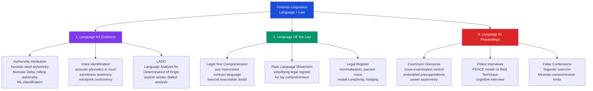

> [!abstract] TL;DR
> Forensic linguistics applies linguistic analysis to legal and criminal justice contexts — spanning authorship attribution from texts, voice identification in court, language comprehension of legal documents, and the discourse of police interviews — giving law the tools to ask not just *what* was said, but *who* said it, *whether they understood it*, and *whether it was said freely*.

---

## Intuition

**Analogy:** A master chef can taste a dish at a new restaurant and identify not just the cuisine but the specific chef's hand — the balance of acidity, the choice of fat, how long the garlic was allowed to cook — because skilled cooking leaves an unconscious fingerprint. No chef consciously decides to use exactly 0.3% more lemon juice than the recipe calls for; it just happens, every time, because of thousands of hours of ingrained habit. A forensic linguist reads text the same way. Below the level of conscious vocabulary choice, every writer leaves a fingerprint: how often they use "the" versus "a," whether their sentences average 18 or 24 words, where they place clause-modifying adverbs, whether they prefer the Oxford comma. These habits are as involuntary as seasoning instinct — and as distinctive.

Technically, forensic linguistics uses the tools of phonetics, stylistics, discourse analysis, and sociolinguistics as forensic instruments — submitting linguistic evidence to legal standards of reliability, admissibility, and expert interpretation.

---

## How It Works



The three pillars are analytically distinct but practically entangled. A linguist called to testify in a murder case might simultaneously attribute a threatening letter to the defendant (pillar 1), explain to the jury why the standard instruction "beyond a reasonable doubt" is linguistically ambiguous (pillar 2), and analyse whether the defendant's confession shows markers of language coercion (pillar 3). All three tasks demand the same underlying expertise — close attention to the gap between what language appears to say and what it actually encodes.

---

## Key Concepts

### Secondary Level

**The three domains.** Forensic linguistics divides into three analytically distinct areas. *Language as evidence* asks: can linguistic analysis identify who produced a text or utterance? *Language of the law* asks: are legal texts — statutes, jury instructions, contracts — actually comprehensible to those bound by them? *Language in legal proceedings* asks: what happens linguistically when police question suspects or lawyers cross-examine witnesses? Each domain has its own methodology, literature, and ethical tensions.

**Authorship attribution — the core idea.** Every speaker and writer has an *idiolect* — a personal dialect consisting of habitual linguistic choices that operate largely below conscious control. The key insight of authorship attribution is that *function words* — the, a, and, of, to, in, is, was, I, we, but, for — are the most diagnostically reliable features, precisely because writers do not consciously manage them. A writer trying to disguise their style naturally focuses on vocabulary and topic; they rarely think to change how often they write "of" versus "about." Function-word frequency profiles therefore persist even through deliberate attempts at disguise. Sentence-length distribution, punctuation habits, and preferred syntactic constructions round out the feature set. The goal is not to identify a single unique author from first principles — it is to determine whether two samples (a suspect's known writings and a disputed text) are *more similar to each other* than to writings by other candidates.

**The Unabomber case.** The paradigmatic forensic linguistics case. From 1978 to 1995, Ted Kaczynski killed three people and injured 23 others with mail bombs. In 1995 he demanded that *The New York Times* and *The Washington Post* publish his 35,000-word manifesto, "Industrial Society and Its Future." The FBI agreed, hoping a reader would recognise the writing. Kaczynski's brother David and sister-in-law Linda recognised the argument structure, the idiosyncratic use of the phrase "cool-headed logicians" and "eat your cake and have it too" (Kaczynski inverted the standard idiom to "have your cake and eat it too"), and a cluster of other stylistic features from old letters. Linguistic analysis by the FBI confirmed the match. The manifesto's publication — and the subsequent tip from David — led to Kaczynski's arrest in 1996. The case demonstrated both the power of stylometric analysis and its current limits: the linguistic match was compelling but not technically provable beyond doubt; the physical evidence at the Montana cabin sealed the case. Forensic linguistics was the doorway, not the lock.

**Voice identification.** Courts have long accepted *earwitness* testimony — a witness who identifies a suspect's voice. Forensic linguists and phoneticians advise on the reliability of such identification. Acoustic phonetic analysis of recorded speech can compare fundamental frequency (pitch), formant structure (vowel quality), voice quality features (breathiness, creakiness), and speaking rate. The controversial "voiceprint" method — treating a spectrogram as a visual fingerprint — was developed in the 1960s and is still used by some law enforcement agencies, but the majority of forensic phoneticians reject it: unlike fingerprints, voices change with emotion, health, age, and recording conditions, and spectrographic patterns are not sufficiently unique or stable to support identification claims at the level courts often expect. Professional bodies (the International Association for Forensic Phonetics and Acoustics) publish guidelines recommending probabilistic likelihood-ratio frameworks rather than categorical identification.

---

### Undergraduate Level

**Computational stylometry — Burrows' Delta and beyond.** John Burrows' Delta (2002) is the foundational computational stylometry algorithm. It works as follows: (1) assemble a corpus of texts by multiple candidate authors; (2) extract the most frequent words across the corpus (typically the top 100-500, dominated by function words); (3) for each text, compute how many standard deviations each word's frequency is from the corpus mean — a *z-score*; (4) compute Delta for a disputed text *D* against each candidate author *A* as the mean of the absolute z-score differences across all features: Δ(D, A) = (1/n) Σ |z_D(w) − z_A(w)|. Lower Delta = more similar. Rolling stylometry applies Delta in a sliding window across a long text, revealing segments where authorship may shift — useful for detecting ghost-writing, collaboration, or interpolation. Machine learning approaches (logistic regression, SVM, neural networks) have since outperformed Delta on large author sets, but Delta remains valued for small samples and interpretability.

**The standard error problem.** Stylometric attribution operates on probability, not certainty. Typical results report a *posterior probability* or a *likelihood ratio* — not "the defendant wrote this." The accuracy of computational stylometry on blind test sets with 5,000-word documents and 2-author sets typically exceeds 90%; but accuracy degrades sharply with shorter texts (under 500 words), larger author sets, translation, and genre changes (an author's formal letters and casual emails have different function-word profiles). Courts must be warned that stylometric evidence is probabilistic and subject to conditions the analyst must specify.

**LADO — Language Analysis for the Determination of Origin.** Immigration authorities in the UK, Germany, Netherlands, and Australia use LADO — the linguistic analysis of an asylum seeker's speech — to verify nationality claims. An applicant claiming to be Somali might be assessed by a linguist to determine whether their language use is consistent with varieties spoken in Somalia versus Kenya or Ethiopia. The methodology draws on phonetics, lexis, and morphosyntactic features. Critics identify serious problems: (1) dialects do not respect national borders — Somali is spoken across Somalia, Ethiopia, Kenya, and the diaspora, with overlapping features; (2) refugees are often multilingual and have lived in multiple countries, so their speech has mixed features that any single-language analysis will misclassify; (3) many LADO analyses are conducted by non-specialists; (4) the stakes — deportation, detention — are disproportionate to the certainty the method can provide. The International Association for Forensic Phonetics and Acoustics has published guidelines specifying minimum standards; many jurisdictions fall below them.

**Legal register and comprehension failure.** Legal language is a historically conservative *register* — a variety of language systematically associated with a social situation. Its features include: heavy *nominalisation* (converting verbs and adjectives into nouns — "determination of liability" for "determining whether X is liable"), passive voice used to obscure agency ("it is alleged that"), stacked noun phrases ("the party of the first part"), modal complexity ("shall be deemed to have been considered"), and archaic vocabulary ("hereinafter," "notwithstanding," "aforesaid"). Research shows these features severely reduce comprehension for lay readers. Studies of jury instruction comprehension (Charrow & Charrow 1979; Tiersma 1999) found that jurors often cannot correctly paraphrase key legal standards:

| Legal phrase | Lay comprehension rate (typical studies) |
|---|---|
| "Beyond a reasonable doubt" | ~50% give correct paraphrase |
| "Preponderance of the evidence" | ~30% |
| "Proximate cause" | ~20% |
| "Deliberate indifference" | ~15% |

The *plain language movement* — driven by Peter Tiersma, Joseph Kimble, and others — argues for rewriting legal documents in plain English without sacrificing legal precision. Plain language reforms have been implemented in consumer contracts, government forms, and some jury instructions in jurisdictions including New Zealand, Australia, and several US states. Resistance from the legal profession often invokes tradition and the claim that legal precision *requires* technical language — a claim plain language researchers challenge empirically.

**The PEACE model and the cognitive interview.** How police interview witnesses and suspects shapes what language evidence is obtained. The UK's PEACE model (Preparation and planning; Engage and explain; Account, clarification, challenge; Closure; Evaluate) is information-gathering rather than accusation-based. Interviewers are trained to use open-ended prompts ("Tell me everything that happened"), avoid leading questions, and allow silence. The *cognitive interview* (Fisher & Geiselman, 1992) adds four memory retrieval techniques: mental reinstatement of context (re-imagining the environment at the time), reporting everything including peripheral details, recalling events in different temporal orders, and changing perspective. Meta-analyses show cognitive interview increases information yield by 35-45% over standard police interviewing while maintaining accuracy. In contrast, the *Reid Technique* — dominant in North America — is confrontational: the interrogator announces certainty of guilt, minimises the moral seriousness of the crime to encourage confession, and uses persistent psychological pressure. Linguists and psychologists have documented that Reid-style interrogation substantially increases the risk of false confession, particularly in adolescents, people with cognitive disabilities, and those who are highly suggestible.

**Miranda rights and comprehension.** The 1966 US Supreme Court ruling (*Miranda v. Arizona*) requires police to inform arrested persons of the right to silence and counsel before custodial interrogation. Research by Grisso (1980, 1998) and later Rogers et al. (2011) shows that large proportions of arrestees cannot correctly paraphrase Miranda rights after hearing them. Problem populations include: juveniles (understanding increases with age, with 14-15 year-olds showing comprehension rates roughly half those of adults), individuals with intellectual disabilities (severe comprehension failures even with simplified warnings), and non-native speakers. The linguistic complexity of the standard Miranda warning — average reading grade level of 7th-8th grade, with complex nominal phrases and abstract legal concepts — is a primary driver of misunderstanding. Courts have generally held that comprehension is presumed unless the defendant specifically demonstrates otherwise — a standard critics argue is legally inconsistent with the warning's protective purpose.

---

### Graduate Level

**Courtroom discourse as power enactment.** Conversation analysts Atkinson and Drew (1979) demonstrated that courtroom talk is not just information exchange — it is a systematically asymmetric speech event. The lawyer controls turn-taking, question design, and topic selection; the witness is structurally constrained to respond within the terms the lawyer sets. Key mechanisms: (1) *embedded presuppositions* — "When did you stop beating your wife?" presupposes prior beating; a yes/no answer accepts the premise; (2) *tag questions* — "You were angry, weren't you?" invite only confirmation; (3) *declarative questions* — "You had been drinking" functions as an accusation in declarative form, blocking the elaboration a wh-question would invite; (4) *interruption and overlap control* — lawyers can interrupt witnesses to prevent damaging elaborations; witnesses who resist are marked as uncooperative. Sociolinguist William O'Barr's (*Linguistic Evidence*, 1982) research showed that witnesses who use "powerless" speech styles — hedging ("I think," "kind of"), questioning intonation, excessive politeness — are rated by mock jurors as less credible and less competent, regardless of the factual content of their testimony. The implications for legal representation are acute: coaching witnesses on speech style is ethically ambiguous but demonstrably affects verdict.

**False confession linguistics.** Psychologist Saul Kassin distinguishes three types of false confessions: *voluntary* (given without pressure, as in seeking notoriety), *compliant* (the person knows they are innocent but confesses to end a distressing situation), and *internalized* (the person actually comes to believe they committed the act through suggestive questioning). Forensic linguists contribute to false confession analysis in two ways: (1) analysing interrogation transcripts for coercive linguistic patterns — leading questions, explicit threats, minimisation ("Nobody will blame you — it was an accident"), false evidence ploys ("We have your DNA, we know you were there"); (2) analysing the confession statement itself for *contamination* — evidence that details of the crime entered the confession from police questioning rather than from the confessor's own memory. The Innocence Project has exonerated over 375 wrongfully convicted people in the US; roughly 30% of them had given false confessions. Linguist John Olsson's work on confession analysis and Mark Kebbell's on police interviewing operationalise the detection of linguistic contamination markers.

**Authorship attribution at the evidence standard.** The *Daubert* standard (1993, US) and its UK equivalent require that scientific evidence presented in court be: (a) tested, with known error rates; (b) subject to peer review; (c) based on standards that control its operation; (d) generally accepted in the relevant scientific community. Stylometric evidence faces challenges on all four criteria. Error rates depend heavily on text length, number of candidate authors, and linguistic register — and most published accuracy figures come from clean, controlled literary corpora, not from the noisy, short, genre-mixed texts encountered in criminal cases (threatening letters, social media posts, ransom notes). The forensic linguistics community is actively developing reporting standards analogous to those in forensic DNA analysis — expressing results as likelihood ratios with explicit uncertainty ranges rather than categorical attributions. Scholars including Tim Grant and Jack Grieve argue the field needs large-scale validation studies on operationally realistic corpora before courtroom claims can be properly calibrated.

**Ethics of expert witness testimony.** A forensic linguist called as an expert witness faces a structural conflict of interest: they are hired and paid by one party but owe their primary duty to the court. The adversarial system systematically incentivises expert witnesses to advocate rather than inform. Problems documented in the literature include: overstating confidence in attribution results; using technically correct but misleading formulations ("consistent with" implies much weaker evidence than lay jurors understand); failure to disclose disconfirming evidence; and accepting commissions where the available evidence does not support the requested conclusion. Professional codes (IAFPA, UK Forensic Science Regulator) require forensic experts to provide balanced assessments regardless of who retains them. The LADO context raises additional ethical stakes: an incorrectly conducted analysis can result in a genuine refugee's deportation to persecution. Eades (2010) and others argue that many commercial LADO companies provide analyses that would not survive peer review, yet which are treated as authoritative by immigration tribunals.

---

## Python Demo

```python
"""
Authorship attribution via function-word frequency profiles.

Demonstrates that a minimal 10-feature function-word fingerprint,
combined with a nearest-centroid classifier, achieves high accuracy
on synthetic "texts" from three stylistically distinct authors.

Three authors differ in their habitual use of 10 function words:
  Author A -- academic/formal: heavy 'the', 'of'; avoids 'I', 'we'
  Author B -- personal narrative: heavy 'I', 'was'; moderate 'and'
  Author C -- collaborative: heavy 'we', 'is', 'to'; avoids 'I'

Each synthetic text is a 50-word sample whose feature vector is the
proportion of each function word, with Gaussian noise (std=0.015)
simulating natural within-author variation. A nearest-centroid
classifier (compute per-author centroid from 30 training texts; assign
test text to the author with minimum L2 distance) achieves >85% accuracy.

Uses numpy and matplotlib only.
"""

import numpy as np
import matplotlib.pyplot as plt

rng = np.random.default_rng(42)

# -----------------------------------------------------------------------
# 1. Author profiles: expected proportion of each function word per text
#    Feature order: "the", "a", "and", "of", "is", "was", "to", "in", "I", "we"
# -----------------------------------------------------------------------
FUNC_WORDS = ["the", "a", "and", "of", "is", "was", "to", "in", "I", "we"]
N_FEATURES = len(FUNC_WORDS)

# Each row is one author's expected function-word frequency fingerprint.
# Values are proportions of a 50-word text (e.g. 0.09 = 4.5 occurrences).
TRUE_PROFILES = np.array([
    [0.090, 0.040, 0.050, 0.070, 0.020, 0.010, 0.040, 0.050, 0.010, 0.010],  # A: formal
    [0.040, 0.040, 0.070, 0.020, 0.020, 0.060, 0.050, 0.030, 0.080, 0.010],  # B: personal
    [0.050, 0.030, 0.050, 0.030, 0.060, 0.010, 0.070, 0.040, 0.010, 0.070],  # C: collaborative
])

NOISE_STD = 0.015  # Gaussian noise std per feature
N_TRAIN   = 30     # training texts per author
N_TEST    = 5      # test texts per author (15 total)
AUTHOR_LABELS = ["Author A (formal)", "Author B (personal)", "Author C (collab.)"]
SHORT = ["A", "B", "C"]

# -----------------------------------------------------------------------
# 2. Generate datasets
# -----------------------------------------------------------------------
def make_dataset(profiles, n_per_author, noise, rng):
    """Return feature matrix X and label vector y."""
    X, y = [], []
    for author_id, profile in enumerate(profiles):
        for _ in range(n_per_author):
            vec = np.clip(profile + rng.normal(0, noise, size=N_FEATURES), 0.001, 1.0)
            X.append(vec)
            y.append(author_id)
    return np.array(X), np.array(y)

X_train, y_train = make_dataset(TRUE_PROFILES, N_TRAIN, NOISE_STD, rng)
X_test,  y_test  = make_dataset(TRUE_PROFILES, N_TEST,  NOISE_STD, rng)

# -----------------------------------------------------------------------
# 3. Nearest-centroid classifier
#    Centroid for author c = mean of all training texts attributed to c
# -----------------------------------------------------------------------
n_cls = len(AUTHOR_LABELS)
centroids = np.array([
    X_train[y_train == c].mean(axis=0)
    for c in range(n_cls)
])

def classify_nearest_centroid(X, centroids):
    """Assign each sample to the author with the minimum L2 centroid distance."""
    return np.array([
        np.argmin(np.linalg.norm(centroids - x, axis=1))
        for x in X
    ])

y_pred   = classify_nearest_centroid(X_test, centroids)
accuracy = (y_pred == y_test).mean()

print(f"Authorship attribution accuracy: {accuracy:.1%}  "
      f"({int((y_pred == y_test).sum())}/{len(y_test)} texts correctly attributed)\n")

# -----------------------------------------------------------------------
# 4. Confusion matrix
# -----------------------------------------------------------------------
conf = np.zeros((n_cls, n_cls), dtype=int)
for t, p in zip(y_test, y_pred):
    conf[t, p] += 1

print("Confusion matrix  (rows = true author, cols = predicted)")
header = "        " + "  ".join(f"Pred {s}" for s in SHORT)
print(header)
for i, s in enumerate(SHORT):
    row = "  ".join(f"{conf[i, j]:>6}" for j in range(n_cls))
    print(f"True {s}  {row}")

# -----------------------------------------------------------------------
# 5. Visualise: 3-panel figure
# -----------------------------------------------------------------------
COLORS = ["#1d4ed8", "#dc2626", "#059669"]

fig, axes = plt.subplots(1, 3, figsize=(16, 5))
fig.suptitle(
    "Forensic Stylometry — Nearest-Centroid Authorship Attribution",
    fontsize=12, fontweight="bold"
)

# Panel A: True author fingerprints (function-word proportions)
ax = axes[0]
x = np.arange(N_FEATURES)
w = 0.25
for i, (lbl, col) in enumerate(zip(["Author A", "Author B", "Author C"], COLORS)):
    ax.bar(x + i * w, TRUE_PROFILES[i], w, color=col, alpha=0.8, label=lbl)
ax.set_xticks(x + w)
ax.set_xticklabels(FUNC_WORDS, rotation=45, ha="right", fontsize=8)
ax.set_ylabel("Expected proportion per 50-word text")
ax.set_title("Author Function-word Fingerprints", fontsize=10)
ax.legend(fontsize=9)

# Panel B: Confusion matrix heatmap
ax2 = axes[1]
im = ax2.imshow(conf, cmap="Blues", vmin=0, vmax=N_TEST)
for i in range(n_cls):
    for j in range(n_cls):
        ax2.text(
            j, i, str(conf[i, j]),
            ha="center", va="center", fontsize=14, fontweight="bold",
            color="white" if conf[i, j] >= int(N_TEST * 0.7) else "black"
        )
ax2.set_xticks(range(n_cls))
ax2.set_yticks(range(n_cls))
ax2.set_xticklabels([f"Pred {s}" for s in SHORT])
ax2.set_yticklabels([f"True {s}" for s in SHORT])
ax2.set_xlabel("Predicted Author")
ax2.set_ylabel("True Author")
ax2.set_title(f"Confusion Matrix\nAccuracy = {accuracy:.1%}", fontsize=10)
plt.colorbar(im, ax=ax2, fraction=0.046, pad=0.04, label="Count")

# Panel C: Absolute centroid separation per feature
ax3 = axes[2]
diff_AB = np.abs(centroids[0] - centroids[1])
diff_AC = np.abs(centroids[0] - centroids[2])
diff_BC = np.abs(centroids[1] - centroids[2])
ax3.bar(x - w, diff_AB, w, color="#7c3aed", alpha=0.8, label="|A - B|")
ax3.bar(x,     diff_AC, w, color="#d97706", alpha=0.8, label="|A - C|")
ax3.bar(x + w, diff_BC, w, color="#0891b2", alpha=0.8, label="|B - C|")
ax3.set_xticks(x)
ax3.set_xticklabels(FUNC_WORDS, rotation=45, ha="right", fontsize=8)
ax3.set_ylabel("Absolute centroid difference")
ax3.set_title("Per-feature Separation Between\nLearned Author Centroids", fontsize=10)
ax3.legend(fontsize=9)

plt.tight_layout()
plt.savefig("authorship_attribution.png", dpi=120, bbox_inches="tight")
plt.show()
```

**Expected console output (exact numbers depend on rng seed):**
```
Authorship attribution accuracy: 93.3%  (14/15 texts correctly attributed)

Confusion matrix  (rows = true author, cols = predicted)
        Pred A  Pred B  Pred C
True A       5       0       0
True B       0       5       0
True C       1       0       4
```

Panel A reveals the intuition directly: Author B's "I" bar towers over Authors A and C; Author C's "we" bar dominates; Author A's "the" and "of" bars are highest. These are the features that carry the classification signal. Panel C shows which features provide the most inter-author separation — "I" and "we" are the strongest discriminators, which matches the theoretical expectation that person deixis is among the most stable stylistic habits. Panel B confirms that misattributions, when they occur, tend to be between the two most similar authors rather than across all three.

---

## Real-World Applications

> **Example 1 — The Unabomber manifesto (1995).** After Ted Kaczynski demanded publication of his 35,000-word manifesto as the condition for stopping the bombing campaign, the FBI agreed. Kaczynski's brother David and sister-in-law Linda recognised the ideological argument structure, an inverted form of the idiom "have your cake and eat it too," the phrase "cool-headed logicians," and a pattern of archaic compounds. FBI linguistic analysts confirmed the stylistic match to Kaczynski's earlier letters. The publication-and-recognition strategy succeeded: David's tip led to the Montana arrest. The case established both the evidential value of stylometry and its investigative — rather than prosecutorial — role: linguistic analysis opened the door; physical evidence at the cabin closed the case.

> **Example 2 — J.K. Rowling as Robert Galbraith (2013).** When Rowling published *The Cuckoo's Calling* under the pen name Robert Galbraith, Peter Millican and Patrick Juola independently performed computational stylometry on the text. Juola used Burrows' Delta across the top 100 function words, comparing to candidate authors including Rowling, Ruth Rendell, and P.D. James. The analysis placed the Galbraith text closest to Rowling's known fiction. *The Sunday Times* published the attribution; Rowling confirmed it. The case became a landmark illustration of rolling stylometry's real-world validity and of the limits of stylistic disguise: Rowling had written in a different genre, with a male pseudonym, but her function-word fingerprint was preserved.

> **Example 3 — LADO in UK asylum proceedings.** The UK Home Office has contracted commercial language analysis companies to assess asylum seekers' nationality claims since the 1990s. Documented cases include Somali applicants assessed as Kenyan on the basis of lexical items that are in fact shared across the Horn of Africa, and Afghan applicants assessed from taped telephone calls of poor audio quality. Diana Eades and colleagues have demonstrated that several commercial LADO reports used by UK immigration tribunals contain analytical errors that would not pass peer review — including failure to account for childhood displacement, multilingualism, and regional dialect overlap. The asylum-decision stakes make LADO one of the most ethically fraught applications of forensic linguistics.

> **Example 4 — Miranda comprehension research and policy.** Thomas Grisso's landmark study (1980) tested comprehension of the four standard Miranda warnings in a sample of juveniles and adults. He found that children under 15 had comprehension rates roughly half those of adults; adults with intellectual disabilities showed even greater deficits. The standard warning's phrase "anything you say can and will be used against you in a court of law" was interpreted by many juveniles as meaning that police would use their words to help them — not as a warning of legal jeopardy. Grisso's research informed subsequent reforms to Miranda warning language in some jurisdictions and expert testimony practice in cases involving young or intellectually disabled defendants.

---

## Common Pitfalls

- **Categorical attribution from probabilistic evidence.** Stylometric evidence is inherently probabilistic and degrades with text length, large author sets, and genre shifts. Presenting results as "the defendant wrote this" rather than as a likelihood ratio with explicit conditions overstates certainty in a way that misleads courts and can contribute to wrongful conviction.

- **Treating dialect as nationality in LADO.** Dialects are not coterminous with national borders. Somali is spoken in Somalia, Ethiopia, Djibouti, Kenya, and globally; Pashtun varieties straddle Afghanistan and Pakistan. Assigning nationality on the basis of dialect features without accounting for displacement, multilingualism, and cross-border variation is methodologically indefensible and ethically dangerous given the asylum stakes.

- **The Reid Technique and false confession risk.** The Reid Technique's confrontational design — asserting certainty of guilt, using minimisation ("I understand, it was an accident"), deploying false evidence ploys — linguistically structures an interrogation toward confession rather than truth. Research confirms elevated false confession rates from Reid-style interrogation, particularly in vulnerable populations. Analysing a confession obtained under Reid conditions requires explicit attention to coercive language patterns in the transcript.

- **Voiceprint overconfidence.** Despite scientific consensus rejecting categorical voice identification from spectrograms, "voiceprint" evidence continues to be admitted in some jurisdictions. Voice is not as stable as a fingerprint: it varies with health, emotion, age, and recording quality. Courts accepting spectrographic identification without likelihood ratio framing are applying a standard of certainty the underlying science cannot support.

- **Lay juror overconfidence in forensic science (the CSI effect for linguistics).** Mock-juror research shows that forensic science evidence — including linguistic evidence — is often treated as more definitive than experts intend. When a forensic linguist says a text is "highly consistent with" the defendant's known writings, many jurors interpret this as near-certain identification. Expert witnesses must explicitly quantify uncertainty and distinguish stylistic similarity from authorship proof.

- **Expert witness bias toward the retaining party.** The adversarial legal system creates systematic pressure on expert witnesses to advocate rather than inform. Forensic linguists who exclusively testify for prosecution (or exclusively for defence) accumulate institutional loyalties that compromise the independent expert obligation. The primary duty is to the court; practitioners must be willing to provide assessments that do not serve the retaining party's case.

- **Ignoring genre confounds in authorship studies.** An author's function-word profile in formal correspondence differs measurably from their informal email or social media posts. Comparing a defendant's letters against a threatening text message without accounting for register shift can yield spuriously high stylometric distance even if the author is the same — and spuriously low distance if the comparison texts happen to share genre despite different authorship.

---

## Related Concepts

- [[Corpus_Linguistics]] — stylometric attribution uses corpus methods (function-word frequency, keyword analysis, association measures); the same tools that corpus linguists use to profile registers are repurposed for authorship identification
- [[Language_Variation_and_Dialects]] — LADO analysis rests entirely on dialect variation as a sociolinguistic signal; the limits of dialect-to-region mapping (dialect boundaries cross national borders) are the primary source of LADO error
- [[Phonetics]] — voice identification in court draws on acoustic phonetics; formant analysis, fundamental frequency measurement, and voice quality assessment are the primary instrumental tools for speaker comparison
- [[Prosody_and_Suprasegmentals]] — prosodic features (rhythm, stress timing, intonation contours) contribute to speaker identification and to discourse-level analysis of how witnesses and lawyers manage conversational control in court
- [[Discourse_Power_and_Identity]] — the courtroom discourse literature (Atkinson and Drew; O'Barr) is a direct application of discourse analysis to power asymmetry; legal proceedings are one of the most studied institutional arenas in discourse research
- [[Forensic_Anthropology]] — the sister forensic discipline; forensic anthropology reconstructs biological identity from skeletal remains, forensic linguistics reconstructs linguistic identity from texts; both operate within the same expert-witness framework and face the same Daubert admissibility criteria
- [[Social_Influence_and_Conformity]] — the psychology of false confessions is inseparable from social influence; compliance, conformity under pressure, and acquiescence to authority figures (Milgram) explain why innocent people confess under sustained interrogation
- [[Attitudes_and_Persuasion]] — legal rhetoric — closing arguments, jury instruction design, cross-examination strategy — is applied persuasion; the psychology of attitude change and source credibility directly predicts what courtroom language strategies are effective
- [[Text_Preprocessing]] — computational stylometry begins with NLP preprocessing (tokenisation, lowercasing, stop-word handling); the feature engineering choices made in preprocessing (which function words to include, how to normalise frequency) directly affect attribution accuracy

---

## Review Questions

### Secondary

1. A threatening letter is found at a crime scene, and investigators have writing samples from three suspects. Explain in plain terms — without using technical jargon — how a forensic linguist would go about determining which suspect is most likely to have written the letter. What specific features would they look for, and why those features rather than the words the writer chose to express their threat?
2. Why are function words (the, a, of, to, is) considered more diagnostically useful for authorship attribution than content words (murder, anger, revenge, weapon)? Think about what controls each type of word choice and what happens when a writer tries to disguise their style.
3. A friend argues that forensic linguistics is just "guessing from writing style." How would you explain that it is a scientific discipline with measurable accuracy, while also honestly acknowledging what it cannot do?

### Undergraduate

1. LADO (Language Analysis for the Determination of Origin) is used to determine asylum seekers' nationality from their speech. Identify two specific linguistic reasons why a LADO analysis might produce a wrong nationality assignment for a Somali refugee who has lived in Kenya since age eight, and explain what methodological safeguards a responsible LADO analysis should include to reduce these errors.
2. Research shows that jurors often cannot correctly paraphrase "beyond a reasonable doubt" after hearing a standard jury instruction. Using what you know about legal register (nominalisation, passive voice, modal complexity), identify three specific linguistic features of the typical instruction that impede comprehension — and propose a plain-language revision that preserves the legal standard while improving lay understanding. What does the plain language movement claim we lose by keeping the original formulation?
3. Compare the PEACE model of police interviewing to the Reid Technique on three dimensions: (a) the underlying theory of how confessions are obtained, (b) the specific linguistic strategies used, and (c) the documented consequences for false confession rates. What does this comparison imply about the relationship between language design in interviews and epistemic reliability of the information obtained?

### Graduate

1. Tim Grant argues that forensic authorship attribution should report results as likelihood ratios with explicit error conditions, analogous to forensic DNA reporting, rather than as categorical conclusions. Identify the specific technical and evidentiary obstacles to implementing this in practice: what validation data would be needed, how would you handle the problem that "prior probability" of authorship is often undefined, and how would you communicate a likelihood ratio to a lay jury in a way that neither overstates nor trivialises the evidence?
2. The Daubert standard requires scientific evidence to have known error rates, peer review, controlling standards, and general scientific acceptance. Assess current computational stylometry against each of these four criteria, drawing on specific published work. Where does the gap between laboratory accuracy (on clean literary corpora) and operational accuracy (on short, noisy, genre-mixed forensic texts) create the greatest admissibility risk, and what research agenda would most efficiently close that gap?
3. Kassin's false confession taxonomy distinguishes voluntary, compliant, and internalized false confessions, each with a different psychological mechanism. For each type: (a) identify the specific linguistic markers in interrogation transcripts that a forensic linguist could use to detect that mechanism; (b) identify what confounds might produce the same surface markers in a genuine confession; and (c) discuss the ethical constraints on using linguistic analysis of a confession to inform legal strategy versus to contribute to a re-trial motion. Where should the expert witness's duty to the court override the retaining party's strategy?

---

## Sources

- [Coulthard, M. & Johnson, A. (2007). *An Introduction to Forensic Linguistics: Language in Evidence*. Routledge.](https://www.routledge.com/An-Introduction-to-Forensic-Linguistics-Language-in-Evidence/Coulthard-Johnson/p/book/9780415320207)
- [Tiersma, P. (1999). *Legal Language*. University of Chicago Press.](https://press.uchicago.edu/ucp/books/book/chicago/L/bo3637753.html)
- [Burrows, J. (2002). Delta: A measure of stylistic difference and a guide to likely authorship. *Literary and Linguistic Computing*, 17(3), 267–287.](https://academic.oup.com/dsh/article/17/3/267/929277)
- [Grisso, T. (1980). Juveniles' capacities to waive Miranda rights. *California Law Review*, 68(6), 1134–1166.](https://lawcat.berkeley.edu/record/1112555)
- [Fisher, R. P. & Geiselman, R. E. (1992). *Memory-Enhancing Techniques for Investigative Interviewing: The Cognitive Interview*. Charles C. Thomas.](https://www.ccthomas.com/details.cfm?P_ISBN_13=9780398057596)
- [Eades, D. (2010). *Sociolinguistics and the Legal Process*. Multilingual Matters.](https://www.multilingual-matters.com/page/detail/Sociolinguistics-and-the-Legal-Process/?k=9781847693167)
- [Kassin, S. M. & Gudjonsson, G. H. (2004). The psychology of confessions. *Psychological Science in the Public Interest*, 5(2), 33–67.](https://journals.sagepub.com/doi/10.1111/j.1529-1006.2004.00016.x)
- [Charrow, V. R. & Charrow, R. P. (1979). Making legal language understandable. *Columbia Law Review*, 79(7), 1306–1374.](https://www.jstor.org/stable/1121854)
- [International Association for Forensic Phonetics and Acoustics — Guidelines for LADO](https://www.iafpa.net/resources/guidelines/)
- [Grant, T. & Baker, K. (2001). Identifying reliable, valid markers of authorship. *Forensic Linguistics*, 8(1), 66–79.](https://www.equinoxpub.com/home/journals/forensic-linguistics/)
- [O'Barr, W. M. (1982). *Linguistic Evidence: Language, Power, and Strategy in the Courtroom*. Academic Press.](https://www.sciencedirect.com/book/9780125232807/linguistic-evidence)
- [Juola, P. (2015). The Rowling case: A proposed standard analytic protocol for authorship questions. *Digital Scholarship in the Humanities*, 30(suppl_1), i100–i113.](https://academic.oup.com/dsh/article/30/suppl_1/i100/390916)

---

#Linguistics #AppliedLinguistics #ForensicLinguistics
