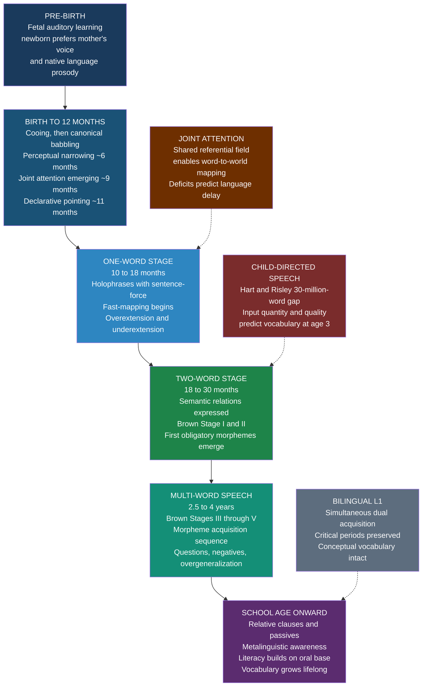

# Language Acquisition — First Language Learning

> [!abstract] TL;DR
> First language acquisition is the developmental process by which infants and young children build the full phonological, lexical, and grammatical system of their native language by age 5 — from in-utero prosodic sensitivity, through babbling, holophrases, and Roger Brown's ordered morpheme stages, to complex embedded syntax — with input quality (the Hart & Risley "30 million word gap") predicting outcomes for years afterward.

---

## Intuition

**Analogy:** Imagine a river that begins as a trickle of snowmelt. At first it can only carry tiny pebbles, so it smooths a narrow channel through rock. As the flow grows, it carves broader channels, transports larger stones, and erodes new branches. By the time it reaches the valley, the river has shaped an intricate delta — not by following a blueprint, but by the cumulative physical logic of water, gravity, and sediment interacting over time. Nobody ever "taught" the river to branch; the structure emerged from the dynamics.

First language acquisition works this way. The newborn brain begins with remarkable pre-wiring — a phoneme-sensitive auditory cortex, a capacity for statistical learning, and a drive toward joint attention — but the specific architecture of the language emerges from billions of interactions between that brain and the surrounding speech community. The river does not arrive pre-carved; the snowmelt does. What you hear shapes what you hear next, and the child who at six months discriminates every phoneme on earth has, by twelve months, committed their neural circuitry to the particular soundscape of home.

---

## How It Works



---

## Key Concepts

### Secondary Level

**The pre-linguistic foundation**

Language acquisition does not begin at the first word. It begins before birth. The human fetus can hear from about 25 weeks of gestation, and the auditory system is actively learning during the final trimester. Newborns tested within hours of birth prefer their mother's voice over a stranger's, prefer the prosodic contour of their native language over a foreign language with different rhythm, and even show preference for stories read aloud repeatedly during the final weeks of pregnancy. This prenatal tuning is not to specific words — the womb filters out segmental detail — but to the rhythmic and intonational envelope of the language, the music before the words.

In the first six months, infants are universal phoneme detectors: they can discriminate any phoneme contrast that exists in any human language, including clicks and tones they have never heard. This is not learning — it is the default state of an untuned auditory system. By six to eight months, **perceptual narrowing** begins: neural circuits commit to the phoneme categories of the native language, sharpening within-language discrimination while the ability to hear cross-language contrasts declines. A Japanese infant at six months distinguishes English /r/ from /l/ perfectly; by twelve months, the same infant shows the same difficulty as Japanese adults. This narrowing is not a loss of ability — it is the brain optimizing for the specific phonological system it will spend a lifetime processing.

Two further milestones between nine and twelve months set the stage for word learning:

- **Joint attention**: the infant learns to follow the gaze and pointing gesture of a caregiver to attend to a shared object. When the caregiver names the shared object, the word-to-world pairing becomes unambiguous. Deficits in joint attention — common in autism spectrum conditions — reliably predict delayed word learning, which confirms that joint attention is not a nice-to-have but a mechanistic prerequisite.
- **Declarative pointing**: the infant begins to point at objects to share interest ("look at that!"), distinct from imperative pointing ("give me that"). Declarative pointing is specific to humans — chimpanzees do not do it — and its emergence predicts vocabulary growth over the next year.

**The one-word stage (holophrases): 10 to 18 months**

The first words, emerging around ten to fourteen months, are not single units of meaning — they are **holophrases**: single-word utterances that carry sentence-force. When a toddler says "Milk!" while reaching toward the refrigerator, the word means something like "I want milk" or "Look, there's the milk" depending on context, gesture, and intonation. The child is packaging a full communicative intention into the only linguistic container currently available.

Word learning at this stage shows two characteristic errors that reveal the child is actively constructing word meanings rather than passively storing labels:

- **Overextension**: a word is used for a broader category than the adult form. The classic case is "dog" used for all four-legged animals — the child has grasped the core of the meaning but drawn the category boundary too wide. Overextension is evidence of category formation; a pure imitator would only use "dog" for dogs they have seen labeled.
- **Underextension**: a word is used for a narrower category than the adult form. "Cup" may apply only to the child's own blue cup, not to the green cup in the kitchen. The child has assigned the word to a specific instance rather than the general concept.

Between these two errors, the child is engaged in **semantic bootstrapping** (Pinker 1984): using the meaning structure of early vocabulary — objects are nouns, actions are verbs, properties are adjectives — to develop initial hypotheses about syntactic categories, before any syntactic input has been processed.

Vocabulary grows slowly through the one-word stage (perhaps ten words per month), then accelerates dramatically. The **vocabulary explosion** (also called the naming explosion) typically arrives between sixteen and twenty-four months, when many children begin adding roughly nine new words per day. The mechanism is **fast-mapping**: after only one or two exposures to a new word in a communicative context, a child forms a usable representation of the word's meaning. Full consolidation takes many more exposures, but the initial mapping is remarkably efficient.

**The two-word stage and Brown's morpheme stages (18 to 36 months)**

When two-word utterances appear — typically around eighteen months — the child is not just adding words; they are expressing **semantic relations**: agent-action ("Daddy go"), action-object ("eat cookie"), possessor-possessed ("Daddy hat"), location ("cup table"), recurrence ("more juice"), disappearance ("allgone milk"). These relations appear in the same developmental order across languages with radically different word orders, suggesting that semantic structure — the underlying conceptual relationship — drives early sentence-building rather than the surface syntax of the input language.

Roger Brown's landmark study (1973), following three children — Adam, Eve, and Sarah — longitudinally through their early language development, yielded two lasting contributions:

First, **MLU as the primary developmental index**. Mean Length of Utterance, measured in morphemes (not words), turns out to be a better predictor of syntactic complexity than age alone. Brown defined five stages:

| Brown's Stage | MLU Range | Approximate Age | Key developments |
|---|---|---|---|
| Stage I | 1.0 – 2.0 | 12 – 26 months | Semantic relations; no grammatical morphemes |
| Stage II | 2.0 – 2.5 | 27 – 30 months | First morphemes; noun and verb phrases |
| Stage III | 2.5 – 3.0 | 31 – 34 months | Question and negative formation begins |
| Stage IV | 3.0 – 3.75 | 35 – 40 months | Embedding; complex noun phrases |
| Stage V | 3.75 – 4.5 | 41 – 46 months | Sentence coordination and conjunction |

Second, Brown documented the **acquisition order of his 14 obligatory morphemes** — small grammatical markers (inflections and function words) that English requires in specific contexts. Strikingly, the order in which children acquire these morphemes is highly consistent across children and across social classes, even though it does not reflect order of frequency in adult input. The first morphemes to be acquired reliably are the present progressive (-ing), the locatives in and on, and the plural (-s). The last are the contractible copula and the contractible auxiliary. The regular past tense (-ed) comes much later than the irregular past, even though irregular forms are less systematic. This non-frequency-based ordering pattern is one of the core pieces of evidence for biological constraints on morphological acquisition.

---

### Undergraduate Level

**Brown's 14 morphemes: mechanism and explanation**

Why do children acquire morphemes in a fixed order unrelated to input frequency? Three factors interact:

1. **Semantic complexity**: morphemes that encode simpler, more concrete meanings come first. The progressive (-ing) encodes an activity in progress, directly perceivable. The third-person singular (-s) is a redundant agreement marker that carries no independent meaning — it is acquired last.

2. **Morphological complexity**: morphemes with fewer allomorphs and simpler phonological alternation come earlier. The regular plural has three allomorphs (/s/, /z/, /ɪz/) but a systematic rule; the irregular plural requires lexical storage of each form. Paradoxically, irregulars appear first in obligatory contexts because children store "feet" and "went" as unanalyzed whole-word forms before they abstract the regular rule — and then briefly produce "goed" and "foots" as rule-learning overgeneralizes.

3. **Syntactic complexity**: morphemes that mark syntactic agreement across clause constituents require tracking structural relationships at a distance. Third-person singular agreement ("she runs") demands monitoring the number of the subject and expressing it on the verb — a cross-constituent dependency that Stage I children are not yet computing.

The **U-shaped learning curve** is the developmental fingerprint of this process. A child who produces "went" correctly at eighteen months is not doing what you think: she is storing an unanalyzed form. When she later starts saying "goed," she has actually made progress — she has extracted the past-tense rule and is applying it productively, including erroneously to irregulars. The subsequent return to "went" reflects the consolidation of a memorized exception list that co-exists with a productive rule. This three-phase trajectory — correct (via rote) → incorrect (via overgeneralization) → correct (via rule plus exceptions) — cannot be produced by a simple imitation model and is the clearest behavioural evidence that children are building rule systems, not just memorizing forms.

**Later syntactic development: the conservative learner**

From roughly three years onward, children begin producing complex sentences: coordinate clauses, embedded complement clauses ("I know that she went"), and eventually relative clauses ("the dog that bit me") and passives ("the cookie was eaten"). These structures are acquired in a consistent sequence across languages:

- **Questions**: yes/no questions and basic wh-questions emerge around two to three years; embedded questions ("I wonder where he went") are later.
- **Negation**: early negation is external ("No eat!"); internal negation ("I don't want it") comes after the MLU growth of Stage II.
- **Passives**: long passives ("The dog was bitten by the cat") are among the last structures acquired and may not be fully automatic until age six or seven. Short passives with stative verbs ("The window is broken") come earlier because they are semantically closer to adjectives.
- **Relative clauses**: subject relatives ("the man who came") precede object relatives ("the man who I saw"), consistent with cross-linguistic frequency and processing complexity.

Michael Tomasello's research on the **conservative learner** revealed something unexpected: contrary to predictions from strong nativist theories, children do not generalize constructions freely once they have acquired one instance. A child who uses the transitive construction productively with "push" does not automatically extend the argument structure to a new verb introduced in an intransitive context. Children use specific known verbs in specific known frames for months before they generalize across verbs. This verb-by-verb conservatism persists until approximately age three to four and is one of the central empirical arguments for the usage-based, construction-grammar alternative to nativism.

School-age children continue to develop syntactic sophistication that is invisible in informal conversation: comprehension and production of center-embedded relative clauses, passives, and complex nominal constructions reach adult levels only around ages seven to nine. Adolescents continue to refine discourse coherence, rhetorical structure, and the dense nominal style of written language. **Vocabulary growth never stops**: adults with active reading habits add one to two new words per day throughout their lives, and the total productive lexicon continues expanding into the fifth decade.

**Input quality and the Hart-Risley finding**

The developmental trajectory described above depends critically on the quantity and quality of child-directed speech. Betty Hart and Todd Risley's landmark longitudinal study (1995), following forty-two American families from infancy to age three, found:

- **A 30-million-word gap**: by age three, children in higher-SES families had heard approximately thirty million more words than children in lower-SES families. Children in professional families heard about 2,153 words per hour; children in welfare families heard about 616 words per hour.
- **Quality differences beyond quantity**: higher-SES families used more diverse vocabulary, more questions, more expansions (repeating the child's utterance with corrections and additions), and more praise. Lower-SES families used more imperatives and prohibitions.
- **Predictive validity**: the vocabulary size at age three was the single strongest predictor of language test scores at age nine and reading comprehension at age ten.

Subsequent work has nuanced but largely confirmed Hart and Risley's core finding. Television does not substitute for live interaction: children do not learn vocabulary from screens at the same rate as from face-to-face interaction, even when the screen content is child-directed. The mechanism appears to involve contingent responsiveness — a caregiver who follows the child's attentional focus and names what the child is attending to creates a direct link between word and referent that a non-interactive screen cannot replicate. Reading aloud, however, is highly effective: shared book reading exposes children to vocabulary that rarely appears in everyday speech and is among the most robust predictors of vocabulary breadth at school entry.

**Bilingual first language acquisition**

Simultaneous bilingual acquisition — growing up with two languages from birth or before age three — is the norm for a large fraction of the world's children. The key findings challenge several popular misconceptions:

The **independence hypothesis** (Meisel 1989; Genesee 1989): contrary to an earlier assumption that bilingual children start with a single fused system and differentiate, longitudinal evidence shows that bilinguals develop two separate grammatical systems from the earliest stages. Code-mixing (using elements from both languages in a single utterance) is a normal pragmatic strategy, not evidence of confusion; it follows systematic grammatical constraints and occurs predominantly in contexts where the discourse norms of the community allow it.

Critical periods for each language are preserved: a child acquiring both English and Mandarin simultaneously retains a native-speaker phonological advantage in both languages, which a sequential learner of either language after age seven cannot fully achieve. The critical period does not have a fixed total capacity that must be divided between two languages.

On vocabulary: bilingual children often have smaller vocabularies in each language individually, measured against monolingual norms. This is an artefact of measurement. Their **total conceptual vocabulary** — the set of concepts for which they have at least one label in any language — is equivalent to or larger than monolinguals. Using monolingual norms to assess bilingual children inflates diagnoses of language delay.

Bilingual acquisition also generates an **executive function advantage**: managing two languages simultaneously — selecting the appropriate one, suppressing the other in appropriate contexts, switching between them — provides continuous exercise of inhibitory control and attentional switching. This advantage is well-documented in childhood and appears to delay onset of dementia symptoms by approximately four years in late life, even after controlling for education and socioeconomic status.

---

### Graduate Level

**Phonological development: the neural commitment account**

Patricia Kuhl's **neural commitment theory** (2004) provides the most detailed mechanistic account of perceptual narrowing. When an infant hears speech, phoneme categories are formed by statistical clustering of acoustic events: sounds that are acoustically similar to a high-frequency prototype form a category around that prototype. The prototype acts as a perceptual magnet, pulling nearby sounds toward it and compressing within-category variability. By ten to twelve months, the neural architecture has committed to the native-language category structure in a way that is metabolically efficient but costly to reorganize.

The critical experiment: six- to eight-month-old American and Taiwanese infants were exposed to Mandarin speakers live (interactive sessions), via video-only, or via audio-only. When tested at ten to twelve months on Mandarin phoneme contrasts, only the live-interaction group showed adult-level sensitivity to Mandarin phonemes — video and audio alone were ineffective. The social contingency of live interaction is necessary for phonological learning during this sensitive period. This finding has direct implications for early second-language instruction and for the design of educational technology.

**Semantic bootstrapping, syntactic bootstrapping, and their interaction**

Two bootstrapping hypotheses address the chicken-and-egg problem of how children break into syntax when they know only words:

**Semantic bootstrapping** (Pinker 1984): children use meaning to assign initial syntactic categories. Concrete object words are hypothesized to be nouns; action words are verbs; property words are adjectives. These initial category assignments let the child begin building phrase structure by combining semantically categorized items. The hypothesis explains how children get started; it requires that semantic categories are accessible before syntactic ones.

**Syntactic bootstrapping** (Gleitman 1990): once children have acquired some syntactic frames, the frames themselves provide evidence about word meaning. A new verb appearing in a transitive frame ("She's pilking the cup") licenses the inference that the verb describes a causal action. A verb in an intransitive frame ("She's pilking") licenses an intransitive activity. The syntactic position of a new noun (before vs. after the verb, with vs. without a determiner) constrains hypotheses about its meaning. Syntactic bootstrapping is particularly important for learning verbs, whose meanings cannot be read off from perception as easily as object meanings can.

The two mechanisms are not alternatives; they operate simultaneously. Semantic bootstrapping gets the child into the syntax; syntactic bootstrapping then accelerates vocabulary learning by providing sentence-level evidence about word meaning that pure observation of the world cannot supply.

**Computational modelling: the MOSAIC and item-based approaches**

The conservative-learner phenomenon has motivated several computational models of acquisition that do not rely on innate syntactic principles. The **MOSAIC model** (Freudenthal, Pine and Gobet 2007) acquires language by building up utterance-final phrases from child-directed speech and generates early multi-word productions by probabilistic completion of familiar frames. The model predicts the item-specific nature of early constructions and the gradual emergence of productivity across verb-by-verb patterns in English and Dutch, without any pre-specified phrase structure rules.

**Bayesian models** of morphological acquisition (Yang 2002; Albright and Hayes 2003) formalize the tension between rule learning and exception storage. Yang's **tolerance principle** — a child will generalize a rule over a set of N items if the number of exceptions does not exceed N / ln(N) — predicts which morphological patterns will be productive and which will be lexically stored. The tolerance principle correctly predicts that English past tense is treated as a productive rule (because regular verbs vastly outnumber irregulars, which fall below the tolerance threshold) while highly irregular verbs are stored individually, without any rule-vs.-exception dichotomy needing to be pre-specified.

**Epigenetic and neurobiological constraints**

The acquisition sequence is shaped not only by input statistics and conceptual complexity but by the maturational schedule of neural systems. The left inferior frontal gyrus (Broca's area, BA44/45) undergoes a protracted developmental trajectory: synaptic pruning in the prefrontal cortex continues into early adulthood. The late acquisition of complex syntax (passives, center-embedded relatives) tracks the late maturation of the neural systems needed to maintain and manipulate structural representations in working memory. The early acquisition of phonology and simple morphology tracks the earlier maturation of temporal lobe auditory regions and the basal ganglia procedural learning system.

The **FOXP2 gene**, whose mutations produce a specific disorder of speech, language, and oro-facial motor control (the KE family), provides the clearest molecular window into language biology. FOXP2 is expressed in Broca's homologue and in striatum; it regulates the expression of downstream genes involved in neural circuitry formation. It has been under accelerated selection in the human lineage compared to chimpanzees, with two amino acid substitutions in the protein-coding region. Crucially, FOXP2 is not a "language gene" — it is a transcription factor with broad developmental roles. But its selective expression in language-relevant circuits, and the selective nature of the language disorder produced by its mutation (specific to sequencing and grammatical encoding, not general intelligence), make it the best current molecular marker for a biological predisposition to language.

The **sensitive period** for L1 acquisition is not a single window but a cascade of overlapping windows with different closing times:

| Subsystem | Sensitive period closes | Evidence |
|---|---|---|
| Phonology (production) | ~7 years | Foreign accent in late L1 learners |
| Phonology (perception) | ~10-12 months for L1; harder past ~7 for L2 | Kuhl perceptual narrowing; cochlear implant timing |
| Morphology | ~puberty | Johnson & Newport (1989); Genie case |
| Syntax | ~puberty, with gradient effects | Johnson & Newport; late ASL learners |
| Discourse pragmatics | Later adolescence | Theory of mind and discourse inference continue developing |
| Vocabulary | Never closes | Adults add words throughout the lifespan |

---

## Python Demo

```python
import numpy as np
import matplotlib.pyplot as plt

# ─────────────────────────────────────────────────────────────────────────────
# ROGER BROWN'S MORPHEME ACQUISITION ORDER — SIMULATION OF 20 CHILDREN
#
# Brown (1973), A First Language: The Early Stages
#
# Setup:
#   - 6 of Brown's 14 obligatory morphemes, with characteristic mean acquisition
#     MLU (the Mean Length of Utterance at which the morpheme reaches the
#     90% correct-in-obligatory-contexts criterion)
#   - 20 simulated children, each with a slightly different developmental pace
#     (multiplicative factor on all morpheme acquisition thresholds)
#   - For each child × morpheme, the acquisition MLU is drawn from
#     N(mean_acquisition_mlu * child_pace, sigma)
#   - Panel A: heatmap of proportion of children having acquired each morpheme
#     as a function of MLU stage — shows the acquisition S-curves in order
#   - Panel B: individual acquisition MLU dot plot, showing between-child
#     variability around the consistent ordering
#
# Uses: numpy and matplotlib only
# ─────────────────────────────────────────────────────────────────────────────

rng = np.random.default_rng(42)

# Six morphemes (subset of Brown's 14), in Brown's acquisition order
MORPHEMES = [
    "Present progressive\n(-ing)",
    "Plural\n(-s)",
    "Irregular past\n(went, broke)",
    "Possessive\n(-'s)",
    "Regular past\n(-ed)",
    "3rd-person\nsingular (-s)",
]

# Mean MLU at which each morpheme reaches 90% criterion
# Based on Brown (1973), replicated by de Villiers & de Villiers (1973)
MEAN_ACQ_MLU = np.array([2.0, 2.5, 2.5, 2.75, 3.25, 3.5])
ACQ_SIGMA = 0.28          # individual variation around each mean
N_CHILDREN = 20
MLU_STAGES = np.arange(1.0, 4.75, 0.25)

# Each child has a "developmental pace" that scales all acquisition thresholds
child_pace = rng.normal(1.0, 0.12, N_CHILDREN)
child_pace = np.clip(child_pace, 0.75, 1.35)

# Acquisition MLU for each child × morpheme
acq_mlu = np.zeros((N_CHILDREN, len(MORPHEMES)))
for m, mean in enumerate(MEAN_ACQ_MLU):
    base = rng.normal(mean, ACQ_SIGMA, N_CHILDREN)
    acq_mlu[:, m] = base * child_pace

acq_mlu = np.clip(acq_mlu, 1.2, 5.5)

# Heatmap: proportion of children who have acquired each morpheme by each MLU stage
prop_acquired = np.zeros((len(MORPHEMES), len(MLU_STAGES)))
for m in range(len(MORPHEMES)):
    for s, mlu in enumerate(MLU_STAGES):
        prop_acquired[m, s] = np.mean(acq_mlu[:, m] <= mlu)

# ─────────────────────────────────────────────────────────────────────────────
# Visualise
# ─────────────────────────────────────────────────────────────────────────────
fig, axes = plt.subplots(1, 2, figsize=(16, 6),
                         gridspec_kw={"width_ratios": [1.65, 1]})
fig.suptitle(
    "Roger Brown's Morpheme Acquisition Order — Simulation of 20 Children\n"
    "Brown (1973), A First Language: The Early Stages",
    fontsize=12, fontweight="bold",
)

# --- Panel A: Heatmap ---
ax = axes[0]
im = ax.imshow(
    prop_acquired,
    aspect="auto",
    cmap="YlOrRd",
    vmin=0.0,
    vmax=1.0,
    origin="upper",
    extent=[
        MLU_STAGES[0] - 0.125,
        MLU_STAGES[-1] + 0.125,
        len(MORPHEMES) - 0.5,
        -0.5,
    ],
)
ax.set_xticks(MLU_STAGES[::2])
ax.set_xticklabels([f"{m:.1f}" for m in MLU_STAGES[::2]], fontsize=9)
ax.set_yticks(range(len(MORPHEMES)))
ax.set_yticklabels(MORPHEMES, fontsize=9)
ax.set_xlabel("Mean Length of Utterance (morphemes)", fontsize=10)
ax.set_title(
    "Proportion of children having acquired each morpheme\nby each MLU stage",
    fontsize=10,
)
plt.colorbar(im, ax=ax, fraction=0.046, pad=0.04, label="Proportion acquired")

# Brown's stage boundary markers
for mlu_val, label in [
    (2.0, "Stage I"),
    (2.5, "Stage II"),
    (3.0, "Stage III"),
    (3.5, "Stage IV"),
]:
    ax.axvline(mlu_val, color="white", linestyle="--", linewidth=1.3, alpha=0.75)
    ax.text(mlu_val + 0.03, -0.45, label, fontsize=7.5, color="white", va="top")

# --- Panel B: Individual dot plot ---
COLORS = plt.cm.tab20(np.linspace(0, 1, N_CHILDREN))
ax = axes[1]

for child in range(N_CHILDREN):
    for m in range(len(MORPHEMES)):
        ax.scatter(
            acq_mlu[child, m],
            m,
            color=COLORS[child],
            alpha=0.60,
            s=32,
            zorder=3,
        )

for m, mean in enumerate(MEAN_ACQ_MLU):
    ax.axhline(m, color="lightgray", linewidth=0.5, zorder=1)
    ax.scatter(
        mean,
        m,
        color="black",
        s=110,
        marker="D",
        zorder=5,
        label="Brown mean" if m == 0 else "_",
    )

ax.set_xlim(1.2, 5.0)
ax.set_yticks(range(len(MORPHEMES)))
ax.set_yticklabels(MORPHEMES, fontsize=9)
ax.set_xlabel("MLU at acquisition (per child)", fontsize=10)
ax.set_title(
    f"Individual acquisition MLUs\n(N={N_CHILDREN}; diamonds = Brown means)",
    fontsize=10,
)
ax.legend(fontsize=9, loc="lower right")
ax.grid(axis="x", alpha=0.30)

plt.tight_layout()
plt.savefig("brown_morpheme_acquisition.png", dpi=150, bbox_inches="tight")
plt.show()

# ─────────────────────────────────────────────────────────────────────────────
# Summary table
# ─────────────────────────────────────────────────────────────────────────────
morpheme_short = [
    "Present progressive (-ing)",
    "Plural (-s)",
    "Irregular past",
    "Possessive (-'s)",
    "Regular past (-ed)",
    "3rd-person singular (-s)",
]

print("=== Brown's Morpheme Acquisition Order — Simulation Summary ===\n")
print(f"{'Morpheme':<32}  {'Brown Mean MLU':>14}  {'Sim Mean MLU':>12}  {'Sim SD':>7}")
print("-" * 70)
for i, m in enumerate(morpheme_short):
    sim_mean = acq_mlu[:, i].mean()
    sim_sd = acq_mlu[:, i].std()
    print(f"{m:<32}  {MEAN_ACQ_MLU[i]:>14.2f}  {sim_mean:>12.2f}  {sim_sd:>7.2f}")

print("\nKey result:")
print("  - Ordering is preserved across all simulated children despite variability.")
print("  - Present progressive (-ing) leads; 3rd-person singular (-s) is last.")
print("  - Regular past arrives AFTER irregular past (rote storage before rule).")
print("  - This order does not reflect input frequency — it reflects cognitive")
print("    complexity: semantic salience, morphological transparency, and the")
print("    processing demands of syntactic agreement marking.")
```

**What the simulation shows:**

- **Panel A (heatmap):** The acquisition S-curves are staggered in Brown's documented order. The earliest morpheme (present progressive) saturates at lower MLU values; the latest (3rd-person singular) does not reach 50% acquisition until MLU approaches 3.5. Between children there is variability in absolute MLU, but the ordering is preserved — a child who is a fast developer acquires all morphemes early, but in the same sequence as a slower developer.
- **Panel B (dot plot):** Individual children are scattered in a band around Brown's mean for each morpheme (diamonds). The clouds do not overlap between adjacent morphemes with different mean acquisition MLUs (e.g., the regular past at 3.25 is well separated from the irregular past at 2.5), confirming that the ordering is robust to individual variability.
- **The regular-before-irregular paradox:** The simulation places regular past (-ed) at MLU 3.25, later than irregular past at 2.5 — the U-shaped learning pattern. Children first store irregular forms as rote items (Stage I), then overgeneralize the regular rule to irregulars (producing "goed"), then learn exceptions. The ordering in the heatmap encodes the fact that the regular rule is abstracted late, not early.

---

## Real-World Applications

> **Example 1 — The Hart and Risley intervention implication.** The 30-million-word gap is not a gap in potential but in opportunity. Interventions that increase the quality and quantity of caregiver talk to infants — including LENA (Language ENvironment Analysis) devices that give families real-time feedback on their daily word counts, and video coaching programs that train caregivers in responsive commenting — produce measurable increases in child vocabulary at ages three and five. The Hart-Risley finding has generated entire policy frameworks (the "Talk With Me Baby" campaign in Georgia; universal pre-K advocacy in the US) premised on the acquisition research. The leverage point is early: the brain's sensitivity to word-count input is highest before age three, not at school entry, which is why early childhood intervention yields higher educational returns than equivalent spending at later ages (Heckman 2006).

> **Example 2 — Cochlear implant timing and the phonological sensitive period.** Congenitally deaf children who receive cochlear implants before eighteen months achieve speech perception and production outcomes that are, on average, indistinguishable from hearing peers by age five. Children implanted at three years can reach functional speech, but phonological accuracy and processing speed remain below hearing norms even after a decade of use. Children implanted after age seven rarely achieve phonological native competence in spoken language regardless of therapy intensity. The neural mechanism is cross-modal plasticity: auditory cortex not stimulated during the phonological sensitive period is colonized by tactile and visual processing. Once this reorganization consolidates, the implant must compete with an established competing architecture. Clinicians now recommend implantation as early as audiology permits, combined with full linguistic access in any modality — spoken language, sign language, or both — to prevent the cognitive costs of language deprivation during any part of the sensitive period.

> **Example 3 — Bilingual education and the independence hypothesis.** The legal and pedagogical debates about dual-language education (where children are instructed in two languages from Kindergarten) have been transformed by acquisition research. Early fears that dual-language immersion would confuse children or produce "semilingual" speakers who master neither language are empirically unsupported. Studies of Spanish-English dual-language programs in the US (Thomas and Collier 2002) found that dual-language graduates outperformed English-only controls on English reading and mathematics by Grade 5, with effects growing through Grade 11. The independence hypothesis explains why: two grammatical systems can develop fully in parallel, and the executive function advantage from managing both languages transfers to other domains of cognitive control and academic learning. The implication is that dual-language immersion is not a concession to bilingual children — it benefits all children enrolled, regardless of home language.

> **Example 4 — Language deprivation in deaf education and the critical period.** Deaf children born to hearing parents (90% of deaf children) are at risk for language deprivation if they are neither provided with accessible spoken language through early cochlear implantation nor with accessible signed language through early exposure to a natural sign language (ASL, BSL, etc.). Historically, oralist educational policies discouraged sign language on the theory that it would interfere with speech development. Acquisition research has consistently shown the opposite: the critical period for language is modality-independent — signed languages exploit the same neural architecture as spoken ones. Early signed language exposure does not inhibit speech development and provides a complete first language that the child can build on when learning spoken language as a second system. The absence of any accessible language during the critical period produces permanent deficits in grammar regardless of subsequent remediation.

---

## Common Pitfalls

- **Conflating L1 acquisition with language learning** — "Acquisition" (Krashen's distinction) is the unconscious, exposure-driven process children use to build their first language; "learning" refers to explicit, instructed study of a language. The mechanisms differ: L1 acquisition is not accelerated by explicit grammar instruction, and children do not benefit from metalinguistic feedback in the way adult classroom learners do. Mixing these categories produces confused claims about what "works" in language education.

- **Treating overextension as an error** — When a two-year-old says "doggie" for a horse, this is not a mistake to be corrected; it is evidence of active category formation. The child has correctly identified that "doggie" refers to a class of animals; the class boundary is temporarily miscalibrated. Overcorrecting or constantly relabeling may disrupt the child's hypothesis-testing process. The error self-corrects as more category exemplars accumulate.

- **Interpreting U-shaped learning as developmental regression** — Parents and clinicians sometimes worry when a child who correctly said "went" starts saying "goed." This is a sign of progress: the child has extracted the past-tense rule and is applying it productively. The earlier "went" was stored as an unanalyzed form; the current "goed" is generated by a rule. The final correct "went" co-exists with the rule, stored as an exception. Treating the middle phase as a problem to be fixed misunderstands its developmental significance.

- **Using monolingual norms to assess bilingual children** — Vocabulary assessment tools standardized on monolingual populations systematically underestimate bilingual children's conceptual vocabulary and over-diagnose language delay. The appropriate assessment for a bilingual child measures combined vocabulary across both languages, uses norms from bilingual populations, and assesses both languages separately with instruments designed for each. Using a monolingual English vocabulary test on a child who speaks Spanish at home and English at school inflates the false-positive rate for language disorder by a factor of three to four in some populations.

- **Assuming the critical period is an absolute cutoff** — The sensitive period for L1 acquisition sets a ceiling on ease and ultimate attainment; it does not prevent acquisition entirely. Adults who begin acquiring a first language after childhood (late signers, late oral language learners after cochlear implantation) achieve substantial communicative competence, including large vocabularies and functional pragmatics. What they do not typically achieve is native-like phonological accuracy or fully automatic grammatical processing. The window is one of efficiency and ultimate attainment, not a binary switch.

- **Attributing the word gap purely to vocabulary size** — Hart and Risley's finding is sometimes reduced to "high-SES children hear more words, so they know more words." The quality dimension is equally important: the ratio of encouraging to discouraging talk, the frequency of open-ended questions, the vocabulary diversity (type-token ratio), and the number of conversational turns all independently predict outcomes. A simple word-count intervention without attention to responsiveness, diversity, and interactional warmth fails to capture the full mechanism.

---

## Related Concepts

- [[Universal_Grammar_and_Language_Acquisition]] — The nativist-empiricist debate about the mechanism of acquisition; the poverty of the stimulus; the critical period hypothesis and Lenneberg's original formulation. The current note covers the developmental stages and empirical milestones that the nativist and usage-based theories are trying to explain.
- [[Morphology_and_Word_Formation]] — The morphological systems — inflectional and derivational — whose acquisition is tracked by Brown's 14 morphemes; the allomorphic alternations (plural: /s/, /z/, /ɪz/) that partly explain the acquisition order.
- [[Phonology]] — The abstract phoneme systems children are acquiring and committing to during perceptual narrowing; phonological rules that interact with the morpheme acquisition sequence.
- [[Phonetics]] — The acoustic and articulatory level at which canonical babbling and perceptual narrowing operate; formant structure of vowels and the acoustic basis of phoneme discrimination.
- [[Dependency_and_Construction_Grammar]] — The construction grammar framework (Goldberg; Tomasello) that provides the usage-based alternative to parameter-setting accounts; explains the conservative learner phenomenon via item-specific construction learning before abstract generalization.
- [[Language_Development]] — Developmental psychology's account of the same milestones from a cognitive-developmental perspective; Kuhl's neural commitment model; the critical period evidence in clinical and educational contexts; bilingualism and executive function.
- [[Language_Socialization_and_Acquisition]] — Anthropological perspective on how acquisition is embedded in cultural practice; the Kaluli evidence that child-directed speech is not universal; Vygotsky's zone of proximal development as a social scaffolding account; language socialization as simultaneous grammatical and cultural transmission.
- [[Language_and_the_Brain]] — The neural substrate of the language faculty; Broca's area and syntactic processing; the maturational schedule of perisylvian cortex and its relationship to the closing of the sensitive period; FOXP2 and the genetics of language.

---

## Review Questions

### Secondary

1. A child who has been saying "went" for months suddenly starts saying "goed." Her parents are alarmed. Explain, without jargon, what is actually happening in her grammar, why it is a sign of progress rather than regression, and what the child will eventually do to correct it. What would a child who was only imitating adults never do?

2. Describe what "perceptual narrowing" means and when it occurs. Why does a six-month-old Japanese infant hear the difference between English /r/ and /l/, but a Japanese adult typically cannot? What does this tell us about the relationship between early experience and later language ability?

3. Hart and Risley found a "30 million word gap" between children in higher- and lower-income families by age three. Name three features of child-directed speech (beyond word count alone) that their study identified, and explain why early childhood might be a more important window for intervention than the school years.

### Undergraduate

1. Compare the one-word stage and the two-word stage in terms of what the child knows and what they cannot yet express. Use the concepts of holophrase, overextension, semantic relation, and telegraphic speech. What does the semantic content of two-word utterances (agent-action, possessor-possessed, location) suggest about the relationship between cognitive development and grammatical development?

2. Roger Brown documented that English-acquiring children acquire the present progressive (-ing) much earlier than the third-person singular (-s) despite the fact that third-person singular -s is extremely frequent in adult English. Identify three factors — semantic complexity, morphological transparency, and syntactic complexity — that explain this frequency-dissociated acquisition order, and illustrate each with a specific contrast between the two morphemes.

3. A school district is considering whether to place bilingual kindergarteners (Spanish home language, English instructional medium) in an English-only immersion programme or a dual-language programme in which both languages are used for instruction. Using the independence hypothesis, the concept of conceptual vocabulary, and the executive function advantage evidence, construct an argument for one policy over the other. What assessment pitfall should evaluators avoid when measuring outcomes?

### Graduate

1. Tomasello's conservative-learner data shows that children use specific verbs in specific argument-structure frames for months before generalizing across verbs. Nativists argue this reflects a performance limitation (working memory, input frequency) rather than a competence limitation (absence of abstract argument-structure constructions). Design an experiment that could distinguish these two accounts. What production or comprehension paradigm would reveal whether the child has an abstract transitive construction, and what result would confirm or disconfirm each position?

2. The neural commitment account (Kuhl 2004) holds that live interactive social contingency is necessary for phonological learning during the sensitive period — video and audio input alone do not produce the same perceptual reorganization. Evaluate this finding in light of the documented effectiveness of high-quality educational media for vocabulary learning in older children (Sesame Street; DeLoache et al. 2010 on video deficit). What developmental mechanism accounts for the transition from social-contingency-dependent phonological learning in infancy to effective non-contingent vocabulary learning in toddlerhood and beyond? What implications does this have for designing language-rich technology for under-resourced families?

3. Yang's tolerance principle predicts that a morphological pattern will be extended productively if the number of exceptions does not exceed N/ln(N), where N is the total number of items in the set. Apply this principle to English past tense: roughly 180 irregular verbs exist against approximately 4,200 regular verbs. Does the tolerance principle predict the regular -ed rule should be productive? Now consider a child in Stage II with a vocabulary of 50 verbs, perhaps 12 of which are irregular. Does the principle predict the same outcome at this smaller vocabulary size? What does the answer imply about the developmental trajectory of rule learning, and how does it relate to the U-shaped learning curve?

---

## Sources

- [Brown, R. (1973). *A First Language: The Early Stages*. Harvard University Press](https://www.hup.harvard.edu/catalog.php?isbn=9780674305014)
- [Hart, B. & Risley, T.R. (1995). *Meaningful Differences in the Everyday Experience of Young American Children*. Brookes Publishing](https://www.goodreads.com/book/show/186843.Meaningful_Differences)
- [Kuhl, P.K. (2004). Early language acquisition: cracking the speech code. *Nature Reviews Neuroscience*, 5(11), 831–843](https://doi.org/10.1038/nrn1533)
- [Pinker, S. (1984). *Language Learnability and Language Development*. Harvard University Press](https://www.hup.harvard.edu/catalog.php?isbn=9780674509412)
- [Pinker, S. (1994). *The Language Instinct*. William Morrow](https://www.goodreads.com/book/show/5765.The_Language_Instinct)
- [Tomasello, M. (2003). *Constructing a Language: A Usage-Based Theory of Language Acquisition*. Harvard University Press](https://www.hup.harvard.edu/catalog.php?isbn=9780674017641)
- [Gleitman, L.R. (1990). The structural sources of verb meanings. *Language Acquisition*, 1(1), 3–55](https://doi.org/10.1207/s15327817la0101_2)
- [de Villiers, J.G. & de Villiers, P.A. (1973). A cross-sectional study of the acquisition of grammatical morphemes in child speech. *Journal of Psycholinguistic Research*, 2(3), 267–278](https://doi.org/10.1007/BF01067106)
- [Yang, C. (2002). *Knowledge and Learning in Natural Language*. Oxford University Press](https://global.oup.com/academic/product/knowledge-and-learning-in-natural-language-9780199250035)
- [Meisel, J.M. (1989). Early differentiation of languages in bilingual children. In Hyltenstam, K. & Obler, L.K. (eds.), *Bilingualism Across the Lifespan*. Cambridge University Press](https://www.cambridge.org/core/books/bilingualism-across-the-lifespan/A00F58A5E54F2E7BA04B54FF23E73C00)
- [Genesee, F. (1989). Early bilingual development: one language or two? *Journal of Child Language*, 16(1), 161–179](https://doi.org/10.1017/S0305000900013490)
- [Thomas, W.P. & Collier, V.P. (2002). *A National Study of School Effectiveness for Language Minority Students' Long-Term Academic Achievement*. CREDE, UC Santa Cruz](https://escholarship.org/uc/item/65j213pt)
- [Heckman, J.J. (2006). Skill formation and the economics of investing in disadvantaged children. *Science*, 312(5782), 1900–1902](https://doi.org/10.1126/science.1128898)
- [Lenneberg, E.H. (1967). *Biological Foundations of Language*. Wiley](https://www.goodreads.com/book/show/186812.Biological_Foundations_of_Language)
- [Freudenthal, D., Pine, J.M. & Gobet, F. (2007). Understanding the developmental dynamics of subject omission: the role of processing limitations in learning. *Journal of Child Language*, 34(1), 83–110](https://doi.org/10.1017/S0305000906007896)
- [Goldberg, A.E. (1995). *Constructions: A Construction Grammar Approach to Argument Structure*. University of Chicago Press](https://press.uchicago.edu/ucp/books/book/chicago/C/bo3613637.html)
- [Vargha-Khadem, F. et al. (1995). Praxic and nonverbal cognitive deficits in a large family with a genetically transmitted speech and language disorder. *PNAS*, 92(3), 930–933](https://doi.org/10.1073/pnas.92.3.930)

---

#Linguistics #AppliedLinguistics #LanguageAcquisition #L1Acquisition #ChildLanguage #Developmental
