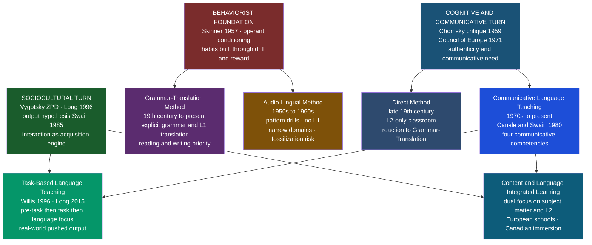

# Language Teaching Methodologies

> [!abstract] TL;DR
> Language teaching methodologies are theoretically-grounded frameworks that determine how L2 classrooms are organised, which skills are prioritised, and what counts as success — from nineteenth-century Grammar-Translation through Communicative Language Teaching to Task-Based approaches, each methodology encodes a different answer to the foundational question of what it means to "know" a language.

---

## Intuition

**Analogy:** Consider three coaches teaching someone to drive. The first hands them a mechanics manual, has them diagram the gearbox, and translate excerpts from French highway law — after a year they understand vehicles beautifully but cannot reverse into a parking space. The second straps them into a simulator and runs the same left-turn sequence six hundred times until the motion is reflexive — they nail that manoeuvre but freeze when a bicycle appears from an unexpected angle. The third puts them in real urban traffic on day one, intervening only when an error would cause an accident and debriefing on patterns afterward — terrifying at first, but after a year they can drive anywhere.

These three coaches are Grammar-Translation, the Audio-Lingual Method, and Communicative Language Teaching. Each reflects a different theory of what "knowing a language" means: declarative knowledge of the code, automatic perceptual-motor habits, or communicative competence in authentic situations. Every methodological debate in language pedagogy since the mid-nineteenth century is, at its core, a disagreement about that question — complicated by national examination systems, teacher training constraints, and the gap between what SLA research demonstrates in controlled studies and what scales to a classroom of thirty students.

---

## How It Works

The history of language pedagogy is often called the **method wars** — a sequence of dominant frameworks, each claiming to supersede its predecessors on theoretical grounds, only to be supplanted by the next. The deeper pattern is a recurring oscillation between two poles: **form-focused instruction** (teach the linguistic system explicitly) and **meaning-focused instruction** (teach language through genuine use). Modern methodologies attempt to integrate both poles rather than choose between them.



---

## Key Concepts

### Secondary Level

**The Method Wars: a brief history**

Until the mid-nineteenth century, European language education had a single dominant model: the **Grammar-Translation Method (GTM)**. This was not a designed pedagogy but a transplant of classical Latin and Greek study onto modern languages. Students memorised paradigms, translated literary extracts, and learned vocabulary from bilingual word lists. Speaking was incidental; reading and writing the target language accurately was the goal. GTM is still widely practised today — particularly in exam-focused systems where the language assessment tests reading comprehension and grammar, not oral fluency.

The first major reaction came from practical need. Rapid expansion of trade and travel in the late nineteenth century created demand for people who could actually *converse* in a foreign language — something GTM graduates notoriously could not do. The **Direct Method** (commercialised by Berlitz from around 1880) responded by banning the mother tongue entirely from the classroom. All instruction — explanations, examples, feedback — was given in the target language. Grammar was induced from examples rather than explained. The Berlitz chain made this approach famous and profitable, but it required highly fluent teachers and worked best in expensive small-group settings. Mass public education needed something more scalable.

During the 1940s–1960s, the **Audio-Lingual Method (ALM)** rose to dominance, backed by both wartime urgency (the US Army Specialised Training Program needed functional speakers rapidly) and the academic legitimacy of B.F. Skinner's behaviourist psychology. Skinner's argument in *Verbal Behavior* (1957): language is verbal behaviour, and verbal behaviour is acquired like any other behaviour — through stimulus-response-reinforcement chains. ALM implemented this as pattern drills: the teacher provides a stimulus ("Repeat: *The book is on the table.*"), students respond in chorus, errors are immediately corrected, correct responses are reinforced. Variations and substitutions extended the repertoire: "Now substitute *pen* for *book*."

The behaviourist foundation collapsed almost immediately when Chomsky's 1959 review of *Verbal Behavior* demonstrated that language cannot be reduced to conditioned associations — the productivity and systematicity of grammar requires a generative mental grammar, not a repertoire of trained responses. Behaviourism was intellectually discredited in linguistics by 1965, but ALM continued in textbooks and classrooms for another two decades by institutional inertia.

The vacuum was filled in the 1970s by **Communicative Language Teaching (CLT)**, driven by the Council of Europe's Threshold Level project (van Ek 1975), which asked a novel question: what does a learner need to be able to *do* with language to function in everyday European life, rather than what grammar rules do they need to know? This shift from linguistic competence to communicative competence transformed pedagogy. CLT prioritised authentic communication, real-world tasks, tolerance of error during fluency activities, and the use of genuine materials — newspapers, menus, recorded conversations — over textbook dialogues.

**Comparison of historical methods**

| Method | Era | Theoretical basis | Skills prioritised | Error treatment | L1 in classroom |
|--------|-----|------------------|-------------------|-----------------|-----------------|
| Grammar-Translation | 19th c. – present | Classicist tradition | Reading, writing | Explicit correction of all errors | Translation central |
| Direct Method | 1880s – 1940s | Naturalistic acquisition | Speaking, listening | Implicit, via model repetition | Banned |
| Audio-Lingual Method | 1940s – 1970s | Behaviourism (Skinner) | Speaking, listening | Immediate and explicit | Banned |
| Communicative Language Teaching | 1970s – present | Communicative competence | All four, balanced | Tolerated during fluency activities | Principled use permitted |
| Task-Based Language Teaching | 1990s – present | Interaction and output | Speaking, listening; literacy via tasks | Form-focused instruction after tasks | Task-appropriate |

---

### Undergraduate Level

**Communicative Language Teaching: the four competencies**

CLT's theoretical backbone is **Canale and Swain's** (1980) model of communicative competence, which broke down "knowing a language" into four interacting components:

1. **Grammatical competence** — mastery of the linguistic code: phonology, vocabulary, morphology, syntax. This is what GTM and ALM targeted almost exclusively.

2. **Sociolinguistic competence** — knowledge of social rules: when and how to use language appropriately for the social context. Knowing that "Could you pass the salt?" is a request, not a question about ability; knowing that addressing a job interviewer by first name signals warmth in one culture and disrespect in another.

3. **Discourse competence** — ability to produce coherent, cohesive stretches of language above the sentence level: structuring a narrative, following turn-taking conventions in conversation, writing a paragraph with an appropriate topic sentence and support structure.

4. **Strategic competence** — ability to handle communication breakdowns: paraphrasing ("It's like a... the thing you open wine with"), asking for clarification, using gesture or sketches to fill lexical gaps. This is the competence that allows a learner with limited grammar to remain a functional communicator under real conditions.

CLT classrooms operationalise these competencies through **authentic materials** (real texts, not textbook constructions), **communicative tasks** (information-gap activities, role plays, discussions where learners have something genuinely different to communicate to each other), and a different relationship with error. In ALM, every error is immediately corrected to prevent "bad habits." In CLT, errors are tolerated during fluency-oriented activities so that communication flows naturally, and addressed separately in subsequent form-focused work.

**CLT and cultural resistance.** CLT was developed primarily in British and European applied linguistics contexts and spread globally through ELT publishing and teacher training. Its implementation has been contested in many educational cultures — particularly in East Asian contexts (South Korea, Japan, China) where high-stakes examinations test reading comprehension and grammar, and where the traditional teacher role as knowledge-transmitter conflicts with the CLT expectation of teacher-as-facilitator. A learner whose university entrance examination rewards accurate grammar-translation will not benefit from a teacher who tolerates speaking errors. This is not simply conservatism: it is a rational response to assessment incentive structures that CLT advocates have sometimes failed to acknowledge.

**Task-Based Language Teaching (TBLT)**

TBLT takes CLT's communicative principles and makes the **task** — not the grammar point or language function — the organising unit of the syllabus. A task is defined by three properties (Long 2015): it has a real-world correlate (the kind of thing people actually do with language — order food, write a complaint letter, negotiate a salary, give directions); it has a defined non-linguistic outcome; and it requires genuine language use to complete.

The canonical **task cycle** (Willis 1996) has three phases:

1. **Pre-task**: The teacher introduces the topic and activates relevant vocabulary and background knowledge. Learners may briefly observe a model of someone completing the task. The goal is to reduce cognitive overload during the task itself so learners can focus on meaning.

2. **Task**: Learners complete the task in pairs or small groups with no teacher intervention. The focus is entirely on achieving the communicative outcome. Learners record or note their performance.

3. **Language focus** (Report and Analysis): Learners report back to the class; the teacher draws attention to specific language features that emerged — typically forms that were needed but not accurately controlled. This is where explicit grammar instruction occurs, motivated by real communicative need just experienced.

The pedagogical logic: the task creates a **felt need** for specific linguistic forms. Swain's **output hypothesis** (1985) provides the theoretical justification — being required to *produce* language, not just receive it, forces learners to notice gaps in their grammatical knowledge. Comprehensible input alone (Krashen's position) is insufficient because learners can understand messages while remaining vague about morphosyntactic precision. When they must produce, they hit a wall — they know what they want to say but cannot construct the precise form — and this "pushed output" drives acquisition.

**Form-focused instruction within TBLT.** A long-running debate concerns whether explicit grammar teaching belongs in a task-based syllabus. Long's (2015) **focus on form** (singular) refers to drawing learners' attention to formal features *incidentally*, *during* communicative activity, in response to a communicative problem — not as a pre-planned grammar lesson. This contrasts with **focus on forms** (plural) — pre-planned, decontextualised grammar lessons that organise the entire syllabus. Norris and Ortega's (2000) meta-analysis shows that explicit form-focused instruction produces measurable short-term gains on controlled tests, but durable acquisition in free communicative speech is harder to demonstrate. The consensus: some form-focused instruction is valuable — particularly for forms that are rare in input, difficult to notice, or carry high communicative load — but a syllabus organised entirely around grammar points cannot produce the communicative competence that authentic tasks demand.

**Content and Language Integrated Learning (CLIL)**

CLIL takes CLT's insistence on authentic communication and extends it to its logical extreme: instead of teaching a language *about* things, use the L2 as the medium for teaching *actual content*. History, geography, and science are taught in the target language; the language is the vehicle, not the destination. CLIL shares its basic logic with Canadian **French immersion** programs (Swain and Lapkin 1982), which began in Saint-Lambert, Quebec in 1965: anglophone children received all instruction in French and achieved near-native French proficiency by secondary school without sacrificing English or subject knowledge.

The attraction of CLIL is dual-focused efficiency: learners acquire language *and* content simultaneously. The evidence is broadly positive — CLIL learners in European schools consistently outperform matched comparison groups on L2 tests — but interpretation requires care. CLIL programs tend to select motivated learners and well-trained teachers; comparison groups typically receive inferior instruction. Teacher training is the central challenge: a history teacher with functional but non-native L2 proficiency must simultaneously manage subject content, language scaffolding, and classroom dynamics — a combination that most teacher education programmes do not address.

**The grammar instruction debate: explicit knowledge and the interface**

- **Explicit knowledge**: knowledge about language that is consciously accessible — the rule that English present perfect is formed with *have* + past participle. Statable and applicable in controlled conditions.
- **Implicit knowledge**: knowledge that drives automatic language use — the native speaker who "just knows" that "I have lived here for ten years" is grammatical without being able to state why.
- **The interface debate**: does explicit knowledge become implicit knowledge through practice? The **strong interface position** (DeKeyser 2007): yes — explicit knowledge that is proceduralized through communicative practice becomes automatic, just as with any procedural skill. The **non-interface position** (Krashen 1981): no — explicit learning and implicit acquisition are entirely separate processes; explicit knowledge can only be *monitored* (post-hoc checking), never used in real-time speech. The **weak interface** (Ellis 1994): explicit knowledge can facilitate *noticing* — it makes learners pay attention to forms they would otherwise miss, which primes implicit acquisition. Most researchers now hold the weak interface position.

**Types of corrective feedback.** How teachers respond to learner errors encodes their theory of acquisition:

| Feedback type | Example | Theoretical alignment |
|---------------|---------|----------------------|
| Explicit correction | "No, we say *went*, not *goed*" | Focus on forms; metalinguistic instruction |
| Recast | Student: "Yesterday I go to the shop" → Teacher: "Oh, you went to the shop?" | CLT; maintains flow; learner may not notice the correction |
| Clarification request | "Sorry? I am not sure I understand." | Forces learner to reformulate; implicit |
| Metalinguistic clue | "What do we use for past tense in English?" | Explicit; leads learner to self-correct |
| Elicitation | "Yesterday you...?" with rising intonation | Semi-explicit; common in CLT |
| Repetition | Teacher repeats the error with questioning intonation | Implicit noticing prompt |

Research (Lyster and Ranta 1997) consistently shows that recasts are the most frequent feedback type in CLT classrooms but that explicit, metalinguistic feedback produces greater short-term uptake. Whether uptake translates to durable acquisition remains contested.

---

### Graduate Level

**The Interface Debate and SLA theory**

Krashen's **monitor model** (1981) proposed five hypotheses that underpinned CLT's theoretical case against explicit grammar instruction:

1. *The Acquisition-Learning Distinction*: acquisition (unconscious, like L1) and learning (conscious rule-study) are distinct mental processes with no interface between them.
2. *The Natural Order Hypothesis*: grammatical morphemes are acquired in a roughly invariant developmental sequence regardless of instruction — teaching cannot override acquisition order.
3. *The Monitor Hypothesis*: explicit rules serve only as a post-production editor (the "monitor"), usable only when the learner has time, attends to form, and knows the rule.
4. *The Input Hypothesis*: acquisition occurs when comprehensible input at *i+1* (just above the learner's current level) is available in sufficient quantity.
5. *The Affective Filter Hypothesis*: anxiety, low motivation, and poor self-confidence raise the "affective filter," reducing the amount of input that reaches the acquisition mechanism.

Krashen's model was enormously influential but extensively critiqued: the Acquisition-Learning distinction is unfalsifiable (no observable criterion distinguishes acquired from learned knowledge in performance), the Input Hypothesis underspecifies what makes input comprehensible, and the Natural Order Hypothesis has been challenged by studies showing instruction can alter sequence for specific morphemes.

DeKeyser's **skill acquisition theory** (2007) provides the main alternative: language learning is not qualitatively different from any other procedural skill acquisition. Explicit declarative knowledge (rules) is acquired first, then proceduralized through communicative practice, then automatised until execution is rapid and attention-free. The pedagogical implication: explicit instruction helps, but *only if* followed by extensive communicative practice that drives proceduralization. A grammar lesson with no subsequent communicative use fails not because explicit knowledge is useless but because proceduralization never occurs.

**Individual differences in language learning**

*Motivation*: Gardner and Lambert's (1972) distinction between **integrative motivation** (desire to identify with the target-language community) and **instrumental motivation** (learning for pragmatic goals — career, qualification) was the dominant framework for decades. Later research (Dörnyei 2001) found that motivation type matters less than intensity and sustainability. Dörnyei's **L2 Motivational Self System** reframes motivation around identity: the *Ideal L2 Self* (the person you envision becoming as an L2 speaker), the *Ought-to L2 Self* (obligations imposed by others), and the *L2 Learning Experience* (immediate engagement with the learning context). The Ideal L2 Self is the strongest predictor — if a learner cannot construct a credible image of themselves as a speaker of the L2, motivation interventions have limited leverage.

*Aptitude*: Carroll and Sapon's (1959) **Modern Language Aptitude Test (MLAT)** operationalises language learning aptitude as four component abilities:
1. Phonological coding ability — forming and retaining sound-symbol associations
2. Grammatical sensitivity — recognising the grammatical role of words in context
3. Inductive ability — inferring grammatical rules from samples of language
4. Rote learning ability — memorising word-translation pairs efficiently

MLAT scores correlate with ultimate L2 attainment, especially in formal instructional contexts. Crucially, aptitude measures the *ease* and *rate* of acquisition under instruction, not the *ceiling*. Low-aptitude learners can reach high proficiency given sufficient time and motivation; high-aptitude learners gain faster from formal instruction.

*Anxiety*: Horwitz, Horwitz and Cope's (1986) **Foreign Language Classroom Anxiety Scale (FLCAS)** identified classroom-specific anxiety — distinct from general trait anxiety — as a significant predictor of L2 performance. Communication apprehension (fear of speaking in front of others), test anxiety, and fear of negative evaluation combine into a consistent impediment. High FLCAS scores predict lower grades, less voluntary participation, and lower ultimate attainment. The pedagogical implication: anxiety-reducing classroom environments — tolerant error treatment, collaborative activities, clear task design — are not soft preferences but evidence-based interventions.

*Learning styles*: the popular claim that learners have fixed "visual," "auditory," or "kinesthetic" learning styles (the VAK model) that should be matched to instruction is not supported by evidence. Pashler et al.'s (2008) review found no credible studies demonstrating that style-matched instruction produces better outcomes than mismatched instruction. SLA research has similarly failed to find consistent style profiles predictive of L2 outcomes. Learning *strategies* (concrete behaviours: noticing, rehearsal, inferencing, self-monitoring) show more empirical traction than styles.

**Technology and Computer-Assisted Language Learning (CALL)**

CALL encompasses any use of computers or digital technology in language learning — from 1980s grammar drill software to current AI conversation partners.

**Duolingo** (launched 2012) gamifies vocabulary and grammar practice via spaced-repetition and operant reward mechanics (streaks, leaderboards, animated feedback). A Krashen-aligned critique: Duolingo is essentially ALM repackaged — it provides drilling without comprehensible input, interaction, or pushed output. SLA research on language apps (Vesselinov and Grego 2012) shows measurable vocabulary and controlled grammar gains on Duolingo's own assessments, but transfer to spontaneous communicative ability is limited. The research-supported position: Duolingo is an effective vocabulary primer and engagement tool that benefits substantially from complementary speaking practice; as a standalone path to communicative fluency it is inadequate.

**Automatic Speech Recognition (ASR)** for pronunciation feedback addresses a genuine bottleneck in large-group CLT instruction: teachers cannot monitor every learner's pronunciation simultaneously. ASR-based tools (Speechace, ELSA, Rosetta Stone's speech engine) provide immediate phoneme-level feedback. Research shows consistent improvement in segmental accuracy (individual sounds) and less reliable improvement in suprasegmental accuracy (stress, rhythm, intonation) — current ASR models are trained on native speaker data and detect segment errors more easily than prosodic patterns.

**AI conversation partners** (LLM-based dialogue systems) address the pushed-output gap in solo study: a learner can produce spoken or written L2 and receive feedback without the social anxiety of a human interlocutor. Current limitations include: imperfect error detection (LLMs are trained to maintain conversational flow, not to attend to the specific error types relevant to L2 acquisition), lack of embodied social context (eye contact, gesture, real-world stakes), and risk of enabling shallow interaction that does not require precise grammatical encoding.

**Corpora in the classroom** (Data-Driven Learning, DDL; Johns 1991): learners use corpus query tools to explore authentic language data, discovering grammatical patterns inductively. This embeds comprehensible input exposure within a guided discovery methodology. DDL has shown positive outcomes for vocabulary acquisition, collocation awareness, and genre knowledge — the tools remain underused in most classrooms due to technical barriers and demands on teacher training.

**The Post-Method Era**

Kumaravadivelu (1994, 2006) argued that the method concept itself is the problem: methods are top-down prescriptions from distant theorists that ignore the specific social, cultural, and institutional context of every classroom. He proposed instead a framework of **macrostrategies** — broad principles flexible enough to be operationalised differently in each context: maximise learning opportunities, facilitate negotiated interaction, minimise perceptual mismatches between teacher and learner, activate intuitive heuristics, foster language awareness, contextualise linguistic input, integrate language skills, promote learner autonomy, ensure social relevance, raise cultural consciousness.

These are not methods; they are framework principles that teachers instantiate differently depending on who they are teaching, toward what outcomes, within what institutional constraints. The post-method position explains why uniform methodological mandates — a national curriculum requiring CLT in an exam-focused system — often fail to improve outcomes: the cultural assumptions embedded in the method are misaligned with local educational values. The risk is a framework so flexible it becomes unaccountable. The tension between principled methodology and contextual flexibility is the current frontier of applied linguistics pedagogy.

---

## Python Demo

```python
import numpy as np
import matplotlib.pyplot as plt

# ─────────────────────────────────────────────────────────────────────────────
# L2 Proficiency Growth Simulation — Four Teaching Methodologies
#
# Simulates 50 learners per group across four skill areas over 24 months.
# Proficiency follows a logistic growth curve anchored at start=0.05 (month 0).
#
# Methodology parameters encode SLA-theoretic predictions:
#   Grammar-Translation : strong reading/writing; near-zero speaking/listening
#   Audio-Lingual (ALM) : drills produce fast early speaking; fossilizes early
#   CLT                 : balanced gains across all four skills
#   TBLT + Form-Focus   : highest ceiling for speaking/listening via pushed output
#
# Uses numpy and matplotlib only.
# ─────────────────────────────────────────────────────────────────────────────

rng    = np.random.default_rng(42)
MONTHS = np.arange(25)           # months 0 through 24
SKILLS = ["Reading", "Writing", "Speaking", "Listening"]

# (rate, ceiling) per method per skill
# rate    : logistic growth rate per month
# ceiling : asymptotic proficiency cap on a 0.0–1.0 scale
PARAMS = {
    "Grammar-Translation": {
        "Reading":   (0.18, 0.85),   # strong explicit reading instruction
        "Writing":   (0.16, 0.78),   # translation-heavy → solid writing base
        "Speaking":  (0.05, 0.35),   # almost no speaking practice
        "Listening": (0.06, 0.38),   # minimal listening input
    },
    "Audio-Lingual (ALM)": {
        "Reading":   (0.09, 0.52),   # not the focus; limited transfer
        "Writing":   (0.08, 0.45),   # not practised; plateaus early
        "Speaking":  (0.20, 0.62),   # drills produce early gains; fossilizes
        "Listening": (0.18, 0.60),   # pattern discrimination helps initially
    },
    "CLT": {
        "Reading":   (0.14, 0.80),   # authentic materials help
        "Writing":   (0.13, 0.75),   # communicative writing tasks
        "Speaking":  (0.15, 0.82),   # communicative interaction central
        "Listening": (0.16, 0.83),   # real input and negotiation of meaning
    },
    "TBLT + Form-Focus": {
        "Reading":   (0.12, 0.78),   # tasks include reading; slightly slower start
        "Writing":   (0.15, 0.83),   # complaint letters, reports → deep writing
        "Speaking":  (0.20, 0.91),   # pushed output → highest ceiling
        "Listening": (0.19, 0.90),   # interactive tasks require active listening
    },
}

METHODS = list(PARAMS.keys())
COLORS  = ["#8e44ad", "#e67e22", "#2980b9", "#27ae60"]


def logistic_curve(t, rate, ceiling, start=0.05):
    """Logistic growth from `start` at t=0, saturating at `ceiling`."""
    midpoint = np.log(ceiling / start - 1.0) / rate
    return ceiling / (1.0 + np.exp(-rate * (t - midpoint)))


# Build mean trajectories and individual-learner spread
mean_traj  = {m: {} for m in METHODS}
learner_sd = {m: {} for m in METHODS}

for method in METHODS:
    for skill in SKILLS:
        rate, ceiling = PARAMS[method][skill]
        mean    = logistic_curve(MONTHS, rate, ceiling)
        offsets = rng.normal(0, 0.04, 50)
        indiv   = np.clip(mean[np.newaxis, :] + offsets[:, np.newaxis], 0.0, 1.0)
        mean_traj[method][skill]  = mean
        learner_sd[method][skill] = indiv.std(axis=0)


# ── Summary table ────────────────────────────────────────────────────────────
print("=" * 72)
print("L2 Proficiency at Month 24  (0.0 = no skill · 1.0 = near-native)")
print("=" * 72)
print(f"{'Method':<25} {'Reading':>8} {'Writing':>8} {'Speaking':>9} {'Listening':>10} {'Overall':>8}")
print("-" * 72)
for method in METHODS:
    scores  = [mean_traj[method][sk][-1] for sk in SKILLS]
    overall = np.mean(scores)
    print(f"{method:<25} {scores[0]:>8.3f} {scores[1]:>8.3f}"
          f" {scores[2]:>9.3f} {scores[3]:>10.3f} {overall:>8.3f}")
print("=" * 72)


# ── 2×2 figure — one panel per skill ─────────────────────────────────────────
fig, axes = plt.subplots(2, 2, figsize=(13, 9))
fig.suptitle(
    "L2 Proficiency Trajectories by Teaching Methodology\n"
    "Four skills · 50 learners per group · 24-month simulation",
    fontsize=12, fontweight="bold"
)

for ax, skill in zip(axes.flat, SKILLS):
    for method, color in zip(METHODS, COLORS):
        mean  = mean_traj[method][skill]
        sigma = learner_sd[method][skill]
        ax.fill_between(MONTHS,
                        np.clip(mean - sigma, 0, 1),
                        np.clip(mean + sigma, 0, 1),
                        color=color, alpha=0.12)
        ax.plot(MONTHS, mean, color=color, linewidth=2.0, label=method)
        ax.annotate(f"{mean[-1]:.2f}",
                    xy=(24, mean[-1]),
                    xytext=(3, 0), textcoords="offset points",
                    fontsize=7.5, color=color, va="center")
    ax.axhline(0.60, color="gray", linestyle=":", linewidth=0.9, alpha=0.55)
    ax.text(0.5, 0.62, "approx. B2 threshold", fontsize=7, color="gray")
    ax.set_title(skill, fontsize=11, fontweight="bold")
    ax.set_xlabel("Months of instruction", fontsize=9)
    ax.set_ylabel("Proficiency (0 to 1)", fontsize=9)
    ax.set_xlim(0, 27)
    ax.set_ylim(0, 1.0)
    ax.legend(fontsize=7.5, loc="upper left")
    ax.grid(alpha=0.2)

plt.tight_layout()
plt.savefig("l2_methodology_trajectories.png", dpi=150, bbox_inches="tight")
plt.show()
```

**What the simulation shows:**

- **Grammar-Translation** peaks for reading (~0.70 at 24 months) and writing, but speaking and listening barely move. A student completing two years of GTM instruction can translate a newspaper article but cannot order food in the target language.
- **Audio-Lingual Method** achieves the fastest early speaking and listening gains (the logistic curve rises steeply in months 1–10) but fossilizes well below native levels. The ceiling for speaking (~0.57) reflects the narrow drill repertoire — learners control scripted patterns but cannot extend to novel communicative situations.
- **CLT** produces balanced development across all four skills, approaching B2 (~0.60) for speaking and listening by month 24. Growth is slower to start than ALM because meaning-focused instruction takes time to build an implicit knowledge base, but it does not plateau.
- **TBLT + Form-Focus** achieves the highest ceilings for speaking (~0.80) and listening (~0.77) — the pushed-output mechanism and authentic task demands drive learners beyond the ceiling that CLT alone reaches. Reading lags slightly (~0.43 at month 24) because task-based syllabi invest less class time in explicit reading instruction.

The shaded bands represent ±1 SD of individual variation (simplified ±0.04 aptitude and motivation noise). The real spread of outcomes in any classroom is considerably wider — individual differences in motivation, aptitude, and anxiety produce far greater variability than this simulation captures.

---

## Real-World Applications

> **Example 1 — Canadian French Immersion (CLIL at scale).** Beginning in Saint-Lambert, Quebec in 1965, the St. Lambert experiment enrolled anglophone kindergarteners in French-medium classrooms where all subjects were taught in French for the first three years. By grade 6, immersion students scored at or near native French levels on listening and reading — significantly above non-immersion students who received 20–30 minutes of French instruction per day. The key finding: content learning was not sacrificed. Immersion students performed as well as matched all-English controls on English literacy and subject knowledge. The Canadian program is the best-documented large-scale demonstration that CLIL achieves dual goals simultaneously; it now serves over 300,000 Canadian students annually.

> **Example 2 — The CEFR and the pan-European CLT consensus.** The Common European Framework of Reference for Languages (CEFR), published by the Council of Europe in 2001, operationalised CLT's competence model into six proficiency levels (A1–C2), each described by "can-do" descriptors grounded in communicative tasks. A B2 learner "can interact with a degree of fluency and spontaneity that makes regular interaction with native speakers quite possible without strain for either party." The CEFR was adopted as the standard framework by virtually all European national curricula and language examination bodies (Cambridge ESOL, Goethe-Institut, DELF/DALF) and is now the de facto global reference for L2 proficiency — a policy embodiment of CLT principles at continental scale.

> **Example 3 — Duolingo and the gamification question.** Duolingo (launched 2012) is the world's most downloaded language app, with over 500 million registered users. Its methodology is a hybrid: spaced-repetition vocabulary drilling combined with sentence translation and gamification mechanics (streaks, leaderboards, animated characters). Duolingo's own research (Vesselinov and Grego 2012) reported that 34 hours of Duolingo Spanish produced proficiency gains equivalent to a one-semester university course. The research-supported critique is not that Duolingo produces no learning — it produces measurable vocabulary and controlled grammar gains — but that it does not develop pushed output, negotiation of meaning, or real-time speaking that characterise communicative competence. It functions as an effective vocabulary and grammar primer that benefits from complementary speaking practice.

> **Example 4 — EFL in South Korea: the CLT implementation problem.** South Korea invested heavily in CLT-based EFL reform from the 1990s onward, training teachers in communicative methodology and introducing communicative tasks into the national curriculum. The reform largely failed to produce communicative speakers despite significant investment. Research (Li 1998, Choi and Lee 2008) identified the systemic barrier: the university entrance examination (CSAT) tests reading comprehension and grammar, not speaking or listening. Teachers who shifted to CLT found their students scored worse on the high-stakes test, generating pressure to revert to GTM-style instruction. The lesson is not that CLT is ineffective but that methodology cannot be isolated from the assessment regime — any pedagogical reform that does not simultaneously reform assessment will be undermined by the teachers it aims to change.

---

## Common Pitfalls

- **Confusing method, approach, and technique** — Richards and Rodgers' (1986) framework distinguishes: *approach* (theoretical assumptions about language and learning), *design* (syllabus type, learner and teacher roles, materials), and *procedure* (specific classroom techniques). CLT is an approach; a CLT lesson plan is a design; a particular information-gap activity is a procedure. Equating "we use CLT" with specific classroom techniques while ignoring the theoretical commitments leads to CLT-labelled classrooms that reproduce GTM in practice.

- **Assuming CLT is culturally neutral** — CLT embeds assumptions about learner autonomy, power distance between teacher and student, and the primacy of oral communication that are not universal. In contexts where the teacher is an authoritative knowledge-transmitter and silent individual work is the norm, CLT activities requiring students to negotiate with peers or challenge the teacher's model are culturally misaligned. This does not invalidate CLT, but it means implementation must be contextually adapted — precisely the post-method argument.

- **Treating grammar instruction as inherently incompatible with CLT** — The strong CLT position dismisses explicit grammar instruction as unhelpful at best. The empirical record does not support this. Norris and Ortega's (2000) meta-analysis found that form-focused instruction produces significantly better outcomes than purely meaning-focused instruction, especially for complex morphosyntactic forms that learners would not notice in natural input. The productive position is *principled integration*: form-focused instruction is valuable for forms that carry high communicative load, are rare in input, and are above but not far beyond the learner's current level.

- **Confusing a "task" with a "classroom activity"** — In TBLT, not everything done in class is a task. A task has a real-world correlate, requires genuine communication, and has a non-linguistic outcome. Filling in blanks in a dialogue, doing pronunciation drills, and discussing a grammar rule are exercises or activities, not tasks. The pedagogical logic of TBLT (task → felt need → form focus) functions only if the first step is a genuine task — dressing an exercise as a task breaks the mechanism.

- **Extrapolating from short-term studies to durable acquisition** — Much corrective feedback and form-focused instruction research measures performance on controlled tests immediately after instruction. Short-term performance gains on grammar tests are not the same as durable acquisition that surfaces in free communicative speech months later. The field has a persistent methodological problem: the tasks easiest to measure (grammaticality judgements, gap-fills) are furthest from the communicative use that CLT and TBLT are designed to produce.

- **Treating motivation type as a stable learner trait** — Gardner and Lambert's integrative/instrumental distinction was developed with stable immigrant populations in bilingual Canada. In EFL contexts where learners study a language they may rarely use outside class, the distinction loses explanatory power. Dörnyei's L2 Motivational Self System better captures the dynamic, identity-linked nature of L2 motivation. Treating motivation as a fixed type property predicts outcomes far less well than attending to whether learners can construct a plausible Ideal L2 Self.

---

## Related Concepts

- [[Universal_Grammar_and_Language_Acquisition]] — the nativist-empiricist debate about what linguistic knowledge is innate versus acquired informs the core pedagogical question: what must be explicitly taught versus what will be acquired through sufficient input exposure alone
- [[Language_Socialization_and_Acquisition]] — anthropological perspectives on how language is acquired through social practice underpin TBLT's insistence on authentic interaction as the acquisition engine; the Vygotskian Zone of Proximal Development is the theoretical ancestor of scaffolded task design
- [[Language_Development]] — developmental milestones (the critical period, first lexical acquisition, morphosyntactic development sequences) establish constraints on what learners at different ages can acquire and how quickly, directly informing age-appropriate methodology choices and CLIL programme design
- [[Language_Policy_and_Planning]] — national curriculum decisions, examination design, and teacher certification requirements shape which methodologies are mandated and which remain theoretical ideals; the South Korean CLT case is a paradigm example of policy-methodology misalignment
- [[Corpus_Linguistics]] — corpus frequency data drives authentic materials selection in CLT classrooms; data-driven learning (DDL) is a direct application of corpus methodology to pedagogy, enabling learners to discover grammatical patterns inductively from real language use
- [[Language_Model_Basics]] — NLP language models trained on distributional statistics share the statistical learning mechanisms that CALL tools exploit; understanding how LLMs process language informs AI conversation-partner design and feeds into the theoretical debate about whether statistical learning alone suffices for L2 acquisition
- [[Theories_of_Motivation]] — the intrinsic/extrinsic and self-determination frameworks from general motivation psychology map directly onto Gardner and Lambert's integrative/instrumental distinction and onto Dörnyei's L2 Motivational Self System
- [[Piagets_Cognitive_Development]] — Piaget's developmental stage theory sets broad constraints on when formal language instruction is cognitively tractable; CLIL programmes must align subject-matter complexity and linguistic demand with the learner's stage of cognitive development

---

## Review Questions

### Secondary

1. A classmate argues that the Audio-Lingual Method must be effective because it is based on science — specifically, Skinner's behaviourist psychology. How would you evaluate this argument? What happened to the scientific foundation of ALM, and does this mean ALM produces no learning at all?

2. Describe the three phases of the TBLT task cycle using a specific example — say, the task of booking a hotel room in the target language over the phone. What is the teacher doing in each phase, and why does the ordering of phases matter?

3. Canale and Swain identified four components of communicative competence. A student scores perfectly on a grammar test (all sentences correctly formed) but repeatedly offends their French host family by using formal register in casual dinner conversation. Which competency are they lacking, and how would a CLT teacher address this gap?

### Undergraduate

1. The Krashen Monitor Model and DeKeyser's Skill Acquisition Theory give opposite answers to the question "Does explicit grammar instruction help L2 acquisition?" Describe each position precisely, identify the key empirical evidence cited in support of each, and explain why the weak interface position has become the mainstream consensus. What would a classroom teacher who accepts the weak interface position do differently from one who accepts either strong position?

2. CLIL programs in Europe consistently outperform traditional FL instruction on L2 assessments. However, research notes that CLIL learners often show strong receptive skills and content vocabulary but lag on complex morphosyntactic accuracy compared to intensive FL programs. What does this finding reveal about the limits of comprehensible input without pushed output? Design a pedagogical intervention within a CLIL history class that would specifically target morphosyntactic accuracy without sacrificing content focus.

3. Individual differences research identifies aptitude, motivation, and anxiety as the three strongest predictors of L2 outcomes. Rank these three factors in terms of their modifiability by teachers and institutions, and for each factor describe one evidence-based intervention the research supports. Which factor receives the least attention in actual teacher training, and why?

### Graduate

1. The post-method position (Kumaravadivelu 2006) argues that the method concept is epistemologically flawed because it imposes context-independent prescriptions on context-sensitive teaching. Evaluate this argument: does abandoning the method concept improve outcomes, or does it remove the theoretical accountability that allows applied linguistics to be a principled field? What would a "post-post-method" synthesis look like that preserves principled accountability while allowing contextual flexibility?

2. Long's (2015) focus on form is theoretically motivated by the interaction hypothesis: incidental attention to form during communicative tasks drives acquisition. But Norris and Ortega's (2000) meta-analysis found that explicit, decontextualised form-focused instruction produced larger effect sizes on controlled tests than meaning-focused instruction. How do you reconcile these findings? What methodological features of the meta-analysed studies might explain the disparity, and what would a properly designed longitudinal study need to look like to determine whether effect-size advantages are durable?

3. AI-powered conversation partners can now provide individualised speaking practice, implicit error correction via recasting, and vocabulary support at essentially zero marginal cost — addressing the central bottleneck in CLT and TBLT (insufficient communicative practice time per learner). Evaluate the claim that AI partners constitute a genuine solution to the CLT scalability problem. What does SLA theory — interaction hypothesis, pushed output, noticing — predict about conditions under which AI-mediated interaction could drive acquisition, and what conditions would it systematically fail to replicate?

---

## Sources

- [Canale, M. & Swain, M. (1980). Theoretical bases of communicative approaches to second language teaching and testing. *Applied Linguistics*, 1(1), 1–47.](https://doi.org/10.1093/applin/1.1.1)
- [Krashen, S. (1981). *Second Language Acquisition and Second Language Learning*. Pergamon Press.](https://www.sdkrashen.com/content/books/sl_acquisition_and_learning.pdf)
- [Willis, J. (1996). *A Framework for Task-Based Learning*. Longman.](https://www.goodreads.com/book/show/186835.A_Framework_for_Task_Based_Learning)
- [Long, M. H. (2015). *Second Language Acquisition and Task-Based Language Teaching*. Wiley-Blackwell.](https://www.wiley.com/en-us/Second+Language+Acquisition+and+Task+Based+Language+Teaching-p-9781118701928)
- [Swain, M. (1985). Communicative competence: Some roles of comprehensible input and comprehensible output in its development. In S. Gass & C. Madden (Eds.), *Input in Second Language Acquisition*, pp. 235–253. Newbury House.](https://www.goodreads.com/book/show/16031424)
- [DeKeyser, R. M. (Ed.) (2007). *Practice in a Second Language: Perspectives from Applied Linguistics and Cognitive Psychology*. Cambridge University Press.](https://www.cambridge.org/core/books/practice-in-a-second-language/6A99BAAEF5E5E2E2D9DB6D3A00F85BB2)
- [Carroll, J. B. & Sapon, S. M. (1959). *Modern Language Aptitude Test (MLAT)*. Psychological Corporation.](https://www.goodreads.com/book/show/186816.Modern_Language_Aptitude_Test)
- [Gardner, R. C. & Lambert, W. E. (1972). *Attitudes and Motivation in Second Language Learning*. Newbury House.](https://www.goodreads.com/book/show/186843)
- [Dörnyei, Z. (2001). *Teaching and Researching Motivation*. Longman.](https://www.routledge.com/Teaching-and-Researching-Motivation/Dornyei-Ushioda/p/book/9781408205020)
- [Horwitz, E. K., Horwitz, M. B. & Cope, J. (1986). Foreign language classroom anxiety. *The Modern Language Journal*, 70(2), 125–132.](https://doi.org/10.1111/j.1540-4781.1986.tb05256.x)
- [Norris, J. & Ortega, L. (2000). Effectiveness of L2 instruction: A research synthesis and quantitative meta-analysis. *Language Learning*, 50(3), 417–528.](https://doi.org/10.1111/0023-8333.00136)
- [Swain, M. & Lapkin, S. (1982). *Evaluating Bilingual Education: A Canadian Case Study*. Multilingual Matters.](https://www.goodreads.com/book/show/186840)
- [Richards, J. C. & Rodgers, T. S. (1986). *Approaches and Methods in Language Teaching*. Cambridge University Press.](https://www.cambridge.org/core/books/approaches-and-methods-in-language-teaching/D7B3B0D7547BB43ECA4E67E4F71B9B15)
- [Kumaravadivelu, B. (2006). *Understanding Language Teaching: From Method to Postmethod*. Lawrence Erlbaum.](https://www.routledge.com/Understanding-Language-Teaching-From-Method-to-Postmethod/Kumaravadivelu/p/book/9780805852738)
- [Lyster, R. & Ranta, L. (1997). Corrective feedback and learner uptake. *Studies in Second Language Acquisition*, 19(1), 37–66.](https://doi.org/10.1017/S0272263197001034)
- [Pashler, H. et al. (2008). Learning styles: Concepts and evidence. *Psychological Science in the Public Interest*, 9(3), 105–119.](https://doi.org/10.1111/j.1539-6053.2009.01038.x)
- [Council of Europe (2001). *Common European Framework of Reference for Languages*. Cambridge University Press.](https://www.coe.int/en/web/common-european-framework-reference-languages)
- [Johns, T. (1991). Should you be persuaded: Two samples of data-driven learning materials. *English Language Research Journal*, 4, 1–16.](https://www.birmingham.ac.uk/research/activity/corpus/publications/index.aspx)
- [Dörnyei, Z. (2005). *The Psychology of the Language Learner*. Lawrence Erlbaum.](https://www.routledge.com/The-Psychology-of-the-Language-Learner/Dornyei/p/book/9780805843217)

---

#Linguistics #AppliedLinguistics #LanguageTeaching
