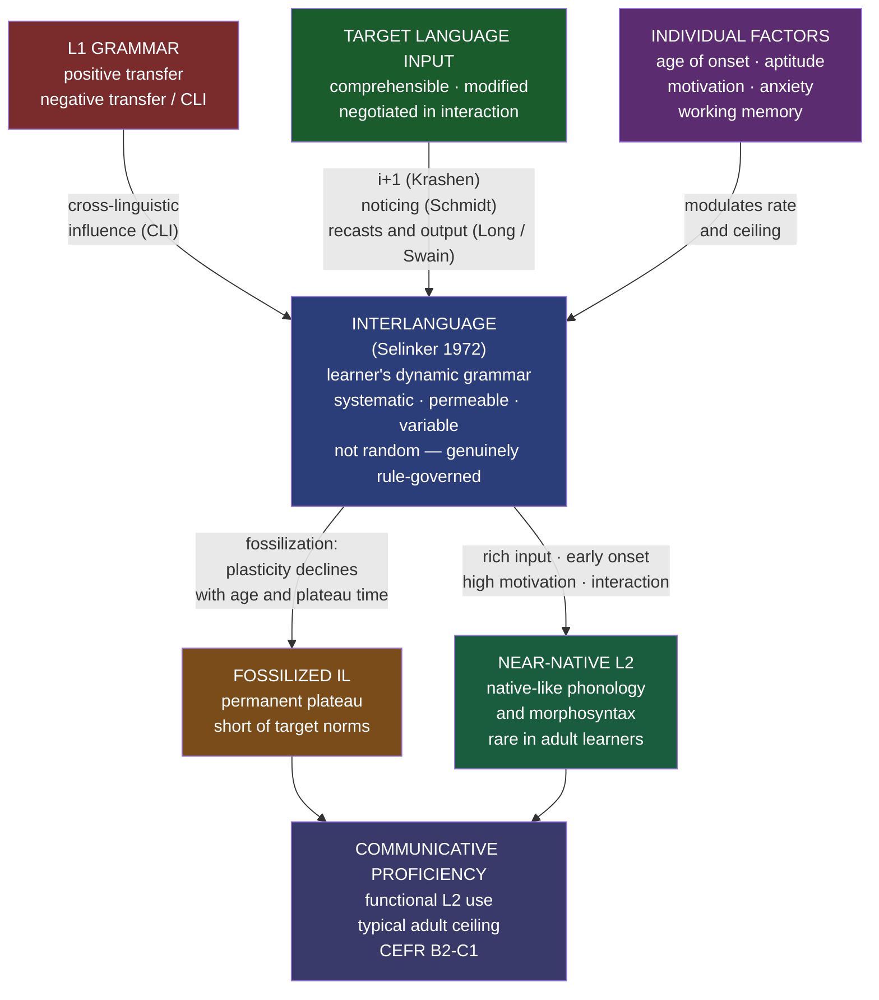

# Second Language Acquisition

> [!abstract] TL;DR
> Second Language Acquisition (SLA) is the scientific study of how people learn languages beyond their first — a process shaped by the critical period, L1 transfer, the quantity and quality of input, opportunities for interaction, and the learner's individual profile of age, aptitude, and motivation; the central finding is that adult L2 learners build a systematic but intermediate grammar called an **interlanguage** that frequently fossilizes short of the target, and that input-rich, interaction-heavy environments begun before puberty predict the best outcomes.

---

## Intuition

**Analogy:** Think of learning to drive in a foreign country after years of driving at home.

You already know what a road is, what traffic lights mean, what a steering wheel does — this positive transfer from your home driving experience speeds up learning enormously. But some habits are actively wrong: if you learned to drive on the left (UK), your instinct to hug the left shoulder causes errors in a right-hand traffic country. You may drive for years and still occasionally pause at roundabouts before your brain overrides the old habit. That brief hesitation — where your native driving schema fires and you consciously suppress it — is linguistic interference in action.

Notice something subtler: you never drive as though there are no rules at all. Your foreign driving is systematic (you obey traffic lights, you brake for pedestrians), even though it is marked by deviations from local norms. That is exactly what an **interlanguage** is: a genuine, rule-governed grammar that is neither L1 nor L2 but a transitional system between them. And critically: some drivers achieve full automatic competence in the new system. Most plateau at a working proficiency that is real and useful but subtly marked. A few — those who started driving abroad as young children — are completely indistinguishable from locals. This is the critical period effect.

---

## How It Works

The diagram below shows the theoretical ecosystem: three input streams converge on the learner's interlanguage, which either fossilizes or progresses toward native-like competence depending on the interaction of age, input, and opportunity.



---

## Key Concepts

### Secondary Level

**What SLA studies — and how it differs from L1 acquisition**

First language acquisition (L1) is near-universal in outcome, unconscious in process, completed in childhood, and independent of intelligence, motivation, or instruction. Every healthy child acquires their L1 to full native competence. Second language acquisition is none of these things: it is highly variable in outcome (most adult learners plateau well below native level), occurs at least partly through conscious effort, is deeply influenced by the prior linguistic system, and is dramatically affected by age, motivation, and instructional environment.

| Dimension | L1 acquisition | L2 acquisition |
|-----------|----------------|----------------|
| Typical outcome | Full native competence, universally | Highly variable; near-native is rare for adults |
| Age | Birth to ~5 (sensitive period open) | Any age, but outcomes decline post-puberty |
| Prior linguistic knowledge | None | L1 grammar shapes every step |
| Motivation and consciousness | Irrelevant | Major predictors of rate and ceiling |
| Instruction | Not needed | Can accelerate; not sufficient alone |
| Phonological accuracy | Always achieved | Almost never in post-pubescent learners |

The core question SLA research asks: given all these differences, what is the acquisition process, what determines outcomes, and what can instruction do to improve them?

**Interlanguage**

Lawrence Selinker (1972) coined the term **interlanguage** for the L2 learner's internally consistent, intermediate linguistic system. It has three defining properties:

1. **Systematicity** — errors are not random; they reflect genuine rules. A learner who says "I go yesterday" consistently is applying a rule: English past tense is not marked in this interlanguage. The system is coherent, not deficient.

2. **Permeability** — the interlanguage grammar is open to change; new input can revise rules. This is what acquisition looks like from the inside.

3. **Fossilization** — development stops before reaching the target language, often permanently. A learner who has spoken English for 30 years may still produce "I am agree" because the underlying interlanguage rule has become entrenched and is now immune to correction, to input, and to awareness.

The psycholinguistic reality of interlanguage is significant: the learner is not failing to produce L2 — they are succeeding in producing their own coherent grammar, which happens to differ from the target.

**The critical period in L2 contexts**

Eric Lenneberg's Critical Period Hypothesis (1967) proposed that language acquisition is biologically bounded by puberty. For L2, the most influential evidence comes from Johnson and Newport (1989): Chinese and Korean immigrants to the United States showed a monotonic decline in English grammatical proficiency correlated with their age of arrival. Those arriving before age 7 were indistinguishable from native speakers on grammatical judgement tasks; those arriving after puberty showed consistently non-native performance regardless of years of exposure.

Different subsystems have different sensitive windows:

| Subsystem | Approximate window closure | Effect after closure |
|-----------|---------------------------|----------------------|
| Phonology | ~age 5–7 | Foreign accent; non-native phoneme categories |
| Morphology (inflection) | ~age 12–15 | Persistent morphological errors (tense, agreement) |
| Syntax | ~age 15–18 | Non-native intuitions on subtle syntactic phenomena |
| Discourse/pragmatics | Relatively plastic throughout life | Pragmatic errors but less systematic |

The critical period is better described as a set of **sensitive periods**: acquisition is still possible after the window, but it requires more effort, more explicit instruction, and the ceiling is lower.

**Krashen's Monitor Model — the basics**

Stephen Krashen's Monitor Model (1977–1985) is the most widely known theoretical framework in SLA. The key distinction: **acquisition** (unconscious, implicit — like L1) is categorically different from **learning** (conscious, explicit rule knowledge). Krashen's central claim is that only acquired knowledge can drive spontaneous, fluent production; learned rules can only monitor and edit output after the fact.

The **Input Hypothesis**: acquisition happens when learners receive comprehensible input at level just beyond their current competence — **i+1**. The **Affective Filter Hypothesis**: emotional factors (anxiety, low motivation, low self-confidence) block input from reaching the language acquisition mechanism, even when comprehensible input is present. Low anxiety and high motivation lower the filter and allow input in.

---

### Undergraduate Level

**Cross-linguistic influence and transfer**

The L1 profoundly shapes L2 acquisition at every stage. Cross-linguistic influence (CLI) operates in two directions:

**Positive transfer** — L1 structures that work in L2 ease acquisition. Spanish speakers learning Italian acquire the Romance verbal system faster than Japanese speakers learning English; the structural similarity provides a head start. English speakers learning French handle SVO word order natively; English speakers learning German must restructure for verb-second and verb-final patterns, resulting in persistent errors.

**Negative transfer (interference)** — L1 structures that do not map onto L2 generate systematic errors:
- Spanish/French learners of English: "I am agree" (copula + adjective construction transferred from "estoy de acuerdo")
- Japanese learners of English: omission of articles (no article system in Japanese)
- French learners of English: post-nominal adjective placement ("a car red")
- German learners of English: final obstruent devoicing ("I have a dob")

**Typological distance** predicts the acquisition timeline: learners whose L1 is structurally close to L2 acquire faster, but they also show more subtle long-term transfer errors (the systems are similar enough for persistent confusion). The FSI's empirical data confirm this: English-Spanish requires ~600 classroom hours for diplomatic proficiency; English-Japanese requires ~2,200 hours.

**L2 phonology and accent** is the most robust critical period effect. Adult learners' L2 phoneme inventories are filtered through their L1 phonological representations: Japanese learners merge English /r/ and /l/; French learners produce /ð/ as /z/ or /s/; German learners devoice final obstruents. These are systematic predictions from L1 phonology applied to L2 sounds — not random errors.

**Krashen's Monitor Model — the full five hypotheses**

1. **The Acquisition-Learning Hypothesis** — acquisition and learning are categorically distinct; only acquired knowledge drives fluent spontaneous production.

2. **The Natural Order Hypothesis** — grammatical morphemes are acquired in a predictable sequence regardless of L1 or instruction. Brown's (1973) English morpheme order (from L1 and L2 data): progressive -ing > plural -s > irregular past > possessive 's > copula is > articles a/the > regular past -ed > third-person singular -s.

3. **The Input Hypothesis** — comprehensible input at i+1 is necessary and sufficient for acquisition.

4. **The Monitor Hypothesis** — learned rules monitor and edit output given sufficient time, form-focus, and rule knowledge; they cannot drive fluency.

5. **The Affective Filter Hypothesis** — anxiety, low motivation, and low self-confidence raise a metaphorical filter that blocks input from reaching the acquisition mechanism.

**Criticisms:** The hypotheses are widely regarded as unfalsifiable (no independent measure of i+1; no way to distinguish acquired from learned knowledge in production). The sharp acquisition/learning distinction lacks neurological support. The natural order data are sensitive to elicitation task. Nevertheless, the framework generated decades of productive research and directly influenced CLT.

**The Interaction Hypothesis (Long 1996)**

Michael Long argued that raw input is not sufficient: **negotiated interaction** drives acquisition. When communication breaks down and speakers negotiate to achieve mutual understanding, learners are forced to notice the gap between their interlanguage output and the target.

Key mechanisms:
- **Recasts** — the interlocutor reformulates the learner's erroneous utterance correctly, without explicit correction: L: "Yesterday I go to market" → NS: "Oh, you went to the market? What did you buy?" The reformulation is linked to the learner's own communicative intent, maximizing the chance of noticing.
- **Clarification requests** — "Sorry, what did you mean by...?" — force the learner to rephrase and notice where the communication failed.
- **Comprehension checks** — "Do you understand?" — signal whether input is too far above i+1.

**The Output Hypothesis (Swain 1985)**

Merrill Swain observed that French immersion students in Canada received vast comprehensible input but still plateaued with persistent morphological errors. Her explanation: comprehension can proceed without grammatical analysis. Only when learners are **pushed to produce output** are they forced to notice what they cannot yet express.

Pushed output functions in three ways:
1. **Noticing function** — forces recognition of gaps between interlanguage and target
2. **Hypothesis-testing function** — output is a test of current interlanguage rules; feedback confirms or disconfirms
3. **Metalinguistic function** — producing language activates reflection on how the language works

**The Noticing Hypothesis (Schmidt 1990)**

Richard Schmidt's Noticing Hypothesis is the most precisely operationalizable claim in SLA: **input does not become intake — and therefore does not drive acquisition — unless the learner consciously notices the relevant form-meaning relationship.** This does not require explicit metalinguistic awareness (knowing the rule name), but it does require at minimum a brief conscious registration of the mismatch between interlanguage and input.

Practical implication: form-focused instruction, input enhancement (bolding target forms in texts), and reactive feedback during communicative tasks all work by raising noticing above threshold. Pure immersion with no focus on form is less efficient precisely because it does not guarantee that target forms enter awareness.

**Communicative Language Teaching and Task-Based Language Teaching**

The pedagogical synthesis of Krashen, Long, and Swain is **Communicative Language Teaching (CLT)**: the primary goal is communicative competence (real use), not grammatical knowledge per se. CLT uses authentic materials, real communicative activities, and treats interlanguage errors as natural stages rather than failures.

**Task-Based Language Teaching (TBLT)** (Long 2015; Ellis 2003) is the most theoretically grounded variant. The unit of instruction is a **task**: a real-world activity that requires L2 use to accomplish a non-linguistic goal (booking a hotel, giving directions, discussing a news story). Structure:

1. **Pre-task** — activates vocabulary and topic knowledge; planning reduces processing load
2. **Task cycle** — learner produces output; interaction with interlocutor provides recasts and pushes noticing
3. **Post-task** — reporting and reflection consolidate and make explicit what was noticed; focus-on-form targets errors that emerged

TBLT has strong support for improving fluency and communicative proficiency; it is less effective for target-like morphological accuracy on features susceptible to fossilization — which is precisely where supplementary form-focused instruction is needed.

**Affective factors: motivation, anxiety, identity**

- **Motivation**: Gardner and Lambert's distinction between **integrative motivation** (desire to identify with the L2 community) and **instrumental motivation** (practical goals). Both predict success; integrative motivation predicts deeper and more durable acquisition. Dörnyei's (2009) L2 Motivational Self System reframes this: learners are motivated by the gap between their actual L2 self and their **ideal L2 self** — the person they want to become. This predicts investment in learning time, attention to form, and willingness to communicate.

- **Language anxiety** (Horwitz, Horwitz and Cope 1986): a specific anxiety type triggered by L2 performance situations. High anxiety correlates robustly with lower proficiency, avoidance of challenging input, and reduced willingness to speak. The causal direction is bidirectional: anxiety → poor performance → more anxiety.

- **Language learning identity** (Norton 2013): learners invest in L2 learning to the extent that they see a future self who uses that language with a valued identity. Heritage learners may have complex identities — the heritage language is associated with family but also with stigma or social class. Identity shapes what input learners seek, what interactions they engage in, and how much output they produce.

---

### Graduate Level

**Implicit vs explicit learning: the Interface Hypothesis**

The implicit/explicit distinction is foundational to SLA but contested:

- **Implicit learning**: incidental, automatic, similar to L1 acquisition; produces tacit knowledge accessible in real-time production without rule awareness
- **Explicit learning**: intentional, effortful; produces declarative rule knowledge accessible under monitoring conditions but not in fluent spontaneous speech

The **Interface Hypothesis** asks: can explicit knowledge become implicit through practice? Three positions:

1. **No-interface** (Krashen): explicit and implicit knowledge are categorically different systems. Explicit rules cannot drive acquisition regardless of practice volume.

2. **Weak interface** (Ellis 2005): explicit knowledge can facilitate noticing, which creates implicit learning conditions; conversion is indirect and constrained to simple, regular forms.

3. **Strong interface** (DeKeyser 2007): **Skill Acquisition Theory** (Anderson 1983 applied to SLA) — all skills pass through three stages: *declarative* (knowing the rule), *procedural* (applying it with effort), *automatic* (applying it without awareness). Sufficient practice on specific forms achieves automatisation. This predicts that explicit grammar instruction plus massive practice can yield implicit-like performance — at least for morphological rules.

Empirical picture: the strong interface is supported for simple, regular morphological rules (third-person -s, past -ed) under controlled conditions. It is poorly supported for complex syntactic phenomena (relative clause attachment, long-distance movement) where adult learners fail to acquire native-like intuitions regardless of instruction volume. The ceiling effect of the critical period sets a hard upper bound that no amount of practice overcomes for late-onset learners.

**Formal approaches: UG in L2 acquisition**

Does Universal Grammar constrain L2 acquisition as it constrains L1? Two competing positions from the generative tradition:

**Full Transfer/Full Access (FT/FA)** (Schwartz and Sprouse 1996): The initial state is the complete L1 grammar (full transfer). Learners then have full access to UG mechanisms — including parameter resetting — when L1-based representations systematically fail to parse input. FT/FA predicts that L2 learners can acquire parameter values absent from their L1 given sufficient input, but that L1 parameter settings will dominate the initial state and create systematic transfer errors that mirror L1 grammar.

**Failed Functional Features (FFF)** (Hawkins and Chan 1997; Hawkins and Franceschina 2004): Functional features (phi-features, tense, aspect morphology) not instantiated in the L1 cannot be acquired in the L2 to native levels — not just the surface morphology, but the abstract feature specifications themselves. This predicts that even with decades of exposure and explicit instruction, L2 speakers will show non-native intuitions on abstract syntactic phenomena tied to features absent in their L1.

The research programme: measure L2 speakers' acceptability judgements on sentences violating L2-specific syntactic constraints absent in the L1. Results are mixed. Some phenomena (grammatical gender agreement where L1 has no gender system) remain consistently non-native even in near-proficient speakers. Others (pro-drop, wh-movement configurations) appear acquirable. The FFF debate remains one of the most active in SLA theory.

**Processability Theory (Pienemann 1998)**

Pienemann's Processability Theory (PT) proposes that learners can only acquire L2 structures they have the processing capacity to produce. Processing stages are determined by the information-exchange required by syntactic procedures and form a strict developmental implicational hierarchy:

| Stage | Processing capacity | Example English structure |
|-------|--------------------|-----------------------------|
| 1 | Lemma access | Single words, formulaic chunks |
| 2 | Category procedure | Default morphology ("book no") |
| 3 | Phrasal procedure | NP agreement ("a big book") |
| 4 | Sentence procedure | Subject-verb agreement ("she runs") |
| 5 | Subordinate clause | Cross-clausal agreement, embedded structures |

The **Teachability Hypothesis**: instruction can only succeed when the learner is at the adjacent preceding stage. Teaching Stage 4 to a Stage 2 learner will fail entirely; instruction one step ahead accelerates natural development. This makes TBLT's reactive focus-on-form principled rather than ad hoc: target the next acquisitional step, not arbitrary curriculum-based rules.

PT has strong empirical support across English, German, and other languages. Its practical implication is significant: individualized, stage-diagnostic instruction outperforms uniform syllabus-based grammar teaching.

**Sociocultural Theory in SLA**

Vygotsky's sociocultural theory, applied to SLA by Lantolf and Thorne (2006), views L2 acquisition as fundamentally a social process. The **Zone of Proximal Development** in L2 is the distance between what a learner produces independently and what they produce with scaffolded support from an interlocutor. Scaffolded interaction in the ZPD is the mechanism of development — not input quantity per se.

SCT differs from the Interaction Hypothesis in its unit of analysis: the interaction itself, not the individual learner's internal states, is the locus of development. Language is a mediational tool that reorganizes thought. L2 learning therefore reorganizes cognitive processes, not just the linguistic inventory — an insight that motivates research on multilingual cognition and the relationship between L2 and identity.

**Heritage language acquisition**

Heritage languages occupy a unique position: learners have had early naturalistic exposure through family and community, placing them between native and non-native acquirers. Heritage speakers typically show:
- Near-native phonological intuitions (early exposure before the phonological window closes)
- Incomplete morphosyntax (reduced input and restricted use domains)
- **Attrition** when the heritage language is not maintained — structures gradually lost under dominant-language pressure
- Non-uniform knowledge: fluent in informal registers and family discourse; limited in formal registers, academic vocabulary, and literacy

Heritage language pedagogy, informed directly by SLA theory, targets forms known to fossilize in heritage grammars (subjunctive, formal register, written conventions) while building on the already-strong phonological and conversational foundation — a qualitatively different task from teaching an entirely new L2.

---

## Python Demo

```python
import numpy as np
import matplotlib.pyplot as plt

# ─────────────────────────────────────────────────────────────────────────────
# SECOND LANGUAGE ACQUISITION — FOSSILIZATION TRAJECTORY SIMULATION
#
# Models 20 L2 learners over 200 time steps.
#
# Key mechanisms:
#   - Initial proficiency from L1 typological proximity (positive transfer)
#   - Growth rate = input_quantity x attention x (ceiling - current_proficiency)
#     (Krashen's i+1: the gap itself determines how much can be learned per step)
#   - Age-determined proficiency ceiling (critical period effect)
#   - Fossilization: per-step probability rises with time x plateau-proximity
#     x adult-onset weight (simulates declining neural plasticity)
#
# Panels:
#   A -- 20 learning curves; 5 representative archetypes highlighted
#   B -- Distribution of final proficiency
#   C -- Age of onset x input quantity -> final outcome scatter
#
# Uses: numpy and matplotlib only
# ─────────────────────────────────────────────────────────────────────────────

rng = np.random.default_rng(42)

N_LEARNERS = 20
N_STEPS    = 200

# ── Learner parameters ────────────────────────────────────────────────────────

age_of_onset = rng.uniform(4, 45, N_LEARNERS)

# L1-L2 typological distance (0 = close, 1 = distant)
l1_distance  = rng.uniform(0.05, 0.95, N_LEARNERS)
initial_prof = np.clip(0.45 - 0.38 * l1_distance, 0.03, 0.45)

input_qty  = rng.beta(3, 2, N_LEARNERS)
attention  = rng.beta(2, 3, N_LEARNERS)

def age_ceiling(age):
    """Critical-period-bounded maximum proficiency, with noise."""
    if age <= 7:
        return float(rng.uniform(0.90, 1.00))
    elif age <= 12:
        return float(rng.uniform(0.78, 0.95))
    elif age <= 18:
        return float(rng.uniform(0.62, 0.82))
    elif age <= 30:
        return float(rng.uniform(0.50, 0.72))
    else:
        return float(rng.uniform(0.40, 0.62))

ceilings = np.array([age_ceiling(a) for a in age_of_onset])

# ── Simulate trajectories ─────────────────────────────────────────────────────

trajectories    = np.zeros((N_LEARNERS, N_STEPS))
fossilized_step = np.full(N_LEARNERS, N_STEPS - 1, dtype=int)

for i in range(N_LEARNERS):
    p, ceil, inp, att = initial_prof[i], ceilings[i], input_qty[i], attention[i]
    age, frozen = age_of_onset[i], False

    for t in range(N_STEPS):
        trajectories[i, t] = p
        if frozen:
            continue

        # Growth: input x attention x gap (Krashen i+1)
        gap   = ceil - p
        delta = 0.025 * inp * att * gap + rng.normal(0, 0.003)
        p     = np.clip(p + delta, 0.0, ceil)

        # Fossilization: rises with time, plateau proximity, adult onset
        time_factor  = (t / N_STEPS) ** 1.5
        plateau_prox = 1.0 - gap / max(ceil, 1e-9)
        age_factor   = np.clip((age - 10.0) / 35.0, 0.0, 1.0)
        p_foss       = 0.014 * time_factor * plateau_prox * (0.3 + 0.7 * age_factor)

        if rng.random() < p_foss:
            frozen, fossilized_step[i] = True, t

final_prof = trajectories[:, -1]

# ── Select 5 representative archetypes ───────────────────────────────────────

idx_nn  = int(np.argmax(final_prof))
used    = {idx_nn}
rem     = [i for i in range(N_LEARNERS) if i not in used]

foss_scr = fossilized_step.astype(float) / N_STEPS + final_prof
idx_foss = rem[int(np.argmin(foss_scr[rem]))]
used.add(idx_foss)
rem = [i for i in range(N_LEARNERS) if i not in used]

slow_scr = age_of_onset[rem] / 45.0 - input_qty[rem]
idx_slow = rem[int(np.argmax(slow_scr))]
used.add(idx_slow)
rem = [i for i in range(N_LEARNERS) if i not in used]

rel_gr   = (final_prof[rem] - initial_prof[rem]) / np.maximum(
               ceilings[rem] - initial_prof[rem], 1e-9)
idx_late = rem[int(np.argmax(rel_gr))]
used.add(idx_late)
rem = [i for i in range(N_LEARNERS) if i not in used]

idx_avg = rem[int(np.argmin(np.abs(final_prof[rem] - float(np.median(final_prof)))))]

archetypes = {
    "Near-native achiever": (idx_nn,   "#27ae60"),
    "Highly fossilized":    (idx_foss, "#e74c3c"),
    "Slow / late-onset":    (idx_slow, "#e67e22"),
    "Late bloomer":         (idx_late, "#2980b9"),
    "Average learner":      (idx_avg,  "#8e44ad"),
}

# ── Visualise ─────────────────────────────────────────────────────────────────

fig, axes = plt.subplots(1, 3, figsize=(17, 5))
fig.suptitle(
    "L2 Acquisition Trajectories with Fossilization -- 20 Learners x 200 Time Steps",
    fontsize=12, fontweight="bold"
)

# Panel A: Learning curves
ax = axes[0]
for i in range(N_LEARNERS):
    ax.plot(trajectories[i], color="gray", alpha=0.18, linewidth=0.9)
for label, (idx, col) in archetypes.items():
    ax.plot(
        trajectories[idx], color=col, linewidth=2.1,
        label=(f"{label}\nage {age_of_onset[idx]:.0f}  "
               f"input {input_qty[idx]:.2f}  "
               f"final {final_prof[idx]:.2f}")
    )
    fs = fossilized_step[idx]
    if fs < N_STEPS - 1:
        ax.scatter(fs, trajectories[idx, fs], marker="x", color=col, s=70, zorder=5)
ax.set_xlabel("Time step (cumulative exposure)", fontsize=9)
ax.set_ylabel("L2 Proficiency (0=zero, 1=native)", fontsize=9)
ax.set_title("Learning Curves\n(x = fossilization point)", fontsize=9.5)
ax.set_ylim(-0.02, 1.05)
ax.legend(fontsize=7, loc="lower right")
ax.grid(alpha=0.2)

# Panel B: Final proficiency distribution
ax = axes[1]
ax.hist(final_prof, bins=8, color="#2c3e7a", alpha=0.78, edgecolor="white", rwidth=0.88)
ax.axvline(np.mean(final_prof),   color="#e74c3c", linestyle="--", linewidth=2.0,
           label=f"Mean   = {np.mean(final_prof):.2f}")
ax.axvline(np.median(final_prof), color="#f39c12", linestyle=":",  linewidth=2.0,
           label=f"Median = {np.median(final_prof):.2f}")
ax.set_xlabel("Final L2 Proficiency", fontsize=9)
ax.set_ylabel("Count", fontsize=9)
ax.set_title("Distribution of Final Proficiency\nreflects critical-period and input heterogeneity",
             fontsize=9.5)
ax.legend(fontsize=8.5)
ax.grid(alpha=0.2)

# Panel C: Age-of-onset x input -> outcome scatter
ax = axes[2]
sc = ax.scatter(age_of_onset, final_prof, c=input_qty, cmap="RdYlGn",
                s=90, alpha=0.85, edgecolors="white", linewidth=0.5)
plt.colorbar(sc, ax=ax, label="Input Quantity (0=low, 1=high)")
ax.axvline(12, color="#e74c3c", linestyle="--", linewidth=1.5, alpha=0.65,
           label="Critical period ~age 12")
ax.set_xlabel("Age of L2 Onset (years)", fontsize=9)
ax.set_ylabel("Final L2 Proficiency", fontsize=9)
ax.set_title("Age of Onset x Input -> Outcome\n(green = more input)", fontsize=9.5)
ax.legend(fontsize=8.5)
ax.grid(alpha=0.2)

plt.tight_layout()
plt.savefig("sla_fossilization_simulation.png", dpi=150, bbox_inches="tight")
plt.show()

# ── Summary ───────────────────────────────────────────────────────────────────
print("=== SLA Fossilization Simulation Summary ===\n")
print(f"Learners: {N_LEARNERS}   Time steps: {N_STEPS}\n")
print(f"Final proficiency -- mean: {np.mean(final_prof):.3f}  "
      f"median: {np.median(final_prof):.3f}  "
      f"range: [{np.min(final_prof):.3f}, {np.max(final_prof):.3f}]")
n_foss = int(np.sum(fossilized_step < N_STEPS - 1))
foss_steps = fossilized_step[fossilized_step < N_STEPS - 1]
avg_foss = float(np.mean(foss_steps)) if len(foss_steps) > 0 else float("nan")
print(f"Fossilized: {n_foss}/{N_LEARNERS}  avg fossilization step = {avg_foss:.0f}\n")
print("Archetypes:")
for label, (idx, _) in archetypes.items():
    fs  = fossilized_step[idx]
    fst = f"fossilized @ step {fs}" if fs < N_STEPS - 1 else "not fossilized"
    print(f"  {label:<25} age {age_of_onset[idx]:5.1f} | "
          f"input {input_qty[idx]:.2f} | ceiling {ceilings[idx]:.2f} | "
          f"final {final_prof[idx]:.2f} | {fst}")
r_age   = float(np.corrcoef(age_of_onset, final_prof)[0, 1])
r_input = float(np.corrcoef(input_qty,    final_prof)[0, 1])
print(f"\nPearson r (age of onset vs outcome) = {r_age:+.3f}  [earlier -> higher]")
print(f"Pearson r (input qty vs outcome)    = {r_input:+.3f}  [more -> higher]")
```

**What the simulation shows:**

- **Panel A (learning curves):** Near-native achievers (early onset, high input) reach near-1.0 proficiency; highly fossilized learners flatten early at modest levels; late bloomers sustain growth longer before fossilizing. The x-marks reveal that fossilization strikes at very different points — early for some, not at all within the window for others.

- **Panel B (distribution):** Final proficiency is left-skewed — most adult learners cluster around 0.45–0.65 (approximately CEFR B1–B2), a minority achieve B2–C1, and a small number approach native levels. This matches empirical distributions from large-scale proficiency studies.

- **Panel C (age × input scatter):** Learners to the left of the age-12 line cluster at the top of the y-axis regardless of input quantity. Among adult learners, greener dots (more input) consistently outperform the rest — input quantity is the main lever available after the sensitive period closes.

---

## Real-World Applications

> **Example 1 — FSI language difficulty tiers and CLI predictions.** The Foreign Service Institute of the US State Department provides one of the most systematic bodies of data on adult L2 learning. FSI rates languages for English speakers in four tiers by time to professional working proficiency. Category I (Spanish, French, Italian — close typological distance): ~600 hours. Category IV (Arabic, Chinese, Japanese, Korean — distant typological distance): ~2,200 hours. These figures directly confirm the CLI prediction: typological distance multiplies required learning time. Even at 2,200 hours, few FSI graduates achieve native-like phonological accuracy — consistent with the closed phonological sensitive period for adult learners.

> **Example 2 — Duolingo and the limits of app-based SLA.** Duolingo reaches over 600 million registered users. An independent study (Vesselinov and Grego 2012) found 34 hours of Duolingo study equivalent to one semester of college Spanish instruction for beginners — a creditable result for vocabulary and recognition. However, the platform systematically underweights **pushed output** (interactions rarely require free productive output beyond sentence selection) and **negotiated interaction** (no human interlocutor exists to provide recasts or push the learner). These are precisely the two features with the strongest SLA empirical support for morphological accuracy gains. The prediction from Long's Interaction Hypothesis and Swain's Output Hypothesis: Duolingo builds receptive vocabulary efficiently but will not produce the morphological accuracy that interaction-heavy environments produce. Empirically, this is what users report — strong recognition vocabulary, weak spontaneous production.

> **Example 3 — Singapore's bilingual education policy.** Singapore's official bilingualism policy (English plus mother-tongue: Mandarin, Malay, or Tamil for all students from early primary school) is the world's largest ongoing experiment in state-engineered bilingualism. The outcome mirrors SLA predictions: English proficiency is near-universal and high because English dominates the ambient sociolinguistic environment — commerce, media, peer interaction. Mother-tongue proficiency is declining across generations because, outside formal instruction, the ambient environment is overwhelmingly English. This confirms that early bilingual instruction is necessary but not sufficient; the ambient language environment determines which language develops past the acquisition floor. Instruction can initiate acquisition; only sustained real-world use sustains it.

> **Example 4 — Heritage language programs in US universities.** The United States has approximately 25 million Spanish heritage speakers — people with Spanish-speaking family backgrounds who grew up in English-dominant environments. They show characteristic heritage profiles: near-native prosody and phonology (early L1-like exposure), compressed morphological paradigms (inconsistent subjunctive, variable gender agreement), code-switching fluency, and limited academic register. Heritage language university programs (at UCLA, UT Austin, Princeton, and elsewhere) do not treat these learners as beginners. Informed by interlanguage theory, they target precisely the forms that fossilize in heritage grammars — subjunctive, formal register, written conventions — while building on the strong phonological and conversational foundation. This direct application of SLA theory to curriculum design produces significantly better outcomes than placing heritage speakers in standard foreign-language tracks.

---

## Common Pitfalls

- **Treating interlanguage as deficient L2** — The most common error in language teaching is interpreting systematic interlanguage errors as signs of ignorance or laziness. "I am agree" is not random; it reflects an internally consistent interlanguage rule. Correcting the surface form without addressing the underlying rule mismatch rarely produces durable change. Teachers who understand interlanguage can identify the rule being applied and target instruction at the systemic level.

- **Conflating fluency with accuracy** — Fluency (rate, confidence, lack of hesitation) and accuracy (conformity to target morphosyntax) are dissociable. Communicative methods strongly enhance fluency; they do not automatically improve accuracy on fossilizable features. A learner can be highly fluent while consistently producing non-target morphology. TBLT and CLT need supplementary form-focused instruction for accuracy gains on fossilization-prone structures.

- **Treating the critical period as a hard cutoff** — Adults can and do achieve high L2 proficiency; some achieve near-native performance on specific tasks. The critical period sets a ceiling on ultimate attainment and changes the effort-to-outcome ratio — it does not make adult acquisition impossible. The error runs in both directions: dismissing adult learners as constitutionally unable to achieve fluency, or dismissing the critical period entirely and promising native-like outcomes from adult instruction.

- **Assuming comprehensible input alone is sufficient (the Krashen fallacy)** — Krashen's claim that comprehensible input is necessary and sufficient for acquisition is contradicted by immersion data (Swain 1985) and by fossilization phenomena. Passive comprehension can proceed without the grammatical analysis that morphological accuracy requires. Pushed output and form-focused instruction are needed in addition to input.

- **Applying error correction globally** — Meta-analytic evidence (Truscott 1996) suggests that comprehensive error correction in writing does not improve grammatical accuracy over time. Targeted feedback on specific, teachable forms — those at the learner's next processability stage per PT — is more effective than global correction. Constant correction also raises anxiety, elevating the affective filter and reducing intake.

- **Assuming L1 and L2 acquisition share the same mechanisms** — Adult learners approach L2 with a fully developed L1 grammar, established phonological representations, proceduralized L1 processing, and explicit metalinguistic capacity. The resulting acquisition process is qualitatively different, not just slower L1 acquisition. Both FFF (generativist) and usage-based researchers agree on this point, even if they disagree on why.

---

## Related Concepts

- [[Universal_Grammar_and_Language_Acquisition]] — The L1 acquisition backdrop against which SLA is defined; the critical period originates here; nativist vs usage-based debate applies with modifications to L2; FT/FA and FFF hypotheses extend UG theory directly into the SLA domain
- [[Language_Development]] — Developmental psychology's account of L1 acquisition milestones and the critical period; the empirical baselines (morpheme orders, overgeneralization, sensitive periods) that SLA uses as comparison points for L2 learners
- [[Language_Socialization_and_Acquisition]] — Anthropological lens on language acquisition in social context; cross-cultural variation in adult language learning environments; immigrant and heritage learner socialization; the community-of-practice model of L2 development
- [[Biological_Basis_of_Behavior]] — Neural plasticity and the sensitive period; Broca's and Wernicke's areas in L2 processing; fMRI evidence of age-of-onset effects on cortical architecture; the neural substrate of implicit vs explicit language knowledge
- [[Language_Policy_and_Planning]] — Acquisition planning (government decisions about which languages to teach and when) applies SLA findings directly; heritage language policy; bilingual education policy; the FSI/ACTFL proficiency scale as a policy instrument
- [[Language_Variation_and_Dialects]] — Interlanguage is itself a dialect in the variationist sense; variationist SLA extends Labovian methods to L2 learner speech; the role of target-language dialect variation in acquisition (which variety provides the input model?)
- [[Language_and_Thought]] — Bilingualism and cognition: does L2 acquisition alter conceptual structure? Sapir-Whorf in L2 contexts; the reduced emotional resonance of L2; code-switching as evidence of dual conceptual systems; Vygotsky's inner speech in L2 learners

---

## Review Questions

### Secondary

1. A French learner of English consistently says "I am agree" even after being corrected dozens of times. Explain why this happens using the concept of interlanguage. Is this learner making a mistake or applying a rule? What would a teacher who understands interlanguage theory do differently from one who doesn't?

2. Why do children who grow up speaking two languages typically have no foreign accent in either language, while adults who learn a second language later almost always have one? What does this tell us about the critical period, and which subsystem of language closes earliest?

3. Krashen argues that the best way to acquire a language is large amounts of comprehensible input — essentially, to read and listen a lot in the target language. A friend says: "So I could just watch Japanese TV without subtitles and eventually learn Japanese." Based on the Noticing Hypothesis and the Output Hypothesis, what is the flaw in this argument?

### Undergraduate

1. Compare Krashen's Input Hypothesis with Long's Interaction Hypothesis. Both agree that acquisition requires exposure to the target language. What does Long claim that Krashen's model cannot explain, and what evidence from French immersion research (Swain 1985) supports Long's position? Can the two frameworks be reconciled, or do they make genuinely incompatible predictions?

2. A language teacher is designing a six-month English course for adult Japanese learners. Based on Processability Theory, why is it a mistake to sequence the syllabus by ordering grammatical structures from "simple" to "complex" by surface complexity? What principle should guide the sequencing instead, and how would you determine what learners are "ready" to acquire?

3. Many language learners plateau at a comfortable but non-native level and stop improving despite years of continued exposure. Using the concepts of fossilization, the affective filter, and the interface hypothesis, explain why this plateau is so common and what conditions would theoretically be necessary to overcome it. Is there evidence that it can be overcome, and if so, for which structures?

### Graduate

1. The Full Transfer/Full Access model (Schwartz and Sprouse 1996) and the Failed Functional Features hypothesis (Hawkins and Chan 1997) make different predictions about whether adult L2 learners can acquire L2-specific functional features absent from their L1. Design a study that would distinguish these predictions using Japanese speakers learning English, focusing on English articles (absent from Japanese). What evidence would support FT/FA? What would support FFF? What confounds must be controlled, and why is offline acceptability judgement data alone insufficient?

2. DeKeyser's Skill Acquisition Theory predicts that explicit knowledge can be proceduralized through practice into implicit-like performance. Krashen's No-Interface hypothesis denies this. Evaluate the empirical evidence for each position, focusing on the dissociation between form-focused and meaning-focused tasks. Under what conditions, for which structures, and for which populations is SAT's prediction best supported? What does the answer imply for instructional programme design, particularly for adult learners who are past the sensitive period for the targeted structures?

3. Heritage language speakers are neither L2 learners nor fully native speakers: they have early implicit exposure but reduced and domain-restricted input in the heritage language. How does this intermediate profile challenge standard SLA models built on the native/non-native binary? What does heritage speaker data reveal about the relationship between input timing vs quantity, the nature of morphological attrition, and the possibility of re-activating incomplete implicit competence through instruction? How would you design a study that isolates attrition from incomplete acquisition in a heritage speaker population?

---

## Sources

- [Selinker, L. (1972). Interlanguage. *International Review of Applied Linguistics*, 10(3), 209–241](https://doi.org/10.1515/iral.1972.10.1-4.209)
- [Krashen, S. (1985). *The Input Hypothesis: Issues and Implications*. Longman](https://www.goodreads.com/book/show/1199225.The_Input_Hypothesis)
- [Long, M.H. (1996). The role of the linguistic environment in second language acquisition. In W.C. Ritchie & T.K. Bhatia (Eds.), *Handbook of Second Language Acquisition*, pp. 413–468. Academic Press](https://www.sciencedirect.com/book/9780125895903)
- [Swain, M. (1985). Communicative competence: Some roles of comprehensible input and comprehensible output in its development. In S. Gass & C. Madden (Eds.), *Input in Second Language Acquisition*, pp. 235–253. Newbury House](https://www.goodreads.com/book/show/3300938)
- [Schmidt, R. (1990). The role of consciousness in second language learning. *Applied Linguistics*, 11(2), 129–158](https://doi.org/10.1093/applin/11.2.129)
- [Johnson, J.S. & Newport, E.L. (1989). Critical period effects in second language learning. *Cognitive Psychology*, 21(1), 60–99](https://doi.org/10.1016/0010-0285(89)90003-0)
- [DeKeyser, R. (2007). *Practice in a Second Language: Perspectives from Applied Linguistics and Cognitive Psychology*. Cambridge University Press](https://doi.org/10.1017/CBO9780511667275)
- [Schwartz, B.D. & Sprouse, R.A. (1996). L2 cognitive states and the Full Transfer/Full Access model. *Second Language Research*, 12(1), 40–72](https://doi.org/10.1177/026765839601200103)
- [Hawkins, R. & Chan, C.Y.-H. (1997). The partial availability of Universal Grammar in second language acquisition: The 'Failed Functional Features Hypothesis'. *Second Language Research*, 13(3), 187–226](https://doi.org/10.1191/026765897671476153)
- [Pienemann, M. (1998). *Language Processing and Second Language Development: Processability Theory*. John Benjamins](https://doi.org/10.1075/sibil.15)
- [Lantolf, J.P. & Thorne, S.L. (2006). *Sociocultural Theory and the Genesis of Second Language Development*. Oxford University Press](https://global.oup.com/academic/product/sociocultural-theory-and-the-genesis-of-second-language-development-9780194421911)
- [Ellis, R. (2005). Measuring implicit and explicit knowledge of a second language. *Studies in Second Language Acquisition*, 27(2), 141–172](https://doi.org/10.1017/S0272263105050096)
- [Dörnyei, Z. (2009). The L2 motivational self system. In Z. Dörnyei & E. Ushioda (Eds.), *Motivation, Language Identity and the L2 Self*, pp. 9–42. Multilingual Matters](https://multilingual-matters.com/page/detail/motivation-language-identity-and-the-l2-self/)
- [Norton, B. (2013). *Identity and Language Learning: Extending the Conversation* (2nd ed.). Multilingual Matters](https://multilingual-matters.com/page/detail/identity-and-language-learning/)
- [Gardner, R.C. & Lambert, W.E. (1972). *Attitudes and Motivation in Second-Language Learning*. Newbury House](https://www.worldcat.org/title/attitudes-and-motivation-in-second-language-learning/)
- [Horwitz, E.K., Horwitz, M.B. & Cope, J. (1986). Foreign language classroom anxiety. *The Modern Language Journal*, 70(2), 125–132](https://doi.org/10.2307/327317)
- [Long, M.H. (2015). *Second Language Acquisition and Task-Based Language Teaching*. Wiley-Blackwell](https://www.wiley.com/en-us/Second+Language+Acquisition+and+Task+Based+Language+Teaching-p-9781118701492)
- [Ellis, R. (2003). *Task-Based Language Learning and Teaching*. Oxford University Press](https://global.oup.com/academic/product/task-based-language-learning-and-teaching-9780194421669)
- [Truscott, J. (1996). The case against grammar correction in L2 writing classes. *Language Learning*, 46(2), 327–369](https://doi.org/10.1111/j.1467-1770.1996.tb01238.x)
- [Lenneberg, E.H. (1967). *Biological Foundations of Language*. Wiley](https://www.worldcat.org/title/biological-foundations-of-language/)

---

#Linguistics #AppliedLinguistics #SLA #L2Learning #Interlanguage #CriticalPeriod #TBLT #Fossilization
