> [!abstract] TL;DR
> Translation converts written text between languages; interpretation converts spoken (or signed) language in real time — and both are acts of meaning-making under radical constraint: every target-language choice is simultaneously a linguistic, cultural, and political decision. Translatology (translation theory) asks what "equivalence" means when no two languages carve the world the same way; cognitive science asks how simultaneous interpreters process speech in one language while producing output in another under working-memory load; and computational linguistics has built neural machine translation systems that match human quality on some language pairs while failing catastrophically on others.

---

## Intuition

**Analogy:** Imagine two world leaders who share no common language meeting to negotiate a treaty. A single interpreter stands between them. When Leader A says a word that means "honour" in her culture — a concept that carries connotations of family loyalty, restraint, and collective obligation — the closest word in Leader B's language means "pride" with undertones of stubbornness and individual glory. The interpreter must choose, in under a second, which word to say. There is no neutral option. Choosing the "closer" word risks offending Leader B; choosing the "safer" word loses the cultural resonance Leader A intended. Everything — the mood of the negotiation, potentially the treaty itself — rides on that choice.

This is not an edge case. It is the fundamental condition of translation and interpretation. The interpreter is not a telephone wire carrying a signal unchanged from sender to receiver; she is a meaning-maker standing at the point where two different ways of dividing up the world meet, choosing how to bridge them, and necessarily leaving a trace of herself in the crossing. The theoretical and practical disciplines of translation studies and interpretation science are both attempts to understand, systematise, and evaluate that crossing.

---

## How It Works

```mermaid
graph TD
    TS["TRANSLATION STUDIES\nTranslatology\nHolmes 1972 — the discipline\nTH pure + applied branches"]

    TS --> TH["TRANSLATION THEORY\nWritten · Asynchronous"]
    TS --> INT["INTERPRETATION\nSpoken · Signed · Real-time"]
    TS --> MTR["MACHINE TRANSLATION\nComputational"]
    TS --> TE["ETHICS AND POLITICS\nPower · Ideology · Representation"]

    TH --> EQ["EQUIVALENCE THEORIES\nNida 1964 — Formal vs. Dynamic\nKoller 1979 — 5 equivalence types\nDenotative · Connotative · Pragmatic\nTextual-normative · Formal"]
    TH --> SK["SKOPOS THEORY\nVermeer and Reiss 1978\nPurpose of text determines method\nLegal: faithful accuracy\nAdvertising: cultural adaptation\nChildren: simplification"]
    TH --> DV["DOMESTICATION vs. FOREIGNIZATION\nSchleiermacher 1813 — reader to text vs text to reader\nVenuti 1995 — The Translator's Invisibility\nForeignization resists cultural imperialism"]
    TH --> UN["UNTRANSLATABILITY\nLexical gaps and cultural lacunae\nSchadenfreude · Saudade · Mono no aware\nWordplay · Puns · Rhyme"]

    INT --> SI["SIMULTANEOUS INTERPRETATION\nConference interpreting\nEar-voice span 2-5 seconds\nWorking memory bottleneck\nAutomatization in experts"]
    INT --> CI["CONSECUTIVE INTERPRETATION\nCourt · Medical · Diplomatic\nSpeaker finishes segment\nInterpreter note-taking systems\nLonger EVS manageable"]
    INT --> SLI["SIGNED LANGUAGE INTERPRETING\nASL · BSL · LSF · Auslan\nCross-modality translation\nNo direct lexical equivalence"]

    MTR --> RBMT["Rule-Based MT 1950s-1980s\nHand-crafted grammars\nBilingual dictionaries\nBrittle on idioms"]
    MTR --> SMT["Statistical MT 1990s-2010s\nPhrase-based alignment\nIBM models\nMoses open-source"]
    MTR --> NMT["Neural MT 2014-present\nSeq2Seq encoder-decoder\nTransformer architecture\nGoogle Translate · DeepL · NLLB"]
    MTR --> EVAL["MT Evaluation\nBLEU · METEOR · TER\nCOMET — neural metric\nPost-editing MTPE workflows"]

    TE --> COL["Colonial and Postcolonial Translation\nWho gets translated?\nEnglish dominance as source language\nSpivak — Can the Subaltern Speak"]
    TE --> LEG["Legal and Medical Ethics\nAccuracy is life or death\nInterpreter neutrality under pressure\nCourt interpreter role constraints"]

    style TS fill:#1a1a2e,color:#eee
    style TH fill:#2563eb,color:#fff
    style INT fill:#7c3aed,color:#fff
    style MTR fill:#059669,color:#fff
    style TE fill:#d97706,color:#fff
    style SI fill:#4f46e5,color:#fff
    style NMT fill:#047857,color:#fff
    style EVAL fill:#065f46,color:#fff
    style EQ fill:#1d4ed8,color:#fff
    style SK fill:#1d4ed8,color:#fff
    style DV fill:#1d4ed8,color:#fff
```



---

## Key Concepts

### Secondary Level

**Translation vs. interpretation.** The two terms are often used interchangeably in everyday speech but describe distinct professional activities. *Translation* is the conversion of written text from a source language (SL) into a target language (TL); translators work with a stable document, have time to revise, and can consult reference materials. *Interpretation* is the real-time conversion of spoken or signed language; interpreters must produce output on the fly, under strict time pressure, with no opportunity to revise. This difference in time pressure has profound cognitive consequences: simultaneous interpretation is one of the most cognitively demanding language tasks that psycholinguists have studied.

**The basic problem: equivalence.** The central question of translation theory is *equivalence* — what does it mean for a target-language text to be equivalent to a source-language text? The naive answer is "means the same thing," but this breaks down immediately: different languages divide the world differently, use different grammatical categories, embed different cultural assumptions, and carry different connotations. The German compound *Schadenfreude* (pleasure at another's misfortune) has no single-word equivalent in English; you can paraphrase it ("taking pleasure in another's misfortune") but the paraphrase is longer, less vivid, and lacks the cultural currency of the German word. The Portuguese *Saudade* (a melancholic longing for something absent or lost) resists translation into almost any language. The Japanese *Mono no aware* (the bittersweetness of impermanence) requires an entire paragraph to unpack in English.

**Formal vs. dynamic equivalence (Nida).** Eugene Nida, a Bible translator who developed his theory while working on translations of scripture for non-European communities, distinguished two translation philosophies:

- **Formal equivalence** (also called literal translation): preserves the word order, grammatical structure, and form of the source text as closely as possible. The reader is expected to sense the foreignness of the source culture. Used in scholarly and legal translation, and in Bible translations aimed at theological study.
- **Dynamic equivalence** (later called *functional equivalence*): aims to produce in the target-language reader the same effect the source text produced in its original readers. Word-for-word correspondence is sacrificed if necessary to achieve equivalent *impact*. Used in translations aimed at accessibility, including many modern Bible versions and children's literature.

Neither approach is universally correct — Skopos theory (below) would say the choice depends on the purpose of the translation.

**Types of interpretation.** Spoken-language interpretation comes in two main modes:

- **Simultaneous interpretation (SI)**: the interpreter renders speech into the target language while the source-language speaker continues talking. Used in large international conferences (the United Nations, the EU Parliament) where interpreters work in soundproofed booths and listeners use headphones. The interpreter typically lags 2–5 seconds behind the speaker — a temporal gap called the *ear-voice span (EVS)*.
- **Consecutive interpretation (CI)**: the speaker pauses at the end of each segment (a sentence or paragraph), and the interpreter then produces the target-language rendition, often using a system of shorthand notes. Used in bilateral diplomatic meetings, medical consultations, and courtrooms. The interpreter works without the extreme time pressure of SI, but must hold a longer chunk of speech in memory.

---

### Undergraduate Level

**Koller's five equivalence types.** Werner Koller (1979) refined Nida's binary into a taxonomy of five distinct equivalence relationships, recognising that a translation can be "equivalent" in multiple ways and that different text types prioritise different types:

| Equivalence Type | Description | Priority In |
|---|---|---|
| **Denotative** | Same referential content — same facts, objects, events | Technical and scientific texts |
| **Connotative** | Same stylistic and register values | Literary translation |
| **Textual-normative** | Conforms to genre and discourse conventions of target culture | Business letters, legal documents |
| **Pragmatic** | Same effect on the target reader | Advertising, persuasive texts |
| **Formal** | Plays with form, structure, sound — aesthetic equivalence | Poetry, wordplay |

A legal contract primarily requires denotative and textual-normative equivalence: the facts must be identical and the document must look and read like a legal contract in the target culture. A poem primarily requires formal and connotative equivalence: the rhythm, sound texture, and emotional weight must translate, even if the denotative content shifts. An advertisement primarily requires pragmatic equivalence: the target audience must be moved to act, regardless of what the source text literally says.

**Skopos theory (Vermeer and Reiss, 1978).** The German word *Skopos* means "purpose" or "aim." Katharina Reiss and Hans Vermeer proposed that the purpose of a translation should determine every translation choice. A translation is a purposive communicative action (*Handlung*) embedded in a cultural and situational context; its appropriateness can only be evaluated relative to its intended function. This was a radical departure from equivalence-based theories: Skopos theory allows that the "same" source text may correctly produce very different translations depending on the brief given to the translator.

The theory yields immediate practical guidance: a manual for an industrial machine exported to Brazil must have denotative accuracy and follow Brazilian technical documentation conventions (textual-normative equivalence); the same company's advertising campaign must be adapted to Brazilian cultural resonances, not translated word for word (pragmatic equivalence); a legal contract between the two parties must be as close to a word-for-word rendering as legal conventions allow (denotative + formal). The source text is the same; the correct translations are completely different.

**Domestication and foreignization (Schleiermacher and Venuti).** Friedrich Schleiermacher (1813) posed the central dilemma of translation philosophy as a choice between two orientations: either "the translator leaves the author in peace and moves the reader toward him" (foreignization — the text feels foreign; the reader is brought to the source culture), or "the translator leaves the reader in peace and moves the author toward him" (domestication — the text reads naturally in the target culture; the source culture is adapted to the reader's expectations).

Lawrence Venuti (1995) revived this distinction in a political register. In *The Translator's Invisibility*, Venuti argues that the dominant tradition in Anglo-American publishing is *domestication* — translations that read fluently as if originally written in English, making the translator "invisible." He argues this practice is ideologically problematic: it effaces cultural difference, naturalises the target culture's assumptions, and serves the commercial interest in easy readability over the intellectual interest in encountering alterity. Foreignization — preserving the foreignness of the source — is for Venuti a form of cultural resistance.

**The problem of untranslatability.** Culturally specific lexical items (*kulturspezifika*, or "culture-specific items" in English translation studies) are the most visible instances of the translation problem. Translators handle them through a small number of strategies:

1. **Borrowing/loan word**: simply use the source-language word (*Schadenfreude*, *Saudade*, *Zeitgeist* in English). The concept enters the target language as an exotic import.
2. **Calque (loan translation)**: translate each component of a compound word (*Weltanschauung* → "world-view"; *Superman* → Nietzsche's *Übermensch*). Preserves internal structure but may lose cultural loading.
3. **Paraphrase or expansion**: replace the word with a longer explanation. Gains semantic content; loses lexical economy.
4. **Footnote or translator's note**: retain the source word and add a note. Used in scholarly translation; disrupts the reader's immersion.
5. **Domestication**: find the nearest cultural equivalent. "House sparrow" for a culturally specific bird that English readers can't picture. Gains immediacy; loses accuracy.

The untranslatability of wordplay — puns, rhymes, homophones — is especially acute because it depends on the accidental convergence of sound and meaning in a specific language. The famous Hebrew pun in Genesis 2:7 plays on *adam* (human) and *adamah* (ground/earth). No English rendering of "the LORD God formed the man from the dust of the ground" can preserve the pun. Translators of literary texts constantly face choices of this kind, each with significant stylistic consequences.

**Simultaneous interpretation and cognitive science.** The cognitive science of interpretation began in earnest in the 1990s. Simultaneous interpretation (SI) requires the interpreter to simultaneously: listen to and comprehend the source-language utterance, hold a portion of it in working memory, begin formulating and producing the target-language equivalent, and monitor their own output for accuracy — all in real time, typically for 20-30 minutes before a colleague takes over (SI booths work in pairs for this reason).

The key variable studied is the *ear-voice span (EVS)*: how many seconds behind the source does the interpreter lag? The EVS averages 2–5 seconds for professional interpreters; it increases under high cognitive load (dense technical content, fast speech rate, unfamiliar topics) and decreases for experts who have automatized many phrase-level translation routines. The EVS reflects the working memory buffer the interpreter maintains: she must hold enough of the source to understand the full meaning of a clause before beginning to produce the target — but not so much that the buffer overflows.

Neuroimaging studies (fMRI, ERP) comparing expert and novice simultaneous interpreters consistently find that experts show *reduced* activation in working memory and executive control areas while interpreting — a signature of automatization. The same pattern appears in skilled musicians reading complex scores: what demands effortful executive control in the novice has become routinized in the expert, freeing attentional resources for higher-level processing. Interpreters also develop language-switching routines that activate more quickly with practice, reducing the cost of shifting between languages at clause boundaries.

**Machine translation: a brief history.** The dream of automating translation is as old as modern computing. Warren Weaver's 1949 memo to Norbert Wiener proposed treating translation as a cryptographic decoding problem — find the "hidden" English in a Russian text using information-theoretic methods. This framing drove the first wave:

- **Rule-based MT (RBMT, 1950s–1980s)**: bilingual dictionaries + hand-crafted grammatical transfer rules. SYSTRAN (still used today as a fallback) was the flagship system. Brittle on anything outside its rule coverage; catastrophic on idioms and metaphors.
- **Statistical MT (SMT, 1990s–2010s)**: phrase-based alignment from large parallel corpora (aligned bilingual texts). IBM's language models and the open-source Moses system represented the state of the art. Quality was uneven and far below human performance, but the corpus-based approach was far more flexible than RBMT.
- **Neural MT (NMT, 2014–present)**: Sutskever, Vinyals, and Le (2014) introduced the sequence-to-sequence encoder-decoder with LSTM; Bahdanau, Cho, and Bengio (2014) added attention, allowing the decoder to focus on relevant parts of the source. Vaswani et al. (2017) replaced recurrence with the full Transformer architecture. Google Translate switched to NMT in 2016; the quality improvement for high-resource language pairs (English–French, English–German) was dramatic. DeepL, built on a specialized Transformer architecture, launched in 2017 and was widely regarded as producing more natural output than Google Translate. Meta AI's NLLB (No Language Left Behind, 2022) extended high-quality NMT to 200 languages, with particular focus on low-resource African and indigenous languages.

**MT evaluation metrics.** How do you measure translation quality without reading the target language? The problem motivated automatic evaluation metrics:

- **BLEU (Bilingual Evaluation Understudy, Papineni et al. 2002)**: computes modified n-gram precision between a hypothesis (MT output) and one or more references (human translations), multiplied by a brevity penalty (BP) that penalises hypotheses shorter than the reference. BLEU-4 (up to 4-grams) is the standard. Fast, reproducible, and language-agnostic — but insensitive to paraphrase, semantically blind (word-for-word wrong translation can score higher than a fluent paraphrase), and correlated with human judgment only at the corpus level.
- **METEOR (Denkowski & Lavie 2014)**: incorporates stemming and synonym matching; better correlates with human judgment for single-sentence evaluation.
- **TER (Translation Edit Rate)**: measures the number of edits required to convert the MT output into an acceptable human translation; directly models the post-editing effort.
- **COMET (Rei et al. 2020)**: a neural metric trained on human quality judgments (direct assessment scores from professional translators). Currently the best correlate of human evaluation; requires a pretrained multilingual model.

The limitations of BLEU are well-documented: two translations of the same sentence that use different but equally valid paraphrases will have low BLEU relative to each other but equally high human ratings. MT research has increasingly moved toward COMET as the primary metric, with BLEU retained for reproducibility and comparison with older results.

---

### Graduate Level

**The translator's invisibility and ideology.** Venuti's *The Translator's Invisibility* (1995) argued that the dominance of fluent, domesticating translation in Anglo-American publishing makes the translator's labour invisible — the reader experiences the text as if it were originally written in English, with no sense of the choices, losses, and impositions involved in the translation process. Venuti links this to a broader cultural politics: the pervasive domestication of foreign texts naturalises the target culture's norms and values, reducing foreign literature to local expectations. The commercial pressures of publishing (readers reward fluency; translators who produce readable prose are preferred) reinforce what Venuti calls an "ethnocentric violence" that suppresses linguistic and cultural difference.

This critique connects to post-colonial translation theory. Gayatri Chakravorty Spivak's analysis of translation — particularly her introduction to Mahasweta Devi's *Imaginary Maps* — argues that translation from non-Western languages by Western translators inevitably involves an act of epistemic violence: the translator imposes a Western interpretive framework on texts that emerge from radically different cognitive and cultural traditions. The question "can the subaltern speak?" (Spivak 1988) has a translation corollary: even if the subaltern speaks, the translation that carries her speech to Western audiences is filtered through the translator's cultural assumptions, academic training, and market pressures.

**Post-editing and the future of the translation profession.** The industrial uptake of neural MT has fundamentally restructured professional translation workflows. *Machine translation post-editing (MTPE)* — having a human translator correct MT output rather than translate from scratch — is now the dominant model in high-volume commercial localization (software interfaces, product manuals, legal disclaimers). Studies of MTPE productivity show that post-editing of high-quality NMT is 20–50% faster than translating from scratch for high-resource language pairs, though this advantage shrinks or reverses for low-resource pairs and highly specialised domains (legal, medical, literary) where MT quality remains inconsistent.

The profession is stratified. Translators working on high-resource, routine content (EU documentation, software localization, technical manuals) face the strongest productivity pressure from MT. Translators working on literary, legal, and medical texts — where errors have severe consequences, quality requirements are absolute, or the aesthetic dimension is central — face less immediate displacement. The ethical question of MT use in professional contexts is live: using unreviewed MT output in a medical translation context, for instance, where a mistranslation of a drug interaction could cause patient harm, is now a professional ethics issue in translator accreditation bodies in multiple countries.

**Neural MT architecture and the attention mechanism.** The Transformer encoder-decoder (Vaswani et al. 2017) processes a source sentence by:
1. **Tokenizing** the source into subword units (BPE or SentencePiece) shared across the multilingual vocabulary
2. **Encoding** with stacked multi-head self-attention layers that build contextual representations of every source token
3. **Decoding** autoregressively: at each timestep, the decoder attends to (a) its own previously generated target tokens and (b) all encoder states via cross-attention, producing a probability distribution over the next target token

The cross-attention mechanism is the direct computational analogue of what a human translator does when she scans back to a source phrase to verify a word choice mid-sentence. Modern multilingual MT models (mBART, mT5, NLLB-200) share encoder weights across all languages, enabling *zero-shot* translation between language pairs never seen together in training by routing through a shared multilingual representational space.

**Quality estimation and domain adaptation.** Quality estimation (QE) is the task of predicting MT quality without a reference translation — a prerequisite for deciding whether MT output is good enough to publish without post-editing, or how much editing it will need. Neural QE models (trained on sentence pairs with human quality labels) now achieve strong correlation with human judgments and are deployed in industrial workflows to route segments: high-confidence MT segments bypass post-editing; low-confidence segments are sent to human translators. Domain adaptation — fine-tuning a generic MT model on in-domain parallel data — remains the most effective approach to MT quality improvement for specialized domains (legal, medical, financial), where the generic model's domain knowledge and terminology coverage are insufficient.

**The Sapir-Whorf implications of untranslatability.** The existence of lexical gaps — words in one language with no single-word equivalent in another — has been used by proponents of linguistic relativity as evidence that different languages carve up experience differently. If Russian distinguishes *siniy* (dark blue) and *goluboy* (light blue) as categorically different colours where English uses "blue" for both, and if Russian speakers are faster to discriminate dark from light blue crosses a colour category boundary than within a category — as Winawer et al. (2007) found — then the untranslatability of colour terms is not merely a lexical inconvenience but reflects a genuine difference in perceptual categorization. For translation studies, weak Whorfianism implies that some losses in translation are not merely failures of craft but reflect the fact that the source-language text engages cognitive categories that the target language does not habitually activate. The translator is not just finding words; she is navigating between differently structured minds.

---

## Python Demo

```python
"""
BLEU Score Evaluation of Machine Translation Quality.
Implements BLEU from scratch — only numpy and matplotlib required.
No external NLP libraries (no NLTK, no sacrebleu).

Three hypothesis quality levels are tested against 10 reference sentences:
  1. Good MT    — minor synonym / inflection differences, same length
  2. Mediocre MT — wrong words, scrambled order, same approximate length
  3. Bad MT     — mostly wrong AND truncated (triggers brevity penalty)

We compute BLEU-1, BLEU-2, and BLEU-4 for each level using corpus-level
aggregation, then visualise BLEU degradation and the brevity penalty effect.
"""

import numpy as np
import matplotlib
matplotlib.use("Agg")
import matplotlib.pyplot as plt
from collections import Counter

# ── Reference sentences (human translations) ──────────────────────────────────

REFERENCES = [
    "the cat sat on the mat",
    "she is reading a good book",
    "the weather is very cold today",
    "he quickly ran to the store",
    "birds fly south in winter",
    "the children are playing in the park",
    "the sun rises in the east",
    "please close the door behind you",
    "music brings people together",
    "the river flows through the valley",
]

# Good MT: minor synonyms and inflections, same length
GOOD_MT = [
    "the cat is sitting on the mat",
    "she is reading an interesting book",
    "the weather is extremely cold today",
    "he rapidly ran to the store",
    "birds migrate south in winter",
    "the children are playing in the garden",
    "the sun appears in the east",
    "please close the door after you",
    "music unites people together",
    "the river runs through the valley",
]

# Mediocre MT: several wrong words and some word-order errors
MEDIOCRE_MT = [
    "cat was sitting on floor",
    "she reads a old book today",
    "weather outside is hot",
    "he slowly walked near the market",
    "birds travel north in summer",
    "the kids run around the field",
    "moon rises in the west",
    "open window behind you please",
    "music divides people apart",
    "stream runs beside the hill",
]

# Bad MT: mostly wrong content AND shortened (triggers brevity penalty)
BAD_MT = [
    "dog ran",
    "he writes letter",
    "food hot now",
    "she market walked",
    "fish swim east",
    "adults sleeping house",
    "moon sets west",
    "window open facing",
    "silence divides",
    "mountain stands tall",
]

# ── BLEU from scratch ──────────────────────────────────────────────────────────

def tokenize(sentence):
    """Lowercase whitespace tokenization."""
    return sentence.lower().split()

def ngram_counter(tokens, n):
    """Return a Counter of all n-grams in tokens."""
    return Counter(tuple(tokens[i:i+n]) for i in range(len(tokens) - n + 1))

def modified_precision(hypotheses, references, n):
    """
    Corpus-level modified n-gram precision (Papineni et al. 2002 eq. 4).
    Each hypothesis n-gram is clipped at its maximum count in the reference
    to prevent rewarding degenerate repetition of high-frequency n-grams.
    """
    total_clipped = 0
    total_hypothesis = 0
    for hyp, ref in zip(hypotheses, references):
        h_tokens = tokenize(hyp)
        r_tokens = tokenize(ref)
        h_ng = ngram_counter(h_tokens, n)
        r_ng = ngram_counter(r_tokens, n)
        for gram, count in h_ng.items():
            total_clipped += min(count, r_ng.get(gram, 0))
        total_hypothesis += sum(h_ng.values())
    if total_hypothesis == 0:
        return 0.0
    return total_clipped / total_hypothesis

def brevity_penalty(hypotheses, references):
    """
    Brevity penalty BP = exp(1 - r/c) if c < r, else 1.
    c = total hypothesis length; r = total reference length.
    Penalises MT systems that generate short output to inflate precision.
    """
    c = sum(len(tokenize(h)) for h in hypotheses)
    r = sum(len(tokenize(ref)) for ref in references)
    if c == 0:
        return 0.0
    if c >= r:
        return 1.0
    return float(np.exp(1.0 - r / c))

def bleu(hypotheses, references, max_n=4):
    """
    Corpus-level BLEU-1 through BLEU-max_n (cumulative).
    BLEU-n = BP * exp( (1/n) * sum_{k=1}^{n} log p_k )
    Returns dict {1: bleu1, 2: bleu2, 4: bleu4}.
    """
    bp = brevity_penalty(hypotheses, references)
    results = {}
    for n in range(1, max_n + 1):
        log_sum = 0.0
        valid = True
        for k in range(1, n + 1):
            p_k = modified_precision(hypotheses, references, k)
            if p_k <= 0.0:
                valid = False
                break
            log_sum += (1.0 / n) * np.log(p_k)
        results[n] = bp * float(np.exp(log_sum)) if valid else 0.0
    return results, bp

# ── Compute BLEU for each quality level ────────────────────────────────────────

good_scores,     good_bp     = bleu(GOOD_MT,     REFERENCES)
mediocre_scores, mediocre_bp = bleu(MEDIOCRE_MT, REFERENCES)
bad_scores,      bad_bp      = bleu(BAD_MT,      REFERENCES)

quality_labels = [
    "Good MT\n(minor differences)",
    "Mediocre MT\n(wrong words/order)",
    "Bad MT\n(mostly wrong + short)",
]
all_scores = [good_scores, mediocre_scores, bad_scores]
all_bps    = [good_bp, mediocre_bp, bad_bp]

# ── Print summary ─────────────────────────────────────────────────────────────

print("=" * 68)
print("BLEU Score Comparison  —  MT Quality Levels (corpus-level)")
print("=" * 68)
print(f"{'Quality Level':<34} {'BLEU-1':>7} {'BLEU-2':>7} {'BLEU-4':>7}  {'BP':>6}")
print("-" * 68)
for label, scores, bp in zip(quality_labels, all_scores, all_bps):
    lbl = label.replace("\n", " ")
    print(f"{lbl:<34} {scores[1]:>7.4f} {scores[2]:>7.4f} {scores[4]:>7.4f}  {bp:>6.4f}")
print("=" * 68)
print()
print("Key observations:")
print("  BLEU-4 collapses much faster than BLEU-1 — 4-gram precision is")
print("  the most sensitive to fluency and accuracy degradation.")
print("  Brevity penalty < 1.0 for Bad MT (short hypotheses) reduces the")
print("  score further beyond what precision alone would yield.")

# ── Plot ───────────────────────────────────────────────────────────────────────

x = np.arange(len(quality_labels))
width = 0.22
colors_bleu = ["#2563eb", "#7c3aed", "#059669"]
colors_bar  = ["#2563eb", "#f59e0b", "#dc2626"]

fig, (ax1, ax2) = plt.subplots(1, 2, figsize=(14, 5.5))
fig.suptitle(
    "BLEU Score Degradation with MT Quality (10 reference sentences)\n"
    "Corpus-level BLEU computed from scratch — numpy only",
    fontsize=11, fontweight="bold"
)

# Panel 1: Grouped bars — BLEU-1, BLEU-2, BLEU-4
bleu1 = [s[1] for s in all_scores]
bleu2 = [s[2] for s in all_scores]
bleu4 = [s[4] for s in all_scores]

b1 = ax1.bar(x - width, bleu1, width, label="BLEU-1  (unigrams)",
             color=colors_bleu[0], alpha=0.88, edgecolor="white")
b2 = ax1.bar(x,          bleu2, width, label="BLEU-2  (bigrams)",
             color=colors_bleu[1], alpha=0.88, edgecolor="white")
b4 = ax1.bar(x + width,  bleu4, width, label="BLEU-4  (up to 4-grams)",
             color=colors_bleu[2], alpha=0.88, edgecolor="white")

ax1.set_xticks(x)
ax1.set_xticklabels(quality_labels, fontsize=9)
ax1.set_ylabel("BLEU Score  (0 – 1)", fontsize=9)
ax1.set_title("BLEU-1 / 2 / 4 by MT Quality Level", fontsize=10)
ax1.set_ylim(0, 1.05)
ax1.legend(fontsize=8.5)
ax1.grid(axis="y", alpha=0.22)

for bars in [b1, b2, b4]:
    for bar in bars:
        h = bar.get_height()
        if h > 0.015:
            ax1.text(
                bar.get_x() + bar.get_width() / 2, h + 0.012,
                f"{h:.3f}", ha="center", va="bottom",
                fontsize=7, fontweight="bold"
            )

# Panel 2: Brevity penalty
bp_bars = ax2.bar(x, all_bps, width=0.42, color=colors_bar,
                  alpha=0.88, edgecolor="white")
ax2.set_xticks(x)
ax2.set_xticklabels(quality_labels, fontsize=9)
ax2.set_ylabel("Brevity Penalty  (0 – 1)", fontsize=9)
ax2.set_title("Brevity Penalty Effect\nBP < 1 penalises short hypotheses",
              fontsize=10)
ax2.set_ylim(0, 1.18)
ax2.axhline(1.0, color="gray", linestyle="--", linewidth=1.1,
            label="No penalty  (BP = 1.0)")
ax2.legend(fontsize=8.5)
ax2.grid(axis="y", alpha=0.22)

for bar, val in zip(bp_bars, all_bps):
    ax2.text(
        bar.get_x() + bar.get_width() / 2, val + 0.012,
        f"BP = {val:.3f}", ha="center", va="bottom",
        fontsize=9, fontweight="bold"
    )

# Annotate the BP drop for bad MT
ax2.annotate(
    "Short output triggers\nBP < 1 — precision\nalready near zero\nand BP compounds it",
    xy=(x[2], all_bps[2]),
    xytext=(x[2] - 0.70, all_bps[2] - 0.30),
    fontsize=7.5, color="#dc2626",
    arrowprops=dict(arrowstyle="->", color="#dc2626", lw=1.3)
)

plt.tight_layout()
plt.savefig("bleu_score_demo.png", dpi=120, bbox_inches="tight")
plt.show()
```

**Expected output (approximate corpus-level scores):**

```
Quality Level                      BLEU-1  BLEU-2  BLEU-4    BP
Good MT (minor differences)         ~0.78   ~0.62   ~0.41  1.000
Mediocre MT (wrong words/order)     ~0.41   ~0.13   ~0.01  1.000
Bad MT (mostly wrong + short)       ~0.10   ~0.01   ~0.00  ~0.50
```

BLEU-4 collapses fastest because 4-gram matches require four consecutive words to align — minor word substitutions in "Good MT" still break 4-gram chains significantly. For "Bad MT," the brevity penalty (hypotheses average ~3 tokens vs ~6 in references) multiplies the near-zero precision scores, driving BLEU-4 to effectively zero. This demonstrates why BLEU under-penalises verbose bad translations but harshly penalises short ones.

---

## Real-World Applications

> **The Nuremberg Trials and the birth of simultaneous interpretation.** Before the Nuremberg Trials (1945–46), all international conference interpretation was consecutive — a speaker made a statement, the interpreter rendered it, and the meeting continued at roughly one-quarter of its natural pace. With four trial languages (English, French, Russian, German) and transcripts running to millions of words, this was impossible. IBM engineer Thomas Watson Jr. and IBM's language team developed a simultaneous interpretation system — booths, headphones, and a light-signalling system for the interpreters to indicate when they were falling behind — that was deployed for the first time at Nuremberg. The experiment worked well enough to be adopted by the newly formed United Nations and the Bretton Woods institutions, establishing simultaneous interpretation as the default mode for international diplomacy. The cognitive demands of the task became the central subject of interpretation science.

> **DeepL and the quality gap in neural MT.** When DeepL launched in 2017, a blind evaluation by professional translators and linguists found that DeepL's output was rated as better than Google Translate and Microsoft Translator for European language pairs (English–German, English–French, English–Spanish, English–Polish) in roughly 3 out of 4 comparisons. This was attributed to DeepL's architecture choices — a deeper, wider Transformer trained on a curated parallel corpus (Linguee, the bilingual dictionary and context database) rather than the raw web crawls that Google's models used. The DeepL case illustrates a recurring finding in NMT: data quality matters more than data quantity for domains where fluency and register accuracy are the priority. DeepL deliberately trades corpus scale for corpus quality, producing output that reads more naturally for professional post-editing workflows.

> **Bible translation as a 2,000-year laboratory.** The Bible has been translated into more languages — over 3,300 complete or partial translations — and more times — with over 900 distinct English translations — than any other text in history. It is an unparalleled laboratory for every theoretical question in translation studies. Jerome's *Vulgate* (382–405 CE) domesticated the Greek New Testament into elegant Latin, creating a text that defined Western theological vocabulary for over a millennium. Luther's 1522 German New Testament foreignized in the opposite direction — he used the spoken language of ordinary Germans rather than the Latin of the church, making the text radically accessible and in the process helping to standardize early modern German. Nida's dynamic equivalence theory was developed specifically to address the problem of translating the Bible for communities in Africa, Asia, and Latin America whose conceptual frameworks did not include sheep, olive oil, or the Mediterranean geography the text presupposes — leading to substitutions ("Lamb of God" became "Seal of God" in a seal-hunting culture) that conservative theologians denounced as distortion.

> **Court and medical interpretation: accuracy as a life-or-death matter.** Court interpreters in adversarial legal systems face a uniquely constrained professional ethics. Unlike conference interpreters, who may paraphrase when clarity requires it, court interpreters in most jurisdictions are required to render verbatim translations — including grammatically incorrect speech, filler words, hesitations, and self-corrections — because the jury and judge are evaluating not just what the witness said but *how* they said it. Studies of real court interpretation (Berk-Seligson, *The Bilingual Courtroom*, 1990) document systematic distortions: interpreters routinely upgrade grammatically non-standard speech to standard register (making witnesses sound more educated than they are), omit hedges and qualifiers, and add politeness markers not in the original. Each of these changes affects credibility assessments. In medical contexts, the use of unqualified ad hoc interpreters — often a family member or bilingual hospital employee — is associated with higher rates of medication errors, adverse events, and patient dissatisfaction compared to professional medical interpreters, with the difference concentrated in technically complex communications about treatment protocols, drug interactions, and informed consent.

---

## Common Pitfalls

- **Treating translation and interpretation as the same task** — Translators work asynchronously with stable documents, can revise, and have access to reference materials; interpreters work in real time under memory load with no opportunity for revision. The cognitive demands, error types, and professional training requirements are radically different. Conflating them in discussions of "translation technology" often leads to underestimating the difficulty of real-time interpretation.

- **Assuming BLEU correlates with human judgment at the sentence level** — BLEU is a corpus-level metric. At the sentence level, a perfectly acceptable translation can score near zero BLEU against a different but equally good reference if it uses different vocabulary. Using BLEU to evaluate individual segment quality (as in QE pipelines without further calibration) produces unreliable results. COMET and TER correlate better with human judgments at the sentence level.

- **Conflating formal equivalence with "literal" and dismissing it** — Formal equivalence is not naively word-for-word translation; it is a principled choice to preserve the formal properties of the source text, appropriate for scholarly editions, legal instruments, and scripture that will be subject to detailed textual analysis. Dismissing it as "too literal" misunderstands the Skopos principle: for a text whose *purpose* includes the preservation of textual form, formal equivalence is the correct choice.

- **Applying domestication universally without considering power asymmetries** — Venuti's critique is often misread as saying foreignization is always better. His actual claim is narrower: in contexts of strong cultural asymmetry (English translating from a minor language), systematic domestication erases cultural difference and serves hegemonic cultural norms. In contexts where the reader genuinely cannot function without domestication (a safety manual translated for emergency use), domestication serves the reader better. Skopos, not ideology, should be the primary determinant.

- **Ignoring the ear-voice span in consecutive interpretation training** — Students of consecutive interpretation often make the mistake of taking notes while the speaker is still speaking at the same rate as they would for dictation, rather than developing a selective shorthand system. The professional consecutive interpreter uses a system of symbols and abbreviations that records logical structure and key content while discarding function words — precisely because the EVS in consecutive is longer and verbal memory can bridge gaps that symbols cannot.

- **Using unreviewed MT for high-stakes content** — Neural MT quality for high-resource language pairs is often good enough to mislead non-expert reviewers into thinking the output requires no editing. Domain-specific technical terminology, ambiguous pronouns in pro-drop languages (Spanish, Japanese), negation in complex clauses, and idiomatic expressions remain persistent failure modes. The appropriate industrial model is MT + domain-expert post-editing, not MT as final output.

- **Treating untranslatability as binary** — No word is absolutely untranslatable; the question is always the cost of the translation strategy. A borrowed loan word (*Schadenfreude* in English) is a low-cost, zero-information-loss strategy — but it only works if the target-language readership is educated enough to encounter the loan word without confusion. The choice between borrowing, paraphrase, footnote, and domestication is a gradient of trade-offs, not a binary between translatable and untranslatable.

---

## Related Concepts

**Linguistics vault:**
- [[Lexical_Semantics]] — word meaning, polysemy, and lexical gaps are the core of untranslatability theory; culture-specific items are a special case of lexical semantics where no denotative equivalent exists in the target language
- [[Semantic_Theory]] — equivalence theory in translation is ultimately a theory of meaning; Nida's formal/dynamic distinction maps directly onto the sense/reference and denotation/connotation distinctions in formal semantics
- [[Cognitive_Semantics_and_Metaphor]] — frame semantics (Fillmore) underlies the concept of Skopos-driven translation; conceptual metaphor theory (Lakoff and Johnson) is central to explaining why metaphors often resist literal translation
- [[Language_Policy_and_Planning]] — the politics of which languages get translated into which (English dominance as a source language), colonial translation practices, and language policy decisions about official translation services are all LPP topics
- [[Corpus_Linguistics]] — parallel corpora (aligned bilingual texts) are the primary data source for statistical and neural MT; corpus methods are used in translation studies to analyse translator style, patterns of domestication, and translation universals
- [[Forensic_Linguistics]] — court interpretation is a forensic linguistics topic; the accuracy and role-constraints of courtroom interpreters, and the linguistic evidence value of interpreted testimony, are treated here
- [[Language_Acquisition]] — the process by which professional interpreters acquire bimodal simultaneous processing capacity is a specialized case of language acquisition; heritage language bilingualism affects the cognitive profiles available for interpreter training

**Cross-vault:**
- [[Language_and_Culture]] — the Sapir-Whorf hypothesis is directly implicated in untranslatability; if language shapes thought, then translation involves not just linguistic but cognitive bridging between differently structured minds; Boroditsky's colour and spatial experiments are relevant here
- [[Language_Model_Basics]] — statistical and neural language models are the computational foundation of modern MT; understanding n-gram models, perplexity, and transformer-based LMs is prerequisite to understanding MT architecture
- [[Memory_Systems]] — simultaneous interpretation is one of the most demanding real-world tests of working memory; the phonological loop and central executive components of Baddeley's model are both engaged; interpreter fatigue maps onto working memory depletion
- [[Language_and_Thought]] — the cognitive implications of untranslatability (does having a word for *Saudade* change how you experience loss?) connect translation studies to the cognitive psychology of language and thought
- [[Attention_and_Cognitive_Load]] — the ear-voice span, dual-task interference, and the automatization advantage of expert interpreters are all direct applications of attention and cognitive load theory; simultaneous interpretation is often used as a stress-test for dual-task models
- [[Summarization_Translation]] — the NLP treatment of machine translation as a sequence-to-sequence task, BLEU evaluation, and encoder-decoder architectures are covered here from a computational perspective

---

## Review Questions

### Secondary

1. A publishing company must translate a novel by a contemporary Nigerian author into English. The novel is full of Yoruba proverbs, untranslatable cultural concepts, and code-switching between English and Yoruba. The editor says "make it read naturally in English." The translator says "that erases the most important thing about the book." Who is right? Use the concepts of domestication and foreignization to frame your answer — and explain what the Skopos of the translation has to do with settling the dispute.

2. Explain the difference between simultaneous and consecutive interpretation. Why do international conference organizations require their interpreters to work in pairs, with 20-30 minute rotations? What would happen to accuracy if a single interpreter worked a full 90-minute session alone?

3. BLEU scores for English-to-French translation are typically much higher than for English-to-Swahili translation, even with the same neural MT system. What are three reasons — involving data, language distance, and morphology — that could explain this gap?

---

### Undergraduate

1. Eugene Nida's distinction between formal and dynamic equivalence was developed in the context of Bible translation, but Katharina Reiss and Hans Vermeer's Skopos theory generalises it. Apply Skopos theory to the following three translation jobs and specify which Koller equivalence types take priority in each: (a) a clinical trial protocol translated from English to Mandarin for use by Chinese physicians; (b) a marketing campaign for a luxury perfume translated from French to Arabic for Gulf markets; (c) a collection of William Blake's *Songs of Innocence and Experience* translated for literary readers in Brazil. Justify your choice in each case with reference to the purpose of the document and the target audience.

2. BLEU is the standard evaluation metric for MT, but it has well-documented limitations. Describe three specific failure modes of BLEU — situations where a high-quality translation would score low, or a low-quality translation would score high. For each, explain why COMET (or another neural metric) would handle the case better, and what COMET's own limitations are.

3. Venuti argues that the dominant Anglo-American translation norm is "domestication" and that this constitutes a form of cultural violence. Spivak argues that translation of subaltern texts by Western academics involves epistemic violence regardless of strategy. Are these two critiques compatible? If so, what follows for the ethics of translation practice? If not, which is more defensible and why?

---

### Graduate

1. Simultaneous interpretation requires concurrent processing of at least four cognitive tasks: auditory source comprehension, working memory maintenance of the ear-voice span buffer, target language formulation, and self-monitoring of production accuracy. This appears to exceed the serial-processing constraint of Baddeley's central executive. How do researchers in interpretation science explain expert interpreters' ability to sustain this? Draw on the concepts of automatization, the phonological loop, proceduralization of dual-task interference, and neuroimaging evidence. What does this reveal about the architecture of working memory — specifically, does SI performance support the unitary central executive model or a modular parallel processing model?

2. The Transformer encoder-decoder achieves state-of-the-art MT quality for high-resource language pairs but degrades sharply for low-resource pairs. What are the three principal failure modes specific to low-resource NMT — data sparsity, domain mismatch, and morphological complexity — and what are the most effective mitigation strategies (multilingual pretraining, back-translation, pivoting, morphological segmentation)? Given that most of the world's 7,000 languages are low-resource, what does this imply for the "universal translator" ambition and for the language rights framework of UNDRIP Article 13?

3. Skopos theory holds that a translation is successful if it achieves its purpose in the target culture — not if it is "equivalent" to the source. Critics (Pym, Chesterman) argue that this leaves translation theory without any account of fidelity, making any adaptation (however extreme) theoretically legitimate so long as the commissioner specifies the right purpose. Defend or attack this critique. Is there a principled way to preserve Skopos's functional insights while constraining the theory enough to distinguish translation from free adaptation — and to ground professional ethics codes that require accuracy in legal and medical interpreting?

---

## Sources

- [Nida, E.A. (1964). *Toward a Science of Translating*. Brill.](https://brill.com/display/title/3091)
- [Koller, W. (1979). *Einführung in die Übersetzungswissenschaft*. Quelle und Meyer.](https://www.utb.de/doi/book/10.36198/9783838540528)
- [Vermeer, H.J. (1989). "Skopos and Commission in Translational Action." In Chesterman (ed.), *Readings in Translation Theory*. Finn Lectura.](https://www.routledge.com/The-Translation-Studies-Reader/Venuti/p/book/9780415611626)
- [Venuti, L. (1995). *The Translator's Invisibility: A History of Translation*. Routledge.](https://www.routledge.com/The-Translators-Invisibility-A-History-of-Translation/Venuti/p/book/9781138009578)
- [Papineni, K., Roukos, S., Ward, T., & Zhu, W. (2002). "BLEU: A Method for Automatic Evaluation of Machine Translation." *ACL 2002*, 311–318.](https://aclanthology.org/P02-1040/)
- [Vaswani, A. et al. (2017). "Attention Is All You Need." *NeurIPS 2017*.](https://arxiv.org/abs/1706.03762)
- [Bahdanau, D., Cho, K., & Bengio, Y. (2014). "Neural Machine Translation by Jointly Learning to Align and Translate." *ICLR 2015*.](https://arxiv.org/abs/1409.0473)
- [Costa-jussà, M.R. et al. (2022). "No Language Left Behind: Scaling Human-Centered Machine Translation." *Meta AI*.](https://arxiv.org/abs/2207.04672)
- [Rei, R., Stewart, C., Farinha, A.C., & Lavie, A. (2020). "COMET: A Neural Framework for MT Evaluation." *EMNLP 2020*.](https://aclanthology.org/2020.emnlp-main.213/)
- [Gile, D. (2009). *Basic Concepts and Models for Interpreter and Translator Training* (2nd ed.). John Benjamins.](https://benjamins.com/catalog/btl.8)
- [Berk-Seligson, S. (1990). *The Bilingual Courtroom: Court Interpreters in the Judicial Process*. University of Chicago Press.](https://press.uchicago.edu/ucp/books/book/chicago/B/bo5965386.html)
- [Winawer, J. et al. (2007). "Russian blues reveal effects of language on color discrimination." *PNAS* 104(19), 7780–7785.](https://doi.org/10.1073/pnas.0701644104)
- [Spivak, G.C. (1988). "Can the Subaltern Speak?" In Nelson & Grossberg (eds.), *Marxism and the Interpretation of Culture*. University of Illinois Press.](https://www.press.uillinois.edu/books/catalog/67wts3en9780252014031.html)
- [Christoffels, I.K. & de Groot, A.M.B. (2004). "Components of simultaneous interpreting: Comparing interpreting with shadowing and paraphrasing." *Bilingualism: Language and Cognition* 7(3), 227–240.](https://doi.org/10.1017/S1366728904001609)
- [Pöchhacker, F. (2016). *Introducing Interpreting Studies* (2nd ed.). Routledge.](https://www.routledge.com/Introducing-Interpreting-Studies/Pöchhacker/p/book/9781138018426)

---

#Linguistics #AppliedLinguistics #Translation #Interpretation #MachineTranstation #Translatology #Equivalence #Skopos #NeuralMT #BLEU
