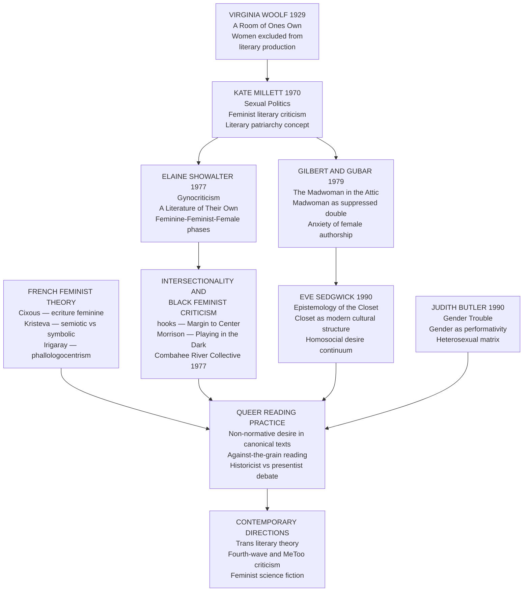

# Feminist and Queer Literary Theory

> [!abstract] TL;DR
> Feminist literary theory exposes how the literary canon has systematically excluded, distorted, and silenced women as both writers and subjects; queer theory reveals how heteronormativity and the compulsory performance of gender structure both canonical texts and the reading practices that evaluate them — together they constitute the most transformative critical movements of the twentieth century, permanently reorienting what we read, who we read, and how we read.

---

## Intuition

**Analogy:** Imagine a vast library built over centuries, with each generation's curators adding new books to the "Classics" shelf. For most of that time, the curators were men, and they added books by men, about men's concerns, from men's perspectives. Occasionally a woman's voice slipped through — usually when she wrote under a man's name (George Eliot, George Sand), or stayed safely within a domestic frame, or was rediscovered centuries after her death. The library's catalogue called itself universal; it described the books on its Classics shelf as "transcendent," "timeless," "speaking to all humanity." Feminist literary theory asked the uncomfortable question: transcendent for whom? Timeless according to whose clock? Speaking to which humanity?

Queer theory then extended the question further. Even within the books by men, about men, something strange had happened: the desire between men — the passionate friendships, the obsessive rivalries, the charged silences — had been consistently rendered invisible, normalized, or expelled from view. The library's Classics shelf contained, encrypted within it, a history of desires that could not speak their name. Queer reading became the practice of listening for what the text could not say aloud — and of asking why the library was so insistent on not hearing it.

---

## How It Works

The development of feminist and queer literary theory can be mapped as a series of intellectual revolutions, each building on and challenging the last, from early twentieth-century attention to women's exclusion from literary production through to the destabilization of gender and sexuality as natural categories.



---

## Key Concepts

### Secondary Level

#### Virginia Woolf and the Material Conditions of Writing

The founding text of feminist literary criticism is not a work of theory but a pair of lectures delivered at Cambridge in 1928, published as **A Room of One's Own (1929)**. Woolf's argument operates at the level of material conditions before aesthetic ones: why have women produced so little of the recognized literary tradition?

Woolf's answer is not biological or psychological but economic and architectural. **"A woman must have money and a room of her own if she is to write fiction."** Money means freedom from the labor — domestic, reproductive, service — that consumed women's time. A room means freedom from interruption, from the perpetual availability that family and social convention required of women. Before any question of talent or genius can be asked, the conditions of production must exist.

To make this concrete, Woolf invents a thought-experiment: **Judith Shakespeare**, the hypothetical sister of William. Equally talented. But Judith cannot go to grammar school, cannot get experience on the stage, is laughed away when she approaches a theater manager, is seduced and made pregnant, and ultimately kills herself. The point is not that women are less talented than men but that talent requires conditions — and those conditions were systematically denied.

The essay also launches what will become a central preoccupation of feminist criticism: **why are there so few women in the literary canon?** Woolf's answer rejects the assumption that canonical exclusion reflects aesthetic judgment and insists it reflects structural power. The curators who built the canon were men; the rules governing entry were written by men; the values deemed "universal" were men's particular values promoted to the status of universality.

#### Kate Millett and Literary Patriarchy

**Sexual Politics (1970)** by Kate Millett is the founding text of academic feminist literary criticism. Millett coined the concept of **"literary patriarchy"**: the systematic use of literature to establish and maintain male dominance over women. Patriarchy operates not just through political institutions but through culture, and literature is one of culture's most powerful instruments.

Millett's method was close reading of celebrated male canonical authors — D.H. Lawrence, Henry Miller, Norman Mailer, Jean Genet — to show how their prose constructed women as objects of male desire, instruments of male self-definition, and threats to be punished or victims to be used. The celebrated "frankness" of these authors was, Millett argued, frankness about male power over women's bodies — presented as liberation but functioning as domination.

Two further contributions defined Millett's importance:

1. **Methodological**: she demonstrated that aesthetic analysis and political analysis are inseparable. The question "is this well-written?" cannot be cleanly separated from "who is speaking, about whom, for whom, to whose benefit?" A style that appears neutral or universal encodes power relations.
2. **Conceptual**: she distinguished **sex** (biological) from **gender** (culturally constructed) in a literary context — anticipating Butler's later elaboration — and argued that the literary representation of women was itself a political act, not merely a reflection of pre-existing social attitudes. Literature does not simply describe the world; it helps construct the world it describes.

#### Elaine Showalter and Gynocriticism

Where Millett analyzed how men write about women, **Elaine Showalter** proposed a different project: studying women's writing as a distinct literary tradition with its own history, its own aesthetic modes, its own concerns. She called this **gynocriticism** — the study of women as writers, as opposed to studying women as subjects of male writing.

**A Literature of Their Own (1977)** traced the evolution of British women's fiction, identifying three phases:

| Phase | Period (approximate) | Orientation | Representative examples |
|-------|----------------------|-------------|------------------------|
| **Feminine** | 1840–1880 | Internalized male aesthetic standards; women wrote in male styles and sometimes adopted male pseudonyms to be taken seriously | George Eliot, Charlotte Bronte as "Currer Bell" |
| **Feminist** | 1880–1920 | Protest against male values; advocacy for women's rights through narrative; the "New Woman" novel and suffrage fiction | Sarah Grand, Olive Schreiner |
| **Female** | 1920–present | Self-discovery and exploration of women's experience on its own terms, without reference to a male standard | Virginia Woolf, Doris Lessing, Adrienne Rich |

Showalter's framework was influential because it offered women's literary history on its own terms rather than as a footnote to a male-defined tradition. However, it was also critiqued for its implicit whiteness — its account of "women's writing" was primarily white, British, and middle-class, with Black and working-class women's writing absent or treated as exceptional. This critique drove the development of intersectional feminist literary criticism in the 1980s.

---

### Undergraduate Level

#### Gilbert and Gubar: The Madwoman in the Attic

**Sandra Gilbert and Susan Gubar's The Madwoman in the Attic (1979)** is the landmark work of American feminist literary criticism. Its title refers to Bertha Mason, the first wife Rochester imprisons in his attic in Charlotte Bronte's *Jane Eyre* — a figure of explosive, uncontrolled feminine rage. Gilbert and Gubar argue that Bertha is not simply a plot device but **the double of Jane herself**: the repressed, socially unacceptable self of the "angel in the house" heroine. The madwoman represents everything the properly feminine woman must suppress — desire, anger, ambition, refusal to comply.

The book's central argument concerns the **anxiety of female authorship**. Harold Bloom had argued in *The Anxiety of Influence* (1973) that male poets struggle with the weight of literary fathers — they must overcome their precursors to establish their own voice. Gilbert and Gubar argue that women writers faced a more fundamental problem: not the anxiety of influence but the anxiety of authorship itself. The cultural equation of literary authority with masculine power — the pen as a phallic instrument — meant that women who wrote were already transgressing. Before they could struggle with literary fathers, they had to overcome the cultural prohibition against their writing at all.

Women writers responded through **strategies of concealment and subversion**: the surface of their texts was acceptable and proper; the buried meaning — encoded in images, figures, doubles, and madwomen — expressed what the surface could not. Reading nineteenth-century women's literature requires attending to both levels simultaneously.

#### French Feminist Theory: Écriture Féminine

A fundamentally different strand of feminist literary theory emerged from France in the 1970s, drawing on psychoanalysis and post-structuralism rather than Anglo-American traditions of close reading and political analysis. The Paris/Anglo-American divide is one of the defining tensions in feminist theory as a whole.

**Hélène Cixous**, in her 1975 essay "The Laugh of the Medusa," argued for **écriture féminine** ("feminine writing") — a specifically female mode of writing that resists the logic of patriarchal language. For Cixous, Western language is organized around binary oppositions (man/woman, active/passive, culture/nature, light/dark) in which one term always dominates the other, and the dominated term is always feminized. Women are trapped in the subordinated half of every binary.

Écriture féminine refuses this logic. It is:
- **Plural** — not organized around a single authoritative voice or unified perspective
- **Excessive** — overflowing the fixed categories of rational discourse rather than respecting their borders
- **Bodily** — centered on the rhythms, multiplicities, and flows of the female body rather than the phallic unity of patriarchal writing
- **Subversive** — capable of dismantling binary hierarchies from within rather than simply inverting them

Cixous deliberately describes écriture féminine in poetic rather than systematic terms, because to systematize it would be to submit it to the patriarchal logic it is meant to escape. This has led to both admiration and the critique that the concept is too vague to be analytically precise.

**Julia Kristeva** offered a related but structurally distinct framework through the distinction between the **semiotic** and the **symbolic**. The symbolic is the realm of structured language — grammar, law, logic, the Name-of-the-Father, the social order. The semiotic is the pre-linguistic realm of bodily drives, rhythmic pulsations, and primary processes — associated with the maternal, with infancy before the imposition of linguistic law. Poetry, music, and avant-garde writing allow the semiotic to irrupt into the symbolic, disrupting its ordered surface. For Kristeva, revolutionary writing is writing that allows the semiotic — coded feminine, though not exclusively female — to destabilize patriarchal symbolic order from within.

**Luce Irigaray** developed the sharpest structural critique in *This Sex Which Is Not One* (1977). Western philosophy, she argued, is **phallologocentric**: it organizes knowledge around the logic of unity, identity, and the self-same — the logic of the one (phallus). Women's sexuality, by contrast, is multiple, plural, self-touching — "this sex which is not one." Women have been defined as the negative or the mirror of masculine self-identity rather than as subjects with their own economy of desire. Feminist literary theory, for Irigaray, must disrupt the specular logic that makes woman man's reflection.

The **Paris/Anglo-American divide** in feminist theory is structurally important:

| Dimension | French theory | Anglo-American theory |
|-----------|--------------|----------------------|
| Theoretical foundation | Psychoanalysis, post-structuralism, Lacanian linguistics | Empiricism, political philosophy, materialist analysis |
| Relation to "woman" as category | Suspicious — "woman" is itself a patriarchal category; the goal is to deconstruct it | Committed — "woman" is a political identity whose oppression must be named and resisted |
| Focus | Language, desire, the unconscious as sites of political struggle | Canon revision, literary history, institutional critique |
| Risk | Biological essentialism if body-language is read literally; abstraction that loses political traction | Liberal individualism that ignores structural forces; racial and class myopia |

#### Intersectionality and Black Feminist Literary Criticism

The dominant strand of 1970s feminist literary criticism — Showalter, Gilbert and Gubar — was significantly challenged in the 1980s by Black feminist critics who showed that its "women's experience" was in fact white, middle-class, and heterosexual experience masquerading as universal.

**bell hooks**, in *Feminist Theory: From Margin to Center* (1984), argued that mainstream feminist criticism had constructed a vision of women's literary experience that was white and middle-class at its center, with Black women visible primarily as exceptions or supplements. The "margin" was not a peripheral location but an epistemically productive one: those at the margin of dominant discourse have a perspective on the whole system that those at the center systematically lack, because they must understand both their own world and the dominant one to survive within it.

**Audre Lorde**'s essay "The Master's Tools Will Never Dismantle the Master's House" (1984) made the methodological point precisely: if feminist literary criticism uncritically accepts the tools of dominant critical discourse — its categories, its aesthetic standards, its institutional structures — it will reproduce the exclusions of that discourse within feminist theory itself. Difference within feminism — of race, class, sexuality — must be treated not as a problem to be managed toward unity but as a source of critical strength.

**Toni Morrison**'s *Playing in the Dark: Whiteness and the Literary Imagination* (1992) is the definitive work of Black feminist literary criticism. Morrison asked a question that had been invisible in canonical literary criticism: what role does the presence of Africans and African-Americans — what she calls the **Africanist presence** — play in the imagination of canonical American literature? Her answer: whiteness in American fiction is not a neutral background but is *constructed* in relation to Blackness. The freedom, innocence, individualism, and expansiveness celebrated in canonical American writing (Melville, Poe, Hemingway, Cather) are defined against an implied Black presence — enslaved, silenced, or projected onto as a screen for white anxieties and fantasies.

The **Combahee River Collective Statement (1977)** had articulated the political foundation for this intellectual project: "We are actively committed to struggling against racial, sexual, heterosexual, and class oppression, and see as our particular task the development of integrated analysis and practice based upon the fact that the major systems of oppression are interlocking." This insight — that gender cannot be analyzed in isolation from race, class, and sexuality — became the basis of what Kimberlé Crenshaw would formalize as intersectionality, and it directly challenges any feminist literary criticism that treats gender as the single axis of literary analysis (see [[Intersectionality]]).

---

### Graduate Level

#### Queer Theory: Sedgwick and the Epistemology of the Closet

Queer theory emerged in the early 1990s at the intersection of feminist theory, post-structuralism, and gay and lesbian studies. Its two founding texts appeared in the same year.

**Eve Kosofsky Sedgwick's *Epistemology of the Closet* (1990)** argued that **the closet** — the structure by which gay people are simultaneously known and not known, visible and invisible, inside and outside — is not merely a personal predicament but a **structuring metaphor of modern Western culture**. The epistemological framework of knowing and not knowing sexual identity shapes how knowledge works, how relationships are organized, and how institutions handle secrets. Sedgwick's earlier *Between Men* (1985) had established the concept of the **homosocial desire continuum**: in patriarchal culture, relations between men — political alliances, literary rivalries, mentorships, friendship — are organized around the desire to bond with the masculine, a desire that is simultaneously required for social functioning and must be carefully policed against its erotic dimension. The line between the homosocial and the homosexual is maintained only by massive cultural effort, and that effort leaves its traces in texts.

**Judith Butler's *Gender Trouble* (1990)** is the single most influential work in queer theory. Butler's core argument: gender is not an expression of a pre-existing inner essence — there is no biological or psychological "woman" or "man" whose gender then gets expressed in culturally variable ways. Instead, gender is **performative**: it is constituted through repeated, citational performances of acts, styles, gestures, and dispositions that *cite* (reference and reproduce) prior norms. The repeated performance produces the *appearance* of a natural, essential, prior gender — but that appearance is the effect of the performance, not its cause.

**Performativity** must be sharply distinguished from the colloquial reading that "gender is just a performance" (as if we consciously choose to act a gender, like an actor choosing a role). Butler means something more radical: there is no pre-performative self that exists prior to its gender performances. The self is *constituted through* the performances. Gender is compulsory precisely because it must be constantly re-enacted to maintain the fiction of a natural prior essence — and failure to cite the norms correctly is punished with social violence.

**The heterosexual matrix** is Butler's term for the regulatory schema that requires bodies to have a natural sex, that sex to be expressed as a coherent gender (masculine or feminine), and that gender to desire the opposite gender sexually. Compulsory heterosexuality (Adrienne Rich's term, which Butler adopts) is not simply a preference but a **regulatory fiction**: the cultural apparatus that produces the bodies, desires, and identities it claims merely to organize.

Butler's account of gender as performative has a direct literary-critical implication: if gender is produced through the citation of norms, then literary texts are one of the primary sites at which those norms are cited, rehearsed, contested, and (occasionally) subverted. Close reading of gender in literature is, for Butler, an exercise in reading the mechanics of norm-reproduction and norm-disruption.

#### Queer Reading Practices: Against the Grain

Queer theory is not only a theory of identity but a **reading practice**: a method for finding the non-normative, the subversive, the "perverse" in canonical texts, including texts written before the modern categories of homosexuality and heterosexuality existed.

Sedgwick's readings of **Herman Melville's *Billy Budd*** and **Oscar Wilde's *The Picture of Dorian Gray*** are exemplary. In *Billy Budd*, the relationship between the beautiful sailor and Captain Vere operates as a charged homosocial triangle (Billy / Claggart / Vere) in which erotic attachment and institutional violence are structurally inseparable — the inextricability being evidence of the epistemological pressure the closet exerts on narrative form itself. In Wilde, queer subtext is closer to the surface but still encoded: *Dorian Gray* was prosecuted at Wilde's trial precisely because its surface heterosexual plot barely concealed the homoerotic relationship between Basil Hallward and Dorian.

The **historicist vs. presentist debate** is fundamental to queer reading:

| Position | Core claim | Risk |
|----------|-----------|------|
| **Strict historicist** | "Homosexuality" as a category was invented in 1869 (Westphal); applying it to pre-modern texts is anachronism that distorts historical experience | Renders historical sexuality unreadable; forecloses solidarity with the past |
| **Constructionist historicist** | Sexual categories are historically variable; we can study past sexual cultures on their own terms without forcing them into modern identities (Foucault) | Can produce a historicism that only ever finds difference, not connection |
| **Presentist** | Queerness as a refusal of heteronormativity is transhistorical; the past can speak to the present in what Freccero calls "strategic presentism" | Risks projecting modern frameworks onto very different historical configurations |
| **Pragmatist** | Both approaches serve different critical purposes; the question is what a given reading is for (Heather Love) | Can become theoretically uncommitted or evasive |

The distinction matters practically: a strictly historicist reading will refuse to call Shakespeare's sonnets "homosexual" because that category did not exist; a presentist reading will find in them evidence of queer desire regardless of historical category. Neither is simply correct; both reveal different things about both past and present.

**Applied queer readings of the straight canon:**

- **Jane Austen**: The passionate attachments between women in Austen's novels (Emma and Harriet Smith; Marianne and Elinor) have been read as sites of female homosociality and suppressed erotics — not to claim Austen was covertly gay but to show how her texts resist the heterosexual resolution demanded by their plots and by convention.
- **Shakespeare**: The cross-dressing heroines (Viola, Rosalind, Portia) and the homoerotic sonnets (1–126, addressed to a young man) produce a theatrical instability of gender and desire that queer readings find politically productive. The question is not Shakespeare's biographical sexuality but the textual structure of desire the plays produce.
- **Dickens**: The passionate male friendships (Pip and Herbert Pocket; David Copperfield and Steerforth) and the constant deferral or displacement of heterosexual coupling have been read through Sedgwick's homosocial theory: the bonds that structure the novels require the simultaneous disavowal of their erotic dimension, and that disavowal leaves legible marks.

#### The Future: Trans Theory, MeToo, and Feminist Science Fiction

Contemporary feminist and queer literary theory has developed in several productive directions simultaneously.

**Trans literary theory** pushes Butler's performativity beyond its original scope. If gender is performed rather than essential, the experience of gender dysphoria — the felt sense that one's body does not match one's gender — poses a genuine challenge to frameworks that treat all gender identity as constructed performance. Trans scholars (Susan Stryker, Jack Halberstam, C. Riley Snorton) have both extended queer theory's critique of binary gender and challenged its tendency to celebrate gender instability as inherently subversive — transition often involves a desire for a *stable*, livable gender identity, not an endless ironic citational performance. Trans literary theory reads texts for the experience of embodied gender misalignment and the social violence that punishes non-normative bodies, rather than celebrating transgression as such.

**The #MeToo moment** raised a question that feminist criticism had long theorized but that now had urgent practical stakes: how do we read the work of authors whose depictions of women are structured by the very patriarchal gaze that feminist criticism exposes? The "death of the author" (Barthes) seemed to offer one answer — judge only the text, not the person. But biographical criticism returned with force through the lens of power: the author's institutional power over the women he wrote about was not separable from the text's power over readers. The question of how to read Hemingway, Philip Roth, and others is not resolved, but it has been reframed: rather than asking "is the work good despite the author's behavior?" feminist criticism asks "what relationship between gendered power and aesthetic production does this work enact, and what does that relationship ask of its readers?"

**Feminist science fiction** — Ursula Le Guin (*The Left Hand of Darkness*, 1969), Octavia Butler (*Parable of the Sower*, 1993), Joanna Russ (*The Female Man*, 1975) — has been reclaimed as a site of serious feminist thought-experiment. Precisely because speculative fiction can construct worlds with different biological and social arrangements, it can **defamiliarize** what appears natural about gender and sexuality in the actual world. Le Guin's ambisexual Gethenians — who are neither male nor female except during their periodic reproductive phase — make visible what heteronormative culture suppresses: the extent to which social organization is structured around a gender dimorphism that biology does not strictly require. Octavia Butler's interspecies relationships disrupt the racial and gendered hierarchies embedded in American literary convention by constructing scenarios in which those hierarchies are rendered strange, contingent, and therefore alterable.

---

## Python Demo

```python
import numpy as np
import matplotlib.pyplot as plt
from matplotlib.patches import Patch

# Simulate gender bias in a fictional book corpus and model the effect of
# a feminist critique correction on canonization rates.
# Uses only numpy and matplotlib.

rng = np.random.default_rng(42)
N = 200

# ── Simulate book attributes ───────────────────────────────────────────────────
# 0 = male, 1 = female throughout
author_gender      = rng.choice([0, 1], size=N, p=[0.55, 0.45])
protagonist_gender = rng.choice([0, 1], size=N, p=[0.60, 0.40])

# Bechdel test: female-authored books pass at 74%, male-authored at 26%
bechdel = rng.binomial(1, np.where(author_gender == 1, 0.74, 0.26))

# ── Critical acclaim scores (1–10) ────────────────────────────────────────────
# base_quality represents underlying literary merit, independent of gender
base_quality = rng.normal(6.0, 1.4, N)

AUTHOR_BIAS = 1.10   # male-author advantage in biased critical reception
PROT_BIAS   = 0.60   # male-protagonist advantage

author_effect = np.where(author_gender == 0, +AUTHOR_BIAS, -AUTHOR_BIAS)
prot_effect   = np.where(protagonist_gender == 0, +PROT_BIAS, -PROT_BIAS)

acclaim_orig = np.clip(base_quality + author_effect + prot_effect, 1.0, 10.0)

# ── Canonization: logistic function of acclaim ────────────────────────────────
CANON_THRESHOLD = 6.9   # score at which P(canonization) = 0.5

def canon_prob(acc):
    return 1.0 / (1.0 + np.exp(-(acc - CANON_THRESHOLD)))

p_orig     = canon_prob(acclaim_orig)
canon_orig = rng.binomial(1, p_orig)

# ── Feminist critique correction: 70% reduction in gender bias ────────────────
REDUCTION          = 0.70
corr_author_effect = (1.0 - REDUCTION) * author_effect
corr_prot_effect   = (1.0 - REDUCTION) * prot_effect

acclaim_corr = np.clip(base_quality + corr_author_effect + corr_prot_effect, 1.0, 10.0)
p_corr       = canon_prob(acclaim_corr)
canon_corr   = rng.binomial(1, p_corr)

# ── Per-group canonization rates ──────────────────────────────────────────────
group_labels = ["M auth\nM prot", "M auth\nF prot", "F auth\nM prot", "F auth\nF prot"]
group_masks = [
    (author_gender == 0) & (protagonist_gender == 0),
    (author_gender == 0) & (protagonist_gender == 1),
    (author_gender == 1) & (protagonist_gender == 0),
    (author_gender == 1) & (protagonist_gender == 1),
]

def rate(mask, canon):
    return canon[mask].mean() if mask.sum() > 0 else 0.0

rates_orig = [rate(m, canon_orig) for m in group_masks]
rates_corr = [rate(m, canon_corr) for m in group_masks]

# ── Four-panel plot ───────────────────────────────────────────────────────────
fig, axes = plt.subplots(2, 2, figsize=(14, 10))
M_COLOR   = "#1d4ed8"
F_COLOR   = "#be185d"
bins      = np.linspace(1, 10, 28)
male_mask   = author_gender == 0
female_mask = author_gender == 1
g_colors    = [M_COLOR, M_COLOR, F_COLOR, F_COLOR]

# Panel 1: Original acclaim distributions by author gender
ax = axes[0, 0]
ax.hist(acclaim_orig[male_mask],   bins=bins, density=True, alpha=0.55,
        color=M_COLOR, label="Male-authored")
ax.hist(acclaim_orig[female_mask], bins=bins, density=True, alpha=0.55,
        color=F_COLOR, label="Female-authored")
ax.axvline(acclaim_orig[male_mask].mean(),   color=M_COLOR, linestyle="--", lw=1.8,
           label=f"Male mean = {acclaim_orig[male_mask].mean():.2f}")
ax.axvline(acclaim_orig[female_mask].mean(), color=F_COLOR, linestyle="--", lw=1.8,
           label=f"Female mean = {acclaim_orig[female_mask].mean():.2f}")
ax.axvline(CANON_THRESHOLD, color="gray", linestyle=":", lw=1.5,
           label=f"Canon threshold = {CANON_THRESHOLD}")
ax.set_title("Panel 1: Original Acclaim Distribution\n(Biased critical reception)",
             fontweight="bold")
ax.set_xlabel("Critical acclaim score (1-10)")
ax.set_ylabel("Density")
ax.legend(fontsize=7.5)

# Panel 2: Original canonization rates by author-gender x protagonist-gender
ax = axes[0, 1]
bars = ax.bar(group_labels, rates_orig, color=g_colors, alpha=0.85,
              edgecolor="white", linewidth=1.5)
for bar, r in zip(bars, rates_orig):
    ax.text(bar.get_x() + bar.get_width() / 2, r + 0.015,
            f"{r:.0%}", ha="center", va="bottom", fontsize=9, fontweight="bold")
ax.set_ylim(0, 1.0)
ax.set_title("Panel 2: Original Canonization Rates\n(Patriarchal canon)",
             fontweight="bold")
ax.set_ylabel("Canonization rate")
ax.legend(handles=[Patch(color=M_COLOR, alpha=0.85, label="Male-authored"),
                   Patch(color=F_COLOR, alpha=0.85, label="Female-authored")],
          fontsize=8)

# Panel 3: Corrected acclaim distributions
ax = axes[1, 0]
ax.hist(acclaim_corr[male_mask],   bins=bins, density=True, alpha=0.55,
        color=M_COLOR, label="Male-authored")
ax.hist(acclaim_corr[female_mask], bins=bins, density=True, alpha=0.55,
        color=F_COLOR, label="Female-authored")
ax.axvline(acclaim_corr[male_mask].mean(),   color=M_COLOR, linestyle="--", lw=1.8,
           label=f"Male mean = {acclaim_corr[male_mask].mean():.2f}")
ax.axvline(acclaim_corr[female_mask].mean(), color=F_COLOR, linestyle="--", lw=1.8,
           label=f"Female mean = {acclaim_corr[female_mask].mean():.2f}")
ax.axvline(CANON_THRESHOLD, color="gray", linestyle=":", lw=1.5,
           label=f"Canon threshold = {CANON_THRESHOLD}")
ax.set_title("Panel 3: Corrected Acclaim Distribution\n(70% feminist critique correction)",
             fontweight="bold")
ax.set_xlabel("Critical acclaim score (1-10)")
ax.set_ylabel("Density")
ax.legend(fontsize=7.5)

# Panel 4: Side-by-side original vs corrected canonization rates
ax = axes[1, 1]
x = np.arange(len(group_labels))
w = 0.38
ax.bar(x - w / 2, rates_orig, w, color=g_colors, alpha=0.45,
       edgecolor="gray", linewidth=1.0)
b_corr = ax.bar(x + w / 2, rates_corr, w, color=g_colors, alpha=0.92,
                edgecolor="black", linewidth=1.2)
for bar, r in zip(b_corr, rates_corr):
    ax.text(bar.get_x() + bar.get_width() / 2, r + 0.013,
            f"{r:.0%}", ha="center", va="bottom", fontsize=8)
ax.set_xticks(x)
ax.set_xticklabels(group_labels, fontsize=9)
ax.set_ylim(0, 1.0)
ax.set_title("Panel 4: Corrected Canonization Rates\n(Original vs Post-Feminist Critique)",
             fontweight="bold")
ax.set_ylabel("Canonization rate")
ax.legend(handles=[Patch(facecolor="gray", alpha=0.45, label="Original (biased)"),
                   Patch(facecolor="gray", alpha=0.92, edgecolor="black",
                         label="Corrected (feminist)")],
          fontsize=8)

plt.suptitle(
    f"Quantitative Feminist Criticism: Gender Bias in the Literary Canon\n"
    f"N={N} simulated books  |  {REDUCTION*100:.0f}% feminist critique correction to bias coefficients",
    fontsize=11, fontweight="bold"
)
plt.tight_layout()
plt.savefig("feminist_literary_canon_simulation.png", dpi=150)
plt.show()

# ── Numeric summary ────────────────────────────────────────────────────────────
print(f"\n{'Group':<22} {'N':>4} {'Orig Acclaim':>13} {'Corr Acclaim':>13} "
      f"{'Orig Canon':>11} {'Corr Canon':>11} {'Change':>8}")
print("-" * 88)
for label, mask in zip(group_labels, group_masks):
    lbl = label.replace("\n", " ")
    n_g = mask.sum()
    a_o = acclaim_orig[mask].mean()
    a_c = acclaim_corr[mask].mean()
    r_o = rate(mask, canon_orig)
    r_c = rate(mask, canon_corr)
    print(f"{lbl:<22} {n_g:>4}  {a_o:>11.2f}  {a_c:>11.2f} "
          f"{r_o:>10.1%} {r_c:>10.1%} {r_c - r_o:>+7.1%}")
```

**What the output shows:** The original biased corpus produces a wide acclaim gap between male-authored and female-authored books, with the "F author / F prot" group falling furthest below the canonization threshold and receiving the lowest canonization rate. After the 70% feminist critique correction — modeling the effect of applying feminist critical standards that refuse to discount female authorship and female-centered narratives — the acclaim distributions of male and female-authored books converge, and the canonization rate for the "F author / F prot" group rises most sharply. The simulation illustrates quantitatively what feminist critics argue historically: canon formation is not a neutral aesthetic process but a system that encodes evaluative bias, and that bias is correctable through deliberate critical intervention.

---

## Real-World Applications

> **The Norton Anthology Canon Revision**: The *Norton Anthology of Literature by Women*, edited by Gilbert and Gubar (1985), and the progressive revisions to the *Norton Anthology of English Literature* (now in its 10th edition) offer the clearest institutional trace of feminist literary criticism's impact on the canon. The proportion of women authors in the NAEL increased from under 5% in earlier editions to over 30% in recent editions. This was not the result of changing aesthetic standards but of changing the question: rather than asking "which texts best represent the tradition?" editors began asking "which tradition do we want to represent, and who has been systematically excluded from it?" The canon is not a natural deposit of great writing but a political document with a revisable editorial history.

> **Gender Trouble and the LGBTQ Rights Movement**: Judith Butler's *Gender Trouble* (1990) began as a work of literary and philosophical theory but became one of the most cited academic texts of the twentieth century and a foundational document of queer politics globally. The concept that gender is performative — that it has no natural essence that the law or medicine merely recognizes — provided the theoretical basis for legal challenges to gender-essentialist definitions in law, for the argument that sex assigned at birth is not destiny, and for activist frameworks across LGBTQ organizing. The 1990 founding of ACT UP's Queer Nation and the subsequent development of queer theory as an activist as well as academic discourse were intertwined.

> **Toni Morrison and the Nobel Prize (1993)**: Morrison's Nobel Prize — the first awarded to a Black American woman — represented the institutional validation of Black feminist literary criticism's argument that African-American women's writing constituted a major literary tradition, not a subcategory of either "American literature" or "women's literature." Morrison's Nobel lecture itself extended the theoretical project of *Playing in the Dark* by arguing that language is "one of the principal ways in which we slip into and out of each other's lives." The prize did not resolve the structural questions Morrison raised about the Africanist presence in the American literary imagination, but it made them unavoidable at the center of canonical discourse.

> **The Bechdel Test as Cultural Metric**: Alison Bechdel's 1985 comic strip introduced a test for female representation in film (subsequently applied to literature): a work passes if it contains (1) at least two named women characters, (2) who talk to each other, (3) about something other than a man. The test is deliberately minimal and was originally presented as a joke — but its application to Hollywood film revealed that the majority of mainstream releases fail it. The Bechdel test became a widely used metric in both cultural criticism and industry diversity discussions, illustrating how feminist literary theory's formal concerns (who speaks, to whom, about what) can be operationalized into quantitative cultural analysis.

---

## Common Pitfalls

- **Confusing performativity with performance** — The most common misreading of Butler is the claim that "gender is just a performance" in the theatrical sense, as if individuals choose to perform a gender they could drop at will. Butler explicitly rejects this reading: performativity is not performance. The subject who performs gender is constituted *through* those performances and has no pre-gendered standpoint from which to choose freely. Failing to grasp this distinction produces a voluntarist reading that Butler's framework is explicitly designed to avoid.

- **Reading écriture féminine as biological essentialism** — Cixous's claim that feminine writing is centered on the body is frequently misread as arguing that women biologically write differently from men. Cixous explicitly rejects this: écriture féminine is not about female biology but about a mode of writing that refuses phallogocentric logic; men can write it and women can write in patriarchal modes. The confusion arises because Cixous uses the body metaphorically and poetically rather than literally — a deliberate choice that has a cost in analytical precision.

- **The whiteness problem in gynocriticism** — Showalter's influential gynocritical framework traces a tradition of "women's writing" that is primarily white, British, and middle-class. Treating this as "women's writing" in general reproduces the very erasure that Black feminist critics (hooks, Lorde, Morrison) identified as the central failure of mainstream feminist theory. Applying the gynocritical framework without attending to this limitation will produce an analysis that mistakes a partial tradition for a universal one.

- **Anachronistic identity attribution in queer reading** — Queer readings of pre-modern texts risk the historicist trap of projecting modern sexual identity categories onto periods when those categories did not exist. Calling Marlowe's Edward II "homosexual" in the modern psychological sense imports a nineteenth-century category into a sixteenth-century context. The queer reading does not require this attribution: it can attend to the structural organization of desire, the distribution of erotic charge, and the instabilities of gender performance without claiming that any character corresponds to a modern identity category.

- **Reducing intersectionality to addition** — A critical error in applying Black feminist literary criticism is treating race and gender as separate variables that simply add up: "a Black woman's experience = a Black man's experience + a white woman's experience." Crenshaw's intersectional insight — and Morrison's literary application of it — is that these axes are mutually constitutive: the Africanist presence in American literature is always already gendered; the gender dynamics in American fiction are always already racialized. Analytical separation distorts both dimensions (see [[Intersectionality]]).

- **Treating the closet as a timeless structure** — Sedgwick's epistemology of the closet is a historical argument: the closet as a structuring metaphor of Western culture is a product of the late nineteenth century's invention of homosexual identity. Projecting it onto ancient Greece or pre-modern Japan — where same-sex acts were organized by entirely different social and symbolic frameworks — misapplies a historically specific analysis. Queer reading must be aware of the historicity of the frameworks it deploys.

- **Canon revision as sufficient feminist intervention** — Recovering women writers and adding them to syllabi is necessary but not sufficient as feminist literary criticism. Morrison's project in *Playing in the Dark* goes further: it does not just add Black women writers to the existing canon but asks how the existing canon's foundational texts — its Melvilles and Hawthornes — were themselves produced by and for a racial imagination. Feminist and queer criticism at its most powerful does not just diversify the canon; it changes how we read the texts already inside it.

---

## Related Concepts

- [[Gender_Sex_and_Patriarchy]] — The direct sociological counterpart to this note: de Beauvoir's foundational "one is not born, but becomes, a woman," Butler's performativity in sociological context, and the full taxonomy of patriarchy as a social system; essential for connecting literary analysis to structural social theory
- [[Intersectionality]] — Crenshaw's framework for how gender, race, class, and sexuality are mutually constitutive rather than additive; Black feminist literary criticism (hooks, Morrison, Lorde) applies exactly this framework to the literary canon, and cannot be fully understood without the theoretical infrastructure Crenshaw provides
- [[Gender_Sexuality_and_the_Body]] — The anthropological counterpart: Mead on gender as cultural construction, Butler's performativity in cross-cultural context, the ethnography of third genders and sexual diversity; demonstrates that the literary-theoretical claims about gender's non-naturalness are supported by comparative ethnographic evidence
- [[Language_Identity_and_Power]] — Bourdieu's linguistic capital, Gramsci's hegemony, and the analysis of how language encodes social hierarchies intersect directly with feminist literary theory's account of écriture féminine and the politics of who gets to write in which register; Irigaray's phallologocentrism is a specific application of the language-power nexus
- [[Prejudice_and_Discrimination]] — Stereotype threat and implicit bias are the psychological mechanisms through which the evaluative biases that produce skewed literary canonization operate; the simulation in the Python demo models at the macro level what stereotype threat research documents at the individual level
- [[Race_Ethnicity_and_Racism]] — Morrison's *Playing in the Dark* is simultaneously a work of literary criticism and a theory of how whiteness is constructed through racialized literary imagination; the connection between literary representation and racial ideology is the direct subject of this sociology note

---

## Review Questions

### Secondary

1. Virginia Woolf argues that women have written less than men throughout history not because they are less talented but because of material conditions. What are those conditions, and what does the story of Judith Shakespeare illustrate about them?
2. Kate Millett argued that celebrated male authors like D.H. Lawrence and Henry Miller were writing not liberating prose but "literary patriarchy." What does this mean, and what does it imply about the relationship between aesthetic quality and political content?
3. What is the Bechdel test? Apply it to a film or novel you know well and explain what the result does and does not tell us about gender representation in that work.

### Undergraduate

1. Showalter's gynocriticism traces three phases of women's writing: feminine, feminist, and female. Using two specific works of women's fiction, analyze how they fit or complicate this periodization — and what the framework's whiteness problem means for its application to works by Black, South Asian, or Latina women writers.
2. Compare Cixous's concept of écriture féminine with Kristeva's semiotic/symbolic distinction. In what ways do they agree about the relationship between language and patriarchal power? In what ways do they diverge? Which framework do you find more analytically useful for reading a specific literary text, and why?
3. Judith Butler argues that gender is performative and that there is no pre-discursive gender essence that performances express. Evaluate one objection to this claim: the objection from trans experience, which argues that gender dysphoria — the felt sense of gender mismatch — presupposes a real gender identity that exists prior to any performance. Does Butler's framework have resources to answer this objection, or does it require modification?

### Graduate

1. The "historicist vs. presentist" debate in queer theory concerns whether we can apply modern sexual identity categories to pre-modern texts. Reconstruct the strongest version of each position using specific textual and historical evidence, then develop a methodological principle that would allow a queer reading to be both historically responsible and politically productive.
2. Toni Morrison argues in *Playing in the Dark* that the freedom, individualism, and expansiveness celebrated in canonical American literature are constructed through — not merely alongside — the presence of an enslaved Africanist population. This is a structural claim about literary imagination, not simply a thematic observation. Design a research methodology — involving close reading and corpus analysis — that would allow you to test Morrison's structural claim empirically across a large sample of antebellum American fiction.
3. bell hooks argues that feminist literary criticism, by centering white women's experience as the universal template of "women's experience," reproduces within feminist theory the very exclusions it sets out to critique. Using three specific works of feminist literary criticism (at least one from the Anglo-American tradition and at least one from the Black feminist tradition), evaluate the extent to which feminist literary theory has successfully responded to this critique in the decades since *Feminist Theory: From Margin to Center* (1984) — and identify what structural barriers to its full incorporation remain.

---

## Sources

- [Woolf, V. (1929). *A Room of One's Own* — Project Gutenberg](https://www.gutenberg.org/ebooks/5ආ)
- [Millett, K. (1970). *Sexual Politics* — summary and analysis — Literary Theory and Criticism](https://literariness.org/2016/04/26/kate-millets-sexual-politics/)
- [Showalter, E. (1977). Gynocriticism — overview — Britannica](https://www.britannica.com/topic/gynocriticism)
- [Gilbert, S. and Gubar, S. (1979). *The Madwoman in the Attic* — summary — SparkNotes-style overview](https://www.poetryfoundation.org/articles/69390/the-madwoman-in-the-attic)
- [Cixous, H. (1976). "The Laugh of the Medusa" — Signs Vol. 1 No. 4 — JSTOR](https://www.jstor.org/stable/3173239)
- [Butler, J. (1990). *Gender Trouble* — overview — Internet Encyclopedia of Philosophy](https://iep.utm.edu/butler/)
- [Sedgwick, E.K. (1990). *Epistemology of the Closet* — overview — Duke University Press](https://www.dukeupress.edu/epistemology-of-the-closet)
- [hooks, b. (1984). *Feminist Theory: From Margin to Center* — overview — South End Press](https://southendpress.org/products/feminist-theory-from-margin-to-center)
- [Morrison, T. (1992). *Playing in the Dark: Whiteness and the Literary Imagination* — Harvard University Press](https://www.hup.harvard.edu/books/9780674673779)
- [Combahee River Collective Statement (1977) — full text — circuitous.org](https://combaheerivercollective.weebly.com/the-combahee-river-collective-statement.html)
- [Feminist Literary Criticism — overview — Purdue OWL](https://owl.purdue.edu/owl/subject_specific_writing/writing_in_literature/literary_theory_and_schools_of_criticism/feminist_criticism.html)
- [Queer Theory — Stanford Encyclopedia of Philosophy](https://plato.stanford.edu/entries/queer-theory/)
- [The Bechdel Test — overview and data — bechdeltest.com](https://bechdeltest.com/)

---

#LiteratureRhetoric #LiteraryTheory #FeministCriticism #QueerTheory
