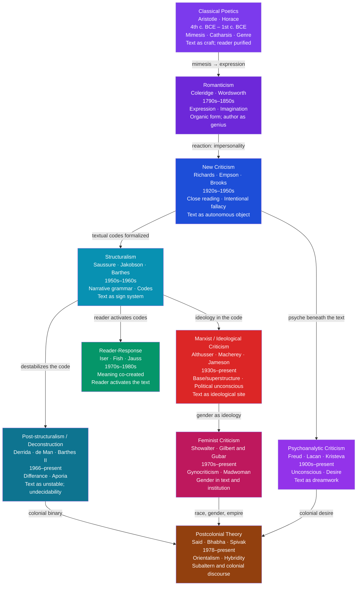

# Literary Theory — An Overview

> [!abstract] TL;DR
> Literary theory is the systematic, reflexive study of how we read, interpret, and evaluate texts — asking not just "what does this text mean?" but "how do we decide what it means, who gets to decide, and what counts as a text at all?"; the major schools from Aristotle through deconstruction and postcolonialism represent successive answers to those questions, each foregrounding a different element of the reading triangle — text, author, or reader — as the primary site of meaning.

---

## Intuition

**Analogy:** Imagine you are handed a map with no legend. You can see lines, shaded regions, symbols, and colors. You can describe what you see. But you cannot read the map — you do not know whether the blue lines are rivers or roads, whether the shading indicates elevation or rainfall, whether the symbols mark cities or cathedrals. The map is in front of you, but its meaning requires a framework you do not yet possess.

Now imagine three experts standing beside you. The first says: "The mapmaker drew this according to a precise intent — we must recover what the cartographer meant, and only that is the true reading." The second says: "The conventions of cartographic language are what matter — learn the code and the map yields its meaning; the cartographer is irrelevant." The third says: "You are not a passive receiver — you bring your geography, your purposes, and your prior maps to this one, and the map means something different to a soldier, a merchant, and a shepherd."

Literary theory is the discipline that makes these three competing frameworks — author-centred, text-centred, and reader-centred — explicit, examines their assumptions, and asks which best accounts for how meaning actually works in literary experience. Every major school of literary theory can be positioned within or against this triangle.

---

## How It Works



The diagram follows two organizing axes. The *temporal axis* runs from ancient poetics to contemporary postcolonialism — each school emerged partly in response to the limitations or assumptions of its predecessor. The *conceptual axis* runs from **text-centred** approaches (New Criticism, Structuralism) through **context-centred** approaches (Marxism, Feminism, Postcolonialism) to **reader-centred** approaches (Reader-Response), with Deconstruction occupying an oblique position that dissolves the triangle altogether by showing that the text cannot be a stable object for any reading to begin from.

---

## Key Concepts

### Secondary Level

**What Is Literary Theory?**

There is a deceptively simple distinction that almost every introduction to literary theory makes, and it is worth taking seriously: *literary criticism* is what you do when you interpret a specific text — when you argue about what *Hamlet*'s hesitation means, or why *Jane Eyre*'s ending is unsatisfying. *Literary theory* is the second-order inquiry into the conditions, methods, and assumptions of that interpretation — asking how we decide what good evidence is, what counts as a valid reading, whose interpretations have authority, and whether any of those questions can be answered without first deciding what a text is.

In Matthew Arnold's 19th-century formulation, criticism was the attempt to see the object as it really is — to identify and transmit "the best that has been thought and said." This is already a theoretical commitment: it presupposes that texts have determinate qualities that a trained reader can recognize, that some texts are better than others, and that those better texts educate the character of readers who encounter them. Stated explicitly, it invites the challenge: better by whose standards? Trained to read by whom? Educating readers into whose values?

Literary theory begins, structurally, when those questions become unavoidable — when the self-evidence of the critical enterprise breaks down and the assumptions underlying it have to be examined rather than inherited.

**The Reading Triangle: Author, Text, Reader**

Every theory of literary meaning can be located relative to three elements:

| Element | What it emphasizes | Representative theory |
|---------|-------------------|----------------------|
| **Author** | Meaning = what the author intended; biography and context are evidence | Intentionalism (Hirsch); Biographical criticism |
| **Text** | Meaning is in the text itself; authorial intention is inaccessible or irrelevant | New Criticism; Structuralism |
| **Reader** | Meaning is produced in the act of reading; different readers produce different meanings | Reader-Response (Iser, Fish); Reception aesthetics |

No school occupies a pure position. Deconstruction shows that the text cannot secure its own meaning; Marxism and feminism restore context but in ways that problematize the autonomous author; psychoanalytic criticism foregrounds the author's unconscious, which the author cannot intend. The triangle is heuristic, not a taxonomy.

**Classical Poetics: Aristotle and Mimesis**

Aristotle's *Poetics* (c. 335 BCE) is the founding document of Western literary theory. Its organizing concept is *mimesis* — usually translated as "imitation" but better understood as *structured representation*. Tragedy does not copy life; it represents human action in a form that isolates the essential structure of that action from the accidents of real events.

Aristotle's six elements of tragedy — **plot** (*mythos*), **character** (*ethos*), **thought** (*dianoia*), **diction** (*lexis*), **song** (*melos*), and **spectacle** (*opsis*) — are ranked in importance, with plot first. This is a claim about what literature is *for*: tragedy represents complete actions with beginnings, middles, and ends, in order to produce *catharsis* — the purgation or clarification of pity and fear in the audience. Literary form is teleological: it is organized by its effect on the reader.

Two implications persist throughout Western literary theory:

1. **Form has meaning.** The way a narrative is organized is not neutral packaging around a theme; the structure is part of what the work says.
2. **Literature and morality are connected.** Catharsis connects literary experience to emotional education. This connection is assumed by most pre-20th-century criticism and radically challenged by 20th-century formalism.

**Romanticism: Expression and the Author-Genius**

By the late 18th century, the dominant model of literary value had shifted from *craft and convention* (the neoclassical ideal: follow the rules Aristotle derived from Homer) to *expression and originality*. Wordsworth's Preface to *Lyrical Ballads* (1800) defined poetry as "the spontaneous overflow of powerful feelings" — the work emanates from the poet's inner experience and its authenticity is its primary value.

Coleridge elaborated the concept of **organic form**: a poem is not built from external rules but grows from within, like a plant, its form inseparable from its meaning. This is explicitly anti-Aristotelian — form is not a container or a vehicle but the living structure of meaning.

The Romantic model of the **author-genius** — the poet as uniquely sensitive individual whose imagination mediates between individual experience and universal truth — had enormous consequences for literary education: it licensed the biographical approach (the poet's life illuminates the work), elevated lyric poetry above other genres (it most directly expresses inner life), and created the idea of the literary "canon" as a set of great works by great individuals.

The 20th century's major theoretical moves — New Criticism, Structuralism, the Death of the Author — were all, in part, reactions against this model.

---

### Undergraduate Level

**New Criticism: The Text as Autonomous Object**

New Criticism was the dominant mode of academic literary study in British and American universities from the 1930s through the 1960s. Its defining move was the **bracketing of context** in favor of *close reading* — the sustained, precise attention to a text's language, structure, imagery, and rhetoric as a self-sufficient object.

W.K. Wimsatt and Monroe C. Beardsley formulated two famous fallacies that established the New Critical program:

| Fallacy | Definition | What it excludes |
|---------|-----------|-----------------|
| **Intentional fallacy** | The author's intended meaning is neither available as evidence nor authoritative even if available; the work is what it is, not what its author planned | Biography, letters, interviews, authorial statements of intent |
| **Affective fallacy** | The reader's emotional response is not evidence about the text's meaning; it is a confusion between the poem and its psychological effects | Reader testimony, reception history, emotional response as interpretive evidence |

The consequence: the text is left standing alone as the object of study. I.A. Richards's *Practical Criticism* (1929) demonstrated that even trained readers misread poems badly when supplied with author names — they brought biographical and reputational assumptions that distorted their textual attention. The remedy was to train readers to attend to the text with rigor and without biographical crutch.

New Critical techniques — attention to **ambiguity**, **irony**, **paradox**, and **tension** in poetic language — were developed by Richards, Empson (*Seven Types of Ambiguity*, 1930), and Cleanth Brooks (*The Well Wrought Urn*, 1947). A poem was not a message from a sender to a receiver; it was a verbal icon, a self-contained structure of meaning whose complexity and unity rewarded sustained attention.

**Limitations of New Criticism** that later movements exploited:

- Close reading works best for lyric poetry; it struggles with long novels, drama as performance, oral literature, and genre fiction.
- The "autonomy" of the text smuggles in cultural assumptions (which texts deserve close reading?) that New Criticism refuses to examine.
- Ignoring context does not neutralize it — it merely makes assumptions invisible. The New Critical "universal" reader turns out to share the assumptions of educated, white, male, Anglo-American midcentury culture.

**Structuralism: Narrative Grammar and the Death of the Author**

Structuralism applied Saussure's linguistic model to literature: if language is a system of differences, and if culture operates like a language, then narrative is a system with its own grammar — universal structures underlying the infinite diversity of individual stories.

Vladimir Propp's *Morphology of the Folktale* (1928) identified 31 functions and 7 character types (Hero, Villain, Helper, Dispatcher, Princess, Father, False Hero) that appear across Russian folktales in a fixed sequence. Any particular tale is an instantiation of this grammar — a *parole* generated from a narrative *langue*. Propp's was a local analysis; Roland Barthes, A.J. Greimas, and Gérard Genette generalized it into a theory of narrative (*narratology*) applicable to all stories.

Barthes's "Introduction to the Structural Analysis of Narratives" (1966) proposed that narratives have three levels:

| Level | Content | Example |
|-------|---------|---------|
| **Functions** | Units of action (distributional: fulfil a narrative role) | A character acquires a weapon |
| **Actions** | Units of characterization (integrative: define an actant) | The acquisition makes this character the armed hero |
| **Narration** | The discourse level; how the story is told | The acquisition is narrated in retrospect with dramatic irony |

A year later, Barthes published "The Death of the Author" (1967). The essay declared the author's biographical intentions irrelevant: meaning is not deposited by a godlike creator-author and recovered by readers — it is produced *in* language by the interaction of textual codes that the reader activates. The author is not a person but a *scriptor* who assembles pre-existing cultural codes. Meaning is plural, produced in and by the act of reading. "The birth of the reader must be at the cost of the death of the Author."

Foucault's response, "What Is an Author?" (1969), complicated this by asking: even if the author's psychology is irrelevant, the *author-function* — the institutional, legal, and cultural structures that organize texts under an author's name — remains a real social fact. An anonymous medieval manuscript and a signed novel have different author-functions that structure how we classify, value, and police those texts. Foucault was not defending the romantic author-genius; he was insisting that literary theory attend to the institutions that produce the category of authorship.

**Hermeneutics: The Theory of Interpretation**

Hermeneutics is the philosophical theory of interpretation — initially the interpretation of sacred and legal texts, generalized by the 19th and 20th centuries into a theory of all meaning-making in the humanities.

| Theorist | Key concept | Core claim |
|----------|------------|------------|
| **Schleiermacher** (1768–1834) | Psychological re-experience | Interpretation recovers the author's mental state through grammatical and psychological analysis; understanding is a re-living |
| **Dilthey** (1833–1911) | Understanding vs. explanation | Natural science *explains* (causal law); the human sciences *understand* (meaning from the inside); method must match the object |
| **Gadamer** (1900–2002) | Fusion of horizons | Reader and text each inhabit a "horizon" of historical assumptions; interpretation is their productive *fusion*, not the elimination of the reader's perspective |
| **Ricoeur** (1913–2005) | Narrative and temporality | Human experience is structured narratively; texts refigure that experience through emplotment; interpretation is a three-stage process of prefiguration → configuration → refiguration |

The **hermeneutic circle** is the foundational logical structure: you understand the whole text through its parts, and you understand each part through its position in the whole. There is no independent starting point outside the circle. Schleiermacher saw this as a methodological challenge to be managed through skill; Gadamer saw it as the irreducible structure of all understanding, not a problem but a condition.

Gadamer's most controversial claim: the reader's *Vorurteile* (prejudices, fore-understandings) are not obstacles to interpretation but its enabling conditions. You cannot encounter a text from nowhere; you always bring a tradition of interpretive assumptions. Genuine understanding is not the elimination of those assumptions but the productive encounter between your horizon and the text's horizon — a conversation, not a decoding. This was attacked as relativism; Gadamer's response was that not all prejudices are equal — the encounter with the text tests and potentially transforms them, which is exactly what understanding means.

**Reader-Response Theory**

Reader-response theory developed in Germany (Hans Robert Jauss, Wolfgang Iser) and the US (Stanley Fish) in the 1970s as a systematic exploration of the reader's constitutive role in meaning.

Wolfgang Iser (*The Act of Reading*, 1978) proposed that literary texts are full of **gaps** — places of indeterminacy that the reader must fill. When Kafka writes that Gregor Samsa "found himself transformed in his bed into a gigantic insect," the text specifies "insect" but leaves its exact appearance, its texture, its smell, and the family's living room all largely underdetermined. Each reader fills these gaps differently using their stored schemata; reading is an active construction, not a passive reception. Meaning is the product of text plus reader, neither alone.

Stanley Fish (*Is There a Text in This Class?*, 1980) went further: **interpretive communities** determine what counts as a text and what counts as a valid reading of it. There is no interpretation-independent text; what we call "the text" is already an interpreted object, already organized by the conventions of the community in which we are reading. Fish's critics argued this collapses into relativism — if meaning is produced by communities, what distinguishes a correct reading from an incorrect one? Fish's answer: correctness is internal to a community's practices. There is no Archimedean standpoint outside all interpretive communities from which to judge between them.

Jauss's **aesthetics of reception** added a historical dimension: the *Erwartungshorizont* (horizon of expectations) that a text's original audience brought to it — their knowledge of the genre, conventions, and contemporary debates — is part of the text's meaning. A text that satisfied those expectations entirely taught nothing; the most significant works challenged and transformed them. The *aesthetic distance* between a work and its horizon of reception is a measure of its artistic and cognitive challenge.

---

### Graduate Level

**Post-structuralism and Deconstruction**

Post-structuralism is not a school but a cluster of moves that destabilize structuralism's central ambitions: its faith in stable binary oppositions, its confidence in recoverable deep structures, and its picture of meaning as a code to be cracked.

Jacques Derrida's *Of Grammatology* (1967) and "Structure, Sign, and Play in the Discourse of the Human Sciences" (1966) attacked the Western philosophical tradition's **logocentrism** — the assumption that meaning is grounded in a self-present, self-authorizing origin (the logos, the spoken word, presence, the transcendental signified). Saussure's own model contained a suppressed hierarchy: speech was privileged over writing as more immediate and present. Derrida showed that Saussure's own analysis of difference — the fact that a sign means through its difference from other signs — subverts this hierarchy. Difference can never be fully present; it is always already deferred in the play of signs.

The key Derridean concepts for literary theory:

| Concept | Definition | Literary consequence |
|---------|-----------|---------------------|
| **Différance** | Meaning is deferred (never fully present) and differential (constituted by what it is not); neither sense is reducible to the other | No text secures a final, authoritative meaning; all readings are provisional |
| **Aporia** | A passage in a text where the text's own logic reaches an impasse — where it cannot sustain the distinction it relied on | The "problem" passages are not failures but the most revealing moments; deconstruction targets aporiae |
| **Supplement** | What appears to be an addition (writing is a supplement to speech) turns out to be constitutive — the addition reveals that the "original" was incomplete | Margins, footnotes, excluded elements tell us what the text cannot say about itself |
| **Trace** | Every sign carries traces of what it excludes; meaning is never purely present | Reading must attend to absences as much as presences |

Paul de Man's practice of deconstruction in *Allegories of Reading* (1979) was less philosophical and more rhetorical: he showed that literary texts consistently undo their own most explicit rhetorical claims — that the figural language through which a text makes its argument ultimately subverts the argument's cognitive claims. The text cannot mean what it says, because the means of meaning (figuration, rhetoric) systematically contradict the said meaning (propositional content).

**Marxist and Ideological Criticism**

Marxist literary criticism asks: what is the relationship between a literary text and the social relations of production in which it was created and consumed? The foundational framework is Marx's base/superstructure model: the economic base (relations and forces of production) determines the cultural superstructure (law, religion, art, literature) — but the relationship is not a simple reflection. Literature does not merely mirror economic conditions; it mediates, mystifies, and occasionally challenges them.

Louis Althusser's concept of **Ideological State Apparatuses** (ISAs) was decisive for literary theory: schools, churches, the media, and the arts are not neutral cultural spaces — they reproduce the social relations of production by interpellating subjects into ideological positions. Literature, in this frame, is a primary site of interpellation: reading *Robinson Crusoe* does not simply entertain — it naturalizes bourgeois individualism, the Protestant work ethic, and colonial exploitation as the conditions of successful human agency.

Pierre Macherey (*A Theory of Literary Production*, 1966) took a more dialectical position: ideological contradictions that cannot be explicitly resolved in a society appear in literary texts as *absences*, silences, and incoherences. The text does not simply reflect ideology; it gives ideology form, and in giving it form, it exposes the gaps and contradictions that the ideology itself cannot acknowledge. Reading against the grain means attending to what the text cannot say — its structuring absences — not only to what it explicitly states.

Fredric Jameson's *The Political Unconscious* (1981) proposed the most architecturally ambitious Marxist hermeneutic: "Always historicize!" Every literary text carries, in its narrative solutions to formal problems, traces of real social contradictions that could not be consciously represented or resolved. The detective novel's restoration of order is not a neutral genre convention but a fantasy management of the experience of social incoherence; the romance's resolution of class and gender conflict is an imaginary management of contradictions that real social structure perpetuates. Interpretation is always the disclosure of this **political unconscious** — the social fantasy that the text enacts beneath its manifest content.

**Feminist Criticism**

Feminist literary criticism developed in two major phases, which Elaine Showalter distinguished as *feminist critique* (reading the canon against the grain for its representations of women) and *gynocriticism* (the study of women's writing as a separate tradition with its own aesthetics, themes, and history).

Sandra Gilbert and Susan Gubar's *The Madwoman in the Attic* (1979) is the defining text of the gynocritical project. Reading 19th-century women's writing in conjunction, Gilbert and Gubar identified a pervasive two-character structure: the **Angel** (the compliant, selfless, feminine ideal represented in the text as a positive figure) and the **Madwoman** (the figure of female rage, excess, and transgression who appears as the novel's antagonist or grotesque secondary character). Their central claim: the madwoman is not the heroine's opposite — she is her double, the repository of the repressed anger that the heroine cannot express within the social constraints the novel appears to endorse. Bertha Rochester in *Jane Eyre*, the unnamed narrator's hallucinatory woman in "The Yellow Wallpaper" — these figures act out what the protagonists must suppress.

The **anxiety of authorship** — Gilbert and Gubar's parallel to Harold Bloom's male "anxiety of influence" — describes the specifically gendered difficulty women writers faced: inheriting a literary tradition that defined the Author as male, genius as masculine, and literary authority as intrinsically at odds with femininity. Women writers had to negotiate between the cultural compulsion to write and the cultural definition of writing as incompatible with femininity.

Later developments: the intersection of gender with race, class, and sexuality (bell hooks, Toni Morrison's *Playing in the Dark*); queer theory's challenge to the gender binary assumed by early feminist criticism; postcolonial feminist critique of the implicit universalism of white Western feminist frameworks (Spivak's critique of *Jane Eyre*'s suppression of Bertha's colonial origin).

**Psychoanalytic Criticism**

Psychoanalytic approaches to literature treat the text as analogous to a dream — a symbolic production that expresses unconscious desires, conflicts, and anxieties in displaced and condensed form. Freud's own literary readings (*Delusion and Dream*, *The Uncanny*, "The Theme of the Three Caskets") established the method: identify the manifest content, trace the symbolic substitutions and condensations, recover the latent wish-content that the text's rhetorical organization simultaneously expresses and conceals.

The application of **Lacan's** revision of Freud to literary theory was more structurally sophisticated and more directly connected to the linguistic turn. Lacan's three registers — the **Real** (the pre-symbolic, inaccessible order of being), the **Imaginary** (the register of image and identification, inaugurated by the mirror stage), and the **Symbolic** (language, the Law, the Father, the social order) — map onto literary experience in complex ways. Literature operates primarily in the Symbolic, but the Real irrupts in moments of unrepresentable excess (the uncanny, the abject, the traumatic) and the Imaginary is staged in structures of identification and narrative desire.

Peter Brooks (*Reading for the Plot*, 1984) used Freud's model of the repetition compulsion and the death drive to theorize narrative itself: the reader's engagement with narrative is driven by a desire for the end — for the discharge of narrative tension in the final revelation — which must be repeatedly deferred (through suspense, digression, subplot) to remain pleasurable. The middle of a narrative is structured by the drive's compulsion to repeat-toward-an-end that is not yet permitted to arrive. This is not merely a Freudian metaphor; it is a claim about the temporal structure of reading pleasure.

**Postcolonial Theory**

Edward Said's *Orientalism* (1978) transformed the field by applying Foucauldian discourse analysis to the Western literary and scholarly representation of "the East." Said's central argument: Orientalism is not a body of more or less accurate descriptions of actual Eastern societies — it is a **discourse**, a systematic production of knowledge organized by the interests of colonial power, that both enabled and justified European domination of Arab and Asian societies by constructing those societies as exotic, static, irrational, and in need of Western governance.

The literary consequences were immediate: the canonical texts of English literature — *Mansfield Park*, *Heart of Darkness*, *Kim*, *Jane Eyre* — were shown to be embedded in colonial structures of feeling, reproducing and normalizing the worldview that made empire possible. This is not to say these are simply "bad" books; Said's method was to read them more closely and completely than their admirers had — to attend to what they take for granted, to the spaces in the narrative occupied by colonial structures that the text never makes thematic.

Homi Bhabha's *The Location of Culture* (1994) developed a more dialectical account of colonial discourse through the concepts of **hybridity**, **mimicry**, and **ambivalence**:

| Concept | Definition | Textual implication |
|---------|-----------|---------------------|
| **Mimicry** | The colonial subject who performs the colonizer's culture "almost the same but not quite" — close enough to serve the colonial order but different enough to mock and unsettle it | Colonial literature contains its own parody in the colonized subject's adoption of it |
| **Hybridity** | Cultural identity in colonial and postcolonial contexts is never pure but always a mixture — colonizer and colonized are mutually constituted | There is no pure "English" literature; it is constituted by what it excluded and what it encountered |
| **Ambivalence** | Colonial discourse is marked by a fundamental oscillation — the colonizer both desires and fears the colonized subject — that produces unstable, internally contradictory texts | The "menace" of the colonial other haunts canonical texts through what they cannot stably repress |

Gayatri Chakravorty Spivak's "Can the Subaltern Speak?" (1988) posed the sharpest methodological challenge: even postcolonial theory, conducted in Western academic institutions in the language of Western high theory, risks reproducing the structure of colonial representation by speaking *for* the subaltern subject rather than creating conditions for subaltern speech. The problem is not solvable by individual good will; it is structural. Spivak's reading of Bhuvaneswari Bhaduri (a woman who staged her suicide to prevent its misreading) showed that the gesture was precisely not heard — the subaltern woman found no position from which to speak that the existing discursive structures would have admitted. The conclusion is not silence but an ethics of reading that remains alert to what postcolonial theory itself occludes.

**Canon Debates**

The question of which texts deserve sustained study — and who gets to decide — became one of the most contested issues in literary studies from the 1980s through the 1990s. The traditional Western literary canon was formed primarily by white male European and American authors; its defenders (Matthew Arnold, F.R. Leavis, Harold Bloom) argued that it represented the highest achievements of literary culture by objective aesthetic criteria.

The **opening of the canon** involved two moves: recovering texts by women, people of color, and non-Western writers that had been excluded or neglected, and analyzing the social mechanisms of canonization — asking why certain texts were systematically excluded from the archive of educated attention.

Harold Bloom's *The Western Canon* (1994) is the most sophisticated defence of the traditional canon: aesthetic value is real and distinguishable from political criteria; Shakespeare is at the center of the Western canon because his achievement is objectively greater, not because of historical accident or patriarchal privilege. Bloom's **anxiety of influence** model posited that strong poets define themselves by creative misreading of their predecessors — the canon is a field of aggressive literary competition in which the strongest works survive by genuinely transforming what came before them.

The counter-position: Franco Moretti's **distant reading** and world-systems approach (*Conjectures on World Literature*, 2000) argued that focusing on a small canon of texts was methodologically provincial — world literature is a field of thousands of texts, most never read by scholars, and its patterns require quantitative and comparative methods rather than the intensive close reading that the canon approach licensed. Pascale Casanova's *The World Republic of Letters* (1999) mapped global literary capital as an unequal field in which Parisian recognition conferred universality on national literatures — canonization is never purely aesthetic but always involves the geography of cultural prestige.

---

## Python Demo

```python
# Literary Theory Timeline and Conceptual Influence Map
#
# Two visualizations:
#   Panel 1: Horizontal bar chart showing the approximate period of dominance
#            for each of 10 major literary theory schools; colored by primary
#            orientation: text-focused (blue), context-focused (red),
#            reader-focused (green), cross-cutting (purple).
#
#   Panel 2: Directed influence graph drawn with matplotlib (no networkx),
#            showing how each school influenced or reacted against others.
#            Node positions computed on a rough grid.
#            Arrows indicate conceptual lineage or reaction.
#
# Uses numpy and matplotlib only.

import numpy as np
import matplotlib
matplotlib.use("Agg")
import matplotlib.pyplot as plt
import matplotlib.patches as mpatches
from matplotlib.patches import FancyArrowPatch

# ── School definitions ────────────────────────────────────────────────────────
# (name, start, end, orientation, x_pos, y_pos)
# orientation: T=text, C=context, R=reader, X=cross-cutting

SCHOOLS = [
    ("Classical Poetics",         -335, 100,   "T", 0, 5.0),
    ("Romanticism",                1790, 1870,  "X", 1, 5.0),
    ("New Criticism",              1920, 1970,  "T", 2, 5.0),
    ("Structuralism",              1950, 1975,  "T", 3, 5.0),
    ("Post-structuralism",         1965, 2020,  "X", 4, 5.0),
    ("Reader-Response",            1968, 1990,  "R", 3, 3.5),
    ("Marxist / Ideological",      1930, 2020,  "C", 1, 2.0),
    ("Feminist Criticism",         1968, 2020,  "C", 2, 2.0),
    ("Psychoanalytic",             1900, 2020,  "X", 0, 3.5),
    ("Postcolonial Theory",        1978, 2020,  "C", 4, 2.0),
]

COLOR_MAP = {
    "T": "#1d4ed8",   # text-focused: blue
    "C": "#dc2626",   # context-focused: red
    "R": "#059669",   # reader-focused: green
    "X": "#7c3aed",   # cross-cutting: purple
}

LEGEND_LABELS = {
    "T": "Text-focused",
    "C": "Context-focused",
    "R": "Reader-focused",
    "X": "Cross-cutting",
}

# ── Influence edges (source_index, target_index) ─────────────────────────────
# Based on intellectual lineage and reactions described in theory histories
EDGES = [
    (0, 1),   # Classical → Romanticism (reaction)
    (1, 2),   # Romanticism → New Criticism (reaction against biography)
    (2, 3),   # New Criticism → Structuralism (textual codes formalized)
    (3, 4),   # Structuralism → Post-structuralism
    (3, 5),   # Structuralism → Reader-Response (reader activates codes)
    (3, 6),   # Structuralism → Marxist (ideology in the code)
    (6, 7),   # Marxist → Feminist (gender as ideology)
    (2, 8),   # New Criticism → Psychoanalytic (psyche beneath the text)
    (7, 9),   # Feminist → Postcolonial
    (4, 9),   # Post-structuralism → Postcolonial (colonial binary)
    (8, 9),   # Psychoanalytic → Postcolonial (colonial desire)
    (1, 8),   # Romanticism → Psychoanalytic (author's inner life)
]

names  = [s[0] for s in SCHOOLS]
starts = np.array([s[1] for s in SCHOOLS], dtype=float)
ends   = np.array([s[2] for s in SCHOOLS], dtype=float)
orients = [s[3] for s in SCHOOLS]
colors  = [COLOR_MAP[o] for o in orients]
xs     = np.array([s[4] for s in SCHOOLS], dtype=float)
ys     = np.array([s[5] for s in SCHOOLS], dtype=float)

# ── Figure ───────────────────────────────────────────────────────────────────
fig, (ax1, ax2) = plt.subplots(1, 2, figsize=(18, 8))
fig.suptitle(
    "Literary Theory: Historical Timeline and Conceptual Influence Map",
    fontsize=14, fontweight="bold"
)

# ── Panel 1: Timeline ─────────────────────────────────────────────────────────
n = len(SCHOOLS)
y_positions = np.arange(n)

for i, (name, start, end, orient, _, __) in enumerate(SCHOOLS):
    duration = end - start
    ax1.barh(
        y=i, width=duration, left=start,
        color=COLOR_MAP[orient], alpha=0.82,
        edgecolor="white", linewidth=0.7, height=0.65
    )
    mid = start + duration / 2
    # Place label inside or outside bar depending on duration
    text_x = mid if duration > 200 else end + 10
    ha = "center" if duration > 200 else "left"
    fontsize = 7.5 if duration > 200 else 7
    ax1.text(
        text_x, i, name,
        ha=ha, va="center",
        fontsize=fontsize, color="white" if duration > 200 else "#111",
        fontweight="bold"
    )

ax1.set_yticks([])
ax1.set_xlabel("Year (BCE negative)", fontsize=10)
ax1.set_title("Periods of Dominance by School", fontsize=11)
ax1.set_xlim(-400, 2030)
ax1.axvline(0, color="#6b7280", lw=0.8, ls="--", alpha=0.6)
ax1.text(0, n - 0.3, "CE", ha="center", va="top", fontsize=8, color="#6b7280")
ax1.axvline(1900, color="#6b7280", lw=0.8, ls=":", alpha=0.5)
ax1.text(1900, n - 0.3, "1900", ha="center", va="top", fontsize=8, color="#6b7280")

legend_patches = [
    mpatches.Patch(color=COLOR_MAP[k], alpha=0.82, label=LEGEND_LABELS[k])
    for k in ["T", "C", "R", "X"]
]
ax1.legend(handles=legend_patches, loc="lower right", fontsize=9,
           title="Primary Orientation", title_fontsize=9)

# ── Panel 2: Influence graph ──────────────────────────────────────────────────
ax2.set_xlim(-0.8, 5.2)
ax2.set_ylim(1.0, 6.0)
ax2.axis("off")
ax2.set_title("Conceptual Influence Map\n(arrows = influence / reaction)", fontsize=11)

# Normalize positions for the graph panel
NODE_RADIUS = 0.32

# Draw edges first (under nodes)
for (src, tgt) in EDGES:
    x0, y0 = xs[src], ys[src]
    x1, y1 = xs[tgt], ys[tgt]

    # Offset endpoints to circle boundary
    dx = x1 - x0
    dy = y1 - y0
    dist = np.sqrt(dx**2 + dy**2)
    if dist < 1e-6:
        continue
    nx, ny = dx / dist, dy / dist

    sx = x0 + nx * NODE_RADIUS
    sy = y0 + ny * NODE_RADIUS
    ex = x1 - nx * NODE_RADIUS
    ey = y1 - ny * NODE_RADIUS

    arrow = FancyArrowPatch(
        (sx, sy), (ex, ey),
        arrowstyle="-|>",
        mutation_scale=12,
        color="#9ca3af",
        lw=1.2,
        alpha=0.7
    )
    ax2.add_patch(arrow)

# Draw nodes
for i, (name, start, end, orient, xi, yi) in enumerate(SCHOOLS):
    circle = plt.Circle(
        (xi, yi), NODE_RADIUS,
        color=COLOR_MAP[orient], alpha=0.9,
        zorder=3
    )
    ax2.add_patch(circle)
    # Short display name
    short = name.replace(" Theory", "").replace(" Criticism", "")
    # Wrap if needed
    if len(short) > 14:
        parts = short.split()
        mid = len(parts) // 2
        label = "\n".join([" ".join(parts[:mid]), " ".join(parts[mid:])])
    else:
        label = short
    ax2.text(
        xi, yi, label,
        ha="center", va="center",
        fontsize=6.5, color="white",
        fontweight="bold", zorder=4
    )

ax2.legend(handles=legend_patches, loc="lower right", fontsize=9,
           title="Primary Orientation", title_fontsize=9)

plt.tight_layout()
plt.savefig("literary_theory_overview.png", dpi=140, bbox_inches="tight")
print("Figure saved: literary_theory_overview.png")

# ── Summary printout ──────────────────────────────────────────────────────────
print("\n=== Literary Theory Schools: Summary ===")
print(f"\n{'School':<28} {'Peak period':<20} {'Orientation':<20} {'Primary focus'}")
print("-" * 90)
descriptions = [
    "Mimesis, catharsis, genre, form",
    "Expression, imagination, organic form",
    "Close reading, textual autonomy",
    "Narrative grammar, sign systems",
    "Undecidability, trace, differance",
    "Reader activates meaning",
    "Ideology, base/superstructure",
    "Gynocriticism, gender ideology",
    "Unconscious, desire, symptom",
    "Orientalism, hybridity, subaltern",
]
orient_full = {
    "T": "Text-focused",
    "C": "Context-focused",
    "R": "Reader-focused",
    "X": "Cross-cutting"
}
for (name, start, end, orient, _, __), desc in zip(SCHOOLS, descriptions):
    period = f"{int(start)}" + (" BCE" if start < 0 else "") + f" – {int(end)}"
    print(f"  {name:<26} {period:<20} {orient_full[orient]:<20} {desc}")

print("""
Key conceptual transitions:

  1. Aristotle → Romanticism   : Text-as-craft to Author-as-genius
  2. Romanticism → New Crit.   : Personality OUT; close reading IN
  3. New Criticism → Struct.   : Intuitive reading → formalized codes
  4. Structuralism → Post-str. : Stable code → unstable trace
  5. Structuralism → Reader-R. : Code activates only in reading
  6. Marxism → Feminism        : Class ideology → gender ideology
  7. Multiple → Postcolonial   : All prior frameworks tested on empire
""")
```

---

## Real-World Applications

> **Application 1 — New Criticism in the Classroom.** The pedagogy of close reading — developed by New Criticism and institutionalized in the "practical criticism" tradition — remains the default method in high school and university English classes globally. When a teacher asks students to "find evidence in the text" and to bracket biographical or contextual speculation, they are enacting New Critical assumptions. The assumption that literary meaning is available in the text to any trained reader, regardless of context, made literary education universalizable and standardizable in a way that biographical or historical approaches did not. The continuing debate about whether contextual approaches (what was the historical situation?) or textual approaches (what does the language do?) should dominate secondary education is a classroom instantiation of the New Critical legacy.

> **Application 2 — The Death of the Author in Copyright Law.** Foucault's "author-function" has direct legal resonance. Copyright law treats the author as the originating source of the work's value and assigns economic rights accordingly. But works produced by AI systems (which are clearly not "authors" in the Romantic sense), works produced collaboratively (who owns the meaning of Wikipedia?), and works where the generating process is heavily algorithmic (procedurally generated literature) all stress-test the author-function concept. Courts in the US and EU are currently adjudicating cases where the legal author-function and the actual production process have radically diverged — legal questions that are also theoretical questions about what authorship is and does.

> **Application 3 — Postcolonial Theory and the Curriculum Wars.** Said's *Orientalism* and its aftermath directly transformed university curricula: area studies programs reformed their canons; colonial-era anthropology and literature were reread against the grain; world literature courses replaced single-national traditions in many institutions. More immediately, the ongoing debates about whether Shakespeare, Dickens, and Conrad should remain curriculum staples — or how they should be taught when they are — are postcolonial debates in institutional form. The campaign to contextualize Joseph Conrad's *Heart of Darkness* with Chinua Achebe's critique ("An Image of Africa," 1975) is a canonical instance of postcolonial theory's institutional impact: not removing Conrad but requiring his colonial framing to be visible.

> **Application 4 — Feminist Theory and the Rediscovery of Lost Works.** The gynocritical project had tangible archival consequences: scholars working in the feminist tradition spent the 1970s–1990s recovering, editing, and republishing texts by women writers that had gone out of print or been excluded from anthologies. Kate Chopin's *The Awakening*, Charlotte Perkins Gilman's "The Yellow Wallpaper," Zora Neale Hurston's *Their Eyes Were Watching God* — all were effectively out of circulation before feminist scholarship returned them to the curriculum. This is literary theory as institutional practice: theory does not only interpret the existing canon; it changes which texts get preserved, taught, and discussed.

> **Application 5 — Reader-Response Theory in Digital Humanities and Fan Studies.** The participatory culture of digital fan fiction, wiki-based collaborative interpretation, and reader annotation platforms (Genius, social reading apps) instantiates reader-response theory at scale. When millions of readers co-produce meaning for a text — debating character motivations on Reddit, writing fan fiction that fills textual gaps, creating video essays that perform alternative readings — they are enacting the theoretical claim that the text is not a finished, autonomous object but an open structure that readers complete. Henry Jenkins's analysis of participatory fan culture draws explicitly on reader-response frameworks; the distinction between "official" canonical meaning (author's intent) and fan-produced meaning (interpretive community activity) is structurally identical to the theoretical debate between intentionalism and Fish's community-produced meaning.

---

## Common Pitfalls

- **Treating "theory" as a single monolithic position** — Undergraduate students frequently encounter "literary theory" as if it were a single school arguing against common sense. In reality, the major schools disagree profoundly with one another — Derrida and Jameson, Fish and Bloom, Spivak and de Man hold incompatible positions. The appropriate response to any theoretical claim is not "theory says X" but "this particular theorist, within this particular framework, argues X, and here is what a different framework would say."

- **The intentional fallacy as license to ignore all context** — New Criticism's intentional fallacy is often misread as a blanket prohibition on any historical or biographical information. It is a narrower claim: the *author's stated intention*, even if known, is not the arbiter of the text's meaning. This does not mean that knowing when and where a text was written is irrelevant — it means that "Shakespeare meant X" (even if documented) does not close the interpretive question. Historical context, generic conventions, and intertextual relationships are all compatible with close reading.

- **Deconstruction as nihilism** — The inference "deconstruction shows that texts have no determinate meaning, therefore all interpretations are equally valid" misunderstands Derrida's project. Deconstruction attends with extreme precision to textual instability — it requires more rigorous close reading, not less. The claim is not that anything goes, but that the mechanisms by which texts appear to secure determinate meanings are less stable than they look; that instability is itself informative.

- **Applying psychoanalytic concepts mechanically** — Seeing phallic symbols everywhere, reading every villain as the repressed id, and diagnosing fictional characters using DSM categories are parodies of psychoanalytic criticism, not instances of it. The psychoanalytic approach is at its most productive when it attends to the formal mechanisms of displacement, condensation, and repetition in the text's structure — not when it converts fictional characters into case studies.

- **Conflating postcolonial theory with a simple victim/perpetrator narrative** — Bhabha's concepts of hybridity, mimicry, and ambivalence were developed precisely to complicate the binary colonial discourse/colonized resistance model. Postcolonial theory at its best attends to the mutual constitution of colonizer and colonized, the internal contradictions within colonial discourse, and the multiple subject positions available within colonial situations — not a clean assignment of blame and virtue.

- **Forgetting that canon debates are about pedagogy and institutions, not absolute value** — Arguing for expanding or revising the literary canon is not the same as arguing that Shakespeare is bad or that all texts are equally good. It is an argument about what texts should be taught in limited classroom time, which is shaped by pedagogical goals, student contexts, and the kinds of human experience one thinks literary education should illuminate. Bloom's aesthetic case for the Western canon and hooks's pedagogical case for expanding it can both be right about different questions.

- **Reader-response relativism** — Fish's "interpretive communities" argument is sometimes taken to mean that any individual reader's response is as valid as any other's. Fish himself explicitly rejected this: within an interpretive community, there are wrong readings (readings that violate the community's shared conventions and constraints). The point is not that individual responses are unconstrained but that the constraints are communal rather than intrinsic to the text.

---

## Related Concepts

- [[Semiotics_and_Symbolic_Communication]] — Saussure's model of the arbitrary sign is the foundation of structuralist literary theory; Barthes's career moves from structural semiology to the "Death of the Author" to post-structuralist analysis of cultural myth; Peirce's triadic sign model (icon, index, symbol) provides a richer framework for the semiotic analysis of literary figures than Saussure's binary model alone

- [[Interpretive_and_Postmodern_Anthropology]] — Geertz's "thick description" of culture-as-text and the Writing Culture crisis in ethnography are parallel movements to the literary theory debates about textual authority, author-function, and the politics of representation; both disciplines confronted the same question at the same historical moment — who has the right to speak, in whose name, to what audience — and both were transformed by it

- [[Language_and_Thought]] — The Sapir-Whorf hypothesis (weak version: language shapes thought) is the cognitive-science counterpart to the structuralist and post-structuralist claim that language is not a transparent medium for pre-linguistic meaning but a structure that actively constitutes what can be said and thought; Chomsky's universal grammar is a foil for the argument that literary structures reflect universal cognitive deep structures rather than culturally specific conventions

- [[Discourse_Analysis]] — Critical discourse analysis (Fairclough, van Dijk) extends the Foucauldian analysis of discourse-as-power from literary texts to everyday language; the tools of discourse analysis (cohesion, coherence, genre) operationalize for linguistics what Marxist and postcolonial literary theory do for criticism — asking how language reproduces or challenges social power relations

- [[Structuralism_and_Symbolic_Anthropology]] — Lévi-Strauss's structural analysis of myth (binary oppositions in the mytheme grid) is directly continuous with Jakobson's poetics and Barthes's narratology; the anthropological and literary structuralisms are not parallel developments but intertwined ones — Lévi-Strauss read Jakobson, Barthes read Lévi-Strauss, and the cross-disciplinary traffic defined the structuralist moment

- [[Culture_Norms_Values_and_Ideology]] — Althusser's ISAs and Gramsci's hegemony are the sociological frameworks that Marxist and cultural materialist literary criticism operationalize; the question of how literature naturalizes dominant ideology (Macherey's structuring absence, Jameson's political unconscious) is the literary-critical version of the sociology of ideology

- [[Conflict_Theory_and_Critical_Theory]] — The Frankfurt School's critical theory (Adorno on the culture industry, Benjamin on the aura and mechanical reproduction) provides a materialist aesthetics that runs alongside Marxist literary criticism; Adorno's argument that authentic modernist art achieves critical distance from commodity culture by its very difficulty and negation shapes the debate about the political value of literary form

- [[Language_Identity_and_Power]] — Sociolinguistics' analysis of how language variety (dialect, register, accent) encodes power and identity is continuous with the feminist, Marxist, and postcolonial critique of whose language and whose literary conventions have been naturalized as "standard" and "universal" in canonical literary study

- [[Oral_Tradition_and_Narrative]] — The structuralist and post-structuralist analysis of narrative emerged from comparative folklore (Propp) and anthropological structural analysis (Lévi-Strauss); oral literature challenges several core assumptions of literary theory built on printed texts — the stable object of study, the identifiable author, the fixed text — and forces theory to reckon with performance, variation, and collective authorship

- [[Media_Culture_and_Cultural_Industries]] — Barthes's mythology, Benjamin's analysis of mechanical reproduction, and cultural studies (Hall, Fiske) extend literary theory's methods to mass media, advertising, film, and popular culture; the question of whether popular texts repay the kind of close reading developed for high literary culture is a live methodological and political debate that connects literary theory to media studies

---

## Review Questions

### Secondary

1. New Criticism argues that a reader should focus entirely on the text and ignore the author's biography and intentions. Barthes declares "the death of the author." These appear to be the same argument. What is actually different between the New Critical bracketing of the author and Barthes's post-structuralist position? Does the difference matter for how you actually read a poem?

2. Gadamer argues that the reader's "prejudices" — historical fore-understandings — are not obstacles to interpretation but its enabling conditions. Does this mean that a medieval reader of Homer is closer to the text's meaning than a modern one, or further? What does Gadamer's concept of the "fusion of horizons" actually predict about how understanding across historical distance is possible?

### Undergraduate

3. Fredric Jameson commands: "Always historicize!" But New Criticism commands: "Attend to the text." Wimsatt and Beardsley's intentional fallacy bars biographical and historical evidence; Jameson's political unconscious insists that every text is a displaced historical document. Is there a methodological position that takes both seriously? What would close reading look like if it incorporated historical contradiction rather than excluding historical context?

4. Spivak's "Can the Subaltern Speak?" is sometimes read as arguing that non-Western subjects have no voice in academic discourse. Spivak explicitly rejected this reading. What is the actual argument? What does the Bhuvaneswari Bhaduri case demonstrate about the structure of the problem? And what does Spivak think the appropriate response is — silence, translation, or something else?

5. Stanley Fish argues that there is no text independent of an interpretive community's interpretive conventions — what we call "the text" is already interpreted. A critic responds: this cannot be right, because it means there could never be a surprising or resistant reading, since anything we could say about the text would already be a product of our conventions. Is this objection fatal to Fish's position? What does Fish actually say about interpretive innovation and disagreement?

### Graduate

6. Harold Bloom's anxiety-of-influence model and Elaine Showalter's anxiety-of-authorship model both use Freudian concepts to describe the relationship between later writers and their literary predecessors — but they reach opposite political conclusions. Bloom: the canon is a competitive field of genuine aesthetic achievement in which the strongest works survive regardless of the identity of their producers. Showalter and Gilbert/Gubar: the "strength" that the canon rewards is historically identified with a masculine subject position from which women writers have been structurally excluded. Is there a version of literary canon formation that takes Bloom's aesthetic criteria seriously while accounting for Showalter's structural critique? Or are the two frameworks incommensurable?

7. Bhabha's concepts of hybridity and mimicry have been influential in postcolonial theory but have attracted two major critiques: (a) they focus on the ambivalence of colonial discourse without attending adequately to the material violence of colonial practice (Benita Parry, Aijaz Ahmad); (b) they derive from French post-structuralism in a way that risks making colonial subjects' experience legible only through European theoretical frameworks, replicating the structure of colonial representation at the theoretical level (an instance of Spivak's subaltern-speech problem applied to theory itself). Evaluate these critiques. Is there a practice of postcolonial literary analysis that retains Bhabha's textual sophistication while remaining accountable to the materialist and self-reflexive objections?

8. The replication failures in the Kidd and Castano (2013) findings — that reading literary fiction improves theory of mind — illustrate a structural problem in the literary-theory-and-cognitive-science interface: literary critics tend to define "literary fiction" in terms of formal complexity and resistance, while psychologists operationalize it as a genre category (Booker Prize nominees vs. bestseller lists). Does this definitional mismatch mean the experiment was testing the wrong thing, or does it reveal something important about the contested ontology of "the literary"? What would a methodologically adequate test of the empathy hypothesis require, and what theoretical assumptions about reading would it need to make explicit?

---

## Sources

- [Aristotle. *Poetics* (trans. Malcolm Heath, Penguin Classics, 1996)](https://www.penguin.co.uk/books/36808/the-poetics-by-aristotle/9780140446364)
- [Brooks, C. (1947). *The Well Wrought Urn: Studies in the Structure of Poetry*. Harcourt.](https://www.goodreads.com/book/show/697779.The_Well_Wrought_Urn)
- [Wimsatt, W.K. & Beardsley, M.C. (1946). "The Intentional Fallacy." *Sewanee Review* 54(3).](https://www.jstor.org/stable/27537676)
- [Barthes, R. (1967). "The Death of the Author." *Aspen* 5+6.](https://writing.upenn.edu/library/Barthes_Roland_Death-of-the-Author.pdf)
- [Barthes, R. (1966). "Introduction to the Structural Analysis of Narratives." *Communications* 8.](https://doi.org/10.3406/comm.1966.1113)
- [Foucault, M. (1969). "What Is an Author?" — in *Language, Counter-Memory, Practice* (trans. D. Bouchard). Cornell University Press.](https://monoskop.org/images/4/4c/Foucault_Michel_1977_What_is_an_Author.pdf)
- [Derrida, J. (1967). *Of Grammatology* (trans. G.C. Spivak). Johns Hopkins University Press.](https://www.press.jhu.edu/books/title/3222/grammatology)
- [Gadamer, H.-G. (1960/1975). *Truth and Method* (trans. J. Weinsheimer & D. Marshall). Continuum.](https://www.goodreads.com/book/show/463300.Truth_and_Method)
- [Iser, W. (1978). *The Act of Reading: A Theory of Aesthetic Response*. Johns Hopkins University Press.](https://www.press.jhu.edu/books/title/2059/act-reading)
- [Fish, S. (1980). *Is There a Text in This Class? The Authority of Interpretive Communities*. Harvard University Press.](https://www.hup.harvard.edu/catalog.php?isbn=9780674467262)
- [Jameson, F. (1981). *The Political Unconscious: Narrative as a Socially Symbolic Act*. Cornell University Press.](https://www.cornellpress.cornell.edu/book/9780801492990/the-political-unconscious/)
- [Gilbert, S.M. & Gubar, S. (1979). *The Madwoman in the Attic*. Yale University Press.](https://yalebooks.yale.edu/book/9780300084580/the-madwoman-in-the-attic/)
- [Said, E. (1978). *Orientalism*. Pantheon Books.](https://www.goodreads.com/book/show/355190.Orientalism)
- [Bhabha, H. (1994). *The Location of Culture*. Routledge.](https://www.routledge.com/The-Location-of-Culture/Bhabha/p/book/9780415336390)
- [Spivak, G.C. (1988). "Can the Subaltern Speak?" — in *Marxism and the Interpretation of Culture* (ed. Nelson & Grossberg). University of Illinois Press.](https://www.goodreads.com/book/show/97697.Marxism_and_the_Interpretation_of_Culture)
- [Bloom, H. (1994). *The Western Canon*. Harcourt.](https://www.goodreads.com/book/show/3060.The_Western_Canon)
- [Brooks, P. (1984). *Reading for the Plot: Design and Intention in Narrative*. Harvard University Press.](https://www.hup.harvard.edu/catalog.php?isbn=9780674748927)
- [Moretti, F. (2000). "Conjectures on World Literature." *New Left Review* 1.](https://newleftreview.org/issues/ii1/articles/franco-moretti-conjectures-on-world-literature)
- [Kidd, D.C. & Castano, E. (2013). "Reading Literary Fiction Improves Theory of Mind." *Science* 342(6156).](https://doi.org/10.1126/science.1239918)
- [Ricoeur, P. (1983). *Time and Narrative* vol. 1 (trans. K. McLaughlin & D. Pellauer). University of Chicago Press.](https://press.uchicago.edu/ucp/books/book/chicago/T/bo5953863.html)

---

#LiteratureRhetoric #LiteraryTheory #Overview
