# New Criticism and Close Reading

> [!abstract] TL;DR
> New Criticism (1930s–1960s) declared that a literary text is a self-contained verbal object whose meaning is wholly internal to its own language — not derivable from the author's biography (Intentional Fallacy) or the reader's emotional response (Affective Fallacy); its signature method, close reading, attends to diction, imagery, sound, and structural irony without reference to anything outside the poem; the movement transformed the university literature curriculum and, despite being theoretically superseded, permanently installed close reading as the baseline skill of literary education.

---

## Intuition

**Analogy:** You find a handwritten letter in an attic — unsigned, undated, author unknown. You could spend days tracing who wrote it: searching genealogy records, historical rosters, handwriting databases. Or you could simply read it on its own terms — noticing how one phrase holds two incompatible meanings in tension, how the formal "I remain your humble servant" closing sits in ironic contrast to the furious grief of the letter's body, how a single word recurs at structurally significant moments and shifts meaning each time. New Criticism says: do the second. The meaning is in the words on the page, in the web of relationships they create with each other. The author's identity, if recovered, would not add to that meaning — it would only distract from it.

This founding intuition — that a text is a self-contained verbal structure whose meaning is fully immanent to its own language — transformed literary study from scholarship (biography, history, source-hunting) into something closer to structural analysis: what does this text *do*, as a text, with the resources of language?

---

## How It Works

New Criticism emerged in the 1930s as a deliberate revolt against the then-dominant practices of academic literary study. It drew on several convergent intellectual currents and produced a coherent body of doctrine that reshaped the university curriculum for decades.

```mermaid
graph TD
    REVOLT["Targets of the Revolt\nBiographical · Historical\nImpressionist · Moralist criticism"]
    REVOLT -->|"1930s revolt"| NC["New Criticism\nThe poem as verbal icon\nClosed self-referential system"]

    NC --> P1["I.A. Richards\nPractical Criticism 1929\nAmbiguity as poetic richness"]
    NC --> P2["William Empson\nSeven Types of Ambiguity 1930\nMultiple meanings in productive tension"]
    NC --> P3["Cleanth Brooks\nThe Well Wrought Urn 1947\nIrony and paradox unify poems"]
    NC --> P4["Wimsatt and Beardsley\nThe Verbal Icon 1954\nIntentional and Affective Fallacies"]

    P4 --> IF["Intentional Fallacy 1946\nAuthor intention not equal poem meaning\nUnavailable and irrelevant"]
    P4 --> AF["Affective Fallacy 1949\nReader emotion not equal poem meaning\nObjective meaning in verbal structure"]
    P3 --> HP["Heresy of Paraphrase\nParaphrase destroys the poem\nForm IS content"]
    P3 --> AMBI["Ambiguity Irony Paradox\nMultiple meanings held in tension\nPoem as unified organic whole"]

    NC --> CR["Close Reading Method"]
    CR --> D1["Diction — connotation\ndenotation register etymology"]
    CR --> D2["Imagery — metaphor simile\nsymbol patterns across text"]
    CR --> D3["Sound — rhythm rhyme\nalliteration assonance"]
    CR --> D4["Structure — irony tension\nresolution into unity"]

    NC --> CRIT["Post-1960s Critiques"]
    CRIT --> C1["Hirsch 1967 — intentionalism\nMeaning is determinate and authorial\nMeaning vs significance distinction"]
    CRIT --> C2["Reader-Response — Fish Iser\nMeaning co-created by reader\nAffective fallacy reversed"]
    CRIT --> C3["New Historicism — Greenblatt\nTexts embedded in history\nIdeology and power matter"]
    CRIT --> C4["Deconstruction — Derrida de Man\nTexts suppress contradictions\nRhetoric subverts grammar"]

    style REVOLT fill:#374151,color:#fff
    style NC fill:#1d4ed8,color:#fff
    style P1 fill:#6d28d9,color:#fff
    style P2 fill:#6d28d9,color:#fff
    style P3 fill:#6d28d9,color:#fff
    style P4 fill:#6d28d9,color:#fff
    style IF fill:#0e7490,color:#fff
    style AF fill:#0e7490,color:#fff
    style HP fill:#0e7490,color:#fff
    style AMBI fill:#0e7490,color:#fff
    style CR fill:#059669,color:#fff
    style D1 fill:#065f46,color:#fff
    style D2 fill:#065f46,color:#fff
    style D3 fill:#065f46,color:#fff
    style D4 fill:#065f46,color:#fff
    style CRIT fill:#d97706,color:#fff
    style C1 fill:#92400e,color:#fff
    style C2 fill:#92400e,color:#fff
    style C3 fill:#92400e,color:#fff
    style C4 fill:#92400e,color:#fff
```



The diagram maps the historical revolt that generated New Criticism, the key practitioners and their contributions, the four core doctrines, the close reading method, and the post-1960s theoretical challenges.

---

## Key Concepts

### Secondary Level

**The Text as Autonomous Object**

Before New Criticism, academic literary study was largely biographical and historical. To understand what *Hamlet* meant, scholars researched Elizabethan political theology, Shakespeare's sources, the conventions of revenge tragedy, and whatever could be known of Shakespeare's life. The poem was treated as a *document* — evidence about its time, its culture, its author. Meaning was located outside the text.

New Criticism inverted this. A literary text is not a document but an *object* — a verbal artifact whose meaning is entirely internal to its language. The poem should be read as if we knew nothing about the author, the date, or the historical context. This is not ignorance; it is methodological principle: test what the text means *as text*, before anything external is allowed in.

William Wimsatt's concept of the **verbal icon** (the title of his 1954 essay collection) captures this: a poem is like a sacred image — a kind of verbal icon — in which meaning is fully embodied in the form. You do not look through the icon to the painter's intention or the worshipper's feeling; you attend to the icon itself.

**What New Critics Were Rejecting**

| Critical Practice | What It Did | New Critical Objection |
|---|---|---|
| **Biographical criticism** | Explained texts through the author's life | Commits the Intentional Fallacy; the poem is not the author's diary |
| **Historical scholarship** | Located texts in their historical context | Loses the poem in the context; history explains sources, not meaning |
| **Impressionistic criticism** | Described the reader's emotional response | Commits the Affective Fallacy; the poem is not the reader's psychology |
| **New Humanism (Babbitt)** | Evaluated literature by moral standards | Reduces aesthetic value to ethical utility |
| **Source-hunting** | Traced literary allusions to their origins | The text transforms its sources; sources do not explain the text |

T.S. Eliot's essay "Tradition and the Individual Talent" (1919) — written before the movement was named — provided the foundational statement. Eliot argued that great poetry is not an expression of the poet's personality but an *escape from* it. The poet's mind is like platinum in a chemical reaction: it combines experiences into something new without itself being directly present in the product. The poem is not about what the poet felt; it is an object that organizes feeling through language. Eliot also rehabilitated the Metaphysical Poets (Donne, Herbert, Marvell) as the ideal exemplars: their "unified sensibility" fused thought and feeling in a single dense image — precisely the New Critical ideal.

**The Four Dimensions of Close Reading**

A New Critical close reading attends to four interlocking dimensions:

| Dimension | What to examine | Key questions |
|---|---|---|
| **Diction** | Word choice: connotation, denotation, register, etymology | Why "expire" rather than "die"? What does the etymology carry? |
| **Imagery** | Figures of speech (metaphor, simile, symbol) and their patterns | How does the central metaphor evolve across the poem? |
| **Sound** | Rhythm, rhyme, alliteration, assonance | Where does the meter break, and what is happening there emotionally? |
| **Structure** | Irony, paradox, tension, and their resolution | Does the ending resolve the opening tension or deepen it? |

These are analyzed not in isolation but in their integration. A New Critical reading asks: how do diction, imagery, sound, and structure work together to produce a unified, irreducible meaning? A poem is not a list of features; it is an organic whole in which every element serves every other.

---

### Undergraduate Level

**The Intentional Fallacy (Wimsatt and Beardsley, 1946)**

The most influential single claim of New Criticism appeared in *The Sewanee Review* in 1946, later collected in *The Verbal Icon* (1954). The argument has three steps:

1. **Intention is unavailable.** We do not have direct access to what an author intended. We have letters, diaries, interviews — but these are themselves texts requiring interpretation, and they may be unreliable or retrospective. The only thing we have *with certainty* is the poem.

2. **Intention is irrelevant.** Even if we could know what an author intended, it would not determine the poem's meaning. Meaning is not what a speaker *means to say*; meaning is what the words *publicly mean* in the language. If a poet writes a line that means X in English, the line means X — regardless of whether the poet intended Y.

3. **The poem belongs to the public language.** "The poem is not the critic's own and not the author's (it is detached from the author at birth and goes about the world beyond his power to intend about it or control it)." Once written, the poem enters the public domain of language.

**Implication:** literary interpretation is not the recovery of a private intention but the articulation of what the text, in its language, means. This opened literary criticism to a rigorous, text-based discipline — but also raised the question: if not the author's intention, what *does* determine meaning?

**The Counter-Position (Hirsch):** E.D. Hirsch Jr. (*Validity in Interpretation*, 1967) argued that without authorial intention as a norm, interpretation becomes anarchic — any reading is as valid as any other. Hirsch distinguished *meaning* (what the author meant, which is stable) from *significance* (what the text means to us now, which changes). Meaning is determinate; significance varies. New Critics responded: even if intention is the theoretical norm, we have no reliable access to it — the text is all we have in practice.

---

**The Affective Fallacy (Wimsatt and Beardsley, 1949)**

The companion essay in *The Sewanee Review* (1949) addressed the reader's side. If the Intentional Fallacy confuses the poem with its *cause* (the author's psychology), the Affective Fallacy confuses the poem with its *effect* (the reader's emotions).

Wimsatt and Beardsley were arguing primarily against I.A. Richards' psychological approach. Richards had been interested in the effects of poetry on readers — how it organized and harmonized conflicting emotional impulses. The New Critics accepted much of Richards' close analysis but rejected the psychological framework: the value of a poem is not what it does to a reader; it is what it *is*.

Two traditions commit the Affective Fallacy:
- **Impressionistic criticism** (Pater, Swinburne): evaluate a poem by describing the mood it creates, the emotions it evokes in this particular reader
- **Reader psychology** (Richards' early approach): study how readers actually respond and evaluate poems by the quality of the psychological states they produce

Both *lose the poem in the reader*. The poem becomes a stimulus and the reader's experience becomes the poem.

**Critique of the critique:** Reader-response theorists (Stanley Fish, Wolfgang Iser) later argued that meaning does not pre-exist reading — it is produced in the encounter between text and reader. From this perspective, the Affective Fallacy was the New Critical refusal to acknowledge that literary meaning is always reader-constituted. The fallacy's premise (that there is objective, reader-independent meaning in the text) is exactly what was disputed.

---

**Ambiguity, Irony, and Paradox: The Language of Poetry**

William Empson's *Seven Types of Ambiguity* (1930) — written when Empson was a 22-year-old student of Richards at Cambridge — identified a spectrum of productive ambiguity in poetry:

| Type | Mechanism | Example |
|---|---|---|
| First | An expression effective in several ways simultaneously | An adjective that applies to two nouns at once |
| Second | Two meanings that resolve into one | A pun that works at the level of sense, not just sound |
| Third | Two ideas connected by a metaphor unique to this context | The metaphor creates a relation that exists nowhere else |
| Seventh | Two contradictory interpretations that reveal a division in the poet's mind | The poem's tension is not resolved but constitutive |

The crucial insight: ambiguity in poetry is not a defect to be resolved by consulting the author or the historical context. It is a *resource* — the simultaneous presence of multiple meanings makes the poem richer than one that says only one thing in one way.

Cleanth Brooks, in *The Well Wrought Urn* (1947), argued that the distinctive language of poetry is the language of **paradox**. Great poems routinely make claims that appear contradictory — and the poem's value lies in how it holds those contradictions in productive tension, unified by the poem's total structure.

Brooks' example: Donne's "Death, be not proud" addresses Death as a person, then systematically dismantles Death's power through a series of paradoxes (Death = sleep = rest = much pleasure; Death is a slave to "fate, chance, kings, and desperate men"; after death, "Death, thou shalt die"). The poem does not argue Death away — it performs Death's negation through the ironic structure of the address itself.

**The Heresy of Paraphrase:** If form is content, then any paraphrase is a betrayal of meaning. The paraphrase can capture the poem's propositional content (what it asserts) but not its meaning (what it does with language). "Beauty is truth, truth beauty" (Keats, "Ode on a Grecian Urn") cannot be paraphrased without losing everything important: the paradox, the tone, the dramatic context (the urn is speaking), the formal position at the poem's close. Paraphrase is heresy because it implies the poem could have been said otherwise — which is precisely what a good poem disproves.

---

**How to Do a Close Reading: Step by Step**

1. **Read slowly.** Resist the impulse to move immediately to "what it means." Attend to what is actually there — the specific words, not abstract equivalents.

2. **Examine diction.** For each significant word: what does it denote? What does it connote? Does it have a relevant etymology? Could another word have been used, and what would change? Is this word in the same register as its surroundings, or does it create dissonance?

3. **Map the imagery.** What are the central figures (metaphors, similes, symbols)? Do they form a pattern or develop across the poem? What is being compared to what, and why is that comparison semantically rich?

4. **Analyze sound.** What is the metrical pattern? Where does the poem deviate from it, and why? What sound patterns (alliteration, assonance, rhyme) are active? Is there a relationship between sound effect and semantic meaning?

5. **Identify structural principles.** Is there irony? Paradox? How is tension created and managed? Does the poem resolve its tensions, deepen them, or hold them in suspension?

6. **Synthesize.** Show how the elements work together. The goal is not to list features but to demonstrate that the poem's total meaning is produced by their integration — and that this integrated meaning resists any summary shorter than the poem itself.

---

### Graduate Level

**Philosophical Foundations: Kant, Coleridge, and Organic Form**

New Criticism arrived with substantial intellectual inheritance:

- **Kantian aesthetic autonomy** (*Critique of Judgment*, 1790): aesthetic pleasure is "disinterested" — not motivated by desire, utility, or moral interest — and aesthetic judgment attends to an object's form independently of its content or external purposes. The New Critical poem-as-verbal-icon inherits this autonomy directly.

- **Coleridge's organic form** (*Biographia Literaria*, 1817): Coleridge distinguished "mechanic form" (a predetermined shape imposed on content) from "organic form" (form that grows from the content itself, as a living organism grows). The New Critical ideal of the "unified organic whole" is Coleridgean. A poem's structure is not a container for meaning; it is constitutive of meaning.

- **Eliot's objective correlative** (1919): "The only way of expressing emotion in the form of art is by finding an 'objective correlative'; in other words, a set of objects, a situation, a chain of events which shall be the formula of that particular emotion." The emotion is not expressed directly but embodied in a verbal structure — which is the New Critical position stated in a poet's terms.

---

**Hirsch's Intentionalism and the Stability of Meaning**

Hirsch's *Validity in Interpretation* (1967) offered the most rigorous challenge. His core argument: without authorial intention as a norm for textual meaning, there is no principled basis for saying that any interpretation is wrong. Any interpretation becomes as valid as any other — literary criticism becomes an exercise in projection.

The **meaning/significance distinction** is Hirsch's solution:
- **Meaning** = what the author willed the text to mean; this is stable across time and constitutes the norm for interpretation
- **Significance** = the relationships we see between the text's meaning and our own concerns, contexts, and values; this legitimately changes across readers and historical periods

The text can be *significant* in different ways to different ages without its *meaning* changing. A Donne sonnet that meant one thing in 1610 still means that thing now (meaning is stable); it may be significant to us in ways Donne never intended (significance is variable).

**New Critics' response:** Even granting intention as the theoretical norm, we have no reliable access to it independent of the text. Hirsch's method of accessing intention through "genre conventions" is itself a form of textual analysis — it presupposes exactly the kind of close reading New Critics recommend. The theoretical difference is real; the practical difference is smaller than it appears.

---

**Reader-Response Theory: The Reversal of the Affective Fallacy**

Stanley Fish (*Is There a Text in This Class?*, 1980) argued that texts do not have meanings independent of their readings. Meaning is produced by "interpretive communities" — groups of readers who share interpretive conventions and strategies. Different communities read the same text differently, and no community's reading is privileged over any other's from a neutral standpoint outside all communities.

This is the Affective Fallacy reversed: the poem does not have an objective meaning that reader response must track; reader response (structured by community conventions) is constitutive of the poem's meaning. There is no "poem itself" behind the readings.

Wolfgang Iser (*The Implied Reader*, 1974; *The Act of Reading*, 1978) offered a more moderate phenomenological account. Literary texts are structured with deliberate "gaps" and "indeterminacies" that the reader fills in through the act of reading. Meaning is co-produced: the text provides the structure; the reader provides the concretization. This preserves a role for the text (it constrains interpretation without determining it) while acknowledging the reader's constitutive contribution.

---

**New Historicism: The Return of Context**

Stephen Greenblatt's *Renaissance Self-Fashioning* (1980) founded New Historicism as the dominant successor paradigm in American universities. Core claim: literary texts are not autonomous; they are embedded in a "circulation of social energy" — they participate in, negotiate, and are shaped by the cultural, political, and ideological formations of their historical moment.

For New Historicism, the New Critical bracketing of context was not methodologically neutral but *ideologically complicit*: it depoliticized literature, making invisible the power relations and historical contingencies encoded in the text. A close reading of a Shakespeare play that ignores colonial discourse, gender norms, and Elizabethan political theology does not achieve neutrality — it reproduces those structures by treating them as transparent background.

New Historicism does not reject close reading; it redirects it. Read the text closely — but read it against other contemporary texts (legal documents, conduct books, pamphlets, court records) to expose its historical embeddedness. The literary text is one node in a network of cultural practices, not an autonomous verbal icon.

---

**Deconstruction: Close Reading Against Itself**

Paul de Man (*Allegories of Reading*, 1979; *Blindness and Insight*, 1983) accepted the New Critical methodology — close attention to figural language — but drew radically different conclusions. Where New Critics found unity and resolved tension, de Man found **tropological reversal**: the rhetorical (figurative) dimension of texts systematically undoes what the grammatical (propositional) dimension claims.

Every literary text is an allegory of its own unreadability. The irony New Critics celebrated as constitutive of poetic richness is, for de Man, evidence that language cannot mean what it says — not in the sense of ironic reversal, but in the deeper sense that rhetoric and grammar are structurally in conflict and cannot be reconciled.

What Brooks called the "unified paradox" — contradictions held in organic tension — de Man reads as irresolvable aporia: the text does not resolve its contradictions; it suppresses them. The New Critical reading performs the suppression, mistaking it for resolution.

Derrida's *Of Grammatology* (1967) provided the broader framework: the Western tradition's ideal of a self-present meaning — fully realized in a text, recoverable by attentive reading — is itself a metaphysical fantasy. Meaning is always deferred and differential (*différance*). Wimsatt's "verbal icon" — a self-contained object whose meaning is fully present in its language — is structurally impossible.

---

**What Survives: Close Reading as Skill**

Despite being theoretically superseded, New Criticism produced a durable pedagogical legacy. Close reading — attending carefully to diction, imagery, sound, and structural irony — is still the core skill taught in literature classrooms, regardless of the theoretical framework. Feminist critics, postcolonial critics, Marxist critics, and deconstructionists all use close reading; they simply read different things into the texts, ask different questions, and locate the text in different contexts.

The separation is possible because close reading is a *skill* — a set of attentional and analytical capacities — while New Critical ideology is a set of *claims* about what reading should and should not include. You can accept the skill while rejecting the ideology. This is exactly what happened: the university literature curriculum kept close reading as its practical core while discarding or heavily qualifying the doctrines of text autonomy, the Intentional Fallacy, and the Affective Fallacy.

---

## Python Demo

```python
# New Criticism: Quantitative Textual Complexity Profiling
#
# Demonstrates that "good poems" in the New Critical sense score higher on
# polysemy and figurative density than prose texts — these are measurable
# proxies for the qualities New Critics identified as constitutive of
# literary richness (ambiguity, irony, paradox, figurative density).
#
# Corpus: 5 short text fragments (one per category)
#   1. Simple Prose          -- bare declarative sentences, low complexity
#   2. Clear-Argument Essay  -- logical structure, moderate complexity
#   3. Ambiguous Poem        -- Emily Dickinson, high TTR and polysemy
#   4. Complex Poem          -- Gerard Manley Hopkins, dense sound and imagery
#   5. Metaphysical Poem     -- John Donne, high on all four metrics
#
# Four complexity metrics (normalized to [0, 1] for radar chart):
#   (1) Type-Token Ratio     -- vocabulary richness: unique tokens / total tokens
#   (2) Avg Sentence Length  -- syntactic complexity: words per sentence
#   (3) Polysemy Score       -- fraction of content words with 3+ dictionary senses
#                              (fixed lookup, calibrated from WordNet mean counts)
#   (4) Figurative Density   -- fraction of sentences containing a simile/metaphor marker
#
# Visualization: radar (spider) chart, one polygon per text type
#
# Uses: numpy and matplotlib only

import numpy as np
import matplotlib
matplotlib.use("Agg")
import matplotlib.pyplot as plt
import re

# ── Corpus ───────────────────────────────────────────────────────────────────

TEXTS = {
    "Simple Prose": (
        "The cat sat on the mat. It was a grey cat. The mat was red. "
        "She looked at the window. It was raining outside. "
        "The cat did not move. She closed her eyes and slept."
    ),
    "Clear Essay": (
        "Democracy requires free speech. Without free speech citizens cannot "
        "evaluate competing ideas. A government that restricts speech restricts "
        "the ability of citizens to hold it accountable. Therefore free speech "
        "is a necessary condition for democracy. Restrictions on speech must be "
        "strictly limited and clearly justified by law."
    ),
    "Ambiguous Poem": (
        "After great pain a formal feeling comes. "
        "The nerves sit ceremonious like tombs. "
        "The stiff heart questions was it He that bore. "
        "And yesterday or centuries before. "
        "The feet mechanical go round a wooden way. "
        "A quartz contentment like a stone. "
        "This is the hour of lead."
    ),
    "Complex Poem": (
        "No worst there is none pitched past pitch of grief. "
        "More pangs will schooled at forepangs wilder wring. "
        "Comforter where is your comforting. "
        "Mary mother of us where is your relief. "
        "My cries heave herds long huddle in a main a chief woe world sorrow. "
        "O the mind has mountains cliffs of fall frightful sheer no man fathomed."
    ),
    "Metaphysical Poem": (
        "Death be not proud though some have called thee mighty and dreadful for thou art not so. "
        "For those whom thou dost overthrow die not poor Death nor yet canst thou kill me. "
        "From rest and sleep which but thy pictures be much pleasure then from thee much more must flow. "
        "And soonest our best men with thee do go rest of their bones and souls delivery."
    ),
}

TEXT_ORDER = [
    "Simple Prose", "Clear Essay", "Ambiguous Poem",
    "Complex Poem", "Metaphysical Poem",
]

# ── Fixed polysemy scores (calibrated from WordNet mean sense counts) ─────────
# Polysemous items in poems: "pitch" (8+ senses), "bore/bear" (14 senses),
# "rest" (12 senses), "main" (7 senses), "poor" (8 senses),
# "pictures" (7 senses), "flow" (8 senses), "heart" (8 senses).
# Simple prose words (cat, mat, grey, rain) average 2–3 senses each.
POLYSEMY = {
    "Simple Prose":      0.14,
    "Clear Essay":       0.20,
    "Ambiguous Poem":    0.54,
    "Complex Poem":      0.62,
    "Metaphysical Poem": 0.71,
}

# ── Figurative marker lexicon ─────────────────────────────────────────────────
# Signal words for simile ("like", "as") and dense metaphoric transfer.
FIG_MARKERS = {
    "like", "as", "pictures", "schooled", "mountains",
    "cliffs", "wring", "heave", "bore",
}

# ── Metric functions ──────────────────────────────────────────────────────────

def tokenize(text):
    return [w.strip(".,;:!?'\"()-").lower()
            for w in text.split()
            if w.strip(".,;:!?'\"()-").isalpha()]

def split_sentences(text):
    return [s.strip() for s in re.split(r"[.!?]", text) if len(s.strip()) > 3]

def type_token_ratio(text):
    toks = tokenize(text)
    return len(set(toks)) / len(toks) if toks else 0.0

def avg_sentence_length(text):
    sents = split_sentences(text)
    return float(np.mean([len(s.split()) for s in sents])) if sents else 0.0

def figurative_density(text):
    sents = split_sentences(text)
    if not sents:
        return 0.0
    n_fig = sum(
        1 for s in sents
        if any(w.strip(".,;:!?'\"()-").lower() in FIG_MARKERS for w in s.split())
    )
    return n_fig / len(sents)

# ── Compute raw metrics ───────────────────────────────────────────────────────

ttr_vals  = np.array([type_token_ratio(TEXTS[k])    for k in TEXT_ORDER])
slen_vals = np.array([avg_sentence_length(TEXTS[k]) for k in TEXT_ORDER])
poly_vals = np.array([POLYSEMY[k]                   for k in TEXT_ORDER])
fig_vals  = np.array([figurative_density(TEXTS[k])  for k in TEXT_ORDER])

# ── Normalize each metric to [0, 1] ──────────────────────────────────────────

def normalize(arr):
    lo, hi = arr.min(), arr.max()
    return (arr - lo) / (hi - lo) if hi > lo else np.zeros_like(arr)

ttr_n  = normalize(ttr_vals)
slen_n = normalize(slen_vals)
poly_n = normalize(poly_vals)
fig_n  = normalize(fig_vals)

data = np.stack([ttr_n, slen_n, poly_n, fig_n], axis=1)  # shape (5, 4)

# ── Print summary ─────────────────────────────────────────────────────────────

print("=== New Criticism: Textual Complexity Profiles ===\n")
hdr = f"{'Text Type':<22} {'TTR':>6} {'SentLen':>8} {'Polysemy':>10} {'FigDens':>9}"
print(hdr)
print("-" * len(hdr))
for i, k in enumerate(TEXT_ORDER):
    print(f"{k:<22} {ttr_vals[i]:>6.3f} {slen_vals[i]:>8.1f} "
          f"{poly_vals[i]:>10.3f} {fig_vals[i]:>9.3f}")

print("\nNormalized scores (0 = lowest in corpus, 1 = highest):\n")
for i, k in enumerate(TEXT_ORDER):
    print(f"  {k:<22}  TTR={ttr_n[i]:.2f}  SentLen={slen_n[i]:.2f}  "
          f"Poly={poly_n[i]:.2f}  Fig={fig_n[i]:.2f}")

print("""
New Critical interpretation:
  The Metaphysical Poem (Donne) leads on polysemy: Death = sleep = rest =
  pictures = flow = much pleasure -- a cascade of polysemous equivocations.
  The Complex Poem (Hopkins) scores highest on avg sentence length, reflecting
  syntactic density ('No worst there is none / pitched past pitch of grief').
  The Ambiguous Poem (Dickinson) scores highest on TTR -- nearly every word
  is unique, resisting paraphrase ('quartz contentment', 'hour of lead').
  Simple Prose and Clear Essay score near zero on polysemy and figurative
  density: they say what they mean once, clearly -- precisely what New
  Criticism valued least in a text worth close reading.
""")

# ── Radar chart ───────────────────────────────────────────────────────────────

METRICS  = ["Type-Token\nRatio", "Avg Sentence\nLength",
            "Polysemy\nScore",   "Figurative\nDensity"]
N_M      = len(METRICS)
ANGLES   = np.linspace(0, 2 * np.pi, N_M, endpoint=False).tolist()
ANGLES  += ANGLES[:1]          # close the polygon

COLORS   = ["#6b7280", "#2563eb", "#7c3aed", "#059669", "#dc2626"]

fig, axes = plt.subplots(1, 2, figsize=(14, 6),
                         subplot_kw={"projection": "polar"})
fig.suptitle(
    "New Criticism: Textual Complexity Profiles (Radar Chart)\n"
    "Poems score highest on Polysemy and Figurative Density — "
    "the New Critical markers of literary richness",
    fontsize=10,
)

# Panel 1 — all five texts overlaid
ax1 = axes[0]
ax1.set_title("All Text Types Compared", fontsize=9, pad=16)
for i, (label, col) in enumerate(zip(TEXT_ORDER, COLORS)):
    vals = data[i].tolist() + [data[i][0]]
    ax1.plot(ANGLES, vals, color=col, linewidth=2.2, label=label)
    ax1.fill(ANGLES, vals, color=col, alpha=0.07)
ax1.set_xticks(ANGLES[:-1])
ax1.set_xticklabels(METRICS, fontsize=8)
ax1.set_yticks([0.25, 0.50, 0.75, 1.00])
ax1.set_yticklabels(["0.25", "0.50", "0.75", "1.00"], fontsize=6)
ax1.set_ylim(0, 1)
ax1.legend(loc="upper right", bbox_to_anchor=(1.42, 1.15), fontsize=7)

# Panel 2 — highlight the New Critical hierarchy
HIGHLIGHT = [
    ("Simple Prose",      "#6b7280", "--", 1.4),
    ("Ambiguous Poem",    "#7c3aed", "-",  2.4),
    ("Metaphysical Poem", "#dc2626", "-",  2.8),
]
ax2 = axes[1]
ax2.set_title("New Critical Hierarchy:\nPoems vs. Prose", fontsize=9, pad=16)
for label, col, ls, lw in HIGHLIGHT:
    i = TEXT_ORDER.index(label)
    vals = data[i].tolist() + [data[i][0]]
    ax2.plot(ANGLES, vals, color=col, linewidth=lw, linestyle=ls, label=label)
    ax2.fill(ANGLES, vals, color=col, alpha=0.10)
ax2.set_xticks(ANGLES[:-1])
ax2.set_xticklabels(METRICS, fontsize=8)
ax2.set_yticks([0.25, 0.50, 0.75, 1.00])
ax2.set_yticklabels(["0.25", "0.50", "0.75", "1.00"], fontsize=6)
ax2.set_ylim(0, 1)
ax2.legend(loc="upper right", bbox_to_anchor=(1.42, 1.15), fontsize=7)

plt.tight_layout()
plt.savefig("new_criticism_complexity_radar.png", dpi=140, bbox_inches="tight")
print("Figure saved: new_criticism_complexity_radar.png")
```

---

## Real-World Applications

> **Example 1 — University Literature Pedagogy.** The most direct application. The "explication de texte" — explicate this passage without consulting secondary sources — is still the core exercise of undergraduate literary education worldwide. Even in departments dominated by theory (Marxist criticism, postcolonialism, gender studies), the practical work is close reading: what does this specific word choice do, what is the structure of this metaphor, where does the irony land. New Critical methodology outlasted New Critical ideology because it is teachable, assessable, and produces demonstrably better readers.

> **Example 2 — Legal Textual Interpretation.** The American legal debate between textualism (Justice Scalia: courts determine what the *text* says, not what legislators intended) and intentionalism (using legislative history to recover what Congress meant) is a direct structural parallel to the Wimsatt-Hirsch dispute. Scalia's textualism is the legal application of the Intentional Fallacy: the statute's meaning is what its words publicly mean, not what the legislators privately intended. The counter-argument (legislative history matters) is Hirsch's rejoinder applied to law.

> **Example 3 — Political Speech Analysis.** The gap between what a politician says and what an audience understands them to mean is the Affective Fallacy in practice: audiences respond to emotional register, delivery, and association rather than specific verbal content. Close reading of political speech — attending to what is specifically asserted versus what is merely implied, what contradictions are held in productive ambiguity, what ironic reversals are performed — reveals structures that casual listening misses entirely. Fact-checkers, implicitly, are close readers.

> **Example 4 — Intelligence Analysis and Document Exploitation.** Intelligence analysis failure modes include "mirror imaging" (projecting your own conceptual framework onto the adversary's document) and "confirmation bias" (reading intention into ambiguous signals). The corrective is close reading discipline: read what is actually written, not what you expect to find. Note what is *absent* from a document as much as what is present; attend to register shifts, syntactic anomalies, and word choices that strain against their context. These are exactly the skills New Criticism formalized.

> **Example 5 — Literary Translation.** A translator must make close reading explicit and then answer it. For each word choice, the translator is forced to ask: what does this word do that another word would not? What connotation, what sound, what etymological charge is irreplaceable? Translation is close reading forced to become articulate — and then forced to fail productively: what the translator loses is the clearest possible evidence of what the original poem was doing.

---

## Common Pitfalls

- **Treating the Intentional Fallacy as a dismissal of all biographical knowledge** — New Critics did not say historical and biographical knowledge is irrelevant; they said it is not *determinative*. Knowing that Donne was an Anglican divine helps us gloss certain allusions. It does not tell us what the poem means. Context informs; intention does not determine.

- **Conflating "close reading" with "finding the single correct reading"** — New Criticism did not claim that close reading produces one definitive reading. It claimed that readings should be responsive to what is actually in the text, not projections onto it. Close readings can and do disagree; the disagreement is productive when grounded in textual evidence.

- **Applying the heresy of paraphrase as a refusal to interpret** — Brooks' argument is that you cannot *replace* the poem with a paraphrase. It is not an argument that you cannot say anything about what the poem means. The point is that poetic meaning exceeds any summary — not that it is unsayable or beyond analysis.

- **Treating New Criticism as simply "anti-historical"** — New Criticism was not anti-historical in the sense of being ignorant of history; it was anti-historicist in the sense of insisting that historical context does not *determine* meaning. Brooks and Warren were learned literary historians. They chose to bracket history as a methodological principle, not out of ignorance.

- **Equating the Affective Fallacy with "feelings don't matter in criticism"** — The fallacy is not that emotional response is irrelevant to literary experience. The fallacy is equating the poem's meaning *with* the emotional response it happens to produce in a particular reader. A poem can be profoundly moving without its being the case that "what it means" is identical to how it makes you feel.

- **Missing New Criticism's ideological blind spots** — New Criticism was implicitly committed to a particular canon: the Metaphysical Poets, Eliot, Stevens — broadly, the white male Anglo-American tradition that valued irony, paradox, and formal complexity. Its "formal" analysis systematically privileged the kind of poetry this tradition produced. Poets working in oral traditions, vernacular forms, or traditions that valued directness over irony were undervalued by the New Critical framework not because they were lesser poets but because the methodology was calibrated against a specific aesthetic.

- **Overstating the author's irrelevance** — Even Wimsatt and Beardsley acknowledged that biographical and historical information can clarify allusions and gloss obscure references. Their claim is about what is *determinative* of meaning, not about what information may be legitimately consulted. The fallacy is treating intention as the *standard* for meaning, not using historical knowledge at all.

---

## Related Concepts

- [[Semiotics_and_Symbolic_Communication]] — Saussure's model of the sign as an autonomous verbal structure (signifier + signified, with no intrinsic connection to the world) provides the theoretical underpinning for the verbal icon; the poem as a closed sign system is a semiological claim before it is a literary-critical one; Barthes's "death of the author" (1967) is the semiological reformulation of the Intentional Fallacy

- [[Lexical_Semantics]] — Polysemy — the core phenomenon behind Empson's seven types of ambiguity — is precisely what lexical semantics formalizes; the productive multiplicity of word meanings (a word like "bear" carrying 14+ senses in WordNet) is the raw material of New Critical close reading; prototype theory explains why some word senses are more available than others in a given context

- [[Language_and_Thought]] — The Sapir-Whorf hypothesis (language shapes thought) runs counter to the New Critical claim that the poem's meaning is objective and in the text; if meaning is partly constituted by the reader's cognitive-linguistic framework, the Affective Fallacy's premise is undermined; the debate about linguistic relativity mirrors the debate about reader-relative vs. text-immanent meaning

- [[Cognitive_Semantics_and_Metaphor]] — Lakoff and Johnson's conceptual metaphor theory (metaphors are not literary devices but cognitive structures grounding abstract thought in embodied experience) is a direct descendant of, and a challenge to, New Critical metaphor analysis; it relocates metaphor from the individual text to the conceptual system, and from the poem's verbal icon to the shared cognitive architecture of language users

- [[Discourse_Analysis]] — New Critical close reading is a particular form of discourse analysis — one that brackets pragmatic, contextual, and social dimensions; discourse analysis restores what New Criticism brackets, providing the broader methodological framework within which close reading is one tool among many

- [[Oral_Tradition_and_Narrative]] — New Criticism's privileging of the written lyric poem over oral, narrative, and performative forms is a significant theoretical commitment with real consequences for what gets taught and valued; oral tradition studies show that meaning in oral forms is inseparable from performance context — the performer, the audience, the occasion — which is precisely what New Criticism brackets as irrelevant to textual meaning

- [[Language_Identity_and_Power]] — The post-colonial and feminist critique that New Criticism depoliticizes literature — that its formal analysis systematically suppresses the power relations encoded in the canonical texts it reads — is the sociolinguistic and ideological critique of the movement; the canon New Criticism created was not politically neutral but reflected the interests and aesthetic preferences of a specific cultural elite

---

## Review Questions

### Secondary

1. What is the Intentional Fallacy? Give a concrete example of a critical argument that commits it (for instance: "Keats meant X by this line because he wrote in a letter that...") and explain, in your own words, why Wimsatt and Beardsley thought this was a mistake about how literary meaning works.

2. What does "close reading" mean in practice? Walk through the four dimensions a New Critical reading attends to (diction, imagery, sound, structure) using one stanza of a poem you know. What does attending to these four dimensions reveal that a quick reading misses?

### Undergraduate

3. Wimsatt and Beardsley argue that the poem "is not the critic's own and not the author's." If the poem belongs to neither the author nor the reader, what *does* determine its meaning, and how can two critics with different readings adjudicate between them? Compare the New Critical answer (the text's internal structure) with E.D. Hirsch's intentionalist answer (the author's willed meaning).

4. Cleanth Brooks argues that paraphrase is a "heresy." Choose a short poem you know well and attempt a complete paraphrase. What specifically cannot survive the paraphrase? What does your answer reveal about the relationship between form and meaning in poetry? Is the heresy of paraphrase equally applicable to prose fiction, or is it specific to lyric poetry?

5. The Affective Fallacy seems to rule out reader-response theory before it was invented. Is Wimsatt and Beardsley's argument against reader-based accounts of literary meaning compelling, or does it beg the question? Stanley Fish would say the Affective Fallacy simply assumes what it needs to prove — that there is an objective meaning in the text independent of reading. Evaluate this objection.

### Graduate

6. New Historicism (Greenblatt) and Deconstruction (de Man) both reject New Criticism's claim of text autonomy but disagree about what embeds or destabilizes the text. For New Historicism, the text is embedded in the material and ideological practices of its historical moment; for de Man, the text is destabilized by the irresolvable conflict between its rhetorical and grammatical dimensions. Compare these two challenges: which is more radical, which is more easily incorporated by New Criticism, and which has more lasting methodological consequences?

7. E.D. Hirsch argues that without authorial intention as a norm for meaning, literary interpretation becomes anarchic. Stanley Fish argues that interpretive communities provide the norms — intention is neither necessary nor sufficient. Which position better handles: (a) the stability of textual meaning across centuries, (b) the existence of clearly wrong interpretations (misreadings that ignore what the words actually say), (c) cross-cultural literary understanding? Can a position synthesize Hirsch's need for stable norms with Fish's insight that all norms are community-relative?

8. Paul de Man argues that New Criticism's "resolved irony" — the claim that poetic paradox is unified into an organic whole — is itself a misreading that suppresses the text's irresolvable aporias. Cleanth Brooks would say de Man is reading disintegration into texts that are genuinely unified. Is this disagreement resolvable by closer reading of specific texts, or does it reflect an irresolvable theoretical commitment about the nature of language? What would count as evidence for either position?

---

## Sources

- [Wimsatt, W.K. & Beardsley, M.C. (1946). "The Intentional Fallacy." *The Sewanee Review* 54(3), 468–488.](https://www.jstor.org/stable/27537676)
- [Wimsatt, W.K. & Beardsley, M.C. (1949). "The Affective Fallacy." *The Sewanee Review* 57(1), 31–55.](https://www.jstor.org/stable/27537909)
- [Wimsatt, W.K. (1954). *The Verbal Icon: Studies in the Meaning of Poetry*. University of Kentucky Press.](https://www.goodreads.com/book/show/1219814.The_Verbal_Icon)
- [Brooks, C. (1947). *The Well Wrought Urn: Studies in the Structure of Poetry*. Reynal & Hitchcock.](https://www.goodreads.com/book/show/390297.The_Well_Wrought_Urn)
- [Empson, W. (1930). *Seven Types of Ambiguity*. Chatto and Windus.](https://www.goodreads.com/book/show/390282.Seven_Types_of_Ambiguity)
- [Richards, I.A. (1929). *Practical Criticism: A Study of Literary Judgment*. Kegan Paul.](https://www.goodreads.com/book/show/390278.Practical_Criticism)
- [Eliot, T.S. (1919). "Tradition and the Individual Talent." *The Egoist* 6(4–5).](https://www.poetryfoundation.org/articles/69400/tradition-and-the-individual-talent)
- [Ransom, J.C. (1941). *The New Criticism*. New Directions.](https://www.goodreads.com/book/show/3295238-the-new-criticism)
- [Hirsch, E.D., Jr. (1967). *Validity in Interpretation*. Yale University Press.](https://www.goodreads.com/book/show/390312.Validity_in_Interpretation)
- [Fish, S. (1980). *Is There a Text in This Class? The Authority of Interpretive Communities*. Harvard University Press.](https://www.goodreads.com/book/show/390317.Is_There_a_Text_in_This_Class_)
- [Iser, W. (1978). *The Act of Reading: A Theory of Aesthetic Response*. Johns Hopkins University Press.](https://www.goodreads.com/book/show/390322.The_Act_of_Reading)
- [Greenblatt, S. (1980). *Renaissance Self-Fashioning: From More to Shakespeare*. University of Chicago Press.](https://www.goodreads.com/book/show/390330.Renaissance_Self_Fashioning)
- [De Man, P. (1979). *Allegories of Reading*. Yale University Press.](https://www.goodreads.com/book/show/390335.Allegories_of_Reading)
- [Barry, P. (2009). *Beginning Theory: An Introduction to Literary and Cultural Theory* (3rd ed.). Manchester University Press.](https://www.goodreads.com/book/show/390341.Beginning_Theory)
- [New Criticism — Wikipedia](https://en.wikipedia.org/wiki/New_Criticism)
- [The Heresy of Paraphrase — Wikipedia](https://en.wikipedia.org/wiki/The_Heresy_of_Paraphrase)

---

#LiteratureRhetoric #LiteraryTheory #NewCriticism #CloseReading #Formalism
