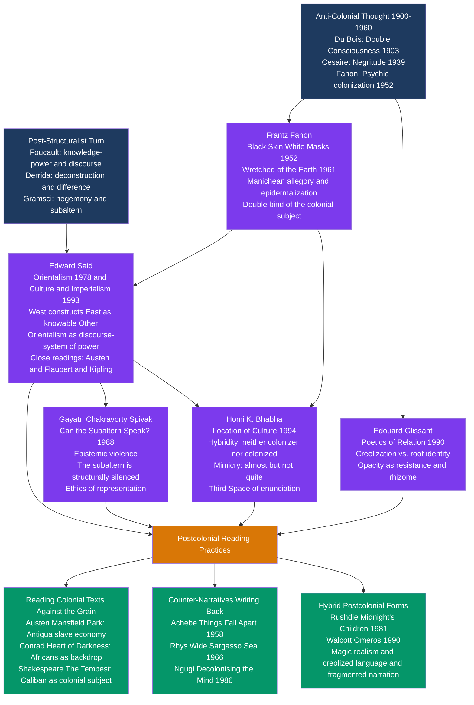

# Postcolonial Literary Theory

> [!abstract] TL;DR
> Postcolonial literary theory asks how colonialism shapes what gets written, what gets read, and how we interpret texts; its three founding moves — Said's Orientalism (the West constructs the East as inferior Other), Spivak's subaltern silence (the colonized cannot speak within colonial discourse), and Bhabha's hybridity (colonial contact produces unstable, resistant cultural forms) — collectively expose the literary canon as a site of imperial power and open space for counter-narratives, from Achebe's *Things Fall Apart* to Rhys's *Wide Sargasso Sea*, to re-read world literature from below.

---

## Intuition

**Analogy:** Imagine a gallery of portrait paintings spanning five centuries. Every portrait was commissioned by a wealthy European patron and executed by a European master. The subjects — when not the patrons themselves — are exotic foreigners: turbaned sultans, bare-chested "savages," veiled odalisques in harems. These paintings are not mere decoration. They are a systematic curriculum: century after century, viewers learn that "foreign" means sensual, irrational, static, and in need of governance. A gallery visitor from one of those painted cultures might pause before their own image and feel two things at once — recognition that this is how they are seen, and deep wrongness at the image. They did not commission the portrait. They were not asked whether it was accurate. The painter, the patron, and the audience were all members of the same club.

The Western literary canon is that gallery. For five centuries, European and American writers produced representations of colonial and formerly colonized peoples — not as self-presenting subjects but as objects of European curiosity, management, or moral instruction. Postcolonial theory is what happens when the people in the portraits enter the gallery with their own brushes and ask: who authorized this image? Whose gaze does it serve? And what does a true self-portrait look like?

---

## How It Works



---

## Key Concepts

### Secondary Level

**What is Postcolonial Literary Theory?**

Postcolonial literary theory is a body of critical approaches for reading literature produced in the context of European colonialism (roughly 1500–1975) and its aftermath. It asks three interlocking questions:

1. **Representation**: How does literature represent colonized peoples? Who has the authority to represent whom? Do those representations perpetuate colonial hierarchies?
2. **Identity**: How does colonialism shape the identities, psychologies, and languages of both colonizer and colonized? How do writers from formerly colonized cultures navigate identities formed by that history?
3. **Resistance**: How does literature resist, subvert, or complicate colonial power? What formal strategies — choice of language, narrative voice, genre, intertextual reference — constitute acts of cultural resistance?

The field emerged from the convergence of anti-colonial political thought (Frantz Fanon, Aimé Césaire, C.L.R. James) and poststructuralist literary theory (Foucault's discourse analysis, Derrida's deconstruction) in the 1970s and 1980s. Its three foundational texts are Edward Said's *Orientalism* (1978), Gayatri Spivak's "Can the Subaltern Speak?" (1988), and Homi Bhabha's *The Location of Culture* (1994).

**Core Vocabulary:**

| Term | Definition |
|------|-----------|
| **Colonialism** | The practice of one society establishing political and economic dominance over another; European colonialism involved conquest, resource extraction, and the cultural suppression of colonized peoples |
| **Postcolonial** | Designates the period after formal decolonization — but "post" does not mean colonialism is over; it names a condition shaped by colonial history that persists in cultural, economic, and psychological forms |
| **The Other** | In psychoanalytic and postcolonial theory, the figure against which a dominant group defines itself; the colonized person is constituted as Other — irrational, primitive, dangerous — to confirm the colonizer's self-image as rational and civilized |
| **Discourse** | Following Foucault, a system of knowledge that produces its objects; Orientalism is a discourse — not merely a set of false beliefs about "the East" but a systematic framework that made the East an object of Western knowledge and power |
| **Counter-narrative** | A literary text that directly contests or rewrites a canonical colonial text from the perspective of the colonized; *Wide Sargasso Sea* is a counter-narrative to *Jane Eyre* |
| **Writing back** | From Salman Rushdie and the study *The Empire Writes Back* (Ashcroft, Griffiths, Tiffin, 1989): that postcolonial literature responds to and subverts the canon of imperial literature |
| **Worlding a text** | Spivak's concept: reading a text in its full global and colonial context; understanding that *Mansfield Park* is not merely about English manners but about the slave economy that underwrites the Bertram estate |
| **Epistemic violence** | The destruction of the intellectual and cultural frameworks through which non-Western peoples made sense of the world — colonial education did not merely suppress indigenous knowledge but produced the active belief that European knowledge was the only real knowledge |

**The Self/Other Binary:**

The fundamental mechanism of colonial representation is the binary opposition — a pair of opposed terms in which every positive quality attributed to the colonizer implies its negative in the colonized:

| Colonizer | Colonized |
|-----------|-----------|
| Rational | Irrational |
| Civilized | Primitive |
| Dynamic / Historical | Static / Timeless |
| Self-governing | In need of guidance |
| Clean / Ordered | Dirty / Chaotic |
| Complex individual | Simple / Childlike |

This binary does not merely describe a pre-existing difference. It **produces** its objects. By repeatedly representing the colonized in these terms — in travel writing, adventure novels, academic scholarship, legal documents — colonial discourse made the representation seem like neutral description rather than an exercise of power.

**Three Landmark Texts:**

1. **Chinua Achebe's *Things Fall Apart* (1958)** — The first major English-language novel to represent pre-colonial Igbo society from within, not from the outside looking in. Written as a direct counter-narrative to the Africa of Conrad's *Heart of Darkness*, it gave African characters interiority, social complexity, and moral agency. It has sold over 20 million copies and is credited with opening space for the entire tradition of African literature in English.

2. **Jean Rhys's *Wide Sargasso Sea* (1966)** — A prequel to Brontë's *Jane Eyre* (1847), told from the perspective of Bertha Mason — the "madwoman in the attic" — whom Rhys reveals as Antoinette Cosway, a white Creole woman from Jamaica, destroyed by her marriage to the English Rochester. Rhys exposes what Brontë's novel suppresses: the Caribbean colonial context (plantation slavery) that produces Bertha's wealth and her madness.

3. **Frantz Fanon's *The Wretched of the Earth* (1961)** — Not fiction but a political-literary text describing the psychological and cultural effects of colonialism on the colonized, and the process of decolonization as not merely political but psychic. Its preface by Jean-Paul Sartre made it the manifesto of anti-colonial movements worldwide.

---

### Undergraduate Level

#### Edward Said and Orientalism

Edward Said (1935–2003), a Palestinian-American literary critic at Columbia University, published *Orientalism* in 1978. Trained in comparative literature and deeply influenced by Foucault's concept of discourse as knowledge-power, Said performed a genealogical analysis of Western representations of "the Orient" across two centuries of academic scholarship, literature, poetry, and art.

**The central argument:** "The Orient" is not a geographic fact but a discursive construction — the product of a systematic European discourse that, across thousands of texts, constructed "the East" as an object of knowledge available for Western study, administration, and governance. The Orientalist scholar who catalogued Arabic manuscripts, the novelist who set his adventure story in Persia, the colonial administrator who governed "according to the native temperament" — all were participants in the same discursive formation, reproducing the same set of representations and assumptions.

**Knowledge as power:** Said showed that Orientalist knowledge was not produced by disinterested scholars studying a neutral object. It was produced by scholars who worked in institutions funded by colonial governments and produced knowledge read by colonial administrators. The scholar who produced the authoritative grammar of Arabic enabled colonial bureaucracies. The scholar who classified Indian castes provided the template for census operations that froze those categories. The fiction writer who represented Egyptian women as passive and sensual — Flaubert's encounter with the dancer Kuchuk Hanem is Said's key example — produced a template of "the Eastern woman" that circulated far beyond its origin.

**The key binary:** Orientalism works by constructing a fundamental opposition: West/East = rational/emotional, active/passive, dynamic/static, self-governing/in need of governance. Every positive quality the European Enlightenment attributed to itself implied its negative counterpart in the Orient. The Orient exists to confirm the West's self-understanding. Said calls this **latent Orientalism** — the deep, stable set of assumptions underlying the more variable surface representations of any given text.

**Said's key literary readings:**

- *Jane Austen's Mansfield Park*: Said's essay in *Culture and Imperialism* (1993) shows that the Bertram estate at Mansfield Park depends economically on Sir Thomas's plantation in Antigua — a fact mentioned in passing but never examined by the novel's moral discourse. To read *Mansfield Park* as a novel about English manners without attending to the Antiguan plantation that funds those manners is to perform the same selective blindness the novel itself performs. The moral world — Fanny Price's sensibility, Sir Thomas's dignity — is built on enslaved labor the novel refuses to see.

- *Joseph Conrad's Heart of Darkness*: Achebe's famous 1977 lecture "An Image of Africa: Racism in Conrad's *Heart of Darkness*" argued that Conrad's celebrated modernist novella represents Africans as a backdrop to Kurtz's European psychodrama. Africans have no interiority, no culture, no language: they are the jungle made human, the antithesis against which European civilization defines itself. For Achebe, the Western literary establishment's refusal to see this reflects the same selective blindness Said identified in Austen.

- *Shakespeare's The Tempest*: Perhaps the most intensively analyzed colonial text in the postcolonial canon. Prospero, the European magician-governor of a remote island, controls Caliban — a deformed native figure whose name is an anagram of "Cannibal" — through language and magic. The play has been read as an allegory of colonial governance; Caliban's line, "You taught me language and my profit on't / Is I know how to curse," is one of postcolonial theory's most quoted moments of hybrid resistance.

**Critiques of Said:** Said focused primarily on British and French Orientalism, underplaying German, Russian, and American variants. He treated Orientalism as a more monolithic discourse than it was, underplaying internal disagreements. He gave insufficient attention to the agency of colonized peoples in shaping colonial knowledge. These critiques are valid but do not undermine Said's structural insight: regardless of individual intent, the discursive formation had systematic political effects.

---

#### Frantz Fanon: The Psychic Dimensions of Colonial Literature

Fanon (1925–1961), a psychiatrist from Martinique who served in Algeria during the war of independence, analyzed what colonialism does to the self — and by extension to cultural production.

**The double bind in *Black Skin, White Masks* (1952):** The colonized subject is placed in an impossible position by the colonial cultural order. French colonial education taught Fanon and his peers that civilization, intelligence, and beauty were expressed through French language, French history, and French aesthetic norms. But this aspiration was blocked by race: no matter how perfectly the colonized subject mastered French culture, the colonial racial order still located them as inferior. Fanon calls this the **epidermalization of inferiority** — the inscription of colonial hierarchy onto the skin, so that blackness becomes a visible sign of lesser humanity.

The literary consequences are profound: the Black writer who writes in French or English is already writing in the colonizer's language, using forms developed by the colonial culture. This linguistic double bind — using the master's tools to dismantle the master's house (Audre Lorde's formulation) — is the defining tension of postcolonial literary production.

**The Manichean allegory:** Fanon described the colonial world as fundamentally divided into the settler quarter (clean, lit, wealthy) and the native quarter (dark, dirty, degraded). Colonial literature systematically figures the colonized through animal metaphors: Conrad's Africans described as "black shadows of disease and starvation," animal sounds attributed to non-European characters, animal imagery clustering around indigenous peoples in settler colonial fiction. These are not incidental literary choices but symptoms of the colonial world-structure.

**The pitfalls of national consciousness:** Fanon was prophetically clear that formal decolonization — the transfer of political power to a native elite — would not produce genuine liberation if the new national bourgeoisie simply stepped into the colonial economic and cultural structure. Most postcolonial state-building novels (those celebrating the nation's birth) were subject to this critique: they replaced one form of centralized cultural authority with another, leaving the subaltern voiceless within the new national narrative.

---

#### Homi Bhabha: Hybridity, Mimicry, and the Third Space

Bhabha (born 1949), working at the intersection of psychoanalysis and postcolonial theory, developed three concepts in *The Location of Culture* (1994) that fundamentally changed how postcolonial scholars read colonial textuality.

**Mimicry:** The colonial project demands that the colonized adopt European culture — but not too successfully. A perfectly assimilated native would undermine the colonial hierarchy, since hierarchy depends on an irreducible difference. The colonial demand is therefore always for something partial: the colonized should be "almost the same, but not quite." On one side, mimicry disciplines the colonized into imitating and confirming the desirability of the colonizer's culture. On the other, the mimic who approximates the colonizer almost perfectly becomes **uncanny** — a threatening resemblance that disturbs colonial authority's claim to uniqueness. Caliban speaking the colonizer's language perfectly; the Bengali babu who writes better English than his British superior — these are moments when mimicry slides into menace.

In literary terms, postcolonial writers who write in English using European literary forms are engaged in complex mimicry. Rushdie's English is more exuberantly playful than most English novelists' English; Achebe's English is precise and polished in ways that comment on itself. The colonizer's language is inhabited, transformed, made strange.

**Hybridity:** Colonial contact produces neither pure cultural domination nor pure cultural resistance — it produces hybrids: cultural forms that combine elements from both sides in unstable, creative, politically complex ways. Caribbean Catholicism that incorporates Yoruba orishas; Nigerian English that incorporates Yoruba syntactic patterns; Latin American magical realism that merges European novelistic form with indigenous and African oral narrative structures — all are instances of hybridity. For Bhabha, hybridity *undermines* the colonial project, because that project requires a clear distinction between the pure culture of the colonizer and the inferior culture of the colonized. Hybrid forms reveal that no culture is pure, and that the colonizer's "civilization" was itself produced through global encounter — a fact colonial ideology must systematically deny.

**The Third Space of Enunciation:** Meaning is not transmitted from speaker to receiver; it is produced in the **Third Space** — the space of translation, negotiation, and difference that opens between any two communicative positions. Applied to postcolonial literature: the meaning of Achebe's *Things Fall Apart* is not simply what Achebe intended or what a Western literary tradition (trained to see "primitive Africa" as backdrop) receives it as saying. It is produced in the encounter between the text and its multiple, differently positioned readers. The text's meaning is always in the Third Space.

---

#### Gayatri Spivak and the Subaltern

Spivak (born 1942), an Indian scholar and translator of Derrida's *Of Grammatology*, posed one of the most debated questions in postcolonial theory in "Can the Subaltern Speak?" (1988): can the people colonialism most completely marginalized — those without access to the institutions of knowledge production — speak in ways that can be heard within those institutions?

**The central argument — three layers:**

1. *Western intellectuals and the Other:* Scholars who claim to allow the oppressed to "speak for themselves" while deploying European theoretical frameworks are deceiving themselves. The apparently self-effacing gesture of "listening to the Other" still operates through categories that constitute what counts as speech, knowledge, and a valid speaking subject.

2. *The sati example:* Spivak analyzes the colonial debate over *sati* (widow self-immolation in colonial India). The British colonial administration outlawed *sati* in 1829, positioning itself as the protector of Indian women: "white men saving brown women from brown men." Indian nationalist reformers also contested *sati* from within a modernizing nationalist discourse. In both formations, the figure of the *sati* widow is spoken about and spoken for — but her own voice is structurally absent. She cannot speak because no institutional position exists within these discourses from which her speech can be authorized rather than dismissed.

3. *The ethics of representation:* Even well-intentioned Western feminist scholars who claim to "give voice to" the subaltern reproduce the same silencing — they constitute the subaltern as an object of their discourse, confirming that the center of enunciative authority remains with them. The ethical demand is not that we stop talking about the subaltern, but that we attend rigorously to how our discourse produces the conditions of the subaltern's silence.

**Spivak in literary practice — worlding:** A Spivakian reading of Brontë's *Jane Eyre* does not stop at its gender themes; it attends to the colonial economy (Bertha Mason's Jamaican inheritance, produced by plantation slavery) that the novel simultaneously requires and refuses to examine. Rhys's *Wide Sargasso Sea* can be read as performing a Spivakian intervention: it gives voice and interiority to the silenced subaltern woman that Brontë's novel structurally suppresses. Spivak herself analyzed this in her essay "Three Women's Texts and a Critique of Imperialism" (1985), noting that Rhys's counter-narrative, while formally liberating Bertha/Antoinette, cannot fully escape its own complicity with the representational system it contests — Antoinette is still a Creole, not a Black Jamaican; the plantation laborers who produced the wealth that enters the novel remain voiceless.

---

### Graduate Level

#### Negritude, Creolization, and the Caribbean Literary Tradition

**The Negritude movement (1930s–1950s):** Negritude was a literary and intellectual movement founded in Paris by Francophone African and Caribbean intellectuals — principally Aimé Césaire (Martinique), Léopold Sédar Senghor (Senegal), and Léon-Gontran Damas (French Guiana) — as a response to French colonial assimilation ideology. French colonialism operated through *assimilation*: the colonies' populations were to become French, adopting French language, culture, and values. The assimilated colonial subject would shed their African or Caribbean identity and become, in principle, fully French.

Negritude was a direct refusal: rather than accepting the colonial devaluation of African and Caribbean identity, Negritude poets celebrated it. Césaire's *Notebook of a Return to the Native Land* (1939) is the founding text: a long surrealist prose poem in which the speaker, returning to Martinique from Paris, refuses the assimilated subject position and reclaims his Blackness, his Caribbean specificity, his African heritage as positive values. Senghor theorized Negritude philosophically, arguing that African cultures had a distinctive rhythm and sensibility — *émotion nègre* — that European civilization had suppressed but not destroyed.

**The limits and critiques of Negritude:** Negritude was criticized on two grounds:
1. **Essentialism**: By celebrating an essential "African soul," Negritude reproduced the colonial logic of racial essence — merely inverting the colonial hierarchy rather than dismantling it. If colonial discourse said Africans were essentially irrational and emotional, Negritude said: yes, and irrationality and emotion are beautiful. The categories remain; only the valuation changes.
2. **Class position**: Negritude was a movement of the educated colonial elite — writing in French, trained in French universities, using European surrealist forms to express African content. The Martinican and Senegalese peasant communities whose identity the movement claimed to celebrate were not its audience.

Jean-Paul Sartre's controversial preface to Senghor's anthology — "Black Orpheus" (1948) — celebrated Negritude as a "minor key" in a Hegelian dialectic leading to a raceless humanism. Fanon replied furiously that this moved too fast: the Black man was not permitted to be Black, to be in his particularity, even for a moment, without already being asked to dissolve into a universal.

**Édouard Glissant and Creolization:** The Martinican theorist Édouard Glissant (1928–2011) proposed a more dynamic model in *Poetics of Relation* (1990): **creolization**. Where Negritude sought to recover an authentic African root, Glissant argued that the Caribbean experience was defined not by roots but by routes — by the radical mobility and mixing produced by the middle passage, plantation slavery, and colonial contact. Creolization names the process by which multiple cultures — African, European, indigenous Caribbean, Asian indentured — were brought into violent contact and produced something genuinely new: not a mixture in which the original elements can be identified and separated, but a transformation in which new forms emerge that cannot be reduced to their ingredients.

Glissant's key concept is **opacity**: the right of the colonized not to be made transparent, knowable, and available to the colonizer's gaze. This is the counter to Orientalism's transparency drive (the Orient as fully knowable to Western scholarship). Opacity names the right to remain unintelligible on one's own terms; the refusal to submit to the colonizer's desire to know and thereby govern.

**Derek Walcott — the Caribbean as world literature:** The Saint Lucian poet Derek Walcott (1930–2017; Nobel Prize 1992) enacted what Glissant theorized. His epic poem *Omeros* (1990) transplants Homer's *Iliad* and *Odyssey* characters into the contemporary Saint Lucian fishing community — a Black Achille and Hector, a colonial-era Helen. This is not pastiche: it enacts the claim that the Caribbean is not the periphery of European civilization but the site of a new, hybrid civilization with as much claim to the epic tradition as Greece. Walcott rejected the demand to choose between his European literary inheritance and his Caribbean identity: "I have Dutch, nigger, and English in me, and either I'm nobody, or I'm a nation."

---

#### The Politics of Language: Achebe vs. Ngugi

One of the field's defining debates concerns the language in which postcolonial writers write.

**Achebe's position:** In "The African Writer and the English Language" (1965), Achebe argued that African writers could use English, but on their own terms — bending it, inflecting it, making it carry the weight of African experience. English was not merely the colonizer's tool; it was also the language in which Achebe had been educated, thought, and dreamed, and in which he could address the widest possible African audience across the colonial linguistic fragmentation of the continent.

**Ngugi's position:** The Kenyan novelist and theorist Ngugi wa Thiong'o, in *Decolonising the Mind* (1986), made the opposing argument: writing in English is a capitulation to colonial culture. Language is not neutral — it carries the entire cultural world of its users. To write Kenyan experience in English is to constrain and distort that experience through the categories of a language imposed by conquest. Genuine decolonization of African literature requires writing in African languages. Ngugi switched from English to Gikuyu after this manifesto; *Caitaani Mutharaba-ini* (1980; translated as *Devil on the Cross*) was his first novel in Gikuyu.

**The middle positions:** Rushdie, in "The Empire Writes Back with a Vengeance" (1982), celebrated the creative transformation of English by postcolonial writers as itself an act of cultural resistance: the colonizer's language is taken up and remade, producing something the colonizer cannot fully claim or control. This position was critiqued by Arundhati Roy and others for romanticizing English-language privilege within postcolonial societies — writing in English selects for elite-educated, metropolitan readerships while shutting out precisely the subaltern communities the literature claims to represent.

---

#### Decolonizing the Literary Curriculum

The most politically active contemporary debate in postcolonial literary studies concerns the literary curriculum: what texts are taught, in what contexts, and with what interpretive frameworks. The "decolonize the curriculum" movement — exemplified by UCL's "Why Is My Curriculum White?" campaign (2014) and the Rhodes Must Fall movement at the University of Cape Town (2015) and Oxford — argues that university literature curricula continue to reproduce colonial hierarchies by:

1. Treating the Western canon (Shakespeare, Austen, Milton, Dante) as universal literature while non-Western literature is categorized as "world literature" or "ethnic studies."
2. Assigning postcolonial theory as a supplement to the "real" (Western) canon, rather than as an equally central body of thought.
3. Staffing literature departments overwhelmingly with scholars whose interpretive frameworks remain those of the tradition they are trying to critique.

**Spivak's counter-position:** Spivak herself argued against a simple replacement of canonical texts with postcolonial ones. Her concern was that "decolonizing the curriculum" without rigorous engagement with the difficulty of canonical texts could reproduce an anti-intellectualism that serves postcolonial students poorly. Her position: teach the Western canon *critically* — attend to what it suppresses, what it cannot say, who it fails to represent — rather than simply replacing it with a counter-canon that would repeat the logic of canonical authority in reverse.

**World literature as structural problem:** Pascale Casanova (*The World Republic of Letters*, 1999) offered a Bourdieusian structural account of global literary culture: literary prestige is concentrated in a few metropolitan centers (historically Paris, now London and New York), and the global literary market systematically rewards works that are translatable and accessible to metropolitan audiences. This structural analysis complements postcolonial theory's discourse analysis: the question is not only whose stories get told, but whose stories get *distributed*, *reviewed*, *translated*, *awarded prizes*, and *taught in universities*. The global literary field reproduces colonial hierarchies not through individual bad faith but through structural advantages built into the publishing, prize, and university systems.

---

## Python Demo

```python
"""
Decolonization of the Literary Canon: Simulating the Shift in Citation Share
by Authorial Geographic Origin, 1900-2020.

Four voice categories are tracked over time:
  - Western (Western Europe and North America)
  - Global South (Africa, Asia, Latin America, Middle East — non-diaspora)
  - Diaspora / exile (writers of postcolonial origin based in the West)
  - Hybrid / creolized (writers who explicitly resist single-origin categorization)

A logistic (S-curve) model captures the accelerating shift after 1970
following the publication of key postcolonial texts and the progressive
decolonization of university curricula.
"""

import numpy as np
import matplotlib.pyplot as plt

# Year axis: 1900 to 2020 inclusive
years = np.arange(1900, 2021)


def logistic(start, end, years, midpoint, steepness=0.10):
    """
    Smooth S-curve from start to end value.
    midpoint: year at which change is halfway complete.
    steepness: rate of change (higher = sharper transition).
    """
    x = years - midpoint
    frac = 1.0 / (1.0 + np.exp(-steepness * x))
    return start + (end - start) * frac


# Raw (pre-normalization) trajectories
# Western: dominant early, declines post-Said (midpoint ~1983)
western_raw      = logistic(90.0, 50.0, years, midpoint=1983, steepness=0.12)
# Global South: very low early, rises post-Achebe/Said (midpoint ~1985)
global_south_raw = logistic( 5.0, 25.0, years, midpoint=1985, steepness=0.12)
# Diaspora: small but growing post-Rushdie/Spivak (midpoint ~1990)
diaspora_raw     = logistic( 3.0, 15.0, years, midpoint=1990, steepness=0.12)
# Hybrid: barely visible early, grows post-Bhabha (midpoint ~1996)
hybrid_raw       = logistic( 2.0, 10.0, years, midpoint=1996, steepness=0.12)

# Normalize to 100% at each year
total = western_raw + global_south_raw + diaspora_raw + hybrid_raw
western      = western_raw      / total * 100
global_south = global_south_raw / total * 100
diaspora     = diaspora_raw     / total * 100
hybrid       = hybrid_raw       / total * 100

# Key publication events (year: label)
events = {
    1939: "Cesaire\nNotebook",
    1958: "Achebe\nThings Fall Apart",
    1966: "Rhys\nWide Sargasso Sea",
    1978: "Said\nOrientalism",
    1986: "Ngugi\nDecolonising",
    1988: "Spivak\nSubaltern?",
    1994: "Bhabha\nLocation",
}

COLORS = {
    "western":      "#1e3a5f",
    "global_south": "#d97706",
    "diaspora":     "#7c3aed",
    "hybrid":       "#059669",
}

fig, (ax1, ax2) = plt.subplots(1, 2, figsize=(15, 6))
fig.suptitle(
    "Decolonization of the Literary Canon\n"
    "Simulated citation share by authorial geographic origin, 1900-2020",
    fontsize=12, fontweight="bold"
)

# Left panel: line chart
ax1.plot(years, western,      color=COLORS["western"],      linewidth=2.5,
         label="Western Europe / North America")
ax1.plot(years, global_south, color=COLORS["global_south"], linewidth=2.5,
         label="Global South (non-diaspora)")
ax1.plot(years, diaspora,     color=COLORS["diaspora"],     linewidth=2.5,
         label="Diaspora / exile voices")
ax1.plot(years, hybrid,       color=COLORS["hybrid"],       linewidth=2.5,
         label="Hybrid / creolized voices")

for i, (yr, label) in enumerate(events.items()):
    ax1.axvline(x=yr, color="gray", linestyle=":", linewidth=1, alpha=0.6)
    y_pos = 92 if i % 2 == 0 else 82
    ax1.text(yr + 0.5, y_pos, label, fontsize=6.5, color="gray",
             rotation=90, va="top", ha="left")

ax1.set_xlabel("Year", fontsize=10)
ax1.set_ylabel("Share of literary criticism citations (%)", fontsize=10)
ax1.set_title("Trajectory of Each Voice Category", fontsize=10)
ax1.set_xlim(1900, 2020)
ax1.set_ylim(0, 100)
ax1.legend(fontsize=9, loc="center right")
ax1.grid(True, alpha=0.3)
ax1.set_xticks(range(1900, 2030, 20))
ax1.tick_params(axis="x", rotation=30)

# Right panel: stacked area chart
ax2.stackplot(
    years,
    western, global_south, diaspora, hybrid,
    labels=["Western Europe / North America", "Global South",
            "Diaspora / exile", "Hybrid / creolized"],
    colors=[COLORS["western"], COLORS["global_south"],
            COLORS["diaspora"], COLORS["hybrid"]],
    alpha=0.85,
)

ax2.set_xlabel("Year", fontsize=10)
ax2.set_ylabel("Share of literary criticism citations (%)", fontsize=10)
ax2.set_title("Canon Composition Over Time (Stacked)", fontsize=10)
ax2.set_xlim(1900, 2020)
ax2.set_ylim(0, 100)
ax2.legend(loc="lower left", fontsize=9)
ax2.grid(True, alpha=0.3)
ax2.set_xticks(range(1900, 2030, 20))
ax2.tick_params(axis="x", rotation=30)

plt.tight_layout()
plt.savefig("postcolonial_canon_shift.png", dpi=150, bbox_inches="tight")
plt.show()

# Print summary at selected years
print(f"\n{'Year':<8} {'Western':>10} {'Global S.':>10} {'Diaspora':>10} {'Hybrid':>10}")
print("-" * 52)
for yr_check in [1900, 1940, 1960, 1978, 1988, 2000, 2010, 2020]:
    idx = yr_check - 1900
    print(f"{yr_check:<8} {western[idx]:>10.1f} {global_south[idx]:>10.1f} "
          f"{diaspora[idx]:>10.1f} {hybrid[idx]:>10.1f}")
```

**What the simulation shows:**

- **1900–1960:** The canon is overwhelmingly Western (~88–90%), with Global South, diaspora, and hybrid voices constituting under 10% combined. This reflects the historical reality: Anglophone and Francophone literary establishments set critical standards; non-Western literature was either invisible or classified as anthropological rather than literary.
- **1960–1978:** A slow initial shift as Achebe, Ngugi, Rhys, and Caribbean writers begin entering university curricula, supported by the Negritude movement's earlier establishment of a critical vocabulary for valuing non-Western literary production.
- **1978–1995 (the theory revolution):** Said's *Orientalism*, Spivak's "Can the Subaltern Speak?", and Bhabha's *The Location of Culture* accelerated the shift sharply, creating both a theoretical framework for postcolonial criticism and new canonization pressure for the texts that framework valorized.
- **1995–2020:** Continued growth across all non-Western categories; the Western share stabilizes around 50–55% — still the largest single block, reflecting the structural advantages of English-language literary production, US/UK academic publishing, and prize systems centered in metropolitan institutions.

---

## Real-World Applications

> **The Achebe–Conrad controversy in university curricula:** Achebe's 1977 lecture "An Image of Africa: Racism in Conrad's *Heart of Darkness*" argued that Conrad's canonized novella dehumanized Africans and should be reconsidered as a founding curriculum text. The response of the Western literary establishment was largely defensive: the novella's formal excellence and anti-imperialist surface were cited as separable from its racial representations. The debate is ongoing: in 2015, a student at Canterbury Christ Church University petitioned to remove *Heart of Darkness* from mandatory reading. This dispute instantiates the central question of postcolonial literary pedagogy: can a text be aesthetically canonized while being ideologically harmful, and if so, how should it be taught?

> **Jean Rhys and the postcolonial rewriting of the Brontë canon:** *Wide Sargasso Sea* is now paired with *Jane Eyre* on virtually every postcolonial literature course in UK and US universities. The pairing performs a Spivakian intervention: Bertha Mason, the silenced subaltern woman Brontë's novel requires but refuses to see, is given the narrative space that the canonical text denies her. The pairing has become so institutionalized that it is itself now an orthodoxy; postcolonial scholars debate whether Rhys's counter-narrative too neatly resolves the tensions it exposes — Antoinette is Creole, not Black Jamaican; the plantation laborers who produced the wealth that enters the novel remain voiceless.

> **The Booker Prize and the postcolonial literary market:** The Man Booker Prize (founded 1969, initially for Commonwealth writers) has functioned as a key institutional mechanism in the canonization of postcolonial literature in English. Rushdie (*Midnight's Children*, 1981), Coetzee (*Disgrace*, 1999), Roy (*The God of Small Things*, 1997), and Adichie (*Half of a Yellow Sun*, shortlisted 2006) all passed through this gateway. Casanova's analysis predicts exactly this: metropolitan prize institutions translate diverse global literary production into a ranked hierarchy centered on London, rewarding works accessible to a metropolitan audience and reproducing the structure of cultural capital they claim to transcend.

> **Decolonizing the curriculum at UCL and Cape Town:** The "Why Is My Curriculum White?" campaign launched at UCL in 2014 made visible a structural fact: texts, authors, and theoretical frameworks taught in UK humanities departments were overwhelmingly produced by white European men, with non-Western authors appearing primarily in "diversity" add-on modules rather than in core required reading. The campaign produced curricular revisions at UCL and spread across UK and US institutions. UCL's English department redesigned its first-year survey course to include equal representation of non-Western texts alongside European canonical texts. The debate about what this means — adding texts to an unchanged framework vs. restructuring the framework itself — continues.

> **Ngugi and the Gikuyu experiment:** After publishing *Decolonising the Mind* (1986) and switching to writing in Gikuyu, Ngugi was able to reach Kenyan rural readers for the first time — his novel *Matigari* (1986, Gikuyu) circulated in rural Kenya and was reportedly mistaken by some readers for accounts of a real returning freedom fighter, prompting the Kenyan government to order the arrest of "Matigari" before realizing he was a fictional character. The novel was then banned. This episode illustrated both the power and the limit of writing in an indigenous language: direct access to a non-elite audience, but also direct exposure to state censorship in ways that English-language writing for a global audience does not face.

---

## Common Pitfalls

- **Treating postcolonialism as a period rather than a method** — "Postcolonial" does not simply mean "literature written after independence." It is a critical method applicable to texts from any period: *The Tempest* (1611), *Jane Eyre* (1847), and *Heart of Darkness* (1899) are all productively read through a postcolonial lens. The error of limiting postcolonial theory to a geographic or temporal category misses its critical scope.

- **Collapsing all forms of colonial experience** — British colonialism in India, French colonialism in Algeria, settler colonialism in Australia, plantation slavery in the Caribbean, and apartheid in South Africa are structurally different formations with different literary cultures and different critical needs. Applying Said's analysis of British and French Orientalism uniformly to all postcolonial contexts flattens important distinctions.

- **Confusing hybridity with celebration of cultural mixing** — Bhabha's hybridity is not an endorsement of multiculturalism or cultural fusion. It is a theoretical claim about the instability of colonial authority. Hybridity is produced by violence (the middle passage, forced cultural assimilation, colonial education); it names a condition, not a lifestyle choice. The domestication of hybridity into a celebratory cosmopolitanism loses the political edge of the original concept.

- **The subaltern as passive victim** — Postcolonial theory is sometimes taught in ways that constitute colonized peoples as pure victims with no agency, no complexity, and no cultural resources for resistance — reproducing, in politically inverted form, the same ahistorical simplification it critiques. The subaltern cannot speak *within the colonial discourse system*; this does not mean the subaltern has no voice outside it. Achebe's Igbo characters have full moral agency; the limitation is imposed by the representational systems through which they are described from outside, not by their actual existence.

- **Using postcolonial theory to evacuate the literary** — A version of postcolonial criticism reduces literary texts to symptoms of ideological positions, treating aesthetic form as irrelevant. This misses the specific claim postcolonial writers make: that form matters, that the choice of magic realism rather than realism, creolized English rather than standard English, is itself a political act with aesthetic stakes. Postcolonial literary criticism at its best attends to ideology and form simultaneously.

- **Treating "world literature" as a neutral expansion of the canon** — World literature curricula continue to read non-Western texts through Western critical frameworks, Western aesthetic categories, and in Western languages (in translation), organized by Western academic institutions. Inclusion is not the same as structural transformation. Casanova's analysis of the world literary market shows that the structural advantages of metropolitan cultural capital persist even when the represented content changes.

- **Ignoring gender** — Early postcolonial theory (Said, Fanon) was criticized by feminist postcolonial scholars (Spivak, bell hooks, Chandra Mohanty) for reproducing a masculinist anti-colonial subjectivity. The resistant postcolonial subject was implicitly male. Postcolonial feminist criticism insists on the intersection of colonial and patriarchal structures; the subaltern woman faces a double colonization — and the failure to represent this is itself a political silence.

---

## Related Concepts

- [[Colonialism_and_Postcolonial_Anthropology]] — covers Said, Fanon, Spivak, and Bhabha from the perspective of anthropological research methodology and decolonizing fieldwork practice; the anthropological and literary applications of these theorists are complementary and mutually illuminating.

- [[Race_Ethnicity_and_Racism]] — racial taxonomy was produced in part through literary and cultural representation; Du Bois's double consciousness is a foundational concept for postcolonial literary identity theory; Fanon's epidermalization of inferiority bridges postcolonial literary theory and the sociology of race.

- [[Intersectionality]] — postcolonial feminist criticism (Spivak, Mohanty, Brah) insists that colonial oppression intersects with gender and class oppression; Crenshaw's intersectionality framework has been applied in postcolonial literary contexts to analyze texts where race, gender, and colonial status compound rather than simply add.

- [[Conflict_Theory_and_Critical_Theory]] — Gramsci's hegemony and subaltern concepts are foundational to Spivak's use of "subaltern" and to Bhabha's theory of colonial authority; the Frankfurt School's analysis of the culture industry connects with postcolonial criticism's analysis of the canon as an ideological apparatus.

- [[International_Relations_Theories]] — postcolonialism has entered IR theory as a critical school challenging Eurocentrism; the global literary market (Casanova's *World Republic of Letters*) maps onto the IR analysis of soft power and cultural hegemony; Said's analysis of Orientalism is applied in IR as an account of how colonial representations shape foreign policy discourse.

- [[Globalization_and_Its_Discontents]] — the contemporary globalization of literary culture reproduces some colonial hierarchies (English-language dominance, metropolitan publishing centers) while creating new postcolonial forms; Rushdie's global success and the Booker Prize exemplify both dynamics simultaneously.

- [[Nationalism_Ethnicity_and_Collective_Identity]] — anti-colonial nationalism was partly constituted through literary production (Negritude, Achebe, Ngugi, Walcott); Fanon's critique of national consciousness and Bhabha's critique of nationalist essentialism address directly the intersection of literary culture and political identity.

- [[Globalization_and_Cultural_Change]] — Glissant's creolization model and Walcott's hybrid aesthetic represent one response to the dynamics of global cultural circulation; the debate between creolization (transformation enriches) and homogenization critique (globalization destroys) maps onto this note's theoretical tensions about hybridity.

---

## Review Questions

### Secondary

1. Said argues that Orientalism is not just a collection of false stereotypes but a "discourse." What is the difference between a stereotype and a discourse, and why does the distinction matter for understanding how colonial representations worked?
2. Chinua Achebe said that Conrad's *Heart of Darkness* is "a thoroughgoing racist text," while many Western critics praised it as a critique of imperialism. Can both things be true simultaneously? What would you look for in the text to assess each claim?
3. Jean Rhys's *Wide Sargasso Sea* gives a voice to a character who has no voice in *Jane Eyre*. What does it mean for a literary text to structurally "silence" a character, and what does restoring that voice change about our reading of the original novel?

### Undergraduate

1. Bhabha argues that colonial mimicry is always "almost the same, but not quite" — and that this gap is both disciplinary and destabilizing. Apply this concept to two specific literary examples: one where mimicry functions as discipline (reinforcing colonial hierarchy), and one where it slides into the menace that threatens colonial authority. What determines which dynamic is operative in a given text?
2. Compare Spivak's argument in "Can the Subaltern Speak?" with Achebe's counter-narrative practice in *Things Fall Apart*. Spivak argues the subaltern cannot be heard within colonial discourse; Achebe attempts to give the colonized subject voice and interiority. Does Achebe's practice escape Spivak's critique, or is it subject to it? What conditions would a literary text have to meet to genuinely give voice to the subaltern?
3. Negritude and Glissant's creolization offer two different responses to colonial cultural suppression: one celebrates an authentic African root identity, the other celebrates the hybrid forms produced by colonial contact. What are the political and aesthetic stakes of each position? Which provides a more adequate model for postcolonial literary production, and why?

### Graduate

1. The "decolonize the curriculum" movement argues that the Western literary canon should be fundamentally restructured rather than merely diversified. Spivak's own position is more complex: she has argued for rigorous engagement with canonical "difficult" texts rather than their replacement. Reconstruct Spivak's argument and assess it: is there a postcolonial case for maintaining close engagement with the Western canon? If so, what does that engagement look like, and how does it differ from traditional canonical study?
2. Bhabha's poststructuralist theory of colonial discourse has been criticized by materialist postcolonial scholars (Neil Lazarus, Benita Parry, Aijaz Ahmad) for displacing material and economic analysis of colonialism with linguistic and psychoanalytic analysis of discourse. Ahmad argues in *In Theory* (1992) that Bhabha's theory is a cultural politics of the metropolitan diaspora, not a politics of the actually colonized. Assess this critique: what does Bhabha's framework capture that a materialist analysis misses, and vice versa? How would you read *Midnight's Children* or *Things Fall Apart* through both frameworks?
3. Pascale Casanova's *The World Republic of Letters* (1999) maps the global literary field as a system of unequal capitals in which Paris and London function as consecrating centers. How does this structural account relate to the postcolonial critiques of Said, Spivak, and Bhabha? Does Casanova's structural sociology of literature replace, complement, or contradict the discourse-analysis approach? Using the careers of Achebe, Rushdie, and Walcott as case studies, assess the model's explanatory power and its limits.

---

## Sources

- [Said, Edward W. *Orientalism*. Pantheon Books, 1978.](https://en.wikipedia.org/wiki/Orientalism_(Said))
- [Said, Edward W. *Culture and Imperialism*. Knopf, 1993.](https://en.wikipedia.org/wiki/Culture_and_Imperialism)
- [Fanon, Frantz. *Black Skin, White Masks* (1952). Trans. Charles Lam Markmann. Grove Press, 1967.](https://en.wikipedia.org/wiki/Black_Skin,_White_Masks)
- [Fanon, Frantz. *The Wretched of the Earth* (1961). Trans. Richard Philcox. Grove Press, 2004.](https://en.wikipedia.org/wiki/The_Wretched_of_the_Earth)
- [Spivak, Gayatri Chakravorty. "Can the Subaltern Speak?" in *Marxism and the Interpretation of Culture*, ed. Cary Nelson and Lawrence Grossberg. University of Illinois Press, 1988.](https://en.wikipedia.org/wiki/Can_the_Subaltern_Speak%3F)
- [Bhabha, Homi K. *The Location of Culture*. Routledge, 1994.](https://en.wikipedia.org/wiki/The_Location_of_Culture)
- [Glissant, Edouard. *Poetics of Relation* (1990). Trans. Betsy Wing. University of Michigan Press, 1997.](https://www.press.umich.edu/10262/poetics_of_relation)
- [Achebe, Chinua. "An Image of Africa: Racism in Conrad's Heart of Darkness." *Massachusetts Review* 18(4), 1977.](https://www.jstor.org/stable/25088327)
- [Ngugi wa Thiong'o. *Decolonising the Mind: The Politics of Language in African Literature*. Heinemann, 1986.](https://en.wikipedia.org/wiki/Decolonising_the_Mind)
- [Ashcroft, Bill, Gareth Griffiths, and Helen Tiffin. *The Empire Writes Back: Theory and Practice in Post-Colonial Literatures*. Routledge, 1989.](https://en.wikipedia.org/wiki/The_Empire_Writes_Back)
- [Casanova, Pascale. *The World Republic of Letters* (1999). Trans. M.B. DeBevoise. Harvard University Press, 2004.](https://www.hup.harvard.edu/catalog.php?isbn=9780674021853)
- [Ahmad, Aijaz. *In Theory: Classes, Nations, Literatures*. Verso, 1992.](https://www.versobooks.com/products/1710-in-theory)
- [Young, Robert J.C. *Postcolonialism: An Historical Introduction*. Blackwell, 2001.](https://www.wiley.com/en-us/Postcolonialism%3A+An+Historical+Introduction-p-9780631200536)
- [Spivak, Gayatri Chakravorty. "Three Women's Texts and a Critique of Imperialism." *Critical Inquiry* 12(1), 1985.](https://doi.org/10.1086/448319)

---

#LiteratureRhetoric #LiteraryTheory #Postcolonial
