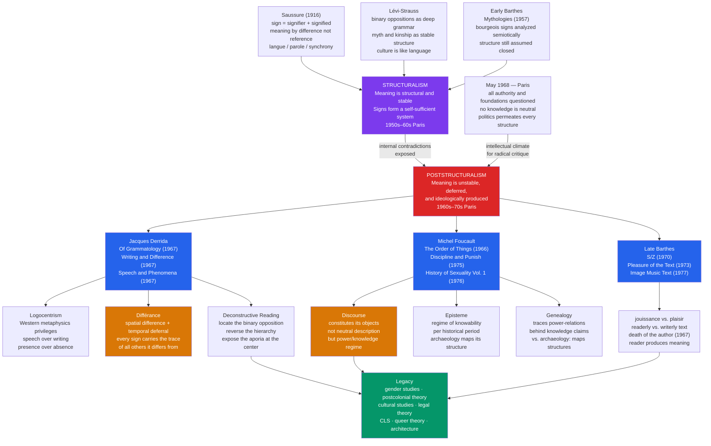

# Poststructuralism and Deconstruction

> [!abstract] TL;DR
> Poststructuralism dismantled structuralism's claim that meaning rests on stable, closed systems: Derrida showed through *différance* that signs never arrive at a final meaning but defer it infinitely — every word carries the trace of every word it differs from; Foucault showed that knowledge is inseparable from power and that discourses constitute their objects rather than neutrally describing them; Barthes declared the author dead and the reader productive; together they transformed literary studies, cultural theory, feminist and postcolonial scholarship, and legal thought by making the instability of meaning not a problem to be solved but the fundamental condition to be theorized.

---

## Intuition

**Analogy:** Imagine a game of telephone in which every player is also a translator. One person whispers "The king has power" to the next; each listener hears the sentence through their own vocabulary, their own political history, their own relationship to kings and power. Twenty transmissions later, the sentence arrives as something unrecognizable. But even if everyone repeated the sentence letter-perfectly, the meaning would still have drifted — not because of error, but because each reader constitutes meaning freshly, at a different moment, in a different social position. There is no sealed envelope containing the original message. Every reading opens a different letter.

This is the intuition behind Derrida's *différance*: meaning is never fully present in a sign. It is always already both *differing* (signs mean only by contrast with what they are not) and *deferring* (every attempt to pin down meaning refers forward to another sign that would clarify it, and then to another). There is no stopping point — not because we play the game carelessly, but because there was no pure, self-sufficient original meaning to transmit. Reading and writing are not the delivery of a pre-formed thought; they are the production of meaning under conditions that structurally guarantee it will never be fully stabilized.

---

## How It Works



The diagram traces two simultaneous lines of force. The vertical movement from structuralism to poststructuralism is both internal (structuralism's own logic, when pushed, dissolves its assumptions) and contextual (May 1968 created the intellectual climate in which foundational critique became not just permissible but necessary). The horizontal movement shows how three thinkers — Derrida, Foucault, Barthes — take poststructuralism's central insight in three different directions: toward the structure of the sign itself, toward the institutional production of knowledge, and toward the politics of reading pleasure.

---

## Key Concepts

### Secondary Level

#### From Structuralism to Poststructuralism

Structuralism's core claim, drawn from Ferdinand de Saussure's posthumously published *Course in General Linguistics* (1916), was that meaning is not a property of individual signs but an effect of *differences* within a system. The sign "cat" does not mean what it means because it points to a furry quadruped; it means what it means because it is not "bat," not "hat," not "dog." Meaning is relational and negative — constituted by difference, not by reference.

This insight was thrilling because it seemed to offer a scientific basis for literary and cultural analysis: find the underlying system of differences (the deep structure), and you could explain why any text or cultural practice means what it means. Claude Lévi-Strauss applied this to mythology and kinship; Roland Barthes applied it to fashion, film, and advertising. The structuralist decade of the 1950s–60s produced the dream of a general semiotics — a unified science of all sign systems.

The problem, which poststructuralism identified, was latent in Saussure's own insight: if meaning is constituted by difference, then it is constituted by an *endless* chain of differences. To understand "cat" you need "bat" and "hat" and "dog," but to understand those you need still others, and so on without end. The system is never closed. The meaning you are looking for is always deferred to the next term, and the next, and the next. The stable structure that structuralism promised is actually a moving target.

**May 1968** crystallized this into a political conviction. The Paris student revolt, Marxist and anarchist in spirit, challenged every form of institutional authority — universities, the state, the PCF, the trade unions. Intellectuals who had believed in scientific certainty, in Marxist teleology, in the structuralist system, found themselves confronting the possibility that all foundations were political constructions. The poststructuralist explosion of 1966–1976 — in which Derrida, Foucault, Barthes, Lacan, Deleuze, and Lyotard all published their major works — was inseparable from this moment.

#### Derrida: Logocentrism and Its Discontents

Jacques Derrida's central target was what he called **logocentrism** — the deep assumption of Western philosophy, from Plato through Rousseau through Husserl, that meaning has an origin and that origin is *presence*: the presence of the speaker's intention in the spoken word, of the living voice that animates dead letters, of the author's consciousness that precedes and guarantees the text.

This shows up in a hierarchy that organizes Western thought: **speech** is privileged over **writing**. Spoken words feel immediate — the speaker is present, her meaning is alive, intent and expression seem to coincide. Writing is derivative, secondary, dangerous — letters on a page without the living voice to stabilize their meaning, available to any reader in any context, uncontrolled by their author.

For Derrida, this hierarchy conceals a fact that is actually prior: both speech and writing share the same structure of *difference and deferral*. Even in speech, meaning works through the difference between sounds, not through unmediated presence. The "presence" of the speaker is already a construction. Writing, far from being secondary, reveals what was always already true of language: it is a system of traces, not presences.

#### Foucault: Discourse Constitutes Its Objects

Michel Foucault's poststructuralism operates in a different register from Derrida's — less philosophical, more historical and institutional. His central claim: **discourse** (the systematic set of statements, concepts, practices, and institutions that organize a domain of knowledge) does not describe a pre-given reality. It constitutes the objects it appears merely to name.

Before the eighteenth century, there was no such thing as "the homosexual" as a social type. Same-sex acts existed and were condemned in moral and legal terms. But "the homosexual" — a person with a particular psychology, etiology, and social identity — was a creation of nineteenth-century medical and psychiatric discourse. Once the category existed as a discursive object, it could be studied, treated, incarcerated, or normalized. The discourse did not discover a natural type; it called a type into existence.

This is Foucault's **power/knowledge** thesis: power and knowledge are not separable, with one preceding the other. Power circulates through knowledge claims; knowledge is always already embedded in power relations. Medical discourse is not neutral description of health and pathology; it is a regime that defines the normal, certifies expertise, and authorizes intervention.

#### Barthes: The Death of the Author

Roland Barthes's 1967 essay "The Death of the Author" is one of the most-read and least-understood texts in poststructuralism. Its argument is simple but radical: when a text is written, the author becomes irrelevant to its meaning. The author's intentions, biography, and psychology do not — cannot — determine what the text means, because meaning is produced in the *reading*, not the writing.

This is not a claim about the historical author's death (Balzac is dead; therefore his novels are freed). It is a structural claim: the moment writing begins, it escapes its origin and enters a space of language where it is constituted by all the other texts it echoes, cites, contradicts, and traverses. The reader is where meaning happens. The author is not its source but one of its effects — a retrospective construction we impose on a text to organize its plurality.

---

### Undergraduate Level

#### Différance: The Full Argument

*Différance* is Derrida's most precise theoretical coinage, and its precision is enacted in its orthography. In French, *différence* and *différance* are homophonic: you cannot hear the difference. You can only read it. This is itself a demonstration of Derrida's argument — that writing has priority over speech, that there is a difference that speech cannot capture.

*Différance* names the double operation by which signs produce meaning:

| Operation | Description | Saussurean origin |
|-----------|-------------|-------------------|
| **Spatial differing** | A sign means by differing from other signs; "cat" is not "bat," not "hat," not "dog" | Saussure's principle that signs are constituted by difference, not by positive reference |
| **Temporal deferral** | Meaning is always deferred — referred forward to another sign, and another, without ever arriving at a final stable meaning | What structuralism suppressed: Saussure's chain of differences has no stopping point |

The **trace** is the concept that names what makes this possible. Every sign carries within it the traces of all the signs it differs from — not as a property of the sign, but as the very condition of its meaningfulness. When you read "freedom," the word carries the traces of "unfreedom," "constraint," "slavery," "autonomy," "license" — and those traces are not supplementary meanings to be stripped away; they are what the word means. Meaning is the trace-structure, not the presence.

The philosophical implication is that there is no **transcendental signified** — no meaning that exists outside and before the play of differences, no anchor that terminates the chain. Western philosophy has always posited such anchors: God, Reason, Truth, Nature, Man, the Author. Deconstruction's task is to show how every such anchor turns out to depend on the play of traces it was supposed to transcend.

#### Deconstructive Reading in Practice

A deconstructive reading is not a reading that "deconstructs" a text by showing it is bad, incoherent, or meaningless. It is a specific analytical practice with a recognizable structure:

**Step 1: Locate the binary opposition.** Every text relies, at some level, on a binary opposition that organizes its meaning: speech/writing, presence/absence, nature/culture, original/copy, male/female, literal/figurative, inside/outside. One term is privileged; the other is subsidiary, derivative, dangerous.

**Step 2: Show that the privileged term depends on the suppressed term.** The hierarchy is not given but constructed, and the construction requires the suppressed term in order to define the privileged one. "Presence" is defined against "absence"; "original" against "copy"; "speech" against "writing." The suppressed term does not simply disappear — it haunts the privileged term from within.

**Step 3: Reverse the hierarchy temporarily.** Show that the logic of the text in fact privileges the suppressed term — that "writing" (in Derrida's arche-écriture sense) is prior to "speech"; that the "supplement" (Rousseau's term for masturbation, writing, education) is actually *constitutive* of what it supposedly supplements.

**Step 4: Displace the opposition.** The point is not to simply invert the hierarchy (celebrating writing over speech). It is to show that the opposition itself is unstable — that neither term can be defined independently of the other, that the boundary between them is always blurring.

The **aporia** is the irreducible contradiction exposed at the end of this process — the point where the text cannot go in either direction, where its logic demands two incompatible conclusions simultaneously. This is not a failure of the text; it is where the text is most instructive about the conditions of meaning.

**Derrida's key deconstructive readings:**

- *Of Grammatology* (1967) — Derrida reads Rousseau's *Essay on the Origin of Languages* and shows how Rousseau, who explicitly condemns writing as secondary and dangerous, structurally requires the concept of the "supplement" to describe what nature lacks: culture is supposed to supplement nature, writing to supplement speech, but the supplement turns out to be constitutive — nature was never complete without it.

- "Plato's Pharmacy" (in *Dissemination*, 1972) — Derrida analyzes Plato's *Phaedrus*, in which Socrates condemns writing (*pharmakon*) as a false memory. *Pharmakon* means both "remedy" and "poison" — the same word. This undecidability, Derrida argues, is not incidental: it reveals that Plato's entire opposition between living speech and dead writing is internally contaminated by the supplement it tries to exclude.

- "Signature Event Context" (in *Margins of Philosophy*, 1972) — Derrida deconstructs J.L. Austin's speech act theory. Austin distinguishes "serious" from "parasitic" utterances (quotation, fiction, acting). Derrida argues that the possibility of citation — of lifting any utterance out of its original context — is not a marginal property of language but its fundamental condition: every utterance must be repeatable (iterable) to count as an utterance at all, and this iterability means it can always be cited in a new context that alters its meaning. There is no "serious" utterance that is not already haunted by its potential citation.

#### Foucault: Archaeology, Genealogy, Episteme

Foucault developed two related but distinct historical methods:

**Archaeology** (developed in *The Order of Things*, 1966, and *The Archaeology of Knowledge*, 1969) maps the *episteme* — the underlying system of rules that governs what can count as knowledge, what questions can be posed, what kinds of statements can claim truth in a given historical period. The Classical episteme (17th–18th century) organized knowledge around representation: the task was to order and classify all representations of the world. The Modern episteme (19th century–present) organized knowledge around the hidden interior depth of things: their history, their biology, their unconscious structure. Archaeology reveals these epistemes as historically contingent configurations — not progressive stages toward truth, but different regimes of knowability that simply replaced each other.

**Genealogy** (developed in *Discipline and Punish*, 1975, and *The History of Sexuality*, 1976) extends archaeology by foregrounding power. Where archaeology asked "what made this knowledge possible?" genealogy asks "what power relations were served by this knowledge? What struggles produced it? What did it do to bodies?" The genealogist traces not origins but *descents* — the accidents, reversals, and exclusions through which a practice came to seem natural.

| Method | Key question | Major works |
|--------|-------------|-------------|
| **Archaeology** | What were the conditions of possibility for this knowledge? | *The Order of Things*, *The Archaeology of Knowledge* |
| **Genealogy** | What power relations produced and are reproduced by this knowledge? | *Discipline and Punish*, *The History of Sexuality* |

*Discipline and Punish* (1975) is the genealogy of the modern prison — but more fundamentally, of the disciplinary society. Foucault shows that the shift from public torture to imprisonment in the late 18th century was not humanitarian progress but the invention of a new, more efficient power: **disciplinary power** that operates not through spectacular violence but through continuous surveillance, normalization, and the internalization of the observing gaze. The **Panopticon** — Jeremy Bentham's prison design in which a central guard tower can see all cells at all times, but inmates cannot see whether they are being watched — becomes Foucault's model for modern power: it functions even when no one is watching, because the possibility of surveillance is constant.

#### Barthes' Trajectory: From Semiotics to Pleasure

Roland Barthes's career enacts the transition from structuralism to poststructuralism with unusual transparency.

**Early Barthes** (*Mythologies*, 1957; *Elements of Semiology*, 1964) applied Saussurean semiotics to the artifacts of bourgeois culture — wrestling matches, steak and chips, the face of Greta Garbo — to expose how historically contingent cultural practices were naturalized as timeless truths. Semiotics was the tool; the tool assumed a stable system.

**Middle Barthes** (*S/Z*, 1970) marks the pivot. Taking Balzac's novella *Sarrasine*, Barthes refuses to read it as a unified work with a single meaning. He cuts it into 561 lexias (units of reading) and analyses each through five simultaneous codes. The distinction between **readerly** (lisible) and **writerly** (scriptible) texts is introduced here: readerly texts invite passive consumption (the reader's role is to receive a pre-formed meaning); writerly texts demand active participation (the reader co-produces meaning). The writerly text reveals what is always true of texts: they are plural, dispersed, never fully closed.

**Late Barthes** (*The Pleasure of the Text*, 1973; *Camera Lucida*, 1980) abandons the scientific pretension altogether. He distinguishes between *plaisir* — the comfortable pleasure of a text that confirms expectations and satisfies desires — and *jouissance* — the disruptive bliss of a text that ruptures expectation, that produces a cut, a shock, the sensation of identity coming apart at its seams. The literary text worth theorizing is the one that produces *jouissance*: that decenters the reading subject rather than flattering her.

---

### Graduate Level

#### Iterability and the Logic of the Supplement

Derrida's argument in "Signature Event Context" against Austin is the single most consequential technical argument in poststructuralism for literary theory. Austin built speech act theory on the distinction between "serious" and "parasitic" utterances: performatives (promises, vows, declarations) work seriously when the speaker sincerely intends them; quotation, fiction, and acting are parasitic — they cite the form without the force.

Derrida's intervention: the possibility of citation — of lifting an utterance from its original context and reinscribing it in a new one — is not a marginal accident of language. It is language's fundamental structure. An utterance must be **iterable** — repeatable, citable — to function as an utterance at all. Without repeatability, there is no "same word" across different occurrences, no language. But iterability means that every utterance can always be re-cited in a context that transforms its meaning. There is no absolutely "serious" utterance immune to parasitism, because iterability is what makes it a linguistic act in the first place.

This has consequences for the concept of the **author's intention**. If meaning is not determined by context (because context can always be extended and transformed by future citations), then no authorial intention can fix what a text means. This is not a license for arbitrary interpretation — Derrida is not saying all readings are equally valid. It is a structural claim about what a text *is*: a machine for producing meanings that exceed any origin.

John Searle's response (in "Reiterating the Differences," 1977) — that Derrida misread Austin and that context can be sufficiently specified to stabilize meaning — led to Derrida's longest and most polemical response: *Limited Inc* (1988). The exchange is the best introduction to what is actually at stake technically.

#### Foucault's Biopower and the Disciplinary Society

*The History of Sexuality* (1976) introduces the concept of **biopower** — a form of power that targets not the individual body (as disciplinary power does) but the population as a biological aggregate. Biopower emerged in the 18th century and operates through techniques of measurement, normalization, and management of birth rates, mortality, health, and sexuality. Where sovereign power said "let die or make live," biopower says "make live and let die" — it invests in managing life, and its lethal face is genocide: the elimination of a biological threat to the population.

The conjunction of disciplinary power (the training of individual bodies) and biopower (the regulation of populations) defines modernity. The soul, sexuality, the normal, the criminal, the pervert — these are not pre-given natural kinds that power then manages. They are the products of power's need to organize and optimize life.

This is the theoretical ground on which feminism (Butler), postcolonial theory (Spivak, Bhabha), and queer theory (Sedgwick, Warner) built their analyses: not because these scholars accepted Foucault's framework wholesale, but because his demonstration that sexuality, race, and gender are constituted through discourse — rather than managed discursively after having been constituted by nature — opened the space for those analyses.

#### Postcolonial Deconstruction: Spivak and Bhabha

Gayatri Chakravorty Spivak's translation of Derrida's *Of Grammatology* (1976) introduced deconstruction to the Anglophone world, but her most influential intervention is the 1988 essay "Can the Subaltern Speak?" Spivak reads the Indian practice of sati (widow self-immolation) through the colonial archive, showing that neither the British colonial administration ("white men saving brown women from brown men") nor the indigenous patriarchal tradition ("the heroic virtue of the widow") can represent the subaltern woman's perspective — both are discourses that silence her. The subaltern woman is doubly erased: by colonialism and by the indigenous tradition. To "recover" her voice requires acknowledging that the recovery is itself a representation, subject to the same Derridean instabilities.

Homi Bhabha's *The Location of Culture* (1994) deploys Derrida's concepts of the trace and the supplement to analyze colonial discourse. **Mimicry** — the colonial demand that the colonized "be almost the same but not quite" — produces a hybrid subject who is neither fully assimilated nor fully Other. This hybridity is not a failure of colonial discourse but its ambivalent product: the colonized subject who repeats colonial discourse with a difference, producing a parody that can never be stabilized by colonial authority.

#### The Sokal Affair and the Critique of Poststructuralism

In 1996, physicist Alan Sokal submitted a deliberately absurd paper to the cultural studies journal *Social Text* — "Transgressing the Boundaries: Towards a Transformative Hermeneutics of Quantum Gravity." The paper cited Derrida, Lacan, Foucault, and others in support of the thesis that physical reality is a social construct. The journal published it; Sokal revealed the hoax in *Lingua Franca*.

The Sokal Affair exposed a real problem: a culture in some humanities journals of treating citations of French theory as sufficient intellectual work, regardless of whether the citations were accurate or the arguments valid. The legitimate critiques it raised:

- **Misappropriation of scientific terms**: Derrida, Lacan, and Kristeva all made claims about physics, topology, and mathematics that were technically nonsensical. The scientific concepts were being used metaphorically without acknowledgment that the metaphorical use bore no structural relation to the technical concepts.
- **Disciplinary insularity**: peer review in some cultural studies journals had become internal to a theoretical community rather than accountable to external standards of argument.
- **The "difficulty" shield**: the opacity of poststructuralist prose was sometimes used defensively — any critique could be dismissed as failing to understand the complexity of the argument.

But the Sokal Affair also generated illegitimate dismissals. The fact that poststructuralism can be parodied does not show that its core arguments are wrong. Derrida's argument about iterability and the instability of meaning is a philosophical argument that requires philosophical refutation, not mockery. The valid critique requires engaging the argument; neither Sokal nor his supporters generally did so.

Derrida's own response to the charge of relativism was careful: **undecidability** (the condition he analyzes) is not the same as **indeterminacy** (the claim that any reading is as good as any other). Undecidability means that there is no metalanguage or transcendental position from which to definitively stabilize meaning — not that anything goes. Readings can be more or less rigorous, more or less attentive to the text's specificities. The impossibility of absolute certainty does not entail the impossibility of better and worse readings.

The **Theory Wars** in US English departments through the 1980s–1990s — in which poststructuralism, deconstruction, and its derivatives were contested by traditionalists, Marxists, and cultural studies scholars — produced more heat than light, but the residue was significant: close reading (in a poststructuralist mode), historicism (influenced by Foucault), and attention to ideology and power are now baseline expectations of professional literary scholarship in ways they were not before.

---

## Python Demo

```python
# Semantic drift simulation — Derrida's différance made computable
#
# "freedom" starts as a 10-dimensional semantic vector.
# At each of 20 generations, a new reader reinterprets the word by:
#   (1) applying Gaussian noise (personal interpretation variation)
#   (2) applying a fixed directional drift (ideological pressure from cultural context)
#
# Eight independent lineages model competing interpretive communities.
# PCA reduces trajectories to 2-D for visualization.
# Two conditions demonstrate différance:
#   LOW diversity  — readers share context (small noise, aligned drift): slow, coherent drift
#   HIGH diversity — readers diverge (large noise, random drift direction): fast, fractured drift
#
# Only numpy and matplotlib used.

import numpy as np
import matplotlib
matplotlib.use("Agg")
import matplotlib.pyplot as plt

RNG = np.random.default_rng(42)

DIMS = 10            # semantic dimensions
GENS = 20            # generations of interpretive transmission
N_LIN = 8            # independent reading lineages

# Initial semantic vector for "freedom"
# dim 0: liberty            dim 1: autonomy
# dim 2: free_market        dim 3: liberation_from_oppression
# dim 4: absence_constraint dim 5: political_freedom
# dim 6: spiritual_freedom  dim 7: negative_freedom (freedom FROM)
# dim 8: positive_freedom   dim 9: collective_solidarity
origin = np.array([0.8, 0.7, 0.3, 0.5, 0.6, 0.5, 0.4, 0.6, 0.4, 0.3])


def simulate(orig, n_lin, n_gens, noise_sigma, drift_sigma):
    """
    Simulate semantic drift across lineages.
    Each lineage has a fixed ideological drift direction sampled once
    (drift_sigma controls how varied those directions are).
    Per-generation Gaussian noise (noise_sigma) models individual variation.
    Returns shape (n_lin, n_gens+1, DIMS).
    """
    hist = np.zeros((n_lin, n_gens + 1, DIMS))
    drifts = RNG.normal(0, drift_sigma, size=(n_lin, DIMS))
    for lin in range(n_lin):
        vec = orig.copy().astype(float)
        hist[lin, 0] = vec
        for g in range(n_gens):
            vec = vec + drifts[lin] + RNG.normal(0, noise_sigma, DIMS)
            hist[lin, g + 1] = vec
    return hist


def pca_project(hist_3d):
    """
    Project (n_lin, n_gens+1, DIMS) to (n_lin, n_gens+1, 2) via PCA.
    Uses SVD on the joint distribution of all trajectory points.
    """
    flat = hist_3d.reshape(-1, DIMS)
    centered = flat - flat.mean(axis=0)
    _, _, Vt = np.linalg.svd(centered, full_matrices=False)
    pc = Vt[:2].T                           # top-2 principal components: shape (DIMS, 2)
    proj = (centered @ pc).reshape(hist_3d.shape[0], hist_3d.shape[1], 2)
    return proj


def semantic_spread(hist):
    """Std across lineages at each generation, averaged over dimensions."""
    return hist.std(axis=0).mean(axis=1)    # shape (n_gens+1,)


def cosine_to_origin(hist, orig):
    """Mean cosine similarity of each lineage to the original vector over time."""
    norms = np.linalg.norm(hist, axis=2, keepdims=True) + 1e-12
    unit = hist / norms
    orig_unit = orig / (np.linalg.norm(orig) + 1e-12)
    return (unit @ orig_unit).mean(axis=0)  # shape (n_gens+1,)


# Simulate two conditions
hist_low  = simulate(origin, N_LIN, GENS, noise_sigma=0.03, drift_sigma=0.008)
hist_high = simulate(origin, N_LIN, GENS, noise_sigma=0.12, drift_sigma=0.08)

proj_low  = pca_project(hist_low)
proj_high = pca_project(hist_high)

spread_low  = semantic_spread(hist_low)
spread_high = semantic_spread(hist_high)
cos_low  = cosine_to_origin(hist_low,  origin)
cos_high = cosine_to_origin(hist_high, origin)
gens_arr = np.arange(GENS + 1)

COLORS = plt.cm.tab10(np.linspace(0, 0.85, N_LIN))

fig, axes = plt.subplots(2, 2, figsize=(14, 10))
fig.suptitle(
    'Semantic Drift and Différance\n'
    '"freedom" across 20 interpretive generations — 8 reading lineages',
    fontsize=13, fontweight='bold'
)

# ── Panel A: PCA trajectories — low cultural diversity ───────────────────────
ax = axes[0, 0]
for lin in range(N_LIN):
    xy = proj_low[lin]
    ax.plot(xy[:, 0], xy[:, 1], '-', color=COLORS[lin], alpha=0.7, lw=1.5)
    ax.scatter(xy[0, 0],  xy[0, 1],  s=80, color=COLORS[lin], marker='o', zorder=4)
    ax.scatter(xy[-1, 0], xy[-1, 1], s=80, color=COLORS[lin], marker='X', zorder=4)
ax.scatter(proj_low[0, 0, 0], proj_low[0, 0, 1], s=280, color='black',
           marker='*', zorder=6, label='Shared origin')
ax.set_title('A. Low Cultural Diversity\n(shared context: slow, coherent drift)', fontsize=10)
ax.set_xlabel('PC 1', fontsize=9)
ax.set_ylabel('PC 2', fontsize=9)
ax.legend(fontsize=8)
ax.annotate('o = generation 0   X = generation 20',
            xy=(0.02, 0.02), xycoords='axes fraction', fontsize=8, color='gray')

# ── Panel B: PCA trajectories — high cultural diversity ──────────────────────
ax = axes[0, 1]
for lin in range(N_LIN):
    xy = proj_high[lin]
    ax.plot(xy[:, 0], xy[:, 1], '-', color=COLORS[lin], alpha=0.7, lw=1.5)
    ax.scatter(xy[0, 0],  xy[0, 1],  s=80, color=COLORS[lin], marker='o', zorder=4)
    ax.scatter(xy[-1, 0], xy[-1, 1], s=80, color=COLORS[lin], marker='X', zorder=4)
ax.scatter(proj_high[0, 0, 0], proj_high[0, 0, 1], s=280, color='black',
           marker='*', zorder=6, label='Shared origin')
ax.set_title('B. High Cultural Diversity\n(divergent contexts: fast, fractured drift)', fontsize=10)
ax.set_xlabel('PC 1', fontsize=9)
ax.set_ylabel('PC 2', fontsize=9)
ax.legend(fontsize=8)
ax.annotate('o = generation 0   X = generation 20',
            xy=(0.02, 0.02), xycoords='axes fraction', fontsize=8, color='gray')

# ── Panel C: Semantic spread over generations ─────────────────────────────────
ax = axes[1, 0]
ax.plot(gens_arr, spread_low,  color='#2563eb', lw=2.5, label='Low diversity')
ax.plot(gens_arr, spread_high, color='#dc2626', lw=2.5, label='High diversity')
ax.fill_between(gens_arr, spread_low, spread_high, alpha=0.12, color='gray',
                label='Divergence gap')
ax.set_xlabel('Generation', fontsize=10)
ax.set_ylabel('Semantic Spread\n(std across lineages)', fontsize=10)
ax.set_title('C. Rate of Divergence\nDifférance accelerates without shared context', fontsize=10)
ax.legend(fontsize=9)
ax.grid(alpha=0.3)

# ── Panel D: Cosine similarity to origin ─────────────────────────────────────
ax = axes[1, 1]
ax.plot(gens_arr, cos_low,  color='#2563eb', lw=2.5, label='Low diversity')
ax.plot(gens_arr, cos_high, color='#dc2626', lw=2.5, label='High diversity')
ax.axhline(1.0, color='black', ls=':', lw=1.0, alpha=0.4, label='Perfect retention')
ax.set_xlabel('Generation', fontsize=10)
ax.set_ylabel('Mean Cosine Similarity to Origin', fontsize=10)
ax.set_title('D. Fidelity to Original Meaning\nThe "original" is never fully recoverable', fontsize=10)
ax.legend(fontsize=9)
ax.set_ylim(0, 1.1)
ax.grid(alpha=0.3)

plt.tight_layout()
plt.savefig('semantic_drift_differance.png', dpi=130, bbox_inches='tight')
print('Saved: semantic_drift_differance.png')

print('\n=== Semantic Drift Simulation: Différance ===')
print(f'Word: "freedom"  |  Dims: {DIMS}  |  Generations: {GENS}  |  Lineages: {N_LIN}')
print(f'\nFinal semantic spread (generation {GENS}):')
print(f'  Low diversity:  {spread_low[-1]:.4f}')
print(f'  High diversity: {spread_high[-1]:.4f}')
print(f'\nFinal cosine similarity to shared origin:')
print(f'  Low diversity:  {cos_low[-1]:.4f}')
print(f'  High diversity: {cos_high[-1]:.4f}')
print("""
Interpretation:
  Panel A (low diversity): all 8 lineages drift in roughly the same direction.
  The word changes meaning, but the changes are coordinated — there is still
  a recognizable family resemblance across lineages at generation 20.

  Panel B (high diversity): lineages scatter in all directions. By generation 20,
  two lineages using the word "freedom" may mean nearly opposite things —
  one emphasizes free-market autonomy (dimension 2); another emphasizes
  collective liberation from oppression (dimension 3). The "shared origin"
  has become a trace, not a present meaning.

  Panel C confirms that semantic spread grows faster under high diversity.
  Panel D shows that cosine similarity to the origin decays faster — the
  "original" meaning recedes. This is différance: meaning is always already
  deferred, and the velocity of deferral is proportional to the diversity
  of interpretive contexts. There is no stable core to recover.
""")
```

---

## Real-World Applications

> **Application 1 — Edward Said's *Orientalism* (1978):** Said applied Foucauldian discourse analysis to the Western scholarly and literary tradition about "the Orient," showing that this massive body of knowledge — Orientalist scholarship, travel writing, fiction, administrative texts — did not describe a pre-given reality but constituted "the Orient" as a discourse of domination. The Orient was constructed as irrational, sensual, despotic, and timeless — as everything the Occident defined itself against. Said's analysis of binary oppositions (Occident/Orient, rational/irrational, dynamic/static) is textbook deconstruction: the suppressed term (the Orient) turns out to define and destabilize the privileged term (the Occident). *Orientalism* launched postcolonial studies as an academic field and remains the single most cited work in literary theory.

> **Application 2 — Judith Butler's *Gender Trouble* (1990):** Butler drew on Foucault's account of how discourse constitutes subjects, Derrida's concept of iterability, and Lacan's psychoanalysis to argue that gender is not a natural property that is then expressed in behavior — it is constituted through *performance*. Gender norms are produced and reproduced by their repetition: they have no prior existence that repetition expresses. The "original" gender identity is itself an effect of repeated performance, not its cause. Butler's argument that heterosexuality needs constant reiteration precisely because it is not natural — that the compulsory nature of heterosexual norms betrays their contingency — follows Derrida's logic of the supplement directly. *Gender Trouble* made feminist theory poststructuralist and launched queer theory.

> **Application 3 — Critical Legal Studies and Constitutional Indeterminacy:** The Critical Legal Studies movement (Duncan Kennedy, Roberto Unger, Mark Tushnet) applied deconstructive methods to legal doctrine in the 1970s–80s. Their central claim: legal reasoning is internally indeterminate. For any legal doctrine there is a counter-doctrine that is equally available within legal materials; judges select between them based on political and ideological commitments that the rhetoric of legal necessity conceals. The hierarchy of "law" over "politics" is the binary opposition that legal deconstruction exposes and reverses — showing that law is always already political, that the suppressed term haunts and undermines the privileged one. The critique was influential in critical race theory (Kimberlé Crenshaw, Derrick Bell) and feminist legal theory.

> **Application 4 — Derrida and Eisenman at Parc de la Villette (1982–1985):** Architect Peter Eisenman invited Derrida to collaborate on a garden design at Parc de la Villette, Paris. Derrida's contribution was to show that architecture's traditional binary oppositions (structure/ornament, useful/useless, space/time) could be deconstructed: the *folies* — bright red abstract structures scattered across the park — were buildings that served no function, ornaments that structured space, points that organized the grid. The collaboration produced the only built example of "deconstructivist architecture" that involved Derrida himself, and demonstrated that deconstruction was not merely a reading strategy but a generative design practice.

> **Application 5 — Foucauldian Genealogy and the History of Mental Illness:** Michel Foucault's *Madness and Civilization* (1961, full edition 1965) traced the genealogy of the modern concept of mental illness, showing that the confinement and clinical management of the "mad" was not a humanitarian improvement on earlier cruelty but the installation of a new regime of normalization that constituted "madness" as its object. The psychiatric categories through which modern medicine manages mental health — depression, schizophrenia, personality disorder — are not neutral descriptions of pre-existing conditions; they are historically produced classifications that serve specific institutional and social functions. This Foucauldian argument was central to the anti-psychiatry movement (R.D. Laing, Thomas Szasz) and continues to inform critical psychiatry and the Mad Pride movement.

---

## Common Pitfalls

- **Equating undecidability with relativism** — The most common misreading of Derrida is the conclusion that because meaning is undecidable, all readings are equally valid. Derrida explicitly denied this: undecidability is the condition that makes rigorous interpretation *necessary*, not the license that makes it dispensable. A deconstructive reading must be scrupulously attentive to the text — it cannot simply import any meaning it wishes. The undecidable is a specific point of textual tension, not general interpretive anarchy.

- **Treating deconstruction as a method for showing texts are incoherent** — Deconstruction does not diagnose texts as failures. The aporia it locates is not a bug but a feature: it reveals the productive contradictions that the text is working through. A deconstructive reading of Plato does not conclude "Plato was a bad philosopher"; it concludes that Plato's text knows more than Plato intended — that the suppressed term he needed to exclude keeps returning to condition what he wanted to privilege.

- **Reducing Foucault to "everything is power"** — Foucault's power/knowledge thesis does not say that all knowledge is nothing but power, or that truth is merely the tool of the powerful. It says that the conditions under which statements can claim truth-status are always partly shaped by power relations — and that this does not make the statements false, but it does mean that their claim to neutrality needs scrutiny. "Medicine is a power/knowledge regime" is compatible with "penicillin genuinely treats bacterial infections."

- **Confusing the "death of the author" with the author's irrelevance** — Barthes is not saying that biographical information is useless or that we should never ask what an author intended. He is saying that the *authority* of authorial intention — its capacity to decisively determine what a text means — cannot be maintained once we take seriously that a text is a weave of citations, echoes, and traces from the broader textual field. The author is one possible context for reading; she is not the context.

- **Importing poststructuralism wholesale into disciplines where its claims are false** — The Sokal Affair exposed a genuine pathology: using poststructuralist language as a prestige marker without testing its application to the domain in question. Derrida's claims about the instability of linguistic meaning are not claims about the instability of physical laws. The fact that "the observation of nature involves the construction of conceptual frameworks" is a genuine philosophical point; the conclusion that therefore "physical reality is socially constructed" in the strong sense does not follow and is false.

- **Mistaking Foucault's genealogy for a claim that things used to be better** — Foucault's histories are not nostalgic. He is not saying that pre-modern societies handled madness, sexuality, or crime better than modern ones. He is saying that current arrangements are contingent — they emerged through specific historical struggles rather than representing natural progress — and that their contingency means they could be otherwise. The genealogy is a tool for making the present strange enough to imagine alternatives, not an argument for returning to the past.

- **Reading poststructuralism as purely French and purely 1960s** — The Anglo-American reception of French theory in the late 1970s–80s transformed deconstruction, Foucault, and Barthes into specialized disciplinary doctrines in literary studies. The original French context was much more eclectic, connected to phenomenology (Heidegger, Husserl), psychoanalysis (Lacan), Marxism, and structural linguistics simultaneously. Reading Derrida without his engagement with Hegel, Heidegger, and Levinas misses most of the argument.

---

## Related Concepts

- [[Structuralism_and_Symbolic_Anthropology]] — Saussure's sign theory (signifier/signified, meaning by difference) and Lévi-Strauss's binary oppositions are the direct forebears that poststructuralism both inherits and dismantles; the move from Lévi-Strauss to Derrida is the move from stable deep structure to the instability of the trace

- [[Interpretive_and_Postmodern_Anthropology]] — Geertz's interpretive anthropology, the Writing Culture crisis, and the reflexive turn in ethnography are the anthropological parallel to poststructuralism in literary theory: both questioned the neutrality of representation and the authority of the interpreter; Foucault's power/knowledge analysis runs directly through the anthropological critique of colonial knowledge

- [[Discourse_Power_and_Identity]] — Foucault's discourse analysis is the shared theoretical vocabulary; the Foucauldian account of how discourse constitutes subjects (the homosexual, the criminal, the patient) is developed in linguistic anthropology's account of how language constitutes social identities through indexicality and enregisterment

- [[Semiotics_and_Symbolic_Communication]] — Saussurean semiotics is poststructuralism's shared starting point; the difference between Saussurean semiology and Derridean deconstruction is that semiology still assumes a stable system, while deconstruction shows the system is always already open; Peirce's triadic sign (including the interpretant) is in some ways closer to Derrida's trace than Saussure's dyadic sign is

- [[Semantic_Theory]] — Truth-conditional semantics (Frege, Tarski, Davidson) is the analytic philosophy of language tradition that proceeds from opposite assumptions to poststructuralism; where deconstruction insists on the instability and deferral of meaning, formal semantics attempts to specify the truth conditions that constitute it; the contrast between these traditions defines the Continental/analytic divide in philosophy of language

- [[Discourse_Analysis]] — Discourse analysis as a linguistic sub-field is directly indebted to Foucault; Critical Discourse Analysis (Fairclough, van Dijk) operationalizes Foucault's claim that discourse reproduces power relations in the analysis of specific institutional texts

- [[Pragmatics_and_Speech_Acts]] — Austin's speech act theory is the explicit target of Derrida's "Signature Event Context"; the debate between Derrida and Searle over iterability and context is the single most technically detailed engagement between poststructuralism and analytic philosophy of language

- [[Contemporary_Sociological_Theory]] — Bourdieu's habitus and field theory, Foucault's disciplinary society, and Habermas's theory of communicative action are the major social-theoretical frameworks that poststructuralism engaged, contested, and partly absorbed; Bourdieu's critique of Derrida as an "academic game" is a sociological critique of deconstructive play

- [[Conflict_Theory_and_Critical_Theory]] — The Frankfurt School's ideology critique (Adorno, Horkheimer, Marcuse) is the tradition that Foucault both inherits and departs from: both critique the naturalization of power through knowledge, but Critical Theory posits an emancipatory reason that can unmask ideology, while Foucault denies that any perspective is outside the power/knowledge nexus

- [[Culture_Norms_Values_and_Ideology]] — Barthes's analysis of bourgeois myth in *Mythologies* is structuralist ideology critique; his later poststructuralist work shows that even ideology critique cannot occupy a stable metalevel position, since the analyst's discourse is itself implicated in the sign systems it analyzes

- [[Gender_Sex_and_Patriarchy]] — Butler's *Gender Trouble* is the decisive application of Foucault and Derrida to feminist theory; the argument that gender is performatively constituted rather than naturally given is both a deconstructive reversal of the nature/culture hierarchy and a Foucauldian genealogy of the normalization of heterosexuality

- [[Colonialism_and_Postcolonial_Anthropology]] — Said's Orientalism, Spivak's postcolonial deconstruction, and Bhabha's colonial mimicry all apply poststructuralist tools to the colonial archive; the question "can the subaltern speak?" reformulates Derrida's question about the trace — can a subject whose constitution is already a colonial representation represent herself?

---

## Review Questions

### Secondary

1. Saussure argued that signs mean by *difference*, not by pointing to things in the world. Explain what this means using two concrete examples from everyday language. Then explain: if meaning depends on difference from other signs, and those signs depend on still other signs, what problem does this create for the idea that words have stable, fixed meanings?

2. Barthes declared "the death of the author" — the claim that the author's intentions do not determine what a text means. Think of a book, film, or song you know well. Describe two or three ways that readers or viewers have interpreted it differently from what the author said they intended. Does this mean all interpretations are equally valid? If not, what does limit interpretation?

3. Foucault argued that before the nineteenth century, "the homosexual" did not exist as a social category — only same-sex acts existed. What is the difference between saying "same-sex acts existed" and saying "homosexuals existed"? Why does Foucault think this distinction matters politically?

### Undergraduate

1. Derrida's *différance* involves two operations: spatial differing and temporal deferral. Using a word you have recently encountered in an argument or debate — "democracy," "freedom," "progress," "natural" — trace what it means both by difference (what other words define it by contrast) and by deferral (what further words would you need to define those words). What does this exercise reveal about the possibility of fixing the word's meaning for political purposes?

2. Explain the structure of a deconstructive reading using Derrida's analysis of Plato's *pharmakon*. What is the binary opposition at stake? What is the privileged and what is the suppressed term? How does the suppressed term "haunt" the text? What is the aporia? Does this reading make Plato's text meaningless, or does it make it more interesting? Defend your answer.

3. Foucault distinguishes archaeology (mapping epistemes) from genealogy (tracing power relations). Apply both methods to a contemporary domain — say, the clinical category of "obesity," the psychological category of "attention deficit disorder," or the legal category of "asylum seeker." What would an archaeology ask? What would a genealogy add? What practical or political stakes hang on the answers?

### Graduate

1. Derrida's argument in "Signature Event Context" is that Austin's distinction between serious and parasitic utterances cannot be maintained because iterability — the repeatability that makes an utterance an utterance — is also what makes it citable in contexts that alter its meaning. Searle responded that this trades on an equivocation between the general possibility of misunderstanding and the specific conditions of sincere performative utterance. Reconstruct both arguments at their strongest. What evidence or argument would resolve the disagreement? Is the disagreement ultimately philosophical, empirical, or terminological?

2. The Sokal Affair revealed genuine pathologies in some cultural studies scholarship but was also used to dismiss poststructuralism's substantive arguments wholesale. Distinguish between (a) illegitimate uses of scientific vocabulary as poststructuralist metaphor (the genuine problem Sokal exposed), (b) genuine philosophical arguments about meaning, representation, and power that require philosophical response, and (c) empirical sociological claims about knowledge institutions that are testable. For each category, what standards of evaluation should apply, and what would count as successful critique?

3. Butler argues that gender performativity is not voluntarism: the compulsory repetition of gender norms is enforced through social sanctions, not chosen freely. Spivak argues that the subaltern cannot speak because the structures of representation available to her are already colonial. Compare these two arguments about the limits of agency within a discursively constituted subject position. Is there a consistent poststructuralist account of political resistance — of agency that is neither fully determined by discourse nor naively autonomous? Draw on Foucault's late work on the "care of the self," Bhabha's concept of colonial mimicry, and at least one critique from outside the poststructuralist tradition.

---

## Sources

- [Derrida, J. (1967/1976). *Of Grammatology* (trans. G.C. Spivak). Johns Hopkins University Press](https://www.press.jhu.edu/books/title/2046/grammatology)
- [Derrida, J. (1967/1978). *Writing and Difference* (trans. A. Bass). University of Chicago Press](https://press.uchicago.edu/ucp/books/book/chicago/W/bo5957552.html)
- [Derrida, J. (1972/1982). "Signature Event Context." In *Margins of Philosophy* (trans. A. Bass). University of Chicago Press](https://press.uchicago.edu/ucp/books/book/chicago/M/bo3616323.html)
- [Derrida, J. (1988). *Limited Inc* (trans. S. Weber). Northwestern University Press](https://nupress.northwestern.edu/9780810107878/limited-inc/)
- [Foucault, M. (1966/1970). *The Order of Things* (trans. anon.). Pantheon Books](https://www.routledge.com/The-Order-of-Things/Foucault/p/book/9780415267374)
- [Foucault, M. (1975/1977). *Discipline and Punish* (trans. A. Sheridan). Pantheon Books](https://www.penguinrandomhouse.com/books/46099/discipline-and-punish-by-michel-foucault/)
- [Foucault, M. (1976/1978). *The History of Sexuality, Vol. 1* (trans. R. Hurley). Pantheon Books](https://www.penguinrandomhouse.com/books/73413/the-history-of-sexuality-vol-1-by-michel-foucault/)
- [Barthes, R. (1957/1972). *Mythologies* (trans. A. Lavers). Hill and Wang](https://us.macmillan.com/books/9780374521509/mythologies)
- [Barthes, R. (1970/1974). *S/Z* (trans. R. Miller). Hill and Wang](https://us.macmillan.com/books/9780374521677/sz)
- [Barthes, R. (1973/1975). *The Pleasure of the Text* (trans. R. Miller). Hill and Wang](https://us.macmillan.com/books/9780374521608/thepleasureofthetext)
- [Said, E. (1978). *Orientalism*. Pantheon Books](https://www.penguinrandomhouse.com/books/159642/orientalism-by-edward-w-said/)
- [Butler, J. (1990). *Gender Trouble: Feminism and the Subversion of Identity*. Routledge](https://www.routledge.com/Gender-Trouble-Feminism-and-the-Subversion-of-Identity/Butler/p/book/9780415389556)
- [Spivak, G.C. (1988). "Can the Subaltern Speak?" In C. Nelson & L. Grossberg (Eds.), *Marxism and the Interpretation of Culture*. University of Illinois Press](https://www.press.uillinois.edu/books/catalog/46tbb2pk9780252014031.html)
- [Bhabha, H.K. (1994). *The Location of Culture*. Routledge](https://www.routledge.com/The-Location-of-Culture/Bhabha/p/book/9780415336390)
- [Sokal, A. (1996). "Transgressing the Boundaries: Toward a Transformative Hermeneutics of Quantum Gravity." *Social Text* 46/47, 217–252 — and the hoax revelation in *Lingua Franca*, May/June 1996](https://physics.nyu.edu/sokal/transgress_v2/transgress_v2_singlefile.html)
- [Culler, J. (1982). *On Deconstruction: Theory and Criticism after Structuralism*. Cornell University Press](https://www.cornellpress.cornell.edu/book/9780801494888/on-deconstruction/) — Best single-volume introduction to deconstruction for the English-speaking reader
- [Norris, C. (1991). *Deconstruction: Theory and Practice* (rev. ed.). Routledge](https://www.routledge.com/Deconstruction-Theory-and-Practice/Norris/p/book/9780415280105)
- [Eagleton, T. (1983). *Literary Theory: An Introduction*. University of Minnesota Press](https://www.upress.umn.edu/book-division/books/literary-theory) — Places poststructuralism within the broader history of theory; contains the best short account of the Sokal-adjacent debates

---

#LiteratureRhetoric #LiteraryTheory #Poststructuralism #Deconstruction #Derrida #Foucault #Barthes
