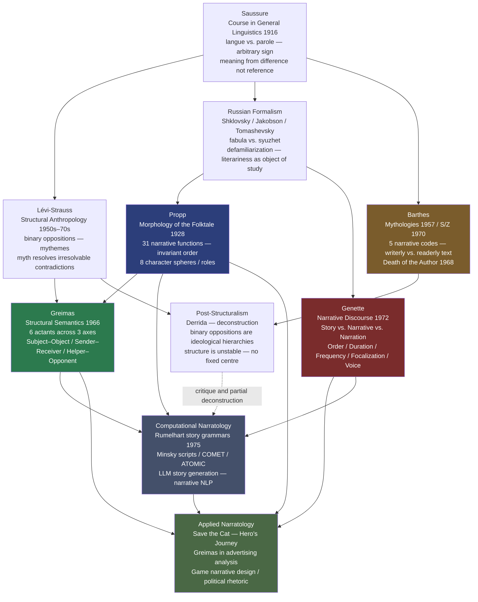

# Structuralism and Narratology

> [!abstract] TL;DR
> Structuralism applied Saussure's insight — that meaning is relational, not referential — to literary texts: stories are sign systems governed by hidden grammars, not individual expressions of a unique author's vision. Propp (1928) found that 100 Russian folktales share the same 31 narrative functions in invariant order, with only surface symbols varying; Greimas abstracted these into 6 actants across 3 axes applicable to any narrative, including advertisements and political speech; Genette built the systematic vocabulary for narrative technique — distinguishing story (what happened) from narrative (how it is told) from narration (the act of telling), and giving precise names to flashbacks, focalization, and unreliable narrators; Barthes identified five codes simultaneously active in every text and declared the Death of the Author, making the reader the locus of meaning; post-structuralism showed that structural binary oppositions are ideological hierarchies, not neutral logic; and computational narratology has turned Propp's morphology into story grammars for AI systems that generate, parse, and evaluate narrative.

---

## Intuition

**Analogy:** Consider what happens when you walk into a cinema that is already twenty minutes into the film. You have no programme. You do not know the characters' names. Yet within three or four minutes, you understand with near-certainty who the hero is, who the villain is, roughly what the hero wants, and that the story will end with the hero either getting it or being destroyed in the attempt. You know this not because you have read the screenplay but because you have internalized, through thousands of stories consumed since childhood, a deep narrative grammar — a set of structural rules so thoroughly absorbed that they now feel like common sense.

Structuralist narrative theory makes this intuitive competence into a formal object of study. Just as Saussure showed that a French speaker knows implicitly what makes a sequence of sounds a valid French sentence without being able to state the grammar, Propp showed that a listener knows implicitly what makes a sequence of narrative events a valid folktale. The grammar was always there; narratology is the discipline that writes it down.

The extension from folklore to all narrative — Greimas to advertising, Genette to Proust and film, Barthes to Balzac and fashion magazines — rests on the same bet: that the structure generating one kind of story (Russian wonder tales, Hollywood blockbusters, political speeches) is not idiosyncratic to that genre but is a surface realization of a more fundamental human capacity for narrative cognition. Understanding the grammar does not make stories feel mechanical; it reveals why certain stories feel inevitable.

---

## How It Works



The diagram traces two tributaries — Russian Formalism (fabula/syuzhet) and structural anthropology (binary oppositions) — both flowing from Saussure's linguistics into narratology proper. Propp and Greimas formalize character and action at the level of the story; Genette formalizes the mechanics of the text; Barthes formalizes the reader's encounter with the codes that permeate every sentence. Post-structuralism does not abandon the tradition but shows it was never politically neutral. Computational narratology inherits the formalisms and attempts to implement them in machines.

---

## Key Concepts

### Secondary Level

**Saussure and structural linguistics applied to literature**

Ferdinand de Saussure's *Course in General Linguistics* (published posthumously from students' notes, 1916) proposed three principles that became the foundation of all structuralist thought:

1. **The linguistic sign is arbitrary**: the word "tree" has no natural connection to the thing it names; the connection is purely conventional and differs across languages (*arbre*, *Baum*, *árvore*).
2. **Meaning is relational, not referential**: a sign has meaning not because it points to a thing in the world but because it differs from other signs in the system. "Red" means what it does because it is not "orange" or "blue."
3. **Langue versus parole**: the system of language (langue) is distinct from individual utterances (parole). Linguistics studies langue — the shared grammar — not any particular speech act.

Literary structuralism applies these three principles to texts. A literary text is not a unique, autonomous expression of an individual author's vision; it is a set of signs organized by the codes and conventions of the literary system — genre conventions, narrative formulas, symbolic codes, rhetorical traditions. The novel does not mean what it does because Flaubert chose those words; it means what it does because those words are positioned within a system of literary conventions that precede and exceed any individual author.

**Vladimir Propp: 31 functions and 8 character roles**

Vladimir Propp (1895–1970) published *Morphology of the Folktale* in Russian in 1928. Ignored in the Soviet Union for decades, it was translated into English in 1958 and immediately transformed narrative theory worldwide.

Propp studied exactly 100 Russian wonder tales (*volshebnye skazki* — the magical/fairy-tale subgenre) and discovered that despite enormous surface variety, all of them share the same underlying narrative grammar. He named the units of this grammar **functions**: defined as acts of characters determined by their significance for the course of the plot, irrespective of who performs the act or how.

The three foundational findings:

1. **Invariant sequence**: functions always occur in the same order. You cannot have the hero defeat the villain (function 18) before the hero departs from home (function 11).
2. **Variable instantiation**: the same function can be filled by completely different characters and actions across tales. Function 14 (hero receives a magical agent) might be a sword, a horse, a ring, a spell, or a wise old woman — the surface content varies; the structural position is fixed.
3. **Selective presence**: not all 31 functions appear in every tale, but those that do always appear in sequence.

| # | Symbol | Function | Notes |
|---|--------|----------|-------|
| 1 | α | Absentation | A family member leaves home |
| 2 | β | Interdiction | A prohibition is imposed on the hero |
| 3 | γ | Violation | The prohibition is broken |
| 4 | δ | Reconnaissance | The villain seeks information |
| 5 | ε | Delivery | The villain receives information |
| 6 | ζ | Trickery | The villain attempts to deceive |
| 7 | η | Complicity | The hero is deceived |
| 8 | A/a | Villainy / Lack | The core harm is done, or a lack identified |
| 9 | B | Mediation | The hero discovers the misfortune |
| 10 | C | Counteraction | The hero agrees to act |
| 11 | ↑ | Departure | The hero leaves home |
| 12 | D | Donor test | The hero is tested by a donor figure |
| 13 | E | Hero's reaction | The hero passes or fails |
| 14 | F | Magical agent | Hero receives a magical helper or item |
| 15 | G | Guidance | Hero is led toward the goal |
| 16 | H | Struggle | Hero and villain fight |
| 17 | J | Branding | Hero is marked or wounded |
| 18 | I | Victory | Villain is defeated |
| 19 | K | Liquidation | The initial lack is resolved |
| 20 | ↓ | Return | Hero starts home |
| 21 | Pr | Pursuit | Hero is chased by a new villain |
| 22 | Rs | Rescue | Hero escapes pursuit |
| 23 | o | Unrecognized arrival | Hero arrives home incognito |
| 24 | L | False claims | A false hero claims the reward |
| 25 | M | Difficult task | An ordeal is imposed |
| 26 | N | Task solution | The hero solves the task |
| 27 | Q | Recognition | The true hero is recognized |
| 28 | Ex | Exposure | The false hero or villain is exposed |
| 29 | T | Transfiguration | The hero receives a new appearance |
| 30 | U | Punishment | The villain is punished |
| 31 | W | Wedding | The hero marries and is crowned |

Propp also identified **8 character spheres** (roles) — not characters but narrative positions. One character can fill multiple spheres; one sphere can be distributed across multiple characters.

| Role | Primary function in the narrative |
|------|----------------------------------|
| Hero | Performs the quest; bearer of the main narrative drive |
| Villain | Causes the initial harm or lack |
| Donor | Tests the hero and provides the magical agent |
| Helper | Assists the hero on the quest |
| Princess | The goal or prize of the quest |
| Father (of the princess) | Sets tasks, assigns marriage reward |
| Dispatcher | Sends the hero on the mission |
| False hero | Claims the reward without earning it; is exposed |

The insight is powerful precisely because it separates deep structure from surface. *Cinderella*, *Harry Potter*, *The Odyssey*, and any number of video games share the same deep grammar even though their surface vocabularies have nothing in common.

---

### Undergraduate Level

**Greimas's actantial model**

Algirdas Julien Greimas (1917–1992) further abstracted Propp's eight character spheres into a more general logical structure applicable to any narrative — not just folktales. In *Structural Semantics* (1966) and the *Narrative Grammar* programme that followed, he reduced the character roles to **6 actants** organized across **3 axes**:

| Axis | Actant A | Actant B | What the axis encodes |
|------|----------|----------|----------------------|
| **Desire** | Subject | Object | The subject pursues the object; this is the basic plot motor |
| **Communication** | Sender | Receiver | Who mandates the quest; who benefits from its completion |
| **Auxiliary** | Helper | Opponent | Who facilitates and who obstructs the subject |

The model's power is its abstraction: actants need not be persons. In a political campaign advertisement:

- **Subject** = the candidate
- **Object** = a prosperous, secure nation
- **Sender** = the electorate (who mandates the quest through their vote)
- **Receiver** = citizens (who benefit)
- **Helper** = the candidate's policies
- **Opponent** = the incumbent / economic forces / foreign threats

Every effective advertisement can be mapped onto the actantial model to reveal its ideological structure. The analyst asks: who is positioned as subject? What is framed as the object of desire? Who or what is constructed as opponent? These questions expose the political logic beneath the surface imagery.

In AI story generation, Greimas's actantial model has been implemented as a constraint framework: given a Subject and an Object, generate a sequence of events in which a Sender dispatches the Subject, a Helper assists, and an Opponent obstructs, ending in success or failure. This computable formalism is the direct lineage from 1966 structural semantics to modern narrative AI.

**Genette's narratology: story, narrative, narration**

Gérard Genette (1930–2018) built the most rigorous systematic vocabulary for narrative analysis in his *Narrative Discourse* (Discours du récit, 1972), developed through an extended analysis of Proust's seven-volume *In Search of Lost Time*. His central move is the three-level distinction that most literary analysis before him confused:

1. **Story (histoire / fabula)**: the events in their chronological, "real-world" causal order — what happened, when it happened. The raw material.
2. **Narrative (récit / syuzhet)**: the text as actually constructed — the order in which events are presented, the time spent on each, the perspective through which they are seen. The artistic manipulation.
3. **Narration**: the act and situation of narrating itself — who is telling, when relative to the events, from what position, with what relationship to the story.

This three-way distinction generates the entire machinery of narratological analysis.

**Temporal categories**

*Order* — the relationship between story time and narrative time in terms of sequence:
- **Analepsis** (flashback): the narrative moves to events that occurred before the current narrative moment. *In Search of Lost Time* begins in the middle of Marcel's adult life and reaches back to his childhood at Combray through the famous madeleine.
- **Prolepsis** (flash-forward): the narrative anticipates events that will occur later. "He didn't know it yet, but this would be the last time he would see her."

*Duration* — the ratio between story time and the space given to it in the narrative:
- **Scene**: story time and narrative time are roughly equal (dialogue, a detailed action sequence)
- **Summary**: many events are compressed into a few sentences ("Ten years passed.")
- **Ellipsis**: story time is skipped entirely (the narrative jumps over months or years without acknowledgment)
- **Pause**: narrative time dilates beyond story time (a page describing a single glance, a character's stream of consciousness during a one-second fall)

*Frequency* — how many times the narrative tells what happened:
- **Singulative**: once what happened once (the default)
- **Iterative**: once what happened many times ("Every Tuesday, she walked to the market")
- **Repetitive**: multiple times what happened once (*Rashomon*; the same event told from four perspectives)

**Focalization (who sees)**

Genette reformulates the traditional "point of view" concept with greater precision. Focalization is the relationship between the narrative's knowledge and a character's knowledge:

- **Zero focalization**: the narrator knows more than any character — the traditional omniscient narrator of 19th-century realism who can enter any mind
- **Internal focalization**: the narrative is filtered through a single character's perspective — we know only what that character knows, and no more (*The Remains of the Day*, almost all of Henry James)
- **External focalization**: the narrator knows *less* than the characters — pure behaviorist narration, surfaces only, no access to consciousness (Hemingway's "Hills Like White Elephants")

**Voice (who speaks)**

The narrator's position relative to the story:
- **Extradiegetic narrator**: outside the narrative world being told (most conventional narrators)
- **Intradiegetic narrator**: a character within the story who tells a story to other characters (Scheherazade; the sea captain in Conrad's *Lord Jim*)
- **Metadiegetic narrator**: a narrator within an intradiegetic narrator's story — a story within a story within a story (*The Canterbury Tales*)
- **Homodiegetic narrator**: the narrator participated in the events narrated (first-person narrators who were there)
- **Heterodiegetic narrator**: the narrator did not participate (third-person narrators)
- **Autodiegetic narrator**: the narrator is the hero of their own story (most first-person novels)

These distinctions matter because they determine the epistemological status of everything the narrator tells us. An autodiegetic, homodiegetic narrator (*Lolita*'s Humbert Humbert) is unreliable by definition: they are both the perceiving consciousness and a participant with interests. An extradiegetic, heterodiegetic narrator with zero focalization (*War and Peace*) is omniscient and implicitly authoritative. Genette's vocabulary makes unreliable narration, frame narratives, and narrative experiments formally describable.

**Barthes's five narrative codes (S/Z)**

Roland Barthes (1915–1980) applied the most granular structural analysis to a literary text in *S/Z* (1970): a sentence-by-sentence reading of Balzac's novella "Sarrasine" that identified five codes operating simultaneously throughout. Any sentence in any narrative activates multiple codes at once:

| Code | Abbreviation | What it encodes | Example |
|------|-------------|-----------------|---------|
| **Proairetic** | ACT | Sequences of actions and their implied completions — narrative momentum | "He picked up the gun." (implies it will be fired) |
| **Hermeneutic** | HER | Questions raised and withheld — mystery, suspense, enigma | "Who was this woman, really?" |
| **Semic** | SEM | Connotations that build character and atmosphere | "She spoke in a low, measured voice." (connotes control, danger) |
| **Cultural** | REF | References to shared cultural knowledge — proverbs, science, history | "As Freud has shown..." / "the way all wars end" |
| **Symbolic** | SYM | Thematic oppositions — Nature/Culture, Male/Female, Life/Death | The recurring imagery of mirrors and appearances in "Sarrasine" |

The proairetic and hermeneutic codes generate narrative desire — the forward pull of plot. The semic code builds the density of characterization. The cultural code situates the text in its historical moment. The symbolic code opens the text's depth. A **readerly** (lisible) text activates the proairetic and hermeneutic codes heavily and directs the reader down a single, predetermined interpretive path — most genre fiction. A **writerly** (scriptible) text foregrounds the semic and symbolic codes and invites the reader to actively produce meaning by engaging its ambiguities — modernist and avant-garde fiction.

**The Death of the Author (1968)**

Barthes's most influential single essay argues that once a text is released into the world, the author's intentions become irrelevant to its meaning. A text is "a multidimensional space in which a variety of writings, none of them original, blend and clash" — a tissue of codes, conventions, and quotations drawn from the cultural reservoir. To give the text a single Author is to close the text — to impose a final meaning and arrest the play of codes. The "Death of the Author" is the "Birth of the Reader": meaning is produced in the act of reading, which is irreducible to what the author intended. This became one of the founding gestures of post-structuralism and one of the most debated positions in 20th-century literary theory.

---

### Graduate Level

**Post-structuralist critique of narrative universalism**

Structuralism generated its own undoing from within. The central post-structuralist move was to show that the binary oppositions underlying narrative structure — Hero/Villain, Order/Chaos, Culture/Nature — are not neutral logical pairs but ideological hierarchies in which one term is always privileged.

Jacques Derrida's *Of Grammatology* (1967) demonstrated that Western metaphysics has systematically privileged one pole of every structurally fundamental binary: speech over writing, presence over absence, nature over culture, man over woman, center over margin. These privilegings are not natural or logical; they are political — the structural sign of power. **Deconstruction** does not invert the hierarchy (that would merely reassign power) but shows the hierarchy is unstable: the supposedly subordinate term is in fact constitutive of the dominant term. Writing is not the supplement to speech; it is what makes speech legible as speech.

Applied to Propp, Greimas, and Genette, the post-structuralist critique raises three specific challenges:

1. **The ideological content of structural universals**: Propp's 31 functions describe the narrative grammar of a specific corpus of patriarchal Russian peasant tales in which heroes are male, princesses are prizes to be won through combat, and success is measured by marriage and royal power. This is not a universal narrative grammar; it is the grammar of a specific ideological formation dressed in universal clothes. When screenwriting manuals (Save the Cat, the Hero's Journey) export this grammar globally, they are not uncovering human cognitive universals; they are propagating the narrative logic of mid-20th-century American masculinity.

2. **Whose stories count**: the structural approach analyzes the grammar of stories that have already been selected for preservation and canonization. The stories that were never told, that were suppressed or deemed unworthy of collection, that did not fit the folktale genre, are absent from the corpus and therefore absent from the grammar. Feminist, postcolonial, and queer narratology have asked: what narrative structures describe stories organized around collective survival rather than individual heroic quest? Around care rather than combat? Around ambiguity rather than resolution?

3. **The limits of formalism**: Genette's narratology describes *how* a narrative works with great precision but brackets the question of *what it does* — its political, psychological, and historical effects on actual readers in actual historical contexts. The same formal techniques (internal focalization, temporal analepsis, unreliable narration) can serve to humanize or dehumanize, to challenge or reinforce dominant ideologies. Form does not determine content.

**Computational narratology and story generation**

Propp's morphology became the first formal model for computational narrative understanding — because a formal grammar is precisely what a computer program requires.

David Rumelhart's **story grammar** (1975) formalized narrative structure as a context-free grammar analogous to syntactic grammar: a Story consists of a Setting and an Episode; an Episode consists of an Event and a Reaction; a Reaction consists of an Internal Response and an Overt Response — recursively structured. Rumelhart's claim was simultaneously formal and psychological: children understand stories before they can read because they have internalized a story grammar as a cognitive schema. Comprehension failures (children who cannot summarize stories correctly) are failures to apply the story schema, not failures of general intelligence.

Roger Schank and Robert Abelson's **scripts** (1977) addressed the background knowledge problem: a reader (or AI) needs not just narrative grammar but knowledge of stereotyped event sequences to interpret narrative. The "restaurant script" encodes the expected sequence of events for restaurant visits; a story that assumes the script can omit explicit information at any step. Without the script, the narrative is opaque. The Cyc project (Lenat, 1984–present) attempted to encode millions of commonsense scripts as a foundation for machine understanding.

Contemporary approaches inherit both strands:

- **COMET and ATOMIC** (Bosselut et al., 2019; Sap et al., 2019): commonsense knowledge graphs that encode causal, intentional, and temporal relations between events in natural language. COMET can infer "if X happens, then Y is likely" — the kind of everyday narrative reasoning that humans deploy automatically.
- **LLM story generation**: models like GPT-4 have empirically internalized Proppian structures, Greimas's actantial patterns, Genette's focalization conventions, and Barthes's narrative codes from billions of narrative texts in training. They do not implement these formalisms symbolically but have learned them statistically. The result is narratively coherent text — but text that inherits the ideological skews of the training corpus, exactly as the post-structuralist critique predicted.
- **Narrative understanding in NLP**: coreference resolution, temporal event ordering, causal chain extraction, discourse relation classification — all fundamentally narrative tasks that require story grammar in addition to syntax and semantics.

**Narrative as cognitive model: the developmental and cross-cultural evidence**

The persistence of Proppian structures across cultures is interpretively contested (is it universal human cognition, or colonial export of European narrative conventions?), but the developmental evidence is striking: children begin producing narratively structured discourse at ages 2–3, long before formal education, and their story competence develops in recognizable stages that match story grammar predictions. Jerome Bruner's *Actual Minds, Possible Worlds* (1986) argued that narrative is not one cognitive mode among many but a fundamental mode of thought — the mode in which humans organize experience, attribute intention to agents, and construct a self through autobiographical memory.

The **narrative self**: autobiographical memory is not a passive archive but an actively constructed narrative that selects events, assigns roles, imposes temporal order, and generates a sense of continuity across time. The self is, in Barthes's terms, a writerly text that the person is constantly rewriting. Trauma disrupts narrative self-coherence; therapeutic narrative reconstruction (as in CBT, DBT, and narrative therapy) is a clinical application of this insight.

---

## Python Demo

```python
import numpy as np
import matplotlib.pyplot as plt
import matplotlib.patches as mpatches

np.random.seed(1928)   # Propp's Morphology published in 1928

# ── Propp's 31 narrative functions ──────────────────────────────────────────
#
# Each tuple: (number, symbol, short_name, p_appear)
# p_appear = probability a randomly generated folktale contains this function.
# Calibrated to reflect Propp's observation that early functions (1, 8, 11)
# are nearly universal while later functions (17, 21–24, 28–29) appear in
# only a minority of tales.
#
# The invariant-order constraint is enforced automatically: we sample each
# function independently and then retain the ones that fire — the sequence of
# surviving functions is always in order 1→31 by construction, because we
# iterate in order.

FUNCTIONS = [
    ( 1, "α",   "Absentation",           0.92),
    ( 2, "β",   "Interdiction",          0.78),
    ( 3, "γ",   "Violation",             0.72),
    ( 4, "δ",   "Reconnaissance",        0.55),
    ( 5, "ε",   "Delivery",              0.50),
    ( 6, "ζ",   "Trickery",              0.48),
    ( 7, "η",   "Complicity",            0.42),
    ( 8, "A",   "Villainy / Lack",       0.96),
    ( 9, "B",   "Mediation",             0.88),
    (10, "C",   "Counteraction",         0.85),
    (11, "up",  "Departure",             0.96),
    (12, "D",   "Donor test",            0.68),
    (13, "E",   "Hero reaction",         0.65),
    (14, "F",   "Magical agent",         0.60),
    (15, "G",   "Guidance",              0.55),
    (16, "H",   "Struggle",              0.75),
    (17, "J",   "Branding",              0.35),
    (18, "I",   "Victory",               0.88),
    (19, "K",   "Liquidation",           0.90),
    (20, "dn",  "Return",                0.82),
    (21, "Pr",  "Pursuit",               0.45),
    (22, "Rs",  "Rescue",                0.42),
    (23, "o",   "Unrecognized arrival",  0.38),
    (24, "L",   "False claims",          0.35),
    (25, "M",   "Difficult task",        0.48),
    (26, "N",   "Task solution",         0.45),
    (27, "Q",   "Recognition",           0.55),
    (28, "Ex",  "Exposure",              0.40),
    (29, "T",   "Transfiguration",       0.38),
    (30, "U",   "Punishment",            0.60),
    (31, "W",   "Wedding",               0.70),
]

FUNC_NUMS  = np.array([f[0] for f in FUNCTIONS])
FUNC_SYMS  = [f[1] for f in FUNCTIONS]
FUNC_NAMES = [f[2] for f in FUNCTIONS]
FUNC_PROBS = np.array([f[3] for f in FUNCTIONS])

# ── 8 character spheres (roles) ──────────────────────────────────────────────
ROLES = ["Hero", "Villain", "Donor", "Helper",
         "Princess", "Father", "Dispatcher", "False Hero"]

# Per-role probability of appearing in a tale
# Hero and Villain are always present; others vary
ROLE_PROBS = np.array([1.00, 1.00, 0.65, 0.70, 0.75, 0.55, 0.80, 0.40])

N_TALES = 100
rng = np.random.default_rng(1928)

# Generate N_TALES folktale skeletons: (N_TALES x 31) boolean matrix
tale_matrix = rng.random((N_TALES, len(FUNCTIONS))) < FUNC_PROBS[np.newaxis, :]

# Role presence per tale: (N_TALES x 8) boolean matrix
role_matrix = rng.random((N_TALES, len(ROLES))) < ROLE_PROBS[np.newaxis, :]

# Function frequency across all tales
func_freq = tale_matrix.mean(axis=0)

# Tale length (number of functions present)
tale_lengths = tale_matrix.sum(axis=1)

# Colour phase: 5 structural phases following Propp's internal grouping
def phase_color(n):
    if n <= 7:   return "#5b8db8"  # blue:   preparatory sequence
    if n <= 11:  return "#e06c4a"  # orange: departure spine (near-universal)
    if n <= 19:  return "#4aae85"  # green:  central quest / donor / struggle
    if n <= 26:  return "#c47ab5"  # purple: return and false-hero sequence
    return               "#d4a843"  # gold:   recognition and reward finale

phase_colors = [phase_color(n) for n in FUNC_NUMS]

# ── Plotting ─────────────────────────────────────────────────────────────────
fig = plt.figure(figsize=(16, 10))
gs = fig.add_gridspec(2, 2, hspace=0.44, wspace=0.32)

ax1 = fig.add_subplot(gs[0, :])  # full-width: function frequency bar chart
ax2 = fig.add_subplot(gs[1, 0])  # bottom-left: tale length histogram
ax3 = fig.add_subplot(gs[1, 1])  # bottom-right: presence heatmap (first 20 tales)

fig.suptitle(
    "Propp's Morphology of the Folktale — Narrative Structure Simulation\n"
    f"({N_TALES} randomly generated Russian wonder-tale skeletons, seed 1928)",
    fontsize=12, fontweight="bold"
)

# Panel 1 — function frequency
ax1.bar(range(1, 32), func_freq * 100, color=phase_colors,
        edgecolor="white", linewidth=0.6)
ax1.axhline(80, color="gray", linestyle=":",  linewidth=0.9, alpha=0.55)
ax1.axhline(50, color="gray", linestyle="--", linewidth=0.9, alpha=0.55)
ax1.set_xlabel("Propp Function Number", fontsize=9)
ax1.set_ylabel("Frequency across 100 tales (%)", fontsize=9)
ax1.set_title(
    "Function Frequency — Early Functions (Departure, Villainy) Nearly Universal; "
    "Late Optional Functions Vary Widely",
    fontsize=9.5, fontweight="bold"
)
ax1.set_xticks(range(1, 32))
ax1.set_xticklabels(FUNC_SYMS, fontsize=7.5)
ax1.set_ylim(0, 110)

# Annotate three landmark functions
for idx, label in [(10, "Departure"), (17, "Victory"), (30, "Wedding")]:
    y = func_freq[idx] * 100
    ax1.annotate(
        label, xy=(idx + 1, y + 1.5),
        xytext=(idx + 1, y + 12), textcoords="data",
        ha="center", fontsize=7,
        arrowprops=dict(arrowstyle="-", color="gray", lw=0.6)
    )

legend_handles = [
    mpatches.Patch(color="#5b8db8", label="Preparatory (1-7)"),
    mpatches.Patch(color="#e06c4a", label="Departure spine (8-11)"),
    mpatches.Patch(color="#4aae85", label="Central quest (12-19)"),
    mpatches.Patch(color="#c47ab5", label="Return / false hero (20-26)"),
    mpatches.Patch(color="#d4a843", label="Recognition and reward (27-31)"),
]
ax1.legend(handles=legend_handles, fontsize=7.5, loc="lower right",
           ncol=2, framealpha=0.88)

# Panel 2 — tale length distribution
ax2.hist(tale_lengths, bins=range(10, 32), color="#4a7fb5",
         edgecolor="white", linewidth=0.7, alpha=0.88)
ax2.axvline(tale_lengths.mean(), color="#e05c3a", linewidth=1.8,
            linestyle="--", label=f"Mean = {tale_lengths.mean():.1f} functions")
ax2.set_xlabel("Functions per tale (out of 31)", fontsize=9)
ax2.set_ylabel("Number of tales", fontsize=9)
ax2.set_title("Distribution of Tale Length\n(how many of 31 functions appear)", fontsize=9)
ax2.legend(fontsize=8)

# Panel 3 — presence/absence heatmap for first 20 tales
im = ax3.imshow(tale_matrix[:20].astype(float), aspect="auto",
                cmap="Blues", vmin=0, vmax=1, interpolation="nearest")
ax3.set_xlabel("Function (1-31)", fontsize=9)
ax3.set_ylabel("Tale index (1-20)", fontsize=9)
ax3.set_title("Function Presence Map\n(first 20 generated tales — blue = present)", fontsize=9)
ax3.set_xticks(range(0, 31, 5))
ax3.set_xticklabels(range(1, 32, 5), fontsize=7.5)
ax3.set_yticks(range(20))
ax3.set_yticklabels(range(1, 21), fontsize=7)
fig.colorbar(im, ax=ax3, fraction=0.04, pad=0.02, label="Present / Absent")

plt.savefig("propp_narrative_functions.png", dpi=150, bbox_inches="tight")
plt.show()

# ── Print one sample tale skeleton ──────────────────────────────────────────
print("=" * 50)
print("SAMPLE TALE SKELETON  (Tale #1)")
print("=" * 50)
active_roles = [ROLES[i] for i in range(len(ROLES)) if role_matrix[0, i]]
print(f"Character roles: {', '.join(active_roles)}\n")
print(f"{'#':>3}  {'Sym':>3}  Function")
print("-" * 38)
for i, present in enumerate(tale_matrix[0]):
    if present:
        print(f"  {FUNC_NUMS[i]:>2}  {FUNC_SYMS[i]:>3}  {FUNC_NAMES[i]}")

print(f"\nFunctions in this tale: {tale_matrix[0].sum()} / 31\n")
print("--- Corpus statistics (100 tales) ---")
print(f"Mean functions per tale  : {tale_lengths.mean():.1f}")
hi = func_freq.argmax()
lo = func_freq.argmin()
print(f"Most  frequent function  : #{FUNC_NUMS[hi]:>2} {FUNC_NAMES[hi]:<24} "
      f"({func_freq[hi]:.0%})")
print(f"Least frequent function  : #{FUNC_NUMS[lo]:>2} {FUNC_NAMES[lo]:<24} "
      f"({func_freq[lo]:.0%})")
```

**What the simulation shows:**

- **Panel 1 (bar chart)**: The departure-spine functions (8–11 — Villainy/Lack, Mediation, Counteraction, Departure) appear in over 85% of tales; these are the non-negotiable plot motor. The preparatory functions (2–7 — Interdiction, Violation, Reconnaissance, Trickery, Complicity) cluster in the 40–78% range — common but not obligatory. The late optional functions (17 Branding, 23–24 Unrecognized arrival/False claims, 28–29 Exposure/Transfiguration) appear in only 35–42% of tales — structural luxuries that deepen the plot when present but are not required for narrative coherence.
- **Panel 2 (histogram)**: Tale lengths cluster between 15 and 24 functions (out of 31), with a mean around 19 — consistent with Propp's observation that real wonder tales average roughly 16–22 functions.
- **Panel 3 (heatmap)**: Vertical stripes (the same function present across most tales) appear at functions 1, 8–11, 18–20, 31 — the structural spine. Speckled regions appear in functions 17, 23–24, 28–29 — the variable decorative functions. This visualization directly instantiates Propp's core claim: deep structural invariance beneath surface diversity.

---

## Real-World Applications

> **Example 1 — Hollywood plot structure as applied Propp.** Blake Snyder's *Save the Cat* (2005), the most influential screenwriting manual of the 21st century, specifies 15 narrative "beats" that correspond almost exactly to Propp's 31 functions compressed into a standard 110-page screenplay. Beat 1 ("Opening image") = function 1 (Absentation — the world before the quest disruption). Beat 5 ("Catalyst") = function 8 (Villainy/Lack — the event that forces action). Beat 6 ("Debate") = function 10 (Counteraction — the hero hesitates). Beat 9 ("Fun and games") = functions 12–16 (the central quest section). Beat 12 ("All is lost") = a severe form of function 21 (Pursuit/catastrophe). Beat 15 ("Final image") = function 31 (Wedding — the new equilibrium). The structural homology is not coincidental: Snyder, like Campbell before him, is describing the grammar that audiences have been trained to expect from four centuries of European narrative.

> **Example 2 — Greimas's actantial model in advertising analysis.** A Nike advertisement following "Just Do It" typically maps: **Subject** = the aspiring athlete (identified with the viewer), **Object** = athletic achievement / identity / self-actualization, **Sender** = an inner drive or a coach figure, **Receiver** = the transformed self (who you become by achieving), **Helper** = Nike product, **Opponent** = laziness, doubt, the body's limits. The structural analysis reveals what the advertisement is *really* selling: not shoes but a narrative position — the role of subject in a quest narrative. Greimas's model exposes why this is so emotionally compelling: it taps the deep narrative grammar in which being the Subject of desire is the fundamental human self-construction.

> **Example 3 — Genette's focalization in Kurosawa's Rashomon (1950).** Rashomon tells the same murder four times from four different perspectives. In Genette's terms, each retelling shifts the focalization: the bandit's account is internally focalized through the bandit (we see only what he chooses to reveal); the wife's account shifts internal focalization to her; the murdered husband's account (via a medium) shifts to his; the woodcutter's account claims external focalization (a witness who "saw everything") but is revealed to be internally focalized through his shame. The film's epistemological point — that testimony is always focalized, that there is no zero-focalization access to truth — is a cinematic enactment of Genette's theoretical distinction.

> **Example 4 — Narrative AI and story grammars.** The COMET system (Bosselut et al., 2019), trained on the ATOMIC commonsense knowledge graph, can complete narrative sequences: given "PersonX went to the store," COMET infers that PersonX's intent is to buy something, that PersonX needs money, that PersonX will likely return home afterwards. This is story-grammar reasoning: understanding events in terms of intentional agents pursuing goals through sequenced actions. When GPT-4 is asked to write a story, it implicitly applies Propp's function sequence, Greimas's actantial structure, and Genette's temporal conventions — learned empirically from millions of narrative texts rather than symbolically implemented, but functionally equivalent to the formalisms those theorists articulated.

> **Example 5 — Barthes's narrative codes in serial television.** The *hermeneutic code* (enigma/mystery) is the structural engine of prestige TV drama: *Lost*, *Westworld*, *True Detective* are machines for generating and withholding answers. Every episode introduces new enigmas (HER: who is the Man in Black?) while partially resolving old ones, exploiting the viewer's desire for hermeneutic closure. The *proairetic code* (action) runs in parallel: each scene begins an action sequence whose completion is delayed across episodes. Long-form television is structurally a hermeneutic/proairetic engine with semic and symbolic codes providing depth — Barthes's five-code analysis was written for a 50-page novella but scales precisely to a 70-episode series.

---

## Common Pitfalls

- **Confusing story (fabula) with narrative (syuzhet)** — the most common error in narratological analysis. Story is what happened in chronological order; narrative is the text's presentation of it. A film that begins with a death (narrative position: the first scene) and works backward to explain how it occurred has a story that ends with the death (chronologically last). Conflating the two makes it impossible to analyze flashback, prolepsis, anachrony, or unreliable narration precisely.

- **Treating Propp's functions as universally applicable** — Propp himself warned against over-generalization. The 31 functions describe the Russian wonder tale (*volshebnye skazki*); they describe the corpus Propp studied. They map reasonably onto European fairy tales and Hollywood action structures, but they do not map well onto tragedy (Propp's hero wins; tragedy's hero loses), comedy of manners, modernist plotless fiction, or narrative traditions organized around collective rather than individual agency. Applying the model outside its domain without modification is a category error.

- **Equating post-structuralism with "anything goes" relativism** — Post-structuralism does not claim there are no structures, only that structures are not neutral. Derrida is not saying that texts have no meaning; he is saying that meaning is never fully present, always differing and deferring (*différance*). The analyst can still perform rigorous structural analysis — but must remain alert to the political stakes of structural choices: which binary is privileged, whose narrative grammar is treated as universal, which stories are rendered structurally invisible.

- **Treating Greimas's actants as equivalent to characters** — Actants are logical positions in a narrative structure, not persons. The Object can be an abstract quality (justice, knowledge, love); the Opponent can be a social structure or a natural force rather than a villain figure; the Helper can be split across multiple characters or embodied in a single one. The abstraction is the point: the actantial model works because it describes the logical skeleton of narrative desire, which can be instantiated by any kind of entity.

- **Confusing internal focalization with first-person narration** — These are independent variables. A third-person novel can be internally focalized through a character (Flaubert's *Madame Bovary* is third-person but deeply internally focalized through Emma); a first-person narrator can provide external focalization (Nelly Dean's narration of *Wuthering Heights* often describes Heathcliff and Catherine from outside, without access to their internal states). Genette's distinction separates *who sees* (focalization) from *who speaks* (voice).

- **Reading Barthes's "Death of the Author" as anti-interpretation** — Barthes is not saying that texts have no meaning or that all readings are equally valid. He is saying that the Author cannot be the final arbiter of a text's meaning and that the act of reading is a productive, not merely receptive, encounter with a network of codes. Close reading remains necessary — but it is reading in the service of the text's plurality, not in the service of recovering a single authorial intention.

---

## Related Concepts

- [[Structuralism_and_Symbolic_Anthropology]] — the parent tradition from which literary structuralism branches; Lévi-Strauss's binary oppositions and mytheme analysis directly influenced Greimas's actantial model and Barthes's symbolic code; the post-structuralist critique applies to both anthropological and literary structuralisms simultaneously
- [[Oral_Tradition_and_Narrative]] — Propp's morphology emerged from the Russian folklorist tradition that also produced oral-formulaic theory; his 31 functions describe the same deep structure that oral-formulaic theory explains as a compositional grammar of formulas; both traditions argue that surface diversity conceals structural invariance
- [[Discourse_Analysis]] — Genette's narratology addresses the macro-structure of extended texts; discourse analysis addresses cohesion, coherence, and structure at the paragraph and multi-sentence level; Barthes's five codes operate at both the sentence level (discourse) and the whole-text level (narrative); the two fields share the question of how meaning accumulates across linguistic units
- [[Semiotics_and_Symbolic_Communication]] — structuralist narratology is applied semiotics; Saussure's sign theory is the common foundation; Barthes's five codes are semiotic categories; Greimas's actantial model is a semiotics of narrative action; the distinction between readerly and writerly texts maps onto closed versus open sign systems
- [[Memory_Systems]] — story grammar is simultaneously a narrative theory and a theory of how humans store and retrieve event knowledge; Rumelhart's story grammar was proposed as a cognitive schema explaining why children understand stories before they can articulate rules; episodic memory is organized narratively; the schema-based account of memory distortion (Bartlett) explains why oral transmission preserves structural functions while shedding surface detail
- [[Language_and_Thought]] — Saussure's structural linguistics is the epistemological foundation of the entire tradition; the question of whether narrative grammar is universal (Propp, Greimas) or culturally variable (post-structuralism) maps onto the debate between Chomskyan universal grammar and Sapir-Whorf linguistic relativity
- [[Cognitive_Semantics_and_Metaphor]] — Genette's temporal and perspectival categories (analepsis, focalization, narrative levels) describe the same cognitive operations that cognitive linguists analyze as mental space mappings and viewpoint constructions; the concept of the narrative self connects to conceptual metaphor theory's account of how abstract experience is structured through concrete narrative schemas

---

## Review Questions

### Secondary

1. Propp found that all 100 folktales in his corpus share the same sequence of narrative functions, even though their surface content (characters, settings, objects) differs completely. Explain what Propp means by a "function" and give two examples showing how the same function can be filled by completely different story elements. Why does Propp think the sequence of functions cannot be altered?

2. Genette distinguishes between the *story* (fabula) and the *narrative* (syuzhet). Take a film or novel you know well and describe one moment where the narrative departs from chronological story order. Using Genette's vocabulary, is this an analepsis or a prolepsis? What is the narrative effect of this temporal manipulation?

3. Barthes says that in a readerly text the reader passively follows a single predetermined path, while in a writerly text the reader must actively produce meaning. Give an example of each from popular culture and explain what structural features of each text produce these different reading experiences.

### Undergraduate

1. Greimas's actantial model reduces all narrative to six actants across three axes (desire, communication, auxiliary). Apply the model to a political speech or advertisement of your choosing. Identify each actant and assess: what does the actantial analysis reveal that a surface reading of the text would miss? What does it obscure or flatten?

2. Genette distinguishes three types of focalization: zero (omniscient), internal (filtered through a character), and external (behaviourist — surfaces only). Analyse a specific chapter or scene from a novel you know well using these categories. Is the focalization consistent throughout, or does it shift? What is the interpretive effect of the focalization choices?

3. Barthes's "Death of the Author" (1968) and Foucault's "What is an Author?" (1969) both argue that the author-function is a historical construction rather than a natural category. Compare their arguments: in what respects do they agree, and where do they diverge? What are the methodological implications for literary analysis: if the author is dead, what takes their place as the organizing principle of interpretation?

### Graduate

1. Vladimir Propp studied exactly 100 Russian wonder tales and derived 31 functions. David Rumelhart (1975) proposed that children's narrative comprehension is governed by an internalized story grammar. Joseph Campbell (1949) claimed a single monomyth underlies heroic narratives worldwide. All three make different kinds of universality claims (structural, cognitive, cross-cultural). Evaluate these claims carefully: which is the strongest, and on what evidence? What would it take to falsify or substantially modify each one? How do the post-structuralist critiques (that universals are Eurocentric projections, that structural grammars describe corpora shaped by ideological selection) bear on each claim differently?

2. Genette's narratological vocabulary — focalization, analepsis/prolepsis, diegetic levels, homodiegetic/heterodiegetic narration — was developed through an analysis of Proust's prose fiction and has been widely applied to film, television, comics, and digital interactive narratives. Assess the limits of this migration: which of Genette's categories translate well to other media, which require modification, and which are fundamentally medium-specific to prose fiction? Use concrete examples from at least two non-prose media.

3. Barthes's *S/Z* (1970) performs a sentence-by-sentence structural analysis of "Sarrasine" and yet *S/Z* itself is widely regarded as a pivotal post-structuralist text. How does Barthes both use and undermine the structuralist method in *S/Z*? In particular: does the five-code analysis stabilize the text's meaning (as structuralism intends) or proliferate it indefinitely (as post-structuralism implies)? What does this double movement tell us about the internal tensions within the structuralist project as a whole?

---

## Sources

- [Propp, V. (1928/1968). *Morphology of the Folktale*. University of Texas Press.](https://utpress.utexas.edu/9780292783768/)
- [Greimas, A. J. (1966/1983). *Structural Semantics: An Attempt at a Method*. University of Nebraska Press.](https://www.nebraskapress.unl.edu/university-of-nebraska-press/9780803291348/)
- [Genette, G. (1972/1980). *Narrative Discourse: An Essay in Method*. Cornell University Press.](https://www.cornellpress.cornell.edu/book/9780801492396/narrative-discourse/)
- [Barthes, R. (1970/1974). *S/Z*. Hill and Wang.](https://www.hbook.com/story/s-z-roland-barthes)
- [Barthes, R. (1968). "The Death of the Author." *Aspen* 5+6; reprinted in *Image–Music–Text* (1977). Fontana.](https://www.ubu.com/aspen/aspen5and6/threeEssays.html)
- [Saussure, F. de (1916/1983). *Course in General Linguistics*. Open Court.](https://www.opencourtbooks.com/books_n/course_in_general_linguistics.htm)
- [Lévi-Strauss, C. (1955). "The Structural Study of Myth." *Journal of American Folklore* 68(270), 428–444.](https://doi.org/10.2307/536768)
- [Rumelhart, D. E. (1975). "Notes on a Schema for Stories." In Bobrow & Collins (eds.), *Representation and Understanding*. Academic Press.](https://www.sciencedirect.com/book/9780121087500/representation-and-understanding)
- [Schank, R. & Abelson, R. (1977). *Scripts, Plans, Goals and Understanding*. Lawrence Erlbaum.](https://www.routledge.com/Scripts-Plans-Goals-and-Understanding-An-Inquiry-into-Human-Knowledge-Structures/Schank-Abelson/p/book/9780898591385)
- [Bal, M. (1985/2017). *Narratology: Introduction to the Theory of Narrative* (4th ed.). University of Toronto Press.](https://utorontopress.com/9781487522421/narratology/)
- [Bruner, J. (1986). *Actual Minds, Possible Worlds*. Harvard University Press.](https://www.hup.harvard.edu/catalog.php?isbn=9780674003668)
- [Derrida, J. (1967/1976). *Of Grammatology*. Johns Hopkins University Press.](https://jhupbooks.press.jhu.edu/title/grammatology)
- [Bosselut, A. et al. (2019). "COMET: Commonsense Transformers for Automatic Knowledge Graph Construction." *ACL 2019*.](https://arxiv.org/abs/1906.05317)
- [Snyder, B. (2005). *Save the Cat! The Last Book on Screenwriting You'll Ever Need*. Michael Wiese Productions.](https://www.mwp.com/product/save-the-cat-the-last-book-on-screenwriting-youll-ever-need/)
- [Narratology — the Routledge Encyclopedia of Narrative Theory online](https://www.routledgehandbooks.com/doi/10.4324/9780203932063)

---

#LiteratureRhetoric #LiteraryTheory #Structuralism #Narratology
