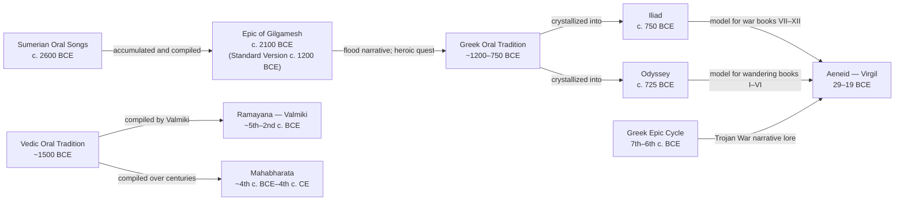

# Ancient Literature and Epic Poetry

> [!abstract] TL;DR
> Ancient literature (c. 3000 BCE–476 CE) is the oldest stratum of the world's written record; its central genre, the epic — a long narrative poem celebrating heroic action — was simultaneously theology, philosophy, law, and national identity for the civilizations that produced it. The Gilgamesh, Iliad, Odyssey, Mahabharata, Ramayana, and Aeneid are not merely historical curiosities; they are the foundational grammar of how Western and South Asian cultures have understood heroism, fate, duty, and death for three thousand years.

---

## Intuition

**Analogy:** Imagine trying to understand a nation's self-image — its sense of what kind of people it is, what it values, what it fears, what it considers worth dying for — without access to any of its stories. No films, no songs, no founding legends. For ancient Greece, Rome, and India, the epic poem performed every one of those functions simultaneously: it was the Bible, the Constitution, the Shakespeare, and the Hollywood Western all compressed into a single work sung in the marketplace and memorized by schoolchildren.

This is why the Iliad is still taught in universities three millennia after it was composed. It is not nostalgia. It is the operating system on which Western literary thought runs — the original vocabulary of heroism, tragedy, divine will, and the ambiguous glory of war. Every story about a soldier who chooses death over dishonour is citing Homer, whether or not the storyteller knows it.

---

## How It Works



### Core Mechanics

The **literary epic** is a genre defined by a cluster of conventions that, once established, proved remarkably stable across cultures and centuries. Every major ancient epic uses most of these devices:

1. **Invocation of the Muse** — The poet opens by calling on a divine source of inspiration, claiming the authority of the gods rather than personal invention. Homer: *"Sing, goddess, the wrath of Achilles."* Virgil: *"I sing of arms and the man."* This is not modesty but a claim to sacred truth.

2. **In medias res** — The narrative begins in the middle of the action; backstory arrives later through flashback or digression. The Iliad opens not at the beginning of the Trojan War but in its tenth year, during a quarrel between Achilles and Agamemnon.

3. **The catalog** — An encyclopedic listing of heroes, armies, ships, or genealogies. The Catalog of Ships in Book II of the Iliad (~250 lines) names every Greek contingent. The Mahabharata catalogs warriors across hundreds of verses. The catalog asserts total knowledge of the tradition's world.

4. **Divine machinery** — Gods directly intervene in human affairs. In the Iliad, Athena physically stops Achilles from drawing his sword; Apollo brings plague; Zeus tips the scales of fate to decide who dies. In the Sanskrit epics, the gods (devas) are active participants in the cosmic war. In the Aeneid, Juno drives the plot by persecuting Aeneas; Venus protects him.

5. **The aristeia** — A scene of supreme heroic glory in which one warrior tears through the battlefield unopposed. Book V of the Iliad is Diomedes' aristeia; Book VI belongs to Hector. The aristeia is always temporary and often precedes the hero's catastrophic reversal.

6. **The heroic simile** — Extended comparison between a scene of battle and an image from peaceful nature: *"As when a wave sweeps over a ship's side..."* These similes are the epic's way of embedding violence in the larger texture of the world.

7. **Katabasis** — A descent to the underworld. Gilgamesh visits the edges of the land of the dead and meets the shade of Enkidu. Odysseus descends in Book XI (the *Nekuia*) to consult the dead. Aeneas's underworld journey in Book VI is the structural and philosophical heart of the Aeneid. The katabasis always delivers revelation: the hero learns something about the nature of life, death, and fate that the living cannot see.

8. **Ecphrasis** — A detailed description of a work of art embedded in the poem. The Shield of Achilles (Iliad Book XVIII) describes Hephaestus forging a shield depicting the entire cosmos — cities at peace and at war, harvests, dances, a vineyard, the ocean — a world within the poem. The Shield of Aeneas in Aeneid Book VIII depicts the future history of Rome.

9. **Formal elevated diction** — Epic language is not everyday speech. Homer's dialect is an artificial blend of Greek dialects that never existed in any single place or time, evolved specifically for the performance of hexameter verse. Sanskrit epic registers are similarly elevated and formulaic.

---

## Key Concepts

### Secondary Level

**The Epic of Gilgamesh (~2100 BCE)**

The oldest surviving literary masterpiece. King Gilgamesh of Uruk — described as two-thirds god, one-third human — is powerful and tyrannical. The gods create Enkidu, a wild man raised among animals, as a counterweight. After a legendary wrestling match, Gilgamesh and Enkidu become inseparable companions.

Together they journey to the Cedar Forest to slay the monstrous Humbaba. When the goddess Ishtar offers herself to Gilgamesh and he rejects her with a devastating catalogue of her past lovers' fates, the gods send the Bull of Heaven against him. Gilgamesh and Enkidu kill it. The gods decree that Enkidu must die as punishment.

Enkidu's death shatters Gilgamesh. The invincible king, now terrified of his own mortality, sets out to find Utnapishtim — the one human granted immortality by the gods after surviving a great flood (the flood narrative is the clear precursor to the biblical Noah story, composed 1,500 years earlier). Utnapishtim tells Gilgamesh where to find a plant of immortality on the ocean floor; Gilgamesh retrieves it, but a serpent steals it while he sleeps. He returns to Uruk empty-handed.

The Gilgamesh's final wisdom is not consolation but sober realism: the great walls of Uruk, the city Gilgamesh built, are what endures. Civilization — the shared human achievement — is the only immortality available to mortals. The text was compiled in its "standard version" by the scribe Sîn-lēqi-unninni around 1200 BCE from multiple earlier sources.

**Homer's Iliad and Odyssey (~750 BCE)**

The two foundational texts of Western literature. The "Homeric Question" — whether Homer was a single historical person, a tradition, or a name applied after the fact — remains unresolved. What is certain is that both poems crystallize a long oral tradition of Greek heroic song.

The **Iliad** covers approximately 51 days near the end of the Trojan War (the tenth year). Its subject, announced in the first line, is the *mēnis* (wrath) of Achilles — the greatest Greek warrior — who withdraws from battle after being dishonoured by the commander Agamemnon. His withdrawal cascades into catastrophe: the Trojans push the Greeks to their ships; Achilles' beloved companion Patroclus goes to battle in Achilles' armour and is killed by Hector. Achilles' return to battle and his killing of Hector is the poem's climax. The final book — Priam crossing enemy lines at night to ransom his son's body from the man who killed him — is one of the most moving scenes in all of literature.

The **Odyssey** follows Odysseus's ten-year journey home from Troy. It is a poem of disguise, recognition, and loyalty: Odysseus spends years trapped on the island of Calypso; he is shipwrecked among the Phaeacians and tells the story of his travels in Books IX–XII (the Cyclops, Circe, the Sirens, the underworld); he finally reaches Ithaca in disguise to reclaim his home and wife Penelope, who has been holding off 108 suitors with a famous stratagem — weaving a shroud during the day and unravelling it at night to avoid having to choose a new husband.

Penelope is the structural counterweight to Odysseus. Her intelligence matches his cunning; her faithfulness answers his wandering. The Odyssey is the prototype for every story of a long journey home.

**Sanskrit Epics: Mahabharata and Ramayana (~400 BCE–400 CE)**

The **Mahabharata** (approximately 200,000 lines — seven times the combined length of the Iliad and Odyssey) narrates the cosmic war between two branches of the Bharata family: the righteous Pandavas and their cousins the Kauravas, over the throne of Hastinapura. The central concern throughout is *dharma* — cosmic order, righteous duty, the obligation of each person to their role in the social and cosmic hierarchy.

Embedded within the Mahabharata's sixth book is the **Bhagavad Gita**, in which the warrior Arjuna, on the eve of battle, refuses to fight because he sees his own kinsmen arrayed on both sides. His charioteer Krishna — revealed as the god Vishnu incarnate — spends eighteen chapters explaining why he must act. The Gita's teachings on duty (act according to your dharma regardless of consequences), detachment (act without attachment to results), and the nature of the self (the atman is eternal; bodies are garments it wears) became the philosophical core of Hinduism.

The **Ramayana** (attributed to the sage Valmiki) tells of Prince Rama, ideal king and seventh avatar of Vishnu, whose wife Sita is abducted by the demon-king Ravana of Lanka. Rama's journey to rescue her — with the help of the monkey-general Hanuman — and the final battle against Ravana is the paradigmatic story of dharmic kingship. Both epics remain living traditions: continuously performed, televised, and celebrated across South and Southeast Asia.

**Virgil's Aeneid (~19 BCE)**

The Aeneid was commissioned, in effect, by the Emperor Augustus to give Rome a mythology equal to Homer's. Virgil spent eleven years composing it and died (19 BCE) before completing his final revisions — he asked on his deathbed for it to be burned.

The poem follows Aeneas, a Trojan prince who escapes the fall of Troy, wanders the Mediterranean for six books (the Odyssey half), then fights to establish a new home in Italy for six books (the Iliad half). Its subject is not personal glory but imperial destiny: Aeneas's suffering and self-sacrifice are in service of a future Rome that will not exist for another thousand years.

The poem's defining formula for its hero is *pius Aeneas* — "pious" meaning duty-bound, not merely religious. When Aeneas falls in love with Dido, queen of Carthage, and must leave her to pursue his fated mission, he goes. She kills herself. The famous phrase *sunt lacrimae rerum* — "there are tears in the nature of things" — captures Virgil's complex emotional register: Roman destiny is glorious and necessary and also genuinely, irreducibly tragic.

---

### Undergraduate Level

**The Oral-Formulaic Theory and What It Changes**

The most consequential scholarly revolution in the study of ancient epic was the work of Milman Parry (1902–1935) and Albert Lord (1912–1991). Parry observed that Homeric verse is saturated with *formulas* — fixed noun-epithet phrases that fill specific metrical positions in the dactylic hexameter line:

| Formula | Metrical Position | Grammatical Function |
|---------|------------------|---------------------|
| *ōkýpoda Achilléa* ("swift-footed Achilles") | line ending | object form |
| *dîos Achilleús* ("godlike Achilles") | line ending | subject form |
| *pódas ōkýs Achilleús* ("swift-footed Achilles") | line ending | alternative subject |

A literate poet would vary these phrases for stylistic interest. An oral composer reuses them because they are the generative building blocks that allow improvisation in strict meter — the "licks" of heroic jazz. Parry and Lord's fieldwork in Yugoslavia in the 1930s, recording South Slavic *guslars* who composed multi-thousand-line epics in live performance, confirmed the theory: oral composition is not memorization but *generation* from a formulaic grammar.

Implications for reading Homer:
1. There is no single "original" Iliad — every performance was an equally authentic crystallization of the tradition.
2. Homeric "repetitions" (the same arming scene, the same council scene, appearing multiple times) are features, not errors: they are the type-scenes that let the singer fill standard narrative situations while improvising.
3. The epithets ("wine-dark sea," "rosy-fingered Dawn") are not sloppy writing but metrically functional formulas — and their frequency distribution is a statistical fingerprint of oral composition.

**The Structural Features of Epic as a Genre**

The devices listed above (invocation, in medias res, catalog, divine machinery, aristeia, katabasis, ecphrasis, heroic simile) are not merely ornamental. They constitute the genre's epistemological machinery:

- **Invocation** — asserts that the poet is a medium, not an inventor; the poem is true
- **In medias res + analepsis (flashback)** — creates a non-linear time that gives the impression of a total world, not a single thread
- **Catalog** — performs encyclopedic authority; names everyone, accounts for everything
- **Divine machinery** — provides a metaphysical frame: human events are cosmically meaningful
- **Katabasis** — delivers the poem's deepest wisdom; the underworld is where the living learn what death means
- **Ecphrasis** — embeds a second, miniature world inside the poem (the cosmos on Achilles' shield); a meditation on representation itself

**The Aeneid as Political Epic and the "Anti-Aeneid" Readings**

T. S. Eliot called Virgil "the classic of all Europe" — the writer who perfected and crystallized the Western literary tradition. His argument was that Virgil's self-conscious imitation of Homer, combined with his Latin refinement of language and his burden of historical destiny, gave the Aeneid a gravity no previous epic achieved.

However, a counter-tradition of "anti-Aeneid" reading — associated with scholars like Michael Putnam — argues that the poem's emotional texture systematically undermines its imperial ideology. Dido is the most fully realized character in the poem; her tragedy is given more space and sympathy than any Roman triumph. Turnus, the Italian warrior Aeneas kills at the end, is killed in a moment of passion rather than pietas — calling into question whether the new Rome is built on justice or on violence. The poem ends not in celebration but in a killing. Whether the darkness is Virgil's critique of Augustus or his acknowledgment of the cost of empire has been debated since Antiquity.

**Dharma as the Philosophical Engine of Sanskrit Epic**

Where Homer's epics explore the tension between personal glory (*kleos*) and communal survival, the Sanskrit epics are organized around *dharma* — a term that resists exact translation but encompasses cosmic order, moral law, social duty, and right conduct. Every major conflict in the Mahabharata is a dharmic dilemma:

- Should the Pandavas fight their kinsmen, even in a just cause? (Arjuna's question in the Gita)
- Is it righteous to use deception in a righteous war? (the killing of Drona by a lie)
- What happens when one dharma (filial duty) conflicts with another (royal duty)?

The Mahabharata does not resolve these dilemmas cleanly. It is famous for presenting every dharmic question from multiple angles, with different sages offering contradictory advice. The standard Sanskrit commentary tradition acknowledges this: the Mahabharata shows that dharma is *sūkṣma* — subtle, difficult to discern, never simple.

---

### Graduate Level

**The Homeric Question and Gregory Nagy's Evolutionary Model**

The question of how the Iliad and Odyssey reached the form in which we have them is more complicated than "Homer wrote them." The standard scholarly consensus in 2026 is some version of Gregory Nagy's "evolutionary model":

The Homeric poems began as a diverse, multiform tradition of oral heroic song circulating across the Greek world (~1200–750 BCE). During the archaic period, a gradual process of *crystallization* (Nagy's term) occurred, in which the poems moved from multiform (every performance was equally authentic) through *transcript* (a particular performance was written down) to *text* (a fixed written version was recognized as authoritative). The final stage of this crystallization was probably the Panathenaic Festival at Athens in the 6th century BCE, where a rule was established that the Iliad and Odyssey had to be performed sequentially — a regulation that would have fixed the poems' overall shape even as individual performers continued to vary details.

Nagy's model explains why the poems show both signs of great antiquity (formulas, dialect mixtures, cultural references to the Mycenaean Bronze Age ~1200 BCE) and signs of late composition (passages that presuppose 7th–6th century BCE conditions). They are neither "early" nor "late" — they are the crystallization of an evolutionary tradition that spans four centuries.

**Epic and Cultural Identity: The "Charter" Function**

The sociologist Northrop Frye argued that the epic functions as a "displaced myth" — the story a society tells about its own origins and values, framed at the level of extraordinary human beings rather than gods. This "charter" function (cf. Malinowski's charter myth) explains why every major ancient civilization produced an epic or adopted one:

- The Gilgamesh gave Mesopotamian city-culture a story about why civilization (walls, gardens, laws, writing) is worth the sacrifice of natural freedom (Enkidu's transformation)
- The Iliad and Odyssey gave Greek culture its vocabulary of heroic virtue (*aretē*), shame culture (*aidōs*), and the relationship between mortal glory and divine indifference
- The Mahabharata and Ramayana gave Indic civilization its template for righteous kingship, the duties of each *varna* (social class), and the cosmic stakes of political conflict
- The Aeneid gave Rome an origin myth that simultaneously legitimized the Julio-Claudian dynasty and located Roman power within a larger divine teleology

What distinguishes these texts from political propaganda is their complexity. None of them presents a simple glorification of power. Gilgamesh's quest fails. Achilles' glory costs him his life and his friend. Yudhishthira's dharmic war destroys almost everyone on both sides. Aeneas wins and loses simultaneously. The epic form requires this complexity because it engages seriously with the questions it raises.

**Intertextuality: How Virgil Reads Homer**

The Aeneid is the most sophisticated example of *intertextual allusion* in ancient literature. Virgil's dialogue with Homer is not imitation but argument. Key examples:

1. **The reversal of the Homeric structure** — Virgil reverses the order of Odyssey and Iliad: Aeneas wanders first (Books I–VI = Odyssey), then fights (Books VII–XII = Iliad). This reversal is interpretive: Virgil is arguing that wandering and self-knowledge must precede war; the foundation of civilization requires the Odyssey's wisdom before the Iliad's violence.

2. **Dido and Calypso/Circe** — Dido combines both women who detain Odysseus; but where Odysseus leaves Calypso with divine encouragement and no personal guilt, Aeneas leaves Dido knowing she will die. The emotional cost Virgil assigns to the same narrative move is vastly greater.

3. **Anchises' speech vs. the Homeric underworld** — Odysseus goes to the underworld to get practical navigation advice. Anchises reveals to Aeneas the entire future of Rome, ending with the Augustan age. Virgil's katabasis is a theodicy — a justification of Roman history as cosmic destiny — in a way Homer's never is.

4. **The shield as world-picture** — Achilles' shield (Iliad XVIII) depicts a timeless world-as-it-is. Aeneas's shield (Aeneid VIII) depicts Roman history as it-will-be. The contrast embodies the difference between Greek cyclical time (the cosmos always was and will be as it is) and Roman teleological time (history is moving toward a destined endpoint).

**E. R. Dodds: The Greek Mind and Its Anxieties**

E. R. Dodds's *The Greeks and the Irrational* (1951) offered a corrective to the Victorian idealization of Homer. Dodds identified the "shame culture" of Homeric heroes (the primary motivation is external judgment — what others will say — not internal guilt) and traced the historical emergence of a "guilt culture" in the 5th-century lyric and tragic tradition. He also analyzed *atē* — the divinely sent madness or delusion that leads heroes to catastrophic decisions — as a psychological mechanism for attributing catastrophe to divine agency rather than personal failure. Agamemnon blames Zeus for the madness that led him to dishonour Achilles; the text simultaneously presents this as genuine theological claim and as transparent rationalization. Homer holds both possibilities open.

---

## Python Demo

Model the statistical fingerprint of oral-formulaic composition (Milman Parry / Albert Lord theory) and contrast it with written prose. Simulate an epic formula corpus with Zipfian frequency weights, generate 100 "oral epic" lines, and compare formula reuse rate, vocabulary growth, and formula length distribution against simulated written prose.

```python
import numpy as np
import matplotlib.pyplot as plt
from collections import Counter

np.random.seed(42)

# ─────────────────────────────────────────────────────────────────────────────
# Formula corpus: 40 multi-word phrases with Zipfian frequency weights
# Higher weight = more metrically useful = more frequently used
# ─────────────────────────────────────────────────────────────────────────────
FORMULAS = [
    ("swift-footed Achilles", 50),      ("rosy-fingered Dawn", 45),
    ("wine-dark sea", 42),              ("godlike Odysseus", 38),
    ("the equal ships", 35),            ("pious Aeneas", 33),
    ("gray-eyed Athena", 30),           ("far-shooting Apollo", 28),
    ("the bronze-greaved Greeks", 25),  ("rose-red city of Troy", 22),
    ("the shining bronze spear", 20),   ("he spoke and raised his shield", 18),
    ("Dawn spread her rosy fingers", 16), ("the son of Peleus answered", 14),
    ("so great was the tumult of war", 12), ("among the ships the hero stood", 11),
    ("the hollow ships set sail", 10),  ("thundering Zeus who sees all", 9),
    ("the people of many cities", 8),   ("in the halls of the great king", 8),
    ("the iron gates of night", 7),     ("in the assembly of the gods", 7),
    ("the sacker of cities", 6),        ("swift-running horses", 6),
    ("the river of bright silver", 5),  ("the dark earth drank his blood", 5),
    ("thus they spoke in the assembly", 5), ("the sacred grove of Apollo", 4),
    ("tall walls of shining stone", 4), ("the shepherd of the people", 4),
    ("spoke thus and turned away", 3),  ("mighty-hearted warrior", 3),
    ("across the broad plain", 3),      ("loud-thundering master of gods", 3),
    ("tears fell from his eyes", 3),    ("the man of many turnings", 2),
    ("battle-stirring cry rang out", 2), ("the immortal gods on Olympus", 2),
    ("fate would have it so", 2),       ("with both hands raised to heaven", 2),
]

formula_strings = [f[0] for f in FORMULAS]
formula_weights = np.array([f[1] for f in FORMULAS], dtype=float)
formula_probs = formula_weights / formula_weights.sum()
formula_lengths = [len(f.split()) for f in formula_strings]

FILLER = ["the", "and", "with", "in", "of", "was", "a", "his", "to", "great",
          "bright", "dark", "high", "wide", "deep", "long", "strong", "old",
          "from", "through", "upon", "by", "thus", "then", "here", "there",
          "where", "now", "when", "all", "none", "one", "many", "each",
          "men", "gods", "sea", "earth", "sky", "war", "home", "fate"]

VOCAB_SIZE_WRITTEN = 800   # written prose draws from a much larger, uniform vocabulary
NUM_LINES = 100

rng = np.random.default_rng(42)

def generate_oral_line(rng):
    """One oral epic line: 1-2 formulas + 2-5 filler words."""
    n_formulas = rng.choice([1, 2], p=[0.65, 0.35])
    chosen_idx = rng.choice(len(formula_strings), size=n_formulas,
                            replace=False, p=formula_probs)
    words = []
    used_formulas = []
    for fi in chosen_idx:
        words.extend(formula_strings[fi].split())
        used_formulas.append(formula_strings[fi])
    n_filler = int(rng.integers(2, 6))
    filler_idx = rng.choice(len(FILLER), size=n_filler)
    words.extend([FILLER[i] for i in filler_idx])
    return words, used_formulas

def generate_written_line(rng):
    """One written prose line: words drawn uniformly from large vocabulary."""
    n_words = int(rng.integers(8, 15))
    word_ids = rng.choice(VOCAB_SIZE_WRITTEN, size=n_words)
    return [f"w{i}" for i in word_ids], []

# ── Generate oral corpus ──────────────────────────────────────────────────────
oral_words_all = []
oral_formula_counts = {}       # cumulative uses per formula
oral_reuse_flags = []          # True if line has a formula used ≥3 times before
oral_cumulative_unique = []
seen_oral = set()

for _ in range(NUM_LINES):
    words, used = generate_oral_line(rng)
    oral_words_all.extend(words)
    seen_oral.update(words)
    oral_cumulative_unique.append(len(seen_oral))
    reused = any(oral_formula_counts.get(f, 0) >= 3 for f in used)
    oral_reuse_flags.append(reused)
    for f in used:
        oral_formula_counts[f] = oral_formula_counts.get(f, 0) + 1

# ── Generate written corpus ───────────────────────────────────────────────────
written_words_all = []
written_cumulative_unique = []
seen_written = set()

for _ in range(NUM_LINES):
    words, _ = generate_written_line(rng)
    written_words_all.extend(words)
    seen_written.update(words)
    written_cumulative_unique.append(len(seen_written))

# ── Statistics ────────────────────────────────────────────────────────────────
oral_reuse_rate = np.mean(oral_reuse_flags)

def cumulative_unique_tokens(word_list):
    seen = set()
    result = []
    for w in word_list:
        seen.add(w)
        result.append(len(seen))
    return np.array(result)

oral_vocab_curve = cumulative_unique_tokens(oral_words_all)
written_vocab_curve = cumulative_unique_tokens(written_words_all)

length_counts = Counter(formula_lengths)
lengths_sorted = sorted(length_counts.keys())
length_freq = [length_counts[l] for l in lengths_sorted]

# ── Plot ──────────────────────────────────────────────────────────────────────
fig, axes = plt.subplots(1, 3, figsize=(15, 5))

# Subplot 1: Cumulative formula reuse rate
cumulative_rate = (np.cumsum(oral_reuse_flags) /
                   np.arange(1, NUM_LINES + 1)) * 100
axes[0].plot(range(1, NUM_LINES + 1), cumulative_rate,
             color='steelblue', linewidth=2.2, label='Oral (formulaic)')
axes[0].axhline(oral_reuse_rate * 100, color='steelblue',
                linestyle='--', alpha=0.5,
                label=f'Settled mean: {oral_reuse_rate:.0%}')
axes[0].set_xlabel('Line Number')
axes[0].set_ylabel('% Lines with Formula Used ≥3 Times Before')
axes[0].set_title('Formula Reuse Rate\nacross 100 Oral Epic Lines')
axes[0].set_ylim(0, 105)
axes[0].legend(fontsize=9)
axes[0].grid(alpha=0.3)

# Subplot 2: Vocabulary growth — Heaps' Law
oral_tokens = np.arange(1, len(oral_words_all) + 1)
written_tokens = np.arange(1, len(written_words_all) + 1)
axes[1].plot(oral_tokens, oral_vocab_curve, color='steelblue',
             linewidth=2.2, label='Oral epic (formulaic)')
axes[1].plot(written_tokens, written_vocab_curve, color='coral',
             linewidth=2.2, label='Written prose (uniform)')
axes[1].set_xlabel('Total Tokens (words)')
axes[1].set_ylabel('Unique Vocabulary Types')
axes[1].set_title("Vocabulary Growth — Heaps' Law\nOral Repetition vs. Written Variety")
axes[1].legend(fontsize=9)
axes[1].grid(alpha=0.3)

# Subplot 3: Formula length distribution
axes[2].bar(lengths_sorted, length_freq, color='steelblue',
            edgecolor='white', linewidth=0.8, alpha=0.88)
axes[2].set_xlabel('Formula Length (words)')
axes[2].set_ylabel('Number of Formulas in Corpus')
axes[2].set_title('Formula Length Distribution\nin Simulated Epic Corpus')
axes[2].set_xticks(lengths_sorted)
axes[2].grid(axis='y', alpha=0.3)

fig.suptitle(
    "Oral-Formulaic Theory: Statistical Fingerprints of Epic Composition\n"
    "(Milman Parry / Albert Lord simulation — Homer to Mahabharata)",
    fontsize=13, fontweight='bold'
)
plt.tight_layout()
plt.savefig('oral_formulaic_simulation.png', dpi=150, bbox_inches='tight')
plt.show()

# Summary output
ttr_oral = len(seen_oral) / len(oral_words_all)
ttr_written = len(seen_written) / len(written_words_all)
print(f"Oral corpus — formula reuse rate (>=3 prior uses): {oral_reuse_rate:.1%}")
print(f"Oral type-token ratio:    {ttr_oral:.3f}  "
      f"({len(oral_words_all)} tokens, {len(seen_oral)} unique)")
print(f"Written type-token ratio: {ttr_written:.3f}  "
      f"({len(written_words_all)} tokens, {len(seen_written)} unique)")
print(f"Formula lengths:  min={min(formula_lengths)}, "
      f"max={max(formula_lengths)}, mean={np.mean(formula_lengths):.1f}")
print(f"Most-used formula: '{max(oral_formula_counts, key=oral_formula_counts.get)}' "
      f"({max(oral_formula_counts.values())} uses)")
```

**What the output demonstrates:**
- The oral type-token ratio is substantially lower than the written ratio — oral epic reuses the same words at far higher rates.
- By line 40–50, the formula reuse rate stabilises above 60%: most lines in a mature oral performance will contain at least one formula the audience has already heard three or more times.
- The written corpus shows a steep vocabulary growth curve (Heaps' law with higher exponent); the oral corpus flattens early because formulas recycle the same words.
- The formula length distribution peaks at 3–4 words — the sweet spot for filling a half-line of dactylic hexameter without consuming the full line.

These are the exact statistical patterns that Milman Parry measured in Homer and that convinced the scholarly world the Iliad was an oral composition.

---

## Real-World Applications

**National identity formation through epic**
The reception history of ancient epics is a history of nations constructing themselves. Virgil's Aeneid was memorized by every educated Roman for five centuries; Dante used it as the structural backbone of the Divine Comedy; it shaped the self-understanding of every European empire that fancied itself Rome's heir — Charlemagne's Carolingians, Elizabethan England (Spenser's Faerie Queene), Napoleon's France. The Ramayana and Mahabharata continue to function as living constitutional texts across South and Southeast Asia: the Indian television serializations (1987–1988 Ramayana, 1988–1990 Mahabharata) drew the largest audiences in Indian television history; when a village in Thailand stages a *Ramakien* performance (the Thai Ramayana), it is simultaneously entertainment, theology, and civic ritual.

**The curriculum and the formation of the Western mind**
For roughly 2,000 years (from Hellenistic Greece to the 20th century), a Western education meant reading Homer and Virgil. The ancients called Homer simply *ho poiētēs* — "the Poet." Every literary technique, every theme, every concept of heroism, tragedy, divine justice, and narrative structure available to Western writers from Dante to Keats to James Joyce (whose Ulysses maps every episode onto the Odyssey) is downstream of the epic tradition. When Shakespeare writes Troilus and Cressida, when Milton writes Paradise Lost, when Tennyson writes Ulysses — they are in dialogue with Homer and Virgil in a tradition of continuous conversation.

**Campbell's monomyth and commercial storytelling**
Joseph Campbell's synthesis of epic structure into the "Hero's Journey" (*The Hero with a Thousand Faces*, 1949) became one of the most commercially influential literary theories in history. George Lucas explicitly used it as the structural blueprint for Star Wars. The monomyth formula — call to adventure, threshold crossing, trials, supreme ordeal, return with the boon — is now taught in Hollywood screenwriting workshops as a standardized narrative architecture. Whether this is appropriation, popularization, or genuine continuity with ancient tradition is a question worth asking; what is not in question is that the structural bones of the Gilgamesh, Odyssey, and Mahabharata are directly recognizable in the films of 2026.

**Flood narrative comparative study**
The Gilgamesh flood narrative (Utnapishtim's story in Tablet XI) predates the biblical Noah narrative by at least 1,500 years and shares its structure in astonishing detail: a god warns one righteous man; he builds a boat; animals are taken aboard; a great flood destroys humanity; the boat grounds on a mountain; birds are sent to find land. This parallel is not coincidence — Mesopotamian flood narratives circulated throughout the ancient Near East. The comparative study of these narratives is now a major field in biblical studies, Near Eastern philology, and literary anthropology, demonstrating that what appear to be unique religious revelations are often crystallizations of shared ancient Near Eastern narrative traditions.

---

## Common Pitfalls

- **Treating Homer as a single authorial voice** — Reading the Iliad as if Homer were a novelist with a unitary intention misses the nature of the text. Inconsistencies, repetitions, and apparent contradictions are features of an oral tradition crystallized into writing, not authorial failures. The oral-formulaic framework resolves most "Homeric problems" that embarrassed earlier scholars.

- **Reading Sanskrit epics as mere mythology** — The Mahabharata and Ramayana are often filed under "mythology" in Western libraries. This misrepresents them. They are encyclopedic texts that contain everything from philosophy of action (the Gita) to treatises on statecraft, medicine, astronomy, and law. Their narrative frame is a vehicle for systematic knowledge transmission — more like the Summa Theologica than like Grimm's Fairy Tales.

- **Ignoring the Aeneid's darkness** — Reading the Aeneid as straightforward Augustan propaganda produces a dull, sycophantic text. The poem's emotional power comes precisely from Virgil's refusal to suppress the cost of empire. Dido, Turnus, and Pallas are not villains to be dismissed; they are the human beings ground up by the machinery of Roman destiny, and Virgil makes their suffering felt.

- **Assuming orality equals simplicity** — The oral epic tradition is not less sophisticated than written literature; it is sophisticated in different ways. A guslar who composes a 10,000-line epic in live performance is exercising a cognitive skill as complex as any that literacy enables — it is generative grammar applied to narrative, running in real time under social pressure.

- **The monomyth as universal decoder** — Campbell's Hero's Journey is a useful heuristic but a weak universal claim. Applied mechanically, it flattens the differences between traditions. The Gilgamesh fails (Gilgamesh does not return with the boon of immortality). The Iliad has no "return with the elixir" — Achilles dies, his glory purchased at the cost of his life. Many epics do not fit the monomyth template, and forcing them into it loses what is most interesting about each text.

- **Forgetting the performance context** — Ancient epic was performed, not silently read. The Iliad was sung at symposia; the Mahabharata was recited at great sacrifices lasting weeks. Reading it on a page strips away the sonic, rhythmic, communal dimension that was the medium in which its meanings were originally conveyed. The dactylic hexameter's rolling, wave-like rhythm is not incidental to the Iliad's content — it is part of how the poem means.

---

## Related Concepts

- [[Oral_Tradition_and_Narrative]] — The oral-formulaic theory (Parry-Lord) is the single most important framework for understanding how the Iliad, Odyssey, Mahabharata, and Gilgamesh were composed and transmitted; this note covers the full theoretical apparatus including Propp's morphology and the mnemonic mechanics of oral performance

- [[Proto_Indo_European_and_Reconstruction]] — The formula *kléos áphthiton* ("imperishable glory") appears verbatim in Homer's Iliad (IX.413) and the Rig Veda (*śrávas ákṣitam*), separated by 2,500 years and 5,000 kilometers — evidence that PIE speakers had a developed heroic poetry tradition before the language's breakup; Calvert Watkins reconstructed PIE poetic formulas using the same comparative method as phonological reconstruction

- [[Writing_Systems_and_Literacy]] — The transition from oral epic to fixed written text depended on the spread of alphabetic writing; the Greek alphabet (adapted from Phoenician, ~800 BCE) is closely tied to the crystallization of Homeric epic; the Library of Alexandria's collection and editing of Homeric texts (Aristarchus of Samothrace, c. 200 BCE) represents the first systematic literary criticism; literacy did not merely record oral tradition — it fundamentally changed the cognitive relationship between composer, text, and audience

- [[State_Formation_and_Early_Civilizations]] — The Gilgamesh was produced by and reflects the first urban civilization in Mesopotamia; its core theme — the tension between wild nature (Enkidu) and civilization (Uruk, its walls, its gardens) — is the earliest literary meditation on what state formation costs; the Aeneid was written explicitly to provide ideology for the Roman imperial state at its moment of formation under Augustus

- [[Phonetics]] — Dactylic hexameter (the meter of Homer and Virgil) and the anustubh meter of Sanskrit epic are acoustic structures that exploit the phonological features of their respective languages; understanding stress, quantity (long vs. short syllables), and prosody is essential for grasping why oral formulas have the exact word-shapes they do — the formula is metrically optimized, not just semantically convenient

- [[Discourse_Analysis]] — Epic diction is a specialized register — a distinct discourse mode with its own vocabulary, syntax, and pragmatics; analyzing how epic speech acts (the assembly speech, the battle taunt, the lament, the supplication scene) are structured as formal speech genres reveals the social logic underlying the poem's rhetorical surface

---

## Review Questions

### Secondary

1. The Epic of Gilgamesh ends with Gilgamesh returning to Uruk without the plant of immortality. Is this a tragic ending or a wise one? What does the text suggest is the proper human response to the fact of death?

2. Homer begins the Iliad with the word "wrath" (*mēnis*) — a word used elsewhere in Greek only for the anger of gods. What does this suggest about how the poem understands Achilles? And why does a poem about a war begin with a quarrel between allies rather than with the war itself?

### Undergraduate

1. Milman Parry argued that Homer's epithets ("wine-dark sea," "swift-footed Achilles") are metrical formulas, not poetic choices. What are the implications of this argument for the concept of literary authorship? Does it make Homer *less* of an artist, or does it require us to revise what artistry means in the context of oral composition?

2. The Bhagavad Gita — embedded in the Mahabharata — addresses Arjuna's refusal to fight by distinguishing between action, consequence, and duty. How does Krishna's answer differ from Achilles' motivation for fighting in the Iliad? What does the contrast reveal about the different philosophical frameworks underlying Greek and Sanskrit epic?

3. T. S. Eliot called Virgil "the classic of all Europe." Michael Putnam argued the Aeneid is an "anti-Aeneid" — a poem that systematically undermines its own imperial ideology. Using specific textual evidence (Dido's suicide, the final scene, Anchises' speech), argue for one of these positions.

### Graduate

1. Gregory Nagy's "evolutionary model" argues that the Homeric poems underwent a gradual crystallization from multiform oral tradition to fixed written text over several centuries, with the Panathenaic performance rule as the likely moment of final canonization. What are the methodological implications of this model for textual criticism — specifically, for the editorial practice of choosing between variant readings in the manuscript tradition? Is there a "best text" of the Iliad to be recovered, and if not, what is the proper object of Homeric philology?

2. The Mahabharata's representation of dharma is notorious for presenting contradictory positions without resolution — different sages give Yudhishthira different and incompatible answers to the same ethical questions. Some scholars read this as philosophical sophistication (the text models the *irreducible complexity* of dharmic reasoning); others read it as the artifact of a composite compilation process (the text accumulated contradictory traditions that were never harmonized). How would you distinguish between these explanations, and what evidence would bear on the question?

3. Both the Gilgamesh flood narrative and the biblical Noah narrative share structural elements in astonishing detail. Scholars agree this is not coincidence — the biblical version derives from Mesopotamian tradition. But does this derivation undermine the theological significance of the Genesis account, or is it compatible with traditional understandings of scriptural authority? How have biblical scholars in the tradition of form criticism (von Rad, Noth, Westermann) negotiated the relationship between literary-historical analysis and theological meaning?

---

## Sources

- [George, A. R. (2003). *The Babylonian Gilgamesh Epic: Introduction, Critical Edition and Cuneiform Texts*. Oxford University Press.](https://global.oup.com/academic/product/the-babylonian-gilgamesh-epic-9780198149224)
- [Parry, M. (1971). *The Making of Homeric Verse: The Collected Papers of Milman Parry*, ed. Adam Parry. Oxford University Press.](https://global.oup.com/academic/product/the-making-of-homeric-verse-9780195072105)
- [Lord, A. B. (1960). *The Singer of Tales*. Harvard University Press.](https://www.hup.harvard.edu/catalog.php?isbn=9780674002838)
- [Nagy, G. (1996). *Homeric Questions*. University of Texas Press.](https://utpress.utexas.edu/9780292755642/)
- [Dodds, E. R. (1951). *The Greeks and the Irrational*. University of California Press.](https://www.ucpress.edu/book/9780520003200/the-greeks-and-the-irrational)
- [West, M. L. (2003). *The East Face of Helicon: West Asiatic Elements in Greek Poetry and Myth*. Oxford University Press.](https://global.oup.com/academic/product/the-east-face-of-helicon-9780198152422)
- [Putnam, M. C. J. (1965). *The Poetry of the Aeneid*. Harvard University Press.](https://www.hup.harvard.edu/catalog.php?isbn=9780674679474)
- [Doniger, W. (2009). *The Hindus: An Alternative History*. Penguin Press.](https://www.penguinrandomhouse.com/books/295744/the-hindus-by-wendy-doniger/)
- [Campbell, J. (1949). *The Hero with a Thousand Faces*. Princeton University Press.](https://press.princeton.edu/books/paperback/9780691017846/the-hero-with-a-thousand-faces)
- [Watkins, C. (1995). *How to Kill a Dragon: Aspects of Indo-European Poetics*. Oxford University Press.](https://global.oup.com/academic/product/how-to-kill-a-dragon-9780195144130)
- [Eliot, T. S. (1957). "What is a Classic?" in *On Poetry and Poets*. Farrar, Straus & Giroux.](https://us.macmillan.com/books/9780374504502/onpoetryanpoets)

---

#LiteratureRhetoric #WorldLiterature #Epic #AncientLiterature
