# Classical Literature: Greece and Rome

> [!abstract] TL;DR
> Classical Greek and Latin literature (~800 BCE–500 CE) is not merely the origin point of Western literary tradition — it is the reservoir that Western literature has continuously returned to for genres, forms, characters, and arguments; Greek poets invented lyric subjectivity, tragedy, comedy, and the philosophical dialogue; Roman writers performed a systematic act of creative emulation (*aemulatio*) that transmitted, transformed, and extended the Greek corpus to Europe's vernacular traditions; and the approximately 3% of ancient texts that survived — through Alexandrian scholarship, Byzantine monasteries, and Arabic translation — became the curriculum through which elite Western culture defined itself for two millennia, and which remains the most studied body of imaginative writing in human history.

---

## Intuition

**Analogy:** Imagine a master composer who discovers that the human voice can do things in music that no one has formalized before — that it can enact the body's response to desire in a single stanza, that it can arrest time in a moment of perception, that a twelve-line lyric can make a reader feel exactly what the speaker feels across twenty-six centuries. She writes these discoveries down on wax tablets. Three centuries later, an ambitious Roman poet named Catullus hears the echo and translates her most famous poem — not to replace it but to learn from it, to take possession of her technique through an act of creative theft. Two centuries after that, her poem survives only in a fragment, partially quoted in a Greek treatise on the sublime. Nine-tenths of what both poets wrote is gone. What remains has shaped everything that followed: Ovid, Petrarch, Shakespeare, Keats, Seamus Heaney.

This is how classical literature works — not as a stable archive but as an influence machine whose power grows in inverse proportion to its completeness. Greek literature gave Western writing its genres (epic, lyric, tragedy, comedy, history, philosophical dialogue, satire), its formal vocabulary (meter, dramatic structure, the three unities, the dialectical argument), and its foundational myths and characters. Roman literature transmitted and transformed all of this, adding its own registers of irony, legal precision, and political anxiety. The whole edifice then passed through a narrow transmission bottleneck — a few monastic scriptoria, the Library of Alexandria's partial survival, the Arabic commentators on Aristotle — and emerged into the Renaissance as "antiquity": a constructed ideal that was simultaneously real achievement and retrospective projection.

---

## How It Works

```mermaid
graph TD
    subgraph ARCHAIC["ARCHAIC PERIOD  ~800–480 BCE"]
        HOM["EPIC POETRY\nHomer · Hesiod\nDactylic hexameter\nOral tradition → writing"]
        LYR["LYRIC POETRY\nSappho · Alcaeus · Pindar\nAnacreon · Theognis\nMonody vs choral ode"]
    end

    subgraph CLASSICAL["CLASSICAL PERIOD  ~480–323 BCE"]
        DRA["ATTIC DRAMA\nAeschylus · Sophocles · Euripides\nAristophanes · Menander\nCity Dionysia festival"]
        HIS["HISTORIOGRAPHY\nHerodotus · Thucydides\nXenophon\nFirst Greek prose narrative"]
        PHI["PHILOSOPHICAL PROSE\nPlato · Aristotle\nSocratic dialogue · Treatise\npoetry vs philosophy"]
    end

    subgraph HELLEN["HELLENISTIC PERIOD  ~323–31 BCE"]
        ALX["ALEXANDRIAN SCHOLARSHIP\nLibrary of Alexandria\nCanon formation · Commentary\nCallimachus · Theocritus"]
    end

    subgraph LATIN["LATIN LITERATURE  ~240 BCE–500 CE"]
        ERL["EARLY REPUBLIC\nPlautus · Terence\nGreek comedy adapted\naemulatio begins"]
        REP["LATE REPUBLIC\nCicero · Caesar · Catullus\nLucretius · Sallust"]
        AUG["AUGUSTAN GOLDEN AGE\nVirgil · Horace · Ovid\nLivy · Propertius · Tibullus"]
        SIL["SILVER AGE\nSeneca · Petronius · Martial\nJuvenal · Tacitus · Quintilian"]
    end

    subgraph TRANS["TRANSMISSION  ~500–1500 CE"]
        BYZ["BYZANTINE PRESERVATION\nGreek MSS copied\nConstantinople scriptoria"]
        ARA["ARABIC TRANSLATION\nAristotle · Poetics recovered\nBaghdad 830 CE · Toledo"]
        REN["RENAISSANCE RECOVERY\nPetrarch · Erasmus\nAldo Manuzio · Printing press\n1498: Poetics in Latin"]
    end

    HOM --> LYR
    LYR --> DRA
    DRA --> HIS
    HIS --> PHI
    PHI --> ALX
    HOM --> ALX
    ALX --> ERL
    ERL --> REP
    REP --> AUG
    AUG --> SIL
    SIL --> BYZ
    PHI --> BYZ
    ALX --> BYZ
    BYZ --> ARA
    ARA --> REN
    BYZ --> REN

    style HOM fill:#7c3aed,color:#fff
    style LYR fill:#7c3aed,color:#fff
    style DRA fill:#1e40af,color:#fff
    style HIS fill:#1e40af,color:#fff
    style PHI fill:#1e40af,color:#fff
    style ALX fill:#0f766e,color:#fff
    style ERL fill:#b45309,color:#fff
    style REP fill:#b45309,color:#fff
    style AUG fill:#b45309,color:#fff
    style SIL fill:#b45309,color:#fff
    style BYZ fill:#6b7280,color:#fff
    style ARA fill:#6b7280,color:#fff
    style REN fill:#059669,color:#fff
```



The diagram traces a two-thousand-year chain of literary transmission. Greek literature moves from the oral-derived epic of the archaic period through the performance culture of classical Athens — where tragedy, comedy, history, and philosophy were produced within a single generation — to the Alexandrian scholars who collected, edited, and canonized the texts. Latin literature begins by explicitly imitating Greek models (*aemulatio*) and develops its own register of ironic self-consciousness about the imitation. The transmission bottleneck — Byzantine monasteries, Arabic translation, Renaissance recovery — explains why we have seven plays of Aeschylus but perhaps thirty or forty tragedies by other playwrights are cited in ancient sources and lost entirely.

---

## Key Concepts

### Secondary Level

#### What Is "Classical Literature" and Why Does It Matter?

The word "classical" in this context derives from the Latin *classicus* — relating to the highest census class of Roman citizens. When Roman writers used it of literature, they meant texts deserving the highest rank. The modern academic sense — the literature of ancient Greece and Rome — crystallized in the Renaissance, when humanists seeking alternatives to medieval Christian culture elevated Greek and Roman writing into a universal standard of excellence.

Three features define the corpus as "classical" in the technical sense:

1. **Temporal boundary**: Greek literature from Homer (~800 BCE) through the late Hellenistic period (~31 BCE); Latin literature from the first plays of Livius Andronicus (~240 BCE) through the early medieval period (~500 CE). The canonical core is tighter: Athens in the fifth century BCE, Rome in the first century BCE to first century CE.

2. **Canon formation**: the specific texts that survive are not a random sample but the result of deliberate selection by Alexandrian scholars (~300–150 BCE), who compiled authoritative editions of Homer, the lyric poets, the tragedians, the historians, and the philosophers. They wrote *pinakes* (lists), commentaries, and critical introductions that established which authors were worth reading and how to read them. Later Byzantine copyists worked from this Alexandrian selection. The "classics" are, in effect, the Alexandrian curriculum.

3. **Social occasion and genre**: classical literary forms were not produced in isolation but embedded in specific social contexts — the Panhellenic festival (Pindar's victory odes), the religious festival of Dionysus (tragedy and comedy), the aristocratic drinking party (*symposium*: lyric and elegy), the democratic law court and assembly (rhetoric and history), the philosophical school (Platonic dialogue). Genre in the ancient world is inseparable from occasion; the form of a poem announces the social setting it inhabits.

**Why this matters for later literature**: every major European genre traces its theoretical ancestry to classical precedents. The Renaissance neo-Aristotelian critics derived their rules for epic, tragedy, and comedy directly from Aristotle's *Poetics* and Horace's *Ars Poetica*. The Romantic lyric is a renegotiation with the Greek lyric. The modern novel's inheritance of the episodic adventure plot descends from Homer's *Odyssey* via Virgil's *Aeneid* via Renaissance romance. To read classical literature is not antiquarianism; it is an encounter with the forms that still structure how stories are told.

#### The Alexandrian Canon and the Problem of Loss

The standard critical claim — that only about 3% of ancient Greek literature survives — requires unpacking, because the 3% is not random. The Alexandrian Library, founded by Ptolemy I around 295 BCE under the directorship of the poet Callimachus, gathered copies of all available Greek texts, estimated at half a million scrolls. Callimachus compiled the *Pinakes* — a 120-volume catalogue of all Greek literature organized by genre and author — which functioned as both bibliography and critical assessment. Authors included in the *Pinakes* with extended commentary were more likely to be copied; those mentioned briefly or omitted were more likely to be lost.

What survived the Library's partial destruction (Julius Caesar's fire, 48 BCE; Muslim conquest, 642 CE — both of which are historically overstated as total destructions) and the general attrition of manuscript transmission has a clear profile: it is the texts that were used in education. The seven tragedies of Sophocles that survive are those selected for the Byzantine school curriculum around 200 CE; we know Sophocles wrote 123 plays because Hellenistic sources say so. The texts of Aristotle we have are the *esoteric* works — lecture notes — not the polished *exoteric* dialogues that ancient readers called his best writing; those are lost entirely.

This matters for how we read the classics: we are reading the curriculum of ancient education, not the full range of ancient production. The lost Euripidean satyr plays, the lost Menandrian comedies, the lost poetry of Sappho (we have fragments of her nine books), the lost philosophical dialogues of Aristotle — these absences shape the picture we have of antiquity as definitively as the texts that survived.

#### Greek Lyric Poetry: The Invention of the Lyric Self

Greek lyric poetry (~650–450 BCE) is the first sustained exploration in Western literature of the *first person* as a literary subject — not the heroic "I" of epic (Achilles asserting his honor) but the *experiencing* "I": the self in the moment of desire, of grief, of religious awe, of political anger. The word "lyric" itself derives from the *lyre* (Greek: *lyra*), the stringed instrument that accompanied performance; a lyric poem was, originally, a poem to be sung.

**Monody vs choral lyric**: the major organizational distinction within archaic lyric is between *monody* — poetry sung by a single performer, typically for an aristocratic audience at a *symposium* — and *choral lyric* — poetry sung and danced by a chorus on public occasions (festivals, victories, funerals). The monodists include Sappho of Lesbos (~610–570 BCE), Alcaeus of Lesbos (~620–580 BCE), Anacreon of Teos (~570–488 BCE), and Theognis of Megara (~550–490 BCE). The choral lyricists include Simonides of Ceos (~556–468 BCE), Bacchylides (~518–451 BCE), and above all Pindar of Thebes (~518–438 BCE).

**Sappho**: the most celebrated lyric poet of antiquity. Longinus, in *On the Sublime* (~1st century CE), quotes her Fragment 31 as the supreme example of the literary sublime — a poem that enacts the physical symptoms of desire by listing them as they overwhelm the speaker ("my tongue breaks and thin / fire is racing under skin / and in eyes no sight and drumming / fills ears"). The poem is structured as a *priamel* (a list building toward a central claim): the man who sits with Sappho's beloved seems godlike — because only a god could endure the sensory onslaught that the speaker cannot. What Sappho invented is the technique of using the body's failure as evidence of the intensity of feeling: the lyric "I" breaks down at the moment of greatest emotion, and the poem captures the breakdown.

Only about 650 lines of Sappho's nine books survive, mostly in fragments. The longest complete poem, the Hymn to Aphrodite, was preserved in Dionysius of Halicarnassus's *On Literary Composition* as an example of smooth style. Fragment 31 was preserved by Longinus. Catullus translated it as his own poem (Poem 51), and Longinus's text was the source for that translation; we know Catullus read Sappho through the Greek critical tradition that valued her. This transmission chain is typical: the lyric poets survive filtered through the educational and critical uses to which they were put.

**Pindar**: at the opposite extreme from Sappho's intimate monody, Pindar's *epinician* odes (victory odes) are large-scale choral compositions celebrating athletic victories at the Panhellenic games (Olympian, Pythian, Isthmian, Nemean). Forty-five survive complete. Pindar's structural technique is the *mythological turn* (*tropos*): the ode begins with praise of the victor, pivots sharply to a related myth that illuminates the victory's significance, and returns to the present. The myth is not merely decorative; it locates the human achievement within a framework of divine sanction and heroic precedent. Pindar's style is deliberately difficult — dense metaphors, abrupt transitions, compressed syntax — because ease of comprehension would be inappropriate to the festive occasion; the ode's difficulty enacts the effort of excellence it celebrates. The Romantic discovery of the "Pindaric ode" (Cowley, Dryden, Gray) was based on a misunderstanding of his meter, but produced a legitimate poetic tradition.

---

### Undergraduate Level

#### Athenian Tragedy: Origins, Structure, and the Three Tragedians

Tragedy emerged at Athens in the late sixth century BCE from dithyrambic performance — choral songs honoring Dionysus at the City Dionysia festival. Ancient sources credit Thespis with the crucial innovation around 534 BCE: the introduction of a single *actor* who could speak in character and interact with the chorus, transforming choral song into drama. The *proagon* (announcement ceremony) for the City Dionysia registered three competing tragic poets, each submitting a *tetralogy* — three tragedies plus one satyr play (a burlesque mythological drama) — for a single day's performance. Five comedies competed separately. The audience, a civic assembly of Athenian citizens and guests, voted prizes. Tragedy was not entertainment in the modern sense; it was a civic ritual, publicly funded, religiously sanctioned, and politically freighted.

**Structural anatomy of a tragedy**: all surviving tragedies follow a recognizable architecture:

| Element | Greek Name | Function |
|--------|-----------|----------|
| Opening dialogue before chorus | *Prologos* | Establishes situation, protagonist, conflict |
| Chorus enters | *Parodos* | Sets the thematic key of the tragedy |
| Dialogue scenes | *Episodion* (pl. *epeisodia*) | Dramatic action, conflicts, reversals |
| Choral songs between scenes | *Stasimon* (pl. *stasima*) | Reflection, counterpoint, amplification |
| Concluding scene | *Exodos* | Resolution — or non-resolution |

The three great tragedians represent successive elaborations of the form:

**Aeschylus (~525–456 BCE)**: Seven plays survive of an estimated seventy. His most important contribution, beyond the introduction of a second actor (allowing genuine dialogue without the chorus), is the *Oresteia* trilogy (458 BCE: *Agamemnon*, *Libation Bearers*, *Eumenides*) — the only complete Greek tragic trilogy to survive. Its subject is the transition from the ancient code of blood revenge (*lex talionis*: Orestes must kill his mother Clytemnestra to avenge his father Agamemnon) to the institution of democratic justice (Athena founds the Areopagus court to try Orestes, ending the cycle of reciprocal killing). The trilogy is simultaneously a creation myth for Athenian democratic institutions and an exploration of the limits of any moral system: the old code of honor demands an act — matricide — that the new code prohibits, and neither system alone can resolve the contradiction. Only the democratic polis, as a third term, breaks the dilemma.

**Sophocles (~496–406 BCE)**: Seven plays survive of an estimated 123. Sophocles introduced the third actor (enabling triangular scenes), increased the chorus from twelve to fifteen, and — the crucial formal innovation — detached the tragic trilogy into individual independent plays, each complete in itself. His two masterworks are *Oedipus Rex* (date uncertain, but ~429 BCE) and *Antigone* (~441 BCE). Aristotle, in the *Poetics*, uses *Oedipus Rex* as the paradigm case of tragedy: it has the ideal *peripeteia* (reversal of fortune: Oedipus seeks the murderer of Laius and discovers it is himself) and *anagnorisis* (recognition: he recognizes his identity and thus his guilt simultaneously). Sophoclean tragedy characteristically pits a hero of absolute commitment — *Antigone* will bury her brother in defiance of Creon's decree, at the cost of her life — against a world that cannot accommodate such absoluteness. The hero is isolated, unbending, ultimately destroyed; but the destruction illuminates what is at stake in the conflict, and we mourn what is lost rather than celebrating what is gained. The conflict of divine law (*nomos theion*: Antigone) vs. human law (*nomos anthropinos*: Creon) is not resolved but shown in all its irresolvable weight.

**Euripides (~480–406 BCE)**: Nineteen plays survive — more than any other tragedian — partly because they were the preferred educational texts in Byzantine schools. Where Aeschylus uses myth to explore historical and theological questions and Sophocles explores the heroic individual under intolerable pressure, Euripides brings a radically new perspective: *psychological realism* and a willingness to question the gods. *Medea* (431 BCE) is his signature play: Medea, a foreign woman who helped Jason obtain the Golden Fleece and was then abandoned for a more advantageous marriage, murders her own children to punish him. Euripides gives her a famous and unprecedented soliloquy in which she argues with herself — the murderous intention against the maternal instinct — and the audience watches a mind in the act of choosing evil. He refuses to give the audience a stable moral position: Medea is simultaneously wronged woman and child-murderer; Jason is simultaneously victim and moral failure. *The Bacchae* (405 BCE, produced posthumously) is Euripides' most self-referential work: it stages the arrival of Dionysus — the god of theater itself — in a city that refuses to recognize him, ending in the queen tearing her own son apart while believing him a lion. Whether it is a celebration of Dionysian release or a critique of irrational ecstasy has been debated ever since.

#### Old Comedy, New Comedy, and the Comic Tradition

Athenian comedy ran parallel to tragedy at the City Dionysia and Lenaia festivals. The distinction between **Old Comedy** and **New Comedy** is one of the sharpest formal and social breaks in ancient literary history.

**Old Comedy** (roughly 450–380 BCE) is represented almost entirely by Aristophanes (~450–388 BCE), eleven of whose forty-plus plays survive. Old Comedy is aggressively topical: it names real Athenians, mocks them with obscenity and physical comedy, and frames political satire as fantasy. *Clouds* (423 BCE) ridicules Socrates as a Sophist who teaches students to argue the weaker case — a misrepresentation so effective that Plato believed it contributed to the jury's hostility at Socrates' trial in 399 BCE. *Birds* (414 BCE), written during the Sicilian Expedition that nearly destroyed Athens, shows two Athenians founding a city in the sky that eventually displaces the Olympian gods — the most elaborate theatrical fantasy in antiquity. *Frogs* (405 BCE), written at the very end of the Peloponnesian War, stages a contest between the recently dead Aeschylus and Euripides in Hades, with Dionysus as judge; Aeschylus wins because his poetry makes citizens strong, while Euripides' cleverness has weakened the city. The play is simultaneously literary criticism of the highest order and a meditation on what art is for in a city at war.

**New Comedy** (~320–250 BCE) is associated with Menander (~342–290 BCE), of whose work one nearly complete play (*Dyskolos*, "The Grouch") and substantial fragments of others survive — all recovered from papyri in Egypt since the nineteenth century. Menander's world is entirely private: the political satire and fantastic plots of Old Comedy have been replaced by domestic situations, romantic complications, and recognizable character types (the miserly father, the clever slave, the prostitute with a heart of gold, the returned soldier). His plots turn on recognition and reconciliation — hidden identities revealed, family members reunited, lovers brought together. This template passed directly to the Roman comedians Plautus and Terence, and through them to Shakespeare's romantic comedies, Molière, and the modern sitcom. Every domestic comedy you watch is, structurally, a New Comedy.

#### Greek Prose: History and Philosophy

The fifth century BCE produced, within a single generation, the two most consequential Greek prose writers — Herodotus and Thucydides — whose competing models of historical writing established the poles between which all later history has oscillated.

**Herodotus (~484–425 BCE)** wrote the *Histories* ("enquiries") — the first sustained prose narrative in Western literature, in the sense of a work organized around a connected argument about cause and consequence in human affairs. His subject is the Persian Wars (490–479 BCE), but his method is encyclopedic digression: to explain why Persia invaded Greece, he traces the political history of Lydia, Egypt, Scythia, Babylon, and Persia, embedding ethnographic descriptions, folk tales, oracles, and personal anecdotes at every turn. His organizing thesis is almost Aeschylean: the Persian Wars are a contest between freedom (*eleutheria*) and despotism (*douleia*), and the gods punish *hybris* — the overreach of excessive ambition. Xerxes' invasion of Greece, with its whipping of the Hellespont and its bridging of the sea, is *hybris* on a cosmic scale, and the narrative makes the Persian defeat inevitable as divine retribution.

The Enlightenment contrasted Herodotus (literary, unreliable, fabulous) with Thucydides (scientific, trustworthy, rigorous), but this contrast obscures Herodotus's achievement. He invented the genre. The *Histories* demonstrate that human actions can be narrated causally, that the past can be made intelligible by the application of sustained analytical attention, and that ethnographic difference is a subject for inquiry rather than contempt. His famous "I report what I was told, but I do not believe it" is an epistemological disclaimer that marks the birth of historical method.

**Thucydides (~460–400 BCE)** wrote the *History of the Peloponnesian War* with a rigor that still defines historical method. His preface declares his intention to write history free of the legendary and the entertaining, recording "exact knowledge of the past as an aid to the interpretation of the future." His key formal innovation is the **reconstructed speech**: when Pericles, Cleon, Diodotus, or the Melian ambassadors speak in his history, Thucydides acknowledges that he has rendered "what in my opinion the speakers would have said as seemed to me most fit for the respective occasions." This is at once an act of intellectual honesty (he does not claim verbatim accuracy) and an analytical technique: the speech is used to expose the reasoning — the *gnome* — behind a policy decision. The **Melian Dialogue** (Book V) — in which Athenian envoys tell the neutral island of Melos that the strong do what they can and the weak suffer what they must — is the most condensed account of realpolitik in ancient literature, and still the first text taught in international relations courses.

**Plato (~428–348 BCE)**: The dialogues are not merely philosophy disguised as conversation — they are a new literary genre that exploits the dramatic form to philosophical ends. The Socratic dialogue is a theatrical performance in which ideas are tested, refined, and sometimes refuted through adversarial conversation. The *Symposium* (~385 BCE), which stages a drinking party at which a series of speakers praise Eros (love) in increasingly elaborate terms, culminating in Socrates' account of Diotima's philosophical eros as the ascent from physical beauty to the Form of Beauty itself — and interrupted by the drunken arrival of Alcibiades with a rival account of Socrates as a paradoxical satyr — is a literary masterpiece in the strict sense, organized with the dramatic precision of a tragedy. The *Republic* (~380 BCE) engages systematically with the question of justice in the soul and the city, but its central literary moment is the allegory of the Cave and — for literary history — Book X's famous expulsion of the poets from the just city. Plato's argument against poetry is that it represents imitations of imitations (a painted bed is an imitation of a carpenter's bed, which is itself an imitation of the Form of Bed), that it appeals to the irrational part of the soul, and that it therefore does civic harm. This is the most influential argument against the value of literature in the Western tradition, made by a writer who is himself one of the greatest literary artists in the classical corpus. The tension between philosophy and literature, between truth and representation, between argument and narrative, is established here and remains unresolved.

#### Latin Literature: Aemulatio and the Roman Genius

Latin literature begins in deliberate imitation of Greek models and achieves greatness partly *through* that imitation — a process the Romans themselves theorized as *aemulatio* (emulation): not mere copying but competitive engagement, in which the imitator aspires to surpass the model by internalizing and transforming it. The result is a literature that is simultaneously derivative and entirely original.

**The key historical periods**:

| Period | Dates | Key Figures | Dominant Forms |
|--------|-------|-------------|----------------|
| Early Republic | ~240–80 BCE | Livius Andronicus, Plautus, Terence, Ennius | Comedy (adapted Menander), epic |
| Late Republic | ~80–31 BCE | Cicero, Caesar, Catullus, Lucretius, Sallust | Oratory, history, lyric, philosophical epic |
| Augustan (Golden Age) | 31 BCE–14 CE | Virgil, Horace, Ovid, Livy, Propertius, Tibullus | Epic, lyric, elegy, history |
| Silver Age | ~14–100 CE | Seneca, Lucan, Petronius, Martial, Juvenal, Tacitus, Quintilian, Pliny | Philosophy, satire, novel, history, rhetoric |
| Late Antiquity | ~100–500 CE | Apuleius, Ausonius, Boethius, Augustine | Novel, Christian literature, philosophy |

**Catullus (~84–54 BCE)**: the first Latin love poet to write in Greek lyric meters, and the first to create a sustained first-person erotic persona. His 116 surviving poems range from casual epigrams to long mythological set pieces, but the core is the Lesbia cycle — a sequence of poems addressed to a married woman (identified by ancient sources as Clodia Metelli) tracking the arc of an affair from exhilarated beginning to bitter end. Poem 51, his translation of Sappho's Fragment 31, is a programmatic declaration: Catullus can do what Sappho did, in Latin, and he will add something she did not — a fourth stanza of self-reproach for his own "idle leisure" (*otium*). The addition is a subtle act of *aemulatio*: he credits his model by translating her and surpasses her by extending the argument.

**Virgil (70–19 BCE)**: the *Aeneid* is the Latin literary achievement that most shaped European literature. An epic modeled on Homer — its first six books echo the *Odyssey*, its last six the *Iliad* — it narrates the Trojan hero Aeneas's journey to Italy to found the Roman race, under divine mandate. But where Homer's Achilles acts to satisfy personal honor and Homer's Odysseus acts to reach home, Aeneas acts against his personal desires in service of an impersonal historical destiny (*fatum*). The *Aeneid*'s deepest subject is the cost of civilization: the foundation of Rome requires the sacrifice of Dido (the Carthaginian queen who loves Aeneas and kills herself when he leaves), the killing of Turnus (the Italian warrior who was Aeneas's greatest enemy and whom Aeneas kills in a moment of revenge that violates the *pietas* he has been required to embody), and the suppression of personal feeling in favor of Roman duty. Virgil's famous half-lines (*hemistichi*) — verses he left unfinished at his death — are one of the textual signatures of the *Aeneid*'s unfinished, provisional quality.

**Horace (65–8 BCE)**: brought the Greek lyric meters of Sappho, Alcaeus, and Pindar into Latin with a formal perfection that is still cited as the standard of poetic craft. His four books of *Odes* are the Latin equivalent of Pindar's epinicia — except Horace's "victories" are the victories of the Augustan peace, of friendship, of wine, of the philosophical acceptance of mortality (*carpe diem*: "seize the day"). His *Ars Poetica* is the most influential statement of Latin literary theory: it defines the purpose of poetry as *aut prodesse aut delectare* (either to benefit or to delight, ideally both), and it formulates the doctrine of genre propriety — each genre has its appropriate style, meter, and subject matter, and the art consists in the perfect fit between content and form.

**Ovid (43 BCE–17 CE)**: wrote the *Metamorphoses* — fifteen books of hexameter verse retelling over 250 mythological transformation stories from the creation of the world to the apotheosis of Julius Caesar — which became the essential mythological handbook of the Western tradition. Shakespeare's mythology comes from Ovid, mediated through Arthur Golding's 1567 translation. The *Metamorphoses* is both a complete encyclopedia of Greco-Roman myth and a meditation on change, identity, and the relationship between the human body and the stories it is embedded in. Ovid was exiled to the Black Sea by Augustus in 8 CE — ostensibly for the *Ars Amatoria*, a handbook on seduction — and the *Tristia* and *Epistulae ex Ponto* he wrote in exile are the first major European poetry of exile, a genre Dante, Pushkin, and Brodsky would all later inhabit.

**Seneca (~4 BCE–65 CE)**: philosopher, statesman, and playwright, Seneca wrote nine tragedies adapting Greek originals (*Medea*, *Phaedra*, *Oedipus*, *Thyestes*, *Hercules Furens*, etc.) that were never staged in antiquity but were profoundly influential on Renaissance theater — and specifically on the revenge tragedy tradition (Kyd's *Spanish Tragedy*, Shakespeare's *Hamlet*, *Titus Andronicus*). Where Greek tragedy is structured around choral song, Senecan tragedy is a sequence of high-pitched rhetorical monologues; where Greek protagonists deliberate, Senecan protagonists brood; where Greek violence happens offstage, Senecan violence is described in maximally explicit terms. The Senecan style — rhetorical, gory, focused on the inner life of guilt and passion — is the stylistic source for Elizabethan and Jacobean revenge tragedy.

**Juvenal (late 1st–early 2nd century CE)**: the inventor of "satire" as we understand the English word. The Romans had an earlier tradition of *satura* (a medley of topics in verse), but Juvenal's sixteen *Satirae* are the genre-defining works: sustained, angry, brilliant attacks on the vices of Rome — greed, sexual degradation, the corruption of the patronage system, the absurdity of social climbing. His most famous lines — *mens sana in corpore sano* (a sound mind in a sound body: from a prayer for modest goals, not a fitness mantra) and *quis custodiet ipsos custodes* (who will guard the guards themselves) — are among the most-quoted Latin phrases in Western culture. His attack on women in Satire 6 is the founding text of the European misogynist literary tradition; his attack on Greeks in Satire 3 is simultaneously a portrait of immigrant urban life that reads as vividly contemporary as anything from the first century CE.

---

### Graduate Level

#### The Survival Problem: Why These Texts and Not Others

The canonical status of the texts we call "classical literature" is a product of specific historical accidents and deliberate institutional choices, not a transparent reflection of ancient quality judgments. Understanding the survival problem is essential for reading the classics critically.

Three phases of selection shaped what we have:

**Phase 1: Alexandrian canon formation (~300–150 BCE)**. The scholars of the Library of Alexandria — Zenodotus, Aristophanes of Byzantium, Aristarchus — established critical editions of Homer, the lyric poets (nine canonical lyricists: Alcman, Stesichorus, Ibycus, Anacreon, Alcaeus, Sappho, Simonides, Pindar, Bacchylides), the tragedians, Aristophanes, Menander, the historians, and the philosophical schools. This selection was made on literary-critical grounds — style, authenticity, formal excellence — but also on practical grounds: what texts were physically available in Alexandria. Authors from geographically peripheral regions were systematically underrepresented.

**Phase 2: Byzantine school curriculum (~200–1000 CE)**. When the Byzantine educational system inherited the Alexandrian canon, it further compressed it into a school reading list. The "Triads" — three tragedians (Aeschylus, Sophocles, Euripides), three comic poets (Aristophanes, Menander, Eupolis), three lyricists — were the core of grammatical and rhetorical education. We have seven plays of Sophocles because seven were in the Byzantine curriculum; we know he wrote 123 because Hellenistic critics listed them. The choice of which seven was made around 200 CE by an unknown Byzantine compiler who appears to have selected plays with strong educational value (philosophical content, good examples of rhetorical figures) and plays whose titles began with letters in the middle of the alphabet — suggesting a selection from a larger collection organized alphabetically, preserving only the middle portion.

**Phase 3: Arabic transmission and Renaissance recovery (~800–1498)**. Aristotle's *Poetics* — the foundational text of literary theory — was not available in Latin Europe from the fall of Rome until 1498, when a Latin translation of the Greek text became available. It had been translated into Arabic in the ninth century (by Abū Bishr Mattā ibn Yūnus from a Syriac intermediary) and discussed in Arabic literary theory (Averroes, al-Fārābī), but the Arabic translation was of a translation, compressed and distorted. The European Renaissance's understanding of Greek tragedy was built almost entirely on Horace's *Ars Poetica* and brief citations in Aristotle's *Rhetoric* until the Aldine edition of 1508 made Aristotle's complete works available in print. The *Poetics*' doctrine of the three unities (unity of time, place, and action) — which governed French neoclassical drama (Corneille, Racine) and English neo-classical criticism — was elaborated from a misreading of Aristotle amplified by Italian Renaissance critics who had only had the text for a few decades.

#### The Classical Inheritance: Education, Colonialism, and Decolonization

The classics functioned for two millennia as an educational system with explicit ideological content. Latin composition was the core of European elite education from the medieval period through the twentieth century; Latin prose style modeled on Cicero (*Ciceronianism*) was the standard for humanist writing from Petrarch to Erasmus to the framers of the American Constitution. Greek was added to the curriculum in the sixteenth century as part of the Renaissance's turn to primary sources (*ad fontes*); by the nineteenth century, compulsory Greek and Latin translation exercises defined the British public school education that produced the imperial administrator class. The "Grand Tour" — the educational journey through Italy and Greece taken by wealthy young men in the seventeenth and eighteenth centuries — was explicitly a physical contact with the classical past as formative experience.

Three consequences of this history deserve attention at the graduate level:

**1. The classics as political argument**: the use of classical precedent in political thought has been insistent and contested. The American founding fathers named their political personas after Roman republicans (Publius — Madison, Hamilton, Jay; Brutus — the Anti-Federalists). The French Revolution dressed itself in Roman civic virtue (*virtus*, *res publica*); Napoleon compared himself to Caesar. The British empire deployed the classical tradition both to legitimate imperialism (Virgil's *Aeneid* as the model for a civilizing mission) and to undermine it (the Roman precedent of over-extension, corruption, and fall). The classics are not a politically neutral resource; they are a rhetorical arsenal that successive political formations have raided for their own purposes.

**2. The question of Greek democracy and its limits**: the democratic polis that produced tragedy, comedy, philosophy, and the *Histories* was a democracy of about 30,000 adult male citizens in a population that included perhaps 100,000 slaves, 30,000 resident foreigners (*metoikoi*), and women who had no political rights. The same Thucydides who wrote the Melian Dialogue and the *Funeral Oration of Pericles* was analyzing a city that derived a significant portion of its wealth from the Laurion silver mines worked by slaves under conditions of lethal brutality. Tragedy's exploration of female suffering (Clytemnestra, Medea, Antigone, Hecuba) occurs within a society in which women's speech was regarded as structurally dangerous to the civic order — hence the male chorus, hence the enclosure of women in the domestic space, hence the repeated tragic scenario in which a woman's voice disrupts the *polis*. To read Greek tragedy as universally emancipatory is to read it ahistorically; to read it as simply the expression of Athenian patriarchal ideology is to read it too narrowly.

**3. Decolonizing the classics**: the contemporary debate about whether the Greek and Roman classics should remain central to literary education has taken several forms. The most substantive challenge is not that the classics are "too white" (a category the ancient Greeks would not have recognized) but that the classical tradition as it has been transmitted is a highly selective construction — one that canonized certain genres (civic tragedy, philosophical dialogue, imperial epic) while marginalizing others (women's poetry, provincial literature, vernacular forms), and that has been used to mark elite distinction and exclude non-elite access. The counter-argument is that the classics, precisely because they are foundational to the Western tradition that has global reach, are *more* important for everyone to understand critically — not less. Martin Luther King Jr. quoted Amos and Isaiah, but he also knew Aristotle. The question is whether the classics are transmitted as a living critical tradition or as a system of social distinction.

---

## Python Demo

Simulate the survival of Athenian dramatic production across five centuries, modeling fame-based selection with a Zipfian (power-law) distribution. The simulation demonstrates why our surviving corpus is not representative and why comedy has a marginally higher survival rate than tragedy.

```python
import numpy as np
import matplotlib.pyplot as plt

np.random.seed(42)

# ── Corpus Setup ──────────────────────────────────────────────────────────────
# Historical production ~534–300 BCE: ~1500 tragedies, 350 satyr plays, 300 comedies
# We simulate 2000 plays at those proportions
N = 2000
N_TRAG = 1395   # ~69.75%
N_SAT  = 325    # ~16.25%
N_COM  = 280    # ~14.00%

genres = np.array(
    ['Tragedy']    * N_TRAG +
    ['Satyr Play'] * N_SAT  +
    ['Comedy']     * N_COM
)
np.random.shuffle(genres)

# ── Fame Scores: Pareto (Power-Law / Zipfian) Distribution ────────────────────
# Pareto(x_min, alpha): x_min = 10 (minimum cultural resonance = 10),
# alpha = 1.2 (heavy tail → extreme inequality: a few "classics" vs. many obscure plays)
# Mean = alpha * x_min / (alpha - 1) = 1.2 * 10 / 0.2 = 60
# Interpretation:
#   fame ~  10 : nearly unknown (most plays)
#   fame ~ 100 : notable (Agamemnon, Clouds)
#   fame ~ 500 : canonical (Oedipus Rex, Medea)
#   fame ~1000 : foundational (the Iliad, the Aeneid)

x_min, alpha_p = 10.0, 1.2
u = np.random.uniform(0.001, 0.999, N)
fame = x_min * (1.0 - u) ** (-1.0 / alpha_p)
fame = np.clip(fame, x_min, 1000.0)

# ── Survival Filter ───────────────────────────────────────────────────────────
# P(survive) = fame × 0.001 + Uniform(0, 0.02) + genre_bonus
#
# Tragedy:   prestige format; school teaching standard        → base   0%
# Satyr play: comic relief; rarely preserved as serious art   → bonus -2.5%
# Comedy:    entertainment reading; more copies circulated    → bonus +3.0%
#
# Expected P(survive | tragedy)   ≈ 60*0.001 + 0.01 + 0.00 = 0.070 → ~7%
# Expected P(survive | comedy)    ≈ 60*0.001 + 0.01 + 0.03 = 0.100 → ~10%
# Expected P(survive | satyr)     ≈ 60*0.001 + 0.01 − 0.025 = 0.045 → ~4.5%

genre_bonus = np.where(genres == 'Comedy',     0.030,
              np.where(genres == 'Satyr Play', -0.025, 0.000))
noise       = np.random.uniform(0.0, 0.02, N)
p_survive   = np.clip(fame * 0.001 + noise + genre_bonus, 0.0, 1.0)
survived    = np.random.uniform(0.0, 1.0, N) < p_survive

# ── Survival Rate Summary ─────────────────────────────────────────────────────
print("=" * 58)
print(f"  {'Genre':<12}  {'Produced':>9}  {'Survived':>9}  {'Rate':>6}")
print("-" * 58)
for g in ['Tragedy', 'Satyr Play', 'Comedy']:
    mask   = genres == g
    n_prod = int(mask.sum())
    n_surv = int(survived[mask].sum())
    rate   = n_surv / n_prod
    print(f"  {g:<12}  {n_prod:>9}  {n_surv:>9}  {rate:>6.1%}")
print("-" * 58)
total_surv = int(survived.sum())
total_rate = total_surv / N
print(f"  {'TOTAL':<12}  {N:>9}  {total_surv:>9}  {total_rate:>6.1%}")
print("=" * 58)

# ── Figure: Three Panels ──────────────────────────────────────────────────────
fig, axes = plt.subplots(1, 3, figsize=(16, 5))
COLORS = {'Tragedy': '#2563eb', 'Satyr Play': '#dc2626', 'Comedy': '#059669'}

# Panel 1: Fame Score Distribution (truncated to [10, 300] for readability)
ax = axes[0]
for g, c in COLORS.items():
    mask = genres == g
    ax.hist(fame[mask & (fame < 300)], bins=40,
            alpha=0.55, color=c, label=g, density=True)
ax.set_xlabel('Fame Score (truncated at 300 for display)', fontsize=9)
ax.set_ylabel('Density', fontsize=9)
ax.set_title(
    'Fame Score Distribution\n(Pareto/Zipfian — most plays near minimum)',
    fontsize=9
)
ax.legend(fontsize=8)
ax.grid(axis='y', alpha=0.3)

# Panel 2: Production vs Survival by Genre
ax = axes[1]
g_labels = ['Tragedy', 'Satyr Play', 'Comedy']
before   = np.array([int(np.sum(genres == g)) for g in g_labels])
after    = np.array([int(np.sum(survived[genres == g])) for g in g_labels])
x        = np.arange(len(g_labels))
w        = 0.35

bars_b = ax.bar(x - w/2, before, w, label='Produced',
                color=[COLORS[g] for g in g_labels], alpha=0.45,
                edgecolor='black', linewidth=0.5)
bars_a = ax.bar(x + w/2, after, w, label='Survived',
                color=[COLORS[g] for g in g_labels], alpha=0.95,
                edgecolor='black', linewidth=0.8)

for bar, v, tot in zip(bars_a, after, before):
    ax.text(
        bar.get_x() + bar.get_width() / 2,
        bar.get_height() + 4,
        f'{v}\n({v/tot:.0%})',
        ha='center', va='bottom', fontsize=8, fontweight='bold'
    )

ax.set_xticks(x)
ax.set_xticklabels(g_labels, fontsize=9)
ax.set_ylabel('Number of Plays', fontsize=9)
ax.set_title('Production vs Survival by Genre\n(survival % annotated)', fontsize=9)
ax.legend(fontsize=9)
ax.grid(axis='y', alpha=0.3)

# Panel 3: Survival probability vs fame score — the "canon-formation curve"
ax = axes[2]
# Sort by fame; plot binned survival rate
idx_s  = np.argsort(fame)
fame_s = fame[idx_s]
surv_s = survived[idx_s].astype(float)

# Scatter (first 400 for readability)
ax.scatter(fame_s[:400], surv_s[:400],
           alpha=0.10, s=8, color='gray', label='Individual plays')

# Binned average
bin_edges   = np.linspace(10, 300, 25)
bin_centers = (bin_edges[:-1] + bin_edges[1:]) / 2
bin_means   = [
    surv_s[(fame_s >= bin_edges[i]) & (fame_s < bin_edges[i + 1])].mean()
    if np.any((fame_s >= bin_edges[i]) & (fame_s < bin_edges[i + 1])) else np.nan
    for i in range(len(bin_edges) - 1)
]
ax.plot(bin_centers, bin_means,
        color='#7c3aed', lw=2.5, label='Binned survival rate')
ax.axhline(total_rate, color='orange', ls='--', lw=1.5,
           label=f'Overall rate ({total_rate:.1%})')

ax.set_xlabel('Fame Score', fontsize=9)
ax.set_ylabel('Survival probability', fontsize=9)
ax.set_title(
    'Canon-Formation Curve\n(survival rises sharply above fame ≈ 100)',
    fontsize=9
)
ax.set_xlim(0, 300)
ax.set_ylim(-0.05, 0.55)
ax.legend(fontsize=8)
ax.grid(alpha=0.3)

plt.suptitle(
    "Athenian Drama Corpus Survival Model  (~534–300 BCE, n = 2 000 plays)\n"
    "Pareto fame distribution  ×  P(survive) = fame × 0.001 + noise + genre_bonus",
    fontsize=11, fontweight='bold'
)
plt.tight_layout()
plt.savefig('athenian_drama_survival.png', dpi=150, bbox_inches='tight')
plt.show()
```

**What the output shows:**

- **Panel 1 (Fame distribution)**: The Pareto distribution creates the correct qualitative picture — the vast majority of plays cluster near the minimum fame score (10–30), with a rapidly decaying tail. The "classics" that survive (Sophocles' seven, Aristophanes' eleven) are the extreme right tail of this distribution.
- **Panel 2 (Production vs Survival)**: Comedy's higher survival rate (~10%) relative to tragedy (~7%) and satyr plays (~4.5%) reflects the historical reality — Aristophanes' eleven plays represent about 25% of his estimated output, while the seven surviving Sophoclean plays represent about 5.7% of his. The genre differential is partially real (comedies were more widely read for entertainment) and partially an artifact of which specific authors happened to be canonized.
- **Panel 3 (Canon-formation curve)**: The survival probability is near zero for most plays (fame < 50) and rises sharply above fame ≈ 100 — this is the *canon threshold*: only plays with very high cultural resonance had any realistic chance of being copied enough times to survive the transmission bottleneck. The model visually confirms why we cannot treat surviving plays as a representative sample of ancient production.

---

## Real-World Applications

> **The *Oresteia* and Legal Systems**: Aeschylus's *Oresteia* is the oldest extant dramatic trilogy and a foundational document for the theory of institutional justice. It stages the transition from the principle of retributive blood-vengeance (*lex talionis*) — in which Orestes must kill his mother to avenge his father — to the principle of legal judgment by an impartial third party — in which the Areopagus court votes on Orestes' guilt. The trilogy was used by political philosophers from Hegel (*Aesthetics*, 1835) to Martha Nussbaum (*The Fragility of Goodness*, 1986) to analyze the relationship between legal institutions and the moral emotions they are designed to channel. In contemporary constitutional law scholarship, the *Oresteia* is cited as the earliest narrative account of how a society transitions from personal vengeance to the rule of law — a transition that every state, and most restorative justice frameworks, must navigate.

> **Virgil's *Aeneid* and Imperial Ideology**: The *Aeneid* was commissioned (or at least encouraged) by the Augustan regime as a national epic that would legitimize the new imperial order by grounding it in mythological destiny. The famous lines from Book VI — "Remember, Roman, it is your task to rule the peoples by your power (*tu regere imperio populos*), to add the ways of peace to your works, to spare the conquered and to war down the arrogant" — became the ideological formula for both Roman imperialism and, explicitly, for the British imperial mission from the sixteenth through twentieth centuries. Virgil was taught in British public schools because his content was considered directly useful for training colonial administrators. The same text was used in the United States after 1945 to think about hegemonic responsibility. The *Aeneid* is not a political treatise; but its rich ambiguity — Aeneas does his duty and pays an enormous personal price; the founding of civilization requires violence — makes it suitable for use on all sides of the debate about what empire is and what it costs.

> **Menander and the Sitcom Structure**: The basic structure of the modern television situation comedy — misunderstanding between characters with opposed interests, complication through secondary characters, resolution through recognition and reconciliation — derives, via an unbroken chain, from Menander's New Comedy. The chain runs: Menander → Plautus and Terence (Roman adaptation) → Renaissance commedia dell'arte → Molière → Goldsmith and Sheridan → Oscar Wilde → P.G. Wodehouse → the American sitcom. Each link in this chain is a transformation, not a copy; but the structural DNA — recognizable character types, domestic setting, misunderstandings resolved — was set by Menander. When *Friends* resolves a plot by revealing that Monica and Chandler have been secretly dating, the formal structure (concealed information → discovery → reconciliation → social integration) is Menandrian.

> **Ovid's *Metamorphoses* and World Literature**: Ovid's *Metamorphoses* is the single most influential text in the history of Western iconography, mythology, and narrative. Botticelli's *Birth of Venus*, Titian's *Diana and Actaeon*, Shakespeare's *A Midsummer Night's Dream*, Dante's *Inferno*, Monteverdi's *L'Orfeo*, Keats's *Endymion*, Ted Hughes's *Tales from Ovid*, Seamus Heaney's translations — all derive their mythological content directly or indirectly from the *Metamorphoses*. When Dante meets Virgil in the *Inferno*, he is staging a meeting between two traditions of classical reception, because Virgil's *Aeneid* had itself deeply absorbed the *Metamorphoses*' predecessor mythology. The *Metamorphoses* demonstrates how a single text can become infrastructure for an entire cultural tradition.

---

## Common Pitfalls

- **Treating the survival bias as representativeness** — The texts that survive are not a random sample of ancient production; they are the Alexandrian/Byzantine school curriculum's preferred texts, biased toward civic, male, Athenian literature. Claiming to understand "Greek literature" from the seven surviving Sophocles plays is like claiming to understand twentieth-century American literature from the Norton Anthology.

- **The Bowdlerized Greek democracy** — Celebrating Athenian democracy and the "Greek miracle" without accounting for the slave economy, the exclusion of women, and the treatment of subject allies (demonstrated by the Melian Dialogue) projects modern democratic values onto a profoundly inegalitarian social order. Greek tragedy is not proto-feminist because it stages suffering women; it is a male civic genre that uses female figures as extreme cases of the limits of the *polis*'s order.

- **Monolithic "Classicism"** — The classical tradition is not unified. Catullus's erotic subjectivity and Virgil's imperial epic are not expressions of the same aesthetic; Aristophanes' obscene political satire and Pindar's solemn civic odes are not expressions of the same sensibility. The shorthand "classical" conceals enormous internal diversity, and reading Ovid as if he shares Virgil's gravitas (or Virgil as if he shares Ovid's irony) produces consistent misreadings.

- **The three unities as Aristotelian doctrine** — The "three dramatic unities" (unity of time: action within one day; unity of place: one location; unity of action: one main plot) are not found in Aristotle's *Poetics*, which only explicitly mentions unity of action. Unity of time is a brief remark; unity of place is not mentioned. The "three unities" were elaborated by Italian Renaissance critics (Castelvetro, 1570) and French neo-classicists (Boileau) from what they took to be implicit in the *Poetics*, and then attributed back to Aristotle as authoritative. Aristotle's actual dramatic theory is considerably more flexible.

- **Aemulatio misread as mere imitation** — Roman writers' explicit engagement with Greek models is not derivative inferiority but a sophisticated literary practice. When Catullus translates Sappho, when Virgil rewrites Homer, when Horace claims to be the first to bring Aeolian lyric into Latin, they are making bold competitive claims about their own originality through the form of acknowledged dependence. The failure to understand *aemulatio* leads to the persistent undervaluation of Latin literature as "merely" derivative.

- **Plato's *Republic* read as pure censorship** — Plato's argument for excluding poetry from the just city in Book X of the *Republic* is philosophically serious but internally contested: the *Republic* is itself a dramatic, literary text; Plato elsewhere (in *Ion*, *Phaedrus*) treats poetic inspiration with considerable ambivalence. The expulsion of the poets is not Plato's "final answer" on literature but one argument in an ongoing, unresolved meditation on the relationship between truth, beauty, and representation that runs through the entire Platonic corpus.

---

## Related Concepts

- [[Classical_Rhetoric_and_Aristotle]] — Aristotle's *Rhetoric* and *Poetics* are companion texts: the *Rhetoric* provides the theory of persuasion that Athenian law courts, assembly, and ceremony deployed; the *Poetics* provides the theory of tragic *mimesis* that explains why tragedy produces *catharsis*; Plato's attacks on both rhetoric and poetry in the *Gorgias* and *Republic* set the agenda that both texts respond to; Cicero's synthesis of Greek rhetoric for Roman use parallels Virgil's synthesis of Greek epic

- [[Oral_Tradition_and_Narrative]] — Homer's *Iliad* and *Odyssey* — the foundation of the entire classical tradition — were composed in an oral tradition before writing: Milman Parry's formula theory explains the "Homeric repetitions," the fixed epithets ("wine-dark sea," "swift-footed Achilles"), and the type-scenes as the compositional building blocks of oral epic; writing crystallized a living oral performance tradition, not a single authored text; the transition from oral epic to written lyric to written tragedy represents one of the most consequential shifts in the history of literary technology

- [[Proto_Indo_European_and_Reconstruction]] — Greek and Latin are both Indo-European languages descended from Proto-Indo-European; the shared morphological heritage — particularly the ablaut vowel alternations (PIE *\*e / \*o / \*∅*) visible in Greek and Latin verb stems — made the quantitative meters of classical poetry (the dactylic hexameter of Homer and Virgil, the elegiac couplet of Catullus and Ovid, the Sapphic and Alcaic strophes of Horace) formally possible; the IE case system gave both languages the word-order flexibility essential for metrical composition; the phonological relationship between Greek and Latin (Grimm's Law equivalents, shared vocabulary) meant Roman readers could engage Greek texts in ways impossible for non-IE speakers

---

## Review Questions

### Secondary

1. Aeschylus's *Oresteia* trilogy ends with the founding of the Areopagus court. What problem does the court solve that neither Orestes nor the Furies could solve alone? What does this suggest about Aeschylus's view of democratic institutions?
2. The word "lyric" originally referred to poetry sung to a lyre. Why does Sappho Fragment 31 — which describes the speaker's body failing in the presence of her beloved — represent something new in literary history? What had earlier poetry (epic, choral ode) not done that Sappho does?
3. Only about 3% of ancient Greek plays survive. If you had to design a system for deciding which 3% of contemporary films to preserve for a civilization two thousand years from now, what criteria would you use? How does your answer change your view of what the Alexandrian critics preserved?

### Undergraduate

1. Aristotle, in the *Poetics*, uses Sophocles' *Oedipus Rex* as the paradigm case of tragedy because it has perfect *peripeteia* (reversal) and *anagnorisis* (recognition) occurring simultaneously. Choose either *Antigone* or *Medea* and analyze whether Aristotle's framework illuminates or obscures what the play actually does. What does the play do that Aristotle's categories fail to capture?
2. Roman *aemulatio* — competitive emulation of Greek models — is the structural principle of Latin literary history. Compare Catullus's Poem 51 (his translation of Sappho Fragment 31) with the Sappho original. What does Catullus add? What does he transform? In what sense is his poem an act of literary competition rather than translation?
3. Thucydides and Herodotus represent two models of historical writing: one scientific and analytical, one literary and expansive. Consider a contemporary historical question — the 2008 financial crisis, the Iraq War — and argue which model would produce more *useful* history, defining "useful" carefully. Does your answer depend on who the audience is?

### Graduate

1. Plato expels the poets from the *Republic* on the ground that poetry represents imitations of imitations and appeals to the irrational part of the soul — yet the *Republic* is itself a literary masterpiece, using myths (the Allegory of the Cave), dramatic dialogue, and emotional appeals. Develop the strongest defense of Plato's position that accounts for this apparent inconsistency. What does Plato think philosophy can do that poetry cannot, and is he right?
2. The survival of the classical corpus is the product of selection by Alexandrian scholars, Byzantine copyists, and Arabic translators — each with their own institutional purposes and cultural assumptions. What are the methodological implications of this survival bias for classical scholarship? Can we make reliable claims about what "ancient Greeks thought" or "Romans believed" given that our evidence is so drastically filtered? How does your answer compare to the epistemic situation of, say, medieval historians or early modern social historians?
3. The classical tradition has been used to legitimate both imperialism (the Roman civilizing mission, the British "burden") and resistance to imperialism (Frederick Douglass learning Greek to read classical democratic texts; African American intellectuals reclaiming the classical education denied to them by segregation). Does the classical tradition have a politics, or is it a neutral instrument that any political formation can deploy? Drawing on at least three specific texts (one Greek, one Latin, one later classical reception), construct an argument for the stronger position and identify its strongest objection.

---

## Sources

- Homer. *Iliad* and *Odyssey*. Trans. Richmond Lattimore. Chicago: University of Chicago Press, 1951/1967.
- Aeschylus. *Oresteia*. Trans. Hugh Lloyd-Jones. Loeb Classical Library. Cambridge, MA: Harvard University Press, 1926.
- Sophocles. *The Three Theban Plays* (*Antigone*, *Oedipus Rex*, *Oedipus at Colonus*). Trans. Robert Fagles. New York: Penguin, 1982.
- Euripides. *Medea and Other Plays*. Trans. Philip Vellacott. London: Penguin, 1963.
- Aristophanes. *The Complete Plays*. Trans. Paul Roche. New York: New American Library, 2005.
- Herodotus. *The Histories*. Trans. Robin Waterfield. Oxford: Oxford University Press, 1998.
- Thucydides. *History of the Peloponnesian War*. Trans. Rex Warner. London: Penguin, 1954.
- Plato. *The Republic*. Trans. G.M.A. Grube, rev. C.D.C. Reeve. Indianapolis: Hackett, 1992.
- Plato. *Symposium*. Trans. Alexander Nehamas and Paul Woodruff. Indianapolis: Hackett, 1989.
- Virgil. *Aeneid*. Trans. Robert Fagles. New York: Viking, 2006.
- Ovid. *Metamorphoses*. Trans. A.D. Melville. Oxford: Oxford University Press, 1986.
- Horace. *Odes* and *Ars Poetica*. Trans. C.E. Bennett. Loeb Classical Library. Cambridge, MA: Harvard University Press, 1914.
- Catullus. *The Poems*. Trans. Peter Green. Berkeley: University of California Press, 2005.
- Juvenal. *The Satires*. Trans. Niall Rudd. Oxford: Oxford University Press, 1991.
- Seneca. *Four Tragedies and Octavia*. Trans. E.F. Watling. London: Penguin, 1966.
- Longinus. *On the Sublime*. Trans. W. Hamilton Fyfe, rev. Donald Russell. Loeb Classical Library. Cambridge, MA: Harvard University Press, 1995.
- Aristotle. *Poetics*. Trans. Stephen Halliwell. Loeb Classical Library. Cambridge, MA: Harvard University Press, 1995.
- Kennedy, G.A. (1994). *A New History of Classical Rhetoric*. Princeton: Princeton University Press.
- Most, G.W. & Settis, S. (Eds.). (2013). *The Classical Tradition*. Cambridge, MA: Harvard University Press (Belknap).
- Conte, G.B. (1994). *Latin Literature: A History*. Trans. Joseph Solodow. Baltimore: Johns Hopkins University Press.
- Lesky, A. (1966). *A History of Greek Literature*. Trans. James Willis & Cornelis de Heer. London: Methuen.
- Nussbaum, M.C. (1986). *The Fragility of Goodness: Luck and Ethics in Greek Tragedy and Philosophy*. Cambridge: Cambridge University Press.
- Taplin, O. (1978). *Greek Tragedy in Action*. Berkeley: University of California Press.
- Parry, M. (1971). *The Making of Homeric Verse*. Ed. Adam Parry. Oxford: Clarendon Press.
- Lord, A.B. (1960). *The Singer of Tales*. Cambridge, MA: Harvard University Press.

---

#LiteratureRhetoric #WorldLiterature #ClassicalLiterature
