# Genre and Literary Form

> [!abstract] TL;DR
> Genre is not a natural category but a social contract between writers and readers — a set of expectations about what kind of text is being produced, how to read it, and what counts as a successful instance of it; from Aristotle's three-mode system (epic, dramatic, lyric) to Northrop Frye's seasonal archetypes to Bakhtin's dialogic novel to Carolyn Miller's genre-as-social-action, theories of genre reveal how literary form is always also a form of cultural agreement, power, and historical change — and the history of genre is the history of which agreements a society chooses to honour.

---

## Intuition

**Analogy:** When you pick up a detective novel, you already know — before reading the first sentence — that there will be a crime, an investigator, a process of clue-gathering, and a resolution in which the criminal is identified. You did not learn this from the book you are holding; you learned it from the dozens of previous detective novels, films, and television series that have taught you the genre's rules. The author knows you know the rules. They can play with them, subvert them, satisfy them elegantly, or violate them provocatively — but only because the shared framework exists. The reading experience is a conversation between what you expect and what the text delivers.

This shared framework is what literary theory calls genre. Genre is not a taxonomic box that a text is placed into after the fact — it is a dynamic relationship between a text and all the prior texts of the same kind, and between the author and a community of readers who have internalized those prior texts as expectations. Aristotle was the first to systematize this insight: there are distinguishable modes of literary production, each with its own purposes, conventions, and standards of excellence. His classification — epic, dramatic, lyric — defined the vocabulary of Western literary thought for two thousand years and still underlies the organization of most literature courses today. But the novel, the dominant literary form of the last three centuries, was entirely absent from Aristotle's system — and its rise is the central story of genre in the modern world.

---

## How It Works

```mermaid
flowchart TD
    ARISTOTLE["Aristotle — Poetics 335 BCE\nThree Modes: Epic · Dramatic · Lyric\nMimesis · Catharsis · Generic Hierarchy"]

    CLASSICAL_GENRES["Classical Greek/Latin Genres\nEPIC: Iliad · Odyssey · Aeneid\nTRAGEDY: Sophocles · Euripides\nCOMEDY: Aristophanes · Terence\nLYRIC: Sappho · Pindar · Catullus\nSATIRE: Juvenal · Horace\nELEGY: Ovid · Tibullus\nPASTORAL: Theocritus · Virgil's Eclogues\nODE: Pindar · Horace"]

    MEDIEVAL["Medieval Genre System\nRomance · Allegory · Mystery Plays\nFabliau · Chanson de geste\nDante's Commedia — generic hybrid\nVernacular displaces Latin"]

    RENAISSANCE["Renaissance Generic Mixing\nSonnet tradition — Petrarch to Shakespeare\nTragicomedy violates Horatian purity\nSpencer's Faerie Queene — epic + allegory\nPastoral romance — Sidney · Cervantes"]

    NOVEL_RISE["Rise of the Novel — 18th century\nCervantes Don Quixote 1605\nDefoe Robinson Crusoe 1719\nRichardson Pamela 1740\nFielding Tom Jones 1749\nNOT in Aristotle's system"]

    SUBGENRES["Novel Sub-genres Proliferate\nEpistolary — Richardson · Laclos\nGothic — Walpole · Radcliffe · Shelley\nBildungsroman — Goethe · Dickens · Brontë\nRealism — Austen · Flaubert · Tolstoy\nDetective — Poe · Doyle · Christie\nNaturalism — Zola · Hardy · Norris"]

    THEORIES["20th-Century Genre Theories\nNorthrop Frye — four mythoi 1957\nIan Watt — formal realism thesis 1957\nMikhail Bakhtin — dialogic novel 1934–63\nCarolyn Miller — genre as social action 1984"]

    CONTEMPORARY["Contemporary Genre Landscape\nLiterary vs. Genre fiction split\nHigh/Low culture boundary collapses\nAutofiction — Knausgård · Cusk\nCli-fi — Atwood · Robinson · Powers\nDigital genres — fan fiction · interactive fiction\nInstagram poetry · Twitter fiction"]

    ARISTOTLE --> CLASSICAL_GENRES
    CLASSICAL_GENRES --> MEDIEVAL
    MEDIEVAL --> RENAISSANCE
    RENAISSANCE --> NOVEL_RISE
    NOVEL_RISE --> SUBGENRES
    SUBGENRES --> THEORIES
    THEORIES --> CONTEMPORARY
```



The diagram traces genre history as a double movement: **consolidation** (Aristotle establishes a stable classical hierarchy that persists for 2,000 years) and **disruption** (the novel arrives from outside that hierarchy, proliferates into sub-genres, and eventually forces a wholesale rethinking of what genre is and does). The major genre theories of the 20th century — Frye, Watt, Bakhtin, Miller — are all attempts to understand this disruption systematically.

---

## Key Concepts

### Secondary Level

**Genre as Social Convention**

The most important thing to understand about genre is that it is not a natural category. There is no law of nature that divides human expression into "tragedy," "comedy," and "lyric." These are historical conventions — agreements that developed in specific cultural contexts for specific social purposes and that were then systematized, taught, and enforced (sometimes literally: Renaissance dramatists who mixed comic and tragic elements were accused of violating natural law, citing Horace's rule against *tragi-comoedia*). Genres are born, evolve, hybridize, and die. The pastoral elegy — a poem of mourning set in an idealized rural landscape — was a serious genre from Theocritus to Milton; it is now an archaism.

The German literary theorist Hans Robert Jauss articulated this with his concept of the *Erwartungshorizont* (horizon of expectations): every genre creates a set of expectations in readers who have previously encountered examples of it. The author writes against this horizon, either satisfying, extending, or deliberately violating those expectations. A detective novel that solves the mystery on page three is not a detective novel that breaks the rules — it simply fails to engage the genre's fundamental pleasure mechanism. A detective novel that reveals there was no murder at all (as Agatha Christie did in *The Murder of Roger Ackroyd* with its unreliable-narrator twist) plays a sophisticated game with genre expectations and derives its power from the reader's shock at the violation.

Genre, in this framework, is *dialogic* in the simplest sense: every text in a genre is simultaneously in conversation with every prior text in that genre.

**The Classical Generic Hierarchy**

Aristotle's *Poetics* (~335 BCE) divides poetry into three fundamental modes based on the *manner* of representation:

| Mode | What it represents | How | Primary examples |
|------|-------------------|-----|-----------------|
| **Epic** | Heroic action in the past | Narration — poet speaks | Iliad, Odyssey, Aeneid |
| **Drama** | Human action in the present | Direct enactment — characters speak | Tragedy and Comedy |
| **Lyric** | Personal emotion and song | First-person expression | Sappho, Pindar, Catullus |

This is a formal distinction, not merely a content one: epic narrates, drama enacts, lyric expresses. The distinctions correspond to modes of existence: the epic world is completed and glorified (the Trojan War already happened and is now fixed as legend); the dramatic world is happening now before the audience's eyes; the lyric world is interior, personal, in the present moment of the singing self.

Aristotle ranks these genres *normatively* as well as descriptively. Tragedy is the highest form because it most efficiently achieves the goal of art: the catharsis of pity and fear through its tight causal structure. Epic is high because it deals with great subjects (heroes, gods, war, fate) in a form that permits scope and elaboration. Comedy is lower because it deals with "ordinary people" and "errors of a harmless kind." Lyric is not ranked explicitly in the surviving *Poetics* (the text may be incomplete) but is treated as a different mode rather than a ranked one.

The **Roman poets and critics** (Horace's *Ars Poetica*, ~19 BCE) systematized the Aristotelian scheme further, adding several genres that are purely Roman creations:

- **Satire** (*satura* — a "medley") — Horace famously declared satire a wholly Roman genre (*satura tota nostra est*); it critiques human folly and vice through irony, wit, and exaggeration; major practitioners: Horace (gentle, Epicurean), Juvenal (savage, Stoic), Persius (obscure, difficult); the mode is essentially argumentative and its targets are social vices
- **Elegy** — Originally any poem in elegiac couplets (alternating hexameter and pentameter); in Roman hands, it became the genre of erotic complaint (Ovid, Tibullus, Propertius) — the lover suffering for an indifferent or cruel mistress; later, by analogy, any poem of mourning; Milton's *Lycidas* is the apex of the English pastoral elegy
- **Ode** — Formal, elevated celebration or meditation; Pindar's odes celebrated athletic victors at the great games; Horace adapted the form for personal and political purposes; in English, the ode reaches its peak with Keats ("Ode on a Grecian Urn," "Ode to a Nightingale") and Shelley ("Ode to the West Wind")
- **Pastoral** — Idealized rural life; shepherd-singers in idyllic landscapes discuss love, poetry, and occasionally politics in a coded form; Theocritus (3rd century BCE) invented it; Virgil's *Eclogues* brought it to Rome; Sidney, Spenser, and Shakespeare used it in Renaissance England; by the 18th century it was an exhausted convention ripe for parody (Gay's *Beggar's Opera*, Swift's "A Description of the Morning")

**The Rise of the Novel**

The single most important fact about the history of literary genre is that the *novel* — the dominant literary form of the modern world — was nowhere in Aristotle's system. The word "novel" itself (*novella* in Italian, *roman* in French, *Roman* in German) suggests novelty, newness — it was always understood as something new, something outside the established generic hierarchy.

The "first novel" debate is itself instructive about what we mean by the term:

- **Murasaki Shikibu's *The Tale of Genji*** (~1008 CE, Japan) — prose narrative of psychological interiority, court society, and erotic sentiment; by some measures the earliest extended prose fiction
- **Cervantes' *Don Quixote*** (Part I 1605, Part II 1615, Spain) — often cited as the "first modern novel" in Western tradition; it is notably a novel *about* genre, in which the protagonist has read so many chivalric romances that he believes himself to be in one; it is simultaneously an epic parody and a philosophical investigation of how genre shapes perception
- **Defoe's *Robinson Crusoe*** (1719, England) — Ian Watt's starting point for the novel's emergence in England; realistic particularity, Protestant individual conscience, economic self-sufficiency

Ian Watt's **The Rise of the Novel** (1957) is the most influential account of how and why the novel arose when it did. Watt argued that the novel was the product of three convergent historical conditions:

1. **Print culture** — Gutenberg's press (1450s) created a mass market for printed text; by the early 18th century, London had a substantial reading public
2. **The middle class** — The novel's typical characters are private individuals, not kings and heroes; its typical concerns are domestic life, courtship, money, and conscience — the concerns of the bourgeoisie
3. **Protestantism and individualism** — Protestant Christianity emphasized the individual soul's unmediated relationship with God through Bible-reading; this produced a culture of introspection, autobiography, and spiritual diary that fed directly into the novel's characteristic mode of consciousness

Watt's key concept is **formal realism**: the novel distinguishes itself from earlier prose fiction (romance, picaresque, allegory) by its insistence on the particularity of *this* individual person, at *this* specific time, in *this* precise location, making *these* accountable moral choices. Where the romance hero is "a knight" and the allegory protagonist is "Everyman," the realist novel hero is "Elizabeth Bennet, second daughter of Mr. and Mrs. Bennet of Longbourn in Hertfordshire, born approximately 1793."

**Major novel sub-genres** that developed from the 18th century onward:

| Sub-genre | Key features | Canonical examples |
|-----------|-------------|-------------------|
| **Gothic novel** | Terror, the supernatural, uncanny atmosphere, decaying aristocracy, psychological horror | Walpole *Castle of Otranto* (1764), Radcliffe *Mysteries of Udolpho* (1794), M. Shelley *Frankenstein* (1818), Stoker *Dracula* (1897) |
| **Bildungsroman** | Coming-of-age narrative; protagonist's moral and psychological formation; usually ends with social integration or principled refusal | Goethe *Wilhelm Meister* (1795/96), Dickens *David Copperfield* (1850), C. Brontë *Jane Eyre* (1847), Joyce *Portrait of the Artist* (1916) |
| **Epistolary novel** | Told through letters; creates multiple narrative voices and temporal gaps; perfect for unreliable narration | Richardson *Clarissa* (1748), Laclos *Dangerous Liaisons* (1782), Goethe *Sorrows of Young Werther* (1774) |
| **Social / Realist novel** | Detailed representation of social structures, class relations, and everyday life | Austen, Dickens, Thackeray, Flaubert, Tolstoy, Eliot |
| **Detective novel** | Crime (usually murder) → investigation → solution; pleasure is epistemological — the satisfaction of knowledge achieved | Poe's Dupin stories (1841), Doyle's Holmes (1887–1927), Christie's Poirot and Marple (1920–1976) |
| **Science fiction** | Speculation about how technological or social change could alter human experience; often a displaced critique of the present | Shelley *Frankenstein*, Wells *The Time Machine*, Asimov, Le Guin, Gibson |

---

### Undergraduate Level

**Northrop Frye and the Anatomy of Criticism (1957)**

Northrop Frye's *Anatomy of Criticism* (1957) is the most ambitious attempt in the 20th century to produce a systematic, scientific theory of genre — a kind of Linnean taxonomy of all literature. Frye's starting point is that literature is not a random collection of individual works but a coherent system organized by a limited set of fundamental narrative patterns that recur across all periods and cultures.

Frye identifies **four narrative archetypes**, which he calls *mythoi*, each corresponding to a season and a mode of human experience:

| Mythos | Season | Mode | Core movement | Typical feeling |
|--------|--------|------|--------------|----------------|
| **Romance** | Spring | Wish-fulfillment | Hero quest, death and resurrection, triumph of the good | Hope, wonder, desire |
| **Comedy** | Summer | Social integration | Obstacles to desire overcome; society reformed and renewed; marriage | Joy, festivity, release |
| **Tragedy** | Autumn | Fall and isolation | Hero's defeat and death; separation from the community | Pity, fear, awe |
| **Irony/Satire** | Winter | Demystification and critique | Exposure of human folly and pretension; no resolution | Bitter laughter, disillusionment |

These four mythoi are not simply names for four different genres — they are the fundamental rhythms of human narrative cognition. Every story partakes in one or more of them. A detective novel is primarily a romance (the detective-hero triumphs over the criminal adversary); a tragedy written in comic mode (like *Hamlet*, which contains clowns, wordplay, and satirical byplay) is generically complex because it draws on multiple mythoi simultaneously.

Frye's key mechanism is **displacement**: mythological patterns are present in all literature, but they are "displaced" — translated into more realistic or naturalistic terms as the historical distance from their original mythic context increases. The shepherd-hero of the pastoral is a displaced version of the dying and rising fertility god (Adonis, Osiris). The detective's restoration of social order is a displaced version of the monster-slaying hero. The romantic comedy's marriage ending is a displaced version of the sacred marriage rite (*hieros gamos*) that renewed the community's fertility in archaic religion. Recognizing displacement allows a reader to perceive the mythological skeleton beneath the realistic surface of a text without reducing the text to mere allegory.

Frye also argues that **romance is the fundamental literary form** — the root from which all other genres are derived. The dream-structure of romance (hero overcomes obstacles to achieve the desired object) is the simplest, most direct wish-fulfillment narrative. Tragedy, comedy, and irony are all variations on this fundamental quest-structure: tragedy occurs when the hero fails the quest; comedy when the hero succeeds with social ceremony; irony when the quest itself is exposed as illusory or absurd.

Frye's theory attracted significant criticism:
- Its universalism can flatten the historical specificity of individual texts
- Its claim to scientific completeness is more persuasive as a heuristic than as a description of how texts actually work
- It marginalized non-Western literature by building its archetypal system almost entirely from the Western canon
- The cyclical, seasonal model privileges recurrence over change — it is poorly suited to literary history as a record of genuine transformation

Nevertheless, the *Anatomy of Criticism* remains indispensable because it provides a vocabulary for talking about genre at a structural level that transcends individual periods, and its influence on subsequent genre theory (and on popular storytelling guides from Joseph Campbell onward) has been enormous.

**Mikhail Bakhtin and the Theory of the Novel**

Where Frye's theory is essentially synchronic — it maps all literature onto a single structural system — Mikhail Bakhtin's theory of the novel is radically historical. For Bakhtin, the novel is not one genre among many; it is a fundamentally different *kind* of discourse, one that marks a break in literary history with no genuine predecessor in the classical system.

Bakhtin's key concepts:

**Heteroglossia** (*raznorechie* — "diversity of speech") is the condition of all living language: any real social language consists not of a single unified system but of a multiplicity of intersecting, competing voices, registers, dialects, jargons, and social speech types. A Victorian novel by Dickens contains the speech of lawyers, schoolmasters, factory owners, orphans, street vendors, and Parliamentary reformers — each of these social strata has its own characteristic vocabulary, syntax, and rhetorical style, and these styles carry ideological freight. The novel is the literary form that incorporates and coordinates this heteroglossia — it is structurally designed to hold multiple social languages in tension with each other.

**Dialogism** is the novel's fundamental mode of existence. Every utterance in a novel is not a neutral representation but a response to prior utterances and an anticipation of subsequent ones — it is oriented toward an interlocutor, shaped by prior discourse, and calibrated in relation to social context. The dialogic novel is one in which this fundamental quality of language is fully exploited: characters' voices genuinely interact with, challenge, and illuminate each other; the narrator's voice is itself one voice among several rather than an authoritative frame; the reader is implicated in the dialogue rather than positioned as a passive receiver.

**The contrast between novel and epic** is central to Bakhtin's argument. The epic represents a *completed past* — it presents a world already finished, already valorized, already at a sacred remove from the present. Homer's heroes belong to an "absolute past" that is qualitatively different from the present; it cannot be touched, only venerated. The novel, by contrast, represents an *open present* — its world is our world, still in process, not yet valorized, available for critical scrutiny and irony. This is why the novel is the genre of modernity: modernity is precisely the condition in which the present cannot be referred to a completed, authoritative past but must find its own standards from within itself.

**Carnivalesque** discourse — Bakhtin's analysis of Rabelais, but applicable more broadly — describes the literary tradition of comic inversion that temporarily suspends official hierarchy, laughs at the sacred, elevates the low, and degrades the high. The carnivalesque is not mere anarchy but a structured reversal: it presupposes the hierarchy it inverts and derives its energy from that presupposition. Its literary descendants include Rabelais, Swift, Sterne, Gogol, Kafka, and much postmodern fiction.

**The "discourse in the novel"** — Bakhtin's analysis of double-voiced speech — showed that fictional prose is stylistically more complex than poetry because novelistic language is always simultaneously the narrator's language *and* a representation of a character's consciousness. When Austen writes "It is a truth universally acknowledged, that a single man in possession of a good fortune must be in want of a wife," the sentence is not a direct authorial statement — it is a representation of a social speech type (the voice of the marriage-market society) rendered in the narrator's free indirect discourse, so that the irony lives in the gap between the social voice being represented and the authorial consciousness representing it. This technique — **free indirect discourse** — is the novel's most characteristic stylistic contribution to literary form.

**Carolyn Miller and Genre as Social Action**

The American rhetorician Carolyn Miller's essay "Genre as Social Action" (1984) reoriented genre theory away from textual form and toward social function. Miller argued that genres are best understood not as templates for producing texts but as **typified responses to typified rhetorical situations**. A scientific article is a genre not primarily because of its structural features (abstract, methods, results, discussion) but because of the recurring social situation that calls for it — a researcher has new findings that need to be presented to a community of specialists for peer evaluation and incorporation into collective knowledge. The formal features of the genre are the crystallized conventions that have proved effective for that purpose. When the social situation changes, the genre changes; when a new social situation arises, a new genre develops to serve it.

Miller's framework explains phenomena that purely formal genre theories cannot:
- Why **email** is a distinct genre even though it has no literary tradition — it is a typified response to the situation of asynchronous electronic communication
- Why the **business memo** evolved and why it has largely been displaced by email and instant messaging — the social situation that called for it transformed
- Why **autofiction** (the memoir-novel hybrid) is a genuinely new genre rather than simply a bad memoir or a thinly veiled novel — it responds to a new social situation in which the distinction between autobiographical truth and narrative construction has become a live public concern rather than a technical literary question
- Why **climate fiction (cli-fi)** is now a distinct genre — climate change has produced a new typified rhetorical situation: what can fiction do with the cognitive and emotional problem of catastrophic long-term change that individual human experience cannot grasp directly?

Miller's framework also explains the **evolution of existing genres**: the detective novel's conventions — the amateur detective who outsmarts the police, the country-house setting, the revelation scene at the end — were perfect for the social situation of the 1920s–1930s Golden Age (a period of anxiety about social order after the First World War, mediated through a reassuring epistemological fantasy of total knowledge and restored order). Post-1960s crime fiction (Chandler, Le Carré, Ellroy, Mankell) modified the genre's conventions to reflect a changed social situation in which order is not restored, the detective is morally compromised, and justice is structural and elusive rather than personal and certain.

---

### Graduate Level

**The Genre Hierarchy and Cultural Power**

The classical generic hierarchy — epic above tragedy above comedy, with lyric and satire in intermediate positions — is not merely an aesthetic ranking. It encodes a social ideology: the genres appropriate for high-status, educated readers treat high-status subjects (gods, kings, heroes, war, fate) in elevated diction and demanding form; the genres appropriate for wider audiences treat lower-status subjects in accessible forms. Aristotle's ranking of comedy below tragedy is explicitly class-based: comedy represents "men of a lower type" in "errors of the harmless kind." Horace's hierarchy assigns each genre its *decorum* — its appropriate level of style matched to subject matter — and warns against mixing them (a king should not speak like a slave; a comedy should not address tragic themes in tragic diction).

This hierarchy had concrete institutional consequences:
- Classical education (Greek and Roman) was organized around the high genres; knowing Homer and Virgil was the mark of cultural literacy
- The Renaissance humanists used Aristotle's hierarchy to construct the literary curriculum; tragic drama held the highest prestige because it most directly engaged the serious ethical concerns of statecraft and human mortality
- The rise of the novel was culturally problematic precisely because it had no place in this hierarchy: Richardson's *Pamela* (1740) — a story about a servant girl successfully protecting her chastity — was derided by aristocratic critics as the vehicle of bourgeois sentimentality; Fielding's parody *Shamela* (1741) mocked both Richardson's genre and his class politics

The **literary fiction / genre fiction distinction** that structured 20th-century publishing culture is the modern version of the classical hierarchy:

- "Literary fiction" (the label on the Booker Prize, the Nobel, the New York Review of Books coverage) claims the prestige formerly attached to tragedy and epic: seriousness of moral concern, formal complexity, psychological depth, the assumption that the text rewards close attention
- "Genre fiction" (detective, science fiction, fantasy, romance, thriller) claims the prestige of popularity and entertainment — the comedy and satire of the modern market — and is systematically excluded from most of the institutions of critical prestige (major literary prizes, university curricula, serious reviewing)

The boundary has been continuously challenged and is increasingly porous:
- Raymond Chandler and Ross Macdonald were claimed for literary prestige by arguing that hard-boiled detective fiction was really social criticism
- Ursula Le Guin, Philip K. Dick, and J.G. Ballard were claimed for literary prestige by arguing that their science fiction was really philosophical speculation
- Margaret Atwood won the Booker Prize for *The Handmaid's Tale* (1985) — science fiction — while for years insisting it was "speculative fiction," not science fiction (a distinction widely seen as a class marker in the literary marketplace)
- Kazuo Ishiguro won the Nobel Prize and has written science fiction and fantasy; Colson Whitehead has won the Pulitzer for genre-inflected fiction

The sociologist Pierre Bourdieu's concept of **cultural capital** provides the structural explanation: literary fiction is the form through which the educated middle class distinguishes itself from the popular (genre fiction–reading) middle class, in the same way that classical music distinguishes itself from popular music, and "serious" theatre from commercial entertainment. Genre hierarchies are always also class hierarchies.

**The Novel and the Death of Epic**

György Lukács's *The Theory of the Novel* (1920) — written in a moment of European cultural catastrophe (the First World War) — offered one of the most philosophically ambitious accounts of the novel's relationship to the classical genres. Lukács argued that the *epic* was possible only in a cultural condition of **totality**: a world in which individual human beings and the totality of social and cosmic meaning were in harmony, where a person's actions had significance in the larger world and the larger world responded to individual heroism. Homer's world was such a world: Achilles' rage mattered to the gods; the cosmos cared about the outcome of the Trojan War.

Modernity has destroyed this condition. The modern world is **contingent** rather than harmonized — individual experience does not find its meaning reflected in social or cosmic totality; social structures are opaque, indifferent, and alien to individual aspiration; the gods are absent. The novel is the literary form that this condition calls into existence: it is the epic of a world that has lost the immanent meaning that epic presupposes. The novel's characteristic form — the lone protagonist navigating an indifferent social world in search of meaning — is the formal consequence of this metaphysical loss.

Lukács identifies three types of the novel according to the protagonist's relationship to the lost totality:
1. **Abstract idealism** (Don Quixote, Cervantes) — the hero imposes a rigid, predetermined meaning on a world that does not correspond to it; the narrowness of the soul vs. the breadth of the world
2. **Psychological realism** (Flaubert, Goncharov) — the hero's interiority is wider than any available external action; the breadth of the soul vs. the narrowness of the world; this is Bovaryism, romantic irony, the failure of the world to measure up to inner aspiration
3. **The education novel** (Goethe, Tolstoy's epics) — a resigned acceptance of the gap between ideal and reality that reconciles inner and outer through maturation rather than illusion

Lukács's framework was profoundly influential on Marxist literary theory (Jameson, Goldmann) and on the sociology of the novel. Its limitation is its Europe-centredness: it analyzes the novel entirely from within the German Idealist philosophical tradition and cannot easily accommodate the non-European novel (the Meiji-era Japanese novel, the post-colonial Anglophone and Francophone novel, Latin American magic realism).

**Genre and World Literature: Moretti's Distant Reading**

Franco Moretti's *Graphs, Maps, Trees* (2005) and *The Bourgeois* (2013) approached genre history through quantitative analysis rather than close reading. Moretti argued that the rise of the novel was a global phenomenon that involved the *diffusion* of the European (primarily English) novel form to other cultural traditions, which then adapted it to their own social and narrative conventions — a process he called "the law of literary evolution."

His most provocative claim about genre: **genre is a problem-solving device**. A genre becomes dominant in a period because it solves a narrative problem that the culture needs solved at that moment. The detective novel solved the problem of restoring cognitive order in an urban, anonymous, crime-ridden society where social identity was mobile and unverifiable. The Bildungsroman solved the problem of representing the formation of individual identity in a society in which the traditional social roles that once gave identity its shape had become unstable and contested. When the social problem changes, the genre either adapts or declines.

Moretti's distant reading methodology — analyzing thousands of texts statistically rather than a handful closely — revealed patterns invisible to canon-focused close reading:
- The detective novel rose explosively in the 1890s and reached saturation within two decades
- The Bildungsroman was effectively exhausted by 1900 and the attempts to revive it in the 20th century (Joyce's *Portrait*, *The Magic Mountain*, *The Tin Drum*) are all marked by ironic distance from the genre's conventions
- Genres typically last 25–30 years in their dominant form before either declining or being significantly transformed

**Autofiction and the Genre System Under Pressure**

The emergence of **autofiction** as a recognized genre in the late 20th and early 21st centuries is a useful test case for genre theory. Autofiction (coined by Serge Doubrovsky in 1977) names a text that presents itself as simultaneously autobiography (these events really happened to me) and fiction (I am inventing as I go, the "I" is a character, not a transparent self). The major practitioners — Karl Ove Knausgård's *My Struggle* (2009–2011), Rachel Cusk's *Outline* trilogy (2014–2018), Chris Kraus's *I Love Dick* (1997), Ben Lerner's *Leaving the Atocha Station* (2011) — share a characteristic refusal to choose between the epistemic authority of lived experience and the imaginative freedom of fiction.

Autofiction only becomes a genre (rather than a misclassified memoir or a mislabeled novel) when the relationship between experiential authenticity and narrative invention becomes a *thematic concern* of the text, not merely a formal feature. In Cusk's *Outline*, the narrator's invisibility — she tells us almost nothing about herself, only recounts conversations with strangers — is both a formal device and a meditation on selfhood after divorce: the self that autofiction claims to document is the very thing the text proposes as epistemically unavailable. The genre's form enacts its content.

Carolyn Miller's framework explains why autofiction emerged as a genre in the late 20th century: it is a typified response to a typified rhetorical situation — the situation of a writer in an age of memoir culture (confessional television, social media self-presentation, therapy culture) who is simultaneously committed to the claims of literary form (construction, selection, aesthetic shape) and unable to maintain the pretense that memoir and fiction are clearly distinct. Autofiction is the genre that lives in the space where that pretense collapses.

---

## Python Demo

```python
# Genre Evolution: Market Share and the Prestige Paradox, 1700–2020
#
# Simulates the relative market share of major literary genres in
# English-language publishing across three centuries, based on:
#   - Ian Watt, "The Rise of the Novel" (1957) — formal realism thesis
#   - Richard Altick, "The English Common Reader" (1957) — 19th-c. readership
#   - Franco Moretti, "Graphs Maps Trees" (2005) — genre cycles
#   - Nielsen BookScan trends (post-1990)
#
# Two visualisations:
#   Panel 1: Stacked area chart — genre market share 1700–2020
#   Panel 2: Scatter — 2020 market share vs. critical prestige index
#
# Uses numpy and matplotlib only.

import numpy as np
import matplotlib.pyplot as plt

np.random.seed(42)

decades = np.arange(1700, 2021, 10)
n = len(decades)


def logistic(x, center, steepness, low=0.0, high=1.0):
    """Logistic sigmoid: smooth rise from low to high around center."""
    return low + (high - low) / (1.0 + np.exp(-steepness * (x - center)))


def gauss_peak(x, center, width, height, floor=0.0):
    """Gaussian peak curve."""
    return floor + height * np.exp(-((x - center) ** 2) / (2.0 * width ** 2))


# ── Raw genre share curves ─────────────────────────────────────────────────────
# Each curve represents a rough quantitative model of relative publishing volume

# 1. Epic / formal verse poetry — dominant ~1700, then steep decline
raw_epic = logistic(decades, 1760, -0.055, low=3.0, high=40.0)

# 2. Drama (published plays) — relatively flat ~10%, modest modern decline
raw_drama = (10.5 - 2.5 * logistic(decades, 1970, 0.06)
             + 1.5 * gauss_peak(decades, 1870, 30.0, 1.0))

# 3. Epistolary novel — 18th-century fashion (Richardson, Laclos), then fades
raw_epistolary = gauss_peak(decades, 1770, 28.0, 5.5, floor=0.2)

# 4. Bildungsroman / character-formation novel — continuous from Goethe onward
raw_bildung = (logistic(decades, 1800, 0.055, low=0.4, high=5.0)
               - logistic(decades, 1975, 0.09, low=0.0, high=3.0))
raw_bildung = np.clip(raw_bildung, 0.4, 5.0)

# 5. Gothic / horror — two-wave structure: Radcliffe-Shelley peak; King-Rice revival
raw_gothic = (gauss_peak(decades, 1810, 22.0, 4.5)
              + logistic(decades, 1975, 0.14, low=0.0, high=4.0))

# 6. Realist novel (social/domestic/naturalist) — rises 1830–1900, then fragments
raw_realist = (logistic(decades, 1845, 0.07, low=0.5, high=21.0)
               - logistic(decades, 1945, 0.07, low=0.0, high=13.0))
raw_realist = np.clip(raw_realist, 0.5, 21.0)

# 7. General/miscellaneous novel (serialized, sensation, adventure) — 19th-c. bulk
raw_novel_gen = logistic(decades, 1850, 0.04, low=1.5, high=15.0)

# 8. Detective / crime fiction — Poe → Doyle → Golden Age → mass market dominance
raw_detective = (gauss_peak(decades, 1895, 18.0, 1.2)
                 + logistic(decades, 1940, 0.07, low=0.0, high=12.5))

# 9. Science fiction / fantasy — pulps 1920s, mass market from ~1970
raw_sf = logistic(decades, 1970, 0.09, low=0.0, high=13.5)

# 10. Genre romance (commercial) — Harlequin-era explosion from mid-1960s
raw_romance_genre = logistic(decades, 1975, 0.13, low=0.4, high=13.0)

# 11. Non-fiction (popular science, memoir, self-help, history) — steady growth
raw_nonfiction = logistic(decades, 1960, 0.055, low=8.0, high=23.0)

# 12. Literary fiction (prestige novel — Booker / Nobel territory) — always small
raw_literary = 4.0 + gauss_peak(decades, 1925, 32.0, 3.5) + 2.0 * logistic(decades, 1982, 0.09)

# ── Normalise to 100% ──────────────────────────────────────────────────────────
all_raw = np.stack([
    raw_epic, raw_drama, raw_epistolary, raw_bildung,
    raw_gothic, raw_realist, raw_novel_gen,
    raw_detective, raw_sf, raw_romance_genre, raw_nonfiction, raw_literary
], axis=0)
all_raw = np.clip(all_raw, 0.0, None)
shares = all_raw / all_raw.sum(axis=0) * 100.0

LABELS = [
    "Epic / Verse Poetry", "Drama", "Epistolary Novel", "Bildungsroman",
    "Gothic / Horror", "Realist Novel", "Novel (General)",
    "Detective / Crime", "SF / Fantasy", "Genre Romance",
    "Non-fiction", "Literary Fiction",
]

# Critical prestige index 0–10:
# High value = heavily reviewed, prize-eligible, university-taught
# Low value = commercially dominant, critically ignored
PRESTIGE = [9, 8, 7, 7, 4, 9, 5, 3, 3, 1, 5, 10]

COLORS = [
    "#6d28d9",  # Epic / Verse Poetry — deep purple
    "#0891b2",  # Drama — teal
    "#7c3aed",  # Epistolary — violet
    "#059669",  # Bildungsroman — emerald green
    "#374151",  # Gothic / Horror — near-black
    "#1d4ed8",  # Realist Novel — royal blue
    "#3b82f6",  # Novel General — sky blue
    "#dc2626",  # Detective / Crime — red
    "#f59e0b",  # SF / Fantasy — amber
    "#ec4899",  # Genre Romance — pink
    "#84cc16",  # Non-fiction — lime
    "#0f172a",  # Literary Fiction — ink black
]

# ── Figure ─────────────────────────────────────────────────────────────────────
fig, (ax1, ax2) = plt.subplots(2, 1, figsize=(16, 12))
fig.suptitle(
    "Genre and Literary Form: Evolution, Market Share, and the Prestige Paradox\n"
    "Watt (1957) · Frye (1957) · Bakhtin (1934–63) · Moretti (2005)",
    fontsize=13, fontweight="bold"
)

# ── Panel 1: Stacked area chart ────────────────────────────────────────────────
ax1.stackplot(decades, shares, labels=LABELS, colors=COLORS, alpha=0.83)
ax1.set_xlim(1700, 2020)
ax1.set_ylim(0, 100)
ax1.set_xlabel("Decade", fontsize=11)
ax1.set_ylabel("Estimated Market Share of Published Books (%)", fontsize=11)
ax1.set_title(
    "Genre Market Share in English-Language Publishing, 1700–2020\n"
    "(Illustrative simulation — not literal data)",
    fontsize=11
)
ax1.legend(loc="upper left", fontsize=7.5, ncol=2, framealpha=0.9)

# Key event annotations
key_events = [
    (1719, "Defoe\nRobinson Crusoe"),
    (1813, "Austen\nPride & Prejudice"),
    (1868, "Collins\nMoonstone"),
    (1922, "Joyce\nUlysses"),
    (1957, "Watt\nRise of Novel"),
    (1990, "Digital\nera"),
]
for yr, lbl in key_events:
    ax1.axvline(yr, color="#9ca3af", lw=0.9, ls=":", alpha=0.75)
    ax1.text(yr + 2, 97, lbl, fontsize=6.5, color="#374151",
             rotation=38, va="top", ha="left")
ax1.grid(axis="y", alpha=0.25)

# ── Panel 2: Prestige vs. 2020 market share scatter ───────────────────────────
final_shares = shares[:, -1]

ax2.scatter(
    final_shares, PRESTIGE,
    s=140, c=COLORS, zorder=4,
    edgecolors="white", linewidths=0.9
)
for lbl, fs, pv in zip(LABELS, final_shares, PRESTIGE):
    ax2.annotate(lbl, (fs, pv),
                 textcoords="offset points", xytext=(5, 2),
                 fontsize=8, color="#1f2937")

ax2.set_xlabel("2020 Estimated Market Share (%)", fontsize=11)
ax2.set_ylabel("Critical / Academic Prestige Index (0–10)", fontsize=11)
ax2.set_title(
    "The Prestige Paradox — Market Share vs. Critical Prestige (2020)\n"
    "Literary Fiction: ~4% of sales, 10/10 prestige  |  "
    "Genre Romance: ~13% of sales, 1/10 prestige",
    fontsize=10
)
ax2.set_xlim(-0.5, 26)
ax2.set_ylim(0, 11)
# Quadrant dividers
ax2.axvline(10, color="#e5e7eb", lw=1.0, ls="--", zorder=1)
ax2.axhline(5, color="#e5e7eb", lw=1.0, ls="--", zorder=1)
ax2.text(0.3, 10.5, "High Prestige / Low Sales\n(Literary Fiction territory)",
         fontsize=8, color="#6d28d9", style="italic")
ax2.text(10.5, 10.5, "High Prestige / High Sales\n(Classic Realism)",
         fontsize=8, color="#1d4ed8", style="italic")
ax2.text(0.3, 0.2, "Low Prestige / Low Sales",
         fontsize=8, color="#6b7280", style="italic")
ax2.text(10.5, 0.2, "Low Prestige / High Sales\n(Genre fiction market)",
         fontsize=8, color="#dc2626", style="italic")
ax2.grid(alpha=0.25)

plt.tight_layout(rect=[0, 0, 1, 0.97])
plt.savefig("genre_literary_form_evolution.png", dpi=150, bbox_inches="tight")
plt.show()

# ── Console summary ────────────────────────────────────────────────────────────
checkpoints = [1750, 1850, 1950, 2020]
ci = [int(np.argmin(np.abs(decades - c))) for c in checkpoints]

print(f"\n{'Genre':<22}  {'1750%':>7}  {'1850%':>7}  {'1950%':>7}  {'2020%':>7}  {'Prestige':>10}")
print("-" * 78)
for i, (lbl, pv) in enumerate(zip(LABELS, PRESTIGE)):
    row = "  ".join(f"{shares[i, j]:6.1f}%" for j in ci)
    print(f"  {lbl:<20}  {row}  {pv:>8}/10")

novel_family_1900 = sum(shares[j, np.argmin(np.abs(decades - 1900))]
                        for j in [2, 3, 5, 6, 7])
genre_share_2020 = sum(shares[j, -1] for j in [7, 8, 9])
lit_share_2020 = shares[11, -1]

print(f"\nNovel family share (~1900): ~{novel_family_1900:.0f}%  "
      f"[confirms Watt's formal realism dominance]")
print(f"Genre fiction share (2020): ~{genre_share_2020:.0f}%  "
      f"[detective + SF + romance — mass market dominance]")
print(f"Literary fiction share (2020): ~{lit_share_2020:.0f}%  "
      f"[high prestige, low volume — the prestige paradox]")
```

**What the output demonstrates:**

- The stacked area chart shows Epic/Poetry's collapse after 1750 and the novel family's explosive rise — confirming Watt's thesis that formal realism's social conditions (the bourgeoisie, print culture, Protestantism) emerged in 18th-century England.
- By 1900, the novel family accounts for roughly 60–65% of all published literary output, having displaced both classical poetry and drama.
- The 20th century shows genre fiction rising from near zero in 1700 to dominate the mass market by 2000 — detective/crime, science fiction, and romance collectively outstrip literary fiction by approximately 10 to 1 in market share.
- The prestige scatter (Panel 2) visualises Bourdieu's cultural capital argument: the upper-left quadrant (high prestige, low sales — Literary Fiction, Realism) and the lower-right quadrant (low prestige, high sales — Genre Romance, SF/Fantasy) show inverse correlation, illustrating that the prestige economy operates in systematic opposition to the market economy of genre.

---

## Real-World Applications

> **Application 1 — The Booker Prize and the Genre Boundary.** The Man Booker Prize (established 1969) institutionalises the literary fiction / genre fiction distinction: it awards "the best novel written in English." Its winner list — Kazuo Ishiguro, Hilary Mantel, Salman Rushdie, Ian McEwan — constitutes the operative definition of "literary fiction" for the Anglophone publishing world. For most of its history, the prize excluded science fiction (Atwood's *The Handmaid's Tale* was not nominated in its year), fantasy, detective fiction, and romance, regardless of literary quality. The controversy around whether speculative fiction should be prize-eligible — and the gradual erosion of the exclusion — is a live institutional playing-out of Bourdieu's cultural capital theory and Carolyn Miller's social-action model of genre. The boundary is moving, and what moves it is not aesthetic argument but the social conditions (the prestige of certain authors; the commercial viability of genre-literary hybrids; changing curricula in English departments) that gave rise to it.

> **Application 2 — The Detective Novel as Epistemological Form.** In a culture of forensic science, DNA evidence, financial auditing, and algorithmic detection, the detective novel's structure — crime → clues → deduction → solution — does more than entertain. It enacts a fantasy about the legibility of the social world: a fantasy that all disruptions of order leave recoverable traces, that a sufficiently intelligent observer can reconstruct causality from evidence, and that justice follows from knowledge. This epistemological structure is not politically neutral. The classic Golden Age detective novel resolves every murder by restoring the pre-existing social order; the criminal is typically an outsider or a social deviate, never an institutional or structural cause. The hardboiled American variant (Chandler, Hammett) modifies the fantasy: the detective restores partial order but cannot eliminate the structural corruption that made the crime possible. Post-war crime fiction (Le Carré, Simenon, Mankell's Wallander, Ferrante's Neapolitan novels) further erodes the resolution fantasy, often leaving crimes formally solved but justice structurally unachieved. Each modification is a genre response to a changed social situation — a confirmation of Miller's theory at the literary scale.

> **Application 3 — Genre in the Classroom and Canon Formation.** The organization of literature curricula around genre categories (poetry unit, drama unit, fiction unit) reproduces Aristotle's tripartite scheme in high school classrooms worldwide. This has practical consequences: prose fiction (the novel, the short story) typically receives the most classroom time because it is the genre students are most likely to encounter in adult cultural life; poetry receives the least time relative to its historical prestige; drama occupies an intermediate position. These allocations embed a set of assumptions — that narrative is the primary mode of literary meaning, that interiority (the novel's distinctive formal resource) is central to literary education — that are genre-theoretically contentious but pedagogically invisible. The genre hierarchy shapes what students learn to value, in what form, and with what critical vocabulary.

> **Application 4 — Climate Fiction (Cli-fi) as an Emerging Genre.** The emergence of "cli-fi" as a recognized genre in the 2010s provides a real-time test case of Carolyn Miller's theory that genres are social actions responding to typified situations. Climate change creates a new rhetorical situation: how do you write fiction that represents catastrophe on a temporal scale (centuries) and spatial scale (planetary) that individual human experience cannot directly register? Existing genres are inadequate: the realist novel is too focused on individual human action; the traditional catastrophe novel (H.G. Wells, disaster films) operates with a too-comforting single-event structure; the literary essay can address the problem conceptually but cannot create the experiential felt-sense that narrative produces. Cli-fi — exemplified by Barbara Kingsolver's *Flight Behaviour* (2012), Amitav Ghosh's *The Hungry Tide*, Richard Powers's *The Overstory* (2018, Pulitzer) — develops a new set of conventions (the community protagonist, the geological time-frame as narrative presence, the refusal of conventional resolution) in response to the new situation. Watching this genre crystallize in real time confirms that genre conventions are not arbitrary impositions but functional solutions to narrative-rhetorical problems.

> **Application 5 — Fan Fiction and Genre Transformation.** Fan fiction — stories written by fans that expand, revise, or comment on existing fictional universes (Harry Potter, *Star Wars*, the MCU, *Sherlock Holmes*) — is the most prolific literary form in the digital age, with repositories like Archive of Our Own (AO3) hosting over ten million works. Fan fiction represents the grassroots version of Miller's social-action genre: it is produced by interpretive communities (fan communities organized around specific source texts) responding to typified situations (what the canonical text left unresolved, whom it underrepresented, what emotional experiences it denied the audience). Fan fiction has its own internal genre system — hurt/comfort, slow burn, fix-it fic, alternate universe — that operates with the same definitional rigour as any canonized genre. Its critical invisibility within mainstream literary culture is itself a data point about the prestige economy: these are genres that serve vast communities of readers and writers but do not generate cultural capital in Bourdieu's sense.

---

## Common Pitfalls

- **Treating genre as a permanent, natural category** — Students often write about "the novel" or "tragedy" as if these were timeless, essential forms. Every genre has a history; its current conventions are the sedimentation of specific historical decisions made for specific social reasons. What seems essential to the detective novel (the lone brilliant investigator, the revelation scene) is the product of Conan Doyle and Christie, not of literary necessity.

- **Confusing genre with mode** — Frye's distinction between genre (a formal category: novel, poem, play) and mode (a narrative archetype: romantic, comic, tragic, ironic) is regularly collapsed. A novel can be written in a tragic mode (Hardy's *Jude the Obscure*) or a comic mode (Austen's *Emma*); a play can be written in an ironic mode (Chekhov's *The Cherry Orchard*, which Chekhov called a comedy). Genre and mode are orthogonal categories.

- **Taking the literary/genre fiction distinction as an aesthetic fact** — The assumption that "literary fiction" is more artistically accomplished than "genre fiction" recycles class ideology as aesthetic judgment. Crime fiction has produced some of the most technically accomplished narrative prose of the 20th century (Chandler's *The Big Sleep*, Highsmith's *The Talented Mr. Ripley*). The distinction is social and institutional, not aesthetic.

- **Reading Bakhtin's "dialogism" as simply "multiple perspectives"** — Bakhtin's concept is frequently misread as a synonym for "different points of view." Dialogism is a more specific claim about the structure of language itself: every utterance is constitutively oriented toward prior utterances and toward anticipated responses. It is a theory of how meaning is generated, not just a description of narrative polyphony.

- **Applying Frye's archetypes as a decoding machine** — The four mythoi are heuristic frameworks, not diagnostic keys. Every sufficiently complex literary text draws on multiple mythoi simultaneously and will be impoverished if reduced to a single archetypal pattern. Hamlet is not simply tragic (it has profound comic and satiric elements); *Don Quixote* is not simply ironic (it has genuine romantic aspiration alongside its parody).

- **Neglecting the non-Western genre tradition** — Japanese *monogatari* (narrative tale), Arabic *maqama*, Sanskrit *mahakavya* (ornate court epic), and Chinese *chuanqi* (romance/strange tale) are sophisticated generic traditions with their own histories and conventions. Genre theory built entirely on Aristotle and the Western novel misrepresents the actual diversity of literary practice and naturalizes one tradition's conventions as universal.

- **Assuming genre hybridity is a postmodern invention** — The mixing of genres was already a feature of Hellenistic literature (Menippean satire), Latin literature (Petronius's *Satyricon* mixes prose and verse, epic parody, romance, and social satire), and Renaissance literature (Shakespeare's tragicomedies). Generic purity was always a normative ideal contested in practice.

---

## Related Concepts

- [[Ancient_Literature_and_Epic]] — The epic is the foundational genre of the Western classical hierarchy; this note covers the specific works (Gilgamesh, Iliad, Aeneid, Mahabharata) whose formal conventions Aristotle systematized and which defined the generic standards against which the novel would later define itself; the oral-formulaic theory (Parry-Lord) explains why epic has the specific formal features (formulaic language, in medias res, catalog, divine machinery) that became the genre's defining conventions

- [[Aristotles_Poetics_and_Drama]] — The *Poetics* is the foundational text of genre theory in the Western tradition; it establishes the three-mode system (epic, dramatic, lyric), defines tragedy's structural elements (mythos, ethos, dianoia, lexis, melos, opsis), and invents the concept of generic propriety (*to prepon*) that underlies two millennia of genre hierarchy; the analysis of hamartia, peripeteia, and anagnorisis is the prototype for all structural genre analysis from Propp to Frye

- [[Structuralism_and_Narratology]] — Structuralist genre theory (Propp's narrative functions, Greimas's actant model, Genette's narrative discourse categories) is the formal systematization of what genre theory intuits; Propp's 31 functions effectively describe the genre-grammar of the folktale in the same way that Aristotle's six elements describe the genre-grammar of tragedy; Genette's distinction between story, narrative, and narration provides the analytical vocabulary for understanding how genre constrains the telling of stories as well as their content

- [[Literary_Theory_Overview]] — Genre theory is embedded within the larger field of literary theory; the debates between New Criticism (genre as formal structure), structuralism (genre as narrative grammar), Marxism (genre as ideological form), and reader-response theory (genre as horizon of expectations) represent different theoretical approaches to the same phenomenon; Bakhtin's theory of the novel is the point where genre theory and the philosophy of language most productively intersect

- [[Poststructuralism_and_Deconstruction]] — Derrida's essay "The Law of Genre" (1980) argued that every genre contains a "principle of contamination" — the defining mark of a genre (what makes a text belong to it) necessarily appears in texts that do not belong to it, because the mark can always be cited, repeated, or parodied outside its original context; genre boundaries are therefore never clean but always already breached from within; this is the deconstructive version of Miller's observation that genre boundaries are socially contested and historically variable

- [[Classical_Rhetoric_and_Aristotle]] — Aristotle's rhetorical genre theory (deliberative, epideictic, forensic) runs in parallel with his poetic genre theory; both are organized by purpose and audience (what a text aims to do, and for whom); the Ciceronian classification of rhetorical styles (*genera dicendi* — grand, middle, plain) maps onto generic hierarchies in poetry; the tradition of imitating high models (*imitatio*) was the pedagogical mechanism through which genre conventions were transmitted

- [[Oral_Tradition_and_Narrative]] — The oral tradition is the precondition for the emergence of all the classical literary genres; epic is the primary literary form of oral culture; Propp's morphology of the folktale reveals the genre-grammar underlying oral narrative; the transition from oral to written genre (epic to novel, sung lyric to printed poem) is also a transition in the social conditions of genre production and reception; oral genres (the ballad, the saga, the epic) survive in writing in formally modified forms that preserve the marks of their original performance context

- [[Discourse_Analysis]] — Genre analysis is a major subdiscipline of discourse analysis, particularly in applied linguistics (Swales 1990, Bhatia 1993); the analysis of genre conventions in academic, professional, and digital texts uses the same theoretical framework (Miller's social action model, Bakhtin's speech genres) as literary genre theory; the concept of "genre chains" — the sequence of genres (abstract → article → review → response) through which knowledge circulates in academic communities — is the applied-linguistic version of Moretti's claim that genre is a social-organizational technology

---

## Review Questions

### Secondary

1. Aristotle ranks tragedy above comedy because comedy represents "men of a lower type" and "errors of a harmless kind." Is this a purely aesthetic judgment or does it encode a social ideology? What would it look like to argue that comedy is *more* difficult to write well than tragedy, or *more* useful to its audience?

2. Ian Watt argues that the novel arose in 18th-century England because of the convergence of print culture, the middle class, and Protestantism. Test this thesis against a non-English candidate for "first novel": does Murasaki Shikibu's *Tale of Genji* (1008 CE, Japan) fit Watt's criteria? If not, does that mean it isn't a novel, or does it mean Watt's criteria are too narrow?

### Undergraduate

1. Northrop Frye argues that all literature can be mapped onto four narrative archetypes (romance, comedy, tragedy, irony/satire) corresponding to the four seasons. Apply this framework to a single text of your choice — is the analysis illuminating or reductive? What does it reveal that a genre-historical approach (asking what conventional expectations the text establishes and how it fulfils or violates them) would not reveal, and vice versa?

2. Bakhtin argues that the novel is inherently "dialogic" while the epic is "monologic." Defend or challenge this distinction using a specific epic (choose one: *Iliad*, *Aeneid*, *Mahabharata*) and argue whether it is as monologic as Bakhtin claims, or whether it already contains the heteroglossic, multi-voiced quality he attributes only to the novel.

3. Carolyn Miller argues that genres are "social actions" — typified responses to typified rhetorical situations. Apply her framework to a digital genre that did not exist before 2000: Twitter fiction, the subreddit post, the video essay, or the listicle. What "typified situation" does your chosen genre respond to? What social purposes does it serve? What conventions has it developed to serve those purposes? And what does it tell us about how Miller's framework applies (or fails to apply) to genres generated by technological change rather than social change alone?

### Graduate

1. Pierre Bourdieu's concept of cultural capital explains the literary fiction / genre fiction distinction as a social hierarchy masquerading as an aesthetic one — literary fiction accumulates prestige by distinguishing itself from the popular, just as fine dining distinguishes itself from fast food. But Bourdieu's analysis risks making aesthetic value entirely epiphenomenal — a mere cover for class distinction. Is there a version of the prestige-market paradox that takes both the sociological explanation and the possibility of genuine aesthetic difference seriously? What criteria would allow us to distinguish between "this text is prestigious because it is aesthetically rich" and "this text appears aesthetically rich because it is prestigious"?

2. Bakhtin's theory of the novel was developed in the Soviet Union under Stalin, and his manuscripts were suppressed or modified for political reasons. His distinction between the "monologic" epic and the "dialogic" novel has been read as a covert argument for intellectual pluralism against Stalinist ideological uniformity. Does this political context affect the theory's validity? More generally, is there a problem of motivated reasoning in genre theory — do theorists construct genre hierarchies that privilege the literary forms they themselves produce or value? How would you construct a genre theory that systematically resists its author's own generic investments?

3. Franco Moretti's "distant reading" methodology and the subsequent computational turn in literary studies (the Stanford Literary Lab's pamphlets, the work of Ted Underwood) have used digital corpora of thousands of novels to study genre as a statistical phenomenon. Moretti claims that genre is best understood at the level of the "slaughterhouse" of literary history — the 99% of texts that were produced, read, and forgotten — not the 1% that survived into the canon. What methodological assumptions does this approach require? Does it represent a continuation of, or a radical break from, the genre theories of Frye, Watt, Bakhtin, and Miller? And what would it mean for literary education if the findings of distant reading systematically contradicted the picture of genre history derived from close reading of canonical texts?

---

## Sources

- [Watt, I. (1957). *The Rise of the Novel: Studies in Defoe, Richardson and Fielding*. Chatto & Windus / University of California Press.](https://www.ucpress.edu/book/9780520234215/the-rise-of-the-novel)
- [Frye, N. (1957). *Anatomy of Criticism: Four Essays*. Princeton University Press.](https://press.princeton.edu/books/paperback/9780691069999/anatomy-of-criticism)
- [Bakhtin, M.M. (1981). *The Dialogic Imagination: Four Essays* (trans. C. Emerson & M. Holquist). University of Texas Press.](https://utpress.utexas.edu/9780292715370/)
- [Bakhtin, M.M. (1984). *Rabelais and His World* (trans. H. Iswolsky). Indiana University Press.](https://iupress.org/9780253203410/rabelais-and-his-world/)
- [Miller, C.R. (1984). "Genre as Social Action." *Quarterly Journal of Speech* 70(2), 151–167.](https://doi.org/10.1080/00335638409383686)
- [Jauss, H.R. (1982). *Toward an Aesthetic of Reception* (trans. T. Bahti). University of Minnesota Press.](https://www.upress.umn.edu/book-division/books/toward-an-aesthetic-of-reception)
- [Lukács, G. (1920/1971). *The Theory of the Novel* (trans. A. Bostock). MIT Press.](https://mitpress.mit.edu/9780262620277/the-theory-of-the-novel/)
- [Moretti, F. (2005). *Graphs, Maps, Trees: Abstract Models for a Literary History*. Verso.](https://www.versobooks.com/products/2119-graphs-maps-trees)
- [Bourdieu, P. (1993). *The Field of Cultural Production: Essays on Art and Literature* (ed. R. Johnson). Columbia University Press.](https://cup.columbia.edu/book/the-field-of-cultural-production/9780231082877)
- [Derrida, J. (1980). "The Law of Genre." *Glyph* 7, 202–232.](https://www.jstor.org/stable/2930176)
- [Altick, R.D. (1957). *The English Common Reader: A Social History of the Mass Reading Public, 1800–1900*. University of Chicago Press.](https://press.uchicago.edu/ucp/books/book/chicago/E/bo3625468.html)
- [Todorov, T. (1978). *Genres in Discourse* (trans. C. Porter). Cambridge University Press.](https://www.cambridge.org/core/books/genres-in-discourse/B4C12CE25FC95F55D3A7E1BE7E21E6F6)
- [Swales, J. (1990). *Genre Analysis: English in Academic and Research Settings*. Cambridge University Press.](https://www.cambridge.org/core/books/genre-analysis/C5E54FE6A9DFCA11AA0E86E0DD8D94EB)
- [Ghosh, A. (2016). *The Great Derangement: Climate Change and the Unthinkable*. University of Chicago Press.](https://press.uchicago.edu/ucp/books/book/chicago/G/bo22265507.html)
- [Casanova, P. (1999/2004). *The World Republic of Letters* (trans. M.B. DeBevoise). Harvard University Press.](https://www.hup.harvard.edu/catalog.php?isbn=9780674015678)

---

#LiteratureRhetoric #WorldLiterature #Genre #LiteraryForm #Novel #Drama #Poetry #Epic #GenreTheory
