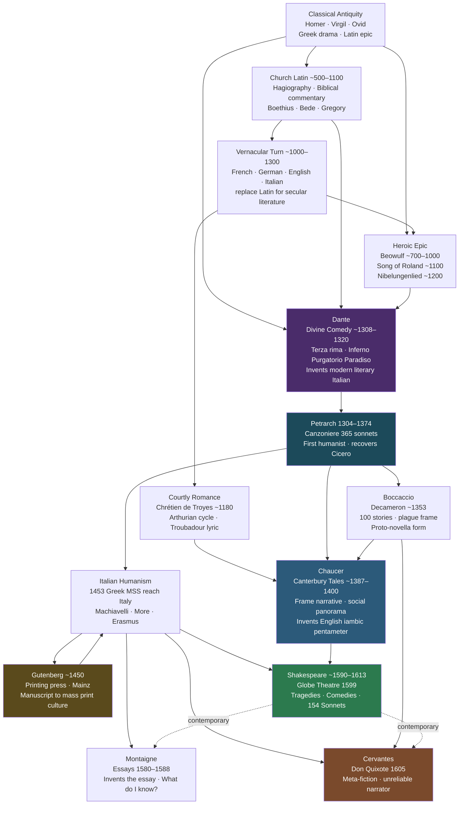

# Medieval and Renaissance Literature

> [!abstract] TL;DR
> From Beowulf's monster-haunted mead-hall (~700 CE) to Shakespeare's Globe (~1600), European literature transforms from a Latin monopoly controlled by the Church into a proliferating set of vernacular traditions — the shift climaxed by Dante's synthesis of classical and Christian thought in the *Divine Comedy*, Chaucer's social panorama of England, Petrarch's invention of the humanist lyric, and Shakespeare's psychologically dense drama; the printing press (~1450) then made literary culture a mass phenomenon for the first time, and the spread of Renaissance innovation from Florence across Europe is one of the earliest traceable case studies in cultural diffusion.

---

## Intuition

**Analogy:** Imagine a great library that is almost entirely underwater. You can see the roof and the top floor above the surface — the Latin texts the Church preserved, copied, and controlled. Below the waterline are thousands of books: Greek philosophy, Roman erotic poetry, scientific treatises, vernacular songs, oral epics, comedy. Medieval culture is mostly working with that top floor. The Renaissance is what happens when, gradually and then suddenly, the water level drops and the rest of the library becomes accessible.

The analogy has a second layer: the books that come back up from the water do not arrive unchanged. They arrive in a different building, inhabited by people speaking different languages, asking different questions, printing and distributing the recovered texts at a scale the Romans never imagined. When Dante writes his journey through Hell, Purgatory, and Heaven, he uses Virgil as his guide not because Virgil was a Christian — he was not — but because Dante understood that classical learning and Christian faith were not enemies but different floors of the same library. The Renaissance is what happens when readers begin to trust their own judgment about what those floors contain.

---

## How It Works



The diagram shows two currents converging on the Renaissance. The first current is the long medieval reworking of classical material through a Church filter — the epic tradition (Beowulf, Roland, Nibelungenlied) and the romance tradition (Arthurian cycle) flowing toward Dante's synthesis, then Chaucer's vernacular translation of that synthesis into English. The second current is the humanist recovery of antiquity through Petrarch, accelerated by the printing press and by the fall of Constantinople (1453), which drove Greek scholars and manuscripts to Italy. Shakespeare stands at the confluence of these two currents, inheriting Chaucer's vernacular English and the humanist's classical learning simultaneously.

---

## Key Concepts

### Secondary Level

**The medieval literary world (~500–1400 CE): Church, Latin, and the slow emergence of vernacular**

For roughly five centuries after the fall of the Western Roman Empire, the Catholic Church was both the primary patron and the primary subject of European literature. Monasteries were the only institutions with the resources to maintain scriptoria — rooms of trained copyists reproducing texts onto vellum. The Library at Monte Cassino, founded by Benedict of Nursia (c. 480–550), preserved Tacitus, Apuleius, and Varro through centuries when those texts might otherwise have vanished. The price of this preservation was selection: texts that could be made to serve Christian purposes were copied; texts that could not were left to decay. Ovid's *Metamorphoses* survived because it could be allegorized; much of Epicurean philosophy did not.

The result was a **manuscript culture** organized around scarcity, authority, and transmission rather than originality or individual authorship. A medieval scribe copying a saint's life was not a "writer" in the modern sense — he was a transmitter, and transmission itself was an act of piety. Illuminated manuscripts (the Book of Kells, the Lindisfarne Gospels, the Très Riches Heures) combined text with visual art in a way that made the manuscript object itself sacred. The idea that a text should be attributed to a single identifiable author, published in an edition of thousands of identical copies, and read privately in silence — these are Renaissance and post-Gutenberg assumptions. Medieval literary culture was overwhelmingly oral, communal, and clerical.

**The vernacular turn: when writers stopped writing in Latin**

The most consequential literary development of the medieval period was gradual and mostly invisible to participants: writers began writing in French, Italian, German, and English rather than Latin. This happened unevenly across genres. Religious commentary and theological argument stayed in Latin longest. Secular lyric poetry, heroic epic, and romance narrative were the first to migrate.

The reasons were practical: oral performance for non-literate audiences required a language those audiences spoke. The *jongleur* (travelling performer) singing a *chanson de geste* to a castle hall of knights who could not read was already working in the vernacular; writing it down simply preserved what was already being performed orally. The theological implications were significant: once sacred subjects could be treated in vernacular languages, the Church's monopoly on interpretation was weakened. Dante writing his account of Heaven and Hell in Italian, and explicitly arguing in a treatise (*De Vulgari Eloquentia*, c. 1302) that the vernacular tongue was a legitimate literary medium, was a claim that threatened the clerisy's exclusive ownership of religious meaning.

**Key forms of medieval literature**

| Form | Characteristics | Key Example |
|------|----------------|-------------|
| **Hagiography** (saints' lives) | Miracle narrative; martyrdom; moral exemplum | *Golden Legend* (Jacobus de Voragine, ~1260) |
| **Biblical commentary** | Typological reading; allegory; moral theology | Augustine's *Confessions*, Bede's *Ecclesiastical History* |
| **Chanson de geste** | Heroic oral epic in Old French; feudal loyalty; battle | *Song of Roland* (~1100) |
| **Courtly romance** | Love between knight and noble lady; quest; idealization | Chrétien de Troyes (*Lancelot*, ~1177) |
| **Allegorical dream vision** | Dreamer-narrator; personified abstractions; moral framework | *Roman de la Rose* (~1230–1275); Chaucer's *Parliament of Fowls* |
| **Fabliau** | Comic, often obscene short tale; anticlerical; bourgeois | Chaucer's *Miller's Tale*, *Reeve's Tale* |
| **Lyric (Troubadour / Minnesang)** | Courtly love; idealized but unattainable lady; vernacular | Bernart de Ventadorn (Occitan); Walther von der Vogelweide (German) |

**Beowulf (~700–1000 CE): the Anglo-Saxon epic**

*Beowulf* is the longest surviving poem in Old English — 3,182 lines of alliterative verse, preserved in a single manuscript (the Nowell Codex, c. 1000 CE) that barely survived a library fire in 1731. Its composition is disputed: most scholars date the poem between 700 and 900 CE, though the manuscript is later. It describes events set in Scandinavia (6th-century Denmark and southern Sweden), making it simultaneously an Anglo-Saxon and a North Germanic text.

The structure is built around three battles: the young Beowulf kills the monster Grendel with his bare hands; he then kills Grendel's mother in an underwater hall; fifty years later, as an old king, he fights and dies defeating a dragon. What distinguishes the poem from simple heroic celebration is its **elegiac tone** — an awareness, pervasive in Old English poetry, that all victories are temporary, all mead-halls will eventually burn, all kings will die. The word *wyrd* (fate) hovers over the poem. Grendel is described as a descendant of Cain — the Bible's first outcast — making the monster a theological as well as a physical enemy: the creature who cannot belong to human community, who attacks precisely the hall-fellowship (*comitatus*) that Anglo-Saxon culture valued most.

J.R.R. Tolkien's 1936 lecture "Beowulf: The Monsters and the Critics" is the most influential single piece of *Beowulf* scholarship: Tolkien argued that the poem's monsters are not obstacles to its serious meaning but *are* its serious meaning — embodiments of the darkness that heroic courage faces and cannot ultimately defeat.

**The Song of Roland (~1100) and the Nibelungenlied (~1200)**

The *Chanson de Roland* is the foundational French epic — roughly 4,000 lines in assonanced laisses (strophic units), narrating the ambush and death of Charlemagne's rear-guard at Roncevaux (778 CE). The historical event was a minor skirmish; the epic transforms it into a meditation on feudal loyalty, Christian holy war, and the tension between personal heroism and communal duty. Roland refuses to blow his horn (*olifant*) to summon Charlemagne's reinforcements until it is too late — a fatal pride that the poem simultaneously admires and condemns. The Saracen enemies are portrayed in terms that served the ideological needs of the Crusades, which were beginning precisely when the poem was written down.

The *Nibelungenlied* is the great German medieval epic (~2,400 four-line strophes), drawing on the same Germanic legend-cycle that Wagner would adapt five centuries later for the *Ring Cycle*. Its central tragedy is the murder of Siegfried — a hero of impossible strength and magical invulnerability — by Hagen, motivated by a dispute over precedence between Siegfried's wife Kriemhild and Gunther's wife Brünnhilde. The second half follows Kriemhild's revenge, which ends in the annihilation of virtually everyone. Where *Roland* is about loyalty rewarded, *Nibelungenlied* is about loyalty betrayed and the catastrophic chain reaction that follows — a more psychologically ambiguous and darker text.

**Dante's *Divine Comedy* (~1308–1320): the medieval synthesis**

If one had to choose a single medieval text as the period's highest achievement, the scholarly consensus would be the *Commedia* of Dante Alighieri (1265–1321). Written in exile from Florence (Dante was a casualty of Florentine factional politics in 1302 and never returned), the poem is in three canticles — *Inferno* (34 cantos), *Purgatorio* (33 cantos), *Paradiso* (33 cantos) — totalling 14,233 lines in **terza rima** (an interlocking rhyme scheme ABA BCB CDC... that Dante appears to have invented).

The structural ambition is extraordinary. *Inferno* organizes Hell into nine concentric circles, each housing a category of sin in order of increasing moral gravity; classical figures (Achilles, Odysseus, Julius Caesar, Cleopatra) cohabit with medieval popes and contemporary Florentine politicians, arranged according to a Thomistic-Aristotelian ethical taxonomy. *Purgatorio* ascends a mountain of seven terraces corresponding to the seven deadly sins, where the damned are not punished but are purified. *Paradiso* moves through the nine celestial spheres of Ptolemaic cosmology toward the Empyrean and a final vision of God.

Three structural choices define the poem's greatness:

1. **Virgil as guide through Inferno and Purgatorio**: Dante's reverence for the pagan Virgil, whom he regarded as the supreme poet, is expressed by making him the speaker and teacher for the first two-thirds of the journey. But Virgil cannot enter Paradiso — reason and classical learning can take one only so far; faith is required for the final ascent.
2. **Beatrice Portinari as guide through Paradiso**: Beatrice was a real Florentine woman whom Dante had met twice and idealized in his earlier *Vita Nuova* (~1295). In the *Commedia* she becomes the figure of theological love — not erotic but redemptive, drawing the soul upward.
3. **The invention of literary Italian**: Dante chose to write not in Latin but in Florentine vernacular, arguing in *De Vulgari Eloquentia* and *Convivio* that the vernacular was a legitimate literary medium. The *Commedia*'s extraordinary prestige effectively standardized Tuscan as the basis of the Italian literary language for centuries.

---

### Undergraduate Level

**Geoffrey Chaucer (~1343–1400): the Canterbury Tales and the invention of English literature**

Geoffrey Chaucer is, in the standard account, the first great English author — the first writer to produce a body of work in English that was recognized, even by contemporaries, as literature of the highest order. He was not the first to write in English (Old English has *Beowulf*; Middle English has the *Pearl* poet, Langland's *Piers Plowman*), but he was the first to import the full sophistication of Italian and French court literature into English, and to do so with a technical mastery that transformed the language.

His most significant formal contribution is the **iambic pentameter line** — ten syllables alternating unstressed and stressed (da-DUM da-DUM da-DUM da-DUM da-DUM) — which he adapted from Italian and French models into English with flexibility and naturalness. This line would become the dominant metre of English poetry for the next four centuries, the vehicle for Shakespeare's plays and Milton's *Paradise Lost*.

The *Canterbury Tales* (~1387–1400) is organized by a **frame narrative**: a group of pilgrims travelling from London to the shrine of Thomas Becket at Canterbury agree to tell stories, two on the way there and two on the way back, to pass the time. The frame is never completed — Chaucer left the work unfinished — but what survives is a social panorama of medieval England. The pilgrims represent virtually every social estate: the chivalric ideal (the Knight), the clergy (the Prioress, the Friar, the Pardoner, the Monk), the emerging bourgeoisie (the Merchant, the Franklin), the peasantry (the Miller, the Reeve). Each teller's story reflects his or her social position, psychology, and self-interest, creating what modern critics call **dramatic irony** between teller and tale.

Two pilgrims stand out as Chaucer's most psychologically complex creations:

**The Wife of Bath** delivers a 856-line prologue before her tale — longer than most of the tales themselves — in which she defends the authority of experience over scripture, celebrates her five marriages and her use of sex as economic leverage over her husbands, and argues that women should have sovereignty in marriage. It is a proto-feminist text — not because Chaucer was a proto-feminist (the question of authorial identification is complex) but because the Wife's voice embodies a genuine argument about gender and power that the text neither endorses nor simply mocks.

**The Pardoner** is one of literature's earliest depictions of performance and bad faith. He openly confesses, in his prologue, that he sells fake relics and inducts his sermons with the theme "Radix malorum est cupiditas" (greed is the root of evil) — while himself being entirely motivated by greed. He then delivers the sermon anyway, daring the pilgrims to buy his relics knowing they are fraudulent. The Pardoner is a meditation on the dissociation of sign from meaning, performance from sincerity — issues that will be central to Shakespeare's theatrical world two centuries later.

**Troilus and Criseyde** (~1385), Chaucer's other masterpiece, is a 8,239-line narrative poem in rhyme royal, retelling the story of a Trojan warrior who falls in love with Criseyde, loses her to the Greek camp through diplomatic exchange, and watches helplessly as she transfers her affection to the Greek warrior Diomede. It is the first extended psychological portrait in English literature — particularly in its treatment of Troilus's passivity, self-deception, and grief. It is also Chaucer's most direct engagement with Italian literature: his primary source is Boccaccio's *Il Filostrato*, translated and enormously expanded.

**The Renaissance (~1400–1600): humanism, printing, and the recovery of antiquity**

The Renaissance is not a single event but a set of overlapping processes — intellectual, technological, economic, religious — that transformed European culture between roughly 1400 and 1600. Four developments are structural:

**1. Petrarch and the humanist programme**
Francesco Petrarch (1304–1374) is conventionally called the first humanist — not because he invented studying classical texts (medieval scholars had always done this) but because he was the first to treat the classical past as a lost civilization to be recovered and mourned rather than a quarry of useful quotations to be incorporated into Christian argument. His discovery of Cicero's private letters (Ad Atticum, in 1345) revealed a Cicero who was anxious, politically defeated, personally affectionate — a human being, not a stylistic model. This historicizing move — asking what Cicero actually thought and felt, rather than what his sentences could be made to mean — is the humanist intellectual revolution.

Petrarch's *Canzoniere* (Songbook, c. 1374) — 366 poems, mostly sonnets, addressed to Laura, a Florentine woman whom Petrarch loved without physical consummation — established the **Petrarchan sonnet** as the dominant lyric form of the next three centuries. The conventions it established: the idealized, unattainable beloved; the lover's psychological self-division between desire and reason; the oxymora of the love experience (sweet torment, living death, frozen fire); the 14-line structure divided between an octave (8 lines, ABBAABBA) posing a problem and a sestet (6 lines) resolving or deepening it. These conventions spread across Europe with a lag proportional to linguistic and geographic distance: Spanish Petrarchism by 1530 (Garcilaso de la Vega), French by 1550 (Ronsard's *Amours*), English by the 1580s (Sidney's *Astrophil and Stella*, 1591; Spenser's *Amoretti*, 1595).

**2. Boccaccio and the prose fiction tradition**
Giovanni Boccaccio (1313–1375), friend of Petrarch and author of the *Decameron* (c. 1353), stands at the origin of the European prose fiction tradition. The *Decameron* has a famous plague frame: ten young Florentines (seven women, three men) flee the Black Death of 1348 to a country villa and agree to pass ten days each telling one story per day — giving the collection its name (Greek: *deka* = ten, *hēmera* = day). The 100 stories range from bawdy comedy to tragic romance to pious exemplum, organized by themes the presiding "queen" of the day assigns.

The *Decameron*'s literary significance is multiple. It is the ancestor of the **short story** as a form. Its prose style — syntactically complex but controlled, modelled on Cicero but in vernacular Italian — set the standard for Italian literary prose. Its realistic treatment of bourgeois characters (merchants, priests, wives, students) as the subjects of serious narrative was genuinely new; medieval narrative had mostly assigned this role to knights and nobles. And its implicit celebration of human ingenuity, desire, and adaptability — written in the shadow of a plague that killed perhaps one-third of Europe — is the clearest early statement of the Renaissance secular confidence in human possibility.

**3. The printing press (~1450) and its consequences**
Johannes Gutenberg's development of movable-type printing in Mainz around 1450 is the most important technological event in the history of literature between the invention of writing and the internet. The consequences for literary culture were multiple and not immediately obvious:

- **Standardization**: manuscripts varied from copy to copy (scribal errors accumulated); print editions created identical texts. The concept of the "authoritative text" becomes meaningful only in the age of print.
- **Price collapse**: a manuscript Bible might cost a craftsman's annual salary; a printed Bible cost roughly one week's wages within fifty years of Gutenberg. This made book ownership possible for a middle class that had never had access to books.
- **Vernacular acceleration**: publishers printed in languages their customers could read; this created a commercial incentive for vernacular literacy that reinforced the literary shift away from Latin.
- **Protestant Reformation as print phenomenon**: Luther's 95 Theses (1517) would have remained a local academic dispute without print. The speed at which they spread across Europe — translated, reprinted, distributed through commercial bookselling networks — was a print phenomenon. The Reformation is unthinkable without Gutenberg.
- **Literary canonization**: print froze texts and attributed them to authors. The idea of the "literary canon" — a set of authoritative texts worth preserving and studying — is a print-culture concept. Before print, what survived was what scribes chose to copy; after print, what survived was what publishers chose to print and what buyers chose to buy.

The printing press reached Strasbourg by 1460, Cologne by 1464, Venice by 1469, Paris by 1470, London by 1477, Prague by 1478, Madrid by 1511. The geographic diffusion followed trade routes and commercial networks, not linguistic or cultural affinity alone.

**4. The fall of Constantinople (1453) and the recovery of Greek**
When Ottoman forces took Constantinople in 1453, Greek scholars fled west with manuscripts — many of them previously unknown to Western Europe. Plato (known primarily through the *Timaeus* in the medieval period) became available in full; so did Thucydides, Plutarch, Lucian, and the complete Greek dramatic corpus. The Platonic Academy that Cosimo de' Medici established in Florence, with Marsilio Ficino as its director, was directly fuelled by this influx. The philosophical consequences — Neo-Platonism, hermeticism, the idea of the *dignitas hominis* (dignity of man) elaborated by Pico della Mirandola in his *Oration on the Dignity of Man* (1486) — reshaped European intellectual culture.

For literary history, the recovered Greek drama (Sophocles, Euripides, Aristophanes) arrived at precisely the moment that secular theatrical culture was beginning to develop in Italy and then England. The question of whether Aristotle's *Poetics* (recovered in full Latin translation c. 1498, in printed Greek 1508) directly influenced Elizabethan drama is disputed; that it shaped the theory within which Shakespeare's critics interpreted his work is not.

**Italian Renaissance prose: Machiavelli and More**
Machiavelli's *The Prince* (c. 1513, published 1532) belongs to a long tradition of *specula principum* — mirrors for princes — instructional manuals for rulers. What makes it a literary event is the violence of its break with that tradition: where previous writers in the genre advised rulers to be virtuous, Machiavelli advises them to *appear* virtuous while being as ruthless as effectiveness requires. The gap between appearance and reality, performance and substance — a central preoccupation of Renaissance literature from Chaucer's Pardoner to Shakespeare's Iago — is Machiavelli's explicit subject.

Thomas More's *Utopia* (1516) is a stranger text: a fictional travel narrative describing an ideal island society, written in Latin, addressed to humanist readers across Europe, and simultaneously a satire on English political reality and a genuine speculative exploration of how a society organized on rational principles rather than inherited privilege might function. It invented the word "utopia" (from Greek: *ou* = not, *topos* = place — "no-place") and the genre named for it.

---

### Graduate Level

**Shakespeare (~1564–1616): the Globe, the four periods, and the question of universality**

William Shakespeare worked in the most commercially developed theatrical culture Europe had yet seen. The first permanent commercial playhouse in England, the Theatre, was built by James Burbage in 1576; the Globe, built by the Burbage sons using timbers from the Theatre, opened in 1599. The business model was unprecedented: a repertory company (Shakespeare was a shareholder in the Lord Chamberlain's Men, later the King's Men) performing a rotating repertoire to paying public audiences, financing itself through ticket sales. This commercial context shaped the literature: Shakespeare had to entertain a socially mixed audience — the penny groundlings standing in the yard, the sixpenny gallery seats, the expensive lords' rooms — simultaneously.

The physical conditions of the Elizabethan stage also shaped the drama. No scenery — location was established through language ("This is the forest of Arden"; "How sweet the moonlight sleeps upon this bank"). Boy actors for female roles — gender was performed, not embodied, and the comedies exploit this through disguise plots (Viola dressed as a man, Rosalind dressed as a man). The **soliloquy** — a character speaking their interior state directly to the audience — was the primary vehicle for psychological depth, enabling a directness of access to interiority unattainable in the novel until the 19th century. The **aside** (a character's comment audible to the audience but not other characters) created a privileged conspiratorial relationship between villain and audience that Shakespeare exploits systematically.

Scholars conventionally divide Shakespeare's output into four periods:

| Period | Dates | Dominant forms | Key works |
|--------|-------|---------------|-----------|
| Early | ~1589–1594 | History plays, Roman comedies | *Henry VI* parts, *The Comedy of Errors*, *Titus Andronicus* |
| Middle comedies and mature history | ~1595–1599 | Romantic comedy, mature history | *A Midsummer Night's Dream*, *Much Ado About Nothing*, *Henry IV* parts, *Henry V* |
| Tragedies | ~1600–1608 | Tragedy | *Hamlet*, *Othello*, *King Lear*, *Macbeth*, *Antony and Cleopatra* |
| Romances (late plays) | ~1608–1613 | Tragicomic romance | *The Winter's Tale*, *The Tempest*, *Cymbeline* |

The four great tragedies are each organized around a distinct catastrophic dynamic:

**Hamlet** (~1600) is the first tragedy of interiority in the European tradition. Its protagonist knows what he must do (revenge his father's murder) and cannot do it — the play is about the gap between knowing and acting, representation and reality, performance and sincerity. "The play's the thing / Wherein I'll catch the conscience of the king" — Hamlet stages a play to observe Claudius's reaction, making theatrical representation itself the instrument of truth-detection. The famous "To be or not to be" soliloquy is not primarily about suicide but about the relationship between thought and action: existence is characterized by "thinking too precisely on the event," by an excess of reflective consciousness that paralyzes the will.

**Othello** (~1603) stages the destruction of a heroic self-image through the mechanism of jealousy. Iago's manipulation of Othello works not because Othello is stupid but because he is constituted by a narrative — the heroic soldier's story — that depends on his wife's fidelity for its coherence. The play's racial dimension (Othello is an African Moor in a Venetian society that both admires and fears him) is inseparable from its psychological logic: Othello's vulnerability to Iago's insinuations is rooted in his outsider position, his dependence on performance of a role that was never unambiguously his.

**King Lear** (~1605) is the most extreme of the tragedies — a systematic stripping away of every social, familial, and cognitive support until a king stands naked on a heath in a storm with a fool and a madman, asking what a human being is when all the props of civilization are removed. The play contains no villain in the Iago sense; Goneril, Regan, and Edmund are opportunists responding to a situation Lear himself created by dividing his kingdom. The double plot (Lear and his daughters; Gloucester and his sons, Edgar and Edmund) multiplies the sense of a world in which the natural bonds between parents and children have become systems of predation.

**Macbeth** (~1606) is the most concentrated and claustrophobic of the tragedies — barely 2,100 lines, less than half the length of *Hamlet* — organized around the logic of ambition that, once acted upon, creates an irreversible chain of crime. Macbeth is unusual among Shakespeare's tragic heroes in that he knows, before he commits the murder, exactly what he is doing and exactly why it is wrong ("If it were done when 'tis done, then 'twere well / It were done quickly"). The tragedy is not one of ignorance or deception but of choosing to transgress full moral knowledge.

**The Sonnets** (published 1609, probably circulating in manuscript earlier) are 154 poems organized around two controversial figures: a beautiful young man (Sonnets 1–126) and a dark-complexioned woman (127–154). The triangle — poet, young man, dark lady — and the rival poet who appears in the middle sequence have generated enormous biographical speculation that has generally yielded less interpretive illumination than the poems themselves. The sequence is formally innovative: where Petrarch's beloved is idealized and static, Shakespeare's sonnets are willing to criticize, manipulate, and be ashamed of their subjects. Sonnet 130 ("My mistress' eyes are nothing like the sun") is the most famous anti-Petrarchan poem in the language — a systematic refusal of every convention of the blazon (catalogue of the beloved's beauties) that Petrarch had established.

**The question of Shakespeare's universality** is genuinely contested. Two competing explanations:

1. **The cultural colonialism argument** (associated with postcolonial literary studies, notably Gary Taylor's *Reinventing Shakespeare*, 1989): Shakespeare is "universal" because British imperial expansion exported his plays to every corner of the globe as part of a programme of cultural dominance; the educational systems of colonized countries were built around the English literary canon with Shakespeare at its apex; his canonization is a political achievement, not an aesthetic judgment.

2. **The psychological depth argument** (associated with Harold Bloom's *Shakespeare: The Invention of the Human*, 1998): Shakespeare's characters have an interiority — they develop, change, surprise themselves, outrun their own plots — that no prior literary tradition had achieved; this psychological realism produces an identification across cultures and centuries that is not merely conventional but reflects genuine insight into the structure of human consciousness.

Both arguments contain truth. The canonical status of Shakespeare is historically contingent and has been amplified by political power; and the plays contain psychological observations that have not been superseded.

**The Renaissance abroad: Cervantes and Montaigne**

Miguel de Cervantes's *Don Quixote* (Part I: 1605; Part II: 1615) is routinely described as the first modern novel — a description that requires unpacking. The novel is modern in the following specific sense: it is built around the gap between literary representation and reality, and it thematizes that gap as its subject. Don Quixote has read so many chivalric romances that he believes himself to be a knight-errant; he sees windmills as giants, inns as castles, a barber's basin as the legendary helmet of Mambrino. The comedy of the first part is generated by this systematic misreading. But Cervantes does something more sophisticated: Quixote's madness is more alive, more morally serious, more interesting than the "sane" world that surrounds him. By Part II, Quixote has become famous (Part I has been published within the fiction), and characters he meets have read the book about him — a meta-fictional recursion that was not attempted again until the 20th century.

The *Quixote* also introduced the **unreliable narrator** as a structural device: Cervantes frames the whole narrative as a translation from an Arabic manuscript by a fictional historian named Cide Hamete Benengeli, creating multiple layers of narrative attribution, each of uncertain reliability. What the reader receives is a book about a man who cannot distinguish fiction from reality, told through a narrative apparatus that cannot be trusted.

Michel de Montaigne's *Essais* (1580, 1588, 1595) invented a literary form — the **essay** (from French *essai*, "attempt, trial") — and a mode of inquiry. Montaigne withdrew from public life to his chateau's tower library, painted the beams with classical quotations, and spent twenty years writing loosely structured, autobiographical reflections on subjects from cannibalism to friendship to the experience of nearly dying from a horse-riding accident. The defining method is sceptical and self-questioning: "Que sais-je?" ("What do I know?") is inscribed on his medal and is the animating question of the whole enterprise.

Montaigne's essays are not arguments that reach conclusions; they are processes of thinking that remain in process. The self that writes them is not a stable, authoritative consciousness but a fluctuating, self-contradicting object of inquiry: "Every man carries the entire form of the human condition within him." The *Essais* influenced Shakespeare (via John Florio's 1603 English translation), Francis Bacon, and virtually every writer who has subsequently attempted the personal essay as a form.

---

## Python Demo

```python
import numpy as np
import matplotlib.pyplot as plt

# ─── City definitions ──────────────────────────────────────────────────────────
# Seven major European literary capitals 1340–1630
CITIES = ['Florence', 'Venice', 'Paris', 'London', 'Madrid', 'Amsterdam', 'Prague']
n_cities = len(CITIES)

# Geographic coordinates [longitude_deg, latitude_deg]
COORDS = np.array([
    [ 11.3, 43.8],   # Florence
    [ 12.3, 45.4],   # Venice
    [  2.3, 48.9],   # Paris
    [ -0.1, 51.5],   # London
    [ -3.7, 40.4],   # Madrid
    [  4.9, 52.4],   # Amsterdam
    [ 14.4, 50.1],   # Prague
])

# Convert to approximate km (flat-Earth suffices at this scale)
mean_lat_rad = np.radians(COORDS[:, 1].mean())
km_coords = COORDS.copy()
km_coords[:, 0] *= 111.0 * np.cos(mean_lat_rad)   # longitude → km
km_coords[:, 1] *= 111.0                            # latitude  → km

# Pairwise Euclidean distances in km  (shape: 7 x 7)
diff = km_coords[:, np.newaxis, :] - km_coords[np.newaxis, :, :]
distances = np.sqrt((diff ** 2).sum(axis=-1))
np.fill_diagonal(distances, np.inf)   # no self-diffusion

# ─── Cultural affinity matrix (symmetric) ─────────────────────────────────────
# Values > 1 = historically closer cultural ties;
# 0 on diagonal (no self-influence needed)
#           Flo   Ven   Par   Lon   Mad   Ams   Pra
affinity = np.array([
    [0.00, 1.40, 1.20, 0.80, 1.30, 0.70, 1.00],   # Florence
    [1.40, 0.00, 1.00, 0.70, 0.90, 0.90, 1.30],   # Venice
    [1.20, 1.00, 0.00, 1.50, 1.20, 1.30, 0.80],   # Paris
    [0.80, 0.70, 1.50, 0.00, 0.60, 1.40, 0.70],   # London
    [1.30, 0.90, 1.20, 0.60, 0.00, 0.70, 0.80],   # Madrid
    [0.70, 0.90, 1.30, 1.40, 0.70, 0.00, 1.00],   # Amsterdam
    [1.00, 1.30, 0.80, 0.70, 0.80, 1.00, 0.00],   # Prague
])

# ─── Time grid: decades 1340–1630 ─────────────────────────────────────────────
DECADES = np.arange(1340, 1631, 10)
n_decades = len(DECADES)

def decade_index(year):
    return int(np.argmin(np.abs(DECADES - year)))

# ─── Innovations ──────────────────────────────────────────────────────────────
# (name, origin_city_index, origin_year, base_diffusion_rate_per_decade)
FLO, VEN, PAR, LON, MAD, AMS, PRA = 0, 1, 2, 3, 4, 5, 6

INNOVATIONS = [
    ('Petrarchan Sonnet',     FLO, 1340, 0.18),   # Canzoniere ~1340
    ('Prose Fiction',         FLO, 1350, 0.14),   # Decameron 1353
    ('Printing Press',        PRA, 1450, 0.35),   # Mainz 1450; Prague nearest node
    ('Humanist Essay/Prose',  FLO, 1490, 0.16),   # Machiavelli / Erasmus / More
    ('Commercial Theatre',    LON, 1580, 0.22),   # Theatre 1576; Globe 1599
]
n_innovations = len(INNOVATIONS)

# ─── Diffusion weights ────────────────────────────────────────────────────────
# diff_weight[i, j] = affinity[i,j] / distance_km[i,j]
# represents how readily city i's innovations reach city j
diff_weight = affinity / distances   # 0/inf = 0 on diagonal; all others > 0

# ─── Simulate adoption levels A[city, innovation, time] ───────────────────────
A = np.zeros((n_cities, n_innovations, n_decades))

# Seed: origin city reaches full adoption at origin decade
for k, (name, origin, year, rate) in enumerate(INNOVATIONS):
    t0 = decade_index(year)
    A[origin, k, t0] = 1.0

# Logistic diffusion: Δ_j = base_rate × Σ_i(diff_weight[i,j] × A[i,t]) × (1 − A[j,t])
for t in range(n_decades - 1):
    for k, (name, origin, year, base_rate) in enumerate(INNOVATIONS):
        current = A[:, k, t]                        # shape (7,)
        # Total influence flowing INTO each city j from all sources i
        inflow = diff_weight.T @ current             # shape (7,)
        delta  = base_rate * inflow * (1.0 - current)
        A[:, k, t + 1] = np.clip(current + delta, 0.0, 1.0)

# ─── Plotting ─────────────────────────────────────────────────────────────────
CITY_COLORS  = ['#c0392b', '#e67e22', '#2980b9', '#27ae60', '#8e44ad', '#16a085', '#2c3e50']
CITY_STYLES  = ['-', '--', '-', '--', '-', '-.', ':']

fig, axes = plt.subplots(2, 3, figsize=(16, 9))
axes_flat = axes.flatten()

for k, (name, origin, year, rate) in enumerate(INNOVATIONS):
    ax = axes_flat[k]
    for c in range(n_cities):
        ax.plot(DECADES, A[c, k, :],
                color=CITY_COLORS[c], linestyle=CITY_STYLES[c],
                linewidth=1.9, label=CITIES[c])
    t0 = decade_index(year)
    ax.axvline(DECADES[t0], color='black', linestyle=':', linewidth=1.0, alpha=0.55)
    ax.text(DECADES[t0] + 3, 0.90, f'{DECADES[t0]}s\norigin', fontsize=6.5, color='#333')
    ax.set_title(name, fontsize=10, fontweight='bold')
    ax.set_xlabel('Decade', fontsize=8)
    ax.set_ylabel('Adoption (0 = none, 1 = full)', fontsize=8)
    ax.set_xlim(DECADES[0], DECADES[-1])
    ax.set_ylim(-0.05, 1.12)
    ax.tick_params(labelsize=7)
    ax.grid(True, alpha=0.25)

# 6th panel: composite literary innovation index (mean across all innovations)
ax = axes_flat[5]
composite = A.mean(axis=1)   # shape (n_cities, n_decades)
for c in range(n_cities):
    ax.plot(DECADES, composite[c, :],
            color=CITY_COLORS[c], linestyle=CITY_STYLES[c],
            linewidth=2.2, label=CITIES[c])
ax.set_title('Composite Literary Innovation Index\n(mean adoption across 5 innovations)',
             fontsize=9, fontweight='bold')
ax.set_xlabel('Decade', fontsize=8)
ax.set_ylabel('Mean adoption (0–1)', fontsize=8)
ax.set_xlim(DECADES[0], DECADES[-1])
ax.set_ylim(-0.05, 1.12)
ax.tick_params(labelsize=7)
ax.grid(True, alpha=0.25)
ax.legend(fontsize=7.5, loc='upper left', ncol=2, framealpha=0.9)

fig.suptitle(
    'Diffusion of Renaissance Literary Innovation Across Seven European Cities  1340–1630\n'
    'Logistic spread model: adoption rate ∝ neighbor influence × cultural affinity / geographic distance',
    fontsize=11, fontweight='bold'
)
plt.tight_layout(rect=[0, 0, 1, 0.93])
plt.savefig('renaissance_literary_diffusion.png', dpi=150, bbox_inches='tight')
plt.show()

# ─── Print decade of 50 % adoption for each city × innovation ─────────────────
print("\nFirst decade each city reaches ≥50% adoption:\n")
header = f"{'Innovation':<26}" + "".join(f"{c:>12}" for c in CITIES)
print(header)
print('-' * (26 + 12 * n_cities))
for k, (name, origin, year, rate) in enumerate(INNOVATIONS):
    row = f"{name:<26}"
    for c in range(n_cities):
        idx = np.where(A[c, k, :] >= 0.5)[0]
        row += f"{int(DECADES[idx[0]]):>12}" if len(idx) > 0 else f"{'> 1630':>12}"
    print(row)
```

**What the model demonstrates:**

- **Petrarchan Sonnet**: Florence reaches saturation quickly; Spanish and Italian cities follow within decades given cultural affinity; Paris lags due to geographic distance but reaches 50% adoption by the 1520s–1540s; London is the furthest, consistent with the historical record (Sidney's *Astrophil and Stella* arrived in the 1590s, 250 years after Petrarch's *Canzoniere*).
- **Printing Press**: originating in the Prague/Central European node (nearest to Mainz in the model), the high diffusion rate causes rapid saturation everywhere by 1500 — matching the historical record that every major European city had printing within 50 years.
- **Commercial Theatre**: originating in London, it diffuses outward but more slowly; Amsterdam and Paris are the natural early recipients given affinity scores, while Florence and Venice — the innovators in most other dimensions — are now receivers rather than senders.
- **Composite index (panel 6)**: Florence leads through 1400–1500; London's composite score rises steeply from 1580 onward as the commercial theatre innovation adds to its accumulated Renaissance inheritance; Amsterdam rises late, consistent with its role as a 17th-century rather than 16th-century cultural capital.

The model deliberately simplifies: real diffusion involved specific individuals (Erasmus carrying humanist ideas to England; Italian musicians at the French court; Protestant exiles circulating printed texts). But the logistic S-curve structure — slow adoption among distant cities, rapid saturation once a threshold is crossed — matches the actual historical diffusion pattern across multiple Renaissance innovations.

---

## Real-World Applications

> **Example 1 — Dante's *Commedia* and the standardization of Italian.** Dante's choice to write the *Commedia* in Florentine vernacular, rather than Latin, is the most consequential single literary decision in Italian cultural history. Because the poem became the supreme prestige object of Italian literature almost immediately after its circulation, Florentine Tuscan became the model for Italian literary language — even after Florence itself ceased to be Italy's dominant city-state. The 16th-century *questione della lingua* (language question) — which dialect should serve as the basis of standard Italian? — was ultimately resolved in favor of Dante's Tuscan, codified by Pietro Bembo's *Prose della volgar lingua* (1525). A single literary text's prestige shaped the language of a nation for six centuries.

> **Example 2 — The Petrarchan sonnet as a diffusion case study.** The spread of the Petrarchan sonnet across Europe between 1340 and 1600 is one of the most thoroughly documented cases of literary-formal diffusion in history. It traveled with bilingual Italian merchants and diplomats, with humanist scholars, with translated anthologies, and with the printing press. Each national tradition adapted the form to local linguistic conditions: Spanish adapted it to an 11-syllable line (*endecasílabo*); French adapted it to the alexandrine (12 syllables); English adapted it to iambic pentameter, and then Shakespeare further mutated it into three quatrains and a couplet (the "Shakespearean" or "English" sonnet), inverting the structural logic of the Italian form. Tracing these adaptations reveals how literary forms carry cultural assumptions — about the nature of desire, the social role of the idealized beloved, the relationship between the individual lyric voice and a tradition — that are variously preserved, adapted, and resisted in transit.

> **Example 3 — Cervantes and the meta-fictional novel.** The technique Cervantes uses in *Don Quixote* Part II — in which characters have already read Part I and therefore know they are fictional — anticipates what postmodern critics call **metafiction** by three and a half centuries. John Barth, Thomas Pynchon, and Salman Rushdie work in the tradition Cervantes opened. The *Quixote* also established that the protagonist of a novel can be constituted by his reading — that what a character has read shapes who they are as powerfully as what they have lived. This becomes a Victorian novel convention (Emma Bovary is destroyed by her reading of romance novels in Flaubert's *Madame Bovary*, 1857) and remains active in contemporary fiction.

> **Example 4 — Shakespeare and the invention of psychological interiority.** The claim that Shakespeare "invented the human" (Harold Bloom's formulation) can be restated in more precise literary-historical terms: Shakespeare was the first writer to represent characters who develop within a single play — who are recognizably different by the end than they were at the beginning because the events of the plot have changed them. Lear at the end of *King Lear* is not the same person as Lear at the beginning; Macbeth at the end of *Macbeth* is not the same as Macbeth at the beginning. This sounds like an obvious feature of narrative, but Greek tragedy (Aristotle's model) was not organized around character development but around recognition and reversal. The soliloquy as a vehicle for representing the process of self-examination — Hamlet talking himself into and out of action, Macbeth imaging the consequences of a murder before committing it — was Shakespeare's technical means for achieving this new kind of character.

---

## Trade-offs

| Aspect | Pro | Con |
|--------|-----|-----|
| Latin vs. vernacular | Vernacular enables mass literacy, national literatures, direct emotional access | Loss of international scholarly community; fragmentation of European intellectual exchange |
| Manuscript vs. print | Print enables mass distribution, standard texts, authorial identity | Print accelerates propaganda as readily as truth; canonical texts crowd out oral traditions |
| Church patronage | Preserves texts; funds illuminated manuscript culture; motivates literacy | Restricts subject matter; theological allegory distorts secular texts; suppresses dissent |
| Classical recovery (humanism) | Enormously expands intellectual resources; enables secular thought | Valorizes classical past at cost of contemporary vernacular; creates Latin-Greek elitism |
| Commercial theater (Shakespeare's model) | Democratizes drama; forces writers to achieve genuine popular appeal | Market pressures constrain formal experimentation; playwrights lose control of their texts |

---

## When to Use vs Avoid

**Use medieval and Renaissance literature when:**
- Analyzing the origins of almost any convention of Western literature — the sonnet form, the tragic hero, the frame narrative, the satiric essay, the unreliable narrator all originate here
- Tracing the diffusion of literary forms across cultures (Renaissance diffusion is a model case for cultural transmission studies)
- Understanding how language standardization and literary prestige interact (Dante's Italian, Chaucer's English, the King James Bible)
- Examining the relationship between political power and literary production (patronage, censorship, the Reformation and print culture)

**Avoid assuming:**
- That periodization labels ("Medieval," "Renaissance") are natural rather than historiographic constructions — "the Renaissance" as a concept was largely invented by Giorgio Vasari (1550) and Jules Michelet (1855) retrospectively
- That the "canonical" medieval and Renaissance texts represent the full range of literary production — women writers (Christine de Pizan, Mary Sidney, Isabella Whitney), non-European literary cultures in contact with Europe, and popular/oral genres are systematically underrepresented in traditional accounts
- That Shakespeare's dominance is a neutral aesthetic fact — its reproduction is also a function of institutional and educational investment

---

## Common Pitfalls

- **Treating "medieval" as synonymous with "dark" or "primitive"** — the medieval period produced Dante, Chaucer, the great Gothic cathedrals, Scholastic philosophy, and a sophisticated international legal and theological culture. The "Dark Ages" is a Renaissance polemical label, not an accurate historical description.
- **Conflating the Italian Renaissance (1400–1500) with the Northern European Renaissance (1500–1600)** — they are related but distinct phenomena separated by roughly a century, different religious contexts (pre-Reformation Italy; post-Reformation England, France, and Germany), and different institutional structures (Italian city-state patronage vs. English court and commercial theater).
- **Reading Shakespeare's "universality" as automatic** — his plays work in translation and across cultures partly because of their psychological depth and formal flexibility, but also because colonialism and educational institutionalization created the infrastructure for their spread. Treating universality as a given obscures the political history of canon formation.
- **Confusing the Petrarchan and Shakespearean sonnet forms** — the Italian/Petrarchan sonnet divides 8+6 (octave + sestet), usually poses a problem in the octave and develops or resolves it in the sestet; the Shakespearean sonnet divides 4+4+4+2 (three quatrains + couplet), typically develops a conceit through the quatrains and then deflates, complicates, or ironizes it in the couplet. The structural logic is different and produces different kinds of argument.
- **Treating Dante's theology as simply "medieval" and therefore alien** — the *Commedia*'s theological framework is Thomistic-Aristotelian and its emotional and psychological dynamics are entirely accessible. The modern reader's difficulty is usually with geography (which pope is in which circle) rather than with meaning.
- **Assuming Don Quixote is primarily comic** — Part I exploits the comedy of the gap between Quixote's delusions and reality; Part II is a more complex text in which Quixote becomes aware of his own fictional status, the comedy deepens into tragedy, and Cervantes begins to suspect that the idealism his hero embodies may be more valuable than the realism that defeats it.

---

## Related Concepts

- [[Aristotles_Poetics_and_Drama]] — Aristotle's theory of tragedy, recovered in the 15th century, shaped Renaissance dramatic theory and was applied (often misconstrued) to Elizabethan drama; Shakespeare's four tragedies are the most sophisticated negotiation with Aristotle's framework in the European tradition
- [[Structuralism_and_Narratology]] — Propp's morphology of the folktale and Genette's narratological vocabulary provide the analytical tools for formal analysis of medieval romance, frame narratives (Canterbury Tales, Decameron), and Renaissance drama; Genette's diegetic levels were partly developed through analysis of frame-narrative structures
- [[Classical_Rhetoric_and_Aristotle]] — classical rhetoric (Cicero, Quintilian) was the core of the humanist curriculum recovered by Petrarch and Erasmus; Shakespeare's training in the grammar schools involved extensive rhetorical drill; the *oration* structure (exordium, narratio, confirmatio, refutatio, peroratio) underlies soliloquy construction and formal debate scenes
- [[Proto_Indo_European_and_Reconstruction]] — the languages of medieval literature — Old English, Old French, Middle High German, Old Occitan, Latin, Italian — are all Indo-European descendants whose divergence from a common ancestor is traceable through comparative linguistics; understanding the family relationships illuminates why Middle English looks so different from Modern English and why vernacular translation was a more radical act than it might appear
- [[Language_Change_and_Diffusion]] — the spread of Petrarchan conventions, humanist prose styles, and Renaissance theatrical forms across Europe follows the same logistic S-curve diffusion model that governs linguistic change; the role of high-prestige centers (Florence, London) as innovation sources mirrors the role of prestige varieties in language change

---

## Review Questions

### Secondary

1. Dante chose to write the *Divine Comedy* in Italian vernacular rather than Latin, at a time when serious literary and theological work was almost always written in Latin. What were his arguments for this choice, and what were the long-term consequences of that decision for the Italian language?

2. Chaucer's Canterbury Tales uses a frame narrative: pilgrims travelling to Canterbury agree to tell stories. Choose any two of the pilgrims discussed above (Knight, Wife of Bath, Pardoner) and explain how Chaucer uses the relationship between the teller and the tale to create meaning that neither teller nor tale could produce alone.

3. The printing press reached all major European cities within fifty years of Gutenberg (~1450–1500). Give three specific ways in which print culture changed the conditions under which literature was produced, distributed, and read — and explain why one of these changes was more consequential than the others.

### Undergraduate

1. Compare the treatment of "performance vs. sincerity" in Chaucer's Pardoner and Shakespeare's Iago. Both characters explicitly announce their duplicity to the audience while successfully deceiving other characters within the fiction. What does each text suggest about the relationship between theatrical self-presentation and moral identity? How does the institutional context of each text (medieval sermon performance vs. Elizabethan commercial theater) shape the treatment of this theme?

2. Petrarch's *Canzoniere* established a set of conventions for the love lyric that Shakespeare's Sonnets both reproduce and systematically violate (see Sonnet 130). Analyze one Petrarchan convention and one of Shakespeare's departures from it. What does Shakespeare's departure suggest about his relationship to the tradition — is he repudiating it, extending it, or both?

3. Cervantes published Part II of *Don Quixote* in 1615, ten years after Part I. In Part II, Quixote and Sancho Panza have already read Part I and encounter characters who have also read it. What are the literary and philosophical implications of this device? How does it change the reader's relationship to the fiction — and to fiction in general?

### Graduate

1. The term "Renaissance" was invented retrospectively: Giorgio Vasari used it for art history in 1550; Jules Michelet applied it to the whole cultural period in 1855; Jacob Burckhardt systematized it in *The Civilization of the Renaissance in Italy* (1860). Given that the people living through the 15th and 16th centuries did not call their period "the Renaissance," what is the historiographic and literary-critical status of the label? Is it a useful periodization tool, a piece of cultural ideology, or both? What are the costs of organizing literary history around it?

2. Shakespeare's tragedies have generated two centuries of competing psychological interpretations — Romantic (Coleridge on Hamlet as an excess of reflective intellect), Freudian (Jones on Hamlet's Oedipal blockage), existentialist (Jan Kott's *Shakespeare Our Contemporary*), postcolonial (Ania Loomba on *Othello*), ecocritical (*King Lear* and the unaccommodated body). Evaluate two of these interpretive traditions: what genuine insight does each produce, and what does each systematically obscure or distort? What does the proliferation of valid-seeming psychological interpretations suggest about the nature of the texts?

3. Dante's *Divine Comedy*, Chaucer's *Canterbury Tales*, and Boccaccio's *Decameron* are all frame narratives written within roughly seventy years of each other (1308–1400). Compare the function of the frame in each: what does the frame do that a collection of stories without a frame could not do? In what respects does each frame create an implicit theory of storytelling — of why people tell stories, what stories are for, and what their relationship is to the "real world" surrounding them?

---

## Sources

- [Dante Alighieri, *Divine Comedy* — Hollander translation with commentary (Princeton)](https://dante.princeton.edu/)
- [Chaucer, *Canterbury Tales* — Riverside Chaucer (Houghton Mifflin, 1987)](https://www.hmhco.com/shop/books/The-Riverside-Chaucer)
- [Petrarch, *Canzoniere* — Durling bilingual edition (Harvard University Press, 1976)](https://www.hup.harvard.edu/catalog.php?isbn=9780674089709)
- [Boccaccio, *Decameron* — Rebhorn translation (Norton, 2013)](https://wwnorton.com/books/9780393934748)
- [Shakespeare, Complete Works — Arden Shakespeare (Bloomsbury)](https://www.bloomsbury.com/uk/arden-shakespeare/)
- [Cervantes, *Don Quixote* — Edith Grossman translation (Harper Collins, 2003)](https://www.harpercollins.com/products/don-quixote-miguel-de-cervantes)
- [Montaigne, *Essays* — Donald Frame translation (Stanford University Press, 1958)](https://www.sup.org/books/title/?id=2469)
- [Curtius, E. R. (1948). *European Literature and the Latin Middle Ages*. Princeton University Press.](https://press.princeton.edu/books/paperback/9780691019215/european-literature-and-the-latin-middle-ages)
- [Burckhardt, J. (1860/1990). *The Civilization of the Renaissance in Italy*. Penguin Classics.](https://www.penguin.co.uk/books/35813/the-civilisation-of-the-renaissance-in-italy-by-burckhardt-jacob/9780140445343)
- [Greenblatt, S. (2004). *Will in the World: How Shakespeare Became Shakespeare*. Norton.](https://wwnorton.com/books/9780393327830)
- [Bloom, H. (1998). *Shakespeare: The Invention of the Human*. Riverhead Books.](https://www.penguinrandomhouse.com/books/316834/shakespeare-by-harold-bloom/)
- [Eisenstein, E. (1979). *The Printing Press as an Agent of Change*. Cambridge University Press.](https://www.cambridge.org/core/books/printing-press-as-an-agent-of-change/10CAE4D7B3FDED1B78C34BC47E5B7D8E)
- [Tolkien, J.R.R. (1936). "Beowulf: The Monsters and the Critics." *Proceedings of the British Academy*, 22.](https://www.jstor.org/stable/43678998)
- [Lewis, C. S. (1936). *The Allegory of Love: A Study in Medieval Tradition*. Oxford University Press.](https://global.oup.com/academic/product/the-allegory-of-love-9780195002218)

---

#LiteratureRhetoric #WorldLiterature #Medieval #Renaissance
