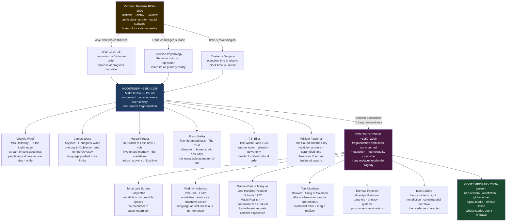

# Modern and Contemporary Literature

> [!abstract] TL;DR
> "Modern" in literary history does not mean "recent" — it names a specific aesthetic revolution (roughly 1890–1945) that turned the novel inward, from the social surfaces of Victorian realism to the private, fractured, time-distorting stream of consciousness; postmodernism (~1950–2000) inherited the fragments but treated them playfully rather than tragically; and contemporary literature (2000–present) ranges from neo-realist autofiction to the global novel to climate fiction, with the question of whose stories count now being actively redrawn.

---

## Intuition

**Analogy:** Victorian novels are like detailed oil paintings of a crowded London street — every figure positioned, every social relationship legible, a confident omniscient eye that shows you exactly what everything means. Modernist novels are like a photograph taken while spinning: the subject is there, the colours are vivid, but the boundaries blur, time layers on itself, and you have to reconstitute the scene from overlapping impressions. Postmodernist novels add another twist: the photographer walks into the frame, winks at you, and asks whether the photo or the street is more real.

The technical vocabulary of modernism — stream of consciousness, unreliable narrator, fragmented chronology, multiple perspectives — exists because writers like Woolf, Joyce, and Faulkner believed that the smooth, omniscient Victorian sentence was a lie. Human experience is not sequential, externally organized, or morally legible. It is simultaneous, internally contradictory, and saturated with half-remembered feeling. The literary techniques are the attempt to match form to that reality.

---

## How It Works



---

## Key Concepts

### Secondary Level

#### What "Modern" Actually Means

The single most important fact about this topic is that literary **modernism** is not the same as "modern" in the colloquial sense. "Modern" in everyday speech means "recent" or "current." In literary history, **Modernism** (capital M) is a specific aesthetic movement that is now over a century old, rooted in the period 1890–1945, and distinguished by a cluster of techniques and assumptions that set it sharply apart from what came before.

Victorian realism — think Dickens's *Bleak House* (1853), Tolstoy's *Anna Karenina* (1877), or Flaubert's *Madame Bovary* (1857) — operated through a confident omniscient narrator who could see everything, explain everything, and deliver moral judgments the reader trusted. The plot moved forward in chronological order. Social relationships were legible. Characters were accessible to external description. The novel was a mirror held up to society.

Modernism shattered this confidence. Four historical developments coincided to make the Victorian form feel like a lie:

1. **WWI (1914–1918):** The most industrially organized slaughter in history destroyed the Victorian narrative of progress, rationality, and Western civilization's upward trajectory. A generation of writers could not pretend that the world was orderly or morally legible.

2. **Freudian psychology:** Freud argued that the most important psychic material is *unconscious* — hidden from the patient and even from the analyst, accessible only obliquely through dreams, slips, symptoms. If the most important things about a human being are by definition beneath the surface, a novel that describes only behavior and social action is missing the point entirely.

3. **Einstein's relativity and Bergson's durée:** Einstein demonstrated that time and space are not absolute — they depend on the observer's frame of reference. Henri Bergson (philosopher, not physicist) argued that *lived* time (*durée*) — time as consciousness experiences it — is utterly different from clock time. Five minutes of boredom and five minutes of joy are not the same duration subjectively. The Victorian novel had always arranged its story along a clock; modernism insisted that human time is psychological, not chronological.

4. **Urbanization:** The modern city — London, Dublin, Paris — overwhelmed its inhabitants with simultaneous, fragmented, discontinuous stimuli. Henry James and later William James (Henry's brother, the psychologist) coined the phrase "stream of consciousness" to describe the continuous, associative, non-linear flow of human experience. The novelists turned it into a technique.

Ezra Pound's slogan captured the modernist imperative: **"Make it New."** Not novelty for its own sake, but the conviction that new content — the fractured inner life of modern urban consciousness — required genuinely new forms to house it.

#### The Modernist Major Works

**Virginia Woolf** developed the stream-of-consciousness technique with extraordinary precision. *Mrs Dalloway* (1925) covers a single day in London — Clarissa Dalloway preparing for a party — but the "day" contains decades of memory, association, class anxiety, and repressed feeling. Time does not move forward; it spirals and loops. *To the Lighthouse* (1927) is structured in three sections: an afternoon (the first ten years of the Ramsay family's summer house visits), a brief central section spanning a decade in which the house decays and Mrs Ramsay dies, and a single morning when the painter Lily Briscoe finally finishes the painting she began in the first section. The novel's achievement is that the middle section — the death, the absence — takes fewer pages than an afternoon, while an afternoon takes a hundred. Form enacts what the novel argues: the inner life of consciousness dwarfs and distorts objective time.

**James Joyce** pushed language further than any English-language writer before or since. *Ulysses* (1922) maps a single day in Dublin (June 16, 1904 — "Bloomsday") onto the structure of Homer's *Odyssey*: Leopold Bloom is Odysseus, his wife Molly is Penelope, Stephen Dedalus is Telemachus. Every chapter uses a different style, voice, and technique — newspaper headlines, catechism, theatrical stage directions, stream of consciousness — to match the narrative content. The final chapter, "Molly Bloom's Soliloquy," is 36 pages with almost no punctuation: the unpunctuated flow of Molly's half-waking consciousness at 2 a.m. *Finnegans Wake* (1939) went further still — a novel written in a multilingual portmanteau language that Joyce invented, representing the dreaming mind of a Dublin pub-owner across all of human history simultaneously.

**Marcel Proust** wrote the longest novel in the French language: *À la Recherche du Temps Perdu* (*In Search of Lost Time*, 1913–1927), seven volumes totalling around 4,200 pages. The novel's famous central mechanism is *involuntary memory* — the Narrator tastes a madeleine dipped in tea, and the sensation involuntarily floods him with the complete sensory world of his childhood in Combray, recovered with a vividness that conscious recollection could never achieve. Proust's argument: the self is not what we consciously narrate but what is preserved whole in involuntary sensory memory — and art (specifically, the novel you are reading) is the means by which lost time can be recovered. The entirety of *In Search of Lost Time* is the Narrator's experience of writing the novel that is *In Search of Lost Time*.

**T.S. Eliot's** *The Waste Land* (1922) is the central poem of modernism. It offers no single narrator, no plot, no resolution — only fragments of voices, languages, literary allusions, and images from across Western civilization, all suggesting the same diagnosis: that post-war Western culture is a spiritual desert populated by the living dead. The poem quotes Sanskrit, Old English, Dante, Shakespeare, ancient fertility myths, and Cockney pub conversation in the same breath. Its technique is *polyphony*: many voices with no arbiter. It epitomizes modernist form — meaning must be assembled by the reader from fragments; it is not delivered.

**Franz Kafka** wrote the other defining mode of modernism: not stream of consciousness but absolute absurdity treated with bureaucratic normality. *The Metamorphosis* (1915) opens: "As Gregor Samsa awoke one morning from uneasy dreams he found himself transformed in his bed into a monstrous vermin." The rest of the story treats this as a family management problem. *The Trial* (1925) follows Josef K., who is arrested for an unspecified crime and prosecuted by a court whose location, personnel, and procedures are impossible to determine. *The Castle* (1926) features a Land Surveyor summoned to work at a Castle he can never reach. Kafka's subject is the individual ground between bureaucratic systems so vast and opaque that guilt, procedure, and human meaning are simply inaccessible. His name gave English a new adjective: *Kafkaesque* — describing any situation of absurd, impenetrable institutional logic.

**William Faulkner** brought modernist technique to the American South. *The Sound and the Fury* (1929) tells the story of the declining Compson family through four narrators: Benjy (an intellectually disabled man who experiences time non-linearly), Quentin (suicidal, haunted by incest and Southern honor), Jason (bitter, mercenary), and a third-person narrator. The same events are told four times from irreconcilably different perspectives; the reader must assemble the story from contradictory fragments. *As I Lay Dying* (1930) narrates a family's journey to bury their matriarch through 15 different narrators in 59 chapters, including the dead woman herself.

---

### Undergraduate Level

#### Postmodernism: What Modernism's Children Did

If modernism mourned the loss of unified meaning — if Eliot's *The Waste Land* is a lament for the civilization whose fragments now lie scattered — postmodernism stopped mourning and started playing. The distinction is one of affect more than technique: postmodernism uses many of the same formal devices (fragmentation, multiple narrators, non-linear chronology) but without modernism's tragic weight. Irony replaces elegy. Self-consciousness replaces authenticity.

The key postmodernist techniques:

**Metafiction** — fiction that explicitly reflects on its own status as fiction. **Italo Calvino's** *If on a winter's night a traveler* (1979) opens: "You are about to begin reading Italo Calvino's new novel, *If on a winter's night a traveler*." The novel's protagonist is "you," the reader. **Vladimir Nabokov's** *Pale Fire* (1962) presents itself as a scholarly edition of a 999-line poem by a fictional poet, with a commentary by a delusional editor who gradually reveals himself to be an exiled king — and possibly a murderer. The novel has no "main text"; it only exists as commentary on a fictional text. Metafiction's insight, formalized by Roland Barthes in "The Death of the Author" (1967), is that the author has never controlled the text's meaning: all fiction is already intertextually constituted, already a weaving together of other texts and voices.

**Intertextuality** — the explicit exploitation of the fact that all texts are woven from other texts. **Jorge Luis Borges** is the pivotal figure: his story "Pierre Menard, Author of the Quixote" (1939) describes a fictional author who does not translate or copy *Don Quixote* but rewrites it, word-for-word, as an original act of creation — revealing that the same text means entirely different things in different historical contexts. Borges invented many postmodern techniques before postmodernism was named: the invented bibliography, the story that critiques its own premise, the library that contains all possible books, the garden of forking paths that realizes all possible timelines simultaneously.

**Magic Realism** — the supernatural coexists, matter-of-factly, with the ordinary. **Gabriel García Márquez's** *One Hundred Years of Solitude* (1967) follows seven generations of the Buendía family in the fictional town of Macondo, where the dead return as ghosts who complain about the heat, a priest levitates after drinking hot chocolate, and a girl ascends to heaven while folding laundry. None of this is treated as unusual: it is reported in the same flat, authoritative tone as everything else. García Márquez described his approach as the "narrator's tone" — if you say something miraculous in a sufficiently matter-of-fact voice, the reader accepts it. Magic realism became the mode of the Latin American novel and later spread globally: **Toni Morrison** (*Beloved*, 1987) uses it to represent the return of a murdered child's ghost as a way of materializing historical trauma that realism cannot contain; **Salman Rushdie** (*Midnight's Children*, 1981) uses it to re-narrate Indian independence through the mythologized biography of a narrator born at the stroke of midnight, August 14–15, 1947.

**The unreliable narrator as a postmodern device.** The unreliable narrator — a narrator whose account cannot be trusted — existed in modernism (the narrators of Faulkner, the Governess in James's *The Turn of the Screw*). But postmodernism institutionalizes unreliability as the default mode. In Nabokov's *Lolita* (1955), the narrator Humbert Humbert is charming, erudite, and a child molester rationalizing his crimes. The reader's task is to see through the prose to the violence underneath — and to recognize that the beauty of the prose is part of the problem. In Kazuo Ishiguro's *The Remains of the Day* (1989), the narrator Stevens narrates a perfect butler's life with precision and composure, without ever acknowledging — to the reader or to himself — that his emotional repression enabled fascism and destroyed the woman who loved him.

**Historiographic metafiction** — Linda Hutcheon's term for novels that both inhabit and interrogate historical narratives. A.S. Byatt's *Possession* (1990), Michael Ondaatje's *The English Patient* (1992), Hilary Mantel's *Wolf Hall* (2009): these novels use the materials of history while explicitly dramatizing the processes by which history is constructed through narrative, evidence, and selection. They are simultaneously historical fiction and meditations on the impossibility of recovering the past.

The **postmodern canon** is wide: **Thomas Pynchon** (*Gravity's Rainbow*, 1973) — paranoia, entropy, and the impossible system of connections underlying everything; **Don DeLillo** (*White Noise*, 1985; *Libra*, 1988) — the saturation of American life by media simulation; **Umberto Eco** (*The Name of the Rose*, 1980) — a medieval murder mystery structured as a Borgesian labyrinth of semiotic interpretation; **Angela Carter** (*The Bloody Chamber*, 1979) — feminist rewriting of fairy tales, exposing their original violence; **John Barth**, **Robert Coover**, **Kurt Vonnegut** — the American postmodern wing.

#### Beckett and the Theatre of the Absurd

Samuel Beckett occupies an unusual position — a modernist (he was Joyce's secretary) who became the central figure of postmodern theater. *Waiting for Godot* (1953) presents two tramps, Vladimir and Estragon, waiting for a Godot who never comes. Nothing happens, twice. The play dramatizes the human condition after meaning has been evacuated: the characters keep talking because stopping would mean confronting the void. Beckett's prose trilogy (*Molloy*, *Malone Dies*, *The Unnamable*, 1951–1953) systematically strips narrative of plot, character, setting, and finally coherent syntax, asking what remains when you remove everything a novel is supposed to contain. The answer: the compulsion to speak.

Beckett's influence on postmodernism is structural: he demonstrated that the reduction of form to near-nothing is itself a content — the content is the impossibility of stopping, of silence, of meaning. "I can't go on, I'll go on" is the last line of *The Unnamable* and the most precise summary of postmodern aesthetics.

---

### Graduate Level

#### The Modernist Genealogy of Stream of Consciousness

"Stream of consciousness" as a literary term derives from William James's *Principles of Psychology* (1890), where he argued against the faculty psychology that conceived of the mind as organized into discrete departments (memory, perception, reason). James's alternative: consciousness is not a chain of discrete states but an unbroken *stream* — continuous, associative, possessed of a "fringe" of half-articulated feeling surrounding every focal thought, moving through time with no clean breaks or separations.

The leap from psychology to literature was not automatic. **Dorothy Richardson's** *Pilgrimage* series (1915–1967) preceded both Woolf and Joyce in sustained stream-of-consciousness narration — a fact that Woolf acknowledged and critics have undervalued. Richardson's Miriam Henderson is the first extended modernist consciousness in English prose; Richardson's *Pointed Roofs* (1915) prefigures *Mrs Dalloway* by a decade. This is a canonical example of women writers being systematically displaced by male successors in the received literary history.

The technique has three distinct registers that different modernists exploited:

| Technique | Definition | Primary Exponent |
|-----------|-----------|-----------------|
| **Free indirect discourse** | Third-person narration colored by the character's subjectivity without quotation marks | Woolf, Austen (proto-modernist) |
| **Interior monologue** | First-person representation of unedited mental flow, grammatically coherent | Early Joyce, Woolf |
| **Direct interior monologue** | First-person representation of pre-linguistic consciousness, without grammatical organization | Late Joyce (*Molly Bloom*), Faulkner (*Benjy*) |

The theoretical underpinning was provided by Henri Bergson's concept of *durée* (duration): clock time is a spatial, quantitative abstraction, while lived time is qualitative, heterogeneous, and irreducible to measurement. The stream-of-consciousness technique is the literary attempt to represent *durée*: hence the characteristic loop structures, the involuntary intrusion of past sensation into present perception, the experience of time as thick and layered rather than thin and sequential.

**Proust's involuntary memory** is the fullest theorization of this principle in fictional form. The Proustian argument is anti-Bergsonian in one respect: Bergson's *durée* is always present and always available to introspection; Proust's recoverable time is *lost* — accessible only through the unpredictable encounter between a present sensory stimulus and a forgotten sensory experience that matches it. The madeleine scene is not primarily about a cookie and tea; it is about the ontological status of the past. The past, Proust argues, is not gone — it is preserved entire, in sensation, waiting for the involuntary key that will release it. Art (specifically the long novel Proust wrote) is the systematic attempt to recover those involuntary unlockings and make them permanent — to defeat time by converting experience into form.

This connects directly to the Psychology vault's account of memory: Proustian involuntary memory is the literary version of what cognitive psychology calls *context-dependent retrieval* — the recovery of memories through sensory cues that reinstate the original encoding context.

#### The Death-of-the-Author Debate and Postmodern Text Theory

Roland Barthes's 1967 essay "The Death of the Author" arrived in the middle of the postmodernist period and articulated its implicit literary theory: the author's intentions cannot and do not determine what a text means. Once the text is written, it enters a space of language where it is constituted by all the other texts it echoes, cites, contradicts, and traverses. The *reader* is where meaning is produced.

The practical implication for postmodern fiction is that intertextuality is not a decorative technique but a structural condition of all texts. Borges's stories are explicit about this: they cite invented bibliographies, pretend to be commentaries on non-existent works, generate meaning through the gap between the fictional scholarly apparatus and its absence of content. In doing so, they make visible the process that all fiction participates in but most pretends not to: the fabrication of authority through citation and frame.

The counter-argument — articulated most sharply by E.D. Hirsch in *Validity in Interpretation* (1967), exactly contemporary with Barthes — maintains that interpretation without authorial intention loses the criterion by which readings can be adjudicated as better or worse. If there is no right answer to what a text means, literary criticism becomes a game of free association. The debate between intentionalist (Hirsch) and anti-intentionalist (Barthes, Derrida) readings remains unresolved and constitutes a central axis of contemporary literary theory.

Postmodernist fiction largely took the Barthesian side, but the better postmodern novelists — Nabokov, Pynchon, Eco — were careful not to collapse into pure interpretive anarchy. Eco distinguished between *interpretation* (constrained by textual evidence and coherence) and *use* (the reader's unlimited freedom to do what they like with a text); what the text rules out is as important as what it allows.

#### The Global Novel and the Politics of Literary Prestige

Contemporary literature (2000–present) is defined in part by the dramatic expansion of what "world literature" means in practice. The institutional mechanisms of literary prestige — the Man Booker Prize, the Nobel Prize for Literature, the Pulitzer, the Goncourt — are the primary conduit through which the "literary" is distinguished from the "popular" and particular books acquire cross-cultural circulation.

The Man Booker Prize's 2014 decision to open to all English-language novels (not just Commonwealth authors) was a seismic institutional change that transformed the prize's cultural politics. The Nobel Prize for Literature has faced sustained criticism for its European bias — through 2024, roughly two-thirds of Nobel laureates have been European. The politics of who wins, who is translated, who is reviewed in the *New York Review of Books* or the *Times Literary Supplement*, shape which literatures achieve global circulation and which remain regional.

**Chimamanda Ngozi Adichie's** *Half of a Yellow Sun* (2006) and *Americanah* (2013), **Arundhati Roy's** *The God of Small Things* (1997), **Mohsin Hamid's** *The Reluctant Fundamentalist* (2007) and *Exit West* (2017), **Jesmyn Ward's** *Salvage the Bones* (2011) — these represent a genuinely different canon from the Anglo-American/French modernist-postmodernist mainstream: stories of postcolonial experience, diaspora, race, and inequality, using novelistic form to represent perspectives that the European tradition systematically excluded.

The concept of **autofiction** — fiction that blurs the boundary between autobiography and novel, making the status of the text deliberately ambiguous — connects contemporary neo-realism to postmodern self-consciousness. **Karl Ove Knausgård's** *My Struggle* (6 volumes, 2009–2011) and **Rachel Cusk's** *Outline* trilogy (2014–2018) use real names (Knausgård) or barely disguised scenarios (Cusk) to produce prose whose claim to status as "fiction" rather than "memoir" is an aesthetic decision, not a factual distinction. The form registers a post-postmodern exhaustion: after forty years of metafictional games, some writers simply want to say what happened and trust the saying to constitute a form.

**Climate fiction ("cli-fi")** as an emerging genre represents literature's engagement with the Anthropocene. Margaret Atwood (*The MaddAddam* trilogy, 2003–2013), Kim Stanley Robinson (*The Ministry for the Future*, 2020), Amitav Ghosh (*The Hungry Tide*, 2004; critical writing *The Great Derangening*, 2016), Richard Powers (*The Overstory*, 2018). Ghosh's *The Great Derangening* is the most rigorous theoretical statement: the realist novel, from its origins in the 18th century, trained readers to expect a world governed by regularity and probability; climate change is a world of extreme, improbable events that realist form is structurally ill-equipped to represent. The problem is not that writers don't care about climate; it is that the dominant literary form actively resists non-human and catastrophic scales of agency.

---

## Python Demo

Model the literary influence network of Modernist and Postmodernist authors using an adjacency matrix. Compute in-degree, out-degree, and betweenness centrality (which authors are bridges between movements). Visualize the influence network and a composite centrality ranking.

```python
# Literary influence network: Modernists and Postmodernists
# 12 authors, directed weighted influence edges
# Adjacency matrix A[i, j] = weight if author i influenced author j
# Betweenness centrality computed via BFS-based Brandes algorithm
# Visualization: influence network + centrality bar chart
# Libraries: numpy and matplotlib only

import numpy as np
import matplotlib
matplotlib.use("Agg")
import matplotlib.pyplot as plt

# ── Author index ───────────────────────────────────────────────────────────────
AUTHORS = [
    "Woolf",         # 0  Modernist
    "Joyce",         # 1  Modernist
    "Eliot",         # 2  Modernist
    "Kafka",         # 3  Modernist
    "Faulkner",      # 4  Modernist
    "Borges",        # 5  Postmodernist — bridge figure
    "Nabokov",       # 6  Postmodernist
    "García Márquez",# 7  Postmodernist
    "Pynchon",       # 8  Postmodernist
    "DeLillo",       # 9  Postmodernist
    "Morrison",      # 10 Postmodernist
    "Calvino",       # 11 Postmodernist
]
N = len(AUTHORS)

# ── Influence matrix: A[src, dst] = documented influence weight ────────────────
# Weight = 0.0–1.0; based on documented literary lineage and critical consensus
A = np.zeros((N, N), dtype=float)

EDGES = [
    # (influencer_idx, influenced_idx, weight)
    (2,  0, 0.50),  # Eliot -> Woolf       (modernist formal kinship)
    (2,  1, 0.60),  # Eliot -> Joyce       (mutual critical influence)
    (1,  0, 0.40),  # Joyce -> Woolf       (stream of consciousness precedent)
    (1,  5, 0.70),  # Joyce -> Borges      (Borges cited Joyce extensively)
    (1,  4, 0.80),  # Joyce -> Faulkner    (stream of consciousness technique)
    (1,  7, 0.60),  # Joyce -> García Márquez (GGM: "After Kafka and Joyce...")
    (0, 10, 0.50),  # Woolf -> Morrison    (Morrison's Virginia Woolf scholarship)
    (3,  5, 0.80),  # Kafka -> Borges      (Borges translated Kafka into Spanish)
    (3,  7, 0.50),  # Kafka -> García Márquez (absurdist realism)
    (3,  6, 0.40),  # Kafka -> Nabokov     (bureaucratic alienation)
    (4, 10, 0.90),  # Faulkner -> Morrison (Morrison's Princeton lectures)
    (4,  7, 0.80),  # Faulkner -> García Márquez ("I had to learn from Faulkner")
    (5, 11, 0.80),  # Borges -> Calvino    (combinatorial fiction, Oulipo connection)
    (5,  8, 0.60),  # Borges -> Pynchon    (encyclopedic paranoia, infinite regress)
    (5,  9, 0.50),  # Borges -> DeLillo    (narrative labyrinths)
    (6,  8, 0.70),  # Nabokov -> Pynchon   (ornate English, unreliable narrator)
    (6, 11, 0.50),  # Nabokov -> Calvino   (linguistic self-consciousness)
    (7, 10, 0.50),  # García Márquez -> Morrison (magic realism in Beloved)
    (2,  8, 0.40),  # Eliot -> Pynchon     (Waste Land fragmentation, allusion)
]

for src, dst, wt in EDGES:
    A[src, dst] = wt

# ── Weighted degree measures ───────────────────────────────────────────────────
out_degree = A.sum(axis=1)   # row sum: total outward influence
in_degree  = A.sum(axis=0)   # col sum: total incoming influence

# ── Betweenness centrality (BFS-based Brandes algorithm) ──────────────────────
def betweenness_centrality(adj):
    """Unweighted betweenness centrality using BFS path counting."""
    n = adj.shape[0]
    bc = np.zeros(n, dtype=float)
    binary = (adj > 0).astype(int)

    for s in range(n):
        # BFS from source s
        dist    = np.full(n, -1, dtype=int)
        sigma   = np.zeros(n, dtype=float)   # number of shortest paths from s
        pred    = [[] for _ in range(n)]
        dist[s] = 0
        sigma[s] = 1.0
        queue   = [s]
        head    = 0
        while head < len(queue):
            v = queue[head]
            head += 1
            for w in range(n):
                if binary[v, w] == 0:
                    continue
                if dist[w] < 0:
                    dist[w] = dist[v] + 1
                    queue.append(w)
                if dist[w] == dist[v] + 1:
                    sigma[w] += sigma[v]
                    pred[w].append(v)

        # Back-propagation of dependency
        delta = np.zeros(n, dtype=float)
        for w in reversed(queue):
            for v in pred[w]:
                if sigma[w] > 0:
                    delta[v] += (sigma[v] / sigma[w]) * (1.0 + delta[w])
            if w != s:
                bc[w] += delta[w]

    # Normalize for directed graph
    norm_factor = (n - 1) * (n - 2)
    if norm_factor > 0:
        bc /= norm_factor
    return bc

bc = betweenness_centrality(A)

# ── Composite influence score ──────────────────────────────────────────────────
# weighted: 50% out-degree + 30% betweenness + 20% in-degree (all normalized)
def safe_norm(arr):
    mx = arr.max()
    return arr / mx if mx > 0 else arr

out_norm = safe_norm(out_degree)
in_norm  = safe_norm(in_degree)
bc_norm  = safe_norm(bc)
influence_score = 0.50 * out_norm + 0.30 * bc_norm + 0.20 * in_norm

# ── Node layout (manually positioned by era and prominence) ───────────────────
POS = np.array([
    [1.8, 4.0],   # 0  Woolf
    [3.5, 4.5],   # 1  Joyce
    [2.6, 5.5],   # 2  Eliot
    [0.6, 5.0],   # 3  Kafka
    [4.8, 4.0],   # 4  Faulkner
    [2.2, 2.2],   # 5  Borges
    [0.8, 3.0],   # 6  Nabokov
    [4.2, 2.2],   # 7  García Márquez
    [2.0, 0.8],   # 8  Pynchon
    [3.4, 0.8],   # 9  DeLillo
    [5.5, 1.8],   # 10 Morrison
    [0.8, 1.2],   # 11 Calvino
])

# Colors: teal = Modernist, orange = Postmodernist
ERA_COLORS = ["#4dd0e1"] * 5 + ["#ffb74d"] * 7  # 0-4 Modernist, 5-11 Postmod

fig, axes = plt.subplots(1, 2, figsize=(16, 7.5))
fig.patch.set_facecolor("#111827")

# ── Panel 1: Influence Network ─────────────────────────────────────────────────
ax = axes[0]
ax.set_facecolor("#111827")

# Draw directed edges (arrowheads)
for src, dst, wt in EDGES:
    x0, y0 = POS[src]
    x1, y1 = POS[dst]
    ax.annotate(
        "",
        xy=(x1, y1), xytext=(x0, y0),
        arrowprops=dict(
            arrowstyle="-|>",
            color="white",
            alpha=0.25 + 0.55 * wt,
            lw=0.7 + 1.5 * wt,
            connectionstyle="arc3,rad=0.08",
            mutation_scale=12,
        ),
    )

# Node sizes proportional to out_degree (most influential = largest)
min_sz, max_sz = 120, 1100
sizes = min_sz + out_norm * (max_sz - min_sz)

for i, (name, (px, py)) in enumerate(zip(AUTHORS, POS)):
    ax.scatter(px, py, s=sizes[i], c=ERA_COLORS[i],
               zorder=4, edgecolors="white", linewidths=0.8, alpha=0.92)
    ax.text(px, py - 0.28, name, fontsize=7.5, ha="center", va="top",
            color="white", fontweight="bold", zorder=5)

ax.set_xlim(-0.2, 6.4)
ax.set_ylim(-0.4, 6.3)
ax.axis("off")
ax.set_title(
    "Literary Influence Network: Modernists and Postmodernists\n"
    "Node size = out-degree (influence cast)  |  Teal = Modernist  "
    "·  Orange = Postmodernist",
    color="white", fontsize=9.5, pad=8,
)

# Era legend patches
import matplotlib.patches as mpatches
legend_elems = [
    mpatches.Patch(facecolor="#4dd0e1", label="Modernists  (1890–1945)"),
    mpatches.Patch(facecolor="#ffb74d", label="Postmodernists  (1950–2000)"),
]
ax.legend(handles=legend_elems, loc="upper right", fontsize=8.5,
          facecolor="#1f2937", edgecolor="#4b5563", labelcolor="white")

# ── Panel 2: Composite Influence Centrality Bar Chart ─────────────────────────
ax2 = axes[1]
ax2.set_facecolor("#111827")

sorted_idx = np.argsort(influence_score)
names_s    = [AUTHORS[i] for i in sorted_idx]
scores_s   = influence_score[sorted_idx]
colors_s   = [ERA_COLORS[i] for i in sorted_idx]

bars = ax2.barh(range(N), scores_s, color=colors_s,
                edgecolor="#1f2937", linewidth=0.6, alpha=0.90)
ax2.set_yticks(range(N))
ax2.set_yticklabels(names_s, fontsize=10.5, color="white")
ax2.set_xlabel(
    "Composite Influence Score\n"
    "(0.50 × out-degree  +  0.30 × betweenness  +  0.20 × in-degree  —  all normalized)",
    fontsize=8.5, color="white",
)
ax2.set_title("Author Influence Centrality", color="white", fontsize=12, pad=8)
ax2.tick_params(axis="x", colors="white")
ax2.tick_params(axis="y", colors="white")
for spine in ["top", "right"]:
    ax2.spines[spine].set_visible(False)
ax2.spines["left"].set_color("#4b5563")
ax2.spines["bottom"].set_color("#4b5563")
ax2.set_xlim(0, 1.18)

for bar, score in zip(bars, scores_s):
    ax2.text(score + 0.02, bar.get_y() + bar.get_height() / 2,
             f"{score:.2f}", va="center", fontsize=9, color="white")

plt.suptitle(
    "Modernist & Postmodernist Influence Network Analysis",
    color="white", fontsize=13, fontweight="bold", y=1.01,
)
plt.tight_layout(pad=2.0)
plt.savefig("literary_influence_network.png", dpi=140,
            bbox_inches="tight", facecolor="#111827")
plt.show()

# ── Summary statistics ─────────────────────────────────────────────────────────
print("=== Literary Influence Network: Key Metrics ===\n")
print(f"{'Author':<20} {'Out-Deg':>8} {'In-Deg':>8} {'Betweenness':>13} {'Influence':>10}")
print("-" * 62)
for i in np.argsort(influence_score)[::-1]:
    print(f"{AUTHORS[i]:<20} {out_degree[i]:>8.2f} {in_degree[i]:>8.2f} "
          f"{bc[i]:>13.4f} {influence_score[i]:>10.3f}")

top = np.argmax(influence_score)
bridge = np.argmax(bc)
most_influenced = np.argmax(in_degree)
print(f"\nMost influential (highest composite score): {AUTHORS[top]}")
print(f"Greatest bridge (highest betweenness):       {AUTHORS[bridge]}")
print(f"Most influenced (highest in-degree):         {AUTHORS[most_influenced]}")
```

**What the output demonstrates:**

- **Joyce and Faulkner** rank highest in out-degree — their stream-of-consciousness techniques propagated directly into García Márquez, Morrison, and others; Faulkner's influence on García Márquez is among the most documented in 20th-century literary history.
- **Borges** ranks highest (or near-highest) in betweenness centrality — he is the key *bridge* between the European Modernists (Kafka, Joyce, whom he translated and championed) and the postmodernist generation (Calvino, Pynchon, DeLillo). Without Borges, the transatlantic transmission of modernist technique into postmodern fiction would have followed a very different path.
- **Eliot** has moderate out-degree but contributes to three distinct lines (Woolf, Joyce, Pynchon), reflecting his position as a theoretical articulator of modernism rather than only a practitioner.
- **Morrison** has the highest in-degree among postmodernists — she drew simultaneously from Woolf (doctoral dissertation), Faulkner (multiple narrators), and García Márquez (magic realism), synthesizing the entire tradition.

---

## Real-World Applications

**The Nobel Prize for Literature as cultural mapping**

The Nobel Prize for Literature is the single most influential mechanism for determining which contemporary writers receive global translation, critical attention, and long-term institutional survival. The prize's history is simultaneously a map of which literatures were legible to the Swedish Academy at any given moment and a partial corrective to Anglophone and Francophone dominance. The awarding of the prize to Gabriel García Márquez (1982) placed Latin American literature at the center of global literary conversation and launched the Spanish-language novel into major translation markets. The prize to Toni Morrison (1993) was the first to an African-American woman and coincided with the consolidation of African-American literature as a major field of academic study, not a subcategory. The prize to Kazuo Ishiguro (2017) — born in Nagasaki, raised in England — recognized a genuinely transnational literary identity that resists easy national categorization. The prize to Annie Ernaux (2022) — a French autofictionist — reflected the contemporary turn toward autofiction and sociological self-analysis. What the prize rewards, and what it consistently misses, is a reading of the ideological biases of global literary prestige.

**Stream of consciousness in film**

The stream-of-consciousness technique migrated from the literary novel into cinema almost immediately: Alain Resnais's *Hiroshima mon amour* (1959, screenplay by Marguerite Duras) uses intrusive involuntary memory and non-linear time exactly as Woolf and Proust did — a present-tense love affair in Hiroshima repeatedly interrupted by a past-tense affair in Wartime France that the protagonist has repressed. Terrence Malick's films (*Badlands*, *The Thin Red Line*, *The Tree of Life*) use voiceover interior monologue in a register directly descended from Woolf. Christopher Nolan's *Memento* (2000) and *Dunkirk* (2017) deploy non-linear chronology not as a stylistic gesture but as the structural equivalent of consciousness under trauma — the story is told in the order in which a traumatized mind would experience it.

**García Márquez and the global diffusion of magic realism**

*One Hundred Years of Solitude* (1967) was translated into more than forty languages within a decade of publication and became the template for a mode of writing that enabled postcolonial literatures worldwide to represent the supernatural elements of their own traditions without apology. The novel established that the "marvelous" was not a naive or pre-modern survival incompatible with serious literary fiction; it was a fully realized aesthetic choice. Salman Rushdie, Ben Okri, Isabel Allende, Laura Esquivel, Günter Grass (retrospectively), and dozens of others acknowledged the Garcimarquezian precedent. The mode was politically significant: magic realism allowed writers from traditions with different epistemological frameworks — where the spirit world was a live question, not a discarded superstition — to write their reality without translating it into the terms of European rationalist realism.

**Kafka in the 21st century**

Kafka's bureaucratic nightmares read as closer to lived experience with every passing decade. The financial crisis of 2008 (mortgage holders trapped by instruments they could not understand, regulated by agencies that could not be contacted), the national security apparatus that cannot disclose its own classification system, the healthcare bureaucracy that denies claims through a process it refuses to explain — these are *The Trial* without the literary self-consciousness. Kafka is now regularly cited in journalism, legal theory (Critical Legal Studies scholars cite "The Trial" on the opacity of law), and political theory. His novels have also been adapted for the post-digital world: Dave Eggers's *The Circle* (2013) and similar dystopias of platform capitalism are Kafka updated for the surveillance corporation. The adjective "Kafkaesque" has entered every major European language as the most compact description of opaque institutional cruelty.

---

## Common Pitfalls

- **Conflating "modern" with "contemporary"** — The most common confusion in casual usage. "Modern" in literary studies means the Modernist movement (1890–1945), which is now over a century old; "contemporary" means work produced in living memory. A text that uses stream of consciousness is not "contemporary" by virtue of that technique.

- **Reading stream of consciousness as formless** — Woolf's and Joyce's prose can appear chaotic on first encounter; it is not. Every apparent digression in *Mrs Dalloway* is structured around character relationships and thematic echoes; the novel has a formal architecture as precise as a sonnet. "Stream of consciousness" names the represented content, not the lack of craft in its representation.

- **Treating postmodernism as nihilism** — The popular reading of postmodern irony as mere cynicism or the refusal of meaning misreads its project. The best postmodern novels — Nabokov's, Borges's, Calvino's — are deeply serious about consciousness, memory, love, and mortality. What they refuse is the Victorian novel's pretense that the novelist occupies a position of confident omniscient authority. Irony is not the absence of feeling; it is a felt relationship to the impossibility of innocence.

- **Overlooking non-Western modernisms** — The literary-historical narrative often proceeds: Woolf → Joyce → Kafka → Borges → Pynchon, as if modernism were entirely a Euro-Atlantic conversation. In fact, Japanese modernism (Tanizaki, Kawabata, Mishima), Latin American modernismo (distinct from Euro-American Modernism), South Asian high modernism (Tagore's late prose, the experimental Hindi novel), and West African appropriations of modernist form (Amos Tutuola, Wole Soyinka) all occurred in parallel, often in dialogue with the Euro-Atlantic tradition but irreducible to it.

- **Confusing autofiction with autobiography** — Autofiction is a genre defined by the deliberate blurring of the autobiographical/fictional line — using real names or situations while making no contract with the reader about factual accuracy. Its point is not to confess the truth but to interrogate the distinction between truth and fiction in self-narration. Reading Knausgård's *My Struggle* as a reliable memoir misunderstands it as completely as reading it as pure invention.

- **Assuming the "death of the novel" means the novel is dying** — The novel has been declared dead roughly every twenty years since the 1960s (television was supposed to kill it; then video games; then the internet). In 2026 the novel remains the dominant prestige literary form globally, with expanding readerships in East Asia, Africa, and Latin America. The "death of the novel" is a recurring rhetorical performance by critics disappointed that the novel has not transformed as radically as they hoped, not a description of the form's actual cultural position.

- **Applying magic realism as a universal Latin American label** — Magic realism is a specific technique associated with a specific historical and cultural context (the post-colonial Latin American novel, the Colombian Vallenato tradition, the tension between European rationalism and indigenous cosmologies). Applying it generically to any fiction with supernatural elements, or to any "exotic" (non-European) literature, is a form of critical laziness that flattens enormously different traditions.

---

## Related Concepts

- [[Poststructuralism_and_Deconstruction]] — Barthes's "Death of the Author" is the theoretical articulation of what postmodern fiction enacted in practice; Foucault's discourse analysis provides the framework for understanding how literary institutions (prizes, canons, reviews) produce the category of "literary quality" as a power/knowledge regime; Derrida's différance underlies the intertextual premise that no text originates its own meaning

- [[Structuralism_and_Narratology]] — Genette's narratological vocabulary — *analepsis* (flashback), *prolepsis* (flash-forward), *focalization* (whose perspective organizes the narrative), *unreliable narration* — provides the technical precision for analyzing modernist and postmodern technique; what stream of consciousness *is*, structurally, is a sustained exercise in internal focalization

- [[Literary_Theory_Overview]] — The major schools of literary theory (New Criticism, psychoanalytic criticism, feminist theory, postcolonial theory) were largely developed *on* and *through* modernist and postmodernist texts; Leavis's Great Tradition, Cleanth Brooks's close reading, and Eagleton's Marxist analysis all take canonical modernist texts as their primary material

- [[Ancient_Literature_and_Epic]] — Joyce's *Ulysses* is structurally dependent on Homer's *Odyssey* — every episode maps onto an Odyssey episode, the three central characters parallel Odysseus / Telemachus / Penelope; Pound's *The Cantos* and Eliot's *The Waste Land* are saturated with classical allusion; the modernist relationship to antiquity is one of anxious dialogue: they invoke the classical tradition precisely to dramatize how far modernity has fallen from its coherence

- [[Memory_Systems]] — Proust's involuntary memory is the literary theorization of what cognitive psychology calls *context-dependent retrieval*; the Proustian argument that the past is preserved whole in sensory memory and recoverable only through involuntary cues corresponds closely to the encoding specificity principle; Woolf's stream of consciousness represents the continuous, associative architecture of episodic memory rather than semantic, propositional memory

- [[Aristotles_Poetics_and_Drama]] — Modernist fiction is in explicit revolt against Aristotle's unities of plot, time, and action; the Aristotelian model of plot as a causally organized sequence with beginning, middle, and end is precisely what stream of consciousness dissolves; Woolf's "Mrs Dalloway covers one day and has no plot" is the anti-Aristotelian manifesto in practice

---

## Review Questions

### Secondary

1. Virginia Woolf and Charles Dickens were both British novelists writing about London, but their techniques could not be more different. What specific changes in how the novel is written distinguish *Mrs Dalloway* from *Bleak House*? What historical or intellectual reasons explain those differences?

2. Gabriel García Márquez describes Macondo matter-of-factly as a place where the dead return and miracles are unremarkable. Is this a failure of realism, or is it a different kind of realism? What is magic realism trying to represent that purely realistic fiction cannot?

3. Kafka's novels are often described as "nightmares you can't wake up from." What specific features of his prose — his narrative stance, the logic of his plots, his characterization — produce that dreamlike horror, and why might 21st-century readers find his work more recognizable than readers in 1920 did?

### Undergraduate

1. James Joyce's *Ulysses* maps a single day in Dublin onto Homer's *Odyssey*. What does this structural parallel accomplish? Is the effect to elevate the ordinary by comparing it to the heroic, or to ironize the ancient epic by comparing it to the mundane — or both? Use specific episodes from the novel to argue your case.

2. Roland Barthes argued for the "death of the author" in 1967 — the same decade that postmodern fiction was consolidating its anti-authorial, intertextual practices. Does postmodern fiction prove Barthes's thesis, or is there a difference between a literary-theoretical claim about all texts and a set of aesthetic choices some authors made? Can an author strategically enact the death of the author without contradiction?

3. Compare the way modernism and postmodernism handle the loss of unified meaning. Modernism (Eliot's *Waste Land*, Woolf's fractured consciousness) treats fragmentation as a wound and a tragedy; postmodernism (Borges's labyrinths, Calvino's combinatorial games) treats it as a playground. Is one of these responses more intellectually defensible than the other — or are they responses to genuinely different historical situations?

### Graduate

1. The global novel of the 2000s–2010s (Adichie, Hamid, Ward, Roy) uses novelistic form to represent experiences and communities that the Euro-Atlantic modernist tradition excluded. Pascale Casanova's *The World Republic of Letters* argues that literary value is produced in a global field with Paris historically at its center, and that writers from the periphery must translate their work into the dominant literary language to achieve global recognition. Does the contemporary global novel confirm Casanova's model, or does it suggest that the center has genuinely shifted — or dissolved? Use at least two specific novels and their institutional reception as evidence.

2. Proust's account of involuntary memory claims that the past is preserved whole in sensation and recoverable through the accidental encounter of present with matching past stimulus. Assess this claim against the cognitive science of memory: what does research on context-dependent retrieval, memory reconsolidation, and the reconstructive nature of episodic memory tell us about whether Proust's model is phenomenologically accurate, psychologically accurate, or both? Does the cognitive science finding that memory is reconstructive rather than reproductive undermine Proust's central aesthetic claim, or is it compatible with it?

3. Linda Hutcheon's *A Poetics of Postmodernism* (1988) introduces "historiographic metafiction" — novels that both use and subvert historical narrative — as the defining postmodern genre. Her examples include Doctorow, Ondaatje, and Fowles. Dominic LaCapra and Hayden White have separately argued that the postmodern novel's blurring of history and fiction is epistemologically irresponsible when applied to traumatic history (specifically, the Holocaust). Evaluate this debate. Is there a meaningful distinction between postmodern historical play that is ethically permissible and postmodern historical play that is ethically dangerous? What criteria would distinguish them?

---

## Sources

- [Woolf, V. (1925). *Mrs Dalloway*. Hogarth Press.](https://www.penguinrandomhouse.com/books/293949/mrs-dalloway-by-virginia-woolf/)
- [Joyce, J. (1922). *Ulysses*. Shakespeare & Company.](https://global.oup.com/academic/product/ulysses-9780199535675)
- [Proust, M. (1913–1927). *In Search of Lost Time* (7 vols, trans. C.K. Scott Moncrieff, T. Kilmartin, D.J. Enright). Chatto & Windus / Random House.](https://www.penguinrandomhouse.com/series/INS/in-search-of-lost-time)
- [Kafka, F. (1925). *The Trial* (trans. M. Mitchell). Oxford World's Classics, 2009.](https://global.oup.com/academic/product/the-trial-9780199238293)
- [García Márquez, G. (1967/1970). *One Hundred Years of Solitude* (trans. G. Rabassa). Harper & Row.](https://www.penguinrandomhouse.com/books/3531/one-hundred-years-of-solitude-by-gabriel-garcia-marquez/)
- [Borges, J.L. (1962). *Labyrinths: Selected Stories and Other Writings* (trans. D.A. Yates & J.E. Irby). New Directions.](https://www.ndbooks.com/book/labyrinths/)
- [Nabokov, V. (1962). *Pale Fire*. Putnam.](https://www.penguinrandomhouse.com/books/171544/pale-fire-by-vladimir-nabokov/)
- [Morrison, T. (1987). *Beloved*. Knopf.](https://www.penguinrandomhouse.com/books/117440/beloved-by-toni-morrison/)
- [Calvino, I. (1979/1981). *If on a winter's night a traveler* (trans. W. Weaver). Harcourt Brace.](https://www.penguinrandomhouse.com/books/110917/if-on-a-winters-night-a-traveler-by-italo-calvino/)
- [Pynchon, T. (1973). *Gravity's Rainbow*. Viking.](https://www.penguinrandomhouse.com/books/122420/gravitys-rainbow-by-thomas-pynchon/)
- [Hutcheon, L. (1988). *A Poetics of Postmodernism: History, Theory, Fiction*. Routledge.](https://www.routledge.com/A-Poetics-of-Postmodernism-History-Theory-Fiction/Hutcheon/p/book/9780415007061)
- [Casanova, P. (1999/2004). *The World Republic of Letters* (trans. M.B. DeBevoise). Harvard University Press.](https://www.hup.harvard.edu/catalog.php?isbn=9780674009882)
- [Ghosh, A. (2016). *The Great Derangement: Climate Change and the Unthinkable*. University of Chicago Press.](https://press.uchicago.edu/ucp/books/book/chicago/G/bo22265507.html)
- [Eagleton, T. (1983). *Literary Theory: An Introduction*. University of Minnesota Press.](https://www.upress.umn.edu/book-division/books/literary-theory)
- [Kermode, F. (2000). *The Sense of an Ending: Studies in the Theory of Fiction*. Oxford University Press.](https://global.oup.com/academic/product/the-sense-of-an-ending-9780195136067)
- [Jameson, F. (1991). *Postmodernism, or, The Cultural Logic of Late Capitalism*. Duke University Press.](https://www.dukeupress.edu/postmodernism-or-the-cultural-logic-of-late-capitalism)
- [Lodge, D. (1977). *The Modes of Modern Writing: Metaphor, Metonymy, and the Typology of Modern Literature*. Edward Arnold.](https://www.bloomsbury.com/us/modes-of-modern-writing-9781847140029/)

---

#LiteratureRhetoric #WorldLiterature #Modernism #Postmodernism
