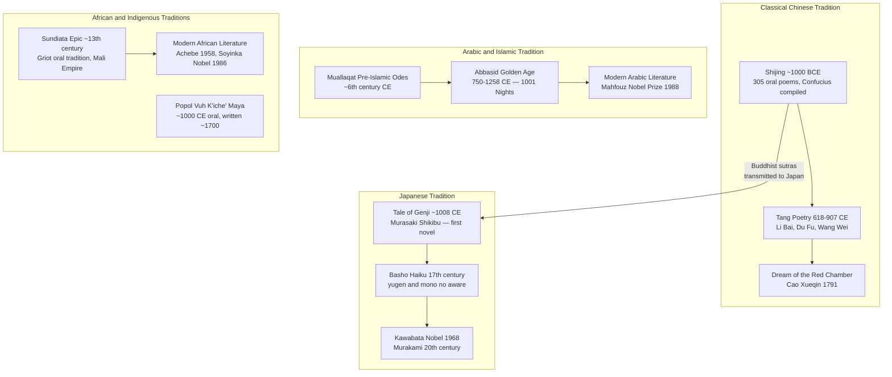

# Non-Western Literary Traditions

> [!abstract] TL;DR
> Non-Western literary traditions — Classical Chinese, Arabic and Islamic, Japanese, Sub-Saharan African, and Indigenous — collectively span more than three thousand years, encompass the world's first novel, its oldest poetry anthology, and the longest epic ever composed, yet they remain systematically marginalised by a Western canon that is a product of specific historical circumstances, not a universal standard; "World Literature" as a field (Goethe's *Weltliteratur*, Damrosch's circulation model) offers a framework for reading across traditions while confronting the translation asymmetries and power imbalances that determine whose stories travel and whose stay home.

---

## Intuition

**Analogy:** Imagine judging all the world's music by how closely it resembles European classical music — Bach, Mozart, Beethoven. Indian ragas, West African drumming, and Chinese opera would appear "underdeveloped" because they do not follow sonata form or twelve-tone harmony. Their extraordinary technical sophistication, their deep theoretical traditions, their centuries of refinement — all of it would become invisible the moment you applied the wrong measuring stick. That is precisely the error that 19th-century European literary scholarship committed when it declared Shakespeare, Dante, and Milton the universal standard of literary excellence and classified everything else as "folk literature," "pre-literature," or "ethnographic material."

The facts do not support the hierarchy. The *Shijing* (Book of Songs) predates Homer by two and a half centuries. *The Tale of Genji* — written by a woman in 11th-century Japan — is the world's first novel, produced six hundred years before Robinson Crusoe. The Mahabharata is seven times the combined length of the Iliad and Odyssey. The Abbasid translation movement in Baghdad (8th–10th century CE) preserved and transmitted Greek philosophy to Europe while Europe was in its early medieval period — Western learning quite literally passed through Arabic before returning as the Renaissance. The measuring stick was not universal; it was particular.

---

## How It Works



The diagram shows the internal evolution of each tradition over time and the single most consequential inter-tradition transmission in East Asia: the passage of Sanskrit Buddhist texts through Chinese translation into the heart of Japanese literary culture. Every major tradition has its own internal logic, its own theory of beauty, its own understanding of what literature is for. The Western canon's claim to universality is the claim that one of these tracks is the main line and all others are branch lines — a claim that the history of world literature does not support.

---

## Key Concepts

### Secondary Level

**Classical Chinese Literature**

The oldest extant anthology of poetry in the world is the *Shijing* (Book of Songs, c. 1000 BCE), 305 poems ranging from court hymns and ritual songs to love lyrics and agricultural complaints. Confucius is said to have compiled and edited it — he reportedly found 3,000 songs and kept 305 — because he believed literature's moral power depended on selection and form. The *Shijing*'s influence on all subsequent Chinese poetry is the equivalent of the Bible's influence on English prose: unavoidable, generative, and constantly alluded to.

The Tang Dynasty (618–907 CE) is the Golden Age of Chinese poetry. Three poets dominate:

- **Li Bai (Li Po, 701–762):** Romantic, exuberant, Daoist in spirit. Associated with wine, moonlight, immortal journeys, and the beauty of landscapes approached in a state of inspired disorder. His most celebrated poems are brief lyric explosions.
- **Du Fu (712–770):** Morally serious, politically engaged, considered by many Chinese critics the greatest poet in the tradition — the "sage of poetry." His work chronicles the devastation of the An Lushan Rebellion with a precision that has made him the Chinese poet most comparable to Dante in moral gravity and social scope.
- **Wang Wei (699–759):** Buddhist, quietist, associated with the landscape poem as a form of contemplation rather than description. His *Wang River Collection* treats the natural world as an invitation to meditative emptiness rather than aesthetic pleasure.

Classical Chinese verse is structured by strict tonal patterns. The *lüshi* (regulated verse) requires eight lines with fixed patterns of level and oblique tones, mandatory verbal parallelism in the middle couplets, and end-rhyme throughout. The *jueju* (truncated verse) is a four-line poem of equivalent strictness — the haiku's ancestor in density and compression. These are not loose requirements but iron constraints that force the poet to find the exact word whose tone, meaning, and image converge simultaneously.

The great novels came later. The Ming and Qing dynasties produced four canonical works: *Journey to the West* (Wu Cheng'en, c. 1592 — the Monkey King's pilgrimage to India for Buddhist scriptures), *Water Margin* (rebel heroes, comparable to Robin Hood at epic scale), *Romance of the Three Kingdoms* (historical war narrative), and *Dream of the Red Chamber* (Cao Xueqin, c. 1791). The last is in a different class entirely. A family saga set in the declining Jia household, it is simultaneously a Buddhist meditation on impermanence, a sociological portrait of Qing dynasty aristocratic life, a love story of aching delicacy, and a meta-narrative about a novel writing itself. It has generated its own scholarly industry (*Redology*) comparable in academic volume to Shakespeare studies. The 20th century produced Lu Xun (1881–1936), who in "Diary of a Madman" (1918) wrote the first modern Chinese short story in vernacular Chinese — a deliberate break from classical written language — and Mo Yan, who won the Nobel Prize in 2012.

---

**Arabic and Islamic Literary Traditions**

Before Islam, the Arabian Peninsula had a flourishing oral poetic tradition whose culminating achievement was the *Muʿallaqāt* — the Seven Hanging Odes, so called because legend holds they were written in gold lettering and hung on the Kaaba in Mecca as prize-winning compositions. These poems deploy the *qasida* form: a long, formally structured ode that moves through obligatory sections — the *nasib* (elegiac prelude at the abandoned campsite), the journey, and the *fakhr* (boast of personal or tribal virtues). The *qasida* is to Arabic literature what the ode is to English: the form through which the highest claims are made.

The Qurʾan (610–632 CE) is the supreme literary monument of the Arabic tradition, but it is categorically different from all other literature: Muslims consider it the direct speech of God, not a human composition, and its literary status is inseparable from its religious status. The concept of *iʿjāz* (inimitability) holds that the Qurʾan's style is beyond human replication — a theological claim with enormous literary consequences, because it established Classical Arabic as the language of transcendence and created a standard of linguistic perfection against which all subsequent Arabic writing measured itself.

The Abbasid Golden Age (Baghdad, 750–1258 CE) is one of the greatest periods of literary and intellectual production in human history. It produced *One Thousand and One Nights* (*Alf Layla wa-Layla*) — a frame narrative in which Scheherazade tells the caliph Shahryar stories every night to delay her execution. The frame is Persian (the story of the cuckolded king), and individual stories come from Indian, Persian, and Arab sources gathered over centuries. No "original" text exists; the work grew by accretion across several centuries. Its stories — Sinbad, Ali Baba, Aladdin — became some of the most widely translated narratives in world literature. The Abbasid period also produced al-Mutanabbī (915–965 CE), considered the greatest Arab poet: a court poet of staggering verbal virtuosity whose poems on pride, mortality, and the relationship between genius and power are still memorized across the Arab world.

Modern Arabic literature is inseparable from the colonial encounter. Naguib Mahfouz (1911–2006), the first Arab writer to win the Nobel Prize (1988), wrote the Cairo Trilogy — a three-novel saga following an Egyptian merchant family from 1917 to 1952 — that does for modern Cairo what Balzac's *Comédie Humaine* does for 19th-century Paris. Palestinian resistance literature (Mahmoud Darwish, Mourid Barghouti) constitutes one of the most vital bodies of political poetry produced anywhere in the 20th century.

---

**Japanese Literary Tradition**

*The Tale of Genji* (*Genji Monogatari*, c. 1008 CE) by Murasaki Shikibu is the world's first novel — a claim that requires explanation. The European novel is usually dated to the 18th century (Defoe, Richardson, Fielding). *Genji* precedes that by seven hundred years, is over a thousand pages long, develops psychological interiority with extraordinary subtlety, and was written by a woman serving as lady-in-waiting at the Heian imperial court. It follows the amorous life of Hikaru Genji, the emperor's son, and subsequently his descendants through the political and emotional world of court life. Its aesthetic is organized around *mono no aware* — "the pathos of things," the tender melancholy of transient beauty that is the emotional signature of Japanese court culture.

*The Pillow Book* (*Makura no Sōshi*, c. 1000 CE) by Sei Shōnagon, Murasaki Shikibu's contemporary and literary rival, established the *zuihitsu* (miscellany) form — a genre of personal essays, lists, observations, and anecdotes without narrative progression. The Pillow Book lists things that are "embarrassing," "elegant," "hateful" — it is a record of a highly cultivated sensibility encountering daily life.

Haiku (originally *hokku*) reached its highest form in Matsuo Bashō (1644–1694). The most famous poem in the Japanese language:

> *furuike ya*
> *kawazu tobikomu*
> *mizu no oto*

"The old pond — a frog jumps in, sound of water." This seventeen-syllable poem is not about the pond, the frog, or the water: it is about the momentary piercing of silence — an instant of perception that dissolves the boundary between the observer and what is observed. Haiku requires a *kigo* (season word that situates the poem in the cycle of the year) and a *kireji* (cutting word that creates a juxtaposition between two images). The aesthetic theory underlying haiku is *wabi-sabi* — the beauty of incompleteness, transience, and irregularity — alongside Bashō's concept of *sabi* (the beauty of solitude and age).

Modern Japanese literature includes Natsume Soseki (1867–1916, the father of the modern Japanese novel), Yasunari Kawabata (Nobel 1968 — *Snow Country*, *The Sound of the Mountain*), Yukio Mishima (the most internationally famous Japanese writer of the 20th century, whose work is consumed by beauty, violence, and cultural loss), and Haruki Murakami (b. 1949), who blends American postmodern fiction techniques with Japanese quietude and surrealism in works like *Norwegian Wood* and *Kafka on the Shore*.

---

**Sub-Saharan African Oral and Written Traditions**

The dominant Western misunderstanding of African literature is that it begins with colonialism and the introduction of the Roman alphabet. This is false in every direction. Sub-Saharan Africa has vast and sophisticated literary traditions — most of them oral but no less artistically serious for that.

The *griot* (French; *jeli* in Mande) is the hereditary praise-singer and oral historian of West Africa — a professional class who memorize and perform the dynastic histories, genealogies, and epic narratives of kingdoms spanning centuries. The *Sundiata* epic tells the founding story of the Mali Empire (13th century CE): Sundiata Keita, crippled from birth and exiled, returns to defeat the sorcerer-king Sumanguru Kanté and establish the most powerful empire in medieval West Africa. It was performed orally by griots for centuries before being written down in the 20th century. The Yoruba *Ifá* divination corpus — a system of 256 chapters each containing hundreds of verses used in divination — was recognized by UNESCO as Intangible Cultural Heritage in 2005. It is one of the most complex oral text systems ever documented.

Sub-Saharan Africa also had written literary traditions before colonialism. The Swahili coast (East Africa) had a classical poetry tradition in Arabic script (*utendi*) from at least the 17th century; the Ge'ez literary tradition in Ethiopia stretches back to the 4th century CE; Timbuktu's libraries held hundreds of thousands of Arabic-script manuscripts.

Modern African literature in European languages is simultaneously literature and political act. Chinua Achebe's *Things Fall Apart* (1958) — the most-read African novel — tells the story of Okonkwo, an Igbo man in colonial Nigeria, from the inside: it refuses the colonialist framing of African life as chaos waiting for European order. Achebe wrote it explicitly as a response to Conrad's *Heart of Darkness*. Wole Soyinka (Nobel 1986) brings Yoruba mythological structures (particularly the deity Ogun, god of iron and creativity) into modernist drama. Ngũgĩ wa Thiong'o (Kenya) made the most radical decolonial literary move: abandoning English entirely to write in Gikuyu, his mother tongue, arguing that writing in the colonizer's language is itself an act of cultural dispossession.

---

**Indigenous Literary Traditions**

The *Popol Vuh* is the K'iche' Maya creation epic — the story of the creation of the world, the hero twins Hunahpu and Xbalanque, and the final creation of the first human beings from maize. It was composed orally over many centuries; the written version in the Roman alphabet dates from around 1700 CE, produced shortly after the Spanish conquest as an act of cultural preservation. The Australian Aboriginal Dreamtime narratives — the cosmological stories that map the land, establish social law, and connect the living to the ancestors — are among the oldest continuous oral traditions on earth, with some songs encoding geographic and geological events (sea level changes after the last ice age) that are thousands of years old.

The challenge of Indigenous literary traditions is not the quality of the texts — it is the question of what "text" means when the literature exists as performance, landscape, body, and ceremony rather than as written document. The "salvage paradigm" of early 20th-century anthropology — the rush to transcribe oral traditions before they "disappeared" — produced important records but also stripped performance from context, imposed Western genre categories (myth, legend, folktale), and treated living traditions as dying artifacts.

Contemporary Indigenous writers — Louise Erdrich (Ojibwe, *Love Medicine*), Tommy Orange (Cheyenne and Arapaho, *There There*), Kim Scott and Alexis Wright (Aboriginal Australian) — are creating literary work that refuses this framing: they write in English but on their own terms, using Western novelistic forms as vehicles for Indigenous epistemologies and political claims that those forms were never designed to carry.

---

### Undergraduate Level

**The Concept of World Literature: Goethe to Damrosch**

The idea of *Weltliteratur* originates with Goethe (1827): "National literature is now rather an unmeaning term; the epoch of World Literature is at hand, and every one must strive to hasten its approach." Goethe was reading Chinese and Serbian poetry in translation and recognized that great literature was not the property of any single nation. His concept was prescriptive and optimistic: literature should circulate freely across national boundaries.

David Damrosch (2003) gives the concept a more precise, empirically grounded definition: world literature is "all literary works that circulate beyond their culture of origin, whether in translation or in their original language." This definition is descriptive rather than evaluative — it does not claim these texts are intrinsically superior, only that they have achieved circulation. Importantly, it draws attention to the *mechanisms* of circulation: translation, publishing markets, prize culture, curriculum design, the interests of dominant nations. A text enters world literature not because it is great but because someone with the resources and motivation to translate and distribute it decides it is worth circulating.

This focus on circulation reveals an uncomfortable asymmetry. Pascale Casanova (*The World Republic of Letters*, 1999) argues that the global literary field is organized around a center (Paris historically, now supplemented by London and New York) and a periphery. Texts from the periphery must be "consecrated" by recognition in the center before they achieve world literary status — Mahfouz needed the Nobel, Murakami needed translation into English, Achebe needed critical adoption by Western universities. The asymmetry is not only about which texts get translated; it is about who does the evaluating.

Franco Moretti's provocative essay "Conjectures on World Literature" (2000) pushes this further: because no single scholar can read the literature of all languages and periods, world literary study must rely on *distant reading* — statistical analysis of large corpora rather than close reading of individual texts. His "one literature" thesis argues that there is actually a world literary system governed by a single logic (following Wallerstein's world-systems theory), in which the novel form was exported from Western Europe and the periphery adapted it to local conditions — producing what he calls "formal compromise." The thesis is controversial but productive: it shifts attention from the intrinsic qualities of individual texts to the structural conditions that determine which forms become globally dominant.

---

**The Politics of Translation: Venuti, Spivak, and the 3% Problem**

Lawrence Venuti documents what he calls the "translation scandal": roughly 3% of books published annually in the United States and United Kingdom are translations, compared to 25–40% in most European non-English-speaking countries and far higher proportions in countries like China and Japan. English-language readers are uniquely insulated from the literature of the rest of the world — not by lack of quality but by market structure, publishing incentives, and a monolingual habit reinforced by cultural dominance.

Venuti's theoretical contribution is the distinction between *domestication* (translating a text so it reads fluently in the target language, effacing its foreignness) and *foreignization* (translating a text so it retains some of its cultural and linguistic strangeness, making the reader conscious of encountering a different world). Domestication is commercially safer and critically preferred in the Anglophone market; foreignization is politically necessary if translation is to genuinely expand a reader's world rather than assimilate the foreign text into familiar expectations.

Gayatri Chakravorty Spivak's essay "The Politics of Translation" (1993) takes the argument further: translating a woman's text from a Third World language into English is a political act that can reproduce colonial power relations if the translator does not attend to the *rhetorical* register of the original — the particular relationship between speaker, language, and community that makes the text mean what it means. "The task of the feminist translator is to consider language as a clue to the workings of gendered agency."

---

**Writing in the Colonizer's Language vs. Writing in the Indigenous Tongue**

The sharpest debate in postcolonial literary theory concerns the medium of writing itself. For African and other post-colonial writers, the decision of which language to write in is unavoidably political.

Chinua Achebe argued for using English but transforming it: "The African writer should aim to use English in a way that brings out his message best without altering the language to the extent that its value as a medium of international exchange will be lost... He should aim at fashioning out an English which is at once universal and able to carry his particular experience." Achebe's solution is a distinctively African English — one inflected with Igbo proverbs, speech rhythms, and conceptual structures.

Ngũgĩ wa Thiong'o's counter-argument is uncompromising: "Language, any language, has a dual character: it is both a means of communication and a carrier of culture." To write in the colonizer's language is to reproduce colonial epistemic structures, to address oneself to the colonizer rather than to one's own people, and to participate in the devaluation of indigenous languages. After writing several novels in English, Ngũgĩ stopped and has written in Gikuyu since *Devil on the Cross* (1980). The debate is not resolved and cannot be: both positions respond to real constraints, and the best answer depends on who the writer is, what community they serve, and what political purposes their writing is meant to achieve.

---

**The Aesthetics of Non-Western Literary Traditions**

Each major tradition has developed sophisticated aesthetic theory that operates entirely outside the categories inherited from Aristotle and Horace.

| Tradition | Core Aesthetic Concept | Meaning |
|-----------|------------------------|---------|
| Classical Chinese | *yijing* | The "realm beyond the image" — the resonance that a poem creates beyond its stated content |
| Japanese | *mono no aware* | The pathos of things — tender, bittersweet awareness of impermanence |
| Japanese | *yūgen* | Mystery and grace — the profound, shadowy beauty of what is only partially revealed |
| Japanese | *wabi-sabi* | Beauty in incompleteness, transience, and irregularity |
| Sanskrit | *rasa* | The aesthetic "flavor" or emotional essence that a work distills in the reader (eight rasas: love, humor, sorrow, anger, heroism, fear, disgust, wonder) |
| Arabic | *iʿjāz* | The inimitability of the Qurʾan — a standard of perfection that shaped all Arabic stylistics |
| Yoruba | *àṣà* | Tradition and cultural identity as the ground of artistic meaning |

The Sanskrit *rasa* theory (Bharata's *Nāṭyaśāstra*, c. 200 BCE–200 CE) is the most systematic aesthetic philosophy produced outside the Western tradition: a complete account of how dramatic and poetic art produces emotional experience in the audience, why some emotions are aesthetically appropriate and others are not, and what the relationship is between the depicted emotion and the audience's feeling. It anticipates by centuries Aristotle's *Poetics* on catharsis and Hume on the "standard of taste."

---

### Graduate Level

**Pascale Casanova's World Republic of Letters and Its Critics**

Casanova's argument (*La République mondiale des lettres*, 1999) uses the sociology of Pierre Bourdieu's field theory applied globally. The international literary field has a center (literary Paris, which functions as the capital of world literature not because French literature is intrinsically superior but because of accumulated historical capital — the prestige of the Enlightenment, the French novel, the Prix Nobel, and the publishing infrastructure of Paris as a global crossroads). Writers from the periphery face a structural choice: write in ways legible to the center (and risk cultural assimilation) or refuse legibility (and risk invisibility).

Critics have challenged the model on several grounds:
- It underestimates the role of English and New York in displacing Paris as the center since 1945
- It is Eurocentric in identifying world literature with the novel — a form that originated in Western Europe — and neglecting poetry, oral traditions, and non-narrative genres that remain dominant in many traditions
- It treats writers as strategic agents responding to structural position, which may capture academic and prize-seeking writers but misrepresents those writing primarily for local communities
- Emily Apter's *Against World Literature* (2013) argues that the very concept of "world literature" as a coherent field elides what she calls "untranslatables" — concepts so culturally specific that they cannot circulate without fundamental transformation. Barbara Cassin's *Dictionary of Untranslatables* (2004) catalogs philosophical terms (German *Dasein*, Greek *logos*, Arabic *umma*) that generate meaning precisely through their untranslatability.

---

**Oral Literature as Literature: Karin Barber and the Theory of Texts**

The placement of oral traditions within world literary history requires challenging the equation of "literature" with "written text." Karin Barber's *The Anthropology of Texts, Persons and Publics* (2007) argues that oral texts are not simply performances — they are *texts* in the full sense, stable enough to be quoted, alluded to, analyzed, and argued with, even without inscription. What makes a text is not its medium but its relationship to a community: the capacity to be detached from any particular instance of performance, circulated, and received as an authoritative version.

This framework dissolves the supposed boundary between oral and written literature. The Homeric poems were oral texts for centuries before being written down and lost nothing of their literary status. The Sundiata epic, the Ifá corpus, and the Dreamtime narratives are texts in Barber's sense — they have authorized versions (even when performed variants exist), they accumulate interpretive tradition, and they function as reference points for a community's self-understanding. The problem is not that they are not texts; it is that scholarship built on the assumption that texts are written by definition has developed no adequate methodology for studying them.

Ruth Finnegan's *Oral Poetry* (1977) established the foundational empirical survey of African, Pacific, and other oral literary traditions, demonstrating both the sheer variety of forms and the inadequacy of the Western romantic view of oral literature as spontaneous, communal, and pre-artistic. Oral poets are skilled technicians operating within strict formal conventions; composition is neither improvised nor memorized in the Western sense but generative — producing new instances from internalized formal grammars, exactly as Parry and Lord found for Homer.

---

**Edward Said's Orientalism and Its Literary Consequences**

Said's *Orientalism* (1978) argues that European representations of "the Orient" (the Middle East, South Asia, East Asia) constitute a discourse — a system of knowledge production — that is inseparable from colonial power. "The Orient" as Western literary imagination conceived it (sensual, despotic, timeless, irrational, feminine) is not a description of real places and peoples but a construction that legitimized European domination by presenting Oriental societies as incapable of self-governance.

The literary consequences are enormous. Western "translations" and adaptations of Arabic literature (Antoine Galland's *Thousand and One Nights*, 1704) were not neutral acts of cultural transmission; they selected, bowdlerized, exoticized, and reframed texts for European audiences in ways that produced the "Orient" as a fantasy of voluptuous otherness rather than a living culture. Galland added stories that did not exist in the Arabic manuscripts; his version became the canonical "Arabian Nights" in Europe, and subsequent translators often translated Galland rather than the Arabic. The texts that constitute "world literature" in the Western curriculum are already deeply shaped by Orientalist selection and translation practices.

Said's critique does not resolve into a simple prescription. He is not arguing that Western scholars cannot study non-Western literature; he is arguing that they cannot do so innocently, without accounting for the power relations that structure the encounter. The "hermeneutics of suspicion" he introduces requires asking, for any act of cross-cultural literary study: who is speaking, for whom, with what institutional authority, and with what effects on the communities whose literatures are being interpreted?

---

**The Question of Periodization and Literary Modernity**

Western literary historiography organizes time through a sequence — Ancient, Medieval, Renaissance, Enlightenment, Romantic, Modern, Postmodern — that is meaningless when applied to Chinese, Arabic, or Japanese literature. Each tradition has its own periodization, its own sense of what constitutes an epoch and what forces create literary change.

Chinese literary historiography organizes by dynasty; the Tang-Song transition marks a major shift comparable to the Renaissance in European terms. The introduction of printing in the Song dynasty (10th century CE, five centuries before Gutenberg) transformed the circulation and composition of Chinese poetry in ways that parallel print culture's effects on European literature — but five centuries earlier. Arabic literary history periodizes by pre-Islamic, early Islamic, Abbasid, and modern, with the Abbasid-to-modern transition driven by the encounter with European colonialism in the 19th century rather than by internal forces. Japanese modernity (*Meiji Restoration*, 1868) was a deliberate act of state-directed Westernization that transformed Japanese literature by introducing the Western novel as a model — creating a fascinating case where Westernization was both coerced and voluntary, and where Japanese writers like Natsume Soseki simultaneously mastered Western forms and produced their most interesting work by registering the psychological cost of that mastery.

The "alternative modernity" thesis — associated with scholars like Dipesh Chakrabarty (*Provincializing Europe*, 2000) — argues that modernity is not a single condition that all societies either achieve or fail to achieve; it is multiple, and each modernity must be understood from within its own trajectory rather than measured against a European norm. The "first novel" question (is *Genji* a novel?) is a symptom of this problem: if "novel" means "what arose in 18th-century England," then *Genji* is not a novel. If "novel" means "a long prose narrative organized around the psychological development of characters in a social world," then *Genji* is a novel by any criterion that matters — and it precedes Defoe by seven centuries.

---

## Python Demo

Simulate the World Literature translation network — 12 literary traditions as nodes, directed translation edges, node sizes proportional to production volume, edge thickness to translation weight. Compute global influence (outflow: how much you export) vs. global reception (inflow: how much you import), then visualize the Western–Non-Western asymmetry.

```python
import numpy as np
import matplotlib.pyplot as plt
import matplotlib.patches as mpatches
import matplotlib.gridspec as gridspec

np.random.seed(42)

# ─────────────────────────────────────────────────────────────────────────────
# DATA
# ─────────────────────────────────────────────────────────────────────────────
TRADITIONS = [
    "Chinese", "Arabic", "Sanskrit", "Japanese", "Persian",
    "Greek",   "Latin",  "French",  "English",  "Swahili", "Yoruba", "Hebrew"
]
N = len(TRADITIONS)

# Relative cumulative production score (500 BCE – 1900 CE, scale 1–10)
PRODUCTION = np.array([10, 9, 9, 7, 8, 6, 6, 7, 8, 3, 2, 5], dtype=float)

# Western = Greek, Latin, French, English
IS_WESTERN = [False, False, False, False, False,
              True,  True,  True,  True, False, False, False]

# Directed translation edges: (source_idx, target_idx, weight)
# source's works were translated into / received by the target tradition
EDGES = [
    (5, 6, 9),  # Greek → Latin (classical world)
    (5, 1, 8),  # Greek → Arabic (Abbasid translation movement 800–1000 CE)
    (2, 1, 6),  # Sanskrit → Arabic (Panchatantra → Kalila wa-Dimna; numerals)
    (2, 4, 6),  # Sanskrit → Persian (court literature)
    (2, 0, 7),  # Sanskrit → Chinese (Buddhist sutras — enormous transmission)
    (1, 6, 7),  # Arabic → Latin (12th-c. Renaissance: Averroes, Avicenna)
    (1, 4, 7),  # Arabic → Persian (Abbasid cultural hegemony)
    (1, 11, 5), # Arabic → Hebrew (Judeo-Arabic: Maimonides, Ibn Gabirol)
    (4, 1, 5),  # Persian → Arabic (Sassanid court culture)
    (4, 0, 3),  # Persian → Chinese (Silk Road diplomatic exchange)
    (0, 3, 8),  # Chinese → Japanese (classical Chinese as literary medium)
    (11, 6, 7), # Hebrew → Latin (Jerome's Vulgate)
    (6, 7, 7),  # Latin → French (medieval scholasticism)
    (6, 8, 6),  # Latin → English (Elizabethan humanism, KJV Bible)
    (7, 8, 6),  # French → English (Norman Conquest; literary exchange)
    (8, 7, 5),  # English → French (Shakespeare; 19th-c. exchange)
    (8, 0, 9),  # English → Chinese (post-1900: massive 20th-c. translation)
    (8, 3, 9),  # English → Japanese (Meiji modernisation; post-WWII)
    (8, 1, 7),  # English → Arabic (20th-c. translation surge)
    (8, 2, 4),  # English → Sanskrit (Orientalists: Jones, Monier-Williams)
    (8, 9, 3),  # English → Swahili (colonial mission translations)
    (8, 10, 3), # English → Yoruba (colonial Bible; Soyinka's reception)
    (8, 4, 4),  # English → Persian (FitzGerald's Rubaiyat reversed the flow)
    (3, 8, 5),  # Japanese → English (Kawabata, Mishima, Murakami)
    (0, 8, 4),  # Chinese → English (Mo Yan, Lu Xun translations)
    (1, 8, 5),  # Arabic → English (Mahfouz, 1001 Nights)
    (11, 8, 4), # Hebrew → English (Israeli literature)
    (9, 1, 3),  # Swahili → Arabic (Indian Ocean trade; medieval poetry)
    (10, 8, 2), # Yoruba → English (Soyinka Nobel; Ifa oral corpus)
    (1, 7, 4),  # Arabic → French (Orientalism; Andalusian influence)
    (2, 8, 3),  # Sanskrit → English (Jones, Shakuntala translation 1789)
    (4, 7, 4),  # Persian → French (Montesquieu's Persian Letters, 1721)
    (4, 8, 3),  # Persian → English (FitzGerald's Rubaiyat, 1859)
]

# Compute outflow (global influence) and inflow (global reception)
outflow = np.zeros(N)
inflow  = np.zeros(N)
for src, tgt, w in EDGES:
    outflow[src] += w
    inflow[tgt]  += w

# Translation flow by category
w2nw  = sum(w for s, t, w in EDGES if IS_WESTERN[s]     and not IS_WESTERN[t])
nw2w  = sum(w for s, t, w in EDGES if not IS_WESTERN[s] and IS_WESTERN[t])
w2w   = sum(w for s, t, w in EDGES if IS_WESTERN[s]     and IS_WESTERN[t])
nw2nw = sum(w for s, t, w in EDGES if not IS_WESTERN[s] and not IS_WESTERN[t])

# ─────────────────────────────────────────────────────────────────────────────
# LAYOUT: circular node positions
# ─────────────────────────────────────────────────────────────────────────────
angles = np.linspace(0, 2 * np.pi, N, endpoint=False) - np.pi / 2
R = 3.2
pos    = np.column_stack([R * np.cos(angles), R * np.sin(angles)])
NODE_R = 0.10 + 0.24 * (PRODUCTION / PRODUCTION.max())  # radii in data units
NODE_COLORS = ['#4a90d9' if IS_WESTERN[i] else '#e8924a' for i in range(N)]

# ─────────────────────────────────────────────────────────────────────────────
# FIGURE
# ─────────────────────────────────────────────────────────────────────────────
fig = plt.figure(figsize=(18, 11), facecolor='#12121f')
gs  = gridspec.GridSpec(2, 2, figure=fig, width_ratios=[1.55, 1],
                        hspace=0.5, wspace=0.32)

ax_net  = fig.add_subplot(gs[:, 0])
ax_bar  = fig.add_subplot(gs[0, 1])
ax_asym = fig.add_subplot(gs[1, 1])

for ax in [ax_net, ax_bar, ax_asym]:
    ax.set_facecolor('#1e1e35')

# ── Panel 1: Network diagram ──────────────────────────────────────────────────
ax_net.set_aspect('equal')
ax_net.axis('off')
ax_net.set_title('World Literature Translation Network  (500 BCE – 1900 CE)',
                 color='white', fontsize=13, fontweight='bold', pad=10)

max_w = max(w for _, _, w in EDGES)
for src, tgt, w in EDGES:
    p1, p2   = pos[src], pos[tgt]
    dx, dy   = p2 - p1
    dist     = max(np.hypot(dx, dy), 1e-9)
    r1, r2   = NODE_R[src], NODE_R[tgt]
    t1, t2   = r1 / dist, 1.0 - r2 / dist
    if t2 <= t1:
        continue
    x1s = p1[0] + t1 * dx;  y1s = p1[1] + t1 * dy
    x2s = p1[0] + t2 * dx;  y2s = p1[1] + t2 * dy
    lw    = 0.4 + 3.8 * w / max_w
    alpha = 0.12 + 0.70 * w / max_w
    ec = '#4a90d9' if IS_WESTERN[src] else '#e8924a'
    ax_net.annotate('', xy=(x2s, y2s), xytext=(x1s, y1s),
                    arrowprops=dict(arrowstyle='->',
                                   color=ec, lw=lw, alpha=alpha,
                                   connectionstyle='arc3,rad=0.12'))

for i in range(N):
    circ = plt.Circle(pos[i], NODE_R[i], color=NODE_COLORS[i],
                      zorder=5, alpha=0.92, linewidth=1.5, edgecolor='white')
    ax_net.add_patch(circ)
    lx = (R + 0.52) * np.cos(angles[i])
    ly = (R + 0.52) * np.sin(angles[i])
    ax_net.text(lx, ly, TRADITIONS[i], ha='center', va='center',
                fontsize=8.5, color='white', fontweight='bold', zorder=6)
    ax_net.text(pos[i][0], pos[i][1], f"{PRODUCTION[i]:.0f}",
                ha='center', va='center', fontsize=7.5,
                color='white', fontweight='bold', zorder=7)

ax_net.set_xlim(-R - 1.3, R + 1.3)
ax_net.set_ylim(-R - 1.3, R + 1.3)
ax_net.legend(handles=[
    mpatches.Patch(color='#4a90d9', label='Western traditions'),
    mpatches.Patch(color='#e8924a', label='Non-Western traditions'),
], loc='lower center', framealpha=0.3, labelcolor='white',
   fontsize=9, facecolor='#1e1e35', edgecolor='#888')
ax_net.text(0, -R - 1.1,
            'Node size and number inside = production score (1–10)  '
            '|  Arrow thickness = translation weight',
            ha='center', va='top', fontsize=7.5, color='#aaa', style='italic')

# ── Panel 2: Outflow vs Inflow bar chart ──────────────────────────────────────
x   = np.arange(N)
bw  = 0.38
col = ['#4a90d9' if IS_WESTERN[i] else '#e8924a' for i in range(N)]
ax_bar.bar(x - bw/2, outflow, bw, color=col, alpha=0.88,
           label='Global influence (outflow)')
ax_bar.bar(x + bw/2, inflow,  bw, color=col, alpha=0.42, hatch='//',
           label='Global reception (inflow)', edgecolor='white', linewidth=0.6)
ax_bar.set_xticks(x)
ax_bar.set_xticklabels(TRADITIONS, rotation=45, ha='right',
                       color='white', fontsize=7.5)
ax_bar.set_ylabel('Weighted translation volume', color='white', fontsize=8.5)
ax_bar.set_title('Global Influence vs. Reception\nby Tradition',
                 color='white', fontsize=10, fontweight='bold')
ax_bar.tick_params(colors='white')
ax_bar.tick_params(axis='y', colors='white')
ax_bar.spines['bottom'].set_color('#555')
ax_bar.spines['left'].set_color('#555')
ax_bar.spines['top'].set_visible(False)
ax_bar.spines['right'].set_visible(False)
ax_bar.legend(framealpha=0.3, labelcolor='white', fontsize=7.5,
              facecolor='#1e1e35', edgecolor='#888', loc='upper left')
# Annotate English hegemony
eng = TRADITIONS.index("English")
ax_bar.axvline(x=eng, color='#ffdd44', alpha=0.18, linewidth=14, zorder=0)
ax_bar.text(eng + 0.02, outflow.max() * 0.88, 'Modern\nhegemony',
            ha='left', va='top', color='#ffdd44', fontsize=7, style='italic')

# ── Panel 3: Translation asymmetry ───────────────────────────────────────────
cats  = ['West→\nNon-West', 'Non-West\n→West', 'West→\nWest', 'Non-West→\nNon-West']
vals  = [w2nw, nw2w, w2w, nw2nw]
bcols = ['#4a90d9', '#e8924a', '#6ab0e8', '#f0b870']
bars_a = ax_asym.bar(cats, vals, color=bcols, alpha=0.88,
                     edgecolor='white', linewidth=0.8)
ax_asym.set_title('Translation Flow Asymmetry\n(Aggregate Weighted Volume)',
                  color='white', fontsize=10, fontweight='bold')
ax_asym.set_ylabel('Total weighted volume', color='white', fontsize=8.5)
ax_asym.tick_params(colors='white')
ax_asym.tick_params(axis='y', colors='white')
ax_asym.spines['bottom'].set_color('#555')
ax_asym.spines['left'].set_color('#555')
ax_asym.spines['top'].set_visible(False)
ax_asym.spines['right'].set_visible(False)
ax_asym.set_xticklabels(cats, color='white', fontsize=8.5)
for bar, val in zip(bars_a, vals):
    ax_asym.text(bar.get_x() + bar.get_width() / 2,
                 bar.get_height() + 0.5, str(val),
                 ha='center', va='bottom', color='white', fontsize=9,
                 fontweight='bold')
ratio_label = f'W→NW / NW→W ratio: {w2nw/nw2w:.2f}×'
ax_asym.text(0.5, 0.05, ratio_label, ha='center', va='bottom',
             transform=ax_asym.transAxes,
             color='#ffdd44', fontsize=8, style='italic')

fig.suptitle(
    'World Literature Network — Production Volumes & Translation Asymmetries\n'
    'Chinese · Arabic · Sanskrit · Japanese · Persian · '
    'Greek · Latin · French · English · Swahili · Yoruba · Hebrew',
    color='white', fontsize=10.5, fontweight='bold'
)
plt.savefig('world_literature_network.png', dpi=150,
            bbox_inches='tight', facecolor='#12121f')
plt.show()

# ── Summary statistics ─────────────────────────────────────────────────────────
print(f"\n{'Tradition':<12} {'Prod':>5} {'Outflow':>8} {'Inflow':>8} "
      f"{'O/I':>7}  W?")
print("─" * 50)
for i, name in enumerate(TRADITIONS):
    ratio = outflow[i] / inflow[i] if inflow[i] > 0 else float('inf')
    w_str = 'Yes' if IS_WESTERN[i] else 'No'
    ratio_str = f"{ratio:.2f}" if ratio != float('inf') else "  ∞"
    print(f"{name:<12} {PRODUCTION[i]:>5.0f} {outflow[i]:>8.0f} "
          f"{inflow[i]:>8.0f} {ratio_str:>7}  {w_str}")

print(f"\nTranslation breakdown:")
print(f"  Western → Non-Western:     {w2nw:3d}")
print(f"  Non-Western → Western:     {nw2w:3d}")
print(f"  Western → Western:         {w2w:3d}")
print(f"  Non-Western → Non-Western: {nw2nw:3d}")
print(f"  Modern hegemony W→NW / NW→W: {w2nw / nw2w:.2f}×")
```

**What the output reveals:**
- **English** shows the most extreme outflow/inflow asymmetry: its outflow (exporting to Chinese, Japanese, Arabic, Persian, Swahili, Yoruba) far exceeds its inflow (translations from non-Western traditions) — the quantitative signature of linguistic hegemony.
- **Arabic** has the most historically interesting outflow pattern: high in the medieval period (transmitting Greek, Sanskrit, and native Arabic texts into Latin, Persian, and Hebrew) but relatively low inflow, reflecting the Abbasid period as the world's intellectual clearing-house.
- **Chinese** has the highest production score but historically low outflow outside East Asia — a massive literary tradition whose world circulation remained limited until the 20th century, a direct consequence of the difficulty of Chinese translation.
- The **West→Non-West / Non-West→West ratio** quantifies the "3% problem" in global terms: Western traditions export to non-Western traditions at a much higher rate than they receive in return.

---

## Real-World Applications

**The Nobel Prize as World Literature's Consecration Machine**

The Nobel Prize in Literature has awarded non-Western writers with increasing frequency: Rabindranath Tagore (India, 1913), Kawabata (Japan, 1968), Soyinka (Nigeria, 1986), Mahfouz (Egypt, 1988), Kenzaburō Ōe (Japan, 1994), Gao Xingjian (China, 2000), Orhan Pamuk (Turkey, 2006), Mo Yan (China, 2012), Patrick Modiano aside, Olga Tokarczuk (Poland, 2018), Abdulrazak Gurnah (Tanzania/UK, 2021). Each award generates a wave of translation and global readership for an author who may have been celebrated nationally for decades. The prize is a machine for translating literary capital from local to global — and its selection patterns reveal which non-Western traditions the Swedish Academy regards as having achieved world literary status.

**Publishing Industry and the Translation Infrastructure**

The translation asymmetry documented in the Python demo has direct commercial consequences. Independent publishers in the United States and UK who specialize in world literature in translation — Archipelago Books, Restless Books, And Other Stories, Tilted Axis Press — operate on limited margins precisely because the market for translated literary fiction is thin and culturally undervalued. Amazon's KDP and the e-book revolution have lowered barriers to publication but not to translation, which requires human skill and is expensive. Machine translation has improved dramatically for major language pairs but remains unreliable for literary translation where register, rhythm, and cultural context are central.

**Decolonizing the Curriculum: Universities and What Gets Taught**

The debate about "decolonizing the curriculum" that has swept Anglo-American universities since 2015 is in large part a debate about non-Western literary traditions. Which texts are assigned in comparative literature courses? Which are treated as "literature" and which as "cultural documents"? The University of Cape Town's Rhodes Must Fall movement (2015) made the curriculum question central; the SOAS "Decolonising SOAS" campaign published reading lists replacing Western canonical texts with African, Asian, and Indigenous alternatives. These are not merely academic disputes; they determine which students see their own traditions reflected in the prestige of university education and which do not.

**Translation as Cultural Diplomacy**

State-funded translation programs are a major instrument of cultural soft power. China's "Panda Book" program and the China International Publishing Group (CIPG) fund translations of Chinese literature into global languages as part of the Belt and Road initiative's cultural component. The US State Department funds translation of American literature through the Bureau of Educational and Cultural Affairs. Japan's Japan Foundation operates extensive translation and library programs worldwide. These programs both reflect and shape the world literary map — determining which texts from each tradition are available to global readers and under which framing.

---

## Common Pitfalls

- **Treating "non-Western" as a coherent category** — Classical Chinese poetry, West African oral tradition, Japanese court fiction, and K'iche' Maya creation mythology have nothing inherently in common other than not originating in Western Europe. They are profoundly different traditions with different forms, values, histories, and cultural logics. Grouping them together as "non-Western" makes sense only as a corrective to the implicit Western default — never as an analytical category that implies homogeneity.

- **Reading non-Western texts through Western generic expectations** — Asking whether the Mahabharata is a "novel" or whether haiku is "lyric poetry" imports Western genre categories that were developed for different traditions. Each tradition has its own genre system, its own theory of what constitutes major vs. minor forms, its own expectations for how a text should begin, develop, and conclude. The rasa theory, the qasida form, the ci lyric, the zuihitsu — these are not underdeveloped versions of Western forms; they are fully developed alternatives.

- **Conflating oral with simple** — The sophistication of oral literary traditions — the formal constraints of the *qasida*, the mnemonic architecture of the Ifá corpus, the geological accuracy encoded in Aboriginal Dreamtime songs — is comparable to the sophistication of written traditions. The difference is medium and transmission mechanism, not complexity or artistic achievement. The assumption that oral = primitive is one of the most damaging legacies of 19th-century literary scholarship.

- **Ignoring the history of mutual influence** — Non-Western traditions are not hermetically sealed. The Arabic translation movement transmitted Greek, Sanskrit, and Persian texts; Buddhism carried Sanskrit texts across Central Asia, China, Korea, and Japan; Swahili literature emerged from the meeting of Bantu oral traditions with Arabic literary culture and the Islamic religious world. Presenting each tradition as isolated and self-contained misrepresents both their internal dynamics and their role in world literary history.

- **Privileging written texts and neglecting performance** — The move to write down oral texts (griots' performances, Aboriginal songlines, Native American ceremonial poetry) always involves loss: loss of the sonic dimension, the performer's body, the audience's response, the occasion's social meaning. The written transcription is not the text; it is one crystallization of a performance tradition. Treating the transcription as definitive repeats the Romantic fallacy that oral literature is a degraded version of writing rather than a different medium with its own affordances.

- **The Nobel Prize as a complete world literary map** — Nobel awards generate translation, and translation generates readership, but the Nobel's selection history reflects the tastes of a Swedish committee shaped by particular literary values. Entire traditions — Classical Chinese poetry, Persian lyric, Yoruba oral literature, Sanskrit epic — will never produce Nobel laureates because they do not produce the kind of individual authorial reputation that the prize rewards. The map of Nobel-translated world literature is not the map of world literature.

---

## Related Concepts

- [[Ancient_Literature_and_Epic]] — the foundational note on Gilgamesh, Homer, the Mahabharata, and Virgil; the Sanskrit epics covered there (Mahabharata, Ramayana, Bhagavad Gita) are the earliest stratum of the world literary traditions surveyed here, and the oral-formulaic theory (Parry-Lord) applies directly to the African griot tradition and the oral phases of the Arabic qasida

- [[Literary_Theory_Overview]] — the postcolonial theory strand (Said's Orientalism, Spivak's subaltern studies, Bhabha's hybridity) and the question of the Western canon (Bloom vs. Guillory) provide the theoretical vocabulary for the debates surveyed in the Undergraduate section here; world literature studies operates within the larger frame of literary theory's interrogation of value and canon

- [[Oral_Tradition_and_Narrative]] — the anthropological theory of oral performance (Parry-Lord, Propp's morphology, Ong's secondary orality) is the primary analytical toolkit for the West African griot tradition, the Indigenous traditions, and the oral phases of every major literary tradition surveyed here; Karin Barber's theory of texts as detachable from performance is the key theoretical bridge

- [[Colonialism_and_Postcolonial_Anthropology]] — Said's Orientalism (surveyed in the Graduate section) is a foundational text in both postcolonial anthropology and world literature studies; the Ngugi/Achebe debate about writing in colonial vs. indigenous languages maps directly onto anthropology's debates about representation, voice, and whose knowledge counts

- [[Language_Families_and_Classification]] — the linguistic context of each tradition (Sino-Tibetan for Chinese, Afro-Asiatic for Arabic and Hebrew, Japonic for Japanese, Niger-Congo for Yoruba and Swahili, Mayan for K'iche') shapes the formal possibilities of each tradition's literature; tonal languages produce different poetic constraints than non-tonal ones; agglutinative languages produce different metrical possibilities than isolating ones

- [[Translation_and_Interpretation]] — the 3% problem (Venuti), the domestication/foreignization debate, Spivak on the politics of translation, and neural machine translation's failures on literary register are all covered there; translation theory is the practical engine of world literature studies — you cannot have world literature without translation, and translation always involves the political choices surveyed in the Undergraduate section

- [[Language_Identity_and_Power]] — Ngũgĩ's decision to write in Gikuyu, the language policy debates in postcolonial African states about official language and literary medium, and the question of whether writing in English reproduces or subverts colonial power all connect to the sociolinguistic analysis of how language embeds social hierarchy

- [[Writing_Systems_and_Literacy]] — Classical Chinese poetry is inseparable from the visual properties of Chinese characters (a character poem is also a visual composition); Arabic calligraphy is the highest visual art of the Islamic world and inseparable from its literary culture; the shift from Arabic script to Roman script in Swahili (early 20th century) represents a colonial transformation of the literary medium itself

---

## Review Questions

### Secondary

1. The Tale of Genji was written in 11th-century Japan by a woman serving at the imperial court — six hundred years before the European novel is usually said to have begun. What does this fact require us to rethink about literary history? What assumptions about "where literature comes from" does it challenge?

2. Ngũgĩ wa Thiong'o stopped writing in English and began writing in Gikuyu, his mother tongue. Chinua Achebe argued for transforming English into an African instrument rather than abandoning it. Who do you think is right, and why? Is there a way of being right that doesn't require choosing between them?

3. The West African griot is a hereditary oral historian and praise-singer who memorizes dynastic histories spanning centuries. In what ways is this role similar to a modern historian, a journalist, or a librarian? In what ways is it different? What does the existence of this role tell you about the relationship between memory and power?

### Undergraduate

1. David Damrosch defines world literature as "all literary works that circulate beyond their culture of origin." Pascale Casanova argues that this circulation is structured by a global literary field organized around a Western center (Paris, then London/New York) that determines which texts are "consecrated" as world literature. Does Damrosch's descriptive definition implicitly accept and naturalize the asymmetric structure that Casanova critiques? Or can the circulation-based definition be compatible with a critical analysis of circulation's power dynamics?

2. Lawrence Venuti argues that the dominant strategy in Anglophone translation is domestication — making foreign texts read as if they were written in English — and that this strategy is politically conservative because it prevents readers from genuinely encountering cultural difference. Apply this argument to a specific translation choice: how would you translate the Japanese concept of *mono no aware* — "the pathos of things" — in a way that respects the original concept's specificity rather than domesticating it into familiar Western emotional categories?

3. The Arabic *qasida*, the Chinese *lüshi*, and the Japanese haiku each impose strict formal constraints on the poet (tonal patterns, verbal parallelism, syllable counts, season words). The Romantic tradition in Western literature valorizes individual expression and tends to view formal constraint as limitation. From the perspective of these non-Western traditions, what is the relationship between constraint and creative freedom? Is the Romantic model of creativity universal, or is it culturally specific?

### Graduate

1. Pascale Casanova's "world republic of letters" model has been criticized for being Eurocentric (centering Paris), for reducing literary value to consecration by dominant institutions, and for underestimating the role of non-European literary capitals in their own regional systems (Cairo for Arabic literature, Tokyo for East Asian literary exchange, Lagos for Anglophone African literature). Design an alternative model of the global literary field that takes these critiques seriously. What would the center–periphery geometry look like, what would "consecration" mean in a multi-polar system, and how would you account for traditions (oral literatures, classical Sanskrit poetry) that operate largely outside the transnational circulation of world literature?

2. Emily Apter (*Against World Literature*, 2013) argues that the drive to make all world literature mutually translatable and comparable — the "World Literature" project from Goethe to Moretti — is itself a form of epistemological violence that erases the "untranslatables" at the core of each tradition. Barbara Cassin's *Dictionary of Untranslatables* identifies specific philosophical and literary terms (Greek *aletheia*, Arabic *umma*, German *Weltanschauung*) that resist translation not because they are difficult but because their untranslatability is philosophically productive. Apply this argument to the concept of *rasa* in Sanskrit aesthetics: is *rasa* translatable as "aesthetic emotion"? What is lost if it is, and is that loss acceptable given the gains of comparative accessibility?

3. Dipesh Chakrabarty's *Provincializing Europe* (2000) argues that European historical categories (modernity, development, the secular, the nation-state) function as "hyperreal" — so central to world-historical discourse that non-European histories can only be narrated as "departures from" or "approximations toward" a European norm. Apply this argument to literary periodization: in what ways does applying the category "modernity" (or "Modernism," or "the novel") to Japanese, Chinese, or Arabic literature replicate the Eurocentric structure Chakrabarty identifies? What would it mean to periodize Japanese literary history entirely from within Japanese categories, and what would be the methodological and comparative consequences of doing so?

---

## Sources

- [Damrosch, D. (2003). *What Is World Literature?* Princeton University Press.](https://press.princeton.edu/books/paperback/9780691049687/what-is-world-literature)
- [Casanova, P. (2004). *The World Republic of Letters*, trans. M. B. DeBevoise. Harvard University Press.](https://www.hup.harvard.edu/catalog.php?isbn=9780674009998)
- [Said, E. W. (1978). *Orientalism*. Pantheon Books.](https://www.penguinrandomhouse.com/books/159784/orientalism-by-edward-w-said/)
- [Ngũgĩ wa Thiong'o. (1986). *Decolonising the Mind: The Politics of Language in African Literature*. James Currey / Heinemann.](https://www.jamescurrey.com/store/productdetails.cfm?PC_ID=3398)
- [Venuti, L. (1995). *The Translator's Invisibility: A History of Translation*. Routledge.](https://www.routledge.com/The-Translators-Invisibility-A-History-of-Translation/Venuti/p/book/9780415516860)
- [Moretti, F. (2000). "Conjectures on World Literature." *New Left Review*, 1, 54–68.](https://newleftreview.org/issues/ii1/articles/franco-moretti-conjectures-on-world-literature)
- [Apter, E. (2013). *Against World Literature: On the Politics of Untranslatability*. Verso.](https://www.versobooks.com/books/1381-against-world-literature)
- [Chakrabarty, D. (2000). *Provincializing Europe: Postcolonial Thought and Historical Difference*. Princeton University Press.](https://press.princeton.edu/books/paperback/9780691130019/provincializing-europe)
- [Barber, K. (2007). *The Anthropology of Texts, Persons and Publics*. Cambridge University Press.](https://www.cambridge.org/gb/academic/subjects/languages-linguistics/sociolinguistics/anthropology-texts-persons-and-publics)
- [Owen, S. (1996). *An Anthology of Chinese Literature: Beginnings to 1911*. W. W. Norton.](https://wwnorton.com/books/9780393971064)
- [Tyler, R., trans. (2001). *The Tale of Genji* by Murasaki Shikibu. Viking Penguin.](https://www.penguinrandomhouse.com/books/10530/the-tale-of-genji-by-murasaki-shikibu/)
- [Sells, M. (1989). *Desert Tracings: Six Classic Arabian Odes*. Wesleyan University Press.](https://www.wesleyan.edu/wespress/books/9780819562258.html)
- [Finnegan, R. (1977). *Oral Poetry: Its Nature, Significance and Social Context*. Cambridge University Press.](https://www.cambridge.org/gb/academic/subjects/languages-linguistics/applied-linguistics-and-second-language-acquisition/oral-poetry)
- [Spivak, G. C. (1993). "The Politics of Translation." In *Outside in the Teaching Machine*. Routledge.](https://www.routledge.com/Outside-in-the-Teaching-Machine/Spivak/p/book/9780415902977)
- [Achebe, C. (1975). "The Novelist as Teacher." In *Morning Yet on Creation Day*. Heinemann.](https://www.penguinrandomhouse.com/books/53498/things-fall-apart-by-chinua-achebe/)

---

#LiteratureRhetoric #WorldLiterature #NonWestern #Chinese #Arabic #Japanese #African #Indigenous #Sanskrit #Postcolonial
