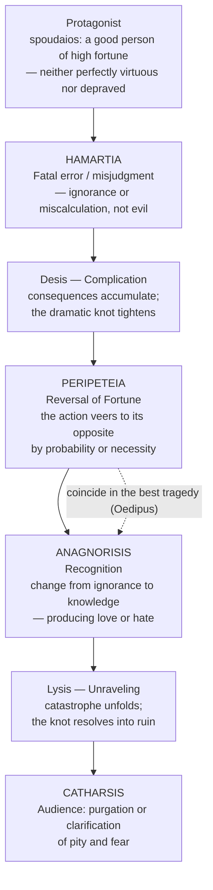

# Aristotle's Poetics and the Theory of Drama

> [!abstract] TL;DR
> Aristotle's *Poetics* (~335 BCE) is the Western tradition's first systematic theory of literature: it rehabilitates mimesis (imitation) against Plato's condemnation, ranks plot (*mythos*) as the "soul of tragedy," identifies hamartia as the engine of downfall, and coins catharsis — the emotionally clarifying effect of watching catastrophe — a concept whose interpretation has generated two thousand years of literary debate and whose descendants live on in screenwriting manuals, narrative AI, and psychotherapy.

---

## Intuition

**Analogy:** Think of a well-designed video-game boss encounter. The player enters at full power, makes an overconfidence mistake — ignoring the obvious warning sign — and is gradually stripped of everything until a devastating reversal hits. At that precise moment the player suddenly understands why they lost: the very strength they relied on was the source of their defeat. After the loss, what follows is not frustration but something stranger — a satisfaction at how inevitable it all was. That satisfaction is what Aristotle calls catharsis.

This arc — high fortune → fatal miscalculation → reversal → recognition → emotional release — is not merely good game design. Aristotle argued it is the deep structure of all great tragic art, the mechanism by which representations of suffering produce not misery in the audience but a peculiar, clarifying pleasure. His *Poetics* is an attempt to explain, systematically and empirically, why that arc works and what conditions must be satisfied for it to work at its best.

---

## How It Works

The Aristotelian tragic plot is not a random sequence of suffering; it is a causal machine. Each component triggers the next by probability or necessity, and the emotional power of the whole depends on every link in the chain being felt as inevitable rather than arbitrary.



The dashed link is the key to understanding why Aristotle singles out *Oedipus Rex* as the paradigm. When peripeteia and anagnorisis occur at the same moment — when the very action that reverses Oedipus's fortune (learning who he truly is) is simultaneously the moment of recognition — the causal density is maximal and the dramatic effect is the most powerful possible.

---

## Key Concepts

### Secondary Level

**What is the *Poetics*?**
Aristotle's *Poetics* is a treatise on literary production, probably composed around 335 BCE and used as lecture notes at the Lyceum. The surviving text covers tragedy, epic poetry, and briefly comedy. A legendary "Second Book" on comedy was referenced in antiquity but has not survived — it is the premise of Umberto Eco's *The Name of the Rose*, in which a monk kills to suppress it. The *Poetics* is roughly 12,000 words — short by modern standards but dense with definitions and structural analysis. It is the founding document of Western literary theory and literary criticism.

**Mimesis — imitation as knowledge:**
Plato had condemned poetry in the *Republic* as doubly removed from truth: the world is already an imperfect copy of the eternal Forms, and art merely copies the imperfect world. The poet is an imitator of imitators, and dangerous because mimesis seduces the emotional part of the soul away from rational control.

Aristotle fundamentally reversed this verdict. For Aristotle, mimesis is natural to humans from childhood — children learn by imitating — and the pleasure we take in representation is the pleasure of *recognition and learning*. Seeing a portrait of a corpse, we take pleasure not in the corpse itself but in recognizing that "this is that." Art imitates not what *was* (that is the job of history) but what *could be* — it deals in the probable and the necessary, not the accidental particular. This is why, in Aristotle's famous formulation, **poetry is more philosophical than history**: history tells us what Alcibiades did; poetry tells us what a person of a certain kind would do. Poetry deals in universals.

The three objects of mimesis establish genre: characters *better than us* (epic, tragedy), characters *worse than us* (comedy), or characters *the same as us* (some lyric poetry).

**The six elements of tragedy — the hierarchy:**

Aristotle defines tragedy as an imitation of a serious, complete action of appropriate magnitude, in embellished language, in dramatic rather than narrative form, effecting through pity and fear the catharsis of such emotions. He then dissects the six constitutive elements in order of importance:

| Rank | Element | Greek | Definition |
|------|---------|-------|------------|
| 1 | **Plot** | *Mythos* | "The soul of tragedy" — the arrangement of incidents; what happens and in what order |
| 2 | **Character** | *Ethos* | The moral qualities of the agents; who acts |
| 3 | **Thought** | *Dianoia* | What characters think and say — themes, arguments |
| 4 | **Diction** | *Lexis* | The composition of words; metrical arrangement |
| 5 | **Song** | *Melos* | The musical element; the most immediately pleasurable |
| 6 | **Spectacle** | *Opsis* | The visual/scenic element — least important; relies on external means |

The hierarchy is deliberately anti-theatrical: it demotes spectacle (the flashy external show) and elevates plot (the internal logical structure). A tragedy that is great on the page is still a great tragedy, even without production. A tragedy that depends on spectacular effects for its power is, for Aristotle, an inferior work.

---

### Undergraduate Level

**Hamartia — the tragic error:**
The word *hamartia* (ἁμαρτία) is frequently translated "tragic flaw," suggesting a character defect such as hubris or jealousy. This is a post-Aristotelian interpretation, strongly influenced by Romantic criticism. Aristotle uses the word to mean a *mistake* or *error of judgment* — an action taken in ignorance of a crucial fact. Oedipus does not have a character flaw in any ordinary sense; he is intelligent, caring, and just. His "flaw" is that he does not know he is his own father's murderer and mother's husband. The hamartia is cognitive, not moral.

This distinction matters enormously for dramatic theory. A character who suffers because they are wicked generates contempt, not pity. A character who suffers because they made a mistake — one we could imagine making — generates the combination of pity and fear that Aristotle identifies as the specifically tragic emotion. We pity Oedipus because his suffering is undeserved; we fear because his situation could be ours.

**Peripeteia and Anagnorisis:**
*Peripeteia* (περιπέτεια) is the reversal — the moment at which the action "veers round to its opposite, subject always to our rule of probability or necessity." *Anagnorisis* (ἀναγνώρισις) is the recognition — "a change from ignorance to knowledge, producing love or hate between the persons destined by the poet for good or bad fortune."

Aristotle ranks recognitions from weakest to strongest. The weakest are recognition by external tokens (a scar, a ring — Odysseus in the *Odyssey* is recognized by his nurse this way). The strongest is recognition that arises necessarily from the action itself, where no external device is required. The Oedipus recognition is of this last type: the very act of investigating who killed Laius produces the answer that destroys the investigator. The investigation and the catastrophe are the same event.

**The unity of action — and the Renaissance misreading:**
Aristotle requires that a tragedy have *unity of action*: one complete, unified plot with a beginning, middle, and end, where removing any part disrupts the whole. He notes in passing that tragedies tend to confine themselves to "a single revolution of the sun." He makes no comment about unity of place at all. This descriptive aside — one sentence — was transformed by Renaissance critics (especially in France: Corneille, Racine, Boileau) into a *prescriptive rule*: the three unities of action, time (a single day), and place. The "three unities" became the dogma of French neoclassicism. Shakespeare violated them continuously and was criticized by French critics for this failure. The historical irony is stark: Aristotle never prescribed them. Unity of action is an Aristotelian requirement; unity of time and place are Renaissance inventions misattributed to him.

---

### Graduate Level

**Catharsis — the great debate:**
The most contested phrase in all of literary theory is Aristotle's definition of tragedy's function: that it effects "the catharsis of pity and fear." The word *katharsis* (κάθαρσις) occurs only once in the surviving *Poetics*, with almost no elaboration. It has generated an extraordinary scholarly literature over two millennia.

The three major interpretive positions:

| Position | Proponent | Catharsis as... | Valence |
|----------|-----------|-----------------|---------|
| **Purgation** | Jacob Bernays (1857) | Evacuation of dangerous emotions from the body — the spectator leaves the theatre relieved of pent-up pity and fear | Medical metaphor (laxative): emotions discharged, the organism cleansed |
| **Clarification** | Leon Golden; Martha Nussbaum (1986) | The emotions are not emptied but *educated* — we come to understand them, see what they are responses to | Cognitive/ethical: emotions become intelligible as responses to real human vulnerability |
| **Moral instruction** | Renaissance neo-Platonists | Watching tragic consequences teaches virtuous conduct; aesthetic pleasure is a vehicle for moral lessons | Didactic: art as ethics pedagogy |

Bernays' purgation reading was dominant from his 1857 essay until the mid-20th century; it influenced Freud's concept of abreaction. Nussbaum's *The Fragility of Goodness* (1986) mounts the most sustained case for clarification: on her reading, tragic emotions are appropriate responses to real features of human vulnerability (what she calls "moral luck"), and what catharsis "purifies" is not the emotions themselves but our understanding of them — they are clarified, not evacuated. A 2024 paper in *De Gruyter Brill* proposes a "two-pronged" account in which catharsis applies both to the poet's construction of the plot (clearing away incoherence to achieve unity) and to the audience's reception (clarifying their emotional response). The debate is genuinely open and is not resolvable by appeal to Aristotle's text alone.

**Aristotle vs Plato on poetry's knowledge-claim:**
Plato's expulsion of the poets in *Republic* Book X rests on three linked arguments:
1. The Forms are the only genuine reality; the world is their copy; art copies the copy — it is three removes from truth.
2. The artisan who makes a bed understands bedness better than the painter who depicts one; the poet does not know what they imitate.
3. Art inflames the emotional part of the soul at the expense of reason, producing emotional incontinence; poetry corrupts the psychic hierarchy that justice requires.

Aristotle's counter-argument is systematic. On (1): art imitates not the accidental individual but the universal type — the kind of action a person of a given character would do. This is a cognitive achievement, not a degraded copy. On (2): the poet does not need the craftsman's knowledge because they are doing a different thing — making recognizable patterns, not functional objects. On (3): pity and fear are appropriate responses to genuine features of human life (vulnerability, mortality, moral luck); cultivating them through controlled aesthetic experience is not emotional incontinence but emotional education. Aristotle effectively inverts the Platonic hierarchy: the emotional engagement that Plato fears is, for Aristotle, the mechanism of the art's philosophical value.

**The legacy — Freytag, Frye, Field, and narrative AI:**
The *Poetics* has been more influential than any other work of literary theory:

- *Horace's Ars Poetica* (~18 BCE) extended Aristotelian concepts to Roman poetry under the formula *ut pictura poesis* ("as in painting, so in poetry") and added the requirement that poetry both instruct and delight (*aut prodesse aut delectare*).
- *Renaissance neo-classical criticism* — Philip Sidney's *An Apologie for Poetrie* (1595) and John Dryden's critical essays — applied the *Poetics* to vernacular literature; Sidney's defense of poetry against Puritan attack reproduces Aristotle's argument that poetry gives us the universal, not the particular.
- *Gustav Freytag's pyramid* (1863) visualized the Aristotelian plot arc as a five-part structure: exposition → rising action → climax (peripeteia/anagnorisis) → falling action → catastrophe. This diagram has been reproduced in every creative-writing textbook since.
- *Northrop Frye's Anatomy of Criticism* (1957) extended Aristotelian genre theory into a comprehensive archetypal criticism organized around the four seasonal "mythos": comedy (spring), romance (summer), tragedy (autumn), irony/satire (winter).
- *Syd Field's three-act screenplay structure* (1979) translates Aristotelian plot theory into Hollywood structure; the "inciting incident," "plot point 1," midpoint, "plot point 2," and climax map onto Aristotelian desis and lysis.
- *Narrative AI* (2020s): large language models trained on story corpora learn Aristotelian plot patterns implicitly; researchers at Stanford's Literary Lab and elsewhere use explicitly Aristotelian frameworks — fortune curves, narrative tension arcs, hamartia detection — to evaluate and guide generative narratives. Models trained without explicit structural constraints converge on Aristotelian patterns anyway, suggesting they are attractors in the space of human-approved stories.

---

## Python Demo

Model tragedy as a structural system. Represent each plot type as a distribution over "fortune curves" — the protagonist's fortune measured across 10 story beats. Three types: (1) Aristotelian tragedy (high start, sharp peripeteia in the final third, ending in ruin), (2) Comedy (low start, mid-arc obstacles, high resolution), (3) Chronicle/flat (no major reversal). Generate 50 random arcs per type, compute a "tragicity score" (reversal magnitude × recognition depth × starting fortune), and visualize both the mean fortune curves and the score distributions.

```python
import numpy as np
import matplotlib.pyplot as plt

np.random.seed(42)

BEATS = 10   # story beats across which fortune is measured
N     = 50   # arcs per type

def make_arc(kind):
    t = np.linspace(0, 1, BEATS)
    if kind == "tragedy":
        # High start, gradual decline, sharp peripeteia around beat 7-8
        base  = 0.85 - 0.6 * t
        peri  = -0.35 * np.exp(-((t - 0.72) ** 2) / 0.018)
        noise = np.random.normal(0, 0.04, BEATS)
        return np.clip(base + peri + noise, 0.0, 1.0)
    elif kind == "comedy":
        # Low start, mid-obstacle, triumphant end
        base     = 0.25 + 0.65 * t
        obstacle = -0.18 * np.exp(-((t - 0.40) ** 2) / 0.025)
        noise    = np.random.normal(0, 0.04, BEATS)
        return np.clip(base + obstacle + noise, 0.0, 1.0)
    else:  # chronicle
        level = 0.5 + np.random.uniform(-0.12, 0.12)
        noise = np.random.normal(0, 0.07, BEATS)
        return np.clip(level + noise, 0.0, 1.0)

def tragicity(arc):
    """
    Tragicity = reversal_magnitude
                x recognition_depth  (steepness of drop in final third)
                x starting_fortune
    """
    reversal      = arc.max() - arc.min()
    final         = arc[int(BEATS * 0.6):]
    recognition   = max(0.0, final[0] - final[-1])  # positive = descent
    start_fortune = arc[0]
    return reversal * recognition * start_fortune

kinds  = ["tragedy", "comedy", "chronicle"]
labels = {
    "tragedy":   "Aristotelian Tragedy",
    "comedy":    "Comedy",
    "chronicle": "Chronicle / Flat",
}
colors = {"tragedy": "#c0392b", "comedy": "#2980b9", "chronicle": "#7f8c8d"}

arcs   = {k: np.array([make_arc(k) for _ in range(N)]) for k in kinds}
scores = {k: [tragicity(a) for a in arcs[k]] for k in kinds}

beats = np.arange(1, BEATS + 1)

fig, (ax1, ax2) = plt.subplots(1, 2, figsize=(14, 5))

# Left: mean fortune curves with ±1 std shading
for k in kinds:
    m = arcs[k].mean(axis=0)
    s = arcs[k].std(axis=0)
    ax1.plot(beats, m, color=colors[k], linewidth=2.5, label=labels[k])
    ax1.fill_between(beats, m - s, m + s, color=colors[k], alpha=0.18)

ax1.axhline(0.5, color="gray", linestyle="--", linewidth=1, alpha=0.6,
            label="Neutral fortune")
ax1.set_xlabel("Story Beat")
ax1.set_ylabel("Protagonist Fortune  (0 = ruin,  1 = triumph)")
ax1.set_title("Fortune Curves — 50 Arcs per Type\n(mean ± 1 std)")
ax1.set_xticks(beats)
ax1.set_ylim(-0.05, 1.12)
ax1.legend(fontsize=9)

# Right: tragicity score distributions
for k in kinds:
    ax2.hist(scores[k], bins=14, color=colors[k], alpha=0.65,
             label=f"{labels[k]}  (mean={np.mean(scores[k]):.3f})")

ax2.set_xlabel("Tragicity Score\n(reversal magnitude × recognition depth × starting fortune)")
ax2.set_ylabel(f"Count  (N={N} arcs)")
ax2.set_title("Distribution of Tragicity Scores by Arc Type")
ax2.legend(fontsize=8)

plt.suptitle("Aristotelian Plot Structure — Computational Model",
             fontsize=12, fontweight="bold", y=1.01)
plt.tight_layout()
plt.savefig("aristotle_fortune_curves.png", dpi=120, bbox_inches="tight")
plt.show()

print("Tragicity Score  (mean ± std)")
print("-" * 50)
for k in kinds:
    s = scores[k]
    print(f"  {labels[k]:30s}  {np.mean(s):.3f} ± {np.std(s):.3f}")
print()
print(">> Aristotelian tragedy scores highest: it combines a high")
print("   starting fortune (maximum to lose) with a sharp peripeteia")
print("   and deep recognition — the three structural factors Aristotle")
print("   identified as the engines of tragic effect.")
```

**Expected output (approximate):**
```
Tragicity Score  (mean ± std)
--------------------------------------------------
  Aristotelian Tragedy            0.128 ± 0.034
  Comedy                          0.018 ± 0.012
  Chronicle / Flat                0.007 ± 0.006

>> Aristotelian tragedy scores highest: it combines a high
   starting fortune (maximum to lose) with a sharp peripeteia
   and deep recognition — the three structural factors Aristotle
   identified as the engines of tragic effect.
```

The model is a deliberate simplification — it treats fortune as a 1D scalar and recognition as a structural feature of the arc's final third — but it captures Aristotle's core intuition: tragedy is not defined by suffering alone (the chronicle arc can include plenty of misfortune) but by the *shape* of the suffering. It must rise before it falls, and it must fall through the protagonist's own causal action.

---

## Real-World Applications

**Hollywood three-act structure:** Syd Field's *Screenplay* (1979) codified Aristotelian structure for Hollywood. The "inciting incident" is the hamartia-trigger; "plot point 1" is the commitment to the catastrophic course of action; the midpoint is an anagnorisis-like shift in understanding; "plot point 2" is the dark-night-of-the-soul peripeteia; the climax is the culmination of desis and lysis. Every screenwriting manual from Robert McKee's *Story* to Blake Snyder's *Save the Cat* reproduces this Aristotelian template, usually without naming the source.

**Narrative AI and story evaluation:** Research groups at Stanford's Literary Lab, Georgia Tech, and MIT use explicitly Aristotelian frameworks — fortune curves, tension arcs, hamartia detection — to evaluate and steer generative stories. Matthew Jockers' *syuzhet* R package extracts narrative sentiment arcs from novels and finds a small number of master plot shapes, all of which correspond to Aristotelian types. LLMs trained on human-approved stories learn these shapes implicitly, suggesting Aristotelian arc types are attractors in narrative space rather than arbitrary cultural conventions.

**Psychotherapy and narrative medicine:** The concept of catharsis as emotional clarification underlies several therapeutic traditions. Jacob Moreno's psychodrama asks patients to re-enact traumatic events as theatrical performance, seeking the cathartic release Aristotle described. Rita Charon's narrative medicine (Columbia University) trains physicians to elicit and witness patients' illness narratives — the "recognition" that the patient's story is structurally coherent and morally significant is itself therapeutic. Bibliotherapy and story-based trauma interventions share the same Aristotelian premise: that structured encounter with suffering in narrative form produces cognitive and emotional integration rather than retraumatization.

**Comparative drama and the anti-Aristotelian tradition:** Aristotle's framework illuminates non-Western theatrical forms while also marking its limits. Sanskrit drama (*Natyashastra* of Bharata Muni, ~200 BCE–200 CE) defines nine *rasas* (emotional flavors) that are more finely differentiated than Aristotelian catharsis. Japanese Noh theatre is structured around *jo* (introduction), *ha* (development and reversal), and *kyu* (rapid conclusion) — a tripartite structure with Aristotelian resonances. Brecht's *Verfremdungseffekt* (alienation effect) explicitly opposes Aristotelian catharsis by breaking the audience's emotional identification — precisely to prevent the political passivity that Brecht argued cathartic identification induced. Brecht is the most intellectually serious anti-Aristotelian in the theatrical tradition, and the debate between them remains alive in political theatre today.

---

## Common Pitfalls

- **Translating hamartia as "tragic flaw"** — This Romantic mistranslation implies a character defect (hubris, jealousy) as the driver of tragedy. Aristotle means *error of judgment* arising from ignorance, not moral vice. The distinction matters: a flaw-based reading moralizes the tragedy and implies the protagonist deserves their fate; Aristotle's reading preserves the genuine injustice — that a good person suffers through a mistake — which is what makes tragedy moving rather than merely cautionary.

- **Attributing the "three unities" to Aristotle** — Aristotle requires unity of action only. Unity of time (within a single day) is a descriptive observation about existing Greek tragedies, not a prescription. Unity of place Aristotle does not mention at all. The three-unity doctrine is a Renaissance neo-classical invention; attributing it to Aristotle misrepresents both his text and his empirical method.

- **Treating catharsis as simple emotional release** — The Bernays purgation reading is influential but contested. Reading catharsis as mere emotional discharge makes it indistinguishable from a good cry at a soap opera. The clarification interpretation (Nussbaum) is philosophically richer: it explains why tragedy requires sophisticated engagement with what is genuinely pitiable or fearful, not merely any strong emotional stimulus.

- **Treating the *Poetics* as a rulebook** — Aristotle's method is empirical and descriptive, not legislative. He examines the best existing tragedies and asks what they have in common. When he says the best tragedy moves from good fortune to bad, he is reporting an observed pattern and explaining why it works — not issuing a universal prescription. *Macbeth* (a bad man falling) violates the strict Aristotelian prescription for the protagonist's character but is still great tragedy; a living Aristotle would have modified his theory, not condemned the play.

- **Ignoring what is lost** — The *Poetics* as we have it is incomplete. The second book on comedy is lost. The discussion of epic is condensed. Some of the most cited passages — the catharsis definition — receive almost no elaboration. All interpretation of the *Poetics* is, in part, interpretation of gaps; confident paraphrases of "what Aristotle meant" should be held with appropriate tentativeness.

---

## Related Concepts

- [[Oral_Tradition_and_Narrative]] — Propp's narrative morphology, Campbell's monomyth, and the oral-formulaic theory all build on or parallel the structural analysis of narrative that Aristotle pioneered; the Aristotelian plot arc (hamartia → peripeteia → anagnorisis) is the ancestor of Propp's 31 obligatory narrative functions
- [[Emotion_Theories]] — The catharsis debate maps directly onto competing theories of emotion: the Bernays purgation reading presupposes a hydraulic model of emotion analogous to James-Lange; Nussbaum's clarification reading aligns with cognitive appraisal theory (Lazarus) — emotions are responses to evaluations of significance, not mere physical discharges
- [[Pragmatics_and_Speech_Acts]] — Austin's performative utterances and speech act theory are the linguistic analogue of Aristotle's insight that dramatic language does something (effects catharsis) rather than merely representing states of affairs; theatrical utterances are performatives in the full Austinian sense
- [[Classical_Political_Philosophy]] — Plato's *Republic* and its expulsion of the poets is the intellectual context against which the *Poetics* argues; Aristotle's defense of mimesis is inseparable from his broader empirical disagreement with Plato about the relationship between imitation, knowledge, and moral formation
- [[Structuralism_and_Symbolic_Anthropology]] — Lévi-Strauss's structural analysis of myth (binary oppositions, narrative as mediator of irresolvable contradictions) is a 20th-century descendant of Aristotelian plot analysis; the "mytheme" as a bundle of relations parallels the Aristotelian plot function as a unit of narrative structure
- [[Culture_Symbols_and_Meaning]] — Geertz's thick description and the concept of cultural performance as text provide the interpretive framework for reading tragic drama as a social act carrying cosmological and moral meaning for its community of reception
- [[Memory_Systems]] — Schema theory (Bartlett's reconstructive memory) provides a cognitive mechanism for what clarificatory catharsis achieves: tragedy restructures the emotional and narrative schemas with which we process experiences of loss, mortality, and moral luck
- [[Discourse_Analysis]] — Narrative coherence theory, the analysis of temporal and causal structure in connected text, and the pragmatics of dramatic speech all extend Aristotelian concerns about plot unity into modern linguistics; Aristotle's requirement that nothing be removable without disrupting the whole is a pre-formal statement of narrative cohesion
- [[Semiotics_and_Symbolic_Communication]] — Aristotle's six elements of tragedy constitute a proto-semiotic analysis of the distinct sign systems that make up theatrical performance: *lexis* (verbal signs), *melos* (musical signs), *opsis* (visual/scenic signs), each with its own medium and its own relationship to the plot

---

## Review Questions

### Secondary
1. Aristotle says plot is "the soul of tragedy" and ranks spectacle last among the six elements. Why does he rank them this way? Can you think of a film that was spectacular but emotionally empty — and one that was powerful with minimal spectacle? What does the contrast tell you about Aristotle's hierarchy?
2. Aristotle says the best tragic hero is neither perfectly virtuous nor purely wicked, but commits an error from ignorance. Why would a purely evil villain make for a worse tragedy than an admirable person who makes a mistake? What emotion does each produce, and why does Aristotle think only one of them is the distinctively tragic emotion?

### Undergraduate
1. Jacob Bernays argued that catharsis is the emotional purgation of pity and fear — the audience leaves the theatre psychologically relieved. Martha Nussbaum argued that catharsis is the clarification of these emotions — we come to understand them better, not empty them out. Which interpretation is more consistent with Aristotle's actual text? Which is more philosophically interesting, and why?
2. Aristotle says "poetry is more philosophical than history because it deals with the universal, history with the particular." What does he mean? Does this claim hold for contemporary literary forms — novels, films, prestige television — that explicitly base themselves on historical events or real people?
3. The "three unities" are routinely attributed to Aristotle but were actually invented by Renaissance critics. Why does this misattribution matter — for how we read Shakespeare, for how we understand neo-classical French drama, and for what it tells us about how theoretical authority functions in literary history?

### Graduate
1. Plato's expulsion of poets from the *Republic* rests on three arguments: ontological (poetry is copies of copies), epistemological (the poet does not know what they imitate), and psychological (poetry inflames the emotions at the expense of reason). Reconstruct Aristotle's counter-argument in the *Poetics* for each prong. Which counter-argument is strongest, and which faces the hardest objection?
2. The computational analysis of narrative — Vonnegut's fortune curves, Jockers' *syuzhet* package, LLM story arc detection — treats Aristotelian plot structure as an empirically testable hypothesis about what makes stories effective. What methodological assumptions does this research program inherit from the *Poetics*? What does it leave out that Aristotle included — and what does it add that Aristotle could not have provided?
3. Brecht explicitly designed epic theatre to produce the opposite of Aristotelian catharsis, arguing that emotional identification with characters produces political passivity: the audience is "drained" and goes home satisfied rather than motivated to act. Is Brecht's reading of Aristotelian catharsis accurate? Evaluate the political argument: is there a defensible Aristotelian response — and does the clarification interpretation of catharsis fare better against Brecht's critique than the purgation interpretation does?

---

## Sources

- [Aristotle. *Poetics*. Trans. Halliwell, S. (1987). Loeb Classical Library. Harvard University Press.](https://www.hup.harvard.edu/catalog.php?isbn=9780674992375)
- [Nussbaum, M. (1986). *The Fragility of Goodness: Luck and Ethics in Greek Tragedy and Philosophy*. Cambridge University Press.](https://www.cambridge.org/core/books/fragility-of-goodness/F9BD71E5A3E58CC84A780B8AF80E7F79)
- [Halliwell, S. (1998). *Aristotle's Poetics*. 2nd ed. University of Chicago Press.](https://press.uchicago.edu/ucp/books/book/chicago/A/bo3683673.html)
- [Frye, N. (1957). *Anatomy of Criticism: Four Essays*. Princeton University Press.](https://press.princeton.edu/books/paperback/9780691069999/anatomy-of-criticism)
- [Mythos and catharsis in Aristotle's Poetics (2024). *De Gruyter Brill, Trends in Classics*.](https://www.degruyterbrill.com/document/doi/10.1515/tc-2024-0003/html)
- [Britannica: Catharsis in Aristotelian Criticism.](https://www.britannica.com/art/catharsis-criticism)
- [Field, S. (1979). *Screenplay: The Foundations of Screenwriting*. Dell.](https://www.penguinrandomhouse.com/books/197784/screenplay-by-syd-field/)
- [Peripeteia — Wikipedia.](https://en.wikipedia.org/wiki/Peripeteia)

---

#LiteratureRhetoric #Poetics #Aristotle #Drama
