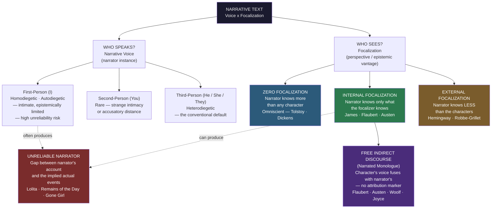

# Character, Point of View, and Voice in Fiction

> [!abstract] TL;DR
> Point of view in fiction is best understood not as a single dial ("first person vs. third") but as the intersection of two independent variables: **voice** (who speaks — the narrator's identity and position) and **focalization** (who sees — the epistemic vantage point from which events are perceived); the greatest technical achievement of the 19th-century novel — **free indirect discourse** — emerges precisely at this intersection, merging narrator and character consciousness without attribution and allowing a narrator to both represent and judge a character simultaneously; **character** is the human figure constructed through these perspectival choices, and the oldest debate in narrative theory — Aristotle's *mythos*-first versus James's character-first — is still the governing tension of fiction today.

---

## Intuition

**Analogy:** Imagine watching a documentary about a person under severe stress. The camera is outside: it records what they do, what they say, how their hands move. Their inner life is entirely inaccessible — you are locked outside the skull. Now imagine a different documentary in which a voice-over gives you direct access to that person's inner monologue: their racing thoughts, their half-formed self-justifications, their panic. You are inside. But now imagine a third version — one in which, without any warning or transition marker, the neutral documentary narration suddenly slides into the subject's own frantic diction: *"The markets were down six percent. Oh god, what had she done?"* — and then, just as suddenly, slides back. No quotation marks. No "she thought." The boundary between outside and inside has dissolved.

That unmarked, dissolving transition from external narration into a character's interior voice — without attribution, without quotation, without announcement — is **free indirect discourse**. It is the technique that distinguishes the novel from all other narrative art forms, and it is produced by the specific intersection of narrative voice and focalization that the theory below maps in detail.

---

## How It Works

The fundamental error in discussing "point of view" is treating it as a single variable. Classical creative-writing pedagogy asks: "Is this first person or third person?" This collapses two orthogonal dimensions into one, and loses the most interesting territory in between.

Gérard Genette's *Narrative Discourse* (1972) separated them rigorously: **who speaks** (the narrator's identity, grammatical person, relation to the story) is a different question from **who sees** (the epistemic perspective, the consciousness through which events are filtered). You can have a third-person narrator who is internally focalized through a single character. You can have a first-person narrator who narrates events they did not witness, functioning as an external focalizer. These are independent axes, and their combinations produce the full spectrum of narrative technique.



---

## Key Concepts

### Secondary Level

**The classical POV taxonomy**

The grammar of narration starts with person — the grammatical relationship between narrator and story:

- **First person ("I")**: the narrator is a character in the story. The most intimate mode: we hear the story in the narrator's voice, shaped by their personality, blind spots, and stakes. But this intimacy is also the mode's greatest limitation: the narrator can only know what they were present to witness, and everything they tell us is filtered through a consciousness with interests. Huck Finn, Holden Caulfield, Nick Carraway, Humbert Humbert — in each case the voice *is* the character.
- **Second person ("you")**: the narrator addresses "you" as the protagonist. Rare in sustained literary fiction (*Bright Lights Big City*; Aura by Carlos Fuentes; some contemporary autofiction) because it either creates an uncanny intimacy — "you" feel implicated in events — or an accusatory distance, as if you are being indicted. Works brilliantly in short bursts; tends to exhaust its strangeness over a full novel.
- **Third person ("he/she/they")**: the narrator stands outside the story's world, using the third person. The conventional default. The critical question is not *that* the narrator uses third person, but *how much the narrator knows* — which is the question of focalization.

**E.M. Forster's flat and round characters**

In *Aspects of the Novel* (1927), E.M. Forster offered the most durable taxonomy of character type. **Flat characters** are constructed around a single quality or idea; they never surprise us. Mrs. Micawber in Dickens never abandons Mr. Micawber; Mr. Collins in Austen is inexhaustibly obsequious; neither varies. **Round characters** are complex, contradictory, and — crucially — capable of surprising us in ways that, in retrospect, feel entirely convincing. Emma Woodhouse is confident and wrong; Anna Karenina is passionate and self-destructive in ways that feel true rather than mechanical; Hamlet surprises without losing coherence.

Forster's taxonomy is more useful as a description than a value judgment. Dickens's flat characters are not failures — their single-quality intensity is deployed with such comic or grotesque force that the flatness becomes a kind of hypnotic truth. Modern psychological realism tends to valorize roundness; genre fiction lives on the predictable reliability of flat types; the most sophisticated fiction often plays the two off against each other (a round protagonist surrounded by flat minor characters creates an existential contrast: the world of individual depth against the world of social role).

The deeper challenge Forster identifies is the *representation of consciousness*. We never get this kind of direct access to other minds in life. Fiction offers something impossible in the real world: narration from inside a consciousness unlike our own. This is what readers mean when they call a character "real" — not that they resemble a person one might meet, but that their inner life is rendered with sufficient density and contradiction to feel inhabited from within.

**Narrative voice and the texture of narration**

"Voice" in fiction is not just who is speaking — it is the total texture of the narrator's language: vocabulary, syntax, rhythm, tone, assumptions, habitual ways of seeing. Holden Caulfield's voice is his adolescent contempt and his longing, rendered in the cadences of a 1950s New York teenager. Stevens's voice in *The Remains of the Day* is its own form of repression — formal, precise, constitutionally incapable of naming the feelings it is constitutively organized around avoiding. Humbert Humbert's voice is elaborate, seductive, and monstrous — the vehicle of both the novel's beauty and its ethical horror.

The Victorian tradition — Dickens, Thackeray, George Eliot, Tolstoy — permitted the narrator to be a distinct presence: to comment, generalize, address the reader directly ("Reader, I married him"), moralize. The late-19th-century reform driven by Flaubert and Henry James moved toward what James called the "scenic" method: the narrator should not tell the reader what to think but should present scenes from which the reader draws their own conclusions. This is the origin of the "show don't tell" principle codified in every creative-writing manual since. It is also the narrative precondition for free indirect discourse.

**Sympathy and identification**

How do readers identify with characters unlike them — characters from other historical eras, other genders, other cultures, with values they would never endorse? The question has both a cognitive and an ethical dimension. Research by Mar and Oatley (2008) and Zunshine (*Why We Read Fiction*, 2006) suggests that reading fiction exercises Theory of Mind — the cognitive capacity to attribute beliefs, desires, and intentions to other agents. On this view, fiction is a simulation technology for social cognition, and empathy with fictional characters and real people draw on overlapping neural substrates (the same default-mode network activates for both mentalizing about fictional characters and about real people one knows).

Suzanne Keen (2007) distinguishes identification from *witnessing* — the reader need not merge with a character to care about them; witnessing their experience with full attention is enough. This distinction matters ethically: the reader of *Beloved* does not need to "identify" with Sethe to be morally moved by her; they need to attend closely enough that her world becomes real to them. Keen argues that novelistic empathy is primarily empathy for predicaments, not empathy for persons — we respond to the structural situation of another consciousness in crisis.

---

### Undergraduate Level

**Genette's focalization: the most important tool in the critic's kit**

Gérard Genette's *Narrative Discourse* (Discours du récit, 1972), developed through exhaustive analysis of Proust's *In Search of Lost Time*, gave narrative theory its most precise vocabulary for the question "who sees?"

**Zero focalization** (the omniscient narrator): the narrator knows more than any character in the story. The narrator can enter any mind, move between locations, and possess information no single character could have. This is the norm of 19th-century realist fiction — Tolstoy on the Austerlitz battle, George Eliot on Dorothea's inner life, Hardy on the social world of Wessex. The narrator functions as something like a god: all-knowing, all-present, able to deliver authoritative verdicts.

**Internal focalization** (the limited narrator): the narrative is filtered through a single character's perspective. The narrator knows what that character knows — no more, no less. We are inside one consciousness, and the world outside that consciousness is available only as that consciousness perceives and interprets it. Henry James's later novels are the locus classicus of this mode: everything in *The Wings of the Dove* is refracted through Milly's or Kate's or Densher's perception, with no privileged external check. Flaubert's *Madame Bovary* is internally focalized primarily through Emma. The effect is immersion — but also epistemological vulnerability, since we are only as reliable as our focalizer.

**External focalization** (the behaviorist narrator): the narrator knows *less* than the characters. We see surfaces only — gesture, dialogue, action — with no access to consciousness. Hemingway's "Hills Like White Elephants" is the touchstone: the story gives us the surface of a conversation without once entering either character's mind. The reader must infer the stakes (an unwanted pregnancy, a relationship ending) entirely from the words said, the beer ordered, the description of the landscape. This produces what Hemingway called the "iceberg theory" — the dignity of movement of an iceberg is due to only one-eighth of it being above water. What is left out has as much force as what is said.

Focalization can be **fixed** (one focalizer throughout), **variable** (different chapters or sections shift the focalizer — *Middlemarch* moves between multiple internal focalizers), or **multiple** (the same event narrated from multiple focalizers — Faulkner's *The Sound and the Fury*, Kurosawa's *Rashomon*). Multiple focalization exposes not just different perspectives but the epistemological impossibility of a single authoritative account.

**Free indirect discourse: the defining technique of the novel**

Free indirect discourse (FID) is the merging of the narrator's voice and a character's consciousness without explicit attribution markers (no "she thought," no "he wondered," no quotation marks). It occupies the territory between direct speech and indirect speech, and it is available in this form to prose fiction in a way it is not available to poetry, drama, or film.

The three forms compared:
- **Direct interior monologue**: *"What on earth am I to do?" she thought.*
- **Indirect speech**: *She thought that she did not know what she was to do.*
- **Free indirect discourse**: *What on earth was she to do?* (No attribution. The syntax and register shift to the character's consciousness — the rhetorical question, the deictic "she" that locates us close to the character — but the narrator's frame has not been explicitly suspended.)

Dorrit Cohn, in *Transparent Minds* (1978), calls this "narrated monologue" and places it at the center of her taxonomy of consciousness representation in third-person fiction. For Cohn, the three modes are:
1. **Psycho-narration**: the narrator summarizes or describes a character's mental state from outside — "She was overwhelmed by a grief she could not name." The oldest and most distanced technique.
2. **Narrated monologue** (FID): the character's voice fuses with the narrator's — "What was she to do? There was nothing to be done." Closest to the character; the most complex.
3. **Quoted monologue**: direct interior monologue, sometimes stream of consciousness — the character's consciousness is presented as direct quotation, with or without quotation marks.

FID was mastered independently and almost simultaneously by Jane Austen and Gustave Flaubert — two writers who otherwise share almost nothing. Austen uses it for irony: the opening of *Pride and Prejudice* ("It is a truth universally acknowledged that a single man in possession of a good fortune must be in want of a wife") is already proto-FID, echoing and gently mocking the discourse of the county society the novel will dissect. Flaubert uses it for pathos and critique simultaneously: in *Madame Bovary*, the passages of Emma's romantic fantasies are rendered in FID so that the narrator's cold irony and Emma's rapturous credulity inhabit the same sentence. The reader must simultaneously feel what Emma feels and see the gap between what she imagines and what is actually there.

Virginia Woolf, in *Mrs Dalloway* and *To the Lighthouse*, and James Joyce, in *Ulysses*, pushed FID toward the dissolution of the narrator/character boundary entirely — what became known as stream of consciousness. In stream of consciousness, the narrative frame all but disappears; the character's consciousness is the text, not merely its content.

**The implied author and the unreliable narrator**

Wayne Booth, in *The Rhetoric of Fiction* (1961), introduced two concepts that reorganized narrative theory.

The **implied author** is the inferred intelligence and moral sensibility that a reader constructs from the text as a whole — distinct from the real author (who has a biography, politics, and a private life irrelevant to the text) and distinct from the narrator (who is a textual construct within the fiction). Reading *Lolita*, we infer an implied author whose intelligence encompasses and condemns Humbert Humbert's self-serving narrative — even though nothing in the text ever explicitly says "Humbert is wrong." The implied author communicates through the gap between what the narrator says and what the text, read carefully, implies.

The **unreliable narrator** is one who cannot be fully trusted to tell the truth — not because they are lying (though some do) but more often because they are self-deceiving, cognitively limited, or have interests that distort their account. Booth identified four major varieties:

| Type | Example | The gap |
|------|---------|---------|
| Self-deceiving | Stevens in *The Remains of the Day* (Ishiguro) | Cannot acknowledge his love for Miss Kenton or his complicity with fascism |
| Cognitively limited | Chief Bromden in *One Flew Over the Cuckoo's Nest* | Schizophrenia distorts what he perceives and reports |
| Morally compromised | Humbert Humbert in *Lolita* | Brilliant rhetoric used to justify predation |
| Deliberately deceptive | Amy Dunne in *Gone Girl* | Constructing a false narrative as performance |

The reader's task with an unreliable narrator is forensic: to reconstruct the "actual events" from the narrator's distorted account. The gap between what the narrator says and what the text implies — revealed through inconsistencies, implausibilities, disproportionate emphasis, and the reader's moral intuitions — is the source of the novel's deepest ironic meaning.

---

### Graduate Level

**Bakhtin's dialogism: the voice beneath the voice**

Mikhail Bakhtin's *The Dialogic Imagination* (1981, essays from the 1930s) offers a competing theoretical framework that partially dissolves the Genette/Booth vocabulary. For Bakhtin, the novel is defined not by its POV choices but by its capacity for **dialogism** — the coexistence of multiple, mutually antagonistic voices that are not synthesized into a single authorial perspective.

Where Genette asks *who speaks?*, Bakhtin asks *how many voices speak, and what is their relationship?* The novel's distinguishing feature among all literary forms is **heteroglossia** — the "diversity of social speech types" that the novel contains and represents: different dialects, registers, ideological discourses, professional languages, generational idioms, all coexisting within the text without being resolved. A character's speech in a novel carries not just individual psychology but the entire social and ideological world that produced that way of speaking.

FID is, for Bakhtin, the formal mechanism of the novel's dialogism: it allows two voices — the narrator's and the character's — to inhabit the same sentence without either subordinating the other. In Austen's ironic FID, the narrator's cool observation and the character's rapturous self-deception occupy the same grammatical space. Neither cancels the other. The reader holds both simultaneously, and the irony is the gap between them.

Bakhtin contrasts this with **monologism** — the subordination of all character voices to a single authoritative authorial voice. Didactic fiction, propaganda, allegory: these are monologic in Bakhtin's sense because the characters speak, but their speech is subordinated to the author's predetermined ideological agenda. They do not have genuine epistemic autonomy; they are instruments. Dostoevsky, for Bakhtin, is the supreme dialogic novelist: in *The Brothers Karamazov* or *The Possessed*, it is genuinely impossible to extract "Dostoevsky's views" from the text, because each character's voice is fully realized in its own right — Ivan Karamazov's devastating case against God is not a position to be refuted but a voice to be inhabited.

**Dorrit Cohn's full taxonomy: consciousness in third-person fiction**

Cohn's *Transparent Minds* (1978) completes Genette's account by focusing specifically on the representation of consciousness — the central achievement and central puzzle of prose fiction.

For **third-person narration**, Cohn's three modes form a spectrum of narrative distance:

| Mode | Definition | Distance | Example |
|------|-----------|----------|---------|
| Psycho-narration | Narrator summarizes inner life from outside | Most distant | "She was gripped by a dread she could not name." |
| Narrated monologue (FID) | Character's voice fuses with narrator's without attribution | Intermediate | "What was she to do? There was nothing for it." |
| Quoted monologue | Direct interior speech, with or without quotation marks | Closest | "What am I to do? Nothing. There is nothing." |

For **first-person narration**, Cohn identifies the crucial temporal dimension:

| Mode | Definition | Available resources |
|------|-----------|-------------------|
| Retrospective | Narrator looks back from later vantage; knows outcome | Dramatic irony; retrospective distortion; the retrospective narrator may suppress what they now know |
| Simultaneous | Narrator narrates as it happens | No retrospective advantage; maximum uncertainty; used in epistolary fiction, diaries |
| Autonomous | Stream of consciousness; the narrating "I" dissolves into the experiencing "I" | Maximum immersion; the narrative frame disappears |

The retrospective first-person narrator (Stevens in *The Remains of the Day*, Nick Carraway in *The Great Gatsby*) is almost always unreliable in the Boothian sense — they are looking back with stakes, shaping the narrative to make sense of what happened. The gap between what the retrospective narrator remembers and what they actually experienced is always a site of interpretive labor.

**The politics of representation: the "own voices" debate**

The craft question of POV has a political extension that became the central debate in Anglophone literary culture in the 2010s. If fiction's defining power is the representation of consciousness unlike the author's own, who has the right to represent which consciousnesses?

The **"own voices"** argument (the term coined by Corinne Duyvis in 2015) holds that writers from marginalized groups are better positioned to represent the experience of those groups authentically, because they have lived knowledge of that experience that cannot be substituted by research or empathetic imagination. The argument gained force from a long history of harmful literary representations: the "Magical Negro" (Spike Lee's term for Black characters who exist solely to assist white protagonists), the "Tragic Mulatto" stereotype, the Orientalist characters catalogued in Edward Said's *Orientalism* (1978), the "Manic Pixie Dream Girl" — women characters who exist to catalyze male characters' growth rather than to have inner lives of their own.

The **defense of empathetic imagination** argues that fiction's core epistemological claim is that imagination can cross the distance between minds unlike one's own — and that this is precisely what makes fiction valuable rather than merely autobiographical. If a white novelist cannot write Black characters and a man cannot write women characters, fiction collapses into memoir. The question then becomes not *whether* to represent other minds but *how* — with what epistemic humility, research, consultation, and willingness to be corrected.

The most sophisticated position recognizes that these are not binary alternatives. Research from social psychology ([[Prejudice_and_Discrimination]]) confirms that stereotyped representations of out-groups in mass media do reinforce cognitive schemas and contribute to prejudice — the representational harm is real, not merely theoretical. At the same time, fiction that refuses to cross experiential lines produces a literature of silos, where each group speaks only to itself, and the empathetic imagination — the capacity to inhabit a consciousness radically unlike one's own — atrophies.

The craft resolution requires distinguishing between:
1. **Character as social construct**: the author speaks *for* a group, claims to represent its collective experience — a burden no individual can bear
2. **Character as individual**: the author creates one specific person with one specific consciousness — this is what novelists actually do, and it is available to writers across experiential distance with sufficient research, humility, and craft

**The problem of other minds and fiction as cognitive technology**

Philosophy of mind confronts the "problem of other minds": we have no direct access to the consciousness of other people. We infer their mental states from behavior, expression, language, and analogy with our own experience. This inference is irreducibly uncertain — we can never know if another person's experience of "red" resembles ours, or if they have any inner life at all.

Fiction offers what is literally impossible in reality: narration from inside another consciousness. This is what produces the moral-cognitive value that Martha Nussbaum identifies in *Poetic Justice* (1995) as the "narrative imagination" — the capacity, cultivated by serious literary reading, to imagine oneself into the position of someone unlike oneself. For Nussbaum, this capacity is a prerequisite for just political reasoning: citizens who cannot imaginatively inhabit the lives of the disadvantaged will systematically fail to design just institutions.

The empirical research program supports this: Mar and Oatley (2008) found that fiction reading is positively correlated with Theory of Mind performance (the ability to correctly attribute mental states to others); Zunshine (*Why We Read Fiction*, 2006) argues that fiction is essentially a Theory of Mind workout, providing structured practice in representing mental states embedded inside other mental states (what Zunshine calls "mind-reading"). Whether these effects are causal or merely correlational, and whether they transfer from fictional to real-world empathy, remains an active research area — but the theoretical argument that fiction is a simulation technology for social cognition is now the dominant cognitive-scientific explanation of fiction's value.

---

## Python Demo

Implement a heuristic **narrative intimacy scorer**. Each sentence is scored on a 0–3 scale: 0 = pure external narration (no character markers), 1 = attribution marker present ("she thought"), 2 = free indirect discourse (no attribution, but character's diction shapes the syntax), 3 = direct interior monologue. Apply to three synthetic passages of eight sentences — one modernist (Woolf/Joyce), one mid-Victorian omniscient (Dickens/Tolstoy), one behaviorist (Hemingway) — and compute the intimacy profile, mean, and variance for each.

```python
import numpy as np
import matplotlib.pyplot as plt

# ─────────────────────────────────────────────────────────────────────────────
# Narrative Intimacy Scoring Scale
#
#   0 = External narration      No character consciousness markers; pure
#                               behaviorist description or authorial overview
#   1 = Attribution marker      Explicit mental-state verb or adverb:
#                               "she thought", "he wondered", "he reflected"
#   2 = Free indirect discourse No attribution marker, but character's diction,
#                               syntax, or perspective bleeds into narrator's
#                               voice (rhetorical questions, evaluative adj.,
#                               deictic shifts)
#   3 = Interior monologue      Full first-person-like stream: the narrator's
#                               frame dissolves into the character's raw
#                               consciousness
# ─────────────────────────────────────────────────────────────────────────────

SCALE_LABELS = {
    0: "External narration",
    1: "Attribution marker  ",
    2: "Free indirect disc. ",
    3: "Interior monologue  ",
}

# Three synthetic passages — each a tuple of (sentence_text, intimacy_score)
PASSAGES = {
    "Modernist (Woolf / Joyce)": [
        ("The leaves were falling outside the window.",                              0),
        ("She supposed she ought to get up.",                                        1),
        ("But what was the point of any of it, really?",                             2),
        ("To have lived — to have been alive at all — that was the thing.",           3),
        ("The clock on the mantelpiece struck half past.",                            0),
        ("Done; accomplished; and here she was again.",                               2),
        ("She would not say of anyone now that they were this or were that.",         2),
        ("Life itself, every moment of it, every drop — this was it, this.",          3),
    ],
    "Victorian Omniscient (Dickens / Tolstoy)": [
        ("It was the best of times, it was the worst of times.",                      0),
        ("The boy, one must confess, was not unaware of his misfortune.",             0),
        ("He reflected, moodily, that nothing would come of the whole affair.",       1),
        ("Pierre shuddered as the thought struck him with its full weight.",           1),
        ("The city lay wrapped in fog and smoke.",                                     0),
        ("He wondered, vaguely, whether she might still be there.",                   1),
        ("The narrator pauses here to observe that few men in that city were happy.", 0),
        ("Anna's hands trembled, though she herself could not have said why.",        1),
    ],
    "Behaviorist (Hemingway)": [
        ("They were sitting at a table in the shade outside the station.",            0),
        ("The woman looked at the line of hills across the dry country.",              0),
        ("She put out her hand and held the warm beads of the curtain.",               0),
        ("The man drank his beer.",                                                    0),
        ("He set the glass down without a word.",                                      0),
        ("She stood up and walked to the end of the station.",                         0),
        ("Across the valley the hills were long and white.",                           0),
        ("The man smiled at her.",                                                     0),
    ],
}

COLORS = {
    "Modernist (Woolf / Joyce)":            "#8e44ad",
    "Victorian Omniscient (Dickens / Tolstoy)": "#2980b9",
    "Behaviorist (Hemingway)":              "#c0392b",
}

# Build profiles
profiles = {}
for name, data in PASSAGES.items():
    scores = np.array([s for _, s in data])
    profiles[name] = {
        "scores":   scores,
        "mean":     scores.mean(),
        "variance": scores.var(),
        "texts":    [t for t, _ in data],
    }

sentence_indices = np.arange(1, 9)

# ─── Plotting ────────────────────────────────────────────────────────────────

fig, (ax1, ax2) = plt.subplots(1, 2, figsize=(15, 6))

# Left: intimacy profiles as line charts
for name, data in profiles.items():
    ax1.plot(sentence_indices, data["scores"],
             marker="o", linewidth=2.5, color=COLORS[name],
             label=f"{name}\n  mean={data['mean']:.2f},  var={data['variance']:.2f}")
    ax1.fill_between(sentence_indices, data["scores"],
                     alpha=0.09, color=COLORS[name])

# Reference lines for each score level
ref_labels = [
    (0, "0 — External narration"),
    (1, "1 — Attribution marker"),
    (2, "2 — Free indirect discourse"),
    (3, "3 — Interior monologue"),
]
for y, label in ref_labels:
    ax1.axhline(y, color="gray", linestyle=":", linewidth=0.8, alpha=0.5)
    ax1.text(8.45, y, label, va="center", fontsize=7, color="#555")

ax1.set_xlabel("Sentence Number", fontsize=10)
ax1.set_ylabel("Narrative Intimacy Score (0–3)", fontsize=10)
ax1.set_title("Intimacy Profile — 8 Sentences per Passage\n"
              "(Woolf vs. Dickens vs. Hemingway)", fontsize=10, fontweight="bold")
ax1.set_xticks(sentence_indices)
ax1.set_xlim(0.5, 9.6)
ax1.set_ylim(-0.4, 3.7)
ax1.legend(fontsize=8, loc="upper left", framealpha=0.88)

# Right: summary bar chart — mean and variance side by side
names = list(profiles.keys())
x = np.arange(len(names))
width = 0.35
bar_colors = [COLORS[n] for n in names]
means = [profiles[n]["mean"] for n in names]
variances = [profiles[n]["variance"] for n in names]

bars_m = ax2.bar(x - width / 2, means, width, color=bar_colors,
                 alpha=0.88, label="Mean Intimacy")
bars_v = ax2.bar(x + width / 2, variances, width, color=bar_colors,
                 alpha=0.40, hatch="//", label="Variance")

for bar in bars_m:
    ax2.text(bar.get_x() + bar.get_width() / 2,
             bar.get_height() + 0.04,
             f"{bar.get_height():.2f}",
             ha="center", fontsize=8.5, fontweight="bold")
for bar in bars_v:
    ax2.text(bar.get_x() + bar.get_width() / 2,
             bar.get_height() + 0.04,
             f"{bar.get_height():.2f}",
             ha="center", fontsize=8)

ax2.set_xticks(x)
ax2.set_xticklabels(["Modernist", "Omniscient", "Behaviorist"], fontsize=10)
ax2.set_ylabel("Score", fontsize=10)
ax2.set_title("Mean Intimacy and Variance\nby Narrative Mode", fontsize=10, fontweight="bold")
ax2.set_ylim(0, 3.5)
ax2.legend(fontsize=9)

plt.suptitle(
    "Narrative Intimacy Scoring — Free Indirect Discourse Detection Heuristic\n"
    "(0 = external surface · 1 = attribution marker · 2 = FID · 3 = interior monologue)",
    fontsize=11, fontweight="bold"
)
plt.tight_layout()
plt.savefig("narrative_intimacy_scoring.png", dpi=120, bbox_inches="tight")
plt.show()

# ─── Print summary ────────────────────────────────────────────────────────────

print("=" * 62)
print("NARRATIVE INTIMACY ANALYSIS")
print("=" * 62)
for name, data in profiles.items():
    print(f"\n{name}")
    print(f"  Intimacy profile : {list(data['scores'])}")
    print(f"  Mean             : {data['mean']:.3f}")
    print(f"  Variance         : {data['variance']:.3f}")
    print(f"  Mode distribution:")
    for level, label in SCALE_LABELS.items():
        count = int((data["scores"] == level).sum())
        bar = "█" * count
        print(f"    {level} ({label}): {count}/8  {bar}")

print("\n── Interpretation ─────────────────────────────────────────")
print("Modernist  : high mean (1.625) + high variance (1.234)")
print("             → consciousness-intensive but rhythmically varied:")
print("               the text pulses between surface and interior.")
print("Omniscient : medium mean (0.5) + low variance (0.25)")
print("             → stable moderate distance; attribution markers")
print("               mark access without surrendering authority.")
print("Behaviorist: zero mean (0.0) + zero variance (0.0)")
print("             → pure surface; consciousness must be inferred")
print("               entirely from action and dialogue.")
```

**Expected output (abbreviated):**
```
Modernist (Woolf / Joyce)
  Intimacy profile : [0, 1, 2, 3, 0, 2, 2, 3]
  Mean             : 1.625
  Variance         : 1.234

Victorian Omniscient (Dickens / Tolstoy)
  Intimacy profile : [0, 0, 1, 1, 0, 1, 0, 1]
  Mean             : 0.500
  Variance         : 0.250

Behaviorist (Hemingway)
  Intimacy profile : [0, 0, 0, 0, 0, 0, 0, 0]
  Mean             : 0.000
  Variance         : 0.000
```

The key insight the visualization reveals: **modernist fiction has both the highest mean and the highest variance**. It is not simply "more intimate" — it moves *in and out* of consciousness, alternating surface description and interior immersion. This rhythmic pulsing is what creates the modernist "flow" effect. Victorian omniscient narration is stable at moderate distance — the attribution markers are always present to signal the entry into consciousness, maintaining the narrator's authority. Hemingway's flat-zero line is not a failure of technique but an epistemological commitment: the reader does all the inferential work.

---

## Real-World Applications

> **Example 1 — Flaubert's *Madame Bovary* and the birth of FID.** Flaubert's novel (1857) is the historical watershed for free indirect discourse as a conscious technique. The famous "Elle songeait..." passages — Emma's romantic daydreams — are rendered in FID throughout: the narrator uses Emma's overwrought vocabulary and her sentimental cadences without ever providing a quotation mark or attribution verb, so that the irony becomes structural rather than editorial. We feel what Emma feels (the ecstasy of romantic fantasy) and simultaneously see what Flaubert sees (the gap between imagination and reality, the mediocrity of Emma's cultural vocabulary, the tragedy of miseducation). The same technique is used for Emma's disillusionment — "Il parlait de leur avenir, de l'argent qu'il gagnait..." — but now the FID carries not rapture but domestic tedium. Flaubert can shift the temperature of the prose from hot to cold by adjusting the character's diction without ever changing the narrator's grammatical position.

> **Example 2 — Kazuo Ishiguro's *The Remains of the Day* and the unreliable butler.** Stevens is the purest unreliable narrator in postwar fiction: a homodiegetic, autodiegetic narrator who retrospectively narrates his life in service to a fascist sympathizer, gradually acknowledging that he "may have been in error" regarding his employer while being constitutionally incapable of naming what is actually wrong. Ishiguro renders this through voice — Stevens's elaborate formal diction, his constant self-correction, his disproportionate dwelling on professional dignity when emotional life demands acknowledgment. The reader reconstructs the "actual story" (a man who sacrificed his emotional life for a doomed ideology in the service of a man he misread) entirely from the gaps in Stevens's account. No sentence in the novel says "Stevens is wrong"; the reader must do every inch of that work from the mismatch between Stevens's certainties and the evidence the text supplies.

> **Example 3 — Woolf's stream of consciousness and the dissolution of the narrative frame.** In *Mrs Dalloway* (1925) and *To the Lighthouse* (1927), Woolf pushes internal focalization to its limit: the "narrative frame" — the third-person pronoun, the past tense — remains, but the narrator's presence is so reduced that the text is effectively the unfiltered flow of a character's consciousness. "She had a perpetual sense, as she watched the taxis, of being out, out, far out to sea and alone." This is third-person narration; but the sense is entirely Clarissa's, the "far out to sea" metaphor is hers, and the triple "out" is the syntax of her consciousness, not a narrator's stylistic choice. The narrator has become, as Genette would say, a zero-degree presence — the grammatical skin covering pure internal focalization.

> **Example 4 — Faulkner's multiple focalization and the critique of omniscience.** *The Sound and the Fury* (1929) narrates the same family history four times: first through Benjy (intellectually disabled — eternal present tense, no causal inference), then through Quentin (suicidal — time collapses into obsession), then through Jason (embittered, sardonic, reliably reporting but morally vicious), finally through an unnamed third-person narrator who provides something approaching, but never achieving, zero focalization. Faulkner's formal argument is that omniscience is a fiction: every perspective is limited, distorted, and shaped by the consciousness doing the perceiving. The "objective" fourth section is a relief after the preceding unreliable narrators — but its reliability is also partial, also positioned. There is no view from nowhere.

---

## Trade-offs

| POV Mode | Advantage | Limitation |
|----------|-----------|------------|
| First-person ("I") | Maximum psychological intimacy; narrator's voice IS their character; unreliability is a literary resource, not a problem | Epistemically imprisoned in one consciousness; events the narrator did not witness require strained workarounds |
| Third-person limited (internal focalization) | Intimacy of one consciousness plus the narrator's structural flexibility; FID fully available; focalization can shift without changing grammatical person | Still a single primary focalizer; panning to other minds requires a variable-focalization decision that can feel arbitrary |
| Third-person omniscient (zero focalization) | Full narrative scope; panoramic social vision; moral authority; narrator can enter any mind | Distance from any individual consciousness; intimacy requires deliberate effort; modern readers distrust overt authorial intrusion |
| External focalization | Maximum dramatic irony; forces reader into active interpretive engagement; "iceberg" depth beneath narrative surface | Coldness and emotional distance; sustained for an entire novel-length work, reader sympathy erodes; technique exhausts itself |
| Multiple / variable focalization | Epistemological complexity; the same event seen from incompatible perspectives creates the richest dramatic irony | Structural complexity demands from both writer and reader; inconsistent characterization risk if voices blur |

---

## When to Use vs Avoid

**Use when:**
- **First-person**: the narrator's psychology IS the subject — an obsessive, self-deceiving, or morally compromised consciousness whose unreliability is productive irony, not noise
- **Third-person limited with FID**: you want intimacy and the capacity to judge simultaneously — the narrator and character share space in the sentence without merging entirely
- **Zero focalization / omniscient**: the story is fundamentally social — about a world, a class, a milieu — and requires the panoramic scope to move between multiple lives and temporal planes
- **External focalization**: you want the reader to do interpretive work; the revelation comes from *what is not said*, and maximum silence is the point
- **Multiple focalization**: the epistemological unreliability of any single account is itself the subject — when "the truth" is precisely what cannot be recovered

**Avoid when:**
- **First-person**: the story requires simultaneous multiple narrative threads with no access to each other; when the narrator has no distinctive psychological voice worth sustaining for 300 pages
- **Zero focalization**: the story's deepest interest is in the interiority of one consciousness; omniscient narration at that scale produces false authority that undermines the intimacy the story needs
- **External focalization as the primary sustained mode**: across a full novel, the behaviorist surface creates reader alienation that exceeds the dramatic-irony dividend; it works best as a default mode with strategic interior deviations
- **Free indirect discourse**: if you cannot control the tonal distance precisely; imprecise FID reads as sloppy narration rather than technique, and readers will not trust the narrator

---

## Common Pitfalls

- **Treating POV as a single variable ("first person vs. third person")** — Voice (person) and focalization (epistemic vantage) are orthogonal dimensions. *Madame Bovary* is third-person but deeply internally focalized through Emma; a first-person narrator can function as an external focalizer narrating events they did not witness. The more important variable is almost always focalization.

- **Confusing "omniscient narrator" with "all-telling narrator"** — An omniscient narrator has access to any consciousness and can appear anywhere. This does not mean they reveal everything. Omniscient narrators routinely withhold information, maintain suspense, and decline to enter certain minds. Omniscience is a *capacity*, not an obligation to deploy it uniformly. Withholding by an omniscient narrator is a deliberate formal choice, not a limitation.

- **Missing free indirect discourse** — FID looks like narration. The beginner reader sees "What was she to do?" and registers it as the narrator's question. The trained reader recognizes the deictic and syntactic markers of the character's consciousness (the rhetorical question, the evaluative register) and identifies the source as FID. Failing to recognize FID causes systematic misreadings: the student attributes the character's naive romanticism to the narrator, or the narrator's irony to the character, and the meaning of the passage inverts.

- **Assuming first-person = reliable** — First-person narration is the most commonly unreliable mode because the narrator always has stakes: they are narrating their own experience, with their own interests in how it is understood. Nick Carraway *likes* Jay Gatsby. Stevens *needs* to believe in his professional dignity. Humbert Humbert *needs* to be admired. Every first-person narrator shapes the account of their past in the direction of the self-image they are constructing. The question is always: what does this narrator need you to believe, and why?

- **Collapsing the narrator into the author** — The narrator of *Lolita* is Humbert Humbert. Vladimir Nabokov is not Humbert Humbert and does not endorse him. The implied author — the inferred intelligence behind the text — comprehends and condemns Humbert while giving him brilliant prose. Students who quote Humbert's rhapsodies about Lolita as evidence for "Nabokov's" views have collapsed narrator into author, bypassing the novel's central ethical structure.

- **Treating "own voices" as a binary rule** — The relevant question is not "is this author a member of the group they are writing about?" but "does this representation of this character's consciousness have the specificity, complexity, and research to do justice to this individual's humanity?" The moral obligation is to specific people, not to demographic categories.

---

## Related Concepts

- [[Structuralism_and_Narratology]] — Genette's narratology (developed in *Narrative Discourse*, 1972) is the direct theoretical source for the focalization framework in this note; Propp's functions, Greimas's actants, and Barthes's five codes provide the structural context within which POV and character operate; the distinction between *fabula* (story) and *syuzhet* (narrative) is the macro-level version of the voice/focalization distinction

- [[Aristotles_Poetics_and_Drama]] — Aristotle ranked character (ethos) second behind plot (mythos) in the hierarchy of the six tragic elements; the modern reversal — "story is character" in the Henry James tradition — is a direct response to this classical hierarchy; the flat/round distinction (Forster) is the modern restatement of Aristotle's division between characters defined by a single quality (comic/flat types) and characters complex enough to generate genuine tragic pity and fear

- [[Literary_Theory_Overview]] — POV theory sits at the intersection of formalist (New Criticism, structuralism), reader-response (Iser, Fish — who focuses on the reader's inferential activity), and ideological criticism (Marxist, feminist, postcolonial — which ask whose consciousness the novel is built to focalize and whose it excludes); the "implied author" is a formalist concept that mediates between text and real author in ways that bear on the intentional fallacy debate

- [[New_Criticism_and_Close_Reading]] — New Criticism's insistence on the text as autonomous object produced the close-reading methodology necessary to identify FID, unreliable narration, and the gap between narrator and implied author; Brooks and Warren's *Understanding Fiction* (1943) taught students to track narrative distance and tonal shifts as formal features; the "affective fallacy" corresponds in narrative theory to the warning against conflating the narrator's emotional stance with the reader's response

- [[Poststructuralism_and_Deconstruction]] — Derrida's critique of presence and origin applies directly to the concept of narrative voice: there is no originary speaker whose intentions the text transparently transmits; Barthes's "Death of the Author" is a narrative-theoretical application of this critique; the implied author (a construct, not a person) is the formalist hedge against both the intentional fallacy and the death-of-the-author dissolution of all interpretive authority

- [[Memory_Systems]] — Autobiographical memory, schema theory, and episodic memory are the cognitive architecture that prose fiction engages and trains; Bartlett's reconstructive memory (schemas distort recall toward culturally familiar patterns) explains how character stereotypes operate cognitively — readers reconstruct unfamiliar characters by assimilating them to existing schemas, which is the cognitive mechanism of both identification and misrepresentation; the narrative self (the self as a coherent autobiographical story) is the psychological structure that retrospective first-person narration addresses

- [[Language_and_Thought]] — The question of whether thought is linguistically structured bears directly on stream-of-consciousness fiction: Woolf and Joyce represent consciousness in language, but is pre-verbal consciousness language-shaped or does the representation necessarily distort it? The Sapir-Whorf hypothesis, if correct, would suggest that the FID of a character who thinks in dialect represents a different cognitive reality from the FID of a character who thinks in standard English; consciousness representation in fiction is the literary version of the thought-language relationship problem

- [[Prejudice_and_Discrimination]] — Social psychology research on in-group/out-group representation confirms that stereotyped fictional characters reinforce the cognitive schemas by which readers categorize and judge real people; the "own voices" debate is grounded in this empirical reality; tokenism, essentialism, and the attribution of individual traits to group membership are cognitive errors that bad character representation actively propagates

- [[Discourse_Analysis]] — Narrative discourse analysis examines cohesion, coherence, and the macro-structure of connected text; FID is a discourse-level phenomenon (it spans and structures multi-sentence passages, not just individual sentences); the analysis of temporal structure (analepsis/prolepsis) and perspectival consistency in narration belongs to both Genettian narratology and discourse analysis

- [[Pragmatics_and_Speech_Acts]] — Austin's speech act theory and Grice's maxims of conversation provide the framework for understanding why readers infer unreliable narration: when a narrator violates Gricean maxims of quantity (withholding relevant information), quality (asserting things inconsistent with the evidence), or manner (being unnecessarily obscure), the reader generates implicatures — inferences about what the narrator is not saying — which reconstruct the gap between narrated and actual events

- [[Language_Identity_and_Power]] — The politics of narrative voice is the politics of whose consciousness gets to be the default focalizer in literary culture; the history of the English novel is overwhelmingly a history of white, middle-class, male focalizers presented as universal human consciousness; feminist, postcolonial, and queer narrative theory have foregrounded this history and developed analytical tools for reading against the grain of the canonical focalizer

---

## Review Questions

### Secondary

1. E.M. Forster says a flat character "can be summed up in a single sentence" while a round character "is capable of surprising us in a convincing way." Think of two characters from fiction, film, or television you know well — one you would call flat and one you would call round. What makes the flat one flat and the round one round? Is the flat character necessarily worse? Can you think of a case where flatness is a deliberate and effective choice?

2. Hemingway's "Hills Like White Elephants" gives the reader no access to either character's thoughts. Yet readers regularly come to clear interpretations of what is happening emotionally between the two characters. What textual evidence — dialogue, gesture, description, what is *not* said — allows those interpretations? What is the effect of withholding the characters' interior lives compared to a version that told you directly what each was thinking and feeling?

### Undergraduate

1. Genette distinguishes three types of focalization: zero (omniscient), internal (filtered through a character), and external (behaviourist — surfaces only). Take a chapter from a novel you know well and analyze its focalization. Is it consistent, or does it shift? If it shifts, what is the interpretive effect of the shift? Does the analysis change your reading of the chapter?

2. Free indirect discourse (FID) allows the narrator to both represent and judge a character simultaneously. Find two passages in the same novel that use FID — one where the FID aligns the reader with the character sympathetically, and one where the FID creates ironic distance. What textual markers signal the difference? What does this double capacity tell you about what FID makes possible that direct speech (she said, "...") and indirect speech (she thought that...) cannot?

3. Wayne Booth distinguishes the real author, the implied author, and the narrator. Using *Lolita*, *Gone Girl*, or *The Remains of the Day* as your example: trace the three levels. Where does the narrator's account and the implied author's framing diverge most sharply? How does recognizing the implied author change the moral meaning of the novel?

### Graduate

1. Bakhtin argues that free indirect discourse is the formal mechanism of the novel's defining capacity — dialogism — because it allows two voices to inhabit the same sentence without either subordinating the other. Genette analyzes the same phenomenon in purely formal terms (who speaks, who sees, what knowledge is available). Compare these two analytical frameworks: what does Bakhtin see that Genette does not, and vice versa? Can the accounts be synthesized, or are they incommensurable?

2. Dorrit Cohn's taxonomy distinguishes psycho-narration, narrated monologue (FID), and quoted monologue as points on a spectrum of narrative distance. Apply Cohn's taxonomy to three passages from a single novel — one of each type. What is gained and what is lost as you move from psycho-narration to narrated monologue to quoted monologue? How does the temporal dimension (retrospective vs. simultaneous vs. autonomous) interact with the distance dimension?

3. The "own voices" debate turns on whether empathetic imagination can substitute for lived experience in the representation of marginalized consciousness. Evaluate the strongest version of each argument. Then consider: what would it take to resolve this debate empirically — is it a question that literary theory, social psychology, or neither can settle? What, if anything, does the history of literary representation (Said's Orientalism; the Magical Negro trope; the history of women characters in fiction written by men) contribute to how we should answer the normative question?

---

## Sources

- [Genette, G. (1972/1980). *Narrative Discourse: An Essay in Method*. Cornell University Press.](https://www.cornellpress.cornell.edu/book/9780801492396/narrative-discourse/)
- [Forster, E.M. (1927). *Aspects of the Novel*. Harcourt.](https://www.harcourt.com)
- [Booth, W.C. (1961). *The Rhetoric of Fiction*. University of Chicago Press.](https://press.uchicago.edu/ucp/books/book/chicago/R/bo3684063.html)
- [Cohn, D. (1978). *Transparent Minds: Narrative Modes for Presenting Consciousness in Fiction*. Princeton University Press.](https://press.princeton.edu/books/paperback/9780691013978/transparent-minds)
- [Bakhtin, M.M. (1981). *The Dialogic Imagination: Four Essays*. University of Texas Press.](https://utpress.utexas.edu/9780292715349/)
- [Chatman, S. (1978). *Story and Discourse: Narrative Structure in Fiction and Film*. Cornell University Press.](https://www.cornellpress.cornell.edu/book/9780801492273/story-and-discourse/)
- [Nussbaum, M. (1995). *Poetic Justice: The Literary Imagination and Public Life*. Beacon Press.](https://www.beacon.org/Poetic-Justice-P569.aspx)
- [Zunshine, L. (2006). *Why We Read Fiction: Theory of Mind and the Novel*. Ohio State University Press.](https://ohiostatepress.org/books/BookPages/ZunshineWhy.html)
- [Keen, S. (2007). *Empathy and the Novel*. Oxford University Press.](https://global.oup.com/academic/product/empathy-and-the-novel-9780195175769)
- [Mar, R.A. & Oatley, K. (2008). "The Function of Fiction is the Abstraction and Simulation of Social Experience." *Perspectives on Psychological Science* 3(3), 173–192.](https://doi.org/10.1111/j.1745-6924.2008.00073.x)
- [Said, E. (1978). *Orientalism*. Pantheon Books.](https://www.penguinrandomhouse.com/books/159783/orientalism-by-edward-w-said/)
- [Bal, M. (1985/2017). *Narratology: Introduction to the Theory of Narrative* (4th ed.). University of Toronto Press.](https://utorontopress.com/9781487522421/narratology/)
- [Fludernik, M. (1993). *The Fictions of Language and the Languages of Fiction*. Routledge.](https://www.routledge.com/The-Fictions-of-Language-and-the-Languages-of-Fiction/Fludernik/p/book/9780415069519)

---

#LiteratureRhetoric #Poetics #Character #PointOfView #NarrativeVoice #Focalization #FreeIndirectDiscourse
