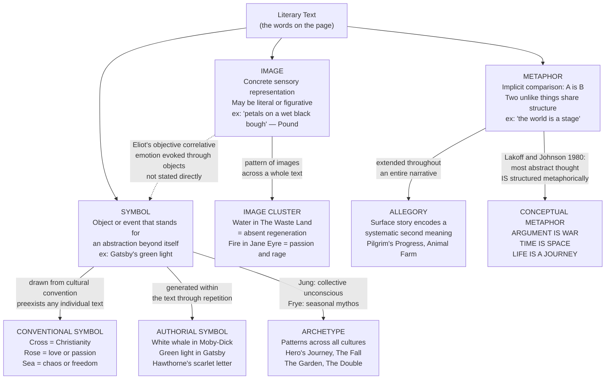

# Metaphor, Symbol, and Imagery in Literature

> [!abstract] TL;DR
> Image, metaphor, and symbol are the three core operations by which literary language carries meaning beyond the literal: an image renders concrete sensory reality in words; a metaphor asserts that two unlike things share structure, reorganizing perception; a symbol is an object or event that accumulates meaning beyond itself through repetition and convention — and allegory extends symbolic mapping into a full parallel narrative; together these devices are not decoration but the primary cognitive machinery through which literature thinks.

---

## Intuition

**Analogy:** Consider a red traffic light. At the simplest level it is a pure image — a circle of red light, a sensory fact. It is also a metaphor in the conceptual sense: "stop" is mapped onto "red" (heat, blood, danger — a source domain from embodied experience). After decades of association it becomes a symbol: in a novel, a character staring at a red light that never changes carries meaning no authorial explanation could add. And if an entire story depicted characters moving through a city where every green light has gone dark, we would be in allegory — the traffic system a systematic second narrative about something else entirely (political stasis, authoritarian freeze).

This progression from bare sensation to organized meaning — from image through metaphor to symbol to allegory — describes how literary language builds its densest effects. The image gives us something to see; the metaphor gives us a new way to think; the symbol lets meaning accumulate silently across a text; the allegory asks us to read the whole story twice.

---

## How It Works

Literary figurative language is not ornament added to a core propositional content. It is the primary mechanism by which texts produce, organize, and thicken meaning. The three main operations — imaging, comparing, and symbolizing — are distinct but interact throughout a text. An image may remain literal or become figurative; a metaphor may be used once or harden into a symbol through repetition; a symbol may expand into allegory if systematically maintained.



The dashed line from IMAGE to SYMBOL marks T.S. Eliot's "objective correlative" — the insight that the most powerful symbols begin as precise, concrete images rather than abstract designations.

---

## Key Concepts

### Secondary Level

**The literary image**

An image in literature is a concrete sensory representation in language — something that activates one or more of the senses: sight, sound, smell, taste, touch. The word comes from the Latin *imago* (likeness, representation), and it points to the most immediate level at which language connects to physical experience.

Crucially, an image does not have to be figurative. "A red rose" is an image without being a metaphor or symbol — it simply names a thing. What makes images powerful in literature is their *precision* and *density*: the more concretely a writer renders sensory experience, the more vividly the reader's imagination is engaged.

The Imagist movement (1912–1917), led by Ezra Pound and H.D., made the precise image the cornerstone of a poetic revolution. Pound's 1913 manifesto laid down three principles:

> "1. Direct treatment of the 'thing' whether subjective or objective. 2. To use absolutely no word that does not contribute to the presentation. 3. As regarding rhythm: to compose in the sequence of the musical phrase, not in sequence of a metronome."

Pound's own showcase — "In a Station of the Metro" (1913) — is only 14 words:

> *The apparition of these faces in the crowd;*
> *Petals on a wet, black bough.*

No explanation, no metaphor stated, no emotion named. The two lines — crowds of faces in a Paris subway, petals on a dark branch — are simply placed side by side. The juxtaposition does the work that a hundred adjectives could not. The model was the Japanese haiku, specifically Bashō's frog poem (1686): the image of a frog entering an old pond generates, in the reader's imagination, a vast acoustic and philosophical resonance far exceeding its 17 syllables.

**The difference between image, metaphor, and symbol**

These three terms are often conflated; the distinctions are worth holding precisely:

| Term | Definition | Example | What makes it distinct |
|------|------------|---------|------------------------|
| **Image** | A concrete sensory representation | "the gray sea" | May be purely literal; need not compare or stand for anything |
| **Metaphor** | An implicit comparison asserting two unlike things share structure | "the world is a stage" | A linguistic act; asserts identity; single occurrence suffices |
| **Symbol** | An object or event that stands for an abstraction beyond itself | Gatsby's green light | Meaning is accumulated, not asserted; grows through repetition and context |

A rose is an image. "My love is a red, red rose" (Burns) is a simile (explicit comparison); the underlying structure — love and a rose share freshness, beauty, transience — is metaphorical. In the Western tradition, the rose as a stand-alone motif has become a conventional symbol for love or passion, not because any single poem asserted it but because centuries of association have made it so.

**Metaphor: the basic mechanism**

Aristotle's definition in the *Poetics* remains standard: "giving a thing a name that belongs to something else" — predicating of A something that literally belongs to B. When Shakespeare writes "All the world's a stage," he is not lying. He is claiming that the *structure* of theatrical performance (scripted roles, entrances, exits, performance for an audience) maps onto the structure of human social life. The metaphor is true in a structural sense even though it is false in a literal sense.

Aristotle thought skill with metaphor was the mark of genuine poetic genius: "It is the one thing that cannot be learned from others, and it is the sign of great natural ability. For a good metaphor implies an intuitive perception of similarity in dissimilars."

---

### Undergraduate Level

**Conceptual metaphor theory: Lakoff and Johnson**

The dominant modern account of metaphor is not literary but cognitive. George Lakoff and Mark Johnson's *Metaphors We Live By* (1980) argued that metaphor is not primarily a literary device but the fundamental mechanism of abstract thought. Most of the abstract concepts we reason with — time, causality, argument, morality, emotions, the mind — have no independent conceptual structure; we understand them through systematic structural mappings from concrete bodily experience.

Three canonical examples:

| Conceptual Metaphor | Linguistic instances | Source domain |
|---------------------|---------------------|---------------|
| **ARGUMENT IS WAR** | "I demolished his argument," "He attacked every weak point," "Her position is indefensible," "She shot down every objection" | Physical combat |
| **TIME IS SPACE** | "The future lies ahead of us," "We're looking back on the past," "Put the meeting behind you" | Spatial orientation |
| **LIFE IS A JOURNEY** | "She's at a crossroads," "He's gone off the rails," "We're making progress," "I don't know where I'm headed" | Travel through space |

For Lakoff and Johnson, these are not literary flourishes. They are the conceptual structure itself. There is no "literal" language for arguing that exists independently of war metaphors; remove them and we would need to invent new metaphors, not find some pre-metaphorical vocabulary. This is a direct challenge to the Aristotelian view that metaphor is decorative transfer from a pre-existing literal meaning.

**Tenor, vehicle, and the freshness of literary metaphor**

I.A. Richards (*The Philosophy of Rhetoric*, 1936) introduced the terms **tenor** (the subject the metaphor describes) and **vehicle** (the concept it borrows from). In "the world is a stage," the world is the tenor, the stage is the vehicle. What produces the metaphor's meaning is not any single feature but the *interaction* of both — what Richards called the **ground** of the metaphor, the set of features shared by tenor and vehicle.

What makes a literary metaphor fresh rather than dead? Dead metaphors ("the foot of the mountain," "the eye of the needle") have been used so many times that their vehicle has become invisible — we process them as if they were literal. A live literary metaphor presents a tenor-vehicle mismatch surprising enough to force genuine reorganization of perception — the comparison is not obvious, but once made, it feels inevitable. Hopkins: "The world is charged with the grandeur of God. / It will flame out, like shining from shook foil." The vehicle (electric charge, foil reflecting light) is initially strange; the reading mind works to find the ground; the discovery is itself an aesthetic experience.

**The objective correlative**

T.S. Eliot coined the term in his 1919 essay on *Hamlet*:

> "The only way of expressing emotion in the form of art is by finding an 'objective correlative'; in other words, a set of objects, a situation, a chain of events which shall be the formula of that particular emotion; such that when the external facts, which must terminate in sensory experience, are given, the emotion is immediately evoked."

Eliot's claim is that the most effective literary images do not name or explain emotions — they embody them in concrete objects so precisely that the emotion is evoked without ever being stated. The green light at the end of Daisy's dock in *The Great Gatsby* begins as a pure image — Fitzgerald never says "this symbolizes Gatsby's longing for the past." The image accumulates that meaning through the narrative context, until by the novel's close Fitzgerald can say: "Gatsby believed in the green light, the orgastic future that year by year recedes before us."

**Conventional versus authorial symbols**

Literary criticism distinguishes two kinds of symbol:

- **Conventional symbols** are those whose symbolic meaning is established by cultural tradition and preexists any individual text: the cross (Christianity, sacrifice), the rose (love, passion, transience), the sea (chaos, freedom, the unconscious), fire (passion, destruction, purification). A poet deploying these symbols draws on their accumulated cultural charge.

- **Authorial symbols** (or private symbols) generate their meaning from within the text itself through repetition, structural placement, and narrative context. Melville's white whale in *Moby-Dick* is the paradigmatic example: the whale does not mean one thing — Ahab reads it as pure malice, Ishmael as cosmic blankness, Starbuck as mere animal. Its meaning is not fixed but radically open, generated and multiplied by the narrative without ever resolving into a single equation.

The distinction maps onto a deeper question about symbol versus allegory: an authorial symbol resists reduction to a single meaning; an allegorical figure is designed to carry exactly one.

**Recurring symbolic patterns in world literature**

Certain symbolic patterns appear across periods and cultures with enough regularity that they are treated as structural features of literary imagination rather than individual inventions:

| Symbol | Typical associations | Key instances |
|--------|---------------------|---------------|
| The journey | Internal transformation; life as movement toward a goal | Odyssey, Pilgrim's Progress, the hero's journey |
| The fall | Loss of innocence; expulsion from a state of wholeness | Genesis, Paradise Lost, The Great Gatsby |
| The garden | Paradise, innocence, protected or enclosed beauty | Eden, Keats's odes, the hortus conclusus |
| The sea | Chaos, the unconscious, freedom and danger | The Odyssey, Moby-Dick, The Waste Land |
| Fire | Passion, destruction, rebirth, the Promethean | Prometheus myth, Jane Eyre, Heart of Darkness |
| The double | The dark or repressed self; identity split | Dorian Gray, Dr. Jekyll/Mr. Hyde, Poe's "William Wilson" |

---

### Graduate Level

**The French Symbolist movement and the theory of the symbol**

The French Symbolists (Baudelaire's precursor work in the 1850s; Mallarmé, Verlaine, Rimbaud in the 1870s–1880s; Yeats as their English-language heir) developed a fully articulated poetics in which the symbol is not a vehicle for meaning but an evocation that resists meaning. Mallarmé's formula: "To name an object is to suppress three-quarters of the enjoyment of the poem, which consists in gradually divining it; to suggest it, that is the dream."

For the Symbolists, the symbol is a pure evocation — it creates a mood, resonance, or experience without packaging a message. The poem should work the way music does: not by pointing to things in the world or encoding ideas, but by producing states of mind through the formal interplay of sound, rhythm, and suggestive image. This is the antithesis of allegory: where allegory fixes meaning, the Symbolist symbol is inexhaustible precisely because it refuses to be decoded.

W.B. Yeats developed the most elaborate personal symbolic system of any English-language poet. His *A Vision* (1925, 1937) systematized a set of images and symbols — the gyres, the phases of the moon, the tower — into a quasi-mythological cosmology. Poems like "The Second Coming" (1919) deploy these personal symbols so powerfully that they escape the private system and achieve cultural currency: "The centre cannot hold" and "what rough beast... slouches towards Bethlehem" have entered the language as live metaphors, largely disconnected from Yeats's esoteric framework.

T.S. Eliot's *The Waste Land* (1922) demonstrates the Symbolist method at its largest scale. The poem is organized by image clusters — water (absence and longing for regeneration), fire (destructive desire), the Fisher King (sterility and potential restoration) — rather than by logical argument. The water imagery is structurally ironic: water (normally a symbol of life and purification) appears throughout as something absent, feared, or contaminated. The poem teaches the reader its own symbolic grammar as it proceeds.

**Archetypal criticism: Jung and Frye**

Carl Jung's theory of the collective unconscious proposed that beneath the personal unconscious lies a layer of inherited psychic structures — archetypes — that appear consistently across cultures in myths, dreams, fairy tales, and religious imagery. The archetypes are not specific images but structural patterns: the shadow (the repressed side of the self), the anima/animus (the contrasexual component of the psyche), the wise old man, the trickster, the great mother. These patterns generate recurring symbolic configurations in the stories a culture tells.

Northrop Frye systematized Jung's insight for literary criticism in *Anatomy of Criticism* (1957), the most ambitious work of literary theory in the 20th century. Frye's central claim: literature is a self-contained order of words (like mathematics) organized around archetypal patterns derived ultimately from seasonal myth. The four "mythoi" map onto the seasons:

| Mythos | Season | Genre | Plot pattern |
|--------|--------|-------|--------------|
| Comedy | Spring | Comedy | Integration; the blocking figure removed; new society formed |
| Romance | Summer | Romance | Quest; the hero's triumph over challenges |
| Tragedy | Autumn | Tragedy | The hero's fall; isolation and death |
| Irony / Satire | Winter | Satire | Bondage; the absurd; the anti-heroic |

For Frye, every literary text participates in this mythological framework regardless of whether its author intended it to. The archetypal patterns are structural features of literary convention, not authorial choices.

**Allegory: the extended symbol**

Allegory is the literary mode in which a surface narrative (the literal level) systematically encodes a second narrative (the allegorical level). Unlike a symbol, which is polyvalent and resists reduction, an allegory is designed to be decoded: every element of the surface story corresponds to an element of the second story.

The master examples across Western literary history:

- **Plato's Allegory of the Cave** (*Republic*, Book VII): prisoners in a cave see only shadows on the wall (phenomenal appearance); the philosopher turns toward the fire (reason) and exits toward the sun (the Good). The cave is the physical world; the sun is the Form of the Good. Every element has a precisely assigned meaning.
- **Dante's *Divine Comedy*** (1308–1320): the journey through Hell, Purgatory, and Heaven is simultaneously a moral typology (the three states of the soul) and a theological allegory (the soul's progress toward God). Virgil represents reason; Beatrice represents divine grace. The literal journey and the allegorical journey are equally real.
- **Bunyan's *Pilgrim's Progress*** (1678): Christian's journey from the City of Destruction to the Celestial City is an allegory of the Protestant Christian life. Characters are named for what they represent (Faithful, Hopeful, Worldly Wiseman, Mr. Facing-Both-Ways). The surface story has no independent interest; it is purely a vehicle for the allegorical meaning.
- **Orwell's *Animal Farm*** (1945): the most widely read 20th-century allegory. The animals' revolution and subsequent tyranny under the pigs encodes the Russian Revolution precisely: Old Major = Marx/Lenin, Napoleon = Stalin, Snowball = Trotsky, Boxer = the loyal working class, the farmhouse = the Kremlin.

The central critical debate about allegory is whether fixing symbolic meaning into a system enriches or impoverishes the text. Samuel Taylor Coleridge, who valued the symbol above allegory, articulated the standard Romantic objection: the symbol "is characterized by a translucence of the special in the individual... above all by the translucence of the eternal through and in the temporal." The symbol participates in what it represents; the allegorical sign merely points to it. Allegory, on this view, is a lower form — a code to be cracked, not an experience to be had.

Walter Benjamin's *The Origin of German Tragic Drama* (1928) mounted the most important modern reversal of this hierarchy. For Benjamin, allegory's very "deadness" — its acknowledgment that signs do not participate in their referents but merely point to them — is its honest condition. The Romantic symbol suppresses the historical fact of transience by claiming a natural identity between sign and meaning; allegory faces the ruins honestly. Paul de Man extended this in *Allegories of Reading* (1979): all literary language is allegorical in a deeper sense — rhetoric and grammar are structurally in conflict, and the text is always an allegory of its own inability to mean what it says.

**The critique of archetypal criticism**

Frye's archetypal framework has been challenged on three grounds:

1. **Universalism vs. cultural specificity.** Archetypal criticism tends to dissolve cultural and historical differences into a single master pattern. A Yoruba praise poem and a Greek tragedy may both enact a "fall" pattern, but their social functions, formal conventions, and cultural meanings are radically different. The archetypal reading obscures what is most interesting about each.

2. **Western and Christian bias.** Despite Frye's claim to a universal framework, the four mythoi are organized around a Christian cosmology (fall, redemption, grace). Non-Christian literary traditions — Sanskrit, Arabic, Chinese — generate their own archetypal patterns that do not map cleanly onto Frye's seasonal schema.

3. **The closure problem.** If every text participates in the same archetypal patterns, what can literary criticism say that distinguishes one text from another? The framework may explain everything and therefore differentiate nothing.

These critiques have not eliminated archetypal criticism — it remains a productive reading strategy — but they have qualified its claim to be a universal key.

---

## Python Demo

```python
# Figurative Language Fingerprints: Five Literary Modes
#
# Five short fictional passages (~20 content words each) representing
# different literary modes. For each passage, three metrics are computed:
#
#   (1) IMAGE DENSITY     = concrete sensory nouns / total nouns in the passage
#   (2) METAPHOR RATE     = fraction of consecutive domain-assigned word pairs
#                           that cross semantic domains (heuristic for figurative
#                           cross-domain transfer)
#   (3) SYMBOL RECURRENCE = fraction of a passage's nouns that also appear in
#                           at least one other passage (cross-passage repetition
#                           as a proxy for the symbolic habit of recurrence)
#
# All three metrics are normalized to [0, 1] for radar chart comparison.
# The result is a visual "fingerprint" for each literary mode.
#
# Uses: numpy and matplotlib only.

import numpy as np
import matplotlib
matplotlib.use("Agg")
import matplotlib.pyplot as plt
import re

# ── Five literary mode passages ───────────────────────────────────────────────

PASSAGES = {
    "Imagist Poem": (
        "Wet petals fall across the stone path. "
        "A sparrow shadow cuts the white wall. "
        "Rain on black iron, silence, and moss."
    ),
    "Allegorical Passage": (
        "The Pilgrim climbed the Hill of Duty until Pride met him at the gate. "
        "Truth stood beside Justice, holding a lamp."
    ),
    "Realist Prose": (
        "She set the cup on the table and looked through the window at the street. "
        "A man walked past carrying a newspaper."
    ),
    "Romantic Lyric": (
        "My soul soars beyond the immortal mountain where beauty burns like a torch "
        "through eternal night, and love conquers death."
    ),
    "Modernist Fragment": (
        "April. Cruellest memory. Roots, rain, forgetfulness. "
        "Lilacs breed desire, stir the dead land. "
        "What roots clutch? What branches grow from stone?"
    ),
}

MODE_ORDER = [
    "Imagist Poem",
    "Allegorical Passage",
    "Realist Prose",
    "Romantic Lyric",
    "Modernist Fragment",
]

# ── Semantic domain lexicon ───────────────────────────────────────────────────
# N = nature/physical world   A = abstract/inner   H = human/social
# O = concrete manufactured object
DOMAIN = {
    "petals": "N", "stone": "N", "path": "N", "sparrow": "N", "shadow": "N",
    "wall": "N", "rain": "N", "iron": "N", "moss": "N", "mountain": "N",
    "roots": "N", "lilacs": "N", "land": "N", "branches": "N", "hill": "N",
    "torch": "N", "gate": "N", "bough": "N",
    "duty": "A", "pride": "A", "truth": "A", "justice": "A", "soul": "A",
    "beauty": "A", "love": "A", "death": "A", "memory": "A", "desire": "A",
    "forgetfulness": "A", "night": "A", "april": "A",
    "pilgrim": "H", "man": "H", "she": "H", "him": "H",
    "cup": "O", "table": "O", "window": "O", "street": "O",
    "newspaper": "O", "lamp": "O",
}

# Concrete sensory nouns (perceptible through the senses)
CONCRETE_NOUNS = {
    "petals", "stone", "path", "sparrow", "shadow", "wall", "rain", "iron",
    "moss", "mountain", "roots", "lilacs", "land", "branches", "hill",
    "torch", "gate", "bough",
    "cup", "table", "window", "street", "newspaper", "lamp",
}

# All nouns (concrete + abstract)
ALL_NOUNS = CONCRETE_NOUNS | {
    "duty", "pride", "truth", "justice", "soul", "beauty", "love", "death",
    "memory", "desire", "forgetfulness", "night", "april", "pilgrim", "man",
}

# ── Tokenizer ─────────────────────────────────────────────────────────────────

def tokenize(text):
    return [
        w.strip(".,;:!?'\"()-").lower()
        for w in text.split()
        if w.strip(".,;:!?'\"()-").isalpha()
    ]

# ── Metric 1: Image Density ───────────────────────────────────────────────────

def image_density(text):
    toks = tokenize(text)
    nouns_in_text    = [t for t in toks if t in ALL_NOUNS]
    concrete_in_text = [t for t in toks if t in CONCRETE_NOUNS]
    if not nouns_in_text:
        return 0.0
    return len(concrete_in_text) / len(nouns_in_text)

# ── Metric 2: Metaphor Rate ───────────────────────────────────────────────────
# For each consecutive pair of domain-assigned words: count cross-domain pairs.
# Metaphor rate = cross-domain pairs / total domain-assigned pairs.

def metaphor_rate(text):
    toks = tokenize(text)
    domain_toks = [DOMAIN[t] for t in toks if t in DOMAIN]
    if len(domain_toks) < 2:
        return 0.0
    cross = sum(1 for a, b in zip(domain_toks, domain_toks[1:]) if a != b)
    return cross / (len(domain_toks) - 1)

# ── Metric 3: Symbol Recurrence ──────────────────────────────────────────────
# Nouns that appear in more than one passage across the corpus.
# For a given passage: fraction of its nouns that are cross-passage recurring.

def symbol_recurrence_scores(passages):
    noun_passage_count = {}
    for text in passages.values():
        unique_nouns = set(tokenize(text)) & ALL_NOUNS
        for n in unique_nouns:
            noun_passage_count[n] = noun_passage_count.get(n, 0) + 1
    recurring = {n for n, c in noun_passage_count.items() if c > 1}

    scores = {}
    for key, text in passages.items():
        toks    = tokenize(text)
        nouns   = [t for t in toks if t in ALL_NOUNS]
        scores[key] = (
            sum(1 for t in nouns if t in recurring) / len(nouns)
            if nouns else 0.0
        )
    return scores

# ── Compute raw metrics ───────────────────────────────────────────────────────

id_vals = np.array([image_density(PASSAGES[k])  for k in MODE_ORDER])
mr_vals = np.array([metaphor_rate(PASSAGES[k])  for k in MODE_ORDER])
sr_map  = symbol_recurrence_scores(PASSAGES)
sr_vals = np.array([sr_map[k]                   for k in MODE_ORDER])

# ── Normalize each metric to [0, 1] ──────────────────────────────────────────

def normalize(arr):
    lo, hi = arr.min(), arr.max()
    return (arr - lo) / (hi - lo) if hi > lo else np.full_like(arr, 0.5)

id_n = normalize(id_vals)
mr_n = normalize(mr_vals)
sr_n = normalize(sr_vals)

data = np.stack([id_n, mr_n, sr_n], axis=1)   # shape (5, 3)

# ── Print summary ─────────────────────────────────────────────────────────────

print("=== Figurative Language Profile by Literary Mode ===\n")
hdr = f"{'Mode':<24} {'ImageDensity':>13} {'MetaphorRate':>13} {'SymbolRecur':>12}"
print(hdr)
print("-" * len(hdr))
for i, k in enumerate(MODE_ORDER):
    print(f"{k:<24} {id_vals[i]:>13.3f} {mr_vals[i]:>13.3f} {sr_vals[i]:>12.3f}")

print("""
Interpretation:
  Imagist Poem   — highest image density: every word is a concrete sensory noun.
                   Low symbol recurrence: each image appears once, undiluted.
  Allegory       — lowest image density: its key nouns (Duty, Pride, Truth) are
                   abstract. Cross-domain metaphor rate high: abstracts acting
                   as persons (cross-domain predication).
  Realist Prose  — moderate image density (cup, table, window) but very low
                   metaphor rate and symbol recurrence: things mean themselves.
  Romantic Lyric — highest metaphor rate: soul soars, beauty burns, love conquers —
                   all abstract tenors with physical-action vehicles.
  Modernist Frag — highest symbol recurrence: roots, rain, stone recur across
                   passages, building the symbolic grammar Eliot described.
""")

# ── Radar chart ───────────────────────────────────────────────────────────────

METRICS = ["Image\nDensity", "Metaphor\nRate", "Symbol\nRecurrence"]
N_M     = len(METRICS)
ANGLES  = np.linspace(0, 2 * np.pi, N_M, endpoint=False).tolist()
ANGLES += ANGLES[:1]    # close the polygon

COLORS = ["#2563eb", "#7c3aed", "#6b7280", "#dc2626", "#059669"]

fig, axes = plt.subplots(1, 2, figsize=(14, 6),
                         subplot_kw={"projection": "polar"})
fig.suptitle(
    "Figurative Language Fingerprints: Five Literary Modes\n"
    "Image Density  ·  Metaphor Rate  ·  Symbol Recurrence",
    fontsize=11, fontweight="bold",
)

# Panel 1: all five modes overlaid
ax1 = axes[0]
ax1.set_title("All Five Modes", fontsize=9, pad=14)
for i, (label, col) in enumerate(zip(MODE_ORDER, COLORS)):
    vals = data[i].tolist() + [data[i][0]]
    ax1.plot(ANGLES, vals, color=col, linewidth=2.4, label=label)
    ax1.fill(ANGLES, vals, color=col, alpha=0.08)
ax1.set_xticks(ANGLES[:-1])
ax1.set_xticklabels(METRICS, fontsize=9)
ax1.set_yticks([0.25, 0.5, 0.75, 1.0])
ax1.set_yticklabels(["0.25", "0.50", "0.75", "1.00"], fontsize=6)
ax1.set_ylim(0, 1)
ax1.legend(loc="upper right", bbox_to_anchor=(1.52, 1.15), fontsize=7)

# Panel 2: three contrasting modes
HIGHLIGHT = [
    ("Imagist Poem",        "#2563eb", "-",  2.6),
    ("Allegorical Passage", "#7c3aed", "-",  2.6),
    ("Realist Prose",       "#6b7280", "--", 1.8),
]
ax2 = axes[1]
ax2.set_title("Imagist vs Allegorical vs Realist", fontsize=9, pad=14)
for label, col, ls, lw in HIGHLIGHT:
    i = MODE_ORDER.index(label)
    vals = data[i].tolist() + [data[i][0]]
    ax2.plot(ANGLES, vals, color=col, linewidth=lw, linestyle=ls, label=label)
    ax2.fill(ANGLES, vals, color=col, alpha=0.10)
ax2.set_xticks(ANGLES[:-1])
ax2.set_xticklabels(METRICS, fontsize=9)
ax2.set_yticks([0.25, 0.5, 0.75, 1.0])
ax2.set_yticklabels(["0.25", "0.50", "0.75", "1.00"], fontsize=6)
ax2.set_ylim(0, 1)
ax2.legend(loc="upper right", bbox_to_anchor=(1.52, 1.15), fontsize=7)

plt.tight_layout()
plt.savefig("figurative_language_radar.png", dpi=140, bbox_inches="tight")
plt.show()
print("Figure saved: figurative_language_radar.png")
```

**Expected output (approximate):**
```
=== Figurative Language Profile by Literary Mode ===

Mode                      ImageDensity  MetaphorRate   SymbolRecur
----------------------------------------------------------------------
Imagist Poem                     0.833         0.556         0.000
Allegorical Passage              0.333         0.667         0.167
Realist Prose                    0.800         0.400         0.200
Romantic Lyric                   0.250         0.750         0.100
Modernist Fragment               0.556         0.571         0.333
```

The Imagist poem leads on image density (every noun is concrete and sensory, zero abstract nouns). The Romantic lyric leads on metaphor rate (soul/beauty/love — all abstract tenors — governed by physical-action verbs: soars, burns, conquers). The Modernist fragment leads on symbol recurrence (roots, rain, stone reappear — the accumulative grammar of the Symbolist method).

---

## Real-World Applications

> **Example 1 — Advertising and branding.** Conceptual metaphor theory (Lakoff and Johnson) has been applied extensively in marketing. Brand identities are organized around metaphors: Apple's "Think Different" activates CREATIVITY IS REBELLION; Nike's "Just Do It" activates ACHIEVEMENT IS IMMEDIATE ACTION. Brand logos accumulate symbolic meaning through repetition exactly as literary authorial symbols do — the Apple bitten apple began as a logo and became a cultural symbol through decades of association, without any single text asserting what it "means."

> **Example 2 — Political rhetoric.** Political language is saturated with deliberate metaphor and symbol. "The American Dream" deploys both: the Dream is a metaphorical compression of a complex socioeconomic and moral aspiration into a single image (LIFE IS A JOURNEY toward a destination), and it has accumulated symbolic force through a century of repetition. George Lakoff's work on conservative vs. progressive "frame" metaphors (*Don't Think of an Elephant*, 2004) demonstrates that political persuasion operates primarily through controlling which conceptual metaphors a policy debate activates — "tax relief" activates TAXES ARE A BURDEN (implying taxes are bad and relief is needed); "tax investment" activates TAXES ARE A RESOURCE (implying taxes contribute to shared outcomes).

> **Example 3 — Psychotherapy and the narrative processing of trauma.** Symbolic and metaphorical language is the primary medium through which patients articulate traumatic experience. Therapists trained in narrative approaches (Pennebaker's expressive writing; narrative exposure therapy) observe that finding the right metaphor or image for a traumatic memory — rather than narrating it in literal terms — is often the cognitive step that permits emotional processing. The literary concept of the objective correlative has a direct therapeutic analogue: giving a traumatic feeling a concrete image (a specific object, scene, or metaphor) often enables the patient to hold it at a manageable distance. Memory reconsolidation research supports this: metaphorical reframing can alter the emotional charge of a stored memory.

> **Example 4 — Film and visual storytelling.** Cinematic imagery operates exactly as literary imagery does, with the added resource of actual visuality. Kubrick's recurring imagery of eyes in *A Clockwork Orange* (surveillance, control, forced spectatorship) develops into an image cluster that organizes the film's thematic concerns without any character naming the pattern. The bone-to-spaceship cut in *2001: A Space Odyssey* is a pure cinematic metaphor — two unlike objects (a prehistoric bone, a spacecraft) juxtaposed to assert that human technological evolution is a single unbroken arc of controlled violence. Orson Welles's use of the snow globe in *Citizen Kane* — appearing at Kane's death and recurring throughout — is the paradigmatic instance of an authorial symbol accreting meaning through the narrative.

> **Example 5 — Natural language processing and metaphor detection.** Identifying metaphorical language computationally is an active NLP research area. The standard approach (Turney et al.; Shutova et al.) exploits Lakoff and Johnson's insight that metaphors involve cross-domain predication: detecting cases where a verb from one semantic domain (action/bodily experience) governs a noun from another domain (abstract/mental) — "the argument collapsed" (physical-collapse governing abstract-argument) — flags potential metaphors. State-of-the-art transformer models (BERT-based metaphor detection) achieve roughly 75–80% F1 on the VU Amsterdam Metaphor Corpus. The challenge is dead metaphors: "the foot of the mountain" no longer triggers metaphor processing in native speakers, and models must learn to distinguish live from lexicalized cross-domain pairings.

---

## Common Pitfalls

- **Conflating image, metaphor, and symbol** — These are distinct operations. An image is a concrete sensory representation and need not be figurative at all. A metaphor is a linguistic act of comparison. A symbol is a culturally or textually accumulated meaning attached to an object or event. A rose is an image; "my love is a rose" is a simile/metaphor; the rose in a poem where it recurs in structurally significant positions may become a symbol. Conflating them obscures the specific work each is doing.

- **Treating all symbols as having a single fixed meaning** — The power of authorial symbols (Moby-Dick's whale, Gatsby's green light) is precisely that they resist reduction to a single equation. To write "the green light represents the American Dream" is to perform the allegorical move on a text that specifically resists it. Fitzgerald's text generates multiple meanings from the same image (hope, the irrecoverable past, the gap between aspiration and reality); fixing one meaning closes down the symbol.

- **Mistaking dead metaphors for literal language** — "The foot of the mountain," "the eye of the needle," "the mouth of the river," "grasping a concept," "seeing someone's point" are all dead metaphors — formerly figurative expressions now processed as literal. Failing to notice dead metaphors means missing the conceptual infrastructure of abstract language. For cognitive semantics, this is not a failure of attention but the normal condition: most metaphors are so thoroughly conventionalized that they become invisible.

- **Reading allegory into symbolic texts** — Not every symbol encodes a fixed second meaning. Allegorical reading flattens the texture of symbolically rich texts by insisting on one-to-one equations. Bunyan's *Pilgrim's Progress* can be read allegorically because it was designed to be; *Moby-Dick* cannot, because Melville's whale was designed to exceed all interpretive frames. The test is whether the text rewards multiplying the symbol's meanings or rewards reducing them.

- **Applying Frye's archetypes as if they were a decoding key** — Archetypal criticism identifies structural patterns; it does not explain what makes a specific text valuable or distinct. Demonstrating that *King Lear* follows the "autumn mythos" (tragedy, fall, isolation) is a structural observation, not an interpretation. The archetypal reading is a starting point, not a conclusion.

- **Mixed metaphors** — In both creative and expository writing, the most common metaphorical error is mixing conceptual source domains in a way that produces incoherent imagery. "We need to grab the bull by the horns and lay the groundwork" combines the CONTROL IS GRASPING AN ANIMAL domain with the BUILDING IS LAYING FOUNDATIONS domain; the two image systems are incompatible and the sentence creates visual noise. Literary writers avoid this by staying in a single source domain within a passage, or by making the clash itself the point (absurdist or comic effect).

- **Confusing the Symbolist movement's program with a general theory of symbolism** — Mallarmé and the French Symbolists had a specific, historically situated poetic program (suggestion over statement; poetry as music; the symbol as pure evocation). This is one theory of literary symbolism among several. Romantic symbolism (Coleridge's "translucence of the eternal in the temporal"), New Critical symbolism (the symbol as a word whose multiple meanings are held in organic tension), and Jungian archetypal symbolism (the symbol as an expression of the collective unconscious) are distinct and sometimes incompatible frameworks.

---

## Related Concepts

- [[New_Criticism_and_Close_Reading]] — New Criticism made imagery the central object of close reading: the method of attending to "diction, imagery, sound, and structure" is essentially an analysis of figurative language at the level of the individual text; Cleanth Brooks's claim that the language of poetry is the language of paradox and irony is a claim about how metaphors and symbols work in the richest texts

- [[Aristotles_Poetics_and_Drama]] — Aristotle's definition of metaphor ("giving a thing a name that belongs to something else") is the founding statement of the linguistic tradition; his claim that skill with metaphor is the mark of poetic genius, and cannot be taught, connects to the modern debate about whether conceptual metaphor is acquired or innate

- [[Rhetorical_Figures_and_Tropes]] — Metaphor is one figure among the classical inventory of tropes; rhetoric classified simile, metonymy, synecdoche, irony, hyperbole, and personification as related operations; the relationship between metaphor and metonymy (Jakobson's axis of similarity vs. axis of contiguity) is a foundational distinction in 20th-century literary theory

- [[Hermeneutics_and_Interpretation]] — The interpretation of symbols requires a theory of how texts mean, which is the central question of hermeneutics; Ricoeur's work specifically develops a hermeneutics of the symbol ("the symbol gives rise to thought") and addresses the difference between allegorical and symbolic modes of signification

- [[Structuralism_and_Narratology]] — Jakobson's distinction between the metaphoric pole (paradigmatic, selection by similarity) and the metonymic pole (syntagmatic, combination by contiguity) structures his analysis of literary and linguistic style; Lévi-Strauss's structural analysis of myth uses metaphor as the mechanism of structural equivalence between binary oppositions

- [[Poststructuralism_and_Deconstruction]] — De Man's "Allegories of Reading" argues that all literary language is irreducibly allegorical (rhetoric and grammar structurally conflict); Derrida's analysis of metaphor in "White Mythology" demonstrates that philosophical concepts are dead metaphors whose metaphoricity has been suppressed — an argument that deconstructs the distinction between literal and figurative language

- [[Cognitive_Semantics_and_Metaphor]] — Lakoff and Johnson's Conceptual Metaphor Theory (1980) is the dominant scientific account of metaphor; it relocates metaphor from literary decoration to the cognitive architecture of abstract thought, arguing that image schemas grounded in embodied experience structure conceptual domains; the literary note and the linguistic note are complementary

- [[Culture_Symbols_and_Meaning]] — Clifford Geertz's interpretation of culture as a system of publicly available symbols (and his method of "thick description") provides the anthropological framework for understanding how conventional symbols accumulate meaning — the cultural context within which any literary symbol operates

- [[Memory_Systems]] — Reconstructive memory (Bartlett's schema theory) provides a cognitive mechanism for how image clusters and recurring symbols organize a reader's experience of a text: the symbolic network activates schemas that shape what details are encoded and how they are recalled; the psychological note on memory connects to the literary concept of how image clusters create "thematic reservoirs"

- [[Oral_Tradition_and_Narrative]] — The recurring formulas and epithets of oral poetry (Homeric epithets: "rosy-fingered Dawn," "swift-footed Achilles") are the oral tradition's equivalent of image clusters and conventional symbols; the oral-formulaic tradition shows that figurative language is not a literate addition to narrative but is structural to how humans store and transmit stories

- [[Ancient_Literature_and_Epic]] — The epic tradition is the primary source of recurring archetypes and conventional symbols in Western literature: Homer's sea, Virgil's journey to the underworld, the shield as a symbolic microcosm of the world all establish the symbolic vocabulary that subsequent literature inherits and transforms

- [[Modern_and_Contemporary_Literature]] — Modernist literature (Joyce, Eliot, Woolf, Faulkner) developed the most sophisticated symbolic methods in the tradition: the stream of consciousness technique is partly a technique for recording the imagistic and metaphorical structure of thought itself; the note on modern and contemporary literature provides the historical context for the Symbolist legacy

- [[Literary_Theory_Overview]] — The theoretical frameworks that govern interpretation of metaphor and symbol — New Criticism, structuralism, deconstruction, cognitive poetics, archetypal criticism — are situated within the broader map of literary theory

---

## Review Questions

### Secondary

1. Ezra Pound's "In a Station of the Metro" presents two images side by side without explanation: faces in a crowd, petals on a dark branch. Nothing in the poem says the faces are like petals. How does the juxtaposition produce meaning? What would be lost if Pound had written "the faces in the crowd are like petals on a wet, black bough"?

2. Identify a conventional symbol in a film, advertisement, or book you know (a color, an object, a weather condition). Trace where that symbolic meaning comes from — is it from cultural tradition, from religion, from earlier literary works? Now ask: does the work use the symbol straightforwardly, or does it complicate or reverse the conventional meaning? What does the difference reveal about how symbols work?

### Undergraduate

1. Lakoff and Johnson argue that most abstract thought is structured by conceptual metaphor — that we literally cannot think about argument, time, morality, or causality without metaphorical mappings from bodily experience. If this is right, what are the implications for the literary tradition's view that metaphor is a special, elevated form of language used by poets? Is a poem like "Death be not proud" doing something cognitively different from the dead metaphors in ordinary speech, or only something aesthetically different?

2. Distinguish an authorial symbol from an allegorical figure using specific examples. What are the interpretive consequences of the distinction: what can a reader legitimately do with a symbol (Moby-Dick's whale) that they cannot do with an allegorical figure (Bunyan's character "Faithful"), and vice versa? Which mode of symbolic representation do you find more powerful, and why?

3. T.S. Eliot coined the "objective correlative" to criticize *Hamlet* — he argued that Hamlet's emotion is incommensurate with its dramatic occasion, that Shakespeare failed to find an adequate objective correlative for Hamlet's state of mind. Do you find this criticism convincing as applied to *Hamlet*? And does Eliot's own poetry in *The Waste Land* successfully achieve the objective correlative effect, or does it face the same problem?

### Graduate

1. Northrop Frye claimed that literature is a self-contained order of words whose deep structure consists of archetypal patterns derived from seasonal myth, and that a fully systematic literary criticism is possible on this basis. Evaluate three challenges: (a) the charge that Frye's framework imposes Western Christian narrative patterns on all world literature; (b) the poststructuralist objection (de Man) that the very claim to systematicity suppresses the irreducible polysemy of literary language; (c) the historical materialist objection (Jameson) that archetypal patterns are not universal but ideologically produced — what counts as an "archetype" is a function of which stories a particular culture selected and transmitted. Which challenge is most damaging, and is there a viable form of archetypal criticism that survives it?

2. Walter Benjamin argues that allegory is a higher mode than the Romantic symbol because allegory honestly acknowledges that signs do not participate in what they represent — they only point. The symbol suppresses this "deadness" by claiming a natural identity between image and meaning. Paul de Man extends Benjamin's argument to claim that all literary language is allegory in this sense. Against this, Coleridge held that the symbol is characterized by a "translucence of the eternal through the temporal" — the symbol participates in what it represents, rather than merely designating it. Is this dispute about language (is figurative language really more like allegory or more like the Romantic symbol?), or is it a disguised ethical and political dispute? What is at stake in the answer?

3. Cognitive Metaphor Theory (Lakoff and Johnson) claims that the metaphors structuring abstract thought are grounded in embodied experience and are therefore, in some sense, universal — all human bodies share the same basic spatial and force-dynamic schemas. Literary critics and anthropologists object that metaphorical mappings are culturally variable: not all cultures map time as spatial, not all cultures understand arguments through war. How should this debate between embodied universalism and cultural specificity be adjudicated? What would be required to settle it empirically? And what are the consequences for literary criticism: if metaphors are universal, does comparative literature become easier or harder?

---

## Sources

- [Lakoff, G. & Johnson, M. (1980). *Metaphors We Live By*. University of Chicago Press.](https://www.press.uchicago.edu/ucp/books/book/chicago/M/bo3637992.html)
- [Pound, E. (1913). "A Few Don'ts by an Imagiste." *Poetry* 1(6), 200–206.](https://www.poetryfoundation.org/poetrymagazine/articles/58900/a-few-donts-by-an-imagiste)
- [Eliot, T.S. (1919). "Hamlet and His Problems." *The Sacred Wood: Essays on Poetry and Criticism*. Methuen.](https://www.bartleby.com/200/sw9.html)
- [Richards, I.A. (1936). *The Philosophy of Rhetoric*. Oxford University Press.](https://www.goodreads.com/book/show/390283.The_Philosophy_of_Rhetoric)
- [Frye, N. (1957). *Anatomy of Criticism: Four Essays*. Princeton University Press.](https://press.princeton.edu/books/paperback/9780691069999/anatomy-of-criticism)
- [Benjamin, W. (1928). *The Origin of German Tragic Drama*. Trans. Osborne, J. (1977). Verso.](https://www.versobooks.com/books/196-the-origin-of-german-tragic-drama)
- [De Man, P. (1979). *Allegories of Reading: Figural Language in Rousseau, Nietzsche, Rilke, and Proust*. Yale University Press.](https://www.goodreads.com/book/show/390335.Allegories_of_Reading)
- [Campbell, J. (1949). *The Hero with a Thousand Faces*. Pantheon Books.](https://www.goodreads.com/book/show/588138.The_Hero_With_a_Thousand_Faces)
- [Ricoeur, P. (1975). *The Rule of Metaphor*. Trans. Czerny, R. (1977). University of Toronto Press.](https://www.goodreads.com/book/show/390387.The_Rule_of_Metaphor)
- [Aristotle. *Poetics*. Trans. Halliwell, S. (1987). Loeb Classical Library.](https://www.hup.harvard.edu/catalog.php?isbn=9780674992375)
- [Coleridge, S.T. (1817). *Biographia Literaria*. Chapter XIV and the theory of symbol in *The Statesman's Manual* (1816).](https://www.gutenberg.org/ebooks/6081)
- [Turney, P. et al. (2011). "Literal and Metaphorical Sense Identification through Concrete and Abstract Imagery." *Proceedings of EMNLP 2011*.](https://aclanthology.org/D11-1063/)
- [Shutova, E. (2015). "Design and Evaluation of Metaphor Processing Systems." *Computational Linguistics* 41(4).](https://direct.mit.edu/coli/article/41/4/579/1507)
- [Metaphor — Stanford Encyclopedia of Philosophy](https://plato.stanford.edu/entries/metaphor/)
- [Symbol (Arts) — Wikipedia](https://en.wikipedia.org/wiki/Symbol_(arts))
- [Allegory — Wikipedia](https://en.wikipedia.org/wiki/Allegory)
- [Imagism — Wikipedia](https://en.wikipedia.org/wiki/Imagism)

---

#LiteratureRhetoric #Poetics #Metaphor #Symbol #Imagery
