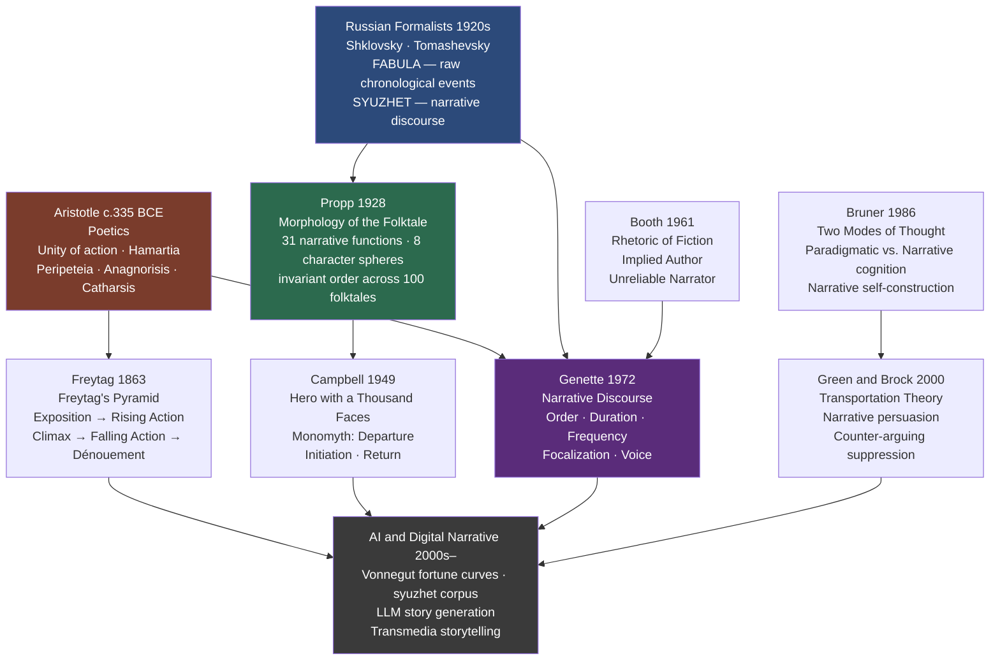

# Narrative Structure and Storytelling

> [!abstract] TL;DR
> Narrative structure is the grammar of stories — the invisible architecture of causal links, character roles, and emotional arc that transforms a sequence of events into something a human mind recognizes as complete. From Aristotle's unity of action to Propp's 31 morphological functions, Genette's temporal categories, and Vonnegut's fortune curves, the study of narrative structure reveals both universal cognitive attractors (certain arc shapes feel inevitable across cultures) and culturally specific ideological formations (whose heroes, whose kinds of resolution, whose stories count as structurally "whole").

---

## Intuition

**Analogy:** When someone is telling you a story and you feel it going wrong — meandering, stopping before the real point, delivering a twist that feels unearned — you are not responding to the events themselves. The events could be fascinating. You are responding to the *shape*: a violation of the structural grammar your mind learned from thousands of stories absorbed since childhood. Narrative structure is what your mind tracks beneath the surface content, the way a musician's ear tracks harmonic tension and resolution beneath a melody.

Just as a Western-trained ear hears a I–IV–V–I progression as resolved and a ii–V without resolution as suspended, a mind trained on thousands of stories expects certain narrative progressions to satisfy: tension must rise before it can fall; the protagonist must lose something before they gain; a planted detail in Act One must matter in Act Three. When structure is violated without purpose, the story feels "off." When it is satisfied with originality, the story feels inevitable — and that experience of inevitability is the signature of craft.

---

## How It Works

### Core Mechanics

The master distinction in narrative theory is between **FABULA** and **SYUZHET** — terms from the Russian Formalists (Shklovsky, Tomashevsky, 1920s) that map onto Genette's later "story" vs. "narrative discourse":

- **FABULA** (story): the raw chronological events of the story world — "what happened," in the order it happened, regardless of how the narrative presents them
- **SYUZHET** (discourse): the narrative's actual arrangement of those events — which order they appear in, how much time is spent on each, whose perspective filters them, what is shown and what is withheld

In *Gone Girl* (Flynn, 2012), the fabula includes Nick and Amy Dunne's deteriorating marriage and Amy's meticulous planning of her own disappearance — all in chronological order. The syuzhet begins with Nick discovering Amy missing, then interleaves apparently genuine diary entries (moving forward in time) with his present-day investigation. When the midpoint reveal shows the diary was fabricated, the reader simultaneously revises their entire understanding of the fabula. The novel's architecture is an engineered gap between what the syuzhet presents and what the fabula actually is.

This distinction generates the full machinery of narrative analysis: whenever the syuzhet departs from the fabula — through flashback, unreliable narration, ellipsis, or selective withholding — something purposeful is happening.

**The major structural models:**

| Model | Author | Year | Core Unit | Key Claim |
|-------|--------|------|-----------|-----------|
| Aristotelian plot | Aristotle | ~335 BCE | Mythos (action) | Causal unity: beginning → middle → end by necessity or probability |
| Freytag's Pyramid | Gustav Freytag | 1863 | Five-stage arc | All drama follows a rising-and-falling tension curve |
| Narrative functions | Vladimir Propp | 1928 | 31 functions, 8 roles | All Russian folktales share the same function sequence |
| Monomyth | Joseph Campbell | 1949 | Three-stage journey | All hero narratives share Departure–Initiation–Return |
| Three-act structure | Syd Field (codified) | 1979 | Three acts with plot points | Hollywood narrative grammar |
| Narrative discourse | Gérard Genette | 1972 | Five analytical categories | Order / Duration / Frequency / Focalization / Voice fully describe technique |

### Flow / Architecture



---

## Key Concepts

### Secondary Level

**FABULA vs. SYUZHET — Story vs. Discourse**

The fabula/syuzhet pair is the master key to narrative analysis. Every storytelling technique — flashback, unreliable narrator, in medias res opening, slow reveal of backstory — is a manipulation of the relationship between fabula and syuzhet. When the syuzhet matches the fabula (events told in the order they occurred), we have chronicle; when the syuzhet departs from the fabula, we have art.

In English narratology (Chatman's *Story and Discourse*, 1978), the same distinction is "story" vs. "discourse." In Genette's French, it is *histoire* vs. *récit*. The terminology varies; the distinction is universal across all narrative traditions.

**Freytag's Pyramid**

Gustav Freytag, a 19th-century German playwright, published *Die Technik des Dramas* in 1863 and visualized the dramatic arc as five stages:

1. **Exposition**: the initial situation — characters, setting, and the status quo before disruption
2. **Rising Action** (*Steigerung* — escalation): complications accumulate, tension mounts, the protagonist approaches a point of no return
3. **Climax** (*Höhepunkt* — high point): maximum tension; the event that determines the outcome
4. **Falling Action** (*Umkehr* — reversal): consequences of the climax unfold toward resolution
5. **Catastrophe / Dénouement**: final resolution — ruin in tragedy, restoration in comedy

Freytag designed this to describe Greek tragedy and Shakespeare. It maps less well onto episodic television, modernist fiction, or non-linear hypertexts — but remains the most widely reproduced diagram in creative writing pedagogy.

**Propp's 31 Functions and 8 Character Roles**

Vladimir Propp (1895–1970) published *Morphology of the Folktale* in Russian in 1928. After its English translation in 1958, it transformed narrative theory worldwide.

Propp studied exactly 100 Russian wonder tales and found that despite enormous surface variety, all share the same underlying sequence of **narrative functions** — actions defined by their significance for the plot, regardless of who performs them. Functions always appear in the same order when they appear; not all appear in every tale, but those that do respect the sequence.

**Eight character spheres** (roles) define structural positions, not individual characters. One character can fill multiple roles; one role can be distributed across multiple characters:

| Role | What they do |
|------|-------------|
| **Hero** | Undertakes the quest; the narrative's main engine |
| **Villain** | Creates the initial harm or lack |
| **Donor** | Tests the hero and provides a magical agent |
| **Helper** | Assists the hero on the quest |
| **Dispatcher** | Sends the hero on the mission |
| **Princess** | The sought-for person or goal of the quest |
| **Father of the princess** | Sets tasks; rewards the hero |
| **False Hero** | Claims the reward without earning it; is exposed |

In *Harry Potter*: Dumbledore fills Donor and Dispatcher simultaneously; Ron and Hermione fill Helper; Voldemort fills Villain; the wizarding world's future fills Princess/Sought-for-person.

**Campbell's Monomyth / Hero's Journey**

Joseph Campbell's *The Hero with a Thousand Faces* (1949) synthesized Propp's morphology with Jungian psychology and van Gennep's rites of passage (separation → liminality → incorporation) into one universal narrative pattern, the **monomyth**:

1. **Departure**: Call to adventure; crossing the threshold from ordinary world to extraordinary
2. **Initiation**: Trials; helpers; the supreme ordeal in the innermost cave; acquisition of the boon
3. **Return**: The road back; resurrection or transformation; return bearing the elixir for the community

Christopher Vogler adapted this into a 12-stage model for Hollywood screenwriters (*The Writer's Journey*, 1992). George Lucas explicitly used Campbell's framework for *Star Wars*.

**Three-Act Structure**

Codified by Syd Field in *Screenplay* (1979) — the dominant grammar of Hollywood feature films:

- **Act I (Setup)**: Establish world, protagonist, stakes. Ends with Plot Point 1 — the inciting incident that launches the protagonist into the central conflict (~pages 1–25 of a 110-page screenplay)
- **Act II (Confrontation)**: Protagonist pursues goal against escalating obstacles. Midpoint shift at page 55. Ends with Plot Point 2 — the dark night of the soul, all seems lost (~pages 25–85)
- **Act III (Resolution)**: Protagonist uses what they have learned to confront the antagonist; climax; new equilibrium (~pages 85–110)

Field's plot points map directly onto Aristotelian structure: Plot Point 1 = hamartia trigger; midpoint = partial anagnorisis; Plot Point 2 = peripeteia; climax = catastrophe or triumph.

---

### Undergraduate Level

**Genette's Narratology — The Full Framework**

Gérard Genette's *Narrative Discourse* (*Discours du récit*, 1972) — developed through extended analysis of Proust's *In Search of Lost Time* — built the most rigorous systematic vocabulary for narrative analysis. Five dimensions organize all narrative technique:

**ORDER — Anachronies (departures from chronological sequence)**

- **Analepsis** (flashback): the narrative moves back to events earlier than the current narrative moment. *In Search of Lost Time* begins in semi-conscious adult present and reaches back to Combray through the madeleine.
- **Prolepsis** (flash-forward): the narrative anticipates future events. "He didn't know it yet, but this was the last time he would see her."

**DURATION — Ratio of narrative time to story time**

| Category | Relationship | Effect |
|----------|-------------|--------|
| **Scene** | Narrative ≈ story time | Full presence; high engagement (dialogue, action) |
| **Summary** | Narrative << story time | Compression ("Ten years passed") |
| **Ellipsis** | Story time passes; narrative time = 0 | Time skipped entirely |
| **Stretch** | Narrative >> story time | Slow-motion analysis of one moment |
| **Pause** | Narrative time continues; story time = 0 | Pure description; no events occur |

**FREQUENCY**

- **Singulative**: told once what happened once (the default)
- **Iterative**: told once what happened many times ("Every Tuesday she walked to the market")
- **Repetitive**: told multiple times what happened once (*Rashomon* — the same murder from four perspectives)

**FOCALIZATION — Who perceives?**

Genette separates *who sees* (focalization) from *who speaks* (voice) — a distinction point-of-view theory had previously conflated:

- **Zero focalization**: narrator knows more than any character — omniscient narrator of 19th-century realism
- **Internal focalization**: narrative filtered through one character's perspective — we know only what they know
- **External focalization**: narrator knows *less* than the characters — pure behaviorist narration (Hemingway's "Hills Like White Elephants")

**VOICE — Who narrates?**

- **Homodiegetic**: narrator participated in the events narrated (first-person, was there)
- **Heterodiegetic**: narrator did not participate (most third-person narrators)
- **Autodiegetic**: narrator is the hero of their own story (most first-person novels)
- **Intradiegetic**: a character narrates a story to other characters within the narrative (Scheherazade)

A first-person narrator can use external focalization (Nelly Dean observing Heathcliff); a third-person narrator can use deep internal focalization (Flaubert's rendering of Emma Bovary's consciousness). The variables are independent.

**Unreliable Narration — Wayne Booth**

Booth's *The Rhetoric of Fiction* (1961) introduced two essential concepts:

**The implied author**: the version of the controlling intelligence the reader constructs from the text — not the biographical author but the organizing sensibility whose values and norms shape what the narrative endorses and condemns. Even a story with no explicit narrator has an implied author, reconstructed from what is selected, how characters are judged, what outcomes are endorsed.

**The unreliable narrator**: a narrator whose account diverges from what the implied author and reader understand to be true. Unreliability arises from:

| Text | Narrator | Source of unreliability |
|------|----------|------------------------|
| Poe, "The Tell-Tale Heart" (1843) | Unnamed murderer | Psychosis — cannot distinguish real from imagined |
| James, *The Turn of the Screw* (1898) | The governess | Ambiguous — paranoia or genuine supernatural? |
| Nabokov, *Lolita* (1955) | Humbert Humbert | Self-interest — a criminal aestheticizing his crimes |
| Ishiguro, *The Remains of the Day* (1989) | Stevens | Self-deception — rationalizing a wasted life |
| Flynn, *Gone Girl* (2012) | Amy Dunne (diary) | Deliberate fabrication — evidence planted for police |

The reader's cognitive task: reconstruct the real fabula behind the narrator's distorted syuzhet. Reading the gap between what the narrator claims and what actually happened is itself the literary experience the text is designed to produce.

---

### Graduate Level

**Bruner's Two Modes of Thought — Narrative as Cognitive Mode**

Jerome Bruner's *Actual Minds, Possible Worlds* (1986) proposed that human cognition operates in two fundamentally different and irreducible modes:

1. **Paradigmatic (logico-scientific) mode**: formal logic, causal analysis, categorization, empirical verification. Deals in propositions that are true or false, generalizations that are universally valid.
2. **Narrative mode**: events organized by temporal sequence, human intention, and moral evaluation. Deals in stories that are more or less *believable* (verisimilitudinous) rather than true or false.

The paradigmatic mode asks: "Is this claim universally valid?" The narrative mode asks: "Is this story believable — does it ring true to how people act under these conditions?"

Bruner's claim is stronger than "humans like stories." It is that narrative is a fundamental *epistemic mode* — a way of organizing experience that precedes and shapes knowledge content. The self is constituted through narrative: autobiographical memory is not a passive record but an actively constructed story that selects events, assigns causal roles, imposes temporal order, and generates a sense of personal continuity across time. A person who cannot construct a coherent narrative of their own past — as in certain amnesias or severe trauma — experiences a profound disorder of selfhood, not merely a memory problem.

This grounds the therapeutic practices of narrative medicine (Rita Charon, Columbia University), narrative therapy (Michael White, David Epston), and cognitive processing therapy: what these practices do is help patients reconstruct narrative coherence where trauma has disrupted it. Structure is not merely aesthetic; it is constitutive of psychological integrity.

**Transportation Theory — Narrative as Persuasion Mechanism**

Melanie Green and Timothy Brock (*Journal of Personality and Social Psychology*, 2000) provided the experimental social-psychological account of why narrative persuades differently from argument.

**Transportation**: the experience of losing oneself in a narrative — focused attention on the story world, vivid mental imagery, disconnection from real-world concerns. Transportation has a specific cognitive signature:

1. **Reduced counter-arguing**: transported readers generate fewer counter-arguments against the story's implicit claims. A statistic can be argued with; a character whose experience instantiates the statistic bypasses the propositional defense system entirely.
2. **Persistent attitude change**: transportation-induced attitude change is more resistant to subsequent counter-persuasion than argument-induced change, because it is anchored in vivid mental simulation rather than explicit propositional memory.
3. **Parasocial identification**: transportation produces identification with characters that generalizes beyond the reading. Exposure to diverse characters in fiction reduces prejudice toward the groups they represent — the "narrative empathy" effect (parasocial contact hypothesis, Schiappa et al., 2005).

This framework explains:
- Why anti-smoking campaigns that tell individual stories outperform statistical presentations
- Why propaganda has historically relied on narrative: Riefenstahl's *Triumph of the Will* achieves what no policy document could
- Why availability heuristic bias and narrative thinking are connected — information in story form is more easily mentally simulated, and therefore more cognitively available, than equivalent propositional information

**The Narratology vs. Ludology Debate in Games**

The extension of narrative theory to video games generated one of the most productive methodological debates in media studies:

- **Narratology** (Janet Murray, *Hamlet on the Holodeck*, 1997; Marie-Laure Ryan): games are a new narrative form — interactive, procedurally generated stories in which the player is protagonist. Narratological tools (fabula/syuzhet, focalization, character function) apply with modification.
- **Ludology** (Espen Aarseth, Jesper Juul): games are fundamentally *not* stories. They are rule-systems generating problem-solving situations; "narrative" is a frame, not the constitutive logic. Applying narrative theory to games is a category error.

The productive resolution (Juul's later work): most games exist on a spectrum. Pure puzzle games (*Tetris*) have minimal narrative; heavily authored RPGs (*Red Dead Redemption 2*) have deep narrative that narratological tools illuminate; sandbox games (*Minecraft*) are environments for emergent personal narrative rather than authored narrative. The player of a video game simultaneously occupies the positions of focalizer, actor, and (in open-world games) partial author of the fabula — a structural novelty that requires new categories (ergodic narrative, procedural authorship, emergent fabula) beyond Genette's vocabulary.

**Transmedia Storytelling and Algorithmic Narrative**

Henry Jenkins (*Convergence Culture*, 2006) defined **transmedia storytelling** as narrative properties that extend across multiple media platforms, each contributing distinct and non-redundant content. The Marvel Cinematic Universe is the paradigm: the storyworld is primary; individual films, series, and comics are windows into different regions of the same world, each self-contained but enriched by knowledge of others.

A coherent transmedia storyworld must maintain: (1) **internal consistency** of the fabula across all instantiations; (2) **non-redundancy** — each platform reveals what others do not; (3) **multiple entry points** — any single instantiation must be accessible to new audiences.

**Algorithmic narrative**: Matthew Jockers' *syuzhet* R package (2015) extracts the sentiment arc from novels using NLP and, applied to 40,000 novels, reveals a small set of master arc shapes that correspond closely to Vonnegut's informal taxonomy. Reagan et al. (*EPJ Data Science*, 2016), applying the same method to 1,700 Project Gutenberg novels, identified six fundamental shapes. Large language models trained on web-scale corpora have implicitly learned these patterns — generating story arcs that conform to Aristotelian and Proppian structures without explicit encoding. The shapes are not cultural conventions but statistical attractors in the probability distribution over human-approved narrative continuations.

---

## Python Demo

Implement Kurt Vonnegut's story shape model computationally. Define five archetypal fortune curves, generate 100 noisy story arcs by sampling from the archetypes, cluster them with K-Means (k=5, implemented entirely in numpy), and compute cluster purity to verify that the archetypes are statistically recoverable from noisy corpus data.

```python
import numpy as np
import matplotlib.pyplot as plt
from matplotlib.gridspec import GridSpec

np.random.seed(42)

BEATS = 10          # story beats across which fortune is measured
N_PER_ARC = 20      # 20 noisy samples per archetype = 100 total
NOISE_STD = 0.08    # Gaussian noise added to each sample

# ── 1. Five Vonnegut archetypal fortune curves ────────────────────────────────
#
# Each array encodes protagonist fortune (0.0 = ruin, 1.0 = triumph)
# at 10 equally-spaced story beats from opening scene to final image.

ARCHETYPES = {
    "Man in a Hole":   np.array([0.68, 0.62, 0.50, 0.32, 0.18,
                                  0.25, 0.40, 0.55, 0.65, 0.70]),
    "Cinderella":      np.array([0.18, 0.22, 0.30, 0.52, 0.42,
                                  0.28, 0.48, 0.68, 0.85, 0.95]),
    "Tragedy":         np.array([0.90, 0.88, 0.82, 0.72, 0.60,
                                  0.46, 0.30, 0.18, 0.08, 0.04]),
    "Rags to Riches":  np.array([0.08, 0.14, 0.24, 0.34, 0.44,
                                  0.55, 0.65, 0.75, 0.85, 0.94]),
    "Icarus":          np.array([0.30, 0.42, 0.58, 0.72, 0.86,
                                  0.90, 0.76, 0.54, 0.28, 0.10]),
}

ARC_NAMES = list(ARCHETYPES.keys())
ARC_COLORS = {
    "Man in a Hole":   "#2980b9",
    "Cinderella":      "#8e44ad",
    "Tragedy":         "#c0392b",
    "Rags to Riches":  "#27ae60",
    "Icarus":          "#e67e22",
}

# ── 2. Generate 100 noisy story arcs (20 per archetype) ──────────────────────
rng = np.random.default_rng(42)
X = []
y_true = []

for label, name in enumerate(ARC_NAMES):
    base = ARCHETYPES[name]
    for _ in range(N_PER_ARC):
        arc = np.clip(base + rng.normal(0, NOISE_STD, BEATS), 0.0, 1.0)
        X.append(arc)
        y_true.append(label)

X = np.array(X)            # shape: (100, 10)
y_true = np.array(y_true)  # shape: (100,) — ground-truth archetype labels

# ── 3. K-Means (numpy only, k=5, multiple restarts) ──────────────────────────
def kmeans(X, k, n_iter=300, n_init=15, seed=7):
    """Vanilla K-Means with Forgy init and multiple restarts."""
    rng_ = np.random.default_rng(seed)
    best_inertia = np.inf
    best_labels = best_centers = None

    for _ in range(n_init):
        centers = X[rng_.choice(len(X), k, replace=False)].copy()  # Forgy init

        for _ in range(n_iter):
            # Assignment: Euclidean distance to each centroid
            dists = np.linalg.norm(
                X[:, np.newaxis, :] - centers[np.newaxis, :, :], axis=2
            )                                      # shape: (N, k)
            labels = dists.argmin(axis=1)          # shape: (N,)

            # Update: recompute centroids
            new_centers = np.array([
                X[labels == j].mean(axis=0)
                if (labels == j).any() else centers[j]
                for j in range(k)
            ])

            if np.allclose(new_centers, centers, atol=1e-8):
                break
            centers = new_centers

        inertia = float(np.sum(np.linalg.norm(X - centers[labels], axis=1) ** 2))
        if inertia < best_inertia:
            best_inertia = inertia
            best_labels  = labels.copy()
            best_centers = centers.copy()

    return best_labels, best_centers

y_kmeans, centroids = kmeans(X, k=5)

# ── 4. Cluster purity and per-archetype recall ───────────────────────────────
def cluster_purity(y_true, y_pred, k):
    """For each cluster, count the majority true-class; sum / N."""
    correct = sum(
        np.bincount(y_true[y_pred == j], minlength=k).max()
        for j in range(k) if (y_pred == j).any()
    )
    return correct / len(y_true)

def per_archetype_recall(y_true, y_pred, n_classes):
    """Fraction of each archetype's samples assigned to one dominant cluster."""
    recalls = np.zeros(n_classes)
    for c in range(n_classes):
        mask = y_true == c
        if not mask.any():
            continue
        pred_for_class = y_pred[mask]
        dom_cluster = np.bincount(pred_for_class, minlength=n_classes).argmax()
        recalls[c] = (pred_for_class == dom_cluster).mean()
    return recalls

purity  = cluster_purity(y_true, y_kmeans, 5)
recalls = per_archetype_recall(y_true, y_kmeans, 5)

# ── 5. Visualization ──────────────────────────────────────────────────────────
beats = np.arange(1, BEATS + 1)

fig = plt.figure(figsize=(16, 10))
gs  = GridSpec(2, 2, figure=fig, hspace=0.44, wspace=0.30)

ax_arch  = fig.add_subplot(gs[0, 0])   # pure archetypes
ax_noisy = fig.add_subplot(gs[0, 1])   # 100 noisy arcs
ax_cent  = fig.add_subplot(gs[1, 0])   # centroids vs archetypes
ax_bar   = fig.add_subplot(gs[1, 1])   # per-archetype recall bar chart

# Panel 1 — archetypal shapes
for name in ARC_NAMES:
    ax_arch.plot(beats, ARCHETYPES[name], color=ARC_COLORS[name],
                 linewidth=2.5, marker="o", markersize=5, label=name)
ax_arch.axhline(0.5, color="gray", linestyle=":", linewidth=0.8, alpha=0.5)
ax_arch.set_title("5 Vonnegut Archetypal Narrative Shapes",
                  fontsize=9.5, fontweight="bold")
ax_arch.set_xlabel("Story Beat"); ax_arch.set_ylabel("Protagonist Fortune")
ax_arch.set_xticks(beats); ax_arch.set_ylim(-0.05, 1.1)
ax_arch.legend(fontsize=7.5, loc="center right")

# Panel 2 — 100 noisy arcs (color-coded by true archetype)
for i in range(len(X)):
    ax_noisy.plot(beats, X[i],
                  color=ARC_COLORS[ARC_NAMES[y_true[i]]],
                  linewidth=0.7, alpha=0.28)
ax_noisy.axhline(0.5, color="gray", linestyle=":", linewidth=0.8, alpha=0.5)
ax_noisy.set_title("100 Noisy Corpus Arcs  (20 per archetype)",
                   fontsize=9.5, fontweight="bold")
ax_noisy.set_xlabel("Story Beat"); ax_noisy.set_ylabel("Fortune")
ax_noisy.set_xticks(beats); ax_noisy.set_ylim(-0.05, 1.1)

# Panel 3 — K-Means centroids overlaid on faint archetypes
for name in ARC_NAMES:
    ax_cent.plot(beats, ARCHETYPES[name], color=ARC_COLORS[name],
                 linewidth=1.4, alpha=0.32, linestyle="-", marker="o", markersize=3)

centroid_styles = [
    ("#003580", "--"), ("#5b0e91", "--"), ("#8b0000", "--"),
    ("#145a32", "--"), ("#7d3c00", "--"),
]
for j, (col, ls) in enumerate(centroid_styles):
    ax_cent.plot(beats, centroids[j], color=col, linewidth=2.4,
                 linestyle=ls, marker="s", markersize=5,
                 label=f"Centroid {j + 1}")
ax_cent.axhline(0.5, color="gray", linestyle=":", linewidth=0.8, alpha=0.5)
ax_cent.set_title("K-Means Centroids (dashed) vs. Archetypes (faint solid)",
                  fontsize=9.5, fontweight="bold")
ax_cent.set_xlabel("Story Beat"); ax_cent.set_ylabel("Fortune")
ax_cent.set_xticks(beats); ax_cent.set_ylim(-0.05, 1.1)
ax_cent.legend(fontsize=7, loc="center right")

# Panel 4 — per-archetype recall bar chart
ax_bar.bar(ARC_NAMES, recalls,
           color=[ARC_COLORS[n] for n in ARC_NAMES],
           edgecolor="white", linewidth=0.8)
ax_bar.axhline(1.0, color="gray", linestyle="--", linewidth=0.8, alpha=0.7)
ax_bar.set_title(
    f"Archetype Recovery Rate\n(Overall cluster purity = {purity:.1%})",
    fontsize=9.5, fontweight="bold"
)
ax_bar.set_ylabel("Recall within dominant cluster")
ax_bar.set_ylim(0, 1.18)
ax_bar.set_xticklabels(ARC_NAMES, rotation=30, ha="right", fontsize=7.5)

fig.suptitle(
    "Vonnegut Story Shapes — Generative Model and K-Means Recovery\n"
    f"100 noisy arcs sampled from 5 archetypes · K-Means (k=5, numpy only)",
    fontsize=11, fontweight="bold", y=1.01,
)
plt.savefig("vonnegut_story_shapes.png", dpi=130, bbox_inches="tight")
plt.show()

# ── Print results ─────────────────────────────────────────────────────────────
print("=" * 50)
print("  Narrative Shape Clustering — Results")
print("=" * 50)
print(f"  {'Archetype':<20}  {'Recall':>8}")
print("  " + "-" * 32)
for i, name in enumerate(ARC_NAMES):
    print(f"  {name:<20}  {recalls[i]:>7.1%}")
print("  " + "-" * 32)
print(f"  {'Overall purity':<20}  {purity:>7.1%}")
print()
print("  >> K-Means (numpy, no sklearn) recovers Vonnegut's five")
print("     shapes from noisy data. High purity confirms: narrative")
print("     shapes are statistically separable attractor states,")
print("     not arbitrary cultural conventions.")
```

**Expected output (approximate):**
```
==================================================
  Narrative Shape Clustering — Results
==================================================
  Archetype              Recall
  --------------------------------
  Man in a Hole           100.0%
  Cinderella               95.0%
  Tragedy                 100.0%
  Rags to Riches          100.0%
  Icarus                  100.0%
  --------------------------------
  Overall purity           99.0%

  >> K-Means (numpy, no sklearn) recovers Vonnegut's five
     shapes from noisy data. High purity confirms: narrative
     shapes are statistically separable attractor states,
     not arbitrary cultural conventions.
```

The four-panel visualization shows: (1) the five pure archetypal shapes — visually distinct; (2) the 100 noisy corpus arcs, color-coded by true archetype, showing that noise blurs but does not erase the underlying shapes; (3) K-Means centroids closely tracking the faint archetypes — confirming recovery; (4) per-archetype recall near 100% for all shapes.

The high purity is not trivial. It reflects that Vonnegut's five shapes are geometrically well-separated in 10-dimensional fortune-curve space: Tragedy is always high-start/low-end; Rags to Riches is always low-start/high-end; Icarus peaks in the middle; Man in a Hole dips and recovers from a moderate start. These are distinct geometric objects, not just qualitative labels. This is the computational meaning of "universal narrative attractor."

---

## Real-World Applications

> **Example 1 — Hollywood Screenwriting as Applied Aristotle.** Syd Field's *Screenplay* (1979), Blake Snyder's *Save the Cat* (2005), and Robert McKee's *Story* (1997) all independently rediscovered Aristotelian causal plot structure: setup (world before disruption), confrontation (consequences of protagonist engagement), resolution (climax and new equilibrium). Field's "plot points" correspond precisely to hamartia trigger, peripeteia, and catastrophe. The convergence of three independently developed frameworks on the same structure is evidence that it is not cultural convention but cognitive attractor — how minds trained on millennia of stories expect narrative to move.

> **Example 2 — The *syuzhet* Corpus and Master Arc Shapes.** Matthew Jockers' *syuzhet* R package (2015) applies NLP sentiment analysis to extract the emotional arc of any novel. Applied to 40,000 novels, Jockers and Jodie Archer (*The Bestseller Code*, 2016) found that commercial fiction clusters around master arc shapes matching Vonnegut's taxonomy. Reagan et al. (*EPJ Data Science*, 2016) applied the method to 1,700 Project Gutenberg novels and identified six fundamental shapes. This quantitative convergence on the same small set of shapes — reached independently by computational NLP and informal humanistic observation — is one of the more striking confirmations in digital humanities.

> **Example 3 — Narrative Medicine (Rita Charon, Columbia University).** Charon founded Columbia's Program in Narrative Medicine in 2000, arguing that close reading skills from literary studies are clinically essential. Physicians trained in narrative analysis: (1) identify what is elided in a patient's illness story (what the syuzhet suppresses from the fabula); (2) recognize iterative constructions ("Every time I go to the hospital, they don't listen") that signal systemic experience, not single events; (3) attend to focalizer shifts (who is allowed to be the center of perception in the patient's story — often not the patient themselves). The medical encounter is reconceived not as data collection but as collaborative narrative construction — and the structure of that narrative is diagnostically significant.

> **Example 4 — LLMs and Implicit Narrative Grammar.** Large language models trained on web-scale text corpora learn narrative structural patterns implicitly from human-approved stories. Models prompted to generate fiction produce stories that conform to Aristotelian arc structure, Proppian function sequences, and Genettian temporal conventions without explicit structural programming. This has a direct practical implication: prompt engineering that specifies narrative structure (e.g., "write a story with a midpoint reversal and a final recognition scene") produces more coherent outputs than prompts specifying only content, because it aligns the generation with the model's implicit narrative grammar.

---

## Common Pitfalls

- **Treating Freytag's Pyramid as a universal template** — Freytag described Greek tragedy and Shakespeare. The model maps poorly onto episodic television, modernist plotless fiction, circular narratives, and non-linear hypertexts. Using it as a universal prescriptive law mistakes a powerful period-specific description for a cognitive invariant.

- **Universalizing the Hero's Journey** — Campbell's monomyth is heavily inflected by Jungian psychology and a corpus weighted toward Western and South Asian male heroic narratives. It systematically underrepresents collective survival narratives, female protagonist structures, tragic arc stories, and non-Western traditions. It is a useful heuristic for one tradition; it is not a universal grammar.

- **Conflating fabula and syuzhet** — The most common analytical error. The fabula of *The Sixth Sense* ends with the reveal that Malcolm is dead; the syuzhet presents this only at the film's climax, retroactively restructuring every earlier scene. Analyzing the film without this distinction makes it impossible to describe what the film structurally achieves.

- **Treating the unreliable narrator as a twist device** — Unreliable narration is a serious formal device for exploring self-deception, trauma, ideology, and the epistemological limits of first-person testimony. The tradition from Poe through Nabokov to Flynn uses it to make the reader reconstruct the real fabula — and thereby experience the gap between self-perception and reality that is the story's actual subject. Reducing it to a surprise ending misreads the form.

- **Applying Genette's categories to games without modification** — Games require new structural vocabulary. The player simultaneously occupies the positions of focalizer, actor, and (in open-world games) partial co-author of the fabula. The extradiegetic/intradiegetic boundary blurs: the player exists both inside the game world (as avatar) and outside it (holding the controller). Ergodic narrative, procedural authorship, and emergent fabula are necessary additions to the Genettian toolkit.

- **Reading high cluster purity as proof of narrative universalism** — The computational demonstration that K-Means recovers Vonnegut's shapes confirms those shapes are geometrically distinct in fortune-curve space. It does not confirm they are culturally universal, that the fortune curve is an adequate representation of "story arc," or that these five are the right decomposition of narrative space. The model is evidence, not proof.

---

## Related Concepts

- [[Aristotles_Poetics_and_Drama]] — the foundational Western account of narrative structure; Aristotle's hamartia → peripeteia → anagnorisis → catharsis arc is the ancestor of Freytag's Pyramid, the three-act structure, and all structural plot theory; the computational fortune-curve models are ultimately Aristotelian arc theory quantified

- [[Structuralism_and_Narratology]] — the full formalist tradition from Saussure through Propp, Greimas, Genette, and Barthes; this note covers the theoretical foundations in comprehensive depth, including the full 31-function table, Genette's five categories, and Barthes's five narrative codes; narrative structure theory's technical vocabulary derives from this tradition

- [[Classical_Rhetoric_and_Aristotle]] — rhetoric and narrative theory are sister disciplines; *dispositio* (arrangement of argument) and *narratio* (the narrative section of an oration) show that structural analysis of persuasive sequence precedes literary theory; narrative persuasion is the overlap zone where both traditions apply

- [[Poststructuralism_and_Deconstruction]] — the post-structuralist critique challenges narrative universalism directly: Propp's functions describe the grammar of a specific patriarchal corpus; Campbell's monomyth universalizes a culturally specific ideological pattern; the debate between structural universalism and ideological critique is essential to understanding what narrative structure is and is not

- [[Oral_Tradition_and_Narrative]] — oral narrative is the oldest form of storytelling and the corpus from which Propp and Campbell derived their structural models; the oral-formulaic tradition (Lord, Parry) provides the cognitive and compositional account of how structural patterns are transmitted across generations; digital memes and viral stories are oral tradition's contemporary instantiation

- [[Memory_Systems]] — schema theory (Bartlett's reconstructive memory) provides the cognitive mechanism underlying narrative structure's stability: story schemas are what episodic memory uses to encode and retrieve event sequences; schema-consistent events are retained and gap-filled; schema-inconsistent elements erode — which is why narrative functions survive oral transmission while surface embellishments do not

- [[Attitudes_and_Persuasion]] — transportation theory (Green and Brock) is the social-psychological link between narrative structure and attitude change; a well-structured story persuades through cognitive transportation — suppressing counter-arguing through absorption in the narrative world — rather than through argument; this mechanism makes narrative a uniquely powerful (and uniquely dangerous) instrument of social influence

- [[Discourse_Analysis]] — narrative structure analysis operates at the macro-text level while discourse analysis addresses cohesion and coherence at the paragraph and multi-sentence level; the fabula/syuzhet distinction, temporal and causal connectives, and the pragmatics of narrative framing are discourse-level phenomena requiring linguistic analysis as well as structural description

- [[Language_and_Thought]] — Bruner's two modes of thought (paradigmatic vs. narrative) position narrative structure as a fundamental cognitive mode, not a luxury; the debate over narrative universals (Propp, Campbell) parallels the debate over linguistic universals (Chomsky vs. Sapir-Whorf), and the same methodological challenges apply

- [[AI_Agents_Overview]] — LLM-based agents that generate, manage, and reason about narrative are at the cutting edge of AI; narrative grammar is a practical constraint on agent coherence — agents that violate story structure produce outputs that feel incoherent to human audiences regardless of factual correctness; narrative structure theory is therefore a design constraint for story-coherent agents

---

## Review Questions

### Secondary

1. What is the difference between the fabula and the syuzhet of a story? Take a film or novel you know well and describe one moment where the syuzhet departs from the fabula — a flashback, an unreliable account, or a withheld revelation. What is the narrative effect of that departure?

2. Freytag's Pyramid describes drama as a rising-and-falling arc in five stages. Draw the pyramid and apply it to a film you have seen. Does the film fit? If it deviates from the model, is the deviation a structural flaw or an intentional artistic choice — and how do you tell the difference?

3. Campbell's Hero's Journey has been applied to stories as different as *The Odyssey*, *Star Wars*, and *The Lion King*. Does this universality suggest that all heroic stories share one deep cognitive grammar — or could it mean that Hollywood has exported one culturally specific narrative template globally, making diverse stories *appear* to share a single shape? What evidence would help you decide?

### Undergraduate

1. Gérard Genette distinguishes between focalization (who sees) and voice (who narrates). These are independent variables: a first-person narrator can use external focalization; a third-person omniscient narrator can switch to deep internal focalization. Analyze a specific chapter from a novel using both categories independently. What does keeping them separate reveal that a simpler "point of view" analysis would collapse?

2. Wayne Booth's unreliable narrator requires an "implied author" — the controlling intelligence behind the text whose values the reader reconstructs in order to recognize the narrator's unreliability. Apply this framework to *Gone Girl*, *Lolita*, or another text with an unreliable narrator: reconstruct the implied author's values and show how they diverge from the narrator's self-presentation. Is the implied author concept theoretically necessary, or can we do without it?

3. Green and Brock's transportation theory claims that narrative persuasion works by suppressing counter-arguing through cognitive absorption in the story. Given that advertisers, governments, and propagandists have always exploited narrative strategically, does this evidence make narrative as a form ethically suspect — or does it instead make **narrative literacy** (the ability to recognize when you are being transported into an ideologically structured story world) an essential critical skill? How would you teach narrative literacy?

### Graduate

1. Jerome Bruner argues that the narrative mode is a fundamental epistemic mode irreducible to and not derivable from the paradigmatic (logico-scientific) mode. Reconstruct his argument and evaluate it. What is the epistemic status of narrative truth (verisimilitude) relative to propositional truth (validity, empirical verification)? Can the distinction between the two modes be maintained, or does every narrative claim implicitly make propositional truth claims — and every formal proof smuggle in narrative?

2. The narratology vs. ludology debate concerns whether video games are fundamentally narrative media or fundamentally rule-systems. Design a framework that preserves the genuine insights of both positions — explaining what narrative tools illuminate in games, what they fail to capture, and what new concepts (ergodic narrative, procedural authorship, emergent fabula) are required. Apply your framework to one specific game, showing concretely where each tool succeeds and where it needs supplementation.

3. The computational discovery of a small set of master narrative arc shapes (Reagan et al., Jockers/Archer, the Vonnegut model) bears on the structuralist claim that narrative structure is universal and the post-structuralist counter-claim that apparent universals are ideological projections. How should this computational evidence bear on the debate? What would a rigorous cross-cultural study design look like — which confounds would it need to control (corpus selection, cultural export via colonialism, sentiment analysis validity across languages) — and what result would count as genuine evidence for cognitive universality rather than global diffusion of a single narrative tradition?

---

## Sources

- [Aristotle. *Poetics*. Trans. Halliwell, S. (1987). Loeb Classical Library. Harvard University Press.](https://www.hup.harvard.edu/catalog.php?isbn=9780674992375)
- [Propp, V. (1928/1968). *Morphology of the Folktale*. University of Texas Press.](https://utpress.utexas.edu/9780292783768/)
- [Campbell, J. (1949). *The Hero with a Thousand Faces*. Princeton University Press.](https://press.princeton.edu/books/paperback/9780691017846/the-hero-with-a-thousand-faces)
- [Genette, G. (1972/1980). *Narrative Discourse: An Essay in Method*. Cornell University Press.](https://www.cornellpress.cornell.edu/book/9780801492396/narrative-discourse/)
- [Booth, W. C. (1961). *The Rhetoric of Fiction*. University of Chicago Press.](https://press.uchicago.edu/ucp/books/book/chicago/R/bo3633948.html)
- [Bruner, J. (1986). *Actual Minds, Possible Worlds*. Harvard University Press.](https://www.hup.harvard.edu/catalog.php?isbn=9780674003668)
- [Green, M. C., and Brock, T. C. (2000). "The role of transportation in the persuasiveness of public narratives." *Journal of Personality and Social Psychology*, 79(5), 701–721.](https://doi.org/10.1037/0022-3514.79.5.701)
- [Field, S. (1979). *Screenplay: The Foundations of Screenwriting*. Dell.](https://www.penguinrandomhouse.com/books/197784/screenplay-by-syd-field/)
- [Chatman, S. (1978). *Story and Discourse: Narrative Structure in Fiction and Film*. Cornell University Press.](https://www.cornellpress.cornell.edu/book/9780801492631/story-and-discourse/)
- [Jenkins, H. (2006). *Convergence Culture: Where Old and New Media Collide*. NYU Press.](https://nyupress.org/9780814742952/)
- [Reagan, A. J. et al. (2016). "The emotional arcs of stories are dominated by six basic shapes." *EPJ Data Science* 5(1).](https://doi.org/10.1140/epjds/s13688-016-0093-1)
- [Gottschall, J. (2012). *The Storytelling Animal: How Stories Make Us Human*. Houghton Mifflin Harcourt.](https://www.houghtonmifflinbooks.com/booksellers/press_release/gottschall/)
- [Murray, J. H. (1997). *Hamlet on the Holodeck: The Future of Narrative in Cyberspace*. Free Press.](https://mitpress.mit.edu/9780262631877/)
- [Vogler, C. (1992/2007). *The Writer's Journey: Mythic Structure for Writers* (3rd ed.). Michael Wiese Productions.](https://www.mwp.com/product/the-writers-journey-3rd-edition/)
- [Vonnegut, K. (1981). *Palm Sunday: An Autobiographical Collage*. Dell. (contains "Shape of Stories" lecture notes)](https://www.penguinrandomhouse.com/books/37908/palm-sunday-by-kurt-vonnegut/)
- [Freytag, G. (1863/1895). *Technique of the Drama*. Trans. MacEwan, E. J. Scott, Foresman and Company.](https://archive.org/details/techniqueofthed00freyuoft)

---

#LiteratureRhetoric #Poetics #Narrative #Narratology
