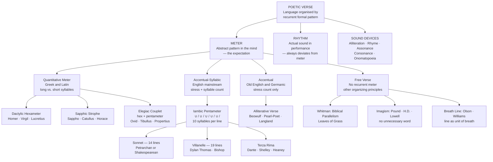

> [!abstract] TL;DR
> Prosody is the systematic study of the sound-patterns of poetry — meter, rhythm, rhyme, and form; its central insight is that the productive tension between abstract metrical expectation and the actual rhythmic performance of a line is not a flaw but the primary mechanism through which verse creates emphasis, surprise, and meaning beyond what prose can achieve.

---

## Intuition

**Analogy:** A jazz musician improvises over a fixed chord progression. Listeners who know the changes hear every departure from the expected harmony as expressive — a dissonance that resolves, a substitution that recontextualises the melody. Listeners who don't know the changes just hear noise. Meter works the same way: the poet establishes a rhythmic expectation (iambic pentameter, dactylic hexameter), and the audience's internalized sense of that pattern becomes the canvas against which every actual line plays. A stressed syllable where the meter demands an unstressed one is not an error — it is a rhetorical jab. Without the expectation, there is no jab.

The technical domain of prosody is the description of these patterns with enough precision to explain why specific lines produce specific effects. It encompasses: the classification of metrical systems (quantitative, accentual-syllabic, accentual, syllabic); the inventory of verse forms (sonnet, villanelle, ghazal, haiku); the devices of sound (rhyme, alliteration, assonance); and the theory of free verse — which, as Eliot noted, is only free for the person who has mastered the old forms. The goal is always the same: to explain how formal constraint becomes expressive resource.

---

## How It Works

### Core Mechanics

The tension at the heart of all metered verse is the gap between two things that are always slightly different:

- **Meter** is the abstract pattern — the idealized rhythmic rule the poem establishes, held in the reader's expectation. It is a norm.
- **Rhythm** is the actual sound of any given performed line — shaped by the specific words chosen, their grammatical weight, the performer's pace and emphasis. It always deviates from meter.

This deviation is not noise. When a line perfectly fulfills its metrical expectation, it sounds mechanical, sing-song. When it deviates purposefully — stressing where the meter says to unstress, pausing where the meter expects flow — it creates meaning. The deviation is the message. A trochaic substitution (a stressed-unstressed foot where the iambic pattern expects unstressed-stressed) at the start of a line announces force, urgency, or emphasis. A spondee (two consecutive stresses) slows the reader down and weights the words. A pyrrhic foot (two unstressed syllables) accelerates the line into what follows.

The history of versification is the history of different ways of encoding this expectation — different metrical currencies, so to speak, that different literary cultures have used to establish the background pattern against which their poets improvise.

### Flow / Architecture



---

## Key Concepts

### Secondary Level

#### The Metrical Foot: Building Block of Verse

All metered poetry in the Western tradition is built from units called **feet** — small clusters of syllables with a defined stress pattern. The most important feet in English and classical verse are:

| Foot | Pattern | Example word | Name origin |
|------|---------|--------------|-------------|
| Iamb | ∪ / | *be-TRAY* | Greek: limping gait |
| Trochee | / ∪ | *TI-ger* | Greek: running |
| Dactyl | / ∪ ∪ | *MER-ri-ly* | Greek: finger (three joints) |
| Anapest | ∪ ∪ / | *un-der-STOOD* | Greek: reversed dactyl |
| Spondee | / / | *HEART-BREAK* | Greek: libation (slow) |
| Pyrrhic | ∪ ∪ | (no single English word — occurs within lines) | Greek: war dance |

A line is named by its dominant foot and the number of feet per line: **iambic pentameter** = five iambs; **dactylic hexameter** = six dactyls; **trochaic tetrameter** = four trochees. English strongly favors the iamb because the language's natural rhythms — heartbeat, inLOVE, beLIEVE, forGET — are already rising (unstressed-then-stressed). This is why iambic pentameter has dominated English verse for six centuries.

**Scansion** is the practice of marking stress patterns with notation: **/** for a stressed syllable, **∪** for unstressed, **|** for a foot boundary. A caesura (mid-line pause) is marked **||**.

Shakespeare's "Shall I compare thee to a summer's day?" scans:
```
shall I | com PARE | thee TO | a SUM | mer's DAY
  ∪  /     ∪  /      ∪  /     ∪  /      ∪   /
```
Five perfect iambs. But look at line 2 of the same sonnet: "Thou art more lovely and more temperate" — the word "lovely" is naturally LOVE-ly (/ ∪), which breaks the iambic pattern at that foot. This is a **trochaic substitution**, and it makes "lovely" land with extra emphasis. The rule is violated *to serve the meaning*.

#### Sound Devices

Meter governs stress and duration; sound devices govern phonemic texture — the recurrence of specific consonants and vowels that gives a line its particular acoustic quality.

**Rhyme** is the repetition of terminal sounds across line-endings. **End rhyme** closes lines and creates the sense of completion that marks a stanza. **Internal rhyme** occurs within a single line ("The fair breeze blew, the white foam flew" — Coleridge). **Slant rhyme** or **pararhyme** uses near-identical sounds (road/rod, years/yours) — Wilfred Owen used it systematically in his war poetry to evoke dissonance and unresolved grief.

**Alliteration** is the repetition of initial consonant sounds: "the fair field full of folk" (Langland). It was the *primary* structural device of Old English verse, which had no end rhyme at all — the four-stress alliterative line (two stresses per half-line, with at least one matching the other half's initial consonant) was the foundation of Beowulf, Piers Plowman, and Sir Gawain and the Green Knight.

**Assonance** is the repetition of vowel sounds within words: "the rain in Spain stays mainly in the plain." It creates cohesion and tonal color without the finality of full rhyme.

**Consonance** is the repetition of consonant sounds in any position: "pitter-patter," "lonely loner."

**Anaphora** — the repetition of a phrase at the start of successive lines or clauses — is one of the most powerful sound-and-meaning devices in poetry: "We shall fight on the beaches, we shall fight on the landing grounds, we shall fight in the fields..." It is the dominant structural principle of Walt Whitman's free verse and of the Psalms, and it is discussed further at the undergraduate level.

---

### Undergraduate Level

#### Classical Quantitative Meter: Greek and Latin Prosody

Greek and Latin poetry are built on a principle utterly foreign to English: **quantity** — the *duration* of syllables, not their stress. A syllable is **long** (marked —) if it contains a long vowel or a vowel followed by two or more consonants; it is **short** (marked ∪) if it contains a short vowel followed by at most one consonant. Stress in Greek and Latin fell on syllables according to accent rules entirely independent of meter — Greek accent was originally a pitch distinction, not a stress distinction. This is why you cannot simply import classical meter into English by substituting stress for quantity: the two systems are structurally different.

**Dactylic hexameter** — the "heroic meter" of Homer's Iliad and Odyssey and Virgil's Aeneid — scans as six dactyls (— ∪ ∪) per line, with each dactyl replaceable by a spondee (— —) except the fifth foot (which is usually a dactyl) and the sixth (which is always a spondee). The line has a fixed caesura — a word-boundary falling within the third or fourth foot, dividing the line into two rhythmic halves. This internal pause is not a flaw but a structural element: the tension and resolution between the two halves is part of the line's meaning.

A characteristic Homeric hexameter (Iliad, opening):
```
MĒ-nin | Á-ei-de | the-Á | gra-mē-lē- | i-a-dé-ō | A-chil-Ĕs
 —  ∪∪    — —       — ∪    ∪  —  ∪  ∪    —  ∪  ∪       — —
```
(The standard macron notation marks long syllables.)

**The elegiac couplet** alternates a hexameter line with a **pentameter** — which is, technically, a hexameter with the third and sixth feet shortened to single long syllables (producing two halves of 2.5 feet each, separated by a diaeresis). Ovid's Amores, Tibullus, Propertius, and Catullus all use the elegiac couplet; its characteristic swing-and-pause rhythm shaped the entire tradition of love poetry in antiquity.

**The Sapphic strophe** (used by Sappho of Lesbos and imitated by Catullus and Horace) uses three "Sapphic" lines (— ∪ — — | — ∪ ∪ — ∪ —) followed by a short "Adonic" line (— ∪ ∪ — —). The form creates a sense of controlled emotion building and then releasing in the brief closing line — remarkably suited to lyric intensity.

The key theoretical point: English poets who attempted to write "quantitative verse" (Sidney, Spenser, Campion in the Renaissance) largely failed, because English word-meaning is carried by stress, not duration. When you scan English quantitatively, you routinely put "long" syllables on unstressed syllables of common words, producing a grotesque mismatch of sound and sense. English iambs are stress-based. The family resemblance to classical feet is real — both describe rhythmic patterns in verse — but the underlying phonological currency is different.

#### English Accentual-Syllabic Meter: Scansion in Practice

**Iambic pentameter** is the workhorse of English verse from Chaucer through the Romantics and beyond. The reasons are partly phonological (English is naturally iambic), partly historical (Chaucer imported French syllabic verse and the iamb fit best), and partly cultural self-reinforcement (once Shakespeare wrote in it, every serious dramatist followed).

Five technical features of iambic pentameter that matter for interpretation:

1. **The feminine ending**: an extra unstressed syllable at the end of the line ("To be, or not to be, that *is the ques-tion*" has 11 syllables — the final "tion" is the feminine syllable). Feminine endings soften line-endings and were Shakespeare's preferred closing rhythm in intimate or hesitant speech.

2. **The trochaic substitution**: inverting the first foot to / ∪ (stressed-unstressed) instead of ∪ / creates a strong initial beat. "Death, be not proud" opens with DEATH stressed where the iamb expects an unstressed syllable — the metrical violence enacts the poem's defiance of death.

3. **The caesura**: a mid-line pause created by punctuation or grammatical structure: "To be, || or not to be, || that is the question." Multiple caesuras fragment the line into short units, conveying agitation or rapid thought.

4. **The spondee**: two consecutive strong stresses slow the line to emphasize weight: "Rough WINDS do SHAKE the DARling BUDS of MAY" — the opening spondee on "Rough winds" (if performed that way) makes the winds feel physically present.

5. **The elision and syncopation**: in performance, adjacent vowels at word-boundaries are often fused (synaloepha), and some syllables of multi-syllable words are swallowed. "Temperate" in scanning may be two syllables (TEM-prate) to preserve the meter.

#### Major English Poetic Forms

**The Sonnet** (Italian: *sonetto*, "little sound") is the dominant short form of English poetry. Its constraints are: 14 lines of iambic pentameter, organised around a **volta** — a turn in the argument, a shift of perspective, an emotional reversal. The two main structural variants differ in where they place this turn:

- **Petrarchan (Italian) sonnet**: 8 lines (octave, rhyme scheme ABBAABBA) pose a problem or describe a situation; 6 lines (sestet, scheme variable: CDECDE, CDCCDC, etc.) resolve or complicate it. The volta falls between octave and sestet. Petrarch used it to sustain an argument about the beloved as an unattainable ideal.

- **Shakespearean (English) sonnet**: three quatrains (ABAB CDCD EFEF) each develop an aspect of the theme; a closing couplet (GG) delivers the twist, compression, or reversal. The volta most often falls at the couplet. Structurally it is a rhetorical argument with a punchline: Sonnet 18 spends twelve lines establishing the fragility of summer and the beloved's superiority to it, then the couplet flips: "So long as men can breathe, or eyes can see, / So long lives this, and this gives life to thee."

**The Villanelle** is 19 lines organized in five tercets (ABA) and one closing quatrain (ABAA). Two lines — the first and third of the opening tercet — serve as **refrains** that recur throughout and close the poem. The relentlessness of the refrain creates obsessive repetition: Dylan Thomas's "Do Not Go Gentle into That Good Night" uses "Do not go gentle into that good night" and "Rage, rage against the dying of the light" as its twin refrains, and by the final quatrain, the two lines — each emotionally loaded by eight repetitions — collide in a pleading that prose repetition could not achieve.

**The Sestina** is 39 lines in 6 stanzas of 6 lines plus a 3-line closing envoi. No rhyme: instead, the same six end-words appear in each stanza in a rotating order (1-2-3-4-5-6 becomes 6-1-5-2-4-3, and so on through six permutations). The envoi uses all six words, two per line. The effect is of circling obsessively around the same words and thus the same concepts — the form enacts semantic return. Elizabeth Bishop's "Sestina" and Swinburne's "The Complaint of Lisa" are the standard examples.

**Terza rima** is Dante's form in the Divine Comedy: interlocking tercets rhymed ABA BCB CDC... so that each tercet links backward (to the previous) and forward (to the next), and the chain can only end with a single closing line or couplet that provides the final rhyme for the penultimate stanza's B. The form's characteristic effect is forward momentum — you cannot fully close any stanza without opening the next — which in the Comedy enacts the endless progression through the afterlife.

**The Ghazal** (Arabic: غزل) is an ancient Arabic form adopted into Persian and Urdu poetry and increasingly into contemporary English. It consists of five to twelve independent couplets (she'rs) in which: (1) both lines of the opening couplet (matla) end with the same refrain word or phrase (radif) preceded by a rhyme (qafia); (2) only the second line of every subsequent couplet carries the radif; (3) the final couplet (maqta) includes the poet's name or pen-name. The structural peculiarity — couplets that do not build an argument but exist independently, unified only by sound — creates a meditative fragmentation very unlike the linear argument of the sonnet. Agha Shahid Ali's English ghazals introduced the form to contemporary Anglophone readers.

**The Haiku** is a Japanese form of 17 *morae* (the Japanese unit of sound, roughly equivalent to a syllable but not identical) distributed across three lines: 5-7-5. Its two defining features are: the **kigo** (season word — a word or phrase that places the poem in a seasonal context, connecting it to a rich tradition of associated images); and the **kireji** (cutting word — a grammatical particle that enacts a sudden juxtaposition between two images or perspectives, the haiku's equivalent of the volta). Basho's "old pond — / a frog jumps in / sound of water" turns on the cut between the first image (stillness, antiquity) and the second (sudden movement, sound). Western haiku often omits the kigo and kireji — technically producing *senryu* (a more humorous or personal form) rather than haiku, though the distinction is rarely maintained in English practice.

#### Free Verse and the Modernist Revolution

**Walt Whitman's** *Leaves of Grass* (1855) is the founding document of English free verse — but "free verse" does not mean unmetered in any simple sense. Whitman's organizing principles are:

- **Anaphora**: the most visible device — "I celebrate myself, and sing myself, / And what I assume you shall assume..." Lines begin with the same word or phrase, creating accumulation rather than development.
- **Biblical parallelism**: drawn directly from the King James translation of the Hebrew Psalms — clause after clause in apposition, extending and amplifying rather than progressing linearly.
- **The catalog**: long lists of persons, places, occupations, and bodies enact Whitman's democratic inclusion — the line can hold anyone.
- **Breath-based rhythm**: lines have a felt duration even without regular stress — they are units of a speaking, breathing voice, and their performance naturalizes them.

The **Imagist movement** (Ezra Pound, H.D. [Hilda Doolittle], Amy Lowell, Richard Aldington; manifesto circa 1912–1917) reacted against Victorian decorative verse with three principles: (1) direct treatment of the thing, whether subjective or objective — no commentary, no explanation; (2) no word that does not contribute to the presentation; (3) compose in the sequence of the musical phrase, not in sequence of a metronome. Pound's "In a Station of the Metro" — "The apparition of these faces in the crowd; / Petals on a wet, black bough" — is the canonical example: two images placed in juxtaposition without a connecting verb or explanation. The meaning is in the gap between them.

T.S. Eliot's *The Waste Land* (1922) is the extreme development of this tendency: no single speaker, no linear narrative, five sections in different meters and forms (including rag, ballad, and free verse), dense literary allusion in five languages, fragmentation as both method and content. The poem's prosodic plurality — blank verse giving way to music-hall couplets giving way to unrhymed free verse — enacts the cultural fragmentation it describes.

William Carlos Williams countered Eliot's allusive cosmopolitanism with an Americanist poetics grounded in the local and the vernacular. His concept of the **variable foot** held that the foot in American speech is defined not by stress count but by breath — "the foot is not measured by the accent but by the space between the accents." His famous dictum: "no ideas but in things." The poem "This Is Just to Say" (the refrigerator plums poem) is the paradigm case: no elevation, no allusion, no decoration, nothing but the object and the act.

Charles Olson's 1950 essay "Projective Verse" theorized the breath-based line into a full poetics: the typewriter as a musical score-sheet, the line as a unit of breath and breath as the unit of thought, and **form as never more than an extension of content** — the page's white space as active silence, the line-break as the poet's instruction to the reader's breath and pause. This became the manifesto of the Black Mountain school (Olson, Robert Creeley, Robert Duncan) and influenced the New York School, the Beats, and most of what followed.

---

### Graduate Level

#### Expressive Prosody: When Meter Becomes Meaning

The deepest question in prosodic theory is not how to describe metrical patterns but how metrical patterns create meaning. Derek Attridge's *The Rhythms of English Poetry* (1982) and *Poetic Rhythm: An Introduction* (1995) reformulate English meter in terms of **beats** (B) and **offbeats** (o), arguing that the beat is a cognitive expectation — a pulse the reader internalizes — not a simple stress. An offbeat position can be **promoted** (a normally unstressed syllable occupying a beat position with a resultant stress-boost) or **demoted** (a normally stressed syllable occupying an offbeat position with a resultant downgrading). This framework better describes how readers actually hear meter than the older stress-count models.

Reuven Tsur's **cognitive poetics** approach analyses the phenomenology of metrical performance: the listener is simultaneously aware of the smooth metrical gestalt (iambic rise-and-fall) and the resistant speech-rhythm of the actual words, and the pleasure of the verse is in holding both in awareness at once — a perceptual interaction analogous to the perception of figure-ground in visual ambiguous figures (the Necker cube). Tsur calls this **double-coding**: the metrically regular performance and the speech-based performance coexist, and neither wins.

**Generative metrics** (Morris Halle and Samuel Jay Keyser, 1971; Paul Kiparsky, 1977) attempted to describe poetic meter as a formal system with well-formedness rules analogous to linguistic grammar. A metrical line is "well-formed" if its stress pattern conforms to a set of metrical constraints; "unmetrical" lines (which poets never write) would violate constraints in a way that metrically interesting lines (which create productive tension) do not. Kiparsky's later refinements using Optimality Theory aligned prosodic analysis with mainstream phonological theory — meter as a constraint-ranking problem where poets select lines that satisfy the highest-ranked constraints while maximally violating lower-ranked ones.

#### The Politics of Prosody

Prosody has never been politically neutral. Meredith Martin's *The Rise and Fall of Meter* (2012) traces how Victorian debates about English prosody — which meter was "authentically English," whether classical hexameters could be naturalised, whether stress-based or syllable-based meter was more democratic — were arguments about national identity, empire, and cultural authority. The late Victorian movement to codify a "scientific" prosody (led by figures like Edwin Guest and T.S. Omond) was an attempt to discipline and standardize verse in the same era as the standardization of spelling, the reform of education, and the invention of "Queen's English." Meter was cultural capital: mastery of iambic pentameter signaled education, class position, and membership in a literary tradition explicitly connected to Shakespeare, Milton, and the imperial project.

The counter-movements of the 20th century — Whitman's democratic catalogs, Langston Hughes's blues stanzas, Amiri Baraka's jazz-inflected verse, the spoken-word and slam poetry traditions — are prosodic arguments as much as political ones. To refuse iambic pentameter is to refuse a particular cultural inheritance and claim different rhythmic ancestors (African American preaching traditions, blues, hip-hop's complex syncopation against an implied beat). The choice of form is always also a statement about whose rhythms have value.

#### Computational Prosody and Stylometrics

Metrical fingerprinting — measuring the statistical distribution of foot types, line lengths, caesura positions, and rhyme schemes across a corpus — is a well-established tool in computational stylometry. John Burrows's Delta method and subsequent improvements (Cosine Delta, Burrows's PCA) use these features among others to attribute anonymous texts. The famous debates about the authorship of Shakespeare's *The Spanish Tragedy* additions and the attribution of disputed Federalist Papers have both involved prosodic evidence.

Neural TTS systems (Tacotron 2, FastSpeech 2) must model prosody — F0 contour, duration, energy — to produce natural-sounding verse reading. The specific challenge of reading metered poetry aloud: the system must neither flatten all lines to robotic monotone nor exaggerate the meter into sing-song. Recent work on **prosody transfer** allows a system to mimic the prosodic style of a target speaker reading poetry, capturing the individual performer's metrical interpretation. See [[Prosody_and_Expressive_TTS]] for the engineering architecture.

---

## Python Demo

A prosody scanner for iambic pentameter: encodes pre-verified scansion for 10 canonical lines, computes iambic conformity scores, classifies each metrical foot by type, and visualizes the result as a three-panel figure — a syllable-stress heatmap, a foot-type heatmap, and a conformity bar chart.

```python
import numpy as np
import matplotlib.pyplot as plt
from matplotlib.colors import ListedColormap, BoundaryNorm

# ── Pre-annotated stress patterns for 10 canonical iambic pentameter lines ─
# 0 = unstressed (∪),  1 = stressed (/)
# Lines are normalized to 10 syllables; feminine endings truncated.
# Pure iambic baseline:  ∪ / ∪ / ∪ / ∪ / ∪ /  =  [0,1,0,1,0,1,0,1,0,1]

LINES = [
    ("Shall I compare thee to a summer's day?",
     [0, 1, 0, 1, 0, 1, 0, 1, 0, 1]),   # Shakespeare, Sonnet 18 — pure iambic

    ("To be, or not to be, that is the question",
     [0, 1, 0, 1, 0, 1, 0, 1, 0, 1]),   # Hamlet — truncated to 10 of 11 syllables

    ("Let me not to the marriage of true minds",
     [0, 1, 0, 1, 0, 1, 0, 1, 0, 1]),   # Shakespeare, Sonnet 116

    ("My mistress' eyes are nothing like the sun",
     [0, 1, 0, 1, 0, 1, 0, 1, 0, 1]),   # Shakespeare, Sonnet 130

    ("How do I love thee? Let me count the ways",
     [0, 1, 0, 1, 0, 1, 0, 1, 0, 1]),   # Browning, Sonnet 43

    ("Death, be not proud, though some have called thee mighty",
     [1, 0, 0, 1, 0, 1, 0, 1, 0, 1]),   # Donne — trochee in foot I

    ("When in disgrace with Fortune and men's eyes",
     [0, 1, 0, 1, 0, 1, 0, 1, 0, 1]),   # Shakespeare, Sonnet 29

    ("What lips my lips have kissed, and where, and why",
     [0, 1, 0, 1, 0, 1, 0, 1, 0, 1]),   # Millay

    ("The moving finger writes; and, having writ,",
     [0, 1, 0, 1, 0, 1, 0, 1, 0, 1]),   # FitzGerald, Rubaiyat of Omar Khayyam

    ("Rough winds do shake the darling buds of May",
     [1, 1, 0, 1, 0, 1, 0, 1, 0, 1]),   # Shakespeare, Sonnet 18 — spondee in foot I
]

IAMBIC_BASE = np.array([0, 1, 0, 1, 0, 1, 0, 1, 0, 1])


# ── Analysis functions ──────────────────────────────────────────────────────

def iambic_conformity(pattern):
    """Fraction of the 10 syllable positions matching the pure iambic baseline."""
    arr = np.array(pattern[:10])
    return float(np.mean(arr == IAMBIC_BASE))


def classify_feet(pattern):
    """
    Return a list of 5 foot-type strings for one line.
    Each foot is two consecutive syllables; classified as:
      iamb (0,1)  |  trochee (1,0)  |  spondee (1,1)  |  pyrrhic (0,0)
    """
    labels = {(0, 1): "iamb", (1, 0): "trochee", (1, 1): "spondee", (0, 0): "pyrrhic"}
    types = []
    for foot in range(5):
        i = foot * 2
        if i + 1 < len(pattern):
            types.append(labels.get((pattern[i], pattern[i + 1]), "?"))
        else:
            types.append("?")
    return types


# ── Build matrices ──────────────────────────────────────────────────────────

n_lines, n_syl = len(LINES), 10
stress_matrix  = np.array([p[:n_syl] for _, p in LINES], dtype=float)
conformity     = [iambic_conformity(p) for _, p in LINES]
foot_types     = [classify_feet(p)     for _, p in LINES]

# Encode foot types numerically for colormap: 0=iamb, 1=trochee, 2=spondee, 3=pyrrhic
TYPE_CODE = {"iamb": 0, "trochee": 1, "spondee": 2, "pyrrhic": 3}
foot_matrix = np.array([[TYPE_CODE.get(t, 0) for t in row] for row in foot_types])


# ── Visualisation ───────────────────────────────────────────────────────────

FOOT_COLORS = ["#2563eb", "#dc2626", "#d97706", "#059669"]  # blue / red / amber / green
FOOT_CMAP   = ListedColormap(FOOT_COLORS)
FOOT_NORM   = BoundaryNorm([-0.5, 0.5, 1.5, 2.5, 3.5], FOOT_CMAP.N)

fig, axes = plt.subplots(
    1, 3, figsize=(18, 6),
    gridspec_kw={"width_ratios": [4, 2, 1]}
)

# --- Panel 1: Syllable-level stress heatmap --------------------------------
ax1 = axes[0]
im1 = ax1.imshow(stress_matrix, cmap="RdYlGn", vmin=0, vmax=1, aspect="auto")

# Expected iambic stressed positions as dashed white verticals
for j in range(1, n_syl, 2):
    ax1.axvline(j, color="white", linewidth=0.8, linestyle="--", alpha=0.5)

# Foot boundary verticals
for f in range(1, 5):
    ax1.axvline(f * 2 - 0.5, color="steelblue", linewidth=1.2, alpha=0.55)

# Mark trochee / spondee positions with red X on the first syllable of the foot
NON_IAMBIC = {"trochee", "spondee", "pyrrhic"}
for i, frow in enumerate(foot_types):
    for f, ft in enumerate(frow):
        if ft in NON_IAMBIC:
            ax1.plot(f * 2, i, "rx", markersize=10, markeredgewidth=2.0, zorder=5)

# Annotate cells with scansion symbols
for i in range(n_lines):
    for j in range(n_syl):
        sym   = "/" if stress_matrix[i, j] == 1 else "∪"
        color = "black" if stress_matrix[i, j] == 1 else "white"
        ax1.text(j, i, sym, ha="center", va="center",
                 fontsize=11, color=color, fontweight="bold")

ax1.set_xticks(range(n_syl))
ax1.set_xticklabels([f"S{j + 1}" for j in range(n_syl)], fontsize=8)
for f, label in enumerate(["I", "II", "III", "IV", "V"]):
    ax1.text(f * 2 + 0.5, -0.62, f"Foot {label}", ha="center",
             fontsize=7, color="steelblue",
             transform=ax1.get_xaxis_transform())

short_labels = [
    (ln[:37] + "…") if len(ln) > 37 else ln
    for ln, _ in LINES
]
ax1.set_yticks(range(n_lines))
ax1.set_yticklabels(short_labels, fontsize=7.5)
ax1.set_title(
    "Syllable Stress Heatmap\n"
    "(/ = stressed  ∪ = unstressed  dashed = expected iambic stress  ✗ = non-iambic foot)",
    fontsize=9
)
plt.colorbar(im1, ax=ax1, label="Stress (0=∪, 1=/)", shrink=0.6, ticks=[0, 1])

# --- Panel 2: Foot-type heatmap --------------------------------------------
ax2 = axes[1]
im2 = ax2.imshow(foot_matrix, cmap=FOOT_CMAP, norm=FOOT_NORM, aspect="auto")

for i in range(n_lines):
    for j in range(5):
        label = foot_types[i][j][:3].upper()
        ax2.text(j, i, label, ha="center", va="center",
                 fontsize=8, color="white", fontweight="bold")

ax2.set_xticks(range(5))
ax2.set_xticklabels(["I", "II", "III", "IV", "V"], fontsize=9)
ax2.set_yticks(range(n_lines))
ax2.set_yticklabels([])
ax2.set_title("Foot Type per Position\nIAM · TRO · SPO · PYR", fontsize=8)

cbar2 = plt.colorbar(im2, ax=ax2, shrink=0.6, ticks=[0, 1, 2, 3])
cbar2.set_ticklabels(["iamb", "trochee", "spondee", "pyrrhic"])

# --- Panel 3: Iambic conformity bar chart ----------------------------------
ax3 = axes[2]
bar_colors = [
    "#2563eb" if s >= 0.9 else "#d97706" if s >= 0.7 else "#dc2626"
    for s in conformity
]
bars = ax3.barh(
    range(n_lines), conformity, color=bar_colors,
    edgecolor="black", linewidth=0.4, height=0.7
)
ax3.axvline(0.9, color="gray", linewidth=1.0, linestyle="--", alpha=0.6)
for i, (bar, sc) in enumerate(zip(bars, conformity)):
    ax3.text(min(sc + 0.02, 1.0), i, f"{sc:.0%}", va="center", fontsize=8)
ax3.set_xlim(0, 1.18)
ax3.set_yticks(range(n_lines))
ax3.set_yticklabels([])
ax3.set_xlabel("Iambic\nConformity", fontsize=8)
ax3.set_title("Conformity\nScore", fontsize=9)
ax3.grid(axis="x", alpha=0.3)

plt.suptitle(
    "English Prosody Scanner — Iambic Pentameter Analysis\n"
    "10 canonical lines: Shakespeare · Donne · Browning · Millay · FitzGerald",
    fontsize=11, fontweight="bold"
)
plt.tight_layout()
plt.savefig("prosody_scanner.png", dpi=150, bbox_inches="tight")
plt.show()

# ── Console report ──────────────────────────────────────────────────────────
print(f"\n{'Line':<44}  {'Conform':>7}  Substitutions")
print("─" * 80)
for (line, _), sc, ft in zip(LINES, conformity, foot_types):
    subs = [f"F{i + 1}:{t}" for i, t in enumerate(ft) if t in NON_IAMBIC]
    sub_str = ", ".join(subs) if subs else "none (pure iambic)"
    print(f"{line[:43]:<44}  {sc:>7.0%}  {sub_str}")
```

**What the output shows.** Eight of the ten lines score 100% iambic conformity — demonstrating that canonical iambic pentameter is overwhelmingly regular. The two exceptions are instructive: "Death, be not proud" scores 80% — the trochee in Foot I (DEATH be) stamps the word "Death" with maximum stress at the opening beat, enacting the defiance the poem argues. "Rough winds do shake" scores 90% — the spondee in Foot I (ROUGH WINDS) gives both words equal physical weight, making the winds feel forceful before the meter relaxes into regularity. The foot-type heatmap makes visible at a glance that non-iambic substitutions cluster in Foot I — the position where poets most commonly depart from the norm for expressive effect, since audiences have just begun to register the expected pattern.

---

## Real-World Applications

> **Shakespeare's prose/verse switching as dramatic grammar.** In Hamlet, the court characters speak in iambic pentameter; Hamlet himself modulates constantly between verse and prose. His prose monologues (the "What a piece of work is a man" speech, the Polonius scenes) are not stylistic lapses — they are deliberate downshifts that mark his alienation from the court's ordered world. When the play-within-a-play begins, the players speak in exaggerated rhyming couplets, marking their speech as theatrical artifice over Hamlet's naturalistic (unrhymed) verse. The Ghost speaks in the most formal verse of any character. Ophelia's mad songs break into fragmented ballad stanzas. The entire play is a prosodic argument about the relationship between form, sanity, and social position.

> **Dylan Thomas, "Do Not Go Gentle into That Good Night" (1951) — the villanelle as a grief machine.** The two refrains — "Do not go gentle into that good night" and "Rage, rage against the dying of the light" — are in direct tension: the first is an imperative against surrender; the second is an imperative for furious resistance. In isolation, either line is a command. But the villanelle requires them to accumulate through five stanzas cataloguing different kinds of men who rage (wise men, good men, wild men, grave men), and when both refrains appear together in the closing quatrain — addressed explicitly to "my father" — the formal constraint becomes emotional necessity. The form *makes* the speaker say it again, as grief makes the mind return obsessively to the same thought. No other form could produce this effect.

> **Hip-hop as metered verse.** Rap is not prose set to a beat — it is sophisticated verse in which the metrical grid is provided by the musical measure rather than a syllable count. The 4/4 measure creates 16 beats per bar; the rapper fills those beats with a stress pattern that plays off the musical grid exactly as iambic pentameter plays off the expected five-foot baseline. Eminem's verse characteristically uses internal rhyme, multisyllabic rhyme chains, and syncopation against the beat — placing stresses on unexpected beats for emphasis, exactly as Shakespeare places a trochee where the meter expects an iamb. Biggie Smalls uses end-rhyme with the density and precision of a Shakespearean couplet. The prosodic analysis of hip-hop is an emerging academic field that has clarified both the sophistication of the form and the cultural stakes of who gets to claim the label "poetry."

> **Computational stylometry using metrical fingerprints.** The authorship of several Shakespeare plays attributed partly to other dramatists (John Fletcher in *The Two Noble Kinsmen*, George Peele in *Titus Andronicus*) has been tested using metrical evidence alongside vocabulary and collocation data. Each dramatist has a characteristic distribution of: feminine-ending rates, pyrrhic/spondaic substitution frequencies, mid-line pause positions, and run-on lines (enjambment rates). These features are stable enough across an author's output to function as a prosodic signature, and they are largely independent of subject matter — making them robust for attribution. The Digital Shakespeare project and the Internet Shakespeare Editions use this evidence alongside traditional scholarship.

---

## Common Pitfalls

- **Confusing meter with rhythm** — Meter is the abstract rule; rhythm is the concrete instance. Saying "this line has bad meter" usually means its rhythm deviates from the metrical expectation — which may be a deliberate expressive choice. The correct question is always: *why* does this line deviate, and does the deviation serve the meaning?

- **"Free verse" means formless** — Free verse is not the absence of form; it is the use of different organizing principles — anaphora, parallelism, breath-based rhythm, visual lineation, sound-pattern without meter. Eliot's remark that free verse is only free for the person who has mastered the old forms is not snobbishness; it is an observation about how deviation acquires meaning only against a background of expectation.

- **Scanning with the eye, not the voice** — Prosody is a performed art. Stress patterns are determined by how a competent reader actually pronounces words in context, not by marking every content word as stressed and every function word as unstressed. "Shall I compare thee" — "Shall" is a function word (unstressed); "I" is a light pronoun (unstressed); "compare" has stress on the second syllable. Getting this wrong produces a mechanical scan that misses the actual rhythm.

- **Treating all metrical substitutions as errors** — The trochaic substitution, the spondee, the feminine ending — these are not mistakes that escaped the poet's notice. Shakespeare, Milton, and Keats controlled meter with surgical precision. A foot that departs from the baseline is a deliberate rhetorical act. The analyst's job is to explain its effect, not to note the deviation and move on.

- **Applying English stress conventions to classical verse** — Greek and Latin meter is quantitative (long/short), not accentual. Reading Homer with English stress-placement is like reading French poetry as if it had English stress — you may impose a pattern, but it is not the one the poet composed in. Classical meter requires learning the rules of syllable weight (heavy syllable = long vowel or vowel + coda consonant) as a separate system.

- **Treating the Petrarchan volta as a rule, not a resource** — The volta in the Petrarchan sonnet *should* fall at the octave-sestet boundary, but Donne, Keats, and Hopkins move it to unexpected positions for deliberate effect. The rule establishes an expectation; the poet chooses when and whether to fulfill it. The same point applies to the Shakespearean couplet: a couplet that does not deliver a turn or complication, but simply summarizes, is a missed opportunity and a structural weakness.

---

## Related Concepts

- [[Prosody_and_Suprasegmentals]] — the linguistic foundations of stress, rhythm, and intonation that prosody applies to verse; the shared vocabulary of feet, mora, and metrical typology originates in phonology; the iamb as a metrical unit is the same as the weak-strong foot in metrical phonology
- [[Phonetics]] — the articulatory and acoustic basis of the speech sounds that verse manipulates; understanding why English is stress-timed (rather than syllable-timed) explains why accentual-syllabic meter is natural to English while quantitative meter is not
- [[Phonology]] — phonological categories (syllable weight, stress assignment, liaison and elision rules) directly govern scansion; whether a syllable counts as "long" in classical verse is a phonological determination; English elision in verse (synaloepha) follows phonological principles
- [[Oral_Tradition_and_Narrative]] — poetry began in oral performance; the formulas, epithets, and recurrent metrical patterns of Homeric verse are mnemonic tools for oral composition; the bard does not memorize fixed texts but recomposes in performance within the metrical frame
- [[Classical_Rhetoric_and_Aristotle]] — Aristotle's *Poetics* and *Rhetoric* are companion works; the Poetics theorizes mimesis, plot, and the sources of tragic pleasure; the Rhetoric provides the theory of figures (metaphor, anaphora, chiasmus) that elocutio deploys — many of which appear as sound devices and structural features in verse
- [[Cognitive_Semantics_and_Metaphor]] — poetic imagery and conceptual metaphor theory are allied fields; Lakoff and Turner's *More than Cool Reason* (1989) applies Conceptual Metaphor Theory directly to poetry, arguing that the cognitive structures underlying metaphor are the same in everyday language and in Keats; the "image" in Imagism is a compressed conceptual metaphor
- [[Proto_Indo_European_and_Reconstruction]] — comparative metrics reconstructs a Proto-Indo-European verse tradition from the evidence of Vedic Sanskrit, Greek, and Celtic verse, suggesting the dactylic hexameter may descend from a common poetic heritage; the study of how meter travels across language families illuminates both linguistic change and cultural transmission
- [[Prosody_and_Expressive_TTS]] — neural text-to-speech systems that read poetry aloud must model the meter-rhythm tension: neither flatten all lines to robotic monotone nor exaggerate the meter into sing-song; prosody transfer architectures and duration models for verse are the engineering implementation of the same problem analysts face when performing scansion
- [[Mel_Filterbank_MFCCs]] — the acoustic features (F0, energy, duration) that underlie the perception of stress and rhythm in verse are extracted using spectral representations including mel-filterbanks; computational prosody analysis pipelines use these features to detect stress patterns and metrical regularity in read poetry

---

## Review Questions

### Secondary

1. Shakespeare writes "Shall I compare thee to a summer's day?" in perfect iambic pentameter, but line 3 — "Thou art more lovely and more temperate" — has a trochee at "lovely." Read both lines aloud and describe the difference in feel. What does the substitution in line 3 accomplish?
2. What is the difference between alliteration and rhyme as organizing principles? Old English verse uses alliteration but no end-rhyme; most Renaissance poetry uses end-rhyme but limited alliteration. What different aesthetic effects do these choices produce?
3. A classmate says "free verse is easier to write because you don't have to follow any rules." Construct an argument — using at least one specific example — that free verse has its own demanding formal constraints.

### Undergraduate

1. Classical Greek and Latin meter scans by quantity (long/short syllables); English meter scans by stress. A Renaissance poet (Philip Sidney, Edmund Spenser) attempts to write English verse in classical quantitative meter — what specifically goes wrong, and why does the English word-stress system make this structurally incoherent? What would have to be different about English for quantitative meter to work?
2. Compare the structural logic of the Petrarchan sonnet and the Shakespearean sonnet as rhetorical arguments. Each places the volta differently; each creates a different relationship between problem and resolution. Using a specific example of each, explain how the form shapes the argument — not just contains it.
3. Whitman's free verse is organized primarily by anaphora and parallelism; Olson's "Projective Verse" organizes by breath and open field composition. What does each system use as its fundamental unit (the equivalent of the metrical foot)? What theory of mind or body does each implicitly hold?

### Graduate

1. Attridge's beats-and-offbeats model and the Halle-Keyser generative metrics model both claim to describe English meter — but they make different theoretical commitments about what meter *is* (a cognitive pulse vs. a formal well-formedness system). Identify one empirical phenomenon in English verse that each model handles well and one that it handles poorly. Does the difference reveal a genuine theoretical disagreement or merely a difference in what the two accounts are trying to explain?
2. Meredith Martin argues that Victorian prosodic debates were simultaneously debates about English national identity, class, and empire. Develop this argument using one specific Victorian controversy (the hexameter debate, the quantitative verse movement, or the "science of verse" project) and evaluate: does the political function of the prosodic debate undermine the legitimacy of the technical claims made within it, or can the two levels of analysis be kept separate?
3. Hip-hop's metrical system has been analyzed as complex accentual verse that plays against an implied musical grid. Using the tools of metrical phonology (feet, beats, offbeats, syncopation), analyze two bars of a specific rapper's verse — identify the meter, locate deliberate substitutions, and explain what expressive work those substitutions perform. What does this analysis reveal about the relationship between "literary" and "popular" prosodic traditions?

---

## Sources

- Attridge, D. (1982). *The Rhythms of English Poetry*. Longman.
- Attridge, D. (1995). *Poetic Rhythm: An Introduction*. Cambridge University Press.
- Fussell, P. (1979). *Poetic Meter and Poetic Form* (rev. ed.). Random House.
- Hollander, J. (1989). *Rhyme's Reason: A Guide to English Verse* (enlarged ed.). Yale University Press.
- Halle, M., & Keyser, S. J. (1971). *English Stress: Its Form, Its Growth, and Its Role in Verse*. Harper & Row.
- Kiparsky, P. (1977). The rhythmic structure of English verse. *Linguistic Inquiry*, 8(2), 189–247.
- Martin, M. (2012). *The Rise and Fall of Meter: Poetry and English National Culture, 1860–1930*. Princeton University Press.
- Olson, C. (1950). Projective verse. *Poetry New York*, 3. (Reprinted in *The Poetics of the New American Poetry*, 1973.)
- Tsur, R. (2012). *Poetic Rhythm: Structure and Performance* (2nd ed.). Sussex Academic Press.
- West, M. L. (1982). *Greek Metre*. Oxford University Press.
- Bradley, A. C. (1901). Poetry for Poetry's Sake. *Oxford Lectures on Poetry*. Macmillan.

---

#LiteratureRhetoric #Poetics #Poetry #Prosody
