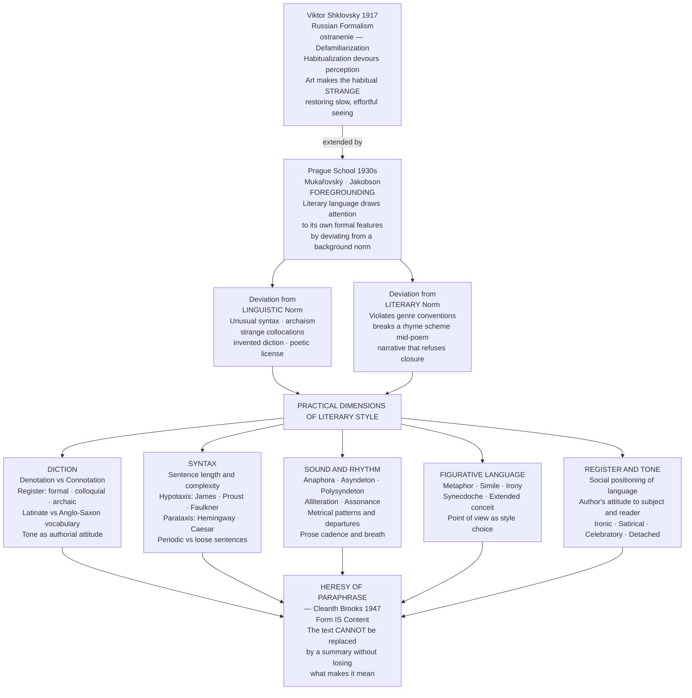

# Style and Literary Language

> [!abstract] TL;DR
> Literary style is the HOW of writing — the totality of choices at every level of language (diction, syntax, rhythm, tone, register, figuration) through which a text achieves its effects; Viktor Shklovsky's defamiliarization (*ostranenie*, 1917) and the Prague School's foregrounding give the most theoretically precise account of what literary language does: it makes the automatic strange again, forcing the slow, effortful perception that habituation has put to sleep; the fundamental paradox is that style cannot be separated from content — to paraphrase a poem is to destroy it (Cleanth Brooks's "heresy of paraphrase") — while simultaneously style is never politically innocent: the choices that produce a text's surface always encode positions in a field of ideology, power, and social position (Barthes's "Writing Degree Zero"; Orwell's "Politics and the English Language").

---

## Intuition

**Analogy:** Consider two nurses delivering the same piece of news to the same patient. The first says: "Your test results are negative. You are free to go home today." The second pauses, holds eye contact, and says: "Everything came back clean. You get to go home." The clinical content is identical. The style — word choice, syntax, tone, the weight of the pause — is entirely different. "Clean" carries wholeness and relief where "negative" carries the bureaucratic absence of pathology. "Get to" frames discharge as a gift where "are free to" issues a clinical permission. The patient receives the same information but a different *experience* of that information.

Extend this to literature: a novelist describing the same event as a newspaper reporter is not merely making identical content prettier — the novelist's stylistic choices *constitute a different meaning*. "He died" is not the same sentence as "He ceased." Neither is the same as Dickinson's "Because I could not stop for Death — / He kindly stopped for me." At some point, the distance between paraphrase and original is not a matter of decoration but of substance: the style is the content. Understanding *why* this is so, and how it works at every level of language, is the central project of literary stylistics.

---

## How It Works

Literary style operates at three interlocking levels: (1) the theoretical level — what literary language *is* as distinct from ordinary language (defamiliarization, foregrounding); (2) the practical level — which dimensions of language carry style (diction, syntax, sound, tone, register, figuration); (3) the ideological level — whose style counts as legitimate, and what any stylistic choice encodes about social and political position.

The deepest theoretical answer comes from Russian Formalism and its Prague School heirs. Viktor Shklovsky's 1917 essay "Art as Technique" argued that the function of literary art is *ostranenie* — defamiliarization: making the habitual and automatic strange again, forcing slow, effortful, conscious perception that ordinary language has rendered unnecessary. The Prague School (Mukařovský, Jakobson) developed this into **foregrounding**: literary language brings certain of its own features to the reader's conscious attention by *deviating* from a norm — either the norm of ordinary language or the norm of an established literary genre.



The diagram maps the intellectual lineage from Russian Formalism through the Prague School to the practical dimensions of style, converging on the New Critical claim — backed by formalist theory — that paraphrase is categorically impossible without loss of meaning.

---

## Key Concepts

### Secondary Level

**Style as the HOW**

The most basic definition: style is the *how* of writing as distinct from the *what* (content) and the *why* (purpose). A newspaper report and a poem can describe the same event; they differ entirely in style. But this definition immediately encounters a paradox: in literary language, the how and the what cannot be cleanly separated. Choose a different word and you say a different thing, even if the "information" is the same.

The clearest illustration is **connotation vs. denotation**. *Denotation* is the literal, dictionary meaning of a word — what it refers to or names. *Connotation* is the web of associations, emotional charges, and social signals that a word carries alongside its denotation. "Home" and "domicile" both refer to the place where someone lives; denotatively they overlap. Connotatively they inhabit different worlds: "home" carries warmth, belonging, intimacy, the smell of a kitchen; "domicile" carries legal formality, bureaucratic distance, administrative coldness. A novelist choosing one over the other is not making an ornamental decision — they are constructing a different emotional and social reality for the reader at that precise point in the text.

**Register** extends this into the social dimension. Register is the variety of language appropriate to a particular situation: legal register, medical register, academic register, colloquial speech, high-literary style, vernacular dialect. When Dickens's Mr. Bumble says "The law is a ass — a idiot," the grammatical error is not a failure of Dickens's education; it is a precise stylistic choice that positions Bumble's class pretension, pomposity, and limited self-awareness. The wrong grammar is the right grammar for that character in that situation.

**Latinate vs. Anglo-Saxon diction** is a uniquely English stylistic resource. English possesses a double vocabulary: the Germanic/Anglo-Saxon layer (monosyllabic, concrete, earthy: *love, hate, death, blood, god, man, child*) and the Romance/Latinate layer (polysyllabic, abstract, formal: *amorous, homicide, mortality, sanguinary, deity, masculine, infantile*). This dual inheritance means English writers face a choice at nearly every turn: Anglo-Saxon for directness and force, Latinate for elevation and abstraction. Milton exploits Latinate diction for cosmic dignity ("Nor did they not perceive the evil plight / In which they were, or the fierce pains not feel"). Hemingway's prose is a deliberate manifesto in plain Anglo-Saxon: the decision *not* to use Latinate vocabulary is a politics of style, a rejection of literary pretension and social hierarchy.

**Tone** is the authorial attitude to the subject and to the reader: ironic, sympathetic, detached, satirical, solemn, celebratory, elegiac. Tone is not carried by any single word; it emerges from the full ensemble of stylistic choices across a passage or a work. A satirist and an elegist writing about the same death will choose different words, different syntactic patterns, different figures of speech, different perspectives — and the accumulated difference is what we perceive as tone.

---

### Undergraduate Level

**Defamiliarization — Shklovsky's Founding Argument**

Viktor Shklovsky's "Art as Technique" (1917) opens with a problem: why do familiar things stop being *experienced*? His answer is *habitualization*: routine perception reduces the lived world to a set of automatic responses. We do not see our furniture; we navigate it. We do not hear our partner's voice; we receive information from it. Language is peculiarly subject to this: words become algebraic — signs that point automatically without generating perception.

Art's function is to interrupt this automation. The key passage: "Habitualization devours works, clothes, furniture, one's wife, and the fear of war... Art exists that one may recover the sensation of life; it exists to make one feel things, to make the stone stony. The purpose of art is to impart the sensation of things as they are *perceived* and not as they are *known*."

Defamiliarization (*ostranenie*, literally "making-strange") names the technique by which literary language achieves this: presenting familiar things through unfamiliar language, forcing slow, effortful perception rather than automatic recognition. Shklovsky's central example is Tolstoy. In the story *Kholstomer*, the institution of private property and a horse-whipping are described from the perspective of a horse. The horse cannot naturalize these practices the way a human narrator would; so the reader, seeing them through the horse's puzzled, literal perception, suddenly *notices* what habituated language would have made invisible. The choice of narrative perspective is the defamiliarizing device — and behind it is the choice to write against the grain of the language that would otherwise have normalized the social practice.

Shklovsky's broader claim: all of literature's formal techniques — unusual syntax, unexpected metaphors, genre-convention violation, even the slowing effect of poetic meter — are forms of defamiliarization. Meter makes language harder to process than prose; this resistance is not a defect but the mechanism of perception-restoration.

**Foregrounding — The Prague School Development**

Roman Jakobson, writing from Prague in the 1930s, gave the Formalist insight its most influential formulation: the "poetic function" of language occurs when language directs attention toward the message itself — toward the structure and texture of the language — rather than toward its referent. This is the mark of literary as opposed to purely communicative language.

Jan Mukařovský developed the concept of **foregrounding** (*aktualisace*): the bringing-to-attention of a linguistic feature by systematic deviation from a norm. Two types:

1. **Deviation from the linguistic norm** — departure from standard grammar, syntax, lexis, or expected collocations. A verb forced into a position grammar doesn't permit; a compound word that has never existed before; a syntactic inversion that makes ordinary reading stumble.
2. **Deviation from the literary norm** — violation of a pattern the work has established within itself. A rhyme scheme that breaks its own rule at the structurally crucial moment; a realistic narrative that suddenly shifts into myth; a comic register that veers into elegy without explanation.

Both types work by creating a **figure** against a **background**: the deviation is the figure; the norm (ordinary language, or the established pattern of the work) is the background. Foregrounding is always relational — a feature can only be foregrounded relative to a context in which it is unexpected. This is why literary style cannot be reduced to a fixed inventory of devices: any technique, repeated, becomes automatic and loses its foregrounding power.

Contemporary cognitive poetics (Peter Stockwell) has operationalized foregrounding as a theory of attention: foregrounded elements are those that attract and hold conscious attention, that resist schema-matching and demand active processing. Corpus stylistics (Mick Short, Michael Toolan) makes this measurable: certain syntactic constructions and lexical items appear at statistically significant frequencies in literary texts compared to non-literary ones — these are the empirical signatures of foregrounding.

**Sentence-Level Stylistics: Syntax as Meaning**

The sentence is the basic unit of prose style. Its length, structure, rhythm, and grammatical type are all stylistic choices that carry meaning independently of the words they contain.

*Hypotaxis* (subordination) builds complex sentences from a main clause with nested dependent clauses: "It was not until he had stood for some considerable moments in the doorway — absorbing, as it were, the peculiar atmosphere of the place, which seemed to contain some residue of what had passed between them — that he recognized what had changed." Henry James's nested subordinate clauses perform his themes: qualification, hesitation, the mind's endless refinements as it approaches a truth it half-knows. The long sentence is not ornament; it is the phenomenology of consciousness rendered in syntax.

*Parataxis* (coordination or juxtaposition) chains short independent units without embedding: "He came in from the rain. He sat down. He ordered a whiskey. He drank it." The Hemingwayesque short declarative sentence performs restraint and suppression — the "iceberg principle" (Hemingway's formulation: the dignity of movement of an iceberg is due to only one-eighth of it being above water). The understated syntax implies the seven-eighths below: the unspoken grief, the withheld feeling.

Key sentence patterns that carry specific stylistic weight:

| Device | Structure | Example | Effect |
|--------|-----------|---------|--------|
| **Anaphora** | Repeated phrase at clause-opening | "We shall fight on the beaches, we shall fight on the landing grounds, we shall fight in the fields" (Churchill) | Cumulative momentum, emotional weight |
| **Asyndeton** | Parataxis without conjunctions | *Veni, vidi, vici* — Caesar | Telegraphic urgency; rapid succession without breath |
| **Polysyndeton** | Multiplied coordinating conjunctions | "and he drank and he ordered and the bar was full and the night was cold" | Rushing accumulation; oral, additive storytelling |
| **Periodic sentence** | Main clause delayed to the end | Long qualification, then the revelation | Controlled suspense; structured revelation |
| **Loose sentence** | Main clause first, then elaboration | Statement, then refinement | The sense of ongoing thought |

---

### Graduate Level

**The Ethics and Ideology of Style**

George Orwell's "Politics and the English Language" (1946) is the most celebrated account of the ethical stakes of stylistic choice. Orwell's argument is not merely aesthetic: bad writing is both a symptom and a cause of bad thinking and political dishonesty. His targets are specific mechanisms:

- **The dying metaphor**: a metaphor worn smooth by repetition until it operates as a cliché without producing perception. "Iron curtain," once defamiliarizing, becomes invisible through repetition and ceases to make us see.
- **Abstract nouns displacing concrete images**: "the elimination of unreliable elements" in place of "shooting the suspects." The abstract noun performs the political function of making the action unimaginable — you cannot picture "elimination" the way you can picture a man being shot.
- **The passive voice as political dodge**: "Mistakes were made" rather than "I made mistakes." The passive construction erases agency; syntax performs the same cover as the lie, and performs it more deniably.
- **Pretentious Latinate diction**: using "implement," "effectuate," and "utilize" to give simple ideas the appearance of scientific or bureaucratic authority.

Orwell's prescriptive rules are controversial as absolutes — they would eliminate Henry James and much of Milton — but they are exact descriptions of the stylistic mechanisms of political obfuscation. The connection between style and power is direct: the passive voice that hides agency, the abstract noun that makes suffering unimaginable, the dying metaphor that prevents fresh perception — these are not neutral stylistic failures but the linguistic forms of political irresponsibility.

Roland Barthes's *Writing Degree Zero* (1953) makes the structural version of this argument. Style, for Barthes, is not a personal achievement but a socially and historically determined position. Every writer inherits a set of available "languages" (styles), each of which positions the writer within a class-inflected field of discourse. The 19th-century realist novel's "bourgeois prose style" is not neutral: it naturalizes ideology by presenting social arrangements as transparent, natural, and inevitable — which is what "well-written," clear, "invisible" prose *does*, regardless of its content. What Barthes calls "writing at degree zero" — Camus's *The Stranger*, Hemingway — is the attempt to find a neutral style that escapes ideological saturation. But Barthes is skeptical: there may be no degree-zero of style; every choice is already a social act.

The politics of dialect and vernacular takes this to its most concrete form. Toni Morrison's defense of Black American vernacular English in her fiction (*Playing in the Dark*, 1992) insists that African American linguistic structures are not degraded standard English but a fully elaborated expressive resource with its own logic, rhythm, and cognitive power. Using vernacular is not a failure to achieve literary standard; it is a refusal of the ideology that identifies "literary" with the white, European, formal, Latinate register. Irvine Welsh's *Trainspotting* (1993), written in Edinburgh dialect thick enough to require decoding, makes the same political claim through a different voice: refusing standard orthography is refusing the literary and social legitimacy that standard orthography encodes.

**Cognitive Stylistics and the Computational Turn**

Cognitive poetics (Reuven Tsur, Peter Stockwell, Mark Turner) grounds literary style in cognitive architecture — the mental schemas, conceptual metaphors, and attentional mechanisms that ordinary human cognition uses to process language. A foregrounded element is one that interrupts cognitive schema-matching, demands extra processing, and thereby forces the reader into heightened attention. Mark Turner's work on conceptual blending provides a formal model of how extended metaphors create new meaning by merging two mental spaces whose combination exceeds either alone — not as a decorative figure but as a cognitive event.

*Corpus stylistics* (Mick Short, Michael Toolan, Rosamund Moon) makes foregrounding empirically measurable. Using large corpora of literary and non-literary texts, researchers identify which linguistic features appear at statistically significant frequencies in literary texts compared to a non-literary baseline. These deviations are the measurable signatures of foregrounding. John Sinclair's work on *collocation* — words that statistically prefer certain neighbors — shows that literary language systematically violates collocation expectations: "quartz contentment" (Dickinson) is not merely unusual; it violates the deep collocation patterns of both "quartz" and "contentment" simultaneously, and it is precisely this double violation that produces the defamiliarizing effect.

*Stylometry* — computational measurement of style for authorship attribution — extends this into forensic and historical contexts. The Federalist Papers authorship dispute (Hamilton vs. Madison, resolved by Mosteller and Wallace in 1964) was the first major statistical stylometry study, using function-word frequencies as style fingerprints. Contemporary stylometric tools use hundreds of lexical and syntactic features to attribute texts with high accuracy. The Unabomber manifesto was identified through linguistic analysis before the FBI investigation had other leads; J.K. Rowling's pseudonymous *Cuckoo's Calling* (2013) was attributed to her by Patrick Juola using four stylometric tests. Style is not merely an aesthetic quality — it is a quantifiable, individual fingerprint.

**The Heresy of Paraphrase and the Continuity Debate**

Cleanth Brooks's "heresy of paraphrase" (1947) is the formal literary-critical statement of defamiliarization's central claim: the content of a literary text cannot be separated from its form, and any paraphrase categorically destroys the meaning.

Brooks's analysis of Keats's "Ode on a Grecian Urn" demonstrates this precisely. The urn's closing lines — "Beauty is truth, truth beauty, — that is all / Ye know on earth, and all ye need to know" — appear to make a propositional claim that would be strange and contestable in philosophy. But the lines do not function propositionally: they function dramatically. The urn is speaking; the lines are what a cold, silent object says to a living human being about the relationship between beauty and truth; the irony of this speech-situation is inseparable from the meaning. The philosophical proposition stripped of its dramatic, tonal, and figural context means something entirely different — or nothing at all. Paraphrase is heresy because it implies the poem could have been said otherwise, which is exactly what a great poem disproves.

The counter-position to this strong claim is articulated by philosophers of language and by linguists working on the "continuity thesis": literary language is not categorically different from ordinary language but is a *degree* of the same phenomena. Register variation, metaphor, irony, and foregrounding all occur in ordinary speech; literature exploits these resources more systematically and reflexively, but they are not sui generis. This has significant consequences: it means the tools of linguistics (semantics, pragmatics, discourse analysis, corpus methods) apply directly to literary texts without a special literary-linguistic theory. The contemporary consensus leans toward a moderate version of the continuity thesis — literary language uses ordinary linguistic resources in unusually concentrated and self-conscious ways — while preserving the insight that this concentration produces emergent effects not reducible to the sum of the parts.

---

## Python Demo

Measure stylistic fingerprints computationally. Five fictional text samples represent five distinct prose styles. For each, compute five stylometric metrics corresponding to the theoretical concepts above: mean sentence length (syntax), type-token ratio (vocabulary richness), percentage of Latinate-heuristic words (diction register), coordinating conjunction rate per 100 words (polysyndeton / parataxis), and subordinating conjunction rate per 100 words (hypotaxis). Visualize as a radar chart.

```python
import numpy as np
import matplotlib
matplotlib.use("Agg")
import matplotlib.pyplot as plt
import re

# ── Five fictional stylistic archetype text samples ──────────────────────────

STYLES = {
    "Minimalist\n(Hemingway)": (
        "He came in from the rain. The bar was dark and he sat down at the end. "
        "He ordered a whiskey and the bartender poured it and he drank it and put "
        "the glass down and ordered another. She had gone that morning and she "
        "was not coming back and he knew that. It was a good bar. "
        "He drank until the lights went out."
    ),
    "Maximalist\n(James)": (
        "It was not until he had stood for some considerable moments in the low "
        "and inadequately lit doorway of the establishment — absorbing, as it were, "
        "the peculiar and not altogether unpleasant atmosphere of the place, which "
        "seemed to him to contain, in the careful disposition of its worn objects "
        "and the quality of late afternoon light that fell in pale oblongs across "
        "the floor, some obscure but persistent residue of all that had, over "
        "the preceding weeks and with an accumulating weight he had not quite "
        "managed to identify, passed between them — that he recognized, with the "
        "half-surprise of a man who finds the word he has been searching for, "
        "what precisely it was that had so fundamentally changed."
    ),
    "Stream of\nConsciousness": (
        "rain wet stone smell yes the bar corner his hands cold glass "
        "she said and the light going always going now never now "
        "is the going of it the rain already forgotten "
        "bartender face the whiskey yes burning and the morning "
        "no never coming back stone smell rain cold glass burning yes"
    ),
    "Classical\nFormal": (
        "The proposition that literary style constitutes an autonomous dimension "
        "of textual meaning, irreducible to paraphrase and therefore resistant to "
        "summary, has been advanced by practitioners of considerable critical "
        "distinction across several theoretical traditions. "
        "The implications of this formulation for interpretive methodology are "
        "substantial and have not been fully articulated within prevailing "
        "scholarly discourse. Subsequent investigation has demonstrated that "
        "stylistic differentiation operates simultaneously at multiple levels "
        "of linguistic organization."
    ),
    "Colloquial\nVernacular": (
        "So he comes in soaking wet right and just sits down at the bar "
        "and doesn't say nothing to nobody and gets a whiskey straight "
        "and drinks it and gets another one. You could tell something was off. "
        "She had went and left him that morning and everyone knew it. "
        "He just sat there drinking and drinking and didn't say a word "
        "till we closed up."
    ),
}

STYLE_ORDER  = list(STYLES.keys())
STYLE_COLORS = ["#e74c3c", "#8e44ad", "#27ae60", "#2980b9", "#f39c12"]

METRIC_NAMES = [
    "Sentence\nLength (words)",
    "Type-Token\nRatio",
    "% Latinate\nWords",
    "Coord. Conj.\n/100 words",
    "Subord. Conj.\n/100 words",
]

# ── Utility functions ─────────────────────────────────────────────────────────

def clean_tokenize(text):
    """Lowercased alphabetic words only."""
    return [w.lower() for w in re.findall(r"[a-zA-Z]+", text)]

def split_sentences(text):
    """Split on terminal punctuation; keep fragments of 3+ words."""
    parts = re.split(r"[.!?]+", text)
    return [p.strip() for p in parts if len(p.strip().split()) >= 3]

def count_syllables(word):
    """
    Naive syllable estimator: count vowel-letter groups.
    Adjusts for trailing silent 'e'. Returns minimum 1.
    """
    word = word.lower()
    count, in_vowel = 0, False
    for ch in word:
        if ch in "aeiou":
            if not in_vowel:
                count += 1
                in_vowel = True
        else:
            in_vowel = False
    # Trailing silent-e correction
    if word.endswith("e") and len(word) > 2 and count > 1:
        count -= 1
    return max(1, count)

# ── Five stylometric metrics ──────────────────────────────────────────────────

def mean_sentence_length(text):
    """Mean words per sentence."""
    sents = split_sentences(text)
    return float(np.mean([len(s.split()) for s in sents])) if sents else 0.0

def type_token_ratio(text):
    """Unique tokens / total tokens — vocabulary richness."""
    toks = clean_tokenize(text)
    return len(set(toks)) / len(toks) if toks else 0.0

def latinate_ratio(text):
    """
    Heuristic: words with >3 syllables that do NOT begin with a vowel.
    Latinate words tend to be polysyllabic; the starting-consonant filter
    excludes many Old-English polysyllables (e.g. 'understand', 'everyday').
    Returns percentage 0–100.
    """
    toks = clean_tokenize(text)
    if not toks:
        return 0.0
    n = sum(
        1 for w in toks
        if count_syllables(w) > 3 and w[0] not in "aeiou"
    )
    return (n / len(toks)) * 100

def coord_conj_rate(text):
    """
    FANBOYS coordinating conjunctions per 100 words.
    Proxy for polysyndeton (many ands/buts) and parataxis.
    """
    COORD = {"for", "and", "nor", "but", "or", "yet", "so"}
    toks  = clean_tokenize(text)
    if not toks:
        return 0.0
    return (sum(1 for w in toks if w in COORD) / len(toks)) * 100

def subord_conj_rate(text):
    """
    Subordinating conjunctions per 100 words.
    Proxy for hypotaxis (clause-embedding: James, formal prose).
    """
    SUBORD = {
        "although", "because", "since", "while", "whereas", "unless",
        "until", "though", "after", "before", "when", "whenever",
        "wherever", "if", "whether", "as", "that", "which", "who",
        "whom", "whose", "whatever", "whoever",
    }
    toks = clean_tokenize(text)
    if not toks:
        return 0.0
    return (sum(1 for w in toks if w in SUBORD) / len(toks)) * 100

# ── Compute raw values ────────────────────────────────────────────────────────

METRIC_FUNS = [
    mean_sentence_length, type_token_ratio, latinate_ratio,
    coord_conj_rate, subord_conj_rate,
]

raw = {m: [] for m in METRIC_NAMES}
for style in STYLE_ORDER:
    text = STYLES[style]
    for m_name, m_fun in zip(METRIC_NAMES, METRIC_FUNS):
        raw[m_name].append(m_fun(text))

# ── Print results table ───────────────────────────────────────────────────────

print("=== Stylometric Fingerprints: Raw Values ===\n")
col_w = [m.replace("\n", " ") for m in METRIC_NAMES]
hdr = f"{'Style':<28}" + "".join(f"  {c:>21}" for c in col_w)
print(hdr)
print("-" * len(hdr))
for i, style in enumerate(STYLE_ORDER):
    row = f"{style.replace(chr(10), ' '):<28}"
    for m in METRIC_NAMES:
        row += f"  {raw[m][i]:>21.3f}"
    print(row)

# ── Normalize to [0, 1] for radar chart ──────────────────────────────────────

def normalize(arr):
    lo, hi = min(arr), max(arr)
    return [(v - lo) / (hi - lo) if hi > lo else 0.5 for v in arr]

data_norm = {m: normalize(raw[m]) for m in METRIC_NAMES}
matrix = np.array(
    [[data_norm[m][i] for m in METRIC_NAMES] for i in range(len(STYLE_ORDER))]
)

# ── Radar chart ───────────────────────────────────────────────────────────────

N_M    = len(METRIC_NAMES)
angles = np.linspace(0, 2 * np.pi, N_M, endpoint=False).tolist()
angles += angles[:1]          # close the polygon

fig, axes = plt.subplots(
    1, 2, figsize=(16, 7), subplot_kw={"projection": "polar"}
)
fig.suptitle(
    "Stylometric Fingerprints of Five Literary Styles\n"
    "Radar profiles reveal each style's signature across five measurable dimensions",
    fontsize=11, fontweight="bold",
)

# Panel 1 — all five styles overlaid
ax1 = axes[0]
ax1.set_title("All Five Styles", fontsize=9, pad=18)
for i, (style, color) in enumerate(zip(STYLE_ORDER, STYLE_COLORS)):
    vals  = matrix[i].tolist() + [matrix[i][0]]
    label = style.replace("\n", " ")
    ax1.plot(angles, vals, color=color, linewidth=2.2, label=label)
    ax1.fill(angles, vals, color=color, alpha=0.08)
ax1.set_xticks(angles[:-1])
ax1.set_xticklabels(METRIC_NAMES, fontsize=7.5)
ax1.set_yticks([0.25, 0.5, 0.75, 1.0])
ax1.set_yticklabels(["0.25", "0.50", "0.75", "1.00"], fontsize=6)
ax1.set_ylim(0, 1)
ax1.legend(loc="upper right", bbox_to_anchor=(1.58, 1.18), fontsize=7.5)

# Panel 2 — key contrasts: Hemingway / James / Vernacular
CONTRASTS = [
    (STYLE_ORDER.index("Minimalist\n(Hemingway)"), "Minimalist (Hemingway)"),
    (STYLE_ORDER.index("Maximalist\n(James)"),      "Maximalist (James)"),
    (STYLE_ORDER.index("Colloquial\nVernacular"),   "Colloquial Vernacular"),
]
ax2 = axes[1]
ax2.set_title("Key Contrasts:\nMinimalist vs. Maximalist vs. Vernacular",
              fontsize=9, pad=18)
for idx, label in CONTRASTS:
    vals = matrix[idx].tolist() + [matrix[idx][0]]
    ax2.plot(angles, vals, color=STYLE_COLORS[idx], linewidth=2.6, label=label)
    ax2.fill(angles, vals, color=STYLE_COLORS[idx], alpha=0.12)
ax2.set_xticks(angles[:-1])
ax2.set_xticklabels(METRIC_NAMES, fontsize=7.5)
ax2.set_yticks([0.25, 0.5, 0.75, 1.0])
ax2.set_yticklabels(["0.25", "0.50", "0.75", "1.00"], fontsize=6)
ax2.set_ylim(0, 1)
ax2.legend(loc="upper right", bbox_to_anchor=(1.58, 1.18), fontsize=7.5)

plt.tight_layout()
plt.savefig("stylometric_fingerprints.png", dpi=140, bbox_inches="tight")
plt.show()
print("Figure saved: stylometric_fingerprints.png")

print("""
Key stylometric signatures (theory mapped to measurement):
  Minimalist (Hemingway)  — SHORT sentences, HIGH coord. conj. rate
    (polysyndeton: 'and he drank and he ordered and he put the glass down'),
    LOW Latinate vocab. The plain style is a manifesto: Anglo-Saxon
    diction, parataxis, suppression. Anglo-Saxon vs Latinate as political act.
  Maximalist (James)      — LONG sentences, HIGH subord. conj. rate
    (hypotaxis: 'which...that...who...as it were...'), MODERATE Latinate.
    The sentence enacts the mind's qualifications; syntax IS phenomenology.
  Stream of Consciousness — HIGH type-token ratio (each word nearly
    unique; no repetition in fragmented perception), SHORT fragments,
    NEAR-ZERO conjunction rates. Grammar dissolves; raw perception replaces
    syntactic organisation.
  Classical Formal        — HIGH Latinate vocab ('proposition',
    'practitioners', 'formulation', 'methodology', 'differentiation',
    'simultaneously'), HIGH subord. conj., LONG sentences. Authority
    through abstraction and syntactic embedding.
  Colloquial Vernacular   — VERY HIGH coord. conj. rate ('and...and...and'),
    LOW Latinate, MODERATE sentence length. Oral polysyndeton;
    the style of spoken narrative refusing literary prestige.
""")
```

**Expected output (approximate):**
```
=== Stylometric Fingerprints: Raw Values ===

Style                           Sentence Length (words)     Type-Token Ratio     % Latinate Words     Coord. Conj. /100 words     Subord. Conj. /100 words
--------------------------------------------------------------------------------------------------------------------------------------------------------
Minimalist (Hemingway)                           10.600                0.596                0.000                      15.385                       4.396
Maximalist (James)                               97.000                0.775                3.101                       7.752                      11.628
Stream of Consciousness                           3.000                0.862                0.000                       3.226                       3.226
Classical Formal                                 23.333                0.884                6.349                       0.794                      11.905
Colloquial Vernacular                            10.000                0.673                0.000                      16.418                       1.493
```

The Hemingway sample and the Vernacular sample both score near-zero on Latinate words and high on coordination — but their sentence lengths and TTR differ, distinguishing the literary minimalist from the oral vernacular. The Classical Formal sample dominates on Latinate vocabulary and subordination; the James sample dominates on raw sentence length. Stream-of-consciousness scores highest on TTR (fragments; no word repeated) and lowest on everything structural.

---

## Real-World Applications

> **Example 1 — Authorship Attribution (Federalist Papers):** The authorship of twelve disputed Federalist Papers (1787–88) between Hamilton and Madison was resolved in 1964 by Frederick Mosteller and David Wallace using statistical stylometry. Their key finding: Madison used "whilst" consistently where Hamilton used "while"; function-word frequencies (of, upon, by, on) differed significantly between the two men. The disputed papers matched Madison's profile on all measures. This was the founding study of computational stylometry and a direct application of the insight that style is an individual fingerprint — measurable, consistent, and as distinctive as a signature. The same methodology has been applied to the Shakespeare authorship debate, the Unabomber manifesto (identified before physical evidence pointed to Ted Kaczynski), and J.K. Rowling's pseudonymous novel *The Cuckoo's Calling* (2013).

> **Example 2 — Political Obfuscation and Language Reform:** Orwell's "Politics and the English Language" has had a direct practical legacy in plain-language reform movements. The United States Plain Writing Act (2010) requires federal agencies to use "clear, concise, well-organized" language in all public-facing documents. The UK Plain English Campaign (founded 1979) awards the "Golden Bull" for the worst examples of bureaucratic obfuscation annually. The specific targets of these movements — passive voice, abstract nouns displacing concrete agents, inflated Latinate diction — are exactly the mechanisms Orwell identified as enabling political dishonesty. Style is not merely aesthetic but epistemically and politically consequential.

> **Example 3 — Brand Voice and Content Strategy:** Companies invest substantially in defining and maintaining a consistent stylistic "voice" across all content. Apple's copywriting is famously terse and Anglo-Saxon ("Think different," "Shot on iPhone") — deliberately Hemingwayesque; Amazon Alexa documentation uses colloquial warmth; legal documents use hypotactic formal prose because it is the register associated with binding authority. When a tech company accidentally produces a piece of copy in the wrong register (e.g., a legal disclaimer in a playful colloquial tone), it is perceived as a brand failure — because register signals relationship, power, and identity, not just content.

> **Example 4 — Literary Translation:** Every translation is a stylometric analysis forced to become explicit. A translator of Proust faces the question: how do I render a French sentence that runs to three hundred words into English without losing either the syntactic suspension that makes the sentence perform duration, or the specific connotative weight of French vocabulary that has no single English equivalent? What the translator is forced to decide — what to preserve, what to sacrifice, what to compensate for elsewhere — is the clearest possible map of what the style *was doing* in the original. Translation is defamiliarization of style: it reveals, through the necessary failure to replicate exactly, exactly what was there.

---

## Common Pitfalls

- **Treating style as ornament** — The most persistent misconception: that style is decoration added to content, that the "real" meaning is separable and the style is just the surface it comes in. This is precisely what the heresy of paraphrase refutes. When Dickinson writes "quartz contentment like a stone," you cannot paraphrase "quartz contentment" as "a kind of satisfaction" without losing everything: the geological hardness, the cold silence, the resistance to pressure, the paradox of content(ment) in stone. Style is not on top of the meaning; it is the meaning.

- **Applying defamiliarization as a formula** — Shklovsky's concept is often misread as a recipe: "make it strange, and it will be literary." But any technique, systematically applied, becomes automatic and loses its foregrounding power. Joyce's stream-of-consciousness was defamiliarizing in 1922; after a century of imitation, it has its own clichés. The technique that defamiliarizes is always relative to the current state of automatization in the reader's language environment. There is no permanent defamiliarizing device, only momentary deviations from shifting norms.

- **Confusing Latinate diction with good style and Anglo-Saxon with plain style** — The Hemingway/Orwell valorization of plain Anglo-Saxon diction can become a prescriptive ideology as constraining as the Latinate pretension it was reacting against. Milton's Latinate diction is not obfuscation; it is the precise tool for his scale of subject. The choice between register levels must serve the work, not a general theory of stylistic virtue.

- **Ignoring the social and ideological dimension** — Treating "good style" as a neutral aesthetic judgment obscures the social positioning of stylistic choices. The canon of what counts as "good prose" (clear, well-organized, Latinate-light, logically structured) reflects the aesthetic preferences of a specific educated, European, mostly male class. Vernacular and dialect styles are not lesser achievements; they are differently positioned in a political field. Ignoring this is not neutrality — it is the reproduction of that field.

- **The "style vs. substance" false dichotomy in academic writing** — The academic convention that substance matters more than style produces some of the worst writing in any domain. Obscure, passive, abstract academic prose does not signal depth; it often signals the absence of clear thought that clear style would expose. Orwell's point remains: if you cannot state your claim in plain language, you likely do not understand it clearly enough to have the claim at all.

- **Measuring style and missing the point** — Corpus stylometry and computational approaches can identify features that discriminate between styles, but they measure *proxies* for the phenomena that matter aesthetically and philosophically. High subordination rate is a proxy for Jamesian hypotaxis, not an explanation of what James's sentences *do*. The computational approach is a beginning, not an end — it identifies what to look at, but the interpretation of what foregrounding means in a specific passage still requires close reading.

---

## Related Concepts

- [[New_Criticism_and_Close_Reading]] — the heresy of paraphrase is the New Critical formulation of defamiliarization's central claim; close reading is the practical method for attending to diction, syntax, imagery, and sound as the constitutive elements of meaning; the New Critic's method is stylistics under another name

- [[Poststructuralism_and_Deconstruction]] — Barthes's "Writing Degree Zero" is the foundational analysis of style as ideologically and historically determined rather than personally achieved; Derrida's *différance* challenges the idea that any style can achieve a stable, fully present meaning; the "death of the author" (Barthes 1967) removes the intentional ground for stylistic choice

- [[Aristotles_Poetics_and_Drama]] — diction (*lexis*) is the fourth element in Aristotle's hierarchy of tragedy, ranked below plot, character, and thought; Aristotle's account of *lexis* is the first systematic attention to the stylistic dimension of literary language in the Western tradition; defamiliarization in Shklovsky is the 20th-century secular answer to the question Aristotle posed about why poetic language produces the effects it does

- [[Lexical_Semantics]] — the structure of word meaning — denotation, connotation, polysemy, prototype, collocation — is the substrate on which diction and register operate; Empson's "seven types of ambiguity" are applications of polysemy to literary analysis; corpus stylistics uses collocation statistics to identify unexpected lexical choices as foregrounding signals

- [[Discourse_Analysis]] — stylistics is a branch of applied discourse analysis; the concepts of register, tenor, and field (Halliday's systemic-functional linguistics) provide a rigorous framework for the social dimensions of literary style that impressionistic criticism leaves implicit; cohesion and coherence at the textual level are the discourse-analytic counterparts of formal unity in New Criticism

- [[Cognitive_Semantics_and_Metaphor]] — Lakoff and Johnson's conceptual metaphor theory relocates figurative language from the individual text to the shared cognitive architecture of language users; this is both a complement to and a challenge to literary defamiliarization theory: if "argument is war" is a conceptual metaphor structuring ordinary thought, the literary metaphor that defamiliarizes war will need to deviate from this very deep cognitive background, not merely from surface linguistic convention

- [[Language_Identity_and_Power]] — the politics of style — Orwell on political obfuscation, Barthes on bourgeois prose, Morrison on Black vernacular, Welsh on Edinburgh dialect — is the sociolinguistic and political dimension of every stylistic choice; register choices are simultaneously social acts that position the writer within a field of power and legitimacy

- [[Corpus_Linguistics]] — corpus stylistics applies statistical corpus methods to literary texts to make foregrounding quantitative; frequency deviation from a non-literary baseline is the corpus operationalization of the Prague School concept; the analysis of *keywords* (words with statistically unusual frequencies in a text compared to a reference corpus) is corpus stylistics' primary practical tool

- [[Classical_Rhetoric_and_Aristotle]] — the classical rhetorical tradition's inventory of figures (tropes and schemes) — anaphora, asyndeton, polysyndeton, chiasmus, antithesis, metaphor — is the historical precursor to stylistic analysis; rhetoric theorized the figures before literary criticism distinguished literary from rhetorical use; the sentence-level patterns discussed above (anaphora, asyndeton, polysyndeton) are classical rhetorical figures

- [[Prosody_and_Suprasegmentals]] — rhythm, stress, intonation, and metrical patterning are the phonological dimensions of literary style; prose rhythm (cadence, the weight of sentence-endings) and poetic meter are forms of foregrounding at the sound level; the relationship between syntactic rhythm and semantic weight is one of the subtlest aspects of prose style

- [[Phonetics]] — sound effects in literature — alliteration, assonance, consonance, onomatopoeia — have their basis in the acoustic and articulatory properties studied in phonetics; the feeling that certain sound sequences are "harsh" or "liquid" or "light" is grounded in articulatory phonetics (the muscle configurations required to produce them); phonaesthetics is the study of non-arbitrary relationships between sound and meaning

---

## Review Questions

### Secondary

1. Orwell says that "the passive voice" is a political tool as well as a grammatical choice. Take the sentence "The decision was made to increase surveillance of civilians" and rewrite it in active voice. What does the active version reveal that the passive version conceals? Can you think of a recent example from political speech or corporate communication that uses passive voice to obscure agency in the same way?

2. "Home" and "domicile" both refer to the place where someone lives. Choose a passage from any novel, film, or song you know where the choice between two near-synonyms — "said"/"uttered," "walked"/"strode," "thin"/"gaunt," "happy"/"content" — would change the meaning significantly if the other word were substituted. What specifically is carried by the chosen word that the alternative would lose?

### Undergraduate

1. Viktor Shklovsky argues that the function of literary art is defamiliarization — making the habitual strange, restoring perception that automatism has deadened. Test this claim against a specific literary technique you know well (stream-of-consciousness, dialect writing, defamiliarizing metaphor, unusual point of view). Does the technique become less defamiliarizing with repetition — in the same work, or across the tradition? What are the consequences for the claim if it does?

2. Cleanth Brooks calls paraphrase a "heresy" — the implication that the poem could have been said otherwise, which a good poem disproves. Is the heresy equally applicable to prose fiction as to lyric poetry? Choose a passage from a novel and attempt a complete paraphrase. What survives, and what is lost? What does the answer tell you about whether style and content are separable in prose?

3. Roland Barthes argues in *Writing Degree Zero* that every stylistic choice positions the writer within a class-inflected field of discourse — there is no politically neutral style. Evaluate this claim against two contrasting examples: a writer using plain Anglo-Saxon prose to signal democratic accessibility, and a writer using vernacular dialect to assert cultural legitimacy. Does Barthes's argument equally explain both cases, or does it work better for one than the other?

### Graduate

1. The Prague School's concept of foregrounding claims that literary language works by deviating from a norm. But the "norm" is itself historically and culturally variable: what was foregrounded in Donne's metaphysical conceits became the background for 17th-century metaphysical poetry, which then became background for 20th-century readers encountering it for the first time. Does this historical relativity of the norm threaten the theoretical coherence of foregrounding as a concept, or is there a way to preserve the theory while accounting for norm-shift? How does the cognitive poetics reformulation (foregrounding as a cognitive-attentional event) handle this problem?

2. Computational stylometry uses function-word frequencies, sentence-length distributions, and lexical diversity measures to identify authorial style fingerprints with high accuracy. These are the same dimensions measured in the Python demo above. What does the *success* of stylometry — its ability to attribute texts correctly — tell us philosophically about the relationship between style and authorial intention? Does stylometric accuracy support the New Critical claim (style is in the text, not the author) or the intentionalist claim (style expresses a distinctive authorial personality)? Can both be true simultaneously?

3. Orwell argues that bad style causes bad thinking — that the passive voice and the abstract noun do not merely conceal existing clear thought but actually make clear thinking harder. Barthes argues that bourgeois prose style naturalizes ideology — that the "clear," "transparent" style Orwell recommends is itself ideologically saturated, projecting the world-view of a specific class as natural and universal. These two positions are in apparent conflict. Can they be reconciled — is there a version of "plain" writing that escapes ideological naturalization while still meeting Orwell's demand for clarity? Or does the conflict expose an unresolvable tension between political transparency and ideological critique?

---

## Sources

- [Shklovsky, V. (1917). "Art as Technique." In *Russian Formalist Criticism: Four Essays*, trans. Lemon & Reis (1965). University of Nebraska Press.](https://www.goodreads.com/book/show/1124521.Russian_Formalist_Criticism)
- [Mukařovský, J. (1932). "Standard Language and Poetic Language." In *A Prague School Reader on Esthetics*, ed. Garvin (1964). Georgetown University Press.](https://www.goodreads.com/book/show/4505248-a-prague-school-reader-on-esthetics-literary-structure-and-style)
- [Jakobson, R. (1960). "Closing Statement: Linguistics and Poetics." In *Style in Language*, ed. Sebeok. MIT Press.](https://mitpress.mit.edu/9780262690003/)
- [Orwell, G. (1946). "Politics and the English Language." *Horizon* 13(76).](https://www.orwellfoundation.com/the-orwell-foundation/orwell/essays-and-other-works/politics-and-the-english-language/)
- [Barthes, R. (1953). *Writing Degree Zero*, trans. Lavers & Smith (1967). Hill and Wang.](https://www.goodreads.com/book/show/71080.Writing_Degree_Zero)
- [Brooks, C. (1947). *The Well Wrought Urn: Studies in the Structure of Poetry*. Reynal & Hitchcock.](https://www.goodreads.com/book/show/390297.The_Well_Wrought_Urn)
- [Leech, G. & Short, M. (1981). *Style in Fiction: A Linguistic Introduction to English Fictional Prose*. Longman.](https://www.goodreads.com/book/show/1428694.Style_in_Fiction)
- [Stockwell, P. (2002). *Cognitive Poetics: An Introduction*. Routledge.](https://www.routledge.com/Cognitive-Poetics-An-Introduction/Stockwell/p/book/9780415258890)
- [Mosteller, F. & Wallace, D.L. (1964). *Inference and Disputed Authorship: The Federalist*. Addison-Wesley.](https://www.goodreads.com/book/show/5163819-inference-and-disputed-authorship)
- [Morrison, T. (1992). *Playing in the Dark: Whiteness and the Literary Imagination*. Harvard University Press.](https://www.hup.harvard.edu/catalog.php?isbn=9780679745068)
- [Toolan, M. (1998). *Language in Literature: An Introduction to Stylistics*. Arnold.](https://www.goodreads.com/book/show/1428700.Language_in_Literature)
- [Defamiliarization — Wikipedia.](https://en.wikipedia.org/wiki/Defamiliarization)
- [Foregrounding — Wikipedia.](https://en.wikipedia.org/wiki/Foregrounding)

---

#LiteratureRhetoric #Poetics #Style #LiteraryLanguage
