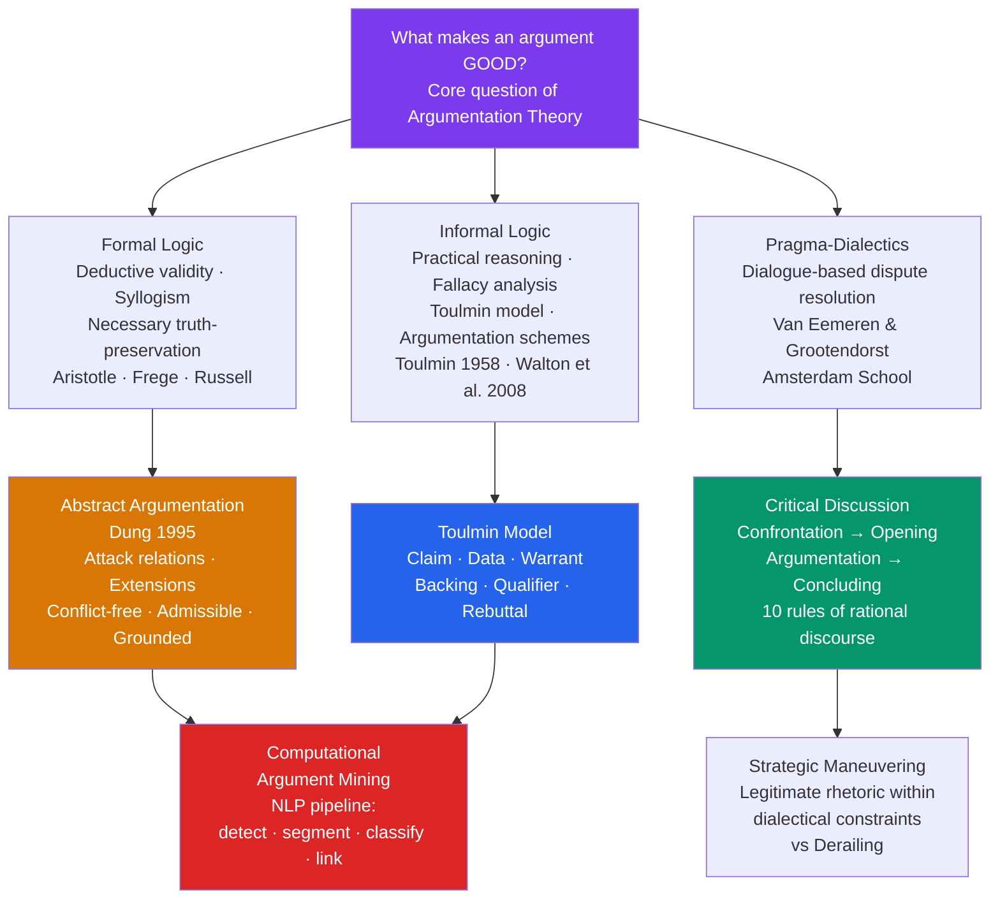

> [!abstract] TL;DR
> Argumentation theory is the interdisciplinary study of how arguments are structured, evaluated, and used in real discourse — sitting at the intersection of formal logic (deductive validity), informal logic (practical reasoning in natural language), and pragma-dialectics (dialogue-based dispute resolution) — with Toulmin's descriptive model of everyday argument structure and Dung's graph-theoretic attack semantics providing the field's two most computationally influential formalisms.

---

## Intuition

**Analogy:** A detective presents a case to a jury. She does not offer a mathematical proof. She points to evidence — a footprint, a motive, a timeline — and connects it to a conclusion ("the defendant was at the scene") via a bridging principle ("footprints of this size are consistent with shoes of this brand, which the defendant owns"). She anticipates the defence's objection ("unless the footprints were planted") and offers support for the bridge itself ("the forensic standard for footprint matching is peer-reviewed and used in 47 jurisdictions"). The jury weighs this package as a whole — not just whether the logic is formally valid, but whether the warrant is trustworthy, the evidence is credible, and the rebuttal is adequately answered.

This is exactly the structure Stephen Toulmin formalized in 1958. The detective is not doing syllogistic logic — she is making a *good argument* in the sense that actually matters in courts, legislatures, scientific debates, and everyday disagreements. Argumentation theory asks: what makes that kind of argument good, bad, or fallacious — and how can we tell?

---

## How It Works



The diagram traces the three founding traditions and their downstream formalisms. Formal logic supplies the ideal of validity; informal logic supplies descriptive tools for how arguments actually work; pragma-dialectics supplies the normative framework for when an argument wins in dialogue. All three traditions converge computationally in argument mining.

---

## Key Concepts

### Secondary Level

#### What Is Argumentation Theory?

Argumentation theory is the interdisciplinary study of how arguments are structured, how they should be evaluated, and how they function within communicative exchanges. It is not the same as formal logic — though formal logic is one of its tributaries. Formal logic asks whether a conclusion *necessarily* follows from premises (validity). Argumentation theory asks the broader question: what makes an argument *good enough to accept* in context? The two questions come apart in practice. A valid argument can be unconvincing (if the premises are false or unwarranted), and a convincing argument can be technically invalid (if it relies on probabilistic rather than necessary inference).

Three traditions have shaped the modern field:

| Tradition | Focus | Key question | Representative works |
|-----------|-------|-------------|----------------------|
| **Formal logic** | Deductive structure | Does the conclusion follow necessarily? | Aristotle *Prior Analytics*; Frege *Begriffsschrift* |
| **Informal logic** | Practical reasoning | Are the premises acceptable and the reasoning reasonable? | Toulmin *Uses of Argument* (1958); Walton *Informal Logic* (1989) |
| **Pragma-dialectics** | Dialogical procedure | Is the argument exchanged according to rules that guarantee rational resolution? | Van Eemeren & Grootendorst *Speech Acts in Argumentative Discussions* (1984) |

These are not competing schools so much as complementary lenses. A courtroom argument must pass all three tests: the logical structure cannot be flagrantly invalid (formal), the evidence must actually support the claim (informal), and the exchange must follow procedural rules — relevance, no interrupting, no ad hominem attacks — that make joint inquiry possible (pragma-dialectical).

#### The Toulmin Model

Stephen Toulmin's *The Uses of Argument* (1958) is the most influential descriptive model of how everyday arguments actually work. Toulmin's key move was to show that a simple premise-conclusion structure — the syllogism — cannot capture the full complexity of arguments as actually made in law, science, ethics, and ordinary discourse. He proposed a six-part model:

**CLAIM** — the conclusion being argued for. *"Petersen will be a British subject."*

**DATA** (Grounds) — the evidence or facts that support the claim. *"Petersen was born in Bermuda."*

**WARRANT** — the general bridging principle that licenses the move from data to claim. *"A person born in Bermuda is a British subject."* The warrant is often unstated — it is the implicit rule doing the inferential work.

**BACKING** — the authority or evidence that supports the warrant itself. *"...under the provisions of the British Nationality Act of 1948."* Backing distinguishes which system of norms (legal, scientific, ethical) the warrant draws its force from.

**QUALIFIER** — a probability term that hedges the strength of the claim: *"presumably," "certainly," "in most cases," "it is very likely that."* The qualifier marks the argument as non-deductive — it could be defeated.

**REBUTTAL** — the conditions under which the claim would NOT hold, even given the data. *"...unless both of Petersen's parents were aliens, or he has renounced British citizenship."* The rebuttal makes the argument's defeasibility explicit.

Crucially, Toulmin's model is **descriptive**, not prescriptive. He is mapping how arguments in natural language actually function — not how they should look if they were to be valid in the logician's sense. The warrant does not make the argument valid; it makes it *reasonable* relative to a particular field's standards of judgment. What counts as a good backing differs between a legal argument (statutes and precedent), a scientific argument (peer-reviewed evidence), and an ethical argument (moral principles or widely shared intuitions).

#### Informal Fallacies

A **formal fallacy** is an error in the logical structure of an argument — the conclusion does not follow from the premises regardless of their truth. *Affirming the consequent* ("If it rains, the street is wet. The street is wet. Therefore it rained." — false because sprinklers could have caused the wetness) is a formal fallacy.

**Informal fallacies** are arguments that fail not because of structure but because of the content, context, or use of the premises. They are valid-seeming but problematic in ways that require examining what the argument *means*, not just how it is arranged. The most common:

| Fallacy | What it does | Why it seems convincing |
|---------|-------------|------------------------|
| **Ad hominem** | Attacks the arguer rather than the argument | Personal character feels relevant to credibility |
| **Straw man** | Misrepresents the opponent's position to make it easier to attack | The weakened version is genuinely refutable |
| **False dichotomy** | Presents two options as exhaustive when more exist | Binary framing feels decisive |
| **Slippery slope** | Claims one step inevitably leads to extreme consequences | Causal chains can be hard to evaluate |
| **Appeal to authority** | Uses an expert's opinion as proof of a claim | Deference to expertise is usually rational |
| **Begging the question** | Assumes in the premises what is to be proved | Circular reasoning can be subtle and hard to detect |
| **Appeal to ignorance** | Claims something is true because it hasn't been disproven | Negative evidence is systematically hard to gather |

A critical insight from modern argumentation theory: most of these are **defeasible**, not automatically fallacious. An appeal to authority is legitimate when the authority is genuinely expert, unbiased, and the claim is within their field. A slippery-slope argument is legitimate when the causal mechanism connecting the steps is real and well-evidenced. The challenge is always contextual: is this instance of the pattern being used correctly, or is it being misapplied to slide past scrutiny?

---

### Undergraduate Level

#### Pragma-Dialectics and the Critical Discussion Model

Frans van Eemeren and Rob Grootendorst's **pragma-dialectics** (Amsterdam School, 1984–2004) reconceives argument not as a logical product to be evaluated in isolation but as a *procedure* — a regulated exchange between parties who disagree and who are trying to resolve that disagreement rationally.

The key concept is the **critical discussion**: an idealized model of rational dispute resolution with four stages:

1. **Confrontation stage** — a difference of opinion is identified and articulated. One party advances a standpoint; the other doubts or denies it. The issue is explicitly put on the table.
2. **Opening stage** — the parties agree on procedural rules (burden of proof, admissible argument forms, what counts as relevant evidence) and establish starting points they both accept. This is the meta-level agreement that makes the subsequent exchange meaningful.
3. **Argumentation stage** — the protagonist defends the standpoint using arguments; the antagonist critically tests those arguments with challenges, counter-arguments, and requests for clarification. This is the substantive exchange.
4. **Concluding stage** — the dispute is resolved: either the protagonist's standpoint is upheld (the antagonist's doubts are answered) or it is retracted (the arguments failed to meet the challenge). Both outcomes are rational resolutions.

Van Eemeren and Grootendorst specify **ten rules of critical discussion** governing rational argumentative conduct. Violations of these rules are, on this account, precisely what fallacies *are*: not formal errors but procedural violations that obstruct the goal of rational resolution. Selected rules:

- *Freedom rule* (Rule 1): parties must not prevent each other from advancing standpoints or expressing doubts. **Violation:** silencing an opponent through appeals to authority or social pressure.
- *Burden of proof rule* (Rule 2): the party that advances a standpoint must defend it when challenged. **Violation:** evading the burden by declaring the standpoint self-evident.
- *Standpoint rule* (Rule 3): attacks must address the standpoint actually advanced by the opponent. **Violation:** the straw man fallacy — attacking a misrepresented version.
- *Relevance rule* (Rule 4): argumentation must be relevant to the standpoint under discussion. **Violation:** *ignoratio elenchi* — arguing beside the point, proving something other than what is at issue.
- *Unexpressed premise rule* (Rule 5): implicit premises may be attributed to a party only if they correspond to what was actually committed to. **Violation:** false attribution of premises.
- *Validity rule* (Rule 7): formally or informally invalid reasoning must not be presented as conclusive. **Violation:** all formal and informal fallacies.

The pragma-dialectical account makes the fallacy classification more principled than simply cataloguing rhetorical tricks. Every fallacy is a violation of a specific rule, which specifies *why* it is wrong — not just that it is suspicious-seeming.

**Strategic maneuvering** is van Eemeren's later refinement (2010). Real arguers are not purely dialectical machines — they have rhetorical goals (winning the audience, appearing credible) in addition to dialectical goals (resolving the dispute rationally). Strategic maneuvering is the simultaneous pursuit of both goals within the rules of the critical discussion. A skilled arguer chooses examples that are both dialectically relevant and rhetorically vivid; uses language that is both precise and emotionally resonant. This is *legitimate* rhetoric. The line is crossed into **derailing** when the rhetorical goal overrides the dialectical one — when the arguer exploits the appearance of rational discourse to pursue victory rather than truth. This is the pragma-dialectical account of why sophistical rhetoric is wrong: not because it uses emotion or style, but because it instrumentalizes the dialectical procedure.

#### Argumentation Schemes

Douglas Walton, Chris Reed, and Fabrizio Macagno's *Argumentation Schemes* (2008) catalogues recurring patterns of everyday and legal argument — patterns that are neither purely deductive nor simply fallacious, but occupy the middle ground of **defeasible reasoning**.

An argumentation scheme is a named pattern with a formal structure (premises → conclusion) and a set of **critical questions** that test whether the scheme is being used properly. The critical questions transform scheme application from mechanical pattern-matching into genuine inquiry.

**Argument from Expert Opinion:**
- *Premises:* Source E is an expert in domain D. E asserts claim C. C is within D.
- *Conclusion:* C is plausible and should be provisionally accepted.
- *Critical questions:*
  1. Is E genuinely an expert in D (not just adjacent)?
  2. Does E have a conflict of interest that could bias the claim?
  3. Is C consistent with what other experts in D say?
  4. Is C based on E's direct expertise, or is E speculating outside their domain?

When all critical questions are answered satisfactorily, the argument from expert opinion is *legitimate* — not a fallacy. When they are not answered, the argument fails, but the failure is specific (which question was not met?) rather than a blanket fallacy.

Other key schemes include:

| Scheme | Premises → Conclusion | Defeating Critical Question |
|--------|----------------------|---------------------------|
| **Argument from Analogy** | A and B are similar in R; A has property P; therefore B has P | Are A and B really similar in the relevant respects? |
| **Argument from Cause to Effect** | A causes B in circumstances C; C obtains; therefore B will occur | Are there defeating factors that break the causal chain? |
| **Argument from Sign** | Observation X is a sign of Y; X is observed; therefore Y is the case | Could X have occurred without Y? Is the sign reliable? |
| **Argument from Commitment** | You committed to principle P; P implies action A; therefore you should do A | Did you actually commit to P? Does P really imply A here? |
| **Argument from Popular Opinion** | Most people accept C; therefore C is plausible | Is the popular belief well-grounded, or is it a bias or fashion? |

Walton's argumentation schemes bridge formal logic and natural language reasoning in a way that is directly applicable to legal evidence evaluation, policy debate, and computational argument processing. The key theoretical insight is that defeasibility — the possibility of being defeated by new information — is a feature of virtually all non-mathematical reasoning, and treating all defeasible arguments as fallacious systematically mischaracterizes the reasoning we actually do.

#### The Dialectical Tradition

The word *dialectic* has three distinct senses that often generate confusion. Understanding all three is essential.

**Socratic dialectic (elenchus)** is the method of philosophical inquiry by question and answer as practised in Plato's dialogues. Socrates claims to have no positive doctrine to teach; instead, he asks his interlocutors to define their key terms (What is courage? What is piety? What is justice?), then shows through systematic cross-examination that their proposed definitions are internally inconsistent or conflict with other commitments they hold. The goal of the elenchus is not victory but *aporia* — the experience of genuine puzzlement that results from having one's confident beliefs exposed as inadequate. Aporia is not a failure; it is the necessary first step toward genuine inquiry. The Socratic insight that underlies all later argumentation theory is that most people do not actually know what they believe until they are forced to state it precisely and defend it against objections.

**Hegelian dialectic** is a different beast. In Hegel's *Phenomenology of Spirit* (1807) and *Science of Logic* (1816), dialectic is a movement within thought itself — the process by which every concept, taken in isolation, generates its own negation, and is then superseded by a higher concept that unifies both. The popular formulation as *thesis → antithesis → synthesis* is a nineteenth-century simplification that Hegel never used; but it captures the basic structure. For Hegel, dialectic is not a method of debate but the self-movement of absolute spirit coming to know itself through the contradiction and resolution of its own categories. Marx appropriated this structure and inverted it: for **dialectical materialism**, the driving force of historical development is not the self-movement of spirit but the contradiction between material productive forces and social relations of production.

**Resolutive dialectic** — the form central to contemporary argumentation theory — is closest to the Socratic model, extended and formalized. A dialectical procedure is a regulated exchange between two parties (protagonist and antagonist) that begins with a stated disagreement and follows rules designed to resolve that disagreement through the force of the better argument. Pragma-dialectics is the most developed version of this approach in contemporary argumentation theory.

The distinction between *discovery dialectic* and *resolutive dialectic* matters for applications. Discovery dialectic — Socratic in spirit — uses argumentative exchange to jointly construct knowledge neither party possessed at the outset; the goal is not winning but understanding. Resolutive dialectic — pragma-dialectical in spirit — uses exchange to settle a stated dispute; one party's position is upheld, the other's retracted. Many real argumentative contexts require both: a good seminar or scientific peer review mixes collaborative knowledge construction with rigorous critical challenge.

---

### Graduate Level

#### Dung's Abstract Argumentation Framework

Phan Minh Dung's 1995 paper "On the Acceptability of Arguments and Its Fundamental Role in Nonmonotonic Reasoning, Logic Programming and n-Person Games" is the most influential formal contribution to argumentation theory of the past thirty years. Dung proposed an abstract framework that strips away all content from arguments — treating them as uninterpreted nodes — and studies only their *attack relations*.

An **abstract argumentation framework** (AAF) is a pair *(Args, Attacks)* where *Args* is a set of arguments and *Attacks ⊆ Args × Args* is a binary relation. *a Attacks b* means "argument a, if accepted, undermines the acceptability of argument b." The content of the arguments — what they assert, what evidence they invoke, what logical structure they have — is invisible to the framework. This abstraction is the source of both its power (it applies to any domain) and its limitation (it cannot evaluate the quality of individual arguments, only their interactions).

Several **semantics** (criteria for determining which arguments are collectively acceptable) have been defined on this structure:

**Conflict-free:** A set S is conflict-free if no argument in S attacks another argument in S. This is a minimal requirement — a rational agent cannot simultaneously hold mutually attacking positions.

**Admissible:** S is admissible if it is conflict-free AND defends all its members — for every a ∈ S, every attacker of a is itself attacked by some b ∈ S. An admissible set is a *coherent position* that can justify itself.

**Preferred extensions:** The maximal admissible sets. A preferred extension is a maximally self-defending position — you cannot add any more arguments without creating an internal conflict or leaving some attack undefended.

**Grounded extension:** The unique least fixed point of the *characteristic function* F(S) = {a : S defends a}. It is the minimal complete extension — the most skeptical position, accepting only what can be unambiguously defended against all attacks. Computed iteratively: start with the set of all unattacked arguments, add what they collectively defend, repeat.

Dung proved that every preferred and complete extension coincides with a stable extension for finite acyclic graphs, and showed that the grounded semantics generalizes well-founded models in logic programming. The framework unified previously separate formalisms — default logic, circumscription, logic programs — into a single abstract theory.

**Reinstatement** is the key phenomenon: if argument a attacks argument b which attacks argument c, then accepting a *reinstates* c — a was defeating b's attack on c. This models the intuition that a counter-counter-argument restores the original argument's standing, which is essential for capturing real argumentative dynamics.

#### Defeasible Reasoning and Non-Monotonic Logic

Standard (classical) logic is *monotonic*: if you can prove C from premises P, you can still prove C after adding new premises P'. In argumentation, this fails. A doctor's recommendation to prescribe drug X is *defeasible* — it can be overridden by "unless the patient is allergic to X" — and discovering the allergy *defeats* the original prescription reasoning, even though the premises that supported it remain true.

Non-monotonic logics model defeasible reasoning by allowing conclusions to be retracted in light of new information without logical contradiction. Several approaches:

- **Default logic** (Reiter 1980): defaults are rules of the form "if A, then normally B (unless blocked by C)." Extensions are maximal sets of conclusions derivable by applying defaults.
- **Circumscription** (McCarthy 1980): minimizes the extension of predicates — assumes the world is as "normal" as possible given the facts.
- **Answer Set Programming (ASP)**: a practical implementation of non-monotonic logic widely used in AI planning and knowledge representation.

Dung's AAF subsumes all of these: for any default logic, there is an AAF with the same extensions. This is his fundamental unification theorem, and it explains why argumentation frameworks have become central to knowledge representation in AI.

**ASPIC+** (Modgil and Prakken 2013) extends Dung's abstract framework by instantiating arguments with actual logical content — premises, inference rules, defeasibility conditions — while mapping the instantiated framework back onto a Dung AAF. This makes it possible to evaluate both the structural acceptability (via Dung semantics) and the material quality (via rule priorities, evidence weights, and scheme applicability) of arguments in the same formalism.

#### Computational Argument Mining

**Argument mining** is the NLP task of automatically identifying argumentative structure in natural language text: detecting which text spans are argumentative (versus purely informative or narrative), segmenting them into argument components (claims, premises, evidence), classifying their rhetorical roles, and identifying the support or attack relations between them.

The standard pipeline:
1. **Argument detection** — classify sentences or clauses as argumentative or non-argumentative (binary text classification).
2. **Component segmentation** — within argumentative text, identify the boundaries of distinct argument components.
3. **Component classification** — label each component as claim, major claim, premise, or evidence (multi-class classification).
4. **Relation identification** — for each pair of components, determine whether one supports, attacks, or is unrelated to the other (relation classification or link prediction).
5. **Argumentation scheme classification** — identify *which* scheme (appeal to authority, cause to effect, etc.) is being employed.

Key corpora and datasets: IBM's Argument Quality dataset (Gretz et al. 2020), the Persuasive Essays corpus (Stab and Gurevych 2017), the Cornell eRulemaking corpus (Abbott et al. 2016), and the Kialo debate dataset.

IBM's **Project Debater** (Slonim et al. 2021, *Nature*) demonstrated end-to-end competitive argument mining at scale: the system listened to a human opponent's argument, retrieved relevant claims and evidence from a large corpus, constructed counter-arguments, and delivered them in natural language — competing in live parliamentary-style debate. The system used argument mining to identify the opponent's claims, evidence retrieval to find counter-evidence, and argument ranking to select the strongest counter-arguments. Project Debater represents the state of the art in applied computational argumentation.

For large language models (LLMs), argument mining intersects with **chain-of-thought prompting** (Wei et al. 2022): CoT implicitly asks the model to externalise its reasoning as an argument structure — claim plus premises plus warrant — which makes the inference both more accurate and more inspectable. Evaluating whether the externalised reasoning is actually the model's inference mechanism (versus post-hoc rationalisation) is an open research question at the intersection of argumentation theory and interpretability.

---

## Python Demo

Simulate Dung's abstract argumentation framework on a structured debate using grounded semantics. The demo implements the attack graph using plain dicts, computes the grounded extension iteratively, and visualises argument status with a matplotlib layout.

```python
import numpy as np
import matplotlib.pyplot as plt
import matplotlib.patches as mpatches

# ── Debate: "Should AI companies be required to disclose training data?" ──────
# Each argument is a node; attack edges model logical undermining.
ARG_DESC = {
    'A1': 'Disclosure protects copyright holders',
    'A2': 'Disclosure chills AI innovation',
    'A3': 'Existing copyright law is adequate',
    'A4': 'Litigation reveals gaps in copyright law',
    'A5': 'Fair use covers AI training data',
    'A6': 'Fair use does not apply to commercial AI',
    'A7': 'Disclosure requirements are too vague to enforce',
    'A8': "Int'l standards provide workable disclosure frameworks",
}
ARGS = list(ARG_DESC.keys())

# (attacker, target) — a attacks b means a, if accepted, defeats b
ATTACKS = [
    ('A2', 'A1'),  # innovation-chilling argument attacks the disclosure claim
    ('A3', 'A1'),  # "copyright adequate" attacks the disclosure claim
    ('A4', 'A3'),  # litigation evidence attacks "copyright adequate"
    ('A5', 'A4'),  # fair use attacks the "litigation gap" argument
    ('A6', 'A5'),  # "fair use doesn't apply" attacks the fair use argument
    ('A7', 'A6'),  # "too vague" attacks "fair use doesn't apply"
    ('A7', 'A1'),  # "too vague" also attacks the disclosure claim directly
    ('A8', 'A7'),  # international standards attacks "too vague"
]

# ── Dung Grounded Semantics ───────────────────────────────────────────────────
def grounded_extension(args, attacks):
    """
    Compute the grounded extension of an abstract argumentation framework.
    
    Algorithm (iterative fixed-point):
      - a is IN  (accepted)  if ALL its attackers are OUT
      - a is OUT (rejected)  if ANY of its attackers is IN
      - a is UNDEC           if neither condition applies
    
    The empty set vacuously defends unattacked arguments: all([]) is True.
    """
    attacked_by = {a: set() for a in args}
    for (atk, tgt) in attacks:
        attacked_by[tgt].add(atk)

    IN, OUT = set(), set()
    changed = True
    while changed:
        changed = False
        for a in args:
            if a in IN or a in OUT:
                continue
            if all(x in OUT for x in attacked_by[a]):   # defended
                IN.add(a)
                changed = True
            elif any(x in IN for x in attacked_by[a]):  # defeated
                OUT.add(a)
                changed = True

    return IN, OUT, set(args) - IN - OUT

IN, OUT, UNDEC = grounded_extension(ARGS, ATTACKS)

# ── Node layout ───────────────────────────────────────────────────────────────
# Two rows: A1 on the left, chains of attack extend rightward.
POS = {
    'A1': np.array([1.0, 3.5]),
    'A2': np.array([2.8, 5.5]),
    'A3': np.array([2.8, 1.5]),
    'A4': np.array([5.0, 1.5]),
    'A5': np.array([7.2, 1.5]),
    'A6': np.array([7.2, 3.5]),
    'A7': np.array([5.0, 5.5]),
    'A8': np.array([7.2, 5.5]),
}
COLOR = {'IN': '#059669', 'OUT': '#dc2626', 'UNDEC': '#d97706'}
RADIUS = 0.48

def status(a):
    return 'IN' if a in IN else ('OUT' if a in OUT else 'UNDEC')

# ── Figure ────────────────────────────────────────────────────────────────────
fig, (ax, ax_leg) = plt.subplots(
    1, 2, figsize=(16, 8),
    gridspec_kw={'width_ratios': [2.6, 1.0]}
)

ax.set_xlim(-0.3, 8.8)
ax.set_ylim(0.2, 7.0)
ax.set_aspect('equal')
ax.axis('off')

# Draw attack edges (arrows) computed in data space for accurate placement
for (atk, tgt) in ATTACKS:
    p0, p1 = POS[atk].copy(), POS[tgt].copy()
    d    = p1 - p0
    dist = np.linalg.norm(d)
    unit = d / dist
    # Shrink endpoints to node boundary
    start = p0 + unit * RADIUS
    end   = p1 - unit * RADIUS
    ax.annotate(
        '', xy=end, xytext=start,
        arrowprops=dict(
            arrowstyle='->', lw=1.7, color='#374151',
            mutation_scale=16,
            connectionstyle='arc3,rad=0.0'
        )
    )
    mid = (start + end) / 2
    ax.text(mid[0], mid[1] + 0.14, 'attacks',
            fontsize=6.5, ha='center', va='bottom', color='#6b7280',
            bbox=dict(fc='white', ec='none', alpha=0.82, pad=1.0))

# Draw nodes
for a in ARGS:
    x, y = POS[a]
    st   = status(a)
    col  = COLOR[st]
    ring = plt.Circle((x, y), RADIUS + 0.05, color='white', zorder=2)
    node = plt.Circle((x, y), RADIUS, color=col, zorder=3, alpha=0.91)
    ax.add_patch(ring)
    ax.add_patch(node)
    ax.text(x, y + 0.11, a,
            ha='center', va='center', fontsize=12,
            fontweight='bold', color='white', zorder=5)
    ax.text(x, y - 0.16, f'[{st}]',
            ha='center', va='center', fontsize=8.5,
            color='white', zorder=5)

ax.set_title(
    "Abstract Argumentation Framework — Dung (1995) Grounded Semantics\n"
    "Topic: 'Should AI companies be required to disclose training data?'\n"
    "Arrows = attack relations.  Node colour = status in grounded extension.",
    fontsize=10, fontweight='bold', pad=14
)

# ── Legend panel ─────────────────────────────────────────────────────────────
ax_leg.axis('off')
ax_leg.set_xlim(0, 1)
ax_leg.set_ylim(0, 1)

legend_patches = [
    mpatches.Patch(color=COLOR['IN'],   label='IN  — Accepted'),
    mpatches.Patch(color=COLOR['OUT'],  label='OUT — Rejected'),
    mpatches.Patch(color=COLOR['UNDEC'],label='UNDEC — Undecided'),
]
ax_leg.legend(handles=legend_patches, loc='upper left', fontsize=9.5,
              frameon=True, title='Grounded Extension', title_fontsize=10)

ax_leg.text(0.03, 0.68, 'Argument Key', fontsize=10,
            fontweight='bold', transform=ax_leg.transAxes)
for i, a in enumerate(ARGS):
    st  = status(a)
    col = COLOR[st]
    yy  = 0.62 - i * 0.076
    ax_leg.text(0.03, yy, f'{a}', fontsize=8.5, color=col,
                fontweight='bold', transform=ax_leg.transAxes)
    ax_leg.text(0.14, yy, ARG_DESC[a], fontsize=7.5,
                color='#1f2937', transform=ax_leg.transAxes)

fig.text(
    0.5, 0.01,
    f"Grounded extension:  IN = {sorted(IN)}   OUT = {sorted(OUT)}   UNDEC = {sorted(UNDEC) or '∅'}\n"
    "Reasoning: A2,A8 unattacked → IN.  A8 defeats A7 → A7 OUT → A6 defended → IN → A5 OUT → A4 IN → A3 OUT\n"
    "A2∈IN also defeats A1 directly.  Final verdict: the disclosure claim (A1) is REJECTED.",
    ha='center', va='bottom', fontsize=8.5, color='#374151'
)

plt.tight_layout(rect=[0, 0.09, 1, 1])
plt.savefig('argumentation_dung_framework.png', dpi=150, bbox_inches='tight')
plt.show()

# ── Console output ────────────────────────────────────────────────────────────
print("=== Dung Grounded Extension ===")
print(f"  IN   (Accepted) : {sorted(IN)}")
print(f"  OUT  (Rejected) : {sorted(OUT)}")
print(f"  UNDEC           : {sorted(UNDEC) if UNDEC else 'none'}")
print()
print("Step-by-step derivation:")
print("  Round 1: A2, A8 have no attackers → added to IN")
print("  Round 2: A1 attacked by IN(A2) → OUT; A7 attacked by IN(A8) → OUT")
print("  Round 3: A6's only attacker is A7(OUT) → A6 added to IN")
print("  Round 4: A5 attacked by IN(A6) → OUT")
print("  Round 5: A4's only attacker is A5(OUT) → A4 added to IN")
print("  Round 6: A3 attacked by IN(A4) → OUT.  Fixed point reached.")
print()
print("Interpretation:")
print("  The grounded extension accepts: the innovation-chilling argument (A2),")
print("  the evidence-of-law-gaps argument (A4), the fair-use-inapplicability")
print("  argument (A6), and the international-standards argument (A8).")
print("  The disclosure claim (A1) is rejected — defeated by A2 directly,")
print("  and confirmed OUT via the A8→A7→A6→A5→A4→A3 chain.")
```

**What the output shows:**

The grounded extension computes the *most skeptical* defensible position: only arguments that survive all attacks and are themselves defended against everything that attacks them. Two arguments (A2, A8) are unattacked — they enter the extension without needing defense. From these, the chain propagates: A8 defeats A7, freeing A6; A6 defeats A5, freeing A4; A4 defeats A3, leaving A1 attacked from all sides. The structural result — that the pro-disclosure claim is rejected — emerges purely from the *topology* of the attack graph, without evaluating whether any individual argument is empirically correct. In real applications, this separation allows formal structure (which arguments defeat which) to be evaluated independently of material quality (whether the premises are true).

---

## Real-World Applications

> **Legal Argumentation — Wigmore Charts:** John Henry Wigmore's *A Treatise on the System of Evidence* (1905) developed a diagrammatic method for analysing chains of evidence in legal cases that anticipates modern abstract argumentation frameworks. A Wigmore chart maps every piece of evidence as a node and every inferential step as a directed edge, distinguishing corroborating evidence (supports), destructive evidence (attacks), and explanatory hypotheses (explanation edges). Modern computational legal reasoning systems (e.g., Carneades, Araucaria) implement Wigmore-style argument graphs directly on Dung's semantic foundations. The UK Supreme Court's assessment in complex fraud cases regularly involves implicit Wigmore-style analysis: prosecutors and defence attorneys are constructing and attacking argument chains, and the verdict reflects a grounded extension over the complete evidence graph.

> **IBM Project Debater — Industrial-Scale Argument Mining:** IBM Research's Project Debater (Slonim et al., *Nature* 2021) deployed an end-to-end argument mining pipeline on a corpus of 400 million newspaper articles. Given a motion, the system identified relevant claims and counter-claims using argument detection and classification models trained on annotated debate transcripts, retrieved supporting evidence, assessed argument strength, and synthesised a coherent spoken argument in real time — then listened to a human opponent and constructed a rebuttal. In the 2019 public demonstration at IBM Think, the system argued against a trained human competitive debater on the motion "We should subsidise space exploration," delivering four-minute opening statements and rebuttals. The result demonstrated that argument mining had matured from an academic exercise into a deployable technology — with direct applications to automated fact-checking, policy analysis, and decision-support systems.

> **Lakatos and Scientific Reasoning as Argumentation:** Imre Lakatos's *Methodology of Scientific Research Programmes* (1978) models the history of science as a dialectical competition between argument structures. A research programme is a cluster of theories sharing a "hard core" of foundational commitments, surrounded by a "protective belt" of auxiliary hypotheses that absorb anomalies without conceding the core. When anomalies accumulate, defenders add auxiliary hypotheses (moves in the argumentative game); eventually the programme becomes "degenerative" — its auxiliary hypotheses are ad hoc and no longer predict novel facts — and a competitor programme becomes "progressive," generating new predictions that are confirmed. The history of the phlogiston-oxygen controversy, the Newtonian-Einsteinian transition, and the fall of the geocentric model are all explicable as grounded extension changes in a competitive argument graph: new evidence (attacks on the old framework) reinstates previously defeated arguments in the competing programme.

> **Automated Fact-Checking — Computational Argument Mining in Practice:** Modern fact-checking pipelines (Full Fact's automated system, Google's fact-check tools, ClaimBuster) use argument mining as their first stage: identifying factual claims in politician's speeches, journalistic articles, or social media posts, then matching them against knowledge bases and evidence sources to evaluate credibility. The International Fact-Checking Network's Poynter database indexes thousands of fact-checks; argument mining enables automated ingestion at scale. The key challenge is distinguishing *claims* (falsifiable propositions) from *opinions*, *rhetorical questions*, and *presuppositions* — a task requiring both argument component classification and pragmatic analysis of illocutionary force.

---

## Common Pitfalls

- **Treating "fallacy" as automatic refutation** — Labelling an argument "appeal to authority" or "slippery slope" does not defeat it; it only raises a critical question. An appeal to authority is legitimate when the authority is genuine and unbiased; a slippery slope is legitimate when the causal mechanism is real. Fallacy labels are starting points for analysis, not endpoints. In competitive debate, opponents exploit the rhetorical force of the label without doing the work of showing which critical question was actually violated.

- **Conflating the Toulmin warrant with a logical premise** — The Toulmin warrant (*"persons born in Bermuda are British subjects"*) is not the same as the major premise of a syllogism. Syllogistic premises are universal generalisations asserted as true; Toulmin warrants are field-dependent bridging principles whose force comes from their acceptance within a particular domain of reasoning (legal, scientific, ethical). Applying logical-validity criteria to warrant quality systematically misreads Toulmin's contribution.

- **Missing the qualifier** — Students applying the Toulmin model habitually omit the qualifier, which turns defeasible arguments into spuriously universal ones. The qualifier (*"presumably," "in all probability," "with exceptions"*) marks the argument's strength and domain of application. Omitting it makes every counter-example a refutation rather than a rebuttal — which is both logically wrong and pragmatically discouraging of legitimate argument.

- **Confusing the grounded extension with "the true position"** — Dung's grounded semantics computes the *most skeptical* defensible position given a fixed attack graph. It does not determine which arguments are materially correct — only which ones survive mutual attack at the structural level. Real argumentation requires both formal analysis (which position is dialectically stable?) and material analysis (are the premises actually true?). Using grounded semantics as a truth oracle mistakes the map for the territory.

- **Ignoring the opening stage in pragma-dialectics** — Most analytical attention goes to the argumentation stage — the substance of the exchange. But van Eemeren and Grootendorst identify the opening stage (agreeing on procedural rules and starting points) as equally critical. Many real disputes fail not because the arguments are bad but because the parties have never established shared starting points — they are operating in different evidential frameworks with different burden-of-proof conventions. A climate scientist and a policy sceptic arguing about emissions targets may talk past each other not because either's arguments are fallacious but because they have different standards for what counts as evidence and different assignments of who must prove what.

- **Ad hominem as automatically fallacious** — The standard informal logic account treats ad hominem as a fallacy — attacking the person rather than the argument. But the pragma-dialectical account is more nuanced: some personal facts *are* relevant to argument evaluation. If a tobacco company's in-house scientist argues that smoking is safe, the fact that they are funded by the tobacco industry is a legitimate critical question about bias (part of the expert opinion scheme's CQ: "Does E have a conflict of interest?"). This is *circumstantial* ad hominem used to probe an argument from authority — it is not a fallacy. The genuine fallacy is *abusive* ad hominem: attacking personal character as a substitute for engaging the argument's content when character is genuinely irrelevant to its force.

---

## Related Concepts

- [[Classical_Rhetoric_and_Aristotle]] — The sibling note in this section; Aristotle's *Rhetoric* provides the original classification of argument types (enthymeme, paradigm) and the dialectical structure that pragma-dialectics formalises; the enthymeme's unstated premise is the rhetorical version of Toulmin's implicit warrant
- [[Pragmatics_and_Speech_Acts]] — Austin and Searle's speech act theory supplies the illocutionary framework within which argumentative moves are defined; a pragma-dialectical "standpoint" is a specific kind of assertive speech act; Grice's Cooperative Principle is the implicit conversational contract that makes dialectical exchange possible
- [[Discourse_Analysis]] — Discourse analysis and argumentation theory overlap in the study of argumentative texts; genre analysis (Swales) identifies how academic and legal texts structure their argumentative moves; critical discourse analysis (Fairclough) examines how power structures determine whose arguments are heard
- [[Graph_Representation]] — Dung's abstract argumentation framework is a directed graph; understanding adjacency lists, attack path detection, and fixed-point computation on graphs (as covered in DSA) is the prerequisite for implementing AAF algorithms at scale
- [[Text_Preprocessing]] — The NLP pipeline for argument mining begins with standard text preprocessing (tokenisation, sentence segmentation, named entity recognition) before argument detection and relation classification; understanding the preprocessing layer is essential for argument mining system design
- [[Cognitive_Biases]] — The catalogue of cognitive biases (confirmation bias, availability heuristic, anchoring) explains *why* informal fallacies are psychologically compelling even when logically defective; dual-process theory (System 1/System 2) maps onto the pragma-dialectical distinction between strategic maneuvering and derailing
- [[Attitudes_and_Persuasion]] — The Elaboration Likelihood Model (Petty & Cacioppo) distinguishes central-route processing (engagement with argument content — corresponds to Toulmin model evaluation) from peripheral-route processing (heuristic acceptance via ethos and pathos cues — corresponds to fallacious appeals to authority and popularity when content is not examined)
- [[Cognitive_Semantics_and_Metaphor]] — Lakoff and Johnson's conceptual metaphor theory shows that argument warrants are often metaphorically structured: the DEBATE IS WAR metaphor ("attacking a position," "defending a claim," "shooting down an argument") is not merely linguistic but shapes how arguers construct and evaluate argumentative moves
- [[Language_Model_Basics]] — Chain-of-thought prompting in LLMs implicitly externalises reasoning as a Toulmin-structured argument; evaluating whether the chain of thought is the actual inference mechanism (versus rationalisation) requires argument mining methods applied to model outputs

---

## Review Questions

### Secondary

1. Explain the difference between the Toulmin warrant and the Toulmin backing, using an original example from any domain (law, science, sport, or everyday life). Why does Toulmin separate them, and what does the separation reveal about how arguments actually work?
2. Choose one of the informal fallacies from the table above. Find a real example in a current political speech, advertisement, or online argument. Explain why it is an instance of that fallacy — and then construct a similar-seeming argument that uses the same pattern *legitimately*. What is the difference between the two?
3. Pragma-dialectics says that fallacies are *violations of rules*, not just suspicious-looking moves. Using the ad hominem fallacy as your example, explain what rule it violates and why that rule exists — that is, why rational dispute resolution requires that rule.

### Undergraduate

1. Analyse the following argument using the full Toulmin model (all six components), then evaluate it using Walton's argumentation scheme for *argument from expert opinion* and its critical questions: "Dr. Sarah Chen, Professor of Nutritional Science at Oxford, states that intermittent fasting reduces all-cause mortality by 15%. Therefore, intermittent fasting is beneficial." What does each framework reveal that the other misses?
2. The pragma-dialectical critical discussion model requires that both parties agree on procedural rules and starting points at the opening stage. In a highly polarised political debate — say, between a committed climate denialist and a climate scientist — what starting points could realistically be agreed? If no starting points can be agreed, is the exchange an argumentation in the pragma-dialectical sense at all? What follows for democratic deliberation theory if this is increasingly the situation in public discourse?
3. Dung's grounded semantics computes the most skeptical defensible position — accepting only what survives all attacks. Preferred semantics accepts any maximal self-defending set, which may be more or less liberal. Design a real example (a debate with at least 6 arguments and multiple attacks) where the grounded and preferred extensions differ. What does the difference mean interpretively — which semantics is more appropriate for legal reasoning, and which for philosophical inquiry?

### Graduate

1. Van Eemeren's distinction between strategic maneuvering (legitimate simultaneous pursuit of rhetorical and dialectical goals) and derailing (rhetorical goal overriding the dialectical one) depends on identifying when rhetoric "undermines" rational discourse. A critic argues that this distinction presupposes a context-neutral ideal of rational discourse that is itself a culturally specific norm — that what counts as "derailing" is determined by which community's norms govern the exchange. Reconstruct the strongest version of both positions. What resources does pragma-dialectics have for responding to the cultural relativism objection, and are they sufficient?
2. Dung's abstract argumentation framework treats all attacks as binary and symmetric in the following sense: attack either holds or it does not, and there is no notion of attack *strength*. ASPIC+ partially addresses this through rule prioritisation. Design an extension to Dung's grounded semantics that incorporates continuous attack weights — where a(i,j) ∈ [0,1] represents the degree to which argument i defeats argument j — and define a corresponding "weighted grounded extension" that reduces to the standard one when all weights are 0 or 1. Prove or disprove that your extension preserves reinstatement.
3. Computational argument mining systems (including Project Debater) are trained on corpora of human-annotated arguments. A fundamental methodological challenge is that annotators themselves often disagree about argument structure — whether a span is a claim or a premise, whether a relation is support or attack — at rates significantly above those found in standard NLP annotation tasks. This inter-annotator disagreement has been framed as a "noise problem" (to be reduced with better annotation guidelines) and as a "fundamental property problem" (arguments are genuinely indeterminate, and averaging away disagreement loses real information). Evaluate both framings. Design an annotation methodology and a model architecture that takes the fundamental property view seriously rather than treating disagreement as error.

---

## Sources

- Toulmin, S.E. (1958). *The Uses of Argument*. Cambridge University Press. (2nd ed. 2003.)
- Van Eemeren, F.H., & Grootendorst, R. (1984). *Speech Acts in Argumentative Discussions*. Foris Publications.
- Van Eemeren, F.H., & Grootendorst, R. (1992). *Argumentation, Communication, and Fallacies*. Lawrence Erlbaum.
- Van Eemeren, F.H. (2010). *Strategic Maneuvering in Argumentative Discourse*. John Benjamins.
- Walton, D., Reed, C., & Macagno, F. (2008). *Argumentation Schemes*. Cambridge University Press.
- Walton, D. (1989). *Informal Logic: A Handbook for Critical Argumentation*. Cambridge University Press.
- Walton, D. (1998). *Ad Hominem Arguments*. University of Alabama Press.
- Dung, P.M. (1995). On the acceptability of arguments and its fundamental role in nonmonotonic reasoning, logic programming and n-person games. *Artificial Intelligence*, 77(2), 321–357.
- Modgil, S., & Prakken, H. (2013). A general account of argumentation with preferences. *Artificial Intelligence*, 195, 361–397.
- Stab, C., & Gurevych, I. (2017). Parsing argumentation structures in persuasive essays. *Computational Linguistics*, 43(3), 619–659.
- Slonim, N., et al. (2021). An autonomous debating system. *Nature*, 591(7850), 379–384.
- Lakatos, I. (1978). *The Methodology of Scientific Research Programmes* (Philosophical Papers Vol. 1). Cambridge University Press.
- Reiter, R. (1980). A logic for default reasoning. *Artificial Intelligence*, 13(1–2), 81–132.
- Perelman, C., & Olbrechts-Tyteca, L. (1969). *The New Rhetoric: A Treatise on Argumentation*. University of Notre Dame Press.
- Johnson, R.H., & Blair, J.A. (1977/2006). *Logical Self-Defense*. International Debate Education Association.
- Hamblin, C.L. (1970). *Fallacies*. Methuen.
- Prakken, H. (2010). An abstract framework for argumentation with structured arguments. *Argument & Computation*, 1(2), 93–124.

---

#LiteratureRhetoric #Rhetoric #Argumentation #Dialectic #InformalLogic #Toulmin #PragmaDialectics #Fallacies #ArgumentationSchemes
