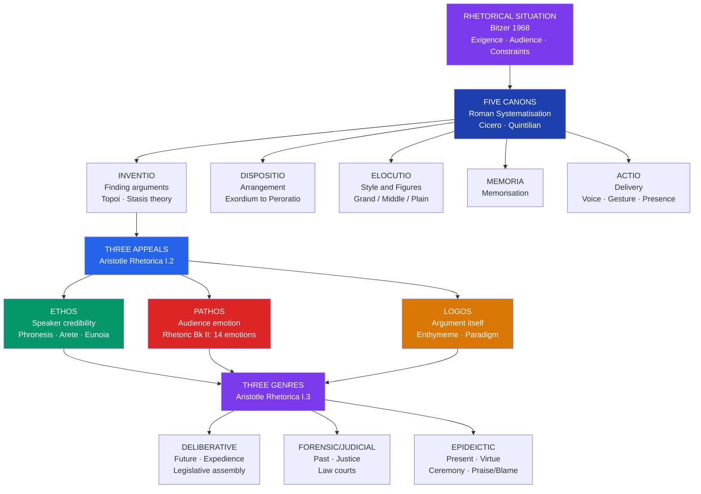

# Classical Rhetoric and Aristotle's Rhetorica

> [!abstract] TL;DR
> Rhetoric is the systematic art of identifying and deploying the available means of persuasion in any given situation; Aristotle's *Rhetorica* (c. 350 BCE) transformed it from a bag of tricks taught by the Sophists into a rigorous techne — a craft with predictable principles — organized around three modes of appeal (ethos, pathos, logos), three genres of discourse (deliberative, forensic, epideictic), and later, through the Roman tradition of Cicero and Quintilian, five productive canons (inventio, dispositio, elocutio, memoria, actio) that together constitute the complete art of public persuasion.

---

## Intuition

**Analogy:** Imagine two surgeons who have mastered identical medical knowledge. One walks into the operating theater and commands the team's instant confidence — her posture, calm authority, and the reputation that precedes her make every instruction followed without question. The other is equally skilled but rattles off technical jargon while the nurses exchange nervous glances. A third performs the same operation but stops to explain each step to the anxious patient's family, uses a simple diagram, and leaves them reassured. None of the three has changed the underlying medical facts. What has changed is how that knowledge lands on its audience.

This is rhetoric's domain. The ancient Greeks noticed that a well-reasoned argument delivered badly falls flat; that an emotionally compelling appeal with weak logic may move people in the wrong direction; that a speaker no one trusts cannot convince even when she is right. Rhetoric is the systematic study of the relationship between knowledge and its effective communication — the art of making the right argument, in the right way, to the right audience, at the right time.

---

## How It Works



The diagram traces the full rhetorical process from situation to speech: every speech event begins with a specific **rhetorical situation** that demands a response; the orator applies the **five canons** to prepare; the canon of inventio draws on the **three appeals** (ethos, pathos, logos) to find arguments; and the completed discourse is always an instance of one of the **three genres** — deliberative, forensic, or epideictic — each with its own temporal orientation, audience, and value criterion.

---

## Key Concepts

### Secondary Level

#### Rhetoric as Techne: From Sophistry to Aristotle

The word *rhetoric* derives from *rhetor* (Greek: public speaker) and *rhema* (speech). It emerged as a named discipline in fifth-century BCE Sicily, where Corax and Tisias reportedly taught techniques for arguing property disputes in newly established democratic courts. The practice spread to Athens through the **Sophists** — itinerant professional teachers, the most famous of whom were Gorgias of Leontini and Protagoras of Abdera. The Sophists made two radical claims: first, that persuasion is a skill that can be systematically taught; second, and more controversially, that rhetoric can make the *weaker argument appear the stronger* — that a skilled speaker could argue either side of any question.

Plato attacked the Sophists ferociously in the dialogue *Gorgias* (c. 380 BCE). His charge was that rhetoric is not a genuine *techne* (a productive craft based on knowledge of its subject matter) but merely a *knack* — like pastry-cooking, which flatters the appetite without nourishing the body. True philosophy seeks *truth*; rhetoric seeks only *belief*. A clever orator can persuade a crowd that a quack is better at medicine than a genuine doctor, which is precisely the danger of divorcing persuasion from knowledge. For Plato, rhetoric untethered from philosophy is the enemy of the just city.

Aristotle's response to Plato, worked out in the *Rhetorica* (three books, c. 335–322 BCE), was systematic and measured. He agreed that rhetoric divorced from truth is dangerous — but argued that this is an abuse of a legitimate art, not a feature of the art itself. His definition is precise: rhetoric is **"the faculty of observing in any given case the available means of persuasion"** (*Rhetoric* I.2). Three things in this definition are doing work:

- **Faculty** (*dynamis*): rhetoric is a *capacity* or *ability*, not a set of tricks. It can be trained.
- **Observing the available means**: the rhetorician does not invent from nothing but perceives what the situation makes possible. Not all means are available in every situation.
- **Persuasion**: the goal is conviction, not demonstration. Rhetoric operates in the domain of the probable and the contingent — where full logical proof is unavailable — not in the domain of mathematics or natural science.

#### The Three Modes of Persuasion: Ethos, Pathos, Logos

Aristotle's most influential contribution to persuasion theory is his classification of the three *pisteis* (proofs or means of persuasion). Unlike the Sophists' miscellaneous bag of techniques, this is a principled typology grounded in the structure of every communication act: there is always a speaker, an audience, and a message.

**Ethos** (speaker credibility) is persuasion through the character of the speaker. Aristotle identifies three components of ethos: *phronesis* (practical wisdom — the speaker understands the subject and the situation), *arete* (virtue or moral character — the speaker is trustworthy and honest), and *eunoia* (goodwill — the speaker has the audience's interests at heart). Crucially, Aristotle insists that ethos must be established *through the speech itself*, not through prior reputation. The orator's choice of arguments, acknowledgment of complexity, and evident fairness all signal character in real time. Modern research on **source credibility** — perceived expertise, trustworthiness, and dynamism — directly operationalises Aristotle's triad.

**Pathos** (emotional appeal) is persuasion through the emotional state of the audience. Aristotle devotes the entire second book of the *Rhetoric* to an analysis of fourteen emotions — anger and its opposite (calmness), love and hatred, fear and confidence, shame and shamelessness, indignation, envy, emulation — examining for each: what the emotion feels like, who experiences it, and toward whom it is directed. His key insight is that *emotions are cognitive states*: they have propositional content (anger involves the belief that one has been wronged; fear involves the belief that something dangerous is approaching). This means emotion is not irrational interference with argument — it is accurate perception of the stakes. Pathos appeals aim to make the audience perceive the situation as it actually is, emotionally. When a prosecutor describes a murder victim in vivid terms, the outrage the jury feels is not manipulation if the description is accurate; it is appropriate moral responsiveness.

**Logos** (logical appeal) is persuasion through the argument itself — through the reasoning, evidence, and demonstration contained in the speech. The two primary instruments of logos are the **enthymeme** and the **paradigm** (dealt with in depth at the Undergraduate level). Logos is not limited to formal logic: it encompasses any arrangement of premises that makes a conclusion follow, including probable inferences, analogies, and sign-arguments.

A critical point that is often missed: Aristotle considers all three modes *equally necessary* and warns against over-reliance on any one of them. A persuader who offers only logos without ethos will not be trusted even if the argument is correct. A persuader who deploys only pathos without logos manipulates rather than persuades. A speaker whose only claim to authority is personal status but who offers no argument is abusing ethos. The art of rhetoric consists in finding the right balance of all three for the specific audience and situation.

#### The Rhetorical Situation: Bitzer's Contribution

Lloyd Bitzer's landmark 1968 essay "The Rhetorical Situation" provided the twentieth century's most influential account of what occasions rhetoric. His central claim: rhetoric is not timeless speech but a *response* to a specific, historically located situation that calls it forth.

Every rhetorical situation has three components:

| Component | Definition | Example |
|-----------|-----------|---------|
| **Exigence** | An imperfection marked by urgency; a problem that rhetoric can ameliorate | A city under siege; a public health crisis; an accusation in court |
| **Audience** | Not bystanders but those with the capacity to act in response to the speech | Legislators (deliberative), jurors (forensic), citizens at a ceremony (epideictic) |
| **Constraints** | Persons, events, objects, and relations that limit rhetorical options | Prior discourse, social norms, available evidence, time, the audience's prior beliefs |

Bitzer's account was challenged by Richard Vatz (1973), who argued that Bitzer's model makes the situation determine the rhetoric, when in fact rhetors *create* the situation through how they define and frame it. Whether an event is a crisis or a routine problem is itself a rhetorical construction. This debate between situational determinism (Bitzer) and rhetorical constructivism (Vatz) maps onto a deeper question about agency: are speakers responding to objective conditions or producing the very reality they appear to describe?

---

### Undergraduate Level

#### The Five Canons of Rhetoric: Cicero and Quintilian

Aristotle's *Rhetoric* was systematised by Roman orators and rhetoricians into **five canons** — a sequential framework for the complete practice of rhetoric that dominated education in Rome and, through the Roman inheritance, in medieval and Renaissance Europe.

**Inventio** (invention or finding) is the first canon: the process of discovering what there is to say. This is not random inspiration but methodical search. Two key tools:

- **Topoi** (topics or commonplaces): general frameworks for generating arguments. Aristotle distinguishes *specific topoi* (unique to a domain — law, politics, ethics) from *common topoi* (available across all domains: argument from degree — "if x is true of the lesser, it is true of the greater"; argument from contraries; argument from definition). The topoi function as a stored inventory of argumentative starting points.
- **Stasis theory** (from Greek *stasis* = standstill): a diagnostic framework for identifying the precise point of disagreement in any dispute. The four stases: *conjecture* (did it happen?), *definition* (what was it?), *quality* (was it justified?), *procedure* (is this the right forum?). Identifying the stasis focuses the argument: a defense attorney who argues quality ("yes, my client killed him, but it was self-defense") when the prosecution has argued conjecture ("we have no proof my client was even there") is arguing past the point.

**Dispositio** (arrangement) concerns the structure of a speech. Roman practice identified five to seven structural parts: **exordium** (opening: establish ethos, secure goodwill, preview the topic), **narratio** (statement of facts: the events as the speaker presents them), **partitio** or **divisio** (division: announce the points to be argued), **confirmatio** (proof: the arguments in support of one's position), **refutatio** (refutation: answering the opponent's arguments), **peroratio** (conclusion: summary and emotional appeal). These are not rigid boxes but a flexible grammar of speech organization that guides audience expectation.

**Elocutio** (style) governs the language of the speech. The Roman tradition identified three levels of style, the *genera dicendi*:

- **Plain style** (*genus humile*): clear, direct, economical language suitable for instructing. The goal is *docere* — to teach.
- **Middle style** (*genus medium*): pleasing and elegant language suitable for entertaining and connecting with the audience. The goal is *delectare* — to delight.
- **Grand style** (*genus grande*): elevated, emotionally powerful language suitable for moving the audience to action. The goal is *movere* — to move.

These match Cicero's famous formulation of the orator's three duties in *De Oratore*: *docere, delectare, movere*. Style also encompasses the vast catalogue of **figures of speech** (*figurae*) that classical rhetoricians mapped with painstaking precision: *metaphor* (substituting one term for another by analogy), *anaphora* (repetition of a word at the beginning of successive clauses), *chiasmus* (inverted parallelism: "Ask not what your country can do for you — ask what you can do for your country"), *antithesis* (opposition of ideas in parallel structure), *synecdoche* (part for whole), *metonymy* (substituting a related concept). These are not mere decorations; they are rhetorical weapons — cognitive structures that make arguments more memorable, more emotionally resonant, and more structurally clear.

**Memoria** (memory) is the canon governing memorisation of the speech. The ancients lacked printed manuscripts for distribution; everything depended on the orator's ability to deliver a prepared text fluently and convincingly. The famous *method of loci* (attributed to Simonides of Ceos) — associating parts of a speech with locations in a well-known building and mentally "walking" through them in delivery — was a standard mnemonic technique. Memoria is the least theorised of the five canons but was, in practice, the one demanding the most sheer effort.

**Actio** (delivery, also *pronunciatio*) governs the physical performance of the speech: management of voice (pitch, volume, pace, rhythm, emotional color), gesture (hand movements, body posture, movement in the speaking space), and facial expression. Demosthenes, asked what the three most important elements of rhetoric were, reportedly answered: "Delivery, delivery, delivery." Modern research on **paralinguistics** and **nonverbal communication** confirms this: audiences form rapid judgments of speaker credibility based on vocal quality and physical demeanor independent of the content of what is said.

#### The Enthymeme and the Paradigm: Rhetoric's Two Instruments of Logos

Aristotle calls the enthymeme "the body of proof" in rhetoric and describes it as the rhetorical equivalent of the syllogism in logic. Understanding the enthymeme is essential because it explains *how rhetoric works cognitively* — not by making arguments but by activating the audience's own argumentative resources.

A standard syllogism has three fully stated parts:
1. All humans are mortal. (major premise)
2. Socrates is human. (minor premise)
3. Therefore, Socrates is mortal. (conclusion)

An enthymeme is structurally similar but *leaves one premise unstated* because that premise is shared knowledge — a *doxa* (common opinion) or widely accepted cultural assumption that the audience supplies automatically:

> "Politicians cannot be trusted, because they seek power above all else."

The missing major premise — "[Those who seek power above all else cannot be trusted]" — is not stated because it need not be. The audience already holds it. By leaving it implicit, the speaker accomplishes two things simultaneously: (1) the audience "fills in" the missing premise, making them *active participants in the reasoning* rather than passive recipients — this increases persuasive force because people believe conclusions they have themselves partly drawn; (2) the unstated premise is insulated from scrutiny and challenge, because you cannot refute what has not been explicitly asserted.

This is why the enthymeme is rhetorically more powerful than a valid syllogism: a complete syllogism invites the audience to examine each premise; an enthymeme recruits shared assumptions and converts them into the engine of persuasion. The danger — which Aristotle acknowledges — is that enthymemes built on *false* shared assumptions propagate ideology. If the unstated premise is wrong or biased, the audience's willingness to supply it means the fallacy never surfaces.

The **paradigm** (Greek: *paradeigma*; Latin: *exemplum*) is the rhetorical equivalent of induction. Where the enthymeme reasons from general to specific (from shared premise to conclusion), the paradigm reasons from specific to general:

> "Athens failed when it became an empire; Sparta failed when it became an empire; therefore empires corrupt their founders."

A single well-chosen historical example, if it resonates with the audience's existing knowledge and values, can carry enormous persuasive weight. The paradigm is weaker as proof than a statistical survey or controlled experiment — Aristotle is not confused about this — but it is appropriate to rhetoric's domain: matters of action and policy where certainty is unavailable and probability must suffice.

#### The Three Rhetorical Genres

Aristotle's classification of rhetoric into three genres (*gene*) is not merely descriptive. Each genre has a specific **audience**, a specific **temporal focus**, and a specific **criterion of value**:

| Genre | Greek Name | Audience | Time Focus | Central Question | Value Criterion |
|-------|-----------|----------|------------|-----------------|-----------------|
| **Deliberative** | *Symbouleutikon* | Legislators / citizens | Future | What should we do? | Expedience / advantage |
| **Forensic / Judicial** | *Dikanikon* | Jurors / judges | Past | Was this act done / just? | Justice / injustice |
| **Epideictic** | *Epideiktikon* | Spectators | Present | Who is worthy of praise/blame? | Virtue / vice |

**Deliberative rhetoric** addresses policy: it exhorts (*symbouleuein*) or dissuades (*apotropein*) on questions of future action — going to war, enacting a law, making an alliance. The audience must decide what to do; the relevant standard is whether the proposed action will be advantageous. Deliberative rhetoric requires detailed knowledge of the domain — finance, military affairs, trade — because you cannot advise without understanding consequences.

**Forensic (judicial) rhetoric** is the rhetoric of the courtroom: the past is fixed, and the question is how to characterise and evaluate it. Prosecution accuses; defense defends. The relevant standard is justice: did the act occur? Was it just or unjust? Forensic rhetoric's distinctive technique is the use of *signs* (*semeia*) and *proofs* (*tekmeria*) to reconstruct past events from available evidence, combined with characterisation of the accused's motive and opportunity.

**Epideictic rhetoric** is the least studied of the three in modern rhetorical education but was central to ancient and Renaissance civic culture. Its occasions include funerals, festivals, public ceremonies, state visits, anniversary commemorations, and political inaugurations. The epideictic speaker praises virtue (*arete*) and blames vice (*kakia*) in specific individuals or collective entities. While the audience does not immediately decide or judge, epideictic rhetoric performs the crucial social function of *constituting community values* — articulating what a community believes to be praiseworthy, thereby reproducing and reinforcing the values themselves. The funeral oration (*epitaphios logos*) — of which Pericles' Funeral Oration (Thucydides, History II.35–46) is the paradigm case — invites the living to identify with the dead by recognizing the virtues for which they died.

---

### Graduate Level

#### Plato's Gorgias and Aristotle's Defense of Rhetoric

The dispute between Plato and the Sophists over rhetoric is not merely a historical curiosity but the foundational philosophical tension in the discipline: the relationship between persuasion and truth, between effective speech and honest speech.

In the *Gorgias*, Plato has Socrates argue that rhetoric is an *empeiria* (knack based on experience) rather than a *techne* (art based on knowledge), comparable to pastry-cooking. Just as pastry-cooking flatters the body without promoting health, rhetoric flatters the soul's desire for approval without promoting virtue or justice. The trained rhetorician is like a doctor in a city of children — able to produce approval by promising sweets while the physician who recommends bitter medicine is rejected. Plato's deeper worry is ontological: rhetoric operates on *doxa* (opinion), not *episteme* (knowledge), and a discipline that treats opinion as its raw material cannot distinguish the persuasive from the true.

Aristotle's rehabilitation of rhetoric in the *Rhetoric* proceeds on several fronts:

1. **Rhetoric as counterpart to dialectic**: the *Rhetoric* opens: "Rhetoric is the counterpart (*antistrophe*) of dialectic." Dialectic (logic) uses certain premises to demonstrate necessary conclusions; rhetoric uses probable premises to produce conviction. Both are general disciplines with no specific subject matter — they are instruments applicable to any field, not fields themselves. This co-ordination places rhetoric on equal footing with logic rather than below it.

2. **Practical reason requires rhetoric**: in the domain of action — ethics, politics, law — certainty is structurally unavailable. Human affairs are contingent; the future is undetermined; reasonable people disagree. Practical wisdom (*phronesis*) operates in this domain, and rhetoric is its public voice. To condemn rhetoric because it cannot achieve mathematical certainty is to condemn practical reason itself.

3. **The proper use defence**: Aristotle acknowledges that rhetoric can be used for evil — but so can athletic training, medicine, and sword-fighting. The abuse of a capacity does not condemn the capacity. The proper use of rhetoric is the defence of truth against skillful falsehood: if good arguments cannot be made to appear good to audiences, the dishonest will have a permanent rhetorical advantage over the honest.

#### Cicero's De Oratore: The Ideal Orator as Universal Person

Cicero's *De Oratore* (55 BCE) represents the fullest development of rhetoric as a programme of humanistic education. Where Aristotle's *Rhetoric* is a philosophical treatise analyzing the mechanics of persuasion, Cicero's dialogue dramatizes an extended debate among Rome's finest orators about what the ideal orator must know and be.

Cicero's central claim is radical: the ideal orator cannot merely be technically proficient. To speak well on any subject, the orator must *know* that subject. To argue cases in court, one must understand law, psychology, history, and moral philosophy. To address the Senate on foreign policy, one must understand military strategy, economics, international relations, and constitutional law. Cicero's ideal is the *homo universalis* — the person of universal cultivation, for whom rhetoric is not a separate discipline but the crown of a complete humanistic education.

Crassus, Cicero's protagonist in *De Oratore*, argues that the union of wisdom and eloquence was separated by Socrates, who (in Plato's dialogues) mocked the Sophists for teaching persuasion without knowledge — but then made the equally serious error of teaching knowledge (philosophy) as if it had no need of effective communication. The union of *sapientia* (wisdom) and *eloquentia* (eloquence) is Cicero's answer to both errors: rhetoric without knowledge is empty; knowledge without rhetoric is socially inert.

Cicero also refines the three duties of the orator into a socially conscious formula. The good orator must *docere* (instruct: make the audience understand the facts), *delectare* (please: make the speech attractive enough to hold attention), and *movere* (move: stir the audience to feel the appropriate emotional response and act on it). Of these, Cicero regards *movere* as the most difficult and most powerful: the orator who can touch the passions has found "the seat of all power" in speech.

#### Quintilian's Institutio Oratoria and the Vir Bonus

Quintilian's *Institutio Oratoria* (c. 95 CE) — twelve books covering the complete education of the orator from infancy through advanced practice — is the most comprehensive statement of rhetoric as moral formation in antiquity. Its central definition of the orator, "**vir bonus, dicendi peritus**" (the good man, skilled in speaking), insists that rhetorical excellence and moral character are inseparable.

For Quintilian, this is not merely an ethical injunction — it has practical consequences for effectiveness. The corrupt person cannot possess genuine ethos, because ethos requires actual trustworthiness, not merely performed trustworthiness. A speaker whose virtue is a veneer will eventually be detected by a discerning audience; the only reliable source of persuasive ethos is genuine character. Quintilian's ideal orator is therefore not just trained in the five canons but educated in philosophy, literature, history, law, and mathematics — the full program of liberal education — because only a person of cultivated judgment can perceive what each situation requires and respond to it appropriately.

Quintilian's insistence on character as constitutive of rhetoric, not merely instrumental to it, represents a direct challenge to the Sophistic model of rhetoric as technique and anticipates modern rhetorical ethics (George Yoos, Andrea Lunsford) that argues persuasion carries inherent ethical obligations: the rhetorician who manipulates the audience's biases, exploits its ignorance, or conceals relevant counter-evidence is not practicing rhetoric but its corruption.

#### The New Rhetoric: Perelman and Olbrechts-Tyteca

The mid-twentieth-century revival of classical rhetoric was led in large part by Chaim Perelman and Lucie Olbrechts-Tyteca's *The New Rhetoric: A Treatise on Argumentation* (1958; English trans. 1969). Writing in the aftermath of the Holocaust — which had demonstrated the catastrophic consequences of irrational rhetoric — they sought to rehabilitate argumentation theory as the foundation of a rational public sphere that could not be reduced to formal logic.

Their central concept is the **universal audience** (*auditoire universel*): the imagined ideal audience of all reasonable, well-informed persons. Arguments addressed to the universal audience claim universal assent; arguments addressed to a particular audience exploit that audience's specific prejudices, values, and blind spots. The distinction matters ethically: populist demagogy addresses the particular audience's resentments and fears; philosophical argumentation addresses the universal audience's capacity for reason. A rhetoric that treats its audience as a universal audience — even when it is addressing a particular one — models the respectful, truth-seeking discourse that democratic deliberation requires.

Perelman and Olbrechts-Tyteca also rebuilt the typology of argument forms (*loci*) — inherited from Aristotle and Cicero's *Topica* — into a comprehensive catalogue of argumentative schemes that operate in natural language rather than formal logic: arguments by association (quasi-logical arguments, arguments based on the structure of reality) and arguments by dissociation (breaking apart terms that had previously been linked). Their work showed that the full range of everyday argumentation — analogy, example, authority, values, definitions — had a rigorous internal logic that classical rhetoric had partially mapped and that modern formal logic had entirely ignored.

---

## Python Demo

Model the three modes of persuasion in an experimental simulation: 100 audience members evaluate a speech under three conditions that manipulate appeal strengths. Three audience types (analytical, emotional, skeptical) weight the appeals differently. Persuasion score is a weighted combination of perceived appeal strengths with individual noise.

```python
import numpy as np
import matplotlib.pyplot as plt

np.random.seed(42)

# ── Appeal strengths per rhetorical condition: [ethos, pathos, logos] ────
# Condition I:   High ethos, low pathos, weak logos
# Condition II:  Low ethos,  low pathos, strong logos
# Condition III: High ethos, high pathos, strong logos (all three)
CONDITIONS = {
    "Cond I\nHigh Ethos\nWeak Logos":  np.array([0.85, 0.20, 0.25]),
    "Cond II\nLow Ethos\nStrong Logos": np.array([0.20, 0.15, 0.90]),
    "Cond III\nAll Three\nHigh":        np.array([0.85, 0.80, 0.88]),
}

# ── Audience sensitivity weights: [w_ethos, w_pathos, w_logos] ───────────
# Analytical:  cares most about logos (evidence, logic)
# Emotional:   cares most about pathos (emotion, narrative)
# Skeptical:   cares most about ethos + logos; resistant to pathos alone
AUDIENCES = {
    "Analytical": np.array([0.20, 0.10, 0.70]),
    "Emotional":  np.array([0.25, 0.55, 0.20]),
    "Skeptical":  np.array([0.50, 0.05, 0.45]),
}

N = 100    # audience members per simulation cell

def simulate_persuasion(appeals, weights, n=N, noise=0.08):
    """
    Each member perceives appeals with Gaussian noise around the true strengths.
    Persuasion score = dot(normalised weights, individual perceived appeals).
    Returns array of n scores in [0, 1].
    """
    perceived = np.column_stack([
        np.clip(np.random.normal(appeals[k], noise, n), 0.0, 1.0)
        for k in range(3)
    ])
    w_norm = weights / weights.sum()
    return np.clip(perceived @ w_norm, 0.0, 1.0)

# ── Run simulations ───────────────────────────────────────────────────────
results = {
    cname: {
        aname: simulate_persuasion(appeals, AUDIENCES[aname])
        for aname in AUDIENCES
    }
    for cname, appeals in CONDITIONS.items()
}

# ── Build figure: bar chart (left) + radar chart (right) ─────────────────
fig = plt.figure(figsize=(15, 6))
ax_bar = fig.add_subplot(121)
ax_rad = fig.add_subplot(122, polar=True)

COLORS    = ['#2563eb', '#dc2626', '#059669']
cond_list = list(CONDITIONS.keys())
aud_list  = list(AUDIENCES.keys())

# ── Panel 1: Grouped bar chart ────────────────────────────────────────────
x      = np.arange(len(cond_list))
width  = 0.22
offsets = [-width, 0.0, width]

for i, aname in enumerate(aud_list):
    means = [results[c][aname].mean() for c in cond_list]
    bars  = ax_bar.bar(x + offsets[i], means, width,
                       label=aname, color=COLORS[i],
                       alpha=0.85, edgecolor='black', linewidth=0.4)
    for bar, m in zip(bars, means):
        ax_bar.text(
            bar.get_x() + bar.get_width() / 2,
            bar.get_height() + 0.012,
            f'{m:.2f}', ha='center', va='bottom', fontsize=7.5
        )

ax_bar.axhline(0.5, color='gray', ls='--', lw=1.0, alpha=0.5,
               label='Persuasion threshold (0.5)')
ax_bar.set_xticks(x)
ax_bar.set_xticklabels(cond_list, fontsize=8)
ax_bar.set_xlabel('Rhetorical Condition', fontsize=10)
ax_bar.set_ylabel('Mean Persuasion Score (0 – 1)', fontsize=10)
ax_bar.set_title(
    "Persuasion Outcomes: Condition × Audience Type\n"
    "(n = 100 per cell; Aristotelian appeal model)",
    fontsize=10
)
ax_bar.legend(title='Audience type', fontsize=9)
ax_bar.set_ylim(0.0, 1.05)
ax_bar.grid(axis='y', alpha=0.3)

# ── Panel 2: Radar chart — normalised appeal weights per audience type ────
labels = ['Ethos\n(Credibility)', 'Pathos\n(Emotion)', 'Logos\n(Logic)']
N_cat  = len(labels)
angles = np.linspace(0, 2 * np.pi, N_cat, endpoint=False).tolist()
angles += angles[:1]    # close the polygon

for i, (aname, w) in enumerate(AUDIENCES.items()):
    w_norm = (w / w.sum()).tolist()
    w_norm += w_norm[:1]
    ax_rad.plot(angles, w_norm, 'o-', lw=2.0, color=COLORS[i], label=aname)
    ax_rad.fill(angles, w_norm, alpha=0.12, color=COLORS[i])

ax_rad.set_xticks(angles[:-1])
ax_rad.set_xticklabels(labels, fontsize=9)
ax_rad.set_ylim(0.0, 0.85)
ax_rad.set_title(
    "Optimal Appeal Profile per Audience Type\n"
    "(normalised weight on each Aristotelian appeal)",
    fontsize=10, pad=20
)
ax_rad.legend(loc='upper right', bbox_to_anchor=(1.42, 1.15), fontsize=9)
ax_rad.grid(True, alpha=0.3)

plt.suptitle(
    "Aristotle's Three Appeals — Computational Persuasion Model\n"
    "Persuasion score = Σ(audience sensitivity weights × perceived appeal strength)",
    fontsize=11, fontweight='bold'
)
plt.tight_layout()
plt.savefig('rhetoric_persuasion_model.png', dpi=150, bbox_inches='tight')
plt.show()

# ── Console summary ───────────────────────────────────────────────────────
print(f"{'Condition':<30}  {'Audience':<12}  mean    sd")
print("-" * 62)
for cname, appeals in CONDITIONS.items():
    label = cname.replace('\n', ' ')
    print(f"\n{label}")
    print(f"  Ethos={appeals[0]:.2f}  Pathos={appeals[1]:.2f}  Logos={appeals[2]:.2f}")
    for aname in aud_list:
        s = results[cname][aname]
        print(f"  {aname:<12}  {s.mean():.3f}   {s.std():.3f}")
```

**What the output shows:**

- **Condition I (High Ethos, Weak Logos)**: the Emotional audience is moderately persuaded by the speaker's warmth and presence; the Skeptical audience is partially persuaded because ethos matters to them; the Analytical audience scores this condition *lowest* — without strong logos, they are unconvinced regardless of how credible the speaker appears.
- **Condition II (Low Ethos, Strong Logos)**: the Analytical audience scores this *highest* of the three — the argument quality is all they require. The Skeptical audience is ambivalent: the logic is there but the credibility gap is hard to overcome. The Emotional audience is barely moved; without ethos or pathos, the argument has no emotional traction.
- **Condition III (All Three High)**: all three audience types score this condition highest — this is the model's quantitative confirmation of Aristotle's thesis that persuasion is maximised when all three appeals are deployed together and appropriately balanced. The gap between audience types narrows because a speaker who commands ethos, pathos, *and* logos reaches each audience through its preferred channel.
- **The radar chart** shows why there is no single optimal rhetorical strategy: the Analytical audience's profile peaks sharply at logos; the Emotional audience's profile peaks at pathos; the Skeptical audience's profile is broad and bimodal across ethos and logos. A speech optimised for one audience type can be actively counterproductive with another — a critical point for any rhetor addressing heterogeneous audiences.

---

## Real-World Applications

> **Lincoln's "House Divided" Speech (1858) — Deliberative Rhetoric:** Abraham Lincoln's acceptance speech for the Illinois Republican senatorial nomination is a masterclass in deliberative rhetoric. Its opening enthymeme — "A house divided against itself cannot stand. I believe this government cannot endure permanently half slave and half free" — leaves the major premise (a divided house falls) only half-stated, recruiting the audience's Biblical knowledge (Matthew 12:25). Lincoln deploys forensic-style historical review of the Kansas-Nebraska Act and the Dred Scott decision not to assign blame (which would be forensic rhetoric) but to demonstrate a pattern pointing toward a catastrophic future — redirecting past evidence toward a deliberative argument about what the country must choose. The speech's logos is sustained and careful; its ethos rests on Lincoln's reputation for honesty ("Honest Abe"); its pathos is restrained, emerging from the gravity of the stakes rather than emotional appeals.

> **Martin Luther King Jr.'s "I Have a Dream" (1963) — Epideictic Rhetoric:** King's address at the March on Washington is structurally epideictic: it praises the founding ideals of American democracy (the Declaration of Independence, the Emancipation Proclamation) and blames the gap between those ideals and the present reality of racial segregation — then constitutes a community of shared aspiration around the vision of what America could and should become. The speech is a concentrated study in the rhetoric of figures: it deploys anaphora ("I have a dream that...") to build emotional momentum through repetition; alliteration ("the jangling discords of our nation... a beautiful symphony of brotherhood"); amplification (each iteration of the dream vision is more expansive than the last). King's pathos is inseparable from his logos: the emotional power of the speech derives from the *argument* that a nation's founding documents make promises it has not kept — the emotional response is the appropriate moral perception of that injustice, not a manipulation away from it.

> **Cicero's Prosecution of Verres (70 BCE) — Forensic Rhetoric:** Gaius Verres, former governor of Sicily, was prosecuted by Cicero for extortion and plunder of provincial artworks. Cicero's forensic strategy was to overwhelm Verres' legal team (led by the equally formidable Hortensius) not with a single great speech but with a flood of evidence — witnesses, documents, inventories of stolen artworks — that made the counter-narrative structurally impossible to sustain. Cicero's ethos as prosecutor was established partly by his willingness to forgo the traditional extended opening speech and move straight to evidence, signaling confidence in the facts rather than reliance on oratorical display. His narratio reconstructed Verres' systematic looting of Sicilian temples and private collections with such precision that the jury could see the stolen goods in their minds. Verres fled into exile before the second phase of the trial — an unprecedented forensic capitulation.

> **Churchill's "We Shall Fight on the Beaches" (1940) — Deliberative with Epideictic Elements:** Churchill's June 1940 speech to the House of Commons — delivered after the Dunkirk evacuation — operates simultaneously as deliberative rhetoric (the argument that Britain must continue to fight rather than negotiate) and epideictic rhetoric (the praise of the British people's endurance and the constitution of a national identity capable of sustaining the war). The famous peroration is a cascade of anaphora ("We shall fight on the beaches, we shall fight on the landing grounds, we shall fight in the fields...") that transforms a military setback into a declaration of will. Churchill's pathos here is entirely cognitive: by imagining a chain of possible defeats and asserting resolve against each one, he makes the audience *inhabit* the worst scenarios and come out the other side still standing — a form of rhetorical *inoculation* against despair. His ethos as Prime Minister is deployed explicitly: "I have, myself, full confidence that if all do their duty... we shall prove ourselves once again..." — the speaker's confident character is made visible as a rhetorical instrument.

---

## Common Pitfalls

- **Mistaking ethos for authority** — Ethos in Aristotle is established *through the speech*, not imported from external reputation. A speaker who relies entirely on status or credentials to establish ethos without demonstrating phronesis, arete, and eunoia in the speech itself is deploying a weak form that dissolves under scrutiny. The converse error is the *ad hominem* dismissal: attacking a speaker's character as a substitute for engaging the argument. Both confuse the person with the argument's logical force.

- **Treating pathos as manipulation** — The most common misreading of Aristotle's three appeals conflates emotional appeal with irrational manipulation. Aristotle's position is that *appropriate* emotional responses are correct perceptions of reality — the anger that responds to genuine injustice is not a cognitive error. Manipulation occurs when a speaker induces *inappropriate* emotions (fear of a non-existent threat; contempt for a blameless person) to cloud judgment. The distinction is between pathos that tracks reality and pathos that distorts it.

- **Enthymeme with contested shared premises** — The enthymeme's power comes from recruiting shared assumptions as unstated premises. When those assumptions are false, culturally specific, or contested, the enthymeme propagates bias under cover of apparent reasoning. Political rhetoric that relies on xenophobic, racist, or classist shared premises to generate conclusions uses the enthymeme's structural logic as a vehicle for prejudice. Critical rhetoric analysis must excavate the unstated premises to evaluate the argument's actual foundation.

- **Genre mismatch** — Applying the wrong rhetorical genre to a situation produces characteristic failures. A politician who responds to a forensic accusation with epideictic praise of their own character has switched genre to avoid engaging the charge. A eulogy that becomes deliberative — arguing policy from the occasion of a death — strikes audiences as exploitative rather than honorific. An epideictic speech that attempts forensic argumentation (assigning blame for specific past acts) violates the constitutive rules of the ceremony and ruptures the communal bond the genre exists to create.

- **Over-correcting toward logos** — Students trained in academic argumentation often assume that the highest form of persuasion is pure logos — that appeals to ethos or pathos are concessions to irrationality. This is false. Aristotle explicitly identifies all three appeals as legitimate, and empirical persuasion research (the Elaboration Likelihood Model in psychology) confirms that audiences process information through both systematic and heuristic routes — and that heuristic processing is not irrational but cognitively economical. A speech with perfect logic and no ethos or pathos will fail with most audiences.

- **Ignoring the rhetorical situation** — Applying a canonical speech structure (exordium → narratio → confirmatio → refutatio → peroratio) without reference to the specific situation produces speeches that feel schematic rather than responsive. The five canons are a grammar of preparation, not a mechanical template. Quintilian devotes extensive attention to *accommodatio* — the adaptation of the prepared speech to the demands of the real occasion as it unfolds, including unexpected events, hostile reactions, and opportunities created by the opponent's errors.

---

## Related Concepts

- [[Discourse_Power_and_Identity]] — Foucault's discourse theory and Critical Discourse Analysis extend Aristotle's analysis of rhetoric as power into an account of how language constructs the categories within which argument is possible; the enthymeme's shared premises are the site where ideological power operates below the level of conscious reasoning
- [[Attitudes_and_Persuasion]] — The Elaboration Likelihood Model (Petty & Cacioppo) maps onto Aristotle's logos/pathos distinction: central-route processing corresponds to logos-intensive persuasion; peripheral-route processing corresponds to ethos and pathos cues; Cialdini's six principles are a modern inventory of peripheral-route techniques
- [[Social_Influence_and_Conformity]] — Social proof and normative influence are the psychological mechanisms underlying Aristotle's insight that epideictic rhetoric constitutes community values; the audience's desire for approval and belonging is a resource that rhetoric both responds to and shapes
- [[Media_Propaganda_and_Political_Communication]] — Modern political communication theory (agenda-setting, framing, priming) is applied rhetorical theory without the classical vocabulary; Lakoff's cognitive framing analysis is a direct descendant of the rhetorical tradition's theory of topoi and dispositio
- [[Classical_Political_Philosophy]] — Aristotle's *Rhetoric* and *Politics* are companion texts: the *Politics* identifies the constitutive forms of political community; the *Rhetoric* provides the communicative technology through which citizens of those communities deliberate; Plato's critique of rhetoric in the *Gorgias* anticipates his philosophical politics in the *Republic*
- [[Discourse_Analysis]] — Discourse analysis investigates the structural and pragmatic properties of connected language; it provides the descriptive tools (coherence, cohesion, speech acts, genre) that rhetorical analysis uses normatively to evaluate the quality and honesty of public argument
- [[Cognitive_Semantics_and_Metaphor]] — Lakoff and Johnson's Conceptual Metaphor Theory shows that Aristotle's *elocutio* — the use of metaphor, analogy, and figurative language — is not ornament but cognition: abstract domains are structured through conceptual metaphors that are themselves rhetorical resources, determining what conclusions feel natural
- [[Oral_Tradition_and_Narrative]] — Classical rhetoric emerged from and systematized oral practice; the five canons assume oral delivery, and the techniques of oral composition (formula, repetition, ring structure, narrative exemplum) are the raw material that inventio works with; epideictic rhetoric is oral culture's most direct descendant in literate societies

---

## Review Questions

### Secondary

1. Aristotle defines rhetoric as "the faculty of observing in any given case the available means of persuasion." What does each part of this definition contribute to distinguishing rhetoric from (a) mere flattery and (b) formal logic?
2. Choose a speech you have heard or read recently — a political speech, a TED talk, a commencement address. Identify one specific moment of ethos, one of pathos, and one of logos. In each case, explain how the speaker establishes or deploys that appeal, and evaluate whether it is used honestly or manipulatively.
3. Bitzer argues that rhetoric is a *response* to a rhetorical situation; Vatz argues that rhetors *create* their situations. Using a real speech as evidence, argue for the stronger position. What would have to be true for the weaker position to be right?

### Undergraduate

1. The enthymeme leaves one premise unstated because it is shared cultural knowledge. Using a contemporary political speech or advertisement, identify an enthymeme, excavate its hidden premise, and evaluate whether that premise is true, contested, or demonstrably false. What are the implications of your analysis for how audiences should receive such arguments?
2. Cicero's ideal orator must know *everything* — law, philosophy, history, military affairs — because genuine eloquence cannot be separated from genuine knowledge. A modern communications consultant might reply that this standard is impossible and unnecessary: what audiences need is not universal learning but skilled message delivery. Construct the strongest version of Cicero's counter-argument to the consultant's position. What empirical claim about how persuasion actually works is at stake?
3. Compare the forensic and deliberative genres. A politician accused of misconduct (forensic question: what did you do?) responds by arguing that their policies have benefited the country (deliberative question: what should we do?). Using Aristotle's genre theory, analyse this genre shift: what is being evaded, why is it rhetorically effective, and why is it potentially dishonest?

### Graduate

1. Perelman and Olbrechts-Tyteca distinguish argumentation addressed to the *universal audience* from argumentation addressed to a *particular audience*. A critic responds that the "universal audience" is itself a particular historical and cultural construction — typically male, European, and educated — that presents its contingent values as universal reason. Reconstruct the strongest version of both positions. What is at stake ethically for democratic deliberation theory if the critic is right?
2. Aristotle argues that pathos — emotional appeal — is a legitimate means of persuasion, not a deviation from reason, because appropriate emotions are accurate perceptions of morally significant features of reality. Evaluate this argument in light of a specific case: a demagogue who uses fear of immigration to persuade citizens to support authoritarian measures. What distinguishes the demagogue's pathos from King's pathos in "I Have a Dream"? Can Aristotle's framework generate this distinction, or does it require additional resources?
3. Quintilian's *vir bonus, dicendi peritus* insists that moral character is constitutive of rhetorical excellence, not merely instrumental to it. The modern rhetorical tradition (Burke, McKeon, Perelman) has largely bracketed this claim, treating rhetoric as a neutral instrument of argumentation that can be used for any purpose. Develop an argument that recovers the Quintilianic position on non-moralist grounds — that is, without appealing to virtue ethics — drawing on any combination of: speech act theory (Austin, Searle), the theory of communicative rationality (Habermas), or the psychology of trust formation.

---

## Sources

- Aristotle. *Rhetoric* [*Rhetorica*]. Trans. W. Rhys Roberts. In *The Works of Aristotle*, Vol. XI. Oxford: Clarendon Press, 1924.
- Aristotle. *On Rhetoric: A Theory of Civic Discourse*. Trans. George A. Kennedy. New York: Oxford University Press, 1991.
- Cicero. *De Oratore*. Trans. E.W. Sutton & H. Rackham. Loeb Classical Library. Cambridge, MA: Harvard University Press, 1942.
- Quintilian. *Institutio Oratoria* (12 vols.). Trans. H.E. Butler. Loeb Classical Library. Cambridge, MA: Harvard University Press, 1920–1922.
- Plato. *Gorgias*. Trans. Donald J. Zeyl. Indianapolis: Hackett, 1987.
- Bitzer, L.F. (1968). The rhetorical situation. *Philosophy and Rhetoric*, 1(1), 1–14.
- Vatz, R.E. (1973). The myth of the rhetorical situation. *Philosophy and Rhetoric*, 6(3), 154–161.
- Perelman, C., & Olbrechts-Tyteca, L. (1969). *The New Rhetoric: A Treatise on Argumentation*. Trans. J. Wilkinson & P. Weaver. Notre Dame: University of Notre Dame Press.
- Kennedy, G.A. (1994). *A New History of Classical Rhetoric*. Princeton: Princeton University Press.
- Corbett, E.P.J., & Connors, R.J. (1999). *Classical Rhetoric for the Modern Student* (4th ed.). New York: Oxford University Press.
- Conley, T.M. (1990). *Rhetoric in the European Tradition*. New York: Longman.
- Garver, E. (1994). *Aristotle's Rhetoric: An Art of Character*. Chicago: University of Chicago Press.
- Bizell, P., & Herzberg, B. (Eds.). (2001). *The Rhetorical Tradition: Readings from Classical Times to the Present* (2nd ed.). Boston: Bedford/St. Martin's.

---

#LiteratureRhetoric #Rhetoric #Aristotle
