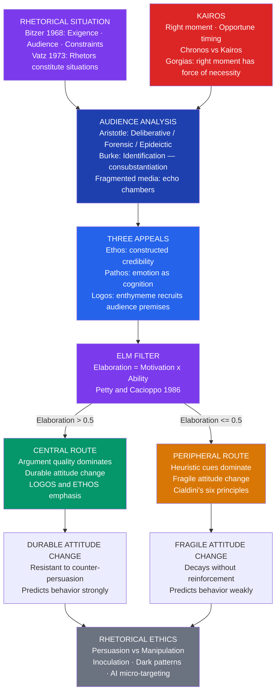

# Persuasion and Audience in Rhetoric

> [!abstract] TL;DR
> Persuasion is not simply about having good arguments — it is about aligning the right argument with the right audience at the right moment; from Aristotle's three appeals and Bitzer's rhetorical situation to Kenneth Burke's identification and Petty and Cacioppo's Elaboration Likelihood Model, rhetoric offers a unified account of how discourse moves people from belief to action, and a framework for distinguishing legitimate persuasion from manipulation.

---

## Intuition

**Analogy:** A master locksmith knows that a key is never "good in general" — every key is cut for a specific lock. A key that opens the front door is useless on the safe and counterproductive in the car ignition. Persuasion works exactly the same way: there is no universally compelling argument. The most devastating logical proof will leave an emotionally devastated audience cold. The most stirring emotional appeal will fail with an audience that demands evidence. The most credible speaker will lose the audience that already distrusts authority. The rhetorician's job is not to forge the strongest key possible — it is to cut the key that fits this lock.

What makes the analogy especially apt is that the orator cannot always inspect the lock directly. They must infer its mechanism from observable clues: what does this audience already believe? What do they fear? Who do they trust? At what moment do they find themselves? Great rhetoricians — from Demosthenes to Lincoln to Obama — are great audience analysts. The speech is the last step. Knowing the audience is the first.

---

## How It Works



The diagram maps the complete arc from rhetorical situation to attitude change: every persuasion event begins with a specific situation that demands a response (Bitzer's exigence); the rhetorician analyzes the audience and waits for — or creates — the right moment (kairos); the three appeals (ethos, pathos, logos) are deployed through arguments that reach each audience member via the route determined by their elaboration capacity (the ELM filter); and the entire process is shadowed by the ethical question of whether the persuasion respects or exploits the audience's rational agency.

---

## Key Concepts

### Secondary Level

#### The Rhetorical Situation: Why Rhetoric Is Never Generic

Lloyd Bitzer's 1968 essay "The Rhetorical Situation" introduced the most influential framework in twentieth-century rhetorical theory. Bitzer's central claim is that **rhetoric is always a response** — not to a topic chosen at will, but to a specific situation that demands it. He identifies three components of every rhetorical situation:

| Component | Definition | Example |
|-----------|-----------|---------|
| **Exigence** | An imperfection marked by urgency; a problem that discourse can change | A public health crisis; an unjust law; an accusation in court |
| **Audience** | Not passive bystanders but those **with the capacity to act** in response to the speech | Legislators deciding on a bill; jurors deciding guilt; citizens deciding whether to vaccinate |
| **Constraints** | Persons, events, objects, and relations that limit what can be said | Norms of the occasion; the audience's prior beliefs; available evidence; time pressure |

Bitzer's model is situationally determinist: the situation calls the speech into existence. Just as a medical emergency calls for a doctor, a rhetorical problem calls for a speech of a particular kind. A eulogist who delivers a policy argument at a funeral has misread the situation; the speech may be technically valid but is rhetoricaly incoherent.

Richard Vatz (1973) challenged Bitzer directly: **situations do not call for rhetoric — rhetors create situations**. Whether an event is a crisis demanding immediate action or a routine problem requiring modest adjustment is not an objective fact but a rhetorical choice. When the Bush administration described September 11 as an "act of war" rather than a "criminal act," it constituted a situation that called for military force rather than law enforcement — a rhetorical choice that shaped a decade of policy. Vatz's point: the definition of the situation is itself the first and most powerful persuasive act.

These two views are not mutually exclusive. The exigence constrains what will be persuasive (a speech denying that climate change is a problem, delivered at a scientific conference, faces severe constraints from the audience's prior commitments). The rhetorician shapes which aspect of the exigence the audience perceives as most urgent. Recognizing both moves gives the analyst and the practitioner a fuller picture.

#### Aristotle's Three Appeals: The Audience as Co-Creator

The three *pisteis* (proofs or appeals) — ethos, pathos, logos — are treated at length in [[Classical_Rhetoric_and_Aristotle]]. Here the emphasis is their **audience-dependent** logic, which is often overlooked in treatment of the three appeals as speaker-side characteristics.

**Ethos** (credibility) is not the speaker's actual character but the **audience's perception** of it. The same credentials generate different ethos with different audiences: a CDC epidemiologist has high ethos with mainstream audiences and low ethos with vaccine-skeptical communities. Aristotle's three components — phronesis (practical wisdom), arete (moral character), eunoia (goodwill toward the audience) — must all be established *for this audience, in this speech*. Ethos is not imported from outside but constructed in the discourse in real time.

**Pathos** (emotional appeal) is audience-specific because different audiences are in different emotional states. Aristotle's analysis of fourteen emotions in *Rhetoric* Book II is fundamentally an **audience psychology**: each emotion is a belief-dependent state, and the orator must bring the audience to hold the underlying belief. You cannot arouse anger in someone who does not believe they have been wronged; you cannot generate fear in someone who does not believe a threat is real and proximate. Pathos is not irrational interference with argument — it is the audience's accurate perception of the morally relevant features of their situation, facilitated by the speech.

**Logos** through the **enthymeme** is the most explicitly audience-dependent of the three. The enthymeme is a rhetorical syllogism with one premise left unstated because the audience already holds it. The crucial implication: **different audiences have different effective enthymemes**. An argument from national honor works for an audience that values honor; it falls flat or backfires with an audience that values pragmatic calculation. Audience analysis is therefore not a preliminary to argument construction — it *constitutes* the argument, because the hidden premise that gives the enthymeme its persuasive force must be supplied by the audience itself.

#### Kairos: The Right Moment

**Kairos** (Greek: *καιρός*) is one of the two Greek words for time. **Chronos** is calendar time — measurable, quantitative, sequential. Kairos is qualitative time: the right moment, the opportune occasion, the window that opens and closes.

Gorgias, in his *Encomium of Helen* (c. 414 BCE), placed kairos at the center of effective speech: "what is said at the right moment has the force of necessity." The same argument delivered at the wrong moment is rejected; the same argument at the right moment feels inevitable.

Kairos operates on multiple levels:

- **Macro-kairos**: the broad historical moment. Lincoln's "House Divided" was kairos because the slavery question could not be deferred indefinitely in 1858; the same argument in 1828 would have been politically suicidal. Roosevelt's "nothing to fear but fear itself" was kairos because the Great Depression had made the population psychologically ready for reassurance and bold federal action simultaneously.

- **Micro-kairos**: the immediate moment within a speech or conversation. Every experienced orator knows that a humorous aside creates the opening for the climactic argument; that an opponent's stumble is the kairos for a refutation; that the audience's emotional peak after a narrative is the kairos for the call to action. Kairos is the skill of reading the internal temperature of an audience in real time.

- **Digital kairos**: in media environments, kairos is the "news cycle" — the window in which a story is top-of-mind and audiences are primed to receive arguments about it. Political consultants, crisis communications specialists, and content marketers all manage kairos explicitly. "Moment marketing" — brands inserting themselves into culturally salient events (as Oreo did during the 2013 Super Bowl blackout: "You can still dunk in the dark") — is kairos reduced to an advertising tactic.

The ethical dimension of kairos is underexplored: the same skill that enables the civic leader to seize the moment for beneficial change enables the demagogue to exploit shock and grief before audiences have had time to deliberate.

---

### Undergraduate Level

#### Kenneth Burke and the Theory of Identification

The twentieth century's most important extension of classical rhetoric is Kenneth Burke's theory of **identification**, developed in *A Rhetoric of Motives* (1950). Burke argued that the classical model — with its focus on the deliberate deployment of speaker-controlled appeals — missed the deeper mechanism by which persuasion actually operates.

For Burke, persuasion is not primarily argument but **identification**: the process by which a speaker and an audience come to share substance — values, attitudes, ways of seeing the world. Burke coined the term **consubstantiation** (deliberately echoing the theological term for the sharing of substance): "You persuade a man only insofar as you can talk his language by speech, gesture, tonality, order, image, attitude, idea, identifying your ways with his."

Burke's key insight is that **division precedes persuasion**. Because human beings are inherently divided — different bodies, different histories, different interests — rhetoric exists to bridge division by creating the experience of shared substance. The speaker who wants to persuade a skeptical working-class audience does not simply present better arguments; they use the language of that community, invoke its values, acknowledge its grievances, and position themselves as "one of us" rather than an outsider.

Three implications follow:

1. **Style is substance**: word choice, regional accent, cultural references are not ornamental but are rhetorical acts of identification. Reagan's folksy humor identified him with small-town America; Obama's cadences identified him with the African American preaching tradition while simultaneously echoing Lincoln for a broader audience. These are genuine acts of consubstantiation when authentic, and transparent manipulation when performed without sincere identification.

2. **Audience analysis must go deep**: to identify with an audience, the speaker must understand not just their positions but their **terministic screens** — Burke's term for the vocabulary and categorical framework through which a community sees reality. Every community has organizing terms — "freedom," "family," "efficiency," "justice" — and arguments must be routed through those screens to find purchase. The same policy framed as "protecting family values" versus "maximizing individual liberty" reaches different terministic screens in the same demographic.

3. **Rhetoric is inherently political**: because identification involves positioning oneself with some groups and against others, every rhetorical act creates solidarity and exclusion simultaneously. The speech that identifies with the "hardworking people of this nation" implicitly excludes those coded as not hardworking. Burke's framework anticipates critical rhetoric's attention to who gets included in the "us" of identification — and who is thereby excluded.

#### The Elaboration Likelihood Model: A Cognitive Architecture of Persuasion

Petty and Cacioppo's **Elaboration Likelihood Model** (ELM, 1986) is the most empirically supported theory of persuasion in social psychology and the most directly applicable to rhetorical practice. It maps precisely onto Aristotle's implicit distinction between logos-intensive and ethos/pathos-intensive persuasion — but specifies the psychological conditions under which each operates.

**Elaboration** is the extent to which a person thinks carefully about the argument being made. It is a product of two factors:

- **Motivation to elaborate**: Does the person care about the issue? Is it personally relevant? Do they feel they have the standing to form an opinion?
- **Ability to elaborate**: Do they have the background knowledge to evaluate the argument? Are they distracted? Is the message too complex for available cognitive resources?

Elaboration = motivation × ability. When both are high, elaboration is high; when either is low, elaboration collapses.

**Central-route processing** (high elaboration): the audience evaluates the quality of the argument itself — the evidence, the logical structure, the strength of the enthymeme's premises. Strong arguments produce lasting attitude change; weak arguments produce a **boomerang effect** (the audience becomes more resistant than before). Source credibility matters only insofar as it affects trust in the evidence.

**Peripheral-route processing** (low elaboration): the audience uses cognitive shortcuts — heuristics — to judge the message without engaging with its content. Cialdini's six principles of influence are precisely the peripheral-route heuristics that reliably generate compliance regardless of argument quality:

| Principle | Heuristic Being Triggered | Rhetorical Instrument |
|-----------|--------------------------|----------------------|
| **Reciprocity** | "Those who give deserve return" | Conceding a point before arguing the main claim |
| **Scarcity** | "Rare things are valuable" | Urgency framing; time-limited offers |
| **Authority** | "Experts are usually right" | Credentialing; expert citation; institutional logos |
| **Consistency** | "I am the kind of person who..." | Foot-in-the-door; value invocation before argument |
| **Liking** | "I trust people like me" | Identification (Burke); similarity and community cues |
| **Social Proof** | "Most people like me do this" | Epideictic community constitution; normative framing |

Three critical applications of the ELM:

1. **Audience segmentation**: a high-elaboration audience (policy experts, activists, scientists) rewards argument quality; peripheral cues in isolation backfire — the expert who notices the logical gap becomes hostile to the source. A low-elaboration audience (distracted voters, consumers browsing) is reached through peripheral cues; a dense logical argument is simply tuned out.

2. **Message design**: the same position should be packaged differently for different elaboration contexts — detailed evidence and explicit argument structure for high-elaboration channels (policy white papers, expert testimony), vivid narrative with strong peripheral cues for low-elaboration channels (thirty-second spots, social media copy).

3. **Resistance through inoculation**: McGuire's **inoculation theory** (1964) establishes that attitude resistance is cultivable. Just as a medical vaccine introduces weakened pathogens to stimulate immune response, exposing audiences to weakened counter-arguments with explicit refutation forces central-route engagement and builds resistance to subsequent full-strength attacks. **Prebunking** — inoculating against manipulation *techniques* rather than specific false claims — is now deployed in media literacy programs and public health campaigns at web scale. Google's "Go Viral" game and the Cambridge-developed "Bad News" game apply this framework to counter COVID and climate misinformation.

#### The Framing Effect: Same Message, Different Audience

The **framing effect** (Tversky and Kahneman, 1981) demonstrated that logically equivalent information produces systematically different decisions depending on how it is presented. When a medical treatment is described as offering a "90% survival rate" versus a "10% mortality rate," people prefer the survival frame — despite the information being identical.

Rhetorically, framing is the selection of which aspect of a complex reality to foreground and which equivalences to suppress. George Lakoff extended framing into rhetorical theory: abstract political concepts are cognitively structured through conceptual metaphors. "Crime as a beast" leads naturally to carceral solutions (hunt it down, lock it up); "crime as a disease" leads naturally to treatment solutions (diagnose root causes, heal the community). The frame is not a deception but a genuine selection of which features of reality are highlighted. The problem arises when frames systematically misrepresent reality — when the "death tax" framing (versus "estate tax") activates a schema of double punishment that obscures the actual policy question of intergenerational wealth redistribution.

---

### Graduate Level

#### Rhetorical Ethics: From the Gorgias to Cambridge Analytica

The question of whether persuasion is inherently ethical runs through the entire history of rhetoric. Its current form is not abstract: Cambridge Analytica, micro-targeted advertising, AI-generated persuasive content, and dark UX patterns have made the question operationally urgent.

**The Platonic charge**: in the *Gorgias* (c. 380 BCE), Socrates argues that rhetoric is a *knack* (like pastry-cooking) that produces belief without knowledge, pleasure without health. The skilled orator can persuade a crowd that a quack is better at medicine than a genuine doctor — which makes rhetoric an instrument of injustice when divorced from truth. Plato's deeper concern is epistemic: an audience without access to truth cannot evaluate a speech on its merits; they can only be pleased or displeased. The democratic assembly is structurally vulnerable to the skilled manipulator.

**Aristotle's defense**: rhetoric is the proper instrument for the domain of action and policy, where certainty is structurally unavailable and reasonable people legitimately disagree. If honest advocates cannot make their case compellingly, manipulators will have a permanent advantage. Aristotle's defense also has a practical dimension: truth is usually more defensible than falsehood, so the rhetorician who knows the truth will, on average, argue more effectively than the one who does not.

**The Sophistic tradition**: Protagoras's "man is the measure of all things" implies that there is no view from nowhere, no audience-independent truth to which rhetoric must answer. Rhetoric is pragmatic: it seeks the best available position for the specific community at the specific time. This rhetorical pragmatism anticipates Burke, Perelman, and contemporary anti-foundationalist rhetoric. Its internal limitation is that without an external truth-criterion, the only check on manipulation is effectiveness — and highly effective falsehood becomes indistinguishable from pragmatically useful truth.

**The contemporary applied ethics question**: when does persuasion become manipulation? A working distinction:

| Persuasion | Manipulation |
|-----------|-------------|
| Presents genuine reasons the audience could evaluate | Exploits cognitive biases to bypass rational evaluation |
| Appeals to emotions that accurately track moral features of reality | Induces emotions that distort reality (false fear, manufactured outrage) |
| Respects the audience's capacity to disagree | Forecloses dissent by exploiting belonging-needs or ignorance |
| Strengthens audience's future evaluative capacity | Weakens it by creating dependence on the persuader's framing |

**Cambridge Analytica** (2016–2018) deployed psychographic micro-targeting: by combining Facebook data from 87 million users (harvested without informed consent) with OCEAN personality models, it built individual-level persuasion profiles. Voters high in neuroticism received fear-based messaging; high-openness voters received innovation-focused messaging; high-agreeableness voters received social-cohesion appeals. The rhetoric was not uniformly false in propositional content — it was tailored to exploit each person's specific psychological vulnerabilities and peripheral-route heuristics. The ELM analysis: the campaign bypassed central-route evaluation by design, routing every audience member through the peripheral-route levers most likely to produce compliance for their personality profile. At democratic scale, this constitutes individualized peripheral-route manipulation of the electoral process.

**Dark patterns** in UX design extend rhetoric into interface architecture: subscription cancellation buried seven menu levels deep, pre-checked consent boxes, "confirmshaming" ("No thanks, I don't want to save money") that deploys pathos to foreclose free choice. The FTC and global regulators increasingly treat these as unfair or deceptive practices — an implicit recognition that the manipulation/persuasion distinction has legal as well as ethical weight.

**AI-generated persuasion** presents a structural challenge to every classical defense against manipulation. The three defenses audiences historically rely on — skepticism about the speaker's credibility (ethos checking), time for critical evaluation, social discussion with other community members — are all undermined by LLMs at scale: AI-generated content is now indistinguishable from human-generated content; it arrives faster than evaluation is possible; and synthetic social proof (AI-generated personas and fake community norms) manufactures the very social cues on which peripheral-route processing relies. The rhetorical ethics question is no longer "was this speaker honest?" but "was this communicative act produced by an entity capable of the kind of honesty we require of rhetors?"

#### Inoculation Theory and Prebunking at Scale

McGuire's inoculation framework (1964) deserves extended treatment because it represents one of the few empirically validated methods for building persuasion-resistant audiences — which is the goal of both democratic rhetoric education (Aristotle's *Rhetoric* as a textbook for citizens who can evaluate speeches) and contemporary media literacy programs.

The mechanism is simultaneously motivational and cognitive:

1. The weakened counter-argument **motivates** the audience to defend their existing belief — they did not know it was under attack; they now take the threat seriously and are primed to engage.
2. The explicit refutation provides **practice in counter-arguing** — the audience learns the move structure of responding to the class of argument they will later encounter at full strength.

The critical innovation of **prebunking** over traditional debunking is that it inoculates against *techniques* rather than specific claims. Debunking must wait for a false claim to circulate, then correct it — an arms race that misinformation always leads. Prebunking exposes audiences to the six core manipulation techniques (emotional exploitation, false dichotomies, conspiracy thinking, impersonation of experts, misrepresentation of evidence, and scapegoating) *before* they encounter specific instances, so the inoculation is immune to content novelty. A randomized trial by van der Linden et al. (2017) showed that prebunking reduced susceptibility to specific misinformation by 21% across demographically diverse audiences, with the effect persisting over at least two weeks.

The rhetorical theory implication: inoculation treats audiences not as passive recipients of correct information but as agents whose capacity for critical evaluation can be actively developed. This is the closest applied rhetoric comes to Plato's vision of an educated democratic citizenry — not by removing rhetoric from the public sphere, but by building the audience's elaboration capacity so that central-route processing becomes the default for contested claims.

---

## Python Demo

Simulate the Elaboration Likelihood Model (ELM) across a population of 1,000 audience members with varying levels of motivation and ability to elaborate. Three panels show route assignment, attitude change distributions, and sensitivity to argument quality for high versus low elaboration audiences.

```python
import numpy as np
import matplotlib.pyplot as plt

np.random.seed(42)

# ── Audience population ───────────────────────────────────────────────────
N = 1000
motivation  = np.random.uniform(0, 1, N)   # motivation to elaborate
ability     = np.random.uniform(0, 1, N)   # ability to elaborate
elaboration = np.minimum(motivation * ability, 1.0)

# ── ELM parameters ────────────────────────────────────────────────────────
ARGUMENT_QUALITY        = 0.70   # central-route persuasion baseline
PERIPHERAL_CUE_STRENGTH = 0.40   # peripheral-route persuasion baseline
NOISE_SD                = 0.08   # individual variability around each baseline

# ── Route assignment ──────────────────────────────────────────────────────
central_mask    = elaboration > 0.5
peripheral_mask = ~central_mask

# ── Attitude change per audience member ───────────────────────────────────
noise = np.random.normal(0, NOISE_SD, N)
attitude_change = np.where(
    central_mask,
    ARGUMENT_QUALITY        + noise,
    PERIPHERAL_CUE_STRENGTH + noise
)
attitude_change = np.clip(attitude_change, 0.0, 1.0)

# ── Three-panel figure ────────────────────────────────────────────────────
fig, axes = plt.subplots(1, 3, figsize=(16, 5))

# Panel 1 — Scatter: motivation x ability space colored by route
ax1 = axes[0]
ax1.scatter(motivation[central_mask], ability[central_mask],
            c='#059669', s=8, alpha=0.5,
            label=f'Central route  (n={central_mask.sum()})')
ax1.scatter(motivation[peripheral_mask], ability[peripheral_mask],
            c='#d97706', s=8, alpha=0.5,
            label=f'Peripheral route (n={peripheral_mask.sum()})')

# Boundary hyperbola: motivation * ability = 0.5  =>  ability = 0.5 / motivation
m_curve = np.linspace(0.502, 1.0, 300)
ax1.plot(m_curve, 0.5 / m_curve, 'k--', lw=1.5,
         label='Elaboration = 0.5 boundary')
ax1.set_xlabel('Motivation to elaborate', fontsize=10)
ax1.set_ylabel('Ability to elaborate', fontsize=10)
ax1.set_title('Route Assignment by\nMotivation x Ability', fontsize=10)
ax1.legend(fontsize=7.5, loc='upper left')
ax1.set_xlim(0, 1)
ax1.set_ylim(0, 1)
ax1.grid(alpha=0.3)

# Panel 2 — Distributions of attitude change by route
ax2 = axes[1]
bins = np.linspace(0, 1, 28)
ax2.hist(attitude_change[central_mask], bins=bins,
         color='#059669', alpha=0.7, edgecolor='white', linewidth=0.4,
         label=f'Central  mean={attitude_change[central_mask].mean():.3f}')
ax2.hist(attitude_change[peripheral_mask], bins=bins,
         color='#d97706', alpha=0.7, edgecolor='white', linewidth=0.4,
         label=f'Peripheral  mean={attitude_change[peripheral_mask].mean():.3f}')
ax2.axvline(0.5, color='gray', ls='--', lw=1.5, alpha=0.7,
            label='Neutral threshold (0.5)')
ax2.set_xlabel('Attitude change score (0 - 1)', fontsize=10)
ax2.set_ylabel('Number of audience members', fontsize=10)
ax2.set_title('Attitude Change Distributions\nby Persuasion Route', fontsize=10)
ax2.legend(fontsize=7.5)
ax2.grid(alpha=0.3)

# Panel 3 — Sensitivity: success rate vs argument quality for each route
ax3   = axes[2]
aq_range = np.linspace(0.0, 1.0, 60)
N_SIM = 5000
SUCCESS_THRESHOLD = 0.5
rng   = np.random.default_rng(0)

central_success    = []
peripheral_success = []
for aq in aq_range:
    # Central route: persuasion scales with argument quality
    s_cent = np.clip(aq + rng.normal(0, NOISE_SD, N_SIM), 0, 1)
    central_success.append((s_cent > SUCCESS_THRESHOLD).mean())

    # Peripheral route: argument quality irrelevant; cue strength is fixed
    s_peri = np.clip(PERIPHERAL_CUE_STRENGTH + rng.normal(0, NOISE_SD, N_SIM), 0, 1)
    peripheral_success.append((s_peri > SUCCESS_THRESHOLD).mean())

ax3.plot(aq_range, central_success,
         color='#059669', lw=2.5, label='Central route (high elaboration)')
ax3.plot(aq_range, peripheral_success,
         color='#d97706', lw=2.5, ls='--',
         label='Peripheral route (low elaboration - flat)')
ax3.axvline(ARGUMENT_QUALITY, color='#2563eb', ls=':', lw=2.0,
            label=f'Baseline AQ = {ARGUMENT_QUALITY}')
ax3.axhline(0.5, color='gray', ls='--', lw=1.0, alpha=0.5,
            label='50% success rate')
ax3.set_xlabel('Argument quality (0 - 1)', fontsize=10)
ax3.set_ylabel('Persuasion success rate (score > 0.5)', fontsize=10)
ax3.set_title('Sensitivity to Argument Quality:\nHigh vs Low Elaboration Audiences', fontsize=10)
ax3.legend(fontsize=7.5)
ax3.set_xlim(0, 1)
ax3.set_ylim(0, 1.05)
ax3.grid(alpha=0.3)

plt.suptitle(
    'Elaboration Likelihood Model (ELM) - Computational Simulation\n'
    f'N={N} audience members  |  '
    f'Argument Quality={ARGUMENT_QUALITY}  |  '
    f'Peripheral Cue Strength={PERIPHERAL_CUE_STRENGTH}',
    fontsize=11, fontweight='bold'
)
plt.tight_layout()
plt.savefig('elm_persuasion_simulation.png', dpi=150, bbox_inches='tight')
plt.show()

# ── Console summary ───────────────────────────────────────────────────────
print(f"\nELM Simulation Results  (N={N})")
print("=" * 52)
print(f"Central-route  audience: {central_mask.sum():4d}  "
      f"({100 * central_mask.mean():.1f}%)")
print(f"Peripheral-route audience: {peripheral_mask.sum():4d}  "
      f"({100 * peripheral_mask.mean():.1f}%)")
print()
print(f"Mean attitude change — central:    "
      f"{attitude_change[central_mask].mean():.3f}")
print(f"Mean attitude change — peripheral: "
      f"{attitude_change[peripheral_mask].mean():.3f}")
print()
success_overall = (attitude_change > SUCCESS_THRESHOLD).mean()
print(f"Overall persuasion success (score > {SUCCESS_THRESHOLD}): {success_overall:.1%}")
print(f"  Central:    "
      f"{(attitude_change[central_mask] > SUCCESS_THRESHOLD).mean():.1%}")
print(f"  Peripheral: "
      f"{(attitude_change[peripheral_mask] > SUCCESS_THRESHOLD).mean():.1%}")
```

**What the output shows:**

- **Panel 1 (Route assignment):** The hyperbolic boundary divides motivation-ability space. Audience members in the lower-left region fall on the peripheral route regardless of the other factor. The geometry illustrates why a technically demanding speech loses most of a heterogeneous audience: even modest ability *or* motivation shortfalls push listeners into peripheral processing — the routes are not symmetric.

- **Panel 2 (Attitude change distributions):** The two distributions are separated by approximately 0.30 attitude-change units (the gap between argument quality 0.70 and peripheral cue strength 0.40). The central-route distribution centers above the neutral threshold; most peripheral-route audience members cluster below it — illustrating why peripheral cues alone are typically insufficient for durable behavior change.

- **Panel 3 (Sensitivity analysis):** The central-route success curve rises steeply with argument quality and crosses 50% at approximately AQ = 0.5. The peripheral-route curve is completely flat: argument quality is *irrelevant* for low-elaboration audiences regardless of how strong the argument becomes. The intersection of the two curves makes the prescriptive point: improving argument quality above its current level benefits only audiences capable of central-route processing. For mixed audiences, peripheral cue strength must be independently optimized — which is why even evidence-based public health campaigns require strong narrative and source credibility alongside the evidence.

---

## Real-World Applications

> **Obama's 2008 Presidential Campaign — Audience Analysis and Identification at Scale:** The Obama campaign pioneered data-driven audience analysis in political rhetoric. Field organizers were trained in Burke's identification principle: canvassers were matched to neighborhoods by demographic and cultural profile and trained to open conversations with community-specific concerns rather than national talking points. The campaign's micro-segmentation divided the electorate into dozens of audience types, each receiving messaging calibrated to their specific terministic screen (economic security for working-class whites; healthcare access for older voters; community pride for African Americans). The "Hope" poster by Shepard Fairey is kairos made visual: the word "HOPE" alone occupies the visual field, with no policy content attached, leaving audiences to supply their own content for "hope of what?" — a visual enthymeme that scaled identification across ideologically diverse audiences by leaving the implied premise maximally open.

> **Inoculation in Public Health — Prebunking COVID-19 Misinformation (2021):** The UK's "RESIST2" framework and Cambridge University's "Go Viral" and "Bad News" games deployed inoculation theory at web scale. Rather than debunking specific COVID claims after they circulated, prebunking inoculated audiences against six manipulation *techniques* (emotional exploitation, false dichotomies, conspiracy thinking, impersonation of experts, misrepresentation of evidence, and scapegoating) before they encountered specific false claims. A randomized trial showed that prebunking reduced susceptibility to misinformation by 21% across demographically diverse audiences. The campaign treated audiences not as passive recipients of correct information but as agents whose capacity for critical evaluation could be actively developed — the closest applied rhetoric comes to Plato's wish for a genuinely educated democratic public.

> **Cambridge Analytica and Psychographic Targeting (2016–2018):** Cambridge Analytica used Facebook data from 87 million users combined with OCEAN personality models to build individual-level persuasion profiles. Conservative voters high in neuroticism received fear-based gun control messaging; high-openness voters received innovation-focused economic framing; high-agreeableness voters received social-cohesion appeals. The rhetoric was not uniformly false in propositional content — it was individually calibrated to the peripheral-route heuristics and emotional vulnerabilities of each specific person. The ELM analysis is precise: by designing around each individual's elaboration profile and dominant peripheral cues, the campaign maximized attitude change without engaging the central route at all. At electoral scale, this constitutes democracy-scale peripheral-route manipulation.

> **Kairos in Climate Policy Communication:** Climate policy rhetoric offers a clinical study in the relationship between kairos and persuasion effectiveness. Research by Leiserowitz at Yale's Climate Change Communication program found that public support for climate policy spikes immediately following extreme weather events (floods, record temperatures, wildfires) and decays back to baseline within six to eight weeks. The exigence creates an audience: for a brief window, citizens who were previously low-elaboration on climate policy are temporarily high-elaboration because the issue is personally salient. Climate advocates who publish policy arguments during these windows reach the central route of audiences who are normally peripheral processors on this topic. Missing the window — publishing the same argument at baseline — yields a fraction of the persuasive effect with identical argument quality. The kairos is not manufactured; it is read and seized.

---

## Common Pitfalls

- **Treating audience analysis as demographics** — Knowing that an audience is "college-educated women aged 35–50" tells you almost nothing about their terministic screens, emotional states, prior beliefs, or elaboration capacity on a specific issue. Effective audience analysis is ideographic (understanding specific belief structures and values) not merely demographic. A demographic group contains deeply heterogeneous audiences for any given contested claim.

- **Ignoring elaboration level when designing messages** — The most common failure in public communication is deploying a central-route message to a peripheral-route audience. Dense, evidence-rich scientific communication fails with low-elaboration general audiences not because the audiences are unintelligent but because their motivation or ability to elaborate on the specific issue is low. The reverse error — deploying emotional narrative and peripheral cues with a high-elaboration expert audience — backfires: experts detect the rhetorical move and become suspicious of the source's credibility.

- **Confusing kairos with opportunism** — Kairos is not simply "wait for the right moment and exploit it." The ethical dimension requires that the opportune moment genuinely opens space for legitimate persuasion — the audience's attention and readiness to reconsider. Exploiting shock (pushing a policy immediately after a mass shooting, before audiences have had time to deliberate) may be rhetorically effective in the short term but forecloses the reflective reasoning that democratic persuasion requires. The distinction between seizing kairos and manufacturing urgency is one of the harder questions in applied rhetorical ethics.

- **Conflating enthymeme with fallacy** — A hidden premise is not automatically manipulative. The enthymeme is only as honest as the premise it suppresses. If the audience genuinely and reasonably holds the implicit premise, the enthymeme is efficient communication, not deception. If the implied premise is false, contested, or the speaker knows the audience holds it through prior misinformation, suppressing it is manipulative. The evaluation requires excavating the hidden premise, not merely noting its absence.

- **Equating all emotional appeal with manipulation** — The opposite error: defining any appeal to emotion as "manipulation" and concluding that the only ethical rhetoric is pure logical argument. This is empirically untenable (virtually no persuasion operates through pure logos alone) and normatively confused. Emotional appeals to genuine features of a situation are not manipulation — they are appropriate moral responsiveness to morally salient reality. The manipulation question is always about whether the emotional cue accurately represents the situation, not about whether it operates through the peripheral route.

- **Missing the double audience** — In political and institutional contexts, a speech often has two audiences simultaneously: the stated immediate audience (the legislative chamber, the jury, the press conference room) and the wider media and public audience. Arguments optimized for the immediate deliberative audience can fail with the secondary audience, and vice versa. Cicero knew this: the *In Verrem* speeches were designed for the jury and for the Roman reading public simultaneously — their forensic effectiveness and literary brilliance served different audiences in the same text.

---

## Related Concepts

- [[Classical_Rhetoric_and_Aristotle]] — The foundational treatment of ethos, pathos, logos, and the five canons; the two notes are designed as complements: Classical Rhetoric covers speaker-side preparation and historical development; this note covers audience-side processing and modern persuasion science
- [[Attitudes_and_Persuasion]] — The psychological empirical base for the ELM, cognitive dissonance, and Cialdini's principles analyzed here; the overlap between Aristotle's three appeals and Petty and Cacioppo's dual-process model is direct: central route = logos-dominant; peripheral route = ethos and pathos cues operationalized
- [[Social_Influence_and_Conformity]] — Social proof and normative influence are the psychological mechanisms underlying Burke's identification and Aristotle's epideictic genre; the audience's desire for belonging and community approval is the deep psychological structure on which peripheral-route rhetoric operates
- [[Pragmatics_and_Speech_Acts]] — Austin and Searle's speech act theory establishes how rhetorical genres perform social actions (deliberative speeches create binding commitments; epideictic speeches constitute community values); Grice's cooperative principle is the pragmatic constraint within which all rhetorical strategy operates
- [[Signaling_Games]] — Game-theoretic analysis of sender-receiver problems with information asymmetry; ethos in rhetoric is precisely a signaling problem — the speaker must signal trustworthiness credibly to a skeptical audience; separating equilibria in signaling games model why credibility signals must be costly to be believed (Aristotle's insistence that ethos be earned through the speech, not pre-imported, is a separating equilibrium condition)

---

## Review Questions

### Secondary

1. Lloyd Bitzer argues that a speech is called into existence by its rhetorical situation. Richard Vatz argues that rhetors create their situations through rhetoric. Using a specific recent political speech or media moment, construct the strongest case for each view. Which account better explains the episode?
2. Explain why the enthymeme is more persuasively powerful than a fully explicit syllogism. Give an example of an enthymeme you have encountered recently (in an advertisement, a political speech, or a news headline). What is the hidden premise? Is it true?
3. A public health official has strong scientific evidence for a new policy but is addressing a community that distrusts government agencies. Using Aristotle's three appeals and the concept of kairos, advise them on how to approach this communication challenge.

### Undergraduate

1. The Elaboration Likelihood Model predicts that the same message will have different effects on high-elaboration and low-elaboration audiences. Design a persuasion campaign on a single issue (your choice) for two audiences: (a) policy experts and journalists, and (b) low-information voters in a high-noise media environment. How does the message change across contexts, and what ethical constraints govern each version?
2. Kenneth Burke argues that persuasion is fundamentally identification. A critic responds that this reduces rhetoric to flattery — telling audiences what they want to hear — and is therefore not truth-seeking but pandering. Construct the strongest version of both Burke's position and the critic's objection. What empirical claim about how persuasion actually works is at stake?
3. Inoculation theory (McGuire) and the Elaboration Likelihood Model give different pictures of how to build persuasion-resistant audiences. In what ways do they agree? Where do they differ about the relationship between thinking carefully and being persuaded correctly? Which framework better explains your own experience of changing or retaining a firmly held belief in the face of persistent counter-pressure?

### Graduate

1. The Cambridge Analytica operation was highly effective as measured by attitude change metrics but is widely condemned as unethical. Using the manipulation-versus-persuasion distinction developed in this note, construct a precise account of *what specifically* made it manipulative rather than merely persuasive. Is the objection to the targeting methodology, the non-consensual data collection, the lack of transparency, or the exploitation of psychological vulnerabilities? Could any element of psychographic targeting be ethically deployed?
2. Kairos names the rhetorical skill of timing — perceiving and seizing the opportune moment. A demagogue and a democratic statesperson both possess this skill; both can exploit public grief, fear, or anger to advance their arguments before deliberation is possible. Is there a principled distinction between the use of kairos that respects democratic deliberation and the use that undermines it? What resources does classical rhetoric offer for drawing that line, and what supplementary frameworks (Habermasian communicative rationality, Rawlsian veil of ignorance, Aristotelian phronesis) would you need to develop a full account?
3. AI language models can now generate individually tailored, contextually calibrated, emotionally resonant persuasive text at scale. The three classical defenses against manipulation — skepticism about the speaker's credibility (ethos checking), time for critical evaluation, and social deliberation with community members — all fail in the AI case. Develop a new framework for rhetorical ethics adequate to AI-generated persuasion, drawing on at least two of the following: signaling game theory, inoculation and prebunking theory, Habermas's communicative rationality, Austin and Searle's speech act ethics, or regulatory design theory.

---

## Sources

- Bitzer, L.F. (1968). The rhetorical situation. *Philosophy and Rhetoric*, 1(1), 1–14.
- Vatz, R.E. (1973). The myth of the rhetorical situation. *Philosophy and Rhetoric*, 6(3), 154–161.
- Burke, K. (1950). *A Rhetoric of Motives*. New York: Prentice Hall.
- Petty, R.E., & Cacioppo, J.T. (1986). The elaboration likelihood model of persuasion. *Advances in Experimental Social Psychology*, 19, 123–205.
- Cialdini, R.B. (1984). *Influence: The Psychology of Persuasion*. New York: HarperCollins. (Updated edition 2021.)
- McGuire, W.J. (1964). Inducing resistance to persuasion: Some contemporary approaches. *Advances in Experimental Social Psychology*, 1, 191–229.
- Gorgias. *Encomium of Helen*. Trans. D. MacDowell. Bristol: Bristol Classical Press, 1982.
- Tversky, A., & Kahneman, D. (1981). The framing of decisions and the psychology of choice. *Science*, 211(4481), 453–458.
- Lakoff, G. (2004). *Don't Think of an Elephant: Know Your Values and Frame the Debate*. White River Junction, VT: Chelsea Green.
- Kahneman, D. (2011). *Thinking, Fast and Slow*. New York: Farrar, Straus and Giroux.
- Pratkanis, A., & Aronson, E. (2001). *Age of Propaganda: The Everyday Use and Abuse of Persuasion* (Rev. ed.). New York: W.H. Freeman.
- van der Linden, S., Maibach, E., Cook, J., Leiserowitz, A., & Lewandowsky, S. (2017). Inoculating against misinformation. *Science*, 358(6367), 1141–1142.
- Leiserowitz, A. (2007). International public opinion, perception, and understanding of global climate change. *Human Development Report 2007/2008*. UNDP.
- Aristotle. *On Rhetoric: A Theory of Civic Discourse*. Trans. G.A. Kennedy. New York: Oxford University Press, 1991.

---

#LiteratureRhetoric #Rhetoric #Persuasion
