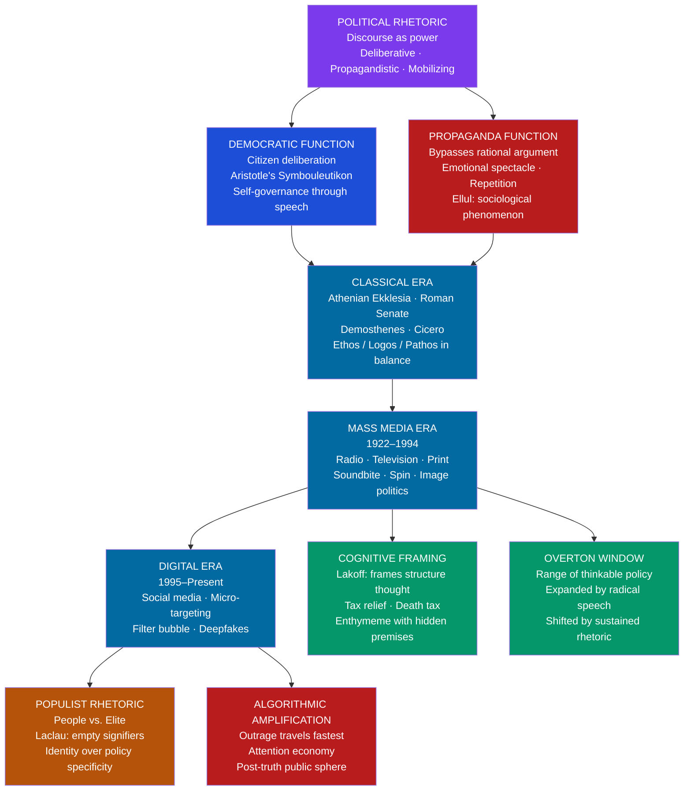

> [!abstract] TL;DR
> Political and public rhetoric is the strategic use of language, symbol, and spectacle to shape political beliefs, mobilize collective action, construct group identity, and legitimize or challenge power; it spans the full range from Athenian deliberative oratory and Cicero's forensic masterpieces to totalitarian propaganda, television image-politics, and algorithmic outrage — its constitutive tension, live since Athens, is whether rhetoric is democracy's oxygen or its poison.

---

## Intuition

**Analogy:** In ancient Athens, the Ekklesia — the assembly of male citizens on the Pnyx hill — was not a place where experts decided things for the people. It was the place where the people decided things for themselves, by speaking and voting. When Demosthenes climbed the bema to warn that Philip of Macedon was swallowing Greek city-states one by one and Athens was sleepwalking into conquest, he was not writing a policy memo or publishing a think-piece. He was attempting to change the course of history through the force of public speech alone. When a demagogue rose after him to offer easier answers — no war, no sacrifice, the threat is exaggerated — the same democratic forum became a vehicle for catastrophically bad choices. The assembly did not consult an oracle to determine who was right. It was moved by whoever moved it.

This is the foundational tension of political rhetoric. Democratic self-governance *requires* public argument: citizens cannot deliberate without speaking, and they cannot speak without the arts of persuasion. But those same arts are available to the dishonest, the demagogue, and the propagandist. Every democratic culture since Athens has had to live with the question Plato raised in the *Gorgias*: is rhetoric the citizen's tool for self-governance, or the tyrant's tool for manufacturing consent?

---

## How It Works



Political rhetoric flows between two structural poles — the democratic and the propagandistic — across three historical eras. The classical era saw the fullest integration of ethos, logos, and pathos in deliberative and forensic oratory. The mass media era restructured political speech around the soundbite, the managed image, and cognitive framing. The digital era introduced algorithmic amplification that systematically rewards emotional intensity over argumentative density, creating the conditions for populist rhetoric and post-truth politics.

---

## Key Concepts

### Secondary Level

#### Deliberative Rhetoric and Democratic Self-Governance

Aristotle's taxonomy of the three rhetorical genres — deliberative (*symbouleutikon*), forensic (*dikanikon*), and epideictic (*epideiktikon*) — maps onto the three fundamental institutions of democratic public life: the legislative assembly, the law court, and the civic ceremony. Deliberative rhetoric is the genre most central to democracy because it addresses the future: what should we do? Should we go to war, pass this law, form this alliance? Its audience is the assembly; its value criterion is what is *expedient* or *advantageous* for the community; its characteristic operation is weighing competing claims about the probable consequences of proposed actions.

The deliberative tradition rests on a radical political assumption: that citizens are capable of reasoning together toward good collective decisions, and that the best way to reach those decisions is through open argument rather than through expertise, tradition, or authority alone. This is the rhetorical foundation of liberal democracy. Rhetoric is not a compromise with irrationality — it is the communicative form that democratic rationality takes in a world of genuine uncertainty, competing values, and the need for action under time pressure.

The Athenian assembly at its best — represented most fully in Thucydides' reconstruction of Pericles' *Funeral Oration* and in Demosthenes' *Philippics* — was this ideal in practice: an arena in which any citizen could speak, where arguments were tested against counter-arguments, and where the community's collective judgment (however imperfect) was the only legitimate authority. The *Philippics* are the paradigm case of deliberative rhetoric under existential pressure. In three speeches (351, 344, 341 BCE), Demosthenes attempted to rouse a complacent Athens to the danger posed by Philip II of Macedon's expansion, deploying detailed evidence of Philip's territorial moves, explicit argument about Athens' neglected military capacity, and emotional appeals to the city's historical memory of Marathon and Salamis. Athens repeatedly failed to act decisively — and the English word *philippic*, meaning a vehement verbal denunciation, preserves the memory of Demosthenes' passionate and ultimately frustrated warnings.

#### Cicero and the Roman Tradition

If Demosthenes represents the deliberative ideal at its most urgent, Cicero represents its forensic application at its most sophisticated. Marcus Tullius Cicero (106–43 BCE) was simultaneously Rome's greatest orator, its most influential rhetorical theorist, and a practising politician whose speeches survive as studied models of rhetorical craft.

The **Catilinarian Orations** (63 BCE) are the climax of his political career. Lucius Sergius Catilina, defeated twice in consular elections and bankrupt, organized an armed conspiracy to overthrow the republic. As consul, Cicero uncovered the plot and delivered four speeches to the Senate that destroyed it — not primarily through evidence (though evidence came later) but through the rhetorical construction of Catiline as the embodiment of anti-Roman vice, contrasted with the Senate as the embodiment of traditional Roman virtue. The opening of the First Catilinarian has never been surpassed as an example of direct apostrophe: *"Quousque tandem abutere, Catilina, patientia nostra?"* — "How long, Catiline, will you abuse our patience?" The sentence places Catiline before the Senate as an accused man rather than a senator, and Cicero as the accuser on behalf of the entire Roman order, before a single piece of evidence has been presented.

Cicero's theoretical synthesis — most fully expressed in *De Oratore* (55 BCE) — articulates the ideal of the *homo universalis*: the orator who cannot merely speak well but must *know* everything relevant to what he speaks about, because eloquence without wisdom is empty and dangerous. His three duties of the orator — *docere* (instruct), *delectare* (delight), *movere* (move) — organize the art around the audience's cognitive, aesthetic, and emotional modes of engagement. Of these, Cicero considers *movere* the most powerful and the most difficult: the orator who can touch the passions has found the true engine of collective action.

#### Lincoln and Kennedy: The American Tradition

The American political tradition produced two speeches that stand as models of the epideictic-deliberative fusion at its finest:

**The Gettysburg Address** (Lincoln, November 19, 1863) is 272 words — briefer than many modern press releases — and yet it performed one of the most consequential acts of political redefinition in American history. Lincoln reframed the Civil War from a constitutional dispute over secession into a test of whether a democratic republic founded on equality could survive, thereby reconstituting the nation's founding ideals around the Declaration of Independence rather than the Constitution. The address moves from a temporal sweep ("Four score and seven years ago") through a present moment of sacrifice to a future dedication, creating a rhetorical structure that makes the audience heirs to both the founders and the dead, obligated to complete the unfinished work. It is epideictic in occasion — a consecration of a battlefield cemetery — and deliberative in function: it tells the living nation what it is for.

**Kennedy's Inaugural Address** (January 20, 1961) is a masterclass in *elocutio* — the canon of style. Its most famous line, "Ask not what your country can do for you — ask what you can do for your country," is a *chiasmus*: the terms of the first clause are inverted in the second, creating through syntactic mirroring a moral inversion of the expected relationship between citizen and state. Kennedy's speechwriter Ted Sorensen deployed antithesis throughout the address ("not as a call to bear arms, though arms we need; not as a call to battle, though embattled we are"), anaphora ("Let both sides..."), and *auxesis* (systematic escalation of the claims made). The speech's deliberative function — identifying the Cold War as a test of democratic civilization's willingness to bear any burden — was delivered through epideictic style: the formal occasion of an inauguration transformed into a global declaration of values.

---

### Undergraduate Level

#### Propaganda: The Dark Side of Political Rhetoric

The central analytical question in propaganda studies is whether propaganda is *technically* different from rhetoric or *ethically* different — or both.

**Jacques Ellul's** *Propaganda* (1962) represents the most rigorous sociological theory of propaganda. Ellul's key claim is that modern propaganda is not primarily a matter of lying or distorting information. It is a *sociological phenomenon*: a systematic technique for integrating individuals into mass society by channeling their anxieties, desires, and identities into pre-formed collective frames. Propaganda bypasses rational argument not because it is irrational but because *rationality is slow, demanding, and requires conditions of calm deliberation that mass political situations almost never provide*. Ellul distinguishes:
- **Agitation propaganda**: short-term mobilization through intense emotional arousal (fear, outrage, hatred)
- **Integration propaganda**: long-term socialization into a worldview, making that worldview feel like common sense rather than ideology

The **Nazi propaganda machine** under Joseph Goebbels (Reich Minister of Propaganda, 1933–1945) deployed all of Ellul's categories with unprecedented efficiency. The key techniques were:
- **The Big Lie** (*grosse Lüge*): a falsehood so enormous that ordinary people cannot imagine anyone would have the audacity to fabricate it, and therefore assume it must be true
- **Repetition**: truth is whatever is repeated most often; repetition creates familiarity, and familiarity creates acceptance
- **The Rally** (Nuremberg): the mass spectacle that dissolves individual identity into collective ecstasy — Leni Riefenstahl's *Triumph of the Will* (1935) aestheticized state power as a form of religious devotion, making submission to the Führer indistinguishable from transcendence
- **Emotional spectacle over argument**: the Party Rally never made arguments. It produced experiences.

**Victor Klemperer's** *LTI: Lingua Tertii Imperii* (The Language of the Third Reich, 1947) is the most granular study ever made of how political rhetoric destroys language from within. Klemperer, a Jewish professor who survived the Nazi period in Germany, kept a secret diary of linguistic observations throughout the war. His finding: the Nazis did not primarily control people through lies but through the *transformation of language* itself — the introduction of new terms (*Volksgenosse*, racial comrade), the semantic inflation of old ones (every minor success was a *heroischer Kampf*, every critic a *Verräter*, traitor), and the mechanical repetition of fixed phrases until they became automatic reflexes rather than meanings. People internalized Nazi ideology not by being argued into it but by speaking it — until the language of domination became the only language they had.

George Orwell's theoretical codification of this insight — **Newspeak** in *Nineteen Eighty-Four* (1949) — is fictional but draws directly on the Nazi and Stalinist experience. Newspeak's logic is that if the vocabulary for a thought does not exist, the thought cannot be thought. Doublethink — holding two contradictory beliefs simultaneously — is the cognitive consequence of language that has been systematically stripped of its capacity to name reality. The Party's slogan "War is Peace / Freedom is Slavery / Ignorance is Strength" is not a set of claims to be believed; it is a set of contradictions to be *accepted* — the acceptance being itself the act of submission.

#### The Television Age and Modern Political Communication

The **Kennedy-Nixon debates** of September 26, 1960 — the first televised presidential debates in American history — represent the hinge point at which political rhetoric became permanently entangled with image management. The empirical evidence is extraordinary and still debated: radio listeners consistently rated Richard Nixon the winner of the first debate; television viewers consistently rated John F. Kennedy the winner. Nixon, recovering from a knee infection, appeared pale, sweating, and uncomfortable under the studio lights, with visible five-o'clock shadow. Kennedy appeared tanned, relaxed, and at ease. The content of their arguments was nearly identical. Their *performances* were not.

The lesson that American political operatives drew — that television politics is primarily about image, not argument — reshaped the practice of political communication for the next sixty years. The **soundbite** — a single memorable sentence or phrase that captures the emotional core of a message and fits into a broadcast news segment — became the primary unit of political communication. By the 1980s, the average soundbite in American presidential campaign coverage had shrunk from 42 seconds (1968) to under 10 seconds — a compression that structurally eliminates argument and replaces it with assertion.

**George Lakoff's** *Don't Think of an Elephant!* (2004) is the most accessible account of **cognitive framing** in political communication. Lakoff's central insight is that all political language activates *conceptual frames* — cognitive structures that organize our understanding and determine what counts as a relevant fact. His most famous example: when American conservatives reframe the *estate tax* as the *death tax*, they are not merely choosing a different word. They are activating a frame in which a) death is being taxed (an outrage), b) the taxing entity is the government (intrusion on private loss), and c) the family's accumulated wealth is a natural inheritance rather than a social product. Once that frame is activated, counter-arguments that remain within it ("but the death tax only applies to estates over $X million") concede the frame's validity.

The **Overton Window** — named after policy analyst Joseph P. Overton — refers to the range of political positions that are, at any given moment, thinkable and discussable in mainstream public debate. The window can be shifted through sustained rhetorical effort: positions that were once radical become mainstream when sufficiently repeated, when advocates of intermediate positions gradually normalize them, or when a crisis redefines what is possible. The rhetorical implication is that political speeches are not only trying to win immediate arguments but to shift the frame of reference within which future arguments will take place.

**Ernesto Laclau's** theory of **populist reason** (*On Populist Reason*, 2005) provides the most rigorous theoretical account of populist rhetoric. Laclau argues that populism is not a degenerate form of politics but a fundamental political logic: it constructs a *people* (the unified popular subject) through an *equivalential chain* that aggregates diverse grievances under an **empty signifier** — a term like "the people," "real Americans," or "the 99 percent" that has no fixed specific referent and can therefore function as a common identity for heterogeneous groups. The antagonism against "the elite" or "the establishment" is what unifies this chain: you become *the people* by being opposed to *them*. Laclau's analysis explains why populist rhetoric is structurally resistant to factual refutation: the claim "the elites have rigged the system" is not primarily a factual claim but an *identity claim* — a declaration of who you are and who your enemies are.

---

### Graduate Level

#### Social Media, the Attention Economy, and Post-Truth Politics

The transformation of political communication in the social media era represents not merely a change in channels but a fundamental restructuring of the conditions for democratic deliberation.

**The attention economy** — a term developed by Herbert Simon and later popularized by Tim Wu — refers to the treatment of human attention as a scarce resource to be competed for and monetized. Social media platforms are engineering systems optimized to maximize time-on-platform; they therefore maximize for whatever most reliably captures and holds attention. The empirical finding is consistent across platforms: **outrage, fear, and moral indignation spread faster and further than nuanced argument**. A 2018 MIT Media Lab study of Twitter found that false news stories spread six times faster than true ones — and that the mechanism was not bots but human users, who found false stories more emotionally novel and therefore more shareable. The algorithmic amplification of outrage is not a bug in the system; it is an emergent property of the system's optimization function.

**Micro-targeted political advertising**, brought to public attention by the Cambridge Analytica scandal (2016–2018), represents the logical endpoint of the modern political communication arc: if Cicero addressed the Roman Senate as a unified audience and Kennedy addressed the television nation as an imagined community, micro-targeting addresses *individuals* — sorted by psychographic profile, political susceptibility, and behavioral data harvested from Facebook — with messages designed to exploit their specific anxieties, values, and identity commitments. The Habermasian ideal of a rational-critical public sphere requires a *shared* epistemic space in which citizens encounter the same arguments and form collective judgments. Micro-targeting produces instead a *fragmented* epistemic space in which different citizen groups receive entirely different information environments, making shared deliberation structurally impossible.

Jürgen Habermas's theory of the **public sphere** (*The Structural Transformation of the Public Sphere*, 1962; English trans. 1989) provides the normative framework against which this transformation is measured. For Habermas, the bourgeois public sphere that emerged in 18th-century coffeehouses, salons, and print media was a historical achievement: a space of communicative action governed by the ideal of the "unforced force of the better argument" — where status and power were in principle irrelevant and only the quality of the argument counted. The structural transformation Habermas diagnoses in the twentieth century was the *re-feudalization* of this public sphere: the replacement of critical rational discourse by commercial entertainment, public relations, and manufactured consensus. The social media era has accelerated this dynamic to a point where some theorists (Wendy Brown, Yochai Benkler) argue that something like a functional public sphere has ceased to exist.

**Deepfakes and AI-generated political content** represent the terminal point of this trajectory. When synthetic video of political figures can be generated at scale and distributed at machine speed, the epistemic foundation of visual evidence — "seeing is believing" — is structurally undermined. The political consequence is not merely that specific false videos may deceive, but that the *possibility of synthetic evidence* produces generalized epistemic uncertainty: if *anything* might be fake, then *nothing* need be believed, and the response to any damaging authentic evidence is simply "deepfake." This is the rhetorical weaponization of uncertainty.

#### The Rhetoric of Social Movements

Social movement rhetoric operates under fundamentally different constraints from institutional political rhetoric. It cannot access state resources, broadcast platforms, or the legitimacy of established authority. It must produce rhetorical effects — changing minds, mobilizing bodies, altering the Overton Window — from a position of structural disadvantage. The most successful social movement rhetoric has therefore developed distinctive strategies.

Martin Luther King Jr.'s **"I Have a Dream"** (August 28, 1963) and his **"Letter from Birmingham Jail"** (April 16, 1963) represent two complementary modes of movement rhetoric. The Letter is an extended deliberative-forensic argument addressed directly to the eight white Birmingham clergymen who had publicly criticized the demonstrations as "unwise and untimely." King's rhetorical strategy is to meet the clergymen on their own ground — Christian theology, natural law, the American civic tradition — and argue that the logic of those shared premises *requires* direct action now. The Letter deploys the legal doctrine of just and unjust law (drawing on Aquinas and Augustine), the Pauline epistolary tradition, American constitutional language, and the rhetoric of prophetic witness simultaneously, creating a layered appeal that the clergymen's stated positions cannot reject without rejecting their own stated values. Its rhetorical genius is to make inaction, not protest, the radical departure from shared norms.

"I Have a Dream" is structurally epideictic — it constitutes a national identity around a vision of racial equality — but with a deliberative function: to make the audience feel that the promised America is not a utopia but a *promissory note* that has gone into default, and that redemption requires specific action. The speech's emotional architecture escalates through three movements: the diagnosis of injustice (the metaphor of the "bad check" drawn on the bank of justice), the assertion of discipline and non-violence, and the visionary ascent of the "dream" sequence. King's deployment of biblical cadences (drawn from Isaiah, Amos, and the Psalms) activates a pre-existing emotional grammar in his audience that makes the moral urgency of racial equality feel inseparable from the deepest structures of American religious identity.

The rhetorical strategy of **Greta Thunberg's** climate activism (2018–present) is instructive as a contemporary case study in strategic emotional appeal. Thunberg's famous 2019 UN speech — "How dare you!" — has been criticized as rhetorically counterproductive by some political communication scholars (too confrontational, too moralistic, alienating potential allies). Thunberg's counter-argument, implicit in her practice, is that the conventional rhetorical wisdom was wrong precisely *because it had failed*: decades of polite, evidence-based, policy-specific climate communication had not produced the urgency required by the science. The deliberate choice of *moral outrage* — and her positioning as a teenager confronting adults who have failed their basic duty of care — is a rhetorical bet that emotional rupture will succeed where technical argument has not. She occupies the **Cassandra figure**: the prophet whose warnings are correct but who is not believed, whose rhetorical function is not to persuade the resistant but to activate and name what the convinced already feel.

#### Habermas and the Normative Theory of Democratic Communication

For Habermas, democratic legitimacy depends on the quality of the communicative processes through which collective decisions are reached. His theory of **communicative action** distinguishes between:
- **Strategic action**: oriented toward success — achieving a desired outcome regardless of the other party's rational agreement (the logic of propaganda, manipulation, and advertising)
- **Communicative action**: oriented toward mutual understanding — reaching agreement through the exchange of validity claims that the other party can in principle accept or reject for reasons

Political rhetoric becomes legitimate or illegitimate on this framework depending on which logic it operates under. Rhetoric oriented toward genuine persuasion — presenting evidence, acknowledging counter-arguments, appealing to shared values — operates within communicative action's logic even when it deploys emotional appeals. Propaganda, micro-targeting, and algorithmic manipulation operate within strategic action's logic: their goal is not to change minds through the better argument but to produce belief-states or behaviors bypassing the audience's rational agency.

The practical challenge for democratic theory in the social media era is that this distinction has become structurally harder to maintain: the infrastructure through which democratic communication must pass is owned by private actors operating entirely under the logic of strategic action. Habermas himself, in his later work (*A New Structural Transformation of the Public Sphere*, 2022), has argued that the structural conditions for a functioning public sphere have been severely degraded — though not completely destroyed — and that deliberate institutional and regulatory intervention is required to reconstruct them.

---

## Python Demo

Model political speech rhetorical features across eras — simulate a dataset of 30 fictional speeches from 1800 to 2024, assigned to three eras with distinct rhetorical profiles, and visualize feature shifts.

```python
import numpy as np
import matplotlib.pyplot as plt

np.random.seed(2024)

# ── Era definitions ────────────────────────────────────────────────────────
ERA_BOUNDS = [
    ("Pre-TV (1800–1959)", 1800, 1959),
    ("TV Era (1960–1994)", 1960, 1994),
    ("Social Media (1995–2024)", 1995, 2024),
]

# Per-era base profiles: [emotional_intensity, logical_density, us_vs_them, policy_specificity]
# Pre-TV: formal oratory, extended argument, low polarisation
# TV Era:  soundbite politics, rising emotion, declining policy detail
# Social:  outrage-maximising, identity over argument, populist framing dominant
ERA_PROFILES = {
    "Pre-TV (1800–1959)":         np.array([0.45, 0.72, 0.38, 0.65]),
    "TV Era (1960–1994)":         np.array([0.62, 0.45, 0.55, 0.42]),
    "Social Media (1995–2024)":   np.array([0.81, 0.28, 0.77, 0.31]),
}

FEAT_KEYS = ["emo", "log", "uvt", "pol"]
NOISE = 0.08

# ── Generate speeches allocated proportionally by era duration ─────────────
total_years = sum(hi - lo + 1 for _, lo, hi in ERA_BOUNDS)
speeches = []
for era_name, lo, hi in ERA_BOUNDS:
    span = hi - lo + 1
    n = max(2, round(30 * span / total_years))
    base = ERA_PROFILES[era_name]
    for _ in range(n):
        yr = int(np.random.randint(lo, hi + 1))
        feats = np.clip(base + np.random.normal(0, NOISE, 4), 0.05, 0.99)
        speeches.append(dict(year=yr, era=era_name,
                             emo=feats[0], log=feats[1],
                             uvt=feats[2], pol=feats[3]))
speeches.sort(key=lambda s: s["year"])

# ── Era means ─────────────────────────────────────────────────────────────
era_names = [e for e, *_ in ERA_BOUNDS]
era_means = {}
for era_name, lo, hi in ERA_BOUNDS:
    sub = [s for s in speeches if s["era"] == era_name]
    era_means[era_name] = np.array([np.mean([s[k] for s in sub]) for k in FEAT_KEYS])

# ── Figure ─────────────────────────────────────────────────────────────────
fig, (ax1, ax2) = plt.subplots(1, 2, figsize=(15, 6))
ERA_COLORS = ['#1d4ed8', '#b45309', '#dc2626']
FEAT_LABELS = ["Emotional\nIntensity", "Logical\nDensity", "Us-vs-Them\nFraming", "Policy\nSpecificity"]

# ── Panel 1: grouped bar chart ─────────────────────────────────────────────
x = np.arange(4)
w = 0.22
for i, era in enumerate(era_names):
    offset = (i - 1) * w
    bars = ax1.bar(x + offset, era_means[era], w,
                   label=era, color=ERA_COLORS[i],
                   alpha=0.85, edgecolor='black', linewidth=0.4)
    for bar, v in zip(bars, era_means[era]):
        ax1.text(bar.get_x() + bar.get_width() / 2,
                 bar.get_height() + 0.012,
                 f'{v:.2f}', ha='center', va='bottom', fontsize=7.5)
ax1.set_xticks(x)
ax1.set_xticklabels(FEAT_LABELS, fontsize=9)
ax1.set_xlabel("Rhetorical Feature", fontsize=10)
ax1.set_ylabel("Mean Score (0–1)", fontsize=10)
ax1.set_title("Rhetorical Feature Profiles by Media Era\n(30 synthetic speeches, 1800–2024)", fontsize=10)
ax1.legend(title="Era", fontsize=8)
ax1.set_ylim(0.0, 1.05)
ax1.grid(axis='y', alpha=0.3)

# ── Panel 2: trend lines over time ────────────────────────────────────────
feat_style = [
    ("emo", "Emotional Intensity",  '#dc2626', '-'),
    ("log", "Logical Density",      '#1d4ed8', '--'),
    ("uvt", "Us-vs-Them Framing",   '#b45309', '-.'),
    ("pol", "Policy Specificity",   '#059669', ':'),
]
years = [s["year"] for s in speeches]
W = 5   # rolling window
for fk, fl, fc, fs in feat_style:
    vals = [s[fk] for s in speeches]
    rolling = np.convolve(vals, np.ones(W) / W, mode='valid')
    r_years = years[W // 2: len(years) - W // 2]
    ax2.scatter(years, vals, color=fc, alpha=0.25, s=20)
    ax2.plot(r_years, rolling, color=fc, lw=2.0, linestyle=fs, label=fl)

for vx, lbl in [(1960, "TV era"), (1995, "Social media")]:
    ax2.axvline(vx, color='gray', lw=1.2, ls='--', alpha=0.7)
    ax2.text(vx + 2, 0.96, lbl, fontsize=8, color='gray')

ax2.set_xlabel("Speech Year", fontsize=10)
ax2.set_ylabel("Feature Score (0–1)", fontsize=10)
ax2.set_title("Rhetorical Feature Trends Over Time\n"
              "(dots = speeches; lines = 5-speech rolling mean)", fontsize=10)
ax2.legend(fontsize=8, loc='lower left')
ax2.set_ylim(0.0, 1.05)
ax2.grid(alpha=0.3)

plt.suptitle(
    "Political Speech Rhetoric: Era-Based Analysis (1800–2024)\n"
    "The shift from argument-dense oratory to emotional, identity-based communication",
    fontsize=11, fontweight='bold'
)
plt.tight_layout()
plt.savefig('political_rhetoric_eras.png', dpi=150, bbox_inches='tight')
plt.show()

# ── Console summary ────────────────────────────────────────────────────────
print(f"\n{'Era':<30}  {'Emotional':>9}  {'Logical':>9}  {'UsVsThem':>9}  {'PolicySpc':>9}")
print("-" * 72)
for era in era_names:
    m = era_means[era]
    print(f"{era:<30}  {m[0]:>9.3f}  {m[1]:>9.3f}  {m[2]:>9.3f}  {m[3]:>9.3f}")
```

**What the output reveals:**

- **Emotional Intensity** rises monotonically across eras: from a pre-TV mean around 0.45 (formal oratory requires some emotional restraint) to a social media mean above 0.80 — the algorithmic reward for outrage has reshaped the incentive structure of political speech.
- **Logical Density** falls sharply: the extended argument structures of 19th-century oratory (Daniel Webster's Senate speeches ran to multiple hours; Lincoln's Cooper Union address was a scholarly-forensic argument of 7,700 words) compress to the TV soundbite, and further compress to the tweet-length assertion.
- **Us-vs-Them Framing** accelerates in the TV era (the Cold War ideology of free world versus communism was inherently binary) and reaches its peak in the social media era (Laclau's populist logic is algorithmically optimal).
- **Policy Specificity** declines in tandem with logical density: emotional mobilization is structurally incompatible with the ambiguity and qualification that real policy analysis requires.
- **The trend line plot** shows the change-points at 1960 and 1995 clearly: the TV era transition appears as an inflection in emotional intensity and logical density; the social media transition appears as a further acceleration of all four trends simultaneously.

---

## Real-World Applications

> **Demosthenes' Philippics (351–341 BCE) — Deliberative Rhetoric Under Existential Threat:** Demosthenes' three *Philippics* are the purest examples of deliberative rhetoric in crisis conditions. He is not arguing policy preferences but warning of civilizational danger: Philip of Macedon is systematically reducing Greek city-states to vassalage, and Athens's failure to act is itself a political choice. Demosthenes' rhetorical strategy is to make inaction feel like complicity — to collapse the distinction between "doing nothing" and "choosing defeat." The speeches deploy detailed factual evidence of Philip's territorial advances, explicit estimates of Athenian military capacity and what it would take to match Philip, emotional appeals to Athenian historical memory and self-respect, and the formal argument that a democracy that does not act in its own defense does not deserve to survive. They failed to produce sufficient action — Athens was defeated at Chaeronea in 338 BCE — but the word *philippic* survives as evidence that Demosthenes' rhetorical impact outlasted the political situation it was designed to address.

> **Goebbels and the Nuremberg Rallies (1933–1938) — Propaganda as Aesthetic Experience:** The Nuremberg Rallies were not political events in any deliberative sense. No arguments were made; no votes were taken; no policies were debated. They were carefully engineered *emotional experiences* designed to produce in participants a sensation of membership in a transcendent national community and devoted identification with the Führer. The architectural grandeur (Albert Speer's "cathedral of light" — 130 anti-aircraft searchlights directed vertically), the choreography of mass marching, the timing of Hitler's appearance after hours of preparatory ceremony, the repetition of simple slogans — all were calculated to overwhelm individual critical judgment and replace it with collective emotional identification. Leni Riefenstahl's *Triumph of the Will* (1935) then aestheticized this manipulation, presenting it as spontaneous devotion rather than engineered spectacle. The Rallies demonstrate Ellul's thesis that modern propaganda operates at the level of sociological integration, not individual persuasion: their goal was not to convince people of specific propositions but to produce a *felt sense* of national community that made specific propositions — including justification for war and genocide — feel natural consequences of what "the German people" already were.

> **The Kennedy-Nixon Debate (September 26, 1960) — The Image Turn in Political Communication:** The first televised presidential debate divided its audience by medium: radio listeners gave the debate to Nixon on argumentative grounds; television viewers gave it to Kennedy on visual grounds. Kennedy had a tan from campaigning in California; Nixon had recently been hospitalized and refused stage makeup. The substance of their exchange — both candidates were largely in agreement on Cold War policy, differing primarily in rhetorical emphasis — was less consequential than the *appearance of difference* projected by their contrasting physical presence. This empirical result, confirmed by multiple polls at the time, institutionalized the priority of image management in American political communication and created the permanent tension between the substantive demands of democratic deliberation and the performative demands of broadcast media.

> **MLK's Letter from Birmingham Jail (April 16, 1963) — Movement Rhetoric and the Challenge to Authority:** The Letter represents a rhetorical strategy fundamentally different from street-level protest: it addresses the *opponents* directly, on their own terms, and argues from shared premises to conclusions they cannot reject without abandoning those premises. The eight clergymen who criticized the demonstrations as "unwise and untimely" described themselves as moderates who agreed with King's goals but objected to his methods. King's response is to use every authoritative source those clergymen acknowledged — St. Thomas Aquinas on just and unjust law, St. Augustine on conscience, the American constitutional tradition, the prophetic witness of Paul and the early Christian martyrs — to demonstrate that their stated commitment to Christian justice and American democracy *requires* the method of non-violent direct action they had condemned. The Letter is the most sustained example in the American rhetorical tradition of what Habermas would call communicative action: it addresses its opponents as rational agents capable of being moved by valid arguments rather than as adversaries to be defeated.

> **Greta Thunberg at the UN (September 23, 2019) — Strategic Emotional Rupture:** Thunberg's two-minute address to the UN Climate Action Summit — "How dare you!" — was a conscious decision to *violate* the conventions of institutional political rhetoric rather than operate within them. Conventional climate communication had followed the deliberative template: evidence, policy proposals, incremental argument. Thunberg's wager was that the conventions of this template had themselves become a mechanism for delay — that the appearance of sober deliberation provided cover for inaction. Her emotional directness — the voice breaking, the rage at adults who have "stolen her dreams and childhood" — performs the Cassandra function: the only honest response to the situation, once you fully understand it, is not calm policy analysis but moral outrage. Whether this bet will prove strategically correct remains contested.

---

## Common Pitfalls

- **Conflating propaganda with lying** — Ellul's key insight is that propaganda's power does not derive primarily from false claims but from emotional framing, repetition, and social integration. A propaganda message can be factually accurate and still function propagandistically if it is deployed to bypass rational evaluation, amplify existing prejudices, and manufacture a sense of certainty that the evidence does not warrant. Treating propaganda as simply "false information" misses the mechanisms by which true or ambiguous information is weaponized.

- **The framing trap** — Lakoff's analysis implies that the decision to argue against a frame on its own terms often reinforces the frame. When Democrats argued against the "death tax" by pointing out that it only affects the very wealthy, they accepted the premise that death is being taxed and only disputed its scope. Countering a frame effectively requires displacing it entirely — offering a competing frame ("inheritance tax," "wealth concentration tax") that activates different conceptual structures — not refuting it within itself.

- **Mistaking populism for irrationality** — Laclau's theory argues that populist rhetoric performs a *constitutive* function: it creates political subjects (the people) through the act of naming them, in opposition to an antagonist (the elite). This is not a cognitive failure but a political act. The mistake — common in liberal commentary — is to treat populist voters as people who have been *tricked* into misidentifying their interests, when in fact they may be correctly perceiving that the existing political framework systematically excludes their identity, concerns, and values from what counts as legitimate political discourse.

- **Treating emotional appeals as always manipulative** — The standard of Aristotle and of Habermas's communicative action is that emotional appeals are legitimate when they accurately track the moral significance of the situation (appropriate outrage at genuine injustice is not manipulation) and illegitimate when they produce *disproportionate or misdirected* emotional responses (fear of an invented threat, hatred of an innocent group). The key diagnostic question is not "is this emotional?" but "does this emotional appeal correspond to reality?"

- **The post-truth category error** — "Post-truth" as a cultural diagnosis can slide into the claim that truth has become irrelevant, which is empirically false: facts still constrain political action in important ways, and some political communities maintain much higher norms of epistemic responsibility than others. The more precise diagnosis is *epistemic tribalism*: the organized effort to produce rival "fact environments" for different political communities, making shared deliberation structurally impossible not because truth has died but because the infrastructure for establishing shared truth has been deliberately dismantled.

- **Ignoring the Overton Window in movement rhetoric** — Social movement rhetoric that stays within the currently Overton-acceptable range of positions often fails to move the window at all. But rhetoric that violates the window too drastically activates backlash and stigmatization that prevent effective transmission. The most effective movement rhetoric historically has operated at the edge of the window — naming the demand clearly and uncompromisingly while grounding it in values the mainstream already accepts, making the demand feel like the natural implication of shared commitments rather than a radical departure from them.

---

## Related Concepts

- [[Classical_Rhetoric_and_Aristotle]] — provides the foundational theory of ethos/pathos/logos, the three genres (especially deliberative rhetoric as the genre of democratic politics), and the enthymeme as the mechanism by which political speech recruits shared assumptions; political rhetoric is applied Aristotelian rhetoric in its most consequential domain
- [[Media_Propaganda_and_Political_Communication]] — the Political Science account of how political messages are framed, amplified, and received through mass and social media; covers agenda-setting, priming, and framing theory in the empirical political communication tradition
- [[Public_Opinion_and_Political_Socialization]] — the formation of the audience that political rhetoric addresses; public opinion is both the target of rhetorical intervention and the constraint within which rhetoric must operate; the Overton Window is the rhetorical instrument for shifting it
- [[Democratic_Backsliding_and_Polarization]] — populist and demagogic rhetoric is a primary driver of democratic backsliding; the erosion of shared epistemic foundations described in the social media section is a key mechanism of polarization
- [[Political_Psychology_and_Ideology]] — the cognitive and motivational structures that make political rhetoric effective or ineffective; system justification, motivated reasoning, and moral foundations theory explain why the same message lands differently on different audiences
- [[Attitudes_and_Persuasion]] — the Elaboration Likelihood Model maps onto the logos/pathos distinction: central-route processing corresponds to logos-intensive deliberative rhetoric; peripheral-route processing corresponds to the image, symbol, and emotional association techniques of modern political communication
- [[Social_Influence_and_Conformity]] — the social mechanisms of norm formation, spiral of silence, and cascade effects that propagate political positions through communities and make populist rhetoric's "everyone believes this" claims self-fulfilling
- [[Social_Movements_and_Revolution]] — the strategic conditions and rhetorical choices that determine whether social movements succeed in shifting the Overton Window or fail through stigmatization and marginalization
- [[Nationalism_Ethnicity_and_Collective_Identity]] — nationalist rhetoric is a specific form of political rhetoric whose primary function is the construction of collective identity through shared symbols, narratives of historical destiny, and the marking of insiders and outsiders; Laclau's empty signifiers do their most powerful work in nationalist registers
- [[Discourse_Power_and_Identity]] — Foucault's discourse theory explains how the very categories within which political argument is possible are themselves effects of power; the regime of truth that determines what can be said and heard in a given political culture is the deeper structure within which rhetorical strategies operate
- [[Conflict_Theory_and_Critical_Theory]] — the Frankfurt School tradition (Adorno, Horkheimer, Habermas) provides the normative framework for evaluating political communication as distorted or undistorted; the concept of ideology as systematically distorted communication links critical theory directly to the analysis of propaganda
- [[Media_Culture_and_Cultural_Industries]] — the structural conditions of media production, ownership, and distribution within which political communication occurs; the culture industry's logic of entertainment and passive consumption creates the conditions for the degradation of deliberative rhetoric
- [[Technology_AI_and_Politics]] — deepfakes, AI-generated political content, and algorithmic amplification represent the frontier of political rhetoric's transformation; the structural conditions Habermas identified as prerequisites for a functioning public sphere are now subject to deliberate technological disruption
- [[Discourse_Analysis]] — the linguistic tools for analyzing the structure of political texts; critical discourse analysis (Fairclough, van Dijk) applies these tools specifically to the analysis of power relations encoded in political language
- [[Cognitive_Semantics_and_Metaphor]] — Lakoff and Johnson's conceptual metaphor theory provides the cognitive science foundation for understanding why framing works: political frames are conceptual metaphors that structure the understanding of abstract political domains through the logic of concrete experiential domains

---

## Review Questions

### Secondary

1. Aristotle defines deliberative rhetoric as speech about the future addressed to an audience that must decide what to do. Using the example of a current political debate you follow, identify (a) the exigence — what urgent problem is demanding a rhetorical response? (b) the audience — who actually has the power to act? and (c) the key emotional and logical appeals being made. Does the rhetoric you observe respect its audience's capacity for reason, or does it seek to bypass it?
2. Demosthenes warned Athens about Philip of Macedon for years and was not listened to in time. The English word "philippic" commemorates his failure as much as his skill. What does this suggest about the limits of even excellent political rhetoric? What factors outside a speaker's control determine whether a good argument succeeds?
3. Orwell's "Newspeak" in *1984* argues that if you eliminate the vocabulary for a thought, you eliminate the thought. Klemperer's *LTI* argues that Nazi rhetoric corrupted German by mechanizing its use. What is the common claim these two texts are making? Do you agree that language shapes what can be thought? Find one example from current political vocabulary that you think either enriches or impoverishes the thoughts it enables.

### Undergraduate

1. Lakoff argues that you cannot counter a political frame by negating it — that "don't think of an elephant" makes you think of an elephant. If this is correct, what are the rhetorical options for a political actor who wants to challenge a dominant frame? Using a specific contemporary political debate (climate change, immigration, taxation, or another), analyse the dominant frame, identify who set it and how, and develop a competing frame that does not concede the original's terms.
2. Ellul argues that propaganda is a *sociological* phenomenon rather than a communicative one — that it works not by convincing people of false beliefs but by integrating them into collective identities that make certain beliefs feel natural. Test this thesis against a specific case: the rhetoric of a political movement you know well. Are its members primarily convinced by arguments? Or is something else — identity, community, emotional confirmation — doing the persuasive work? What are the implications for how critics of that movement should respond?
3. The Kennedy-Nixon debate produced different verdicts among radio and television audiences hearing and watching the same exchange. What does this result reveal about the relationship between the *form* of political communication (medium, image, performance) and its *content* (argument, evidence, policy)? Is it possible to have a medium-neutral political argument in a world of pervasive visual media? If not, what does this imply for democratic deliberation?

### Graduate

1. Laclau argues that populist rhetoric is not a deviation from authentic democratic politics but one of its fundamental logics — that the construction of a people through equivalential chains and empty signifiers is constitutive of democratic politics itself. Habermas would argue that this logic, operating through strategic rather than communicative action, corrupts the deliberative foundations of legitimate democracy. Develop the strongest version of each position and assess their implications for how we should evaluate contemporary populist movements — not merely as cultural or psychological phenomena but as rhetorical and political-theoretical ones.
2. Habermas's theory of the public sphere requires structural conditions — rough equality of access, shared epistemic norms, argumentation oriented toward mutual understanding — that social media platforms systematically undermine. Some theorists (Benkler, Castells) argue that social media has actually democratized public discourse by giving voice to previously excluded groups. Evaluate both positions empirically and normatively: has the social media transformation produced a *better* or *worse* public sphere by Habermasian criteria, and are those criteria the right ones to apply?
3. The Letter from Birmingham Jail and "I Have a Dream" are often presented as models of effective social movement rhetoric. But they succeeded against the specific historical background of the Civil Rights Movement — a movement with robust organizational infrastructure, clear legal targets, a sympathetic federal administration, and a media environment that amplified King's eloquence nationally. To what extent can rhetorical analysis of these texts yield generalizable lessons for social movement communicators today, and to what extent are their rhetorical strategies historically specific in ways that cannot be directly transferred to the algorithmic, post-truth media environment of 2024?

---

## Sources

- Aristotle. *Rhetoric* (*Rhetorica*). Trans. W. Rhys Roberts. Oxford: Clarendon Press, 1924.
- Cicero. *De Oratore*. Trans. E.W. Sutton and H. Rackham. Loeb Classical Library. Cambridge, MA: Harvard University Press, 1942.
- Ellul, J. (1965). *Propaganda: The Formation of Men's Attitudes*. Trans. K. Kellen and J. Lerner. New York: Knopf.
- Klemperer, V. (1998). *The Language of the Third Reich: LTI — Lingua Tertii Imperii*. Trans. M. Brady. London: Athlone Press.
- Orwell, G. (1949). *Nineteen Eighty-Four*. London: Secker and Warburg.
- Orwell, G. (1946). Politics and the English Language. *Horizon*, 13(76), 252–265.
- Lakoff, G. (2004). *Don't Think of an Elephant!: Know Your Values and Frame the Debate*. White River Junction, VT: Chelsea Green.
- Lakoff, G., and Johnson, M. (1980). *Metaphors We Live By*. Chicago: University of Chicago Press.
- Laclau, E. (2005). *On Populist Reason*. London: Verso.
- Habermas, J. (1989). *The Structural Transformation of the Public Sphere*. Trans. T. Burger. Cambridge, MA: MIT Press.
- Habermas, J. (2022). *A New Structural Transformation of the Public Sphere and Deliberative Politics*. Trans. C. Cronin. Cambridge: Polity Press.
- Kennedy, G.A. (1994). *A New History of Classical Rhetoric*. Princeton: Princeton University Press.
- Vosoughi, S., Roy, D., and Aral, S. (2018). The spread of true and false news online. *Science*, 359(6380), 1146–1151.
- Jamieson, K.H., and Capella, J.N. (2008). *Echo Chamber: Rush Limbaugh and the Conservative Media Establishment*. New York: Oxford University Press.
- Muse Abernathy, P. (2020). *News Deserts and Ghost Newspapers: Will Local News Survive?* Chapel Hill, NC: UNC Hussman School of Journalism and Media.
- Wolin, S.S. (2008). *Democracy Incorporated: Managed Democracy and the Specter of Inverted Totalitarianism*. Princeton: Princeton University Press.

---

#LiteratureRhetoric #Rhetoric #PoliticalRhetoric
