# Rhetorical Figures and Tropes

> [!abstract] TL;DR
> Rhetorical figures and tropes are the formal devices of figurative language catalogued since antiquity; tropes (metaphor, metonymy, irony) change the meaning of words through semantic substitution, while figures or schemes (anaphora, chiasmus, antithesis) alter their arrangement without shifting meaning — together they constitute the *elocutio* canon of classical rhetoric and, in modern cognitive linguistics, are revealed to be not ornamental decoration but the primary cognitive machinery through which abstract thought is structured and communicated.

---

## Intuition

**Analogy:** Think of music. A composer has the same set of notes available as every other composer, yet produces entirely different effects through two independent kinds of move: by *substituting* one note for another — modulating to a different key, transposing a theme, enriching a chord — which changes what the notes *mean* harmonically; or by *rearranging* the same notes into a different pattern — canon, fugue, theme-and-variation, inversion — which changes their *structural relationship* without changing what each note represents. The first kind of move is semantic; the second is syntactic. Both create meaning, but by different mechanisms.

Rhetorical tropes are the semantic move: they substitute one term's meaning for another, the way calling a king "the lion of his people" substitutes the lion's characteristics for the king's actual attributes. Rhetorical figures or schemes are the structural move: repeating the same phrase at the beginning of five consecutive sentences ("We shall fight...") creates a forward momentum through pattern alone, without changing what any word refers to. Classical rhetoricians mapped this distinction with unusual precision over two millennia — a taxonomy modern cognitive science has vindicated by showing that both categories of device operate at the level of thought, not merely language.

---

## How It Works

```mermaid
graph TD
    RF["RHETORICAL LANGUAGE\nFigurative deviation from plain discourse\nfor persuasive or aesthetic effect"]

    TROPES["TROPES\nMeaning-changing devices\nSemantic deviation: words turned\nfrom their literal sense\nAristotle Poetics 1457b"]
    FIGURES["FIGURES / SCHEMES\nArrangement-based devices\nStructural deviation without\nchanging word meanings\nGreek: schemata"]

    MET["Metaphor\n'Juliet is the sun'\nImplicit comparison"]
    METON["Metonymy\n'The Crown decided'\nSubstituting related concept"]
    SYNC["Synecdoche\n'All hands on deck'\nPart for whole"]
    IRONY["Irony\nSaying opposite of meaning\nVerbal / Dramatic / Situational"]
    HYP["Hyperbole & Litotes\nExaggeration / understatement\n'a thousand times' / 'not bad'"]
    ALG["Allegory\nExtended narrative metaphor\nAnimal Farm / Faerie Queene"]
    PERS["Personification\nHuman qualities to non-human\n'Fortune smiled on him'"]

    ANA["Anaphora\nRepetition at clause start\n'We shall fight on the beaches...'"]
    EPI["Epistrophe\nRepetition at clause end\n'...of the people, by the people'"]
    CHI["Chiasmus / Antimetabole\nABBA word-order reversal\n'Ask not what your country...'"]
    PAR["Parallelism\nStructurally equivalent clauses\nBiblical rhetoric / Whitman"]
    ANT["Antithesis\nParallel contrast in structure\n'best of times, worst of times'"]
    CLM["Climax / Gradatio\nAscending series\n'Veni, vidi, vici'"]
    ASY["Asyndeton / Polysyndeton\nOmit / multiply conjunctions\nRhythmic velocity / accumulation"]
    RHQ["Rhetorical Question\nQuestion posed for effect\n'If you prick us, do we not bleed?'"]

    RF --> TROPES
    RF --> FIGURES
    TROPES --> MET
    TROPES --> METON
    TROPES --> SYNC
    TROPES --> IRONY
    TROPES --> HYP
    TROPES --> ALG
    TROPES --> PERS
    FIGURES --> ANA
    FIGURES --> EPI
    FIGURES --> CHI
    FIGURES --> PAR
    FIGURES --> ANT
    FIGURES --> CLM
    FIGURES --> ASY
    FIGURES --> RHQ
```



The diagram maps the primary taxonomy. The dividing principle is whether a device operates on *sense* (tropes) or *structure* (figures). A metaphor changes what a word refers to; anaphora changes how a sequence of words is arranged. Both deviate from the unmarked "plain style" baseline that classical rhetoricians imagined — the style with no figures at all — but they deviate in different directions.

---

## Key Concepts

### Secondary Level

#### The Figures vs. Tropes Distinction: Why It Matters

The distinction between tropes and figures is the organizing principle of the entire classical taxonomy. It is not merely a sorting convention but a claim about the *mechanism* by which figurative language works.

A **trope** (*tropos* — Greek: a turning) involves a *semantic* deviation: a word is used in a sense other than its primary, literal sense. The meaning has been "turned." When Shakespeare writes "Juliet is the sun," the word *sun* is not being used to refer to the actual solar body; its meaning has been transferred to cover a human being. The sentence would be false (or literally absurd) if each word carried its literal sense; it is only interpretable because the audience understands the transfer. Tropes include: metaphor, metonymy, synecdoche, irony, hyperbole, litotes, allegory, personification, and apostrophe.

A **figure** (Latin: *figura*; Greek: *schema* — a shape or pattern) involves a *structural* deviation: the arrangement or pattern of words departs from the ordinary sequence, but no individual word is being used in a non-literal sense. When Churchill says "We shall fight on the beaches, we shall fight on the landing grounds, we shall fight in the fields," every word means exactly what it says. The figurative quality lies entirely in the *repetition pattern* — the anaphora. Figures include: anaphora, epistrophe, chiasmus, parallelism, antithesis, climax, asyndeton, polysyndeton, rhetorical question, and aposiopesis.

In practice, the two categories can interact: a metaphor can be made into a figure by repeating it anaphorically ("I have a dream" repeats a metaphor — life as dreaming — through the figure of anaphora). But the analytic distinction remains important because:

1. It explains *how* a device achieves its effect (semantic substitution vs. structural pattern)
2. It allows the critic to identify what would be lost if the device were removed
3. It connects rhetoric to modern cognitive theories: tropes operate on conceptual structure; figures operate on working memory and prosodic rhythm

#### Major Tropes

**Metaphor** is the foundational trope: the application of a word or phrase to something it does not literally denote, asserting an implicit comparison. Classical metaphor theory, from Aristotle onward, identifies it as a cognitive act of *transference* — seeing one thing in terms of another. Key examples:

- "All the world's a stage, and all the men and women merely players." (Shakespeare, *As You Like It* II.7) — the entire domain of human social life is transferred onto the domain of theatrical performance, licensing inferences about roles, exits, entrances, and performance
- "He was a lion in battle." — "lion" is transferred from the animal to the man, carrying the animal's specific qualities (courage, ferocity, physical power) as a compressed characterization

Metaphors range from **fresh** (still felt as comparisons: "the government is bleeding the economy") to **frozen** or **dead** (no longer felt as comparisons: "the leg of the table," "the foot of the mountain"). The dead/frozen category is important because Lakoff and Johnson (1980) showed that dead metaphors are not cognitively inert — they continue to structure thought even when they are no longer experienced as metaphorical (see Undergraduate level).

**Metonymy** substitutes one concept for a related concept, where the substitute stands in a real-world relation of contiguity or association to the original. Key examples:

- "The Crown announced today that..." — *Crown* for *the monarch* (symbol for institution)
- "The White House responded to the allegations." — *White House* for *the President's office*
- "I've been reading Shakespeare all week." — *Shakespeare* for *Shakespeare's works* (author for works)
- "Washington and Beijing are in negotiations." — place for government

The difference from metaphor is crucial: in metonymy, the substituted term has an actual real-world connection to the original (the Crown really is associated with the monarch); in metaphor, the connection is analogical (Juliet is not actually a sun).

**Synecdoche** is a subtype of metonymy in which *part stands for whole* or *whole stands for part*:

- "All hands on deck!" — *hands* for *sailors* (part for whole person)
- "A sail appeared on the horizon." — *sail* for *ship* (part for whole vessel)
- "The law says..." — *the law* as an abstraction for *the legal system and all its agents*

**Irony** involves saying the opposite of what one means, with the expectation that the audience will recognize the gap between the literal statement and the intended meaning. Three major types:

- **Verbal irony** (*individual utterance*): "What a wonderful day!" said in a thunderstorm. The inversion is local and depends on shared context.
- **Dramatic irony** (*audience knows more than characters*): in Sophocles' *Oedipus Rex*, the audience knows from the outset that Oedipus is the murderer he is searching for; every confident statement he makes resonates against the audience's superior knowledge.
- **Situational irony** (*circumstances produce an incongruous outcome*): a fire station burning down; an oncologist dying of smoking-related cancer. The irony lies in the situation, not in any utterance.

**Hyperbole** is deliberate exaggeration for emphasis or comic effect: "I've told you a thousand times," "I'm so hungry I could eat a horse." **Litotes** is its complement — deliberate understatement, especially through double negation: "not unimpressive" (meaning impressive), "not entirely wrong" (meaning mostly right), "a not uncommon occurrence." Litotes is a characteristically British figure of understatement that achieves ironic distance through its refusal to commit to a positive term.

**Allegory** is sustained metaphor extended across an entire narrative, in which characters, events, and settings carry a second-level meaning. George Orwell's *Animal Farm* (1945) narrates a farm rebellion, but every element maps onto the Russian Revolution: the pigs represent the Bolshevik leadership, Napoleon represents Stalin, Snowball represents Trotsky, the farmhouse represents the Kremlin. Edmund Spenser's *The Faerie Queene* (1590–96) deploys religious, moral, and political allegory simultaneously. Allegory is trope scaled to narrative length.

**Personification** (Latin *prosopopeia*) attributes human qualities, actions, or consciousness to non-human entities:

- "Death, be not proud..." (John Donne, Holy Sonnets — death is apostrophized as a proud person and then humiliated)
- "Fortune smiled on the venture." — fortune as a smiling benefactor
- "The market panicked." — markets as a collective emotional agent

#### Major Figures / Schemes

**Anaphora** is the repetition of the same word or phrase at the beginning of successive clauses or sentences. It creates rhythmic momentum, emotional intensity, and cumulative force by stacking structurally identical units. The paradigm case in English political rhetoric is Churchill's June 1940 speech to the House of Commons: "We shall fight on the beaches, we shall fight on the landing grounds, we shall fight in the fields and in the streets, we shall fight in the hills; we shall never surrender." The repeated "we shall" creates a drumbeat of resolve that makes each new battlefield not a concession but an affirmation.

**Epistrophe** (*antistrophe*) is the mirror image of anaphora: repetition at the *end* of successive clauses. Lincoln's Gettysburg Address provides the paradigm case: "...and that government of the people, by the people, for the people, shall not perish from the earth." The triple *people* hammers the democratic principle into place by accumulated repetition at the clause's most emphatic position.

**Chiasmus** and **antimetabole** both involve a crossing pattern (ABBA structure). In antimetabole, the exact same words are reversed: "Ask not what your country can do for you — ask what you can do for your country" (Kennedy, Inaugural Address, 1961). The reversal creates a sense of moral inversion: the direction of obligation has been turned inside out. In chiasmus more broadly, the grammatical or conceptual structure is inverted without necessarily reversing the exact words: "Fair is foul, and foul is fair" (Shakespeare, *Macbeth*).

**Parallelism** creates structurally equivalent or symmetrical clauses, phrases, or sentences. It is the foundation of biblical rhetoric (the Psalms, the Sermon on the Mount), of Walt Whitman's catalogues ("I celebrate myself and sing myself / And what I assume you shall assume / For every atom belonging to me as good belongs to you"), and of much oratorical prose. Parallelism works by training the audience to expect a pattern and then either fulfilling or violating that expectation.

**Antithesis** is direct contrast expressed in parallel structure. Parallelism creates the grammatical housing; antithesis places opposites inside it: "It was the best of times, it was the worst of times, it was the age of wisdom, it was the age of foolishness..." (Dickens, *A Tale of Two Cities*). The balanced structure makes the opposition feel inevitable — as if the two halves necessarily imply each other.

**Climax / Gradatio** is an ascending series in which each element is more intense, more important, or more expansive than the previous: "I came, I saw, I conquered" (*Veni, vidi, vici* — Caesar's dispatch to the Roman Senate, 47 BCE). The brevity and ascending accomplishment of each step creates tremendous compression. **Anticlimax** deliberately reverses the expectation of ascent for comic or satirical effect: "He was a man of principle, of vision, of determination, and of a remarkably efficient expense account."

**Asyndeton** omits conjunctions between clauses, producing a staccato, rapid pace: "I came, I saw, I conquered." **Polysyndeton** multiplies conjunctions, producing a slow, accumulative, cumulative rhythm: "And the rain fell and the flood came and the earth was covered and the night was long." Both manipulate tempo by changing the structural connective tissue of the sentence.

**Rhetorical question** poses a question not to seek an answer but to make an assertion with greater force, to invite the audience to draw a conclusion themselves, or to imply that the answer is so obvious that asking establishes the point irrefutably: "If you prick us, do we not bleed? If you tickle us, do we not laugh? If you poison us, do we not die?" (Shakespeare, *The Merchant of Venice* III.1 — Shylock's assertion of common humanity through rhetorical questions whose answers are self-evident).

**Aposiopesis** is the dramatic breaking-off of speech mid-sentence, leaving the thought incomplete for emotional or theatrical effect: "I will have such revenges on you both / That all the world shall — I will do such things — / What they are yet I know not, but they shall be / The terrors of the earth." (Shakespeare, *King Lear* II.4 — Lear's rage is too great for coherent expression).

---

### Undergraduate Level

#### Aristotle's Theory of Metaphor: The Poetics and Rhetoric

Aristotle's definition of metaphor in the *Poetics* (c. 335 BCE, §1457b) is the foundational statement in Western metaphor theory:

> "Metaphor consists in giving the thing a name that belongs to something else; the transference being either from genus to species, or from species to genus, or from species to species, or on grounds of analogy."

The four types:
1. **Genus to species**: "There stands my ship" — *stands* (generic: is stationary) for *is anchored* (specific species of standing)
2. **Species to genus**: "Ten thousand good deeds has Odysseus done" — *ten thousand* (specific numeral) for *many* (generic quantity)
3. **Species to species**: "Drawing off the life with bronze" / "Cutting off the water with long-lasting bronze" — *drawing off* and *cutting off* are both species of the genus *taking away*, and each can substitute for the other
4. **Analogical**: if A is to B as C is to D, then A can be substituted for C (or D for B). "Evening is to day as old age is to life" — therefore we can call old age "the evening of life" or evening "the old age of the day." This fourth type — metaphor by analogy — is the richest and most common.

In the *Rhetoric* (III.4), Aristotle adds an important corollary: "The greatest thing by far is to be master of metaphor. It is the one thing that cannot be learnt from others; and it is also a sign of genius, since a good metaphor implies an intuitive perception of the similarity in dissimilars." For Aristotle, the capacity to form apt metaphors is the highest intellectual achievement of the orator and the poet alike, because it requires perceiving structural resemblances across different domains — what we would now call cross-domain mapping.

#### Kenneth Burke's Four Master Tropes

Kenneth Burke's essay "Four Master Tropes" (in *A Grammar of Motives*, 1945) proposed that the entire range of rhetorical troping can be organized around four fundamental operations, each embodying a different relationship between terms:

| Trope | Relation | Cognitive operation | Burke's gloss |
|-------|----------|--------------------|----|
| **Metaphor** | analogy | Seeing one thing in terms of another | "perspective" |
| **Metonymy** | contiguity / reduction | Substituting an attribute for the thing itself | "reduction" |
| **Synecdoche** | part–whole | Representing a whole through a part (or vice versa) | "representation" |
| **Irony** | inversion / contradiction | Saying the opposite to expose the dialectical complexity of a situation | "dialectic" |

Burke's claim is not merely taxonomic but philosophical: these four operations are the ways human thought moves from one level of abstraction to another. Metaphor works by analogy across domains; metonymy reduces an entity to one of its attributes or associations; synecdoche represents a complex whole through a selected part; irony exposes the instability of any single perspective by asserting its opposite. Together, they constitute the fundamental modes of symbolic action through which humans construct meaning.

The "four master tropes" framing has been influential in rhetorical theory because it suggests that the hundreds of named figures in the Renaissance taxonomies (Puttenham lists over 200 in *The Arte of English Poesie*, 1589) are ultimately variations and combinations of a small set of deep operations.

#### Lakoff and Johnson: Cognitive Metaphor Theory and the Rehabilitation of Dead Metaphors

The most consequential shift in metaphor theory in the twentieth century was Lakoff and Johnson's *Metaphors We Live By* (1980), which argued that the traditional literary treatment of metaphor as a decorative device applied consciously to express a pre-existing literal thought was exactly backwards.

Their central claim: **most abstract thought is structured by conceptual metaphors, not by literal concepts**. The conceptual metaphors operate below conscious awareness, determine which inferences feel natural, and were formed through the correlation of bodily experience with abstract domains:

- **ARGUMENT IS WAR**: "He attacked every point in my argument." / "I demolished her position." / "This theory is indefensible." — the entire domain of argumentation is structured through war-domain vocabulary because we experience arguments as contexts in which there are attackers and defenders, positions to be held or taken, and decisive victories or defeats
- **TIME IS MONEY**: "I've spent three hours on this." / "Don't waste my time." / "How do you invest your time?" — the economics of scarcity and exchange are mapped onto time
- **LIFE IS A JOURNEY**: "She's at a crossroads." / "He's gone off the rails." / "We've come a long way together." — the path schema (source, trajectory, destination) structures understanding of a life narrative

Two implications for rhetorical analysis follow:

1. **Dead metaphors are not cognitively dead**: when someone says "the foot of the mountain" or "grasping a concept," they no longer consciously perceive a metaphor. But the cognitive mapping is still active — fMRI studies show that understanding "grasping a concept" activates the motor regions associated with grasping. A "dead metaphor" is not a failed metaphor but a fully conventionalised one whose source-domain structure is activated automatically. This means the critic must be alert to the metaphorical infrastructure even in apparently literal discourse.

2. **Fresh metaphors are rhetorical resources precisely because they activate new mappings**: a speaker who says "the housing market is a casino" invites listeners to apply gambling-domain inferences (random luck, addiction, house wins long-term, moral dubiousness) to an economic domain usually framed through MARKETS ARE EFFICIENT MECHANISMS. The choice of metaphor is not decorative — it determines which inferences the audience draws.

#### The Renaissance Figure Taxonomy: Puttenham, Wilson, and the Elocutio Tradition

The Renaissance inherited and expanded the classical figure taxonomy to an extraordinary degree. George Puttenham's *The Arte of English Poesie* (1589) distinguishes and names over 200 separate figures, divided into *auricular figures* (affecting the ear — phonological and rhythmic devices), *sensible figures* (affecting the mind through the senses — primarily tropes), and *sententious figures* (affecting the intellect — figures of thought).

Puttenham's project is explicitly pedagogical: he is providing English poets with a complete inventory of the devices available to them, with English names for each Latin or Greek term. His coinages include "the Gorgeous" (metaphor), "the Ringleader" (anaphora), "the Counterchange" (antimetabole), and "the Doubler" (epizeuxis — immediate repetition of a word for emphasis). This labelling practice — giving English names to Latin figures — was part of the broader Renaissance project of establishing English as a literary language worthy of classical status.

Thomas Wilson's *The Arte of Rhetorique* (1553) is the first comprehensive rhetoric manual in English and consolidates the five canons (with *elocutio* receiving extensive treatment through figures) for an English readership. Wilson's concern is practical: English statesmen, lawyers, and preachers needed the same rhetorical tools as their Latin-educated predecessors, and the figure taxonomy was the transferable core of that training.

The Renaissance tradition raises a question that subsequent rhetoric has never fully resolved: is the purpose of naming figures to help writers deploy them consciously, or to help critics analyse what already-successful writers have done? The tension between *productive* rhetoric (teaching a writer to achieve effects) and *analytic* rhetoric (describing what a text does) persists through all figure study.

---

### Graduate Level

#### The Cognitive Rhetoric Turn: Figures as Thought, Not Ornament

The classical tradition — particularly Quintilian and the Renaissance commentators — already sensed that figures were not mere surface decoration but had cognitive consequences. Quintilian notes in *Institutio Oratoria* (IX.1) that figures affect the audience's mental state, not merely their aesthetic pleasure. But it took the cognitive linguistics revolution of the late twentieth century to articulate *why* this is so.

Mark Turner and Gilles Fauconnier's *Conceptual Blending Theory* (1998–2002) provides the most powerful account: figures do not merely clothe pre-existing thoughts in attractive language; they *create cognitive structures that would not exist without them*. When Donne writes "Death, be not proud" (apostrophizing death as a vain person), the personification does not merely illustrate a prior thought about death's impotence. It creates a new mental space — a "death-as-person" space — in which the reader can reason about death through the inferential machinery of the person schema (persons can be humiliated; persons are mortal; persons can be defied). The blend has *emergent structure* present in neither the DEATH domain nor the PERSON domain alone.

Blending theory explains why figures *work*: they do not report pre-formed thoughts but construct new cognitive spaces in which new inferences become available. This is the theoretical basis for the rhetorical doctrine that the choice of figure is itself an argument: you do not merely illustrate your point with a metaphor; you establish what domain of inference is applicable.

Michael Billig's critical counterpoint (*Learning Rhetorical Skills*, 2013) is important: if all abstract thought is structured by conceptual metaphors, and those metaphors operate below consciousness, then the question of rhetorical *choice* becomes problematic. Can a speaker be said to *choose* a metaphor if it is the default cognitive structure for the domain? Billig argues that we also have the capacity to *think against* our habitual metaphors — to notice their distortions, to seek alternative framings, to use irony to expose the contingency of what looks natural. This capacity — the rhetorical capacity for *critique* — requires consciousness of the figure, not just unconscious activation of the mapping.

#### Derrida's "White Mythology": Metaphor in Philosophical Language

Jacques Derrida's essay "White Mythology: Metaphor in the Text of Philosophy" (*Margins of Philosophy*, 1972) extends the recognition of conceptual metaphor into a critique of the Western philosophical tradition. Derrida's argument: all abstract philosophical concepts are frozen metaphors whose sensory, bodily origins have been forgotten. The history of philosophy is a history of this forgetting.

The term *theory* derives from Greek *theoria* — to look at, to contemplate; philosophical "seeing" is itself a spatial metaphor. *Concept* comes from Latin *concipere* — to grasp; "grasping a concept" has forgotten the hand. *Understanding* contains *standing under* — a spatial orientation metaphor. *Comprehension* is *grasping together*. The entire vocabulary of intellectual activity is built from embodied, sensorimotor source domains that philosophy has worked systematically to suppress.

Derrida calls this "white mythology": the mythology of the West, which has forgotten that it is a mythology — a system of metaphors that has gone transparent through habituation. The coin that has been rubbed smooth (Nietzsche's image, which Derrida borrows): the metaphor is still there, but the face has been worn away. This means, for Derrida, that there is no philosophical language that stands free of tropes. Every attempt to establish a literal, non-figurative philosophical vocabulary merely replaces one set of metaphors with another.

The rhetorical implication is profound: if philosophical discourse is constitutively metaphorical, then the boundary between rhetoric (figures) and philosophy (literal truth) — a boundary that Plato drew sharply in the *Phaedrus* and the *Gorgias* — collapses from the inside. Rhetoric is not the contamination of pure philosophical language by ornament; it is the condition of possibility of any language whatsoever.

#### Barthes and Visual Rhetoric: The Panzani Advertisement

Roland Barthes' essay "Rhetoric of the Image" (1964, collected in *Image-Music-Text*) extends the classical taxonomy of tropes and figures into the domain of visual communication, demonstrating that images can perform operations structurally equivalent to verbal tropes — and raising the question of whether the classical taxonomy is medium-specific or universal.

Barthes analyzes a French magazine advertisement for Panzani pasta products. The image shows a string bag containing pasta, tomatoes, peppers, a tin of sauce, and a parmesan wedge, all spilling onto a surface, with the Panzani brand name visible. Barthes identifies three distinct messages:

1. **The linguistic message**: the brand name and caption. This is the verbal anchor that guides the interpretation of the visual elements.
2. **The denoted (literal) image**: the literal content — a bag of grocery items. There is no figuration here; the objects simply are what they appear to be.
3. **The connoted (rhetorical) image**: the system of second-order meanings the image carries. This is where rhetoric operates. The arrangement of the items connotes: *"Italianicity"* (the colors red, yellow, green — the Italian flag; the pasta; the parmesan); *"freshness"* and *"nature"* (the loose, tumbling, market-fresh arrangement rather than supermarket packaging); *"completeness"* (everything you need for a meal in one purchase).

Barthes identifies these connotations as operating through rhetorical figures:
- **Metonymy**: the tomatoes and peppers connote Italy through real-world contiguity (these foods are associated with Italian cuisine)
- **Metaphor**: the unpackaged, tumbling arrangement connotes "natural freshness" by analogy to a market stall rather than a factory product line

The conclusion Barthes draws: visual advertising is the most intensive contemporary site of rhetorical operation precisely because its figures are invisible. Words announce themselves as language; images appear to be merely showing. But every compositional choice — lighting, angle, color palette, arrangement — performs the same semantic substitutions that verbal tropes perform, while sheltering behind the apparent innocence of showing rather than saying.

#### Corpus Stylistics and Computational Metaphor Detection

The twentieth century saw the emergence of **corpus stylistics** — the quantitative, empirical study of figurative language across large text collections — which has transformed figure study from an art of interpretation into an empirical science.

**The Metaphor Identification Procedure (MIP)**, formalized by the Pragglejaz Group (2007), and its extension **MIPVU** (Steen et al., *A Method for Linguistic Metaphor Identification*, 2010) provide reproducible annotation protocols for identifying metaphorical word uses in any text. The core procedure:

1. Establish the contextual meaning of a word in its sentence
2. Establish the basic, most concrete, bodily meaning of the word
3. If the contextual meaning differs from the basic meaning and the contextual meaning can be understood by comparison to the basic meaning, the word is used metaphorically

Application of MIPVU to large corpora consistently finds that **10–20% of all content words in natural language discourse are used metaphorically** — a figure that makes metaphor not an occasional flourish but a pervasive structural feature of ordinary language. Political speech scores at the high end; legal language scores lower; poetry is highest of all.

NLP approaches to automatic metaphor detection build on this foundation. **FrameNet-based systems** flag metaphorical uses by detecting when a lexical unit evokes a secondary frame (CONFLICT, WAR, PHYSICAL FORCE) in a context where a different primary frame is expected (ARGUMENTATION, ECONOMICS, IDEAS). These systems achieve moderate success — typically 60–75% precision and recall — but struggle with cultural context, domain knowledge, and the continuous gradation between fresh, conventional, and dead metaphors.

The implication for rhetoric: the prevalence of metaphor in all discourse, not just literary language, means that *every* text is available for rhetorical analysis. The political speech, the legal document, the scientific paper, the advertisement — all deploy tropes that constitute, not merely illustrate, their meanings.

---

## Python Demo

Detect anaphora patterns in three famous speech passages, compute a figure density metric, and visualize both the density comparison and the sentence-opening pattern map for the highest-density passage.

```python
import re
import numpy as np
import matplotlib.pyplot as plt

# ── Speech passages: each sentence / clause is a separate string ─────────────
# Simplified excerpts chosen for clear anaphora structure.
passages = {
    "Churchill 1940\n'We Shall Fight'": [
        "We shall fight on the beaches.",
        "We shall fight on the landing grounds.",
        "We shall fight in the fields and in the streets.",
        "We shall fight in the hills.",
        "We shall never surrender.",
        "Even if this island were subjugated our Empire beyond the seas would carry on.",
    ],
    "King 1963\n'I Have a Dream'": [
        "I have a dream that one day this nation will rise up and live out its creed.",
        "I have a dream that one day on the red hills of Georgia the sons of former slaves will sit down together.",
        "I have a dream that one day even the state of Mississippi will be transformed into an oasis of freedom.",
        "I have a dream that my four little children will one day live in a nation where they are not judged by the color of their skin.",
        "I have a dream today.",
        "Let freedom ring from the prodigious hilltops of New Hampshire.",
        "Let freedom ring from the mighty mountains of New York.",
        "Let freedom ring from every hill and molehill of Mississippi.",
    ],
    "Lincoln 1863\n'Gettysburg Address'": [
        "Four score and seven years ago our fathers brought forth on this continent a new nation.",
        "Now we are engaged in a great civil war testing whether that nation can long endure.",
        "We are met on a great battlefield of that war.",
        "We have come to dedicate a portion of that field as a final resting place.",
        "We cannot dedicate this ground.",
        "We cannot consecrate this ground.",
        "We cannot hallow this ground.",
        "It is for us the living to be dedicated here to the unfinished work which they who fought here have so nobly advanced.",
    ],
}


def opening_phrase(sentence, n_words=2):
    """Return the first n_words of a sentence as a lowercase tuple (punctuation stripped)."""
    words = re.sub(r"[^\w\s]", "", sentence).lower().split()
    return tuple(words[:n_words]) if len(words) >= n_words else tuple(words)


def find_anaphora_runs(sentences, min_run=3, n_words=2):
    """
    Scan for consecutive-sentence anaphora: runs of >= min_run sentences
    sharing the same n_words opening phrase.
    Returns:
        runs     — list of (phrase_tuple, [sentence_indices])
        openings — list of opening phrase tuples, one per sentence
    """
    openings = [opening_phrase(s, n_words) for s in sentences]
    runs = []
    i = 0
    while i < len(openings):
        phrase = openings[i]
        j = i + 1
        while j < len(openings) and openings[j] == phrase:
            j += 1
        if j - i >= min_run:
            runs.append((phrase, list(range(i, j))))
        i = j  # jump past the current run (or advance by 1 if no run)
    return runs, openings


def figure_density(sentences, runs):
    """
    Anaphoric density = excess repetitions per 100 words.
    A run of length k contributes (k - 1) repetitions.
    """
    word_count = sum(len(re.sub(r"[^\w\s]", "", s).split()) for s in sentences)
    total_reps = sum(len(idxs) - 1 for _, idxs in runs)
    return (total_reps / word_count) * 100 if word_count > 0 else 0.0


# ── Run analysis ──────────────────────────────────────────────────────────────
analysis = {}
for name, sents in passages.items():
    runs, openings = find_anaphora_runs(sents, min_run=3, n_words=2)
    density = figure_density(sents, runs)
    analysis[name] = {"sents": sents, "runs": runs, "openings": openings, "density": density}

# ── Figure: two panels ────────────────────────────────────────────────────────
fig, (ax1, ax2) = plt.subplots(1, 2, figsize=(14, 6))

# Panel 1 — Bar chart of anaphoric density per passage
names = list(analysis.keys())
densities = [analysis[n]["density"] for n in names]
bar_colors = ["#2563eb", "#dc2626", "#059669"]

bars = ax1.bar(names, densities, color=bar_colors,
               edgecolor="black", linewidth=0.5, alpha=0.87)
for bar, d in zip(bars, densities):
    ax1.text(
        bar.get_x() + bar.get_width() / 2,
        bar.get_height() + 0.15,
        f"{d:.1f}", ha="center", va="bottom", fontsize=11, fontweight="bold"
    )
ax1.set_ylabel("Anaphoric repetitions per 100 words", fontsize=10)
ax1.set_title(
    "Anaphoric Figure Density by Passage\n"
    "(2-word opening phrase, minimum run = 3 sentences)",
    fontsize=10, fontweight="bold"
)
ax1.set_ylim(0, max(densities) * 1.45 + 0.5)
ax1.grid(axis="y", alpha=0.3)
ax1.tick_params(axis="x", labelsize=8.5)

# Panel 2 — Sentence-opening map for King (two distinct anaphora patterns)
focus = "King 1963\n'I Have a Dream'"
f = analysis[focus]
n_sents = len(f["sents"])

# Assign distinct colors to anaphoric phrases; gray for singletons
cmap_tab = plt.get_cmap("tab10")
phrase_color = {}
ci = 0
for phrase, _ in f["runs"]:
    phrase_color[phrase] = cmap_tab(ci)
    ci += 1
GRAY = (0.72, 0.72, 0.72, 0.55)

ax2.set_xlim(-0.5, n_sents - 0.5)
ax2.set_ylim(0.0, 1.0)
ax2.set_yticks([])
ax2.set_xticks(range(n_sents))
ax2.set_xticklabels([f"S{i + 1}" for i in range(n_sents)], fontsize=9)
ax2.set_xlabel("Sentence number", fontsize=10)
ax2.set_title(
    f"Sentence-Opening Repetition Map\n{focus}",
    fontsize=10, fontweight="bold"
)

for i, phrase in enumerate(f["openings"]):
    col = phrase_color.get(phrase, GRAY)
    ax2.scatter(i, 0.50, s=360, color=col, zorder=3,
                edgecolors="black", linewidth=0.7)
    label = " ".join(phrase)
    ax2.text(i, 0.63, label, ha="center", va="bottom",
             fontsize=7.5, rotation=35, color="black")

# Draw horizontal connector lines for each anaphora run
for phrase, idxs in f["runs"]:
    col = phrase_color[phrase]
    y_line = 0.50
    ax2.plot(idxs, [y_line] * len(idxs),
             color=col, lw=2.5, alpha=0.5, zorder=2)

# Legend for anaphoric phrases
legend_handles = [
    plt.Line2D([0], [0], marker="o", color="w",
               markerfacecolor=col, markersize=11,
               label=f'"{" ".join(ph)}"')
    for ph, col in phrase_color.items()
]
ax2.legend(handles=legend_handles, loc="lower right",
           fontsize=9, title="Anaphoric openings", title_fontsize=9)
ax2.axhline(0.50, color="gray", lw=0.8, ls="--", alpha=0.35)
ax2.grid(axis="x", alpha=0.2)

plt.suptitle(
    "Anaphora Detection in Famous Speeches\n"
    "Left: anaphoric density by passage  |  Right: sentence-by-sentence opening-word map",
    fontsize=12, fontweight="bold"
)
plt.tight_layout()
plt.savefig("anaphora_figure_density.png", dpi=150, bbox_inches="tight")
plt.show()

# ── Console summary ───────────────────────────────────────────────────────────
print(f"\n{'Passage':<40}  {'Density':>12}  Runs detected")
print("-" * 80)
for name in names:
    r = analysis[name]
    runs_str = "; ".join(
        f'"{" ".join(ph)}" x{len(ix)} (S{ix[0]+1}-S{ix[-1]+1})'
        for ph, ix in r["runs"]
    ) or "none at min-run=3"
    print(f"{name.replace(chr(10),' '):<40}  {r['density']:>10.2f}   {runs_str}")
```

**What the output shows:**

The density figures reveal that Churchill's passage has the highest anaphoric density — not because it contains the most runs, but because a single concentrated burst ("we shall" repeated across five consecutive short sentences) saturates a compact word count. King's passage has two distinct anaphora runs ("I have a dream" x5, "Let freedom ring" x3) distributed across a longer text, producing moderate density. Lincoln's Gettysburg Address shows the lowest density: the famous "we cannot" triple (x3) is the only qualifying run in a text otherwise constructed through syntactic parallelism and climax rather than anaphora.

The right panel maps King's eight sentences onto a timeline, revealing the structural break at S6: the first run ("I have a dream") establishes a visionary register; the second ("let freedom ring") pivots to a geographic/political catalogue. The two anaphora runs perform different rhetorical functions — the first builds personal conviction, the second maps the vision onto the national landscape — while both exploit the same structural device.

Note that this demo measures only *anaphoric* figure density, which is one figure type among dozens. King's full speech has exceptional density across many figure categories simultaneously; Churchill's passage is remarkable specifically for anaphoric saturation.

---

## Real-World Applications

> **"I Have a Dream" (King, 1963) — Figure Density as Structural Architecture.** Martin Luther King Jr.'s address is the paradigm case in modern rhetoric for the co-deployment of multiple figure types in a single speech. Corpus stylistic analysis of the full text identifies: anaphora ("I have a dream" x8, "Let freedom ring" x8 in the full speech, "we will not be satisfied" x5, "one hundred years later" x4); epistrophe ("...shall not perish from the earth" borrowed from Lincoln, adapted); antithesis ("sweltering with the heat of injustice" / "transformed into an oasis of freedom and justice"); metaphor chains (America's founding documents as a "promissory note," racial segregation as an "island of poverty"); and extended simile ("justice rolls down like waters, and righteousness like a mighty stream"). The figures are not decorative additions to a pre-existing argument; they *are* the argument's structure. The anaphora of "I have a dream" trains the audience to hear each new vision as part of a cumulative prophetic sequence, not as isolated claims. The antitheses frame the present reality as urgently incomplete. The metaphors of financial obligation ("bad check," "promissory note") reframe racial justice as a contractual claim, not merely a moral appeal — a strategic choice that addresses the logos of an audience not yet fully moved by pathos alone.

> **Churchill's "We Shall Fight on the Beaches" (1940) — Anaphora as Inoculation.** Churchill's June 1940 speech to the House of Commons was delivered immediately after the Dunkirk evacuation — a massive military defeat that could have been interpreted as a prelude to surrender. Churchill's rhetorical strategy was to name each possible theater of defeat and immediately assert resistance in it: the beaches, the landing grounds, the fields, the streets, the hills. The anaphora does not merely list these locations; it performs a cognitive operation of *inoculation* — the audience imaginatively inhabits each defeat scenario and experiences the "we shall fight" response as their own conviction. By the fifth iteration, the resolve has been built through habitual association rather than argued into existence. When Churchill ends "we shall never surrender," the audience has already affirmed it five times through the anaphoric pattern. This is anaphora deployed as a deliberate psychological mechanism, not a literary ornament.

> **Barthes and the Panzani Advertisement (1964) — Visual Rhetoric.** Roland Barthes' analysis of a Panzani pasta advertisement demonstrates that visual images perform rhetorical tropes through compositional choices rather than verbal language. The red, green, and yellow color scheme connotes "Italianicity" through metonymy (these colors are contiguous with Italian national identity). The loose, tumbling arrangement of fresh vegetables connotes "natural freshness" through metaphor (the image resembles a market-stall purchase rather than a packaged factory product). Both operations are rhetorical: they substitute one meaning for another (metonymy) or structure an abstract quality through a concrete image (metaphor). Crucially, the figures are *invisible as figures* — viewers receive the connotations as perceptions of the image rather than as rhetorical acts. This invisibility is precisely what makes advertising's use of visual rhetoric so powerful and so ethically complex.

> **NLP Metaphor Detection — FrameNet and MIPVU.** Automatic metaphor detection in NLP operationalizes the theoretical claim that metaphor is a structural feature of language, not an occasional flourish. Systems based on Fillmore's FrameNet detect metaphorical uses by identifying when a lexical item evokes a non-primary frame: the verb "attack" has a primary ASSAULT frame (physical violence) but is also used in ARGUMENTATION contexts ("she attacked his methodology"). The frame mismatch signals a potential conceptual metaphor (ARGUMENT IS WAR). Supervised MIPVU-annotated corpora allow machine learning models to achieve 65–75% F1 on metaphor identification tasks. The real-world implication: automated analysis of political speech can detect the dominant conceptual metaphors deployed for issues such as immigration (FLOOD vs. INVASION vs. JOURNEY metaphors), health policy (BATTLE vs. MANAGEMENT metaphors), and economic policy (GROWTH vs. ENGINEERING vs. ECOLOGY metaphors) at scale across years of corpus data — making visible the rhetorical framing choices that shape public understanding of political reality.

---

## Common Pitfalls

- **Conflating figures and tropes** — The most common error in figure identification. Calling anaphora a "trope" (because repetition feels figurative) or calling metonymy a "figure" (because naming the Crown for the monarch feels like a structural substitution) misidentifies the mechanism. The test is simple: does the device change what a word *means*, or does it change how words are *arranged*? Metaphor changes meaning; anaphora changes arrangement. Getting this right matters for explaining *how* a device achieves its effect.

- **Figure-hunting without rhetorical analysis** — Naming a figure is not the same as explaining its function. A student who identifies "We shall fight on the beaches..." as anaphora and stops there has done taxonomy, not rhetoric. The analysis must address: Why is anaphora the right device here? What does the repetition accomplish that a list would not? What would be lost if the sentences were combined with conjunctions? Figures earn their names through rhetorical function, not the reverse.

- **Dead-metaphor blindness** — The most cognitively active metaphors in a text are often the ones that no longer feel like metaphors. When a politician speaks of "tackling the deficit," "attacking poverty," or "fighting inflation," the war-domain vocabulary structures the entire frame of the issue (appropriate responses are aggressive, direct, confrontational; the problem has adversarial agency; neutrality is cowardice). Failure to notice the conceptual metaphor means failure to notice the argument being made. Critical rhetorical analysis must be especially alert to metaphors precisely where they have become invisible.

- **Misreading irony as sincerity** — Irony requires the audience to recognize a gap between the literal statement and the intended meaning. When this recognition fails — when a sarcastic remark is taken at face value — communication breaks down entirely. Conversely, when analysis applies an ironic reading to a sincere utterance, it attributes sophistication or self-awareness the speaker did not have. The cues for irony (vocal tone, context, shared knowledge, hyperbolic excess) are pragmatic, not semantic: they require inference about speaker intention, not just decoding of linguistic form. Irony analysis must always be grounded in the full communicative context.

- **Treating figures as optional additions to a "literal" core** — The Romantic inheritance (Wordsworth's preference for "the real language of men" against rhetorical ornament) produced a long-lived prejudice that figures are additions to a pre-existing literal content. Cognitive linguistics has shown this is false: for many abstract domains, there is no non-figurative way to think or speak. To say "the economy is growing" is not to add a metaphor to a literal content (the economy expanding); the growth metaphor *is* the conceptual structure through which we understand economic expansion. Removing the figure does not leave you with the literal meaning — it leaves you with nothing.

- **Isolating figures from the genre and situation** — The same figure achieves radically different effects in different rhetorical situations and genres. Anaphora in a funeral oration (epistrophe of "...of the people, by the people, for the people") creates solemn community; anaphora in comedy ("Not with a bang but a whimper" x3) can achieve comic bathos. Antithesis in a courtroom closing ("This is not justice, this is vengeance") is an accusation; the same structure in a wedding toast is affectionate. A figure analysis divorced from genre, situation, and audience fails to explain the actual rhetorical work.

---

## Related Concepts

- [[Classical_Rhetoric_and_Aristotle]] — Figures and tropes constitute the *elocutio* canon of classical rhetoric; Aristotle's three levels of style (grand, middle, plain) determine which figures are appropriate to which occasions; this note provides the institutional context within which the figure taxonomy developed
- [[Cognitive_Semantics_and_Metaphor]] — Lakoff and Johnson's Conceptual Metaphor Theory, image schemas, and conceptual blending provide the cognitive-science account of *why* tropes work: metaphors do not merely decorate thought but constitute it, through cross-domain mappings grounded in embodied experience
- [[Discourse_Analysis]] — Critical Discourse Analysis (Fairclough, van Dijk) uses figure identification — particularly metaphor and metonymy — to expose the ideological framings embedded in political and media language; figure density and type variation across genres is a primary CDA tool
- [[Attitudes_and_Persuasion]] — The Elaboration Likelihood Model explains why figures work through the peripheral processing route: metaphors, anaphora, and antithesis create emotional resonance and cognitive fluency that function as peripheral-route cues even for audiences engaged in central-route processing
- [[Discourse_Power_and_Identity]] — Foucault's discourse theory and Critical Metaphor Analysis examine how dominant conceptual metaphors in public discourse naturalize power relations; the "immigrants as flood" or "crime as predator" metaphors are the rhetorical infrastructure of ideological reproduction
- [[Oral_Tradition_and_Narrative]] — In oral culture, figures (especially anaphora, parallelism, and formulaic phrases) are mnemonic devices that structure composition and recall; Milman Parry's oral-formulaic theory shows that Homeric repetition is a structural necessity of oral composition, not a stylistic choice — connecting classical figure taxonomy to its pre-literate origins
- [[Corpus_Linguistics]] — Corpus stylistics applies MIPVU and frame-semantic methods to measure figure frequency and type distribution across genres and registers; quantitative evidence that 10–20% of content words are used metaphorically in natural discourse establishes the empirical baseline for all figure analysis
- [[Pragmatics_and_Speech_Acts]] — Irony, hyperbole, and rhetorical questions require pragmatic inference to interpret: the literal semantic content is not the communicated meaning; Grice's maxims of cooperative communication explain how audiences recognize and process figurative implicature
- [[Aristotles_Poetics_and_Drama]] — Aristotle's theory of metaphor originates in the *Poetics* (§1457b), not the *Rhetoric*; the *Poetics* provides the analysis of metaphor by analogy and the claim that metaphor-making is the highest cognitive achievement of poet and orator alike
- [[Poststructuralism_and_Deconstruction]] — Derrida's "White Mythology" (1972) argues that all philosophical abstract terms are frozen metaphors whose sensory origins have been suppressed; deconstruction reads texts against their explicit claims by excavating the figural infrastructure beneath apparently literal philosophical language
- [[Structuralism_and_Narratology]] — Roman Jakobson's 1956 analysis of two types of aphasia identified **metaphor** (selection / paradigmatic axis) and **metonymy** (combination / syntagmatic axis) as the two fundamental poles of all linguistic activity; this binary became foundational for structuralist narratology and film theory

---

## Review Questions

### Secondary

1. Explain the difference between a trope and a figure using a single concrete example of each. In each case, identify: (a) what the device does mechanically, (b) what rhetorical effect it achieves, and (c) what would be lost if the device were removed.
2. "Juliet is the sun" (metaphor) and "We shall fight on the beaches" repeated five times (anaphora) are both figurative devices. Using the trope/figure distinction, explain precisely why one is a trope and the other a figure — and why the distinction is not merely a naming convention but tells us something about how each device works.
3. Identify one trope and one figure in a speech, advertisement, or piece of writing you encountered recently. For each: name the figure or trope, explain what domain or word is being substituted or repeated, and evaluate whether it is used honestly (does the figure accurately represent the situation it describes?) or manipulatively.

### Undergraduate

1. Lakoff and Johnson argue that "dead metaphors" are not cognitively dead — that the ARGUMENT IS WAR conceptual metaphor is still actively structuring thought even in speakers who no longer perceive it as a metaphor. Using at least three linguistic examples, construct the strongest version of this argument. Then identify the strongest objection: what would it mean for a metaphor to be *genuinely* dead, and how would we detect that?
2. Kenneth Burke proposes four "master tropes" — metaphor, metonymy, synecdoche, irony — as the fundamental modes of symbolic action. Evaluate this claim by trying to reduce a figure *not* on Burke's list (choose from: hyperbole, allegory, chiasmus, or antithesis) to a combination of his four. Does the reduction illuminate the figure's mechanism, or does something important get lost in the translation?
3. Barthes argues that visual images perform rhetorical tropes — specifically metaphor and metonymy — through compositional choices. Choose one visual advertisement (print or video) and analyze it using Barthes' framework: identify the linguistic message, the denoted image, and the connoted image. For the connoted level, identify at least one visual metaphor and one visual metonymy, explain how each operates structurally, and evaluate whether Barthes' verbal-rhetoric taxonomy fully captures the image's rhetorical work or whether visual figures require a different taxonomy.

### Graduate

1. Derrida's "White Mythology" claims that philosophical abstract vocabulary is constitutively metaphorical — that the "literal" language of philosophy is itself a system of frozen metaphors whose sensory origins have been suppressed. Lakoff and Johnson make a structurally similar claim about everyday language. Evaluate the relationship between these two arguments: do they support each other, and if so, what follows for the possibility of a non-figurative philosophical language? What resources does either argument have for distinguishing between a metaphor that *illuminates* the target domain and one that *distorts* it?
2. The Metaphor Identification Procedure (MIPVU) provides a reproducible method for annotating metaphorical language in corpora, enabling quantitative claims about figure density across genres and registers. A critic argues that any such procedure must already embed a theory of metaphor that begs the question — that "identifying" metaphors presupposes knowing what makes something a metaphor, which is precisely what the procedure is supposed to tell us. Evaluate this objection. What is the relationship between theoretical prior commitments and empirical annotation methodology in corpus stylistics? Can the objection be answered without circularity?
3. Billig argues that the cognitive linguistics tradition (Lakoff, Turner, Fauconnier) overemphasizes the automaticity of conceptual metaphors at the expense of the capacity for rhetorical *critique* — the ability to notice, challenge, and replace the metaphorical framing of a situation. Develop the strongest version of Billig's position, then evaluate whether cognitive rhetoric has the resources to accommodate it. What theory of rhetorical *consciousness* — as distinct from automatic metaphor activation — would be needed to explain the capacity of orators, critics, and ironists to think against their own conceptual defaults?

---

## Sources

- Aristotle. *Poetics* [*Peri Poietikes*]. Trans. S.H. Butcher. New York: Hill & Wang, 1961. [§1457b on metaphor]
- Aristotle. *Rhetoric* [*Rhetorica*] III.4–11. Trans. W. Rhys Roberts. Oxford: Clarendon Press, 1924.
- Lakoff, G., & Johnson, M. (1980). *Metaphors We Live By*. Chicago: University of Chicago Press.
- Lakoff, G., & Turner, M. (1989). *More Than Cool Reason: A Field Guide to Poetic Metaphor*. Chicago: University of Chicago Press.
- Burke, K. (1945). "Four Master Tropes." In *A Grammar of Motives* (pp. 503–517). New York: Prentice-Hall.
- Puttenham, G. (1589). *The Arte of English Poesie*. Ed. G.D. Willcock & A. Walker. Cambridge: Cambridge University Press, 1936.
- Barthes, R. (1977). "Rhetoric of the Image." In *Image-Music-Text* (pp. 32–51). Trans. S. Heath. New York: Hill & Wang. [Original 1964]
- Derrida, J. (1982). "White Mythology: Metaphor in the Text of Philosophy." In *Margins of Philosophy* (pp. 207–271). Trans. A. Bass. Chicago: University of Chicago Press.
- Fauconnier, G., & Turner, M. (2002). *The Way We Think: Conceptual Blending and the Mind's Hidden Complexities*. New York: Basic Books.
- Pragglejaz Group. (2007). MIP: A method for identifying metaphorically used words in discourse. *Metaphor and Symbol*, 22(1), 1–39.
- Steen, G.J., et al. (2010). *A Method for Linguistic Metaphor Identification: From MIP to MIPVU*. Amsterdam: John Benjamins.
- Corbett, E.P.J., & Connors, R.J. (1999). *Classical Rhetoric for the Modern Student* (4th ed.). New York: Oxford University Press. [Comprehensive figure catalogue]
- Billig, M. (2013). *Learn to Write Badly: How to Succeed in the Social Sciences*. Cambridge: Cambridge University Press. [Chapter on cognitive rhetoric and critique]
- Vickers, B. (1988). *In Defence of Rhetoric*. Oxford: Clarendon Press.
- Jakobson, R. (1956). "Two Aspects of Language and Two Types of Aphasic Disturbances." In *Fundamentals of Language* (pp. 115–133). The Hague: Mouton.
- [Pragglejaz Group MIP paper — open access](https://www.tandfonline.com/doi/abs/10.1080/10926480709336752)
- [MIPVU — Metaphor identification in discourse (Steen et al.)](https://benjamins.com/catalog/celcr.14)

---

#LiteratureRhetoric #Rhetoric #RhetoricalFigures
