# Writing and Composition Theory

> [!abstract] TL;DR
> Composition theory is the academic field that studies how people write and learn to write; its two foundational pillars are the **process approach** — which treats drafting, revision, and recursive discovery as the heart of writing development (Murray, Elbow) — and **genre theory** — which treats writing as social action embedded in discourse communities (Miller, Swales, Burke); together they transform writing from a product to be judged into a recursive cognitive and social practice whose mastery requires explicit instruction in both the mechanics of the writing process and the conventions of the genres in which one participates.

---

## Intuition

**Analogy:** Think of what distinguishes a culinary school from a restaurant critic. The critic evaluates only the finished plate: presentation, flavour, texture. That is the *product*. The culinary school, by contrast, teaches you to taste while you cook, to adjust the seasoning after the first sip of broth, to start the sauce over if it breaks, to reconceive the whole dish if the protein turns out differently than expected. The process — the recursive loop of generating, tasting, correcting, and reconceiving — is where mastery actually develops. A dish that emerges from a genuinely responsive process almost always outperforms one rushed to the table to satisfy the critic's deadline.

Writing works the same way. For most of the twentieth century, English composition courses graded only the finished essay — the rhetorical equivalent of judging the plate. Since the 1970s, a revolution in composition pedagogy has shifted attention to the act of writing itself: the messy, recursive, cognitively demanding process of generating ideas, abandoning them, rearranging arguments, discovering what you think by trying to say it. This note maps that revolution and the theoretical frameworks that accompanied it.

---

## How It Works

```mermaid
flowchart LR
    CONTEXT["RHETORICAL CONTEXT\nAudience · Purpose\nGenre · Discourse Community"]
    PRE["PREWRITING\nInvention\nBrainstorm · Freewrite\nCluster · Outline"]
    DRAFT["DRAFTING\nSilence the inner critic\nGenerate continuous prose\nElbow's freewriting rule"]
    REVISE["REVISING\nGlobal reconception\nArgument · Structure\nReader expectations"]
    EDIT["EDITING\nSentence-level clarity\nLard factor · Style\nCharacter-action principle"]
    PROOF["PROOFREADING\nSurface corrections\nSpelling · Punctuation\nFormatting"]
    PUB["PUBLISHED TEXT\nGenre artifact\n= Social action in\na discourse community"]

    CONTEXT --> PRE
    PRE --> DRAFT
    DRAFT --> REVISE
    REVISE -->|"reconceive"| PRE
    REVISE --> EDIT
    EDIT -->|"structural issue"| REVISE
    EDIT --> PROOF
    PROOF --> PUB

    style CONTEXT fill:#7c3aed,color:#fff
    style PRE fill:#2563eb,color:#fff
    style DRAFT fill:#059669,color:#fff
    style REVISE fill:#d97706,color:#fff
    style EDIT fill:#0891b2,color:#fff
    style PROOF fill:#6b7280,color:#fff
    style PUB fill:#dc2626,color:#fff
```



The diagram makes the essential point visible: writing is not a one-way pipeline from blank page to finished text. The two feedback arrows — from **revising** back to **prewriting** and from **editing** back to **revising** — represent the recursive reality that discovery happens throughout the process. Writers routinely find, mid-draft, that their real argument is buried in paragraph four; this finding demands a return to invention, not just sentence repair. Every stage is also governed by the **rhetorical context** — the audience, purpose, and genre conventions that determine what counts as a successful text in the first place.

---

## Key Concepts

### Secondary Level

#### The Product–Process Shift: The Foundational Revolution

Before the 1960s, writing instruction in American universities operated almost entirely on a **product model**. Students received a writing prompt, produced an essay, and received a grade. What happened between the prompt and the submission — the mental struggle, the abandoned drafts, the circling back — was invisible to pedagogy. The instructor evaluated the product; the process was the student's private business.

The shift to a **process model** is usually dated to a cluster of influential publications in the late 1960s and 1970s. Janet Emig's *The Composing Processes of Twelfth Graders* (1971) was the first systematic empirical study of what writers actually do: using think-aloud protocols and draft analysis, Emig showed that student writers did not move linearly through planning, drafting, and revising — they looped, backtracked, wrote to discover what they were trying to say. The idea that writing precedes clear thinking — rather than merely transcribing it — was radical.

Donald Murray's essay "Write Before Writing" (1978) made this practical for teachers. Murray's central claim was that *prewriting* — everything that happens before the first formal draft — is where most of the real writing work occurs: reading, observing, thinking, note-taking, informal drafting, talking with others. Composition instruction that started at the formal draft was entering the process too late. Murray identified four overlapping but distinct stages:

| Stage | What Happens | Common Tools |
|-------|-------------|-------------|
| **Prewriting** | Generating and exploring ideas | Brainstorming, freewriting, clustering, reading, outlining, journaling |
| **Drafting** | Producing continuous prose | Timed writing, suppressing revision, getting ideas on paper fast |
| **Revising** | Reconceiving the whole | Cutting and rearranging, rethinking thesis, restructuring argument |
| **Editing/Proofreading** | Local repairs | Sentence-level clarity, grammar, surface correctness |

The critical pedagogical implication: **revising is not the same as editing**. Revising means reconceiving — asking whether the argument is right, whether the structure serves the reader, whether the thesis actually holds. Editing means fixing the sentences that survive revision. Students who go directly from drafting to editing are performing a category error: they are polishing sentences that should be cut.

#### Peter Elbow and Freewriting: The Inner Critic Problem

Peter Elbow's *Writing Without Teachers* (1973) introduced the most widely practised single technique in process-based pedagogy: **freewriting**. The technique is deliberately simple: write continuously for ten minutes without stopping, without crossing anything out, without re-reading, without lifting the pen. If you run out of things to say, write "I have nothing to say" until something arrives. The one absolute rule is *never stop*.

The rationale is cognitive. Most inexperienced writers are paralysed by simultaneous demands: generating ideas, judging their quality, phrasing them correctly, and organizing them — all at once. The internal critic that produces this paralysis is, in Elbow's account, the voice of all previous external evaluators: teachers, parents, editors. Freewriting temporarily silences that voice by making judgment structurally impossible (you cannot judge what you have not re-read) and trains the writer to separate the generative phase of writing from the evaluative phase.

Elbow's deeper claim went beyond technique: **writing is not a transcription of pre-formed thought; it is a method for producing thought**. The writer who produces a freewrite does not already know what they will say — they discover it by saying it. This inverts the classical model of rhetoric (in which inventio precedes elocutio) and anticipates later research in cognitive rhetoric showing that writing and thinking are not sequential but simultaneous.

#### Writing to Learn vs. Writing to Communicate: WAC and WID

The insight that writing is a cognitive tool — not just a communication medium — generated two overlapping academic movements from the 1970s onward.

**Writing Across the Curriculum (WAC)** holds that writing should be integrated into every discipline, not confined to English composition courses. The argument: if writing develops thinking, students who write only in English classes are deprived of the cognitive development that writing could provide in history, biology, economics, and engineering. WAC programs encourage instructors across disciplines to assign writing-intensive work — journals, response papers, lab reports, case analyses — not primarily to test content knowledge but to deepen it through the act of articulation.

**Writing in the Disciplines (WID)** is WAC's more specific counterpart: it studies the distinct discourse conventions of each academic and professional field, and argues that students must learn to write *as* a historian, a scientist, an engineer — not just *about* those disciplines. A chemistry lab report, a legal brief, an engineering specification, and a literary essay each constitute knowledge differently, use different argumentative structures, and imply different audiences. The WID movement connects writing pedagogy directly to genre theory (see Undergraduate Level).

---

### Undergraduate Level

#### The Five Canons Adapted for the Page

[[Classical_Rhetoric_and_Aristotle]] details the five canons of rhetoric as Cicero and Quintilian formulated them for oral performance: *inventio, dispositio, elocutio, memoria, actio*. When applied to writing, the five canons are not abandoned but substantially reconceived, because the conditions of written composition differ from those of oral delivery in three crucial ways: the writer has no audience in the room, the text is permanent (and therefore revisable), and memoria and actio are radically transformed.

**Inventio (Invention)** remains the most important canon for writers. Classical *topoi* — the general frameworks for generating arguments (argument from degree, from contraries, from definition, from analogy) — apply directly to written composition as heuristics that break writer's block by providing questions to ask of any subject. Modern composition adapted inventio into explicit prewriting techniques: **clustering** (placing the central idea in a circle and branching associated ideas radially), **cubing** (examining the subject from six perspectives: describe it, compare it, associate it, analyse it, apply it, argue for and against it), and the **journalist's questions** (who, what, when, where, why, how) as a minimal inventio system for any writing task.

**Dispositio (Arrangement)** for written texts involves an additional dimension absent from most oral speech: the permanent visibility of the whole structure to the reader. A listener experiences a speech in time, linearly; a reader can scan ahead, return, re-read. This changes what arrangement means. The classical oration structure — exordium, narratio, confirmatio, refutatio, peroratio — maps onto academic essay structure (introduction, background, argument, counter-argument, conclusion) but the *thesis-first* arrangement typical of academic writing (stating the conclusion at the outset so the reader knows where the argument is going) inverts classical *dispositio*, which typically builds to the conclusion. Process pedagogy teaches writers to distinguish the **discovery draft** — written in the order the writer explored the ideas — from the **presentation draft** — reorganized to serve the reader's comprehension, which often means moving the buried thesis from paragraph four to paragraph one.

**Elocutio (Style)** is where written composition theory has generated its most distinctive and contested body of work. Because a written text can be revised indefinitely, the demands on style are more exacting than in oral delivery: the reader has unlimited time to notice an awkward sentence. The Undergraduate and Graduate sections deal with style in detail.

**Memoria** is the canon most radically transformed by writing. The classical mnemonic systems — the method of loci, formulaic patterning — were essential for orators who could not consult a text. Writers have the page. Memoria's successor in writing pedagogy is **note-taking and source management**: the ability to hold a complex body of material in a usable, organized form during the composition process. The proliferation of reference management software (Zotero, Endnote) is a technological extension of rhetorical memoria adapted to written scholarly practice.

**Actio/Pronuntiatio (Delivery)** is transformed by writing into **typography, layout, and visual design**. Voice, gesture, and facial expression — the orator's delivery instruments — become font choice, white space, headings, tables, and figures. The graphic designer's choices about how a text looks on the page are rhetorical choices: a dense block of unjustified type signals different things about the text's relationship to its reader than a generously spaced, clearly headed document. Technical writing and UX writing have developed delivery into a subdiscipline, and Gunther Kress's work on multimodality (see Graduate Level) extends this insight to argue that visual and verbal modes are equally constitutive of textual meaning.

#### Genre Theory: Writing as Social Action

The most intellectually productive development in composition theory since the process approach is **genre theory** — specifically, the reconception of genres not as text-types to be imitated but as social actions that writers perform by participating in the recurrent situations of their discourse communities.

**Carolyn Miller's "Genre as Social Action" (1984)** is the foundational text. Miller argued that genres are not defined by formal features — a sonnet has fourteen lines, an essay has three parts — but by the social *exigences* to which they respond. A genre is a *typified rhetorical response to a recurrent rhetorical situation*. Every time a new scientific discovery is reported, the scientist faces the same recurrent situation: claiming a contribution, situating it in prior work, providing evidence. The lab report and the research article are not templates to be filled in but social actions — moves in an ongoing disciplinary conversation — that respond to this recurring situation in conventionalised ways. To learn to write a research article is not to learn a form but to learn to participate in the social practice of scientific knowledge-making.

**John Swales' CARS Model (1990)** — Create a Research Space — provides the most influential descriptive genre analysis of a specific academic form: the research article introduction. Swales analyzed hundreds of introductions across disciplines and found a remarkably consistent three-move structure:

| Move | Function | Typical Linguistic Realisation |
|------|----------|-------------------------------|
| **1: Establish the territory** | Claim centrality of the topic; review prior work | "X has been widely studied..." / "It is well established that..." |
| **2: Establish a niche** | Identify a gap, problem, or question | "However, little attention has been paid to..." / "Previous studies have failed to..." |
| **3: Occupy the niche** | Announce the present research and its contribution | "This paper investigates..." / "The aim of this study is to..." |

The CARS model is not merely descriptive — it is pedagogically transformative. Students who understand the three-move structure can reverse-engineer introductions in their target discipline (auditing the moves), identify what is missing from their own introductions, and write with awareness of the social convention they are following rather than mystified compliance with an opaque academic norm. The model also explains why introductions that announce findings before establishing a gap fail: they skip Move 2, arriving at the contribution before the reader understands why a contribution was needed.

**Kenneth Burke's Burkean Parlor** is the most vivid metaphor for the social dimension of academic writing. Burke asks the reader to imagine entering a parlour where an intense conversation is already in progress:

> You come late. When you arrive, others have long preceded you, and they are engaged in a heated discussion, a discussion too heated for them to pause and tell you exactly what it is about. In fact, the discussion had already begun long before any of them got there, so that no one present is qualified to retrace for you all the steps that had gone before. You listen for a while, until you decide that you have caught the tenor of the argument; then you put in your oar.

The Burkean Parlor metaphor captures three things that novice academic writers consistently fail to grasp: (1) the conversation was already happening before they arrived — their essay enters an ongoing debate, not a vacuum; (2) they must listen before they speak — extensive reading precedes credible contribution; (3) putting in your oar means *responding to others*, not just announcing your own views. An essay that makes no reference to the existing conversation is not a contribution to the Burkean Parlor; it is a monologue in an empty room.

#### The Rhetorical Situation for Writers: Audience, Purpose, Context

Every act of writing is a response to a specific **rhetorical situation** — the triad of audience, purpose, and context that determines what a text needs to do and what conventions it must follow. Process pedagogy teaches writers to analyse their rhetorical situation explicitly before drafting:

**Audience analysis**: Who will read this text? What do they already know? What are they trying to accomplish by reading it? What objections will they raise? Academic writing often involves a notoriously artificial audience — the instructor who already knows more than the student — and this artificiality is responsible for some of the most common failures in student writing: over-explaining background the "expert reader" knows, or under-explaining reasoning that the "expert" could reconstruct but the actual argument requires. Teaching students to write for a specified, non-instructor audience (a peer, a policy maker, a hostile expert) forces the audience-awareness that professional writing demands.

**Purpose analysis**: Is the goal to inform, to argue, to analyse, to evaluate, to instruct? Different purposes demand different structures. An analysis is not an argument: an analysis examines how something works; an argument advocates for a position. Conflating these purposes produces writing that describes features of a text without making a claim about their significance (analysis without argument) or advocates for a conclusion without examining the evidence that supports it (argument without analysis).

**Context analysis**: What genre is appropriate? What are the conventions of the discourse community? What is the occasion? A research article, a policy brief, and a trade magazine piece on the same scientific finding must be written completely differently — not because the facts change but because the social action being performed is different. Genre analysis is context analysis made systematic.

---

### Graduate Level

#### Sentence-Level Style: The Lanham-Williams Tradition

The process approach and genre theory address macro-level writing concerns: the act of composition and the social situation of the text. A complementary tradition addresses the micro-level: what distinguishes clear, energetic prose from opaque, inert prose at the sentence level? Two influential frameworks dominate this area.

**Richard Lanham's "Revising Prose" (1979, rev. 2006)** introduced the concept of the **lard factor** — a rough measure of the empty weight that academic and bureaucratic prose accumulates through four main vices:

1. **Be-verb overuse**: "The system *is* dependent on..." instead of "The system *depends* on..." Be-verbs drain energy from sentences by substituting state for action. Every "is," "are," "was," "were" that functions as the main verb is a candidate for replacement by a stronger action verb.

2. **Nominalization**: converting verbs and adjectives into nouns by adding suffixes (-tion, -ness, -ity, -ment). "The *implementation* of the *evaluation* of *effectiveness*" instead of "implementing and evaluating how well it works." Nominalizations bury the action in a noun and force the writer to add a weak verb (make, have, do, give) to carry the predicate load. They are the most common single source of academic dead weight.

3. **Prepositional phrase accumulation**: "the development of a framework for the assessment of the effectiveness of..." Each "of" substitutes for a possessive or a direct modification. Chains of prepositional phrases slow readers and obscure relationships.

4. **Passive voice overuse**: passive constructions are legitimate when the agent is unknown, irrelevant, or needs emphasis — "Penicillin was discovered in 1928" is better than naming Fleming if the discovery, not the discoverer, is the topic. But the institutional passive ("Mistakes were made," "It has been determined that") conceals agency and responsibility.

Lanham's **Paramedic Method** for revision: identify the action in each sentence, convert it to a verb, make the agent of that action the grammatical subject, and cut everything before the subject that is not doing work.

**Joseph Williams and Gregory Colomb's "Style: Lessons in Clarity and Grace"** (1981, multiple editions) develops the same insight into a more principled framework. Their **character-action principle** states:

> Readers understand a sentence most easily when (a) the grammatical subject names the character (the thing performing the action), and (b) the grammatical verb names the action.

When subjects name abstract nouns rather than actors, and verbs name states or relationships rather than actions, sentences become difficult for neurological reasons: the human brain has evolved to track agents performing actions in the world, and prose that buries its agents in noun phrases and its actions in nominalizations fights the default direction of comprehension. Williams and Colomb demonstrate this with paired examples:

*Lard version:* "The *implementation* of a comprehensive evaluation framework for the assessment of educational methodologies *is necessitated* by the existence of variability in outcomes."

*Revised:* "Educators *must develop* better frameworks for evaluating methods, because students *learn* very differently."

The revised sentence has the same propositional content but is comprehensible on first reading because its subjects name actors (*educators*, *students*) and its verbs name actions (*must develop*, *learn*).

**The Strunk and White Controversy** is a useful lens for understanding the difference between descriptive and prescriptive approaches to style. E.B. White and William Strunk's *The Elements of Style* (1918, rev. 1959) — the most widely assigned style manual in American higher education — articulates a set of absolute rules: "Prefer the active voice." "Omit needless words." "Use definite, specific, concrete language." Its authority has been near-canonical.

Williams and Colomb's critique is that Strunk and White confuse *prescriptivist grammar rules* (rules about what is correct, based on tradition) with *rhetorical effectiveness* (what actually helps readers). Many of Strunk and White's rules cannot be empirically justified — skilled writers routinely violate them with no loss of clarity. "Omit needless words" gives no guidance on which words are needless. "Use the active voice" ignores the legitimate rhetorical functions of the passive. The underlying problem is that Strunk and White treat "good style" as a set of universal properties of sentences, rather than as effective adaptation to audience, purpose, and genre. A sentence that is "correct" by Strunk and White's standards may still fail its rhetorical situation — and a sentence that violates every rule may succeed perfectly.

The debate between prescriptivism and descriptivism in style mirrors the tension in linguistics between prescriptive grammar (rules imposed by authority) and descriptive grammar (patterns extracted from actual language use). Composition pedagogy has increasingly moved toward teaching style as **audience-adapted effectiveness** rather than rule compliance — a shift that Williams and Colomb's framework supports and that genre theory demands.

#### Digital Writing and Multimodality: The New Landscape

The revolution in writing platforms since the 1980s — word processing, hypertext, the web, social media, AI writing assistants — has forced composition theory to reconsider what "writing" is and what "learning to write" means.

**Gunther Kress's "Multimodality" (2003, 2010)** provides the foundational theoretical framework. Kress argues that writing is no longer the dominant mode of communication in literate societies. Images, video, sound, layout, typography, and interaction co-produce meaning with words — and in many genres (web pages, infographics, slide presentations, social media posts), visual and spatial modes carry more communicative weight than the verbal. The **modes** of meaning-making are multiple; each mode has its own resources and affordances; and meaning is produced in the *orchestration* of modes, not in any single one.

This has practical implications for composition pedagogy. A student writing a web article must make decisions about:
- **Visual hierarchy**: what size, weight, and position communicate importance
- **Information chunking**: how much text to put in each section before a heading or visual break
- **Image-text integration**: what the images do that the words do not, and vice versa
- **Hypertext structure**: whether to link, and if so where, creating a non-linear reading path

None of these decisions can be addressed by traditional prose composition instruction. The **New London Group's "Pedagogy of Multiliteracies" (1996)** argued that education must expand literacy instruction to encompass this multimodal reality — teaching "multiliteracies" rather than literacy as a single verbal competency.

**AI Writing Assistants and Composition Pedagogy** represent the sharpest current challenge to process-based writing instruction. Large language models (GPT-4, Claude) can generate coherent, genre-conformant prose on demand — research article introductions, essays, reports, emails — at a level that would previously have required a proficient human writer. This capability raises a direct challenge to the WAC principle that writing develops thinking: if AI can produce the text, does the cognitive development follow?

The most cogent responses from composition theorists argue on two fronts. First, the cognitive development from writing comes from *the process*, not the product — from the acts of invention, structuring, and revision that produce the text, not from the text itself. A student who prompts an AI for an essay and submits it has performed none of those acts and developed none of those capacities. Second, AI-generated text is genre-conformant but often content-shallow: it excels at the surface conventions of academic writing (CARS-style introductions, hedged claims, passive constructions) while producing assertions that are plausible rather than grounded. Recognising this requires exactly the genre literacy and critical reading that composition pedagogy aims to develop — making the human capacity to evaluate AI output an important educational goal in its own right.

The broader question — whether writing will remain the primary instrument for developing academic thinking in an AI-saturated environment — is unresolved. What is not in doubt is that the ability to evaluate, revise, and critically engage with text (whether self-generated or AI-generated) remains a cognitive skill that requires training, and that the process approach's core insight — writing is a tool for developing thought, not merely for communicating it — is more relevant, not less, in this context.

---

## Python Demo

Measure the lard factor and sentence-level composition quality across five writing styles implementing Richard Lanham's metric: proportion of be-verbs, nominalizations, and prepositions to total words. Visualize as a scatter plot (lard factor vs. Flesch Reading Ease) and a stacked bar decomposing the lard components.

```python
import re
import numpy as np
import matplotlib.pyplot as plt

# ── Sample sentences from dense academic prose to plain direct style ───────
SENTENCES = {
    "S1\nDense academic": (
        "The implementation of a comprehensive evaluation framework for "
        "the assessment of educational methodologies is necessitated by "
        "the existence of significant variability in learning outcomes."
    ),
    "S2\nNominalized\nacademic": (
        "The utilization of process-based writing approaches has been "
        "shown to facilitate the development of communication skills "
        "in student populations."
    ),
    "S3\nMixed\nprofessional": (
        "Research indicates that students who regularly revise their "
        "drafts achieve higher quality in their writing than those "
        "who do not revise at all."
    ),
    "S4\nClear\njournalistic": (
        "Students who revise their writing produce better essays."
    ),
    "S5\nPlain direct": (
        "Good writers revise their drafts."
    ),
}

# ── Lard factor word categories (Lanham 'Revising Prose') ──────────────────
BE_VERBS = frozenset({
    "is", "are", "was", "were", "be", "been", "being", "am",
})
NOMINALIZING_SUFFIXES = (
    "tion", "tions", "ness", "ity", "ities", "ment", "ments",
    "ance", "ence", "ances", "ences", "ization", "isation",
    "ology", "ologies",
)
PREPOSITIONS = frozenset({
    "of", "in", "on", "at", "by", "for", "with", "to", "from",
    "through", "about", "as", "into", "over", "between", "among",
    "during", "against", "without", "within", "after", "before",
    "across", "below", "beyond", "despite", "except", "near",
    "outside", "since", "under", "until", "via", "per",
})


def count_syllables(word: str) -> int:
    """Heuristic syllable count: count vowel groups, adjust for silent-e."""
    w = re.sub(r"[^a-z]", "", word.lower())
    if not w:
        return 1
    vowels = "aeiouy"
    count, prev_vowel = 0, False
    for ch in w:
        is_v = ch in vowels
        if is_v and not prev_vowel:
            count += 1
        prev_vowel = is_v
    if w.endswith("e") and len(w) > 2 and count > 1:
        count -= 1
    return max(count, 1)


def analyze(text: str) -> dict:
    """Compute lard factor and readability metrics for a single sentence."""
    words = re.findall(r"[a-z]+", text.lower())
    n = len(words)
    if n == 0:
        return {}

    be_count   = sum(1 for w in words if w in BE_VERBS)
    nom_count  = sum(1 for w in words if w.endswith(NOMINALIZING_SUFFIXES))
    prep_count = sum(1 for w in words if w in PREPOSITIONS)
    lard       = (be_count + nom_count + prep_count) / n

    syllables  = [count_syllables(w) for w in words]
    asw        = np.mean(syllables)
    # Flesch Reading Ease (single-sentence approximation):
    # 206.835 - 1.015 * word_count - 84.6 * avg_syllables_per_word
    flesch     = 206.835 - 1.015 * n - 84.6 * asw

    return dict(
        words=n, be_verbs=be_count, nominalizations=nom_count,
        prepositions=prep_count, lard_factor=lard, asw=asw, flesch=flesch,
    )


results = {lbl: analyze(txt) for lbl, txt in SENTENCES.items()}
labels   = list(results)
lards    = np.array([results[l]["lard_factor"] for l in labels])
flesches = np.array([results[l]["flesch"]      for l in labels])
wcs      = np.array([results[l]["words"]       for l in labels])

# ── Figure: scatter (left) + stacked bar components (right) ───────────────
COLORS = ["#dc2626", "#d97706", "#2563eb", "#059669", "#7c3aed"]
fig, (ax1, ax2) = plt.subplots(1, 2, figsize=(14, 5))

# Panel 1: Lard factor vs. Flesch Reading Ease
ax1.scatter(lards, flesches, s=wcs * 20, c=COLORS, zorder=3,
            edgecolors="black", linewidths=0.5, alpha=0.85)
for i, lbl in enumerate(labels):
    ax1.annotate(lbl, (lards[i], flesches[i]),
                 xytext=(7, -13), textcoords="offset points", fontsize=7.5)

m, b = np.polyfit(lards, flesches, 1)
x_fit = np.linspace(lards.min() - 0.02, lards.max() + 0.02, 80)
ax1.plot(x_fit, m * x_fit + b, "--", color="gray", lw=1.3, alpha=0.6,
         label=f"Trend: FRE = {m:.0f}·LF + {b:.0f}")
ax1.axhline(0,  color="gray",   lw=0.8, ls="-",  alpha=0.3)
ax1.axhline(30, color="orange", lw=0.9, ls=":",  alpha=0.6, label="FRE=30  college level")
ax1.axhline(70, color="green",  lw=0.9, ls=":",  alpha=0.6, label="FRE=70  easy reading")
ax1.set_xlabel(
    "Lard Factor  (be-verbs + nominalizations + prepositions) / total words",
    fontsize=9,
)
ax1.set_ylabel("Flesch Reading Ease  (higher = easier to read)", fontsize=9)
ax1.set_title(
    "Lanham Lard Factor vs. Flesch Reading Ease\n"
    "(bubble size proportional to sentence word count)",
    fontsize=10, fontweight="bold",
)
ax1.legend(fontsize=7.5)
ax1.grid(alpha=0.3)

# Panel 2: Stacked bar — lard components
x        = np.arange(len(labels))
be_arr   = np.array([results[l]["be_verbs"]       for l in labels])
nom_arr  = np.array([results[l]["nominalizations"] for l in labels])
prep_arr = np.array([results[l]["prepositions"]    for l in labels])

ax2.bar(x, be_arr,   0.55, label="Be-verbs",         color="#dc2626", alpha=0.85)
ax2.bar(x, nom_arr,  0.55, bottom=be_arr,
        label="Nominalizations  (-tion / -ness / -ity / -ment)", color="#d97706", alpha=0.85)
ax2.bar(x, prep_arr, 0.55, bottom=be_arr + nom_arr,
        label="Prepositions",    color="#2563eb", alpha=0.85)

# Annotate total lard word count
for i in range(len(labels)):
    total = int(be_arr[i] + nom_arr[i] + prep_arr[i])
    ax2.text(i, total + 0.15, str(total), ha="center", va="bottom", fontsize=8)

ax2.set_xticks(x)
ax2.set_xticklabels(labels, fontsize=7.5)
ax2.set_ylabel("Number of lard-category words", fontsize=9)
ax2.set_title(
    "Lard Components Breakdown per Sentence\n"
    "(Richard Lanham's 'Revising Prose' categories)",
    fontsize=10, fontweight="bold",
)
ax2.legend(fontsize=7.5)
ax2.grid(axis="y", alpha=0.3)

fig.suptitle(
    "Writing Clarity Analysis — Lanham Lard Factor Model\n"
    "Dense academic prose  →  plain direct style",
    fontsize=11, fontweight="bold",
)
plt.tight_layout()
plt.savefig("writing_lard_factor_analysis.png", dpi=150, bbox_inches="tight")
plt.show()

# ── Console summary ────────────────────────────────────────────────────────
print(f"\n{'Label':<28} {'Wds':>5} {'Lard':>7} {'Be-V':>5} {'Nom':>5} {'Prep':>5} {'Flesch':>7}")
print("-" * 67)
for lbl in labels:
    r    = results[lbl]
    name = lbl.replace("\n", " ")
    print(
        f"{name:<28} {r['words']:>5} {r['lard_factor'] * 100:>6.1f}%"
        f" {r['be_verbs']:>5} {r['nominalizations']:>5}"
        f" {r['prepositions']:>5} {r['flesch']:>7.1f}"
    )
```

**What the output shows:**

- **S1 (Dense academic):** The sentence carries roughly half its word weight in lard-category items — be-verbs (*is*), nominalizations (*implementation, evaluation, assessment, existence, variability*), and prepositions (*of, for, of, by, of, in*). The Flesch score falls well below zero, meaning the sentence requires graduate-level reading fluency. Yet its propositional content can be stated in ten words.
- **S2 (Nominalized academic):** Slightly lower lard than S1 but the nominalization density (*utilization, development*) combined with the passive auxiliary chain ("has been shown to facilitate") keeps readability in the near-zero range.
- **S3 (Mixed professional):** Cutting the nominalizations and using an active main verb (*achieve*) drops the lard factor substantially. Readability rises into the "difficult but manageable" zone.
- **S4 (Clear journalistic):** No nominalizations, no be-verbs, minimal prepositions. The Flesch score climbs to the readable range. Every word carries content.
- **S5 (Plain direct):** Near-zero lard; highest Flesch score. The sentence cannot be further reduced without changing meaning. It obeys Strunk's "omit needless words" but more importantly it obeys Williams's character-action principle: the subject (*writers*) names an actor; the verb (*revise*) names an action.
- **The scatter trend:** Lard factor and Flesch ease correlate negatively — more lard, lower readability. This is not a stylistic preference; it is a consequence of how the brain processes subject-verb-object structure versus noun-phrase-heavy prose.

---

## Real-World Applications

> **Academic Writing Centers and WAC Programs:** The Writing Across the Curriculum movement has produced writing centers at most major research universities. A typical writing center tutorial applies process-pedagogy principles: the tutor asks the student to explain their argument aloud before looking at the text (separating ideas from prose), reads the introduction for CARS-model compliance (has the gap been established?), and responds as a reader rather than a grader (marking confusion, not errors). The first question is always: "What is the one thing your reader needs to take away from this piece?" The inability to answer that question concisely — the most common student response is a paragraph — is the diagnostic signal that the revising stage has not yet begun.

> **Plain Language Movements in Government and Law:** The U.S. Plain Writing Act (2010) requires federal agencies to write documents that the public can understand and use. The plain language standards it mandates are applied Lanham-Williams style: active voice, short sentences, direct address to the reader (*you*), concrete nouns over nominalizations, no unnecessary jargon. Medical informed consent documents — historically among the most illegible bureaucratic prose in existence, written to protect institutions rather than inform patients — have been redesigned using these principles: readability grades dropping from college-graduate to eighth grade while retaining all legally necessary content. The lard factor dropped; patient comprehension rose.

> **Journalism and the Inverted Pyramid:** Journalistic style training in the AP Stylebook tradition implements a form of the Paramedic Method without the theoretical apparatus. The **inverted pyramid structure** — most important information first, supporting detail below — is dispositio adapted for a reader who may stop at any moment. The AP rule "one idea per sentence, one sentence per paragraph" is Williams's character-action principle without the linguistic vocabulary. Journalism schools teach writers to cut every word that is not working, a discipline that produces prose that routinely outscores academic writing on readability metrics — not because journalists are better thinkers but because their genre convention penalises lard structurally (column inches are expensive; a buried lede is a fired journalist).

> **Technical and UX Writing:** Product documentation and user interface copy operate under the most demanding constraints in any written genre: the reader is trying to do a task, not read. Every word competes with the user's attention, and ambiguity produces errors with real consequences (a misread drug dosage instruction; a misunderstood data deletion prompt). Technical writing style guides apply the Lanham-Williams framework with near-algorithmic precision: subject = device or user, verb = action, object = what the action is performed on. "Click the button to initiate the backup process" becomes "Click **Back up now**." The nominalization (*process*) disappears; the sentence becomes a performative instruction that enacts what it describes.

---

## Common Pitfalls

- **Editing before revising** — The single most productive destructive habit in student writing. Students who move directly from drafting to editing at the sentence level are polishing sentences that will be cut in the revision that should have happened first. Revising reconceives the whole; editing fixes the parts. Performing them out of order wastes the editing effort and inhibits the structural reconception that produces a genuinely better text. The discipline of printing the draft and reading it aloud — hearing it as a reader rather than a writer — is the most reliable trigger for genuine revision rather than superficial editing.

- **Genre blindness** — Applying the same structural template to every writing task regardless of genre. Students trained in the five-paragraph essay apply its form to research articles, case studies, professional emails, and literary analyses — all of which have different genre conventions that the five-paragraph form actively violates. Genre blindness is self-reproducing: writers who have never explicitly analysed the genre conventions of a target text cannot see that their submission is genre-inappropriate, only that it has been rejected or graded down. The remedy is systematic CARS-style deconstruction of target-genre exemplars before writing.

- **Treating "good writing" as universal** — The prescriptive tradition (Strunk and White) implicitly models "good writing" on a single genre: the American essay, circa 1950, for a general educated audience. This standard actively misleads writers in legal, scientific, medical, technical, and second-language contexts, where conventions are different and the prescriptions are irrelevant or counterproductive. A scientist who eliminates all passive voice from a lab report violates a genre convention (scientific reporting conventionally uses passive to de-emphasise the agent and focus on the phenomenon). Good writing is writing that succeeds in its rhetorical situation — and no single universal standard captures that.

- **The blank-page paralysis** — A direct consequence of product-orientation: the writer believes they must have a fully formed argument before they can write a word, because any word written will become part of the "real" text and will be judged. The process approach directly addresses this: Elbow's freewriting, Murray's prewriting, and WAC's writing-to-learn all create protected spaces for exploratory writing that is explicitly *not* the product. The writer who cannot start a draft without a complete outline has confused the discovery function of writing with its communication function. The outline is one mode of prewriting; freewriting is another; and both are tools for figuring out what you want to say, not just for recording what you already know.

- **Confusing revision with self-criticism** — Many writers who attempt revision produce a draft that is locally cleaner but structurally identical to the original. Real revision requires what Murray called "reconceiving": stepping back from the text as you wrote it and reading it as a stranger would, asking whether the argument holds, whether the structure serves the reader, whether the thesis is actually in the first paragraph. This requires emotional distance from the work — the ability to cut paragraphs that cost significant effort. Writers who cannot cut are not revising; they are editing. The Burkean Parlor metaphor is useful here: the question is not "Is this sentence well-written?" but "Does this sentence help the reader catch the tenor of the argument I am making in the larger conversation?"

- **Mistaking fluency for quality** — The most dangerous side-effect of AI writing tools. A text that reads fluently and follows genre conventions may still have no original analytical content — it may be, in composition theory's terms, a successfully performed genre template with nothing inside. Fluency is a necessary but not sufficient condition for good writing. The lard factor measures a proxy for clarity; it cannot measure whether the underlying claim is interesting, true, or worth making. The Burkean Parlor test — does this text put in a meaningful oar? — is the quality test that fluency metrics cannot capture.

---

## Related Concepts

- [[Classical_Rhetoric_and_Aristotle]] — The five canons of rhetoric (inventio, dispositio, elocutio, memoria, actio) are the classical framework that composition theory both inherits and adapts; Writing and Composition Theory is in large part the application and revision of these canons for written rather than oral persuasion, with process pedagogy reconceiving inventio as prewriting and style theory reconceiving elocutio as sentence-level revision
- [[Discourse_Analysis]] — Swales's CARS model of research article introductions is a direct application of discourse genre analysis; cohesion and coherence (Halliday and Hasan) provide the formal linguistic basis for what composition instructors call "flow" and "paragraph unity"; centering theory and RST explain why sentences that violate the character-action principle feel incoherent even when individually grammatical
- [[Pragmatics_and_Speech_Acts]] — Carolyn Miller's genre theory depends on speech act theory: genres are typified illocutionary acts (the research article *claims*, the legal brief *argues*, the lab report *reports*) that perform social actions in discourse communities; Austin's performative/constative distinction and Searle's taxonomy of illocutionary acts provide the philosophical grounding for treating writing as social action rather than information transfer
- [[Language_and_Thought]] — The process approach's foundational claim — that writing is a cognitive tool for developing thought, not merely for communicating it — is a specific instance of the broader language-thought relationship that cognitive psychology investigates; Vygotsky's account of inner speech as the medium of verbal thinking, and the "writing to learn" research tradition, connect composition theory directly to cognitive developmental psychology
- [[Memory_Systems]] — The WAC principle that writing develops long-term retention depends on cognitive science research showing that the generative effort of articulating knowledge in writing (the "generation effect") deepens encoding more than re-reading; working memory constraints also explain why expert writers produce better first drafts — they have automated lower-level decisions (spelling, grammar, genre conventions) and freed cognitive resources for higher-level rhetorical planning
- [[Language_Teaching_Methodologies]] — The process approach in composition theory and communicative language teaching in second-language pedagogy developed in parallel and influenced each other; task-based language teaching (doing something with language rather than practising forms) is the pedagogical equivalent of WAC's "writing to learn"; genre-based pedagogy in EAP (English for Academic Purposes) applies the Miller-Swales framework to L2 academic writing instruction
- [[Poststructuralism_and_Deconstruction]] — Derrida's insight that writing is not a supplement to speech but its own irreducible mode of signification underpins composition theory's resistance to treating writing as transcribed thought; Foucault's discourse theory connects to WID's claim that writing in the disciplines is participation in disciplinary power-knowledge regimes — to write like a scientist is to inhabit a specific subject-position, not merely to deploy a neutral form
- [[Structuralism_and_Narratology]] — Genre theory's typology of text-types (narrative, expository, descriptive, argumentative) inherits structuralism's project of identifying the deep structures underlying surface variation; Propp's morphology of narrative and Labov's oral narrative model are structural analyses of specific genres that composition pedagogy uses to help writers understand and manipulate genre conventions

---

## Review Questions

### Secondary

1. Donald Murray argues that "writing" actually begins before the first sentence is written. What does he mean by prewriting, why does he claim it is often the most important stage, and what does this imply about how writing assignments should be structured in a school setting?
2. Peter Elbow says that freewriting is designed to silence the "inner critic." Who or what is the inner critic, why does it cause writing problems, and what features of the freewriting exercise specifically address those problems? Could there be a downside to silencing it entirely?
3. A teacher assigns a research essay and grades only the final submitted version. A second teacher assigns the same essay but requires a brainstorm, a rough draft, and a peer revision before the final submission. Using the process approach, explain what the second assignment teaches that the first does not, and what the student's experience of writing is likely to differ between the two.

### Undergraduate

1. Carolyn Miller defines a genre as "a typified rhetorical response to a recurrent situation." Using the academic research article introduction as your example, explain: (a) what the recurrent situation is that this genre responds to; (b) how the CARS model describes the typified response; and (c) what a violation of the CARS sequence signals about the writer's genre literacy. Then use Miller's framework to analyze a non-academic genre of your choice.
2. Apply the Williams-Colomb character-action principle to the following sentence: "The achievement of a comprehensive understanding of the mechanisms underlying the development of resistance to antibiotics in bacterial populations requires systematic investigation." Rewrite it and then explain, citing Williams's framework, what specifically was wrong with the original and what you changed.
3. The WAC principle holds that writing in every discipline develops disciplinary thinking. A chemistry professor responds: "I don't have time to teach writing; I need to teach chemistry." Construct the strongest response from WAC theory to this objection. What empirical claim about the relationship between writing and learning is at stake, and how would you test it?

### Graduate

1. The tension between the process approach (writing develops thinking through recursive drafting) and the genre approach (writing is social action governed by discourse community conventions) runs through composition theory since the 1980s. Maxine Hairston, an early champion of the process approach, argued that too early a focus on genre conventions constrained the exploratory, generative function of writing; genre theorists respond that process-only pedagogy leaves students without the community knowledge to participate in target genres. Construct the strongest synthesis position: at what stage of a student's writing development should process pedagogy dominate, and when should genre instruction take over? What empirical evidence would settle this dispute?
2. AI writing assistants can produce genre-conformant first drafts of many academic genres with minimal human input. A composition theorist argues this does not undermine the value of writing instruction because (a) generating the prompt and evaluating the output requires genre literacy, and (b) the cognitive development from writing comes from the process, not the product. A second theorist responds that once students can outsource the process, the pedagogical rationale for teaching composition collapses entirely. Develop the strongest version of both positions, identify the key empirical and normative assumptions each depends on, and propose a research methodology that would generate evidence relevant to settling the dispute.
3. Richard Lanham argues that the lard factor is not merely an aesthetic criterion but reflects a cognitive cost: nominalization-heavy prose imposes measurable processing burdens on readers. Williams and Colomb ground the same claim in the character-action principle — a claim about how the human brain tracks agents and events. A critic responds that the cognitive science evidence for these claims is weak and that stylistic prescriptions masquerade as empirical findings. Using what you know about cognitive load theory, working memory constraints, and psycholinguistic research on sentence processing, evaluate this criticism. Can the Lanham-Williams framework be placed on a rigorous cognitive-scientific basis, or does it rest primarily on pedagogical tradition?

---

## Sources

- Murray, D. (1978). Write before writing. *College Composition and Communication*, 29(4), 375–381.
- Elbow, P. (1973). *Writing Without Teachers*. New York: Oxford University Press.
- Emig, J. (1971). *The Composing Processes of Twelfth Graders*. Urbana, IL: NCTE.
- Miller, C. R. (1984). Genre as social action. *Quarterly Journal of Speech*, 70(2), 151–167.
- Swales, J. M. (1990). *Genre Analysis: English in Academic and Research Settings*. Cambridge: Cambridge University Press.
- Burke, K. (1974). *The Philosophy of Literary Form* (3rd ed.). Berkeley: University of California Press. (Burkean Parlor: pp. 110–111)
- Lanham, R. A. (2006). *Revising Prose* (5th ed.). New York: Pearson Longman.
- Williams, J. M., & Colomb, G. G. (2010). *Style: Lessons in Clarity and Grace* (10th ed.). New York: Longman.
- Strunk, W., & White, E. B. (2000). *The Elements of Style* (4th ed.). New York: Longman.
- Kress, G. (2010). *Multimodality: A Social Semiotic Approach to Contemporary Communication*. London: Routledge.
- New London Group. (1996). A pedagogy of multiliteracies: Designing social futures. *Harvard Educational Review*, 66(1), 60–92.
- Bazerman, C. (1988). *Shaping Written Knowledge: The Genre and Activity of the Experimental Article in Science*. Madison: University of Wisconsin Press.
- Russell, D. R. (2002). *Writing in the Academic Disciplines: A Curricular History* (2nd ed.). Carbondale: Southern Illinois University Press.
- Hairston, M. (1982). The winds of change: Thomas Kuhn and the revolution in the teaching of writing. *College Composition and Communication*, 33(1), 76–88.
- Flower, L., & Hayes, J. R. (1981). A cognitive process theory of writing. *College Composition and Communication*, 32(4), 365–387.

---

#LiteratureRhetoric #Rhetoric #Writing #Composition
