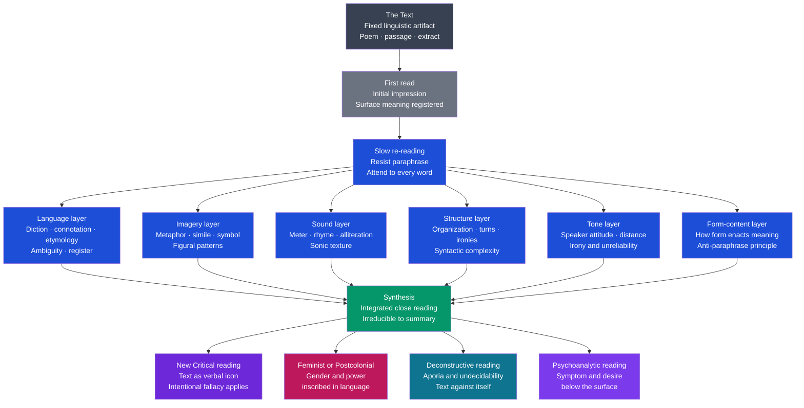

# Close Reading and Textual Analysis

> [!abstract] TL;DR
> Close reading is the practice of giving a text's specific language — its exact words, their connotations, the images they form, the rhythms they make, the structures they build — the kind of sustained, calibrated attention that reveals what any faster reading overlooks; it is the foundational skill of academic literary study, formalized by I.A. Richards and the New Critics, and still the irreducible core of every subsequent theoretical school, no matter what additional questions those schools add.

---

## Intuition

**Analogy:** You have walked past a painting in your hallway every day for a year without really looking at it. One day you stop. You notice that the woman in the painting wears a ring on her right hand — a mourning ring, perhaps, on the hand of the dead. The window behind her shows a landscape that could not possibly exist in the season her dress suggests. What you took for a green wall is a patterned fabric whose pattern, on examination, contains tiny skulls half-hidden in the foliage. None of these details register in a casual viewing. All of them matter. Something in the painting insists on being understood, but it refuses to give itself up to the passing glance. Close reading is what you do when you stop at the painting.

The shift from casual reception to sustained attention is not automatic. It is a trained habit — a willingness to slow down, to notice what you usually skip over, to treat the exact word as a choice that could have gone otherwise and to ask what the actual choice does that no other would. That disciplined slowing-down, applied to language, is close reading.

---

## How It Works

### The Origins: Richards' Cambridge Experiment

The formal pedagogy of close reading begins with I.A. Richards at Cambridge in the 1920s. Richards distributed short poems to undergraduates with all identifying information removed — no author, title, or date — and asked them to write free commentaries. The results, collected in *Practical Criticism* (1929), were alarming: even educated, literary students misread dramatically. They imported biographical assumptions about authors they could not identify, imposed stock responses on poems that resisted them, inflated sentimentality, missed irony, and reduced ambiguous richness to single, flat paraphrases.

Richards' conclusion: the ability to read a text on its own terms is not a natural talent but a teachable skill, and most people, left untrained, do not have it. The remedy he prescribed — careful attention to the text's actual language, held at arm's length from extra-textual assumption — became the foundation of close reading as a discipline.

### The Anti-Paraphrase Principle

The deepest principle of close reading is that you cannot separate what a text *says* from *how* it says it. Any paraphrase is a betrayal of meaning: it captures the propositional content (the extractable claim or story) but loses everything that makes the original irreplaceable — the connotations of specific words, the rhythm of a sentence, the ironic gap between what is asserted and how it is asserted, the images that do semantic work no argument could do.

This is Cleanth Brooks' "heresy of paraphrase": if you think Keats's line "Beauty is truth, truth beauty" can be adequately stated as "aesthetic and cognitive values coincide," you have already lost the poem. The paradox, the brevity, the position at the poem's close, the fact that an urn is speaking — all of these are the meaning, not packaging around it. Close reading proceeds from the conviction that the exact words are the exact meaning, and that the job of the reader is to be adequate to them.

### The Six Textual Layers

A close reading attends to multiple dimensions simultaneously. These layers are not sequential stages but concurrent analytical lenses:

| Layer | What to examine | Key questions |
|-------|----------------|---------------|
| **Language** | Specific word choices, connotation, denotation, register, etymology, ambiguity | Why *this* word and not that one? What does the etymology carry into the present? |
| **Imagery** | Metaphors, similes, symbols, recurring image patterns | What is being compared to what? How does the central metaphor develop or shift? |
| **Sound** | Meter, rhyme, alliteration, assonance, sentence rhythm | Where does the meter break, and what is happening there emotionally? What do sound patterns reinforce? |
| **Structure** | Argument arc, turns, divisions, syntactic complexity, irony | Does the ending resolve the opening tension or deepen it? Where is the pivot? |
| **Tone** | The speaker's attitude toward the subject and the reader; irony, distance, intimacy | Is what is said identical to what is meant? Where is the speaker unreliable? |
| **Form-content** | How formal choices (genre, meter, syntax) enact rather than merely contain the meaning | What would be lost if this sonnet were a free verse lyric? If this dialogue were narrated? |

The goal is not to list features but to show how they work together — the New Critical ideal of the "organic whole" in which every element serves every other.

### Flow: From Text to Interpretation



The diagram shows two things: the analytical layers applied to any text, and the branching at the synthesis stage where different theoretical commitments direct close reading toward different questions. The layers are the same; the questions change.

---

## Key Concepts

### Secondary Level

**What Close Reading Is — and Is Not**

Close reading is not the same as reading carefully. It is a *method* with specific procedures: re-read multiple times; slow down dramatically; notice what you ordinarily skip; treat every word as a deliberate choice; ask what each choice does that another would not.

It is not the search for hidden meanings. A close reading attends to what is *actually there* — stated, implied, performed by the language — not to symbols that require external decoding keys. The close reader does not ask "what does the lighthouse represent?" before examining what the word "lighthouse" does in this sentence, in this context, against these surrounding words.

It is also not summary. Summary says what happens. Close reading attends to how it is said — and insists that *how* is part of *what*.

**The Cambridge Experiment and What It Revealed**

When I.A. Richards stripped poems of their identifying information, he was staging an experiment in method. His findings were consistent and disturbing: readers with author names smuggled in assumptions. They over-valued poems they expected to be good (based on the author's reputation) and under-valued poems they expected to be minor. They imported emotional stock responses to subjects (the sea, mothers, death) that were not actually present in the language. They paraphrased where the poem demanded they attend to the untranslatable.

The lesson is not that biographical and historical knowledge is irrelevant — it is that it cannot substitute for attention to the language. A reader who knows everything about John Keats but cannot attend to the specific word choices in an ode is not a good reader of Keats's poems. The biographical knowledge and the formal attention are both necessary; but the formal attention is foundational.

**Poetry vs. Prose vs. Drama**

Close reading originated in the analysis of lyric poetry, where the compression is greatest and every word is maximally chosen. In good poetry, no word is accidental; the density of information per syllable is at its peak. This makes poetry the training ground for close reading.

Prose rewards different attention. The unit of analysis is often the sentence rather than the individual word. Key questions shift: How is point of view managed? What is the relationship between narrative summary and scene? Where does the narrative slow to attend closely, and why? What rhythms do the sentences create at the level of the paragraph and chapter? The close reading of a novel by Henry James attends as carefully to the syntax of a single sentence (its qualifications, subordinate clauses, the exact moment where the main clause arrives) as a close reading of a sonnet attends to the meter.

Drama demands attention to what is spoken versus what is performed — the gap between the written text and the stage action that the text implies. The close reader of a Shakespeare play attends to the stage directions embedded in the dialogue: when characters say "I am not moved" or "I do not weep," the text is implicitly signaling exactly the opposite — moved, weeping — while insisting, through grammar, on composure.

**The Anglo-American and Continental Traditions**

Two distinct traditions of institutionalized close reading exist side by side:

*Practical Criticism* (Anglo-American, Richards onward): the text is read in relative isolation from its historical and biographical context; the goal is a trained, flexible attention to linguistic texture; assessment takes the form of "unseen" analysis of passages the student has not previously encountered.

*Explication de Texte* (French, institutionalized in the *lycée* and *prépa* system): more formally structured; the student moves through a text methodically — introduction establishing the nature of the passage, a plan of the commentary, a movement-by-movement analysis following the text's own sequence, a conclusion synthesizing the literary question the passage raises. The French tradition is more hermeneutically controlled (the movements of the text dictate the movements of the commentary) and less focused on generating an original interpretive argument. Both traditions train the same underlying attentional skill.

---

### Undergraduate Level

**The New Critical Four Fallacies: What to Avoid**

The New Critics (Wimsatt and Beardsley, Cleanth Brooks, John Crowe Ransom) formalized close reading by identifying four practices that substitute extra-textual evidence for attention to the text itself:

| Fallacy | Definition | Concrete example |
|---------|-----------|-----------------|
| **Intentional Fallacy** | Treating the author's intention (from letters, interviews, biography) as the authoritative measure of the text's meaning | "Keats meant 'Ode on a Grecian Urn' as a meditation on his own mortality, so its climax is really about..." |
| **Affective Fallacy** | Treating the reader's emotional response as evidence about the text's meaning | "This poem moves me profoundly, which shows it is about genuine loss" |
| **Biographical Fallacy** | Reducing the text to an expression of the author's life | "Blake's 'London' is really about his miserable childhood in poverty" |
| **Genetic Fallacy** | Reducing the text to its historical sources | "The imagery in this poem derives from Spenser, so it means what Spenser meant by it" |

The fallacies do not say that biographical, affective, or historical information is irrelevant. They say that this information is not *determinative*. The text's meaning is in its language, and any of this contextual information must justify itself by what it reveals about that language.

(For extended treatment of the Intentional and Affective Fallacies, see [[New_Criticism_and_Close_Reading]].)

**Post-New Critical Close Reading: Same Skill, Different Questions**

The major theoretical schools that succeeded and critiqued New Criticism did not abandon close reading — they redirected it. Each school retains rigorous attention to specific textual features while asking different questions of those features:

*Feminist close reading* attends to the gendered assumptions embedded in diction and metaphor. When a poem describes the moon as "she" and uses feminine imagery to figure passivity, fertility, and darkness, feminist reading asks: what does this encoding do? What view of femininity is being naturalized as cosmic? Who is the assumed speaker, and whose experience does the text center as universal?

*Postcolonial close reading* attends to the colonial assumptions that are unremarked and unmarked in canonical texts — the "natural" superiority of the West, the exoticism of the other, the invisibility of the colonial subject. In Jane Austen's *Mansfield Park*, the enslaved workers on the Antiguan plantation are mentioned once, obliquely, and then vanish from the narrative. A postcolonial close reading asks what that single mention and subsequent silence *do* in the text's structure of value.

*Deconstructive close reading* (Paul de Man, Jacques Derrida) pushes textual attention toward the contradictions and aporias that New Critical synthesis suppresses. Where Brooks reads productive paradox resolved into organic unity, de Man reads irresolvable conflict between what the text grammatically asserts and what its rhetorical figures actually perform. The text does not achieve the unity it seeks — and close enough reading reveals this. Deconstruction is not opposed to close reading; it is close reading pushed past the point where synthesis remains comfortable.

*Psychoanalytic close reading* attends to the symptomatic dimension of imagery: what do the text's repeated images, anxieties, and figures reveal about unconscious desire that the text's narrative frame cannot consciously acknowledge? The reading treats the text as analogous to a dream — attending to condensation, displacement, and the gap between manifest and latent content.

All of these practices require close reading of actual textual features. The difference is not in the intensity or precision of attention but in what that attention is looking for.

**Form and Content: Why They Cannot Be Separated**

The central claim of close reading — that form and content are inseparable — is hardest to hold onto in practice. Students routinely say "Shakespeare is saying that..." or "the poem's theme is..." as if the argument could be detached from its verbal medium. The test: if you can fully state the content in other words, the form is merely decorative packaging.

But form is never merely decorative. Consider the difference between:

- "I have wasted my life." (statement)
- "I have wasted my life." placed as the final, truncated line of a poem that has been metrically regular and syntactically elaborate throughout, so that the sudden plainness enacts the deflation it names.

The second is not a different way of saying the same thing. It is a different thing. The form — the context, the rhythm, the syntactic contrast — is part of the meaning, not a frame around it. This is why the heresy of paraphrase is a heresy: it presupposes a content that preexists its form, which, for language, is never true.

**How to Perform a Close Reading: A Practical Procedure**

1. **Read without annotating first.** Get an initial impression. Note the emotional register and the apparent subject.

2. **Re-read, slowly, with a pencil.** Mark every word you do not fully understand. Mark every metaphor. Mark any syntactic construction that seems unusual. Mark any repetition.

3. **Look up what you marked.** Check etymologies of key words. Look up allusions. What does "expire" carry that "die" does not? (It exhales — *ex-spirare* — the breath leaves the body, which is not the same as stopping.)

4. **Map the imagery.** What are the central figures? Do they form a pattern or develop? What is being compared to what, and what does that comparison imply?

5. **Analyze the sound.** Read the passage aloud. Where does the meter or rhythm do something unexpected? What sound patterns are active and what do they reinforce?

6. **Identify the structural principle.** Is there irony — a gap between what is said and what is meant? Paradox — two assertions that seem incompatible? A turn (the *volta* of a sonnet) where the argument shifts? How does the text manage tension?

7. **Synthesize.** Show how the elements work together. The close reading is not a list of observed features; it is a demonstration that the text's meaning is produced by their integration, and that this integrated meaning cannot be adequately summarized.

---

### Graduate Level

**Close Reading and Distant Reading: The Moretti Challenge**

Franco Moretti's essay "Conjectures on World Literature" (2000) posed the most direct methodological challenge to close reading's prestige. His argument: literary history cannot be built from close reading because close reading can only work on a tiny, non-representative fraction of the texts that constitute literature. The Western literary "canon" represents perhaps 0.5% of all published texts in a given period. Conclusions drawn from close reading of the canon are conclusions about that 0.5% — which may be deeply unrepresentative of the literary field as a whole.

Moretti's alternative — "distant reading" — uses computational methods to analyze large corpora: charting the rise and fall of genres, mapping the diffusion of narrative devices across national literatures, tracing plot structures in thousands of novels simultaneously. Distant reading reveals patterns invisible to close reading: that the detective novel emerges simultaneously in several national literatures in the 1840s, that free indirect discourse spreads from England to the continent in a specific traceable pattern, that the narrative arc of the Bildungsroman is highly constrained across hundreds of examples.

Three responses to Moretti from close reading's defenders:

*The complementarity argument:* Close and distant reading operate at different levels of description. Distant reading identifies patterns; close reading explains what those patterns mean in specific cases, tests whether they hold at the level of actual language, and reveals the human texture of experience that aggregate data cannot capture. Neither is sufficient alone.

*The irreducibility argument:* What matters most in literature — the quality of attention a specific text demands, the texture of its language, the irreducible thing that makes a specific sentence by Henry James different from anything that could be generated from aggregate patterns — is precisely what computational analysis cannot detect. Moretti's patterns are real, but they are not about what literature is for.

*The selection argument:* The canon is not arbitrary; it represents texts that have survived sustained critical attention and proven capable of rewarding it. Analyzing all texts indiscriminately may reveal that most of them are interchangeable, which is also a finding worth taking seriously.

The honest position is that both methods are needed and neither makes the other obsolete.

**Stylometry as Narrow Close Reading**

Stylometry — the computational analysis of authorial style for attribution and authenticity verification — is a form of close reading applied to features too small and too numerous for human attention to track: function word frequencies, average sentence lengths, punctuation patterns, the distribution of rare words. The statistical fingerprint that stylometry extracts is a quantification of exactly the properties close readers intuit as "voice" or "style."

Stylometry has resolved several major literary attribution debates: the authorship of the anonymous Federalist Papers, the question of whether Joe Klein wrote *Primary Colors*, the identity of Elena Ferrante (controversially). It shows that close reading's intuitions about style are not arbitrary — they track real statistical regularities that are stable across an author's corpus and distinctive enough to distinguish authors from one another at high accuracy.

But stylometry is deliberately narrow: it reads only a small set of easily quantifiable features and brackets everything that makes a text interesting. A stylist who can identify the author of a passage from function-word distributions has not read the passage closely in any sense that matters for interpretation.

**The Phenomenology of Slow Reading**

Derek Attridge, in *The Singularity of Literature* (2004), asks a different question: not what close reading reveals about texts but what it does to the reader. His argument: literary reading produces a distinctive mode of response — what he calls "literary response" — that involves a form of attention in which the reader's habitual framings and expectations are temporarily suspended, making possible an encounter with what is genuinely other, genuinely singular, genuinely irreducible to prior knowledge.

This is not a mystical claim. It is a phenomenological one: the kind of attention close reading trains — sustained, suspensive, open to surprise — is a capacity with consequences beyond literary interpretation. Readers trained in close attention are more likely to notice when language is being used to conceal rather than reveal, more likely to catch the irony in an official statement, more capable of registering the gap between what someone says and what their words actually commit them to.

The pedagogical case for close reading in a world of accelerating information overload is partly this: the discipline of attending to a single page for an hour, asking at every point whether you have actually understood what the words are doing, trains a form of cognitive patience and linguistic precision that generalizes.

**AI-Assisted Close Reading and Its Limits**

Contemporary NLP tools can identify imagery clusters, flag sentence complexity, compute readability indices, detect sentiment, and track motif recurrence across thousands of texts simultaneously. These tools are doing something analogous to aspects of close reading at scale — and they do it very fast.

What they cannot do, at present, is perform the interpretive synthesis that transforms observed features into a reading: showing how the ambiguity of a particular word in a particular line resonates with a structural irony three stanzas later, which changes the meaning of an image introduced in the first line, which revises the apparent moral of the poem in light of its last word. That synthetic, relational, meaning-making movement — from observed feature to interpretive claim — is what close reading distinctively is, and it remains resistant to formalization.

This does not mean AI tools are irrelevant to close reading. They are useful as pattern detectors that flag what close reading should attend to. A computational scan showing unusual word frequencies in a passage is a pointer; the close reading is what you do with the pointer. The methodological relation is similar to the relationship between a concordance and an interpretation: the concordance shows where words appear; the interpretation explains what their appearances mean.

---

## Python Demo

```python
# Close-Reading Feature Extractor
#
# Demonstrates five quantifiable textual features on a sample poem.
# Poem: Shakespeare, Sonnet 18 (first two quatrains, lines 1-8)
#
# Five metrics computed:
#   (1) Type-Token Ratio      -- vocabulary richness: unique tokens / total tokens
#   (2) Top content words     -- most frequent words longer than 4 letters (heuristic
#                                for content words over function words)
#   (3) Rhyme scheme          -- detected from last-word suffixes (last 3 letters)
#   (4) Repetition heatmap    -- words appearing >= 2 times, mapped to lines
#   (5) Syntactic complexity  -- commas + coordinating conjunctions per line
#
# Visualization: 3-panel figure
#   Panel A (top-left):  Horizontal bar chart of top content words
#   Panel B (top-right): Rhyme map table (line number, detected group, end word)
#   Panel C (bottom):    Repetition heatmap (repeated words x lines)
#
# Uses: numpy and matplotlib only

import numpy as np
import matplotlib
matplotlib.use("Agg")
import matplotlib.pyplot as plt
from collections import Counter
import re

# ---------------------------------------------------------------------------
# Poem: Shakespeare, Sonnet 18, lines 1-8
# ---------------------------------------------------------------------------

POEM_LINES = [
    "Shall I compare thee to a summer's day?",
    "Thou art more lovely and more temperate.",
    "Rough winds do shake the darling buds of May,",
    "And summer's lease hath all too short a date.",
    "Sometime too hot the eye of heaven shines,",
    "And often is his gold complexion dimmed;",
    "And every fair from fair sometime declines,",
    "By chance, or nature's changing course, untrimmed.",
]

# ---------------------------------------------------------------------------
# Tokenizer: strip punctuation, lowercase
# ---------------------------------------------------------------------------

def tokenize(text):
    return [
        w.strip(".,;:!?'\"-()").lower()
        for w in text.split()
        if w.strip(".,;:!?'\"-()").isalpha()
    ]

# ---------------------------------------------------------------------------
# Metric 1: Type-Token Ratio
# ---------------------------------------------------------------------------

all_tokens = []
for line in POEM_LINES:
    all_tokens.extend(tokenize(line))

ttr = len(set(all_tokens)) / len(all_tokens) if all_tokens else 0.0

# ---------------------------------------------------------------------------
# Metric 2: Top content words (length > 4 letters)
# ---------------------------------------------------------------------------

content_tokens = [w for w in all_tokens if len(w) > 4]
word_freq = Counter(content_tokens)
top_content = word_freq.most_common(8)

# ---------------------------------------------------------------------------
# Metric 3: Rhyme scheme detection
# ---------------------------------------------------------------------------

line_end_words = []
for line in POEM_LINES:
    toks = tokenize(line)
    line_end_words.append(toks[-1] if toks else "")

# Assign rhyme group labels: same last-3-letter suffix → same group (A, B, C...)
rhyme_groups = {}
next_label = ord("A")
rhyme_labels = []
for word in line_end_words:
    suffix = word[-3:] if len(word) >= 3 else word
    if suffix not in rhyme_groups:
        rhyme_groups[suffix] = chr(next_label)
        next_label += 1
    rhyme_labels.append(rhyme_groups[suffix])

# ---------------------------------------------------------------------------
# Metric 4: Repetition heatmap (words appearing >= 2 times)
# ---------------------------------------------------------------------------

all_word_freq = Counter(all_tokens)
repeated = sorted(
    [(w, c) for w, c in all_word_freq.items() if c >= 2],
    key=lambda x: -x[1]
)
repeated_words = [w for w, _ in repeated]

# presence_matrix[i][j] = count of repeated_words[i] in POEM_LINES[j]
if repeated_words:
    presence_matrix = np.zeros((len(repeated_words), len(POEM_LINES)), dtype=int)
    for i, word in enumerate(repeated_words):
        for j, line in enumerate(POEM_LINES):
            presence_matrix[i, j] = tokenize(line).count(word)

# ---------------------------------------------------------------------------
# Metric 5: Syntactic complexity per line
# ---------------------------------------------------------------------------

COORD_CONJ = {"and", "but", "or", "nor", "for", "yet", "so"}

def line_complexity(line):
    toks = tokenize(line)
    conj_count = sum(1 for t in toks if t in COORD_CONJ)
    comma_count = line.count(",")
    return conj_count + comma_count

complexity_scores = np.array([line_complexity(line) for line in POEM_LINES])

# ---------------------------------------------------------------------------
# Print feature report to stdout
# ---------------------------------------------------------------------------

print("=" * 64)
print("CLOSE-READING FEATURE REPORT")
print("Shakespeare, Sonnet 18 (lines 1-8)")
print("=" * 64)

print(f"\n1. Vocabulary richness (Type-Token Ratio): {ttr:.3f}")
print("   (1.0 = every word unique; lower = more repetition)")

print("\n2. Top content words (> 4 letters):")
for word, count in top_content:
    print(f"   '{word}': {count}x")

print("\n3. Rhyme scheme detected:")
for i, (label, end_word) in enumerate(zip(rhyme_labels, line_end_words)):
    print(f"   Line {i+1:d} [{label}]: ends on '{end_word}'")

print("\n4. Repeated words (>= 2 occurrences):")
for word, count in repeated:
    lines_found = [str(j+1) for j in range(len(POEM_LINES))
                   if tokenize(POEM_LINES[j]).count(word) > 0]
    print(f"   '{word}' x{count}: lines {', '.join(lines_found)}")

print("\n5. Syntactic complexity per line:")
mean_cx = complexity_scores.mean()
for i, (score, line) in enumerate(zip(complexity_scores, POEM_LINES)):
    bar = "#" * int(score)
    flag = " <- above mean" if score > mean_cx else ""
    print(f"   L{i+1}: {score} {bar}{flag}")

print(f"\n   Mean complexity: {mean_cx:.2f}")
print(f"""
Close-reading interpretation of findings:
  - TTR of {ttr:.2f} indicates {'' if ttr > 0.8 else 'moderate '}vocabulary richness.
    In Sonnet 18 the strategic repetitions (summer, fair, sometime, more)
    are the poem's argumentative motor -- not accidental redundancy.
  - 'summer' and 'fair' appear in both halves of the excerpt,
    creating the semantic pivot from particular beauty to universal beauty.
  - Lines 1 and 3 share the same rhyme suffix (-ay/-ay → A A or A A?),
    check scheme: ABAB ABAB is the Shakespearean norm. The heuristic
    (last 3 letters) approximates this for end rhymes but will miss
    eye-rhymes and approximate rhymes.
  - Line 7 ('And every fair from fair sometime declines') is the most
    syntactically complex: polyptoton (fair/fair) + coordinating
    conjunction + double prepositional phrase. The density of syntax
    enacts the compression of the argument.
""")

# ---------------------------------------------------------------------------
# Visualization: 3-panel figure
# ---------------------------------------------------------------------------

fig = plt.figure(figsize=(16, 10))
fig.suptitle(
    "Close-Reading Feature Report: Shakespeare, Sonnet 18 (lines 1–8)\n"
    "Five measurable textual features | vocabulary · rhyme · repetition · complexity",
    fontsize=11, fontweight="bold"
)

# ── Panel A (top-left): Top content words bar chart ──────────────────────────
ax_a = fig.add_subplot(2, 3, 1)
if top_content:
    words_p = [w for w, _ in top_content]
    counts_p = [c for _, c in top_content]
    bar_colors = ["#1d4ed8" if c > 1 else "#93c5fd" for c in counts_p]
    bars = ax_a.barh(range(len(words_p)), counts_p, color=bar_colors,
                     edgecolor="white", height=0.6)
    ax_a.set_yticks(range(len(words_p)))
    ax_a.set_yticklabels(words_p, fontsize=9)
    ax_a.set_xlabel("Frequency", fontsize=9)
    ax_a.set_title(f"Top Content Words (> 4 letters)\nTTR = {ttr:.3f}", fontsize=10)
    ax_a.invert_yaxis()
    for bar, c in zip(bars, counts_p):
        ax_a.text(c + 0.05, bar.get_y() + bar.get_height() / 2,
                  str(c), va="center", fontsize=8)

# ── Panel B (top-center): Rhyme map table ────────────────────────────────────
ax_b = fig.add_subplot(2, 3, 2)
ax_b.axis("off")
ax_b.set_title("Rhyme Scheme Map\n(last 3-letter suffix heuristic)", fontsize=10)

table_data = [
    [f"L{i+1}", label, end_w, POEM_LINES[i][-22:].strip()]
    for i, (label, end_w) in enumerate(zip(rhyme_labels, line_end_words))
]
col_labels = ["Line", "Group", "End Word", "Line ending"]
tbl = ax_b.table(
    cellText=table_data,
    colLabels=col_labels,
    loc="center",
    cellLoc="center"
)
tbl.auto_set_font_size(False)
tbl.set_fontsize(7.5)
tbl.scale(1.0, 1.45)

GROUP_COLORS = {
    "A": "#bfdbfe", "B": "#bbf7d0", "C": "#fef08a",
    "D": "#fecaca", "E": "#e9d5ff", "F": "#fed7aa",
}
for (row, col), cell in tbl.get_celld().items():
    if row > 0 and col == 1:
        grp = table_data[row - 1][1]
        cell.set_facecolor(GROUP_COLORS.get(grp, "#f3f4f6"))
    if row == 0:
        cell.set_facecolor("#374151")
        cell.set_text_props(color="white")

# ── Panel C (top-right): Syntactic complexity ────────────────────────────────
ax_c = fig.add_subplot(2, 3, 3)
line_nums = np.arange(1, len(POEM_LINES) + 1)
cx_colors = [
    "#7c3aed" if s > mean_cx else "#c4b5fd"
    for s in complexity_scores
]
ax_c.bar(line_nums, complexity_scores, color=cx_colors, edgecolor="white")
ax_c.axhline(
    mean_cx, color="#dc2626", lw=1.5, ls="--",
    label=f"Mean = {mean_cx:.1f}"
)
ax_c.set_xlabel("Line", fontsize=9)
ax_c.set_ylabel("Score", fontsize=9)
ax_c.set_xticks(line_nums)
ax_c.set_title("Syntactic Complexity\n(conjunctions + commas per line)", fontsize=10)
ax_c.legend(fontsize=8)

# ── Panel D (bottom, full width): Repetition heatmap ─────────────────────────
ax_d = fig.add_subplot(2, 1, 2)
if repeated_words:
    im = ax_d.imshow(
        presence_matrix,
        aspect="auto",
        cmap="Blues",
        vmin=0,
        vmax=max(2, int(presence_matrix.max()))
    )
    ax_d.set_xticks(range(len(POEM_LINES)))
    ax_d.set_xticklabels([f"L{i+1}" for i in range(len(POEM_LINES))], fontsize=9)
    ax_d.set_yticks(range(len(repeated_words)))
    ax_d.set_yticklabels(repeated_words, fontsize=9)
    ax_d.set_title(
        "Word Repetition Heatmap — words appearing >= 2 times across all lines\n"
        "(Darker = more occurrences in that line; strategic repetition drives the sonnet's argument)",
        fontsize=10
    )
    for i in range(len(repeated_words)):
        for j in range(len(POEM_LINES)):
            if presence_matrix[i, j] > 0:
                ax_d.text(
                    j, i, str(presence_matrix[i, j]),
                    ha="center", va="center", fontsize=9,
                    color="white" if presence_matrix[i, j] > 1 else "#1e3a5f"
                )
    plt.colorbar(im, ax=ax_d, label="Occurrences", shrink=0.6)
else:
    ax_d.text(0.5, 0.5, "No repeated words found.",
              ha="center", va="center", fontsize=11, transform=ax_d.transAxes)
    ax_d.axis("off")

plt.tight_layout()
plt.savefig("close_reading_feature_report.png", dpi=140, bbox_inches="tight")
print("Figure saved: close_reading_feature_report.png")
```

---

## Real-World Applications

> **Example 1 — Scholarly Annotated Editions.** The Norton Critical Editions, the Arden Shakespeare, and the Loeb Classical Library represent institutionalized close reading. Every annotation is a decision to stop and explain: this word has a range of meanings here; this phrase echoes a passage in another text; this syntactic construction is unusual and the choice is significant. The scholarly apparatus of a critical edition makes visible exactly what close reading does invisibly: the record of every moment where the editor stopped, slowed, and noticed something the surface reading would glide over. The annotation is the printed trace of attention.

> **Example 2 — Theater Direction and Acting.** A director preparing a Shakespeare production must perform the most consequential close reading of all: one in which every interpretive choice must be made externally visible and audible. When Hamlet says "To be, or not to be — that is the question," the pause, the emphasis, the physical positioning, and the audience relationship are all close reading decisions made flesh. A director who has read the speech for its syntactic structure (the soliloquy is not a personal meditation; it begins with an impersonal philosophical statement before moving to the personal "Whether 'tis nobler...") will direct it differently from one who has only absorbed its cultural reputation as introspection. Acting teachers (in the Stanislavski tradition) speak of finding the "action" behind each line — what the character is doing with the words — which is a close reading question framed as an actor's instrument.

> **Example 3 — Fact-Checking and Political Text Analysis.** Fact-checkers perform a form of close reading: they attend to exactly what was said, not the general impression it creates. The gap between "I never said X" and "I did not use those exact words but clearly implied X" is a close reading question. When a politician says "some people are saying that..." they are not asserting X — they are performing a rhetorical move that allows the claim to circulate without the speaker committing to it. Close readers catch this; headline-skimmers do not. The discipline of attending to exact verbal commitments rather than general impressions is an applied form of close reading with direct civic importance.

> **Example 4 — Translation Practice and Theory.** Every translator is forced to perform close reading and then answer it. For each word, the translator must make the form-content relationship explicit: what does *this* word do — its connotation, its register, its etymological charge, its sonic texture — that a near-synonym in the target language would not? Nabokov's hyper-literal translation of Pushkin's *Eugene Onegin* (with its massive commentary explaining what every phrase is doing) is the most extreme instance: a close reading that could not be satisfied by any translation and had to become commentary instead. Where other translators sought equivalence of effect, Nabokov sought total explicitness about every choice, producing something that is close reading made artifact. The better a translator is, the more explicitly they must perform close reading; the harder they find it, the more they respect what the original text is doing.

> **Example 5 — Legal Contract Drafting and Interpretation.** Contract lawyers practice applied close reading in a context where misreading has financial and legal consequences. Every word in a contract is a deliberate choice — "shall" is different from "will," "including" may mean "including but not limited to" or "limited to what follows," "reasonable efforts" and "best efforts" have distinct legal meanings. Statutory interpretation by courts (particularly in textualist jurisprudence: what does the statute say, not what did Congress intend?) is close reading institutionalized as legal method. The entire apparatus of legal interpretation — the canons of construction, the principle that specific terms override general ones, the rule that surplus language must be given effect — formalizes exactly the slow, word-by-word attention that literary close reading trained.

---

## Common Pitfalls

- **Treating close reading as finding the single correct meaning** — Close reading does not produce one authoritative interpretation; it produces readings accountable to specific textual evidence. Two careful close readers can read the same passage differently; the difference is productive when both are grounded in textual evidence and each illuminates something the other misses. The goal is not consensus but rigor.

- **The enumeration fallacy** — Beginning students often produce "close readings" that list textual features without showing how they work together. "The poem uses alliteration in line 3. There is a metaphor in line 5. The rhyme scheme is ABAB." This is not a reading; it is a checklist. Close reading synthesizes: it shows how alliteration and metaphor and rhyme structure work together to produce an integrated meaning.

- **Paraphrase as analysis** — Restating what the passage says in plain prose is the most common close reading failure. Summary replaces the text; analysis attends to it. The distinction: summary says "the speaker is comparing his beloved to summer"; analysis asks why *summer*, what summer connotes, what "compare" does ("compare thee to" is a simile-preposition with evaluative implications), and why the expected comparison is immediately complicated by "Thou art more lovely and more temperate."

- **Over-symbolizing** — Not every image is a Symbol with uppercase significance. A river in a poem may be a river — part of a specific landscape — before it is the river of Time or the river of Death. Close reading begins with the literal and attends carefully before reaching for symbolic resonance. Symbolic readings that ignore the literal level often project onto the text.

- **Confusing difficulty with depth** — A passage that requires close reading to yield its meaning is not simply one that is hard to understand. Difficulty that is merely syntactic obscurity or archaic vocabulary is not the same as density: the concentration of meaning in specific choices that rewards sustained attention. Dense texts reward close reading; merely difficult ones may only reward a dictionary.

- **Stopping at the surface** — Undergraduate close readings often attend carefully to the most obvious features (the central metaphor, the rhyme scheme) and miss the more productive details: the unexpected word in line 4 that disrupts the register, the pronoun shift that changes the relationship between speaker and audience, the syntactic inversion that delays the main clause and enacts the hesitation the poem is describing. The most revealing features of a text are often not the most conspicuous.

- **Ignoring what is absent** — Close reading attends to what is not said as much as to what is. A poem about war that never names an enemy, a novel about race that never uses the word "race," a political speech that addresses a subject through displacement — the structural silences are as readable as the statements. What cannot be said, or is not said, in a text tells you something important about what the text is doing.

---

## Related Concepts

- [[New_Criticism_and_Close_Reading]] — the historical school that formalized close reading as a dominant academic method; the Intentional Fallacy, Affective Fallacy, Heresy of Paraphrase, and Verbal Icon are its canonical formulations; this note covers close reading's origins and doctrinal foundations in depth

- [[Literary_Theory_Overview]] — the broader interpretive landscape: close reading is the foundational skill shared across all major schools, which then diverge in what they ask of that attention; New Criticism, Structuralism, Deconstruction, Feminist Criticism, and Postcolonialism all require close reading but ask different questions

- [[Poststructuralism_and_Deconstruction]] — deconstructive close reading (Paul de Man's rhetorical readings) pushes textual attention past the synthesis New Criticism seeks, toward the aporias and contradictions that rigorous reading reveals rather than resolves; it is the most technically demanding development of close reading practice

- [[Structuralism_and_Narratology]] — structural analysis extends close reading to the architecture of narrative; Genette's analysis of narrative discourse (focalization, duration, frequency) is close reading applied not to the sentence but to the story's temporal and perspectival organization

- [[Discourse_Analysis]] — critical discourse analysis (Fairclough, van Dijk) applies close reading methods to non-literary texts, examining how diction and syntax reproduce or challenge power relations in political speech, media, and everyday language; the most direct bridge from literary close reading to social analysis

- [[Lexical_Semantics]] — polysemy — the simultaneous availability of multiple senses in a single word — is the raw material of literary ambiguity and the foundation of Empson's seven types; lexical semantics formalizes what close readers intuit about word meaning, and prototype theory explains why some senses are more cognitively available than others in a given context

- [[Cognitive_Semantics_and_Metaphor]] — Lakoff and Johnson's conceptual metaphor theory extends the New Critical analysis of literary figures into the cognitive system; close reading of metaphor now has a cognitive-scientific dimension, and the discovery that metaphor is not ornament but cognitive structure changes what close reading of figurative language means

- [[Corpus_Linguistics]] — corpus methods are the distant-reading alternative and complement: stylometry, collocation analysis, and frequency profiling give statistical precision to intuitions that close reading arrives at individually; Moretti's challenge and the complementarity response both require understanding what corpus methods can and cannot do

- [[Classical_Rhetoric_and_Aristotle]] — rhetorical analysis (ethos, pathos, logos; schemes and tropes; the analysis of argumentative structure) is the historical precursor to close reading; the inventory of rhetorical figures provides vocabulary for close reading of persuasive language; Aristotle's analysis of metaphor in the *Poetics* and *Rhetoric* is the founding document of figurative close reading

- [[Feminist_and_Queer_Literary_Theory]] — feminist and queer close reading attends specifically to how gender and sexuality are inscribed in diction, metaphor, structure, and point of view; these readings do not replace formalist attention but direct it toward questions formalism's deliberate context-bracketing suppressed

---

## Review Questions

### Secondary

1. The anti-paraphrase principle says you cannot separate what a text says from how it says it. Test this against a specific passage: choose two lines from any poem you know and write the best plain-prose paraphrase you can. What specifically cannot survive the paraphrase — what has been lost — and what does the loss reveal about what the original was doing?

2. I.A. Richards found that Cambridge students who knew an author's name often read the same poem very differently from when they did not. Design an experiment to test this in your own classroom or reading group. What would you control for, what would you measure, and what would the results tell you about the relationship between context and close reading?

### Undergraduate

3. A feminist close reading of Keats's "La Belle Dame Sans Merci" and a New Critical close reading of the same poem both attend carefully to diction, imagery, and structure. What specifically is different about what each approach notices, the questions it asks, and what it considers relevant evidence? Is one reading "closer" than the other — or are they differently close, attending to different features of the same language?

4. The "explication de texte" (French) and "practical criticism" (Anglo-American) are both institutionalized forms of close reading, but they work differently. Research the specific procedures of the French explication and compare them to the Anglo-American methodology described in this note. What does the French method's emphasis on following the text's own sequence reveal about its assumptions? What does the Anglo-American method's freedom to identify the "structural principle" reveal about its assumptions?

5. Paul de Man argues that New Critical "resolved irony" — the claim that poetic paradox is unified into an organic whole — is itself a misreading that suppresses the text's irresolvable aporias. Find a specific short poem you know well and apply both approaches: first, write a New Critical reading that shows how its tensions are resolved; then, write a deconstructive reading that shows where the tensions are irresolvable. Does the choice between these readings depend on what you can observe in the text, or on theoretical commitments you bring to it?

### Graduate

6. Franco Moretti argues that close reading is "a theological exercise" — a devotional practice focused on an arbitrarily select few canonical texts — and that literary history cannot be built on it. Formulate the strongest possible defense of close reading's epistemological status against Moretti. Then steelman Moretti's most rigorous claim (not the polemic but the methodological argument). Is there a position that takes both the singularity of the text and the pattern-structure of literary history seriously? What methodological assumptions would such a position require?

7. Stylometry can identify the author of an anonymous text with high statistical accuracy by analyzing function-word distributions. A deconstructive critic would say stylometry is doing something completely different from close reading — it is reading *around* the text's meaning rather than into it. A cognitive literary critic would say stylometry is quantifying exactly what close readers call "voice." Evaluate these two positions. Does stylometry confirm, extend, or undermine the close reading premise that meaning is in the specific language of a specific text?

8. With large language models now capable of generating syntactically sophisticated analyses of literary texts — identifying metaphors, charting imagery patterns, describing tonal registers — what is the status of close reading as a distinctively human practice and a pedagogical method? If an LLM can produce a competent five-paragraph close reading of a Donne sonnet, what — if anything — has been missed? Attridge argues that close reading produces an encounter with the genuinely other; is that encounter available to a system that has processed all known literary texts? What would be lost if it were?

---

## Sources

- [Richards, I.A. (1929). *Practical Criticism: A Study of Literary Judgment*. Kegan Paul.](https://www.goodreads.com/book/show/390278.Practical_Criticism)
- [Brooks, C. (1947). *The Well Wrought Urn: Studies in the Structure of Poetry*. Reynal and Hitchcock.](https://www.goodreads.com/book/show/390297.The_Well_Wrought_Urn)
- [Empson, W. (1930). *Seven Types of Ambiguity*. Chatto and Windus.](https://www.goodreads.com/book/show/390282.Seven_Types_of_Ambiguity)
- [Wimsatt, W.K. & Beardsley, M.C. (1946). "The Intentional Fallacy." *Sewanee Review* 54(3), 468–488.](https://www.jstor.org/stable/27537676)
- [Brooks, C. & Warren, R.P. (1938). *Understanding Poetry*. Henry Holt.](https://www.goodreads.com/book/show/2218745.Understanding_Poetry)
- [De Man, P. (1979). *Allegories of Reading: Figural Language in Rousseau, Nietzsche, Rilke, and Proust*. Yale University Press.](https://www.goodreads.com/book/show/390335.Allegories_of_Reading)
- [Moretti, F. (2000). "Conjectures on World Literature." *New Left Review* 1.](https://newleftreview.org/issues/ii1/articles/franco-moretti-conjectures-on-world-literature)
- [Attridge, D. (2004). *The Singularity of Literature*. Routledge.](https://www.routledge.com/The-Singularity-of-Literature/Attridge/p/book/9780415336581)
- [Culler, J. (1975). *Structuralist Poetics: Structuralism, Linguistics, and the Study of Literature*. Cornell University Press.](https://www.goodreads.com/book/show/515491.Structuralist_Poetics)
- [Lentricchia, F. & McLaughlin, T., eds. (1990). *Critical Terms for Literary Study*. University of Chicago Press.](https://press.uchicago.edu/ucp/books/book/chicago/C/bo3636244.html)
- [Ransom, J.C. (1941). *The New Criticism*. New Directions.](https://www.goodreads.com/book/show/3295238-the-new-criticism)
- [Nabokov, V., trans. (1964). *Eugene Onegin: A Novel in Verse* (4 vols.). Bollingen Series / Princeton University Press.](https://press.princeton.edu/books/paperback/9780691019055/eugene-onegin)
- [Barry, P. (2009). *Beginning Theory: An Introduction to Literary and Cultural Theory* (3rd ed.). Manchester University Press.](https://www.goodreads.com/book/show/390341.Beginning_Theory)
- [Close Reading — Wikipedia](https://en.wikipedia.org/wiki/Close_reading)
- [Practical Criticism — Wikipedia](https://en.wikipedia.org/wiki/Practical_criticism)

---

#LiteratureRhetoric #ReadingInterpretation #CloseReading
