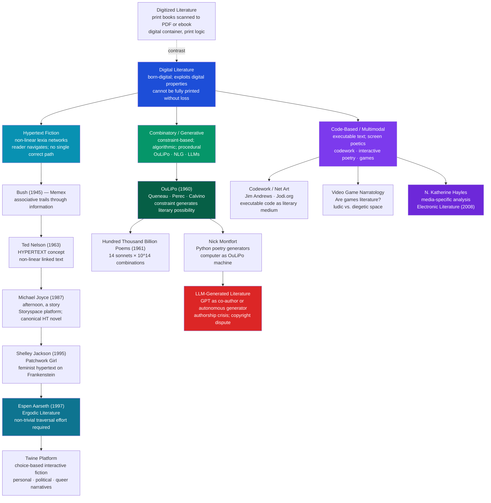

# Digital Literature and New Media

> [!abstract] TL;DR
> Digital literature comprises works that are *native* to digital environments and cannot be fully transferred to print without losing something essential — their interactivity, non-linearity, algorithmic generation, or multimodality; the Electronic Literature Organization defines it as "works with important literary aspects that take advantage of the capabilities and contexts provided by the stand-alone or networked computer"; this field forces literary theory to reckon with questions it long deferred: who is the author when the computer generates the text, what is the reader when the reader must navigate rather than consume, and what is a work when it is different every time it is read.

---

## Intuition

**Analogy:** Imagine a library in which every book is also a hallway. You open the first page of a novel, and instead of a single corridor leading forward, you face a junction with three doors. Behind each door is another passage, and behind those, more junctions. You can reach the ending — there may be several endings — but only by choosing a path. Two visitors to this library reading the "same" book will have read different sequences of pages, followed different characters, encountered different revelations. The library is the same; the books are the same; but each reading is a singular itinerary.

Now add another kind of book: one that writes itself while you read it, assembling sentences from a vast repertoire of grammatical templates and lexical pools, so that the text you receive has never existed before and will never exist again. And a third kind: a book whose pages are actually computer programs — texts that *do* things when you read them, that execute and respond and transform.

These three kinds of library — the navigable, the generative, and the executable — correspond to the three major forms of digital literature: hypertext fiction, combinatory and generative writing, and code-based or multimodal work. What they share is the exploitation of properties that print cannot reproduce: branching, randomness, computation, interactivity, and network distribution.

---

## How It Works



The diagram traces the three genealogies in parallel. Hypertext fiction descends from Vannevar Bush's visionary memex through Ted Nelson's coinage of "hypertext" to the canonical Storyspace novels and, later, the accessible democratization of Twine. Combinatory writing descends from OuLiPo's pre-digital formal experiments through computer implementation to the contemporary challenge of AI-generated text. Code-based work is the most technically radical branch: codework, interactive poetry, and video game narratology all blur the boundary between literary text and executable program.

---

## Key Concepts

### Secondary Level

**The Fundamental Distinction: Digitized vs. Digital**

The most important preliminary distinction in this field is between *digitized* literature and *digital* literature, and it is not a technical distinction but a literary one.

A digitized text is a print work that has been converted to a digital format — a scanned PDF of *Moby-Dick*, a Kindle edition of *Jane Eyre*, a Project Gutenberg text file of *Don Quixote*. The digital container is a convenience. The literary logic is still entirely that of print: sequential pages, fixed text, single reading path, words that do not change. You could print it out and lose nothing essential.

A digital text — what the Electronic Literature Organization and N. Katherine Hayles call *electronic literature* or *e-literature* — is a work that was *born digital* and that exploits properties specific to digital environments. Michael Joyce's *afternoon, a story* (1987) cannot be printed out without becoming a completely different kind of object. Its literary identity depends on the facts that the reader clicks to advance, that different clicks produce different continuations, that the text never stabilizes into a single authorized sequence, and that the experience of reading is an experience of navigational choice. To print it would be like transcribing a symphony into a list of notes — you preserve information while destroying the work.

The Electronic Literature Organization's definition — "works with important literary aspects that take advantage of the capabilities and contexts provided by the stand-alone or networked computer" — deliberately leaves room for works that sit at the border: a poetry collection that is primarily print but includes a generative animation would be marginally digital literature; a purely choice-based interactive narrative that happens to be readable in sequence would be marginally print literature. The border is porous, but the distinction is real.

**The Three Major Forms**

Three categories organize the field, corresponding roughly to which digital property is being exploited:

| Form | Digital property exploited | Canonical examples |
|------|--------------------------|-------------------|
| **Hypertext fiction** | Non-linearity, navigation, branching | *afternoon, a story* (Joyce); *Patchwork Girl* (Jackson) |
| **Combinatory / generative** | Randomness, algorithm, constraint | *Hundred Thousand Billion Poems* (Queneau); Montfort's generators |
| **Code-based / multimodal** | Execution, interactivity, multimedia | *Twine* games; codework; video game narratology |

These categories overlap. A Twine game can be both navigable (hypertext) and generative (randomized NPC dialogue). AI-written poetry is both combinatory and code-based. The categories are not taxon boxes but attractors.

**Hypertext Fiction: The Basics**

The word "hypertext" was coined by Ted Nelson in 1963 (published 1965) to describe "non-sequential writing — text that branches and allows choices to the reader." Nelson's vision was broader than fiction: he imagined the entire corpus of human knowledge as a single navigable document in which any passage could link to any related passage — what he called *Xanadu*, a project he worked on for decades without completion. The World Wide Web, invented by Tim Berners-Lee in 1989, realized a simplified version of Nelson's vision.

But hypertext fiction applies this non-linearity to narrative. A hypertext novel is built from *lexias* — Barthes's term for units of reading, borrowed by hypertext theorists to mean discrete text blocks or screens. The reader navigates from lexia to lexia by clicking links. Different link choices produce different narrative sequences. There is no guaranteed beginning, middle, and end in Aristotle's sense: any lexia could, in principle, be an entry point or an exit.

The *Storyspace* software platform, developed by Jay David Bolter and Michael Joyce in the 1980s, was the primary authoring and reading environment for first-generation hypertext fiction. Its visual map — a spatial representation of the lexia network — made the structure of the narrative visible to the author and, in some versions, to the reader: you could see the graph you were navigating.

---

### Undergraduate Level

**Michael Joyce and the Canonical Hypertext Novel**

Michael Joyce's *afternoon, a story* (1987, Eastgate Systems) is the work against which all subsequent hypertext fiction has been measured. Its central narrative — or, more precisely, its constellation of possible narrative threads — concerns a man named Peter who may or may not have witnessed a car accident, which may or may not have involved his ex-wife and son. The temporal structure is radically non-linear: different paths through the lexia network produce different versions of what happened, different revelations, different endings, none of which is authoritative.

The famous opening line — "I want to say I may have seen my son die this afternoon" — is a grammatically hedged statement of possible trauma that establishes the epistemic key of the whole work: the reader never arrives at certainty, because the text is structured to refuse the revelatory closure that print narrative conventionally delivers. The "story" is not hidden behind the navigation — it *is* the navigation.

Joyce's own description of the work's structure distinguished between "exploratory" and "constructive" hypertexts: *afternoon* is exploratory in that it traces paths through a pre-existing network; constructive hypertexts would allow the reader to add lexia and links. This distinction anticipates the later participatory culture of wikis and collaborative fiction.

The critical reception of *afternoon* was divided along predictable lines. Hypertext theorists — George Landow, Michael Joyce himself, Jay David Bolter, Storyspace's other co-creator — celebrated hypertext fiction as the realization of post-structuralist theory: the Death of the Author (no single authorized reading), the liberation of the reader (who now truly co-produces the text), and the decentered text (no hierarchical beginning-middle-end) were no longer metaphors but structural facts. Landow's *Hypertext: The Convergence of Contemporary Critical Theory and Technology* (1992) made the explicit argument that Derrida's *différance*, Barthes's writerly text, and Bakhtin's dialogism had all anticipated the hypertext form.

The counter-argument, articulated most sharply by critics like Sven Birkerts (*The Gutenberg Elegies*, 1994), was that hypertext fiction delivered a weaker experience than promised. The reader's "liberation" was often experienced as disorientation; the choices offered were frequently arbitrary rather than meaningful; the accumulated suspense, character development, and narrative momentum that make novel-reading pleasurable depend on the constraint of a single path, not the abundance of many. The hypertext novel was, in Birkerts's terms, a solution to a problem readers had not experienced as a problem. Its commercial failure in the Storyspace era — despite significant critical enthusiasm — supported this assessment.

**Espen Aarseth and the Ergodic Text**

Espen Aarseth's *Cybertext: Perspectives on Ergodic Literature* (1997) is the most theoretically rigorous framework for digital literature and the one that most effectively sidesteps the hypertext-theory/print-nostalgia binary by introducing a new analytical category.

Aarseth coined the term *ergodic* (from Greek *ergon* — work, and *hodos* — path) to describe texts that require "non-trivial effort" to traverse. In an ergodic text, the reader must do something more than the "trivial" effort of turning pages or moving eyes left to right: clicking a link, configuring a parameter, making a choice, solving a puzzle, typing a command. The category is formal, not technological: I Ching, choose-your-own-adventure paperbacks, and the Talmud (with its nested commentaries) are ergodic texts; most digital texts are ergodic; most print novels are non-ergodic (trivial traversal).

| Text type | Traversal effort | Examples |
|-----------|-----------------|---------|
| **Non-ergodic** | Trivial — eyes move; pages turn | Linear novels; most poetry |
| **Ergodic** | Non-trivial — reader performs a cybertextual function | Hypertext fiction; text adventures; I Ching; MMORPG narratives |

The *cybertext* is Aarseth's name for the feedback mechanism between reader and text in ergodic works: the text is a machine that produces different outputs in response to different reader inputs. This is not metaphor; it is a description of the computational structure. The reader of a text adventure types a command; the parser evaluates it against a grammar; the program outputs a response. The text-machine and the reader are in a loop.

Aarseth's framework is important because it escapes both the technophile enthusiasm (hypertext is revolutionary because digital) and the technophobe nostalgia (print is real literature because non-digital). The relevant distinction is formal — ergodic vs. non-ergodic — and it applies across media. *Dungeons and Dragons* is ergodic literature; a linear novel on a Kindle is not, however digital its format.

**OuLiPo and Combinatory Literature**

The most important pre-digital movement for understanding digital generative literature is OuLiPo — the *Ouvroir de Littérature Potentielle* (Workshop of Potential Literature), founded in Paris in 1960 by Raymond Queneau and François Le Lionnais, and including at various points Italo Calvino, Georges Perec, and Harry Mathews.

OuLiPo's founding insight was that constraints generate literary possibility rather than limiting it. The constraint is not a cage but a generative engine: by restricting the space of possible sentences, the writer is forced into combinations they would never have discovered by free composition. Perec's *La Disparition* (*A Void*, 1969) is a complete novel written without the letter "e" — a *lipogram*. The constraint produces sentences that could not have existed without it, and the sustained effort of the reader to notice the absence (the "e" represents, among other things, the French first-person pronoun *je* — "I" — and its disappearance is not accidental) becomes part of the literary experience.

Queneau's *Cent mille milliards de poèmes* (*A Hundred Thousand Billion Poems*, 1961) is a combinatory structure that directly anticipates generative digital literature. The book consists of 10 sonnets, each printed on separate strips so that each of the 14 lines of each sonnet can be independently replaced by the corresponding line of any other sonnet. Since each line can be any of 10 versions, the total number of distinct poems is 10^14 — one hundred trillion. At the rate of one poem per minute, reading all of them would take approximately 190 million years. The "book" is not a text but a machine for generating texts; the reader does not read it but *operates* it.

The connection to digital literature is direct. The computer is a better OuLiPo machine than any physical book: it can randomize selections instantly, apply complex constraints algorithmically, and generate outputs indefinitely. Nick Montfort's *Taroko Gorge* (2009) — a Python program of approximately 30 lines that generates an endless stream of nature poetry — is OuLiPo by other means. The constraint (the vocabulary pool, the grammatical templates, the randomization logic) is the poem; the outputs are its instantiations.

**Twine and the Democratization of Interactive Fiction**

Interactive fiction — text-based works in which the reader makes choices that determine narrative outcomes — predates personal computers: the *Choose Your Own Adventure* series (1979–1998) sold 250 million copies. But the digital platform *Twine* (first released 2009 as a free, open-source tool requiring no programming knowledge) transformed interactive fiction into a form accessible to anyone who could write and navigate a simple link syntax.

The Twine community became a site for literary experiments that would not have found publishers in the traditional market: autobiographical narratives about mental illness, transgender identity, and domestic abuse; political games about refugee experience and police violence; experimental pieces where "choice" is deliberately withheld or meaningless, questioning the form's implicit promise of agency. Anna Anthropy's *Dys4ia* (2012) — a short autobiographical work about hormone replacement therapy — reached an audience of over 100,000 and was discussed as a literary event in mainstream publications.

The literary significance of Twine is that it collapsed the distinction between author and reader that hypertext theorists had theorized: the tool made it possible for readers of interactive fiction to become authors of it within hours. The interpretive community that grew around Twine was not just a community of readers but a community of practitioners, and the practices of reading and writing became genuinely continuous.

**N. Katherine Hayles and Media-Specific Analysis**

The most rigorous theoretical framework for digital literature is N. Katherine Hayles's *media-specific analysis* (MSA), articulated in *Writing Machines* (2002) and *Electronic Literature: New Horizons for the Literary Art* (2008).

Hayles's central methodological claim is that literary criticism developed in the context of print must be revised — not discarded but supplemented — to account for the specific material properties of digital media. Just as a poem's meaning cannot be separated from whether it is written in iambic pentameter or free verse (the medium shapes the message), a digital work's meaning cannot be separated from the properties of the platform on which it runs, the code that generates it, the interface through which it is navigated, and the network through which it is distributed.

MSA requires the critic to attend to:

| Level | What to analyze | Example |
|-------|----------------|---------|
| **Interface** | The visual and interactive structure the reader encounters | *afternoon*'s Storyspace map vs. Twine's hyperlinks |
| **Code** | The underlying program that generates or structures the text | The Python vocabulary pool in a generative poem |
| **Platform** | The hardware and software environment | A Flash animation that can no longer run on modern browsers — the work is now inaccessible |
| **Network** | Distributed, multi-author, or server-dependent works | A Twitter fiction that depended on real-time retweets |

Hayles introduces the figure of the *flickering signifier* to describe how digital text differs from print's *floating signifier* (Saussure's sign, attached to meaning only by convention). The digital signifier is unstable at a deeper level: it exists as a series of calculations, not as marks on paper, and each display of it is a new computation. The text you see on screen has no physical existence; it is performed anew each time the screen refreshes. This has consequences for how we think about textual identity, authenticity, and preservation.

---

### Graduate Level

**The Death of the Author, Redux: AI and Generative Literature**

The question that contemporary AI-generated literature poses to literary theory is not new — it is the question that Barthes posed in "The Death of the Author" (1967) and that OuLiPo explored from 1960 onward — but it poses it with a new urgency and on a new scale.

When GPT-4 generates a sonnet that is metrically correct, imagistically coherent, and syntactically fluent, several literary-theoretical questions arise simultaneously:

*Who is the author?* Barthes declared the author dead in 1967, arguing that the author-function was a bourgeois mystification that prevented readers from recognizing that meaning was produced in language by the activation of codes, not deposited in language by an originating consciousness. If this is right, then an LLM generating a poem is doing structurally what every human author has always done: drawing on an internalized repertoire of linguistic and cultural codes and combining them according to procedural rules. The difference, on Barthes's account, is quantitative (the LLM's training corpus is vast) not qualitative (the human author's "originality" was always the originality of combination, not the originality of ex nihilo creation).

The counter-argument appeals to intentionality and experience. T.S. Eliot's "The Waste Land" (1922) draws on Sanskrit, Greek, Latin, German, French, Italian, and English literary traditions — it is an extreme case of what Barthes calls the *scriptor* who assembles pre-existing codes — but it is also the product of a specific experience of post-war disillusionment, personal mental breakdown, a difficult marriage, and the trauma of modernity. The poem means something because it was written *from* something — from lived experience, from intention, from the attempt to articulate what could not otherwise be said. An LLM generating "waste land style" poetry can replicate the surface features (the allusions, the fragmented syntax, the tonal register) but not the condition that made those features meaningful.

The debate maps onto a deeper question about whether literature's value is primarily formal (in which case an LLM might produce it) or experiential (in which case it cannot). Neither position is obviously correct, and the argument between them is continuous with the argument between New Criticism (the text as autonomous formal object) and hermeneutics (the text as the expression of a historically situated human consciousness).

**The Author-Function and Copyright**

Foucault's "author-function" — the institutional and legal structure that organizes texts under an author's name for purposes of attribution, ownership, and accountability — is directly implicated in the legal questions raised by AI-generated literature.

Current US copyright law (following the 2023 Copyright Office guidance and the *Thaler v. Vidal* line of cases) holds that copyright requires human authorship: a work produced entirely by an AI system is in the public domain. This position is coherent on the Romantic model of authorship — the author as originating creative consciousness — but creates immediate difficulties:

- A human writer who uses GPT-4 as a drafting tool, heavily revising the output, clearly has copyright. Where is the threshold?
- A poet who instructs an LLM with a 500-word prompt, selecting from multiple outputs and editing the best, is arguably doing what an editor does — but editors do not hold copyright.
- Training an LLM on copyrighted text without permission, then selling outputs that are statistically continuous with those texts, may constitute reproduction under copyright law — a question currently before US courts in multiple cases.

The legal puzzle is not resolvable by better law alone; it requires a theoretical decision about what authorship is and what it is for. The copyright structure exists to incentivize creative production by granting temporary monopoly rights to authors; if the "author" is now partly a machine, the incentive structure needs to be rethought. The Foucauldian observation is that the author-function is not a description of who actually made a text but a regulatory fiction that organizes texts for institutional purposes — and that fiction is now under visible pressure.

**The Attention Economy and the Cyborg Reader**

The most urgent question raised by digital literature for literary studies is not about digital literature specifically — it is about what digital environments are doing to *all* reading, including the reading of print.

Maryanne Wolf's *Reader, Come Home* (2018) synthesizes cognitive neuroscience, developmental psychology, and personal reflection to argue that the *deep reading* circuit — the network of neural processes (visual recognition, phonological processing, semantic integration, inferential reasoning, analogical thinking, empathy, critical analysis) that produces the experience of immersive, reflective reading — is not a given of human cognition but an acquired skill that must be built through practice and that can be lost through disuse.

Wolf's concern is that the digital reading environment — designed for skimming, scanning, horizontal attention across multiple tabs, rapid response to notifications — is restructuring reading behavior in ways that reduce the depth of cognitive engagement. Eye-tracking studies consistently show that online readers use an F-pattern: they read the first few lines fully, then skim horizontally across the beginning of subsequent lines, spending less and less time on the lower portions of the page. This is an efficient strategy for finding information; it is a destructive strategy for the experience of literary form that depends on sustained, slow attention.

Jakob Nielsen's web usability research found that users read at most 28% of words on a web page in an average visit; the number for longer content is lower. Literary reading — the kind that allows Proust's paragraph to slowly unfold its temporal perception, or Conrad's prose rhythm to enact the density of colonial atmosphere — requires the reader to do the opposite of what the digital environment trains: to slow down, to resist the itch for forward motion, to tolerate uncertainty and incompletion, to live inside a sentence before moving to the next.

The irony for digital literature is that the medium most capable of delivering new literary experiences is also the medium most hostile to the cognitive habits those experiences require. A hypertext novel demands that the reader resist the seduction of rapid clicking and inhabit each lexia with attention; a generative poem demands that the reader recognize repetition and variation across multiple outputs with the patience of a music listener. But the broader digital environment trains precisely the opposite dispositions. N. Katherine Hayles describes this tension through the figure of the *hyper reader* — a reader whose attention is rapid, associative, and multi-threaded — against the *deep reader* — whose attention is slow, sustained, and single-threaded. Digital literature, at its most ambitious, requires both: it needs the hyper reader's willingness to navigate and explore, and the deep reader's willingness to dwell.

**The Digital Literary Archive and Preservation**

Digital literature faces a preservation crisis with no print equivalent. A physical book from 1490 can still be read today; a Storyspace hypertext novel from 1992 may be inaccessible because the software platform it requires no longer runs on modern operating systems. Flash animations — a major medium for digital poetry and interactive work in the 2000s — became inaccessible after Adobe ended Flash Player support in 2020, destroying a decade of digital literary culture. This is not the metaphorical death of texts that poststructuralists theorized; it is literal obsolescence.

The Electronic Literature Organization's *Electronic Literature Collection* (three volumes, 2006–2016) is one response: a curated archive of digital literary works preserved in accessible formats. But the deeper problem is that many digital works are inseparable from their original platform environments — a work designed for a specific network topology, a specific browser behavior, or a specific database structure cannot be migrated to a new environment without transforming the work. The medium-specificity that makes digital literature interesting also makes it fragile.

Emulation — running old software environments inside new ones — is the most technically promising preservation strategy: the Rhizome organization's *Webrecorder* and *Emulation-as-a-Service* projects allow early web-based works to be experienced in contemporary browsers in their original form. But emulation is expensive, requires institutional resources, and raises its own questions about authenticity: is an emulated experience of *afternoon* the "same" work as the 1987 Storyspace experience?

---

## Python Demo

```python
# Hypertext Fiction as Directed Graph — Structural Analysis
#
# Models a hypertext narrative as a directed graph where:
#   - Nodes = "lexias" (text fragments / screen-sized passages)
#   - Directed edges = navigational links the reader can follow
#
# Compares two narrative structures:
#   A. Hypertext: 15 lexias, each linking to 1-3 others at random
#   B. Linear:    15 nodes in a single forward chain (0->1->2->...->14)
#
# Computes:
#   1. Mean shortest path length (BFS) — average clicks between any two nodes
#   2. Strongly connected components (Kosaraju) — regions you can get "stuck" in
#   3. In-degree distribution — hub nodes (convergence points)
#   4. Out-degree distribution — branching factor per lexia
#
# Visualizations (4 panels):
#   Panel 1: Hypertext network (circular layout; node size = in-degree)
#   Panel 2: Linear narrative
#   Panel 3: In-degree histograms compared
#   Panel 4: Shortest-path length distributions compared
#
# Uses numpy and matplotlib only — graph as adjacency dict.

import numpy as np
import matplotlib
matplotlib.use("Agg")
import matplotlib.pyplot as plt
from matplotlib.patches import FancyArrowPatch

rng = np.random.default_rng(42)
N = 15  # number of lexias

# ── Build hypertext graph ─────────────────────────────────────────────────────
adj = {}
for i in range(N):
    k = rng.integers(1, 4)      # 1–3 outgoing links per lexia
    targets = set()
    while len(targets) < k:
        t = int(rng.integers(0, N))
        if t != i:
            targets.add(t)
    adj[i] = targets

# ── Build linear narrative ────────────────────────────────────────────────────
adj_lin = {i: {i + 1} for i in range(N - 1)}
adj_lin[N - 1] = set()

# ── BFS for single-source shortest paths ─────────────────────────────────────
def bfs_distances(graph, source):
    dist = {source: 0}
    queue = [source]
    head = 0
    while head < len(queue):
        u = queue[head]; head += 1
        for v in graph.get(u, set()):
            if v not in dist:
                dist[v] = dist[u] + 1
                queue.append(v)
    return dist

def all_pair_paths(graph, n):
    """Return list of all finite pairwise shortest paths (src != tgt)."""
    lengths = []
    for src in range(n):
        dists = bfs_distances(graph, src)
        for tgt, d in dists.items():
            if tgt != src:
                lengths.append(d)
    return lengths

# ── Kosaraju's algorithm for SCCs ────────────────────────────────────────────
def kosaraju_scc(graph, n):
    # Pass 1: DFS on original graph — record finish order (iterative)
    visited = [False] * n
    finish_order = []

    def dfs1(start):
        stack = [(start, iter(graph.get(start, set())))]
        visited[start] = True
        while stack:
            node, neighbors = stack[-1]
            try:
                v = next(neighbors)
                if not visited[v]:
                    visited[v] = True
                    stack.append((v, iter(graph.get(v, set()))))
            except StopIteration:
                finish_order.append(node)
                stack.pop()

    for u in range(n):
        if not visited[u]:
            dfs1(u)

    # Build reverse graph
    rev = {i: set() for i in range(n)}
    for u, targets in graph.items():
        for v in targets:
            rev[v].add(u)

    # Pass 2: DFS on reversed graph in reverse finish order
    visited2 = [False] * n
    sccs = []

    def dfs2(start):
        comp = []
        stack = [start]
        visited2[start] = True
        while stack:
            node = stack.pop()
            comp.append(node)
            for v in rev.get(node, set()):
                if not visited2[v]:
                    visited2[v] = True
                    stack.append(v)
        return comp

    for u in reversed(finish_order):
        if not visited2[u]:
            sccs.append(dfs2(u))

    return sccs

# ── Degree analysis ───────────────────────────────────────────────────────────
def degrees(graph, n):
    out_d = [len(graph.get(i, set())) for i in range(n)]
    in_d = [0] * n
    for targets in graph.values():
        for t in targets:
            in_d[t] += 1
    return np.array(out_d), np.array(in_d)

# ── Compute all statistics ────────────────────────────────────────────────────
pl_ht  = all_pair_paths(adj, N)
pl_lin = all_pair_paths(adj_lin, N)
mpl_ht  = np.mean(pl_ht)
mpl_lin = np.mean(pl_lin)
sccs_ht  = kosaraju_scc(adj, N)
sccs_lin = kosaraju_scc(adj_lin, N)
out_ht,  in_ht  = degrees(adj, N)
out_lin, in_lin = degrees(adj_lin, N)

largest_scc = max(sccs_ht, key=len)

print("=== Hypertext Narrative (15 lexias, 1-3 random outgoing links each) ===")
print(f"  Total directed edges:      {sum(len(v) for v in adj.values())}")
print(f"  Mean path length:          {mpl_ht:.3f} clicks")
print(f"  Reachable pairs:           {len(pl_ht)} of {N*(N-1)} possible")
print(f"  Strongly connected comps:  {len(sccs_ht)}")
print(f"  Largest SCC size:          {len(largest_scc)} nodes: {sorted(largest_scc)}")
print(f"  Mean out-degree:           {out_ht.mean():.2f}")
print(f"  Mean in-degree:            {in_ht.mean():.2f}")
print(f"  Max in-degree (hub node):  {in_ht.max()} (lexia {int(in_ht.argmax())})")

print("\n=== Linear Narrative (15 nodes, single forward chain) ===")
print(f"  Total directed edges:      {sum(len(v) for v in adj_lin.values())}")
print(f"  Mean path length:          {mpl_lin:.3f} clicks")
print(f"  Reachable pairs:           {len(pl_lin)} of {N*(N-1)} possible")
print(f"  Strongly connected comps:  {len(sccs_lin)} (all trivial — no cycles)")
print(f"  Mean out-degree:           {out_lin.mean():.2f}")

# ── Circular layout for graph drawing ────────────────────────────────────────
angles = np.linspace(0, 2 * np.pi, N, endpoint=False)
pos_circle = np.column_stack([np.cos(angles), np.sin(angles)])

SCC_PALETTE = [
    "#ef4444", "#10b981", "#f59e0b", "#8b5cf6", "#06b6d4",
    "#ec4899", "#84cc16", "#f97316", "#6366f1", "#14b8a6",
    "#a78bfa", "#fb923c", "#34d399", "#fbbf24", "#60a5fa",
]

def node_scc_colors(sccs, n, default="#3b82f6"):
    colors = [default] * n
    for idx, comp in enumerate(sccs):
        if len(comp) > 1:
            for node in comp:
                colors[node] = SCC_PALETTE[idx % len(SCC_PALETTE)]
    return colors

def draw_directed_graph(ax, graph, pos, in_d, title, scc_list=None,
                        xlim=(-1.55, 1.55), ylim=(-1.55, 1.55)):
    ax.set_xlim(*xlim); ax.set_ylim(*ylim)
    ax.set_aspect("equal"); ax.axis("off")
    ax.set_title(title, fontsize=9.5, fontweight="bold", pad=6)

    node_colors = node_scc_colors(scc_list, len(pos)) if scc_list else ["#3b82f6"] * len(pos)
    NODE_R = 0.11

    for u, targets in graph.items():
        for v in targets:
            x0, y0 = pos[u]; x1, y1 = pos[v]
            dx, dy = x1 - x0, y1 - y0
            dist = np.hypot(dx, dy)
            if dist < 1e-6:
                continue
            nx_, ny_ = dx / dist, dy / dist
            sx = x0 + nx_ * (NODE_R + 0.02)
            sy = y0 + ny_ * (NODE_R + 0.02)
            ex = x1 - nx_ * (NODE_R + 0.08)
            ey = y1 - ny_ * (NODE_R + 0.08)
            arrow = FancyArrowPatch(
                (sx, sy), (ex, ey),
                arrowstyle="-|>", mutation_scale=9,
                color="#94a3b8", lw=0.9, alpha=0.55, zorder=1
            )
            ax.add_patch(arrow)

    for i, (x, y) in enumerate(pos):
        r = NODE_R + 0.025 * in_d[i]   # node size encodes in-degree
        circle = plt.Circle((x, y), r, color=node_colors[i], zorder=3, alpha=0.92)
        ax.add_patch(circle)
        ax.text(x, y, str(i), ha="center", va="center",
                fontsize=6.5, color="white", fontweight="bold", zorder=4)

# ── Figure ───────────────────────────────────────────────────────────────────
fig, axes = plt.subplots(2, 2, figsize=(15, 13))
fig.suptitle(
    "Hypertext Fiction — Graph-Theoretic Structure vs. Linear Narrative\n"
    "(node size = in-degree; color = strongly connected component)",
    fontsize=12, fontweight="bold"
)

# Panel 1 — hypertext network
draw_directed_graph(
    axes[0, 0], adj, pos_circle, in_ht,
    f"Hypertext Narrative  (15 lexias)\n"
    f"Mean path length: {mpl_ht:.2f} | SCCs: {len(sccs_ht)} | "
    f"Largest SCC: {len(largest_scc)} nodes",
    scc_list=sccs_ht
)

# Panel 2 — linear narrative (horizontal layout)
pos_lin = np.column_stack([np.linspace(-1.3, 1.3, N), np.zeros(N)])
draw_directed_graph(
    axes[0, 1], adj_lin, pos_lin, in_lin,
    f"Linear Narrative  (15 nodes, single forward chain)\n"
    f"Mean path length: {mpl_lin:.2f} | {len(sccs_lin)} trivial SCCs (no cycles)",
    xlim=(-1.6, 1.6), ylim=(-0.45, 0.45)
)
axes[0, 1].set_aspect("auto")

# Panel 3 — in-degree histograms
max_id = max(int(in_ht.max()), int(in_lin.max()))
bins_id = np.arange(-0.5, max_id + 1.5, 1.0)
axes[1, 0].hist(in_ht,  bins=bins_id, alpha=0.78, color="#3b82f6",
                edgecolor="white", linewidth=0.8,
                label=f"Hypertext  (max={in_ht.max()}, mean={in_ht.mean():.1f})")
axes[1, 0].hist(in_lin, bins=bins_id, alpha=0.65, color="#f97316",
                edgecolor="white", linewidth=0.8,
                label=f"Linear  (max={in_lin.max()}, mean={in_lin.mean():.1f})")
axes[1, 0].set_xlabel("In-degree (number of paths arriving at a node)", fontsize=9)
axes[1, 0].set_ylabel("Number of nodes", fontsize=9)
axes[1, 0].set_title("In-Degree Distribution\n(hub nodes = high in-degree = convergence points)", fontsize=9.5, fontweight="bold")
axes[1, 0].legend(fontsize=8.5)
axes[1, 0].axvline(in_ht.mean(), color="#1d4ed8", ls="--", lw=1.3, alpha=0.7)

# Panel 4 — path length distributions
max_pl = max(max(pl_ht) if pl_ht else 0, max(pl_lin) if pl_lin else 0)
bins_pl = np.arange(-0.5, max_pl + 1.5, 1.0)
axes[1, 1].hist(pl_ht,  bins=bins_pl, alpha=0.78, color="#3b82f6",
                edgecolor="white", linewidth=0.8,
                label=f"Hypertext  (mean={mpl_ht:.2f})")
axes[1, 1].hist(pl_lin, bins=bins_pl, alpha=0.65, color="#f97316",
                edgecolor="white", linewidth=0.8,
                label=f"Linear  (mean={mpl_lin:.2f})")
axes[1, 1].set_xlabel("Shortest-path length (clicks to traverse)", fontsize=9)
axes[1, 1].set_ylabel("Frequency (node pairs)", fontsize=9)
axes[1, 1].set_title("Shortest-Path Length Distribution\n(hypertext shortens paths; linear forces long traversal)", fontsize=9.5, fontweight="bold")
axes[1, 1].legend(fontsize=8.5)

plt.tight_layout()
plt.savefig("hypertext_narrative_graph.png", dpi=140, bbox_inches="tight")
print("\nFigure saved: hypertext_narrative_graph.png")

# ── Adjacency list printout ───────────────────────────────────────────────────
print("\n=== Hypertext Graph — Adjacency List ===")
for node in range(N):
    tgts = sorted(adj[node])
    print(f"  Lexia {node:2d} -> {tgts}  (out-degree={len(tgts)}, in-degree={in_ht[node]})")
```

---

## Real-World Applications

> **Application 1 — Twine and the Independent Interactive Fiction Scene.** The platform *Twine* has become the most consequential venue for digital literary experimentation since the Storyspace era. Works like Porpentine Charity Heartscape's *Howling Dogs* (2012) — a surrealist interactive poem about identity, captivity, and escape — and Merritt Kopas's *Hugpunx* use Twine's choice structure not to provide player agency in any conventional game sense but to implicate the reader in cycles of behavior and self-perception that print narrative cannot stage. The "choices" are often not meaningful in a decision-theoretic sense; they are performative — they make the reader *do* the text rather than receive it. These works have been discussed in the *Los Angeles Review of Books*, exhibited in gallery contexts, and entered academic curricula in digital humanities programs across North America and Europe, marking the absorption of digital literature into the institutional channels that previously canonized print fiction.

> **Application 2 — Generative AI and Literary Publishing.** The use of large language models as drafting tools by human writers is now widespread in literary journalism, commercial fiction, and even poetry. The *Paris Review* published in 2023 a reflection by a novelist on using GPT-4 as a writing partner; several literary magazines have had to institute AI-disclosure policies; the Writers Guild of America's 2023 strike included demands about AI use in screenwriting. The critical debate in literary circles tracks the OuLiPo precedent: is AI use a constraint that generates new possibilities (the OuLiPo position) or a displacement of human creativity by statistical pattern-matching (the authenticity-of-experience position)? The answer is likely both, in different uses and for different writers — and that indeterminacy is itself a literary-theoretical problem, not a merely technological one.

> **Application 3 — Video Game Narratology and Mainstream Literature.** Aarseth's ergodic literature framework now applies to the narrative structures of major commercial video games. *Dark Souls* (From Software, 2011) delivers its narrative almost entirely through item descriptions, environmental storytelling, and inference — the player actively constructs the story by reading. *80 Days* (Inkle Studios, 2014) is an explicitly literary work: a branching adaptation of *Around the World in Eighty Days* with 750,000 words of text across hundreds of paths, developed with the assistance of the authors of the Interactive Fiction Technology Foundation. *Her Story* (Sam Barlow, 2015) — a game with no traditional gameplay, only a database search interface for video clips — won BAFTA awards and was reviewed in mainstream literary outlets as a successful work of detective fiction. The ergodic category has migrated from the theoretical margins to the commercial center.

> **Application 4 — The Flash Preservation Crisis and Digital Heritage.** Adobe's end of support for Flash Player in December 2020 rendered thousands of digital literary and artistic works inaccessible. Many of the most significant works in the *Electronic Literature Collection* Volumes 1 and 2 (2006, 2011) were Flash-based. The nonprofit organization Rhizome responded with its *Webrecorder* archival platform and emulation infrastructure, preserving selected works. The National Endowment for the Arts, the Mellon Foundation, and several university libraries have funded digital preservation initiatives specifically for electronic literature. This is a field where the theory of the medium's specific properties (Hayles's MSA) directly generates institutional obligations: if digital works are medium-specific in ways that print works are not, they require preservation strategies that are also medium-specific, and their loss is a form of cultural destruction with no equivalent in print's material durability.

---

## Common Pitfalls

- **Confusing hypertext with interactivity** — Not all interactive digital works are hypertext, and not all hypertext is interactive in a meaningful literary sense. Clicking links is a form of traversal, not necessarily a form of agency. A work where all paths lead to the same ending (or where the "choices" have no narrative consequences) is not interactive fiction in the sense that matters; it is sequential fiction with decorative branching. The critical distinction is whether the traversal structure contributes to the literary meaning or is merely cosmetic.

- **Treating the OuLiPo precedent as marginal** — Students of digital literature sometimes treat combinatory and generative work as a niche technical curiosity. In fact, OuLiPo is one of the most influential literary movements of the 20th century in France, and several of its members — Queneau, Perec, Calvino — are canonical figures in modern literature. The combinatory impulse (constraint as generator) is continuous from Queneau's sonnets to Montfort's Python programs to GPT-4's stochastic next-token prediction. Understanding this lineage transforms AI-generated text from a novelty to an episode in a 70-year literary history.

- **Applying print-based interpretive frameworks to digital works without modification** — Analyzing a Twine game as if it were a short story — attending only to plot, character, and theme while ignoring the experience of traversal, the design of the choice points, and the rhetoric of what is offered as a "choice" — misses what is specifically literary about the work's digital form. Hayles's media-specific analysis is not a framework to be applied mechanically, but it is a necessary corrective: ask what this work can do that print cannot, and what the formal significance of those affordances is.

- **The "liberation" fallacy** — The early hypertext theorists' claim that non-linear reading liberated the reader from the tyranny of the author's single authorized path was a theoretical enthusiasm that the actual reading experience of most hypertext fiction did not validate. Disorientation is not liberation; arbitrary branching is not meaningful agency; the absence of a single path is not the same as the availability of many equally rich paths. Critical evaluation of hypertext fiction requires distinguishing works where the non-linear structure is literarily meaningful from works where it is simply formal experimentation without expressive payoff.

- **Treating AI authorship as categorically new** — The question "can AI write literature?" is philosophically indistinct from the question "can a constrained algorithm produce literature?" which OuLiPo answered affirmatively in 1960. The specific capacities of LLMs (fluency, coherence across long passages, stylistic mimicry) are quantitatively different from Queneau's sonnets, but the categorical question — does the absence of a conscious author disqualify the text as literature? — is the same question. Students who encounter AI-generated text as a categorical novelty have not read Barthes's "Death of the Author" carefully enough.

- **Ignoring the preservation problem** — Academic treatments of digital literature that discuss only works currently accessible online systematically underweight the scale of digital literary loss. The Flash crisis, link rot (estimated 38% of links in academic papers are dead within 10 years), server shutdowns, platform discontinuations, and DRM restrictions have already destroyed more digital literary works than print has lost to fire or neglect in the same period. Any account of digital literary history that does not acknowledge this is describing a surviving fraction as if it were a representative sample.

---

## Related Concepts

- [[Poststructuralism_and_Deconstruction]] — Barthes's "Death of the Author" and Derrida's *différance* are the theoretical precedents that hypertext theorists invoked to legitimize non-linear reading; the digital text's refusal of a single authoritative path is the structural enactment of the instability that post-structuralism described as a condition of all writing; conversely, digital literature puts pressure on the post-structuralist claim by asking whether the reader's *performed* traversal creates meaning or merely navigates a pre-authored graph

- [[Literary_Theory_Overview]] — Digital literature engages directly with the theory of the author-function (Foucault), the writerly text (Barthes), the ergodic reader, and the interpretive community (Fish); it is best understood not as a break from literary theory but as a material test of its claims — a domain where the theoretical has become the structural

- [[Structuralism_and_Narratology]] — Narratology's analysis of narrative grammar, plot functions (Propp's morphology), and story-discourse distinction (Genette) maps directly onto the design of interactive narratives; Twine games and branching fiction have been analyzed using Genette's concepts of order, duration, and frequency — adapted for the possibility of reader-variable discourse order

- [[Aristotles_Poetics_and_Drama]] — Aristotle's requirement that plot have a beginning, middle, and end with the force of necessity or probability is the model that hypertext fiction explicitly disrupts; Aarseth's ergodic literature can be read as a theory of anti-Aristotelian narrative — works whose traversal is non-necessary, non-causal, and productively indeterminate; the question of whether catharsis (the *telos* of Aristotelian plot) survives in non-linear form is an open one

- [[Modern_and_Contemporary_Literature]] — The modernist and postmodernist experiments with narrative form — Joyce's stream of consciousness in *Ulysses*, Borges's forking garden, Nabokov's footnote structure in *Pale Fire*, Calvino's *If on a winter's night a traveler* — are the print predecessors of digital literature's formal experiments; digital literature did not invent non-linearity but mechanized and networked it

- [[Feminist_and_Queer_Literary_Theory]] — Shelley Jackson's *Patchwork Girl* is explicitly a feminist hypertext, using the navigational structure to perform the fragmented, non-unified body of the Frankenstein creature and the female author; Twine's queer and trans narratives are the most vital contemporary example of digital literature's intersection with feminist and queer theory; the link structure of hypertext makes visible the constructed, contingent character of identity that queer theory theorizes

- [[Language_Model_Basics]] — Large language models are the current technological horizon for generative literature; their training on vast corpora of human text, their token-level probabilistic generation, and their stylistic fluency are the technical substrate of the current AI authorship debate; understanding how LLMs generate text is necessary for evaluating the claim that their outputs constitute or merely simulate literature

- [[GPT_Architecture]] — The transformer architecture's attention mechanism — which relates each token in a sequence to all other tokens, weighted by learned relevance — is the technical structure behind the coherence that makes GPT-generated text difficult to distinguish from human writing; the literary question is whether this coherence is semantic (tracking meaning) or merely statistical (tracking co-occurrence), and whether the distinction matters for literary value

- [[Emergent_Capabilities]] — The capacity of sufficiently large language models to produce outputs that appear to require reasoning, narrative understanding, and stylistic intention — capabilities not explicitly trained for but emergent from scale — directly reopens the question of whether literary creativity is a quantitative or qualitative phenomenon; if literary competence can emerge from statistical learning over large corpora, the "creative consciousness" argument against AI authorship is weakened

- [[Prompt_Engineering]] — In the practice of AI-assisted writing, the prompt is the author's primary creative instrument; designing prompts that elicit specific styles, voices, or structural patterns is a skill continuous with OuLiPo's constrained writing — the prompt is a formal constraint that generates literary possibility within the LLM's output space; prompt engineering is, in this sense, a new form of OuLiPoian poetics

- [[Multimodal_AI]] — The most recent generation of digital literary works integrates text, image, audio, and video in ways that require multimodal AI systems to generate, navigate, or interpret; the theoretical challenge for digital literary studies is extending Hayles's media-specific analysis from text-primary works to genuinely multimodal ones where no single medium carries primary literary weight

---

## Review Questions

### Secondary

1. Your school library has both a physical copy of *Romeo and Juliet* and a digital PDF of the same text. Your teacher says the PDF is "digital literature." Is she correct? What is the key distinction that would help you argue for or against this claim, and what would a genuine example of digital literature look like by contrast?

2. Raymond Queneau published *A Hundred Thousand Billion Poems* in 1961, long before computers were widely available, and it is clearly combinatory literature in the sense described here. Does this mean the computer is just a faster printing press for combinatory literature, or is there something qualitatively different about what a computer does with a combinatory structure?

### Undergraduate

3. Espen Aarseth argues that the ergodic/non-ergodic distinction is more fundamental than the print/digital distinction for understanding what is genuinely new about digital literature. Evaluate this claim. Is there an important kind of digital literary experience that Aarseth's category of "non-trivial traversal effort" fails to capture?

4. The early hypertext theorists (Landow, Bolter) argued that hypertext fiction was the material realization of Barthes's "Death of the Author" and Derrida's *différance*. Their critics (Birkerts, Aarseth himself in some moods) argued that this was theoretical enthusiasm outrunning textual experience. Whose position is more defensible, and does it matter whether the theoretical claim is accurate if the cultural claim (hypertext fiction is significant) is also defensible?

5. Maryanne Wolf argues that digital reading environments are degrading the cognitive capacity for deep reading. N. Katherine Hayles argues that the *hyper reader* and the *deep reader* are different but equally valid reading modes. These positions are not simply incompatible — they might both be true about different populations, different texts, or different reading practices. Design an empirical study that would help distinguish between them, and identify what theoretical assumptions about reading it would need to make explicit.

### Graduate

6. The OuLiPo precedent suggests that formal constraint generates literary possibility rather than limiting it, and that the identity of the constraint-applying mechanism (human hand vs. computer algorithm) is not literarily decisive. Barthes's "Death of the Author" suggests that the author's biographical consciousness is not the source of literary meaning. Together, these positions appear to license the conclusion that AI-generated text can be literature. Yet most literary critics, including those who accept both precedents, resist this conclusion. Identify the strongest version of the remaining objection — the argument that cannot be dissolved by the OuLiPo or Barthesian precedent — and evaluate whether it survives scrutiny.

7. Hayles's media-specific analysis requires critics to attend to the material and technological properties of digital works — the code, the platform, the interface, the network conditions. But many of the most canonized works in the *Electronic Literature Collection* are now inaccessible due to platform obsolescence. Does the inaccessibility of a work affect its literary status? If a work can only be experienced through emulation (running old software in a simulated environment), is the emulated experience the "same" work? What theory of textual identity is required to answer this question, and does that theory apply differently to digital and print works?

8. The copyright question in AI-generated literature can be framed as a conflict between two coherent but incompatible frameworks: the *incentive framework* (copyright exists to reward creative labor and incentivize production, so the entity that invested in creating the LLM and designing the prompts deserves protection) and the *authorship framework* (copyright protects the creative expression of a conscious human author, and an LLM has neither consciousness nor expression). Evaluate both frameworks against the actual literary cases — a human who lightly prompts GPT-4 and publishes the output verbatim; a human who extensively edits heavily prompted output; an LLM generating millions of unique literary texts with no human review. Is the authorship framework coherent, or is it, as Foucault might predict, a regulatory fiction that needs to be replaced by a more adequate institutional concept of authorship?

---

## Sources

- [Electronic Literature Organization — Definition and Mission](https://eliterature.org/about/)
- [Hayles, N.K. (2008). *Electronic Literature: New Horizons for the Literary Art*. University of Notre Dame Press.](https://www.nd.edu/~nhayles/eliterature.html)
- [Hayles, N.K. (2002). *Writing Machines*. MIT Press.](https://mitpress.mit.edu/9780262582155/writing-machines/)
- [Aarseth, E. (1997). *Cybertext: Perspectives on Ergodic Literature*. Johns Hopkins University Press.](https://press.jhu.edu/books/title/5699/cybertext)
- [Landow, G. (1992/2006). *Hypertext 3.0: Critical Theory and New Media in an Era of Globalization*. Johns Hopkins University Press.](https://press.jhu.edu/books/title/10175/hypertext-30)
- [Bolter, J.D. (2001). *Writing Space: Computers, Hypertext, and the Remediation of Print*. Lawrence Erlbaum.](https://www.routledge.com/Writing-Space-Computers-Hypertext-and-the-Remediation-of-Print/Bolter/p/book/9780805829266)
- [Queneau, R. (1961). *Cent mille milliards de poèmes*. Gallimard.](https://www.gallimard.fr/Catalogue/GALLIMARD/Blanche/Cent-mille-milliards-de-poemes)
- [Montfort, N. (2009). "Taroko Gorge" — generative poem.](https://nickm.com/taroko_gorge/)
- [Birkerts, S. (1994). *The Gutenberg Elegies: The Fate of Reading in an Electronic Age*. Faber and Faber.](https://www.goodreads.com/book/show/309875.The_Gutenberg_Elegies)
- [Wolf, M. (2018). *Reader, Come Home: The Reading Brain in a Digital World*. Harper.](https://www.harpercollins.com/products/reader-come-home-maryanne-wolf)
- [Rhizome — Webrecorder and Digital Preservation](https://rhizome.org/preservation/)
- [Electronic Literature Collection Vol. 1–3 (2006, 2011, 2016)](https://collection.eliterature.org/)
- [Nelson, T.H. (1965). "Complex Information Processing: A File Structure for the Complex, the Changing, and the Indeterminate." *ACM Proceedings*.](https://dl.acm.org/doi/10.1145/800197.806036)
- [Bush, V. (1945). "As We May Think." *The Atlantic*.](https://www.theatlantic.com/magazine/archive/1945/07/as-we-may-think/303881/)
- [Barthes, R. (1967). "The Death of the Author." *Aspen* 5+6.](https://writing.upenn.edu/library/Barthes_Roland_Death-of-the-Author.pdf)
- [US Copyright Office (2023). Copyright and Artificial Intelligence — Part 1: Digital Replicas.](https://www.copyright.gov/ai/)
- [Jackson, S. (1995). *Patchwork Girl*. Eastgate Systems.](https://www.eastgate.com/catalog/PatchworkGirl.html)
- [Joyce, M. (1987). *afternoon, a story*. Eastgate Systems.](https://www.eastgate.com/catalog/Afternoon.html)
- [Anthropy, A. (2012). *Dys4ia*. Newgrounds.](https://w.itch.io/dys4ia)

---

#LiteratureRhetoric #ReadingInterpretation #DigitalLiterature
