# Hermeneutics and Interpretation Theory

> [!abstract] TL;DR
> Hermeneutics is the theory and practice of interpretation — originally the art of deciphering sacred texts, then (through Schleiermacher and Dilthey) a general methodology for the human sciences, and finally (through Gadamer and Ricoeur) an account of understanding itself as the fundamental condition of human existence; its central insight is the hermeneutic circle: you can only understand a part in light of the whole and the whole only through its parts, meaning interpretation is always situated, historically conditioned, and productive rather than merely reproductive.

---

## Intuition

**Analogy:** Imagine waking inside a foreign city without a map or guidebook. You do not begin from nothing — you already know what streets are, how shops are arranged, the smell of a market versus a museum. You proceed by walking: each new block revises your mental map of the neighbourhood, and your revised map determines which turn you take next. You never stand outside the city to survey it objectively; you learn it from within, each partial exploration improving your sense of the whole, which in turn makes each new partial exploration more intelligible. You converge on an understanding that is real and functional — but always revisable, always yours rather than the city's own self-presentation.

This is the structure of all interpretation. A reader brings a web of prior knowledge, expectations, and assumptions — a pre-understanding — to any text. Each sentence revises the pre-understanding; the revised pre-understanding retroactively changes the meaning of earlier sentences. The process does not converge on a single, finally correct reading: it converges on a reading that is coherent for this reader at this moment, standing in this tradition, with this question. A different reader, standing in a different tradition, will follow a different spiral and arrive at a different (but equally coherent) resting point. This is not relativism — it is a description of the actual structure of understanding.

---

## How It Works

Hermeneutics is organized around three structural features that every theorist from Schleiermacher to Ricoeur must address in their own way:

1. **The hermeneutic circle** — understanding is always circular: the parts presuppose the whole and the whole is built from the parts. This is not a logical fallacy to be escaped but the productive engine of interpretation.
2. **The role of pre-understanding (Vorverständnis)** — interpreters never begin from zero; their prior knowledge, cultural position, and expectations constitute the conditions of possibility for any understanding at all.
3. **The problem of distance** — texts are produced at different times, by different minds, inside different cultural horizons; interpretation must bridge that distance without falsifying either the text's horizon or the interpreter's.

### The Historical Arc

```mermaid
flowchart TD
    ANCIENT["Ancient Biblical Hermeneutics\nChurch Fathers · Origen · Augustine\nDante's four senses of scripture\nLiteral · Allegorical · Tropological · Anagogical"]
    SCHLEIERMACHER["Friedrich Schleiermacher (1768–1834)\nFirst general hermeneutics — any text, not just sacred\nPsychological reconstruction of authorial intention\nHermeneutic circle: part ↔ whole (grammatical + psychological)"]
    DILTHEY["Wilhelm Dilthey (1833–1911)\nHermeneutics as epistemological foundation\nof the Geisteswissenschaften (human sciences)\nVerstehen (empathetic understanding)\nvs. Erklären (causal explanation)"]
    HEIDEGGER["Martin Heidegger (1889–1976)\nBeing and Time (1927)\nPre-understanding as ontological condition\nDasein is always-already in interpretation\nInterpretation is existential, not methodological"]
    GADAMER["Hans-Georg Gadamer (1900–2002)\nTruth and Method (1960)\nHorizon · Fusion of horizons\nRehabilitation of tradition and prejudice\nWirkungsgeschichte (effectivity-history)"]
    RICOEUR["Paul Ricoeur (1913–2005)\nConflict of interpretations\nSymbol and metaphor — irreducibly ambiguous\nNarrative identity · Oneself as Another\nArc: Explanation ↔ Understanding"]
    CONTEMPORARY["Contemporary Debates\nHirsch: authorial intent as validity criterion\nFish: interpretive communities\nBarthes: death of the author\nLegal · Medical · AI hermeneutics"]

    ANCIENT -->|"secularized to all texts"| SCHLEIERMACHER
    SCHLEIERMACHER -->|"historicized — human science\nneeds its own epistemology"| DILTHEY
    DILTHEY -->|"ontologized — understanding\nis not a method but a mode of being"| HEIDEGGER
    HEIDEGGER -->|"phenomenological inheritance"| GADAMER
    DILTHEY -->|"critique and partial inheritance"| GADAMER
    GADAMER -->|"dialogue: structuralism + psychoanalysis\nreconciliation project"| RICOEUR
    GADAMER -->|"intentionalism counter-debate"| CONTEMPORARY
    RICOEUR -->|"narrative and reader"| CONTEMPORARY

    style ANCIENT fill:#7c3aed,color:#fff
    style SCHLEIERMACHER fill:#4f46e5,color:#fff
    style DILTHEY fill:#1d4ed8,color:#fff
    style HEIDEGGER fill:#0369a1,color:#fff
    style GADAMER fill:#0891b2,color:#fff
    style RICOEUR fill:#0f766e,color:#fff
    style CONTEMPORARY fill:#15803d,color:#fff
```



### The Hermeneutic Circle in Detail

Schleiermacher identified two axes of the circle. The **grammatical** axis: a word is understood through the sentence, the sentence through the paragraph, the paragraph through the work as a whole — and the whole is only available through its parts. The **psychological** axis: the work is understood through knowledge of the author's mind, and the author's mind is reconstructed through the work. These two circles interlock and neither can be broken from outside.

Heidegger radicalized the circle: it is not a methodological procedure one applies to texts but the ontological structure of Dasein (human being-in-the-world). We are always-already interpreting; there is no pre-hermeneutic zero-point. The circle is not a problem to be escaped by finding the right starting point — it is the positive possibility of genuine understanding.

Gadamer accepted Heidegger's ontological move and turned it against the Enlightenment's ideal of method. If understanding is always conditioned by tradition, then the quest for a tradition-free, "objective" method is self-deceiving. Our **prejudices** (pre-judgments, Vorurteile) are not distortions to be eliminated — they are the preconditions that make any understanding possible. The Enlightenment's "prejudice against prejudice" is itself a prejudice.

---

## Key Concepts

### Secondary Level

**What hermeneutics means.** The word comes from *Hermes*, the Greek god who carried messages between the gods and humans — a messenger who had to translate between incommensurable realms. Hermeneutics is the art of that translation: making the meaning of one context intelligible in another.

**The fourfold sense of scripture.** Medieval biblical interpretation distinguished four layers of meaning in any sacred text:
- **Literal (sensus historicus):** what the text literally says (Jerusalem is a city in Judea)
- **Allegorical (sensus allegoricus):** what it means typologically or doctrinally (Jerusalem stands for the Church)
- **Tropological / Moral (sensus tropologicus):** what it demands of the reader's conduct (Jerusalem as the soul striving toward God)
- **Anagogical / Mystical (sensus anagogicus):** what it promises about the ultimate end (Jerusalem as the heavenly city)

Dante organized the *Divine Comedy* around this four-fold scheme, and it remained the standard until Reformation debates forced a return to the literal sense as primary.

**The hermeneutic circle (basic version).** To understand a word, you need the sentence. To understand the sentence, you need the paragraph. To understand the paragraph, you need the whole text. But the whole is only constructed from the parts — which means you already need some sense of the whole to understand any part. This circularity is not vicious: it is the structure of reading. You make a provisional guess at the whole (what kind of text is this? what genre? what period?), read the parts in light of that guess, revise the whole, re-read the parts. Comprehension is convergence through iteration, not deduction from first principles.

**Schleiermacher's contribution.** Before Schleiermacher, hermeneutics was a domain-specific craft: biblical hermeneutics, legal hermeneutics, classical philology — each had its own rules. Schleiermacher asked: is there a *general* theory of interpretation that underlies all these specialisms? His answer was yes. Any communicative act — not just sacred texts — involves a speaker encoding meaning in language and a listener who must reconstruct that meaning through both grammatical knowledge (the shared language system) and psychological divination (reconstruction of the speaker's individuality). Misunderstanding is the default; understanding must be achieved against it.

---

### Undergraduate Level

**Dilthey: hermeneutics as the epistemology of the human sciences.**
Wilhelm Dilthey's project was to provide the human sciences (history, philology, sociology, economics, theology, jurisprudence) with the same epistemological rigour that Kant had provided for the natural sciences. His key distinction:

| Natural Sciences (Naturwissenschaften) | Human Sciences (Geisteswissenschaften) |
|---------------------------------------|----------------------------------------|
| Method: **Erklären** (causal explanation) | Method: **Verstehen** (empathetic understanding) |
| Objects: causal processes, lawlike regularities | Objects: lived experience, meaning, expression |
| Model: physics, chemistry, biology | Model: history, literature, law, theology |
| Aims at prediction and control | Aims at re-living and re-experiencing |

For Dilthey, we understand human expressions (texts, actions, institutions) by re-enacting them internally — by imaginatively inhabiting the mental life they express. This is possible because we share a common human nature; it requires historical consciousness — awareness that every expression is embedded in a historical context that shapes both its production and its reception.

**Gadamer: the rehabilitation of tradition.**
Gadamer's *Truth and Method* (1960) attacked the Enlightenment's assumption that genuine understanding requires overcoming tradition, prejudice, and authority in favour of pure rational method. His three central concepts:

1. **Horizon (Horizont):** Every interpreter stands within a historical horizon — the totality of their assumptions, commitments, and expectations, shaped by the tradition they have inherited. The horizon is not a limitation to be transcended; it is the very medium of vision. Without a horizon you would see nothing at all.

2. **Fusion of Horizons (Horizontverschmelzung):** Understanding a text does not require becoming the author; it requires fusing the interpreter's horizon with the text's horizon — a meeting that transforms both. Neither the original horizon nor the interpreter's horizon remains unchanged; something new emerges that could not have existed in either alone.

3. **Effective History (Wirkungsgeschichte):** Every text carries with it the history of its effects — all the interpretations that have attached to it, all the questions it has been asked to answer. When you read Shakespeare, you read him through centuries of commentary, performance, appropriation. You cannot step behind that history to the "original" text; the history of reception is part of what the text now is. A historically effective consciousness (*wirkungsgeschichtliches Bewusstsein*) acknowledges this situation rather than pretending to a false neutrality.

**Gadamer vs. the Enlightenment:**
Gadamer's critique targeted both methodological naturalism (the idea that literary study can achieve scientific objectivity) and Romantic hermeneutics (the idea that we can psychologically re-live the author's original experience). Both assume that the interpreter can, in principle, escape their own historical situation — Gadamer argues this is impossible and that acknowledging historicity is the beginning of genuine understanding, not its obstacle.

---

### Graduate Level

**Ricoeur's hermeneutics: the conflict of interpretations.**
Paul Ricoeur accepted Gadamer's emphasis on historically situated understanding but criticized its tendency toward a smooth, optimistic reconciliation of horizons. Ricoeur insisted on the *conflict* of interpretations: there is no master hermeneutic that adjudicates between, say, a Freudian reading (the text as symptom of unconscious desire), a Marxist reading (the text as ideological formation), and a phenomenological reading (the text as expression of lived experience). Each is internally coherent; each illuminates something the others cannot see; none is simply *wrong*. The interpreter must pass through all of them, not choose one.

Ricoeur's key contributions:

1. **Symbol as irreducible ambiguity.** Symbols "give rise to thought" — they cannot be exhausted by a single interpretation. The symbol of sacrifice in Christianity, for example, is simultaneously a record of archaic ritual violence, an ethical demand for self-offering, a cosmological model of redemption, and a psychological figure for ego-dissolution. Any single reading that claims to have captured "what the symbol really means" has destroyed it.

2. **Metaphor as the living core of language.** Ricoeur's *The Rule of Metaphor* (1975) argued that metaphor is not ornamental but cognitively constitutive: it creates new semantic fields by establishing unexpected identity between previously unrelated domains. "Time is a river" does not merely prettify a pre-existing literal truth; it constitutes a way of experiencing temporality that would otherwise be unavailable.

3. **Narrative identity.** The self is not a Cartesian substance but a narrative construction: we understand ourselves as characters in a story we are always in the middle of telling. *Idem*-identity (sameness: the body, the name, the resumé) is supplemented and often undermined by *ipse*-identity (selfhood: the one who keeps promises, who remains answerable for their past actions). Narrative mediates between these two forms of identity.

4. **The arc of interpretation (explanation ↔ understanding).** Against the sharp Diltheyan distinction between Erklären and Verstehen, Ricoeur proposed a dialectical arc. **Explanation** comes first: submit the text to structural analysis, identify its formal codes, its genre conventions, its intertextual relations (what the text *says* as a structure). This is the semiotic-structuralist moment. **Understanding** follows: appropriate the text existentially, ask what it opens up for your own self-understanding, what possible way of being in the world it discloses (what the text *means* for you). The arc moves through explanation to a richer, second-naïve understanding — not the innocent first reading, but a reading transformed by the detour through structural analysis.

**Hirsch vs. Gadamer: the intentionalism debate.**
E.D. Hirsch (*Validity in Interpretation*, 1967) mounted the most rigorous philosophical defense of authorial intention as the criterion of interpretive validity. His crucial distinction:

- **Meaning** (*Bedeutung*): what the text means — the author's intended meaning, in principle recoverable, stable across time, the proper object of interpretation.
- **Significance** (*Signifikanz*): the relevance of that meaning to a reader's situation — variable, historically conditioned, the proper object of criticism.

For Hirsch, Gadamer conflates meaning and significance. Without a principle of validity anchored in authorial intent, literary interpretation becomes cognitively anarchic: any reading is as good as any other, and the discipline loses its claim to knowledge. A reader who says Hamlet "means" something its author could not possibly have intended is not interpreting — they are using the text as a blank screen for projection.

Gadamer's counter: the distinction between meaning and significance is itself a hermeneutic construct, not a pre-given fact. The attempt to recover "the author's intended meaning" is always already shaped by the interpreter's horizon. There is no pristine authorial meaning floating free of the tradition of effects — by the time we ask what Shakespeare "intended," that intention is available to us only through four centuries of interpretation.

**Stanley Fish and interpretive communities.**
Fish (*Is There a Text in This Class?*, 1980) dissolved the debate between text-controlled and reader-controlled meaning by arguing that both positions misunderstand the situation. Meaning is neither in the text (waiting to be discovered) nor in the individual reader (free to project anything) — it is produced by **interpretive communities**: groups of readers who share interpretive strategies, conventions, and assumptions. The same words mean different things to a literary critic, a lawyer, a preacher, and a child — not because the text is infinitely malleable, but because different interpretive communities constitute different texts from the same marks on the page. This does not imply that anything goes: within a community, the norms of interpretation are binding. It does imply that there is no interpretation-free reading that could serve as a neutral arbiter between communities.

---

## Python Demo

```python
"""
Hermeneutic Circle: Iterative Interpretation
============================================
Model the hermeneutic circle as iterative Bayesian updating.

A "text" is a 20-word sequence, each word having a latent semantic
value in [0, 1] (its objective content). Two readers bring different
pre-understandings (prior distributions over word meanings). At each
iteration, the reader's current understanding of the WHOLE (the mean)
modulates how they interpret each PART (individual words), and the
updated parts revise the whole. After 10 iterations, both readers
converge within their own hermeneutic circle — but to different
final interpretations, because they started from different horizons.
"""

import numpy as np
import matplotlib.pyplot as plt

np.random.seed(42)

# Text: 20 words with latent semantic values in [0, 1]
text = np.array([
    0.70, 0.30, 0.80, 0.20, 0.90,
    0.10, 0.60, 0.40, 0.75, 0.25,
    0.85, 0.15, 0.65, 0.35, 0.95,
    0.05, 0.55, 0.45, 0.80, 0.20,
])

ITERATIONS = 10
ALPHA = 0.3  # update rate: how strongly each pass revises the prior

rng = np.random.default_rng(7)
pre_A = rng.uniform(0.5, 1.0, 20)   # Reader A: liberal horizon (open meanings)
pre_B = rng.uniform(0.0, 0.5, 20)   # Reader B: conservative horizon (closed meanings)


def hermeneutic_circle(text, pre_understanding, alpha=ALPHA):
    """
    Simulate the hermeneutic circle via iterative Bayesian updating.

    Each iteration:
      1. Compute whole-text understanding as the current mean (PART -> WHOLE).
      2. Use the whole to modulate how the text evidence reads (WHOLE -> PARTS):
         if the reader's whole is > 0.5, they weigh openness more highly;
         if < 0.5, they weigh closure more highly.
      3. Blend current part-understanding with the modulated evidence.

    Returns array of shape (ITERATIONS+1, 20): full history of understanding.
    """
    u = pre_understanding.copy()
    history = [u.copy()]
    for _ in range(ITERATIONS):
        whole = u.mean()                               # part -> whole
        scale = 0.5 + 0.5 * (whole - 0.5)             # horizon modulator
        evidence = text * scale + (1 - text) * (1 - scale)  # whole -> parts
        u = (1 - alpha) * u + alpha * evidence         # Bayesian blend
        history.append(u.copy())
    return np.array(history)


hist_A = hermeneutic_circle(text, pre_A)
hist_B = hermeneutic_circle(text, pre_B)


def l2_delta(history):
    """L2 distance between successive iterations = convergence rate."""
    return [np.linalg.norm(history[i + 1] - history[i])
            for i in range(len(history) - 1)]


delta_A = l2_delta(hist_A)
delta_B = l2_delta(hist_B)

fig, axes = plt.subplots(1, 3, figsize=(15, 4))
fig.suptitle("The Hermeneutic Circle: Iterative Interpretation", fontsize=13)

# Panel 1: Mean understanding trajectory
axes[0].plot(hist_A.mean(axis=1), "b-o", label="Reader A (liberal)")
axes[0].plot(hist_B.mean(axis=1), "r-s", label="Reader B (conservative)")
axes[0].axhline(text.mean(), color="gray", linestyle="--", label="Text mean")
axes[0].set_title("Mean Understanding vs. Iteration")
axes[0].set_xlabel("Iteration")
axes[0].set_ylabel("Mean semantic value")
axes[0].legend()

# Panel 2: Convergence within each circle
axes[1].plot(range(1, ITERATIONS + 1), delta_A, "b-o", label="Reader A")
axes[1].plot(range(1, ITERATIONS + 1), delta_B, "r-s", label="Reader B")
axes[1].set_title("Convergence (L2 change per iteration)")
axes[1].set_xlabel("Iteration")
axes[1].set_ylabel("L2 distance")
axes[1].legend()

# Panel 3: Divergent final interpretations vs. the same text
axes[2].plot(text, "k--", linewidth=2, label="Text (latent values)")
axes[2].plot(hist_A[-1], "b-o", label="Reader A final")
axes[2].plot(hist_B[-1], "r-s", label="Reader B final")
axes[2].set_title("Divergent Final Interpretations")
axes[2].set_xlabel("Word index")
axes[2].set_ylabel("Interpreted semantic value")
axes[2].legend()

plt.tight_layout()
plt.savefig("hermeneutic_circle.png", dpi=100)
plt.show()
```

**What the simulation demonstrates:**
- Both readers converge (delta approaches zero): the hermeneutic circle produces stable readings, not infinite regress.
- Both converge to *different* final interpretations of the same text: horizon determines outcome.
- Panel 3 visualizes Gadamer's core thesis: understanding is a fusion of the reader's horizon with the text, not a neutral mirroring of the text itself.
- Changing `ALPHA` to 0.9 simulates a "methodological" reader who rapidly surrenders their pre-understanding to the text; `ALPHA = 0.05` simulates rigid prejudice that barely updates at all.

---

## Real-World Applications

### Legal Hermeneutics
Legal interpretation is perhaps the highest-stakes domain of hermeneutics. Constitutional law is riven by a hermeneutic dispute:
- **Originalism (intentionalism after Hirsch):** the Constitution means what the Framers intended or what the text meant to its ratifiers (original public meaning). This fixes meaning and constrains judicial creativity.
- **Living constitutionalism (Gadamerian):** the Constitution must be interpreted in light of evolving social understandings; the Framers' horizons cannot bind ours because we inhabit a different historical world. The Constitution means what it means *for us*, not what it meant *for them*.
- **Dworkinian integrity:** law must be interpreted so as to make it the best it can be — a principle closer to Ricoeur's "arc" (first explanation, then normative understanding).

Each position is a coherent hermeneutic stance; the dispute cannot be resolved by purely technical legal argument because it is a dispute about the theory of interpretation itself.

### Medical Hermeneutics
Arthur Kleinman and Rita Charon introduced hermeneutic thinking into medicine: the patient presents not just physiological data but an **illness narrative** — a story about suffering, causation, and meaning that may diverge entirely from the physician's **disease framework** (the biomedical account in terms of pathophysiology). Good clinical practice requires Ricoeur's arc: the physician must perform the structural-diagnostic work (laboratory tests, imaging, differential diagnosis) while also interpreting the illness narrative — understanding what the symptoms *mean* to this person in this life. Ignoring the illness narrative produces technically accurate diagnoses that patients do not accept or act upon.

### Hermeneutics of Social Action
Ricoeur proposed that meaningful human action is structured like a text: it is "inscribed" in the social world (it leaves traces, produces effects beyond its author's intention), it becomes detached from its author's original intention, and it opens onto a range of interpretations. The social scientist who studies a ritual, a political act, or an economic practice is in the same position as the reader of a text: they must ask what the action *says* (its structural meaning within a social code) and what it *means* (its existential significance for the participants and for the analyst). This is the foundation of Geertz's "thick description" in anthropology.

### AI and the Limits of Interpretation
Large language models perform text processing that superficially resembles interpretation: they context-weight tokens, they update predictions, they produce coherent readings. But do they *interpret*? Gadamer's framework suggests a principled answer: genuine interpretation requires *pre-understanding rooted in a historical tradition* — an interpreter who has been formed by that tradition, who has something at stake in the interpretation, who can be genuinely surprised or transformed by the text. LLMs have no Vorverständnis in Gadamer's sense — they have statistical patterns extracted from training data, but no horizon that is genuinely their own. Whether this distinction will survive future developments in AI is one of the most active questions in philosophy of mind and digital humanities.

---

## Common Pitfalls

- **Confusing the hermeneutic circle with circular reasoning.** The logical fallacy of circular reasoning assumes what it needs to prove. The hermeneutic circle does not assume the conclusion — it describes an iterative process in which understanding is progressively deepened through successive passes. The circularity is temporal (you start with a guess and refine it) rather than logical (you assume what you are trying to establish).

- **Collapsing Gadamer into relativism.** Gadamer insists that acknowledging the situatedness of all understanding does not mean all interpretations are equally valid. Some interpretations are better supported by the text, more coherent, more responsive to the full range of evidence. The absence of an Archimedean point outside all horizons does not entail that there is nothing to choose between interpretations — it entails that the choice must be made from within a horizon, with reasons, not by appealing to a non-existent neutral standpoint.

- **Conflating hermeneutics with exegesis.** Exegesis is the practical activity of interpreting specific texts (especially sacred ones). Hermeneutics is the theory of what is happening when any text is interpreted. Asking "what does this passage in Paul's letter to the Romans mean?" is exegesis. Asking "what makes it possible to understand what Paul meant, given that he wrote in a different language, culture, and historical situation?" is hermeneutics.

- **The "death of the author" as a hermeneutic claim.** Barthes's "death of the author" (*Image/Music/Text*, 1977) is often misread as a hermeneutic thesis: that the author's intentions are irrelevant to meaning. It is more precisely a thesis about the production of meaning: meaning is not deposited in the text by the author and retrieved by the reader — it is produced in the act of reading, always afresh. This does not settle the intentionalism debate; it shifts the question from "what did the author mean?" to "what does reading do?"

- **Treating Verstehen as empathy alone.** Dilthey's Verstehen is not a merely emotional identification with the author. It involves the full reconstruction of the life-expression — understanding the logic of an action, institution, or text within its context, not just feeling what its author felt. Dilthey explicitly distinguished Verstehen from psychological guesswork.

- **Missing the Ricoeur–Gadamer tension.** Students often merge Gadamer and Ricoeur as though they share a single position. Ricoeur accepted Gadamer's ontological turn but criticized him for (a) insufficient attention to critique — the fusion of horizons can reproduce ideology as well as produce truth; and (b) ignoring the productive role of distanciation (the fact that texts become autonomous from their authors, which creates the hermeneutic space for new meanings rather than obstructing it).

---

## Related Concepts

- [[Literary_Theory_Overview]] — hermeneutics is the meta-theoretical framework within which every school of literary theory (New Criticism, reader-response, deconstruction) takes a position on the interpretation problem; the "reading triangle" of author/text/reader maps exactly onto hermeneutic debates about intention, textual autonomy, and horizon.
- [[Poststructuralism_and_Deconstruction]] — Derrida's *différance* is in direct dialogue with Gadamer's hermeneutics; Derrida argues that the "fusion of horizons" presupposes a moment of full self-presence that is structurally impossible; the debate is one of the central philosophical confrontations of the late 20th century.
- [[New_Criticism_and_Close_Reading]] — New Criticism's "intentional fallacy" (dismissal of authorial intent) and "affective fallacy" (dismissal of reader response) constitute an implicit hermeneutic position that Gadamer directly attacks: the idea of the text as a self-contained verbal icon is itself historically conditioned and cannot escape the hermeneutic circle.
- [[Structuralism_and_Narratology]] — structuralism sought a quasi-scientific method for text analysis; Ricoeur incorporated structural analysis into his arc of interpretation as the first, explanatory moment, before the return to existential understanding.
- [[Semantic_Theory]] — hermeneutics and formal semantics address related questions about meaning from opposite directions: semantics asks what linguistic expressions mean as types; hermeneutics asks how texts mean as situated, historical events of communication.
- [[Discourse_Analysis]] — discourse analysis operationalizes at the level of language-in-use many of the contextual factors (historical situation, social position, power) that hermeneutics theorizes at a philosophical level; Ricoeur's account of "meaningful action as text" directly connects the two.
- [[Pragmatics_and_Speech_Acts]] — Hirsch's distinction between meaning and significance parallels Grice's distinction between sentence meaning and speaker meaning; both address the gap between what is said and what is communicated.
- [[Cognitive_Semantics_and_Metaphor]] — Ricoeur's theory of living metaphor and Lakoff/Johnson's cognitive metaphor theory both argue that metaphor is constitutive of conceptual understanding, not merely decorative; the former is hermeneutic, the latter cognitive-scientific.
- [[Language_and_Thought]] — Dilthey's claim that understanding in the human sciences requires reconstructing the "inner life" expressed in texts raises cognitive questions about the relationship between linguistic form and mental content.
- [[Interpretive_and_Postmodern_Anthropology]] — Clifford Geertz's anthropological hermeneutics (culture as a "web of significance" to be interpreted, not a mechanism to be explained) is a direct application of Dilthey's Verstehen tradition to ethnographic fieldwork; the "thick description" method is applied Ricoeur.
- [[Semiotics_and_Symbolic_Communication]] — hermeneutics begins where semiotics ends: semiotics identifies the codes that make signs intelligible; hermeneutics asks what it means for a historically situated reader to encounter those codes in a specific text.
- [[History_and_Schools_of_Psychology]] — Dilthey founded his Verstehen hermeneutics partly in opposition to the emerging experimental psychology of Wundt; the debate between Geisteswissenschaften and Naturwissenschaften maps onto the discipline-founding conflicts of late 19th-century psychology.

---

## Review Questions

### Secondary

1. A student claims: "The hermeneutic circle is just circular reasoning — it proves nothing because it assumes what it needs to show." Is this a correct description of the hermeneutic circle? What is the difference between the hermeneutic circle and the logical fallacy of circular reasoning?
2. The Church Fathers distinguished four senses of scripture: literal, allegorical, tropological, and anagogical. Why would medieval interpreters think a single text could legitimately have four non-contradictory meanings? Does this idea seem strange from a modern standpoint, and if so, why?
3. Schleiermacher said that "misunderstanding is the default" and understanding must be achieved against it. Do you agree? Think of a case where you misunderstood something someone said. What caused the misunderstanding, and what allowed you to correct it?

### Undergraduate

1. Dilthey distinguished the natural sciences (*Naturwissenschaften*) from the human sciences (*Geisteswissenschaften*) on the basis of method: Erklären vs. Verstehen. Is this a principled distinction or a false dichotomy? Can the human sciences achieve genuine Verstehen, or do they ultimately need the methods of the natural sciences? Use a specific example (history, literary criticism, sociology, law) to develop your answer.
2. Gadamer argues that "prejudices" (pre-judgments inherited from tradition) are not obstacles to understanding but its preconditions. Does this mean we cannot criticize the tradition we are in? How does Gadamer's view relate to Enlightenment ideals of critical reason? Is there a tension in his position?
3. E.D. Hirsch claims that without authorial intention as the anchor of meaning, literary interpretation loses its claim to knowledge and becomes mere opinion. Evaluate this argument. What would Gadamer say? Who has the better of the exchange?

### Graduate

1. Ricoeur proposed that the conflict between Gadamerian hermeneutics and the "hermeneutics of suspicion" (Freud, Marx, Nietzsche) cannot be resolved by choosing one side but must be traversed as a dialectical movement. What does this claim mean precisely, and does the "arc of interpretation" (explanation → understanding) succeed in integrating these competing frameworks — or does it paper over a genuine incommensurability?
2. Fish argues that interpretive communities constitute the meaning of texts, not individual readers and not texts themselves. Consider: does this position make literary criticism impossible (since communities can in principle produce any reading), or does it make it possible (since communities provide the shared norms that make agreement and disagreement intelligible)? How does Fish's account handle the possibility of community change and cross-community critique?
3. The legal hermeneutic debate between originalism and living constitutionalism can be mapped onto the Hirsch/Gadamer debate: originalism privileges authorial intention; living constitutionalism privileges the fusion of horizons across time. Analyze this mapping. Does hermeneutic theory settle the legal debate — or do practical constraints of legal institutions force modifications to both philosophical positions?

---

## Sources

- [Gadamer, Hans-Georg. *Truth and Method* (1960/1975) — Crossroad](https://www.amazon.com/Truth-Method-Hans-Georg-Gadamer/dp/0826401198)
- [Ricoeur, Paul. *The Conflict of Interpretations* (1969) — Northwestern UP](https://www.nupress.northwestern.edu/9780810114524/the-conflict-of-interpretations/)
- [Hirsch, E.D. *Validity in Interpretation* (1967) — Yale UP](https://yalebooks.yale.edu/book/9780300016727/validity-in-interpretation/)
- [Dilthey, Wilhelm. *Introduction to the Human Sciences* (1883) — Wayne State UP](https://www.amazon.com/Introduction-Human-Sciences-Selected-Writings/dp/0521304393)
- [Schleiermacher, Friedrich. *Hermeneutics and Criticism* (1838/1998) — Cambridge UP](https://www.cambridge.org/core/books/hermeneutics-and-criticism/15EEFB697CF1F84EB85E75DCDE5AE59A)
- [Fish, Stanley. *Is There a Text in This Class?* (1980) — Harvard UP](https://www.hup.harvard.edu/catalog.php?isbn=9780674467262)
- [Palmer, Richard. *Hermeneutics* (1969) — Northwestern UP — best secondary overview](https://nupress.northwestern.edu/9780810104594/hermeneutics/)
- [Stanford Encyclopedia of Philosophy: Hermeneutics](https://plato.stanford.edu/entries/hermeneutics/)
- [IEP: Gadamer](https://iep.utm.edu/gadamer/)

---

#LiteratureRhetoric #ReadingInterpretation #Hermeneutics #Interpretation #Gadamer #Ricoeur #Dilthey #Schleiermacher
