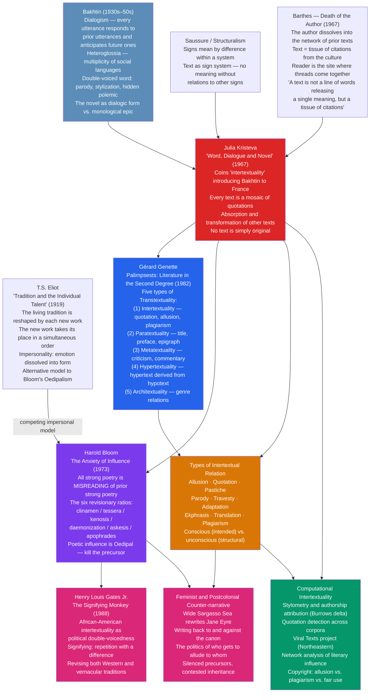

# Intertextuality and Allusion

> [!abstract] TL;DR
> Every text is a mosaic of other texts — Julia Kristeva's 1967 coinage, built on Bakhtin's dialogism, names the condition that no writing is original in the Romantic sense of arising ex nihilo: writers write within and against a tradition, absorbing and transforming prior texts so thoroughly that the boundary between a "new" text and the texts it inhabits dissolves. Genette mapped the five types of transtextual relation with taxonomic precision; Bloom theorized the psychodynamics of poetic influence as an Oedipal struggle with precursors, with six revisionary ratios through which the "ephebe" poet achieves a voice by misreading; Henry Louis Gates Jr. showed that in African-American letters the same dynamic carries political stakes beyond the aesthetic; and computational stylometry can now detect intertextual networks automatically across corpora of millions of texts.

---

## Intuition

**Analogy:** Imagine you are at a dinner party where every guest is continuing a conversation that has been running for centuries. When you speak, you inevitably quote, contradict, echo, or parody things that earlier guests said — and even when you think you are saying something entirely new, you are using a language, deploying idioms, invoking stories, that were all shaped by prior guests you may never have met. There is no position outside the conversation from which to speak. And the meaning of what you say depends not just on your words but on how they resonate, collide, or rhyme with everything said before.

This is the intuition behind intertextuality. A text is not a self-sufficient container of meaning that an author pours full of intention and a reader empties. It is a site where prior texts converge, conflict, and transform — a node in a network that extends backward to every text that influenced it and forward to every text it will influence. The author does not stand outside this network and choose which texts to invoke; she writes from within it. Recognizing this does not reduce the interest of individual works — it multiplies it, because every text becomes readable as a record of its negotiations with the tradition it inhabits.

---

## How It Works



The diagram traces two primary lines of force. The theoretical line runs from Bakhtin (every word carries the residue of prior speakers) through Kristeva (the term "intertextuality" names this condition formally) to its two major systematizations: Genette's taxonomic approach (what *kinds* of relations exist between texts?) and Bloom's psychodynamic approach (what does the *experience* of influence feel like for the poet?). The political line shows how the abstract theoretical concept acquires urgent stakes when applied to traditions whose voices have been suppressed — Gates's theory of signifying and postcolonial counter-narrative practice are not decorations on the theory but transformations of it.

---

## Key Concepts

### Secondary Level

#### What Intertextuality Is: The Romantic Myth and Its Undoing

The Romantic period bequeathed to literary culture a powerful myth of creative originality: the genius creates ex nihilo — out of nothing — through inspiration, individual vision, and the force of a unique inner life. The great poet stands apart from tradition, seeing the world fresh, and what she writes is hers in a deep sense: it expresses her, and no one else could have written it. Copyright law, the cult of the author, the celebrity of literary biography, the entire apparatus of modern literary culture reinforces this myth.

Intertextuality is the sustained theoretical argument that this myth is wrong — or at least, radically incomplete. Not because writers are plagiarists or unoriginal, but because the very materials of literary creation — language, genre, narrative structure, imagery, form — were not invented by any individual writer. They come pre-loaded with history, with the uses that prior writers have made of them. When Shakespeare writes a sonnet, he is writing within and against an entire tradition of Petrarchan sonnet-writing; the sonnet form itself carries the pressure of prior sonnets, and Shakespeare's departure from convention is legible only against that background. When T.S. Eliot opens *The Waste Land* with "April is the cruelest month," he is rewriting Chaucer's *General Prologue*, which opens with April as the month of sweet showers that inspire pilgrimage. The inversion is only meaningful because the source is knowable. Without Chaucer, April is just a month. With Chaucer, April is a civilization's lost faith in renewal.

**Julia Kristeva** coined the term "intertextuality" in her 1967 essay "Word, Dialogue and Novel" (*Mot, Dialogue et Roman*), written as an introduction to Mikhail Bakhtin's work for a French audience. Her formulation: "any text is constructed as a mosaic of quotations; any text is the absorption and transformation of another." This is a stronger claim than "writers sometimes borrow from other writers." It says that there is no text that does not absorb other texts — not because all writers are conscious of their sources, but because the condition of using language is the condition of using language that has already been used by others. Intertextuality is not a technique; it is a structural feature of textuality itself.

The shift Kristeva announces is from the Romantic author (who creates) to the Barthesian author (whose "death" was declared in the same year): if the author's voice is always already a weaving of other voices — a dialogic construction of prior speech — then the author as the origin of meaning dissolves. The reader becomes the site where these multiple threads of prior text come together. Meaning is produced not in the act of writing but in the act of reading, where the reader's own intertextual repository interacts with the text's network of citations.

#### Bakhtin's Foundational Concepts

Kristeva's formulation was a creative reworking — some would say a transformation — of ideas developed by the Russian literary theorist **Mikhail Bakhtin** (1895–1975) in the 1930s and 1940s, most of which were not published or available in the West until the 1960s and later.

**Dialogism** is Bakhtin's central concept: every utterance is a *response* to prior utterances and an *anticipation* of future ones. Language is fundamentally dialogic — not a monologue from a self to a void, but a participation in an ongoing conversation. When you write a sentence, it enters a social space already crowded with prior utterances on the same subject, from the same genre, using the same words. Your sentence takes up a position in this conversation — agreeing, disagreeing, qualifying, parodying, citing — whether you intend it to or not. There is no neutral position.

The **double-voiced word** is Bakhtin's term for utterances that carry more than one voice simultaneously — most commonly through:
- **Stylization**: imitating another's style with the author's own intentions intact alongside it (so both the imitated style and the author's distance from it are audible)
- **Parody**: imitating another's style in order to expose, mock, or subvert it (the imitator's intentions are hostile to those of the imitated)
- **Hidden polemic**: speaking as if addressing a neutral topic while actually engaged in argument with an implied interlocutor (the other voice is there, shaping the text, even though it is never quoted)

**Heteroglossia** (*raznorechie* — "multi-speechedness") names the condition of language in general: any real social language is not a single unified system but a multiplicity of social dialects, professional jargons, generational voices, ideological perspectives, each carrying its own values and worldview. The literary novel, for Bakhtin, is the genre that most fully embraces and orchestrates this heteroglossia — drawing on multiple social languages, setting them in dialogue with each other, refusing to subordinate them to a single authoritative voice. The epic, by contrast, is monological: it speaks from a single authoritative tradition, in the "absolute past," and does not permit dissenting voices to challenge its perspective. This is why Bakhtin privileges the novel over the epic as the more honest literary form.

The consequence for intertextuality: every word in a text has been "inhabited" by prior speakers and carries their uses as sediment. When you write "freedom," the word arrives trailing the associations of every prior use — political, philosophical, commercial, religious. You cannot write a politically innocent sentence using a politically charged word. The word resists your intentions; it brings its history with it. This is why Bakhtin says the word is "half someone else's."

#### Types of Intertextual Relation

The broadest term, **intertextuality**, covers all the ways texts relate to other texts. More specific terms identify different kinds of relation:

| Term | Definition | Example |
|------|-----------|---------|
| **Allusion** | A brief indirect reference to another text, person, or event, enriching meaning through the associations it activates — requires the reader to recognize the reference | Eliot opening *The Waste Land* with a rewriting of Chaucer |
| **Quotation** | Direct citation — the source text's words appear verbatim, usually marked typographically | The epigraphs to *The Waste Land* from Petronius and Dante |
| **Pastiche** | Stylistic imitation of another work, period, or author — often affectionate, without mockery | John Fowles's *The French Lieutenant's Woman* imitating Victorian fiction |
| **Parody** | Imitation that mocks, subverts, or comments critically on the original — requires the reader to recognize the original to get the joke | *Don Quixote* parodying chivalric romance; *Northanger Abbey* parodying Gothic fiction |
| **Travesty** | Rewriting a serious, elevated work in a low or comic mode (the reverse of mock-heroic, which elevates the trivial) | Scarron's *Virgile Travesti* (1648) reducing the *Aeneid* to burlesque |
| **Adaptation** | Transforming one form or medium into another — includes film adaptations, stage adaptations, novelizations | Coppola's *Apocalypse Now* adapting Conrad's *Heart of Darkness* |
| **Ekphrasis** | Verbal description of a visual work of art — a text that takes another text (in a different medium) as its object | Keats's "Ode on a Grecian Urn"; Auden's "Musée des Beaux Arts" |
| **Translation** | Rendering a text in another language — always an act of interpretation and therefore of transformation | Chapman's Homer (which Keats commemorated in a famous sonnet) |

The crucial distinction Kristeva introduces is between **conscious allusion** — where the author intends the reader to recognize the reference, and the reference is semantically significant — and **unconscious intertextuality** — the broader condition she names, in which all texts are inevitably entangled with prior texts regardless of whether the author is aware of it. New Criticism (with its Intentional Fallacy) brackets authorial intent; Kristevan intertextuality goes further: it says the textual network exceeds the author's possible awareness, because language itself exceeds any individual's control of its history.

---

### Undergraduate Level

#### Genette's Five Types of Transtextuality

Gérard Genette's *Palimpsests: Literature in the Second Degree* (*Palimpsestes*, 1982) is the most rigorous systematization of intertextual relations in literary theory. Genette deliberately narrowed Kristeva's broad concept of intertextuality into one sub-type of a larger category he called **transtextuality** — "all that sets the text in a relationship, whether obvious or concealed, with other texts." He distinguished five types:

**1. Intertextuality** (Genette's narrowed version): the actual presence of one text in another — quotation (the most explicit form), allusion (indirect but intended reference), and plagiarism (unacknowledged appropriation). This is the most visible and often most consciously controlled form.

**2. Paratextuality**: the relationship between a text and its paratext — all the elements that surround, present, and frame the text without being strictly part of it: titles, subtitles, prefaces, dedications, epigraphs, notes, illustrations, back-cover copy, interview statements by the author. The paratext is the threshold of the text — the zone of negotiation between text and reader that shapes how the text is received before a word of it is read. When Eliot appended his own notes to *The Waste Land*, the notes became a paratext that transformed the poem's meaning — making its allusions explicit, creating a new layer of self-commentary, and (some argue) partly deflecting criticism by preemptively explaining what might have seemed obscure.

**3. Metatextuality**: one text commenting on another without necessarily citing it — the relationship of literary criticism and commentary to the works it discusses. A review of a novel is metatextually related to the novel. The defining feature is commentary and evaluation; the reference need not be explicit. Metatextuality is the mode of all critical discourse, which presupposes and addresses the texts it analyzes.

**4. Hypertextuality**: this is Genette's most productive and influential category. A **hypertext** is a text derived from an earlier text (the **hypotext**) through either *transformation* (doing something to the original — translation, parody, revision) or *imitation* (doing something *like* the original — pastiche, stylization in the manner of). The palimpsest metaphor captures it exactly: a palimpsest is a parchment that has been scraped and rewritten, leaving traces of the original under the new text. The hypertext is always readable through its hypotext; the hypotext shows through.

The hypertext/hypotext distinction gives Genette his most analytically powerful tool:
- Joyce's *Ulysses* is a hypertext of Homer's *Odyssey* (hypotext): it transforms the epic structure into a single day in Dublin
- Virgil's *Aeneid* is a hypertext of Homer's *Iliad* and *Odyssey* (hypotexts): it imitates both while transforming them for a Roman foundation myth
- John Milton's *Paradise Lost* is a hypertext of classical epic in general and the book of Genesis specifically
- Jean Rhys's *Wide Sargasso Sea* is a hypertext of Charlotte Brontë's *Jane Eyre*: a transformation that gives voice to the silenced Bertha Mason, Rochester's "mad" Creole wife

The productivity of the concept is that it allows precise formal analysis: one can specify not just *that* a hypertext/hypotext relationship exists but *what kind of transformation* has been applied and to what effect.

**5. Architextuality**: the most implicit and generic relationship — the relationship between a text and the genres, literary modes, and sub-types to which it belongs. This is not always stated explicitly (though titles, subtitles, or conventions announce it): when a text is identified as a "lyric," a "tragedy," a "detective novel," or an "epic," this generic designation already places it in a transtextual relationship with every prior work in that genre and activates a set of expectations. The sonnet form carries Petrarchan tradition with it; the detective novel carries the shadow of Poe, Conan Doyle, and Christie. Genre is a form of transtextuality — a relationship with prior texts encoded in the text's own formal conventions.

| Type | Primary Relation | Visibility | Example |
|------|-----------------|-----------|---------|
| Intertextuality | Presence of text in text | High (quotation) to Low (allusion) | Eliot quoting Dante |
| Paratextuality | Text and its threshold | Varies | *Waste Land* notes; epigraphs |
| Metatextuality | Commentary and critique | Explicit or implicit | Literary criticism |
| Hypertextuality | Derivation/transformation | High to very low | *Ulysses* transforming *Odyssey* |
| Architextuality | Genre membership | Usually implicit | Sonnet's Petrarchan inheritance |

#### Bloom's Anxiety of Influence and the Six Revisionary Ratios

Harold Bloom's *The Anxiety of Influence: A Theory of Poetry* (1973) is the most psychologically rich and most controversial account of how poets relate to their precursors. Its central claim is simultaneously simple and disturbing: all strong poetry is a **misreading** (*clinamen* — Bloom borrows the Epicurean term for the random swerve of atoms) of prior strong poetry. The strong poet achieves originality not by being innocent of the tradition but by creatively distorting it — by reading the precursor wrong, deliberately and productively.

Bloom's theoretical framework is explicitly Oedipal: the relationship between the "ephebe" (the young poet) and the "precursor" (the prior strong poet who has shaped the literary landscape) repeats the structure of the son's struggle with the father. The ephebe cannot simply ignore the precursor — the precursor's achievement is already there, already defining the possibilities of the art, already occupying the imaginative space the ephebe wants to inhabit. The only way forward is through: the ephebe must confront, engage, and finally "kill" (misread, transform, distort) the precursor in order to clear imaginative space for his own voice.

The six **revisionary ratios** are six ways in which the ephebe can misread the precursor, each more radical than the last:

| Ratio | Greek/Latin source | What the ephebe does | Mechanism |
|-------|------------------|---------------------|-----------|
| **Clinamen** | Epicurean "swerve" | Swerves away from the precursor at a late point — implies the precursor went wrong | The ephebe's poem appears to correct the precursor's direction |
| **Tessera** | Ancient ritual completion | Completes or "antithesizes" the precursor — implies the precursor stopped too soon | The ephebe's poem extends the precursor to its logical conclusion, which happens to be its opposite |
| **Kenosis** | Greek: emptying | Empties out the precursor's sublimity — appears to be a discontinuity, a failure | The ephebe appears humbled, stripped, but is actually clearing ground |
| **Daemonization** | The daemon, the divine | Counters the precursor's uniqueness by claiming access to a higher power beyond it | The ephebe claims a "counter-sublime" that makes the precursor seem limited |
| **Askesis** | Greek: purification | Purges the precursor's influence by self-curtailment — achieves isolation | The ephebe "solves" influence by refusing the precursor's gifts entirely |
| **Apophrades** | Greek: "return of the dead" | Returns the precursor's spirit — holds the poem open to it | The ephebe's poem so dominates the precursor that the precursor seems to have written the ephebe's poem, not vice versa |

The most productive (and most paradoxical) of these ratios is *apophrades*: when a later poet has so thoroughly absorbed and transformed the precursor that one reads the precursor *through* the later poet's lens. After Milton, it is hard to read classical epic without hearing Milton. After Keats, it is hard to read Milton without hearing Keats. After Tennyson and Browning, it is hard to read Keats without their mediation. The later poet retrospectively colonizes the earlier.

Bloom's theory is explicitly anti-democratic: it applies to "strong" poets — those with genuine originality and power — and not to what he dismissively calls "weak" poets who simply surrender to influence. This produces a canon of the strong, which has been criticized (rightly) for being remarkably homogeneous in race, gender, and cultural tradition.

#### Eliot's Alternative: Tradition as Living Order

T.S. Eliot's essay "Tradition and the Individual Talent" (1919) offers a competing model of literary inheritance that Bloom implicitly argues against throughout *The Anxiety of Influence*. For Eliot, tradition is not a burden to be wrestled with but a living present: the whole of European literature has a "simultaneous order," a spatial rather than temporal arrangement, and when a genuinely new work appears, it alters that order retroactively. The new work does not struggle against tradition; it takes its place within it, modifying the relations between all existing works.

Where Bloom's model is **combative** (the ephebe must defeat the precursor) and **psychologically charged** (the ephebe experiences anxiety, guilt, the desire to kill the father), Eliot's model is **impersonal** (the poet as catalyst, not as self-expressng individual) and **integrative** (tradition absorbs and is modified by new work). Eliot's poet "surrenders" himself to the tradition; Bloom's poet fights his way through it.

The practical difference: Eliot wrote *The Waste Land* as a mosaic of allusions — a poem made of fragments of prior texts (Chaucer, Shakespeare, Spenser, Marvell, Dante, Baudelaire, Wagner, Ovid, Upanishads), held together not by narrative but by emotional and thematic resonance. Bloom would read this as a psychic struggle with all those precursors; Eliot's own account is that the fragments were *shored against ruins* — that the tradition itself becomes a resource for giving form to cultural catastrophe. Same phenomenon, radically different theoretical description.

---

### Graduate Level

#### Henry Louis Gates Jr. and the Theory of Signifying

The most significant political transformation of intertextuality theory in the American academy came from **Henry Louis Gates Jr.**'s *The Signifying Monkey: A Theory of African-American Literary Criticism* (1988). Gates argues that African-American literary tradition has a specific relationship to intertextuality that cannot be captured by Bloom's Oedipal model — because the precursors are not only the canonical European texts that the African-American writer has absorbed but also the vernacular African-American tradition, and the relationship between these two is not one of simple anxiety but of **double-voicedness in the political sense**.

Gates's central concept is **Signifyin(g)** (with a capital S and a silent g at the end, marking its distinctiveness from the standard English "signifying"). Signifyin(g) is a rhetorical practice rooted in African and African-American vernacular culture: it involves repetition with a difference — repeating a prior text, speech act, or tradition in a form that appears to agree with it on the surface but actually subverts, critiques, or transforms it. The trickster figure of the Signifying Monkey (the monkey who uses rhetoric to pit more powerful animals against each other while remaining safe) is Gates's mythological emblem for this practice.

For African-American writers, every act of writing involves a double intertextual negotiation:
1. With the Western canonical tradition (from which Black writers have been systematically excluded, and which has systematically misrepresented or erased Black experience)
2. With the African-American vernacular tradition (oral, musical, folk, shaped by specific historical conditions of slavery, resistance, and survival)

To write in the tradition of Phillis Wheatley, Frederick Douglass, Zora Neale Hurston, Richard Wright, Ralph Ellison, and Toni Morrison is to Signify on all of them simultaneously — to repeat their formal and thematic choices with differences that mark a distinct position, a new moment, a creative advance. Alice Walker writing *The Color Purple* in the epistolary form is Signifying on the European novel of letters while simultaneously revising it for African-American women's experience; the double-voicedness is politically constitutive, not merely aesthetic.

Gates's intervention transformed the study of African-American literature by giving it an account of literary tradition that did not simply map it onto European models of influence but identified its own formal logics. Bloom's *clinamen* becomes, for Gates, a specifically **vernacular* political act — the swerve away from a precursor carries the weight of a history of enforced silence.

#### Feminist Counter-narrative and Writing Back

The postcolonial and feminist traditions developed a practice that complements Gates's theoretical account: **writing back** — producing texts that deliberately and explicitly respond to canonical texts from the position of those the canonical texts silenced, marginalized, or constructed as Other.

The paradigm case is Jean Rhys's *Wide Sargasso Sea* (1966), a hypertext of Charlotte Brontë's *Jane Eyre* (1847). In Brontë's novel, Bertha Mason — the "madwoman in the attic" — is Rochester's first wife, a Creole woman from Jamaica whose madness is presented as a biological inheritance and a moral failure, a dangerous sexuality that must be contained. She is not given a voice, a history, or an interior life. For Rhys, herself a white Creole from Dominica, Bertha's silence in the canonical text is a political fact: the colonial and patriarchal logic of *Jane Eyre* requires that this woman not speak.

*Wide Sargasso Sea* rewrites the novel from Antoinette/Bertha's point of view, set in the Caribbean before the events of *Jane Eyre*. It uses Genette's hypertextual transformation to perform a political intervention: by restoring voice to the silenced woman, by locating the "madness" in a history of colonial violence and exploitation rather than in Bertha's nature, Rhys exposes the ideological work that Brontë's text (and the canonical tradition it represents) performs. Sandra Gilbert and Susan Gubar's *The Madwoman in the Attic* (1979) theorized this kind of revisionary intertextuality within feminist criticism — arguing that women writers have always had to negotiate a tradition that either excluded them or enclosed them in the domestic-mad-monster binary.

The political stakes of intertextuality now become fully visible: **who gets to allude to whom** is not a neutral literary question. When canonical texts construct non-Western, female, queer, or working-class figures as objects rather than subjects — as things to be described rather than voices to be heard — the intertextual tradition carries that construction with it. Every text that alludes to the canon without questioning it perpetuates the canon's politics. Every text that "writes back" — that takes the canonical text as its hypotext and transforms it — is doing something simultaneously literary and political.

#### Computational Intertextuality: Detection, Attribution, and Networks

The theoretical recognition that texts form networks of influence has produced, in the digital age, a family of computational methods for detecting, mapping, and analyzing those networks.

**Stylometry** is the quantitative analysis of style for authorship attribution and influence detection. The most influential method is John Burrows's **Delta** (2002): a measure of the distance between texts based on the frequency of the most common function words (the, of, and, to, a, in, that...). Function words are more stylistically stable than content words and less consciously controlled; their frequency distribution is a reliable stylistic fingerprint. Delta has been used to attribute anonymous or disputed texts (the Federalist Papers, the Junius Letters, *The Cuckoo's Calling*) and to map stylistic similarity networks — which authors write most like which other authors, and how stylistic influence propagates through a tradition.

**Quotation detection** automates the identification of explicit verbal echoes across corpora. The challenge is distinguishing quotation from parallel development: two texts that use the same phrase may be in a quotation relationship, or may both be drawing on a common source, or may be coincident. Modern approaches combine sequence alignment algorithms (adapted from computational biology — the same dynamic programming used for DNA sequence alignment) with probabilistic models. The project with the most literary impact is the **Viral Texts** project at Northeastern University (David Smith and colleagues), which tracked the reprinting and circulation of short texts across millions of pages of 19th-century American and British newspapers, mapping how news items, poetry, and prose migrated across publications with and without attribution. The project revealed that the 19th-century newspaper was a massively intertextual object — texts circulated virally, accumulating variant readings, with no stable "original."

**Network analysis** of literary influence treats texts as nodes and intertextual relationships as edges, and asks structural questions: which texts are most central to the network (most cited, most frequently the hypotext)? Are there clusters of tightly interconnected texts that form canonical sub-traditions? How does influence flow through the network over time — are there texts that connect otherwise separate traditions? These questions are now tractable on corpora of thousands of texts, producing empirical literary historiography that complements close reading.

**The copyright dimension** makes computational intertextuality practically significant beyond the academy: when is an intertextual relationship close enough to constitute plagiarism or copyright infringement? The legal standard is not stylometric but qualitative — the test is whether "protectable expression" was copied, not whether stylistic similarity is high. But the boundary between allusion (legal, valued), pastiche (legal, valued), and plagiarism (illegal) is not algorithmically determinable. The 2015 decision in *Blurred Lines* (Pharrell Williams and Robin Thicke successfully sued for appropriating Marvin Gaye's *Got to Give It Up*) was widely criticized by musicians and musicologists on the grounds that it criminalized influence — which, under any serious theory of intertextuality, is the condition of all creative work.

---

## Python Demo

```python
# Intertextuality Detection and Bloom's Anxiety of Influence — simulation
#
# Part 1: Five fictional texts as bag-of-words vectors (15-dimensional vocabulary space).
#   Pairwise cosine similarity identifies intertextual relationships.
#   Visualize: (1) 5x5 similarity heatmap; (2) intertextuality network (edge width ∝ similarity).
#
# Part 2: Bloom's Anxiety of Influence simulation.
#   An "ephebe" text begins as a pure copy of its precursor (cosine sim = 1.0).
#   Over 10 "misreadings" it diverges through perturbation + directional drift.
#   Bloom's 6 revisionary ratios are annotated at evenly spaced steps.
#
# Only numpy and matplotlib used.

import numpy as np
import matplotlib
matplotlib.use("Agg")
import matplotlib.pyplot as plt

RNG = np.random.default_rng(1967)   # Kristeva coined "intertextuality" in 1967

# ── 15-dimensional vocabulary space ──────────────────────────────────────────
VOCAB = [
    "journey/quest",        # 0
    "heroic_action",        # 1
    "sea/voyage",           # 2
    "divine_intervention",  # 3
    "return_home",          # 4
    "urban_modernity",      # 5
    "fragmentation",        # 6
    "classical_myth",       # 7
    "love/desire",          # 8
    "war/conflict",         # 9
    "death/underworld",     # 10
    "founding/empire",      # 11
    "alienation",           # 12
    "allusive_citation",    # 13
    "language/form",        # 14
]

# Five fictional texts as term-weight vectors, designed to reflect
# known intertextual relationships in the Western canonical tradition:
#   A = "Epic Source"     (Homer-like: journey, heroism, sea, gods, war)
#   B = "Founding Epic"   (Virgil-like: rewrites A with empire, founding)
#   C = "Modern Rewrite"  (Joyce-like: maps A onto urban modernity, allusion)
#   D = "Lyric Fragment"  (Eliot-like: fragmented, allusive, multi-sourced)
#   E = "Postmod Pastiche"(contemporary: draws on D's modernist technique)

TEXT_VECTORS = {
    "A: Epic Source":       np.array([0.9, 0.9, 0.8, 0.8, 0.9, 0.0, 0.0, 0.7, 0.4, 0.8, 0.6, 0.2, 0.0, 0.1, 0.2]),
    "B: Founding Epic":     np.array([0.8, 0.8, 0.6, 0.7, 0.7, 0.0, 0.0, 0.8, 0.4, 0.9, 0.5, 0.9, 0.0, 0.3, 0.2]),
    "C: Modern Rewrite":    np.array([0.7, 0.5, 0.5, 0.3, 0.7, 0.9, 0.7, 0.7, 0.6, 0.3, 0.4, 0.2, 0.8, 0.7, 0.9]),
    "D: Lyric Fragment":    np.array([0.3, 0.2, 0.4, 0.4, 0.2, 0.6, 0.9, 0.8, 0.5, 0.5, 0.7, 0.3, 0.7, 0.9, 0.8]),
    "E: Postmod Pastiche":  np.array([0.4, 0.3, 0.3, 0.3, 0.3, 0.7, 0.8, 0.5, 0.7, 0.4, 0.5, 0.4, 0.8, 0.8, 0.7]),
}

text_names = list(TEXT_VECTORS.keys())
n_texts = len(text_names)

# Normalize each vector to unit length for cosine similarity
raw_matrix = np.array([TEXT_VECTORS[k] for k in text_names])
norms = np.linalg.norm(raw_matrix, axis=1, keepdims=True)
unit_matrix = raw_matrix / norms

# Compute full pairwise cosine similarity matrix
sim_matrix = unit_matrix @ unit_matrix.T

THRESHOLD = 0.65   # cosine similarity above which we draw an intertextual edge

# ── Bloom's Anxiety of Influence: 6 revisionary ratios over 10 misreadings ───
BLOOM_RATIOS = [
    ("clinamen",       "swerve from\nprecursor"),
    ("tessera",        "completion /\nantithesis"),
    ("kenosis",        "emptying out\nof precursor"),
    ("daemonization",  "counter-\nsublime"),
    ("askesis",        "purgation /\nself-curtailment"),
    ("apophrades",     "return of\nprecursor's ghost"),
]
N_MISREADINGS = 10

# Precursor = "Epic Source" (unit-normalized)
precursor = unit_matrix[0].copy()

# Drift direction: partially orthogonal to precursor (models creative divergence,
# not just noise — the ephebe moves toward a new imaginative space, not randomly)
drift_raw = RNG.normal(0, 1, len(precursor))
drift_raw -= np.dot(drift_raw, precursor) * precursor * 0.6   # partial orthogonalization
drift_direction = drift_raw / (np.linalg.norm(drift_raw) + 1e-12)

ephebe = precursor.copy()
divergence_curve = [1.0]   # step 0: perfect imitation of precursor

for step in range(N_MISREADINGS):
    noise_scale = 0.05 + step * 0.009   # perturbation grows as ephebe gains confidence
    noise = RNG.normal(0, noise_scale, len(precursor))
    ephebe = ephebe + drift_direction * 0.07 + noise
    ephebe = np.clip(ephebe, 0.0, 2.0)
    ephebe /= (np.linalg.norm(ephebe) + 1e-12)
    divergence_curve.append(float(np.dot(ephebe, precursor)))

steps = np.arange(N_MISREADINGS + 1)
# Map 6 Bloom ratios to steps 2,3,5,6,8,10 (spaced across the divergence curve)
bloom_steps = [int(round(i * N_MISREADINGS / 6)) for i in range(1, 7)]

# ── Plotting ──────────────────────────────────────────────────────────────────
fig = plt.figure(figsize=(16, 10))
gs  = fig.add_gridspec(2, 2, hspace=0.44, wspace=0.28)
ax_heat  = fig.add_subplot(gs[0, 0])
ax_net   = fig.add_subplot(gs[0, 1])
ax_bloom = fig.add_subplot(gs[1, :])

fig.suptitle(
    "Intertextuality Detection and Bloom's Anxiety of Influence\n"
    "Five fictional texts as 15-dimensional bag-of-words vectors",
    fontsize=12, fontweight="bold"
)

# ── Panel A: Cosine similarity heatmap ───────────────────────────────────────
short_labels = ["A: Epic\nSource", "B: Founding\nEpic", "C: Modern\nRewrite",
                "D: Lyric\nFrag.", "E: Postmod\nPastiche"]
im = ax_heat.imshow(sim_matrix, cmap="YlOrRd", vmin=0, vmax=1, aspect="auto")
ax_heat.set_xticks(range(n_texts))
ax_heat.set_yticks(range(n_texts))
ax_heat.set_xticklabels(short_labels, fontsize=7.5)
ax_heat.set_yticklabels(short_labels, fontsize=7.5)
ax_heat.set_title("A. Intertextuality Matrix\n(pairwise cosine similarity)", fontsize=10)
for i in range(n_texts):
    for j in range(n_texts):
        v = sim_matrix[i, j]
        ax_heat.text(j, i, f"{v:.2f}", ha="center", va="center",
                     fontsize=8.5, color="white" if v > 0.75 else "black")
fig.colorbar(im, ax=ax_heat, fraction=0.046, pad=0.04, label="Cosine Similarity")

# ── Panel B: Intertextuality network ─────────────────────────────────────────
angles = np.linspace(0, 2 * np.pi, n_texts, endpoint=False)
pos    = np.column_stack([np.cos(angles), np.sin(angles)])
node_colors = ["#2c3e7a", "#4a6845", "#7a2c2c", "#7a5c2c", "#44506a"]

for i in range(n_texts):
    for j in range(i + 1, n_texts):
        sim = sim_matrix[i, j]
        if sim >= THRESHOLD:
            lw    = (sim - THRESHOLD) * 14
            color = ("#dc2626" if sim > 0.85 else
                     ("#d97706" if sim > 0.75 else "#5b8db8"))
            ax_net.plot([pos[i, 0], pos[j, 0]], [pos[i, 1], pos[j, 1]],
                        "-", color=color, lw=lw, alpha=0.65, zorder=1)
            mid = (pos[i] + pos[j]) / 2
            ax_net.text(mid[0], mid[1], f"{sim:.2f}", fontsize=6.0,
                        ha="center", va="center", color="dimgray")

for i in range(n_texts):
    ax_net.scatter(pos[i, 0], pos[i, 1], s=480, color=node_colors[i],
                   zorder=3, edgecolors="white", linewidths=1.5)
    offset = pos[i] * 0.40
    ax_net.text(pos[i, 0] + offset[0], pos[i, 1] + offset[1],
                short_labels[i], ha="center", va="center",
                fontsize=7, fontweight="bold", color="white",
                bbox=dict(boxstyle="round,pad=0.2", fc=node_colors[i],
                          ec="none", alpha=0.88))

ax_net.set_xlim(-1.75, 1.75)
ax_net.set_ylim(-1.75, 1.75)
ax_net.set_title(f"B. Intertextuality Network\n(edges: cosine sim ≥ {THRESHOLD}; "
                 "width ∝ similarity)", fontsize=10)
ax_net.axis("off")
ax_net.text(-1.70, -1.60,
            "red = sim > 0.85  (strong hypertextual link)\n"
            "orange = 0.75–0.85  (explicit allusion)\n"
            "blue = 0.65–0.75  (loose intertextual echo)",
            fontsize=6.5, color="gray")

# ── Panel C: Bloom's anxiety of influence curve ───────────────────────────────
ax_bloom.plot(steps, divergence_curve, "o-", color="#2c3e7a", lw=2.5, ms=7, zorder=3)
ax_bloom.fill_between(steps, divergence_curve, 0, alpha=0.10, color="#2c3e7a")
ax_bloom.axhline(1.0, color="gray", ls=":", lw=1.0, alpha=0.5,
                  label="Pure imitation — sim = 1.0 (ephebe = precursor)")
ax_bloom.axhline(divergence_curve[-1], color="#dc2626", ls="--", lw=1.2, alpha=0.65,
                  label=f"Achieved voice — final sim = {divergence_curve[-1]:.2f}")

for k, (bs, (ratio, description)) in enumerate(
        zip(bloom_steps, BLOOM_RATIOS)):
    y_val = divergence_curve[bs]
    ax_bloom.axvline(bs, color="#d97706", ls="--", lw=0.9, alpha=0.40)
    # Alternate annotations above and below the curve to reduce overlap
    y_offset = 0.09 if k % 2 == 0 else -0.14
    ax_bloom.annotate(
        f"{k+1}. {ratio}\n{description}",
        xy=(bs, y_val),
        xytext=(bs + 0.05, y_val + y_offset),
        fontsize=6.5, color="#5c3a00",
        arrowprops=dict(arrowstyle="-", color="#d97706", lw=0.7)
    )

ax_bloom.set_xlabel("Misreading generation  (0 = pure imitation;  10 = achieved poetic voice)",
                     fontsize=10)
ax_bloom.set_ylabel("Cosine similarity to precursor\n(Epic Source)", fontsize=10)
ax_bloom.set_title(
    "C. Bloom's Anxiety of Influence — Six Revisionary Ratios\n"
    "The ephebe begins as a copy of the precursor and achieves identity through"
    " successive creative misreadings",
    fontsize=10
)
ax_bloom.set_xlim(-0.3, N_MISREADINGS + 0.5)
ax_bloom.set_ylim(-0.05, 1.22)
ax_bloom.legend(fontsize=9, loc="upper right")
ax_bloom.grid(alpha=0.3)

plt.savefig("intertextuality_analysis.png", dpi=130, bbox_inches="tight")
print("Saved: intertextuality_analysis.png")

# ── Console report ────────────────────────────────────────────────────────────
print("\n=== Intertextuality Detection (cosine sim matrix) ===")
print(f"Vocabulary dimensions : {len(VOCAB)}")
print(f"Texts analyzed        : {n_texts}")
print(f"Intertextual threshold: {THRESHOLD}\n")
header = f"{'Pair':<40}  {'Sim':>6}  Type"
print(header)
print("-" * 70)
for i in range(n_texts):
    for j in range(i + 1, n_texts):
        sim = sim_matrix[i, j]
        if sim >= THRESHOLD:
            rel = ("strong hypertextual link" if sim > 0.85 else
                   "explicit allusion"        if sim > 0.75 else
                   "loose intertextual echo")
            pair = f"{text_names[i][:20]}  <->  {text_names[j][:20]}"
            print(f"{pair:<42}  {sim:>5.3f}  {rel}")

print("\n=== Bloom's Anxiety of Influence ===")
print(f"Precursor : {text_names[0]}")
print(f"Step  0 (pure imitation) : cosine sim = {divergence_curve[0]:.3f}")
print(f"Step {N_MISREADINGS:>2} (achieved voice)  : cosine sim = {divergence_curve[-1]:.3f}")
print(f"Net divergence           : {divergence_curve[0] - divergence_curve[-1]:.3f}")
print()
for k, (bs, (ratio, desc)) in enumerate(zip(bloom_steps, BLOOM_RATIOS)):
    print(f"  Step {bs:>2} — {ratio:<18}: sim = {divergence_curve[bs]:.3f}"
          f"  ({desc.strip()})")
```

**What the simulation shows:**

- **Panel A (heatmap)**: The cells reveal the structure of the intertextual network. A and B share high similarity — the Founding Epic is a close transformation of the Epic Source (as Virgil is of Homer). A and C are moderately similar — the Modern Rewrite carries the epic skeleton into modernity (as *Ulysses* maps the *Odyssey* onto Dublin). D and E share high similarity — both participate in the modernist-fragmentation aesthetic. The off-diagonal cells that are darkest (high similarity between non-adjacent texts) are precisely the intertextual links that a literary historian would document.

- **Panel B (network)**: The edges encode the intertextual topology. The Epic Source (A) connects strongly to the Founding Epic (B) — a hypertextual link. The Modern Rewrite (C) connects to the Epic Source through transformation. The Lyric Fragment (D) and Postmodern Pastiche (E) form a cluster — a later tradition drawing on a shared modernist inheritance. The network makes visible at a glance what takes literary history many pages to document.

- **Panel C (divergence curve)**: The ephebe's cosine similarity to the precursor falls monotonically across 10 misreadings, with the six revisionary ratios annotated at the points where the divergence accelerates or changes character. The final similarity is substantially below 1.0 — the achieved voice is recognizably its own — but the precursor has not disappeared: it shows through the palimpsest, its traces still legible in the thematic and formal continuities that the cosine similarity measures.

---

## Real-World Applications

> **Example 1 — Joyce's *Ulysses* as Hypertext of Homer's *Odyssey*:** Genette's hypertextual relation is nowhere more extensively documented than in the relationship between James Joyce's *Ulysses* (1922) and Homer's *Odyssey* (8th c. BCE). Joyce mapped each of the 18 episodes of *Ulysses* onto a corresponding episode in the *Odyssey* — Bloom's breakfast corresponds to Calypso, the newspaper office to the Cave of the Winds (Aeolus), the library to Scylla and Charybdis, the maternity hospital to the Oxen of the Sun. These correspondences were not published in the novel but were provided to Stuart Gilbert, who built the first scholarly guide to the work from Joyce's own schema. The *Odyssey* is the hypotext; it does not appear in *Ulysses* (mostly), but it structures every episode. Once the hypertextual relation is understood, every Bloom-Odysseus parallel becomes readable as a comment on heroism, modernity, and the degradation of the mythic into the mundane — or, conversely, as an elevation of the mundane into the mythic. Without Homer, *Ulysses* is a stream-of-consciousness record of a Dublin day; with Homer, it is a meditation on Western civilization.

> **Example 2 — T.S. Eliot's *The Waste Land* as Mosaic of Quotations:** Eliot's 1922 poem enacts Kristeva's theoretical formulation before she made it. The poem opens by rewriting Chaucer, contains lines in German (from Wagner's *Tristan und Isolde*), direct quotation from Dante and Shakespeare, allusion to Marvell, Spenser, Ovid, Virgil, Baudelaire, the *Upanishads*, Middleton, Webster, and Verlaine — among others. The notes Eliot appended identified many (but not all) sources, making the poem self-consciously paratextual as well. Reading *The Waste Land* as a text requires reading it as a *network* of texts: each fragment activates its source as context, and the collision between the sources (Dante's Hell vs. Madame Sosostris's Tarot cards; the Sermon on the Mount vs. a Thames typist's sexual transaction) is itself the poem's primary rhetorical device. The "fragments" Eliot shores "against ruins" are quotations — he is literally building from prior texts, not from original observation of the world.

> **Example 3 — Virgil's *Aeneid* and the Politics of Hypertextuality:** Virgil's *Aeneid* (29–19 BCE) is a systematic hypertextual rewriting of both Homeric epics, transposed into a Roman key. The first six books parallel the *Odyssey* (the wanderings of Aeneas from Troy), the last six parallel the *Iliad* (the war in Latium). This is not plagiarism but *imitation as legitimation*: by demonstrating that Roman epic could match and in some ways surpass its Greek models, Virgil was claiming cultural parity for Rome with Greece — and embedding Roman imperial ideology within the most prestigious literary form available. The hypotext (Homer) guarantees the cultural authority of the hypertext (Virgil) while the transformation (Roman values replace Homeric Greek ones) does the ideological work. This is precisely why later European epics — *Paradise Lost*, *The Divine Comedy*, *Os Lusíadas* — could not avoid engaging with Virgil: the hypertextual chain carries its politics with it.

> **Example 4 — Hip-Hop Sampling as Sonic Intertextuality:** Hip-hop's practice of sampling — incorporating recognizable fragments of prior recordings into new compositions — is the most contested form of intertextuality in contemporary culture because it makes the legal stakes of allusion explicit. When Public Enemy sampled James Brown, when the Beastie Boys sampled Led Zeppelin, when Jay-Z built *The Black Album* from samples of dozens of prior recordings, they were performing the same operation that Eliot performed with his literary quotations: incorporating the authority, affect, and recognition-value of prior texts into a new context that transforms their meaning. The crucial difference is copyright law: Eliot could quote Dante without permission because Dante's texts were in the public domain; hip-hop producers discovered through a series of litigations in the 1990s that even two-second samples required licensing. The legal framework that governs musical intertextuality effectively prices out the kind of mosaic construction that literary intertextuality has always permitted — with consequences for which musical traditions can afford to engage in it.

> **Example 5 — The Viral Texts Project: Intertextuality at Scale:** The Viral Texts project (Northeastern University, directed by David Smith and Northeastern's NULab) has used sequence-alignment algorithms to trace the reprinting and adaptation of texts across a corpus of over 41 million newspaper pages from the 19th-century US and British press. The project found that hundreds of thousands of poems, news items, jokes, and anecdotes were reprinted across dozens or hundreds of newspapers, often with minor variations introduced by re-composition from memory or deliberate local adaptation. The result is a massive empirical map of 19th-century textual circulation — showing that no text in that period existed as a stable, bounded object but was always already in multiple versions, circulating across media, accumulating variant readings. Kristeva's "mosaic of quotations" turns out to be literally true of the 19th-century newspaper: it was constructed from reprinted material, attributed or not, borrowed and transformed. The digital humanities have given theoretical intertextuality its empirical apparatus.

---

## Common Pitfalls

- **Conflating Kristeva's structural intertextuality with the thematic study of allusions** — Kristeva's concept is broader and more radical than allusion-spotting. She is not saying that writers consciously reference prior texts; she is saying that no text can be written without absorbing prior texts, whether the writer is aware of it or not. Allusion hunting — identifying sources and analogues — is a legitimate scholarly activity, but it operates at the level of conscious or reconstructible intention. Kristevan intertextuality operates at the level of the language itself: every word carries its prior uses as sediment. Treating intertextuality as just a fancy word for "references" evacuates its theoretical content.

- **Using Bloom's revisionary ratios as a taxonomy of literary history** — Bloom's six ratios are psychoanalytic abstractions, not historical descriptions. He is describing how influence *feels* from the inside — the psychic mechanisms by which a poet processes and transforms the anxiety of having a powerful precursor. Using the ratios as a historical classification scheme (Milton's relationship to Spenser is *kenosis*, Keats's relationship to Milton is *daemonization*) treats phenomenological descriptions as objective categories, which Bloom's own theoretical framework does not support. The ratios are heuristics for reading, not diagnostic boxes.

- **Assuming all intertextual relations are intentional on the author's part** — The most interesting intertextual relationships are often those the author did not consciously construct. A novelist who has read widely in the Gothic tradition may produce Gothic effects without intending to; the structural parallels between her villain and Heathcliff may be more informative about literary history than her conscious allusions. The distinction between *influence* (the prior text has shaped the later text without necessarily being cited) and *allusion* (the prior text is invoked deliberately) is crucial: conflating them by treating all intertextual relations as deliberate choices misrepresents the way literary tradition actually works.

- **The intentional fallacy in reverse: privileging source-hunting over textual meaning** — New Criticism's Intentional Fallacy (Wimsatt and Beardsley, 1946) warned against reading authorial intention as the determinant of textual meaning. Intertextual criticism can commit the reverse error: treating the identification of sources as itself the interpretive act, as if knowing that Eliot borrowed a line from Marvell settles the question of what it means in its new context. The source is the beginning, not the end, of the interpretive problem. The relevant question is: what does the allusion *do* — how does the collision of contexts produce meaning that neither text could produce alone?

- **Applying Genette's taxonomy mechanically without asking what it reveals** — The hypertextuality category is only analytically useful if the analyst pursues the specific transformation that has been performed. Noting that *Ulysses* is a hypertext of the *Odyssey* is the start of the analysis; the work is in specifying the nature of the transformation (ironic reduction? elevation? parallel structure with inversion?) and what that transformation reveals about modernity, heroism, or the possibility of epic in the 20th century. The taxonomy is a research tool, not a research result.

- **Treating postcolonial "writing back" as merely reactive** — Works like *Wide Sargasso Sea*, *Midnight's Children*, or *Things Fall Apart* are often described as "responses to" or "critiques of" canonical texts (*Jane Eyre*, *A Passage to India*, *Heart of Darkness*). This framing is accurate but incomplete: it defines these works primarily by their relationship to a Western canon they contest, which reproduces the very hierarchy they are working against. Chinua Achebe's *Things Fall Apart* is not simply a rebuttal of Conrad; it is a novel with its own internal coherence, Igbo cosmology, and narrative logic that does not require Conrad to make sense. The intertextual relationship with *Heart of Darkness* is one dimension of a work that exceeds it.

- **Confusing paratextuality with intertextuality** — Genette's distinctions are designed precisely to prevent this confusion. The epigraph to *The Waste Land* (from Petronius) is a paratextual element — it frames the text, shapes its reception, but is not directly present *in* the poem. The allusions to Dante, Shakespeare, and Marvell *within* the poem are intertextual in Genette's narrow sense. The distinction matters because it tracks different mechanisms of meaning production: the paratextual frame operates on the reader's expectations before reading; the intertextual reference operates on meaning as it is being produced line by line.

---

## Related Concepts

- [[Poststructuralism_and_Deconstruction]] — Kristeva's intertextuality is the operationalization of Barthes's Death of the Author: if the author's voice is always already a weaving of prior voices, the author as sovereign origin of meaning dissolves; Derrida's concept of the *trace* (every sign carries traces of the signs it differs from) is the semiotic foundation on which intertextuality rests; the two concepts are mutually dependent

- [[Structuralism_and_Narratology]] — Genette's taxonomy of transtextuality is a direct extension of his narratological project (systematizing the formal relationships possible between texts); Barthes's five narrative codes in *S/Z* are intertextual categories at the level of the sentence; the structuralist project of identifying literary grammars necessarily involves intertextual comparison across the corpus from which the grammar is abstracted

- [[New_Criticism_and_Close_Reading]] — New Criticism's Intentional Fallacy (excluding authorial intention from interpretation) and Affective Fallacy (excluding reader response) clear the space that intertextuality fills with a different account of meaning: not the author's intention and not the reader's emotion, but the text's network of relations with other texts; intertextual reading is a development and complication of close reading, not its replacement

- [[Feminist_and_Queer_Literary_Theory]] — feminist and postcolonial counter-narrative practice — *Wide Sargasso Sea*, *The Color Purple*, *Beloved* — is applied intertextuality: using hypertextual transformation to restore voices and perspectives that the canonical hypotext suppressed; Gates's theory of Signifying systematizes this practice for African-American literature and demonstrates that intertextuality is always politically situated

- [[Literary_Theory_Overview]] — intertextuality sits at the intersection of structuralist, poststructuralist, and reader-response traditions; understanding its theoretical genealogy (Bakhtin → Kristeva → Genette/Bloom → Gates) maps the entire development of literary theory from the 1960s through the 1990s

- [[Discourse_Analysis]] — Bakhtin's dialogism (every utterance is a response to prior utterances) is the conceptual foundation shared by intertextuality theory and discourse analysis; Critical Discourse Analysis's attention to how texts reproduce or contest ideological formations is an extension of the political dimension of intertextual reading that Gates and postcolonial critics develop

- [[Ancient_Literature_and_Epic]] — the epic tradition is the paradigm case for studying hypertextuality: the *Iliad* and *Odyssey* as hypotexts for Virgil's *Aeneid*, which is hypotext for Dante, Tasso, Camões, Milton, and Walcott; the entire Western epic tradition is a sustained intertextual project in which each poem reads, transforms, and legitimates itself through its predecessors

- [[Classical_Literature_Greece_and_Rome]] — the Greek-to-Roman transmission (Homer to Virgil, Greek tragedy to Seneca, Greek philosophy to Roman rhetoric) is the foundational instance of deliberate hypertextual transformation in Western literary history; Roman literary culture was self-consciously intertextual in a way Greek culture (having no comparable predecessor tradition to engage) was not

- [[Corpus_Linguistics]] — corpus methods — frequency analysis, collocation, n-gram matching — are the technical substrate of computational intertextuality; quotation detection and viral text tracking apply corpus-scale pattern matching to the literary and journalistic archive; stylometry (Burrows's Delta, most-frequent-word analysis) operationalizes the concept of style as a fingerprint that connects texts across traditions

---

## Review Questions

### Secondary

1. Kristeva says that "any text is a mosaic of quotations." She does not mean that writers always copy from other writers — she means something more fundamental about the nature of language itself. Using a book, film, or song you know well, describe three ways in which it draws on or echoes prior texts. Then explain: is each of these examples an intentional allusion, or might some of them be the kind of "unconscious intertextuality" Kristeva is describing? What is the difference between these two kinds of textual relation?

2. Harold Bloom argues that all strong poets must "misread" their precursors in order to achieve their own voice. Using the analogy of a musician who starts out imitating a favorite artist and gradually develops a distinctive style: in what sense does every musician both learn from and diverge from their influences? What would it mean for a musician to be completely dominated by their influence, and what would it mean to have "killed" the precursor? Does Bloom's framework apply to music as well as poetry?

3. Genette distinguishes five kinds of transtextual relationship. Consider a film adaptation of a novel you know. Which of Genette's five types is the adaptation? What exactly has the adaptor transformed, and what has been preserved? Would Genette's term "hypertext" be a useful description? What does it reveal about the relationship that "adaptation" alone does not capture?

### Undergraduate

1. Eliot's "Tradition and the Individual Talent" and Bloom's *The Anxiety of Influence* offer competing models of how poets relate to prior poetry. Eliot emphasizes impersonality and the integration of new work into a living simultaneous order of tradition; Bloom emphasizes the Oedipal psychodrama by which the ephebe achieves originality through misreading. Apply both models to a specific case — the relationship between Keats and Milton, or between Toni Morrison and Faulkner, or between a poet you know well and their acknowledged precursor. Which model captures more of what is actually happening in the texts? What does the competing model illuminate that the favored model misses?

2. Henry Louis Gates Jr.'s theory of Signifying argues that African-American literary intertextuality is a form of political double-voicedness — repeating prior texts with a difference that enacts both cultural continuity and critique. Compare this framework with Bloom's theory of influence. What does the concept of Signifying reveal that Bloom's Oedipal model cannot capture? Is the difference purely a matter of which texts are being analyzed, or does it reveal a limitation in Bloom's universalizing claims? Use at least one specific text in your analysis.

3. Genette's category of **hypertextuality** requires specifying both the *nature* of the transformation (what has been changed?) and its *mode* (transformation vs. imitation?). Choose two works in a clear hypotext/hypertext relationship — *Ulysses* and the *Odyssey*, *Wide Sargasso Sea* and *Jane Eyre*, *Apocalypse Now* and *Heart of Darkness*, *Clueless* and *Emma* — and analyze the transformation in Genette's terms. What does the transformation *do* — what does it reveal about the hypotext that the hypotext conceals, or what contemporary concerns does it import into the classical framework?

### Graduate

1. The computational stylometry approach (Burrows's Delta, network analysis of literary influence, the Viral Texts project) offers an empirical approach to intertextuality: measurable stylistic distance between texts, automated detection of verbal echoes, quantified influence networks. What are the interpretive limits of these methods? Specifically: what can they detect that close reading misses, and what does close reading detect that stylometric distance cannot capture? Is the computational approach a supplement to, or a competitor with, theoretical intertextuality as Kristeva, Genette, and Bloom describe it?

2. The *Blurred Lines* copyright case (2015) found that Pharrell Williams and Robin Thicke had infringed Marvin Gaye's copyright by producing a song that had the same "feel" as *Got to Give It Up*, even though no specific notes or lyrics were copied. The decision alarmed musicians and musicologists who argued it effectively criminalized stylistic influence — which, under any serious account of intertextuality, is the condition of all musical creation. Drawing on Kristeva's structural intertextuality, Genette's distinction between transformation and imitation, and Gates's theory of Signifying, construct an argument for where the legal/ethical line between impermissible appropriation and legitimate intertextual practice should be drawn. What would a legally coherent theory of intertextuality look like? Where would it leave hip-hop sampling?

3. Bloom's theory of the anxiety of influence has been criticized from several directions: by feminist critics (it naturalizes a male Oedipal psychodrama and excludes women's literary tradition); by postcolonial critics (it assumes a single canonical tradition against which strong poets struggle, erasing non-Western literary systems); by New Historicists (it aestheticizes a social and material process of literary transmission and reception). Select two of these critiques and develop each at its strongest. Then defend Bloom: what is the irreducible theoretical insight in his model that the critiques cannot dissolve? Does a revised Bloomian model that addresses these critiques remain coherent, or does the revisionary project destroy the theory it sought to improve?

---

## Sources

- [Kristeva, J. (1967/1980). "Word, Dialogue and Novel." In *Desire in Language: A Semiotic Approach to Literature and Art* (trans. T. Gora, A. Jardine, L.S. Roudiez). Columbia University Press](https://cup.columbia.edu/book/desire-in-language/9780231048071)
- [Bakhtin, M.M. (1981). *The Dialogic Imagination: Four Essays* (trans. C. Emerson & M. Holquist). University of Texas Press](https://utpress.utexas.edu/9780292715340/) — Contains "Discourse in the Novel," the most important theoretical essay for intertextuality
- [Genette, G. (1982/1997). *Palimpsests: Literature in the Second Degree* (trans. C. Newman & C. Doubinsky). University of Nebraska Press](https://www.nebraskapress.unl.edu/university-of-nebraska-press/9780803215283/) — The definitive taxonomy of transtextual relations
- [Bloom, H. (1973). *The Anxiety of Influence: A Theory of Poetry*. Oxford University Press](https://global.oup.com/academic/product/the-anxiety-of-influence-9780199802098) — The six revisionary ratios; remains the most influential psychodynamic account of literary inheritance
- [Eliot, T.S. (1919). "Tradition and the Individual Talent." *The Egoist*, and reprinted in *The Sacred Wood* (1920)](https://www.poetryfoundation.org/articles/69400/tradition-and-the-individual-talent)
- [Barthes, R. (1967/1977). "The Death of the Author." In *Image–Music–Text* (trans. S. Heath). Fontana Press](https://us.macmillan.com/books/9780374521523/imagemusictext)
- [Gates, H.L., Jr. (1988). *The Signifying Monkey: A Theory of African-American Literary Criticism*. Oxford University Press](https://global.oup.com/academic/product/the-signifying-monkey-9780195060751)
- [Allen, G. (2000). *Intertextuality*. Routledge New Critical Idiom series](https://www.routledge.com/Intertextuality/Allen/p/book/9780415174558) — Best single-volume introduction; covers Kristeva, Bakhtin, Genette, Bloom, and postcolonial applications
- [Clayton, J. & Rothstein, E. (eds.) (1991). *Influence and Intertextuality in Literary History*. University of Wisconsin Press](https://uwpress.wisc.edu/books/0421.htm)
- [Gilbert, S.M. & Gubar, S. (1979). *The Madwoman in the Attic: The Woman Writer and the Nineteenth-Century Literary Imagination*. Yale University Press](https://yalebooks.yale.edu/book/9780300084580/the-madwoman-in-the-attic/)
- [Smith, D.A., Cordell, R. & Mullen, A. (2015). "Computational Methods for Uncovering Reprinted Texts in Antebellum Newspapers." *American Literary History*, 27(3)](https://doi.org/10.1093/alh/ajv035) — The Viral Texts project methodology
- [Burrows, J. (2002). "'Delta': A Measure of Stylistic Difference and a Guide to Likely Authorship." *Literary and Linguistic Computing*, 17(3), 267–287](https://doi.org/10.1093/llc/17.3.267) — The founding paper of modern stylometry
- [Juola, P. (2006). "Authorship Attribution." *Foundations and Trends in Information Retrieval*, 1(3), 233–334](https://doi.org/10.1561/1500000005)
- [Genette, G. (1972/1980). *Narrative Discourse: An Essay in Method* (trans. J.E. Lewin). Cornell University Press](https://www.cornellpress.cornell.edu/book/9780801492396/narrative-discourse/) — The narratological context for Genette's transtextual taxonomy

---

#LiteratureRhetoric #ReadingInterpretation #Intertextuality
